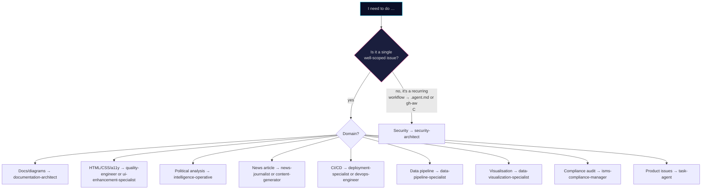

# 🤖 `.github/agents/` — Copilot Agent Catalog

This directory contains **24 agent files** for GitHub Copilot and GitHub Agentic Workflows. It is the single source of truth for every agent persona used across the repository.

> **Canonical long-form catalog:** see [`AGENTS.md`](../../AGENTS.md) at the repository root for full capability matrices, skill-mapping tables, and invocation examples.
> **Workflow prompt imports** (not agent files): see [`.github/prompts/README.md`](../prompts/README.md).

---

## 📋 Two kinds of file live here

gh-aw distinguishes two ways to package a reusable persona. Both live in this directory, but they are used for different things.

| Kind | Filename convention | Frontmatter shape | Used by |
|------|--------------------|-------------------|---------|
| **Persona agent** (Copilot Agent File) | `<name>.md` | `name`, `description`, `tools: ["*"]` | `assign_copilot_to_issue`, `create_pull_request_with_copilot`, or a single workflow that needs exactly one persona |
| **Workflow-specialist agent** | `<name>.agent.md` | `name`, `description`, optional `disable-model-invocation: true` | Invoked by name from within agentic workflows or manual flows (not auto-selected by Copilot) |
| **Shared developer instructions** | `developer.instructions.md` | `description`, `applyTo: "**/*"` | Applied repository-wide to every Copilot session |

Per gh-aw's [packaging & imports guide](https://github.github.com/gh-aw/guides/packaging-imports/), a workflow may import **at most one** Copilot Agent File, but can mix it with any number of plain-prompt imports from `.github/prompts/`.

---

## 🧑‍💼 14 Persona Agents (used via `assign_copilot_to_issue`)

These are the production personas that human maintainers assign to GitHub issues and PRs. They match the catalog in [`AGENTS.md`](../../AGENTS.md) and the *"🎯 Agent Quick Reference"* in [`copilot-instructions.md`](../copilot-instructions.md).

| # | File | Persona | Primary domain |
|---|------|---------|----------------|
| 1 | [`security-architect.md`](security-architect.md) | `security-architect` | Security architecture, ISMS compliance (ISO 27001 / NIST CSF / CIS Controls v8.1), STRIDE threat modeling |
| 2 | [`documentation-architect.md`](documentation-architect.md) | `documentation-architect` | C4 architecture models, Mermaid diagrams, Hack23 documentation standards |
| 3 | [`quality-engineer.md`](quality-engineer.md) | `quality-engineer` | HTML/CSS validation, accessibility (WCAG 2.1 AA), link checking, CI quality gates |
| 4 | [`frontend-specialist.md`](frontend-specialist.md) | `frontend-specialist` | Static HTML/CSS, responsive design, 14-language localization, modern frontend |
| 5 | [`isms-compliance-manager.md`](isms-compliance-manager.md) | `isms-compliance-manager` | Hack23 ISMS enforcement, audit preparation, gap analysis |
| 6 | [`deployment-specialist.md`](deployment-specialist.md) | `deployment-specialist` | GitHub Pages, CI/CD automation, GitHub Actions security |
| 7 | [`devops-engineer.md`](devops-engineer.md) | `devops-engineer` | CI/CD pipelines, infrastructure automation, monitoring, performance optimization |
| 8 | [`intelligence-operative.md`](intelligence-operative.md) | `intelligence-operative` | Political science, OSINT, Swedish politics, behavioral analysis, risk indicators |
| 9 | [`news-journalist.md`](news-journalist.md) | `news-journalist` | Political journalism, editorial standards, OSINT/INTOP data-driven reporting |
| 10 | [`content-generator.md`](content-generator.md) | `content-generator` | Automated content generation, intelligence reports, 14-language templated rendering |
| 11 | [`data-pipeline-specialist.md`](data-pipeline-specialist.md) | `data-pipeline-specialist` | CIA data consumption, ETL workflows, caching strategies, validation |
| 12 | [`data-visualization-specialist.md`](data-visualization-specialist.md) | `data-visualization-specialist` | Chart.js / D3.js, interactive dashboards, political metrics visualization |
| 13 | [`task-agent.md`](task-agent.md) | `task-agent` | Product analysis, issue creation, Playwright testing, agent coordination |
| 14 | [`ui-enhancement-specialist.md`](ui-enhancement-specialist.md) | `ui-enhancement-specialist` | Design system, cyberpunk theme, CSS-only data visualizations, accessibility |

### Persona agent frontmatter shape

Persona agents in this repo use the minimal Copilot Agent File contract:

```yaml
---
name: <agent-name>
description: <one-line summary of expertise>
tools: ["*"]
---
```

MCP servers are **not** declared per-agent; they are configured repository-wide in [`.github/copilot-mcp.json`](../copilot-mcp.json) and made available to every agent automatically.

### Invocation patterns

```javascript
// 1. Assign a persona to an existing issue
assign_copilot_to_issue({
  owner: "Hack23",
  repo: "riksdagsmonitor",
  issue_number: 123,
  custom_agent: "intelligence-operative",
  custom_instructions: "Build a voting-discipline dashboard for 2026 Q1"
})

// 2. Delegate a task that should produce a PR
create_pull_request_with_copilot({
  owner: "Hack23",
  repo: "riksdagsmonitor",
  title: "Add coalition-cohesion panel",
  problem_statement: "Implement a CSS-only stacked-bar panel ...",
  base_ref: "main"
})
```

Full invocation examples, skill-mapping tables, and per-persona capabilities live in [`AGENTS.md`](../../AGENTS.md).

---

## 🛠️ 9 Workflow-Specialist Agents (`.agent.md`)

These agents are not selected automatically by Copilot (most carry `disable-model-invocation: true`). They encode reusable procedures for specific CI / authoring flows. They are referenced by name from agentic workflows, manual tasks, or other agents.

| # | File | Agent | Purpose |
|---|------|-------|---------|
| 1 | [`agentic-workflows.agent.md`](agentic-workflows.agent.md) | `agentic-workflows` | Create, debug, and upgrade gh-aw workflows with intelligent prompt routing |
| 2 | [`ci-cleaner.agent.md`](ci-cleaner.agent.md) | `ci-cleaner` | Format sources, run linters, fix issues, run tests, recompile workflow lock files |
| 3 | [`contribution-checker.agent.md`](contribution-checker.agent.md) | `contribution-checker` | Evaluate a PR against the target repository's `CONTRIBUTING.md` |
| 4 | [`create-safe-output-type.agent.md`](create-safe-output-type.agent.md) | *(procedure)* | Guide for adding a new safe-output type to gh-aw |
| 5 | [`custom-engine-implementation.agent.md`](custom-engine-implementation.agent.md) | *(procedure)* | Implement a custom agentic engine inside gh-aw |
| 6 | [`grumpy-reviewer.agent.md`](grumpy-reviewer.agent.md) | `grumpy-reviewer` | Critical code reviewer with 40+ years of (sarcastic) experience |
| 7 | [`interactive-agent-designer.agent.md`](interactive-agent-designer.agent.md) | `interactive-agent-designer` | Wizard that guides users through creating agents, prompts, and workflow descriptions |
| 8 | [`technical-doc-writer.agent.md`](technical-doc-writer.agent.md) | `technical-doc-writer` | AI technical documentation writer using GitHub Docs voice |
| 9 | [`w3c-specification-writer.agent.md`](w3c-specification-writer.agent.md) | `w3c-specification-writer` | Technical specification writer following W3C conventions |

---

## 📏 Shared developer instructions

| File | Applies to | Purpose |
|------|-----------|---------|
| [`developer.instructions.md`](developer.instructions.md) | `**/*` (every file in every session) | Cross-cutting Developer Instructions for GitHub Agentic Workflows — style, shell-safety, commit hygiene |

---

## 🔐 Agent-file size and governance constraints

| Constraint | Value | Enforced by |
|------------|-------|-------------|
| Maximum file size | 16 KB | GitHub Copilot agent runtime |
| Frontmatter `tools:` | `["*"]` for persona agents | Repository convention (MCP servers configured globally) |
| ISMS governance | CEO approval for changes under `.github/agents/` | [Change_Management.md](https://github.com/Hack23/ISMS-PUBLIC/blob/main/Change_Management.md) — Normal change |
| AI attribution | AI-assisted edits require human review + DCO sign-off | [AI_Policy.md](https://github.com/Hack23/ISMS-PUBLIC/blob/main/AI_Policy.md) |
| Prohibited reading | Do **not** read `.github/agents/*` from other agents (see `copilot-instructions.md` `<disallowed_actions>`) | Repository policy |

## 🎯 Choosing the right agent



See [`AGENTS.md`](../../AGENTS.md) §"Best Practices" for full decision guidance.

---

## 📚 Related documentation

- [`AGENTS.md`](../../AGENTS.md) — canonical persona catalog with skill mapping and invocation examples
- [`SKILLS.md`](../../SKILLS.md) — 91 agent skills by category
- [`.github/skills/README.md`](../skills/README.md) — per-skill index
- [`.github/prompts/README.md`](../prompts/README.md) — prompt modules imported by agentic workflows
- [`.github/workflows/README.md`](../workflows/README.md) — workflow catalog
- [`WORKFLOWS.md`](../../WORKFLOWS.md) — full CI/CD and agentic workflow reference
- [`copilot-instructions.md`](../copilot-instructions.md) — repository-wide Copilot rules

---

**📋 Document owner:** CEO | **🏷️ Classification:** Public | **🔄 Review cycle:** Quarterly
