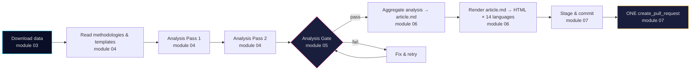

# `.github/prompts/` — Agentic Workflow Prompt Library

This directory holds the **bounded-context prompt modules** imported by every news workflow in `.github/workflows/news-*.md`. It replaces the previous monolithic `.github/aw/SHARED_PROMPT_PATTERNS.md`.

## Why

- **One concern per module** — each file is ≤ 300 lines and has a single responsibility.
- **Explicit dependencies** — workflows declare imports in YAML frontmatter (`imports:`), not by prose reference.
- **No duplication** — modules link to the canonical methodology, template, and MCP config files rather than copy them.
- **No audit history** — rules only, no dated run IDs, PR numbers, or version tags.

## Integration points (authoritative)

This directory is the **single source of truth** for how GitHub Agentic Workflows (gh-aw) produce news articles in this repo. Agents, skills, and copilot instructions MUST link back here rather than restate the rules.

- **gh-aw runtime**: `github/gh-aw-actions/setup@v0.74.3` (SHA-pinned in every `news-*.lock.yml`; MCP Gateway image `ghcr.io/github/gh-aw-mcpg:v0.3.9`; `setup-cli` variant used only by `agentics-maintenance.yml`).
- **Upstream documentation** — link-out only, never copy content:
  - Abridged: <https://github.github.com/gh-aw/llms-small.txt>
  - Complete: <https://github.github.com/gh-aw/llms-full.txt>
  - Agentic-workflows blog series: <https://github.github.com/gh-aw/_llms-txt/agentic-workflows.txt>
  - Source repo: <https://github.com/github/gh-aw>
  - GitHub CLI: <https://cli.github.com/manual/>
- **Article-generation system map** → [`Article-Generation.md`](../../Article-Generation.md) is the readable end-to-end contract for how workflows, prompts, artifacts, `article.md`, renderer chrome, SEO, UI/UX exports, and deployment fit together. Prompt modules below remain the executable per-phase rules.
- **Analysis artifact contract** (the "deep political analysis" product that every news workflow must produce *before* writing a single article sentence):
  - **Read-me-first** — [`analysis/methodologies/artifact-catalog.md`](../../analysis/methodologies/artifact-catalog.md) (single source of truth for every artifact — family, template, depth floor, Mermaid, MCP, gate check) and [`analysis/methodologies/per-artifact-methodologies.md`](../../analysis/methodologies/per-artifact-methodologies.md) (Inputs / Analytic-moves / Evidence-rules / Anti-patterns per artifact)
  - Methodology → [`analysis/methodologies/ai-driven-analysis-guide.md`](../../analysis/methodologies/ai-driven-analysis-guide.md)
  - Indicator maps → [`worldbank-indicator-mapping.md`](../../analysis/methodologies/worldbank-indicator-mapping.md) (non-economic WB) + [`imf-indicator-mapping.md`](../../analysis/methodologies/imf-indicator-mapping.md) (authoritative IMF for all economic context)
  - Depth floors → [`reference-quality-thresholds.json`](../../analysis/methodologies/reference-quality-thresholds.json) (per-article-type × per-artifact line floors, tradecraft signals)
  - Templates → [`analysis/templates/`](../../analysis/templates/) (one file per artifact — 23 always-on + per-document + 7 operational supplementary)
  - **23 required artifacts** (every workflow, produced in `analysis/daily/$ARTICLE_DATE/$SUBFOLDER/`): Family A Core Synthesis — `README.md`, `executive-brief.md`, `synthesis-summary.md`, `significance-scoring.md`, `classification-results.md`, `swot-analysis.md`, `risk-assessment.md`, `threat-analysis.md`, `stakeholder-perspectives.md`; Family B Structural Metadata — `data-download-manifest.md`, `cross-reference-map.md`; Family C Strategic Extensions (F3EAD Exploit→Analyze) — `scenario-analysis.md`, `comparative-international.md`, `devils-advocate.md`, `intelligence-assessment.md`, `methodology-reflection.md` ⭐; Family D Electoral & Domain Lenses — `election-2026-analysis.md`, `voter-segmentation.md`, `coalition-mathematics.md`, `historical-parallels.md`, `media-framing-analysis.md`, `implementation-feasibility.md`, `forward-indicators.md`. Plus Family E per-document `documents/{dok_id}-analysis.md`. Full definitions in [`04-analysis-pipeline.md`](04-analysis-pipeline.md).
  - **7 operational supplementary artifacts** (not counted in the 23; recommended for `deep`, mandatory for `comprehensive` / Tier-C): `analysis-index.md`, `reference-analysis-quality.md`, `mcp-reliability-audit.md`, `workflow-audit.md`, `cross-run-diff.md`, `cross-session-intelligence.md`, `session-baseline.md`.
  - **4 analytical supplementary artifacts** (never blocking, optional deep-dives): `pestle-analysis.md`, `political-stride-assessment.md`, `wildcards-blackswans.md`, `quantitative-swot.md`. Full rules in [`analytical-supplementary-methodology.md`](../../analysis/methodologies/analytical-supplementary-methodology.md).
  - **Tier-C aggregation** produces the same 23 artifacts plus depth multipliers, cross-type sibling-folder citations, prior-cycle PIR ingestion, and a 1 500-word article floor — see [`ext/tier-c-aggregation.md`](ext/tier-c-aggregation.md).
- **Single blocking gate**: [`05-analysis-gate.md`](05-analysis-gate.md) is the only enforcer. No article may be touched until the gate passes.
- **AI-FIRST rule** ([`00-base-contract.md`](00-base-contract.md) §5): minimum 2 complete iterations — Pass 1 creates every artifact, Pass 2 reads Pass 1 back and improves every section.

## Module catalogue

| File | Responsibility | Consumed by |
|------|---------------|-------------|
| [`00-base-contract.md`](00-base-contract.md) | Role, ethics, GDPR/ISMS, AI-FIRST quality rule, pipeline order | All news workflows + translate |
| [`01-bash-and-shell-safety.md`](01-bash-and-shell-safety.md) | Bash tool call format, AWF-safe shell patterns, UTF-8 | All news workflows + translate |
| [`02-mcp-access.md`](02-mcp-access.md) | MCP server inventory, tool naming, in-prompt health gate | All news workflows + translate |
| [`03-data-download.md`](03-data-download.md) | Download pipeline, subfolder naming, lookback fallback, manifest | All content workflows |
| [`04-analysis-pipeline.md`](04-analysis-pipeline.md) | Methodologies, templates, **23 required artifacts** (Families A+B+C+D), Pass 1 / Pass 2 | All content workflows |
| [`05-analysis-gate.md`](05-analysis-gate.md) | Single blocking gate before any article is touched (checks 1–9 across all 23 artifacts; supplementary check 9 is blocking for `comprehensive` / Tier-C / multi-run) | All content workflows |
| [`06-article-generation.md`](06-article-generation.md) | Article sections, banned patterns, visualisation, translations | All content workflows |
| [`07-commit-and-pr.md`](07-commit-and-pr.md) | Stage → commit → exactly one `create_pull_request` | All news workflows + translate |
| [`seo-metadata-contract.md`](seo-metadata-contract.md) | Reference contract for `<title>` + `<meta description>` per language (used at render time, not imported) | Reference document — referenced by `06-article-generation.md` and the renderer |
| [`ext/tier-c-aggregation.md`](ext/tier-c-aggregation.md) | Tier-C additive rules: period multipliers, cross-type sibling synthesis, prior-cycle PIR ingestion, article floor | Aggregation & reference-grade workflows |
| [`ext/long-horizon-forecasting.md`](ext/long-horizon-forecasting.md) | Long-horizon additive rules on top of Tier-C: horizon stratification, scenario-tree depth, counterfactual mandate, IMF projection-year stamps, PESTLE blocking thresholds, cross-horizon citation | `news-week-ahead`, `news-month-ahead`, `news-quarter-ahead`, `news-year-ahead`, `news-election-cycle` |
| [`ext/cycle-rollover.md`](ext/cycle-rollover.md) | Election cycle file-rename + carry-forward + PIR archival procedure (active only within ± 30 days of a Swedish election anchor) | `news-election-cycle` (no-op outside ± 30-day window) |

## Dependency matrix

| Workflow | 00 | 01 | 02 | 03 | 04 | 05 | 06 | 07 | tier-c | long-horizon | cycle-rollover |
|----------|:--:|:--:|:--:|:--:|:--:|:--:|:--:|:--:|:------:|:------------:|:--------------:|
| `news-propositions` | ✅ | ✅ | ✅ | ✅ | ✅ | ✅ | ✅ | ✅ | | | |
| `news-motions` | ✅ | ✅ | ✅ | ✅ | ✅ | ✅ | ✅ | ✅ | | | |
| `news-committee-reports` | ✅ | ✅ | ✅ | ✅ | ✅ | ✅ | ✅ | ✅ | | | |
| `news-interpellations` | ✅ | ✅ | ✅ | ✅ | ✅ | ✅ | ✅ | ✅ | | | |
| `news-evening-analysis` | ✅ | ✅ | ✅ | ✅ | ✅ | ✅ | ✅ | ✅ | ✅ | | |
| `news-week-ahead` | ✅ | ✅ | ✅ | ✅ | ✅ | ✅ | ✅ | ✅ | ✅ | (recommended) | |
| `news-month-ahead` | ✅ | ✅ | ✅ | ✅ | ✅ | ✅ | ✅ | ✅ | ✅ | (recommended) | |
| `news-quarter-ahead` | ✅ | ✅ | ✅ | ✅ | ✅ | ✅ | ✅ | ✅ | ✅ | ✅ | |
| `news-year-ahead` | ✅ | ✅ | ✅ | ✅ | ✅ | ✅ | ✅ | ✅ | ✅ | ✅ | |
| `news-election-cycle` | ✅ | ✅ | ✅ | ✅ | ✅ | ✅ | ✅ | ✅ | ✅ | ✅ | ✅ |
| `news-weekly-review` | ✅ | ✅ | ✅ | ✅ | ✅ | ✅ | ✅ | ✅ | ✅ | | |
| `news-monthly-review` | ✅ | ✅ | ✅ | ✅ | ✅ | ✅ | ✅ | ✅ | ✅ | | |
| `news-realtime-monitor` | ✅ | ✅ | ✅ | ✅ | ✅ | ✅ | ✅ | ✅ | ✅ | | |
| `news-translate` | ✅ | ✅ | ✅ | | | | | ✅ | | | |

## Phase sequence (single-run workflow)

Translations for the remaining twelve languages are produced inside the same per-type agentic run (see `06-article-generation.md` §"Step 2 — Translate `article.md`"). The dedicated `news-translate` workflow runs three times a day on a separate track and is responsible only for the executive-brief markdown pipeline — translating `analysis/daily/**/executive-brief.md` into `executive-brief_<lang>.md` for the 13 non-English target languages (see `.github/workflows/news-translate.md` and `TRANSLATION_GUIDE.md` §"Executive Brief Markdown Translations").

## Why multiple prompt imports (not a single Copilot Agent File)

gh-aw supports [two distinct import styles](https://github.github.com/gh-aw/guides/packaging-imports/):

| Style | Source | Per-workflow cap | Frontmatter shape | Use for |
|-------|--------|------------------|-------------------|---------|
| **Plain imports** | Any `.md` outside `.github/agents/` | unlimited | plain Markdown (no special frontmatter required) | Shared rule modules — this directory. |
| **Copilot Agent File** | `.github/agents/<name>.md` | **exactly one** per workflow | `name`, `description`, `tools`, `mcp-servers` | Per-issue delegation via `assign_copilot_to_issue`, or a single specialised persona for one workflow. |

News workflows need eight bounded-context modules (role, shell, MCP, download, analysis, gate, article, commit) plus an optional Tier-C extension. The "one agent file per workflow" limit makes that infeasible as a single agent file, so we use plain imports. The 24 files under `.github/agents/` remain the persona catalogue for `assign_copilot_to_issue` and for any future workflow that genuinely needs a single reusable persona per run.

If a workflow ever needs a *single* reusable persona (e.g. a pure code-review workflow), that workflow may import one agent file from `.github/agents/` **in addition to** any plain prompt imports — gh-aw allows mixing the two styles.

## Authoring rules for new / edited modules

| Rule | Enforced by |
|------|-------------|
| ≤ 300 lines per module | CI check in `compile-agentic-workflows.yml` |
| No audit history, PR/run IDs, version tags | Code review |
| Link to canonical external docs rather than copy content | Code review |
| Tables over prose where rules are enumerable | Code review |
| Declarative ("do X") not narrative ("we decided to do X because of PR #1794") | Code review |

## Changing the import list of a workflow

1. Edit the workflow's frontmatter `imports:` list.
2. Run `gh aw compile` locally.
3. Commit both `.md` and regenerated `.lock.yml`.

See [`.github/skills/github-agentic-workflows/SKILL.md`](../skills/github-agentic-workflows/SKILL.md) §"Imports" for gh-aw import semantics.

## History

The monolithic `.github/aw/SHARED_PROMPT_PATTERNS.md` was retired when these modules went live. Every rule was migrated into one of the modules above, merged with an equivalent, or dropped as audit history / duplicate.

## Related directory READMEs

- [`.github/agents/README.md`](../agents/README.md) — 24 agent files (14 persona + 9 workflow-specialist + 1 developer-instructions)
- [`.github/skills/README.md`](../skills/README.md) — 91 skills by functional category
- [`.github/workflows/README.md`](../workflows/README.md) — 50 workflow files (22 standard `.yml` + 14 agentic `.md` sources + 14 compiled `.lock.yml`)
- [`Article-Generation.md`](../../Article-Generation.md) — article-generation architecture, business value, UI/UX export, SEO, deployment and source index
- [`analysis/README.md`](../../analysis/README.md) — on-disk artifact layout (`analysis/daily/$ARTICLE_DATE/$SUBFOLDER/`)
- [`analysis/methodologies/README.md`](../../analysis/methodologies/README.md) — 12 methodology modules (AI guide · 4 domain frameworks · 5 Family production methodologies · style guide · **OSINT / INTOP tradecraft standards** canon)
- [`analysis/templates/README.md`](../../analysis/templates/README.md) — 23 canonical output templates
- [`WORKFLOWS.md`](../../WORKFLOWS.md) — complete CI/CD + agentic workflow reference
