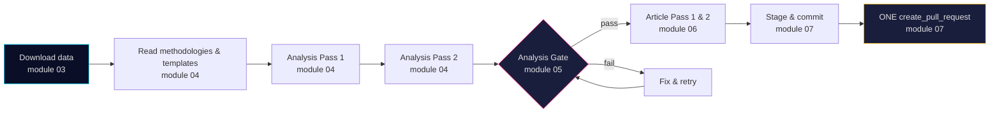

# `.github/prompts/` — Agentic Workflow Prompt Library

This directory holds the **bounded-context prompt modules** imported by every news workflow in `.github/workflows/news-*.md`. It replaces the previous monolithic `.github/aw/SHARED_PROMPT_PATTERNS.md`.

## Why

- **One concern per module** — each file is ≤ 300 lines and has a single responsibility.
- **Explicit dependencies** — workflows declare imports in YAML frontmatter (`imports:`), not by prose reference.
- **No duplication** — modules link to the canonical methodology, template, and MCP config files rather than copy them.
- **No audit history** — rules only, no dated run IDs, PR numbers, or version tags.

## Module catalogue

| File | Responsibility | Consumed by |
|------|---------------|-------------|
| [`00-base-contract.md`](00-base-contract.md) | Role, ethics, GDPR/ISMS, AI-FIRST quality rule, pipeline order | All news workflows + translate |
| [`01-bash-and-shell-safety.md`](01-bash-and-shell-safety.md) | Bash tool call format, AWF-safe shell patterns, UTF-8 | All news workflows + translate |
| [`02-mcp-access.md`](02-mcp-access.md) | MCP server inventory, tool naming, in-prompt health gate | All news workflows + translate |
| [`03-data-download.md`](03-data-download.md) | Download pipeline, subfolder naming, lookback fallback, manifest | All content workflows |
| [`04-analysis-pipeline.md`](04-analysis-pipeline.md) | Methodologies, templates, 9 core artifacts, Pass 1 / Pass 2 | All content workflows |
| [`05-analysis-gate.md`](05-analysis-gate.md) | Single blocking gate before any article is touched | All content workflows |
| [`06-article-generation.md`](06-article-generation.md) | Article sections, banned patterns, visualisation, translations | All content workflows |
| [`07-commit-and-pr.md`](07-commit-and-pr.md) | Stage → commit → exactly one `create_pull_request` | All news workflows + translate |
| [`ext/tier-c-aggregation.md`](ext/tier-c-aggregation.md) | 14-artifact gate, period multipliers, cross-type synthesis | Aggregation & reference-grade workflows |

## Dependency matrix

| Workflow | 00 | 01 | 02 | 03 | 04 | 05 | 06 | 07 | ext |
|----------|:--:|:--:|:--:|:--:|:--:|:--:|:--:|:--:|:---:|
| `news-propositions` | ✅ | ✅ | ✅ | ✅ | ✅ | ✅ | ✅ | ✅ | |
| `news-motions` | ✅ | ✅ | ✅ | ✅ | ✅ | ✅ | ✅ | ✅ | |
| `news-committee-reports` | ✅ | ✅ | ✅ | ✅ | ✅ | ✅ | ✅ | ✅ | |
| `news-interpellations` | ✅ | ✅ | ✅ | ✅ | ✅ | ✅ | ✅ | ✅ | |
| `news-evening-analysis` | ✅ | ✅ | ✅ | ✅ | ✅ | ✅ | ✅ | ✅ | ✅ |
| `news-week-ahead` | ✅ | ✅ | ✅ | ✅ | ✅ | ✅ | ✅ | ✅ | ✅ |
| `news-month-ahead` | ✅ | ✅ | ✅ | ✅ | ✅ | ✅ | ✅ | ✅ | ✅ |
| `news-weekly-review` | ✅ | ✅ | ✅ | ✅ | ✅ | ✅ | ✅ | ✅ | ✅ |
| `news-monthly-review` | ✅ | ✅ | ✅ | ✅ | ✅ | ✅ | ✅ | ✅ | ✅ |
| `news-realtime-monitor` | ✅ | ✅ | ✅ | ✅ | ✅ | ✅ | ✅ | ✅ | ✅ |
| `news-article-generator` | ✅ | ✅ | ✅ | ✅ | ✅ | ✅ | ✅ | ✅ | ✅ |
| `news-translate` | ✅ | ✅ | ✅ | | | | | ✅ | |

## Phase sequence (single-type workflow)

## Authoring rules for new / edited modules

| Rule | Enforced by |
|------|-------------|
| ≤ 300 lines per module | CI check in `compile-agentic-workflows.yml` |
| No audit history, PR/run IDs, version tags | Code review |
| Link to canonical external docs rather than copy content | Code review |
| Tables over prose where rules are enumerable | Code review |
| Declarative ("do X") not narrative ("we decided to do X because of PR #1794") | Code review |

## Changing the import list of a workflow

1. Edit the workflow's frontmatter `imports:` list.
2. Run `gh aw compile` locally.
3. Commit both `.md` and regenerated `.lock.yml`.

See [`.github/skills/github-agentic-workflows/SKILL.md`](../skills/github-agentic-workflows/SKILL.md) §"Imports" for gh-aw import semantics.

## History

The monolithic `.github/aw/SHARED_PROMPT_PATTERNS.md` was deleted when these modules went live. Every rule from the old file was either migrated into one of the modules above, merged with an equivalent rule, or deleted as audit history / duplicated content / tutorial from a skill file.
