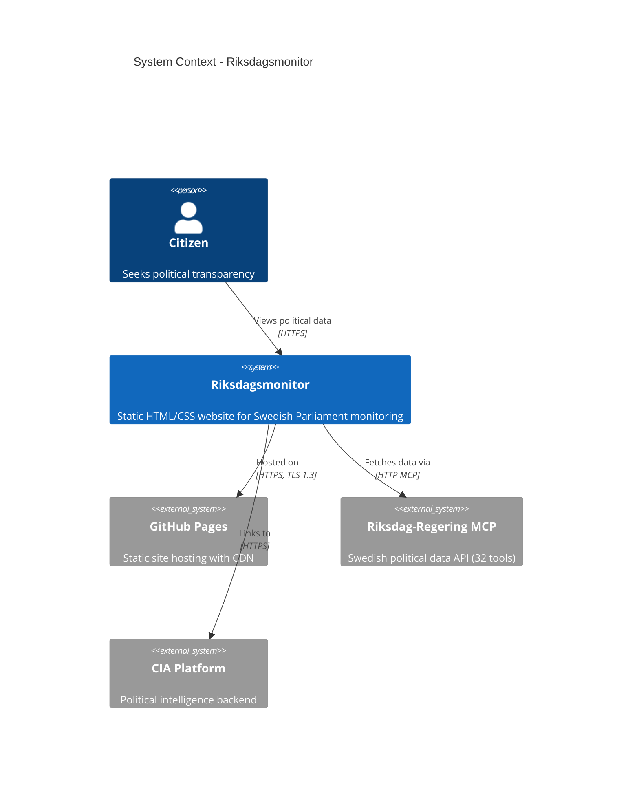
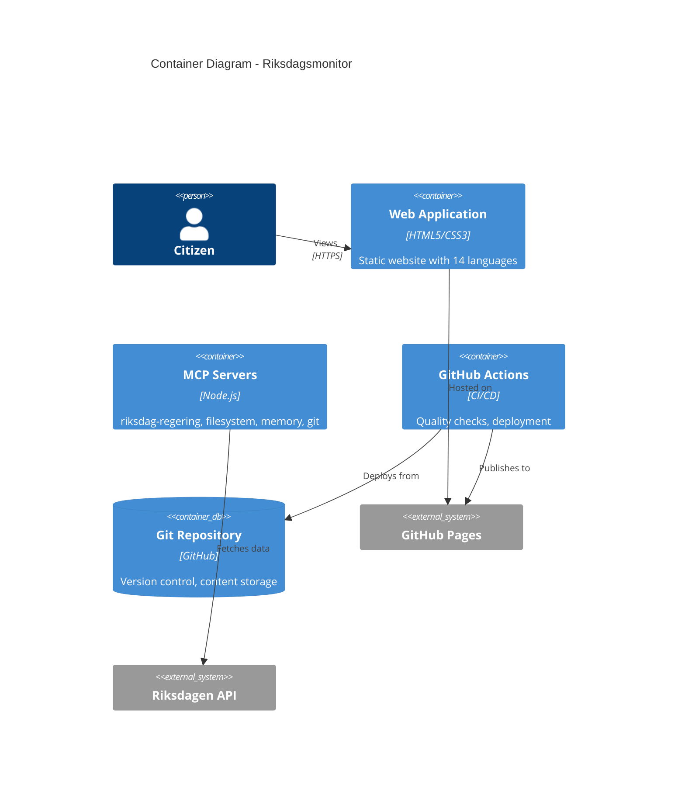

# C4 Architecture Documentation

## Purpose

Document Riksdagsmonitor architecture using C4 model (Context, Container, Component, Code).

## C4 Model Levels

### Level 1: Context Diagram
Shows system in environment with users and external systems.



### Level 2: Container Diagram
Shows high-level technology choices.



### Level 3: Component Diagram
Shows internal structure.

## Documentation Structure

**ARCHITECTURE.md Template:**
```markdown
# Architecture

## Executive Summary
## System Context (C4 Level 1)
## Container View (C4 Level 2)
## Component View (C4 Level 3)
## Technology Stack
## Security Architecture
## Deployment Pipeline
## References
```

## References

- **C4 Model**: https://c4model.com
- **ARCHITECTURE.md**: Complete C4 models
- **Mermaid Docs**: https://mermaid.js.org/
