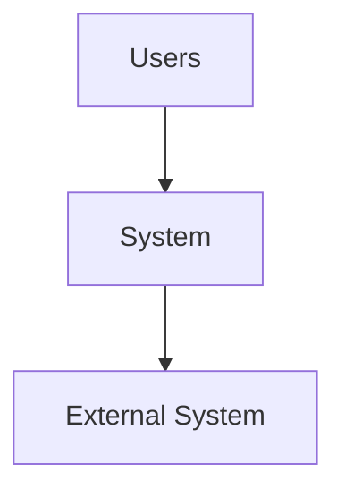
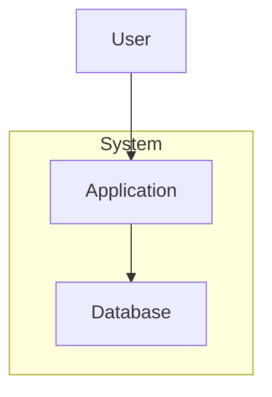
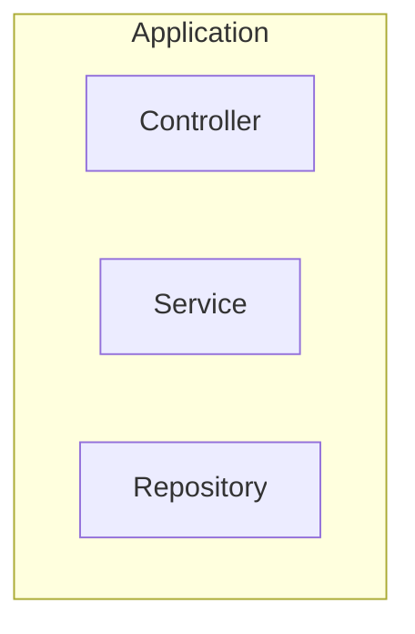

# Documentation Standards Skill

## Purpose

Ensure consistent, high-quality technical documentation following C4 architecture model and Hack23 standards.

## Document Structure Template

```markdown
# Title - [Purpose]

**Document Version:** X.X
**Last Updated:** YYYY-MM-DD
**Classification:** [Public/Internal]
**Owner:** Hack23 AB (Org.nr 5595347807)

## Executive Summary
[High-level overview]

## 1. Main Content
[Sections with diagrams]

## Related Documentation
[Links to related docs]

---

**Document Control:**
- **Repository:** [URL]
- **Path:** /DOCUMENT.md
- **Format:** Markdown with Mermaid
- **Next Review:** YYYY-MM-DD
```

## C4 Architecture Model

### Level 1: System Context


### Level 2: Container


### Level 3: Component


## Mermaid Diagram Best Practices

1. Use clear, descriptive labels
2. Consistent styling with subgraphs
3. Appropriate diagram types
4. Color coding for clarity
5. Legend when needed

## Remember

- **Clarity First**: Easy to understand
- **Consistency**: Follow standards
- **Visual**: Use diagrams
- **Completeness**: All required docs
- **Maintenance**: Regular reviews

## References

- [C4 Model](https://c4model.com/)
- [Mermaid](https://mermaid.js.org/)
