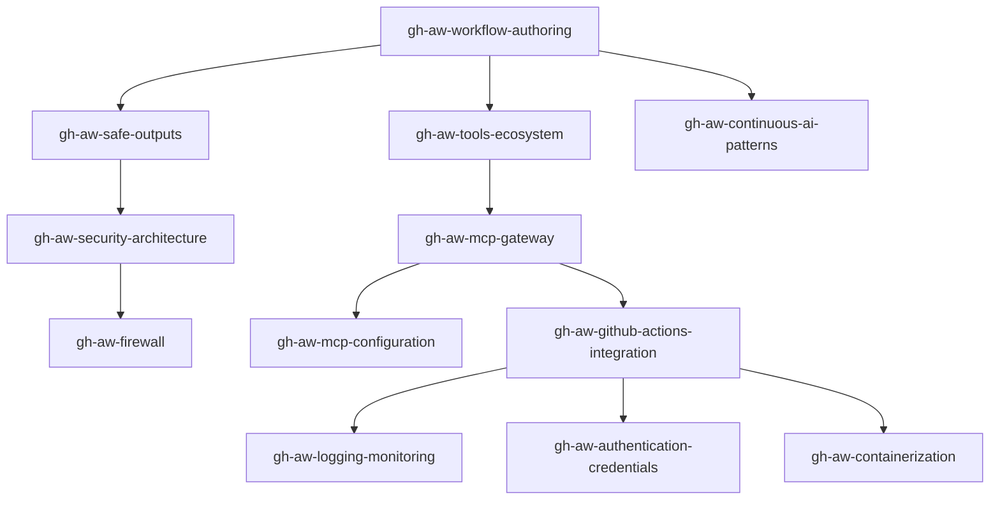

# 🤖 GitHub Agentic Workflows Skills Collection

> Comprehensive expertise in GitHub Agentic Workflows - AI-powered repository automation using natural language markdown instead of complex YAML.

## 📚 Skills Overview

This collection provides 12 comprehensive skills covering all aspects of GitHub Agentic Workflows, from core concepts to advanced security, configuration, and operations.

### 🎯 Core Components (Phase 1)

| Skill | Lines | Description |
|-------|-------|-------------|
| **[gh-aw-safe-outputs](./gh-aw-safe-outputs/SKILL.md)** | 647 | Safe outputs architecture, security, sanitization, and write operation patterns |
| **[gh-aw-mcp-gateway](./gh-aw-mcp-gateway/SKILL.md)** | 2,298 | MCP Gateway configuration, routing, Docker support, and server management |
| **[gh-aw-firewall](./gh-aw-firewall/SKILL.md)** | 832 | Network egress control, domain whitelisting, Squid proxy, API proxy sidecar |
| **[gh-aw-workflow-authoring](./gh-aw-workflow-authoring/SKILL.md)** | 878 | Workflow creation, markdown syntax, natural language, prompt engineering |

### 🔬 Advanced Features (Phase 2)

| Skill | Lines | Description |
|-------|-------|-------------|
| **[gh-aw-security-architecture](./gh-aw-security-architecture/SKILL.md)** | 1,754 | Defense-in-depth, threat modeling, sandboxing, attack vector mitigations |
| **[gh-aw-mcp-configuration](./gh-aw-mcp-configuration/SKILL.md)** | 1,700 | MCP server setup, transport protocols, lifecycle management, validation |
| **[gh-aw-continuous-ai-patterns](./gh-aw-continuous-ai-patterns/SKILL.md)** | 1,390 | Continuous AI concept, workflow patterns, scheduling, human-in-the-loop |
| **[gh-aw-tools-ecosystem](./gh-aw-tools-ecosystem/SKILL.md)** | 727 | Complete tools reference, GitHub/file/web/bash/playwright integration |

### 🚀 Operations & Deployment (Phase 3)

| Skill | Lines | Description |
|-------|-------|-------------|
| **[gh-aw-github-actions-integration](./gh-aw-github-actions-integration/SKILL.md)** | 1,529 | CI/CD patterns, environment setup, secrets management, deployment |
| **[gh-aw-logging-monitoring](./gh-aw-logging-monitoring/SKILL.md)** | 1,470 | Logging architecture, metrics, alerting, debugging, observability |
| **[gh-aw-authentication-credentials](./gh-aw-authentication-credentials/SKILL.md)** | 1,466 | GitHub tokens, credential storage, token rotation, least privilege |
| **[gh-aw-containerization](./gh-aw-containerization/SKILL.md)** | 1,396 | Docker patterns, container security, image optimization, orchestration |

## 📊 Statistics

- **Total Skills**: 12
- **Total Lines**: 16,087
- **Total Size**: ~450KB
- **Code Examples**: 300+
- **Architecture Diagrams**: 15+
- **Best Practices**: 200+

## 🎯 What Are GitHub Agentic Workflows?

GitHub Agentic Workflows are AI-powered workflows that combine:
- 📝 **Natural Language**: Written in markdown instead of complex YAML
- 🧠 **AI Understanding**: Use AI to understand repository context
- 🎯 **Context-Aware**: Make decisions without explicit conditionals
- 🔒 **Safe by Default**: Read-only with controlled write operations
- 🛡️ **Defense-in-Depth**: Multiple security layers

## 🚀 Quick Start Learning Path

### Beginner (Start Here)
1. **[gh-aw-workflow-authoring](./gh-aw-workflow-authoring/SKILL.md)** - Learn to write workflows
2. **[gh-aw-safe-outputs](./gh-aw-safe-outputs/SKILL.md)** - Understand safe write operations
3. **[gh-aw-tools-ecosystem](./gh-aw-tools-ecosystem/SKILL.md)** - Explore available tools

### Intermediate
4. **[gh-aw-mcp-gateway](./gh-aw-mcp-gateway/SKILL.md)** - MCP server integration
5. **[gh-aw-github-actions-integration](./gh-aw-github-actions-integration/SKILL.md)** - Deploy workflows
6. **[gh-aw-continuous-ai-patterns](./gh-aw-continuous-ai-patterns/SKILL.md)** - Advanced patterns

### Advanced
7. **[gh-aw-security-architecture](./gh-aw-security-architecture/SKILL.md)** - Security deep dive
8. **[gh-aw-firewall](./gh-aw-firewall/SKILL.md)** - Network security
9. **[gh-aw-mcp-configuration](./gh-aw-mcp-configuration/SKILL.md)** - Advanced MCP setup
10. **[gh-aw-authentication-credentials](./gh-aw-authentication-credentials/SKILL.md)** - Credential management

### Operations
11. **[gh-aw-logging-monitoring](./gh-aw-logging-monitoring/SKILL.md)** - Observability
12. **[gh-aw-containerization](./gh-aw-containerization/SKILL.md)** - Production deployment

## 🏗️ Architecture Overview

```
┌─────────────────────────────────────────────────────────────┐
│                   GitHub Agentic Workflow                    │
│  ┌────────────────────────────────────────────────────────┐ │
│  │  Natural Language Markdown (.md)                       │ │
│  │  - Human-authored instructions                          │ │
│  │  - Context-aware prompts                                │ │
│  │  - YAML frontmatter configuration                       │ │
│  └────────────────────────────────────────────────────────┘ │
│                            ▼                                  │
│  ┌────────────────────────────────────────────────────────┐ │
│  │  Compilation (.lock.yml)                               │ │
│  │  - Converts to GitHub Actions YAML                     │ │
│  │  - Validates configuration                              │ │
│  │  - Generates execution plan                             │ │
│  └────────────────────────────────────────────────────────┘ │
│                            ▼                                  │
│  ┌────────────────────────────────────────────────────────┐ │
│  │  Execution Environment                                  │ │
│  │  ┌─────────────┐ ┌─────────────┐ ┌─────────────┐     │ │
│  │  │  Security   │ │ MCP Gateway │ │  Firewall   │     │ │
│  │  │  Sandbox    │ │  (Routing)  │ │ (Network)   │     │ │
│  │  └─────────────┘ └─────────────┘ └─────────────┘     │ │
│  │           │              │              │               │ │
│  │           └──────────────┴──────────────┘               │ │
│  │                          ▼                               │ │
│  │  ┌────────────────────────────────────────────────────┐ │ │
│  │  │  AI Agent (Claude Opus 4.6)                        │ │ │
│  │  │  - Reads repository context                        │ │ │
│  │  │  - Makes decisions                                  │ │ │
│  │  │  - Generates safe outputs                          │ │ │
│  │  └────────────────────────────────────────────────────┘ │ │
│  │                          ▼                               │ │
│  │  ┌────────────────────────────────────────────────────┐ │ │
│  │  │  Safe Outputs (Write Operations)                   │ │ │
│  │  │  - Sanitized and validated                         │ │ │
│  │  │  - Explicit approval required                      │ │ │
│  │  │  - Auditable and traceable                         │ │ │
│  │  └────────────────────────────────────────────────────┘ │ │
│  └────────────────────────────────────────────────────────┘ │
└─────────────────────────────────────────────────────────────┘
```

## 🛡️ Security Model

All skills emphasize security-first design:

- ✅ **Read-Only by Default**: All permissions start at read-only
- ✅ **Explicit Write Operations**: Safe outputs for all writes
- ✅ **Sandboxed Execution**: Container isolation with resource limits
- ✅ **Network Restrictions**: Firewall with domain whitelisting
- ✅ **Credential Isolation**: Secrets never exposed to AI agents
- ✅ **Defense-in-Depth**: Multiple security layers
- ✅ **Audit Trail**: All actions logged and traceable

## 📖 Key Concepts

### Natural Language Over YAML

**Before (Traditional GitHub Actions):**
```yaml
if: |
  contains(github.event.issue.labels.*.name, 'bug') &&
  !contains(github.event.issue.labels.*.name, 'wontfix') &&
  github.event.issue.state == 'open' &&
  github.event.issue.user.login != 'dependabot[bot]'
```

**After (Agentic Workflow):**
```markdown
If this is an open bug that should be fixed (not a wontfix or bot), 
provide helpful triage information.
```

### Safe Outputs Pattern

All write operations go through safe outputs:
- `safeoutputs___issue` - Create/update issues
- `safeoutputs___pull_request` - Create PRs
- `safeoutputs___comment` - Add comments
- `safeoutputs___file` - Modify files
- `safeoutputs___label` - Manage labels
- `safeoutputs___noop` - Read-only mode

### Continuous AI

Systematic, automated application of AI to software development:
- ✅ Automatic documentation updates
- ✅ Incremental code quality improvements
- ✅ Intelligent issue triage
- ✅ Context-aware code review
- ✅ Repository health monitoring

## 🎓 Use Cases

### Issue Management
- Automated triage and labeling
- Duplicate detection
- Priority assessment
- Assignee suggestions

### Code Review
- Security vulnerability detection
- Code quality analysis
- Test coverage checks
- Style compliance verification

### Documentation
- Auto-sync with code changes
- Example validation
- Link checking
- Version updates

### Maintenance
- Dependency updates review
- Repository health checks
- Stale issue management
- License compliance

## 🔗 External Resources

- **[Official Documentation](https://github.github.com/gh-aw/)** - Complete docs
- **[GitHub Repository](https://github.com/github/gh-aw)** - Source code
- **[Quick Start](https://github.github.com/gh-aw/setup/quick-start/)** - Get started
- **[Examples](https://github.github.com/gh-aw/examples/)** - Real workflows
- **[Security](https://github.github.com/gh-aw/introduction/architecture/)** - Security details

## 📋 Skill Dependencies



## ✅ Skill Quality Standards

Every skill includes:
- ✅ YAML frontmatter with metadata
- ✅ Comprehensive content (600-2,300 lines)
- ✅ Emoji section headers
- ✅ Code examples (10-50+ per skill)
- ✅ Architecture diagrams
- ✅ Best practices section
- ✅ Security considerations
- ✅ Troubleshooting guides
- ✅ Related skills references
- ✅ External documentation links
- ✅ Remember checklist

## 🏆 Maintenance

- **Version**: 1.0.0
- **Last Updated**: 2026-02-17
- **License**: Apache-2.0
- **Maintained by**: Hack23 AB
- **Review Cycle**: Quarterly
- **Based on**: GitHub Agentic Workflows (gh-aw, gh-aw-firewall, gh-aw-mcpg)

## 💡 Contributing

These skills are maintained as part of the Riksdagsmonitor project. To contribute:

1. Review existing skills for patterns
2. Follow YAML frontmatter standards
3. Include comprehensive examples
4. Add security considerations
5. Cross-reference related skills
6. Test examples before committing

---

**Need help?** Start with [gh-aw-workflow-authoring](./gh-aw-workflow-authoring/SKILL.md) to learn the basics!
