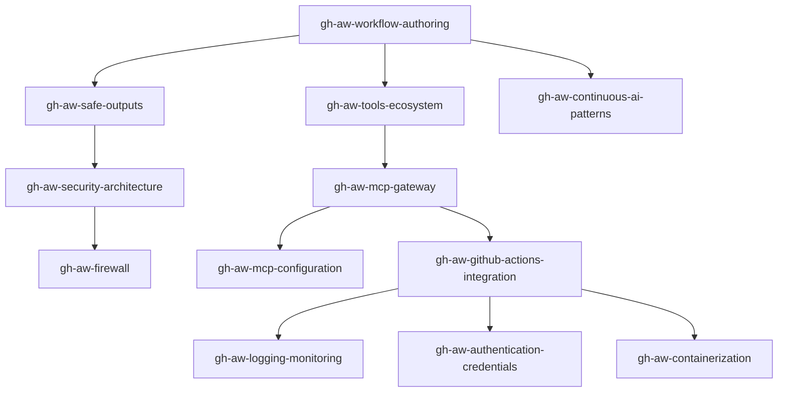

# 🤖 GitHub Agentic Workflows Skills Collection

> Comprehensive expertise in GitHub Agentic Workflows (v0.68.1) — AI-powered repository automation using natural language markdown with five-layer security guardrails.


## 🔴 AI FIRST Quality Principle

> **Apply the AI FIRST principle: never accept first-pass quality. Minimum 2 iterations. Read all output, improve every section. No shortcuts.**

## 📚 Skills Overview

This collection provides 12 skills + 1 umbrella skill covering all aspects of GitHub Agentic Workflows (gh-aw), from workflow authoring to security architecture, MCP integration, and operations.

### 🎯 Core Components

| Skill | Description |
|-------|-------------|
| **[gh-aw-workflow-authoring](./gh-aw-workflow-authoring/SKILL.md)** | Markdown syntax, YAML frontmatter, natural language instructions, `gh aw compile` |
| **[gh-aw-safe-outputs](./gh-aw-safe-outputs/SKILL.md)** | Write isolation, sanitization, safe output types (issue, PR, comment, file, label) |
| **[gh-aw-tools-ecosystem](./gh-aw-tools-ecosystem/SKILL.md)** | GitHub/file/web/bash/Playwright tools, MCP tool routing, custom tools |
| **[gh-aw-firewall](./gh-aw-firewall/SKILL.md)** | AWF network egress control, Squid proxy, domain allowlists, iptables enforcement |

### 🔬 Advanced Features

| Skill | Description |
|-------|-------------|
| **[gh-aw-security-architecture](./gh-aw-security-architecture/SKILL.md)** | Five-layer defense-in-depth, threat detection, sandboxing, attack mitigations |
| **[gh-aw-mcp-configuration](./gh-aw-mcp-configuration/SKILL.md)** | MCP server setup, stdio/HTTP/SSE transports, lifecycle management, validation |
| **[gh-aw-mcp-gateway](./gh-aw-mcp-gateway/SKILL.md)** | MCP Gateway proxy, Docker integration, multi-server routing, observability |
| **[gh-aw-continuous-ai-patterns](./gh-aw-continuous-ai-patterns/SKILL.md)** | Continuous AI, scheduling strategies, event-driven, human-in-the-loop |

### 🚀 Operations & Deployment

| Skill | Description |
|-------|-------------|
| **[gh-aw-github-actions-integration](./gh-aw-github-actions-integration/SKILL.md)** | CI/CD integration, workflow triggers, secrets management, deployment patterns |
| **[gh-aw-logging-monitoring](./gh-aw-logging-monitoring/SKILL.md)** | Structured logging, metrics collection, alerting, debugging, observability |
| **[gh-aw-authentication-credentials](./gh-aw-authentication-credentials/SKILL.md)** | Token types, credential storage, rotation, least privilege, MCP auth |
| **[gh-aw-containerization](./gh-aw-containerization/SKILL.md)** | Container isolation, security hardening, image optimization, orchestration |

### 🌐 Umbrella Skill

| Skill | Description |
|-------|-------------|
| **[github-agentic-workflows](./github-agentic-workflows/SKILL.md)** | High-level overview integrating all 12 skills into a unified reference |

## 🎯 What Are GitHub Agentic Workflows?

A Go-based GitHub CLI extension (`gh aw`) that lets you write AI-powered workflows in **natural language markdown** instead of complex YAML. Workflows compile to GitHub Actions `.lock.yml` files and run with five built-in security layers:

1. **Read-only tokens** — Agent receives only read permissions
2. **Zero secrets in agent** — Write tokens exist only in isolated post-agent jobs
3. **Containerized + network firewall** — Squid proxy with domain allowlists, iptables enforcement
4. **Safe outputs with guardrails** — Structured artifacts with hard limits, title prefixes, label constraints
5. **Agentic threat detection** — AI-powered scan for prompt injection, leaked credentials, malicious code

### Supported AI Engines
- **Copilot** (GitHub) — Default engine
- **Claude** (Anthropic) — Alternative engine
- **Codex** (OpenAI) — Alternative engine
- **Gemini** (Google) — Experimental engine
- **Custom engines** — Extensible architecture

## 🚀 Quick Start

```bash
# Install the CLI extension
gh extension install github/gh-aw

# Add a workflow from the gallery
gh aw add-wizard https://github.com/github/gh-aw/blob/v0.68.1/.github/workflows/issue-triage-agent.md

# Compile to GitHub Actions
gh aw compile

# Push and trigger
git push
```

### Example: Daily Issues Report

```markdown
---
on:
  schedule:
    - cron: "0 0 * * *"  # daily at 00:00 UTC (explicit cron as used in this repo's CI)
permissions:
  contents: read
  issues: read
  pull-requests: read
safe-outputs:
  create-issue:
    title-prefix: "[team-status] "
    labels: [report, daily-status]
    close-older-issues: true
---

## Daily Issues Report

Create an upbeat daily status report for the team as a GitHub issue.

## What to include

- Recent repository activity (issues, PRs, discussions, releases)
- Progress tracking, goal reminders and highlights
- Actionable next steps for maintainers
```

## 🏗️ Architecture

```
GitHub Event → ┌──────────────────────────────┐
               │  Isolated Container          │
               │  · Read-only Token           │
               │  · Firewall-Protected        │
               │  · AI Agent (Copilot/Claude) │
               └──────────┬───────────────────┘
                          ▼
               Proposed Output (artifact)
                          ▼
               Threat Detection (AI scan)
                    ╱           ╲
               ✓ safe        ✗ suspicious
                  ▼              ▼
            Write Job         Blocked
          (scoped token)
                  ▼
             GitHub API
```

## 🛡️ Security Model

- ✅ **Read-Only by Default** — Permissions start at read-only
- ✅ **Safe Outputs** — All writes go through structured, validated artifacts
- ✅ **Sandboxed Execution** — Container isolation with resource limits
- ✅ **Network Firewall (AWF)** — Squid proxy + iptables domain allowlists
- ✅ **Credential Isolation** — Secrets never exposed to AI agent process
- ✅ **Threat Detection** — AI-powered scan blocks suspicious outputs
- ✅ **Integrity Filtering** — `min-integrity` controls who can trigger agents
- ✅ **Audit Trail** — All actions logged and traceable

## 📋 Skill Dependencies



## 🔗 External Resources

- **[Official Documentation](https://github.github.com/gh-aw/)** — Complete reference
- **[Abridged Docs (LLM-friendly)](https://github.github.com/gh-aw/llms-small.txt)** — Compact version
- **[Full Docs (LLM-friendly)](https://github.github.com/gh-aw/llms-full.txt)** — Complete version
- **[Agent Factory Blog Series](https://github.github.com/gh-aw/_llms-txt/agentic-workflows.txt)** — 19-part series
- **[GitHub Blog Post](https://github.blog/ai-and-ml/automate-repository-tasks-with-github-agentic-workflows/)** — Introduction
- **[Quick Start](https://github.github.com/gh-aw/setup/quick-start/)** — Getting started
- **[Source Code](https://github.com/github/gh-aw)** — 100+ example workflows

## 🏆 Maintenance

- **Version**: 2.1.0
- **Last Updated**: 2026-04-13
- **gh-aw Version**: v0.68.1
- **License**: Apache-2.0
- **Maintained by**: Hack23 AB

## 🔍 MCP Server Inspection

Use the `gh aw mcp inspect` command to analyze and debug MCP servers configured in agentic workflows:

```bash
# List all workflows with MCP configurations
gh aw mcp inspect

# Inspect MCP servers in a specific workflow
gh aw mcp inspect news-propositions

# Filter to a specific MCP server
gh aw mcp inspect news-propositions --server riksdag-regering

# Show detailed information about a specific tool (requires --server)
gh aw mcp inspect news-propositions --server riksdag-regering --tool search_dokument
```

The `--tool` flag provides:
- Tool name, title, and description
- Input schema and parameters
- Whether the tool is allowed in the workflow configuration
- Annotations and additional metadata

## ⚙️ Runtime Configuration

All agentic workflows MUST specify the Node.js runtime version:

```yaml
runtimes:
  node:
    version: "26"    # Required: Node.js 26 for all workflows
```

Runtime configuration properties:
- `version:` — Runtime version (e.g., `"26"`, `"3.12"`, `"latest"`)
- `action-repo:` — GitHub Actions setup action (e.g., `"actions/setup-node"`)
- `action-version:` — Setup action version (e.g., `"v4"`, `"v5"`)
- `if:` — Optional condition (e.g., `"hashFiles('go.mod') != ''"`)

Runtimes from imported shared workflows are merged automatically.

## 🛠️ Tool Configuration Reference

Standard tool configuration for riksdagsmonitor agentic workflows:

```yaml
tools:
  startup-timeout: 180       # MCP server initialization timeout (seconds)
  timeout: 120               # Per-operation timeout (seconds)
  github:
    toolsets: [all]           # Full GitHub API access (context, repos, issues, PRs, actions, etc.)
  agentic-workflows: true    # Workflow introspection (status, compile, logs, audit, checks)
  bash: true                 # Shell command execution
  playwright:                # Browser automation (optional, for visual validation)
  cache-memory:              # Session state persisted via GitHub Actions cache (~7-14 days)
    key: news-${{ github.workflow }}-${{ inputs.article_date || 'today' }}
    retention-days: 14
```

### Available `agentic-workflows:` Tools
When `agentic-workflows: true` is set, the AI agent gains access to:
- **status** — Show status of workflow files in the repository
- **compile** — Compile markdown workflows to YAML
- **logs** — Download and analyze workflow run logs
- **audit** — Investigate workflow run failures and generate reports
- **checks** — Classify CI check state for a pull request

### Network Permissions Configuration

```yaml
network:
  allowed:
    - node       # npm registry and Node.js ecosystem
    - github     # GitHub API and services
    - defaults   # Curated allowlist of development domains
    # Custom domains for MCP servers and data sources:
    - riksdag-regering-ai.onrender.com
    - api.scb.se
    - api.worldbank.org
    - data.riksdagen.se
    - riksdagen.se
    - www.riksdagen.se
    - regeringen.se
    - www.regeringen.se
    - www.scb.se
    - hack23.com
    - www.hack23.com
    - riksdagsmonitor.com
    - www.riksdagsmonitor.com
    - raw.githubusercontent.com
    - hack23.github.io
```
