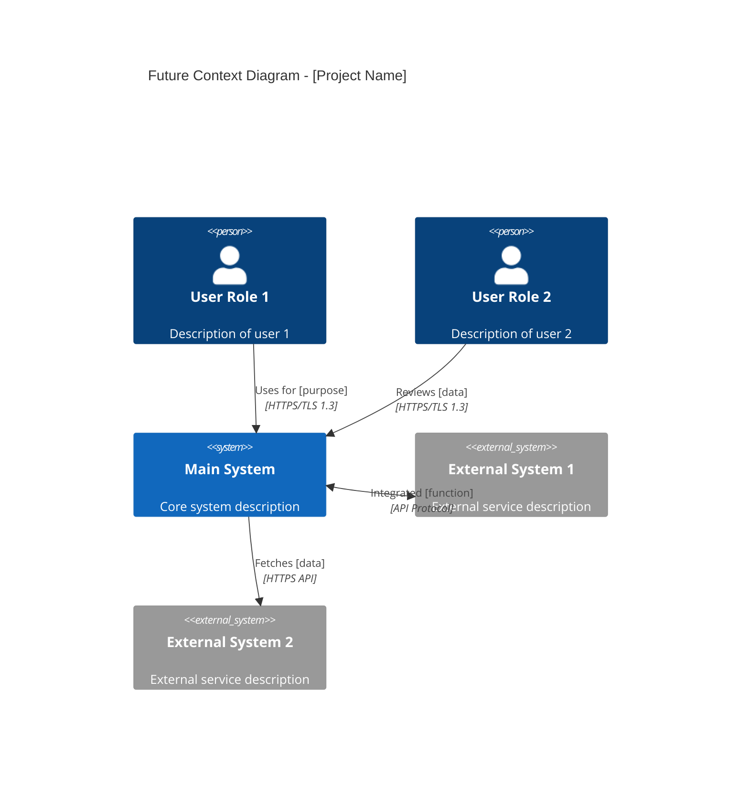
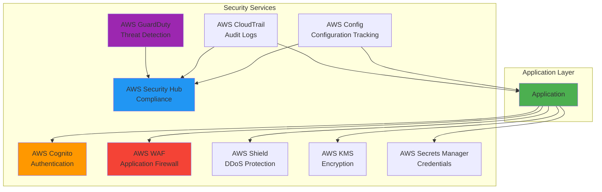
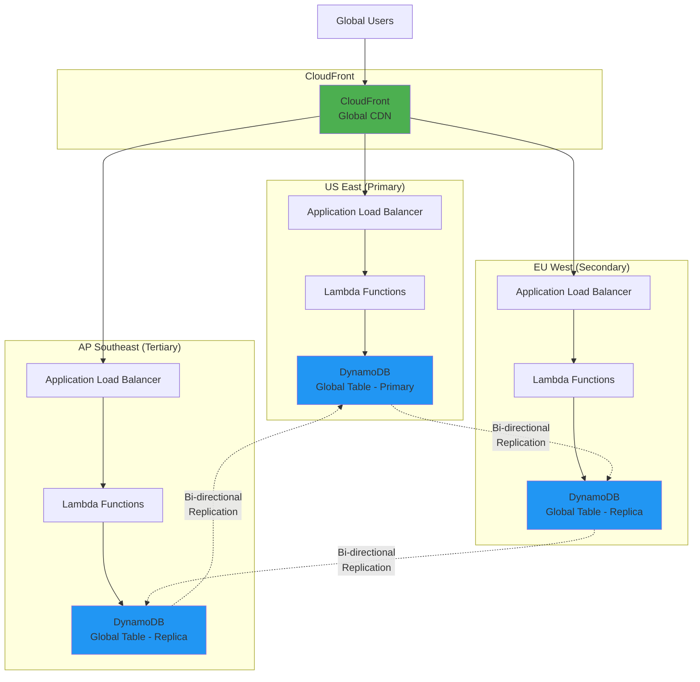
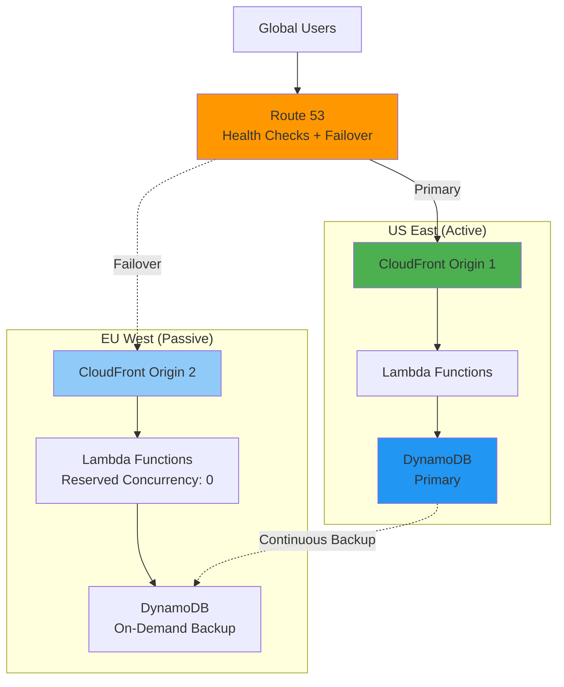
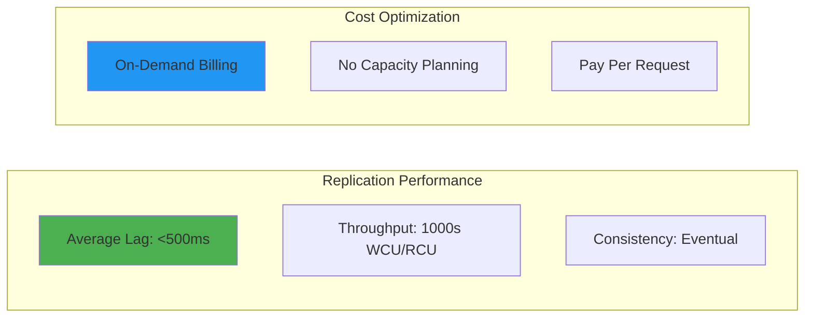
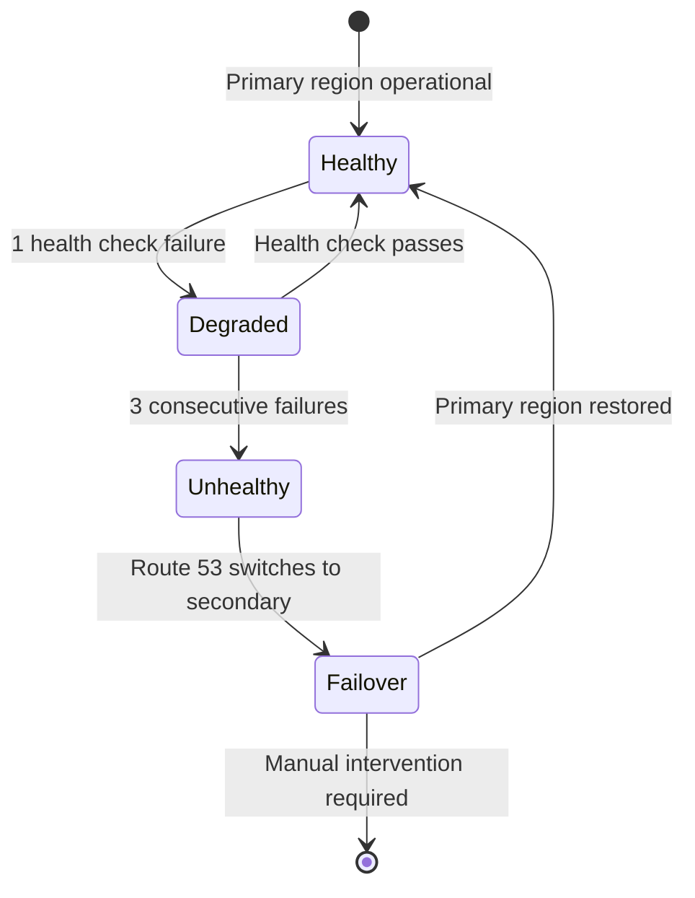
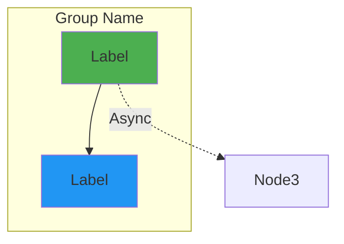
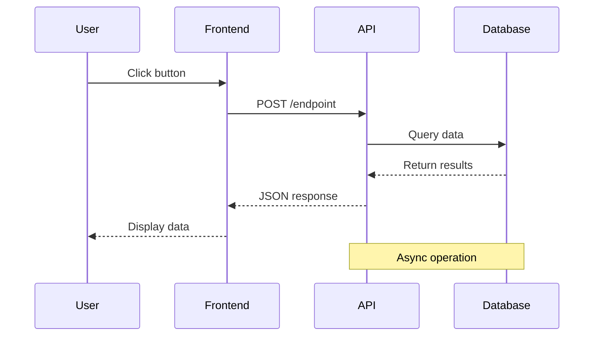
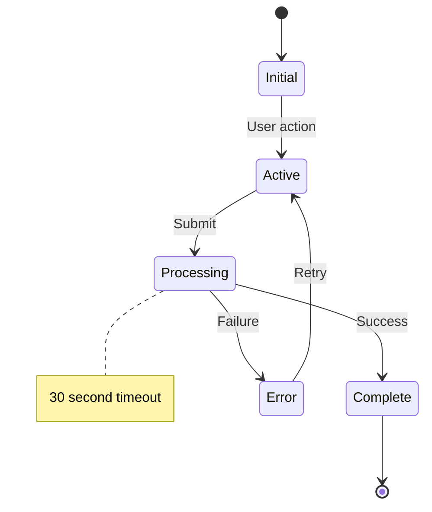

# Hack23 FUTURE_ARCHITECTURE.md Standards

**Skill Type:** Documentation Architecture  
**Domain:** Future State Planning & Architectural Evolution  
**Last Updated:** 2026-02-11  
**Reference Implementation:** [CIA Compliance Manager FUTURE_ARCHITECTURE.md](https://github.com/Hack23/cia-compliance-manager/blob/main/docs/architecture/FUTURE_ARCHITECTURE.md) (65 KB, 1,326 lines, 15+ diagrams)

## 🎯 Purpose

This skill documents the **complete Hack23 standard** for creating FUTURE_ARCHITECTURE.md documents that outline the architectural evolution roadmap for projects. Based on the gold standard CIA Compliance Manager implementation, this guide ensures consistency, comprehensiveness, and quality across all Hack23 repositories.

## 📋 Table of Contents

1. [Document Structure Requirements](#document-structure-requirements)
2. [Header Format & Metadata](#header-format--metadata)
3. [Related Documentation Table](#related-documentation-table)
4. [C4 Model Requirements](#c4-model-requirements)
5. [AWS Well-Architected Framework Checklist](#aws-well-architected-framework-checklist)
6. [AWS Security Services Integration](#aws-security-services-integration)
7. [Multi-Region Strategy Templates](#multi-region-strategy-templates)
8. [Mermaid Diagram Standards](#mermaid-diagram-standards)
9. [Content Sections Guide](#content-sections-guide)
10. [Quality Standards](#quality-standards)

---

## 1. Document Structure Requirements

### 1.1 Minimum Document Structure

Every FUTURE_ARCHITECTURE.md MUST include:

```markdown
# [Project Name] Future Architecture

**Version:** X.X-DRAFT | **Based on:** vX.X Baseline | **Last Updated:** YYYY-MM-DD | **Status:** 🚀 Evolution Roadmap

[Executive summary paragraph explaining the evolution vision]

## 🎯 v[Current] Baseline → v[Future] Evolution

### **v[Current] Achievements (Current State)**
- ✅ List of current achievements (10-15 items)

### **v[Future] Vision (Future State)**
- 🚀 List of future enhancements (8-12 items)

## 📚 Related Architecture Documentation

[Related docs table - see section 3]

## 🏗️ Architectural Vision Overview

[Vision principles section]

## 🌐 Future C4 Context Diagram

[C4 Context diagram]

## 🏗️ Future C4 Container Diagram

[C4 Container diagram]

## 🏛️ AWS Well-Architected Framework Alignment

[5 pillars section]

## [Additional Architecture Sections]

## 💡 Business Impact & ROI Analysis

[Cost comparison and benefits]

## 📝 Conclusion

[Comprehensive conclusion summarizing vision]
```

### 1.2 Section Hierarchy

- **H1 (`#`)**: Document title only
- **H2 (`##`)**: Major sections (8-15 sections)
- **H3 (`###`)**: Subsections within major sections
- **H4 (`####`)**: Sub-subsections for detailed breakdowns

### 1.3 Document Length Guidelines

- **Target Length**: 800-1,500 lines (excluding Mermaid diagrams)
- **Minimum**: 600 lines for smaller projects
- **Reference**: CIA Compliance Manager = 1,326 lines

---

## 2. Header Format & Metadata

### 2.1 Document Header Template

```markdown
# [Project Name] Future Architecture

**Version:** X.X-DRAFT | **Based on:** vX.X Baseline | **Last Updated:** YYYY-MM-DD | **Status:** 🚀 Evolution Roadmap

[1-2 paragraph executive summary explaining the architectural evolution vision]
```

### 2.2 Version Format

- **Format**: `X.X-DRAFT` (e.g., `2.0-DRAFT`, `3.0-DRAFT`)
- **Based on**: Reference the current baseline version (e.g., `v1.0 Baseline`)
- **Status Emoji**: Always use 🚀 to indicate evolution roadmap

### 2.3 Executive Summary Requirements

The opening paragraph MUST:
- Explain the transformation vision (1-2 paragraphs)
- Mention key technologies/platforms (e.g., "AWS-powered serverless")
- Reference current state and future capabilities
- Be concise yet comprehensive (100-200 words)

**Example:**
```markdown
This document outlines the comprehensive architectural evolution roadmap for the [Project], 
detailing how the system will transform from [current state] into [future state] with 
[key capabilities]. This transformation leverages [strategic advantage] to deliver 
enterprise-grade capabilities while maintaining [core principles].
```

---

## 3. Related Documentation Table

### 3.1 Required Table Structure

Every FUTURE_ARCHITECTURE.md MUST include a comprehensive documentation map with **16 documents minimum**:

```markdown
## 📚 Related Architecture Documentation

<div class="documentation-map">

### Current Architecture (v[X.X] Baseline)
| Document                                            | Focus           | Description                               |
| --------------------------------------------------- | --------------- | ----------------------------------------- |
| **[Current Architecture](ARCHITECTURE.md)**         | 🏛️ Architecture | C4 model showing v[X.X] structure |
| **[Security Architecture](SECURITY_ARCHITECTURE.md)** | 🛡️ Security   | v[X.X] security controls implementation |
| **[State Diagrams](STATEDIAGRAM.md)**               | 🔄 Behavior     | Current system state transitions          |
| **[Process Flowcharts](FLOWCHART.md)**              | 🔄 Process      | Current workflows     |
| **[Mindmaps](MINDMAP.md)**                          | 🧠 Concept      | Current system relationships    |
| **[SWOT Analysis](SWOT.md)**                        | 💼 Business     | Current strategic assessment              |
| **[CI/CD Workflows](WORKFLOWS.md)**                 | 🔧 DevOps       | Current automation         |
| **[Data Model](DATA_MODEL.md)**                     | 📊 Data         | Current data structures       |

### Future Architecture Evolution (v[X.X]+)
| Document                                            | Focus           | Description                               |
| --------------------------------------------------- | --------------- | ----------------------------------------- |
| **[Future Architecture](FUTURE_ARCHITECTURE.md)**   | 🚀 Evolution    | This document: [type] roadmap     |
| **[Future Security Architecture](FUTURE_SECURITY_ARCHITECTURE.md)** | 🛡️ Security | Planned security enhancements |
| **[Future State Diagrams](FUTURE_STATEDIAGRAM.md)** | 🔄 Behavior     | Enhanced state transitions           |
| **[Future Flowcharts](FUTURE_FLOWCHART.md)**        | 🔄 Process      | Enhanced workflows          |
| **[Future Mindmaps](FUTURE_MINDMAP.md)**            | 🧠 Concept      | Future capability evolution               |
| **[Future SWOT Analysis](FUTURE_SWOT.md)**          | 💼 Business     | Future strategic opportunities            |
| **[Future Workflows](FUTURE_WORKFLOWS.md)**         | 🔧 DevOps       | Enhanced CI/CD integration       |
| **[Future Data Model](FUTURE_DATA_MODEL.md)**       | 📊 Data         | Enhanced data architecture           |

</div>
```

### 3.2 Table Column Requirements

- **Document**: Linked filename with Markdown link syntax
- **Focus**: Emoji + category (🏛️ Architecture, 🛡️ Security, 🔄 Behavior/Process, 🧠 Concept, 💼 Business, 🔧 DevOps, 📊 Data)
- **Description**: Brief 5-10 word description

### 3.3 Emoji Standards

- 🏛️ **Architecture** - System structure and design
- 🛡️ **Security** - Security controls and compliance
- 🔄 **Behavior/Process** - State transitions and workflows
- 🧠 **Concept** - System relationships and mindmaps
- 💼 **Business** - Strategic analysis (SWOT)
- 🔧 **DevOps** - CI/CD and automation
- 📊 **Data** - Data models and structures
- 🚀 **Evolution** - Future state planning

---

## 4. C4 Model Requirements

### 4.1 Required C4 Diagrams

Every FUTURE_ARCHITECTURE.md MUST include **at minimum**:

1. **C4 Context Diagram** - System-level external view
2. **C4 Container Diagram** - Component-level architecture

### 4.2 C4 Context Diagram Template

```markdown
## 🌐 Future C4 Context Diagram - [System Name]

**💼 Business Focus:** Illustrates how the enhanced platform serves multiple stakeholder 
roles with [backend services] supporting enterprise-scale [capabilities].

**🔒 Security Focus:** Defines trust boundaries with [security services] providing 
comprehensive threat protection across the entire stack.



### **[Technology] Integration Highlights**

- **🔐 Component 1**: Description of integration
- **🛡️ Component 2**: Description of integration
- **⚡ Component 3**: Description of integration
```

### 4.3 C4 Context Diagram Requirements

**Mandatory Elements:**
- **Personas**: 4-6 user roles with descriptions
- **Main System**: Central system being described
- **External Systems**: 5-10 external integrations
- **Relationships**: Clear directional arrows with protocols
- **Business Focus Statement**: Explains stakeholder value
- **Security Focus Statement**: Explains trust boundaries
- **Integration Highlights**: 4-6 bullet points with emojis

**Styling Requirements:**
- Use `UpdateLayoutConfig($c4ShapeInRow="3", $c4BoundaryInRow="1")` for layout
- Include protocol details (HTTPS/TLS 1.3, AWS API, REST/GraphQL)
- Use `BiRel()` for bidirectional relationships
- Use `Rel()` for unidirectional relationships

### 4.4 C4 Container Diagram Template

```markdown
## 🏗️ Future C4 Container Diagram - [Architecture Type]

**🏛️ Architecture Focus:** Shows the comprehensive [architecture type] design with 
[key components] and integrated [services].

**🔧 Technical Focus:** Illustrates the [approach] with [technologies], 
[data strategy], and comprehensive [capabilities].

```mermaid
C4Container
  title Future Container Diagram - [Project Name]

  Person(user, "User", "System user")
  
  System_Boundary(mainSystem, "Main System Platform") {
    Container(frontend, "Frontend", "Technology Stack", "Frontend description")
    Container(api, "API Layer", "Technology Stack", "API description")
    Container(compute, "Compute Layer", "Technology Stack", "Compute description")
    ContainerDb(database, "Database", "Technology Stack", "Data storage description")
  }
  
  System_Boundary(securityServices, "Security Services") {
    Container(security1, "Security Service 1", "Technology", "Security function 1")
    Container(security2, "Security Service 2", "Technology", "Security function 2")
  }
  
  System_Ext(external, "External Service", "External service description")
  
  Rel(user, frontend, "Uses", "HTTPS/TLS 1.3")
  Rel(frontend, api, "API calls", "REST/GraphQL")
  Rel(api, compute, "Invokes", "Internal")
  Rel(compute, database, "Reads/Writes", "Internal")
  
  BiRel(mainSystem, securityServices, "Integrated monitoring", "Internal")
  BiRel(mainSystem, external, "Data sync", "HTTPS API")
```

### **[Architecture Type] Highlights**

#### **Frontend Layer**
- Description of frontend components
- Key technologies and frameworks

#### **API Layer**
- Description of API components
- Authentication and protocols

#### **Compute Layer**
- Description of compute components
- Scaling and orchestration

#### **Data Layer**
- Description of data components
- Replication and resilience
```

### 4.5 C4 Container Diagram Requirements

**Mandatory Elements:**
- **System Boundaries**: 2-3 bounded contexts using `System_Boundary()`
- **Containers**: 8-15 containers showing major components
- **Databases**: Use `ContainerDb()` for data stores
- **External Systems**: 3-5 external integrations
- **Relationships**: Clear data flows with protocols
- **Architecture Focus Statement**: Technical architecture explanation
- **Technical Focus Statement**: Implementation approach explanation
- **Architecture Highlights**: 4-6 subsections with emoji headers

**Styling Requirements:**
- Group related containers in `System_Boundary()` blocks
- Use technology stack descriptions (e.g., "React 19.x, TypeScript 5.9")
- Include internal vs external protocol distinctions
- Use descriptive relationship labels

---

## 5. AWS Well-Architected Framework Checklist

### 5.1 Required Five Pillars

Every AWS-based FUTURE_ARCHITECTURE.md MUST include all 5 pillars:

```markdown
## 🏛️ AWS Well-Architected Framework Alignment

This future architecture fully aligns with the AWS Well-Architected Framework across 
all five pillars: Security, Reliability, Performance Efficiency, Cost Optimization, 
and Operational Excellence.

### **🔒 Security Pillar**

#### **1. Identity & Access Management**
[IAM implementation details]

#### **2. Detection & Response**
[Detection mechanisms]

#### **3. Infrastructure Protection**
[Network security controls]

#### **4. Data Protection**
[Encryption and data security]

#### **5. Incident Response**
[Incident response procedures]

### **⚡ Reliability Pillar**

#### **1. Foundations**
[Reliability foundations]

#### **2. Change Management**
[Change control processes]

#### **3. Failure Management**
[Fault tolerance and recovery]

### **⚡ Performance Efficiency Pillar**

#### **1. Selection**
[Technology selection rationale]

#### **2. Review**
[Performance monitoring]

#### **3. Monitoring**
[Metrics and observability]

#### **4. Tradeoffs**
[Performance tradeoffs]

### **💰 Cost Optimization Pillar**

#### **1. Practice Cloud Financial Management**
[Cost management practices]

#### **2. Expenditure and Usage Awareness**
[Cost monitoring]

#### **3. Cost-Effective Resources**
[Resource optimization]

#### **4. Manage Demand and Supply Resources**
[Scaling strategies]

#### **5. Optimize Over Time**
[Continuous optimization]

### **🔧 Operational Excellence Pillar**

#### **1. Organization**
[Organizational practices]

#### **2. Prepare**
[Preparation procedures]

#### **3. Operate**
[Operational procedures]

#### **4. Evolve**
[Evolution and improvement]

### **Well-Architected Tool Integration**

**Automated Assessment:**
- AWS Well-Architected Tool integration for continuous assessment
- Custom lenses for [domain-specific] best practices
- Quarterly reviews with improvement backlog
```

### 5.2 Security Pillar Details

**Required Subsections (5 minimum):**

1. **Identity & Access Management**
   - AWS IAM policies and roles
   - Least privilege implementation
   - MFA requirements
   - Federation and SSO

2. **Detection & Response**
   - AWS GuardDuty setup
   - AWS Security Hub configuration
   - CloudWatch alarms
   - Automated response procedures

3. **Infrastructure Protection**
   - VPC architecture
   - Security groups and NACLs
   - WAF rules
   - DDoS protection

4. **Data Protection**
   - AWS KMS encryption
   - Data classification
   - Encryption at rest and in transit
   - Backup and recovery

5. **Incident Response**
   - CloudTrail logging
   - EventBridge automation
   - Forensics capabilities
   - Quarantine procedures

### 5.3 Reliability Pillar Details

**Required Subsections (3 minimum):**

1. **Foundations**
   - Multi-AZ deployment
   - Service quotas
   - Network topology
   - Monitoring baselines

2. **Change Management**
   - Infrastructure as Code (IaC)
   - Automated testing
   - Deployment strategies
   - Rollback procedures

3. **Failure Management**
   - Health checks
   - Auto-scaling
   - Disaster recovery
   - Backup and restore

### 5.4 Performance Efficiency Pillar Details

**Required Subsections (4 minimum):**

1. **Selection**
   - Compute selection (Lambda sizing, EC2 instances)
   - Storage selection (DynamoDB, S3, EFS)
   - Network selection (CloudFront, VPC)
   - Database selection

2. **Review**
   - Performance testing
   - Load testing
   - Benchmarking
   - Continuous monitoring

3. **Monitoring**
   - CloudWatch metrics
   - X-Ray tracing
   - Custom metrics
   - Dashboards

4. **Tradeoffs**
   - Consistency vs. latency
   - Durability vs. performance
   - Cost vs. performance
   - Complexity vs. maintainability

### 5.5 Cost Optimization Pillar Details

**Required Subsections (5 minimum):**

1. **Cloud Financial Management**
   - Cost allocation tags
   - Budgets and forecasts
   - FinOps practices
   - Savings plans

2. **Expenditure and Usage Awareness**
   - Cost Explorer
   - Billing alerts
   - Usage dashboards
   - Anomaly detection

3. **Cost-Effective Resources**
   - Right-sizing
   - Savings Plans and Reserved Instances
   - Spot instances
   - S3 storage classes

4. **Manage Demand and Supply**
   - Auto-scaling policies
   - DynamoDB on-demand
   - Lambda concurrency limits
   - Queue-based load leveling

5. **Optimize Over Time**
   - Regular reviews
   - New service adoption
   - Lifecycle policies
   - Continuous improvement

### 5.6 Operational Excellence Pillar Details

**Required Subsections (4 minimum):**

1. **Organization**
   - Priorities and goals
   - Team structure
   - Shared understanding
   - Culture of ownership

2. **Prepare**
   - Design for operations
   - Operational readiness
   - Runbooks and playbooks
   - Observability

3. **Operate**
   - Understanding operational health
   - Responding to events
   - Managing workload changes
   - Continuous improvement

4. **Evolve**
   - Learning from experience
   - Sharing knowledge
   - Continuous experimentation
   - Regular reviews

---

## 6. AWS Security Services Integration

### 6.1 Required Security Services

Every AWS-based FUTURE_ARCHITECTURE.md MUST document these security services:

```markdown
## 🛡️ AWS Security Services Deep Dive

### **1. Identity & Access Management**

**AWS IAM:**
- Fine-grained policies with least privilege
- Service-specific roles for Lambda, API Gateway, etc.
- Conditional access based on IP, time, MFA
- Identity-based and resource-based policies

**AWS Cognito:**
- User pools for authentication
- Identity pools for AWS resource access
- MFA enforcement
- Custom authentication flows

**AWS Organizations:**
- Service Control Policies (SCPs)
- Centralized billing
- Account isolation
- Organizational units (OUs)

### **2. Threat Detection & Response**

**AWS GuardDuty:**
- Threat intelligence feeds
- VPC Flow Log analysis
- DNS query log analysis
- CloudTrail event analysis
- Automated findings

**AWS Security Hub:**
- CIS AWS Foundations Benchmark
- PCI DSS compliance checks
- AWS Foundational Security Best Practices
- Aggregated findings from GuardDuty, Inspector, Macie
- Custom insights and dashboards

### **3. Application Protection**

**AWS WAF:**
- OWASP Top 10 rule sets
- Rate limiting
- Geo-blocking
- IP reputation lists
- Custom rules for application logic

**AWS Shield:**
- Standard DDoS protection (free)
- Advanced DDoS protection with cost protection
- 24/7 DRT support
- Real-time attack visibility

### **4. Data Protection**

**AWS KMS:**
- Customer-managed keys (CMKs)
- Automatic key rotation
- Envelope encryption
- CloudHSM integration for FIPS 140-2 Level 3

**AWS Secrets Manager:**
- Automatic rotation of secrets
- Integration with RDS, Redshift, DocumentDB
- Fine-grained access control
- Audit trail via CloudTrail

### **5. Monitoring & Compliance**

**AWS CloudTrail:**
- API activity logging
- Multi-region trails
- Log file integrity validation
- Integration with CloudWatch Logs

**AWS Config:**
- Configuration history
- Compliance rules
- Conformance packs
- Automated remediation

**AWS Audit Manager:**
- Pre-built frameworks (ISO 27001, SOC 2, PCI DSS)
- Evidence collection
- Audit reports
- Continuous assessment
```

### 6.2 Integration Diagram Template



---

## 7. Multi-Region Strategy Templates

### 7.1 Required Multi-Region Section

```markdown
## 🌍 Multi-Region Architecture

### **Global Deployment Topology**

**Primary Region:** [region-1] ([location])
- Production workloads
- Read/write database
- CloudFront origin
- Primary user traffic

**Secondary Region:** [region-2] ([location])
- Disaster recovery
- Read replica database
- Failover origin
- GDPR compliance (EU data residency)

**Tertiary Region:** [region-3] ([location]) [Optional]
- Additional redundancy
- Regional compliance
- Performance optimization

### **Multi-Region Design Patterns**

#### **Active-Active (Recommended for High Availability)**



**Characteristics:**
- All regions actively serve traffic
- Lowest latency (users routed to nearest region)
- Highest availability (99.99%+)
- Highest cost (all regions fully provisioned)
- DynamoDB Global Tables for bi-directional replication
- CloudFront geolocation routing

#### **Active-Passive (Cost-Effective DR)**



**Characteristics:**
- Only primary region serves traffic normally
- Secondary region on standby (minimal cost)
- Medium availability (99.9%)
- Low cost (secondary region minimal resources)
- Route 53 health check triggers failover
- DynamoDB point-in-time recovery or on-demand backup

### **Data Replication Strategies**

#### **DynamoDB Global Tables**
- **Replication Lag**: <1 second typical
- **Conflict Resolution**: Last-writer-wins
- **Cost**: Standard DynamoDB pricing in each region
- **Use Case**: Real-time multi-region writes

#### **S3 Cross-Region Replication (CRR)**
- **Replication Lag**: <15 minutes typical
- **Versioning**: Required
- **Cost**: Data transfer + storage in secondary region
- **Use Case**: Static assets, backups, compliance

#### **Aurora Global Database**
- **Replication Lag**: <1 second typical
- **RPO**: <1 second
- **RTO**: <1 minute
- **Use Case**: Relational database workloads

### **Failover Procedures**

#### **Automated Failover (Route 53)**
```yaml
Trigger: Health check failure (3 consecutive failures at 30s intervals)
Detection Time: 90 seconds
DNS TTL: 60 seconds
Total Failover Time: <3 minutes
```

#### **Manual Failover (Disaster Scenario)**
```bash
# 1. Verify secondary region health
aws cloudwatch get-metric-statistics --region eu-west-1 ...

# 2. Update Route 53 to point to secondary
aws route53 change-resource-record-sets --hosted-zone-id Z123 ...

# 3. Verify traffic routing
curl -I https://example.com

# 4. Notify stakeholders
aws sns publish --topic-arn arn:aws:sns:us-east-1:123456789012:alerts ...

# Total Time: <5 minutes
```

### **Regional Compliance Considerations**

| Region | Compliance Frameworks | Data Residency | Notes |
|--------|----------------------|----------------|-------|
| **us-east-1** | HIPAA, SOC 2, PCI DSS | US only | Primary production |
| **eu-west-1** | GDPR, ISO 27001 | EU only | GDPR compliance |
| **ap-southeast-1** | ISO 27001, SOC 2 | APAC only | Optional expansion |
```

### 7.2 DynamoDB Global Tables Template

```markdown
### **DynamoDB Global Tables Architecture**

#### **Table Configuration**

```json
{
  "TableName": "AssessmentData",
  "GlobalSecondaryIndexes": [
    {
      "IndexName": "OrgIdIndex",
      "KeySchema": [
        {"AttributeName": "orgId", "KeyType": "HASH"},
        {"AttributeName": "timestamp", "KeyType": "RANGE"}
      ]
    }
  ],
  "StreamSpecification": {
    "StreamEnabled": true,
    "StreamViewType": "NEW_AND_OLD_IMAGES"
  },
  "ReplicationGroup": [
    {"RegionName": "us-east-1"},
    {"RegionName": "eu-west-1"},
    {"RegionName": "ap-southeast-1"}
  ]
}
```

#### **Key Design Decisions**

| Aspect | Decision | Rationale |
|--------|----------|-----------|
| **Partition Key** | Composite (orgId + timestamp) | Even distribution, query flexibility |
| **Billing Mode** | On-Demand | Unpredictable traffic, cost optimization |
| **Encryption** | AWS-managed CMK | Compliance, minimal operational overhead |
| **Point-in-Time Recovery** | Enabled (35 days) | Compliance, data protection |
| **DynamoDB Streams** | Enabled | EventBridge integration, audit trail |

#### **Replication Metrics**



**Performance Characteristics:**
- **Write Latency**: <10ms (single-digit millisecond)
- **Read Latency**: <10ms (single-digit millisecond)
- **Replication Lag**: <1 second across all regions
- **Throughput**: Unlimited (on-demand mode)
```

### 7.3 Route 53 Failover Template

```markdown
### **Route 53 Health Checks & Failover**

#### **Health Check Configuration**

```json
{
  "Type": "HTTPS",
  "ResourcePath": "/health",
  "FullyQualifiedDomainName": "api.example.com",
  "Port": 443,
  "RequestInterval": 30,
  "FailureThreshold": 3,
  "MeasureLatency": true,
  "EnableSNI": true,
  "Regions": [
    "us-east-1",
    "eu-west-1",
    "ap-southeast-1"
  ]
}
```

#### **Failover Policy**



**Failover Timing:**
- **Detection**: 90 seconds (3 failures × 30s interval)
- **DNS Propagation**: 60 seconds (TTL)
- **Total RTO**: <3 minutes

#### **CloudWatch Alarms**

```yaml
PrimaryRegionUnhealthy:
  Metric: Route53HealthCheckStatus
  Threshold: < 1.0
  EvaluationPeriods: 3
  DatapointsToAlarm: 3
  Actions:
    - SNS notification to on-call team
    - EventBridge trigger for automated response
    - PagerDuty alert
```
```

---

## 8. Mermaid Diagram Standards

### 8.1 Required Diagram Types

Every FUTURE_ARCHITECTURE.md MUST include **minimum 8 diagrams**:

1. ✅ **C4 Context Diagram** (C4Context)
2. ✅ **C4 Container Diagram** (C4Container)
3. ✅ **Multi-Region Architecture** (graph TB/LR)
4. ✅ **Security Services Integration** (graph TB)
5. ✅ **Data Flow Diagram** (graph TB/LR)
6. ✅ **State Diagram** (stateDiagram-v2)
7. ✅ **Sequence Diagram** (sequenceDiagram)
8. ✅ **Deployment Pipeline** (graph LR)

### 8.2 Mermaid Diagram Quality Standards

#### 8.2.1 C4 Diagrams (Context & Container)

**Syntax:**
```mermaid
C4Context
  title [Descriptive Title]
  
  Person(id, "Role Name", "Description")
  System(id, "System Name", "Description")
  System_Ext(id, "External System", "Description")
  System_Boundary(id, "Boundary Name") { }
  
  Rel(from, to, "Action", "Protocol")
  BiRel(from, to, "Bidirectional action", "Protocol")
  
  UpdateLayoutConfig($c4ShapeInRow="3", $c4BoundaryInRow="1")
```

**Requirements:**
- Use `UpdateLayoutConfig()` for consistent layout
- Include protocol/technology in relationship labels
- Use `BiRel()` for bidirectional data flows
- Use `System_Boundary()` to group related components

#### 8.2.2 Graph Diagrams (TB/LR)

**Syntax:**


**Requirements:**
- Use `subgraph` to group related components
- Use solid arrows (`-->`) for primary flows
- Use dashed arrows (`-.->`) for secondary/async flows
- Include labels on arrows for clarity
- Apply color styling consistently

#### 8.2.3 Sequence Diagrams

**Syntax:**


**Requirements:**
- Use meaningful participant names
- Include request/response protocols
- Add notes for important details
- Use `-->>` for return messages

#### 8.2.4 State Diagrams

**Syntax:**


**Requirements:**
- Use `stateDiagram-v2` for modern syntax
- Include transition labels
- Add notes for important timing/conditions
- Show all possible state transitions

### 8.3 Color Scheme Standards

**Standard Color Palette:**
```css
Primary: #4caf50   /* Green - Active/Primary */
Secondary: #2196f3 /* Blue - Supporting */
Warning: #ff9800   /* Orange - Attention */
Danger: #f44336    /* Red - Critical */
Accent: #9c27b0    /* Purple - External */
Info: #00bcd4      /* Cyan - Information */
Neutral: #90caf9   /* Light Blue - Passive */
```

**Color Usage Guidelines:**
- **Green (#4caf50)**: Primary components, active state, success
- **Blue (#2196f3)**: Data stores, supporting services
- **Orange (#ff9800)**: Security services, attention required
- **Red (#f44336)**: Error states, critical alerts
- **Purple (#9c27b0)**: External systems, third-party integrations
- **Cyan (#00bcd4)**: Information, metadata
- **Light Blue (#90caf9)**: Passive/standby components

### 8.4 Diagram Complexity Guidelines

**Simple Diagrams (5-10 nodes):**
- High-level overviews
- Executive summaries
- Single responsibility focus

**Medium Diagrams (10-20 nodes):**
- Technical architecture
- Component interactions
- Standard complexity

**Complex Diagrams (20-30 nodes):**
- Comprehensive system views
- Multiple subsystems
- Maximum recommended complexity

**⚠️ Warning:** Diagrams with >30 nodes become unreadable. Split into multiple focused diagrams instead.

### 8.5 Diagram Documentation Requirements

Every diagram MUST include:

1. **Title**: Descriptive heading above diagram
2. **Focus Statement**: 1-2 sentences explaining what the diagram shows
3. **Legend/Key**: If using custom colors or symbols
4. **Highlights Section**: Bullet points explaining key elements (after diagram)

**Example:**
```markdown
## 🌐 Future C4 Context Diagram - AWS Serverless Ecosystem

**💼 Business Focus:** Illustrates how the enhanced platform serves multiple stakeholder 
roles with AWS-powered backend services supporting enterprise-scale security assessment.

**🔒 Security Focus:** Defines trust boundaries with AWS security services providing 
comprehensive threat protection across the entire stack.

```mermaid
[Diagram code here]
```

### **AWS Integration Highlights**

- **🔐 AWS Cognito**: Enterprise authentication with MFA
- **🛡️ AWS Security Services**: GuardDuty, Security Hub, WAF integration
- **⚡ AWS Resilience Hub**: Automated disaster recovery
```

---

## 9. Content Sections Guide

### 9.1 Executive Summary Section

```markdown
# [Project Name] Future Architecture

**Version:** X.X-DRAFT | **Based on:** vX.X Baseline | **Last Updated:** YYYY-MM-DD | **Status:** 🚀 Evolution Roadmap

[Opening paragraph explaining the transformation vision - 100-150 words]

[Second paragraph describing key technologies and strategic advantages - 50-100 words]
```

### 9.2 Current vs Future Comparison

```markdown
## 🎯 v[Current] Baseline → v[Future] Evolution

### **v[Current] Achievements (Current State)**
- ✅ **Achievement 1**: Description of current capability
- ✅ **Achievement 2**: Description of current capability
[10-15 achievements total]

### **v[Future] Vision (Future State)**
- 🚀 **Enhancement 1**: Description of future capability
- 🚀 **Enhancement 2**: Description of future capability
[8-12 enhancements total]
```

**Requirements:**
- Use ✅ emoji for current achievements
- Use 🚀 emoji for future enhancements
- Bold the technology/feature name
- Include brief description for each
- Maintain parallel structure

### 9.3 Architectural Vision Section

```markdown
## 🏗️ Architectural Vision Overview

<div class="vision-principles">

[Opening paragraph - transformation narrative - 100-150 words]

### **Core Architectural Principles**

- **☁️ Principle 1 Name:** Description of principle (20-40 words)
- **🌍 Principle 2 Name:** Description of principle (20-40 words)
[8-12 principles total]

### **[Strategic Partnership] Advantage**

As a strategic [partner] with [provider], [Organization] leverages [provider's] 
infrastructure to deliver:
- **Benefit 1**: Description
- **Benefit 2**: Description
[6-8 benefits total]

</div>
```

### 9.4 Business Impact & ROI Section

```markdown
## 💡 Business Impact & ROI Analysis

### **Cost Comparison: Traditional vs [Solution]**

| Aspect | Traditional Infrastructure | [Solution] | Savings |
|--------|---------------------------|------------|---------|
| **Initial Investment** | $XX,XXX-XX,XXX | $X,XXX | XX% CapEx saved |
| **Monthly Operational Cost** | $X,XXX-XX,XXX | $X,XXX-X,XXX | XX-XX% savings |
| **Operations Team** | X-X FTEs | X.X FTE | XX-XX% reduction |
[5-8 rows total]

### **Total Cost of Ownership (3 Years)**

| Solution | Year 1 | Year 2 | Year 3 | Total 3-Year Cost |
|----------|--------|--------|--------|-------------------|
| **Traditional** | $XXX,XXX | $XX,XXX | $XX,XXX | $XXX,XXX |
| **[Solution]** | $XX,XXX | $XX,XXX | $XX,XXX | $XXX,XXX |
| **Net Savings** | $XX,XXX | $XX,XXX | $XX,XXX | **$XXX,XXX (XX%)** |

### **Business Benefits Beyond Cost**

#### **Time to Market**
- **Traditional**: X-XX months for [activity]
- **[Solution]**: X-X months leveraging [advantage]
- **Benefit**: XX% faster deployment, earlier [benefit]

[3-5 benefit categories total]

### **Risk Mitigation**

| Risk | Traditional Approach | [Solution] Approach |
|------|---------------------|---------------------|
| **Risk 1** | Manual process, delayed response | Automated process, immediate response |
[5-8 risks total]
```

### 9.5 Conclusion Section

```markdown
## 📝 Conclusion

The future architecture of [Project Name] represents a transformative evolution from 
[current state] into [future state]. This architectural vision leverages [strategic advantage] 
to deliver [key capabilities] while maintaining [core values].

### **Key Architectural Achievements**

#### **From v[X.X] to v[Y.Y]**
- **Current Excellence**: Building on [current strengths]
- **Future Enhancement 1**: Adding [capability]
- **Future Enhancement 2**: Implementing [capability]
[4-6 enhancements total]

#### **[Framework] Alignment**
- **Pillar 1**: Description of alignment
- **Pillar 2**: Description of alignment
[5 pillars for AWS Well-Architected Framework]

#### **[Domain-Specific] Intelligence**
- **Capability 1**: Description
- **Capability 2**: Description
[3-5 capabilities]

#### **[Integration] Ecosystem**
- **Integration 1**: Description
- **Integration 2**: Description
[3-4 integrations]

### **Strategic Value Proposition**

#### **Business Impact**
- **XX% Cost Reduction**: $XXX,XXX savings over X years
- **XX% Faster Time to Market**: [Benefit description]
- **Zero CapEx**: No upfront [investment type]
- **Unlimited [Capability]**: [Scaling benefit]

#### **Technical Excellence**
- **XX.XX% Availability**: [Architecture description]
- **Sub-XXms Latency**: [Performance description]
- **Global [Capability]**: [Geographic description]
- **< X Minute RTO**: [Recovery description]

#### **Security Leadership**
- **Continuous [Capability]**: [Security service] monitoring
- **Automated [Capability]**: [Service] for immediate [benefit]
- **[Framework] Automation**: [Service] for continuous [benefit]
- **Zero Trust Architecture**: [Implementation description]

### **Migration Roadmap Summary**

| Phase | Duration | Investment | Key Deliverables |
|-------|----------|------------|------------------|
| **Phase 1** | X-X months | $XX,XXX | [Deliverable 1], [Deliverable 2] |
| **Phase 2** | X-XX months | $XX,XXX | [Deliverable 1], [Deliverable 2] |
| **Phase 3** | XX-XX months | $XX,XXX | [Deliverable 1], [Deliverable 2] |
| **Phase 4** | XX-XX months | $XX,XXX | [Deliverable 1], [Deliverable 2] |
| **Total** | XX months | **$XX,XXX** | **[Complete solution description]** |

### **Path Forward**

[Comprehensive closing paragraph - transformation significance - 150-200 words]

[Value proposition paragraph - user benefits - 100-150 words]

[Vision alignment paragraph - industry trends and strategic positioning - 100-150 words]

[Final paragraph - business impact summary - 100-150 words]
```

**Requirements:**
- Conclusion must be **400-600 words minimum**
- Include all 4 subsections (Achievements, Value Proposition, Roadmap Summary, Path Forward)
- Use quantitative metrics (percentages, dollar amounts, time periods)
- Maintain inspirational yet grounded tone
- Reference specific technologies and frameworks

---

## 10. Quality Standards

### 10.1 Document Quality Checklist

**Structure (Required):**
- [ ] Document header with version, date, status
- [ ] Executive summary (100-200 words)
- [ ] Current vs Future comparison section
- [ ] Related documentation table (16 documents minimum)
- [ ] Architectural vision overview
- [ ] C4 Context diagram
- [ ] C4 Container diagram
- [ ] AWS Well-Architected Framework (5 pillars)
- [ ] Multi-region architecture section
- [ ] Business Impact & ROI analysis
- [ ] Comprehensive conclusion (400-600 words)

**Diagrams (Required):**
- [ ] Minimum 8 Mermaid diagrams
- [ ] At least 2 C4 diagrams (Context + Container)
- [ ] All diagrams have titles and focus statements
- [ ] Consistent color scheme applied
- [ ] Diagram complexity <30 nodes each

**Content Quality (Required):**
- [ ] No spelling or grammatical errors
- [ ] Technical accuracy verified
- [ ] All acronyms defined on first use
- [ ] Consistent terminology throughout
- [ ] All links verified and working
- [ ] Code blocks have proper syntax highlighting
- [ ] Tables properly formatted

**Completeness (Required):**
- [ ] All 5 AWS Well-Architected pillars documented
- [ ] Security services comprehensively covered
- [ ] Multi-region strategy explained
- [ ] Failover procedures documented
- [ ] Cost analysis with specific numbers
- [ ] Migration roadmap with timeline
- [ ] Risk mitigation strategies included

### 10.2 Document Length Guidelines

| Project Size | Minimum Lines | Target Lines | Maximum Lines |
|--------------|---------------|--------------|---------------|
| **Small** | 600 | 800 | 1,000 |
| **Medium** | 800 | 1,000 | 1,300 |
| **Large** | 1,000 | 1,300 | 1,500 |

**Note:** Line count excludes Mermaid diagram code but includes all prose content.

### 10.3 Review Cycle Requirements

Every FUTURE_ARCHITECTURE.md MUST be reviewed:
- **Quarterly**: Technical accuracy and technology updates
- **Bi-annually**: Cost analysis and business impact
- **Annually**: Complete architecture vision refresh

**Review Checklist:**
- [ ] Technology versions updated
- [ ] Cost estimates current
- [ ] Security services current with AWS updates
- [ ] Compliance frameworks current
- [ ] Migration roadmap adjusted based on progress
- [ ] Lessons learned from implementations incorporated

### 10.4 Version Control Standards

**Version Format:** `X.X-DRAFT` (e.g., `1.0-DRAFT`, `2.0-DRAFT`, `3.0-DRAFT`)

**Version Progression:**
- **0.1-DRAFT**: Initial draft, incomplete sections
- **0.5-DRAFT**: 50% complete, major sections drafted
- **0.9-DRAFT**: Near complete, final review needed
- **1.0-DRAFT**: Complete draft ready for implementation
- **2.0-DRAFT**: Major revision with significant changes
- **X.1-DRAFT**: Minor updates (quarterly reviews)

**Git Commit Messages:**
```
docs: Update FUTURE_ARCHITECTURE to v2.0-DRAFT

- Add AWS Lambda serverless compute section
- Update cost analysis with current pricing
- Add C4 Container diagram for API Gateway
- Document DynamoDB Global Tables strategy
- Update multi-region failover procedures

Ref: Quarterly architecture review Q1 2026
```

---

## 🎯 Summary: Gold Standard Compliance

To create a gold standard FUTURE_ARCHITECTURE.md document that matches CIA Compliance Manager quality:

### ✅ Mandatory Requirements

1. **Document Structure** (100% required)
   - Header with version, date, status
   - 16-document related documentation table
   - 8+ major sections
   - 400-600 word conclusion

2. **C4 Model Diagrams** (100% required)
   - C4 Context diagram with 6+ personas
   - C4 Container diagram with 8-15 containers
   - Architecture focus statements for each
   - Integration highlights after each diagram

3. **AWS Well-Architected Framework** (100% required for AWS projects)
   - All 5 pillars documented
   - 3-5 subsections per pillar
   - Security pillar with 5 subsections minimum
   - Well-Architected Tool integration mentioned

4. **AWS Security Services** (100% required for AWS projects)
   - 7 core services documented (IAM, Cognito, GuardDuty, Security Hub, WAF, KMS, CloudTrail)
   - Integration diagram showing service relationships
   - Implementation details for each service

5. **Multi-Region Architecture** (100% required for production systems)
   - Active-Active or Active-Passive strategy
   - DynamoDB Global Tables or equivalent
   - Route 53 health checks and failover
   - Replication lag and RTO/RPO metrics

6. **Mermaid Diagrams** (Minimum 8 required)
   - 2 C4 diagrams
   - 2 architecture diagrams
   - 1 sequence diagram
   - 1 state diagram
   - 2 supporting diagrams

7. **Business Impact Analysis** (100% required)
   - Cost comparison table
   - 3-year TCO analysis
   - Business benefits beyond cost
   - Risk mitigation table

### 🎨 Quality Indicators

- **Length**: 800-1,300 lines (excluding diagram code)
- **Diagrams**: 10-15 diagrams total
- **Tables**: 8-12 comparison tables
- **Sections**: 10-15 major sections
- **Subsections**: 30-50 subsections
- **Detail Level**: Technical yet accessible
- **Tone**: Professional, forward-looking, data-driven

### 🚀 Excellence Markers

Documents that exceed gold standard include:
- **15+ Mermaid diagrams** (CIA Compliance Manager has 15+)
- **Detailed implementation examples** (JSON, YAML, bash scripts)
- **Comprehensive cost breakdowns** (3-year TCO with annual detail)
- **Migration roadmap** (4-phase plan with timeline and investment)
- **Specific metrics** (99.99% availability, <1ms latency, $XXX,XXX savings)
- **Visual consistency** (color-coded diagrams, emoji headers, styled tables)

---

## 📚 Reference Examples

### Example 1: CIA Compliance Manager (Gold Standard)
- **URL**: https://github.com/Hack23/cia-compliance-manager/blob/main/docs/architecture/FUTURE_ARCHITECTURE.md
- **Length**: 1,326 lines, 65 KB
- **Diagrams**: 15+ Mermaid diagrams
- **Key Features**: Complete AWS Well-Architected alignment, comprehensive security services, detailed cost analysis

### Example 2: Minimal Compliant Document (600 lines)
- Required sections only
- 8 diagrams (2 C4 + 6 supporting)
- Basic AWS Well-Architected coverage
- Simplified cost analysis

### Example 3: Enhanced Document (1,000 lines)
- All required sections + optional enhancements
- 12 diagrams
- Detailed implementation examples
- Extended business impact analysis

---

## 🔗 Related Skills

- **[C4 Architecture Documentation](../c4-architecture-documentation/SKILL.md)** - C4 model implementation
- **[AWS Well-Architected Framework](../aws-well-architected/SKILL.md)** - AWS best practices
- **[Multi-Region Architecture](../multi-region-architecture/SKILL.md)** - Global deployment strategies
- **[Documentation Standards](../documentation-standards/SKILL.md)** - General documentation guidelines

---

## 📝 Document Control

**Skill Owner:** Documentation Architect Agent  
**Review Cycle:** Quarterly  
**Next Review:** 2026-05-11  
**Classification:** Public

---

**Copyright © 2008-2026 Hack23 AB (Org.nr 5595347807)**  
Licensed under the Apache License, Version 2.0
