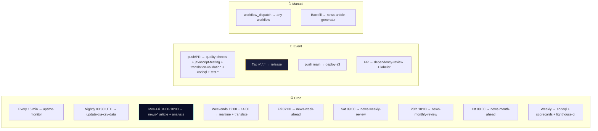

# ⚙️ `.github/workflows/` — GitHub Actions Catalog

This directory holds **43 workflow files** (21 standard `.yml` + 11 agentic Markdown sources + 11 compiled `.lock.yml` siblings) that power Riksdagsmonitor's CI/CD, security, data pipeline, agentic news generation, and monitoring.

> **Canonical long-form workflow reference:** [`WORKFLOWS.md`](../../WORKFLOWS.md) at the repository root — version matrices, Mermaid pipeline diagrams, ISMS control mapping, troubleshooting, and KPIs.
> **Agentic workflow contract (imports, analysis gate, 9/14 artifacts):** [`.github/prompts/README.md`](../prompts/README.md).

---

## 📊 File inventory at a glance

| File kind | Count | Notes |
|-----------|------:|-------|
| Standard GitHub Actions (`*.yml`, not `*.lock.yml`) | **21** | Run natively on the GitHub Actions runner |
| Agentic workflow **sources** (`news-*.md`) | **12** | Authored in Markdown with gh-aw frontmatter + prompt imports |
| Agentic workflow **compiled lock files** (`news-*.lock.yml`) | **12** | Auto-generated by `compile-agentic-workflows.yml` — these are what actually execute |
| **Total** | **45** | Verify with `ls .github/workflows/ | wc -l` |

**Only the compiled `.lock.yml` files run.** The `.md` sources are the source of truth and are reviewed in PRs; lock files are regenerated via the `gh aw compile` CLI.

---

## 🔐 Security & Compliance (5)

| File | Trigger | Purpose |
|------|---------|---------|
| [`codeql.yml`](codeql.yml) | Push, PR, weekly | CodeQL SAST — `javascript-typescript` matrix |
| [`dependency-review.yml`](dependency-review.yml) | Pull requests | SCA gate — blocks PRs on critical/high vulnerabilities |
| [`scorecards.yml`](scorecards.yml) | Push to `main`, weekly | OpenSSF Scorecard supply-chain assessment |
| [`setup-labels.yml`](setup-labels.yml) | Manual dispatch | Repository label management (`.github/labeler.yml` source) |
| [`labeler.yml`](labeler.yml) | Pull requests | Auto-label PRs from `.github/labeler.yml` patterns |

## 🧪 Testing & Validation (7)

| File | Trigger | Purpose |
|------|---------|---------|
| [`javascript-testing.yml`](javascript-testing.yml) | Push/PR on TS/JS/HTML/config | TypeScript type-check + Vitest (2 890 tests) + Vite build |
| [`jsdoc-validation.yml`](jsdoc-validation.yml) | Manual dispatch | TypeDoc generation + coverage report |
| [`quality-checks.yml`](quality-checks.yml) | Push/PR to `main` | ESLint + HTMLHint + linkinator (parallel jobs) |
| [`translation-validation.yml`](translation-validation.yml) | Push/PR on HTML | 14-language completeness + RTL + hreflang |
| [`test-dashboard.yml`](test-dashboard.yml) | Push/PR on dashboards | Cypress E2E for dashboard pages |
| [`test-homepage.yml`](test-homepage.yml) | Push/PR on homepage | Cypress E2E for the 14 `index*.html` homepages |
| [`test-news.yml`](test-news.yml) | Push/PR on `news/**` | Cypress E2E for news article pages |

## 🚀 Release & Deployment (3)

| File | Trigger | Purpose |
|------|---------|---------|
| [`release.yml`](release.yml) | Tag `v*`, manual | SLSA provenance + SBOM + dual deploy (S3 + GitHub Pages) |
| [`deploy-s3.yml`](deploy-s3.yml) | Push to `main` | AWS S3 sync + CloudFront invalidation via OIDC |
| [`lighthouse-ci.yml`](lighthouse-ci.yml) | Push/PR, weekly | Lighthouse CI: performance, a11y, SEO, best practices |

## 📊 Data Pipeline (1)

| File | Trigger | Purpose |
|------|---------|---------|
| [`update-cia-csv-data.yml`](update-cia-csv-data.yml) | Nightly 03:30 UTC, manual | Refresh every tracked `data/cia/**` + `cia-data/**` CSV from upstream `Hack23/cia`; refresh `production-stats.json`; inject counts into 14× `index*.html`; open a single PR on changes |

## 🤖 Agentic News Generation (12 × 2 = 24 files)

Each agentic workflow is a **pair**: an authored `.md` source + a compiled `.lock.yml`. The source imports bounded-context prompt modules from [`.github/prompts/`](../prompts/). The compiled lock file is hardened (SHA-pinned actions, egress firewall, five-layer safe-outputs) and is what GitHub Actions actually runs.

### Article-type workflows (single-type, 9 core artifacts)

| # | Source (`.md`) | Lock (`.lock.yml`) | Schedule | Primary MCP data |
|---|----------------|---------------------|----------|------------------|
| 1 | [`news-committee-reports.md`](news-committee-reports.md) | [`news-committee-reports.lock.yml`](news-committee-reports.lock.yml) | Mon–Fri 04:00 UTC | `get_betankanden`, `search_voteringar`, `search_anforanden`, `get_propositioner` |
| 2 | [`news-propositions.md`](news-propositions.md) | [`news-propositions.lock.yml`](news-propositions.lock.yml) | Mon–Fri 05:00 UTC | `get_propositioner`, `search_dokument_fulltext`, `search_anforanden` |
| 3 | [`news-motions.md`](news-motions.md) | [`news-motions.lock.yml`](news-motions.lock.yml) | Mon–Fri 06:00 UTC | `get_motioner`, `search_dokument_fulltext`, `search_anforanden` |
| 4 | [`news-interpellations.md`](news-interpellations.md) | [`news-interpellations.lock.yml`](news-interpellations.lock.yml) | Mon–Fri 07:00 UTC | `get_interpellationer`, `search_anforanden`, `get_calendar_events` |

### Aggregation & prospective workflows (Tier-C, 14 artifacts)

| # | Source (`.md`) | Lock (`.lock.yml`) | Schedule | Purpose |
|---|----------------|---------------------|----------|---------|
| 5 | [`news-realtime-monitor.md`](news-realtime-monitor.md) | [`news-realtime-monitor.lock.yml`](news-realtime-monitor.lock.yml) | Mon–Fri 10:00 + 14:00 UTC, weekends 12:00 | Breaking events, urgency classification |
| 6 | [`news-evening-analysis.md`](news-evening-analysis.md) | [`news-evening-analysis.lock.yml`](news-evening-analysis.lock.yml) | Mon–Fri 18:00, Sat 16:00 UTC | Daily parliamentary pulse, coalition cohesion |
| 7 | [`news-week-ahead.md`](news-week-ahead.md) | [`news-week-ahead.lock.yml`](news-week-ahead.lock.yml) | Fri 07:00 UTC | Prospective week preview; IMF WEO T+5 economic outlook |
| 8 | [`news-month-ahead.md`](news-month-ahead.md) | [`news-month-ahead.lock.yml`](news-month-ahead.lock.yml) | 1st of month 08:00 UTC | Monthly legislative pipeline + pinned IMF projection vintage |
| 9 | [`news-weekly-review.md`](news-weekly-review.md) | [`news-weekly-review.lock.yml`](news-weekly-review.lock.yml) | Sat 09:00 UTC | Week-over-week trends, throughput metrics |
| 10 | [`news-monthly-review.md`](news-monthly-review.md) | [`news-monthly-review.lock.yml`](news-monthly-review.lock.yml) | 28th 10:00 UTC | Monthly retrospective, party productivity rankings |

### Manual & translation workflows

| # | Source (`.md`) | Lock (`.lock.yml`) | Schedule | Purpose |
|---|----------------|---------------------|----------|---------|
| 11 | [`news-article-generator.md`](news-article-generator.md) | [`news-article-generator.lock.yml`](news-article-generator.lock.yml) | Manual dispatch | Backfill / regenerate any article type |
| 12 | [`news-translate.md`](news-translate.md) | [`news-translate.lock.yml`](news-translate.lock.yml) | Mon–Fri 11:00 + 17:00 UTC, weekends 14:00 | Translate EN/SV articles into the remaining 12 languages |

**Every news workflow imports the bounded-context prompt modules in this exact order** (full contract in [`.github/prompts/README.md`](../prompts/README.md)):

1. `../prompts/00-base-contract.md` — role, ethics, GDPR/ISMS, AI-FIRST rule
2. `../prompts/01-bash-and-shell-safety.md` — AWF-safe shell patterns, UTF-8
3. `../prompts/02-mcp-access.md` — MCP server inventory + health gate
4. `../prompts/03-data-download.md` — download pipeline, manifest
5. `../prompts/04-analysis-pipeline.md` — methodologies, templates, 9 core artifacts, Pass 1 + Pass 2
6. `../prompts/05-analysis-gate.md` — **single blocking gate** — no article until it passes
7. `../prompts/06-article-generation.md` — article sections, banned patterns, visualisation, translations
8. `../prompts/07-commit-and-pr.md` — stage → commit → exactly one `create_pull_request`
9. *(Tier-C workflows only)* `../prompts/ext/tier-c-aggregation.md` — 14-artifact gate, period multipliers

### Common tool surface (every `news-*.md`)

Every news workflow declares the **same** tool & runtime surface for parity, resilience, and full gh-aw v0.69.3 capability coverage:

| Field | Value | Purpose |
|-------|-------|---------|
| `runtimes.node.version` | `"25"` | Pinned Node 25 for IMF CLI + render scripts |
| `tools.github.toolsets` | `[all]` | Full GitHub MCP surface (issues, PRs, repos, code-search, actions, releases, discussions, …); see [`github-tools.md`](https://github.com/github/gh-aw/blob/main/docs/src/content/docs/reference/github-tools.md) |
| `tools.bash` / `tools.edit` / `tools.web-fetch` / `tools.agentic-workflows` | enabled | Full local tool surface; `web-fetch` reaches non-MCP public sources (`statskontoret.se`, `riksdagsmonitor.com`) through the AWF firewall |
| `tools.cache-memory` | keyed by `news-${workflow}-${article_date}`; best-effort cache persistence aligned with a 14-day recovery window | **Resilience knob** — analysis artifacts persisted at `/tmp/gh-aw/cache-memory/`; may be restored on the next run if the previous PR failed and the cache entry is still available (see [`07-commit-and-pr.md` §Cache-memory recovery](../prompts/07-commit-and-pr.md)) |
| `tools.playwright` | enabled in `news-evening-analysis` + `news-realtime-monitor` only | Live HTML validation for tier-C aggregation runs |
| `features.mcp-gateway` | `true` | Routes all MCP traffic through the gh-aw mcp-gateway (single audit point) |
| `sandbox.mcp.keepalive-interval` | `300` (5 min) | Compiles to gateway `keepaliveInterval`; overrides upstream default `1500 s (25 min)` so HTTP MCPs (`riksdag-regering`) stay warm for the full 45-minute job budget (see [`02-mcp-access.md` §MCP gateway keepalive](../prompts/02-mcp-access.md)) |
| `safe-outputs.create-pull-request.fallback-as-issue` | `true` (explicit) | If org disables Actions PR creation, fall back to an issue + branch link instead of failing |
| `safe-outputs.create-pull-request.if-no-changes` | `warn` | Empty patches emit a warning instead of failing the run (e.g. duplicate-date dispatches) |
| `network.allowed` | `node`, `github`, `defaults` + explicit Docker Hub hosts (`docker.io`, `registry-1.docker.io`, `auth.docker.io`, `production.cloudflare.docker.com`) + IMF/SCB/Riksdag/Statskontoret/site domains | Ecosystem identifiers preferred per upstream `network.md`. The broad `containers` ecosystem (which would also permit `ghcr.io`, `quay.io`, `gcr.io`, `mcr.microsoft.com`, `pkgs.k8s.io`, …) is **deliberately omitted** to keep least-privilege egress; only the minimal Docker Hub hosts actually required to resolve `node:25-alpine` for the SCB and World Bank MCP servers are enumerated. Any future switch to `ghcr.io`, `quay.io`, or other registries must add the specific hosts and be reviewed against the egress allowlist policy before merge. |
| `permissions` | `contents: read`, `issues: read`, `pull-requests: read`, `actions: read`, `discussions: read`, `security-events: read` | Least-privilege agent token; write capabilities live exclusively in the safe-outputs runner job |

## 🛠️ Automation & Tooling (4)

| File | Trigger | Purpose |
|------|---------|---------|
| [`compile-agentic-workflows.yml`](compile-agentic-workflows.yml) | Push/PR touching `news-*.md`, manual | Run `gh aw compile` → regenerate `.lock.yml`; enforce firewall + safe-outputs + SHA-pinning |
| [`agentics-maintenance.yml`](agentics-maintenance.yml) | Scheduled + manual | Hygiene of the agentic environment: stale branch cleanup, secret-rotation hooks, runtime-cache eviction |
| [`copilot-setup-steps.yml`](copilot-setup-steps.yml) | Push, manual | Bootstrap GitHub Copilot coding-agent environment for this repo |

## 📡 Monitoring & Infrastructure (1)

| File | Trigger | Purpose |
|------|---------|---------|
| [`uptime-monitor.yml`](uptime-monitor.yml) | Every 15 minutes | Availability checks for all 14 language homepages; auto-creates/closes GitHub issues on outage/recovery; validates HSTS/CSP/X-Frame-Options headers |

---

## 🔄 Triggers at a glance

---

## 🔒 Universal security posture

Every workflow in this directory implements defence-in-depth — see [`WORKFLOWS.md`](../../WORKFLOWS.md) §"Workflow Security Architecture" for the full matrix.

| Control | How it's enforced |
|---------|-------------------|
| `step-security/harden-runner` | First step of every job; egress audit/allow-list |
| SHA-pinned `uses:` | 100 % coverage — any third-party Action pinned to commit SHA |
| Least-privilege `permissions:` | Default `contents: read`; only required scopes added |
| OIDC for AWS | `id-token: write` + `role-to-assume` (no long-lived keys) |
| Five-layer safe outputs (agentic) | Sanitise → schema-validate → policy-check → human-review → merge |
| Squid + iptables egress firewall (agentic) | Only domains in `network.allowed:` reach the internet |

---

## 🧭 Where to go next

| I want to… | Read |
|------------|------|
| Understand a specific pipeline stage end-to-end | [`WORKFLOWS.md`](../../WORKFLOWS.md) |
| Author or modify an agentic news workflow | [`.github/prompts/README.md`](../prompts/README.md) + [`.github/skills/gh-aw-workflow-authoring/`](../skills/gh-aw-workflow-authoring/) |
| Understand how safe outputs and the firewall work | [`.github/skills/gh-aw-safe-outputs/`](../skills/gh-aw-safe-outputs/) + [`.github/skills/gh-aw-firewall/`](../skills/gh-aw-firewall/) |
| Compile `.md` → `.lock.yml` locally | Run `gh aw compile .github/workflows/<name>.md` (workflow `compile-agentic-workflows.yml` does this in CI) |
| See ISMS control mapping | [`WORKFLOWS.md`](../../WORKFLOWS.md) §"ISMS Compliance Mapping" |
| Trace the analysis artifact contract | [`analysis/README.md`](../../analysis/README.md) + [`analysis/methodologies/README.md`](../../analysis/methodologies/README.md) + [`analysis/templates/README.md`](../../analysis/templates/README.md) |

---

**📋 Document owner:** CEO | **🏷️ Classification:** Public | **🔄 Review cycle:** Quarterly
