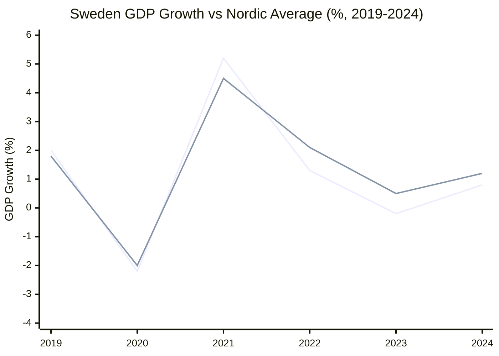
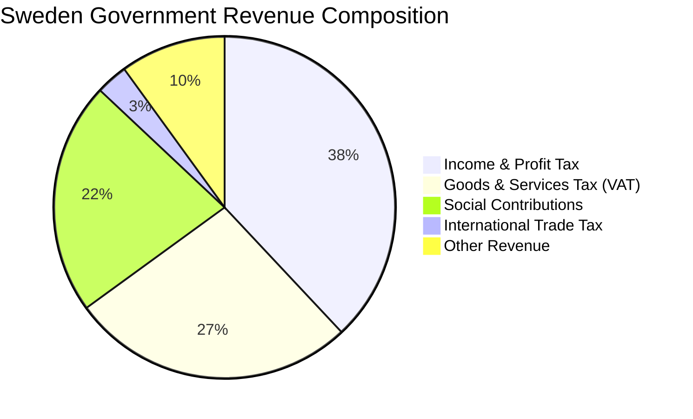
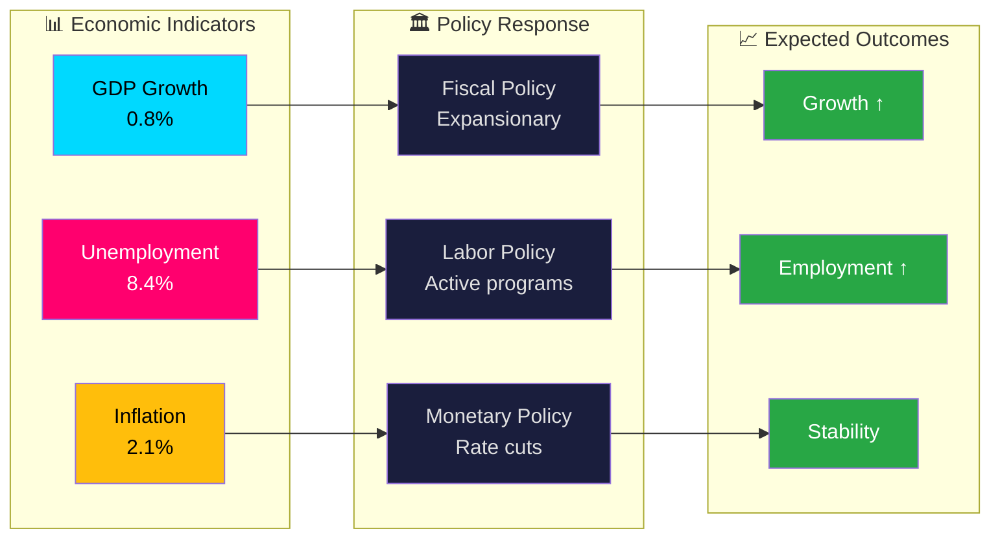
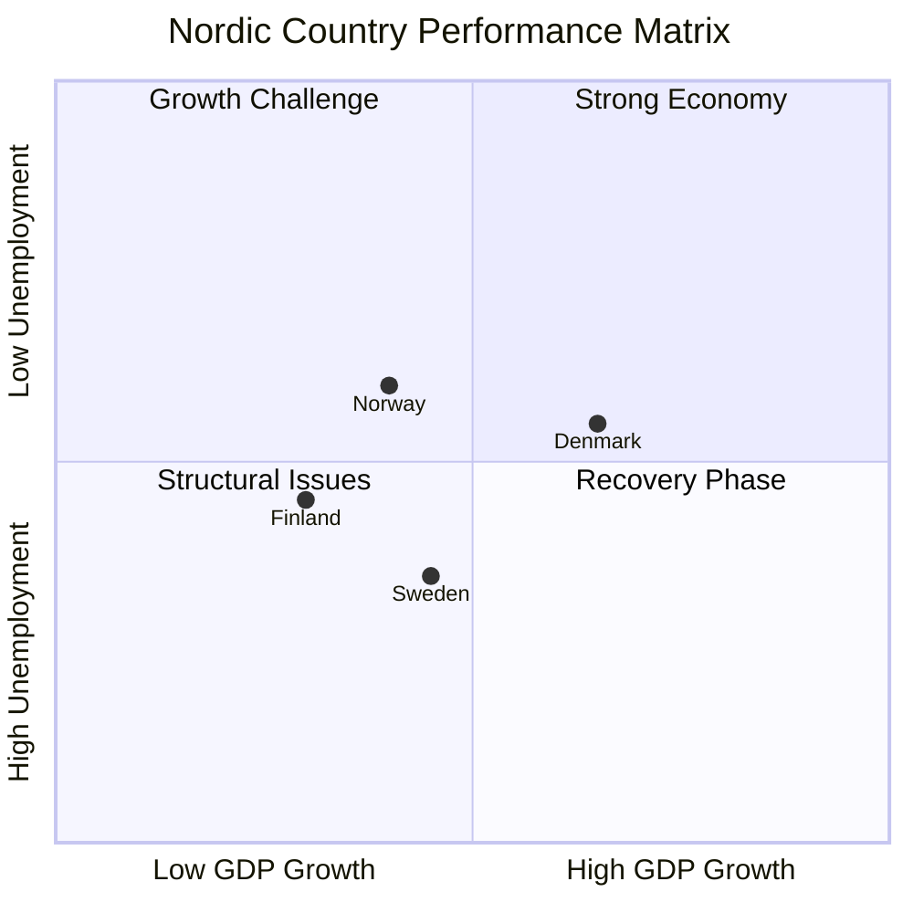
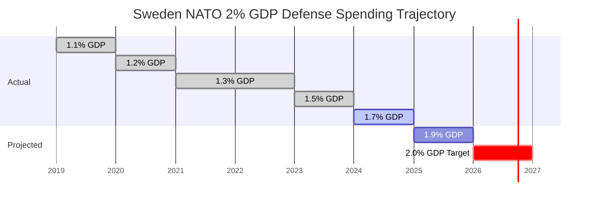
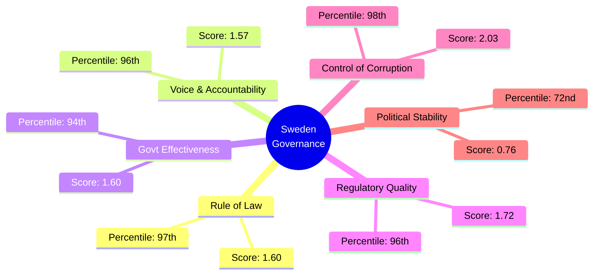

# Shared Prompt Patterns for News Workflows

> **Internal reference document** — Not a live workflow. Copy-paste these standardised blocks into every `news-*.md` workflow to ensure consistency.

## 🌐 Hack23 Ecosystem Context

Riksdagsmonitor is part of the **Hack23** platform for democratic transparency and political intelligence. When generating articles and analysis, link to and reference these resources:

| Resource | URL | Purpose |
|----------|-----|---------|
| **Hack23 Main Site** | https://hack23.com | Company homepage, ISMS documentation |
| **Riksdagsmonitor** | https://riksdagsmonitor.com | Political intelligence news platform |
| **GitHub Pages** | https://hack23.github.io | Open-source project documentation |
| **CIA Platform** | https://hack23.github.io/cia/ | Citizen Intelligence Agency — historical data |
| **GitHub Repo** | https://github.com/Hack23/riksdagsmonitor | Source code and analysis data |

Articles MAY include links to these sites when contextually relevant (e.g., linking to historical data, methodology documentation, or the live site).

---

## 🛡️ AWF Shell Safety — Mandatory for ALL Agent-Generated Bash Commands

> **The Agent Workflow Firewall (AWF) blocks dangerous shell expansion patterns.** When you generate bash commands at runtime, you **MUST** follow these rules. Fenced bash blocks in init steps run as normal bash and are not affected — but any command YOU write via the `bash` tool IS subject to AWF filtering.

| ❌ BLOCKED pattern | ✅ SAFE alternative | Why |
|---|---|---|
| `$`+`{VAR}` | `$VAR` | Brace-enclosed expansion is blocked |
| `$`+`{VAR:-default}` | `if [ -z "$VAR" ]; then VAR=default; fi` then use `$VAR` | Default-value expansion is blocked |
| `$`+`(command)` | Pipe the result or use `find -exec` | Command substitution is blocked |
| `$`+`(basename $f)` | `find ... -exec basename {} \;` or `ls` with path stripping | Nested command substitution blocked |
| `$`+`{PIPESTATUS[0]}` | Use `set -o pipefail` before the pipeline, then check `$?`; or restructure to avoid the pipeline | `$?` only matches the pipeline failure you care about when `pipefail` is set |
| `for f in "$DIR/"*.json; do echo "$`+`(basename $f)"; done` | `find "$DIR" -name "*.json" -exec basename {} \;` | Loop + substitution blocked |
| `realtime-$`+`{HHMM}` | `realtime-$HHMM` | Even simple brace expansion is blocked |

**Rules for agent-generated bash:**
1. **NEVER** use `$`+`{...}` (curly braces around variable names) — always use `$VAR` instead
2. **NEVER** use `$`+`(...)` (command substitution) — use pipes, `find -exec`, or separate commands
3. **NEVER** use `$`+`{VAR:-default}` or `$`+`{VAR:=default}` — set defaults with `if/then` first
4. **Use `find -exec`** instead of for-loops with command substitution
5. **Use `cat` with direct paths** instead of variable-constructed paths with braces
6. When you need a computed value, run the computation as a **separate bash command** and store the result, then use `$VAR` (no braces) in subsequent commands

**Example — reading files safely:**
```
# Instead of: for f in "$DIR/"*.json; do echo "=== $(basename $f) ==="; cat "$f"; done
# Use:
find analysis/daily/2026-04-07/realtime-1411/documents -name "*.json" -exec cat {} \;
```

---

## 🔤 UTF-8 Encoding — MANDATORY for ALL Content

> **NON-NEGOTIABLE**: All article content, titles, descriptions, metadata, and analysis output MUST use native UTF-8 characters. NEVER use HTML numeric entities (`&#228;`, `&#246;`, `&#229;`, etc.) for non-ASCII characters.

| ❌ WRONG (HTML entity) | ✅ CORRECT (UTF-8) | Character |
|---|---|---|
| `&#228;` | `ä` | a-umlaut |
| `&#246;` | `ö` | o-umlaut |
| `&#229;` | `å` | a-ring |
| `&#196;` | `Ä` | A-umlaut |
| `&#214;` | `Ö` | O-umlaut |
| `&#197;` | `Å` | A-ring |
| `&#233;` | `é` | e-acute |
| `&#252;` | `ü` | u-umlaut |
| `&#8212;` | `—` | em-dash |
| `&#8217;` | `'` | right single quote |

**Rules:**
1. **Always write Swedish characters as UTF-8**: `ö`, `ä`, `å`, `Ö`, `Ä`, `Å` — never as `&#246;`, `&#228;`, etc.
2. **All files are UTF-8 encoded** — the `<meta charset="UTF-8">` tag is present in all HTML output.
3. **Author name**: Always `James Pether Sörling` — never `James Pether S&#246;rling`.
4. **This applies to ALL languages**: Swedish, Finnish, German, French, Spanish, and any text containing accented characters.
5. **JSON-LD / Schema.org**: HTML entities are NOT decoded in JSON — always use actual UTF-8 characters.
6. **Meta tags** (`og:title`, `og:description`, `twitter:title`, etc.): Always use UTF-8 characters, never entities.
7. **The article template includes a `decodeHtmlEntities()` safety net**, but agents should output correct UTF-8 from the start.

---

## 🔒 ARTICLE TYPE ISOLATION — Absolute Enforcement

> **NON-NEGOTIABLE**: Different article types MUST NEVER overwrite, merge, or conflict with each other's analysis artifacts. Each workflow owns its article type exclusively.

````markdown
### Article Type Isolation Rules

> 🚨 **ABSOLUTE RULE**: Every workflow MUST write analysis artifacts ONLY to its article-type-specific subdirectory. Workflows MUST NEVER write to the parent date directory or to another article type's subdirectory.

#### Mandatory Analysis Folder Structure

Every workflow MUST use this path pattern for ALL analysis output:

```
analysis/daily/${ARTICLE_DATE}/${ARTICLE_TYPE}/
```

| Workflow | Base subfolder | Suffix on re-run | Owned files |
|----------|---------------|------------------|-------------|
| news-committee-reports | `committeeReports/` | `committeeReports-2/`, `-3/`, … | All analysis for betänkanden |
| news-interpellations | `interpellations/` | `interpellations-2/`, `-3/`, … | All analysis for interpellationer/frågor |
| news-motions | `motions/` | `motions-2/`, `-3/`, … | All analysis for motioner |
| news-propositions | `propositions/` | `propositions-2/`, `-3/`, … | All analysis for propositioner |
| news-month-ahead | `month-ahead/` | `month-ahead-2/`, `-3/`, … | Monthly strategic outlook analysis |
| news-week-ahead | `week-ahead/` | `week-ahead-2/`, `-3/`, … | Weekly parliamentary preview analysis |
| news-evening-analysis | `evening-analysis/` | `evening-analysis-2/`, `-3/`, … | Daily evening synthesis analysis |
| news-weekly-review | `weekly-review/` | `weekly-review-2/`, `-3/`, … | Weekly retrospective analysis |
| news-monthly-review | `monthly-review/` | `monthly-review-2/`, `-3/`, … | Monthly retrospective analysis |
| news-realtime-monitor | `realtime-${HHMM}/` | *(inherently unique — no suffix needed)* | Breaking news time-stamped analysis |
| news-article-generator | `${REQUESTED_TYPE}/` | `${REQUESTED_TYPE}-2/`, `-3/`, … | Analysis for the requested article type |
| news-translate | *(reads only, never writes analysis)* | — | Translation output only |

#### Enforcement Rules

1. **Each workflow sets `ARTICLE_TYPE` at step start** — this variable scopes ALL `git add` and file writes
2. **`git add` MUST scope to `analysis/daily/${ARTICLE_DATE}/${ARTICLE_TYPE}/`** — NEVER `analysis/daily/${ARTICLE_DATE}/`
3. **No workflow may read-modify-write another type's files** — read is allowed for cross-reference, but modification is PROHIBITED
4. **Concurrent workflow protection**: Multiple workflows (committee-reports, motions, propositions) may run on the same date — isolation prevents merge conflicts
5. **news-article-generator MUST include article type in filenames**: Generated articles use `${DATE}-${ARTICLE_TYPE}-${LANG}.html` pattern — article type is ALWAYS part of the filename

#### Anti-Patterns (REJECTED)

- ❌ Writing to `analysis/daily/${ARTICLE_DATE}/` root (no article type subfolder)
- ❌ `git add analysis/daily/${ARTICLE_DATE}/` without article type scope
- ❌ `git add news/` — stages ALL articles from ALL workflows, causing merge conflicts
- ❌ Copying (`cp`) analysis files to both subfolder AND root date directory
- ❌ One workflow modifying another workflow's synthesis-summary.md
- ❌ Realtime monitor overwriting committee-reports analysis
- ❌ Evening analysis replacing interpellations SWOT with its own
- ❌ Article generator writing analysis without article type in path
- ❌ Leaving root-level `.md` files in `analysis/daily/${ARTICLE_DATE}/` after relocation (use `mv`, never `cp`)

#### Run Suffix Resolution (prevents merge conflicts from repeated runs)

When a scheduled workflow runs and the analysis subfolder already exists (from a prior merged run), it MUST use a suffixed folder to avoid overwriting or causing merge conflicts. **Exception:** `force_generation=true` deliberately overwrites the base folder.

```bash
# === Run Suffix Resolution ===
# Call AFTER setting BASE_SUBFOLDER and ARTICLE_DATE, BEFORE running the analysis pipeline.
# - force_generation=true  → reuse base folder (overwrite is intentional)
# - otherwise              → auto-suffix if base folder already has synthesis-summary.md
#
# Inputs:  BASE_SUBFOLDER (e.g. "propositions"), ARTICLE_DATE, FORCE_GENERATION
# Outputs: ANALYSIS_SUBFOLDER (e.g. "propositions" or "propositions-2")
ANALYSIS_SUBFOLDER="$BASE_SUBFOLDER"
if [ "${FORCE_GENERATION:-false}" != "true" ]; then
  _SUFFIX=1
  while [ -f "analysis/daily/$ARTICLE_DATE/$ANALYSIS_SUBFOLDER/synthesis-summary.md" ]; do
    _SUFFIX=$((_SUFFIX + 1))
    ANALYSIS_SUBFOLDER="${BASE_SUBFOLDER}-${_SUFFIX}"
  done
fi
echo "📁 Analysis subfolder resolved: analysis/daily/$ARTICLE_DATE/$ANALYSIS_SUBFOLDER"
```

**Result examples:**
| Scenario | `ANALYSIS_SUBFOLDER` |
|----------|---------------------|
| First run of the day | `propositions` |
| force_generation re-run | `propositions` (overwrites) |
| Second scheduled run (first merged) | `propositions-2` |
| Third scheduled run (first two merged) | `propositions-3` |

> **Realtime monitor** already uses `realtime-HHMM` (inherently unique per run) — it does NOT need suffix resolution.

#### Git Add Pattern (MANDATORY for all workflows)

```bash
# CORRECT — scoped to this workflow's news outputs and resolved analysis subfolder
ARTICLE_TYPE="committeeReports"  # Set per workflow
git add news/*committee-reports*.html 2>/dev/null || true  # Only this workflow's articles
git add news/metadata/ 2>/dev/null || true                  # Metadata (small, fast-changing)
git add "analysis/daily/${ARTICLE_DATE}/${ANALYSIS_SUBFOLDER}/" || true

# INCORRECT — will conflict with other workflows
# git add news/ || true                                    # ← NEVER DO THIS — stages all workflows' articles
# git add "analysis/daily/${ARTICLE_DATE}/" || true        # ← NEVER DO THIS — stages all workflows' analysis
```
````

---

## 📰 ARTICLE TYPE MUST BE INCLUDED IN ALL OUTPUTS

> **NON-NEGOTIABLE**: Every news article, analysis file, and commit message MUST include the article type identifier to prevent cross-type confusion.

````markdown
### Article Type Tagging

Every output artifact MUST be tagged with its article type:

1. **HTML filenames**: `news/${DATE}-${ARTICLE_TYPE}-${LANG}.html`
2. **Analysis folders**: `analysis/daily/${DATE}/${ARTICLE_TYPE}/`
3. **Commit messages**: `📰 ${ARTICLE_TYPE}: ${description} - ${DATE}`
4. **Schema.org metadata**: `"articleSection": "${ARTICLE_TYPE}"`
5. **Analysis file headers**: Include `Article Type: ${ARTICLE_TYPE}` in metadata

#### Valid Article Types

| Type ID | Display Name | Workflow |
|---------|-------------|----------|
| `breaking` | Breaking News | news-realtime-monitor |
| `committee-reports` | Committee Reports | news-committee-reports |
| `interpellation-debates` | Interpellation Debates | news-interpellations |
| `opposition-motions` | Opposition Motions | news-motions |
| `propositions` | Government Propositions | news-propositions |
| `month-ahead` | Month Ahead | news-month-ahead |
| `week-ahead` | Week Ahead | news-week-ahead |
| `evening-analysis` | Evening Analysis | news-evening-analysis |
| `weekly-review` | Weekly Review | news-weekly-review |
| `monthly-review` | Monthly Review | news-monthly-review |
| `deep-inspection` | Deep Inspection | news-article-generator |
````

---

## 🧠 POLITICAL INTELLIGENCE DEPTH REQUIREMENTS (applies to ALL article workflows)

> **NON-NEGOTIABLE**: All news articles must meet publication-quality political intelligence standards. Surface-level summaries, generic boilerplate, and shallow analysis are REJECTED.

````markdown
### Political Intelligence Depth Requirements

> 🚨 **CRITICAL**: Every news article must demonstrate genuine political intelligence analysis — not information relay. The AI agent's job is to ANALYZE, not to SUMMARIZE. Articles that merely restate document titles or use generic language are REJECTED.

#### Mandatory Analysis Components (ALL article types)

Every news article MUST include ALL of the following:

1. **Structured SWOT Analysis with Evidence Tables**
   - Minimum 8 stakeholder perspectives (Citizens, Government Coalition, Opposition Bloc, Business/Industry, Civil Society, International/EU, Judiciary/Constitutional, Media/Public Opinion)
   - SWOT entries in structured HTML tables (not prose paragraphs)
   - Every SWOT entry MUST cite specific dok_id, vote counts, or named politicians
   - Example: `<td>Coalition discipline tested — 3 M MPs broke ranks on MJU18 (vote 2025/26:87)</td>`
   - NOT: `<td>Government faces challenges in maintaining coalition unity</td>` ← REJECTED

2. **Color-Coded Mermaid Diagrams (rendered in HTML)**
   - Minimum 1 Mermaid diagram per article, rendered as inline SVG or using mermaid.js
   - Diagrams MUST use color-coded nodes with real data:
     ```html
     <div class="mermaid">
     graph TD
       A[Prop 2025/26:214 - Cybersecurity] -->|Referred| B[FöU Committee]
       B -->|Expected vote| C{Chamber Vote Q2 2026}
       C -->|Pass| D[NCSC Reform Enacted]
       C -->|Fail| E[Government Setback]
       style A fill:#0d6efd,color:#fff
       style D fill:#28a745,color:#fff
       style E fill:#dc3545,color:#fff
     </div>
     ```
   - NOT: Generic placeholder diagrams with no real document data

3. **Quantified Risk Matrix (L×I Scores)**
   - Every article MUST include a risk assessment section with numeric Likelihood (1-5) × Impact (1-5) scores
   - Present as HTML table with color-coded risk cells
   - Example:
     ```html
     <table class="risk-matrix">
       <tr><th>Risk</th><th>L</th><th>I</th><th>Score</th><th>Mitigation</th></tr>
       <tr class="risk-medium"><td>Coalition fracture on defense budget</td><td>2</td><td>5</td><td>10</td><td>M-KD NATO consensus</td></tr>
     </table>
     ```

4. **Classification Rationale with Significance Scoring**
   - Every article MUST explain WHY it has its classification (MEDIUM/HIGH/LOW)
   - Include 5-dimension significance scoring: Parliamentary Impact, Policy Impact, Public Interest, Urgency, Cross-Party Significance
   - Each dimension scored 0-10 with one-sentence rationale

5. **Forward Indicators ("What to Watch")**
   - Every article MUST include ≥3 forward indicators with:
     - Specific trigger event
     - Timeline (exact date or date range)
     - Significance if triggered
   - Example: "Watch: FöU committee scheduling of Prop. 2025/26:214 — if before April 15, signals government urgency [HIGH]"

6. **Confidence Labels on ALL Analytical Claims**
   - Every analytical statement MUST have `[HIGH]`, `[MEDIUM]`, or `[LOW]` confidence label
   - Label criteria:
     - `[HIGH]` — Directly supported by official document data (dok_id, vote record)
     - `[MEDIUM]` — Inferred from multiple data points with reasonable certainty
     - `[LOW]` — Speculative or based on limited/indirect evidence

7. **CSS Mindmap (for deep/comprehensive articles)**
   - For articles with analysis_depth=deep or comprehensive, include a CSS-rendered mindmap showing:
     - Central topic with branching policy areas
     - Stakeholder positions
     - Timeline progression
   - Use CSS classes: `.mindmap-container`, `.mindmap-node`, `.mindmap-branch`

8. **Dok_id Evidence Citations**
   - Every article MUST cite ≥5 specific document identifiers (e.g., `Prop. 2025/26:214`, `frs 2025/26:634`, `mot. 2025/26:1823`)
   - Citations MUST link to data.riksdagen.se when possible
   - Interpellation articles MUST cite frs IDs for every interpellation discussed

#### Quality Scoring Rubric (Articles MUST score ≥ 7.0/10)

| Dimension | Weight | Criteria | Score Range |
|-----------|--------|----------|------------|
| **Evidence Density** | 25% | dok_id citations, vote counts, named politicians per paragraph | 0-10 |
| **Analytical Depth** | 25% | Multi-framework (SWOT + Risk + Threat), not surface summaries | 0-10 |
| **Structural Completeness** | 20% | Mermaid diagrams, evidence tables, risk matrix, forward indicators | 0-10 |
| **Stakeholder Coverage** | 15% | All 8 groups analyzed with specific evidence per group | 0-10 |
| **Originality** | 15% | Unique per-document insights, no boilerplate, no repeated phrases | 0-10 |

**Minimum passing score: 7.0/10 composite**

#### Anti-Patterns (REJECTED — these indicate shallow analysis)

| Pattern | Why It's Rejected | Correct Approach |
|---------|-------------------|-----------------|
| "Requires committee review and chamber debate" (repeated 20+ times) | Generic boilerplate, no analysis | Cite specific committee precedent on this topic |
| "Sweden faces escalating X threats" | Repackaged headline, not intelligence | Cite Säkerhetspolisen briefing date, specific incident data |
| SWOT with only 3 stakeholder groups | Incomplete framework coverage | Analyze all 8 groups with evidence per group |
| Risk assessment with "MEDIUM" text only | No quantified L×I scores | Provide numeric L=3, I=4, Score=12 with rationale |
| Articles with 0 Mermaid diagrams | Fails visual intelligence standard | Include ≥1 color-coded diagram with real data |
| Forward indicators without dates | Vague predictions, not intelligence | "Watch: FöU scheduling by April 15" with trigger |
| Confidence claims without labels | Unverifiable assertions | Add [HIGH]/[MEDIUM]/[LOW] to every claim |
| No dok_id citations in article body | Information relay, not analysis | Cite ≥5 specific document references |
````

---

## 🔧 SCRIPT ROLE BOUNDARY — Scripts Format, AI Analyzes

> **NON-NEGOTIABLE**: Scripts handle data download, HTML formatting, chart rendering, and article template structure. The AI agent handles ALL political analysis, SWOT generation, risk assessment, classification, and intelligence production.

````markdown
### Script vs AI Role Boundary

> 🚨 **ABSOLUTE RULE**: The division of labor between scripts and AI is strict and non-negotiable.

#### What Scripts DO (Formatting & Data)

Scripts (`generate-news-enhanced.ts`, `pre-article-analysis.ts`, etc.) are responsible for:

| Script Role | Examples | Output |
|------------|---------|--------|
| **Download MCP data** | Fetch betänkanden, voteringar, motioner | JSON files in `analysis/data/` |
| **Catalog data files** | List pending analysis files | Manifest in `analysis/daily/` |
| **Render HTML template** | Apply article CSS, header, footer, nav | HTML article shell |
| **Render charts** | Canvas.js/Mermaid chart containers | Chart HTML with data attributes |
| **Render mindmaps** | CSS mindmap containers | Mindmap HTML structure |
| **Validate HTML** | HTMLHint, linkinator, Playwright | Validation reports |
| **Generate metadata** | Schema.org, OpenGraph, hreflang | HTML head metadata |
| **Format tables** | Structured HTML table rendering | Semantic table elements |
| **Create directory structure** | `analysis/daily/${DATE}/${TYPE}/` | Empty directory tree |

#### What Scripts MUST NEVER DO (Analysis Content)

Scripts MUST NEVER generate any of these — this is the AI agent's exclusive responsibility:

| Prohibited Script Output | Why It's Prohibited | Who Does It |
|-------------------------|--------------------|-|
| SWOT analysis entries | Political judgment requires context | AI agent only |
| Risk assessment scores | Likelihood/Impact assessment needs political understanding | AI agent only |
| Significance scoring | Policy impact evaluation requires expertise | AI agent only |
| Political classification | Sensitivity/urgency assessment is analytical | AI agent only |
| Threat analysis | Democratic threat assessment requires judgment | AI agent only |
| Stakeholder impact prose | Multi-perspective analysis requires reasoning | AI agent only |
| Forward indicators | Predictive intelligence requires synthesis | AI agent only |
| "Why It Matters" sections | Contextual significance requires understanding | AI agent only |
| Opposition strategy analysis | Coalition dynamics assessment is analytical | AI agent only |
| Article narrative/story | Political narrative construction requires intelligence | AI agent only |

#### Test: "The Lorem Ipsum Test"

> If you replace an analysis section's content with "Lorem Ipsum" and the article still renders correctly, then the script is doing its job (formatting) and the AI's analysis was properly injected.
> If the article breaks when you replace content with Lorem Ipsum, the script is generating content (VIOLATION).

#### Deprecated Analysis-Generating Scripts

The following script directories and functions previously generated analysis content and are now **DEPRECATED** — their analysis functions are replaced by AI agent analysis in workflow prompts:

> ⚠️ **IMPORTANT DISTINCTION**: The table below lists **analysis-generating** functions that are deprecated. The **HTML rendering** functions (`generateSwotSection()`, `generateDashboardSection()`, `generateMindmapSection()`) are **NOT deprecated** — they are active HTML renderers that take structured data and produce formatted HTML sections. AI agents produce analysis content in markdown files; scripts then render that content into HTML using these renderer functions. See §HTML RENDERER FUNCTIONS below.

| Directory/Function | Status | Replacement |
|-----------|--------|-------------|
| `scripts/ai-analysis/` | ⚠️ DEPRECATED for analysis generation | AI agent performs analysis per workflow prompts |
| `scripts/analysis-framework/` | ⚠️ DEPRECATED for analysis generation | AI agent uses methodology guides directly |
| `scripts/generate-news-enhanced/swot-analyzer.ts` | ⚠️ DEPRECATED | AI agent generates SWOT per political-swot-framework.md |
| `scripts/data-transformers/content-generators/index.ts` → `generateStakeholderSwotSection()` | ⚠️ DEPRECATED | AI agent generates stakeholder analysis per stakeholder-impact.md |
| `scripts/generate-news-enhanced/ai-analysis-pipeline.ts` → `AIAnalysisPipeline` class | ⚠️ DEPRECATED | AI agent performs the primary analysis; class still runs as a deprecated/stub runtime pipeline |
| `scripts/data-transformers/content-generators/shared.ts` → `generateDeepAnalysisSection()` | ⚠️ DEPRECATED | AI prompt: "Write 5W deep analysis (Who/What/When/Why/Winners)" |
| `scripts/data-transformers/content-generators/shared.ts` → `generateTimelineContext()` | 🔴 STUB | Now outputs `AI_MUST_REPLACE` marker — AI MUST write specific timeline analysis |
| `scripts/data-transformers/content-generators/shared.ts` → `broadAgendaText()`, `focusedAgendaText()`, `defaultWhyText()` | 🔴 STUB | Now outputs `AI_MUST_REPLACE` marker — AI MUST write specific "Why This Matters" analysis |
| `scripts/data-transformers/content-generators/shared.ts` → `genericImpactText()`, `propImpactText()`, `betImpactText()`, `motImpactText()` | 🔴 STUB | Now outputs `AI_MUST_REPLACE` marker — AI MUST write specific political impact analysis |
| `scripts/data-transformers/content-generators/shared.ts` → `genericConsequencesText()`, `propConsequencesText()`, `motConsequencesText()` | 🔴 STUB | Now outputs `AI_MUST_REPLACE` marker — AI MUST write specific consequences analysis |
| `scripts/data-transformers/content-generators/shared.ts` → `defaultCriticalText()` | 🔴 STUB | Now outputs `AI_MUST_REPLACE` marker — AI MUST write specific critical assessment |
| `scripts/editorial-pillars.ts` → `INTER_PILLAR_TRANSITIONS` | 🔴 EMPTY | Transitions now return empty strings — AI MUST write article-specific connective prose or omit |
| `scripts/data-transformers/content-generators/newsworthiness.ts` → `scoreNewsworthiness()` | ✅ ACTIVE (data utility) | Heuristic scoring retained for routing/experimentation/tests; AI MUST independently assess editorial significance |
| `scripts/data-transformers/content-generators/shared.ts` → all `*Text()` templates | ⚠️ DEPRECATED | AI prompt: "Write editorial analysis from actual document data" |

**These scripts may still be called for data downloading and HTML formatting functions**, but their analysis output (SWOT entries, risk scores, classifications, titles, descriptions, editorial judgments) MUST be treated as stubs that the AI agent MUST overwrite with real template-compliant analysis.

#### HTML Renderer Functions (NOT Deprecated — Active Utilities)

The following functions are **HTML renderers**, not analysis generators. They take structured data and produce formatted HTML. They are used by `generate-news-enhanced` to build article sections and are **actively maintained**:

| Function | Module | Purpose | AI Agent Relationship |
|----------|--------|---------|----------------------|
| `generateSwotSection({ data, lang })` | `swot-section.ts` | Renders SWOT quadrant HTML from `SwotData` | **Current implementation:** AI writes SWOT analysis in markdown → script reads it → extracts SWOT data → calls this function to render HTML |
| `generateDashboardSection({ data, lang })` | `dashboard-section.ts` | Renders Chart.js canvas HTML from chart config | Renderer utility: used when structured chart data is provided by the pipeline; automatic extraction from AI analysis markdown is not currently implemented as a standard flow |
| `generateMindmapSection({ topic, branches, lang })` | `mindmap-section.ts` | Renders CSS mindmap HTML from branch data | Renderer utility: used when structured mindmap branch data is provided by the pipeline; analysis-to-mindmap extraction is workflow-specific or future-facing |
| `generateMultiPanelDashboardSection(...)` | `dashboard-section.ts` | Renders multi-panel CSS dashboards | Renderer utility for pre-structured panel data; not a guaranteed current markdown-extraction path |
| `generateEconomicDashboardSection(...)` | `economic-dashboard-section.ts` | Renders economic indicator dashboard | Renderer utility for structured economic dashboard data when available; automated extraction from agent analysis should be treated as planned or workflow-specific unless separately implemented |

> **How AI agents interact with these**: AI agents do NOT call these TypeScript functions directly. These utilities are renderers only. Unless a specific workflow explicitly implements and validates a machine-readable input format, `generate-news-enhanced` should be treated as consuming final article HTML/section-ready content rather than generically extracting SWOT entries, chart data, or mindmap structures from markdown analysis files. Currently, only SWOT data extraction from analysis markdown is implemented as a standard flow. Workflow authors MUST NOT assume a supported structured-parse step exists for dashboard, mindmap, or other renderer inputs; if a renderer is used, the workflow must explicitly define how its input data is produced and validated.

#### Minor TypeScript/Script Corrections Policy

> **Agentic workflows MAY make minor corrections** to TypeScript code and scripts when necessary to complete their mission, but MUST use AI prompts for all important analysis and content creation.

| Allowed Minor Corrections | Prohibited Changes |
|--------------------------|-------------------|
| Fix broken file paths or import statements | Rewrite analysis-generating logic |
| Correct typos in template strings | Add new analysis functions |
| Fix date format bugs in scripts | Change article quality thresholds |
| Update stale configuration values | Modify editorial framework scoring |
| Fix syntax errors blocking article generation | Change MCP tool invocation patterns |
| Adjust HTML template structure for validation | Remove or bypass quality gates |

**Rule**: If a correction affects analysis content quality, it MUST be done via AI prompt analysis — not by editing TypeScript code.

---

## 🏆 AI ANALYSIS QUALITY HIERARCHY — AI Always Wins

> **NON-NEGOTIABLE**: AI-generated deep political analysis MUST NEVER be overwritten, shadowed, or replaced by script-generated heuristic analysis. The quality hierarchy is absolute.

````markdown
### Analysis Quality Priority (Highest → Lowest)

| Priority | Source | Quality | Location | Description |
|----------|--------|---------|----------|-------------|
| 🥇 **1st** | AI workflow (agentic) | Publication-quality deep analysis | `analysis/daily/YYYY-MM-DD/{articleType}/` | Full methodology compliance: Mermaid diagrams, evidence tables, dok_id citations, multi-framework analysis |
| 🥈 **2nd** | AI workflow (rerun suffix) | Publication-quality deep analysis | `analysis/daily/YYYY-MM-DD/{articleType}-2/` etc. | Same quality as 1st, auto-suffixed for repeat runs |
| 🥉 **3rd** | Script (`pre-article-analysis.ts`) | Heuristic data extraction only | `analysis/daily/YYYY-MM-DD/{docType}/` | Automated pipeline: basic scoring, empty SWOT/threat, no Mermaid, no evidence tables |
| ❌ **Never** | Root-level script copies | LOW quality | `analysis/daily/YYYY-MM-DD/*.md` (root) | Legacy root copies — reader prefers subdirectory files |

### Rules

1. **`analysis-reader.ts` prefers subdirectory files over root-level files.** AI analysis in `{articleType}/` subdirectories always takes priority over script copies at root level.
2. **`pre-article-analysis.ts` keeps output in its scoped subfolder only.** Script output is NEVER copied to root level to avoid shadowing AI analysis.
3. **AI workflows MUST improve existing analysis, never downgrade.** If script analysis already exists in a subfolder, the AI workflow MUST read it, enrich it with deep political intelligence, and overwrite it with publication-quality output following `analysis/methodologies/ai-driven-analysis-guide.md`.
4. **Script analysis is a STARTING POINT, not a final product.** Script-generated files include `**Produced By**: pre-article-analysis script` metadata. AI workflows MUST detect this marker and replace the content with full methodology-compliant analysis.

### How to Detect Script-Generated Analysis

Script-generated files contain these markers (any one is sufficient):
- `**Produced By**: pre-article-analysis script (automated data pipeline)`
- `> ⚠️ **Script-Generated Analysis**: This file was produced by the automated data pipeline`
- `SWOT confidence: LOW. Script pipeline provides structured data only`
- `Analysis confidence: LOW. Script pipeline provides structured data only`

When an AI workflow detects these markers, it MUST:
1. Read the script's data extraction (document lists, committee codes, dates)
2. **Discard** the script's analysis content (risk scores, significance, classifications)
3. **Replace** with deep political intelligence using methodology guides and templates
4. **Remove** the "Produced By" and "Script-Generated" markers
5. Add proper metadata: `**Produced By**: {workflow-name} AI analysis (deep political intelligence)`
````

---

## 📊 TOP 10 QUALITY ISSUES IN CURRENT ARTICLES (2026-04-03 Systemic Audit)

> **Quality audit findings** — these issues MUST be addressed by improving all agentic workflow prompts. The 2026-04-03 systemic audit supersedes the earlier 2026-04-02 spot-check findings (placeholder ledes, generic titles, missing analysis references) which are now subsumed under the broader issues below.

````markdown
### Systemic Quality Issues (2026-04-03 Audit)

> 🔴 **CRITICAL**: The 2026-04-03 audit revealed that deprecated template functions are the PRIMARY source of low-quality content in 85%+ of articles. AI agents MUST overwrite ALL template-generated content.

| # | Issue | Severity | Scope | Root Cause | Required Fix |
|---|-------|----------|-------|-----------|------------|
| 1 | **"The political landscape remains fluid, with both government and opposition positioning for advantage."** appears in 444+ files | CRITICAL | ALL types | `shared.ts` Winners & Losers fallback template | AI MUST replace with specific winners/losers naming parties, evidence, vote margins |
| 2 | **"No chamber debate data is available for these items, limiting our ability..."** in 456+ files | CRITICAL | ALL types | Script excuse for missing data | AI MUST fetch debate data via MCP `search_anforanden` or analyze from committee text |
| 3 | **"Touches on {X} policy. {Generic domain text}..."** in 210+ files — identical across documents | HIGH | committee-reports, propositions, motions | `shared.ts` boilerplate templates per policy domain | AI MUST write unique "Why It Matters" per document with specific evidence |
| 4 | **Contradictory document counts** (title says 50, body shows 10) | HIGH | opposition-motions | Script counts ALL motions, article only details subset | AI MUST reconcile counts: either detail all or correctly scope the title |
| 5 | **Policy misclassification** (food safety labeled "housing policy") | HIGH | opposition-motions | Keyword heuristic in scripts, not committee-based | AI MUST use Riksdag committee code for domain (see ai-driven-analysis-guide.md §Policy Domain Inference) |
| 6 | **Missing analysis-references section** in articles across multiple dates | CRITICAL | ALL types | AI rewrites HTML without preserving auto-generated section; manual articles skip it entirely | AI MUST verify `class="analysis-references"` exists in EVERY article BEFORE committing — add manually if missing (see §ANALYSIS FILE GITHUB REFERENCES) |
| 7 | **Empty synthesis files** (0 documents analyzed) for propositions and week-ahead | CRITICAL | propositions, week-ahead | `pre-article-analysis.ts` found 0 docs, AI accepted empty output | AI MUST use MCP fallback when script reports 0 (see ai-driven-analysis-guide.md §Empty Analysis Fallback) |
| 8 | **Placeholder ledes** ("Analysis of 10 documents covering Committee:, Published:") in 64+ files | MEDIUM | Older articles | Script meta description template never overwritten | AI MUST generate analytical lede from actual content |
| 9 | **assessArticleQuality() stub** always returns 100/100 | CRITICAL | ALL | Quality gate disabled in helpers.ts | AI MUST self-evaluate against 5-dimension rubric before committing |
| 10 | **Raw Swedish text in English articles** — unedited government document excerpts | HIGH | propositions, interpellations | Script pastes excerpt without translation | AI MUST translate/summarize, NEVER paste raw Swedish in English articles |

### BANNED Content Patterns (v4.0 — Violations = Article Rejection)

The following text patterns are BANNED in all generated articles. The AI agent MUST detect and replace these during article generation:

```
❌ "The political landscape remains fluid, with both government and opposition positioning for advantage."
❌ "No chamber debate data is available for these items, limiting our ability to assess..."
❌ "Touches on {X} policy. {Policy domain} proposals/reports/motions {generic text}..."
❌ "Analysis of N documents covering {Field}:, {Field}:"
❌ "Requires committee review and chamber debate"
❌ "{Category}: Policy Priorities This Week: {Topic} in Focus"
❌ Any "Why It Matters" text that appears identically for ≥2 documents in the same article
❌ Any "Winners & Losers" section under 50 words that doesn't name specific parties
❌ "The pace of activity signals the political urgency driving these proceedings."
❌ "define the current legislative landscape"
❌ "broad legislative push that will shape multiple aspects of Swedish society"
❌ "critical period for understanding the government's strategic direction"
❌ "culmination of legislative review, with recommendations that guide chamber votes"
❌ "interplay between governing ambition and opposition scrutiny"
❌ "cascade through committee deliberations, chamber votes, and ultimately into policy implementation"
❌ "establish the policy alternatives that opposition parties will champion"
❌ "Standard parliamentary procedures are being followed, but vigilance is warranted"
❌ "gap between legislative intent and implementation often reveals"
❌ "While parliament deliberates these legislative matters, the executive branch has been equally active"
❌ Any Deep Analysis subsection (Timeline, Why This Matters, Political Impact, Actions & Consequences, Critical Assessment) that contains generic template text instead of specific political analysis
```

### Article Quality Self-Check (MANDATORY before committing)

Every news workflow MUST include this AI self-check step after article generation:

```markdown
## Quality Self-Check Protocol

Before committing, verify EACH article passes these checks:

### ✅ Content Quality (must pass ALL)
- [ ] Lede paragraph names specific actors/institutions and policy significance (NOT "Analysis of N documents")
- [ ] ZERO instances of "The political landscape remains fluid" or equivalent generic filler
- [ ] Every "Why It Matters" section is UNIQUE to its document (no duplicate text across documents)
- [ ] Winners & Losers section names ≥2 winners and ≥2 losers with party abbreviations and evidence
- [ ] ≥5 dok_id citations in article body
- [ ] ≥3 named politicians with party abbreviation (e.g., "Elisabeth Svantesson (M)")
- [ ] ZERO `<!-- AI_MUST_REPLACE:` markers surviving in final HTML — ALL must be replaced with real analysis
- [ ] Deep Analysis "Timeline & Context" contains SPECIFIC scheduling analysis, NOT generic "pace of activity" text
- [ ] Deep Analysis "Why This Matters" contains SPECIFIC political significance, NOT generic "broad legislative push" text
- [ ] Deep Analysis "Political Impact" contains SPECIFIC party/vote analysis, NOT generic "culmination of legislative review" text
- [ ] Deep Analysis "Actions & Consequences" contains SPECIFIC implementation details, NOT generic "cascade through committee" text
- [ ] Deep Analysis "Critical Assessment" contains GENUINE evaluation, NOT generic "standard parliamentary procedures" text
- [ ] NO generic pillar-transition text ("While parliament deliberates these legislative matters...")

### ✅ Structural Completeness
- [ ] 🔴 "📊 Analysis & Sources" section present with `class="analysis-references"` and GitHub links to ALL analysis files for this article type (VERIFY with `grep -q 'class="analysis-references"' article.html` — if missing, ADD MANUALLY using template from §ANALYSIS FILE GITHUB REFERENCES)
- [ ] Key Takeaways section with 3-5 bullet points and confidence labels
- [ ] No untranslated Swedish text in non-Swedish language articles
- [ ] No untranslated English body paragraphs in non-English language articles (ALL paragraphs must be translated)
- [ ] Document counts in title, lede, and body are CONSISTENT

### ✅ Analytical Depth  
- [ ] Strategic context connecting documents to broader political landscape
- [ ] ZERO excuse-as-analysis patterns ("No chamber debate data available...")
- [ ] Policy domains inferred from committee codes, NOT keyword heuristics
- [ ] Confidence labels [HIGH/MEDIUM/LOW] on analytical claims

### Scoring
If an article fails ≥3 checks: REVISE before committing (up to 3 iterations)
If an article fails ≥6 checks: DO NOT commit — escalate for manual review
```
````

---

## 🔬 MANDATORY PRE-ARTICLE ANALYSIS READING — ALL Analysis Must Be Read Before Article Generation

> 🔴 **NON-NEGOTIABLE — TRANSPARENCY & INTELLIGENCE DEPTH REQUIREMENT**: The AI agent MUST read ALL analysis artifacts (`cat`/`view` every `.md` file) BEFORE generating any article HTML. Articles written without first reading the analysis are **shallow, boilerplate, and REJECTED**. The analysis and articles are created in the **same workflow run** — there is zero excuse for not reading the analysis.

### Why This Rule Exists

1. **Analysis files are the intelligence foundation** — they contain SWOT, risk scores, threat analysis, significance rankings, stakeholder impacts, and cross-references that MUST drive article content
2. **Articles without analysis context are shallow** — they produce generic "Analysis of N documents" boilerplate instead of genuine political intelligence
3. **Transparency requires traceability** — every claim in the article must map back to a finding in the analysis files
4. **Same workflow, same run** — the analysis is created minutes before the article, so the agent has direct access

### Step 2b: Read ALL Analysis Files (MANDATORY — between analysis creation and article generation)

> 🚨 **This step runs AFTER Phase 2 (analysis creation) and BEFORE Step 3 (article generation).** The AI agent MUST `cat` every analysis file to load the findings into context.

````markdown
#### Read Own Article Type's Analysis (MANDATORY for ALL workflows)

```bash
# Resolve analysis subfolder for this article type
if [ -z "${ANALYSIS_SUBFOLDER:-}" ]; then
  case "${ARTICLE_TYPE}" in
    committee-reports)        ANALYSIS_SUBFOLDER="committeeReports" ;;
    government-propositions)  ANALYSIS_SUBFOLDER="propositions" ;;
    opposition-motions)       ANALYSIS_SUBFOLDER="motions" ;;
    interpellation-debates)   ANALYSIS_SUBFOLDER="interpellations" ;;
    breaking)                 ANALYSIS_SUBFOLDER="realtime-${HHMM}" ;;
    *)                        ANALYSIS_SUBFOLDER="${ARTICLE_TYPE}" ;;
  esac
fi

ANALYSIS_BASE="analysis/daily/${ARTICLE_DATE}/${ANALYSIS_SUBFOLDER}"

echo "📖 Reading ALL analysis files from $ANALYSIS_BASE..."
if [ -d "$ANALYSIS_BASE" ]; then
  for MD_FILE in "$ANALYSIS_BASE"/*.md; do
    if [ -f "$MD_FILE" ]; then
      echo "--- Reading: $(basename $MD_FILE) ---"
      cat "$MD_FILE"
      echo ""
    fi
  done

  # Also read per-document analyses
  if [ -d "$ANALYSIS_BASE/documents" ]; then
    echo "📄 Reading per-document analyses..."
    for DOC_FILE in "$ANALYSIS_BASE/documents"/*.md; do
      if [ -f "$DOC_FILE" ]; then
        echo "--- Per-doc: $(basename $DOC_FILE) ---"
        cat "$DOC_FILE"
        echo ""
      fi
    done
  fi

  ANALYSIS_FILE_COUNT=$(find "$ANALYSIS_BASE" -name "*.md" -type f | wc -l)
  echo "✅ Read $ANALYSIS_FILE_COUNT analysis files from $ANALYSIS_BASE"
else
  echo "⚠️ No analysis directory found at $ANALYSIS_BASE — will use MCP fallback"
fi
```

#### Cross-Reference Sibling Analysis Types (MANDATORY for aggregation workflows)

> **Evening analysis, weekly review, monthly review, week-ahead, and month-ahead** synthesize across ALL article types. These workflows MUST also read analysis from sibling types.

```bash
# For aggregation workflows (evening-analysis, weekly-review, monthly-review, week-ahead, month-ahead):
echo "🔍 Cross-referencing sibling analysis types for $ARTICLE_DATE..."
for SIBLING_DIR in analysis/daily/$ARTICLE_DATE/*/; do
  if [ -d "$SIBLING_DIR" ]; then
    SIBLING_TYPE="$(basename $SIBLING_DIR)"
    # Skip own type (already read above)
    if [ "$SIBLING_TYPE" = "$ANALYSIS_SUBFOLDER" ]; then continue; fi
    echo "📖 Cross-referencing: $SIBLING_TYPE"
    # Read synthesis and significance from sibling (most important for cross-referencing)
    for SIBLING_FILE in "$SIBLING_DIR/synthesis-summary.md" "$SIBLING_DIR/significance-scoring.md" "$SIBLING_DIR/stakeholder-perspectives.md"; do
      if [ -f "$SIBLING_FILE" ]; then
        echo "--- Sibling ($SIBLING_TYPE): $(basename $SIBLING_FILE) ---"
        cat "$SIBLING_FILE"
        echo ""
      fi
    done
  fi
done
echo "✅ Cross-referencing complete"
```

#### For Single-Type Workflows (propositions, motions, committee-reports, interpellations)

> Single-type workflows do NOT need to read ALL sibling analysis. However, they SHOULD read the cross-reference-map.md to understand connections to other article types.

```bash
# Read cross-reference map to understand connections
if [ -f "$ANALYSIS_BASE/cross-reference-map.md" ]; then
  echo "🔗 Reading cross-reference map for connections to other types..."
  cat "$ANALYSIS_BASE/cross-reference-map.md"
fi
```
````

### Verification: Confirm Analysis Was Read

> After reading, the AI MUST confirm it loaded the analysis by summarizing:
> 1. Number of analysis files read
> 2. Top 3 significance-ranked findings
> 3. Key risk scores and confidence levels
> 4. Which sibling types were cross-referenced (for aggregation workflows)
>
> **If the agent cannot produce this summary, it has NOT read the analysis.**

---

## 📊 AI ARTICLE CONTENT GENERATION (v4.0 — copy into every content workflow)

> **NON-NEGOTIABLE**: Article content (lede, analysis, winners/losers, takeaways) MUST be AI-generated from actual document analysis. Script stubs are HTML skeletons ONLY.

````markdown
### Step 3a: Read Pre-Computed Analysis (MANDATORY — before writing article)

> 🚨 **v4.0 CRITICAL**: The AI MUST read analysis files BEFORE generating article content. Do NOT write articles solely from script-provided data.

Read these files for the current article type and date:

> Use the analysis subfolder name from the type→folder mapping table above (for example `committeeReports`, not the article slug `committee-reports`). If a workflow already knows the exact analysis subfolder, it MAY set `ANALYSIS_SUBFOLDER` explicitly before this block.

```bash
# Map article slug → analysis subfolder name.
# Allow explicit override so future non-identity mappings do not silently resolve
# to the wrong directory.
if [ -z "${ANALYSIS_SUBFOLDER:-}" ]; then
  case "${ARTICLE_TYPE}" in
    committee-reports)        ANALYSIS_SUBFOLDER="committeeReports" ;;
    government-propositions)  ANALYSIS_SUBFOLDER="propositions" ;;
    opposition-motions)       ANALYSIS_SUBFOLDER="motions" ;;
    interpellation-debates)   ANALYSIS_SUBFOLDER="interpellations" ;;
    breaking)
      : "${HHMM:?HHMM must be set for breaking articles to resolve realtime-\${HHMM} analysis folder}"
      ANALYSIS_SUBFOLDER="realtime-${HHMM}"
      ;;
    *)                       ANALYSIS_SUBFOLDER="${ARTICLE_TYPE}" ;;
  esac
fi

ANALYSIS_BASE="analysis/daily/${ARTICLE_DATE}/${ANALYSIS_SUBFOLDER}"
cat "${ANALYSIS_BASE}/synthesis-summary.md"      # Key findings, risk levels, confidence
cat "${ANALYSIS_BASE}/swot-analysis.md"           # Top SWOT entries → Winners & Losers
cat "${ANALYSIS_BASE}/risk-assessment.md"         # Risk scores → Strategic Context
cat "${ANALYSIS_BASE}/stakeholder-perspectives.md" # Stakeholder impacts
cat "${ANALYSIS_BASE}/significance-scoring.md"    # Significance scores → prioritization
ls "${ANALYSIS_BASE}/documents/"                  # Per-document analyses → Why It Matters
```

**If synthesis reports "0 documents analyzed":**
1. Use MCP tools to fetch documents directly (see §Empty Analysis Fallback in ai-driven-analysis-guide.md v4.0)
2. Flag: `"⚠️ Pre-computed analysis unavailable — article generated from live MCP data"`
3. NEVER publish an article with "0 documents analyzed" as content

### Step 3b: AI-Generate Article Content (MANDATORY — replaces script stubs)

After reading analysis, generate these 5 mandatory sections:

#### Section 1: Analytical Lede (replaces script placeholder)

```
Generate a 40-60 word lede paragraph that:
- Names the MOST significant political development from the analyzed documents
- Identifies key actor(s) by name and party: e.g., "Defense Minister Pål Jonson (M)"
- States the concrete political action (bill tabled, committee approved, vote outcome)
- Explains WHY this matters NOW (election timing, coalition dynamics, international context)
- BANNED: "Analysis of N documents covering {field}" — this is NEVER acceptable
```

#### Section 2: Per-Document "Why It Matters" (replaces boilerplate)

```
For EACH document in the article, write a UNIQUE paragraph (30-50 words) that:
- Names the SPECIFIC law/committee/policy measure (not just the domain)
- Cites QUANTIFIED impact: SEK amounts, population affected, timeline, seat counts
- Places it in POLITICAL CONTEXT: party positions, coalition dynamics, electoral timing
- References SOURCE document (dok_id, proposition number, committee code)
- BANNED: "Touches on {X} policy. {Generic domain text}..." — identical text for multiple docs
```

#### Section 3: Winners & Losers (replaces generic filler)

```
Name 2-4 WINNERS and 2-4 LOSERS from this article's developments:
- Each winner/loser: [Party/Actor name (party abbreviation)] + [Specific gain/loss] + [Evidence dok_id]
- BANNED: "The political landscape remains fluid" — this is NEVER acceptable
- Minimum 50 words for this section
```

#### Section 4: Key Takeaways (replaces script bullets)

```
Generate 3-5 key takeaways, each with:
- Bold lead phrase (5-8 words)
- One sentence of supporting evidence with dok_id citation
- Confidence label [HIGH/MEDIUM/LOW]
- BANNED: generic takeaways like "Monitor developments over 1-2 weeks"
```

#### Section 5: Strategic Context (NEW — no script equivalent)

```
Write 50-80 words connecting these documents to the broader political landscape:
- Is this government OFFENSIVE (new legislation), DEFENSIVE (responding to opposition), or MAINTENANCE?
- Electoral timing implications (distance to 2026 election)
- Cross-reference related documents from other article types on the same date
- Use MCP data: search_voteringar for votes, search_anforanden for debate context
```
````

---

## 📊 VISUALIZATION DATA GENERATION (v4.0 — for HTML news articles with chart containers)

> **Scope**: Chart.js / D3.js visualizations are for **HTML news articles only**. Markdown analysis files (`.md`) MUST use **Mermaid diagrams** for all visualizations.
>
> When news articles contain chart containers, the AI MUST provide data for interactive Chart.js visualizations.

````markdown
### AI Visualization Data Protocol

When the article HTML contains chart container elements, provide visualization data:

All visualization examples below are **valid Chart.js configuration objects** matching the `data-chart-config` convention used by the site renderer (`scripts/data-transformers/content-generators/dashboard-section.ts`). You may add a top-level `chartType` string for downstream identification.

#### Vote Distribution Chart (for articles with voting data)
```json
{
  "chartType": "coalition-votes",
  "type": "bar",
  "data": {
    "labels": ["S", "M", "SD", "V", "C", "MP", "L", "KD"],
    "datasets": [
      { "label": "Ja",     "data": [0, 68, 0, 0, 0, 0, 16, 19], "backgroundColor": "#83cf39" },
      { "label": "Nej",    "data": [107, 0, 0, 24, 24, 18, 0, 0], "backgroundColor": "#ff006e" },
      { "label": "Avstår", "data": [0, 0, 73, 0, 0, 0, 0, 0], "backgroundColor": "#ffbe0b" }
    ]
  },
  "options": {
    "responsive": true,
    "scales": {
      "x": { "stacked": true, "ticks": { "color": "#b0b0b0" }, "grid": { "color": "rgba(255,255,255,0.06)" } },
      "y": { "stacked": true, "ticks": { "color": "#b0b0b0" }, "grid": { "color": "rgba(255,255,255,0.06)" } }
    },
    "plugins": { "legend": { "labels": { "color": "#e0e0e0" } } }
  }
}
```

#### SWOT Summary Chart (for articles with SWOT analysis)
```json
{
  "chartType": "swot-quadrant",
  "type": "radar",
  "data": {
    "labels": ["Strengths", "Weaknesses", "Opportunities", "Threats"],
    "datasets": [{
      "label": "SWOT impact profile",
      "data": [8, 7, 9, 6],
      "backgroundColor": "rgba(0, 217, 255, 0.15)",
      "borderColor": "#00d9ff",
      "borderWidth": 2,
      "pointRadius": 5,
      "pointBackgroundColor": ["#83cf39", "#ff006e", "#00d9ff", "#ffbe0b"]
    }]
  },
  "options": {
    "responsive": true,
    "plugins": { "legend": { "labels": { "color": "#e0e0e0" } } },
    "scales": {
      "r": {
        "grid": { "color": "rgba(255,255,255,0.1)" },
        "ticks": { "color": "#b0b0b0", "backdropColor": "transparent" },
        "pointLabels": { "color": "#e0e0e0", "font": { "size": 12 } }
      }
    }
  }
}
```

#### Risk Heat Map (for articles with risk assessment)
```json
{
  "chartType": "risk-heatmap",
  "type": "scatter",
  "data": {
    "datasets": [{
      "label": "Risks",
      "data": [
        { "x": 4, "y": 5 },
        { "x": 3, "y": 3 }
      ],
      "backgroundColor": ["#dc3545", "#fd7e14"],
      "pointRadius": 10
    }]
  },
  "options": {
    "responsive": true,
    "scales": {
      "x": { "title": { "display": true, "text": "Likelihood", "color": "#e0e0e0" }, "min": 0, "max": 5, "ticks": { "color": "#b0b0b0" }, "grid": { "color": "rgba(255,255,255,0.06)" } },
      "y": { "title": { "display": true, "text": "Impact", "color": "#e0e0e0" }, "min": 0, "max": 5, "ticks": { "color": "#b0b0b0" }, "grid": { "color": "rgba(255,255,255,0.06)" } }
    },
    "plugins": { "legend": { "labels": { "color": "#e0e0e0" } } }
  }
}
```

Embed each chart on the target `<canvas>` element using a `data-chart-config` attribute containing the full Chart.js configuration object. Do **not** emit `<script class="chart-data">` blocks. Treat `data-chart-config` as the canonical hand-off format for chart data, but only use this pattern when the target page explicitly includes a chart initializer that scans `canvas[data-chart-config]` and instantiates the corresponding Chart.js chart; otherwise the chart will not render.

> **Canonical chart type identifiers** (use these exact strings in the optional `chartType` field inside `data-chart-config`): `coalition-votes`, `swot-quadrant`, `risk-heatmap`, `policy-radar`, `legislative-sankey`, `css-mindmap`, `timeline`, `economic-comparison`, `economic-trend`, `nordic-radar`.
````

---

## 🌍 WORLD BANK ECONOMIC CONTEXT INTEGRATION (v3.0 — for ALL content workflows)

> **NON-NEGOTIABLE**: Every article MUST include economic context from World Bank indicators when the article's policy domain matches available indicators. This enriches political intelligence with quantitative evidence.

````markdown
### World Bank Indicator Reference for AI Agents

> **SINGLE SOURCE OF TRUTH**: `analysis/worldbank/indicators-inventory.json`
> This JSON file is the canonical machine-readable inventory of ALL indicators. Both AI agents and TypeScript modules load from this same file. To discover indicators, **`view analysis/worldbank/indicators-inventory.json`** — do NOT reference TypeScript source code.

The World Bank integration provides **144 indicators** across 17 Riksdag-relevant domains:
- **19 indicators** via MCP tools (get-economic-data, get-social-data, get-education-data, get-health-data)
- **125 indicators** via REST API (build-time scripts fetch automatically)
- **6 WGI governance indicators** via REST API with source=75 (auto-detected)

AI agents MUST use these to enrich articles.

#### 🔍 On-Demand Indicator Discovery (AI Agent Protocol)

> **MANDATORY FIRST STEP**: Before writing any article, discover relevant indicators using this protocol.

1. **Read the inventory**: `view analysis/worldbank/indicators-inventory.json`
   - Each indicator has: `id`, `key`, `name`, `unit`, `description`, `policyAreas`, `committees`
   - Indicators with `mcpTool` field can be fetched via MCP tools
   - The JSON is organized by domain (nationalAccounts, labor, military, governance, etc.)

2. **Match to article topic**: Find indicators where `policyAreas` or `committees` match the article's subject
   - Example: Defense proposition → look in `military` domain (committees: FöU)
   - Example: Budget debate → look in `nationalAccounts` + `governmentFinance` domains (committees: FiU, SkU)

3. **Fetch data via MCP** for indicators that have `mcpTool` field:
   ```
   get-economic-data(countryCode="SE", indicator="GDP_GROWTH", years=10)
   get-social-data(countryCode="SE", indicator="LIFE_EXPECTANCY", years=10)
   get-health-data(countryCode="SE", indicator="HEALTH_EXPENDITURE", years=10)
   get-education-data(countryCode="SE", indicator="EDUCATION_EXPENDITURE", years=10)
   ```

4. **For non-MCP indicators**: Reference the indicator ID and name in analysis text — the build-time scripts will fetch data via REST API automatically.

5. **Nordic comparison**: Always fetch comparison countries for top indicators:
   ```
   get-economic-data(countryCode="DK", indicator="GDP_GROWTH", years=5)
   get-economic-data(countryCode="NO", indicator="GDP_GROWTH", years=5)
   get-economic-data(countryCode="FI", indicator="GDP_GROWTH", years=5)
   get-economic-data(countryCode="DE", indicator="GDP_GROWTH", years=5)
   ```

> **IMPORTANT**: The `search-indicators` MCP tool has limited coverage. Always prefer reading `analysis/worldbank/indicators-inventory.json` for comprehensive discovery.

#### Available MCP Tools & Indicators

**Economic Data** (`get-economic-data`):
| MCP Param | Indicator ID | Name | Unit |
|-----------|-------------|------|------|
| `GDP_GROWTH` | NY.GDP.MKTP.KD.ZG | GDP Growth | % annual |
| `GDP_PER_CAPITA` | NY.GDP.PCAP.CD | GDP per Capita | USD |
| `UNEMPLOYMENT` | SL.UEM.TOTL.ZS | Unemployment | % labor force |
| `INFLATION` | FP.CPI.TOTL.ZG | Inflation (CPI) | % annual |
| `EXPORTS_GDP` | NE.EXP.GNFS.ZS | Exports (% GDP) | % of GDP |
| `FDI_NET` | BN.KLT.DINV.CD | FDI Net Inflows | USD |
| `GNI` | NY.GNP.MKTP.CD | GNI | USD |
| `GNI_PER_CAPITA` | NY.GNP.PCAP.CD | GNI per Capita | USD |

**Social Data** (`get-social-data`):
| MCP Param | Indicator ID | Name | Unit |
|-----------|-------------|------|------|
| `POPULATION` | SP.POP.TOTL | Population | persons |
| `LIFE_EXPECTANCY` | SP.DYN.LE00.IN | Life Expectancy | years |
| `BIRTH_RATE` | SP.DYN.CBRT.IN | Birth Rate | per 1,000 |
| `DEATH_RATE` | SP.DYN.CDRT.IN | Death Rate | per 1,000 |
| `INTERNET_USERS` | IT.NET.USER.ZS | Internet Users | % population |

**Education Data** (`get-education-data`):
| MCP Param | Indicator ID | Name | Unit |
|-----------|-------------|------|------|
| `EDUCATION_EXPENDITURE` | SE.XPD.TOTL.GD.ZS | Education Expenditure | % of GDP |
| `SCHOOL_ENROLLMENT` | SE.PRM.ENRR | School Enrollment | % gross |

**Health Data** (`get-health-data`):
| MCP Param | Indicator ID | Name | Unit |
|-----------|-------------|------|------|
| `HEALTH_EXPENDITURE` | SH.XPD.CHEX.GD.ZS | Health Expenditure | % of GDP |
| `PHYSICIANS` | SH.MED.PHYS.ZS | Physicians | per 1,000 |
| `HOSPITAL_BEDS` | SH.MED.BEDS.ZS | Hospital Beds | per 1,000 |

**Additional Domain Indicators** (full details with descriptions, policyAreas, and committees in `analysis/worldbank/indicators-inventory.json`):

| Domain | Key Indicators | Committee |
|--------|---------------|-----------|
| **Government Finance** | Tax Revenue, Govt Expenditure, Revenue, Tax Income, Net Lending | SkU, FiU |
| **Trade** | Trade %, Imports %, FDI (% GDP), High-Tech Exports, External Balance | NU, UU |
| **Labor Market** | Youth Unemployment, Long-term Unemployment, Labor Participation (M/F), Employment Ratio, Productivity | AU |
| **Financial** | Domestic Credit, Real Interest Rate, Lending Rate | FiU |
| **Demographics** | Population 65+, Age Dependency, Net Migration, Refugees, Fertility Rate, Infant Mortality | SoU |
| **Health** | Health Exp. per Capita, Govt Health Share, Nurses, Suicide Rate, Tobacco, Alcohol, Immunization | SoU |
| **Education** | Education (% Govt Exp.), Secondary/Tertiary Enrollment, Primary Completion | UbU |
| **Environment** | CO₂ Total (kt), Renewable Energy/Electricity, Forest Area, Air Pollution, Nuclear/Hydro Power | MJU |
| **Military** | Military Exp. (USD), Military (% Govt Exp.), Armed Forces Personnel | FöU |
| **Governance** | Rule of Law, Voice & Accountability, Govt Effectiveness, Regulatory Quality, Corruption Control, Political Stability | KU, JuU |
| **Innovation** | R&D Expenditure, Researchers/million, Scientific Articles, ICT Exports | UbU |
| **Inequality** | GINI Index, Income Top/Bottom 10%, Income Top/Bottom 20% | SoU, AU |
| **Gender** | Women in Parliament (%) | KU |
| **Infrastructure** | Broadband, Mobile Subscriptions, Secure Servers, Patents | TU |

#### Committee → Indicator Quick Lookup (144 indicators across all committees)

| Committee | Key Indicators | Count |
|-----------|---------------|-------|
| **FiU** (Finance) | GDP Growth, GDP per Capita, Inflation, Govt Expenditure, Tax Revenue, Current Account, GNI, Govt Consumption, Gross Savings, Real Interest Rate | 30+ |
| **AU** (Labor) | Unemployment (total/M/F), Youth Unemployment, Long-term Unemployment, Labor Participation (M/F), Employment Ratio, Productivity, GINI, Vulnerable Employment | 22+ |
| **SkU** (Tax) | Tax Revenue, Tax Income, Tax Goods & Services, Tax Trade | 6 |
| **NU** (Industry) | Trade %, Exports %, FDI, High-Tech Exports, Regulatory Quality, Self-Employment | 12+ |
| **UU** (Foreign Affairs) | Trade %, Exports %, GDP PPP | 5 |
| **FöU** (Defense) | Military Expenditure (% GDP, USD, % Govt), Armed Forces Personnel, Political Stability | 6 |
| **SoU** (Social) | Life Expectancy (M/F), Health Exp., Physicians, Hospital Beds, Nurses, GINI, Population, Birth/Death/Fertility Rate, Age Dependency, Migration, Refugees | 35+ |
| **UbU** (Education) | Education Exp. (% GDP, % Govt), Primary/Secondary/Tertiary Enrollment, R&D Exp., Researchers, Scientific Articles | 10 |
| **MJU** (Environment) | CO₂ Emissions, Renewable Energy/Electricity, Forest Area, Air Pollution, Nuclear/Hydro Power, Energy Use | 11 |
| **KU** (Constitution) | Rule of Law, Voice & Accountability, Govt Effectiveness, Regulatory Quality, Corruption Control, Political Stability, Women in Parliament | 7 |
| **JuU** (Justice) | Rule of Law, Control of Corruption | 2 |
| **TU** (Transport) | Internet Users, Broadband, Mobile, Secure Servers, Air Passengers | 5 |

#### Article Type → Indicator Priority (from 144 available)

| Article Type | MUST Include | SHOULD Include | New in v3.0 |
|-------------|-------------|----------------|-------------|
| propositions | GDP Growth, Unemployment + committee-matched | Inflation, Trade, Military Exp. | Youth Unemployment, GINI, Governance indicators |
| committee-reports | All committee-specific indicators | Nordic comparison | Gender indicators, full financial sector |
| motions | Topic-matched indicators | Nordic comparison | Relevant sub-indicators (e.g., female unemployment for gender motions) |
| interpellations | Rule of Law, Voice & Accountability | Topic-matched | Control of Corruption, Political Stability |
| weekly-review | GDP Growth, Unemployment, Inflation | Governance indicators | Labor productivity, Renewable energy, Women in Parliament |
| monthly-review | **All 144 indicators** | Full Nordic comparison | All new domains (demographics, inequality, innovation) |
| week-ahead / month-ahead | GDP Growth, Unemployment, Inflation | Trend analysis | Age dependency, Net migration, Energy mix |
| evening-analysis | Top 3 relevant to day's events | — | Match new granular indicators to topic |

#### How to Fetch Data (AI Agent Instructions)

1. **Read indicator inventory**: `view analysis/worldbank/indicators-inventory.json` to find all indicators for the article's policy domains
2. **Detect policy domains** from article source documents
3. **Map to indicators** using inventory's `policyAreas` and `committees` fields, or committee lookup above
4. **Fetch Sweden data** for MCP-supported indicators (those with `mcpTool` field in inventory):
```
get-economic-data(countryCode="SE", indicator="GDP_GROWTH", years=10)
get-economic-data(countryCode="SE", indicator="UNEMPLOYMENT", years=10)
```
5. **Fetch Nordic comparison** for top 3 indicators:
```
get-economic-data(countryCode="DK", indicator="GDP_GROWTH", years=5)
get-economic-data(countryCode="NO", indicator="GDP_GROWTH", years=5)
get-economic-data(countryCode="FI", indicator="GDP_GROWTH", years=5)
get-economic-data(countryCode="DE", indicator="GDP_GROWTH", years=5)
```
6. **Generate charts** using canonical types below

#### Economic Chart Templates

**Nordic Comparison Bar Chart** (`economic-comparison`):
```json
{
  "chartType": "economic-comparison",
  "type": "bar",
  "data": {
    "labels": ["Sweden", "Denmark", "Norway", "Finland", "Germany"],
    "datasets": [{
      "label": "GDP Growth 2024 (%)",
      "data": [0.82, 1.5, 0.7, 0.3, -0.1],
      "backgroundColor": ["#00d9ff", "#ff006e", "#ffbe0b", "#83cf39", "#9d4edd"],
      "borderWidth": 1
    }]
  },
  "options": {
    "responsive": true,
    "plugins": { "legend": { "labels": { "color": "#e0e0e0" } } },
    "scales": {
      "y": { "ticks": { "color": "#b0b0b0" }, "grid": { "color": "rgba(255,255,255,0.06)" } },
      "x": { "ticks": { "color": "#b0b0b0" }, "grid": { "color": "rgba(255,255,255,0.06)" } }
    }
  }
}
```

**Sweden Trend Line Chart** (`economic-trend`):
```json
{
  "chartType": "economic-trend",
  "type": "line",
  "data": {
    "labels": ["2019", "2020", "2021", "2022", "2023", "2024"],
    "datasets": [{
      "label": "Sweden Military Expenditure (% GDP)",
      "data": [1.1, 1.2, 1.3, 1.3, 1.5, 1.7],
      "borderColor": "#00d9ff",
      "backgroundColor": "rgba(0,217,255,0.2)",
      "borderWidth": 2,
      "fill": true
    }]
  },
  "options": {
    "responsive": true,
    "plugins": {
      "annotation": {
        "annotations": {
          "target": {
            "type": "line",
            "yMin": 2.0, "yMax": 2.0,
            "borderColor": "#ff006e",
            "borderDash": [6, 6],
            "label": { "display": true, "content": "NATO 2% target", "color": "#ff006e" }
          }
        }
      },
      "legend": { "labels": { "color": "#e0e0e0" } }
    },
    "scales": {
      "y": { "title": { "display": true, "text": "% of GDP", "color": "#e0e0e0" }, "ticks": { "color": "#b0b0b0" }, "grid": { "color": "rgba(255,255,255,0.06)" } },
      "x": { "ticks": { "color": "#b0b0b0" }, "grid": { "color": "rgba(255,255,255,0.06)" } }
    }
  }
}
```

**Nordic Radar Overview** (`nordic-radar`):
```json
{
  "chartType": "nordic-radar",
  "type": "radar",
  "data": {
    "labels": ["GDP Growth", "Unemployment", "Inflation", "Health Exp.", "Education Exp."],
    "datasets": [
      { "label": "Sweden", "data": [65, 40, 55, 80, 90], "backgroundColor": "rgba(0,217,255,0.15)", "borderColor": "#00d9ff", "borderWidth": 2 },
      { "label": "Denmark", "data": [75, 60, 50, 75, 70], "backgroundColor": "rgba(255,0,110,0.15)", "borderColor": "#ff006e", "borderWidth": 2 },
      { "label": "Norway", "data": [55, 70, 45, 85, 65], "backgroundColor": "rgba(255,190,11,0.15)", "borderColor": "#ffbe0b", "borderWidth": 2 },
      { "label": "Finland", "data": [30, 35, 60, 70, 75], "backgroundColor": "rgba(131,207,57,0.15)", "borderColor": "#83cf39", "borderWidth": 2 }
    ]
  },
  "options": {
    "responsive": true,
    "plugins": { "legend": { "labels": { "color": "#e0e0e0" } } },
    "scales": {
      "r": {
        "grid": { "color": "rgba(255,255,255,0.1)" },
        "ticks": { "color": "#b0b0b0", "backdropColor": "transparent" },
        "pointLabels": { "color": "#e0e0e0", "font": { "size": 12 } }
      }
    }
  }
}
```

> **Country color palette** (consistent across all charts): Sweden `#00d9ff`, Denmark `#ff006e`, Norway `#ffbe0b`, Finland `#83cf39`, Germany `#9d4edd`.

> **Full indicator inventory**: `analysis/worldbank/indicators-inventory.json` — machine-readable reference with all 144 indicators, committee mappings, and domain categorization.

#### Mermaid Diagram Templates for Analysis Markdown Files

> **Scope**: Analysis `.md` files MUST use **Mermaid diagrams**, NOT Chart.js. These templates provide publication-quality visualizations for economic context in analysis documents.

**Economic Trend Comparison (xychart)**:


**Budget Structure (pie)**:


**Policy Impact Flow (graph)**:


**Nordic Comparison Quadrant (quadrantChart)**:


**Defense Spending Timeline (gantt)**:


**Governance Radar (mindmap)**:


> **Use case guide**: `analysis/worldbank/use-cases.md` — detailed scenarios for when each indicator adds value.
````

---

## 🚨 UNIVERSAL RULE: No Workflow Run Wasted — Always Perform Analysis (applies to ALL workflows)

> **NON-NEGOTIABLE FIRST PRINCIPLE**: Every agentic workflow run MUST produce improved analysis artifacts. No workflow run should ever complete without at least reviewing and improving existing analysis. This applies to ALL workflows — content generation, translation, monitoring, review, and any future workflow type.

````markdown
### Mandatory Analysis Improvement Protocol

> 🚨 **ABSOLUTE RULE**: ALL agentic workflows MUST follow `analysis/methodologies/ai-driven-analysis-guide.md` and produce or improve analysis artifacts on EVERY run. No exceptions. No workflow run is ever "wasted" — at minimum, existing analysis MUST be reviewed and improved.

#### Why This Rule Exists

Every workflow run consumes compute resources and has access to MCP tools, methodology documents, and analysis templates. Failing to produce analysis output from any workflow run is an unacceptable waste. Even workflows whose primary purpose is not analysis (e.g., translation, validation) MUST use their runtime to improve the analysis corpus.

#### Universal Requirements (ALL Workflows)

1. **Read `analysis/methodologies/ai-driven-analysis-guide.md`** — the master guide governing all analysis
2. **Read ALL 6 methodology guides** and **ALL 8 analysis templates** (see Step 2 and Step 3 below)
3. **Check for existing analysis** in `analysis/daily/` for the current date or relevant dates
4. **If existing analysis exists**: Improve, extend, correct, or complete it:
   - Add missing Mermaid diagrams
   - Fill empty SWOT quadrants with evidence-based entries
   - Add dok_id citations where missing
   - Improve risk scores with additional context from MCP data
   - Extend stakeholder analysis with newly available data
   - Correct any factual errors or outdated information
   - Complete any `[REQUIRED]` placeholders
5. **If no existing analysis exists**: Create new analysis following the full protocol (Steps 1–6 in the AI-Driven Analysis section below)
6. **Commit analysis artifacts** to the `analysis/` folder — analysis MUST always be committed alongside any other workflow output, subject to the GitHub Actions `safe-outputs` 100-file limit. When approaching this limit, prioritize committing a minimal, high-impact subset of analysis (e.g., daily summaries and key findings) and prune lower-priority or bulk artifacts first (e.g., `analysis/weekly/`, `analysis/data/`).

#### For Non-Analysis Workflows (translation, validation, etc.)

Even workflows whose primary task is NOT analysis MUST:
1. **Before primary task**: Read the analysis guide and check for existing analysis needing improvement
2. **During primary task**: Note any new insights from MCP data or document processing
3. **After primary task**: Review and improve at least one existing analysis file (if any exist for the relevant date)
4. **At commit time**: Include improved analysis alongside primary workflow output

```bash
# Universal analysis check — run at the start of EVERY workflow
ARTICLE_DATE="${ARTICLE_DATE:-$(date -u +%Y-%m-%d)}"
echo "=== Mandatory Analysis Check ==="

# Check for existing analysis needing improvement
EXISTING_ANALYSIS=$(find "analysis/daily/${ARTICLE_DATE}/" -name "*.md" -type f 2>/dev/null | wc -l)
PENDING_ANALYSIS=$(find "analysis/daily/${ARTICLE_DATE}/" -name "*-analysis.md" -type f 2>/dev/null | wc -l)
REQUIRED_PLACEHOLDERS=$(grep -rl '\[REQUIRED\]' "analysis/daily/${ARTICLE_DATE}/" 2>/dev/null | wc -l)
MISSING_MERMAID=$(find "analysis/daily/${ARTICLE_DATE}/" -name "*.md" -type f -exec grep -L "```mermaid" {} \; 2>/dev/null | wc -l)

echo "📊 Existing analysis files: $EXISTING_ANALYSIS"
echo "📊 Per-file analyses: $PENDING_ANALYSIS"
echo "⚠️ Files with [REQUIRED] placeholders: $REQUIRED_PLACEHOLDERS"
echo "⚠️ Files missing Mermaid diagrams: $MISSING_MERMAID"

if [ "$EXISTING_ANALYSIS" -gt 0 ]; then
  echo "📋 Existing analysis found — MUST review and improve during this workflow run"
else
  echo "📋 No existing analysis for $ARTICLE_DATE — check nearby dates for improvement opportunities"
  for DAYS_BACK in 1 2 3; do
    CHECK_DATE=$(date -u -d "$ARTICLE_DATE - $DAYS_BACK days" +%Y-%m-%d 2>/dev/null || date -u -v-${DAYS_BACK}d -j -f "%Y-%m-%d" "$ARTICLE_DATE" +%Y-%m-%d 2>/dev/null)
    [ -z "$CHECK_DATE" ] && continue
    NEARBY_ANALYSIS=$(find "analysis/daily/${CHECK_DATE}/" -name "*.md" -type f 2>/dev/null | wc -l)
    if [ "$NEARBY_ANALYSIS" -gt 0 ]; then
      echo "  📍 Found $NEARBY_ANALYSIS analysis files for $CHECK_DATE — improve these"
      break
    fi
  done
fi
echo "================================"
```

#### Analysis Improvement Checklist (for existing analysis files)

When improving existing analysis, apply these checks:
- [ ] Every file has ≥1 color-coded Mermaid diagram (add if missing)
- [ ] No `[REQUIRED]` placeholders remain (fill with evidence-based content)
- [ ] SWOT entries cite specific dok_id, vote counts, party names (not generic text)
- [ ] Risk matrix has numeric L×I scores (not placeholder values)
- [ ] Stakeholder analysis covers all 8 groups (Citizens, Government Coalition, Opposition Bloc, Business/Industry, Civil Society, International/EU, Judiciary/Constitutional, Media/Public Opinion) with specific evidence per group (not generic perspectives)
- [ ] Forward indicators have specific timelines and triggers (not vague predictions)
- [ ] Confidence labels (`[HIGH]`/`[MEDIUM]`/`[LOW]`) present on all analytical claims
- [ ] Writing follows `analysis/methodologies/political-style-guide.md` standards

> **Key principle**: If a workflow cannot create NEW analysis (e.g., no new data), it MUST still improve EXISTING analysis. The analysis corpus should get better with every workflow run, never stay the same or degrade.
````

## Shared Skill Block (copy into every workflow)

```markdown
## Required Skills

Before generating articles, consult these skills:
1. **`.github/skills/editorial-standards/SKILL.md`** — OSINT/INTOP editorial standards
2. **`.github/skills/swedish-political-system/SKILL.md`** — Parliamentary terminology
3. **`.github/skills/legislative-monitoring/SKILL.md`** — Voting patterns, committee tracking, bill progress
4. **`.github/skills/riksdag-regering-mcp/SKILL.md`** — MCP tool documentation
5. **`.github/skills/language-expertise/SKILL.md`** — Per-language style guidelines
6. **`.github/skills/gh-aw-safe-outputs/SKILL.md`** — Safe outputs usage
7. **`scripts/prompts/v2/political-analysis.md`** — Core political analysis framework (6 analytical lenses)
8. **`scripts/prompts/v2/stakeholder-perspectives.md`** — Multi-perspective analysis instructions
9. **`scripts/prompts/v2/quality-criteria.md`** — Quality self-assessment rubric (minimum 7/10)
10. **`scripts/prompts/v2/per-file-intelligence-analysis.md`** — Per-file AI analysis protocol
11. **`analysis/methodologies/ai-driven-analysis-guide.md`** — Master methodology guide (v5.0): analysis-driven article decisions, policy domain inference, empty analysis fallback, Election 2026 lens
12. **`analysis/templates/per-file-political-intelligence.md`** — Per-file analysis output template (SWOT, risk matrix, threat taxonomy, Mermaid diagrams)
```

## 🧠 Repo Memory — Persistent Cross-Workflow Context (copy into every workflow)

> **All workflows share branch `memory/news-generation`** — git-backed, persistent across runs, version-controlled. Unlike ephemeral MCP servers that die when the process ends, repo-memory survives indefinitely and is readable by every workflow in the repository.

````markdown
### Repo Memory Usage

All workflows have access to `repo-memory` on the shared branch `memory/news-generation`.
Use it to maintain cross-workflow context: what was covered, what's pending, quality scores, and recurring patterns.

**Shared branch `memory/news-generation`** means:
- Breaking news knows what weekly review already covered
- Translations know which articles are pending
- Evening analysis knows what propositions/motions workflows produced today
- Weekly/monthly reviews can see cumulative quality trends

**When to READ memory (start of every run):**
1. Check `memory/news-generation/last-run-{workflow-name}.json` for previous run metadata
2. Read `memory/news-generation/covered-documents/{YYYY-MM-DD}.json` for today (and optionally yesterday) to avoid re-analyzing documents already covered recently
3. Read `memory/news-generation/quality-scores-summary.json` for rolling quality trends

**When to WRITE memory (end of every run):**
1. Update `memory/news-generation/last-run-{workflow-name}.json` with:
   - `date`, `article_type`, `documents_analyzed` (array of dok_ids), `articles_generated` (count), `quality_score`
2. Write today's processed documents to `memory/news-generation/covered-documents/{YYYY-MM-DD}.json`:
   - Each dok_id processed today with article_type and timestamp
   - Sharded by date to prevent unbounded growth; retain only recent shards (last 7 days) for deduplication
3. Write detailed quality metrics to `memory/news-generation/quality-scores/{YYYY-MM-DD}.json` and update `memory/news-generation/quality-scores-summary.json` with compact rolling aggregates
   - Prune old shards beyond the retention window your workflow needs

**File naming convention:**
- `last-run-{workflow-name}.json` — per-workflow state (e.g., `last-run-news-propositions.json`)
- `covered-documents/{YYYY-MM-DD}.json` — cross-workflow deduplication index, sharded by date
- `quality-scores/{YYYY-MM-DD}.json` — detailed quality tracking, sharded by date
- `quality-scores-summary.json` — compact rolling aggregates (kept small)
- `translation-status.json` — tracks which articles need translation (used by news-translate)

**Example: Deduplication across workflows**
```jsonc
// covered-documents/2026-04-04.json
{
  "H901FiU1": { "workflow": "news-committee-reports", "timestamp": "2026-04-04T06:15:00Z" },
  "H902Prop45": { "workflow": "news-propositions", "timestamp": "2026-04-04T07:30:00Z" }
}
```
Before analyzing a document, check if its dok_id already appears in today's shard. If so, skip or cross-reference.
````

## Standardised Analysis Depth Gate (copy into every workflow)

```markdown
### Standardised Analysis Depth Gate

> ⚠️ **Default is `deep`** — not `standard`. Analysis must always produce publication-quality output with Mermaid diagrams and evidence tables.

| Depth | AI iterations | SWOT stakeholders | Charts | Mindmap | Mermaid diagrams | Risk matrix (L×I) | Forward indicators | Min. analysis time |
|-------|--------------|-------------------|--------|---------|-----------------|-------------------|-------------------|-------------------|
| standard | 1-2 | ≥5 (of 8 groups) | ≥1 | optional | ≥1 color-coded | ≥2 risks scored | ≥2 with triggers | 10 minutes |
| deep | 2-3 | ≥7 (of 8 groups) | ≥2 | required | ≥2 color-coded | ≥4 risks scored | ≥3 with triggers | 15 minutes |
| comprehensive | 3+ | all 8 groups | ≥3 | required | ≥3 color-coded | ≥6 risks scored | ≥5 with triggers | 20 minutes |

**The 8 mandatory stakeholder groups are**: Citizens, Government Coalition, Opposition Bloc, Business/Industry, Civil Society, International/EU, Judiciary/Constitutional, Media/Public Opinion. Analysis for each group MUST cite specific evidence (dok_id, vote counts, named politicians).

**Minimum requirement for ALL depths**: Every analysis file must contain at least 1 color-coded Mermaid diagram, structured evidence tables with dok_id citations, a quantified risk matrix with L×I scores, forward indicators with specific triggers/timelines, and follow the corresponding template structure exactly. Plain prose without tables/diagrams is NEVER acceptable regardless of depth level. Every SWOT entry must cite dok_id, vote counts, or named politicians — generic text is REJECTED.
```

## MANDATORY Playwright Validation (copy into every content workflow)

````markdown
### Playwright Visual Validation
Run Playwright validation before creating the PR:
```bash
# HTMLHint validation
npx htmlhint "news/*-{type}-*.html"

# Playwright visual validation (accessibility, RTL, responsive)
npx tsx scripts/validate-articles-playwright.ts --filter "{type}"

# Validate JSON-LD cross-references
npx tsx scripts/validate-cross-references.ts news/*-{type}-*.html
```
````

## 🔌 MCP Architecture & Tool Reference

> **This section explains how MCP servers work in gh-aw agentic workflows.** Understanding this architecture prevents "unknown tool" errors, authentication failures, and wasted retry loops.

### Architecture Overview

```
┌──────────────────────────────────────────────────────────────────┐
│  AWF Sandbox (Docker container)                                  │
│                                                                  │
│  ┌─────────────┐    ┌────────────────────────────────────────┐  │
│  │  AI Agent    │───▶│  MCP Gateway (gh-aw-mcpg v0.2.17)    │  │
│  │  (Copilot)   │    │  http://host.docker.internal:80/mcp/  │  │
│  └─────────────┘    └──────┬──────────┬──────────┬───────────┘  │
│                            │          │          │               │
│                   ┌────────▼──┐ ┌─────▼────┐ ┌──▼──────────┐   │
│                   │ riksdag-  │ │   scb    │ │ world-bank  │   │
│                   │ regering  │ │(container)│ │ (container) │   │
│                   │ (HTTP)    │ │node:lts  │ │ node:lts    │   │
│                   └───────────┘ └──────────┘ └─────────────┘   │
│                        │                                        │
│               ┌────────▼──────────┐                             │
│               │ riksdag-regering- │                             │
│               │ ai.onrender.com   │                             │
│               │ (remote HTTP MCP) │                             │
│               └───────────────────┘                             │
└──────────────────────────────────────────────────────────────────┘
```

**Key concepts:**
1. **The AI agent calls tools by name** — e.g., `get_sync_status({})`, `search_tables({...})`. No server prefix needed.
2. **The MCP gateway routes** each tool call to the correct MCP server based on tool registration.
3. **riksdag-regering** is a remote HTTP MCP server (hosted on Render.com — subject to cold starts).
4. **scb** and **world-bank** are local container-based MCP servers (started by the gateway — always available).
5. **GitHub tools** (`github___*`) and **safe output tools** (`safeoutputs___*`) are built-in — always available.

### How the AI Agent Calls MCP Tools

MCP tools are available as **direct function calls** in the agent's tool list. Call them by their exact tool name:

```javascript
// riksdag-regering tools (32 tools — remote HTTP server)
get_sync_status({})                                           // Health check — ALWAYS call first
get_propositioner({ rm: "2025/26", limit: 20 })              // Government propositions
get_betankanden({ rm: "2025/26", limit: 20 })                // Committee reports
get_motioner({ rm: "2025/26", limit: 20 })                   // MP motions
get_interpellationer({ rm: "2025/26", limit: 20 })           // Interpellations
get_fragor({ rm: "2025/26", limit: 20 })                     // Written questions
search_dokument({ doktyp: "prop", rm: "2025/26", limit: 20 }) // Search documents
search_anforanden({ rm: "2025/26", limit: 20 })              // Search speeches
search_voteringar({ rm: "2025/26", limit: 20 })              // Search votes
search_ledamoter({ parti: "S", limit: 50 })                  // Search MPs
get_calendar_events({ from: "2026-04-01", tom: "2026-04-30" }) // Calendar
get_voting_group({ rm: "2025/26", groupBy: "parti" })        // Voting groups
enhanced_government_search({ query: "budget", limit: 10 })   // Combined search
analyze_g0v_by_department({})                                 // Department analysis
search_regering({ title: "budget", limit: 10 })              // Government documents
get_dokument({ dok_id: "H901FiU1" })                         // Specific document
get_ledamot({ intressent_id: "0123456789" })                  // Specific MP
fetch_report({ report: "ledamotsstatistik" })                 // Statistical reports

// SCB (Statistics Sweden) tools (5 tools — local container)
search_tables({ query: "befolkning", language: "en" })        // Search tables
get_table_info({ table_id: "07459", language: "en" })         // Table info
fetch_metadata({ table_id: "07459", language: "en" })         // Table metadata
query_table({ table_id: "07459", value_codes: { Tid: "top(5)" } }) // Query data
get_code_list({ code_list_id: "vs_Fylker" })                  // Code lists

// World Bank tools (5 tools — local container)
get-economic-data({ countryCode: "SE", indicator: "GDP_GROWTH", years: 10 })
get-social-data({ countryCode: "SE", indicator: "POPULATION", years: 10 })
get-education-data({ countryCode: "SE", indicator: "LITERACY_RATE", years: 10 })
get-health-data({ countryCode: "SE", indicator: "HEALTH_EXPENDITURE", years: 10 })
get-country-info({ countryCode: "SE" })
search-indicators({ keyword: "education" })

// GitHub built-in tools (always available)
github___list_issues({...})
github___create_pull_request({...})
// ... see github_mcp_tools_with_safeoutputs_prompt.md for full list

// Safe output tools (always available — NEVER search for these via bash)
safeoutputs___create_pull_request({...})
safeoutputs___noop({"message": "..."})
safeoutputs___dispatch_workflow({...})
```

> **⚠️ CRITICAL**: Tool names are EXACT. `get_sync_status` ≠ `getSyncStatus` ≠ `get-sync-status`. World Bank tools use **hyphens** (`get-economic-data`). Riksdag/SCB tools use **underscores** (`get_sync_status`, `search_tables`).

### How TypeScript Scripts Access MCP (via mcp-setup.sh)

TypeScript scripts (e.g., `generate-news-enhanced.ts`) access the riksdag-regering MCP server through the **MCP gateway** using HTTP:

```bash
source scripts/mcp-setup.sh
# Sets: MCP_SERVER_URL=http://host.docker.internal:80/mcp/riksdag-regering
# Sets: MCP_AUTH_TOKEN=<gateway API key extracted from mcp-config.json>
# Sets: MCP_CLIENT_TIMEOUT_MS=90000

npx tsx scripts/generate-news-enhanced.ts --types=propositions --languages="en,sv"
```

The `mcp-setup.sh` script:
1. Routes through the MCP gateway at `http://host.docker.internal:80/mcp/riksdag-regering`
2. Extracts the gateway API key from `/home/runner/.copilot/mcp-config.json`
3. Sets a 90-second timeout for cold-start tolerance

> **The AI agent does NOT need to run `mcp-setup.sh`** — tool calls go through the gateway automatically. `mcp-setup.sh` is only for TypeScript scripts that make HTTP requests to the MCP server.

### MCP Server Availability

| Server | Type | Startup | Cold Start Risk | Retry Strategy |
|--------|------|---------|-----------------|----------------|
| **riksdag-regering** | Remote HTTP | ~10-120s | HIGH (Render.com free tier) | Layer 1 pre-warm + Layer 2 health gate |
| **scb** | Local container | ~5-15s | LOW (starts with gateway) | Retry 2× with 10s wait |
| **world-bank** | Local container | ~5-15s | LOW (starts with gateway) | Retry 2× with 10s wait |
| **GitHub** | Built-in | Instant | NONE | No retry needed |
| **Safe Outputs** | Built-in | Instant | NONE | No retry needed |

### Error Handling by Server

**riksdag-regering errors:**
- `"unknown tool"` → Server cold-starting, tools not registered yet → retry
- `"connection timeout"` → Server sleeping on Render.com → wait 30s, retry
- `"0 tools registered"` → Server HTTP is up but MCP not initialized → retry with POST

**scb/world-bank errors:**
- `"connection refused"` → Container not started yet → wait 10s, retry
- `"tool execution error"` → API-level error (bad query) → fix parameters, do NOT retry blindly

---

## MANDATORY MCP Health Gate (copy into every workflow)

All workflows MUST verify MCP connectivity before proceeding with content or translation work.

### Layer 1: CI-Level Pre-Warm Step (YAML frontmatter `steps:`)

**Every workflow MUST include this CI step in its YAML frontmatter `steps:` section**, after `Install dependencies` and before the `engine:` block. This runs as an actual GitHub Actions step BEFORE the MCP gateway starts, giving the Render.com server time to wake up.

**CRITICAL**: The pre-warm MUST use MCP protocol POST requests (not simple GET). A GET only wakes the HTTP server but does NOT initialize the MCP tool registry. The MCP gateway needs tools to be registered — a warm HTTP server with 0 registered tools causes "unknown tool" errors.

Additionally, because there is a 3–10 minute gap between the pre-warm step and the MCP gateway start (due to repo-memory cloning, Docker image pulls, safe-outputs setup, etc.), the pre-warm starts a **background keep-alive pinger** that sends MCP `tools/list` POST requests every 30 seconds. This prevents Render.com from putting the server back to sleep before the gateway connects.

```yaml
  - name: Pre-warm MCP server (Render.com cold start mitigation)
    run: |
      echo "🔥 Pre-warming riksdag-regering MCP server via MCP protocol..."
      MCP_URL="https://riksdag-regering-ai.onrender.com/mcp"
      WARM=false
      for i in 1 2 3 4 5 6; do
        RESP=$(curl -sf --max-time 30 -X POST \
          -H "Content-Type: application/json" \
          -d '{"jsonrpc":"2.0","id":1,"method":"tools/list","params":{}}' \
          "$MCP_URL" 2>/dev/null) || true
        if echo "$RESP" | grep -q '"tools"'; then
          TOOL_COUNT=$(echo "$RESP" | grep -o '"name"' | wc -l)
          echo "✅ MCP server responded on attempt $i with $TOOL_COUNT tools registered"
          WARM=true
          break
        fi
        echo "⏳ Attempt $i/6 — server may be cold-starting, waiting 20s..."
        sleep 20
      done
      if [ "$WARM" = "false" ]; then
        echo "⚠️ MCP server did not respond after 6 attempts — agent will retry via in-prompt health gate"
      fi
      echo "🔄 Starting background keep-alive pinger (every 30s, max 15 min)..."
      KEEP_ALIVE_END=$(($(date +%s) + 900))
      while [ "$(date +%s)" -lt "$KEEP_ALIVE_END" ]; do
        curl -sf --max-time 10 -X POST \
          -H "Content-Type: application/json" \
          -d '{"jsonrpc":"2.0","id":1,"method":"tools/list","params":{}}' \
          "$MCP_URL" -o /dev/null 2>/dev/null || true
        sleep 30
      done &
      KEEP_ALIVE_PID=$!
      echo "Keep-alive PID: $KEEP_ALIVE_PID (auto-exits after 15 min)"
```

> **Why MCP protocol POST instead of GET?** The previous approach used `curl -sf "https://riksdag-regering-ai.onrender.com/mcp"` (GET). The GET request only returns a health check JSON — it does NOT trigger MCP session initialization or tool registry loading. The MCP gateway sends POST requests with `tools/list` to discover tools. If the tool registry hasn't been initialized by a prior POST request, the gateway receives 0 tools and reports "unknown tool" errors. Using POST with `tools/list` forces full MCP initialization.
>
> **Why a background keep-alive?** The CI `steps:` section runs early in the agent job. Between the pre-warm and the MCP gateway start, there are 3–10 minutes of setup (repo-memory cloning, Docker image pulls, safe-outputs config, etc.). On Render.com free tier, inactive servers go to sleep after ~5 minutes. The keep-alive pinger sends `tools/list` every 30s to prevent this. It auto-exits after 15 minutes to avoid resource waste.
>
> **Error scenarios**: If the MCP server is completely down (not just cold), the POST requests will fail silently (`|| true`). The pre-warm reports "did not respond after 6 attempts" and the agent falls back to Layer 2 (in-prompt health gate). If Layer 2 also fails, the agent must call `safeoutputs___noop()` with a detailed error message — never let the workflow timeout without producing a safe output.

### Layer 2: In-Prompt Health Gate (markdown body)

**Pre-warm the riksdag-regering MCP server** (backup — in case CI pre-warm was insufficient):
```bash
echo "🔥 Pre-warming riksdag-regering MCP server (Render.com cold start mitigation)..."
curl -sf --max-time 15 -X POST -H "Content-Type: application/json" -d '{"jsonrpc":"2.0","id":1,"method":"tools/list","params":{}}' "https://riksdag-regering-ai.onrender.com/mcp" -o /dev/null 2>/dev/null || echo "Pre-warm ping sent (server may be waking up)"
sleep 10
```

> **CRITICAL**: Use POST with `tools/list` — a simple GET only wakes the HTTP server but does NOT initialize the MCP tool registry. See Layer 1 explanation above.

Then call the health gate:

1. Call `get_sync_status({})` — retry up to **3×** (20s wait between each — the server is already warm from the step-level pre-warm)
2. If you get **"unknown tool"** or **"0 tools registered"** errors, this means the MCP server is still initializing after a Render.com cold start. **Keep retrying — do NOT noop early.**
3. After 3 failures → `safeoutputs___noop({"message": "MCP server unavailable after 3 attempts — Render.com cold start exceeded timeout"})` — do NOT proceed
4. **ALL content MUST come from live MCP data.** Never use cached articles, stale data, or AI-fabricated content.
5. **For translation workflows**: MCP is required for accurate political term translation and cross-referencing. Do NOT proceed without MCP.
6. **NEVER let the workflow timeout** without calling a safe output. If MCP is down, noop after the 3 retries instead of wasting 60 minutes.
7. **⏱️ Do NOT spend more than 2 minutes on MCP warmup** — proceed to analysis immediately once `get_sync_status` succeeds.

### Layer 3: MCP Gateway Diagnostics (run when tools fail)

If MCP tools return errors ("unknown tool", "0 tools registered", connection timeouts), run these diagnostics BEFORE calling noop:

```bash
echo "🔍 MCP Gateway Diagnostics"
date -u '+%Y-%m-%dT%H:%M:%SZ'
echo "═══════════════════════════════════════════"

# 1. Test direct MCP server connectivity (bypasses gateway)
echo "📡 Direct MCP server test:"
curl -sf --max-time 15 -X POST \
  -H "Content-Type: application/json" \
  -d '{"jsonrpc":"2.0","id":1,"method":"tools/list","params":{}}' \
  "https://riksdag-regering-ai.onrender.com/mcp" 2>/dev/null | head -c 200 || echo "UNREACHABLE"

# 2. Test MCP gateway connectivity
echo ""
echo "🔌 MCP Gateway test (via host.docker.internal):"
source scripts/mcp-setup.sh 2>/dev/null
echo "MCP_SERVER_URL=$MCP_SERVER_URL"
curl -sf --max-time 10 -X POST -H "Content-Type: application/json" -H "Authorization: $MCP_AUTH_TOKEN" -d '{"jsonrpc":"2.0","id":1,"method":"tools/list","params":{}}' "$MCP_SERVER_URL" 2>/dev/null | head -c 200 || echo "GATEWAY UNREACHABLE"

# 3. DNS resolution from within sandbox
echo ""
echo "🌐 DNS resolution:"
for d in riksdag-regering-ai.onrender.com api.scb.se api.worldbank.org data.riksdagen.se; do
  nslookup "$d" 2>/dev/null | grep -A1 "Name:" | tail -1 || echo "$d: DNS FAILED"
done

echo "═══════════════════════════════════════════"
```

> **When to run diagnostics**: Only run this bash block if `get_sync_status()` fails after 3+ retries. The diagnostics output helps the next workflow iteration diagnose whether the issue is DNS, firewall, MCP server, or gateway configuration. Include the diagnostics output in the noop message.

## Standardised PR Description Template (copy into every workflow)

> **All pull requests created by agentic workflows MUST have descriptive, structured PR bodies.** Use this template pattern for consistent, informative PR descriptions.

### Content Workflow PR Template
```
safeoutputs___create_pull_request({
  "title": "📰 {Article Type} - {YYYY-MM-DD}",
  "body": "## Summary\n\n{Brief description of what was generated}\n\n### Articles\n- Languages: {language list}\n- Article count: {count}\n- Article type: {type}\n\n### Analysis\n- Analysis files: {count} files in `analysis/daily/{date}/{type}/`\n- Quality gate: {PASSED/FAILED}\n\n### Validation\n- HTMLHint: ✅ passed\n- File ownership: ✅ validated\n- Playwright: ✅ validated\n\n### Source\n- Workflow: `{workflow-name}`\n- MCP data freshness: {sync status}\n- Riksmöte: {rm value}",
  "labels": ["agentic-news", "analysis-data"]
})
```

### Translation Workflow PR Template
```
safeoutputs___create_pull_request({
  "title": "🌐 Article Translations - {YYYY-MM-DD}",
  "body": "## Summary\n\nTranslated {article_type} articles into {count} languages.\n\n### Translations\n- Source language: {source_lang}\n- Target languages: {lang_list}\n- Articles translated: {count}\n- Translation method: TypeScript baseline + AI body translation\n\n### Quality\n- All section headings translated: ✅\n- All body paragraphs translated: ✅\n- No English fallback text: ✅\n- RTL layout verified (ar, he): ✅\n- data-translate markers removed: ✅\n\n### Analysis Updates\n- Analysis files updated: {count} (if any)\n\n### Source\n- Workflow: `news-translate`\n- Source articles: `news/{date}-*-en.html`",
  "labels": ["agentic-news", "translation"]
})
```

### Analysis-Only PR Template
```
safeoutputs___create_pull_request({
  "title": "📊 Analysis Only - {Article Type} - {YYYY-MM-DD}",
  "body": "## Summary\n\nAnalysis artifacts generated (no new articles — articles already exist for this date).\n\n### Analysis\n- Analysis files: {count} files\n- Location: `analysis/daily/{date}/{type}/`\n- Quality gate: {PASSED/FAILED}\n\n### Source\n- Workflow: `{workflow-name}`\n- Reason: Articles already existed; analysis-only run",
  "labels": ["agentic-news", "analysis-only", "{type}"]
})
```

> **Key rules for PR bodies:**
> - ALWAYS include a `## Summary` section with a brief human-readable description
> - ALWAYS list the languages, article count, and article type
> - ALWAYS include validation results (HTMLHint, file ownership, Playwright)
> - ALWAYS include the source workflow name
> - NEVER leave the PR body empty or use a single-line description
> - PR titles MUST include an emoji prefix, article type, and date

## Standardised Deduplication Check (copy into every content workflow)

> 🚨 **CRITICAL**: The deduplication check controls **article generation only** — it NEVER skips the deep political analysis phase. Analysis MUST always run regardless of whether articles already exist. When articles exist, the workflow still performs full 15-20 minute analysis and commits analysis artifacts. Only the HTML article generation step is skipped (unless `force_generation=true`).

```bash
# Check if articles for today already exist (controls article GENERATION only, NOT analysis)
EXISTING=$(ls news/${ARTICLE_DATE}-${ARTICLE_TYPE}-en.html 2>/dev/null | wc -l)
if [ "$EXISTING" -gt 0 ] && [ "${FORCE_GENERATION}" != "true" ]; then
  echo "📋 Articles for $ARTICLE_DATE/$ARTICLE_TYPE already exist — article generation will be skipped (analysis still runs)"
  SKIP_ARTICLE_GENERATION=true
  echo "SKIP_ARTICLE_GENERATION=true" >> "$GITHUB_ENV"
fi
# NOTE: Do NOT exit here or call safeoutputs___noop — analysis phase MUST still execute
# Later article-generation steps MUST gate on: if [ "$SKIP_ARTICLE_GENERATION" != "true" ]; then ...
```

> **🚨 NEVER call `safeoutputs___noop` because articles already exist.** The only valid reason for noop is when the MCP server is completely unreachable after 3 retry attempts. If articles exist but analysis produces new artifacts, commit those artifacts via `safeoutputs___create_pull_request` with `analysis-only` label.

## 🚨 MANDATORY: AI-Driven Analysis Using Methods & Templates (copy into every analysis workflow)

> **NON-NEGOTIABLE**: The AI agent's PRIMARY job is to create real analysis for every piece of data or document downloaded from MCP. Scripts generate stubs — the AI MUST replace them with full template-compliant analysis. This is NOT optional.

> **🚨 ANALYSIS RUNS EVERY TIME — NO EXCEPTIONS**: The deep political analysis phase executes on EVERY workflow run, regardless of whether articles already exist, regardless of whether another workflow ran recently, regardless of any other condition. The ONLY reason to skip analysis is if the MCP server is completely unreachable after 3 retry attempts. "Another job ran 18 minutes ago" is NOT a valid reason to skip analysis. Code changes, data updates, and new parliamentary activity happen continuously — every run MUST produce fresh analysis.

````markdown
### AI-Driven Analysis Protocol

> 🚨 **ABSOLUTE RULE**: Every agentic workflow MUST:
> 1. **Download data** from MCP (scripts try first; if they fail or download 0, agent uses direct MCP tool calls and fixes scripts)
> 2. **Read ALL 6 methodology guides** before doing any analysis
> 3. **Read ALL 8 analysis templates** before writing any analysis files
> 4. **Spend AT LEAST 15 MINUTES on analysis** — this is a hard minimum, not a suggestion. Analysis that takes less than 15 minutes is REJECTED.
> 5. **Create analysis for EVERY document/data piece** following the templates exactly
> 6. **Pass the quality gate** (see below) — every analysis file must contain Mermaid diagrams, evidence tables, and dok_id citations
> 7. **Commit both data AND analysis** — never one without the other
> 8. **NEVER skip analysis** because articles already exist or another run completed recently — analysis is the PRIMARY output

#### ⏱️ Mandatory Minimum Analysis Time: 15 Minutes

> 🚨 **HARD RULE**: The AI agent MUST spend **at least 15 minutes** on analysis work. This means:
> - Reading ALL 6 methodology guides (not skimming — reading fully)
> - Reading ALL 8 analysis templates (not skimming — reading fully)
> - Creating analysis for EVERY document following templates EXACTLY
> - Including color-coded Mermaid diagrams with REAL data in every analysis file
> - Filling ALL evidence tables with dok_id, confidence, impact columns
>
> **Why 15 minutes?** The templates require structured tables, Mermaid diagrams, evidence citations, and multi-section analysis. This cannot be done properly in less than 15 minutes. PR #1452 demonstrated that rushing analysis (< 10 min) produces unacceptable results: plain text without tables, no Mermaid diagrams, no dok_id citations, no template structure.
>
> **Enforcement**: Before committing, run the quality gate check below. If it fails, you MUST spend more time improving the analysis until it passes.

#### Step 1: Download Data (scripts + fallback to direct MCP calls)

Try the script pipeline first. **Doc-type workflows** (committee-reports, motions, propositions, interpellations) MUST pass `--doc-type` to write directly to the scoped subdirectory:
```bash
# For doc-type workflows (committee-reports, motions, propositions, interpellations):
source scripts/mcp-setup.sh && npx tsx scripts/pre-article-analysis.ts --date "$ARTICLE_DATE" --limit 50 --doc-type "$DOC_TYPE" 2>&1 | tee /tmp/pipeline-output.log
# For other workflows (evening-analysis, realtime, week-ahead, etc.) — run without --doc-type, then MOVE (not copy) artifacts:
# source scripts/mcp-setup.sh && npx tsx scripts/pre-article-analysis.ts --date "$ARTICLE_DATE" --limit 50 2>&1 | tee /tmp/pipeline-output.log
```

Check results:
```bash
DATA_JSON_COUNT=$(find analysis/data/ -name "*.json" -type f 2>/dev/null | wc -l)
echo "📊 JSON data files: $DATA_JSON_COUNT"
```

If `DATA_JSON_COUNT=0`: **the agent MUST diagnose script failures (read error logs, fix code issues, re-run) OR use direct MCP tool calls as fallback.** Save each MCP response as JSON to `analysis/data/documents/{type}/{dok_id}.json`. Never give up on downloading data unless MCP itself is down.

#### Step 2: Read ALL Methodology Guides (MANDATORY — do this BEFORE any analysis)

The agent MUST read (using `view` or `cat`) every one of these files before writing any analysis. These define HOW to analyze:

1. **`analysis/methodologies/ai-driven-analysis-guide.md`** — Master guide with bad vs. good examples
2. **`analysis/methodologies/political-swot-framework.md`** — Evidence-based SWOT with confidence hierarchy
3. **`analysis/methodologies/political-risk-methodology.md`** — 5×5 Likelihood × Impact risk matrix
4. **`analysis/methodologies/political-threat-framework.md`** — Political Threat Taxonomy (Attack Trees, Kill Chain, Diamond Model)
5. **`analysis/methodologies/political-classification-guide.md`** — Sensitivity, domain, urgency taxonomy
6. **`analysis/methodologies/political-style-guide.md`** — Writing standards and evidence density

#### Step 3: Read ALL Analysis Templates (MANDATORY — do this BEFORE writing any files)

The agent MUST read every template. These define WHAT the output must look like:

1. **`analysis/templates/per-file-political-intelligence.md`** — Per-document analysis output format
2. **`analysis/templates/synthesis-summary.md`** — Daily synthesis (SYN-ID, Intelligence Dashboard)
3. **`analysis/templates/risk-assessment.md`** — Risk assessment (RSK-ID, Heat Map, L×I scores)
4. **`analysis/templates/political-classification.md`** — Classification (CLS-ID, Decision Tree)
5. **`analysis/templates/threat-analysis.md`** — Threat analysis (THR-ID, Threat Taxonomy Network)
6. **`analysis/templates/swot-analysis.md`** — SWOT analysis (SWT-ID, Quadrant Mapping)
7. **`analysis/templates/stakeholder-impact.md`** — Stakeholder impact (STA-ID, 6 Groups, Impact Radar)
8. **`analysis/templates/significance-scoring.md`** — Significance scoring (SIG-ID, 5 Dimensions)

#### Step 4: Create Per-File Analysis for EVERY Downloaded Document

For EACH document in `analysis/data/`:

1. **Read the JSON data** — extract dok_id, titel, datum, parti, organ, etc.
2. **Apply ALL 6 analytical lenses** using the methodologies:
   - **Classification** — Sensitivity (PUBLIC/SENSITIVE/RESTRICTED), Domain (13 codes), Urgency, Significance (0–10)
   - **SWOT** — Government + Opposition impact with evidence (cite dok_id, vote counts, party names)
   - **Risk** — 5×5 Likelihood × Impact matrix with numeric scores
   - **Political Threat Taxonomy** — 6 democratic function categories (Narrative Integrity, Legislative Integrity, Accountability, Transparency, Democratic Process, Power Balance)
   - **Stakeholders** — 6 groups (Citizens, Government, Opposition, Business, Civil Society, International)
   - **Forward Indicators** — Specific watch items with concrete timelines and triggers
3. **Write `{dok_id}-analysis.md`** alongside the data file, following `per-file-political-intelligence.md` template EXACTLY
4. **Include ≥1 Mermaid diagram** with REAL data from the document (not placeholder)
5. **Quality gate**: ≥3 evidence citations with dok_id, confidence labels on all claims, zero `[REQUIRED]` placeholders

> ⛔ **ANTI-PATTERN WARNING — REJECTED OUTPUT PATTERNS:**
> The following patterns indicate **unreplaced script stubs** and will FAIL the quality gate:
> - `"_No strengths identified_"` / `"_No weaknesses identified_"` — empty SWOT quadrants
> - `"this document requires assessment of policy execution"` — generic boilerplate perspective text
> - `"this document warrants scrutiny for alignment with citizen welfare"` — template filler, not analysis
> - `"this document may affect business environment"` — generic economic perspective
> - `"this document has low newsworthiness (score: XX/100)"` — script-generated placeholder
> - `"this document must be assessed for EU regulatory alignment"` — generic international perspective
> - SWOT quadrants with only `_No X identified_` entries — indicates AI skipped analysis
> - Stakeholder perspectives without SPECIFIC document data (dok_id, vote counts, party names)
> - Analysis with 0 Mermaid diagrams and 0 evidence table rows
>
> **CORRECT APPROACH**: Read the actual JSON data file, extract SPECIFIC facts (dok_id, committee, policy area, parties involved), then write REAL analysis citing those facts. Every SWOT entry must reference actual document content.

#### Step 5: Create/Rewrite ALL Daily Synthesis Files Following Templates

For each file in `analysis/daily/$ARTICLE_DATE/`, the agent MUST rewrite it to match its template EXACTLY:

| Daily File | Template to Follow | Minimum Requirements |
|------------|-------------------|---------------------|
| `synthesis-summary.md` | `analysis/templates/synthesis-summary.md` | SYN-ID, Intelligence Dashboard (Mermaid), Top Findings table, Aggregated SWOT, Risk Landscape, Threat Summary, Stakeholder Impact, Narrative Direction, Forward Indicators, Artifacts Inventory with ✅/⚠️/❌ status |
| `risk-assessment.md` | `analysis/templates/risk-assessment.md` | RSK-ID, Risk Heat Map (Mermaid quadrant chart), ≥2 risks with L×I numeric scores, Coalition Stability Risk, Escalation Rules |
| `classification-results.md` | `analysis/templates/political-classification.md` | CLS-ID, Sensitivity Decision Tree (Mermaid), per-document table with sensitivity/domain/urgency/significance |
| `threat-analysis.md` | `analysis/templates/threat-analysis.md` | THR-ID, Threat Taxonomy Network (Mermaid), ALL 6 threat categories with ≥1 threat each (severity 1-5), Threat Actor Mapping |
| `swot-analysis.md` | `analysis/templates/swot-analysis.md` | SWT-ID, Quadrant Mapping (Mermaid mindmap), ≥2 filled quadrants with dok_id evidence, Coalition + Opposition SWOT |
| `stakeholder-perspectives.md` | `analysis/templates/stakeholder-impact.md` | STA-ID, Impact Radar (Mermaid), ALL 6 stakeholder groups assessed with impact level and timeline |
| `significance-scoring.md` | `analysis/templates/significance-scoring.md` | SIG-ID, 5-dimension scoring (Parliamentary, Policy Impact, Public Interest, Urgency, Cross-party), Composite Score, Publication Decision |

**Template compliance checklist (ALL must be true):**
- [ ] Every file has its template's metadata header (ID, date, riksmöte, confidence)
- [ ] Every file has ≥1 Mermaid diagram with color-coded nodes and REAL data
- [ ] Every Mermaid diagram uses color-coded `style` directives (e.g., `fill:#dc3545,color:#fff` for red, `fill:#28a745,color:#fff` for green)
- [ ] Risk assessment has ≥2 risks with L×I numeric scores
- [ ] SWOT has structured evidence tables with columns: `#`, `Statement`, `Evidence (dok_id)`, `Confidence`, `Impact`, `Entry Date`
- [ ] SWOT has ≥2 filled quadrants with evidence citations (dok_id)
- [ ] Threat analysis covers ALL 6 Political Threat Taxonomy categories
- [ ] Significance scoring uses 5-dimension model with publication decision
- [ ] Synthesis references ALL sibling files with ✅/⚠️/❌ status
- [ ] No `[REQUIRED]` placeholders remaining in any file
- [ ] Every claim cites specific data (dok_id, vote counts, party names, dates)
- [ ] Markdown is human-readable with proper formatting (tables, emoji headers, structured sections)

#### Step 5b: MANDATORY Quality Gate — Run Before Committing

> 🚨 **BLOCKING**: Do NOT proceed to commit until this quality gate passes. If it fails, go back and improve the analysis files.

Run this bash check on ALL analysis files (daily synthesis AND per-file analyses in `documents/`) before committing:

```bash
# CRITICAL: Use article-type-scoped directory, NEVER the bare date directory
ANALYSIS_SUBFOLDER="${ANALYSIS_SUBFOLDER:-${ARTICLE_TYPE}}"
ANALYSIS_DIR="analysis/daily/${ARTICLE_DATE:-$(date -u +%Y-%m-%d)}/${ANALYSIS_SUBFOLDER}"
QUALITY_PASS=true
FAIL_COUNT=0
WARN_COUNT=0

echo "=== 🔍 Analysis Quality Gate Check ==="

# Collect ALL analysis markdown files (daily synthesis + per-file in documents/)
ALL_MD_FILES=$(find "$ANALYSIS_DIR" -name "*.md" -type f 2>/dev/null)
DAILY_MD_FILES=$(find "$ANALYSIS_DIR" -maxdepth 1 -name "*.md" -type f 2>/dev/null)
PERFILE_MD_FILES=$(find "$ANALYSIS_DIR/documents" -name "*-analysis.md" -type f 2>/dev/null)
PERFILE_COUNT=$(echo "$PERFILE_MD_FILES" | grep -c '.' 2>/dev/null || true)
echo "📊 Daily synthesis files: $(echo "$DAILY_MD_FILES" | grep -c '.' 2>/dev/null || true)"
echo "📊 Per-file analysis files: $PERFILE_COUNT"

# Check 1: Every daily synthesis file must contain at least 1 Mermaid diagram
echo ""
echo "--- Check 1: Mermaid diagrams in daily synthesis files ---"
for f in $DAILY_MD_FILES; do
  [ ! -f "$f" ] && continue
  MERMAID_COUNT=$(grep -c '```mermaid' "$f" 2>/dev/null) || true
  if [ "${MERMAID_COUNT:-0}" -eq 0 ]; then
    echo "❌ FAIL: $f has NO Mermaid diagrams (minimum: 1)"
    QUALITY_PASS=false
    FAIL_COUNT=$((FAIL_COUNT + 1))
  else
    echo "✅ PASS: $f has $MERMAID_COUNT Mermaid diagram(s)"
  fi
done

# Check 2: Mermaid diagrams must have color-coded style directives
echo ""
echo "--- Check 2: Color-coded style directives in Mermaid diagrams ---"
for f in $DAILY_MD_FILES; do
  [ ! -f "$f" ] && continue
  if grep -q '```mermaid' "$f" 2>/dev/null; then
    STYLE_COUNT=$(grep -c 'style.*fill:#' "$f" 2>/dev/null) || true
    if [ "${STYLE_COUNT:-0}" -eq 0 ]; then
      echo "❌ FAIL: $f has Mermaid diagram(s) but NO color-coded style directives"
      QUALITY_PASS=false
      FAIL_COUNT=$((FAIL_COUNT + 1))
    else
      echo "✅ PASS: $f has $STYLE_COUNT color-coded style directive(s)"
    fi
  fi
done

# Check 3: No [REQUIRED] placeholders remaining
echo ""
echo "--- Check 3: No [REQUIRED] placeholders ---"
for f in $ALL_MD_FILES; do
  [ ! -f "$f" ] && continue
  REQ_COUNT=$(grep -c '\[REQUIRED\]' "$f" 2>/dev/null) || true
  if [ "${REQ_COUNT:-0}" -gt 0 ]; then
    echo "❌ FAIL: $f has $REQ_COUNT unfilled [REQUIRED] placeholders"
    QUALITY_PASS=false
    FAIL_COUNT=$((FAIL_COUNT + 1))
  fi
done

# Check 4: SWOT analysis must have evidence tables with dok_id
echo ""
echo "--- Check 4: SWOT evidence tables ---"
SWOT_FILE="$ANALYSIS_DIR/swot-analysis.md"
if [ -f "$SWOT_FILE" ]; then
  TABLE_COUNT=$(grep -c '|.*dok_id\||.*Evidence' "$SWOT_FILE" 2>/dev/null) || true
  if [ "${TABLE_COUNT:-0}" -eq 0 ]; then
    echo "❌ FAIL: swot-analysis.md has NO evidence tables with dok_id columns"
    QUALITY_PASS=false
    FAIL_COUNT=$((FAIL_COUNT + 1))
  else
    echo "✅ PASS: swot-analysis.md has evidence tables"
  fi
fi

# Check 5: Analysis files must have structured tables (not just plain prose)
echo ""
echo "--- Check 5: Structured tables in daily synthesis ---"
for f in $DAILY_MD_FILES; do
  [ ! -f "$f" ] && continue
  TABLE_COUNT=$(grep -c '^|' "$f" 2>/dev/null) || true
  if [ "${TABLE_COUNT:-0}" -lt 3 ]; then
    echo "⚠️ WARNING: $f has only $TABLE_COUNT table rows — templates require structured tables"
    WARN_COUNT=$((WARN_COUNT + 1))
  fi
done

# Check 6: Per-file analyses in documents/ must NOT be stubs/boilerplate
echo ""
echo "--- Check 6: Per-file analyses are NOT stubs (documents/ subdirectory) ---"
STUB_PERFILE=0
for f in $PERFILE_MD_FILES; do
  [ ! -f "$f" ] && continue
  BASENAME=$(basename "$f")
  # Detect known stub/boilerplate patterns that scripts generate as placeholders
  STUB_SCORE=0
  # Pattern 1: Empty SWOT quadrants ("_No strengths identified_", "_No weaknesses identified_", etc.)
  EMPTY_SWOT=$(grep -cE '_No (strengths|weaknesses|opportunities|threats) identified_' "$f" 2>/dev/null || true)
  if [ "${EMPTY_SWOT:-0}" -ge 2 ]; then
    STUB_SCORE=$((STUB_SCORE + 2))
  fi
  # Pattern 2: Generic boilerplate perspective text (script-generated template text)
  BOILERPLATE=$(grep -c 'this document requires assessment of\|this document warrants scrutiny for\|this document may affect business\|this document has low newsworthiness\|this document must be assessed for' "$f" 2>/dev/null) || true
  if [ "${BOILERPLATE:-0}" -ge 2 ]; then
    STUB_SCORE=$((STUB_SCORE + 2))
  fi
  # Pattern 3: No Mermaid diagrams in per-file analysis
  MERMAID_COUNT=$(grep -c '```mermaid' "$f" 2>/dev/null) || true
  if [ "${MERMAID_COUNT:-0}" -eq 0 ]; then
    STUB_SCORE=$((STUB_SCORE + 1))
  fi
  # Pattern 4: No evidence table rows (per-file must have structured tables)
  TABLE_COUNT=$(grep -c '^|' "$f" 2>/dev/null) || true
  if [ "${TABLE_COUNT:-0}" -lt 2 ]; then
    STUB_SCORE=$((STUB_SCORE + 1))
  fi
  # FAIL if stub score >= 3 (multiple stub indicators = unreplaced boilerplate)
  if [ "${STUB_SCORE:-0}" -ge 3 ]; then
    echo "❌ FAIL: $BASENAME is a stub/boilerplate (score=$STUB_SCORE) — AI MUST replace with real template-compliant analysis"
    STUB_PERFILE=$((STUB_PERFILE + 1))
    QUALITY_PASS=false
    FAIL_COUNT=$((FAIL_COUNT + 1))
  elif [ "${STUB_SCORE:-0}" -ge 2 ]; then
    echo "⚠️ WARNING: $BASENAME has stub-like patterns (score=$STUB_SCORE) — verify analysis is real, not boilerplate"
    WARN_COUNT=$((WARN_COUNT + 1))
  else
    echo "✅ PASS: $BASENAME appears to be real analysis"
  fi
done
if [ "$STUB_PERFILE" -gt 0 ]; then
  echo ""
  echo "🚨 $STUB_PERFILE per-file analyses are stubs. AI MUST read per-file-political-intelligence.md template and REWRITE each stub file with:"
  echo "   - ≥1 Mermaid diagram with color-coded style directives"
  echo "   - Structured evidence tables with dok_id, confidence, impact columns"
  echo "   - Real SWOT analysis (not empty quadrants)"
  echo "   - Specific citations from the document data (not generic text)"
fi

# Check 7: Per-file analyses must exist for downloaded documents
echo ""
echo "--- Check 7: Per-file analysis coverage ---"
if [ -d "$ANALYSIS_DIR/documents" ]; then
  JSON_COUNT=$(find "$ANALYSIS_DIR/documents" -name "*.json" -type f 2>/dev/null | wc -l)
  ANALYSIS_MD_COUNT=$(find "$ANALYSIS_DIR/documents" -name "*-analysis.md" -type f 2>/dev/null | wc -l)
  if [ "${JSON_COUNT:-0}" -gt 0 ] && [ "${ANALYSIS_MD_COUNT:-0}" -lt "${JSON_COUNT:-0}" ]; then
    echo "❌ FAIL: Only $ANALYSIS_MD_COUNT analysis files for $JSON_COUNT data files — every document needs an analysis"
    QUALITY_PASS=false
    FAIL_COUNT=$((FAIL_COUNT + 1))
  elif [ "${JSON_COUNT:-0}" -gt 0 ]; then
    echo "✅ PASS: $ANALYSIS_MD_COUNT analysis files for $JSON_COUNT data files"
  fi
fi

echo ""
echo "--- Check 8: Batch analysis enrichment (prevents empty '0 documents analyzed' files) ---"
if [ -d "$ANALYSIS_DIR/documents" ]; then
  PERDOC_COUNT=$(find "$ANALYSIS_DIR/documents" -name "*-analysis.md" -type f 2>/dev/null | wc -l)
  if [ "${PERDOC_COUNT:-0}" -gt 0 ]; then
    # Per-document analysis exists — all mandatory batch artifacts MUST NOT report "0 documents analyzed"
    for bf in synthesis-summary.md swot-analysis.md risk-assessment.md threat-analysis.md classification-results.md significance-scoring.md stakeholder-perspectives.md cross-reference-map.md data-download-manifest.md; do
      BATCH_FILE="$ANALYSIS_DIR/$bf"
      [ ! -f "$BATCH_FILE" ] && continue
      ZERO_DOCS=$(grep -cE "(Documents Analyzed\*\*:\s*0|documents analyzed:\s*0|Analyzed \*\*0|Scored \*\*0|for \*\*0|to \*\*0|across 0 documents|for 0 political)" "$BATCH_FILE" 2>/dev/null) || true
      FILE_SIZE=$(wc -c < "$BATCH_FILE" 2>/dev/null) || true
      if [ "${ZERO_DOCS:-0}" -gt 0 ]; then
        echo "❌ FAIL: $bf reports '0 documents' but $PERDOC_COUNT per-doc analyses exist — MUST be enriched"
        QUALITY_PASS=false
        FAIL_COUNT=$((FAIL_COUNT + 1))
      elif [ "${FILE_SIZE:-0}" -lt 500 ]; then
        echo "❌ FAIL: $bf is only ${FILE_SIZE} bytes — too small for meaningful analysis (minimum: 500)"
        QUALITY_PASS=false
        FAIL_COUNT=$((FAIL_COUNT + 1))
      else
        echo "✅ PASS: $bf has substantive content (${FILE_SIZE} bytes)"
      fi
    done
  fi
fi

echo ""
echo "=== Quality Gate Summary ==="
echo "Failures: $FAIL_COUNT | Warnings: $WARN_COUNT"
if [ "$QUALITY_PASS" = "true" ]; then
  echo "✅ Quality gate PASSED — analysis is ready to commit"
else
  echo ""
  echo "❌ Quality gate FAILED ($FAIL_COUNT failures) — you MUST improve analysis files before committing"
  echo "📋 Re-read the templates and methodology guides, then rewrite failing files"
  echo "📌 For per-file analyses: read analysis/templates/per-file-political-intelligence.md"
  echo "📌 For daily synthesis: read the corresponding template in analysis/templates/"
  echo "📌 Reference good examples: SWOT.md, THREAT_MODEL.md"
fi
```

> **If the quality gate FAILS**: Go back and rewrite the failing files. For per-file analyses in `documents/`, read `analysis/templates/per-file-political-intelligence.md` and replace stubs with real template-compliant analysis. For daily synthesis files, read the corresponding template in `analysis/templates/`. Do NOT commit until all checks pass.

#### Step 6: Commit Data AND Analysis Together

⚠️ **safe-outputs enforces a 100-file limit per PR.** Always scope `git add` to avoid conflicts between concurrent workflows and stay under the limit.

**Doc-type workflows** (committee-reports, motions, propositions, interpellations) MUST scope to their article-type subdirectory — NOT the parent date directory. Multiple doc-type workflows run on the same date and would conflict if they all stage `analysis/daily/$DATE/`.

**For doc-type workflows** — the `--doc-type` flag passed to `pre-article-analysis.ts` scopes output to a subdirectory (e.g., `analysis/daily/$DATE/committeeReports/`). Use the matching `DOC_TYPE` value in your `git add`:

| Workflow | `--doc-type` value | `DOC_TYPE` for git add |
|----------|-------------------|----------------------|
| news-committee-reports | `committeeReports` | `committeeReports` |
| news-motions | `motions` | `motions` |
| news-propositions | `propositions` | `propositions` |
| news-interpellations | `interpellations` | `interpellations` |

```bash
# Stage analysis scoped to article type — avoids conflicts with other doc-type workflows on the same date
DOC_TYPE="committeeReports"  # One of: committeeReports, motions, propositions, interpellations
git add "analysis/daily/${ARTICLE_DATE:-$(date -u +%Y-%m-%d)}/${DOC_TYPE}/" || true
git add analysis/weekly/ || true
# Enforce safe-outputs 100-file PR limit
STAGED_COUNT=$(git diff --cached --name-only | wc -l)
if [ "$STAGED_COUNT" -gt 90 ]; then
  echo "⚠️ Staged $STAGED_COUNT files exceeds 100-file PR limit. Removing weekly analysis."
  git reset HEAD -- analysis/weekly/ 2>/dev/null || true
  STAGED_COUNT=$(git diff --cached --name-only | wc -l)
fi
echo "📊 Final staged file count: $STAGED_COUNT"
git commit -m "📊 Data + Analysis ($DOC_TYPE) - $ARTICLE_DATE"
```

**For all other workflows** (realtime-monitor, evening-analysis, article-generator, month-ahead, week-ahead, weekly-review, monthly-review) — MUST also scope to their article-type subdirectory:

> ⚠️ **Pipeline relocation required**: `pre-article-analysis.ts` writes to `analysis/daily/$DATE/` (unscoped) when run without `--doc-type`. Each workflow MUST **move** (not copy) pipeline artifacts into its type subfolder immediately after the pipeline step. **NEVER leave .md files at the root date directory level** — this causes merge conflicts when multiple workflows run on the same date. The relocation MUST use the resolved `ANALYSIS_SUBFOLDER` (from Run Suffix Resolution) and be idempotent (safe on reruns):
>
> ```bash
> UNSCOPED_DIR="analysis/daily/$ARTICLE_DATE"
> SCOPED_DIR="$UNSCOPED_DIR/$ANALYSIS_SUBFOLDER"
> if [ -d "$UNSCOPED_DIR" ]; then
>   mkdir -p "$SCOPED_DIR"
>   if find "$UNSCOPED_DIR" -maxdepth 1 -type f -name "*.md" | grep -q .; then
>     find "$UNSCOPED_DIR" -maxdepth 1 -type f -name "*.md" -exec mv -f {} "$SCOPED_DIR/" \;
>     echo "📁 Moved pipeline *.md artifacts → $SCOPED_DIR (root cleaned to prevent merge conflicts)"
>   fi
>   if [ -d "$UNSCOPED_DIR/documents" ]; then
>     mkdir -p "$SCOPED_DIR/documents"
>     find "$UNSCOPED_DIR/documents" -mindepth 1 -maxdepth 1 -exec mv {} "$SCOPED_DIR/documents/" \;
>     rmdir "$UNSCOPED_DIR/documents" 2>/dev/null || true
>     echo "📁 Relocated pipeline documents/ contents → $SCOPED_DIR/documents (merge-safe)"
>   fi
> fi
> ```
>
> 🚨 **CRITICAL**: The `analysis-reader.ts` already scans subdirectories automatically — it does NOT need root-level files. Never keep copies at the root date directory.

| Workflow | `ARTICLE_TYPE` subfolder | Example `git add` path |
|----------|-------------------------|----------------------|
| news-realtime-monitor | `realtime-${HHMM}` (time-stamped) | `analysis/daily/$DATE/realtime-1430/` |
| news-evening-analysis | `evening-analysis` | `analysis/daily/$DATE/evening-analysis/` |
| news-article-generator | mapped from `REQUESTED_TYPE` (single-type) or `article-generator-HHMM` (multi-type) | `analysis/daily/$DATE/committeeReports/` |
| news-month-ahead | `month-ahead` | `analysis/daily/$DATE/month-ahead/` |
| news-week-ahead | `week-ahead` | `analysis/daily/$DATE/week-ahead/` |
| news-weekly-review | `weekly-review` | `analysis/daily/$DATE/weekly-review/` |
| news-monthly-review | `monthly-review` | `analysis/daily/$DATE/monthly-review/` |

> **`news-article-generator` folder naming**: For single-type runs, the `REQUESTED_TYPE` input (hyphenated, e.g., `committee-reports`) is mapped to folder names (e.g., `committeeReports`). For multi-type or schedule-driven runs (comma-separated types), a dedicated `article-generator-HHMM` subfolder is used to avoid mixing artifacts across types. See the `case` mapping block in the workflow.

```bash
# Stage analysis scoped to article type subfolder — prevents overwriting other workflows' analysis
ARTICLE_TYPE="evening-analysis"  # Set per workflow (realtime uses "realtime-${HHMM}")
git add "analysis/daily/${ARTICLE_DATE:-$(date -u +%Y-%m-%d)}/${ARTICLE_TYPE}/" || true
git add analysis/weekly/ || true
git add analysis/data/ || true
# Enforce safe-outputs 100-file PR limit
STAGED_COUNT=$(git diff --cached --name-only | wc -l)
if [ "$STAGED_COUNT" -gt 90 ]; then
  echo "⚠️ Staged $STAGED_COUNT files exceeds 100-file PR limit. Removing bulk data."
  git reset HEAD -- analysis/data/ 2>/dev/null || true
  STAGED_COUNT=$(git diff --cached --name-only | wc -l)
fi
if [ "$STAGED_COUNT" -gt 90 ]; then
  echo "⚠️ Still $STAGED_COUNT files. Removing weekly analysis."
  git reset HEAD -- analysis/weekly/ 2>/dev/null || true
  STAGED_COUNT=$(git diff --cached --name-only | wc -l)
fi
echo "📊 Final staged file count: $STAGED_COUNT"
git commit -m "📊 Data + Analysis ($ARTICLE_TYPE) - $ARTICLE_DATE"
```

> ⚠️ **Realtime monitor uniqueness**: `news-realtime-monitor` can run multiple times per day. It MUST use `HHMM=$(date -u +%H%M)` for both the analysis subfolder (`realtime-${HHMM}/`) and article filename (`news/${DATE}-breaking-${HHMM}-{lang}.html`) to avoid overwriting previous runs.

> ❌ **PROHIBITED**: Committing analysis without downloaded data files (unless pruned for 100-file limit)
> ❌ **PROHIBITED**: Committing stub/empty analysis when data exists
> ❌ **PROHIBITED**: Skipping analysis creation — every document MUST have analysis
> ❌ **PROHIBITED**: Writing analysis that doesn't follow the template structure
> ❌ **PROHIBITED**: Using broad `git add analysis/data/ analysis/daily/ analysis/weekly/` without scoping — this accumulates old files and exceeds the 100-file PR limit
> ❌ **PROHIBITED**: ANY workflow staging parent date directory `analysis/daily/$DATE/` without article type scope — this causes conflicts and overwrites. ALL workflows MUST scope to `analysis/daily/$DATE/{articleType}/`
````

## 🔧 MANDATORY: Script Debugging & Fixing (copy into every analysis workflow)

> **NON-NEGOTIABLE**: When scripts fail, the agent MUST diagnose and fix the code/script issues. If fixing fails, fall back to direct MCP tool calls for data download. Analysis is ALWAYS done by the AI using templates — not by scripts.

````markdown
### Script Debugging & Fixing Protocol

> 🚨 **ABSOLUTE RULE**: All agentic workflows must analyse and fix any code/script issues to be able to perform their task. When a script fails, the agent MUST NOT silently skip it.

#### When scripts fail or download 0 data:

1. **Read the error output**: `cat /tmp/pipeline-output.log | tail -30`
2. **Diagnose**: MCP_SERVER_URL not set? TypeScript errors? Missing deps? Connection refused?
3. **Fix the script**: read source with `view`, fix with `edit`, re-run
4. **If script fix fails after 2 attempts** → use direct MCP tool calls to download data, save as JSON
5. **If ALL MCP tools also fail** (server truly down) → call `safeoutputs___noop` with error details

#### Remember: Scripts download data, but the AI does the analysis

- Scripts (`pre-article-analysis.ts`) generate **stub files** — these are starting points only
- The AI agent MUST read all methods and templates, then **replace stubs with real analysis**
- This analysis work is the agent's PRIMARY job and must NEVER be skipped
- Even if scripts work perfectly, the agent still must enhance stubs to full template compliance
````

## 🔄 Data Lookback Fallback Strategy (copy into every analysis workflow)

> **MANDATORY**: Never produce empty analysis. If no data exists for today, look back up to 7 days to find data that still needs analysis. Weekend/holiday runs MUST still produce useful output.

````markdown
### Data Lookback Fallback Strategy

> 🚨 **CRITICAL RULE**: An agentic workflow must NEVER produce empty/stub analysis files. If no documents are found for today's date, the workflow MUST look back through previous dates to find data that still needs analysis. Empty analysis = wasted workflow run.

#### Fallback Protocol

After the initial data download attempt for `$ARTICLE_DATE`:

```bash
if [ -z "${ARTICLE_DATE:-}" ]; then
  ARTICLE_DATE="${{ github.event.inputs.article_date }}"
  [ -z "${ARTICLE_DATE:-}" ] && ARTICLE_DATE=$(date -u +%Y-%m-%d)
fi
ORIGINAL_ARTICLE_DATE="$ARTICLE_DATE"

# Step 1: Check if the requested article date has any analyzed documents (per-date, not session-wide)
MANIFEST_PATH="analysis/daily/$ARTICLE_DATE/data-download-manifest.md"
DATE_DOCS_ANALYZED=0
if [ -f "$MANIFEST_PATH" ]; then
  DATE_DOCS_ANALYZED=$(grep -E '^\*\*Documents Analyzed\*\*' "$MANIFEST_PATH" | sed -E 's/^\*\*Documents Analyzed\*\* *: *([0-9]+).*/\1/' || echo 0)
fi
[ -z "$DATE_DOCS_ANALYZED" ] && DATE_DOCS_ANALYZED=0
echo "📄 Documents analyzed for $ARTICLE_DATE: $DATE_DOCS_ANALYZED"

if [ "$DATE_DOCS_ANALYZED" -eq 0 ]; then
  echo "⚠️ No per-date data for $ARTICLE_DATE — activating lookback fallback"
  # Step 2: Try previous dates (up to 7 days back) until we find one with analyzed documents
  DATA_DATE=""
  for DAYS_BACK in 1 2 3 4 5 6 7; do
    # Cross-platform date arithmetic: GNU date (-d) on Linux/GitHub Actions, BSD date (-v) on macOS
    LOOKBACK_DATE=$(date -u -d "$ARTICLE_DATE - $DAYS_BACK days" +%Y-%m-%d 2>/dev/null || date -u -v-${DAYS_BACK}d -j -f "%Y-%m-%d" "$ARTICLE_DATE" +%Y-%m-%d 2>/dev/null)
    [ -z "$LOOKBACK_DATE" ] && continue
    echo "🔍 Checking $LOOKBACK_DATE for analyzed data..."
    # First, check if a manifest already exists with non-zero Documents Analyzed
    MANIFEST_PATH="analysis/daily/$LOOKBACK_DATE/data-download-manifest.md"
    DATE_DOCS_ANALYZED=0
    if [ -f "$MANIFEST_PATH" ]; then
      DATE_DOCS_ANALYZED=$(grep -E '^\*\*Documents Analyzed\*\*' "$MANIFEST_PATH" | sed -E 's/^\*\*Documents Analyzed\*\* *: *([0-9]+).*/\1/' || echo 0)
    fi
    [ -z "$DATE_DOCS_ANALYZED" ] && DATE_DOCS_ANALYZED=0
    if [ "$DATE_DOCS_ANALYZED" -gt 0 ]; then
      echo "✅ Found $DATE_DOCS_ANALYZED documents already analyzed for $LOOKBACK_DATE"
      DATA_DATE="$LOOKBACK_DATE"
      break
    fi
    # No existing data — run pre-article analysis for this lookback date
    echo "ℹ️ No existing manifest data for $LOOKBACK_DATE — running pre-article analysis"
    # CRITICAL: Source mcp-setup.sh to set MCP_SERVER_URL for the gateway
    source scripts/mcp-setup.sh && npx tsx scripts/pre-article-analysis.ts --date "$LOOKBACK_DATE" --limit 50 2>/dev/null || true
    # Re-check manifest after running analysis
    DATE_DOCS_ANALYZED=0
    if [ -f "$MANIFEST_PATH" ]; then
      DATE_DOCS_ANALYZED=$(grep -E '^\*\*Documents Analyzed\*\*' "$MANIFEST_PATH" | sed -E 's/^\*\*Documents Analyzed\*\* *: *([0-9]+).*/\1/' || echo 0)
    fi
    [ -z "$DATE_DOCS_ANALYZED" ] && DATE_DOCS_ANALYZED=0
    if [ "$DATE_DOCS_ANALYZED" -gt 0 ]; then
      echo "✅ Successfully analyzed $DATE_DOCS_ANALYZED documents for $LOOKBACK_DATE"
      DATA_DATE="$LOOKBACK_DATE"
      break
    fi
  done
  # Lookback protection: copy analysis to today's directory instead of overwriting historical data
  # When lookback finds existing analysis from a previous date, we COPY it to the article date
  # directory so that downstream rewrites modify the copy, not the original.
  if [ -n "$DATA_DATE" ] && [ "$DATA_DATE" != "$ORIGINAL_ARTICLE_DATE" ]; then
    SRC_DIR="analysis/daily/$DATA_DATE/${ARTICLE_TYPE:-}"
    DST_DIR="analysis/daily/$ORIGINAL_ARTICLE_DATE/${ARTICLE_TYPE:-}"
    if [ -n "${ARTICLE_TYPE:-}" ] && [ -d "$SRC_DIR" ]; then
      mkdir -p "$DST_DIR"
      cp -r "$SRC_DIR"/* "$DST_DIR/" 2>/dev/null || true
      echo "📁 Copied analysis from $DATA_DATE → $ORIGINAL_ARTICLE_DATE (preserving original at $DATA_DATE)"
    fi
    ARTICLE_DATE="$ORIGINAL_ARTICLE_DATE"
  elif [ -n "$DATA_DATE" ]; then
    ARTICLE_DATE="$DATA_DATE"
  fi
  echo "🗓️ Using analysis date: $ARTICLE_DATE (data sourced from: ${DATA_DATE:-$ARTICLE_DATE})"

  # Persist selected ARTICLE_DATE for downstream steps
  if [ -n "${GITHUB_ENV:-}" ]; then
    echo "ARTICLE_DATE=$ARTICLE_DATE" >> "$GITHUB_ENV"
    echo "📌 Persisted ARTICLE_DATE=$ARTICLE_DATE to GITHUB_ENV for downstream steps"
  fi
fi

# Step 3: Report pending per-file analysis count for monitoring
PENDING=$(npx tsx scripts/catalog-downloaded-data.ts --pending-only 2>/dev/null | jq '.pendingAnalysis // 0' 2>/dev/null || echo "0")
PENDING=${PENDING:-0}
echo "📊 Total pending per-file analysis files (all dates): $PENDING"
```

**Key principle**: The lookback trigger uses the **per-date** "Documents Analyzed" count from `data-download-manifest.md`, NOT session-wide catalog totals. When lookback finds existing analysis from a previous date, it **copies** the analysis to today's directory so downstream rewrites modify the copy, preserving the original historical analysis.

**Lookback protection**: When `DATA_DATE != ORIGINAL_ARTICLE_DATE`, analysis artifacts are copied (not moved) from the source date to the article date. This ensures that:
1. Historical analysis at the data date is never overwritten
2. The agent works on fresh copies at the article date
3. Article references correctly point to the article date directory

**ARTICLE_DATE overwrite protection**: The resolved `ARTICLE_DATE` is persisted to `$GITHUB_ENV` after lookback selection. **Important**: any downstream bash snippet that initializes `ARTICLE_DATE` from inputs or `date -u` MUST use an idempotent guard to avoid overwriting the lookback-selected date. Place this snippet at the start of any step that runs AFTER the lookback loop:

```bash
# Idempotent ARTICLE_DATE initialization — only set if not already resolved by lookback
# Place at the top of any downstream bash step that would otherwise re-initialize ARTICLE_DATE
if [ -z "${ARTICLE_DATE:-}" ]; then
  ARTICLE_DATE="${{ github.event.inputs.article_date }}"
  [ -z "$ARTICLE_DATE" ] && ARTICLE_DATE=$(date -u +%Y-%m-%d)
fi
```

This ensures that once lookback persists `ARTICLE_DATE` to `$GITHUB_ENV`, subsequent steps reuse the resolved value rather than resetting to today's date.
````

## 📋 Daily Synthesis Template Compliance (copy into every analysis workflow)

> **MANDATORY**: Every daily analysis file in `analysis/daily/YYYY-MM-DD/` MUST follow its corresponding template from `analysis/templates/`. The script-generated stubs are starting points — the AI agent MUST rewrite them to full template compliance.

````markdown
### Daily Synthesis Template Compliance

> 🚨 **CRITICAL RULE**: The `pre-article-analysis.ts` script generates **stub files** as a starting point. These stubs do NOT follow the full template structure. You MUST read each template and rewrite the corresponding daily file to match the template's required sections, metadata fields, Mermaid diagrams, and evidence tables.

#### Template-to-File Mapping

| Daily File | Template to Follow | Required Sections |
|------------|-------------------|-------------------|
| `synthesis-summary.md` | **`analysis/templates/synthesis-summary.md`** | Synthesis Context (SYN-ID, date, confidence), Intelligence Dashboard (Mermaid), Top Findings table, Aggregated SWOT, Risk Landscape, Threat Summary, Stakeholder Impact, Narrative Direction, Forward Indicators, Artifacts Inventory |
| `risk-assessment.md` | **`analysis/templates/risk-assessment.md`** | Risk Context (RSK-ID, riksmöte, political context), Risk Heat Map (Mermaid), Risk Inventory table (L×I scores), Coalition Stability, Policy Implementation Risk, Budget Risk, Electoral Risk, Escalation Rules |
| `classification-results.md` | **`analysis/templates/political-classification.md`** | Classification Context (CLS-ID), Sensitivity Decision Tree (Mermaid), Per-document classification table (sensitivity, domain, urgency, scope, significance 0-10), Likelihood × Impact matrix |
| `threat-analysis.md` | **`analysis/templates/threat-analysis.md`** | Threat Context (THR-ID), Threat Taxonomy Network (Mermaid), 6 threat categories (NI/LI/AC/TR/DP/PB) with ≥1 threat each (severity 1-5), Threat Actor Mapping, Priority Mitigations, Escalation Decision |
| `swot-analysis.md` | **`analysis/templates/swot-analysis.md`** | SWOT Context (SWT-ID), Quadrant Mapping (Mermaid), Coalition SWOT, Opposition SWOT, Policy Domain SWOT — all entries with dok_id evidence, confidence, impact, entry date |
| `stakeholder-perspectives.md` | **`analysis/templates/stakeholder-impact.md`** | Stakeholder Context (STA-ID), Impact Radar (Mermaid), 6 stakeholder groups assessed (Citizens, Government, Opposition, Business, Civil Society, International), Impact Summary Matrix, Conflicting Impact Resolution |
| `significance-scoring.md` | **`analysis/templates/significance-scoring.md`** | Scoring Context (SIG-ID), 5-dimension scoring (Parliamentary, Policy Impact, Public Interest, Urgency, Cross-party) each 0-10, Composite Score, Publication Decision threshold |

#### Protocol

1. **Read each template** — use `view` or `cat` to read the full template file before rewriting the daily file
2. **Preserve script data** — keep any factual data (document counts, risk scores, anomalies) from the script output
3. **Keep existing filenames** — do **NOT** rename or create new files based on template filename suggestions; always rewrite the existing daily artifacts produced by `pre-article-analysis.ts` in-place (e.g., keep `classification-results.md`, `stakeholder-perspectives.md`)
4. **Add template structure** — add all required metadata fields, Mermaid diagrams, evidence tables, and confidence labels
5. **Fill with real data** — use downloaded documents, MCP data, and analysis results to fill every `[REQUIRED]` placeholder
6. **No empty sections** — if a section has no data, explain WHY (e.g., "No propositions found for this date — Parliament in recess") with confidence label

#### Minimum Compliance Check
- [ ] Every daily file has its template's metadata header (ID, date, riksmöte, confidence)
- [ ] Every daily file has ≥1 Mermaid diagram with color-coded nodes (using `style X fill:#hex,color:#fff` — not grey or unstyled)
- [ ] Risk assessment has ≥2 risks with L×I numeric scores in structured table
- [ ] SWOT has ≥2 filled quadrants with evidence citations (dok_id, vote counts) in structured tables
- [ ] SWOT follows template structure: Section 1 (Government Coalition), Section 2 (Opposition), Section 3 (Policy Domain)
- [ ] Threat analysis covers all 6 Political Threat Taxonomy categories with severity scores
- [ ] Significance scoring uses 5-dimension model with numeric scores and publication decision
- [ ] Synthesis references all sibling files with ✅/⚠️/❌ status
- [ ] No `[REQUIRED]` placeholders remain in any file
- [ ] Run the quality gate bash check from Step 5b — do NOT commit until it passes

> **❌ Anti-pattern (PR #1452)**: Plain prose SWOT with no tables, no Mermaid diagrams, no dok_id evidence, no template structure. This is REJECTED.
> **✅ Good example**: See [SWOT.md](../../SWOT.md) for the formatting standard — badges, evidence tables, color-coded Mermaid charts, structured sections.
````

## Per-File AI Analysis Block (copy into every analysis workflow)

> **Replaces script-based batch analysis.** The AI agent reads methodology documents and produces SWOT.md-quality per-file analysis for every downloaded MCP data file.

````markdown
### Per-File AI Political Intelligence Analysis

**Purpose:** Replace shallow script-based daily analysis with deep, AI-driven per-file analysis.
**Quality Standard:** Every analysis file must match [SWOT.md](../../SWOT.md) and [THREAT_MODEL.md](../../THREAT_MODEL.md) formatting quality.

#### Required Reading (before analyzing)
Read these methodology documents to guide your analysis:
- **`analysis/methodologies/ai-driven-analysis-guide.md`** — Master per-file analysis guide
- **`analysis/methodologies/political-swot-framework.md`** — Evidence-based SWOT
- **`analysis/methodologies/political-risk-methodology.md`** — 5×5 risk matrix
- **`analysis/methodologies/political-threat-framework.md`** — Political Threat Taxonomy
- **`analysis/methodologies/political-classification-guide.md`** — Sensitivity and domain taxonomy
- **`analysis/methodologies/political-style-guide.md`** — Writing standards and evidence density
- **`analysis/templates/per-file-political-intelligence.md`** — Per-file output template
- **`analysis/templates/synthesis-summary.md`** — Daily synthesis template
- **`analysis/templates/risk-assessment.md`** — Risk assessment template
- **`analysis/templates/political-classification.md`** — Classification template
- **`analysis/templates/threat-analysis.md`** — Threat analysis template
- **`analysis/templates/swot-analysis.md`** — SWOT analysis template
- **`analysis/templates/stakeholder-impact.md`** — Stakeholder impact template
- **`analysis/templates/significance-scoring.md`** — Significance scoring template
- **`scripts/prompts/v2/per-file-intelligence-analysis.md`** — Detailed analysis prompt
- **`analysis/templates/per-file-political-intelligence.md`** — Per-file analysis output template (SWOT, risk, threat, Mermaid)
- **`analysis/methodologies/ai-driven-analysis-guide.md`** — Master methodology guide (v5.0)

#### Protocol
1. **Catalog:** Run `npx tsx scripts/catalog-downloaded-data.ts --pending-only` to list files needing analysis
2. **Analyze each file:** Read the JSON, apply all 6 analytical lenses, fill the per-file template:
   - Political classification (sensitivity, domain, urgency)
   - SWOT impact (government + opposition, with evidence)
   - Risk assessment (5×5 matrix)
   - Political threat taxonomy assessment (where applicable)
   - Stakeholder impact matrix (6 lenses)
   - Forward indicators (specific watch items)
3. **Write analysis:** Save as `{dok_id}-analysis.md` alongside the data file
4. **Include Mermaid diagrams** — at least 1 per file, color-coded:
   ```
   style X fill:#dc3545,color:#fff   /* Red — critical */
   style X fill:#28a745,color:#fff   /* Green — low risk */
   style X fill:#0d6efd,color:#fff   /* Blue — informational */
   ```
5. **Rewrite daily synthesis files** — After per-file analysis, rewrite ALL daily files in `analysis/daily/YYYY-MM-DD/` to follow their corresponding templates (see "Daily Synthesis Template Compliance" section above)

#### Quality Gate — MANDATORY (must pass 10/12 minimum)

> 🚨 **BLOCKING**: Run the quality gate bash check from SHARED_PROMPT_PATTERNS Step 5b. Do NOT commit until it passes.

- [ ] ≥ 3 evidence points with dok_id (not generic references)
- [ ] Confidence labels (`[HIGH]`/`[MEDIUM]`/`[LOW]`) on every analytical claim
- [ ] At least 1 **color-coded** Mermaid diagram per file with `style` directives using real data
- [ ] SWOT has structured **evidence tables** (not plain prose) with `#`, `Statement`, `Evidence (dok_id)`, `Confidence`, `Impact` columns
- [ ] SWOT has ≥ 2 filled quadrants (not empty `[REQUIRED]` placeholders)
- [ ] Risk matrix has numeric L×I scores in structured table
- [ ] Forward indicators are specific with concrete timelines and triggers
- [ ] No `[REQUIRED]` placeholders remaining in any file
- [ ] Politicians named with party abbreviation (e.g., "Ulf Kristersson (M)")
- [ ] Intelligence-level analysis (not surface-level summaries or generic text)
- [ ] Daily synthesis files follow their corresponding `analysis/templates/` structure exactly
- [ ] Every daily file has template metadata header (ID, date, riksmöte, confidence)
````

## 🏷️ AI-DRIVEN TITLE & META DESCRIPTION GENERATION (copy into every content workflow)

> **NON-NEGOTIABLE**: Article titles and meta descriptions MUST be generated by the AI agent from actual document content analysis — NEVER from code templates or generic patterns.

> **v5.0 — ANALYSIS-DRIVEN**: Titles and descriptions MUST be derived from the completed synthesis-summary.md "AI-Recommended Article Metadata" section. The AI MUST complete ALL analysis before generating titles. See `ai-driven-analysis-guide.md` §"Analysis-Driven Article Decision Protocol (v5.0)".

### Analysis→Title Pipeline (v5.0 — MANDATORY)

> 🚨 **CRITICAL**: The title generation pipeline MUST follow this sequence:
> 1. **Complete ALL analysis** (per-file + batch SWOT/Risk/Threat/Stakeholder/Significance)
> 2. **Write synthesis-summary.md** with "AI-Recommended Article Metadata" section filled
> 3. **Generate article HTML** using synthesis content (NOT script templates)
> 4. **Read the generated article content** to validate title reflects actual coverage
> 5. **Write final title and meta description** into all HTML metadata fields
>
> Steps 1-3 MUST be complete before step 4 begins. The title MUST reference specific findings from the analysis.

````markdown
### AI Title Generation Protocol

> 🚨 **CRITICAL**: The AI agent MUST generate a unique, newsworthy title for every article. Script-generated template titles are stubs that MUST be overwritten.

#### Title Requirements (60-80 characters)

1. **Lead with the most significant political development** — not a generic category label
2. **Name specific actors or institutions** when central to the story
3. **Use active verbs** — "advances", "challenges", "unveils", "blocks", "fractures"
4. **Convey political significance** — why this matters, not just what happened
5. **NEVER use template patterns** — these are BANNED:
   - ❌ `"{Category}: Policy Priorities This Week: Defense in Focus"`
   - ❌ `"{Category}: Holding Government to Account: Defense in Focus"`
   - ❌ `"{Category}: Parliamentary Priorities This Week: {Topic}"`
   - ❌ Any title ending with `: Defense in Focus` or `: {Topic} in Focus`
   - ❌ `"{Category}: Battle Lines This Week"` — generic confrontational framing
   - ❌ `"Political intelligence briefing on Committee: and Published:"` — metadata field leak

#### Title Construction Formula
```
[Active Verb] + [Specific Actor/Institution] + [Concrete Policy Action] + [Political Significance]
```

#### Title Quality Examples

| ❌ BANNED (Generic Template) | ✅ REQUIRED (Newsworthy) |
|------------------------------|--------------------------|
| "Committee Reports: Parliamentary Priorities This Week: Defense in Focus" | "Riksdag Committees Advance Civilian Protection and Criminal Justice Reforms" |
| "Government Propositions: Policy Priorities This Week: Defense in Focus" | "Four Government Bills Target Deportation, Cybersecurity, and Arms Export" |
| "Interpellation Debates: Holding Government to Account: Defense in Focus" | "Opposition Grills Ministers on Airport Safety, Defense Costs, and Migration" |
| "Evening Analysis: Daily Summary" | "Security First: Sweden Advances Deportation Reform and Cybersecurity Legislation" |
| "Breaking News: Latest Updates" | "Sweden Launches Multi-Front Security Push: Defense, Criminal Justice, and Arms Export Reform" |

#### Implementation: After article HTML is generated by scripts, the AI MUST:
1. Read the generated article content to understand key political developments
2. Generate a newsworthy title following the formula above
3. Update `<title>`, `<meta property="og:title">`, and `<h1>` in the HTML file
4. Verify the title is unique (not reused from another article type)

### AI Meta Description Generation Protocol

> 🚨 **CRITICAL**: Meta descriptions MUST summarize key political intelligence in 150-160 characters. Script-generated placeholders are BANNED.

#### Meta Description Requirements (150-160 characters)

1. **Summarize key political intelligence** — not document counts or field names
2. **Include specific policy areas and actors** — committee names, party dynamics, minister names
3. **Highlight the newsworthy angle** — why a reader should click
4. **Use analytical language** — intelligence-grade, not bureaucratic

#### BANNED Meta Description Patterns
- ❌ `"Analysis of N documents covering {Field}:, {Field}:"` — This is a template placeholder
- ❌ `"Analysis of 10 documents covering Committee:, Published:"` — Missing actual content
- ❌ `"Analysis of 15 documents covering Filed by:, Published:"` — Meaningless to readers
- ❌ Any meta description starting with "Analysis of N documents"
- ❌ `"Political intelligence briefing on Committee: and Published: — N parliamentary documents analyzed"` — Metadata field leak from extractHighlights

#### Meta Description Quality Examples

| ❌ BANNED (Placeholder) | ✅ REQUIRED (Intelligence) |
|-------------------------|----------------------------|
| "Analysis of 10 documents covering Committee:, Published:" | "Sweden's Defense and Justice committees advance wartime protection and criminal deportation reforms in coordinated spring push." |
| "Analysis of 15 documents covering Filed by:, Published:" | "Opposition MPs challenge ministers on airport safety, defense costs, and migration policy through 15 targeted interpellations." |
| "Analysis of 10 documents covering Published:, Why It Matters:" | "Government submits four propositions on deportation, cybersecurity, arms exports, and healthcare — signaling spring security priorities." |

#### Implementation: After article HTML is generated, the AI MUST:
1. Read article content to identify the 2-3 most important political developments
2. Write a 150-160 character summary highlighting political significance
3. Update `<meta name="description">` and `<meta property="og:description">` in the HTML
4. Verify no placeholder patterns remain (search for "Analysis of" + "documents covering")
````

---

## 📊 ANALYSIS FILE GITHUB REFERENCES — MANDATORY IN ALL ARTICLES

> 🔴 **NON-NEGOTIABLE — TRANSPARENCY REQUIREMENT**: Every news article MUST contain a "📊 Analysis & Sources" section linking to ALL analysis files created for that article. This is the **#1 transparency and integrity requirement** — readers MUST be able to verify every claim by accessing the underlying analysis. Articles WITHOUT analysis references are **REJECTED**.

> ⚠️ **DETERMINISTIC FIX**: The `scripts/fix-analysis-references.ts` script **deterministically injects** analysis references into any article missing them. Since analysis files and articles are created in the **same workflow run**, the script scans `analysis/daily/{date}/{subfolder}/` to discover exactly which files exist and builds properly localized links. **Every content workflow MUST run this script with `--rewrite` before validation.** The `--rewrite` flag also detects and replaces any existing analysis-references sections that contain broken links to non-existent files.

> ```bash
> # 🔴 MANDATORY — run BEFORE validate-news-generation.sh in EVERY content workflow
> npx tsx scripts/fix-analysis-references.ts --date "$ARTICLE_DATE" --rewrite
> ```

````markdown
### 🔴 MANDATORY: Deterministic Analysis References Injection

> **The `fix-analysis-references.ts` script is the primary guarantee.** It runs as a mandatory step in every content workflow, right before validation. It:
> 1. Scans ALL article HTML files for the date
> 2. Checks if each has `class="analysis-references"`
> 3. If missing, generates the section by scanning `analysis/daily/{date}/{subfolder}/` for actual `.md` files
> 4. Injects the localized HTML section before the article footer
> 5. With `--rewrite`: detects broken links in existing sections and regenerates them from filesystem scan
> 6. Is idempotent — safe to run multiple times

```bash
# Run in every content workflow, right before validate-news-generation.sh:
npx tsx scripts/fix-analysis-references.ts --date "$ARTICLE_DATE" --rewrite

# Or target a specific article type:
npx tsx scripts/fix-analysis-references.ts --date "$ARTICLE_DATE" --type committee-reports --rewrite

# Dry run to preview changes:
npx tsx scripts/fix-analysis-references.ts --date "$ARTICLE_DATE" --rewrite --dry-run
```

### Manual Fallback: Verification Check

> **If the script is unavailable**, verify manually:

```bash
# MANDATORY — run after article generation, BEFORE committing
ARTICLE_DATE="$(date +%Y-%m-%d)"
MISSING=0
for FILE in news/$ARTICLE_DATE-*-en.html news/$ARTICLE_DATE-*-sv.html; do
  if [ -f "$FILE" ]; then
    if ! grep -q 'class="analysis-references"' "$FILE"; then
      echo "🔴 MISSING analysis-references section in: $FILE — MUST FIX BEFORE COMMIT"
      MISSING=$((MISSING + 1))
    fi
  fi
done
if [ "$MISSING" -gt 0 ]; then
  echo "🔴 $MISSING articles missing analysis references — FIX NOW"
fi
```

> **If analysis references are missing, ADD THEM before committing.** Use the template below with the correct `ARTICLE_DATE` and `ANALYSIS_SUBFOLDER` for this workflow's article type.

### When Analysis References Are Auto-Generated vs Manual

| Scenario | Who Adds References | Action Required |
|----------|-------------------|-----------------|
| Article generated by `generate-news-enhanced.ts` AND HTML not rewritten | ✅ Auto-generated by TypeScript | Verify section exists (no action if present) |
| Article generated by `generate-news-enhanced.ts` BUT AI rewrites HTML sections | ⚠️ May be lost during rewrite | **MUST verify and re-add if missing** |
| Article generated manually by AI (evening-analysis, realtime-monitor) | ❌ NOT auto-generated | **MUST manually add the section** |
| Article translated from English source | Source article should have it | **Verify translated article preserves section** |

### Reference Section Template (COPY THIS when adding manually)

> 🚨 **AI agents: If `grep -q 'class="analysis-references"' article.html` returns false, INSERT this section before `</body>` or before `<footer`:**

```html
<section class="analysis-references" aria-label="Analysis sources and methodology">
  <h2>📊 Analysis &amp; Sources</h2>
  <p>This article is based on AI-driven political intelligence analysis. Full methodology and analysis files:</p>
  <ul>
    <li><a href="https://github.com/Hack23/riksdagsmonitor/blob/main/analysis/daily/${ARTICLE_DATE}/${ANALYSIS_SUBFOLDER}/synthesis-summary.md" rel="noopener noreferrer">📋 Synthesis Summary</a></li>
    <li><a href="https://github.com/Hack23/riksdagsmonitor/blob/main/analysis/daily/${ARTICLE_DATE}/${ANALYSIS_SUBFOLDER}/swot-analysis.md" rel="noopener noreferrer">💪 SWOT Analysis</a></li>
    <li><a href="https://github.com/Hack23/riksdagsmonitor/blob/main/analysis/daily/${ARTICLE_DATE}/${ANALYSIS_SUBFOLDER}/risk-assessment.md" rel="noopener noreferrer">⚠️ Risk Assessment</a></li>
    <li><a href="https://github.com/Hack23/riksdagsmonitor/blob/main/analysis/daily/${ARTICLE_DATE}/${ANALYSIS_SUBFOLDER}/threat-analysis.md" rel="noopener noreferrer">🎭 Threat Analysis</a></li>
    <li><a href="https://github.com/Hack23/riksdagsmonitor/blob/main/analysis/daily/${ARTICLE_DATE}/${ANALYSIS_SUBFOLDER}/stakeholder-perspectives.md" rel="noopener noreferrer">👥 Stakeholder Perspectives</a></li>
    <li><a href="https://github.com/Hack23/riksdagsmonitor/blob/main/analysis/daily/${ARTICLE_DATE}/${ANALYSIS_SUBFOLDER}/significance-scoring.md" rel="noopener noreferrer">📈 Significance Scoring</a></li>
    <li><a href="https://github.com/Hack23/riksdagsmonitor/blob/main/analysis/daily/${ARTICLE_DATE}/${ANALYSIS_SUBFOLDER}/classification-results.md" rel="noopener noreferrer">🏷️ Classification Results</a></li>
    <li><a href="https://github.com/Hack23/riksdagsmonitor/blob/main/analysis/daily/${ARTICLE_DATE}/${ANALYSIS_SUBFOLDER}/cross-reference-map.md" rel="noopener noreferrer">🔗 Cross-Reference Map</a></li>
    <li><a href="https://github.com/Hack23/riksdagsmonitor/blob/main/analysis/daily/${ARTICLE_DATE}/${ANALYSIS_SUBFOLDER}/data-download-manifest.md" rel="noopener noreferrer">📥 Data Download Manifest</a></li>
    <li><a href="https://github.com/Hack23/riksdagsmonitor/blob/main/analysis/methodologies/ai-driven-analysis-guide.md" rel="noopener noreferrer">🤖 AI Analysis Methodology</a></li>
  </ul>
  <p><em>Per-document analyses: <a href="https://github.com/Hack23/riksdagsmonitor/tree/main/analysis/daily/${ARTICLE_DATE}/${ANALYSIS_SUBFOLDER}/documents/" rel="noopener noreferrer">documents/</a></em></p>
</section>
```

### For Evening Analysis — Link to ALL Article Types' Analysis

Evening analysis articles MUST link to ALL analysis folders that exist for the date, not just the evening-analysis subfolder:

```html
<section class="analysis-references" aria-label="Analysis sources and methodology">
  <h2>📊 Analysis &amp; Sources</h2>
  <p>This article synthesizes AI-driven political intelligence from all daily analyses. Full methodology and analysis files:</p>
  <ul>
    <li><a href="https://github.com/Hack23/riksdagsmonitor/tree/main/analysis/daily/${ARTICLE_DATE}/evening-analysis" rel="noopener noreferrer">📋 Evening Analysis — Full Intelligence Package</a></li>
    <li><a href="https://github.com/Hack23/riksdagsmonitor/tree/main/analysis/daily/${ARTICLE_DATE}/propositions" rel="noopener noreferrer">📜 Propositions Analysis</a></li>
    <li><a href="https://github.com/Hack23/riksdagsmonitor/tree/main/analysis/daily/${ARTICLE_DATE}/committeeReports" rel="noopener noreferrer">📋 Committee Reports Analysis</a></li>
    <li><a href="https://github.com/Hack23/riksdagsmonitor/tree/main/analysis/daily/${ARTICLE_DATE}/motions" rel="noopener noreferrer">✊ Motions Analysis</a></li>
    <li><a href="https://github.com/Hack23/riksdagsmonitor/tree/main/analysis/daily/${ARTICLE_DATE}/interpellations" rel="noopener noreferrer">❓ Interpellations Analysis</a></li>
    <!-- Include realtime-HHMM folders if they exist -->
    <li><a href="https://github.com/Hack23/riksdagsmonitor/blob/main/analysis/methodologies/ai-driven-analysis-guide.md" rel="noopener noreferrer">🤖 AI Analysis Methodology</a></li>
  </ul>
</section>
```

> **Only include links to analysis folders that actually exist** — check with `ls analysis/daily/$ARTICLE_DATE/` first.

#### Article Type → Analysis Folder Mapping

| Article Type | `${ANALYSIS_SUBFOLDER}` |
|-------------|--------------------------|
| Committee Reports | `committeeReports` |
| Government Propositions | `propositions` |
| Interpellation Debates | `interpellations` |
| Opposition Motions | `motions` |
| Evening Analysis | `evening-analysis` (PLUS all other types' folders) |
| Breaking News / Realtime | `realtime-${HHMM}` |
| Week Ahead | `week-ahead` |
| Month Ahead | `month-ahead` |
| Weekly Review | `weekly-review` |
| Monthly Review | `monthly-review` |
| Deep Inspection | `deep-inspection` |

#### Implementation (TypeScript auto-generation + AI verification)

The analysis references CAN be auto-generated by `scripts/analysis-references.ts`:
1. `generateAnalysisReferencesHtml({ date, articleType, lang })` scans the filesystem
2. Returns HTML string with links to ALL existing analysis files
3. Passed to `generateArticleHTML()` via `analysisReferencesHtml` field
4. Template renders the section between article content and footer

**BUT** — AI agents MUST verify the section survives any HTML rewriting. If the section is missing after article generation/modification, the AI MUST add it manually using the template above.

#### 🔴 MANDATORY Validation (run BEFORE every commit)
```bash
# 🔴 MANDATORY — every content workflow MUST run this before committing
ARTICLE_DATE="$(date +%Y-%m-%d)"
MISSING=0
for FILE in news/$ARTICLE_DATE-*.html; do
  if [ -f "$FILE" ]; then
    if ! grep -q 'class="analysis-references"' "$FILE"; then
      echo "🔴 MISSING analysis-references in: $(basename $FILE)"
      MISSING=$((MISSING + 1))
    fi
  fi
done
if [ "$MISSING" -gt 0 ]; then
  echo "🔴 STOP: $MISSING articles missing analysis references — FIX BEFORE COMMITTING"
  echo "🔴 Use the template from SHARED_PROMPT_PATTERNS.md §ANALYSIS FILE GITHUB REFERENCES"
fi
```
````

---

## Minister-Response Cross-Reference (interpellations workflow only)

```markdown
### Step 3b — Cross-Reference Minister Responses

For each interpellation found:
1. Use `search_anforanden(talare=<minister-name>)` to fetch minister's response speech
2. Compare interpellation question with response to identify:
   - Unanswered questions (accountability gap → government SWOT weakness)
   - Evasive answers (opposition pressure → parliament SWOT opportunity)
   - Policy commitments (government strength)
   - Statistical claims (verify against SCB/World Bank data)
3. Assess response timeliness (4-week statutory deadline)
4. Include minister response summary in article body
5. Generate accountability scorecard per minister
```
