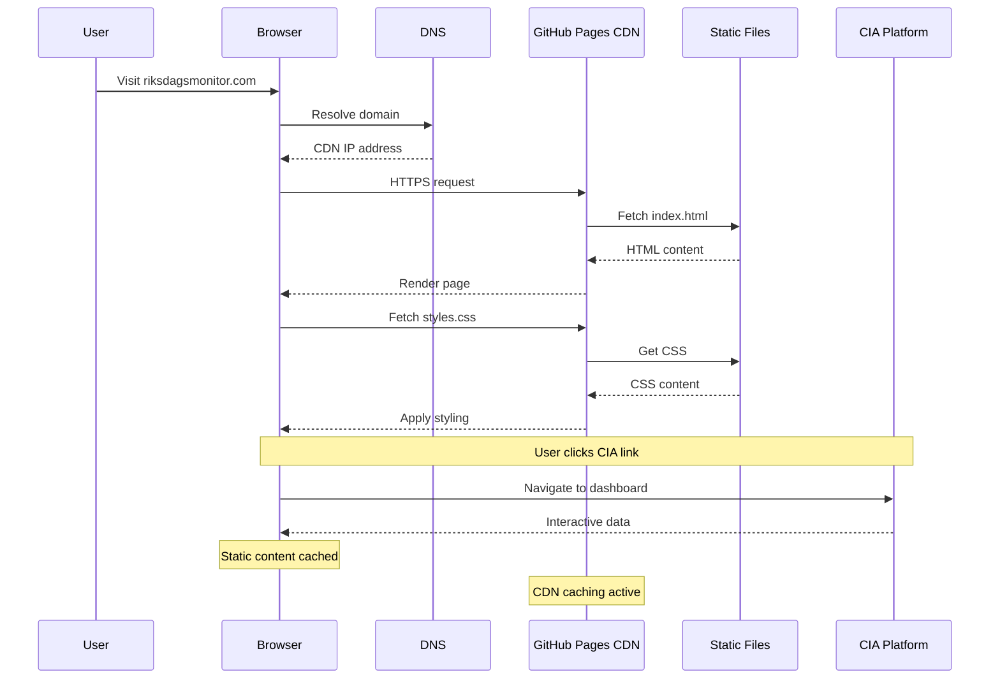
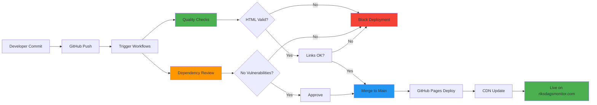
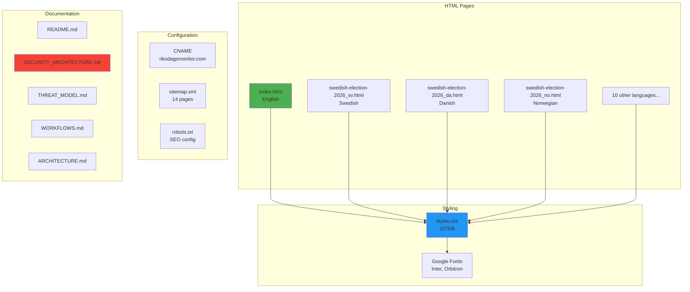
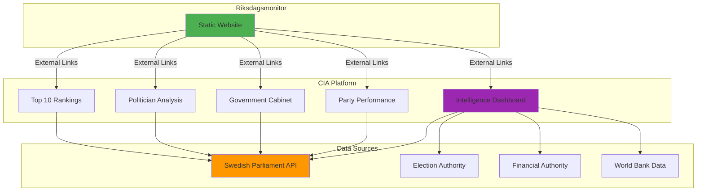
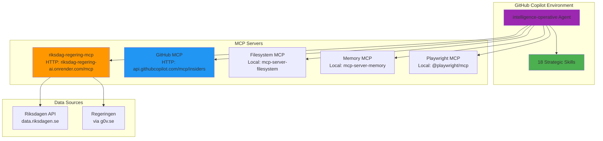
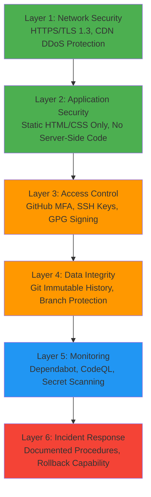
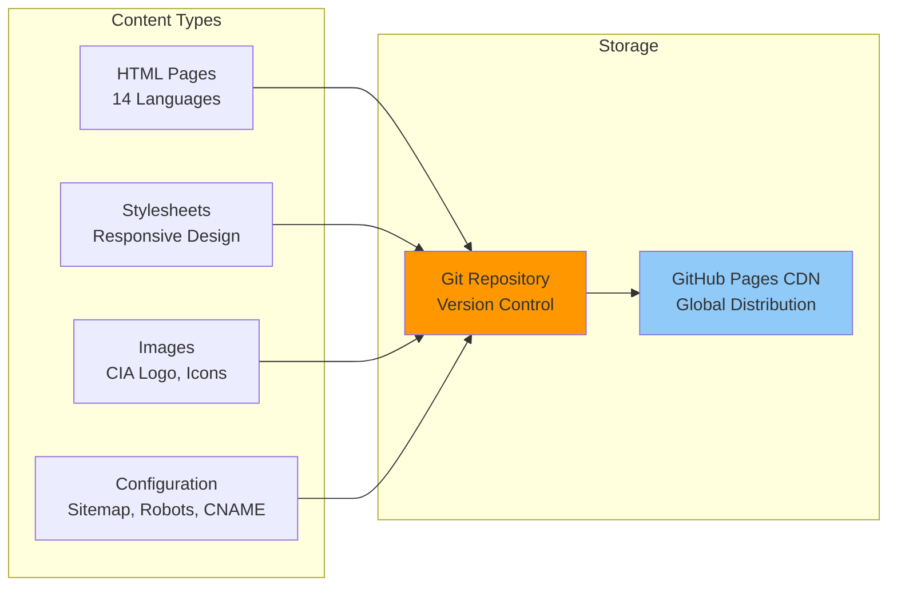
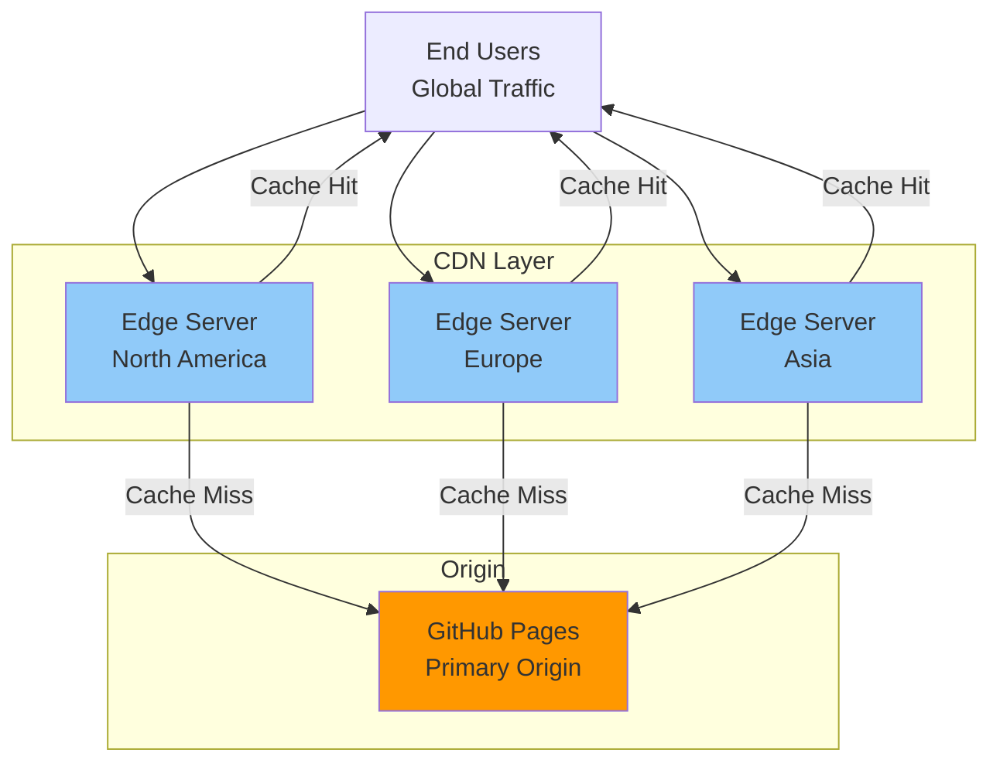
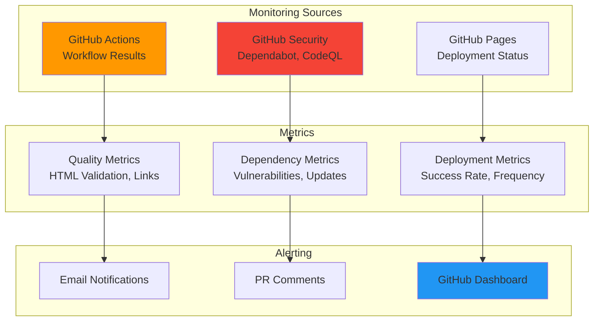
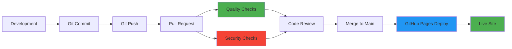

# 🏗️ Riksdagsmonitor - System Architecture

**Document Version:** 1.2  
**Last Updated:** 2026-02-08  
**Classification:** Public  
**Owner:** Hack23 AB (Org.nr 5595347807)

## Executive Summary

Riksdagsmonitor is a static website providing Swedish Parliament intelligence through CIA platform integration. Deployed on AWS CloudFront with multi-region S3 storage (us-east-1 primary, eu-west-1 replica) and GitHub Pages disaster recovery. This document describes the system architecture, component interactions, data flows, and design decisions aligned with Hack23 AB's ISMS standards.

## 1. System Overview

### 1.1 Architecture Diagram

```mermaid
graph TB
    subgraph "User Layer"
        Users[End Users<br/>Global Audience]
        Browsers[Web Browsers<br/>Chrome, Safari, Firefox]
    end
    
    subgraph "Content Delivery Layer"
        Route53[AWS Route 53<br/>DNS + Health Checks]
        CF[AWS CloudFront<br/>600+ Edge Locations]
        GHCDN[GitHub Pages CDN<br/>DR Standby]
    end
    
    subgraph "Application Layer"
        Static[Static Website<br/>HTML/CSS]
        Index[index.html<br/>14 Languages]
        Styles[styles.css<br/>107KB]
    end
    
    subgraph "Storage Layer"
        S3US[S3 us-east-1<br/>Primary Storage]
        S3EU[S3 eu-west-1<br/>Replica Storage]
    end
    
    subgraph "Data Layer"
        CIA[CIA Platform<br/>www.hack23.com/cia]
        Riksdag[Swedish Parliament<br/>data.riksdagen.se]
        Val[Election Authority<br/>val.se]
        ESV[Financial Authority<br/>esv.se]
        WB[World Bank<br/>data.worldbank.org]
    end
    
    subgraph "Infrastructure Layer"
        GitHub[GitHub Repository<br/>Version Control]
        Actions[GitHub Actions<br/>CI/CD Dual Deploy]
        Pages[GitHub Pages<br/>DR Hosting]
    end
    
    Users --> Browsers
    Browsers -->|DNS Query| Route53
    Route53 -->|DNS Response: CF Primary| Browsers
    Route53 -.->|DNS Response: GHCDN on Failover| Browsers
    Browsers -->|HTTPS/TLS 1.3| CF
    Browsers -.->|HTTPS/TLS 1.3 (DR)| GHCDN
    CF -->|Origin| S3US
    CF -.->|Origin Failover on 500+ errors| S3EU
    S3US -.->|S3 CRR (Async, <15 min target)| S3EU
    CF --> Static
    GHCDN --> Pages
    Pages --> Static
    Static --> Index
    Static --> Styles
    
    Browsers -->|External Links| CIA
    CIA --> Riksdag
    CIA --> Val
    CIA --> ESV
    CIA --> WB
    
    GitHub --> Actions
    Actions -->|Deploy| S3US
    Actions -->|Deploy| Pages
    
    style Users fill:#e1f5ff
    style CF fill:#4caf50
    style S3US fill:#2196f3
    style S3EU fill:#64b5f6
    style GHCDN fill:#90caf9
    style Static fill:#81c784
    style CIA fill:#9c27b0
    style GitHub fill:#ff9800
```

### 1.2 Component Responsibilities

| Component | Responsibility | Technology | Status |
|-----------|---------------|------------|--------|
| **Static Website** | Present intelligence data | HTML/CSS | ✅ Active |
| **AWS CloudFront** | Primary CDN | 600+ global PoPs | ✅ Active |
| **S3 us-east-1** | Primary storage | Amazon S3 + versioning | ✅ Active |
| **S3 eu-west-1** | Replica storage | S3 replication | ✅ Active |
| **Route 53** | DNS + health checks | AWS managed DNS | ✅ Active |
| **GitHub Pages** | DR hosting | GitHub CDN | ✅ Standby |
| **GitHub Actions** | CI/CD automation | YAML workflows | ✅ Active |
| **CIA Platform** | Data processing & analysis | Java/Spring Boot | ✅ External |
| **Data Sources** | Raw political data | Open APIs | ✅ External |

## 2. Data Flow Architecture

### 2.1 Content Delivery Flow



### 2.2 CI/CD Deployment Flow



## 3. Component Architecture

### 3.1 Static Website Structure



### 3.2 External Integration Architecture



### 3.3 GitHub Copilot MCP Server Integration

Riksdagsmonitor leverages GitHub Copilot with Model Context Protocol (MCP) servers for advanced political intelligence analysis and automation.

#### MCP Server Architecture



#### riksdag-regering-mcp Server

**Purpose**: Provides specialized access to Swedish political data for intelligence analysis

**Configuration**:
```json
{
  "riksdag-regering": {
    "type": "http",
    "url": "https://riksdag-regering-ai.onrender.com/mcp",
    "tools": ["*"]
  }
}
```

**32 Available Tools**:
1. **Ledamöter (MPs)**: Information, activities, assignments, biographical data
2. **Riksdagsdokument (Documents)**: Motions, written questions, interpellations, bills
3. **Anföranden (Speeches)**: Chamber debates, committee statements, plenary speeches
4. **Voteringar (Votes)**: Voting records, party discipline, coalition patterns
5. **Regeringsdokument (Government)**: SOU reports, propositions, press releases

**Data Sources**:
- **Riksdagen API**: https://data.riksdagen.se/ (Official Parliament API, 98.5% completeness)
- **Regeringen via g0v.se**: https://g0v.se/ (Open government data)

**Use Cases**:
- Political intelligence dashboards
- Voting pattern analysis
- Coalition behavior tracking
- Legislative monitoring
- Risk assessment for democratic accountability

#### Integration Benefits

| Capability | Without MCP | With MCP |
|------------|-------------|----------|
| **Data Access** | Manual API calls | Automated via 32 specialized tools |
| **Analysis** | Generic prompts | Domain-specific intelligence-operative agent |
| **Expertise** | Basic knowledge | 18 strategic skills (political science, OSINT, Swedish politics) |
| **Efficiency** | Multi-step workflows | Integrated single-step operations |
| **Compliance** | Manual GDPR checks | Built-in GDPR compliance skill |

**Security Considerations**:
- HTTP-only MCP server (no local execution risk)
- Public data sources only (GDPR Article 6(1)(e) compliance)
- No authentication required (public API access)
- Rate limiting handled by remote server
- See [SECURITY_ARCHITECTURE.md](SECURITY_ARCHITECTURE.md) for full details

## 4. Security Architecture Integration

### 4.1 Defense-in-Depth Layers



### 4.2 Security Control Mapping

See [SECURITY_ARCHITECTURE.md](SECURITY_ARCHITECTURE.md) for comprehensive security controls documentation.

## 5. Data Architecture

### 5.1 Content Structure



### 5.2 Data Sources

| Source | Type | Update Frequency | Integration |
|--------|------|------------------|-------------|
| **Swedish Parliament** | Votes, Documents, MPs | Real-time | CIA Platform |
| **Election Authority** | Results, Statistics | Post-election | CIA Platform |
| **Financial Authority** | Budget, Spending | Monthly | CIA Platform |
| **World Bank** | Country Indicators | Quarterly | CIA Platform |

## 6. Scalability Architecture

### 6.1 Traffic Handling



### 6.2 Performance Characteristics

| Metric | Target | Current | Method |
|--------|--------|---------|--------|
| **First Contentful Paint** | <1.5s | <1s | Static files, CDN caching |
| **Time to Interactive** | <3s | <2s | No JavaScript dependencies |
| **Largest Contentful Paint** | <2.5s | <2s | Optimized CSS, cached fonts |
| **Cumulative Layout Shift** | <0.1 | <0.05 | Stable layout, no dynamic content |

## 7. Monitoring Architecture

### 7.1 Observability Stack



### 7.2 Metrics Collection

**Tracked Metrics:**
- Workflow execution success rate
- HTML validation pass rate
- Link check failure count
- Dependency vulnerability count
- Deployment frequency
- Time to deploy

**Retention Policy:**
- Workflow runs: 90 days
- Artifacts: 30 days
- Security findings: Permanent
- Deployment logs: 90 days

## 8. Technology Stack

### 8.1 Frontend Stack

| Technology | Version | Purpose | Rationale |
|------------|---------|---------|-----------|
| **HTML5** | Standard | Content structure | Universal browser support |
| **CSS3** | Standard | Styling & layout | Responsive design, no framework overhead |
| **Google Fonts** | Latest | Typography | Professional appearance, cached globally |

### 8.2 Infrastructure Stack

| Technology | Version | Purpose | Rationale |
|------------|---------|---------|-----------|
| **GitHub Pages** | Latest | Static hosting | Free, reliable, global CDN |
| **GitHub Actions** | Latest | CI/CD | Integrated with repository, secure |
| **HTMLHint** | Latest | HTML validation | Industry standard validator |
| **Linkinator** | v6 | Link checking | Reliable, actively maintained |

### 8.3 External Dependencies

| Dependency | Type | Risk Level | Mitigation |
|------------|------|------------|------------|
| **GitHub Pages** | Infrastructure | LOW | 99.9% SLA, documented in THREAT_MODEL.md |
| **Google Fonts** | CDN | LOW | Cached, fallback fonts available |
| **CIA Platform** | External Service | LOW | Independent service, documented links |

## 9. Deployment Architecture

### 9.1 Deployment Pipeline



### 9.2 Rollback Strategy

**Rollback Methods:**
1. **Git Revert:** Immediate rollback via git revert command
2. **Branch Protection:** Required reviews prevent bad code
3. **Immutable History:** Complete audit trail for forensics
4. **Rapid Deployment:** Re-deploy takes <2 minutes

**Rollback SLA:**
- Detection: <5 minutes (monitoring alerts)
- Decision: <10 minutes (review incident)
- Execution: <2 minutes (git revert + deploy)
- **Total RTO:** <17 minutes

## 10. Future Architecture

### 10.1 Planned Enhancements

See [FUTURE_SECURITY_ARCHITECTURE.md](FUTURE_SECURITY_ARCHITECTURE.md) for detailed roadmap.

**Q2 2026:**
- DAST scanning integration
- Performance monitoring (Lighthouse CI)
- Automated translation workflows

**Q3 2026:**
- Advanced link monitoring
- Security header enhancement
- Accessibility improvements

**Q4 2026:**
- Multi-language content generation
- A/B testing framework
- Analytics integration

## 11. Design Decisions

### 11.1 Key Architectural Choices

| Decision | Rationale | Trade-offs |
|----------|-----------|------------|
| **Static HTML/CSS Only** | Eliminates XSS, SQLi, CSRF vulnerabilities | Limited interactivity |
| **GitHub Pages Hosting** | Free, reliable, global CDN, HTTPS by default | Platform dependency |
| **External CIA Platform** | Reuse existing OSINT infrastructure | External service dependency |
| **No JavaScript** | Reduces attack surface, improves performance | No dynamic features |
| **Multi-language Files** | SEO optimization, clear URL structure | File duplication |

### 11.2 Architecture Principles

1. **Security by Design:** Static files eliminate common web vulnerabilities
2. **Defense in Depth:** Multiple security layers (network, application, access control)
3. **Simplicity:** Minimal technology stack reduces maintenance burden
4. **Transparency:** Open source, public ISMS, documented architecture
5. **Performance:** CDN caching, no JavaScript, optimized assets

## 12. Related Documentation

### ISMS Documentation
- [SECURITY_ARCHITECTURE.md](SECURITY_ARCHITECTURE.md) - Security controls and compliance
- [THREAT_MODEL.md](THREAT_MODEL.md) - STRIDE analysis and risk assessment
- [WORKFLOWS.md](WORKFLOWS.md) - CI/CD workflows and automation
- [FUTURE_SECURITY_ARCHITECTURE.md](FUTURE_SECURITY_ARCHITECTURE.md) - Future roadmap

### External References
- [Hack23 ISMS](https://github.com/Hack23/ISMS)
- [Secure Development Policy](https://github.com/Hack23/ISMS/blob/main/Secure_Development_Policy.md)
- [CIA Platform Architecture](https://github.com/Hack23/cia/blob/master/ARCHITECTURE.md)

---

**Document Control:**
- **Repository:** https://github.com/Hack23/riksdagsmonitor
- **Path:** /ARCHITECTURE.md
- **Format:** Markdown with Mermaid diagrams
- **Classification:** Public
- **Next Review:** 2026-04-29
