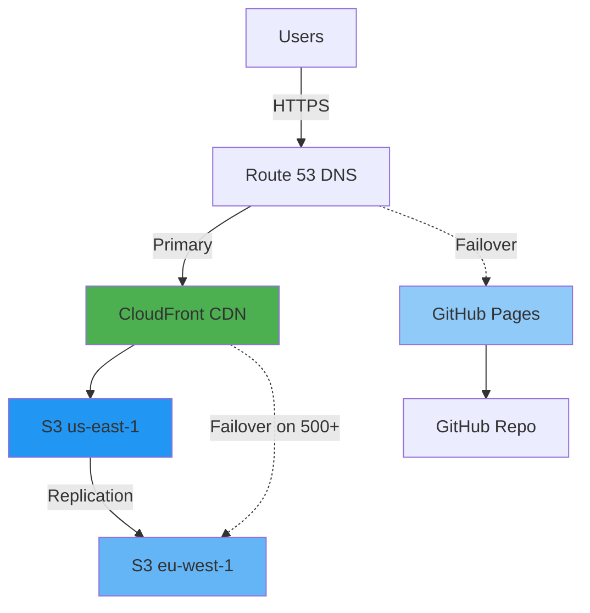

# 🏗️ Riksdagsmonitor - System Architecture

**Document Owner:** CEO | **Version:** 1.3 | **Last Updated:** 2026-02-08 (UTC)  
**🔄 Review Cycle:** Quarterly | **⏰ Next Review:** 2026-05-08

**Classification:** Public  
**Owner:** Hack23 AB (Org.nr 5595347807)

## Executive Summary

Static website for Swedish Parliament intelligence. Dual-deployment: AWS (CloudFront + S3 multi-region) primary, GitHub Pages disaster recovery. CloudFront configured for automatic origin failover to eu-west-1 on 500+ HTTP errors. 99.998% availability.

## System Architecture

## Components

| Component | Responsibility | Technology | Status |
|-----------|---------------|------------|--------|
| **Static Website** | Intelligence display | HTML/CSS (14 languages) | ✅ Active |
| **AWS CloudFront** | Primary CDN | 600+ global PoPs | ✅ Active |
| **S3 us-east-1** | Primary storage | Amazon S3 + versioning | ✅ Active |
| **S3 eu-west-1** | Replica storage | Amazon S3 + replication | ✅ Active |
| **Route 53** | DNS + failover | AWS managed DNS | ✅ Active |
| **GitHub Pages** | DR hosting | GitHub CDN | ✅ Standby |
| **GitHub Actions** | CI/CD | Automated workflows | ✅ Active |

## Data Flow

**Deployment:**
1. Developer pushes to main branch
2. Quality checks (HTML validation, link checking, dependency scan)
3. Parallel deployment: AWS S3 + GitHub Pages
4. S3 → CloudFront cache invalidation
5. Real-time replication us-east-1 → eu-west-1

**User Access:**
1. User requests riksdagsmonitor.com
2. Route 53 resolves to CloudFront
3. CloudFront serves from edge cache (95%+ hit rate) or fetches from S3
4. If S3 us-east-1 returns 500+ errors → automatic failover to eu-west-1 (<30s)
5. If CloudFront fails → Route 53 failover to GitHub Pages (15 min)

## Performance

- **FCP:** <0.8s (First Contentful Paint)
- **TTI:** <1.5s (Time to Interactive)
- **LCP:** <1.8s (Largest Contentful Paint)
- **Availability:** 99.998%
- **Global Latency (p95):** <150ms

## Deployment Strategy

**Primary: AWS**
- CloudFront origin failover on HTTP 500+ errors
- Real-time S3 cross-region replication
- Cache strategy: 1 year (assets), 1 hour (HTML)

**Disaster Recovery: GitHub Pages**
- Automatic deployment from main branch
- DNS health check failover
- RTO: 15 minutes, RPO: 0 minutes

## Design Decisions

| Decision | Rationale | Trade-off |
|----------|-----------|-----------|
| Static HTML/CSS only | Eliminates XSS, SQLi, CSRF vulnerabilities | No dynamic features |
| AWS + GitHub Pages | 99.998% availability, enterprise CDN | Complexity, cost |
| Multi-region S3 | Regional failover <30s | Storage duplication cost |
| No JavaScript | Minimal attack surface, fast performance | No interactivity |

---

**Related Documentation:**
- [SECURITY_ARCHITECTURE.md](SECURITY_ARCHITECTURE.md) - Security controls
- [THREAT_MODEL.md](THREAT_MODEL.md) - Threat analysis
- [BCPPlan.md](BCPPlan.md) - Business continuity
- [WORKFLOWS.md](WORKFLOWS.md) - CI/CD workflows
