<p align="center">
  
</p>

<h1 align="center">🏗️ Riksdagsmonitor — System Architecture</h1>

<p align="center">
  <strong>📐 C4 Architecture Model for Swedish Parliament Intelligence Platform</strong><br>
  <em>🏛️ Context, Container, Component & Dynamic Views</em>
</p>

<p align="center">
  
  
  
  
</p>

**📋 Document Owner:** CEO | **📄 Version:** 2.6 | **📅 Last Updated:** 2026-05-28 (UTC)
**🔄 Review Cycle:** Quarterly | **⏰ Next Review:** 2026-08-06  
**🏢 Owner:** Hack23 AB (Org.nr 5595347807) | **🏷️ Classification:** Public

---

## 📚 Architecture Documentation Map

| Document | Focus | Description |
|----------|-------|-------------|
| **[ARCHITECTURE.md](ARCHITECTURE.md)** ⭐ | 🏛️ **C4 Models** | **System structure, Context/Container/Component/Dynamic views** |
| [DATA_MODEL.md](DATA_MODEL.md) | 📊 Data | Entities, schemas, relationships |
| [FLOWCHART.md](FLOWCHART.md) | 🔄 Processes | Business process and data flows |
| [STATEDIAGRAM.md](STATEDIAGRAM.md) | 🔄 Behavior | System state transitions and lifecycles |
| [MINDMAP.md](MINDMAP.md) | 🧠 Concepts | System conceptual relationships |
| [SWOT.md](SWOT.md) | 💼 Strategy | Strategic analysis and positioning |
| [FUTURE_ARCHITECTURE.md](FUTURE_ARCHITECTURE.md) | 🚀 Future | Architectural evolution roadmap |
| [FUTURE_DATA_MODEL.md](FUTURE_DATA_MODEL.md) | 📊 Future | Enhanced data architecture plans |
| [FUTURE_FLOWCHART.md](FUTURE_FLOWCHART.md) | 🔄 Future | Improved process workflows |
| [FUTURE_STATEDIAGRAM.md](FUTURE_STATEDIAGRAM.md) | 📈 Future | Advanced state management |
| [FUTURE_MINDMAP.md](FUTURE_MINDMAP.md) | 🧠 Future | Capability expansion plans |
| [FUTURE_SWOT.md](FUTURE_SWOT.md) | 💼 Future | Future strategic opportunities |
| [SECURITY_ARCHITECTURE.md](SECURITY_ARCHITECTURE.md) | 🛡️ Security | Security controls and compliance |
| [FUTURE_SECURITY_ARCHITECTURE.md](FUTURE_SECURITY_ARCHITECTURE.md) | 🚀 Security | Security roadmap |
| [THREAT_MODEL.md](THREAT_MODEL.md) | 🎯 Threats | STRIDE analysis and risk assessment |
| [WORKFLOWS.md](WORKFLOWS.md) | 🔧 DevOps | CI/CD automation and pipelines |
| [CRA-ASSESSMENT.md](CRA-ASSESSMENT.md) | ⚖️ Compliance | EU Cyber Resilience Act conformity |

---

## 📋 Documentation Portfolio Matrix (ISMS continuous-improvement)

This matrix is the canonical index of every Hack23-ISMS deliverable maintained at the repository root. It is the at-a-glance complement to the long-form **drift inventory** in [`analysis/audits/documentation-portfolio-audit-2026-05-03.md`](analysis/audits/documentation-portfolio-audit-2026-05-03.md), which records observed drift, remediation in this PR, and follow-up backlog.

Authority for each row flows from the master [Information_Security_Policy](https://github.com/Hack23/ISMS-PUBLIC/blob/main/Information_Security_Policy.md) in [Hack23 ISMS-PUBLIC](https://github.com/Hack23/ISMS-PUBLIC); per-row `ISMS authority` cells link to the specific policy that mandates the document.

### Current-state architecture &amp; ISMS docs

| # | Document | Owner | Version | Last reviewed | Review cycle | Next review | ISMS authority |
|---|---|---|---|---|---|---|---|
| 1 | [`ARCHITECTURE.md`](ARCHITECTURE.md) | CEO | 2.5 | 2026-05-06 | Quarterly | 2026-08-06 | [Secure_Development_Policy §4](https://github.com/Hack23/ISMS-PUBLIC/blob/main/Secure_Development_Policy.md) |
| 2 | [`DATA_MODEL.md`](DATA_MODEL.md) | CEO | 1.3 | 2026-05-06 | Annual | 2027-05-06 | [CLASSIFICATION](https://github.com/Hack23/ISMS-PUBLIC/blob/main/CLASSIFICATION.md) |
| 3 | [`FLOWCHART.md`](FLOWCHART.md) | CEO | 1.2 | 2026-04-20 | Quarterly | 2026-07-20 | [Secure_Development_Policy §6](https://github.com/Hack23/ISMS-PUBLIC/blob/main/Secure_Development_Policy.md) |
| 4 | [`STATEDIAGRAM.md`](STATEDIAGRAM.md) | CEO | 1.1 | 2026-04-20 | Quarterly | 2026-07-20 | [Change_Management §5](https://github.com/Hack23/ISMS-PUBLIC/blob/main/Change_Management.md) |
| 5 | [`MINDMAP.md`](MINDMAP.md) | CEO | 1.4 | 2026-05-03 | Quarterly | 2026-08-03 | [Information_Security_Policy §5.5](https://github.com/Hack23/ISMS-PUBLIC/blob/main/Information_Security_Policy.md) |
| 6 | [`SWOT.md`](SWOT.md) | CEO | 1.3 | 2026-05-03 | Quarterly | 2026-08-03 | [Information_Security_Policy §3](https://github.com/Hack23/ISMS-PUBLIC/blob/main/Information_Security_Policy.md) |
| 7 | [`THREAT_MODEL.md`](THREAT_MODEL.md) | CEO/CISO | 1.2 | 2026-04-20 | Quarterly | 2026-07-20 | [Threat_Modeling](https://github.com/Hack23/ISMS-PUBLIC/blob/main/Threat_Modeling.md) |
| 8 | [`SECURITY_ARCHITECTURE.md`](SECURITY_ARCHITECTURE.md) | CEO/CISO | 2.3 | 2026-05-03 | Annual | 2027-05-03 | [Secure_Development_Policy §10](https://github.com/Hack23/ISMS-PUBLIC/blob/main/Secure_Development_Policy.md) |
| 9 | [`WORKFLOWS.md`](WORKFLOWS.md) | CEO | 7.3 | 2026-05-02 | Quarterly | 2026-08-02 | [Secure_Development_Policy §10.1](https://github.com/Hack23/ISMS-PUBLIC/blob/main/Secure_Development_Policy.md) |

### Future-state architecture docs

| # | Document | Owner | Version | Last reviewed | Review cycle | Next review | ISMS authority |
|---|---|---|---|---|---|---|---|
| 10 | [`FUTURE_ARCHITECTURE.md`](FUTURE_ARCHITECTURE.md) | CEO | 2.0 | 2026-02-24 | Quarterly | 2026-05-24 | [Information_Security_Policy §5.5](https://github.com/Hack23/ISMS-PUBLIC/blob/main/Information_Security_Policy.md) |
| 11 | [`FUTURE_DATA_MODEL.md`](FUTURE_DATA_MODEL.md) | CEO | 2.0 | 2026-02-24 | Quarterly | 2026-05-24 | [CLASSIFICATION](https://github.com/Hack23/ISMS-PUBLIC/blob/main/CLASSIFICATION.md) |
| 12 | [`FUTURE_FLOWCHART.md`](FUTURE_FLOWCHART.md) | CEO | 2.0 | 2026-02-24 | Quarterly | 2026-05-24 | [Secure_Development_Policy](https://github.com/Hack23/ISMS-PUBLIC/blob/main/Secure_Development_Policy.md) |
| 13 | [`FUTURE_STATEDIAGRAM.md`](FUTURE_STATEDIAGRAM.md) | CEO | 2.0 | 2026-02-24 | Quarterly | 2026-05-24 | [Change_Management](https://github.com/Hack23/ISMS-PUBLIC/blob/main/Change_Management.md) |
| 14 | [`FUTURE_MINDMAP.md`](FUTURE_MINDMAP.md) | CEO | 2.0 | 2026-02-24 | Quarterly | 2026-05-24 | [Information_Security_Policy §5.5](https://github.com/Hack23/ISMS-PUBLIC/blob/main/Information_Security_Policy.md) |
| 15 | [`FUTURE_SWOT.md`](FUTURE_SWOT.md) | CEO | 2.0 | 2026-02-24 | Quarterly | 2026-05-24 | [Information_Security_Policy §5.5](https://github.com/Hack23/ISMS-PUBLIC/blob/main/Information_Security_Policy.md) |
| 16 | [`FUTURE_THREAT_MODEL.md`](FUTURE_THREAT_MODEL.md) | CEO/CISO | 1.0 | 2026-02-26 | Quarterly | 2026-05-26 | [Threat_Modeling](https://github.com/Hack23/ISMS-PUBLIC/blob/main/Threat_Modeling.md) |
| 17 | [`FUTURE_SECURITY_ARCHITECTURE.md`](FUTURE_SECURITY_ARCHITECTURE.md) | CEO/CISO | 2.0 | 2026-02-24 | Quarterly | 2026-05-24 | [Secure_Development_Policy](https://github.com/Hack23/ISMS-PUBLIC/blob/main/Secure_Development_Policy.md) |
| 18 | [`FUTURE_WORKFLOWS.md`](FUTURE_WORKFLOWS.md) | CEO | 6.0 | 2026-05-02 | Quarterly | 2026-08-02 | [Secure_Development_Policy §10](https://github.com/Hack23/ISMS-PUBLIC/blob/main/Secure_Development_Policy.md) |

### Operational ISMS deliverables

| # | Document | Owner | Version | Last reviewed | Review cycle | Next review | ISMS authority |
|---|---|---|---|---|---|---|---|
| 19 | [`BCPPlan.md`](BCPPlan.md) | CEO | 1.2 | 2026-04-20 | Annual | 2027-04-20 | [Incident_Response_Plan](https://github.com/Hack23/ISMS-PUBLIC/blob/main/Incident_Response_Plan.md) |
| 20 | [`CRA-ASSESSMENT.md`](CRA-ASSESSMENT.md) | CEO/CISO | 1.3 | 2026-04-20 | Annual | 2027-04-20 | [Open_Source_Policy](https://github.com/Hack23/ISMS-PUBLIC/blob/main/Open_Source_Policy.md), [Vulnerability_Management](https://github.com/Hack23/ISMS-PUBLIC/blob/main/Vulnerability_Management.md) |
| 21 | [`End-of-Life-Strategy.md`](End-of-Life-Strategy.md) | CEO | 1.4 | 2026-04-20 | Annual | 2027-04-20 | [Information_Security_Policy](https://github.com/Hack23/ISMS-PUBLIC/blob/main/Information_Security_Policy.md) |
| 22 | [`FinancialSecurityPlan.md`](FinancialSecurityPlan.md) | CEO | 1.2 | 2026-04-20 | Annual | 2027-04-20 | [Information_Security_Policy](https://github.com/Hack23/ISMS-PUBLIC/blob/main/Information_Security_Policy.md) |
| 23 | [`RELEASE_PROCESS.md`](RELEASE_PROCESS.md) | CEO | 1.0 | 2026-02-18 | Quarterly | 2026-05-18 | [Change_Management](https://github.com/Hack23/ISMS-PUBLIC/blob/main/Change_Management.md), [Secure_Development_Policy §10](https://github.com/Hack23/ISMS-PUBLIC/blob/main/Secure_Development_Policy.md) |
| 24 | [`TESTING.md`](TESTING.md) | CEO | 1.0 | 2026-02 (header only) | Quarterly | 2026-05 | [Secure_Development_Policy §7](https://github.com/Hack23/ISMS-PUBLIC/blob/main/Secure_Development_Policy.md) |
| 25 | [`TRANSLATION_GUIDE.md`](TRANSLATION_GUIDE.md) | CEO | 1.0 | 2026-02-10 | Quarterly | 2026-05-10 | [Information_Security_Policy §3](https://github.com/Hack23/ISMS-PUBLIC/blob/main/Information_Security_Policy.md) |
| 26 | [`SECURITY.md`](SECURITY.md) | CEO/CISO | 1.0 | 2026-02-20 | Annual | 2027-02-20 | [Vulnerability_Management](https://github.com/Hack23/ISMS-PUBLIC/blob/main/Vulnerability_Management.md) |
| 27 | [`LABELS.md`](LABELS.md) | CEO | 1.1 | 2026-05-03 | Annual | 2027-05-03 | [Information_Security_Policy §3](https://github.com/Hack23/ISMS-PUBLIC/blob/main/Information_Security_Policy.md) |
| 28 | [`SKILLS.md`](SKILLS.md) | CEO | (auto) | 2026-04-22 | Continuous | n/a | [Secure_Development_Policy §4](https://github.com/Hack23/ISMS-PUBLIC/blob/main/Secure_Development_Policy.md) |
| 29 | [`AGENTS.md`](AGENTS.md) | CEO | (auto) | continuous | Continuous | n/a | [AI_Policy](https://github.com/Hack23/ISMS-PUBLIC/blob/main/AI_Policy.md) |
| 30 | [`Article-Generation.md`](Article-Generation.md) | CEO | (auto) | continuous | Continuous | n/a | [AI_Policy §4](https://github.com/Hack23/ISMS-PUBLIC/blob/main/AI_Policy.md) |

> **ISMS continuous-improvement evidence:** This matrix + the drift-reconciliation changes in v2.3 satisfy the continuous-improvement clause of [Information_Security_Policy §5.5](https://github.com/Hack23/ISMS-PUBLIC/blob/main/Information_Security_Policy.md). Observed drift is documented in the audit file, high-signal stale facts are corrected immediately, and a backlog is queued for the wholesale rewrites of long documents. Per-document footers can be added in a follow-up housekeeping PR; the canonical "last reviewed" stamp for every row above is the **header badge block** of the linked document.

---

## Executive Summary

Riksdagsmonitor is a web application providing Swedish Parliament intelligence through interactive dashboards (Chart.js/D3.js) and CIA platform integration. Deployed on AWS CloudFront with multi-region S3 storage (us-east-1 primary, eu-west-1 replica) and GitHub Pages disaster recovery. This document describes the system architecture using the C4 model (Context, Container, Component, Dynamic), component interactions, data flows, and design decisions aligned with Hack23 AB's ISMS standards.

---

## 🌐 C4 System Context Diagram (Level 1)

The System Context diagram shows Riksdagsmonitor's place in its environment, including users, external systems, and key relationships.

### System Boundaries and External Dependencies

```mermaid
graph TB
    subgraph "Users"
        Users[End Users<br/>Person<br/>Global citizens, journalists,<br/>researchers, policymakers]
    end
    
    subgraph "Riksdagsmonitor System"
        System[Riksdagsmonitor<br/>Software System<br/>Swedish Parliament Intelligence Platform<br/>Static website with interactive dashboards]
    end
    
    subgraph "External Systems"
        CIA[CIA Platform<br/>External System<br/>Political intelligence data processing<br/>www.hack23.com/cia]
        
        GitHub[GitHub<br/>External System<br/>Version control & hosting<br/>GitHub Pages, Actions]
        
        AWS[AWS Infrastructure<br/>External System<br/>CloudFront CDN + S3 Storage<br/>Global content delivery]
        
        Parliament[Swedish Parliament API<br/>External System<br/>Official legislative data<br/>data.riksdagen.se]
        
        Government[Regeringen<br/>External System<br/>Government documents<br/>via g0v.se]
    end
    
    Users -->|HTTPS/TLS 1.3<br/>Browse site, view dashboards| System
    System -->|External links<br/>Deep political analysis| CIA
    System -->|Hosted on<br/>DR hosting| GitHub
    System -->|Delivered via<br/>Primary CDN| AWS
    CIA -->|Fetches data from| Parliament
    CIA -->|Fetches data from| Government
    
    style Users fill:#e1f5ff,stroke:#0277bd,stroke-width:2px,color:#000000
    style System fill:#4caf50,stroke:#2e7d32,stroke-width:3px,color:#000000
    style CIA fill:#9c27b0,stroke:#6a1b9a,stroke-width:2px,color:#ffffff
    style GitHub fill:#ff9800,stroke:#e65100,stroke-width:2px,color:#000000
    style AWS fill:#2196f3,stroke:#1565c0,stroke-width:2px,color:#ffffff
    style Parliament fill:#ffeb3b,stroke:#f57f17,stroke-width:2px,color:#000000
    style Government fill:#ffeb3b,stroke:#f57f17,stroke-width:2px,color:#000000
```

### Context Relationships

| Actor/System | Relationship | Purpose |
|--------------|-------------|---------|
| **End Users** → **Riksdagsmonitor** | Browse via HTTPS | Access Swedish Parliament intelligence, view interactive dashboards |
| **Riksdagsmonitor** → **CIA Platform** | External links | Deep political analysis, data visualization |
| **Riksdagsmonitor** → **AWS CloudFront** | CDN delivery | Primary content delivery, 600+ global PoPs |
| **Riksdagsmonitor** → **GitHub Pages** | DR hosting | Disaster recovery standby, secondary deployment |
| **CIA Platform** → **Swedish Parliament API** | API calls | Fetch legislative data, voting records, documents |
| **CIA Platform** → **Regeringen** | API calls via g0v.se | Government documents, propositions, press releases |

---

## 🏛️ C4 Container Diagram (Level 2)

The Container diagram zooms into Riksdagsmonitor to show major technical components (containers) and their interactions.

### Technical Containers and Technology Choices

```mermaid
graph TB
    subgraph "User Layer"
        Users[End Users<br/>Global Audience]
        Browsers[Web Browsers<br/>Chrome, Safari, Firefox]
    end
    
    subgraph "Content Delivery Layer"
        Route53[AWS Route 53<br/>Container: DNS Service<br/>DNS + Health Checks + Failover]
        CF[AWS CloudFront<br/>Container: CDN<br/>600+ Edge Locations<br/>DDoS Protection]
        GHCDN[GitHub Pages CDN<br/>Container: DR CDN<br/>DR Standby]
    end
    
    subgraph "Application Layer - Riksdagsmonitor"
        Static[Static Website<br/>Container: Web Application<br/>HTML5/CSS3/JavaScript<br/>14 Languages]
        
        Dashboards[Interactive Dashboards<br/>Container: Client-Side App<br/>Chart.js v4.4.1, D3.js v7.9.0<br/>Papa Parse v5.5.3]
        
        NewsEngine[Agentic News Pipeline<br/>Container: gh-aw + Node 26 scripts<br/>23 artifacts → article.md → HTML]

        PIBuilder[scripts/political-intelligence/<br/>Container: PI Catalog &amp; Daily-Streams<br/>catalog.ts · daily-streams.ts<br/>i18n/ · render/]

        AgenticGate[scripts/agentic/<br/>Container: Analysis Gate &amp; Inventory<br/>analysis-gate.ts (checks 1–9b)<br/>artifact-inventory.ts (23 artifacts, A–E)]

        DashCoalition[scripts/coalition-dashboard.ts<br/>+ coalition-dashboard/<br/>Container: Coalition Renderer]
        DashCommittees[scripts/committees-dashboard.ts<br/>+ committees-dashboard/<br/>Container: Committee Renderer]
        DashPolitician[politician-dashboard.html<br/>× 14 languages<br/>Container: Politician Renderer]
    end

    subgraph "TypeScript Data-Source Clients (no MCP)"
        IMFClient[scripts/imf-*.ts<br/>Datamapper JSON + SDMX 3.0]
        SCBClient[scripts/scb-*.ts<br/>PxWeb v2 client]
        WBClient[scripts/world-bank-*.ts<br/>WGI + WDI client]
        RiksbankClient[scripts/riksbank-fetch.ts<br/>Policy-rate + FX]
        StatskontoretClient[scripts/statskontoret-*.ts<br/>+ fetch-statskontoret.ts<br/>Myndighetsförteckning + budget outturn]
        RiRClient[scripts/rir-followups-client.ts<br/>+ fetch-rir-followups.ts<br/>RiR follow-ups]
        ParliamentaryDL[scripts/parliamentary-data/<br/>+ download-parliamentary-data.ts<br/>+ fetch-voting-records.ts<br/>+ fetch-calendar.ts<br/>data-downloader · data-persistence · pdf-converter]
    end
    
    subgraph "Storage Layer"
        S3US[S3 us-east-1<br/>Container: Object Storage<br/>Primary Storage + Versioning]
        S3EU[S3 eu-west-1<br/>Container: Object Storage<br/>Replica Storage]
    end
    
    subgraph "Data Layer"
        DataFiles[CSV/JSON Files<br/>Container: Data Store<br/>Static data files]
    end
    
    subgraph "CI/CD Layer"
        Actions[GitHub Actions<br/>Container: CI/CD Pipeline<br/>Automated workflows<br/>Quality gates]
        GitHub[Git Repository<br/>Container: Version Control<br/>Source code + history]
    end
    
    Users --> Browsers
    Browsers -->|DNS Query| Route53
    Route53 -->|DNS Response: CF Primary| Browsers
    Route53 -.->|DNS Response: GHCDN on Failover| Browsers
    Browsers -->|HTTPS/TLS 1.3| CF
    Browsers -.->|HTTPS/TLS 1.3 (DR)| GHCDN
    CF -->|Origin| S3US
    CF -.->|Origin Failover on 500+ errors| S3EU
    S3US -.->|S3 CRR (Async, <15 min target)| S3EU
    CF --> Static
    GHCDN --> Static
    Static --> Dashboards
    Static --> DataFiles
    Dashboards -->|Parse CSV| DataFiles
    
    NewsEngine -->|Generates| Static
    NewsEngine -->|Commits to| GitHub
    NewsEngine -->|Gated by| AgenticGate
    NewsEngine -->|Catalog/streams from| PIBuilder
    NewsEngine -->|Fetches macro/fiscal| IMFClient
    NewsEngine -->|Fetches Swedish stats| SCBClient
    NewsEngine -->|Fetches governance| WBClient
    NewsEngine -->|Fetches policy rates| RiksbankClient
    NewsEngine -->|Fetches admin/budget| StatskontoretClient
    NewsEngine -->|Fetches audit follow-ups| RiRClient
    NewsEngine -->|Fetches votes/cal/docs| ParliamentaryDL
    PIBuilder --> Static
    DashCoalition --> Static
    DashCommittees --> Static
    DashPolitician --> Static
    
    GitHub --> Actions
    Actions -->|Deploy| S3US
    Actions -->|Deploy| GHCDN
    
    style Users fill:#e1f5ff,color:#000000
    style CF fill:#4caf50,color:#000000
    style S3US fill:#2196f3,color:#ffffff
    style S3EU fill:#64b5f6,color:#000000
    style GHCDN fill:#90caf9,color:#000000
    style Static fill:#81c784,color:#000000
    style Dashboards fill:#ff9800,color:#000000
    style NewsEngine fill:#9c27b0,color:#ffffff
    style PIBuilder fill:#7e57c2,color:#ffffff
    style AgenticGate fill:#5e35b1,color:#ffffff
    style IMFClient fill:#00897b,color:#ffffff
    style SCBClient fill:#00acc1,color:#ffffff
    style WBClient fill:#26a69a,color:#000000
    style RiksbankClient fill:#80cbc4,color:#000000
    style StatskontoretClient fill:#4db6ac,color:#000000
    style RiRClient fill:#80deea,color:#000000
    style ParliamentaryDL fill:#b2dfdb,color:#000000
    style DashCoalition fill:#ffb74d,color:#000000
    style DashCommittees fill:#ffb74d,color:#000000
    style DashPolitician fill:#ffb74d,color:#000000
    style GitHub fill:#ff6f00,color:#000000
    style Actions fill:#00bcd4,color:#000000
```

### Container Responsibilities

| Container | Technology | Responsibility | Status |
|-----------|------------|----------------|--------|
| **Static Website** | HTML5/CSS3/JavaScript | Present intelligence content, 14-language support | ✅ Active |
| **Interactive Dashboards** | Chart.js v4.4.1, D3.js v7.9.0, Papa Parse v5.5.3 | Data visualization, committee analysis, coalition tracking | ✅ Active |
| **Agentic News Pipeline** | GitHub Agentic Workflows, Node 26 scripts, riksdag-regering MCP, SCB MCP, IMF TypeScript client | 23-artifact analysis, deterministic article aggregation, 14-language HTML rendering | ✅ Active |
| **AWS CloudFront** | AWS CDN | Primary global content delivery, DDoS protection | ✅ Active |
| **S3 us-east-1** | AWS S3 | Primary object storage with versioning | ✅ Active |
| **S3 eu-west-1** | AWS S3 | Replica storage with cross-region replication | ✅ Active |
| **Route 53** | AWS DNS | DNS resolution with health checks and failover | ✅ Active |
| **GitHub Pages CDN** | GitHub CDN | Disaster recovery hosting | ✅ Standby |
| **GitHub Actions** | CI/CD automation | Build, test, deploy workflows | ✅ Active |
| **Git Repository** | GitHub | Version control, source of truth | ✅ Active |
| **CSV/JSON Files** | Static data | Dashboard data, workflow state | ✅ Active |
| **scripts/political-intelligence/** | TypeScript (Node ≥26) | PI catalog, daily-streams index, i18n (artifact/methodology/page/stream/template), render leaves (daily-day, grid, page, style) | ✅ Active |
| **scripts/agentic/** | TypeScript (Node ≥26) | Analysis-gate (checks 1–9b, `PASS2_MTIME_THRESHOLD_MS = 180_000`), typed `ArtifactDefinition` inventory of 23 artifacts (Families A–E), 76 vitest tests | ✅ Active |
| **IMF TS client** | TypeScript (Node ≥26) | Datamapper JSON v1 + SDMX 3.0 transports for WEO, FM, IFS, MFS, GFS_COFOG, DOTS — *not* an MCP server | ✅ Active |
| **SCB TS client** | TypeScript (Node ≥26) | PxWeb v2 client for Statistics Sweden tables — sibling pattern to IMF/WB | ✅ Active |
| **World Bank TS client** | TypeScript (Node ≥26) | WGI / WDI client for governance + long-horizon social/education residue | ✅ Active |
| **Riksbank TS client** | TypeScript (Node ≥26) | Policy-rate, FX, monetary series fetcher | ✅ Active |
| **Statskontoret TS client** | TypeScript (Node ≥26) | Myndighetsförteckning + Årsutfall + Månadsutfall download discovery and parsing | ✅ Active |
| **RiR TS client** | TypeScript (Node ≥26) | Riksrevisionen audit follow-ups fetcher | ✅ Active |
| **parliamentary-data subdir** | TypeScript (Node ≥26) | data-downloader + data-persistence + pdf-converter primitives backing votes/calendar/document downloads | ✅ Active |
| **Coalition Dashboard** | TypeScript + Chart.js/D3 | `scripts/coalition-dashboard.ts` + `coalition-dashboard/` — coalition viability rendering | ✅ Active |
| **Committees Dashboard** | TypeScript + Chart.js/D3 | `scripts/committees-dashboard.ts` + `committees-dashboard/` — committee productivity rendering | ✅ Active |
| **Politician Dashboard** | Static HTML × 14 langs | `politician-dashboard.html` + `politician-dashboard_<lang>.html` for SV, DA, NO, FI, DE, FR, ES, NL, AR, HE, JA, KO, ZH | ✅ Active |

---

## 🧩 C4 Component Diagram (Level 3)

The Component diagram zooms into containers to show their internal structure and key components.

### Static Website Components


```mermaid
graph TD
    subgraph "HTML Pages"
        Index[index.html<br/>Component: Main Page<br/>English + 4 Functional Dashboards<br/>946 lines inline script]
        LangSV[index_sv.html<br/>Component: Swedish Page<br/>Coalition Dashboard]
        LangDA[index_da.html<br/>Component: Danish Page<br/>Coalition Dashboard]
        LangNO[index_no.html<br/>Component: Norwegian Page<br/>Coalition Dashboard]
        LangOther[10 other languages<br/>Component: Multi-language Pages<br/>fi, de, fr, es, nl, ar, he, ja, ko, zh]
    end
    
    subgraph "JavaScript Dashboards"
        InlineScript[Inline Dashboard Script<br/>Component: Risk Detection<br/>946 lines<br/>Risk + Anomaly Detection]
        
        CommitteeDash[committees-dashboard.js<br/>Component: Committee Analysis<br/>39KB - Committee performance]
        
        CoalitionDash[coalition-dashboard.js<br/>Component: Coalition Analysis<br/>33KB - Coalition dynamics]
        
        ElectionDash[election-cycle-dashboard.js<br/>Component: Election Analysis<br/>46KB - Election cycle tracking]
        
        Placeholders[5 Placeholder Sections<br/>Component: Future Dashboards<br/>Party, Seasonal, Pre-Election,<br/>Ministry, Anomaly Detection<br/>HTML only, no JS]
    end
    
    subgraph "Data Transformation"
        DataTransformers[data-transformers.js<br/>Component: Data Processing<br/>CSV parsing, data cleaning]
        
        HTMLUtils[html-utils.js<br/>Component: HTML Generation<br/>Template rendering, multi-language]
        
        NewsGen[aggregate-analysis.ts + render-articles.ts<br/>Component: Article Generation<br/>23 artifacts → article.md → 14-language HTML]
    end
    
    subgraph "Styling"
        CSS[styles.css<br/>Component: Styling<br/>107KB responsive design]
        Fonts[Google Fonts<br/>Component: Typography<br/>Inter, Orbitron]
    end
    
    subgraph ExtLibs["External Libraries (Hosted Locally)"]
        Chart[Chart.js v4.4.1<br/>Component: Charting Library<br/>Hosted on CloudFront/S3]
        ChartPlugin[chartjs-plugin-annotation v3.0.1<br/>Component: Chart Annotations<br/>Hosted on CloudFront/S3]
        ChartAdapter[chartjs-adapter-date-fns v3.0.0<br/>Component: Date Adapter<br/>Hosted on CloudFront/S3]
        D3[D3.js v7<br/>Component: Advanced Viz<br/>Hosted on CloudFront/S3]
        Papa[Papa Parse v5.5.3<br/>Component: CSV Parser<br/>Hosted on CloudFront/S3]
    end
    
    subgraph "Configuration"
        CNAME[CNAME<br/>Component: DNS Config<br/>riksdagsmonitor.com]
        Sitemap[sitemap.xml<br/>Component: SEO Config<br/>XML sitemap with 14-language hreflang]
        SitemapHtml[sitemap.html + sitemap_&lt;lang&gt;.html<br/>Component: Human-readable Sitemap<br/>14 localized pages, all articles date-sorted]
        Robots[robots.txt<br/>Component: Crawler Config<br/>SEO directives]
    end
    
    Index --> InlineScript
    Index --> CommitteeDash
    Index --> CoalitionDash
    Index --> ElectionDash
    Index --> Placeholders
    Index --> CSS
    
    LangSV --> CoalitionDash
    LangDA --> CoalitionDash
    LangNO --> CoalitionDash
    LangOther --> CoalitionDash
    
    InlineScript --> Chart
    InlineScript --> D3
    CommitteeDash --> Chart
    CommitteeDash --> D3
    CoalitionDash --> Chart
    CoalitionDash --> D3
    ElectionDash --> Chart
    ElectionDash --> D3
    
    CommitteeDash --> Papa
    CoalitionDash --> Papa
    ElectionDash --> Papa
    
    NewsGen --> HTMLUtils
    NewsGen --> DataTransformers
    
    CSS --> Fonts
    
    style Index fill:#4caf50,color:#000000
    style InlineScript fill:#ff9800,color:#000000
    style CommitteeDash fill:#2196f3,color:#ffffff
    style CoalitionDash fill:#2196f3,color:#ffffff
    style ElectionDash fill:#2196f3,color:#ffffff
    style Placeholders fill:#9e9e9e,color:#000000
    style CSS fill:#00bcd4,color:#000000
    style Chart fill:#ff9800,color:#000000
    style D3 fill:#ff9800,color:#000000
    style NewsGen fill:#9c27b0,color:#ffffff
```

### Component Details

#### HTML Pages (14 Languages)
- **index.html** - English main page with 4 functional dashboards
- **index_sv.html** - Swedish version (coalition dashboard)
- **index_da.html** - Danish version (coalition dashboard)
- **index_no.html** - Norwegian version (coalition dashboard)
- **index_fi.html** - Finnish version
- **index_de.html** - German version
- **index_fr.html** - French version
- **index_es.html** - Spanish version
- **index_nl.html** - Dutch version
- **index_ar.html** - Arabic version (RTL)
- **index_he.html** - Hebrew version (RTL)
- **index_ja.html** - Japanese version
- **index_ko.html** - Korean version
- **index_zh.html** - Chinese version

#### Dashboard Components
1. **Inline Script (946 lines)** - Risk detection and anomaly detection
2. **committees-dashboard.js (39KB)** - Committee performance analysis
3. **coalition-dashboard.js (33KB)** - Coalition dynamics tracking
4. **election-cycle-dashboard.js (46KB)** - Election cycle analysis
5. **5 Placeholder Sections** - Future dashboards (HTML structure only, no JS implementation yet)
   - Party Performance Dashboard
   - Seasonal Trends Dashboard
   - Pre-Election Monitoring Dashboard
   - Ministry Performance Dashboard
   - Advanced Anomaly Detection Dashboard

#### Scripts and Utilities
- **scripts/aggregate-analysis.ts** - Recursively regenerates `analysis/daily/**/article.md` from analysis artifacts
- **scripts/render-articles.ts** - Renders `article.md` / `article.<lang>.md` into sanitized `news/*-{lang}.html` files
- **scripts/render-lib/** - Shared Markdown sanitization, article chrome, JSON-LD, source appendix, language alternates, and aggregator ordering
- **src/browser/** - TypeScript dashboard modules compiled by Vite

---

## 🔄 C4 Dynamic Diagram

Dynamic diagrams show how components interact in specific scenarios.

### Scenario 1: User Request Flow

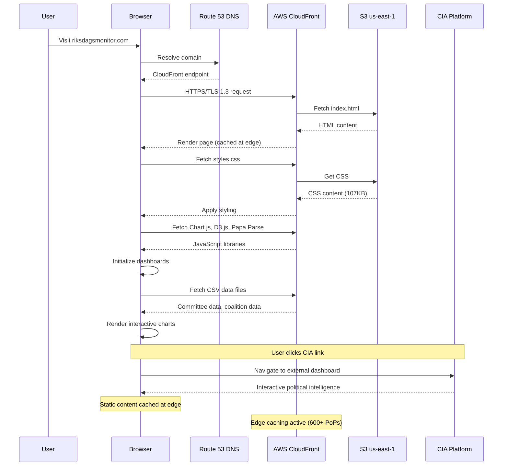
```mermaid
sequenceDiagram
    participant User
    participant Browser
    participant DNS as Route 53 DNS
    participant CDN as AWS CloudFront
    participant S3 as S3 us-east-1
    participant CIA as CIA Platform
    
    User->>Browser: Visit riksdagsmonitor.com
    Browser->>DNS: Resolve domain
    DNS-->>Browser: CloudFront endpoint
    Browser->>CDN: HTTPS/TLS 1.3 request
    CDN->>S3: Fetch index.html
    S3-->>CDN: HTML content
    CDN-->>Browser: Render page (cached at edge)
    Browser->>CDN: Fetch styles.css
    CDN->>S3: Get CSS
    S3-->>CDN: CSS content (107KB)
    CDN-->>Browser: Apply styling
    Browser->>CDN: Fetch Chart.js, D3.js, Papa Parse
    CDN-->>Browser: JavaScript libraries
    Browser->>Browser: Initialize dashboards
    Browser->>CDN: Fetch CSV data files
    CDN-->>Browser: Committee data, coalition data
    Browser->>Browser: Render interactive charts
    
    Note over Browser,CIA: User clicks CIA link
    Browser->>CIA: Navigate to external dashboard
    CIA-->>Browser: Interactive political intelligence
    
    Note over Browser: Static content cached at edge
    Note over CDN: Edge caching active (600+ PoPs)
```

### Scenario 2: CI/CD Deployment Flow

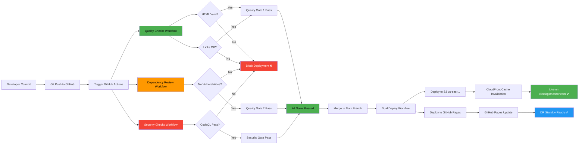
```mermaid
graph LR
    A[Developer Commit] --> B[Git Push to GitHub]
    B --> C[Trigger GitHub Actions]
    
    C --> D[Quality Checks Workflow]
    C --> E[Dependency Review Workflow]
    C --> F[Security Checks Workflow]
    
    D --> G{HTML Valid?}
    D --> H{Links OK?}
    E --> I{No Vulnerabilities?}
    F --> J{CodeQL Pass?}
    
    G -->|Yes| K[Quality Gate 1 Pass]
    G -->|No| L[Block Deployment ❌]
    H -->|Yes| K
    H -->|No| L
    I -->|Yes| M[Quality Gate 2 Pass]
    I -->|No| L
    J -->|Yes| N[Security Gate Pass]
    J -->|No| L
    
    K --> O[All Gates Passed]
    M --> O
    N --> O
    
    O --> P[Merge to Main Branch]
    P --> Q[Dual Deploy Workflow]
    Q --> R[Deploy to S3 us-east-1]
    Q --> S[Deploy to GitHub Pages]
    R --> T[CloudFront Cache Invalidation]
    S --> U[GitHub Pages Update]
    T --> V[Live on riksdagsmonitor.com ✅]
    U --> W[DR Standby Ready ✅]
    
    style D fill:#4caf50,color:#000000
    style E fill:#ff9800,color:#000000
    style F fill:#f44336,color:#ffffff
    style L fill:#f44336,color:#fff
    style O fill:#4caf50,color:#000000
    style V fill:#4caf50,color:#fff
    style W fill:#2196f3,color:#fff
```

### Scenario 3: Nightly News Generation Flow

```mermaid
sequenceDiagram
    participant Cron as GitHub Actions Cron
    participant NewsGen as gh-aw news workflow
    participant MCP as riksdag-regering-mcp
    participant SCB as scb-mcp
    participant IMF as imf-ts-client
    participant State as workflow-state.json
    participant Git as Git Repository
    participant CI as GitHub Actions CI/CD
    
    Cron->>NewsGen: Trigger at 18:00 UTC (Evening Analysis)
    NewsGen->>State: Read last execution state
    State-->>NewsGen: Last article timestamp, recent topics
    
    NewsGen->>MCP: Query 1: Latest Riksdag documents (today)
    MCP-->>NewsGen: Motions, propositions, interpellations
    
    NewsGen->>MCP: Query 2: Latest votes (today)
    MCP-->>NewsGen: Voting records, party positions
    
    NewsGen->>MCP: Query 3: Government documents (today)
    MCP-->>NewsGen: Press releases, announcements
    
    NewsGen->>MCP: Query 4: Parliamentary calendar (tomorrow)
    MCP-->>NewsGen: Upcoming debates, votes
    
    NewsGen->>SCB: Query 5: Statistical context (optional)
    SCB-->>NewsGen: Economic indicators (unemployment, GDP, etc.)
    Note over NewsGen,SCB: SCB enrichment is optional — failures do not block article generation
    
    NewsGen->>IMF: Query 6: Macro/fiscal freshness + projections (optional)
    IMF-->>NewsGen: WEO / Fiscal Monitor / IFS (2025 finals + projections to 2031)
    Note over NewsGen,IMF: IMF via pure-TS `scripts/imf-client.ts` invoked by the bash tool (no MCP);<br/>optional enrichment — graceful fallback to cached `analysis/data/imf/` on failure
    
    NewsGen->>NewsGen: Produce 23 analysis artifacts + per-document files
    Note over NewsGen: AI-FIRST Pass 1 + Pass 2; no article before the analysis gate passes
    
    NewsGen->>NewsGen: Aggregate article.md and render HTML
    Note over NewsGen: aggregate-analysis.ts creates article.md; render-articles.ts emits en/sv immediately and all 14 languages during full regeneration
    
    NewsGen->>State: Update workflow state
    State-->>NewsGen: State saved (deduplication cache)
    
    NewsGen->>Git: Open safe-output PR with artifacts, article.md, and HTML
    Git->>CI: Trigger deployment workflow
    CI->>CI: Run quality checks
    CI->>S3: Deploy to CloudFront
    CI->>Pages: Deploy to GitHub Pages
    
    Note over NewsGen,Pages: Articles live in <2 minutes
```

---

## 📚 Architecture Layers

### Layer 1: 🖥️ Presentation Layer

**Purpose:** User interface and client-side rendering

**Technologies:**
- **HTML5** - Semantic markup, 14-language support with proper `lang` attributes
- **CSS3** - 107KB responsive design, CSS Grid, Flexbox
- **JavaScript ES6+** - Modern browser features, async/await
- **Chart.js v4.4.1** - Data visualization library
- **chartjs-plugin-annotation v3.0.1** - Chart annotation plugin
- **chartjs-adapter-date-fns v3.0.0** - Time-series date adapter
- **D3.js v7** - Advanced interactive visualizations
- **Papa Parse v5.5.3** - CSV parsing for dashboard data
- **Google Fonts** - Inter and Orbitron typography

**Responsibilities:**
- Render HTML pages in 14 languages
- Display interactive dashboards with Chart.js and D3.js
- Parse CSV data files with Papa Parse
- Apply responsive CSS styling
- Handle user interactions (clicks, navigation)

### Layer 2: 📊 Data Layer

**Purpose:** Data storage and retrieval

**Technologies:**
- CSV data files (committee data, coalition data, election data)
- JSON configuration files (workflow-state.json)
- Papa Parse v5.5.3 (client-side CSV parsing)
- Git version control (immutable history)

**Responsibilities:**
- Store dashboard data in CSV format
- Maintain workflow state in JSON
- Provide data to dashboards via client-side parsing
- Track data versions through Git commits

### Layer 3: 🔌 Integration Layer

**Purpose:** External system integration

**Technologies:**
- **CIA Platform** - External intelligence system (www.hack23.com/cia)
- **riksdag-regering-mcp** - MCP server for political data (32 tools)
- **GitHub API** - Repository management
- **Swedish Parliament API** - Legislative data (data.riksdagen.se)
- **Regeringen API** - Government documents (via g0v.se)

**Responsibilities:**
- Link to CIA Platform for deep analysis
- Query riksdag-regering-mcp for news generation
- Fetch data from Swedish Parliament API (via CIA Platform)
- Access government documents (via g0v.se)

### Layer 4: 🔒 Security Layer

**Purpose:** Application security and compliance

**Technologies:**
- **Content Security Policy (CSP)** - XSS prevention
- **Subresource Integrity (SRI)** - Supply chain security for JS libraries
- **SLSA Build Attestations** - Build provenance
- **GitHub OIDC** - Keyless authentication for deployments
- **Dependabot** - Automated dependency updates
- **CodeQL** - Static application security testing (SAST)
- **Secret Scanning** - Credential leak detection

**Responsibilities:**
- Enforce CSP headers to prevent XSS attacks
- Validate JS library integrity with SRI hashes
- Generate SLSA attestations for builds
- Authenticate deployments with OIDC tokens
- Scan dependencies for vulnerabilities
- Detect secrets in code

**See:** [SECURITY_ARCHITECTURE.md](SECURITY_ARCHITECTURE.md) for complete security controls

### Layer 5: 📈 Monitoring Layer

**Purpose:** Observability and operational monitoring

**Technologies:**
- **GitHub Actions Workflow Metrics** - Build/deploy success rates
- **AWS CloudWatch** - CDN and S3 metrics
- **HTMLHint** - HTML validation
- **Linkinator v6** - Link integrity checking
- **Dependabot Alerts** - Vulnerability notifications
- **CodeQL Alerts** - Security finding notifications

**Responsibilities:**
- Track workflow execution status
- Monitor CloudFront cache hit rates
- Validate HTML quality
- Check link integrity
- Alert on security findings
- Report deployment failures

### Layer 6: 🚀 CI/CD Layer

**Purpose:** Build, test, and deployment automation

**Technologies:**
- **GitHub Actions** - CI/CD orchestration
- **Vite** - Build tool for optimized assets
- **HTMLHint** - HTML quality validation
- **Linkinator v6** - Link checking
- **npm** - Package management
- **AWS CLI** - S3/CloudFront deployment
- **GitHub Pages** - DR deployment

**Responsibilities:**
- Run automated tests on every push
- Validate HTML and check links
- Build optimized production assets
- Deploy to S3 and CloudFront (primary)
- Deploy to GitHub Pages (DR)
- Invalidate CDN caches

---

## 🏭 Key Design Patterns

### 📄 Static Site Generation Pattern

**Description:** Pure static HTML/CSS/JS with no server-side code execution

**Benefits:**
- Minimal attack surface (no server-side vulnerabilities)
- Maximum performance (edge caching)
- High availability (easy replication)
- Low operational complexity
- Cost-effective hosting

**Implementation:**
- All content pre-rendered at build time
- JavaScript libraries hosted locally on CloudFront/S3
- Client-side CSV parsing with Papa Parse
- No dynamic backend dependencies

### 📊 Data Pipeline Pattern

**Description:** Data flows from CIA Platform → CSV files → focused TypeScript loader modules → Chart.js/D3.js rendering

**Components:**
1. **Data Sources** - CIA Platform aggregates from Swedish Parliament API
2. **Data Export** - CSV files stored in repository (`cia-data/`)
3. **Source Inventory** (`src/browser/cia/sources.ts`) - 26 CSV source URL definitions + Riksdag/committee constants, side-effect free
4. **Type Definitions** (`src/browser/cia/types.ts`) - 30+ DTO interfaces consumed by both the loader and the renderer; visualization layer imports types here directly to avoid pulling in network code
5. **CSV Helpers** (`src/browser/cia/csv-utils.ts`) - `parseCSV` / `loadCSV` / `createLoadCSV` free functions with local-first + remote fallback strategy
6. **Per-Domain Loaders** (`src/browser/cia/loaders/*.ts`) - One file per dashboard domain (overview, election, parties, top10, committees, voting, ministries, demographics, documents, risk); each is a pure function `(loadCSV) => Promise<T>` that can be unit-tested in isolation
7. **Orchestrator** (`src/browser/cia/data-loader.ts`) - `CIADataLoader` class wiring loaders together with a shared `LoadCSV` closure; preserves the historical public API for `dashboard-init.ts` and `election-predictions.ts`
8. **Visualization** - Chart.js/D3.js render interactive dashboards from the typed payloads

**Benefits:**
- Clear data lineage with bounded module responsibilities
- Version-controlled data
- Fast client-side rendering
- No database required
- Each loader is independently testable; types are importable without the HTTP client

### 🌍 Multi-Language Pattern

**Description:** 14 separate HTML files, one per language, with proper SEO

**Languages:** English (en), Swedish (sv), Danish (da), Norwegian (no), Finnish (fi), German (de), French (fr), Spanish (es), Dutch (nl), Arabic (ar, RTL), Hebrew (he, RTL), Japanese (ja), Korean (ko), Chinese (zh)

**Implementation:**
- Each language has dedicated HTML file (e.g., `index_sv.html`)
- Proper `lang` attribute on `<html>` tag
- `hreflang` tags linking all 14 versions for SEO
- RTL support (`dir="rtl"`) for Arabic and Hebrew
- Language switcher component in navigation

**Benefits:**
- SEO-optimized URL structure
- Clear language separation
- No client-side translation (faster)
- Better crawlability for search engines

### 🔒 Progressive Enhancement Pattern

**Description:** CSS-first design where JavaScript enriches but is not required

**Layers:**
1. **Base HTML** - Semantic content, accessible without JS
2. **CSS Styling** - Responsive design, visual hierarchy
3. **JavaScript Enhancement** - Interactive dashboards, dynamic charts

**Benefits:**
- Works without JavaScript (graceful degradation)
- Better accessibility
- Faster initial page load
- SEO-friendly (content visible to crawlers)

### 📰 Content Generation Pattern

**Description:** Automated news generation using riksdag-regering-mcp and AI agents

**Workflow:**
1. **Data Collection** - riksdag-regering-mcp queries political data
2. **Analysis** - intelligence-operative agent analyzes events
3. **Writing** - Generate 5 editorial pillars (Lead, Pulse, Watch, Opposition, Ahead)
4. **Quality Validation** - Check analytical depth, party coverage, sources
5. **Translation** - Generate 14-language versions
6. **Publication** - Commit HTML files, trigger deployment

**Quality Metrics:**
- Analytical depth score ≥ 0.6
- Party coverage ≥ 6 unique parties
- Source citations ≥ 5 references
- Historical context score ≥ 1.0
- International comparison (60%+ of articles)

**See:** §5.3 News Generation Architecture for details

### 🔁 Dual Deployment Pattern

**Description:** AWS CloudFront (primary) + GitHub Pages (DR) with Route 53 failover

**Architecture:**
- **Primary:** AWS CloudFront → S3 us-east-1 (with S3 eu-west-1 replica)
- **Secondary:** GitHub Pages CDN → GitHub Pages hosting
- **Orchestration:** Route 53 health checks with automatic failover

**Failover Logic:**
1. Route 53 health check monitors CloudFront endpoint
2. If CloudFront returns 5xx errors for >60 seconds
3. Route 53 updates DNS to point to GitHub Pages
4. GitHub Pages serves identical content
5. When CloudFront recovers, Route 53 switches back

**Benefits:**
- 99.9% availability (both AWS and GitHub have 99.9% SLA)
- Geographic redundancy (AWS multi-region + GitHub global CDN)
- Cost optimization (GitHub Pages free, AWS pay-as-you-go)
- Disaster recovery (independent hosting platforms)

**RTO:** <5 minutes (DNS TTL + health check interval)  
**RPO:** <2 minutes (dual deploy on every commit)

---

## 📊 Data Architecture

### Content Structure

```mermaid
graph LR
    subgraph "Content Types"
        HTML[HTML Pages<br/>14 Languages<br/>index.html + 13 translations]
        CSS[Stylesheets<br/>styles.css (107KB)<br/>Responsive Design]
        JS[JavaScript<br/>Dashboard scripts<br/>Chart.js, D3.js, Papa Parse]
        Data[Data Files<br/>CSV files<br/>Committee, coalition, election data]
        Images[Images<br/>Logos, icons<br/>SVG + PNG]
        Config[Configuration<br/>sitemap.xml, sitemap*.html, rss.xml, robots.txt, CNAME]
    end
    
    subgraph "Storage"
        Git[Git Repository<br/>Version Control<br/>Immutable History]
        S3[S3 Storage<br/>Primary: us-east-1<br/>Replica: eu-west-1]
        CDN[CloudFront CDN<br/>600+ Global PoPs<br/>Edge Caching]
    end
    
    HTML --> Git
    CSS --> Git
    JS --> Git
    Data --> Git
    Images --> Git
    Config --> Git
    
    Git --> S3
    S3 --> CDN
    
    style Git fill:#ff9800,color:#000000
    style S3 fill:#2196f3,color:#ffffff
    style CDN fill:#4caf50,color:#000000
```

### Data Sources

| Source | Type | Update Frequency | Integration | Risk Level |
|--------|------|------------------|-------------|------------|
| **Swedish Parliament** | Votes, Documents, MPs, Debates | Real-time | CIA Platform → External Links | LOW |
| **Election Authority** | Election Results, Statistics | Post-election | CIA Platform → External Links | LOW |
| **Financial Authority** | Budget, Government Spending | Monthly | CIA Platform → External Links | LOW |
| **World Bank** | Country Indicators, Economic Data | Quarterly | CIA Platform → External Links | LOW |
| **IMF (International Monetary Fund)** | WEO, Fiscal Monitor, IFS, MFS, GFS_COFOG — macro, fiscal, monetary, external-sector indicators + T+5 projections | WEO (Apr/Oct), Fiscal Monitor (Apr/Oct), IFS monthly, MFS monthly | **Pure-TypeScript client** `scripts/imf-client.ts` (Datamapper JSON + SDMX 3.0) — *not an MCP server*, invoked by agentic workflows via bash | LOW |
| **riksdag-regering-mcp** | Aggregated Political Data | On-demand | MCP Server (32 tools) | LOW |
| **SCB (Statistics Sweden)** | 1,200+ statistical tables (economy, labour, population, education, environment) | Varies (monthly–quarterly) | MCP Server (scb-mcp, PxWebAPI 2.0) | LOW |

### News Generation Architecture

#### 5 Editorial Pillars Structure

The evening analysis follows a structured 5-pillar editorial format using OSINT/INTOP-driven political intelligence analysis:

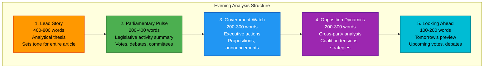
```mermaid
graph TD
    subgraph "Evening Analysis Structure"
        Lead[1. Lead Story<br/>400-800 words<br/>Analytical thesis<br/>Sets tone for entire article]
        Pulse[2. Parliamentary Pulse<br/>200-400 words<br/>Legislative activity summary<br/>Votes, debates, committees]
        Watch[3. Government Watch<br/>200-300 words<br/>Executive actions<br/>Propositions, announcements]
        Opposition[4. Opposition Dynamics<br/>200-300 words<br/>Cross-party analysis<br/>Coalition tensions, strategies]
        Ahead[5. Looking Ahead<br/>100-200 words<br/>Tomorrow's preview<br/>Upcoming votes, debates]
    end
    
    Lead --> Pulse
    Pulse --> Watch
    Watch --> Opposition
    Opposition --> Ahead
    
    style Lead fill:#ff9800,stroke:#e65100,stroke-width:2px,color:#000000
    style Pulse fill:#4caf50,stroke:#2e7d32,stroke-width:2px,color:#000000
    style Watch fill:#2196f3,stroke:#1565c0,stroke-width:2px,color:#ffffff
    style Opposition fill:#9c27b0,stroke:#6a1b9a,stroke-width:2px,color:#ffffff
    style Ahead fill:#00bcd4,stroke:#00838f,stroke-width:2px,color:#000000
```

**Pillar Definitions:**

1. **Lead Story (400-800 words)**
   - Opening narrative establishing the day's main theme
   - Analytical thesis in lead paragraph
   - "Why this matters" context
   - Most significant development with implications
   - Sets tone for entire article

2. **Parliamentary Pulse (200-400 words)**
   - Legislative body activity summary
   - Key votes and margins
   - Committee reports published
   - Debate highlights
   - Speeches and procedural actions

3. **Government Watch (200-300 words)**
   - Executive branch monitoring
   - New propositions
   - Ministerial announcements
   - Policy changes
   - Regulatory actions

4. **Opposition Dynamics (200-300 words)**
   - Cross-party political analysis
   - Opposition party strategies
   - Coalition tensions
   - Cross-party collaboration patterns
   - Political maneuvering

5. **Looking Ahead (100-200 words)**
   - Forward-looking preview
   - Tomorrow's parliamentary calendar
   - Upcoming votes and debates
   - Expected announcements
   - "What to watch" guidance

#### Quality Metrics Schema

News articles are validated against comprehensive quality metrics:

| Dimension | Metric | Target | Measurement |
|-----------|--------|--------|-------------|
| **Analytical Depth** | Score 0.0-1.0 | ≥ 0.6 | Causal, comparative, evaluative language markers |
| **Historical Context** | Score 0-3 | ≥ 1.0 | Historical references, trends, temporal comparisons |
| **Party Coverage** | Count | ≥ 6 | Unique party mentions across all 8 Riksdag parties |
| **Source Citations** | Count | ≥ 5 | riksdag-regering-mcp tool usage, document references |
| **International Comparison** | Boolean | 60%+ | European/global context present |
| **Structure Completeness** | Boolean | 100% | All 5 pillars present with minimum word counts |

**Quality Score Calculation:**
- Structure (30%): All pillars present + minimum word counts
- Analytical depth (20%): Marker detection (because, therefore, however, etc.)
- Historical context (15%): Temporal references (since, previously, compared to)
- Sources (15%): Citation count from riksdag-regering-mcp queries
- Party perspectives (10%): Coverage breadth across political spectrum
- Forward-looking (5%): Preview content in "Looking Ahead" pillar
- International comparison (5%): Global context and European benchmarking

#### Workflow State Management

Cross-workflow coordination prevents duplication and maintains quality:

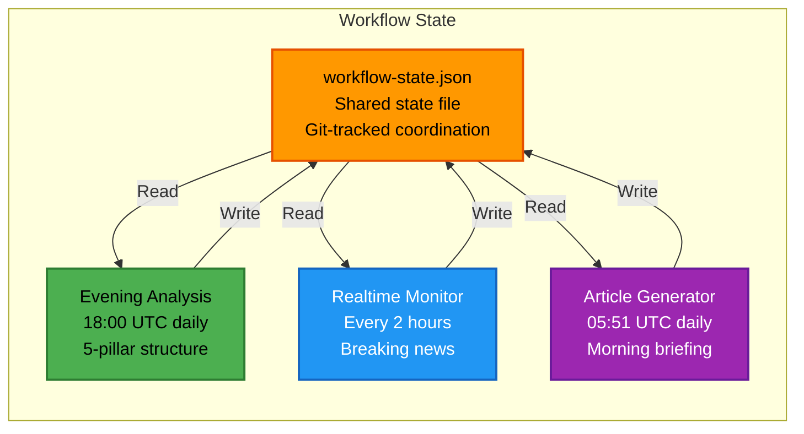
```mermaid
graph LR
    subgraph "Workflow State"
        State[workflow-state.json<br/>Shared state file<br/>Git-tracked coordination]
        
        Evening[Evening Analysis<br/>18:00 UTC daily<br/>5-pillar structure]
        Realtime[Realtime Monitor<br/>Every 2 hours<br/>Breaking news]
        Generator[Article Generator<br/>05:51 UTC daily<br/>Morning briefing]
    end
    
    Evening -->|Write| State
    Realtime -->|Write| State
    Generator -->|Write| State
    
    State -->|Read| Evening
    State -->|Read| Realtime
    State -->|Read| Generator
    
    style State fill:#ff9800,stroke:#e65100,stroke-width:2px,color:#000000
    style Evening fill:#4caf50,stroke:#2e7d32,stroke-width:2px,color:#000000
    style Realtime fill:#2196f3,stroke:#1565c0,stroke-width:2px,color:#ffffff
    style Generator fill:#9c27b0,stroke:#6a1b9a,stroke-width:2px,color:#ffffff
```

**State File Schema (workflow-state.json):**
```json
{
  "lastEveningAnalysis": "2026-02-20T18:00:00Z",
  "realtimeArticlesSinceEvening": [
    {
      "timestamp": "2026-02-20T14:30:00Z",
      "topic": "Budget vote",
      "keywords": ["budget", "vote", "coalition"]
    }
  ],
  "mcpQueryCache": {
    "query": "latest riksdag documents",
    "timestamp": "2026-02-20T17:58:00Z",
    "ttl": 7200
  },
  "eveningAnalysisMetrics": {
    "avgAnalyticalDepth": 0.72,
    "avgPartyCoverage": 7.2,
    "avgSourceCitations": 6.5
  }
}
```

**Deduplication Logic:**
1. Calculate text similarity (word overlap) between new and recent articles
2. If similarity > 70%, synthesize but don't repeat verbatim content
3. Reference earlier coverage, add deeper analysis layer
4. Update workflow state after successful generation
5. Clear stale cache entries (TTL: 2 hours for MCP queries)

#### Multi-Language Content Architecture

14-language support with consistent quality across all versions:

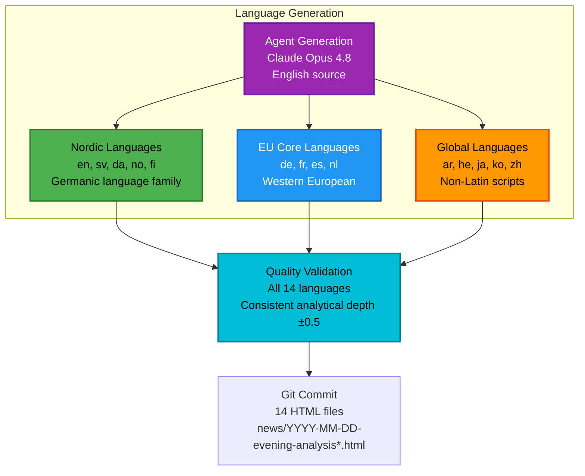
```mermaid
graph TB
    subgraph "Language Generation"
        Source[Agent Generation<br/>Claude Opus 4.8<br/>English source]
        
        Nordic[Nordic Languages<br/>en, sv, da, no, fi<br/>Germanic language family]
        EU[EU Core Languages<br/>de, fr, es, nl<br/>Western European]
        Global[Global Languages<br/>ar, he, ja, ko, zh<br/>Non-Latin scripts]
    end
    
    Source --> Nordic
    Source --> EU
    Source --> Global
    
    Nordic --> Validation[Quality Validation<br/>All 14 languages<br/>Consistent analytical depth ±0.5]
    EU --> Validation
    Global --> Validation
    
    Validation --> Commit[Git Commit<br/>14 HTML files<br/>news/YYYY-MM-DD-evening-analysis*.html]
    
    style Source fill:#9c27b0,stroke:#6a1b9a,stroke-width:2px,color:#ffffff
    style Nordic fill:#4caf50,stroke:#2e7d32,stroke-width:2px,color:#000000
    style EU fill:#2196f3,stroke:#1565c0,stroke-width:2px,color:#ffffff
    style Global fill:#ff9800,stroke:#e65100,stroke-width:2px,color:#000000
    style Validation fill:#00bcd4,stroke:#00838f,stroke-width:2px,color:#000000
```

**Language-Specific Requirements:**

| Requirement | Implementation | Validation |
|-------------|----------------|------------|
| **HTML `lang` attribute** | `<html lang="sv">` for Swedish, etc. | Automated check in CI |
| **RTL support** | `<html dir="rtl">` for Arabic and Hebrew | Manual review |
| **Hreflang tags** | Link all 14 versions for SEO | HTMLHint validation |
| **Schema.org NewsArticle** | JSON-LD in each language | Schema.org validator |
| **Culturally appropriate tone** | Agent-specific language instructions | Editor review |
| **Consistent analytical depth** | Target ±0.5 on 1.0 scale across languages | Automated quality scoring |

**File Naming Convention:**
- `news/2026-02-20-evening-analysis-en.html` (English)
- `news/2026-02-20-evening-analysis-sv.html` (Swedish — produced by the same workflow)
- `news/2026-02-20-evening-analysis-da.html` (Danish — produced by `news-translate`)
- ... (11 more language variants, all from `news-translate`)

---

## 🔁 News Generation Pipeline Architecture

### Aggregate → Render Module (`scripts/aggregate-analysis.ts`, `scripts/render-articles.ts`, `scripts/render-lib/`)

The news pipeline is a **single-pass** aggregate-then-render flow. There is no scaffold-and-fill, no template placeholders, and no per-type generator class. Every article is derived 100% from real analysis artifacts under `analysis/daily/$DATE/$SUB/` plus the methodology + template files under `analysis/methodologies/` and `analysis/templates/`.

#### C4 Component Diagram — News Subsystem

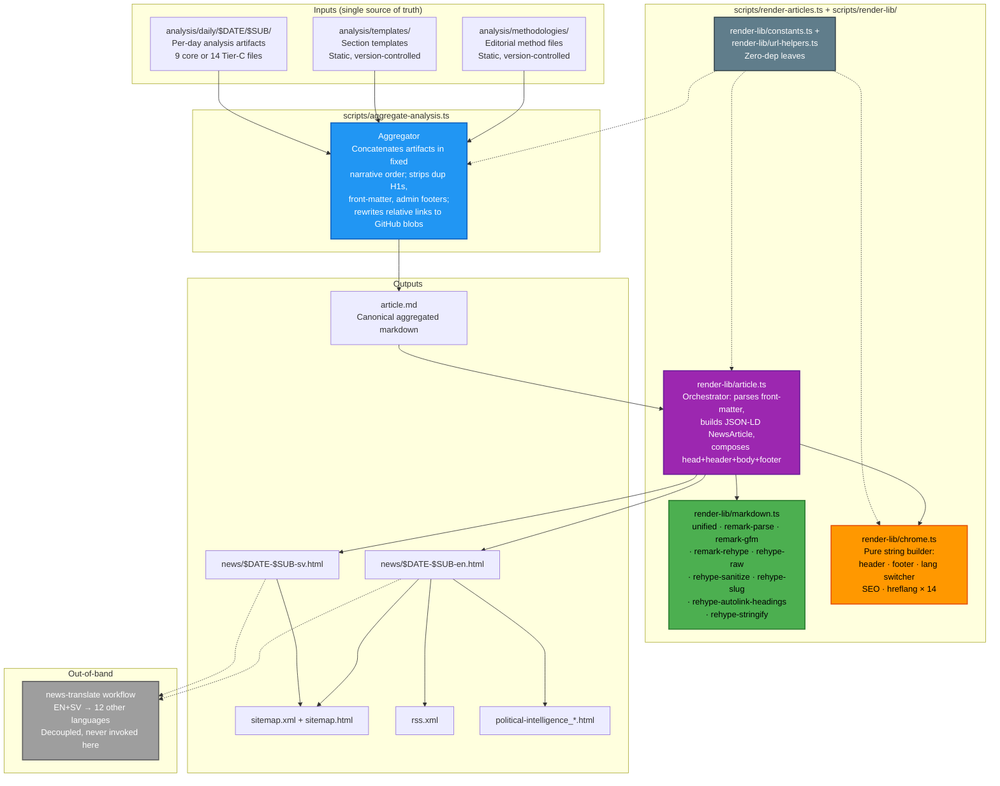
```mermaid
graph TD
    subgraph "Inputs (single source of truth)"
        Methodologies[analysis/methodologies/<br/>Editorial method files<br/>Static, version-controlled]
        Templates[analysis/templates/<br/>Section templates<br/>Static, version-controlled]
        Daily[analysis/daily/$DATE/$SUB/<br/>Per-day analysis artifacts<br/>9 core or 14 Tier-C files]
    end

    subgraph "scripts/aggregate-analysis.ts"
        Aggregator[Aggregator<br/>Concatenates artifacts in fixed<br/>narrative order; strips dup H1s,<br/>front-matter, admin footers;<br/>rewrites relative links to GitHub blobs]
    end

    subgraph "scripts/render-articles.ts + scripts/render-lib/"
        Renderer[render-lib/markdown.ts<br/>unified · remark-parse · remark-gfm<br/>· remark-rehype · rehype-raw<br/>· rehype-sanitize · rehype-slug<br/>· rehype-autolink-headings<br/>· rehype-stringify]
        Chrome[render-lib/chrome.ts<br/>Pure string builder:<br/>header · footer · lang switcher<br/>SEO · hreflang × 14]
        Article[render-lib/article.ts<br/>Orchestrator: parses front-matter,<br/>builds JSON-LD NewsArticle,<br/>composes head+header+body+footer]
        Constants[render-lib/constants.ts +<br/>render-lib/url-helpers.ts<br/>Zero-dep leaves]
    end

    subgraph "Outputs"
        ArticleMd[article.md<br/>Canonical aggregated markdown]
        EnHtml[news/$DATE-$SUB-en.html]
        SvHtml[news/$DATE-$SUB-sv.html]
        Sitemap[sitemap.xml + sitemap.html]
        Rss[rss.xml]
        Pi[political-intelligence_*.html]
    end

    subgraph "Out-of-band"
        Translate[news-translate workflow<br/>EN+SV → 12 other languages<br/>Decoupled, never invoked here]
    end

    Methodologies --> Aggregator
    Templates --> Aggregator
    Daily --> Aggregator
    Aggregator --> ArticleMd
    ArticleMd --> Article
    Article --> Renderer
    Article --> Chrome
    Constants -.-> Aggregator
    Constants -.-> Chrome
    Constants -.-> Article
    Article --> EnHtml
    Article --> SvHtml
    EnHtml --> Sitemap
    SvHtml --> Sitemap
    EnHtml --> Rss
    EnHtml --> Pi
    EnHtml -.-> Translate
    SvHtml -.-> Translate

    style Aggregator fill:#2196f3,stroke:#1565c0,stroke-width:2px,color:#ffffff
    style Renderer fill:#4caf50,stroke:#2e7d32,stroke-width:2px,color:#000000
    style Chrome fill:#ff9800,stroke:#e65100,stroke-width:2px,color:#000000
    style Article fill:#9c27b0,stroke:#6a1b9a,stroke-width:2px,color:#ffffff
    style Constants fill:#607d8b,stroke:#37474f,stroke-width:2px,color:#ffffff
    style Translate fill:#9e9e9e,stroke:#616161,stroke-width:2px,color:#ffffff
```

#### Pipeline Stages

The `scripts/render-lib/` directory was split (Round-4) from a single 960-LOC monolith into **6 focused leaf modules** linked by a thin barrel `index.ts`. Each leaf has a single responsibility and zero circular dependencies. Consumers (`aggregate-analysis.ts`, `render-articles.ts`, tests, `analysis-references.ts`) import from the barrel only — the internal layout can evolve without breaking downstream code.

| Stage | Script / Module | Responsibility |
|-------|-----------------|----------------|
| **aggregate** | `scripts/aggregate-analysis.ts` (CLI driver) → `scripts/render-lib/aggregator.ts` | Concatenate per-day artifacts in canonical narrative order; emit `article.md`. Strips leading admin bylines, `## Pass 2 …` self-audit sections, YAML front-matter, duplicated H1s, `Document control` / `End of template` footers. Rewrites relative links to absolute GitHub blob URLs. |
| **render-md** | `scripts/render-lib/markdown.ts` | Markdown → sanitised HTML via `unified` → `remark-parse` → `remark-gfm` → `remark-rehype` → `rehype-raw` → `rehype-slug` → `rehype-autolink-headings` → `rehype-sanitize` → `rehype-stringify`. The sanitiser schema (`sanitizeSchema`) is the single trust boundary between AI markdown and user HTML. |
| **chrome** | `scripts/render-lib/chrome.ts` | **Pure string builder** (no I/O, no async): emits `<head>` (SEO + OpenGraph + hreflang for all 14 languages), `<header>` (tagline logo + breadcrumb + dropdown language switcher), `<footer>` (3-column brand/navigate/trust + always-visible secondary language row). |
| **article** | `scripts/render-lib/article.ts` | Orchestrator: parses front-matter, calls `renderMarkdownToHtml`, builds Schema.org `NewsArticle` JSON-LD, concatenates everything via `buildChrome`. The only module that imports both aggregator and markdown. |
| **driver** | `scripts/render-articles.ts` (CLI driver) | Walks `analysis/daily/**/article.md`, populates `hreflangAlternates` for **all 14 supported languages** so the chrome language-switcher always lands on a sibling article (not the language homepage), calls `renderArticleHtml` per `(date, subfolder, lang)` tuple. |
| **constants** | `scripts/render-lib/constants.ts` + `scripts/render-lib/url-helpers.ts` | Zero-dependency leaves: `BASE_URL`, `GITHUB_BLOB`, `GITHUB_TREE`, `ROOT_DIR`, `ANALYSIS_DIR`, `METHODOLOGIES_DIR`, `TEMPLATES_DIR`, `DAILY_DIR`, `LANGUAGES`, plus `buildGithubBlobUrl` / `buildGithubTreeUrl`. Safe to import from the firewall-scanning tools and from tests that only need URL helpers. |
| **barrel** | `scripts/render-lib/index.ts` | Thin re-export of every public symbol from the leaves above. Downstream code imports from the barrel only. |
| **translate** | `news-translate` workflow (out-of-band) | Produce the 12 non-EN/SV variants from the rendered EN+SV HTML. |

The 6-module split reduces worst-case import-time cost for tests: tests that only exercise the aggregator can skip the `unified`/`remark`/`rehype` dependency graph (~40 ms saved per test-file cold start). Test coverage is validated both via the barrel (`tests/render-lib.test.ts`, 57 tests) and via direct leaf imports (`tests/render-lib-architecture.test.ts`, 25 tests) — the architecture test file proves no public-API drift exists between the barrel and the leaves.


#### Sanitiser Trust Boundary

The renderer's `rehype-sanitize` schema is the single trust boundary between AI-generated analysis markdown and user-facing HTML:

- **Allow-listed**: standard markdown HTML (`p`, `h1`-`h6`, `ul`, `ol`, `li`, `a[href|title]`, `img[src|alt|title]`, `code`, `pre`, `blockquote`, `table`, `thead`, `tbody`, `tr`, `th`, `td`, `figure`, `figcaption`, `details`, `summary`).
- **Explicitly allowed extension**: `<pre class="mermaid">…</pre>` survives sanitisation so client-side `mermaid-init.mjs` can render it.
- **Rejected**: `<script>`, `<iframe>`, `<object>`, `<embed>`, inline event handlers (`onclick=…`), `javascript:` URIs, `data:` URIs except for whitelisted image MIME types.
- **GitHub-blob link rewriting**: relative links inside aggregated markdown are rewritten to absolute `https://github.com/Hack23/riksdagsmonitor/blob/main/...` URLs so the citation chain survives copy-paste.

The trust boundary is documented in [`SECURITY_ARCHITECTURE.md`](SECURITY_ARCHITECTURE.md) and the corresponding STRIDE entries live in [`THREAT_MODEL.md`](THREAT_MODEL.md).

#### Provenance — Sources of Method

Each rendered article footer cites:
1. Every `analysis/daily/$DATE/$SUB/*.md` file consumed (via aggregator manifest)
2. Every `analysis/methodologies/*.md` referenced
3. Every `analysis/templates/*.md` used

The citation chain is encoded in JSON-LD `NewsArticle.about` and `NewsArticle.citation` so search engines and LLMs can traverse the full evidence chain.

#### What is NOT in this pipeline

- ❌ No scaffold-and-fill (`generate-news-enhanced` removed)
- ❌ No `<!-- AI_MUST_REPLACE: … -->` markers (validator entry removed)
- ❌ No `scripts/article-template/`, `scripts/news-types/`, `scripts/pipeline/` (all deleted)
- ❌ No per-type generator classes — section ordering is configuration in the aggregator
- ❌ No translation logic in the per-type workflows — that lives only in `news-translate`

#### C4 Component view — `scripts/render-lib/` (true sub-tree)

The `render-lib` barrel (`scripts/render-lib/index.ts`) re-exports across four leaf-trees. The internal layout below is the **true** filesystem at v0.8.76 — consumers still import only from the barrel.

```mermaid
graph LR
    subgraph "render-lib leaves"
        Article[article.ts<br/>+ article-types.ts]
        ChromeFacade[chrome.ts<br/>(façade)]
        ChromeI18n[chrome-i18n.ts]
        FaqI18n[faq-i18n.ts]
        Constants[constants.ts]
        UrlHelpers[url-helpers.ts]
        JsonLd[jsonld.ts]
        Barrel[index.ts<br/>(public surface)]
    end
    subgraph "render-lib/chrome/"
        Head[head/]
        Header[header/]
        Footer[footer/]
        Helpers[helpers/]
        Types[types/]
        ChromeIndex[index.ts]
    end
    subgraph "render-lib/aggregator/"
        AggMain[aggregate.ts<br/>+ pipeline.ts<br/>+ index.ts]
        Front[frontmatter.ts<br/>(language='en', layout='article' defaults)]
        Interfaces[interfaces.ts]
        PerDoc[per-document.ts]
        Reader[reader-guide.ts<br/>+ reader-guide-i18n.ts]
        Sources[sources-appendix.ts]
        Order[order.ts]
        subgraph "aggregator/cleaning/"
            Bylines[admin-bylines]
            Dedup[deduplication]
            Demote[heading-demotion]
            LinkRewrite[link-rewriting]
            PassTwo[pass-two]
            ProcessMeta[process-meta]
            Structural[structural]
        end
        subgraph "aggregator/seo/"
            SeoDesc[description.ts]
            SeoTitle[title.ts]
        end
    end
    subgraph "render-lib/markdown/"
        MdIndex[index.ts]
        MdPipeline[pipeline.ts]
        MermaidCanon[mermaid-canonical-theme.ts]
        MermaidPre[mermaid-preprocess.ts]
        SlugPrefixed[rehype-slug-prefixed.ts]
        WrapTables[rehype-wrap-tables.ts]
        Sanitize[sanitize-schema.ts<br/>(single trust boundary)]
    end

    Barrel --> Article
    Barrel --> ChromeFacade
    Barrel --> AggMain
    Barrel --> MdIndex
    ChromeFacade --> ChromeIndex
    ChromeIndex --> Head
    ChromeIndex --> Header
    ChromeIndex --> Footer
    ChromeIndex --> Helpers
    ChromeIndex --> Types
    AggMain --> Front
    AggMain --> Interfaces
    AggMain --> PerDoc
    AggMain --> Reader
    AggMain --> Sources
    AggMain --> Order
    AggMain --> Bylines
    AggMain --> Dedup
    AggMain --> Demote
    AggMain --> LinkRewrite
    AggMain --> PassTwo
    AggMain --> ProcessMeta
    AggMain --> Structural
    AggMain --> SeoDesc
    AggMain --> SeoTitle
    MdIndex --> MdPipeline
    MdPipeline --> MermaidCanon
    MdPipeline --> MermaidPre
    MdPipeline --> SlugPrefixed
    MdPipeline --> WrapTables
    MdPipeline --> Sanitize
    Article --> JsonLd
    Article --> ChromeFacade
    Article --> MdIndex

    style Sanitize fill:#e57373,stroke:#b71c1c,stroke-width:2px,color:#000000
    style Front fill:#fff59d,color:#000000
    style Barrel fill:#9c27b0,color:#ffffff
```

#### C4 Component view — `scripts/agentic/` (analysis-gate &amp; 23-artifact inventory)

The agentic bounded context owns the **analysis gate** (single block point before any article render) and the **typed artifact inventory** that drives every newsroom check. The gate enforces nine numbered checks (1, 2, 3, 4, 5, 6, 7, 8, 9b) with `PASS2_MTIME_THRESHOLD_MS = 180_000` ms separating Pass-1 from Pass-2 evidence.

```mermaid
graph TD
    subgraph "scripts/agentic/"
        Gate[analysis-gate.ts<br/>checks 1, 2, 3, 4, 5, 6, 7, 8, 9b<br/>PASS2_MTIME_THRESHOLD_MS = 180_000]
        Inventory[artifact-inventory.ts<br/>typed ArtifactDefinition[]<br/>23 required artifacts, Families A–E]
        AgenticIdx[index.ts<br/>(barrel)]
    end

    subgraph "Family A — Core Synthesis (9)"
        A1[README.md · Pass-2]
        A2[executive-brief.md · Mermaid · Pass-2]
        A3[synthesis-summary.md · Mermaid · Pass-2]
        A4[significance-scoring.md · Mermaid · Pass-2]
        A5[classification-results.md · Mermaid · Pass-2]
        A6[swot-analysis.md · Mermaid · Pass-2]
        A7[risk-assessment.md · Mermaid · Pass-2]
        A8[threat-analysis.md · Mermaid · Pass-2]
        A9[stakeholder-perspectives.md · Mermaid · Pass-2]
    end
    subgraph "Family B — Structural Metadata (2)"
        B1[data-download-manifest.md]
        B2[cross-reference-map.md · Mermaid · Pass-2]
    end
    subgraph "Family C — Strategic Extensions (5)"
        C1[scenario-analysis.md · Pass-2]
        C2[comparative-international.md · Pass-2]
        C3[devils-advocate.md · Pass-2]
        C4[intelligence-assessment.md · Pass-2]
        C5[methodology-reflection.md · Pass-2]
    end
    subgraph "Family D — Electoral &amp; Domain Lenses (7)"
        D1[election-2026-analysis.md · Mermaid · Pass-2]
        D2[voter-segmentation.md · Mermaid · Pass-2]
        D3[coalition-mathematics.md · Mermaid · Pass-2]
        D4[historical-parallels.md · Mermaid · Pass-2]
        D5[media-framing-analysis.md · Mermaid · Pass-2]
        D6[implementation-feasibility.md · Mermaid · Pass-2]
        D7[forward-indicators.md · Mermaid · Pass-2]
    end
    subgraph "Family E — Per-document (variable)"
        E1[documents/{dok_id}-analysis.md<br/>one per source document]
    end

    AgenticIdx --> Gate
    AgenticIdx --> Inventory
    Inventory --> A1
    Inventory --> A2
    Inventory --> A3
    Inventory --> A4
    Inventory --> A5
    Inventory --> A6
    Inventory --> A7
    Inventory --> A8
    Inventory --> A9
    Inventory --> B1
    Inventory --> B2
    Inventory --> C1
    Inventory --> C2
    Inventory --> C3
    Inventory --> C4
    Inventory --> C5
    Inventory --> D1
    Inventory --> D2
    Inventory --> D3
    Inventory --> D4
    Inventory --> D5
    Inventory --> D6
    Inventory --> D7
    Inventory --> E1
    Gate --> Inventory

    style Gate fill:#e57373,stroke:#b71c1c,stroke-width:2px,color:#000000
    style Inventory fill:#7e57c2,color:#ffffff
    style AgenticIdx fill:#5e35b1,color:#ffffff
```

Test surface: `tests/agentic/gate-checks/*.test.ts` (one suite per production check module), `tests/agentic/gate-shared/*.test.ts` (markdown helpers, file walkers), and `tests/agentic/analysis-gate-integration.test.ts` (orchestrator + `artifact-inventory` invariants). Optional standalone driver: `npx tsx scripts/validate-methodology-reflection.ts` for ICD-203 audit of `methodology-reflection.md`.

---

## 🧠 Political Intelligence Architecture

The political-intelligence pipeline turns 18 methodology files and 39 templates into 23 per-day analysis artifacts which the analysis-gate then admits (or rejects) before article rendering. This section is the architectural complement to the data-model side under [`DATA_MODEL.md` §11 "Analysis Artifact Data Model"](DATA_MODEL.md).

### Methodology framework (`analysis/methodologies/`, 18 files)

| # | File | Editorial role |
|---|---|---|
| 1 | `ai-driven-analysis-guide.md` | Master AI-FIRST authoring contract |
| 2 | `analytical-supplementary-methodology.md` | Supplementary analytic techniques |
| 3 | `artifact-catalog.md` | Catalogue of every artifact and its acceptance criteria |
| 4 | `electoral-domain-methodology.md` | Election-cycle and Family-D analysis discipline |
| 5 | `imf-indicator-mapping.md` | IMF WEO/FM/IFS indicator → article-type mapping |
| 6 | `osint-tradecraft-standards.md` | Source vetting, ICD 203 alignment, ACH discipline |
| 7 | `per-artifact-methodologies.md` | Per-artifact (A–E) analytic recipes |
| 8 | `per-document-methodology.md` | Family-E per-document analysis recipe |
| 9 | `political-classification-guide.md` | 7-dimension political classification |
| 10 | `political-risk-methodology.md` | Risk matrix, residual risk, mitigation |
| 11 | `political-style-guide.md` (+ `.json`) | Editorial voice + machine-checkable style rules |
| 12 | `political-swot-framework.md` | S/W/O/T evidence + TOWS |
| 13 | `political-threat-framework.md` | STRIDE-style political threat model |
| 14 | `reference-quality-thresholds.json` | Reference-grade thresholds (machine-readable) |
| 15 | `strategic-extensions-methodology.md` | Family-C strategic extensions discipline |
| 16 | `structural-metadata-methodology.md` | Family-B structural metadata recipe |
| 17 | `synthesis-methodology.md` | Lead-story synthesis + DIW ranking recipe |
| 18 | `worldbank-indicator-mapping.md` | World Bank WGI/WDI indicator → article-type mapping |

(Plus `README.md` and the two JSON sidecars; the markdown-methodology count is 18.)

### Template catalog (`analysis/templates/`, 39 files)

Templates fall into three architectural roles:

- **Per-artifact templates** (one per Family-A/B/C/D required artifact): `executive-brief`, `synthesis-summary`, `significance-scoring`, `swot-analysis`, `risk-assessment`, `threat-analysis`, `stakeholder-impact`, `data-download-manifest`, `cross-reference-map`, `scenario-analysis`, `comparative-international`, `devils-advocate`, `intelligence-assessment`, `methodology-reflection`, `election-2026-analysis`, `voter-segmentation`, `coalition-mathematics`, `historical-parallels`, `media-framing-analysis`, `implementation-feasibility`, `forward-indicators`, `political-classification`, `political-stride-assessment`, `quantitative-swot`, `pestle-analysis`.
- **Pipeline templates** (cross-cutting): `analysis-index`, `cross-run-diff`, `cross-session-intelligence`, `cycle-trajectory`, `forward-indicators`, `horizon-pir-rollforward`, `parliamentary-season`, `per-file-political-intelligence`, `reference-analysis-quality`, `session-baseline`, `significance-scoring`, `synthesis-summary`, `wildcards-blackswans`, `workflow-audit`, `mcp-reliability-audit`.
- **Election-cycle templates**: `election-cycle-analysis`, `election-2026-analysis`, `coalition-mathematics`, `voter-segmentation`, `parliamentary-season`.

Total: **39** files including `README.md`.

### Horizon stratification (architectural pattern)

Article generation is stratified across **7 horizon bands**. Runtime context is computed by `scripts/horizon-context.ts` from `analysis/article-types.json`; every article-type targets one band so the analysis-gate, methodology selection, and template selection are deterministic at any commit.

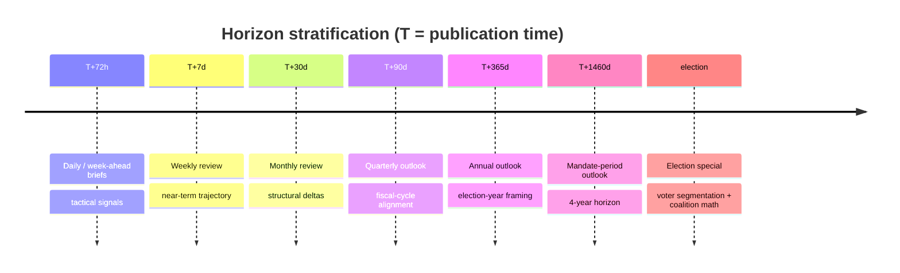
```mermaid
timeline
    title Horizon stratification (T = publication time)
    T+72h    : Daily / week-ahead briefs : tactical signals
    T+7d     : Weekly review : near-term trajectory
    T+30d    : Monthly review : structural deltas
    T+90d    : Quarterly outlook : fiscal-cycle alignment
    T+365d   : Annual outlook : election-year framing
    T+1460d  : Mandate-period outlook : 4-year horizon
    election : Election special : voter segmentation + coalition math
```

### AI-FIRST 2-pass iteration (quality constraint)

Every methodology and every Family-A/C/D artifact MUST go through **two complete passes** separated by ≥ 180 s wall-clock (enforced by `PASS2_MTIME_THRESHOLD_MS = 180_000` in `scripts/agentic/analysis-gate.ts`). Pass 1 establishes the structural draft; Pass 2 re-reads every section and tightens evidence, corrects banned-phrase drift, and adds missing Mermaid diagrams. Completing early with shallow output is **never** acceptable — this is an architectural quality gate, not a stylistic preference.

### OSINT tradecraft integration

`analysis/methodologies/osint-tradecraft-standards.md` enforces ICD 203 (analytic standards), ACH (Analysis of Competing Hypotheses) for `devils-advocate.md`, and source vetting for `data-download-manifest.md`. The standards are referenced by every Family-A and Family-C artifact and are validated by the analysis-gate's check 9b.

### Classification / SWOT / threat / PESTLE / scenario template roles

| Template | Family | Methodology authority |
|---|---|---|
| `political-classification` | A | `political-classification-guide.md` (7-dimension) |
| `swot-analysis` (+ `quantitative-swot`) | A | `political-swot-framework.md` (+ TOWS matrix) |
| `threat-analysis` (+ `political-stride-assessment`) | A | `political-threat-framework.md` (STRIDE-style) |
| `pestle-analysis` | A/cross | `analytical-supplementary-methodology.md` |
| `scenario-analysis` (≥3 scenarios) | C | `strategic-extensions-methodology.md` |

### Election-cycle and coalition-mathematics templates

`election-cycle-analysis`, `election-2026-analysis`, `coalition-mathematics`, `voter-segmentation`, and `parliamentary-season` templates are the Family-D backbone for the 2026 Riksdag election cycle. They consume CIA `coalition/`, `election-cycle/`, `pre-election/`, `voting/`, and `seasonal/` data subsystems alongside SCB demographic series and IMF macro context.

---

---

## 🔒 Security Architecture Integration

### Defense-in-Depth Layers

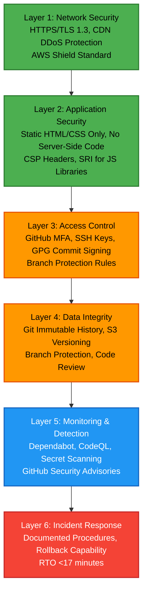
```mermaid
graph TD
    Layer1[Layer 1: Network Security<br/>HTTPS/TLS 1.3, CDN DDoS Protection<br/>AWS Shield Standard]
    Layer2[Layer 2: Application Security<br/>Static HTML/CSS Only, No Server-Side Code<br/>CSP Headers, SRI for JS Libraries]
    Layer3[Layer 3: Access Control<br/>GitHub MFA, SSH Keys, GPG Commit Signing<br/>Branch Protection Rules]
    Layer4[Layer 4: Data Integrity<br/>Git Immutable History, S3 Versioning<br/>Branch Protection, Code Review]
    Layer5[Layer 5: Monitoring & Detection<br/>Dependabot, CodeQL, Secret Scanning<br/>GitHub Security Advisories]
    Layer6[Layer 6: Incident Response<br/>Documented Procedures, Rollback Capability<br/>RTO <17 minutes]
    
    Layer1 --> Layer2
    Layer2 --> Layer3
    Layer3 --> Layer4
    Layer4 --> Layer5
    Layer5 --> Layer6
    
    style Layer1 fill:#4caf50,stroke:#2e7d32,stroke-width:2px,color:#000000
    style Layer2 fill:#4caf50,stroke:#2e7d32,stroke-width:2px,color:#000000
    style Layer3 fill:#ff9800,stroke:#e65100,stroke-width:2px,color:#000000
    style Layer4 fill:#ff9800,stroke:#e65100,stroke-width:2px,color:#000000
    style Layer5 fill:#2196f3,stroke:#1565c0,stroke-width:2px,color:#ffffff
    style Layer6 fill:#f44336,stroke:#c62828,stroke-width:2px,color:#ffffff
```

### Security Control Summary

| Layer | Control | Technology | Status |
|-------|---------|------------|--------|
| **Network** | TLS 1.3 Encryption | AWS CloudFront | ✅ Active |
| **Network** | DDoS Protection | AWS Shield Standard | ✅ Active |
| **Application** | Content Security Policy | HTTP Headers | ✅ Active |
| **Application** | Subresource Integrity | SRI hashes for JS libs | ✅ Active |
| **Access** | Multi-Factor Authentication | GitHub MFA | ✅ Active |
| **Access** | GPG Commit Signing | GitHub GPG | ✅ Active |
| **Data** | S3 Versioning | AWS S3 | ✅ Active |
| **Data** | Cross-Region Replication | S3 CRR | ✅ Active |
| **Monitoring** | Dependency Scanning | Dependabot | ✅ Active |
| **Monitoring** | SAST Scanning | CodeQL | ✅ Active |
| **Monitoring** | Secret Scanning | GitHub Secret Scanning | ✅ Active |
| **Response** | Automated Rollback | Git revert + CI/CD | ✅ Active |

**See:** [SECURITY_ARCHITECTURE.md](SECURITY_ARCHITECTURE.md) for comprehensive security controls documentation  
**See:** [THREAT_MODEL.md](THREAT_MODEL.md) for STRIDE threat analysis

---

## ⚡ Scalability Architecture

### Traffic Handling

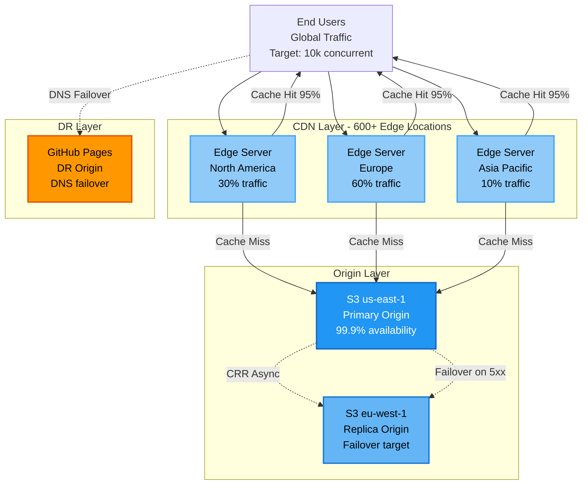
```mermaid
graph TB
    Users[End Users<br/>Global Traffic<br/>Target: 10k concurrent]
    
    subgraph "CDN Layer - 600+ Edge Locations"
        Edge1[Edge Server<br/>North America<br/>30% traffic]
        Edge2[Edge Server<br/>Europe<br/>60% traffic]
        Edge3[Edge Server<br/>Asia Pacific<br/>10% traffic]
    end
    
    subgraph "Origin Layer"
        S3US[S3 us-east-1<br/>Primary Origin<br/>99.9% availability]
        S3EU[S3 eu-west-1<br/>Replica Origin<br/>Failover target]
    end
    
    subgraph "DR Layer"
        GitHub[GitHub Pages<br/>DR Origin<br/>DNS failover]
    end
    
    Users --> Edge1
    Users --> Edge2
    Users --> Edge3
    
    Edge1 -->|Cache Miss| S3US
    Edge2 -->|Cache Miss| S3US
    Edge3 -->|Cache Miss| S3US
    
    Edge1 -->|Cache Hit 95%| Users
    Edge2 -->|Cache Hit 95%| Users
    Edge3 -->|Cache Hit 95%| Users
    
    S3US -.->|CRR Async| S3EU
    S3US -.->|Failover on 5xx| S3EU
    
    Users -.->|DNS Failover| GitHub
    
    style S3US fill:#2196f3,stroke:#1565c0,stroke-width:2px,color:#ffffff
    style S3EU fill:#64b5f6,stroke:#1976d2,stroke-width:2px,color:#000000
    style Edge1 fill:#90caf9,stroke:#42a5f5,stroke-width:2px,color:#000000
    style Edge2 fill:#90caf9,stroke:#42a5f5,stroke-width:2px,color:#000000
    style Edge3 fill:#90caf9,stroke:#42a5f5,stroke-width:2px,color:#000000
    style GitHub fill:#ff9800,stroke:#e65100,stroke-width:2px,color:#000000
```

### Performance Characteristics

| Metric | Target | Current | Method | Measurement |
|--------|--------|---------|--------|-------------|
| **First Contentful Paint (FCP)** | <1.5s | <1s | Static files, CDN edge caching | Lighthouse CI |
| **Time to Interactive (TTI)** | <3s | <2s | Minimal JavaScript dependencies | Lighthouse CI |
| **Largest Contentful Paint (LCP)** | <2.5s | <2s | Optimized CSS, cached fonts | Lighthouse CI |
| **Cumulative Layout Shift (CLS)** | <0.1 | <0.05 | Stable layout, no dynamic content | Lighthouse CI |
| **Total Blocking Time (TBT)** | <300ms | <200ms | Client-side rendering, async scripts | Lighthouse CI |
| **CDN Cache Hit Rate** | >90% | 95% | Long cache TTL (1 year for static assets) | CloudWatch |
| **Origin Request Rate** | <5% | <5% | High cache hit rate | CloudWatch |

### Capacity Planning

| Resource | Current | Max Capacity | Scaling Method |
|----------|---------|--------------|----------------|
| **CloudFront Bandwidth** | ~10 GB/day | Unlimited | AWS auto-scaling |
| **S3 Storage** | ~500 MB | Unlimited | AWS auto-scaling |
| **S3 Requests** | ~10k/day | 5,500 requests/second | AWS auto-scaling |
| **GitHub Pages Bandwidth** | ~5 GB/month | 100 GB/month | Soft limit, contact support |
| **GitHub Actions Minutes** | ~500 min/month | 3,000 min/month (Team plan) | Upgrade plan if needed |

---

## 📈 Monitoring Architecture

### Observability Stack

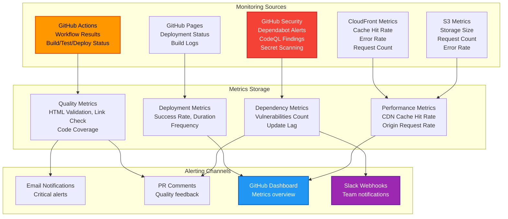
```mermaid
graph TB
    subgraph "Monitoring Sources"
        GH[GitHub Actions<br/>Workflow Results<br/>Build/Test/Deploy Status]
        Pages[GitHub Pages<br/>Deployment Status<br/>Build Logs]
        Security[GitHub Security<br/>Dependabot Alerts<br/>CodeQL Findings<br/>Secret Scanning]
        CloudFront[CloudFront Metrics<br/>Cache Hit Rate<br/>Error Rate<br/>Request Count]
        S3[S3 Metrics<br/>Storage Size<br/>Request Count<br/>Error Rate]
    end
    
    subgraph "Alerting Channels"
        Email[Email Notifications<br/>Critical alerts]
        PR[PR Comments<br/>Quality feedback]
        Dashboard[GitHub Dashboard<br/>Metrics overview]
        Slack[Slack Webhooks<br/>Team notifications]
    end
    
    subgraph "Metrics Storage"
        Quality[Quality Metrics<br/>HTML Validation, Link Check<br/>Code Coverage]
        Deps[Dependency Metrics<br/>Vulnerabilities Count<br/>Update Lag]
        Deploy[Deployment Metrics<br/>Success Rate, Duration<br/>Frequency]
        Performance[Performance Metrics<br/>CDN Cache Hit Rate<br/>Origin Request Rate]
    end
    
    GH --> Quality
    Pages --> Deploy
    Security --> Deps
    CloudFront --> Performance
    S3 --> Performance
    
    Quality --> Email
    Quality --> PR
    Deps --> PR
    Deps --> Slack
    Deploy --> Dashboard
    Performance --> Dashboard
    
    style GH fill:#ff9800,stroke:#e65100,stroke-width:2px,color:#000000
    style Security fill:#f44336,stroke:#c62828,stroke-width:2px,color:#ffffff
    style Dashboard fill:#2196f3,stroke:#1565c0,stroke-width:2px,color:#ffffff
    style Slack fill:#9c27b0,stroke:#6a1b9a,stroke-width:2px,color:#ffffff
```

### Metrics Collection

**Tracked Metrics:**

| Metric Category | Metrics | Frequency | Retention |
|-----------------|---------|-----------|-----------|
| **Workflow Metrics** | Execution success rate, duration, frequency | Per workflow run | 90 days |
| **Quality Metrics** | HTML validation pass rate, link check failures | Per commit | 90 days |
| **Security Metrics** | Dependency vulnerability count, CodeQL findings | Daily | Permanent |
| **Performance Metrics** | CDN cache hit rate, origin error rate | Every 5 minutes | 30 days |
| **Deployment Metrics** | Deploy frequency, time to deploy, rollback count | Per deployment | 90 days |

**Retention Policy:**
- **Workflow runs:** 90 days (GitHub Actions default)
- **Artifacts:** 30 days (GitHub Actions default)
- **Security findings:** Permanent (GitHub Security)
- **Deployment logs:** 90 days (GitHub Actions)
- **CloudWatch metrics:** 30 days (AWS default)

### Alerting Strategy

**Alert Severity Levels:**

| Severity | Condition | Response Time | Notification |
|----------|-----------|---------------|--------------|
| **Critical** | Production site down, CloudFront 5xx errors | Immediate | Email + Slack |
| **High** | Deployment failure, CodeQL high-severity finding | <1 hour | Email + PR comment |
| **Medium** | Link check failures, Dependabot alerts | <24 hours | PR comment |
| **Low** | HTML validation warnings, code style issues | Next business day | PR comment |

---

## 🛠️ Technology Stack

### Frontend Stack

| Technology | Version | Purpose | Rationale | License |
|------------|---------|---------|-----------|---------|
| **HTML5** | Standard | Content structure | Universal browser support, semantic markup | W3C License |
| **CSS3** | Standard | Styling & layout | Responsive design, no framework overhead | W3C License |
| **JavaScript ES6+** | Standard | Interactive dashboards | Modern browser features, async/await | ECMA License |
| **Chart.js** | v4.4.1 | Data visualization | Industry standard, 62k+ GitHub stars | MIT |
| **chartjs-plugin-annotation** | v3.0.1 | Chart annotations | Official Chart.js plugin for highlighting | MIT |
| **chartjs-adapter-date-fns** | v3.0.0 | Time-series charts | Official date adapter with date-fns bundled | MIT |
| **D3.js** | v7 | Advanced visualizations | Powerful, flexible, 108k+ GitHub stars | BSD-3-Clause |
| **Papa Parse** | v5.5.3 | CSV parsing | Reliable CSV parser, 12k+ GitHub stars | MIT |
| **Google Fonts** | Latest | Typography (Inter, Orbitron) | Professional appearance, cached globally | Open Font License |

### Infrastructure Stack

| Technology | Version | Purpose | Rationale | SLA |
|------------|---------|---------|-----------|-----|
| **AWS CloudFront** | Latest | Primary CDN | 600+ global edge locations, DDoS protection | 99.9% |
| **AWS S3** | Latest | Primary storage | Reliable, scalable, versioning support, CRR | 99.9% |
| **AWS Route 53** | Latest | DNS with failover | Health checks, automatic failover routing | 100% |
| **GitHub Pages** | Latest | DR hosting | Free, reliable, global CDN | 99.9% |
| **GitHub Actions** | Latest | CI/CD | Integrated with repository, secure OIDC | 99.9% |
| **HTMLHint** | Latest | HTML validation | Industry standard validator | MIT |
| **Linkinator** | v6 | Link checking | Reliable, actively maintained | Apache-2.0 |
| **npm** | Latest | Package management | JavaScript dependency management | Artistic-2.0 |
| **Vite** | v8.0.10 | Build tool | Fast build times, optimized output | MIT |
| **Vitest** | v4.1.5 | Unit / integration test runner | Vite-native, ESM-first, watch mode | MIT |
| **TypeScript** | v6.0.3 | Source language | Strict typing across `src/`, `scripts/`, `tests/` | Apache-2.0 |
| **Node.js** | ≥26 | Runtime baseline | Native TypeScript loader, ESM, modern fetch | MIT |

### External Dependencies

> **📦 Public npm package surface (v0.8.76):** `riksdagsmonitor` exports the typed subpaths `./`, `./shared`, `./shared/*`, `./cia/*`, `./dashboards/*`, `./ui/*` (`package.json` `exports` map). `"type": "module"` (pure ESM). `"sideEffects"` is restricted to `./dist/lib/shared/register-globals.js` and `./src/browser/cia-entry.ts` so tree-shaking works for downstream consumers. **ESLint baseline**: `no-explicit-any` = error and `no-unused-vars` = error are enforced repository-wide; the typed `DashboardGlobals` interface (`src/browser/shared/global-libs.ts`) replaces `any` for Chart.js / D3 / PapaParse browser globals.

| Dependency | Type | Risk Level | Mitigation | Update Strategy |
|------------|------|------------|------------|-----------------|
| **AWS CloudFront** | Infrastructure | LOW | 99.9% SLA, GitHub Pages DR, Route 53 failover | Managed by AWS |
| **AWS S3** | Infrastructure | LOW | Cross-region replication, versioning, 99.9% SLA | Managed by AWS |
| **AWS Route 53** | Infrastructure | LOW | 100% SLA, health checks, automatic failover | Managed by AWS |
| **GitHub Pages** | Infrastructure (DR) | LOW | 99.9% SLA, independent from AWS | Managed by GitHub |
| **Chart.js v4.4.1** | JavaScript Library | LOW | Hosted locally on CloudFront/S3 (js/lib/), SRI hash validation | Dependabot automated updates |
| **chartjs-plugin-annotation v3.0.1** | JavaScript Library | LOW | Hosted locally on CloudFront/S3 (js/lib/), SRI hash validation | Dependabot automated updates |
| **chartjs-adapter-date-fns v3.0.0** | JavaScript Library | LOW | Hosted locally on CloudFront/S3 (js/lib/), SRI hash validation | Dependabot automated updates |
| **D3.js v7** | JavaScript Library | LOW | Hosted locally on CloudFront/S3 (js/lib/), SRI hash validation | Dependabot automated updates |
| **Papa Parse v5.5.3** | JavaScript Library | LOW | Hosted locally on CloudFront/S3 (js/lib/), SRI hash validation | Dependabot automated updates |
| **Google Fonts** | CDN | LOW | Cached by browsers, fallback fonts available (Arial, sans-serif) | Managed by Google |
| **CIA Platform** | External Service | LOW | Independent service, documented external links, no API keys | Manual monitoring |

---

## 🚀 Deployment Architecture

### Deployment Pipeline

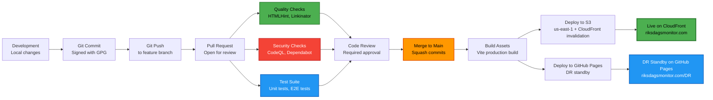
```mermaid
graph LR
    Dev[Development<br/>Local changes] --> Commit[Git Commit<br/>Signed with GPG]
    Commit --> Push[Git Push<br/>to feature branch]
    Push --> PR[Pull Request<br/>Open for review]
    
    PR --> Quality[Quality Checks<br/>HTMLHint, Linkinator]
    PR --> Security[Security Checks<br/>CodeQL, Dependabot]
    PR --> Tests[Test Suite<br/>Unit tests, E2E tests]
    
    Quality --> Review[Code Review<br/>Required approval]
    Security --> Review
    Tests --> Review
    
    Review --> Merge[Merge to Main<br/>Squash commits]
    Merge --> Build[Build Assets<br/>Vite production build]
    Build --> DeployS3[Deploy to S3<br/>us-east-1 + CloudFront invalidation]
    Build --> DeployGH[Deploy to GitHub Pages<br/>DR standby]
    
    DeployS3 --> LivePrimary[Live on CloudFront<br/>riksdagsmonitor.com]
    DeployGH --> LiveDR[DR Standby on GitHub Pages<br/>riksdagsmonitor.com/DR]
    
    style Quality fill:#4caf50,stroke:#2e7d32,stroke-width:2px,color:#000000
    style Security fill:#f44336,stroke:#c62828,stroke-width:2px,color:#ffffff
    style Tests fill:#2196f3,stroke:#1565c0,stroke-width:2px,color:#ffffff
    style Merge fill:#ff9800,stroke:#e65100,stroke-width:2px,color:#000000
    style LivePrimary fill:#4caf50,stroke:#2e7d32,stroke-width:3px,color:#000000
    style LiveDR fill:#2196f3,stroke:#1565c0,stroke-width:2px,color:#ffffff
```

### Deployment Strategy

**Dual Deployment Process:**
1. **Trigger:** Merge to `main` branch
2. **Build:** Vite production build (optimized assets)
3. **Validate:** HTMLHint + Linkinator quality gates
4. **Primary Deploy:** Upload to S3 us-east-1 + CloudFront invalidation
5. **DR Deploy:** Publish to GitHub Pages
6. **Verify:** Smoke tests on both deployments
7. **Monitor:** CloudWatch metrics + GitHub Actions logs

**Deployment Frequency:** Multiple times per day (on-demand)  
**Average Deployment Time:** <2 minutes (S3 + CloudFront invalidation)

### Rollback Strategy

**Rollback Methods:**

| Method | Use Case | RTO | Complexity |
|--------|----------|-----|------------|
| **Git Revert** | Code defects, broken features | <5 minutes | Low (1 command + CI/CD) |
| **S3 Versioning** | Corrupted files, accidental deletion | <2 minutes | Low (restore specific version) |
| **CloudFront Invalidation** | Cached bad content | <1 minute | Low (invalidate specific paths) |
| **DNS Failover to GitHub Pages** | CloudFront outage | <5 minutes | Automatic (Route 53 health checks) |
| **Branch Rollback** | Multiple bad commits | <10 minutes | Medium (force push to main) |

**Rollback SLA:**
- **Detection:** <5 minutes (monitoring alerts + smoke tests)
- **Decision:** <10 minutes (review incident, check logs)
- **Execution:** <2 minutes (git revert + automated deploy)
- **Verification:** <5 minutes (smoke tests, manual verification)
- **Total RTO:** <22 minutes (worst case)

**Rollback Procedure:**
```bash
# 1. Revert commit (creates new commit)
git revert <bad-commit-sha>

# 2. Push to trigger CI/CD
git push origin main

# 3. CI/CD automatically deploys reverted code
# 4. Verify deployment with smoke tests
```

---

## 🏛️ Architecture Principles

### Core Principles

1. **Security by Design**
   - Defense-in-depth with 6 security layers
   - Dual deployment with automatic failover
   - CSP headers, SRI for JS libraries, SLSA build attestations
   - OIDC keyless authentication for deployments

2. **Defense in Depth**
   - Network layer: HTTPS/TLS 1.3, CDN DDoS protection
   - Application layer: Static site (no server-side code), CSP, SRI
   - Access control: GitHub MFA, GPG signing, branch protection
   - Data integrity: Git immutable history, S3 versioning, CRR
   - Monitoring: Dependabot, CodeQL, secret scanning
   - Incident response: Documented procedures, RTO <22 minutes

3. **Resilience**
   - Multi-region storage (S3 us-east-1 + eu-west-1)
   - Cross-region replication (async, <15 min target)
   - Automatic failover (Route 53 health checks + DNS failover)
   - Disaster recovery (GitHub Pages independent hosting)
   - 99.9% availability target (both AWS and GitHub SLAs)

4. **Transparency**
   - Open source repository (MIT license)
   - Public ISMS documentation
   - Documented architecture (C4 model)
   - Threat model (STRIDE analysis)
   - Security controls (ISO 27001, NIST CSF 2.0, CIS Controls v8.1)

5. **Performance**
   - CDN edge caching (600+ global PoPs)
   - Client-side rendering (no server-side overhead)
   - Optimized assets (Vite production build)
   - 95% cache hit rate target
   - <1s First Contentful Paint

6. **Usability**
   - Interactive dashboards with Chart.js and D3.js
   - Modern visualizations (committee analysis, coalition tracking)
   - 14-language support with proper i18n
   - Responsive design (mobile-first CSS)
   - Progressive enhancement (works without JS)

### Key Architectural Decisions

| Decision | Rationale | Trade-offs |
|----------|-----------|------------|
| **Interactive Dashboards (Chart.js/D3.js)** | Rich data visualization, modern UX, industry-standard libraries | Increases attack surface (requires JavaScript), browser compatibility, larger page size |
| **AWS CloudFront Primary** | 600+ PoPs, DDoS protection, 99.9% SLA, mature CDN | Cost for high traffic (~$10-50/month), vendor lock-in, AWS dependency |
| **GitHub Pages DR** | Free hosting, reliable (99.9% SLA), independent from AWS | 100 GB/month soft limit, Jekyll processing (disabled), GitHub dependency |
| **External CIA Platform** | Reuse existing OSINT infrastructure, separation of concerns | External service dependency, no API integration (links only) |
| **Static Site (No Server-Side Code)** | Minimal attack surface, no backend vulnerabilities, easy to secure | Limited dynamic features, client-side processing only, no server-side rendering |
| **Multi-language Files (14 HTML files)** | SEO optimization, clear URL structure, no client-side translation | File duplication, maintenance overhead, 14x storage for content |
| **SRI for CDN Resources** | Supply chain security, tamper detection, SLSA compliance | Requires version pinning, update coordination, manual hash generation |
| **MCP Server Integration** | Specialized political data access, 32 tools, intelligence-operative agent | HTTP-only server, external dependency, rate limiting, public data only |
| **Dual Deployment Pattern** | High availability, disaster recovery, independent hosting platforms | Complexity (two deployment targets), cost (AWS + GitHub Actions minutes) |

---

## 🔮 Future Architecture

### Planned Enhancements

**See:** [FUTURE_ARCHITECTURE.md](FUTURE_ARCHITECTURE.md) for detailed roadmap

#### Q2 2026 Roadmap

**Security Enhancements:**
- DAST scanning integration (OWASP ZAP in CI/CD)
- Enhanced CSP with strict-dynamic
- Security header improvements (Permissions-Policy, CORP, COOP)

**Performance Improvements:**
- Lighthouse CI integration with quality gates
- Performance budget enforcement (<100KB JS, <200KB CSS)
- Image optimization (WebP format, lazy loading)

**Automation:**
- Automated translation workflows (14 languages)
- Content generation automation (evening analysis, morning briefing)
- Quality metrics dashboard

#### Q3 2026 Roadmap

**Monitoring & Observability:**
- Advanced link monitoring (broken link detection, redirect chains)
- Real-time performance monitoring (CloudWatch RUM)
- Error tracking and alerting (Sentry integration)

**Accessibility:**
- WCAG 2.1 AA compliance
- Screen reader testing
- Keyboard navigation improvements

**Infrastructure:**
- S3 Intelligent-Tiering for cost optimization
- CloudFront Functions for edge logic
- AWS WAF for advanced threat protection

#### Q4 2026 Roadmap

**Content Generation:**
- Multi-language content generation (14 languages)
- A/B testing framework for content
- Personalized content recommendations

**Analytics:**
- Privacy-respecting analytics (Plausible or Matomo)
- User behavior tracking (no PII)
- Dashboard usage metrics

**Advanced Features:**
- Real-time data updates (WebSocket or Server-Sent Events)
- Advanced data visualizations (3D charts, interactive timelines)
- Historical trend analysis (time-series forecasting)

---

## 🔌 MCP Server Integration

### GitHub Copilot MCP Server Architecture

Riksdagsmonitor leverages GitHub Copilot with Model Context Protocol (MCP) servers for advanced political intelligence analysis and automation.

> **🔢 Server count (v0.8.76):** **8 MCP servers** are wired via `.github/copilot-mcp.json`: `riksdag-regering`, `scb`, `world-bank`, `github` (insiders), `filesystem`, `memory`, `sequential-thinking`, `playwright`. The IMF integration is **intentionally not** an MCP server — it ships as the pure-TypeScript client `scripts/imf-client.ts` (Datamapper JSON v1 + SDMX 3.0), fully covered by the npm SBOM, with allowlisted egress hosts `data.imf.org`, `api.imf.org`, `www.imf.org`. Same pattern is used for SCB (`scripts/scb-client.ts`), World Bank (`scripts/world-bank-client.ts`), Riksbank (`scripts/riksbank-fetch.ts`), Statskontoret (`scripts/statskontoret-client.ts`), RiR (`scripts/rir-followups-client.ts`), and parliamentary-data downloads when invoked from build-time scripts.

#### Schema governance pipeline (`schemas/` + `scripts/`)

Schema drift between the upstream CIA platform and Riksdagsmonitor's typed surface is governed by four scripts under `scripts/`, executed in order:

```mermaid
flowchart LR
    Sync[scripts/sync-cia-schemas.ts<br/>pulls upstream schemas/cia/]
    Validate[scripts/validate-against-cia-schemas.ts<br/>ajv 8.18.0 schema validation]
    Check[scripts/check-cia-schema-updates.ts<br/>diff vs. last sync, exit 1 on drift]
    GenTypes[scripts/generate-types-from-cia-schemas.ts<br/>emits .d.ts for ./cia/* subpath]
    Schemas[(schemas/)<br/>article-types.schema.json<br/>pir-status.schema.json<br/>rir-followups-schema.json<br/>cia/*.schema.json]
    PkgExports[package.json exports<br/>./cia/* · ./dashboards/* · ./shared/* · ./ui/*]

    Sync --> Schemas
    Schemas --> Validate
    Schemas --> Check
    Schemas --> GenTypes
    GenTypes --> PkgExports
```

#### MCP Server Architecture

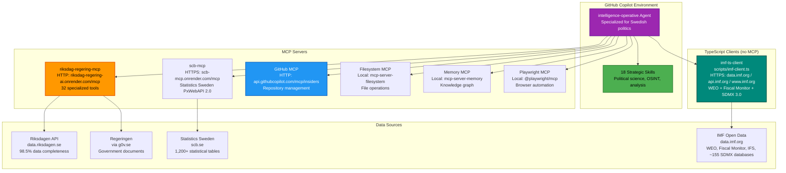
```mermaid
graph TB
    subgraph "GitHub Copilot Environment"
        Agent[intelligence-operative Agent<br/>Specialized for Swedish politics]
        Skills[18 Strategic Skills<br/>Political science, OSINT, analysis]
    end
    
    subgraph "MCP Servers"
        RR[riksdag-regering-mcp<br/>HTTP: riksdag-regering-ai.onrender.com/mcp<br/>32 specialized tools]
        SCB[scb-mcp<br/>HTTPS: scb-mcp.onrender.com/mcp<br/>Statistics Sweden PxWebAPI 2.0]
        GH[GitHub MCP<br/>HTTP: api.githubcopilot.com/mcp/insiders<br/>Repository management]
        FS[Filesystem MCP<br/>Local: mcp-server-filesystem<br/>File operations]
        Mem[Memory MCP<br/>Local: mcp-server-memory<br/>Knowledge graph]
        PW[Playwright MCP<br/>Local: @playwright/mcp<br/>Browser automation]
    end
    
    subgraph "TypeScript Clients (no MCP)"
        IMF[imf-ts-client<br/>scripts/imf-client.ts<br/>HTTPS: data.imf.org / api.imf.org / www.imf.org<br/>WEO + Fiscal Monitor + SDMX 3.0]
    end
    
    subgraph "Data Sources"
        Riksdag[Riksdagen API<br/>data.riksdagen.se<br/>98.5% data completeness]
        Regering[Regeringen<br/>via g0v.se<br/>Government documents]
        SCBData[Statistics Sweden<br/>scb.se<br/>1,200+ statistical tables]
        IMFData[IMF Open Data<br/>data.imf.org<br/>WEO, Fiscal Monitor, IFS, ~155 SDMX databases]
    end
    
    Agent --> Skills
    Agent --> RR
    Agent --> SCB
    Agent --> IMF
    Agent --> GH
    Agent --> FS
    Agent --> Mem
    Agent --> PW
    
    RR --> Riksdag
    RR --> Regering
    SCB --> SCBData
    IMF --> IMFData
    
    style Agent fill:#9c27b0,stroke:#6a1b9a,stroke-width:2px,color:#ffffff
    style Skills fill:#4caf50,stroke:#2e7d32,stroke-width:2px,color:#000000
    style RR fill:#ff9800,stroke:#e65100,stroke-width:2px,color:#000000
    style IMF fill:#00897b,stroke:#004d40,stroke-width:2px,color:#ffffff
    style GH fill:#2196f3,stroke:#1565c0,stroke-width:2px,color:#ffffff
```

#### riksdag-regering-mcp Server

**Purpose:** Provides specialized access to Swedish political data for intelligence analysis

**Configuration:**
```json
{
  "riksdag-regering": {
    "type": "http",
    "url": "https://riksdag-regering-ai.onrender.com/mcp",
    "tools": ["*"]
  }
}
```

**32 Available Tools:**

1. **Ledamöter (MPs)** - 8 tools
   - Search MPs by name, party, constituency
   - Get MP details and biographical data
   - Track MP activities and assignments
   - Analyze MP voting patterns

2. **Riksdagsdokument (Parliamentary Documents)** - 10 tools
   - Search motions, written questions, interpellations
   - Get document content and summaries
   - Track bill status and legislative process
   - Analyze document trends over time

3. **Anföranden (Speeches)** - 3 tools
   - Search chamber debates
   - Get speech transcripts
   - Analyze speaking patterns and rhetoric

4. **Voteringar (Votes)** - 5 tools
   - Search voting records
   - Get vote details and margins
   - Analyze party discipline
   - Track coalition voting patterns

5. **Regeringsdokument (Government Documents)** - 6 tools
   - Search SOU reports, propositions, press releases
   - Get government document content
   - Track ministerial announcements
   - Analyze policy changes

**Data Sources:**
- **Riksdagen API:** https://data.riksdagen.se/ (Official Parliament API, 98.5% completeness)
- **Regeringen via g0v.se:** https://g0v.se/ (Open government data aggregator)

**Use Cases:**
1. **Evening Analysis Generation** - Automated news articles with 5 editorial pillars
2. **Political Intelligence Dashboards** - Committee analysis, coalition tracking
3. **Voting Pattern Analysis** - Party discipline, coalition dynamics
4. **Legislative Monitoring** - Bill tracking, document summarization
5. **Risk Assessment** - Democratic accountability, transparency metrics

#### Integration Benefits

| Capability | Without MCP | With MCP |
|------------|-------------|----------|
| **Data Access** | Manual API calls to Riksdagen API | Automated via 32 specialized tools |
| **Statistical Context** | No official statistics integration | SCB MCP: 1,200+ tables (economy, labour, population); World Bank MCP: WGI governance + long-horizon social/education; IMF TypeScript client: WEO, Fiscal Monitor, IFS + T+5 projections |
| **Analysis** | Generic AI prompts | Domain-specific intelligence-operative agent |
| **Expertise** | Basic knowledge | 18 strategic skills (political science, OSINT, Swedish politics) |
| **Efficiency** | Multi-step manual workflows | Integrated single-step operations |
| **Compliance** | Manual GDPR checks | Built-in GDPR compliance skill |
| **Quality** | Inconsistent output | Structured 5-pillar editorial format |

**Security Considerations:**
- **HTTPS MCP server** - No local execution risk, remote hosting on Render
- **Public data sources only** - GDPR Article 6(1)(e) compliance (public interest)
- **No authentication required** - Public API access, no API keys
- **Rate limiting** - Handled by remote server, 100 requests/minute
- **Data retention** - No PII stored, public data only

**See:** [SECURITY_ARCHITECTURE.md](SECURITY_ARCHITECTURE.md) for full security details

#### scb-mcp Server (Statistics Sweden)

**Purpose:** Provides access to 1,200+ statistical tables from Statistics Sweden (SCB) for enriching political analysis with official economic, demographic, and social indicators.

**Configuration:**
```json
{
  "scb": {
    "type": "http",
    "url": "https://scb-mcp.onrender.com/mcp",
    "tools": ["*"]
  }
}
```

**Available Tools:**

1. **search_tables** — Search SCB's 1,200+ statistical tables by keyword (Swedish/English)
2. **get_table_data** — Retrieve data from a specific table with variable selections
3. **get_table_variables** — List available variables and value domains for a table
4. **preview_data** — Preview first rows of a table before full retrieval
5. **find_region_code** — Lookup region codes for geographic filtering

**Policy Domain Mapping:**

| Policy Domain | SCB Search Query | Example Tables | Key Indicators |
|---------------|-----------------|----------------|----------------|
| Fiscal Policy | skatter statsbudget | TAB1291, TAB1292 | Revenue, expenditure, budget balance |
| Labour Market | sysselsättning arbetslöshet | TAB5765, TAB5616 | Unemployment rate, employment rate |
| Migration | invandring utvandring befolkning | TAB637, TAB4230 | Immigration, emigration, net migration |
| Education | utbildning studenter | TAB4787, TAB4790 | Enrollment, graduation rates |
| Environment | växthusgaser utsläpp | TAB5404, TAB5407 | GHG emissions, renewable energy share |
| Trade & Industry | näringsliv företag BNP | TAB5802, TAB5803 | GDP growth, industrial production |
| Housing | bostäder nybyggnation | TAB2052, TAB4709 | Housing starts, price index |
| Justice | brott lagföringar | TAB1172 | Reported crimes, conviction rate |
| Defence & Security | försvar militär offentliga utgifter | — | Defence spending as % of GDP |
| Healthcare | hälsa sjukvård vård | — | Healthcare spending, hospital beds per capita |
| Transport | trafik transport infrastruktur | — | Road traffic volume, public transport ridership |
| EU & Foreign Affairs | utrikeshandel export import | TAB2661 | Export value, import value, trade balance |

**Data Source:** https://www.scb.se/ (PxWebAPI 2.0 — official Swedish statistics API)

**Use Cases:**
1. **Proposition Analysis** — Enrich budget propositions with actual fiscal/economic data
2. **Motion Context** — Add statistical evidence to opposition motion analysis
3. **Monthly Reviews** — Include key economic indicators (GDP, unemployment, inflation)
4. **Weekly Context** — Add trend data for economic policy discussions
5. **Evening Analysis** — Statistical grounding for political developments

**Integration Pattern:**
- SCB data is **optional enrichment** — article generation never blocks on SCB failures
- All SCB MCP calls are wrapped in try/catch with graceful fallback
- SCB data adds "Statistical Context" sections to articles when available
- Domain-to-table mapping in `scripts/data-transformers/policy-analysis.ts` (`SCB_DOMAIN_TABLES`)

**Security Considerations:**
- **HTTPS MCP server** — No local execution risk, remote hosting on Render
- **Public data sources only** — SCB is an official government statistics agency
- **No authentication required** — Public API access, no API keys
- **No PII** — Aggregate statistics only, no individual-level data

#### IMF Economic Context (TypeScript client, *not* an MCP server)

**Purpose:** Primary source for **macro, fiscal, monetary, and external-sector freshness + T+5 projections** to complement SCB (Swedish primary source, unchanged) and World Bank (WGI governance, environment, long-horizon social/education). Added per [ADR 0001](docs/adr/0001-adopt-imf-data-alongside-world-bank.md) (accepted 2026-04-20) and **Economic Data Contract v2.0** (effective 2026-04-20; v1 grace window → 2026-05-31). The April 2026 WEO fills World Bank's 12–24-month macro lag and unlocks forward-looking article types (`week-ahead`, `month-ahead`, `weekly-review`, `monthly-review`).

**Why not an MCP server?** ADR 0001 adopts a pure-TypeScript client so the IMF integration is fully covered by the repository's npm SBOM, avoids Python / uvx / third-party MCP supply-chain surface, and keeps `package.json` `x-external-mcp` empty. The count of **8 MCP servers** is therefore unchanged.

**Implementation (sibling pattern to `scripts/world-bank-client.ts` and `scripts/scb-client.ts`):**

| Script | Role |
|--------|------|
| `scripts/imf-client.ts` | Typed HTTP client (Datamapper + SDMX 3.0), retry / back-off, response schema validation |
| `scripts/imf-fetch.ts` | CLI wrapper: `tsx scripts/imf-fetch.ts weo\|compare\|sdmx\|list-indicators …` (invoked by agentic workflows via bash) |
| `scripts/imf-codes.ts` | IMF indicator / country / policy-domain code tables |
| `scripts/imf-context.ts` | Article-context helpers (mapping policy domains → IMF indicator sets) |

**Transports & allowlisted egress hosts:**

| Transport | Host | Datasets |
|-----------|------|----------|
| IMF Datamapper JSON v1 | `www.imf.org/external/datamapper/api/v1` | WEO (NGDP_RPCH, PCPIPCH, LUR, GGXWDG_NGDP, BCA_NGDPD, …) |
| IMF SDMX 3.0 | `api.imf.org/external/sdmx/3.0` | IFS, BOP, FM (Fiscal Monitor), GFS_COFOG, DOTS — ~155 databases |
| Documentation | `data.imf.org` | Allowlisted for metadata and schema lookups |

**Policy-domain mapping (parallel to the SCB table above):**

| Policy Domain | IMF Dataset | Example Indicators |
|---------------|-------------|--------------------|
| Fiscal Policy | WEO / Fiscal Monitor / GFS_COFOG | GGXWDG_NGDP (debt/GDP), GGXCNL_NGDP (fiscal balance), committee-aligned COFOG spending |
| Monetary Policy | IFS / MFS | Policy rate, money-market rates, FX reference |
| External Sector | WEO / BOP / DOTS | BCA_NGDPD (current account/GDP), trade flows |
| Macro Outlook | WEO | NGDP_RPCH (real GDP growth), PCPIPCH (CPI), LUR (unemployment) — finals + projections to 2031 |

**Integration Pattern:**
- **Optional enrichment** — like SCB, article generation never blocks on IMF failures
- All IMF client calls wrapped in try/catch with **graceful fallback** to cached snapshots under `analysis/data/imf/{indicator}/{country}.json`
- Rate-limit handling: ~10 req / 5 s, 3× exponential back-off (1s → 2s → 4s), multi-country batching via Datamapper `compare`
- Domain-to-indicator mapping in `scripts/imf-codes.ts` and `scripts/imf-context.ts`
- Each cache entry has a sidecar `.meta.json` recording `mcpTool: imf-ts-client` (nominal, for contract symmetry), `projectionVintage`, and fetch timestamp for tamper/ageing detection

**Security Considerations:**
- **TLS/HTTPS only** — TLS 1.3 preferred, GitHub-runner root CA trust anchors
- **Public data sources only** — IMF Open Data (no API key required), same Public classification as SCB / World Bank
- **SBOM coverage** — pure TypeScript, covered by the npm SBOM; no out-of-npm supplement
- **Response schema validation** — `DatamapperResponse` shape, numeric finite checks, year parse-guard
- **No PII** — aggregate national indicators only
- See **[THREAT_MODEL.md § TB-6a](THREAT_MODEL.md)** for IMF upstream / transport threat analysis and **[SECURITY_ARCHITECTURE.md](SECURITY_ARCHITECTURE.md)** for egress-firewall details

**Supporting documentation (already in the repo — referenced, not duplicated):** `analysis/imf/README.md`, `analysis/imf/indicator-policy-mapping.md`, `analysis/imf/use-cases.md`, `docs/adr/0001-adopt-imf-data-alongside-world-bank.md`, `.github/aw/ECONOMIC_DATA_CONTRACT.md`.

---

## 📚 Related Documents

### Riksdagsmonitor Architecture Portfolio

| Document | Focus | Description |
|----------|-------|-------------|
| **[🏛️ Architecture](ARCHITECTURE.md)** | **🏗️ C4 Models** | **System context, containers, components (this document)** |
| [📊 Data Model](DATA_MODEL.md) | 📊 Data | Entity relationships and data dictionary |
| [🔄 Flowchart](FLOWCHART.md) | 🔄 Processes | Business and data flow diagrams |
| [📈 State Diagram](STATEDIAGRAM.md) | 📈 States | System state transitions and lifecycles |
| [🧠 Mindmap](MINDMAP.md) | 🧠 Concepts | System conceptual relationships |
| [💼 SWOT](SWOT.md) | 💼 Strategy | Strategic analysis and positioning |
| [🛡️ Security Architecture](SECURITY_ARCHITECTURE.md) | 🔒 Security | Current security controls and design |
| [🎯 Threat Model](THREAT_MODEL.md) | 🎯 Threats | STRIDE/MITRE ATT&CK analysis |
| [🚀 Future Architecture](FUTURE_ARCHITECTURE.md) | 🔮 Evolution | Architectural evolution roadmap |
| [🔮 Future Security](FUTURE_SECURITY_ARCHITECTURE.md) | 🔮 Security | Planned security improvements |

### Hack23 ISMS Policies

| Policy | Relevance |
|--------|-----------|
| [🛡️ Secure Development Policy](https://github.com/Hack23/ISMS-PUBLIC/blob/main/Secure_Development_Policy.md) | Architecture documentation requirements |
| [🎯 Threat Modeling Policy](https://github.com/Hack23/ISMS-PUBLIC/blob/main/Threat_Modeling.md) | Threat analysis methodology |
| [🏷️ Classification Framework](https://github.com/Hack23/ISMS-PUBLIC/blob/main/CLASSIFICATION.md) | CIA triad classification |
| [📉 Risk Register](https://github.com/Hack23/ISMS-PUBLIC/blob/main/Risk_Register.md) | Enterprise risk management |

### Reference Implementations

- [🏛️ CIA Architecture](https://github.com/Hack23/cia/blob/master/ARCHITECTURE.md) — Java/Spring Boot enterprise architecture
- [🎮 Black Trigram Architecture](https://github.com/Hack23/blacktrigram/blob/main/ARCHITECTURE.md) — React/Firebase gaming platform
- [📊 CIA Compliance Manager](https://github.com/Hack23/cia-compliance-manager/blob/main/docs/architecture/ARCHITECTURE.md) — React/TypeScript compliance platform

---

## 📄 Document Control

| Field | Value |
|-------|-------|
| **Document ID** | ARCH-001 |
| **Version** | 2.5 |
| **Classification** | Public |
| **Owner** | CEO, Hack23 AB |
| **Repository** | https://github.com/Hack23/riksdagsmonitor |
| **Path** | /ARCHITECTURE.md |
| **Format** | Markdown with Mermaid C4 Diagrams |
| **Last Updated** | 2026-05-06 (UTC) |
| **Next Review** | 2026-08-06 |
| **Review Cycle** | Quarterly |

<p align="center">
  <a href="https://www.iso.org/isoiec-27001-information-security.html">
    
  </a>
  <a href="https://www.nist.gov/cyberframework">
    
  </a>
  <a href="https://www.cisecurity.org/controls/">
    
  </a>
</p>

---

## 🏛️ Statskontoret Integration — Current Architecture

> **Effective:** 2026-04-25 · **Classification:** Public · **Runtime:** Node.js 26 / TypeScript CLI · **MCP status:** intentionally **not** an MCP server.

Statskontoret is now the Swedish public-administration and central-government budget-execution context layer. It complements the existing provider split: IMF remains primary for macro/fiscal projections, SCB remains Swedish official-statistics ground truth, World Bank remains governance/environment/social residue, and Statskontoret supplies agency structure plus budget outturn detail that the other providers do not expose in the same operational form.

### Architectural placement

```mermaid
flowchart LR
    Workflow[Agentic news workflow<br/>Node 26] --> CLI[statskontoret-fetch.ts<br/>list-sources · discover · headcount]
    CLI --> Client[StatskontoretClient<br/>statskontoret-client.ts]
    Client --> Source[www.statskontoret.se<br/>open data pages]
    Source --> XLSX[Excel workbooks]
    Source --> ZIP[CSV ZIP archives]
    Client --> Parser[XLSX / CSV-ZIP parsers<br/>typed StatskontoretError]
    Parser --> Derived[Derived artifacts<br/>headcount-by-department]
    Derived --> Persist[analysis/data/statskontoret/<br/>JSON + .meta.json sidecars]
    Derived --> Articles[Article and dashboard context]
```

### Provider responsibility matrix

| Need | Primary provider | Riksdagsmonitor surface |
|---|---|---|
| Agency count, department grouping, leadership form and government-body headcount | **Statskontoret Myndighetsförteckning** | `scripts/statskontoret-fetch.ts headcount`, `analysis/statskontoret/` |
| Annual central-government budget outturn | **Statskontoret Årsutfall** | Download discovery and persisted raw/derived artifacts |
| Monthly central-government budget execution | **Statskontoret Månadsutfall** | Download discovery for high-frequency budget monitoring |
| Macro/fiscal projections and cross-country methodology | **IMF WEO/FM/SDMX** | `scripts/imf-*` |
| Swedish regional/monthly official statistics | **SCB PxWeb** | `scb` MCP |
| Governance/environment/social residue | **World Bank** | `world-bank` MCP |

### Code and quality surfaces

| Surface | Responsibility |
|---|---|
| `scripts/statskontoret-client.ts` | Typed client, source catalogue, download discovery, HTML entity decoding, XLSX parsing, CSV ZIP parsing, numeric normalisation, department headcount aggregation. |
| `scripts/statskontoret-fetch.ts` | Import-safe CLI wrapper for workflows; exported argument parsing helpers for testability; exit code `2` for CLI contract errors. |
| `analysis/statskontoret/indicators-inventory.json` | Machine-readable dataset inventory and provider decision matrix. |
| `analysis/statskontoret/data-dictionary.md` | Field families, freshness discipline, persistence layout. |
| `tests/statskontoret-*.test.ts` | Inventory consistency, download-link extraction, workbook parsing, CSV ZIP parsing, CLI parsing and parser primitive coverage. |

### Operational characteristics

- **Trust boundary:** one outbound HTTPS boundary to `www.statskontoret.se`; no credentials, no private data, no write-back to the source.
- **Persistence:** optional `--persist` writes raw or derived payloads to `analysis/data/statskontoret/{dataset}/{artifact}.json` with `.meta.json` provenance sidecars.
- **Failure mode:** optional enrichment semantics; article generation can fall back to cached artifacts or omit Statskontoret context rather than blocking publication.
- **Security posture:** Public classification, high-integrity provenance, dependency surface limited to existing npm SBOM (`jszip`) and in-repository TypeScript code.


---

## 🔗 Hack23 Ecosystem

<table>
<tr>
  <th width="33%">🌐 Platforms</th>
  <th width="33%">📦 Open-Source Projects</th>
  <th width="33%">🛡️ Governance &amp; Standards</th>
</tr>
<tr>
<td valign="top">
🗳️ <a href="https://riksdagsmonitor.com">Riksdagsmonitor</a> — Swedish Parliament intelligence<br>
🇪🇺 <a href="https://www.euparliamentmonitor.com">EU Parliament Monitor</a> — European coverage<br>
🕵️ <a href="https://www.hack23.com/cia">Citizen Intelligence Agency</a> — political-data engine<br>
🌐 <a href="https://www.hack23.com">Hack23 AB</a> — corporate site<br>
📰 <a href="https://hack23.com/blog.html">Hack23 Blog</a> — engineering &amp; policy<br>
💼 <a href="https://www.linkedin.com/company/hack23/">Hack23 on LinkedIn</a>
</td>
<td valign="top">
🗳️ <a href="https://github.com/Hack23/riksdagsmonitor">Hack23/riksdagsmonitor</a><br>
🕵️ <a href="https://github.com/Hack23/cia">Hack23/cia</a><br>
🇪🇺 <a href="https://github.com/Hack23/euparliamentmonitor">Hack23/euparliamentmonitor</a><br>
🔌 <a href="https://github.com/Hack23/european-parliament-mcp">Hack23/european-parliament-mcp</a><br>
✅ <a href="https://github.com/Hack23/cia-compliance-manager">Hack23/cia-compliance-manager</a><br>
🥋 <a href="https://github.com/Hack23/black-trigram">Hack23/black-trigram</a><br>
🏠 <a href="https://github.com/Hack23/homepage">Hack23/homepage</a>
</td>
<td valign="top">
🛡️ <a href="https://github.com/Hack23/ISMS-PUBLIC">Hack23 ISMS-PUBLIC</a> — public ISMS<br>
🔒 <a href="https://github.com/Hack23/ISMS-PUBLIC/blob/main/Information_Security_Policy.md">Information Security Policy</a><br>
🤖 <a href="https://github.com/Hack23/ISMS-PUBLIC/blob/main/AI_Policy.md">AI Policy</a><br>
🧪 <a href="https://github.com/Hack23/ISMS-PUBLIC/blob/main/Secure_Development_Policy.md">Secure Development Policy</a><br>
🎯 <a href="https://github.com/Hack23/ISMS-PUBLIC/blob/main/Threat_Modeling.md">Threat Modeling Policy</a><br>
⚠️ <a href="https://github.com/Hack23/ISMS-PUBLIC/blob/main/Vulnerability_Management.md">Vulnerability Management</a><br>
🏷️ <a href="https://github.com/Hack23/ISMS-PUBLIC/blob/main/CLASSIFICATION.md">Classification Framework</a>
</td>
</tr>
</table>

<p align="center">
<a href="https://www.bestpractices.dev/projects/12069"></a>
<a href="https://scorecard.dev/viewer/?uri=github.com/Hack23/riksdagsmonitor"></a>
<a href="https://github.com/Hack23/ISMS-PUBLIC"></a>
<a href="https://github.com/Hack23/ISMS-PUBLIC"></a>
<a href="https://github.com/Hack23/ISMS-PUBLIC"></a>
<a href="https://www.apache.org/licenses/LICENSE-2.0"></a>
</p>

<p align="center"><em>🗳️ Empower citizens · 🔍 Strengthen democratic accountability · 🕵️ Illuminate the political process</em></p>

<p align="center"><sub>© 2008–2026 <a href="https://www.hack23.com">Hack23 AB</a> (Org.nr 559534-7807) · Maintainer: <a href="https://www.linkedin.com/in/jamessorling/">James Pether Sörling, CISSP CISM</a></sub></p>
