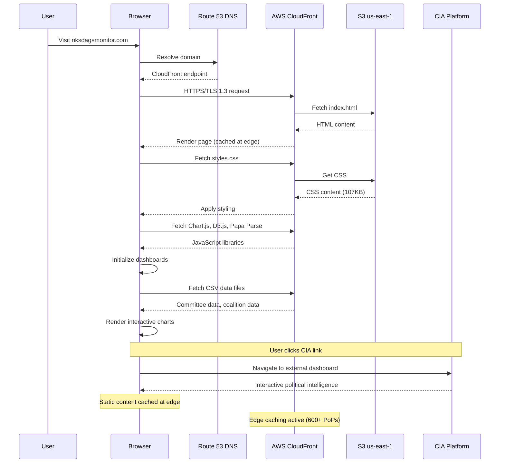
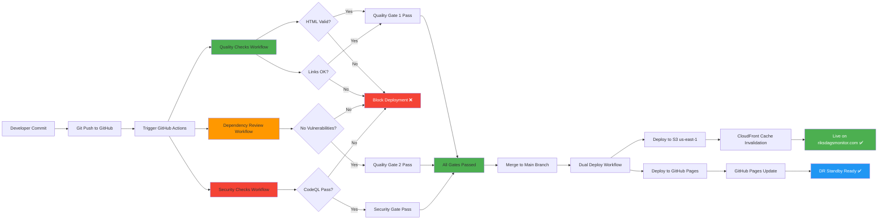
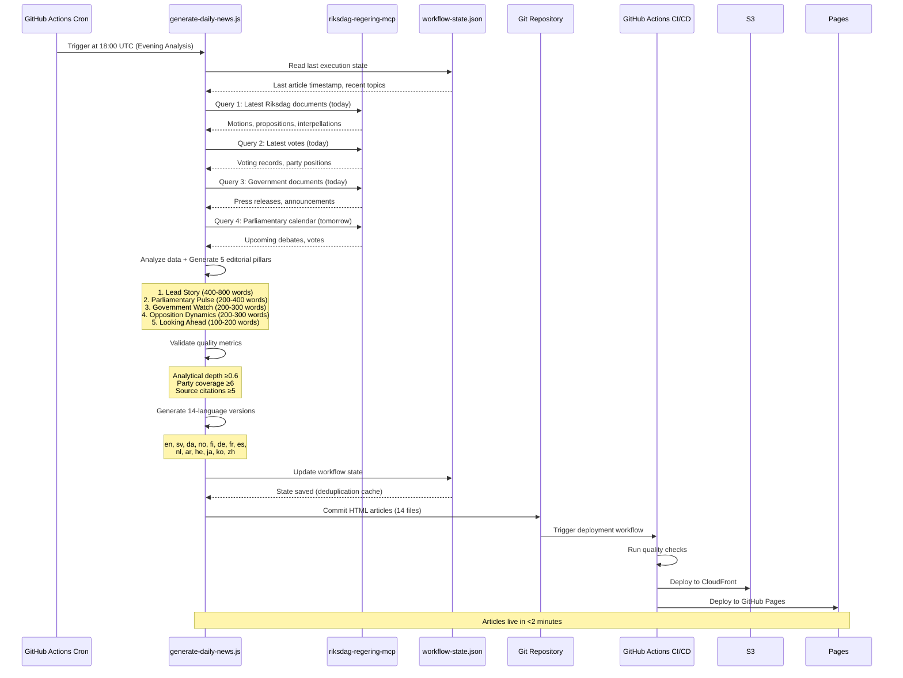
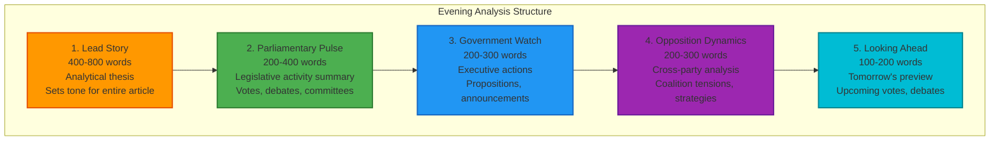
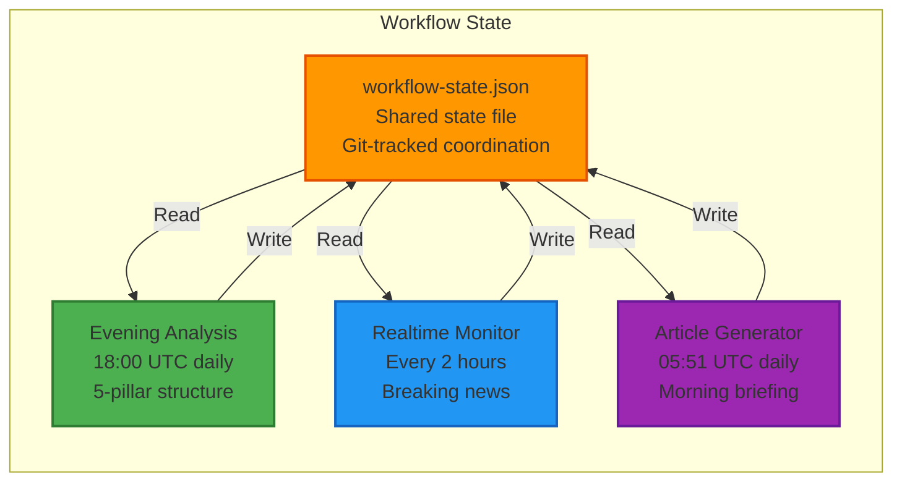
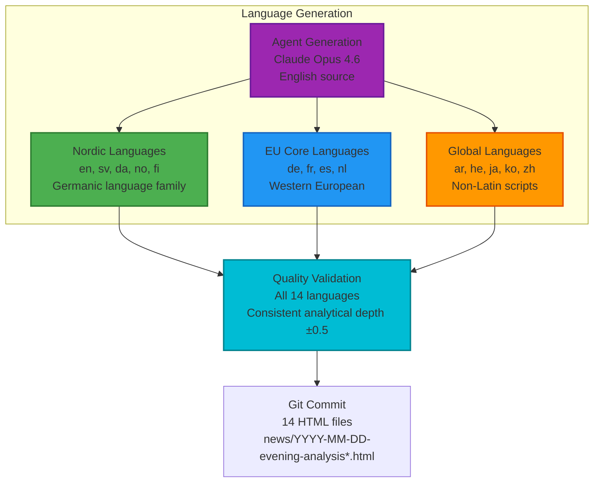
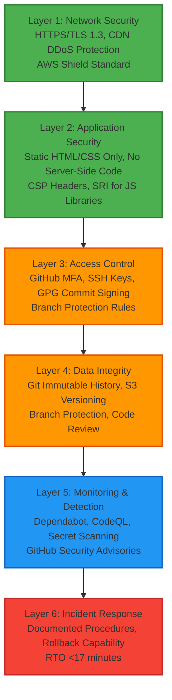
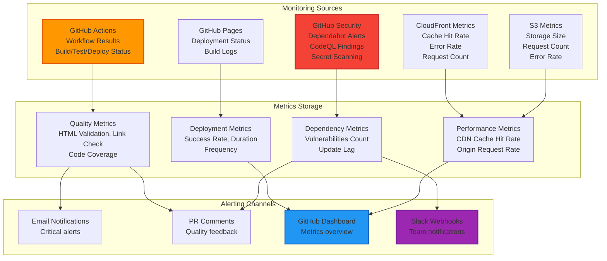
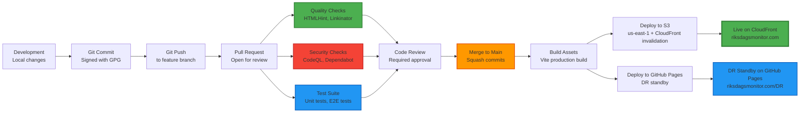
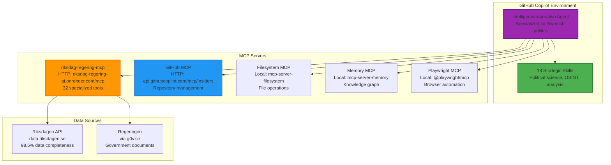

<p align="center">
  
</p>

<h1 align="center">🏗️ Riksdagsmonitor — System Architecture</h1>

<p align="center">
  <strong>📐 C4 Architecture Model for Swedish Parliament Intelligence Platform</strong><br>
  <em>🏛️ Context, Container, Component & Dynamic Views</em>
</p>

<p align="center">
  <a href="#"></a>
  <a href="#"></a>
  <a href="#"></a>
  <a href="#"></a>
</p>

**📋 Document Owner:** CEO | **📄 Version:** 2.0 | **📅 Last Updated:** 2026-02-20 (UTC)  
**🔄 Review Cycle:** Quarterly | **⏰ Next Review:** 2026-05-20  
**🏢 Owner:** Hack23 AB (Org.nr 5595347807) | **🏷️ Classification:** Public

---

## 📚 Architecture Documentation Map

| Document | Focus | Description |
|----------|-------|-------------|
| **[ARCHITECTURE.md](ARCHITECTURE.md)** ⭐ | 🏛️ **C4 Models** | **System structure, Context/Container/Component/Dynamic views** |
| [DATA_MODEL.md](DATA_MODEL.md) | 📊 Data | Entities, schemas, relationships |
| [FLOWCHART.md](FLOWCHART.md) | 🔄 Processes | Business process and data flows |
| [STATEDIAGRAM.md](STATEDIAGRAM.md) | 🔄 Behavior | System state transitions and lifecycles |
| [MINDMAP.md](MINDMAP.md) | 🧠 Concepts | System conceptual relationships |
| [SWOT.md](SWOT.md) | 💼 Strategy | Strategic analysis and positioning |
| [FUTURE_ARCHITECTURE.md](FUTURE_ARCHITECTURE.md) | 🚀 Future | Architectural evolution roadmap |
| [FUTURE_DATA_MODEL.md](FUTURE_DATA_MODEL.md) | 📊 Future | Enhanced data architecture plans |
| [FUTURE_FLOWCHART.md](FUTURE_FLOWCHART.md) | 🔄 Future | Improved process workflows |
| [FUTURE_STATEDIAGRAM.md](FUTURE_STATEDIAGRAM.md) | 📈 Future | Advanced state management |
| [FUTURE_MINDMAP.md](FUTURE_MINDMAP.md) | 🧠 Future | Capability expansion plans |
| [FUTURE_SWOT.md](FUTURE_SWOT.md) | 💼 Future | Future strategic opportunities |
| [SECURITY_ARCHITECTURE.md](SECURITY_ARCHITECTURE.md) | 🛡️ Security | Security controls and compliance |
| [FUTURE_SECURITY_ARCHITECTURE.md](FUTURE_SECURITY_ARCHITECTURE.md) | 🚀 Security | Security roadmap |
| [THREAT_MODEL.md](THREAT_MODEL.md) | 🎯 Threats | STRIDE analysis and risk assessment |
| [WORKFLOWS.md](WORKFLOWS.md) | 🔧 DevOps | CI/CD automation and pipelines |
| [CRA-ASSESSMENT.md](CRA-ASSESSMENT.md) | ⚖️ Compliance | EU Cyber Resilience Act conformity |

---

## Executive Summary

Riksdagsmonitor is a web application providing Swedish Parliament intelligence through interactive dashboards (Chart.js/D3.js) and CIA platform integration. Deployed on AWS CloudFront with multi-region S3 storage (us-east-1 primary, eu-west-1 replica) and GitHub Pages disaster recovery. This document describes the system architecture using the C4 model (Context, Container, Component, Dynamic), component interactions, data flows, and design decisions aligned with Hack23 AB's ISMS standards.

---

## 🌐 C4 System Context Diagram (Level 1)

The System Context diagram shows Riksdagsmonitor's place in its environment, including users, external systems, and key relationships.

### System Boundaries and External Dependencies

```mermaid
graph TB
    subgraph "Users"
        Users[End Users<br/>Person<br/>Global citizens, journalists,<br/>researchers, policymakers]
    end
    
    subgraph "Riksdagsmonitor System"
        System[Riksdagsmonitor<br/>Software System<br/>Swedish Parliament Intelligence Platform<br/>Static website with interactive dashboards]
    end
    
    subgraph "External Systems"
        CIA[CIA Platform<br/>External System<br/>Political intelligence data processing<br/>www.hack23.com/cia]
        
        GitHub[GitHub<br/>External System<br/>Version control & hosting<br/>GitHub Pages, Actions]
        
        AWS[AWS Infrastructure<br/>External System<br/>CloudFront CDN + S3 Storage<br/>Global content delivery]
        
        Parliament[Swedish Parliament API<br/>External System<br/>Official legislative data<br/>data.riksdagen.se]
        
        Government[Regeringen<br/>External System<br/>Government documents<br/>via g0v.se]
    end
    
    Users -->|HTTPS/TLS 1.3<br/>Browse site, view dashboards| System
    System -->|External links<br/>Deep political analysis| CIA
    System -->|Hosted on<br/>DR hosting| GitHub
    System -->|Delivered via<br/>Primary CDN| AWS
    CIA -->|Fetches data from| Parliament
    CIA -->|Fetches data from| Government
    
    style Users fill:#e1f5ff,stroke:#0277bd,stroke-width:2px
    style System fill:#4caf50,stroke:#2e7d32,stroke-width:3px
    style CIA fill:#9c27b0,stroke:#6a1b9a,stroke-width:2px
    style GitHub fill:#ff9800,stroke:#e65100,stroke-width:2px
    style AWS fill:#2196f3,stroke:#1565c0,stroke-width:2px
    style Parliament fill:#ffeb3b,stroke:#f57f17,stroke-width:2px
    style Government fill:#ffeb3b,stroke:#f57f17,stroke-width:2px
```

### Context Relationships

| Actor/System | Relationship | Purpose |
|--------------|-------------|---------|
| **End Users** → **Riksdagsmonitor** | Browse via HTTPS | Access Swedish Parliament intelligence, view interactive dashboards |
| **Riksdagsmonitor** → **CIA Platform** | External links | Deep political analysis, data visualization |
| **Riksdagsmonitor** → **AWS CloudFront** | CDN delivery | Primary content delivery, 600+ global PoPs |
| **Riksdagsmonitor** → **GitHub Pages** | DR hosting | Disaster recovery standby, secondary deployment |
| **CIA Platform** → **Swedish Parliament API** | API calls | Fetch legislative data, voting records, documents |
| **CIA Platform** → **Regeringen** | API calls via g0v.se | Government documents, propositions, press releases |

---

## 🏛️ C4 Container Diagram (Level 2)

The Container diagram zooms into Riksdagsmonitor to show major technical components (containers) and their interactions.

### Technical Containers and Technology Choices

```mermaid
graph TB
    subgraph "User Layer"
        Users[End Users<br/>Global Audience]
        Browsers[Web Browsers<br/>Chrome, Safari, Firefox]
    end
    
    subgraph "Content Delivery Layer"
        Route53[AWS Route 53<br/>Container: DNS Service<br/>DNS + Health Checks + Failover]
        CF[AWS CloudFront<br/>Container: CDN<br/>600+ Edge Locations<br/>DDoS Protection]
        GHCDN[GitHub Pages CDN<br/>Container: DR CDN<br/>DR Standby]
    end
    
    subgraph "Application Layer - Riksdagsmonitor"
        Static[Static Website<br/>Container: Web Application<br/>HTML5/CSS3/JavaScript<br/>14 Languages]
        
        Dashboards[Interactive Dashboards<br/>Container: Client-Side App<br/>Chart.js v4.4.1, D3.js v7<br/>Papa Parse v5.5.3]
        
        NewsEngine[News Generator<br/>Container: Node.js Scripts<br/>generate-daily-news.js<br/>riksdag-regering-mcp]
    end
    
    subgraph "Storage Layer"
        S3US[S3 us-east-1<br/>Container: Object Storage<br/>Primary Storage + Versioning]
        S3EU[S3 eu-west-1<br/>Container: Object Storage<br/>Replica Storage]
    end
    
    subgraph "Data Layer"
        DataFiles[CSV/JSON Files<br/>Container: Data Store<br/>Static data files]
    end
    
    subgraph "CI/CD Layer"
        Actions[GitHub Actions<br/>Container: CI/CD Pipeline<br/>Automated workflows<br/>Quality gates]
        GitHub[Git Repository<br/>Container: Version Control<br/>Source code + history]
    end
    
    Users --> Browsers
    Browsers -->|DNS Query| Route53
    Route53 -->|DNS Response: CF Primary| Browsers
    Route53 -.->|DNS Response: GHCDN on Failover| Browsers
    Browsers -->|HTTPS/TLS 1.3| CF
    Browsers -.->|HTTPS/TLS 1.3 (DR)| GHCDN
    CF -->|Origin| S3US
    CF -.->|Origin Failover on 500+ errors| S3EU
    S3US -.->|S3 CRR (Async, <15 min target)| S3EU
    CF --> Static
    GHCDN --> Static
    Static --> Dashboards
    Static --> DataFiles
    Dashboards -->|Parse CSV| DataFiles
    
    NewsEngine -->|Generates| Static
    NewsEngine -->|Commits to| GitHub
    
    GitHub --> Actions
    Actions -->|Deploy| S3US
    Actions -->|Deploy| GHCDN
    
    style Users fill:#e1f5ff
    style CF fill:#4caf50
    style S3US fill:#2196f3
    style S3EU fill:#64b5f6
    style GHCDN fill:#90caf9
    style Static fill:#81c784
    style Dashboards fill:#ff9800
    style NewsEngine fill:#9c27b0
    style GitHub fill:#ff6f00
    style Actions fill:#00bcd4
```

### Container Responsibilities

| Container | Technology | Responsibility | Status |
|-----------|------------|----------------|--------|
| **Static Website** | HTML5/CSS3/JavaScript | Present intelligence content, 14-language support | ✅ Active |
| **Interactive Dashboards** | Chart.js v4.4.1, D3.js v7, Papa Parse v5.5.3 | Data visualization, committee analysis, coalition tracking | ✅ Active |
| **News Generator** | Node.js scripts, riksdag-regering-mcp | Automated news generation, evening analysis | ✅ Active |
| **AWS CloudFront** | AWS CDN | Primary global content delivery, DDoS protection | ✅ Active |
| **S3 us-east-1** | AWS S3 | Primary object storage with versioning | ✅ Active |
| **S3 eu-west-1** | AWS S3 | Replica storage with cross-region replication | ✅ Active |
| **Route 53** | AWS DNS | DNS resolution with health checks and failover | ✅ Active |
| **GitHub Pages CDN** | GitHub CDN | Disaster recovery hosting | ✅ Standby |
| **GitHub Actions** | CI/CD automation | Build, test, deploy workflows | ✅ Active |
| **Git Repository** | GitHub | Version control, source of truth | ✅ Active |
| **CSV/JSON Files** | Static data | Dashboard data, workflow state | ✅ Active |

---

## 🧩 C4 Component Diagram (Level 3)

The Component diagram zooms into containers to show their internal structure and key components.

### Static Website Components


```mermaid
graph TD
    subgraph "HTML Pages"
        Index[index.html<br/>Component: Main Page<br/>English + 4 Functional Dashboards<br/>946 lines inline script]
        LangSV[index_sv.html<br/>Component: Swedish Page<br/>Coalition Dashboard]
        LangDA[index_da.html<br/>Component: Danish Page<br/>Coalition Dashboard]
        LangNO[index_no.html<br/>Component: Norwegian Page<br/>Coalition Dashboard]
        LangOther[10 other languages<br/>Component: Multi-language Pages<br/>fi, de, fr, es, nl, ar, he, ja, ko, zh]
    end
    
    subgraph "JavaScript Dashboards"
        InlineScript[Inline Dashboard Script<br/>Component: Risk Detection<br/>946 lines<br/>Risk + Anomaly Detection]
        
        CommitteeDash[committees-dashboard.js<br/>Component: Committee Analysis<br/>39KB - Committee performance]
        
        CoalitionDash[coalition-dashboard.js<br/>Component: Coalition Analysis<br/>33KB - Coalition dynamics]
        
        ElectionDash[election-cycle-dashboard.js<br/>Component: Election Analysis<br/>46KB - Election cycle tracking]
        
        Placeholders[5 Placeholder Sections<br/>Component: Future Dashboards<br/>Party, Seasonal, Pre-Election,<br/>Ministry, Anomaly Detection<br/>HTML only, no JS]
    end
    
    subgraph "Data Transformation"
        DataTransformers[data-transformers.js<br/>Component: Data Processing<br/>CSV parsing, data cleaning]
        
        HTMLUtils[html-utils.js<br/>Component: HTML Generation<br/>Template rendering, multi-language]
        
        NewsGen[generate-daily-news.js<br/>Component: News Generation<br/>Evening analysis, 5 editorial pillars]
    end
    
    subgraph "Styling"
        CSS[styles.css<br/>Component: Styling<br/>107KB responsive design]
        Fonts[Google Fonts<br/>Component: Typography<br/>Inter, Orbitron]
    end
    
    subgraph ExtLibs["External Libraries (Hosted Locally)"]
        Chart[Chart.js v4.4.1<br/>Component: Charting Library<br/>Hosted on CloudFront/S3]
        ChartPlugin[chartjs-plugin-annotation v3.0.1<br/>Component: Chart Annotations<br/>Hosted on CloudFront/S3]
        ChartAdapter[chartjs-adapter-date-fns v3.0.0<br/>Component: Date Adapter<br/>Hosted on CloudFront/S3]
        D3[D3.js v7<br/>Component: Advanced Viz<br/>Hosted on CloudFront/S3]
        Papa[Papa Parse v5.5.3<br/>Component: CSV Parser<br/>Hosted on CloudFront/S3]
    end
    
    subgraph "Configuration"
        CNAME[CNAME<br/>Component: DNS Config<br/>riksdagsmonitor.com]
        Sitemap[sitemap.xml<br/>Component: SEO Config<br/>14 language pages]
        Robots[robots.txt<br/>Component: Crawler Config<br/>SEO directives]
    end
    
    Index --> InlineScript
    Index --> CommitteeDash
    Index --> CoalitionDash
    Index --> ElectionDash
    Index --> Placeholders
    Index --> CSS
    
    LangSV --> CoalitionDash
    LangDA --> CoalitionDash
    LangNO --> CoalitionDash
    LangOther --> CoalitionDash
    
    InlineScript --> Chart
    InlineScript --> D3
    CommitteeDash --> Chart
    CommitteeDash --> D3
    CoalitionDash --> Chart
    CoalitionDash --> D3
    ElectionDash --> Chart
    ElectionDash --> D3
    
    CommitteeDash --> Papa
    CoalitionDash --> Papa
    ElectionDash --> Papa
    
    NewsGen --> HTMLUtils
    NewsGen --> DataTransformers
    
    CSS --> Fonts
    
    style Index fill:#4caf50
    style InlineScript fill:#ff9800
    style CommitteeDash fill:#2196f3
    style CoalitionDash fill:#2196f3
    style ElectionDash fill:#2196f3
    style Placeholders fill:#9e9e9e
    style CSS fill:#00bcd4
    style Chart fill:#ff9800
    style D3 fill:#ff9800
    style NewsGen fill:#9c27b0
```

### Component Details

#### HTML Pages (14 Languages)
- **index.html** - English main page with 4 functional dashboards
- **index_sv.html** - Swedish version (coalition dashboard)
- **index_da.html** - Danish version (coalition dashboard)
- **index_no.html** - Norwegian version (coalition dashboard)
- **index_fi.html** - Finnish version
- **index_de.html** - German version
- **index_fr.html** - French version
- **index_es.html** - Spanish version
- **index_nl.html** - Dutch version
- **index_ar.html** - Arabic version (RTL)
- **index_he.html** - Hebrew version (RTL)
- **index_ja.html** - Japanese version
- **index_ko.html** - Korean version
- **index_zh.html** - Chinese version

#### Dashboard Components
1. **Inline Script (946 lines)** - Risk detection and anomaly detection
2. **committees-dashboard.js (39KB)** - Committee performance analysis
3. **coalition-dashboard.js (33KB)** - Coalition dynamics tracking
4. **election-cycle-dashboard.js (46KB)** - Election cycle analysis
5. **5 Placeholder Sections** - Future dashboards (HTML structure only, no JS implementation yet)
   - Party Performance Dashboard
   - Seasonal Trends Dashboard
   - Pre-Election Monitoring Dashboard
   - Ministry Performance Dashboard
   - Advanced Anomaly Detection Dashboard

#### Scripts and Utilities
- **scripts/generate-daily-news.js** - Evening analysis generation (5 editorial pillars)
- **scripts/data-transformers.js** - CSV parsing and data cleaning
- **scripts/html-utils.js** - Template rendering and HTML generation

---

## 🔄 C4 Dynamic Diagram

Dynamic diagrams show how components interact in specific scenarios.

### Scenario 1: User Request Flow


```mermaid
sequenceDiagram
    participant User
    participant Browser
    participant DNS as Route 53 DNS
    participant CDN as AWS CloudFront
    participant S3 as S3 us-east-1
    participant CIA as CIA Platform
    
    User->>Browser: Visit riksdagsmonitor.com
    Browser->>DNS: Resolve domain
    DNS-->>Browser: CloudFront endpoint
    Browser->>CDN: HTTPS/TLS 1.3 request
    CDN->>S3: Fetch index.html
    S3-->>CDN: HTML content
    CDN-->>Browser: Render page (cached at edge)
    Browser->>CDN: Fetch styles.css
    CDN->>S3: Get CSS
    S3-->>CDN: CSS content (107KB)
    CDN-->>Browser: Apply styling
    Browser->>CDN: Fetch Chart.js, D3.js, Papa Parse
    CDN-->>Browser: JavaScript libraries
    Browser->>Browser: Initialize dashboards
    Browser->>CDN: Fetch CSV data files
    CDN-->>Browser: Committee data, coalition data
    Browser->>Browser: Render interactive charts
    
    Note over Browser,CIA: User clicks CIA link
    Browser->>CIA: Navigate to external dashboard
    CIA-->>Browser: Interactive political intelligence
    
    Note over Browser: Static content cached at edge
    Note over CDN: Edge caching active (600+ PoPs)
```

### Scenario 2: CI/CD Deployment Flow


```mermaid
graph LR
    A[Developer Commit] --> B[Git Push to GitHub]
    B --> C[Trigger GitHub Actions]
    
    C --> D[Quality Checks Workflow]
    C --> E[Dependency Review Workflow]
    C --> F[Security Checks Workflow]
    
    D --> G{HTML Valid?}
    D --> H{Links OK?}
    E --> I{No Vulnerabilities?}
    F --> J{CodeQL Pass?}
    
    G -->|Yes| K[Quality Gate 1 Pass]
    G -->|No| L[Block Deployment ❌]
    H -->|Yes| K
    H -->|No| L
    I -->|Yes| M[Quality Gate 2 Pass]
    I -->|No| L
    J -->|Yes| N[Security Gate Pass]
    J -->|No| L
    
    K --> O[All Gates Passed]
    M --> O
    N --> O
    
    O --> P[Merge to Main Branch]
    P --> Q[Dual Deploy Workflow]
    Q --> R[Deploy to S3 us-east-1]
    Q --> S[Deploy to GitHub Pages]
    R --> T[CloudFront Cache Invalidation]
    S --> U[GitHub Pages Update]
    T --> V[Live on riksdagsmonitor.com ✅]
    U --> W[DR Standby Ready ✅]
    
    style D fill:#4caf50
    style E fill:#ff9800
    style F fill:#f44336
    style L fill:#f44336,color:#fff
    style O fill:#4caf50
    style V fill:#4caf50,color:#fff
    style W fill:#2196f3,color:#fff
```

### Scenario 3: Nightly News Generation Flow


```mermaid
sequenceDiagram
    participant Cron as GitHub Actions Cron
    participant NewsGen as generate-daily-news.js
    participant MCP as riksdag-regering-mcp
    participant State as workflow-state.json
    participant Git as Git Repository
    participant CI as GitHub Actions CI/CD
    
    Cron->>NewsGen: Trigger at 18:00 UTC (Evening Analysis)
    NewsGen->>State: Read last execution state
    State-->>NewsGen: Last article timestamp, recent topics
    
    NewsGen->>MCP: Query 1: Latest Riksdag documents (today)
    MCP-->>NewsGen: Motions, propositions, interpellations
    
    NewsGen->>MCP: Query 2: Latest votes (today)
    MCP-->>NewsGen: Voting records, party positions
    
    NewsGen->>MCP: Query 3: Government documents (today)
    MCP-->>NewsGen: Press releases, announcements
    
    NewsGen->>MCP: Query 4: Parliamentary calendar (tomorrow)
    MCP-->>NewsGen: Upcoming debates, votes
    
    NewsGen->>NewsGen: Analyze data + Generate 5 editorial pillars
    Note over NewsGen: 1. Lead Story (400-800 words)<br/>2. Parliamentary Pulse (200-400 words)<br/>3. Government Watch (200-300 words)<br/>4. Opposition Dynamics (200-300 words)<br/>5. Looking Ahead (100-200 words)
    
    NewsGen->>NewsGen: Validate quality metrics
    Note over NewsGen: Analytical depth ≥0.6<br/>Party coverage ≥6<br/>Source citations ≥5
    
    NewsGen->>NewsGen: Generate 14-language versions
    Note over NewsGen: en, sv, da, no, fi, de, fr, es,<br/>nl, ar, he, ja, ko, zh
    
    NewsGen->>State: Update workflow state
    State-->>NewsGen: State saved (deduplication cache)
    
    NewsGen->>Git: Commit HTML articles (14 files)
    Git->>CI: Trigger deployment workflow
    CI->>CI: Run quality checks
    CI->>S3: Deploy to CloudFront
    CI->>Pages: Deploy to GitHub Pages
    
    Note over NewsGen,Pages: Articles live in <2 minutes
```

---

## 📚 Architecture Layers

### Layer 1: 🖥️ Presentation Layer

**Purpose:** User interface and client-side rendering

**Technologies:**
- **HTML5** - Semantic markup, 14-language support with proper `lang` attributes
- **CSS3** - 107KB responsive design, CSS Grid, Flexbox
- **JavaScript ES6+** - Modern browser features, async/await
- **Chart.js v4.4.1** - Data visualization library
- **chartjs-plugin-annotation v3.0.1** - Chart annotation plugin
- **chartjs-adapter-date-fns v3.0.0** - Time-series date adapter
- **D3.js v7** - Advanced interactive visualizations
- **Papa Parse v5.5.3** - CSV parsing for dashboard data
- **Google Fonts** - Inter and Orbitron typography

**Responsibilities:**
- Render HTML pages in 14 languages
- Display interactive dashboards with Chart.js and D3.js
- Parse CSV data files with Papa Parse
- Apply responsive CSS styling
- Handle user interactions (clicks, navigation)

### Layer 2: 📊 Data Layer

**Purpose:** Data storage and retrieval

**Technologies:**
- CSV data files (committee data, coalition data, election data)
- JSON configuration files (workflow-state.json)
- Papa Parse v5.5.3 (client-side CSV parsing)
- Git version control (immutable history)

**Responsibilities:**
- Store dashboard data in CSV format
- Maintain workflow state in JSON
- Provide data to dashboards via client-side parsing
- Track data versions through Git commits

### Layer 3: 🔌 Integration Layer

**Purpose:** External system integration

**Technologies:**
- **CIA Platform** - External intelligence system (www.hack23.com/cia)
- **riksdag-regering-mcp** - MCP server for political data (32 tools)
- **GitHub API** - Repository management
- **Swedish Parliament API** - Legislative data (data.riksdagen.se)
- **Regeringen API** - Government documents (via g0v.se)

**Responsibilities:**
- Link to CIA Platform for deep analysis
- Query riksdag-regering-mcp for news generation
- Fetch data from Swedish Parliament API (via CIA Platform)
- Access government documents (via g0v.se)

### Layer 4: 🔒 Security Layer

**Purpose:** Application security and compliance

**Technologies:**
- **Content Security Policy (CSP)** - XSS prevention
- **Subresource Integrity (SRI)** - Supply chain security for JS libraries
- **SLSA Build Attestations** - Build provenance
- **GitHub OIDC** - Keyless authentication for deployments
- **Dependabot** - Automated dependency updates
- **CodeQL** - Static application security testing (SAST)
- **Secret Scanning** - Credential leak detection

**Responsibilities:**
- Enforce CSP headers to prevent XSS attacks
- Validate JS library integrity with SRI hashes
- Generate SLSA attestations for builds
- Authenticate deployments with OIDC tokens
- Scan dependencies for vulnerabilities
- Detect secrets in code

**See:** [SECURITY_ARCHITECTURE.md](SECURITY_ARCHITECTURE.md) for complete security controls

### Layer 5: 📈 Monitoring Layer

**Purpose:** Observability and operational monitoring

**Technologies:**
- **GitHub Actions Workflow Metrics** - Build/deploy success rates
- **AWS CloudWatch** - CDN and S3 metrics
- **HTMLHint** - HTML validation
- **Linkinator v6** - Link integrity checking
- **Dependabot Alerts** - Vulnerability notifications
- **CodeQL Alerts** - Security finding notifications

**Responsibilities:**
- Track workflow execution status
- Monitor CloudFront cache hit rates
- Validate HTML quality
- Check link integrity
- Alert on security findings
- Report deployment failures

### Layer 6: 🚀 CI/CD Layer

**Purpose:** Build, test, and deployment automation

**Technologies:**
- **GitHub Actions** - CI/CD orchestration
- **Vite** - Build tool for optimized assets
- **HTMLHint** - HTML quality validation
- **Linkinator v6** - Link checking
- **npm** - Package management
- **AWS CLI** - S3/CloudFront deployment
- **GitHub Pages** - DR deployment

**Responsibilities:**
- Run automated tests on every push
- Validate HTML and check links
- Build optimized production assets
- Deploy to S3 and CloudFront (primary)
- Deploy to GitHub Pages (DR)
- Invalidate CDN caches

---

## 🏭 Key Design Patterns

### 📄 Static Site Generation Pattern

**Description:** Pure static HTML/CSS/JS with no server-side code execution

**Benefits:**
- Minimal attack surface (no server-side vulnerabilities)
- Maximum performance (edge caching)
- High availability (easy replication)
- Low operational complexity
- Cost-effective hosting

**Implementation:**
- All content pre-rendered at build time
- JavaScript libraries hosted locally on CloudFront/S3
- Client-side CSV parsing with Papa Parse
- No dynamic backend dependencies

### 📊 Data Pipeline Pattern

**Description:** Data flows from CIA Platform → CSV files → Chart.js/D3.js rendering

**Components:**
1. **Data Sources** - CIA Platform aggregates from Swedish Parliament API
2. **Data Export** - CSV files stored in repository
3. **Client-Side Parsing** - Papa Parse loads CSV in browser
4. **Visualization** - Chart.js/D3.js render interactive dashboards

**Benefits:**
- Clear data lineage
- Version-controlled data
- Fast client-side rendering
- No database required

### 🌍 Multi-Language Pattern

**Description:** 14 separate HTML files, one per language, with proper SEO

**Languages:** English (en), Swedish (sv), Danish (da), Norwegian (no), Finnish (fi), German (de), French (fr), Spanish (es), Dutch (nl), Arabic (ar, RTL), Hebrew (he, RTL), Japanese (ja), Korean (ko), Chinese (zh)

**Implementation:**
- Each language has dedicated HTML file (e.g., `index_sv.html`)
- Proper `lang` attribute on `<html>` tag
- `hreflang` tags linking all 14 versions for SEO
- RTL support (`dir="rtl"`) for Arabic and Hebrew
- Language switcher component in navigation

**Benefits:**
- SEO-optimized URL structure
- Clear language separation
- No client-side translation (faster)
- Better crawlability for search engines

### 🔒 Progressive Enhancement Pattern

**Description:** CSS-first design where JavaScript enriches but is not required

**Layers:**
1. **Base HTML** - Semantic content, accessible without JS
2. **CSS Styling** - Responsive design, visual hierarchy
3. **JavaScript Enhancement** - Interactive dashboards, dynamic charts

**Benefits:**
- Works without JavaScript (graceful degradation)
- Better accessibility
- Faster initial page load
- SEO-friendly (content visible to crawlers)

### 📰 Content Generation Pattern

**Description:** Automated news generation using riksdag-regering-mcp and AI agents

**Workflow:**
1. **Data Collection** - riksdag-regering-mcp queries political data
2. **Analysis** - intelligence-operative agent analyzes events
3. **Writing** - Generate 5 editorial pillars (Lead, Pulse, Watch, Opposition, Ahead)
4. **Quality Validation** - Check analytical depth, party coverage, sources
5. **Translation** - Generate 14-language versions
6. **Publication** - Commit HTML files, trigger deployment

**Quality Metrics:**
- Analytical depth score ≥ 0.6
- Party coverage ≥ 6 unique parties
- Source citations ≥ 5 references
- Historical context score ≥ 1.0
- International comparison (60%+ of articles)

**See:** §5.3 News Generation Architecture for details

### 🔁 Dual Deployment Pattern

**Description:** AWS CloudFront (primary) + GitHub Pages (DR) with Route 53 failover

**Architecture:**
- **Primary:** AWS CloudFront → S3 us-east-1 (with S3 eu-west-1 replica)
- **Secondary:** GitHub Pages CDN → GitHub Pages hosting
- **Orchestration:** Route 53 health checks with automatic failover

**Failover Logic:**
1. Route 53 health check monitors CloudFront endpoint
2. If CloudFront returns 5xx errors for >60 seconds
3. Route 53 updates DNS to point to GitHub Pages
4. GitHub Pages serves identical content
5. When CloudFront recovers, Route 53 switches back

**Benefits:**
- 99.9% availability (both AWS and GitHub have 99.9% SLA)
- Geographic redundancy (AWS multi-region + GitHub global CDN)
- Cost optimization (GitHub Pages free, AWS pay-as-you-go)
- Disaster recovery (independent hosting platforms)

**RTO:** <5 minutes (DNS TTL + health check interval)  
**RPO:** <2 minutes (dual deploy on every commit)

---

## 📊 Data Architecture

### Content Structure

```mermaid
graph LR
    subgraph "Content Types"
        HTML[HTML Pages<br/>14 Languages<br/>index.html + 13 translations]
        CSS[Stylesheets<br/>styles.css (107KB)<br/>Responsive Design]
        JS[JavaScript<br/>Dashboard scripts<br/>Chart.js, D3.js, Papa Parse]
        Data[Data Files<br/>CSV files<br/>Committee, coalition, election data]
        Images[Images<br/>Logos, icons<br/>SVG + PNG]
        Config[Configuration<br/>sitemap.xml, robots.txt, CNAME]
    end
    
    subgraph "Storage"
        Git[Git Repository<br/>Version Control<br/>Immutable History]
        S3[S3 Storage<br/>Primary: us-east-1<br/>Replica: eu-west-1]
        CDN[CloudFront CDN<br/>600+ Global PoPs<br/>Edge Caching]
    end
    
    HTML --> Git
    CSS --> Git
    JS --> Git
    Data --> Git
    Images --> Git
    Config --> Git
    
    Git --> S3
    S3 --> CDN
    
    style Git fill:#ff9800
    style S3 fill:#2196f3
    style CDN fill:#4caf50
```

### Data Sources

| Source | Type | Update Frequency | Integration | Risk Level |
|--------|------|------------------|-------------|------------|
| **Swedish Parliament** | Votes, Documents, MPs, Debates | Real-time | CIA Platform → External Links | LOW |
| **Election Authority** | Election Results, Statistics | Post-election | CIA Platform → External Links | LOW |
| **Financial Authority** | Budget, Government Spending | Monthly | CIA Platform → External Links | LOW |
| **World Bank** | Country Indicators, Economic Data | Quarterly | CIA Platform → External Links | LOW |
| **riksdag-regering-mcp** | Aggregated Political Data | On-demand | MCP Server (32 tools) | LOW |

### News Generation Architecture

#### 5 Editorial Pillars Structure

The evening analysis follows a structured 5-pillar editorial format inspired by The Economist's analytical journalism:


```mermaid
graph TD
    subgraph "Evening Analysis Structure"
        Lead[1. Lead Story<br/>400-800 words<br/>Analytical thesis<br/>Sets tone for entire article]
        Pulse[2. Parliamentary Pulse<br/>200-400 words<br/>Legislative activity summary<br/>Votes, debates, committees]
        Watch[3. Government Watch<br/>200-300 words<br/>Executive actions<br/>Propositions, announcements]
        Opposition[4. Opposition Dynamics<br/>200-300 words<br/>Cross-party analysis<br/>Coalition tensions, strategies]
        Ahead[5. Looking Ahead<br/>100-200 words<br/>Tomorrow's preview<br/>Upcoming votes, debates]
    end
    
    Lead --> Pulse
    Pulse --> Watch
    Watch --> Opposition
    Opposition --> Ahead
    
    style Lead fill:#ff9800,stroke:#e65100,stroke-width:2px
    style Pulse fill:#4caf50,stroke:#2e7d32,stroke-width:2px
    style Watch fill:#2196f3,stroke:#1565c0,stroke-width:2px
    style Opposition fill:#9c27b0,stroke:#6a1b9a,stroke-width:2px
    style Ahead fill:#00bcd4,stroke:#00838f,stroke-width:2px
```

**Pillar Definitions:**

1. **Lead Story (400-800 words)**
   - Opening narrative establishing the day's main theme
   - Analytical thesis in lead paragraph
   - "Why this matters" context
   - Most significant development with implications
   - Sets tone for entire article

2. **Parliamentary Pulse (200-400 words)**
   - Legislative body activity summary
   - Key votes and margins
   - Committee reports published
   - Debate highlights
   - Speeches and procedural actions

3. **Government Watch (200-300 words)**
   - Executive branch monitoring
   - New propositions
   - Ministerial announcements
   - Policy changes
   - Regulatory actions

4. **Opposition Dynamics (200-300 words)**
   - Cross-party political analysis
   - Opposition party strategies
   - Coalition tensions
   - Cross-party collaboration patterns
   - Political maneuvering

5. **Looking Ahead (100-200 words)**
   - Forward-looking preview
   - Tomorrow's parliamentary calendar
   - Upcoming votes and debates
   - Expected announcements
   - "What to watch" guidance

#### Quality Metrics Schema

News articles are validated against comprehensive quality metrics:

| Dimension | Metric | Target | Measurement |
|-----------|--------|--------|-------------|
| **Analytical Depth** | Score 0.0-1.0 | ≥ 0.6 | Causal, comparative, evaluative language markers |
| **Historical Context** | Score 0-3 | ≥ 1.0 | Historical references, trends, temporal comparisons |
| **Party Coverage** | Count | ≥ 6 | Unique party mentions across all 8 Riksdag parties |
| **Source Citations** | Count | ≥ 5 | riksdag-regering-mcp tool usage, document references |
| **International Comparison** | Boolean | 60%+ | European/global context present |
| **Structure Completeness** | Boolean | 100% | All 5 pillars present with minimum word counts |

**Quality Score Calculation:**
- Structure (30%): All pillars present + minimum word counts
- Analytical depth (20%): Marker detection (because, therefore, however, etc.)
- Historical context (15%): Temporal references (since, previously, compared to)
- Sources (15%): Citation count from riksdag-regering-mcp queries
- Party perspectives (10%): Coverage breadth across political spectrum
- Forward-looking (5%): Preview content in "Looking Ahead" pillar
- International comparison (5%): Global context and European benchmarking

#### Workflow State Management

Cross-workflow coordination prevents duplication and maintains quality:


```mermaid
graph LR
    subgraph "Workflow State"
        State[workflow-state.json<br/>Shared state file<br/>Git-tracked coordination]
        
        Evening[Evening Analysis<br/>18:00 UTC daily<br/>5-pillar structure]
        Realtime[Realtime Monitor<br/>Every 2 hours<br/>Breaking news]
        Generator[Article Generator<br/>05:51 UTC daily<br/>Morning briefing]
    end
    
    Evening -->|Write| State
    Realtime -->|Write| State
    Generator -->|Write| State
    
    State -->|Read| Evening
    State -->|Read| Realtime
    State -->|Read| Generator
    
    style State fill:#ff9800,stroke:#e65100,stroke-width:2px
    style Evening fill:#4caf50,stroke:#2e7d32,stroke-width:2px
    style Realtime fill:#2196f3,stroke:#1565c0,stroke-width:2px
    style Generator fill:#9c27b0,stroke:#6a1b9a,stroke-width:2px
```

**State File Schema (workflow-state.json):**
```json
{
  "lastEveningAnalysis": "2026-02-20T18:00:00Z",
  "realtimeArticlesSinceEvening": [
    {
      "timestamp": "2026-02-20T14:30:00Z",
      "topic": "Budget vote",
      "keywords": ["budget", "vote", "coalition"]
    }
  ],
  "mcpQueryCache": {
    "query": "latest riksdag documents",
    "timestamp": "2026-02-20T17:58:00Z",
    "ttl": 7200
  },
  "eveningAnalysisMetrics": {
    "avgAnalyticalDepth": 0.72,
    "avgPartyCoverage": 7.2,
    "avgSourceCitations": 6.5
  }
}
```

**Deduplication Logic:**
1. Calculate text similarity (word overlap) between new and recent articles
2. If similarity > 70%, synthesize but don't repeat verbatim content
3. Reference earlier coverage, add deeper analysis layer
4. Update workflow state after successful generation
5. Clear stale cache entries (TTL: 2 hours for MCP queries)

#### Multi-Language Content Architecture

14-language support with consistent quality across all versions:


```mermaid
graph TB
    subgraph "Language Generation"
        Source[Agent Generation<br/>Claude Opus 4.6<br/>English source]
        
        Nordic[Nordic Languages<br/>en, sv, da, no, fi<br/>Germanic language family]
        EU[EU Core Languages<br/>de, fr, es, nl<br/>Western European]
        Global[Global Languages<br/>ar, he, ja, ko, zh<br/>Non-Latin scripts]
    end
    
    Source --> Nordic
    Source --> EU
    Source --> Global
    
    Nordic --> Validation[Quality Validation<br/>All 14 languages<br/>Consistent analytical depth ±0.5]
    EU --> Validation
    Global --> Validation
    
    Validation --> Commit[Git Commit<br/>14 HTML files<br/>news/YYYY-MM-DD-evening-analysis*.html]
    
    style Source fill:#9c27b0,stroke:#6a1b9a,stroke-width:2px
    style Nordic fill:#4caf50,stroke:#2e7d32,stroke-width:2px
    style EU fill:#2196f3,stroke:#1565c0,stroke-width:2px
    style Global fill:#ff9800,stroke:#e65100,stroke-width:2px
    style Validation fill:#00bcd4,stroke:#00838f,stroke-width:2px
```

**Language-Specific Requirements:**

| Requirement | Implementation | Validation |
|-------------|----------------|------------|
| **HTML `lang` attribute** | `<html lang="sv">` for Swedish, etc. | Automated check in CI |
| **RTL support** | `<html dir="rtl">` for Arabic and Hebrew | Manual review |
| **Hreflang tags** | Link all 14 versions for SEO | HTMLHint validation |
| **Schema.org NewsArticle** | JSON-LD in each language | Schema.org validator |
| **Culturally appropriate tone** | Agent-specific language instructions | Editor review |
| **Consistent analytical depth** | Target ±0.5 on 1.0 scale across languages | Automated quality scoring |

**File Naming Convention:**
- `news/2026-02-20-evening-analysis.html` (English)
- `news/2026-02-20-evening-analysis_sv.html` (Swedish)
- `news/2026-02-20-evening-analysis_da.html` (Danish)
- ... (12 more language variants)

---

## 🔒 Security Architecture Integration

### Defense-in-Depth Layers


```mermaid
graph TD
    Layer1[Layer 1: Network Security<br/>HTTPS/TLS 1.3, CDN DDoS Protection<br/>AWS Shield Standard]
    Layer2[Layer 2: Application Security<br/>Static HTML/CSS Only, No Server-Side Code<br/>CSP Headers, SRI for JS Libraries]
    Layer3[Layer 3: Access Control<br/>GitHub MFA, SSH Keys, GPG Commit Signing<br/>Branch Protection Rules]
    Layer4[Layer 4: Data Integrity<br/>Git Immutable History, S3 Versioning<br/>Branch Protection, Code Review]
    Layer5[Layer 5: Monitoring & Detection<br/>Dependabot, CodeQL, Secret Scanning<br/>GitHub Security Advisories]
    Layer6[Layer 6: Incident Response<br/>Documented Procedures, Rollback Capability<br/>RTO <17 minutes]
    
    Layer1 --> Layer2
    Layer2 --> Layer3
    Layer3 --> Layer4
    Layer4 --> Layer5
    Layer5 --> Layer6
    
    style Layer1 fill:#4caf50,stroke:#2e7d32,stroke-width:2px
    style Layer2 fill:#4caf50,stroke:#2e7d32,stroke-width:2px
    style Layer3 fill:#ff9800,stroke:#e65100,stroke-width:2px
    style Layer4 fill:#ff9800,stroke:#e65100,stroke-width:2px
    style Layer5 fill:#2196f3,stroke:#1565c0,stroke-width:2px
    style Layer6 fill:#f44336,stroke:#c62828,stroke-width:2px
```

### Security Control Summary

| Layer | Control | Technology | Status |
|-------|---------|------------|--------|
| **Network** | TLS 1.3 Encryption | AWS CloudFront | ✅ Active |
| **Network** | DDoS Protection | AWS Shield Standard | ✅ Active |
| **Application** | Content Security Policy | HTTP Headers | ✅ Active |
| **Application** | Subresource Integrity | SRI hashes for JS libs | ✅ Active |
| **Access** | Multi-Factor Authentication | GitHub MFA | ✅ Active |
| **Access** | GPG Commit Signing | GitHub GPG | ✅ Active |
| **Data** | S3 Versioning | AWS S3 | ✅ Active |
| **Data** | Cross-Region Replication | S3 CRR | ✅ Active |
| **Monitoring** | Dependency Scanning | Dependabot | ✅ Active |
| **Monitoring** | SAST Scanning | CodeQL | ✅ Active |
| **Monitoring** | Secret Scanning | GitHub Secret Scanning | ✅ Active |
| **Response** | Automated Rollback | Git revert + CI/CD | ✅ Active |

**See:** [SECURITY_ARCHITECTURE.md](SECURITY_ARCHITECTURE.md) for comprehensive security controls documentation  
**See:** [THREAT_MODEL.md](THREAT_MODEL.md) for STRIDE threat analysis

---

## ⚡ Scalability Architecture

### Traffic Handling


```mermaid
graph TB
    Users[End Users<br/>Global Traffic<br/>Target: 10k concurrent]
    
    subgraph "CDN Layer - 600+ Edge Locations"
        Edge1[Edge Server<br/>North America<br/>30% traffic]
        Edge2[Edge Server<br/>Europe<br/>60% traffic]
        Edge3[Edge Server<br/>Asia Pacific<br/>10% traffic]
    end
    
    subgraph "Origin Layer"
        S3US[S3 us-east-1<br/>Primary Origin<br/>99.9% availability]
        S3EU[S3 eu-west-1<br/>Replica Origin<br/>Failover target]
    end
    
    subgraph "DR Layer"
        GitHub[GitHub Pages<br/>DR Origin<br/>DNS failover]
    end
    
    Users --> Edge1
    Users --> Edge2
    Users --> Edge3
    
    Edge1 -->|Cache Miss| S3US
    Edge2 -->|Cache Miss| S3US
    Edge3 -->|Cache Miss| S3US
    
    Edge1 -->|Cache Hit 95%| Users
    Edge2 -->|Cache Hit 95%| Users
    Edge3 -->|Cache Hit 95%| Users
    
    S3US -.->|CRR Async| S3EU
    S3US -.->|Failover on 5xx| S3EU
    
    Users -.->|DNS Failover| GitHub
    
    style S3US fill:#2196f3,stroke:#1565c0,stroke-width:2px
    style S3EU fill:#64b5f6,stroke:#1976d2,stroke-width:2px
    style Edge1 fill:#90caf9,stroke:#42a5f5,stroke-width:2px
    style Edge2 fill:#90caf9,stroke:#42a5f5,stroke-width:2px
    style Edge3 fill:#90caf9,stroke:#42a5f5,stroke-width:2px
    style GitHub fill:#ff9800,stroke:#e65100,stroke-width:2px
```

### Performance Characteristics

| Metric | Target | Current | Method | Measurement |
|--------|--------|---------|--------|-------------|
| **First Contentful Paint (FCP)** | <1.5s | <1s | Static files, CDN edge caching | Lighthouse CI |
| **Time to Interactive (TTI)** | <3s | <2s | Minimal JavaScript dependencies | Lighthouse CI |
| **Largest Contentful Paint (LCP)** | <2.5s | <2s | Optimized CSS, cached fonts | Lighthouse CI |
| **Cumulative Layout Shift (CLS)** | <0.1 | <0.05 | Stable layout, no dynamic content | Lighthouse CI |
| **Total Blocking Time (TBT)** | <300ms | <200ms | Client-side rendering, async scripts | Lighthouse CI |
| **CDN Cache Hit Rate** | >90% | 95% | Long cache TTL (1 year for static assets) | CloudWatch |
| **Origin Request Rate** | <5% | <5% | High cache hit rate | CloudWatch |

### Capacity Planning

| Resource | Current | Max Capacity | Scaling Method |
|----------|---------|--------------|----------------|
| **CloudFront Bandwidth** | ~10 GB/day | Unlimited | AWS auto-scaling |
| **S3 Storage** | ~500 MB | Unlimited | AWS auto-scaling |
| **S3 Requests** | ~10k/day | 5,500 requests/second | AWS auto-scaling |
| **GitHub Pages Bandwidth** | ~5 GB/month | 100 GB/month | Soft limit, contact support |
| **GitHub Actions Minutes** | ~500 min/month | 3,000 min/month (Team plan) | Upgrade plan if needed |

---

## 📈 Monitoring Architecture

### Observability Stack


```mermaid
graph TB
    subgraph "Monitoring Sources"
        GH[GitHub Actions<br/>Workflow Results<br/>Build/Test/Deploy Status]
        Pages[GitHub Pages<br/>Deployment Status<br/>Build Logs]
        Security[GitHub Security<br/>Dependabot Alerts<br/>CodeQL Findings<br/>Secret Scanning]
        CloudFront[CloudFront Metrics<br/>Cache Hit Rate<br/>Error Rate<br/>Request Count]
        S3[S3 Metrics<br/>Storage Size<br/>Request Count<br/>Error Rate]
    end
    
    subgraph "Alerting Channels"
        Email[Email Notifications<br/>Critical alerts]
        PR[PR Comments<br/>Quality feedback]
        Dashboard[GitHub Dashboard<br/>Metrics overview]
        Slack[Slack Webhooks<br/>Team notifications]
    end
    
    subgraph "Metrics Storage"
        Quality[Quality Metrics<br/>HTML Validation, Link Check<br/>Code Coverage]
        Deps[Dependency Metrics<br/>Vulnerabilities Count<br/>Update Lag]
        Deploy[Deployment Metrics<br/>Success Rate, Duration<br/>Frequency]
        Performance[Performance Metrics<br/>CDN Cache Hit Rate<br/>Origin Request Rate]
    end
    
    GH --> Quality
    Pages --> Deploy
    Security --> Deps
    CloudFront --> Performance
    S3 --> Performance
    
    Quality --> Email
    Quality --> PR
    Deps --> PR
    Deps --> Slack
    Deploy --> Dashboard
    Performance --> Dashboard
    
    style GH fill:#ff9800,stroke:#e65100,stroke-width:2px
    style Security fill:#f44336,stroke:#c62828,stroke-width:2px
    style Dashboard fill:#2196f3,stroke:#1565c0,stroke-width:2px
    style Slack fill:#9c27b0,stroke:#6a1b9a,stroke-width:2px
```

### Metrics Collection

**Tracked Metrics:**

| Metric Category | Metrics | Frequency | Retention |
|-----------------|---------|-----------|-----------|
| **Workflow Metrics** | Execution success rate, duration, frequency | Per workflow run | 90 days |
| **Quality Metrics** | HTML validation pass rate, link check failures | Per commit | 90 days |
| **Security Metrics** | Dependency vulnerability count, CodeQL findings | Daily | Permanent |
| **Performance Metrics** | CDN cache hit rate, origin error rate | Every 5 minutes | 30 days |
| **Deployment Metrics** | Deploy frequency, time to deploy, rollback count | Per deployment | 90 days |

**Retention Policy:**
- **Workflow runs:** 90 days (GitHub Actions default)
- **Artifacts:** 30 days (GitHub Actions default)
- **Security findings:** Permanent (GitHub Security)
- **Deployment logs:** 90 days (GitHub Actions)
- **CloudWatch metrics:** 30 days (AWS default)

### Alerting Strategy

**Alert Severity Levels:**

| Severity | Condition | Response Time | Notification |
|----------|-----------|---------------|--------------|
| **Critical** | Production site down, CloudFront 5xx errors | Immediate | Email + Slack |
| **High** | Deployment failure, CodeQL high-severity finding | <1 hour | Email + PR comment |
| **Medium** | Link check failures, Dependabot alerts | <24 hours | PR comment |
| **Low** | HTML validation warnings, code style issues | Next business day | PR comment |

---

## 🛠️ Technology Stack

### Frontend Stack

| Technology | Version | Purpose | Rationale | License |
|------------|---------|---------|-----------|---------|
| **HTML5** | Standard | Content structure | Universal browser support, semantic markup | W3C License |
| **CSS3** | Standard | Styling & layout | Responsive design, no framework overhead | W3C License |
| **JavaScript ES6+** | Standard | Interactive dashboards | Modern browser features, async/await | ECMA License |
| **Chart.js** | v4.4.1 | Data visualization | Industry standard, 62k+ GitHub stars | MIT |
| **chartjs-plugin-annotation** | v3.0.1 | Chart annotations | Official Chart.js plugin for highlighting | MIT |
| **chartjs-adapter-date-fns** | v3.0.0 | Time-series charts | Official date adapter with date-fns bundled | MIT |
| **D3.js** | v7 | Advanced visualizations | Powerful, flexible, 108k+ GitHub stars | BSD-3-Clause |
| **Papa Parse** | v5.5.3 | CSV parsing | Reliable CSV parser, 12k+ GitHub stars | MIT |
| **Google Fonts** | Latest | Typography (Inter, Orbitron) | Professional appearance, cached globally | Open Font License |

### Infrastructure Stack

| Technology | Version | Purpose | Rationale | SLA |
|------------|---------|---------|-----------|-----|
| **AWS CloudFront** | Latest | Primary CDN | 600+ global edge locations, DDoS protection | 99.9% |
| **AWS S3** | Latest | Primary storage | Reliable, scalable, versioning support, CRR | 99.9% |
| **AWS Route 53** | Latest | DNS with failover | Health checks, automatic failover routing | 100% |
| **GitHub Pages** | Latest | DR hosting | Free, reliable, global CDN | 99.9% |
| **GitHub Actions** | Latest | CI/CD | Integrated with repository, secure OIDC | 99.9% |
| **HTMLHint** | Latest | HTML validation | Industry standard validator | MIT |
| **Linkinator** | v6 | Link checking | Reliable, actively maintained | Apache-2.0 |
| **npm** | Latest | Package management | JavaScript dependency management | Artistic-2.0 |
| **Vite** | Latest | Build tool | Fast build times, optimized output | MIT |

### External Dependencies

| Dependency | Type | Risk Level | Mitigation | Update Strategy |
|------------|------|------------|------------|-----------------|
| **AWS CloudFront** | Infrastructure | LOW | 99.9% SLA, GitHub Pages DR, Route 53 failover | Managed by AWS |
| **AWS S3** | Infrastructure | LOW | Cross-region replication, versioning, 99.9% SLA | Managed by AWS |
| **AWS Route 53** | Infrastructure | LOW | 100% SLA, health checks, automatic failover | Managed by AWS |
| **GitHub Pages** | Infrastructure (DR) | LOW | 99.9% SLA, independent from AWS | Managed by GitHub |
| **Chart.js v4.4.1** | JavaScript Library | LOW | Hosted locally on CloudFront/S3 (js/lib/), SRI hash validation | Dependabot automated updates |
| **chartjs-plugin-annotation v3.0.1** | JavaScript Library | LOW | Hosted locally on CloudFront/S3 (js/lib/), SRI hash validation | Dependabot automated updates |
| **chartjs-adapter-date-fns v3.0.0** | JavaScript Library | LOW | Hosted locally on CloudFront/S3 (js/lib/), SRI hash validation | Dependabot automated updates |
| **D3.js v7** | JavaScript Library | LOW | Hosted locally on CloudFront/S3 (js/lib/), SRI hash validation | Dependabot automated updates |
| **Papa Parse v5.5.3** | JavaScript Library | LOW | Hosted locally on CloudFront/S3 (js/lib/), SRI hash validation | Dependabot automated updates |
| **Google Fonts** | CDN | LOW | Cached by browsers, fallback fonts available (Arial, sans-serif) | Managed by Google |
| **CIA Platform** | External Service | LOW | Independent service, documented external links, no API keys | Manual monitoring |

---

## 🚀 Deployment Architecture

### Deployment Pipeline


```mermaid
graph LR
    Dev[Development<br/>Local changes] --> Commit[Git Commit<br/>Signed with GPG]
    Commit --> Push[Git Push<br/>to feature branch]
    Push --> PR[Pull Request<br/>Open for review]
    
    PR --> Quality[Quality Checks<br/>HTMLHint, Linkinator]
    PR --> Security[Security Checks<br/>CodeQL, Dependabot]
    PR --> Tests[Test Suite<br/>Unit tests, E2E tests]
    
    Quality --> Review[Code Review<br/>Required approval]
    Security --> Review
    Tests --> Review
    
    Review --> Merge[Merge to Main<br/>Squash commits]
    Merge --> Build[Build Assets<br/>Vite production build]
    Build --> DeployS3[Deploy to S3<br/>us-east-1 + CloudFront invalidation]
    Build --> DeployGH[Deploy to GitHub Pages<br/>DR standby]
    
    DeployS3 --> LivePrimary[Live on CloudFront<br/>riksdagsmonitor.com]
    DeployGH --> LiveDR[DR Standby on GitHub Pages<br/>riksdagsmonitor.com/DR]
    
    style Quality fill:#4caf50,stroke:#2e7d32,stroke-width:2px
    style Security fill:#f44336,stroke:#c62828,stroke-width:2px
    style Tests fill:#2196f3,stroke:#1565c0,stroke-width:2px
    style Merge fill:#ff9800,stroke:#e65100,stroke-width:2px
    style LivePrimary fill:#4caf50,stroke:#2e7d32,stroke-width:3px
    style LiveDR fill:#2196f3,stroke:#1565c0,stroke-width:2px
```

### Deployment Strategy

**Dual Deployment Process:**
1. **Trigger:** Merge to `main` branch
2. **Build:** Vite production build (optimized assets)
3. **Validate:** HTMLHint + Linkinator quality gates
4. **Primary Deploy:** Upload to S3 us-east-1 + CloudFront invalidation
5. **DR Deploy:** Publish to GitHub Pages
6. **Verify:** Smoke tests on both deployments
7. **Monitor:** CloudWatch metrics + GitHub Actions logs

**Deployment Frequency:** Multiple times per day (on-demand)  
**Average Deployment Time:** <2 minutes (S3 + CloudFront invalidation)

### Rollback Strategy

**Rollback Methods:**

| Method | Use Case | RTO | Complexity |
|--------|----------|-----|------------|
| **Git Revert** | Code defects, broken features | <5 minutes | Low (1 command + CI/CD) |
| **S3 Versioning** | Corrupted files, accidental deletion | <2 minutes | Low (restore specific version) |
| **CloudFront Invalidation** | Cached bad content | <1 minute | Low (invalidate specific paths) |
| **DNS Failover to GitHub Pages** | CloudFront outage | <5 minutes | Automatic (Route 53 health checks) |
| **Branch Rollback** | Multiple bad commits | <10 minutes | Medium (force push to main) |

**Rollback SLA:**
- **Detection:** <5 minutes (monitoring alerts + smoke tests)
- **Decision:** <10 minutes (review incident, check logs)
- **Execution:** <2 minutes (git revert + automated deploy)
- **Verification:** <5 minutes (smoke tests, manual verification)
- **Total RTO:** <22 minutes (worst case)

**Rollback Procedure:**
```bash
# 1. Revert commit (creates new commit)
git revert <bad-commit-sha>

# 2. Push to trigger CI/CD
git push origin main

# 3. CI/CD automatically deploys reverted code
# 4. Verify deployment with smoke tests
```

---

## 🏛️ Architecture Principles

### Core Principles

1. **Security by Design**
   - Defense-in-depth with 6 security layers
   - Dual deployment with automatic failover
   - CSP headers, SRI for JS libraries, SLSA build attestations
   - OIDC keyless authentication for deployments

2. **Defense in Depth**
   - Network layer: HTTPS/TLS 1.3, CDN DDoS protection
   - Application layer: Static site (no server-side code), CSP, SRI
   - Access control: GitHub MFA, GPG signing, branch protection
   - Data integrity: Git immutable history, S3 versioning, CRR
   - Monitoring: Dependabot, CodeQL, secret scanning
   - Incident response: Documented procedures, RTO <22 minutes

3. **Resilience**
   - Multi-region storage (S3 us-east-1 + eu-west-1)
   - Cross-region replication (async, <15 min target)
   - Automatic failover (Route 53 health checks + DNS failover)
   - Disaster recovery (GitHub Pages independent hosting)
   - 99.9% availability target (both AWS and GitHub SLAs)

4. **Transparency**
   - Open source repository (MIT license)
   - Public ISMS documentation
   - Documented architecture (C4 model)
   - Threat model (STRIDE analysis)
   - Security controls (ISO 27001, NIST CSF 2.0, CIS Controls v8.1)

5. **Performance**
   - CDN edge caching (600+ global PoPs)
   - Client-side rendering (no server-side overhead)
   - Optimized assets (Vite production build)
   - 95% cache hit rate target
   - <1s First Contentful Paint

6. **Usability**
   - Interactive dashboards with Chart.js and D3.js
   - Modern visualizations (committee analysis, coalition tracking)
   - 14-language support with proper i18n
   - Responsive design (mobile-first CSS)
   - Progressive enhancement (works without JS)

### Key Architectural Decisions

| Decision | Rationale | Trade-offs |
|----------|-----------|------------|
| **Interactive Dashboards (Chart.js/D3.js)** | Rich data visualization, modern UX, industry-standard libraries | Increases attack surface (requires JavaScript), browser compatibility, larger page size |
| **AWS CloudFront Primary** | 600+ PoPs, DDoS protection, 99.9% SLA, mature CDN | Cost for high traffic (~$10-50/month), vendor lock-in, AWS dependency |
| **GitHub Pages DR** | Free hosting, reliable (99.9% SLA), independent from AWS | 100 GB/month soft limit, Jekyll processing (disabled), GitHub dependency |
| **External CIA Platform** | Reuse existing OSINT infrastructure, separation of concerns | External service dependency, no API integration (links only) |
| **Static Site (No Server-Side Code)** | Minimal attack surface, no backend vulnerabilities, easy to secure | Limited dynamic features, client-side processing only, no server-side rendering |
| **Multi-language Files (14 HTML files)** | SEO optimization, clear URL structure, no client-side translation | File duplication, maintenance overhead, 14x storage for content |
| **SRI for CDN Resources** | Supply chain security, tamper detection, SLSA compliance | Requires version pinning, update coordination, manual hash generation |
| **MCP Server Integration** | Specialized political data access, 32 tools, intelligence-operative agent | HTTP-only server, external dependency, rate limiting, public data only |
| **Dual Deployment Pattern** | High availability, disaster recovery, independent hosting platforms | Complexity (two deployment targets), cost (AWS + GitHub Actions minutes) |

---

## 🔮 Future Architecture

### Planned Enhancements

**See:** [FUTURE_ARCHITECTURE.md](FUTURE_ARCHITECTURE.md) for detailed roadmap

#### Q2 2026 Roadmap

**Security Enhancements:**
- DAST scanning integration (OWASP ZAP in CI/CD)
- Enhanced CSP with strict-dynamic
- Security header improvements (Permissions-Policy, CORP, COOP)

**Performance Improvements:**
- Lighthouse CI integration with quality gates
- Performance budget enforcement (<100KB JS, <200KB CSS)
- Image optimization (WebP format, lazy loading)

**Automation:**
- Automated translation workflows (14 languages)
- Content generation automation (evening analysis, morning briefing)
- Quality metrics dashboard

#### Q3 2026 Roadmap

**Monitoring & Observability:**
- Advanced link monitoring (broken link detection, redirect chains)
- Real-time performance monitoring (CloudWatch RUM)
- Error tracking and alerting (Sentry integration)

**Accessibility:**
- WCAG 2.1 AA compliance
- Screen reader testing
- Keyboard navigation improvements

**Infrastructure:**
- S3 Intelligent-Tiering for cost optimization
- CloudFront Functions for edge logic
- AWS WAF for advanced threat protection

#### Q4 2026 Roadmap

**Content Generation:**
- Multi-language content generation (14 languages)
- A/B testing framework for content
- Personalized content recommendations

**Analytics:**
- Privacy-respecting analytics (Plausible or Matomo)
- User behavior tracking (no PII)
- Dashboard usage metrics

**Advanced Features:**
- Real-time data updates (WebSocket or Server-Sent Events)
- Advanced data visualizations (3D charts, interactive timelines)
- Historical trend analysis (time-series forecasting)

---

## 🔌 MCP Server Integration

### GitHub Copilot MCP Server Architecture

Riksdagsmonitor leverages GitHub Copilot with Model Context Protocol (MCP) servers for advanced political intelligence analysis and automation.

#### MCP Server Architecture


```mermaid
graph TB
    subgraph "GitHub Copilot Environment"
        Agent[intelligence-operative Agent<br/>Specialized for Swedish politics]
        Skills[18 Strategic Skills<br/>Political science, OSINT, analysis]
    end
    
    subgraph "MCP Servers"
        RR[riksdag-regering-mcp<br/>HTTP: riksdag-regering-ai.onrender.com/mcp<br/>32 specialized tools]
        GH[GitHub MCP<br/>HTTP: api.githubcopilot.com/mcp/insiders<br/>Repository management]
        FS[Filesystem MCP<br/>Local: mcp-server-filesystem<br/>File operations]
        Mem[Memory MCP<br/>Local: mcp-server-memory<br/>Knowledge graph]
        PW[Playwright MCP<br/>Local: @playwright/mcp<br/>Browser automation]
    end
    
    subgraph "Data Sources"
        Riksdag[Riksdagen API<br/>data.riksdagen.se<br/>98.5% data completeness]
        Regering[Regeringen<br/>via g0v.se<br/>Government documents]
    end
    
    Agent --> Skills
    Agent --> RR
    Agent --> GH
    Agent --> FS
    Agent --> Mem
    Agent --> PW
    
    RR --> Riksdag
    RR --> Regering
    
    style Agent fill:#9c27b0,stroke:#6a1b9a,stroke-width:2px
    style Skills fill:#4caf50,stroke:#2e7d32,stroke-width:2px
    style RR fill:#ff9800,stroke:#e65100,stroke-width:2px
    style GH fill:#2196f3,stroke:#1565c0,stroke-width:2px
```

#### riksdag-regering-mcp Server

**Purpose:** Provides specialized access to Swedish political data for intelligence analysis

**Configuration:**
```json
{
  "riksdag-regering": {
    "type": "http",
    "url": "https://riksdag-regering-ai.onrender.com/mcp",
    "tools": ["*"]
  }
}
```

**32 Available Tools:**

1. **Ledamöter (MPs)** - 8 tools
   - Search MPs by name, party, constituency
   - Get MP details and biographical data
   - Track MP activities and assignments
   - Analyze MP voting patterns

2. **Riksdagsdokument (Parliamentary Documents)** - 10 tools
   - Search motions, written questions, interpellations
   - Get document content and summaries
   - Track bill status and legislative process
   - Analyze document trends over time

3. **Anföranden (Speeches)** - 3 tools
   - Search chamber debates
   - Get speech transcripts
   - Analyze speaking patterns and rhetoric

4. **Voteringar (Votes)** - 5 tools
   - Search voting records
   - Get vote details and margins
   - Analyze party discipline
   - Track coalition voting patterns

5. **Regeringsdokument (Government Documents)** - 6 tools
   - Search SOU reports, propositions, press releases
   - Get government document content
   - Track ministerial announcements
   - Analyze policy changes

**Data Sources:**
- **Riksdagen API:** https://data.riksdagen.se/ (Official Parliament API, 98.5% completeness)
- **Regeringen via g0v.se:** https://g0v.se/ (Open government data aggregator)

**Use Cases:**
1. **Evening Analysis Generation** - Automated news articles with 5 editorial pillars
2. **Political Intelligence Dashboards** - Committee analysis, coalition tracking
3. **Voting Pattern Analysis** - Party discipline, coalition dynamics
4. **Legislative Monitoring** - Bill tracking, document summarization
5. **Risk Assessment** - Democratic accountability, transparency metrics

#### Integration Benefits

| Capability | Without MCP | With MCP |
|------------|-------------|----------|
| **Data Access** | Manual API calls to Riksdagen API | Automated via 32 specialized tools |
| **Analysis** | Generic AI prompts | Domain-specific intelligence-operative agent |
| **Expertise** | Basic knowledge | 18 strategic skills (political science, OSINT, Swedish politics) |
| **Efficiency** | Multi-step manual workflows | Integrated single-step operations |
| **Compliance** | Manual GDPR checks | Built-in GDPR compliance skill |
| **Quality** | Inconsistent output | Structured 5-pillar editorial format |

**Security Considerations:**
- **HTTP-only MCP server** - No local execution risk, remote hosting on Render
- **Public data sources only** - GDPR Article 6(1)(e) compliance (public interest)
- **No authentication required** - Public API access, no API keys
- **Rate limiting** - Handled by remote server, 100 requests/minute
- **Data retention** - No PII stored, public data only

**See:** [SECURITY_ARCHITECTURE.md](SECURITY_ARCHITECTURE.md) for full security details

---

## 📄 Document Control

| Field | Value |
|-------|-------|
| **Document ID** | ARCH-001 |
| **Version** | 2.0 |
| **Classification** | Public |
| **Owner** | CEO, Hack23 AB |
| **Repository** | https://github.com/Hack23/riksdagsmonitor |
| **Path** | /ARCHITECTURE.md |
| **Format** | Markdown with Mermaid C4 Diagrams |
| **Last Updated** | 2026-02-20 (UTC) |
| **Next Review** | 2026-05-20 |
| **Review Cycle** | Quarterly |

<p align="center">
  <a href="https://www.iso.org/isoiec-27001-information-security.html">
    
  </a>
  <a href="https://www.nist.gov/cyberframework">
    
  </a>
  <a href="https://www.cisecurity.org/controls/">
    
  </a>
</p>

