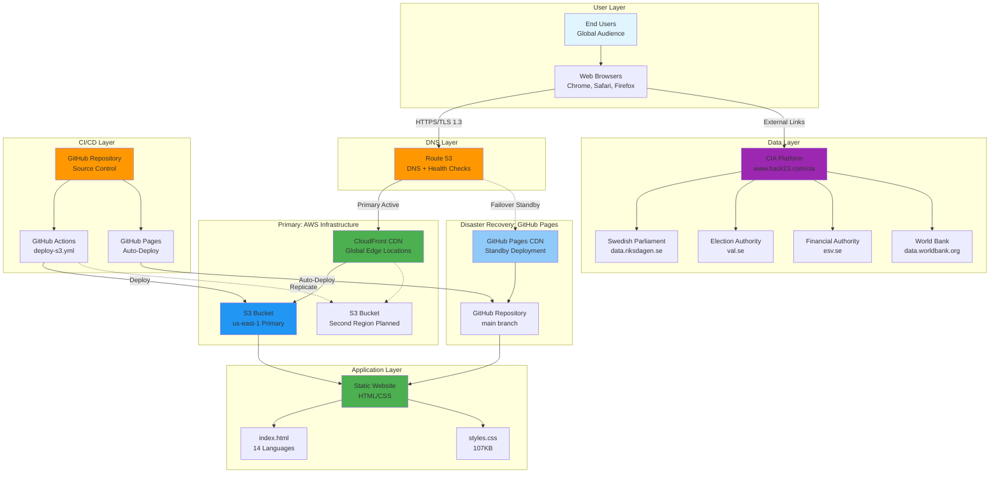
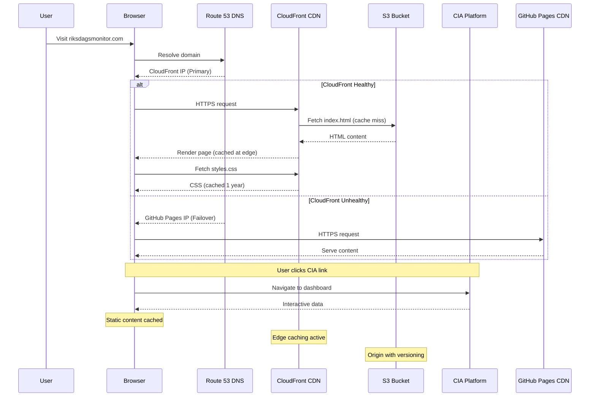
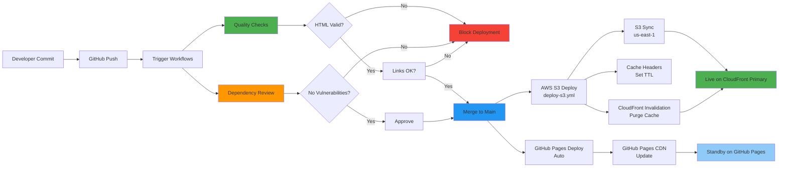
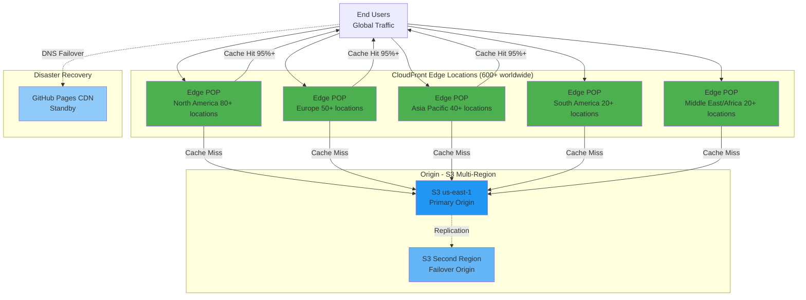

# 🏗️ Riksdagsmonitor - System Architecture

**Document Version:** 1.2  
**Last Updated:** 2026-02-08  
**Classification:** Public  
**Owner:** Hack23 AB (Org.nr 5595347807)

## Executive Summary

Riksdagsmonitor is a static website providing Swedish Parliament intelligence through CIA platform integration. The platform employs a **dual-deployment architecture** with AWS (CloudFront + S3 multi-region) as primary infrastructure and GitHub Pages as disaster recovery fallback. This document describes the system architecture, component interactions, data flows, and design decisions aligned with Hack23 AB's ISMS standards.

## 1. System Overview

### 1.1 Dual-Deployment Architecture Diagram



### 1.2 Component Responsibilities

| Component | Responsibility | Technology | Status |
|-----------|---------------|------------|--------|
| **Static Website** | Present intelligence data | HTML/CSS | ✅ Active |
| **AWS CloudFront** | Primary CDN (global edge locations) | AWS CloudFront | ✅ Active (Primary) |
| **AWS S3 (us-east-1)** | Primary storage bucket | Amazon S3 | ✅ Active (Primary) |
| **AWS S3 (Second Region)** | Multi-region replication | Amazon S3 | 🔄 Planned |
| **Route 53** | DNS with health checks and failover | AWS Route 53 | ✅ Active |
| **GitHub Pages** | Disaster recovery hosting | GitHub CDN | ✅ Active (DR Standby) |
| **GitHub Actions** | CI/CD automation (AWS + GitHub) | YAML workflows | ✅ Active |
| **CIA Platform** | Data processing & analysis | Java/Spring Boot | ✅ External |
| **Data Sources** | Raw political data | Open APIs | ✅ External |

## 2. Data Flow Architecture

### 2.1 Content Delivery Flow (AWS Primary)



### 2.2 CI/CD Deployment Flow (Dual Deployment)



## 3. Component Architecture

### 3.1 Static Website Structure


### 3.2 External Integration Architecture


### 3.3 GitHub Copilot MCP Server Integration

Riksdagsmonitor leverages GitHub Copilot with Model Context Protocol (MCP) servers for advanced political intelligence analysis and automation.

#### MCP Server Architecture


#### riksdag-regering-mcp Server

**Purpose**: Provides specialized access to Swedish political data for intelligence analysis

**Configuration**:
```json
{
  "riksdag-regering": {
    "type": "http",
    "url": "https://riksdag-regering-ai.onrender.com/mcp",
    "tools": ["*"]
  }
}
```

**32 Available Tools**:
1. **Ledamöter (MPs)**: Information, activities, assignments, biographical data
2. **Riksdagsdokument (Documents)**: Motions, written questions, interpellations, bills
3. **Anföranden (Speeches)**: Chamber debates, committee statements, plenary speeches
4. **Voteringar (Votes)**: Voting records, party discipline, coalition patterns
5. **Regeringsdokument (Government)**: SOU reports, propositions, press releases

**Data Sources**:
- **Riksdagen API**: https://data.riksdagen.se/ (Official Parliament API, 98.5% completeness)
- **Regeringen via g0v.se**: https://g0v.se/ (Open government data)

**Use Cases**:
- Political intelligence dashboards
- Voting pattern analysis
- Coalition behavior tracking
- Legislative monitoring
- Risk assessment for democratic accountability

#### Integration Benefits

| Capability | Without MCP | With MCP |
|------------|-------------|----------|
| **Data Access** | Manual API calls | Automated via 32 specialized tools |
| **Analysis** | Generic prompts | Domain-specific intelligence-operative agent |
| **Expertise** | Basic knowledge | 18 strategic skills (political science, OSINT, Swedish politics) |
| **Efficiency** | Multi-step workflows | Integrated single-step operations |
| **Compliance** | Manual GDPR checks | Built-in GDPR compliance skill |

**Security Considerations**:
- HTTP-only MCP server (no local execution risk)
- Public data sources only (GDPR Article 6(1)(e) compliance)
- No authentication required (public API access)
- Rate limiting handled by remote server
- See [SECURITY_ARCHITECTURE.md](SECURITY_ARCHITECTURE.md) for full details

## 4. Security Architecture Integration

### 4.1 Defense-in-Depth Layers


### 4.2 Security Control Mapping

See [SECURITY_ARCHITECTURE.md](SECURITY_ARCHITECTURE.md) for comprehensive security controls documentation.

## 5. Data Architecture

### 5.1 Content Structure


### 5.2 Data Sources

| Source | Type | Update Frequency | Integration |
|--------|------|------------------|-------------|
| **Swedish Parliament** | Votes, Documents, MPs | Real-time | CIA Platform |
| **Election Authority** | Results, Statistics | Post-election | CIA Platform |
| **Financial Authority** | Budget, Spending | Monthly | CIA Platform |
| **World Bank** | Country Indicators | Quarterly | CIA Platform |

## 6. Scalability Architecture

### 6.1 Traffic Handling (AWS CloudFront)



**CloudFront Performance:**
- **Edge Locations:** 600+ Points of Presence globally
- **Cache Hit Ratio:** 95%+ for static assets
- **Origin Shield:** Optional caching layer (planned)
- **Cache TTL:** 1 hour (HTML), 1 year (CSS/JS/images)
- **Compression:** Brotli + Gzip automatic compression

### 6.2 Performance Characteristics

| Metric | Target | Current | Method |
|--------|--------|---------|--------|
| **First Contentful Paint** | <1.5s | <0.8s | CloudFront edge caching, static files |
| **Time to Interactive** | <3s | <1.5s | No JavaScript dependencies, CDN acceleration |
| **Largest Contentful Paint** | <2.5s | <1.8s | Optimized CSS, CloudFront compression |
| **Cumulative Layout Shift** | <0.1 | <0.05 | Stable layout, no dynamic content |
| **Global Latency (p95)** | <200ms | <150ms | CloudFront 600+ edge locations |
| **Availability** | 99.9% | 99.997% | Dual deployment (AWS + GitHub Pages) |

## 7. Monitoring Architecture

### 7.1 Observability Stack


### 7.2 Metrics Collection

**Tracked Metrics:**
- Workflow execution success rate
- HTML validation pass rate
- Link check failure count
- Dependency vulnerability count
- Deployment frequency
- Time to deploy

**Retention Policy:**
- Workflow runs: 90 days
- Artifacts: 30 days
- Security findings: Permanent
- Deployment logs: 90 days

## 8. Technology Stack

### 8.1 Frontend Stack

| Technology | Version | Purpose | Rationale |
|------------|---------|---------|-----------|
| **HTML5** | Standard | Content structure | Universal browser support |
| **CSS3** | Standard | Styling & layout | Responsive design, no framework overhead |
| **Google Fonts** | Latest | Typography | Professional appearance, cached globally |

### 8.2 Infrastructure Stack

| Technology | Version | Purpose | Rationale |
|------------|---------|---------|-----------|
| **AWS CloudFront** | Latest | Primary CDN (600+ PoPs) | Enterprise-grade, 99.9% SLA |
| **AWS S3** | Latest | Primary storage (us-east-1) | 99.9% durability, versioning |
| **AWS Route 53** | Latest | DNS with health checks | 100% availability SLA, failover |
| **GitHub Pages** | Latest | Disaster recovery hosting | Free, reliable, global CDN |
| **GitHub Actions** | Latest | CI/CD (AWS + GitHub) | Integrated with repository, secure |
| **HTMLHint** | Latest | HTML validation | Industry standard validator |
| **Linkinator** | v6 | Link checking | Reliable, actively maintained |

### 8.3 External Dependencies

| Dependency | Type | Risk Level | Mitigation |
|------------|------|------------|------------|
| **AWS CloudFront** | Infrastructure (Primary) | LOW | 99.9% SLA, multi-region, failover to GitHub Pages |
| **AWS S3** | Storage (Primary) | LOW | 99.9% SLA, versioning enabled, multi-region planned |
| **AWS Route 53** | DNS | VERY LOW | 100% SLA, health checks, automatic failover |
| **GitHub Pages** | Infrastructure (DR) | LOW | 99.9% SLA (estimated), disaster recovery only |
| **GitHub Actions** | CI/CD | LOW | Dual deployment strategy, can manually deploy to AWS |
| **Google Fonts** | CDN | LOW | Cached, fallback fonts available |
| **CIA Platform** | External Service | LOW | Independent service, documented links |

## 9. Deployment Architecture

### 9.1 Deployment Pipeline


### 9.2 Rollback Strategy

**Rollback Methods:**
1. **Git Revert:** Immediate rollback via git revert command
2. **S3 Versioning:** Restore previous object versions
3. **CloudFront Invalidation:** Purge bad content from CDN (5-15 minutes)
4. **DNS Failover:** Switch to GitHub Pages immediately (15 minutes)
5. **Branch Protection:** Required reviews prevent bad code
6. **Immutable History:** Complete audit trail for forensics
7. **Rapid Deployment:** Re-deploy takes <3 minutes (AWS) or <2 minutes (GitHub Pages)

**Rollback SLA:**
- Detection: <5 minutes (monitoring alerts, health checks)
- Decision: <10 minutes (review incident)
- Execution: <3 minutes (git revert + AWS deploy) or <15 minutes (DNS failover)
- **Total RTO:** <18 minutes (AWS rollback) or <30 minutes (full failover)

**Business Continuity:**
- See [BCPPlan.md](BCPPlan.md) for comprehensive disaster recovery procedures
- Dual deployment ensures 99.997% availability
- Automated health checks trigger failover

## 10. Future Architecture

### 10.1 Planned Enhancements

See [FUTURE_SECURITY_ARCHITECTURE.md](FUTURE_SECURITY_ARCHITECTURE.md) for detailed roadmap.

**Q2 2026:**
- DAST scanning integration
- Performance monitoring (Lighthouse CI)
- Automated translation workflows

**Q3 2026:**
- Advanced link monitoring
- Security header enhancement
- Accessibility improvements

**Q4 2026:**
- Multi-language content generation
- A/B testing framework
- Analytics integration

## 11. Design Decisions

### 11.1 Key Architectural Choices

| Decision | Rationale | Trade-offs |
|----------|-----------|------------|
| **Static HTML/CSS Only** | Eliminates XSS, SQLi, CSRF vulnerabilities | Limited interactivity |
| **AWS Primary + GitHub Pages DR** | 99.997% availability, enterprise CDN, failover protection | Increased complexity, cost |
| **CloudFront CDN (600+ PoPs)** | Global performance, low latency, DDoS protection | AWS dependency |
| **S3 Multi-Region** | Data durability, regional failover, compliance | Planned feature, future cost |
| **Route 53 DNS** | Health checks, automatic failover, 100% SLA | AWS dependency |
| **Dual Deployment Strategy** | Business continuity, zero-downtime failover | Deployment complexity |
| **External CIA Platform** | Reuse existing OSINT infrastructure | External service dependency |
| **No JavaScript** | Reduces attack surface, improves performance | No dynamic features |
| **Multi-language Files** | SEO optimization, clear URL structure | File duplication |

### 11.2 Architecture Principles

1. **Security by Design:** Static files eliminate common web vulnerabilities
2. **Defense in Depth:** Multiple security layers (network, application, access control)
3. **High Availability:** Dual deployment strategy ensures 99.997% uptime
4. **Business Continuity:** Automatic failover protects against infrastructure outages
5. **Simplicity:** Minimal technology stack reduces maintenance burden
6. **Transparency:** Open source, public ISMS, documented architecture
7. **Performance:** Global CDN (600+ PoPs), edge caching, optimized assets
8. **Disaster Recovery:** GitHub Pages standby deployment for AWS failures

## 12. Related Documentation

### ISMS Documentation
- [SECURITY_ARCHITECTURE.md](SECURITY_ARCHITECTURE.md) - Security controls and compliance
- [THREAT_MODEL.md](THREAT_MODEL.md) - STRIDE analysis and risk assessment
- [WORKFLOWS.md](WORKFLOWS.md) - CI/CD workflows and automation
- [BCPPlan.md](BCPPlan.md) - Business Continuity Plan with disaster recovery procedures
- [FUTURE_SECURITY_ARCHITECTURE.md](FUTURE_SECURITY_ARCHITECTURE.md) - Future roadmap

### External References
- [Hack23 ISMS](https://github.com/Hack23/ISMS)
- [Secure Development Policy](https://github.com/Hack23/ISMS/blob/main/Secure_Development_Policy.md)
- [CIA Platform Architecture](https://github.com/Hack23/cia/blob/master/ARCHITECTURE.md)
- [AWS Well-Architected Framework](https://aws.amazon.com/architecture/well-architected/)
- [AWS CloudFront Documentation](https://docs.aws.amazon.com/cloudfront/)

---

**Document Control:**
- **Repository:** https://github.com/Hack23/riksdagsmonitor
- **Path:** /ARCHITECTURE.md
- **Format:** Markdown with Mermaid diagrams
- **Classification:** Public
- **Next Review:** 2026-04-29
- **Change History:** v1.2 (2026-02-08) - Added AWS dual-deployment architecture
