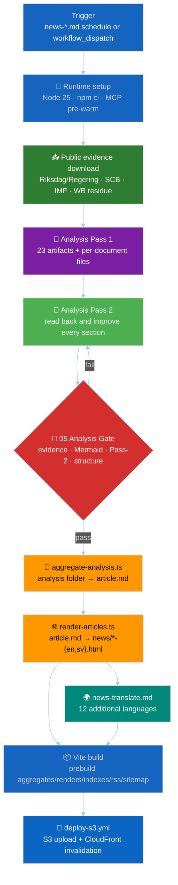
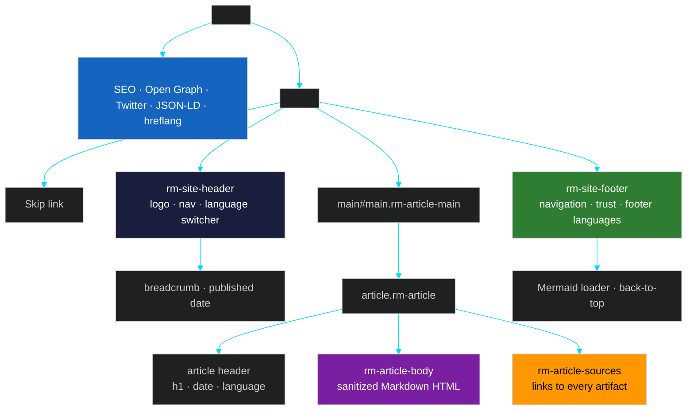
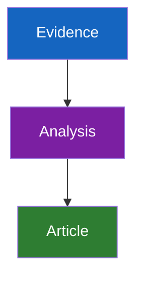
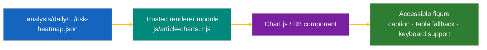
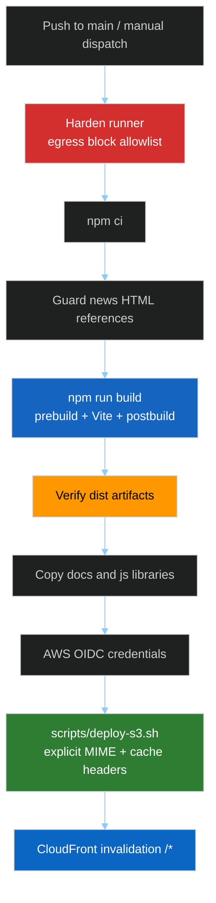

<!-- SPDX-FileCopyrightText: 2026 Hack23 AB -->
<!-- SPDX-License-Identifier: Apache-2.0 -->

<p align="center">
  
</p>

<h1 align="center">📰 Riksdagsmonitor Article Generation</h1>

<p align="center">
  <strong>From public Swedish parliamentary evidence to auditable, multilingual political-intelligence articles</strong><br>
  <em>Agentic workflows · 23-artifact analysis contract · deterministic Markdown aggregation · sanitized HTML rendering · S3/CloudFront deployment</em>
</p>

<p align="center">
  <a href="#"></a>
  <a href="#"></a>
  <a href="#"></a>
  <a href="#"></a>
</p>

**📋 Document Owner:** CEO | **📅 Last Updated:** 2026-04-25 (UTC)  
**🏢 Owner:** Hack23 AB (Org.nr 559534-7807) | **🏷️ Classification:** Public
**Primary example:** [`analysis/daily/2026-04-24/interpellations/article.md`](analysis/daily/2026-04-24/interpellations/article.md) → [`news/2026-04-24-interpellations-en.html`](news/2026-04-24-interpellations-en.html) / [`news/2026-04-24-interpellations-sv.html`](news/2026-04-24-interpellations-sv.html)

---

## 📚 Table of Contents

- [🎯 Executive Summary](#-executive-summary)
- [💼 Purpose, Function, Business Value and Political-Analysis Object](#-purpose-function-business-value-and-political-analysis-object)
- [🧭 End-to-End Generation Map](#-end-to-end-generation-map)
- [🤖 Agentic Workflow Architecture](#-agentic-workflow-architecture)
- [📥 Data Collection and Evidence Foundation](#-data-collection-and-evidence-foundation)
- [🧠 Analysis Methodologies and Templates](#-analysis-methodologies-and-templates)
- [🚦 Analysis Gate](#-analysis-gate)
- [📝 How `article.md` Is Generated](#-how-articlemd-is-generated)
- [🌐 How `article.md` Becomes HTML](#-how-articlemd-becomes-html)
- [🎨 UI/UX, Mermaid, D3 and Chart.js Support](#-uiux-mermaid-d3-and-chartjs-support)
- [🌍 Language Switchers and Translation Model](#-language-switchers-and-translation-model)
- [🚀 Build and S3 Deployment](#-build-and-s3-deployment)
- [🛡️ Security, Privacy and ISMS Controls](#-security-privacy-and-isms-controls)
- [✅ Operational Checklist](#-operational-checklist)
- [🔗 Source File Index](#-source-file-index)

---

## 🎯 Executive Summary

Riksdagsmonitor articles are **not hand-written HTML pages**. They are deterministic projections of a deeper political-intelligence product:

1. **Agentic workflows** in [`.github/workflows/news-*.md`](.github/workflows/) run on schedules or manual dispatch.
2. The workflow imports bounded prompt modules from [`.github/prompts/`](.github/prompts/README.md).
3. The AI agent collects public Riksdag/Regering data through the `riksdag-regering` MCP server, Swedish statistics through SCB, supplementary governance, environmental, social and education indicators through World Bank, and economic context through the repository IMF TypeScript client.
4. The agent produces a **stable set of 23 core analysis artifacts** plus per-document files under `analysis/daily/$ARTICLE_DATE/$SUBFOLDER/`.
5. The **single blocking gate** in [`.github/prompts/05-analysis-gate.md`](.github/prompts/05-analysis-gate.md) must pass before any article is generated.
6. [`scripts/aggregate-analysis.ts`](scripts/aggregate-analysis.ts) turns the analysis folder into one canonical `article.md`.
7. [`scripts/render-articles.ts`](scripts/render-articles.ts) sanitizes Markdown and wraps it in shared article chrome to create `news/$DATE-$SUBFOLDER-$LANG.html`.
8. Vite builds the static site and [`.github/workflows/deploy-s3.yml`](.github/workflows/deploy-s3.yml) publishes `dist/` to S3 + CloudFront.

The result is a transparent political-intelligence article where every claim remains traceable to source artifacts, every source artifact remains traceable to public evidence, and the HTML page carries machine-readable provenance through JSON-LD `NewsArticle.isBasedOn`.

**Current publication principle:** the AI writes analysis artifacts, not final HTML. Scripts own aggregation, sanitization, chrome, SEO, language alternates, source footers and deployment behavior. This separation is what makes the system auditable.

---

## 💼 Purpose, Function, Business Value and Political-Analysis Object

### Purpose

The article-generation pipeline exists to **turn Swedish public parliamentary events into rigorous, auditable, citizen-facing intelligence**. It supports the Riksdagsmonitor mission from [README.md](README.md): systematic transparency over Swedish Riksdag activity, coalition dynamics, voting patterns, and public accountability.

### Function

| Layer | Function | Primary files |
|---|---|---|
| **Collection** | Fetch public parliamentary, government, statistical and economic evidence | `.github/prompts/03-data-download.md`, `scripts/download-parliamentary-data.ts`, `scripts/imf-fetch.ts` |
| **Analysis** | Produce structured OSINT/INTOP assessments with evidence, uncertainty and color-coded Mermaid | `analysis/methodologies/`, `analysis/templates/`, `.github/prompts/04-analysis-pipeline.md` |
| **Gate** | Enforce artifact presence, evidence quality, Mermaid coverage and Pass-2 improvement | `.github/prompts/05-analysis-gate.md` |
| **Aggregation** | Convert the folder of analysis artifacts into canonical `article.md` | `scripts/aggregate-analysis.ts`, `scripts/render-lib/aggregator.ts` |
| **Rendering** | Sanitize Markdown and build complete article HTML with SEO, language switcher and source footer | `scripts/render-articles.ts`, `scripts/render-lib/markdown.ts`, `article.ts`, `chrome.ts` |
| **Publishing** | Build static assets and deploy with correct MIME types, cache headers and CloudFront invalidation | `package.json`, `vite.config.js`, `.github/workflows/deploy-s3.yml`, `scripts/deploy-s3.sh` |

### Business Value

| Value area | How article generation contributes |
|---|---|
| **Trust enhancement** | Every article is backed by visible source files and primary-source links. |
| **Competitive advantage** | Riksdagsmonitor combines official Swedish political data with structured intelligence techniques (DIW, ACH, SWOT, risk, threat, stakeholder, scenario and forward-indicator analysis). |
| **Operational excellence** | Deterministic scripts (`aggregate-analysis.ts`, `render-articles.ts`) make publication repeatable, testable and auditable. |
| **Reputational protection** | AI-generated political text is gated by evidence standards, source diversity, neutral language and human-reviewable PRs. |
| **Democratic accountability** | Citizens can inspect the same source artifacts used to produce the public article. |

### Political-analysis object

An article is the **dissemination layer** of an analysis object. The primary analytical object is the folder:

```text
analysis/daily/$ARTICLE_DATE/$SUBFOLDER/
```

For the example run:

```text
analysis/daily/2026-04-24/interpellations/
```

This folder contains the full political-intelligence object:

- 23 mandatory core artifacts.
- Per-document analysis files under `documents/`.
- Optional supplementary files.
- The generated canonical `article.md`.
- Supporting JSON chart/economic/provenance files when applicable.

The article is therefore a **rendered view of the intelligence object**, not the source of record.

---

## 🧭 End-to-End Generation Map



---

## 🤖 Agentic Workflow Architecture

### Workflow sources

The news workflows are Markdown-based GitHub Agentic Workflows. The interpellation example is:

- [`.github/workflows/news-interpellations.md`](.github/workflows/news-interpellations.md)

It declares:

| Concern | Current configuration |
|---|---|
| **Name** | `News: Interpellation Debates` |
| **Schedule** | Daily around 07:00 on weekdays |
| **Manual inputs** | `article_date`, `force_generation`, `languages`, `analysis_depth` |
| **Runtime** | Node.js `25` |
| **Engine** | Copilot with `claude-opus-4.7` |
| **Permissions** | Read-only content/issues/PR/actions/discussions/security-events for AI job |
| **MCP gateway** | Enabled |
| **Safe outputs** | One PR max, labels `agentic-news`, `analysis-data`, one translation dispatch max |
| **Core output** | `analysis/daily/$ARTICLE_DATE/interpellations/article.md` and `news/$ARTICLE_DATE-interpellations-{en,sv}.html` |

### Imported prompt modules

Every content workflow imports the bounded-context prompt library:

| Import | Responsibility |
|---|---|
| [`00-base-contract.md`](.github/prompts/00-base-contract.md) | Role, ethics, GDPR/ISMS, AI-FIRST, session and PR boundaries |
| [`01-bash-and-shell-safety.md`](.github/prompts/01-bash-and-shell-safety.md) | Safe shell patterns and command discipline |
| [`02-mcp-access.md`](.github/prompts/02-mcp-access.md) | MCP inventory and health gates |
| [`03-data-download.md`](.github/prompts/03-data-download.md) | Data download and manifest rules |
| [`04-analysis-pipeline.md`](.github/prompts/04-analysis-pipeline.md) | 23-artifact production and Pass 1/Pass 2 methodology |
| [`05-analysis-gate.md`](.github/prompts/05-analysis-gate.md) | Single blocking gate before article generation |
| [`06-article-generation.md`](.github/prompts/06-article-generation.md) | Aggregate + render contract |
| [`07-commit-and-pr.md`](.github/prompts/07-commit-and-pr.md) | Stage, commit and exactly one PR |

### Workflow time budget

The interpellation workflow documents a compressed single-run budget:

| Window | Phase |
|---:|---|
| 0–2 min | MCP pre-warm and network diagnostics |
| 2–5 min | Download data and catalogue source documents |
| 5–15 min | Analysis Pass 1, all 23 artifacts plus per-document files |
| 15–21 min | Analysis Pass 2, read back and improve |
| 21–22 min | Analysis gate |
| 22–24 min | Aggregate `article.md` and render EN/SV HTML |
| 24–28 min | Stage, commit and create exactly one PR |

This budget exists because the `safeoutputs` MCP session may expire after approximately 30–35 minutes of idle time. The workflow explicitly prefers **scope compression over skipping Pass 2**.

### Agentic security model

```mermaid
%%{init: {"theme":"dark","themeVariables":{"primaryColor":"#0A66C2","primaryTextColor":"#ffffff","primaryBorderColor":"#003B73","lineColor":"#00D9FF","secondaryColor":"#1A1E3D","tertiaryColor":"#FFBE0B","tertiaryTextColor":"#000000","errorBkgColor":"#D32F2F","fontFamily":"Inter, Helvetica, Arial, sans-serif"}}}%%
flowchart LR
    I["Untrusted public inputs<br/>Riksdag docs · speeches · webpages"] --> S["System prompt + modules<br/>ethical and evidence rules"]
    S --> R["Read-only AI job<br/>limited GitHub permissions"]
    R --> T["Allowed tools<br/>MCP · bash · GitHub read"]
    T --> O["Structured outputs<br/>analysis artifacts + safe PR request"]
    O --> V["Gate + review surface<br/>analysis gate · PR diff · CI"]
    V --> P["Published static site<br/>S3/CloudFront · GitHub Pages DR"]

    style I fill:#D32F2F,color:#ffffff
    style S fill:#1565C0,color:#ffffff
    style R fill:#2E7D32,color:#ffffff
    style T fill:#7B1FA2,color:#ffffff
    style O fill:#FF9800,color:#000000
    style V fill:#FFC107,color:#000000
    style P fill:#0A66C2,color:#ffffff
```



---

## 📥 Data Collection and Evidence Foundation

### Data providers

| Provider | Use in article generation | Interface |
|---|---|---|
| **Riksdag/Regering MCP** | MPs, documents, speeches, votes, interpellations, propositions, motions, committee reports, government documents | `.github/copilot-mcp.json` + workflow `mcp-servers` |
| **SCB** | Swedish-specific statistics and demographic context | `@jarib/pxweb-mcp@2.0.0` |
| **IMF** | Primary economic/fiscal/monetary/external-sector/trade context | `tsx scripts/imf-fetch.ts` + `scripts/imf-client.ts` |
| **World Bank** | Non-economic residue only: governance, environment, social/education, defence historicals, crime | `worldbank-mcp@1.0.1` |
| **GitHub** | PR creation and repository metadata | GitHub MCP / safe outputs |

The authoritative IMF-first / World-Bank-residue split is defined in [`.github/aw/ECONOMIC_DATA_CONTRACT.md`](.github/aw/ECONOMIC_DATA_CONTRACT.md). In short: macroeconomic, fiscal, monetary, external-sector and trade claims are IMF-first; World Bank is reserved for governance, environment and other non-economic residue that IMF does not publish.

### Evidence standard

Every analytical claim must tie to at least one of:

- A real `dok_id` such as `HD10447`.
- A named MP, minister, party, committee or actor.
- Vote counts or voting records.
- A primary-source URL from `riksdagen.se`, `regeringen.se`, `scb.se`, IMF or World Bank non-economic endpoints.

The sample interpellation article demonstrates this standard:

| Claim type | Example in `2026-04-24/interpellations/article.md` |
|---|---|
| `dok_id` | `HD10447` links to `https://data.riksdagen.se/dokument/HD10447.html` |
| Named actors | Patrik Lundqvist (S), Ebba Busch (KD), Elisabeth Svantesson (M) |
| Count | `12 of 16` interpellations in the HD10428–HD10447 window were S-filed |
| Forward trigger | Ministerial answer window `2026-05-07` |
| Confidence | MEDIUM / HIGH / LOW-MEDIUM labels and Admiralty `A2` markers |

---

## 🧠 Analysis Methodologies and Templates

### Canonical methodology set

Article generation is governed by:

- [`analysis/methodologies/artifact-catalog.md`](analysis/methodologies/artifact-catalog.md)
- [`analysis/methodologies/per-artifact-methodologies.md`](analysis/methodologies/per-artifact-methodologies.md)
- [`analysis/methodologies/ai-driven-analysis-guide.md`](analysis/methodologies/ai-driven-analysis-guide.md)
- [`analysis/methodologies/political-style-guide.md`](analysis/methodologies/political-style-guide.md)
- [`analysis/methodologies/osint-tradecraft-standards.md`](analysis/methodologies/osint-tradecraft-standards.md)
- Supporting methods for classification, SWOT, risk, threat, synthesis, structural metadata, strategic extensions, electoral/domain analysis and per-document analysis.

### AI-FIRST two-pass rule

The pipeline requires at least two complete iterations:

| Pass | Required work | Quality effect |
|---|---|---|
| **Pass 1 — Create** | Produce all 23 core artifacts and all per-document files. | Establishes coverage and first analytical structure. |
| **Snapshot** | Save Pass-1 drafts under `pass1/` for gate evidence. | Provides proof that Pass 2 changed the analysis. |
| **Pass 2 — Improve** | Read every Pass-1 file back completely and strengthen evidence, diagrams, uncertainty, stakeholders and forward indicators. | Converts shallow first drafts into publication-quality intelligence. |

The aggregator deliberately strips trailing `Pass 2` process sections from public articles, so Pass-2 improvements must be integrated into the actual analytical sections.

### Always-produced core artifacts

Every content workflow produces the same 23 artifacts under `analysis/daily/$ARTICLE_DATE/$SUBFOLDER/`.

```mermaid
%%{init: {"theme":"dark","themeVariables":{"primaryColor":"#7B1FA2","primaryTextColor":"#ffffff","primaryBorderColor":"#4A148C","lineColor":"#FFBE0B","secondaryColor":"#1565C0","secondaryTextColor":"#ffffff","tertiaryColor":"#2E7D32","tertiaryTextColor":"#ffffff","fontFamily":"Inter, Helvetica, Arial, sans-serif"}}}%%
flowchart TB
    subgraph A["📘 Family A — Core Synthesis (9)"]
        A1[README.md]
        A2[executive-brief.md]
        A3[synthesis-summary.md]
        A4[significance-scoring.md]
        A5[classification-results.md]
        A6[swot-analysis.md]
        A7[risk-assessment.md]
        A8[threat-analysis.md]
        A9[stakeholder-perspectives.md]
    end
    subgraph B["📗 Family B — Structural Metadata (2)"]
        B1[data-download-manifest.md]
        B2[cross-reference-map.md]
    end
    subgraph C["📙 Family C — Strategic Extensions (5)"]
        C1[scenario-analysis.md]
        C2[comparative-international.md]
        C3[devils-advocate.md]
        C4[intelligence-assessment.md]
        C5[methodology-reflection.md]
    end
    subgraph D["📕 Family D — Electoral & Domain Lenses (7)"]
        D1[election-2026-analysis.md]
        D2[voter-segmentation.md]
        D3[coalition-mathematics.md]
        D4[historical-parallels.md]
        D5[media-framing-analysis.md]
        D6[implementation-feasibility.md]
        D7[forward-indicators.md]
    end
    subgraph E["📒 Family E — Per document"]
        E1[documents/{dok_id}-analysis.md]
    end
    A --> G["🚦 Analysis Gate"]
    B --> G
    C --> G
    D --> G
    E --> G

    style A fill:#7B1FA2,color:#ffffff
    style B fill:#1565C0,color:#ffffff
    style C fill:#FF9800,color:#000000
    style D fill:#2E7D32,color:#ffffff
    style E fill:#00897B,color:#ffffff
    style G fill:#D32F2F,color:#ffffff
```

### Template-to-artifact mapping

| Artifact | Role in eventual article |
|---|---|
| `executive-brief.md` | Supplies article title, meta description, BLUF, supported decisions, top trigger and lead visual. |
| `synthesis-summary.md` | Sets lead story, DIW ranking, narrative frame and article metadata suggestions. |
| `intelligence-assessment.md` | Supplies Key Judgments, PIRs and confidence-bearing intelligence conclusions. |
| `significance-scoring.md` | Provides ranking logic and sensitivity analysis. |
| `stakeholder-perspectives.md` | Names power/interest/position lenses and actor impacts. |
| `swot-analysis.md` | Converts evidence into strategic opportunities, vulnerabilities and TOWS moves. |
| `risk-assessment.md` | Scores electoral, policy, institutional, communication and implementation risks. |
| `threat-analysis.md` | Models political threat vectors, attack trees and manipulation/integrity issues. |
| `documents/{dok_id}-analysis.md` | Gives document-level evidence and detail. |
| `scenario-analysis.md` | Defines possible futures with probabilities and indicators. |
| `forward-indicators.md` | Converts analysis into dated watch items. |
| Family D files | Election, coalition, voter, historical, media and feasibility lenses. |
| `methodology-reflection.md` | Documents uncertainty, limits, neutrality and ICD 203 compliance. |
| `data-download-manifest.md` | Preserves collection transparency and source inventory. |

---

## 🚦 Analysis Gate

The single article-generation gate is [`.github/prompts/05-analysis-gate.md`](.github/prompts/05-analysis-gate.md). If the gate fails, the analysis must be fixed before aggregation.

### Gate checks

| Check | What it protects |
|---|---|
| Artifact existence | Prevents partial articles from incomplete analysis folders. |
| Per-document coverage | Ensures every `dok_id` in the manifest has a corresponding document analysis. |
| No stubs | Blocks `AI_MUST_REPLACE`, `[REQUIRED]`, `TODO:` and placeholder text. |
| Evidence citations | Blocks generic SWOT/ranking claims without `dok_id` or primary URL evidence. |
| Mermaid diagrams | Requires color-coded diagrams in core synthesis and key lens files. |
| Pass-2 evidence | Requires proof that the AI read and improved the first pass. |
| Family C structure | Requires BLUF, decisions, Key Judgments, PIRs, scenarios, ACH hypotheses and ICD 203 audit. |
| Family D structure | Requires dated forward indicators and coalition/seat-count material. |

### Why the gate is before article generation

The HTML article is a pure projection. If the analysis is weak, the article will be weak. The gate therefore enforces quality at the source of truth: the analysis artifacts.

---

## 📝 How `article.md` Is Generated

### Responsible code

| File | Responsibility |
|---|---|
| [`scripts/aggregate-analysis.ts`](scripts/aggregate-analysis.ts) | CLI wrapper for aggregating one folder or all folders. |
| [`scripts/render-lib/aggregator.ts`](scripts/render-lib/aggregator.ts) | Deterministic logic for ordering, cleaning, linking and front matter. |
| [`scripts/render-lib/url-helpers.ts`](scripts/render-lib/url-helpers.ts) | GitHub blob/tree URL construction. |
| [`scripts/render-lib/constants.ts`](scripts/render-lib/constants.ts) | Shared paths, base URLs and language constants. |

### Aggregation command

```bash
npx tsx scripts/aggregate-analysis.ts \
  --date 2026-04-24 \
  --subfolder interpellations
```

For all existing analysis folders:

```bash
npx tsx scripts/aggregate-analysis.ts --all
```

### Aggregator input and output

| Input | Output |
|---|---|
| Canonical analysis `.md` files in `analysis/daily/$ARTICLE_DATE/$SUBFOLDER/` excluding `README.md`, `article.md`, and `article.<lang>.md` | `analysis/daily/$ARTICLE_DATE/$SUBFOLDER/article.md` |
| `analysis/daily/$ARTICLE_DATE/$SUBFOLDER/documents/*.md` | Included under `## Per-document intelligence` |
| Supplementary `.md` files in the subfolder excluding `README.md`, `article.md`, and `article.<lang>.md` | Appended after the canonical sequence |

> **Note:** `README.md` is required for the 23-artifact analysis gate and repository readability, but it is intentionally not aggregated into the published `article.md`. Existing `article.md` and `article.<lang>.md` files are also excluded from aggregation.

### Canonical narrative order

`AGGREGATION_ORDER` in [`scripts/render-lib/aggregator.ts`](scripts/render-lib/aggregator.ts) publishes sections in this order:

1. `executive-brief.md`
2. `synthesis-summary.md`
3. `intelligence-assessment.md`
4. `significance-scoring.md`
5. `stakeholder-perspectives.md`
6. `swot-analysis.md`
7. `risk-assessment.md`
8. `threat-analysis.md`
9. `documents/*-analysis.md` as `## Per-document intelligence`
10. `scenario-analysis.md`
11. `forward-indicators.md`
12. `election-2026-analysis.md`
13. `coalition-mathematics.md`
14. `voter-segmentation.md`
15. `comparative-international.md`
16. `historical-parallels.md`
17. `media-framing-analysis.md`
18. `implementation-feasibility.md`
19. `devils-advocate.md`
20. `classification-results.md`
21. `cross-reference-map.md`
22. `methodology-reflection.md`
23. `data-download-manifest.md`
24. Remaining supplementary `.md` files, alphabetically.

### Cleaning and transformation rules

The aggregator:

- Requires `executive-brief.md`.
- Strips YAML front matter from each artifact.
- Removes the first H1 from each artifact and injects its own consistent `## Section Title` heading.
- Removes leading admin bylines such as `Author`, `Run ID`, `Classification`, `Confidence`, `Prepared by`, `Methodology` and similar metadata fields.
- Removes trailing `Document control`, `Audit trail`, `Generated by`, template footer and `Pass 2` self-audit sections.
- Rewrites relative Markdown links to absolute GitHub blob URLs.
- Keeps Mermaid fences untouched so the renderer can preserve them.
- Builds front matter with `title`, `description`, `date`, `subfolder`, `slug`, `source_folder`, `generated_at`, `language` and `layout`.

### Title and description extraction

`article.md` metadata comes from `executive-brief.md`:

| Metadata field | Source logic |
|---|---|
| `title` | First H1 in `executive-brief.md`, cleaned of boilerplate/date; fallback to BLUF-derived title; fallback to `$SUBFOLDER — $DATE`. |
| `description` | Prefer the first paragraph after a `BLUF` heading; fallback to first prose paragraph; sentence-aware truncation. |
| `slug` | `$ARTICLE_DATE-$SUBFOLDER`. |
| `source_folder` | `analysis/daily/$ARTICLE_DATE/$SUBFOLDER`. |

### Example output: `2026-04-24/interpellations/article.md`

The sample file begins with:

```yaml
---
title: "Interpellation Debates"
description: "A single new interpellation ([HD10447](https://data.riksdagen.se/dokument/HD10447.html), S) was announced today, forcing Energy- och näringsminister Ebba Busch (KD) to defend the 2024 abolition of…"
date: 2026-04-24
subfolder: interpellations
slug: 2026-04-24-interpellations
source_folder: analysis/daily/2026-04-24/interpellations
generated_at: 2026-04-24T18:27:52.276Z
language: en
layout: article
---
```

It then emits deterministic sections such as `## Executive Brief`, `## Synthesis Summary`, `## Intelligence Assessment — Key Judgments`, `## Significance Scoring`, and so on. Each section includes a source attribution line like:

```markdown
_Source: [`executive-brief.md`](https://github.com/Hack23/riksdagsmonitor/blob/main/analysis/daily/2026-04-24/interpellations/executive-brief.md)_
```

---

## 🌐 How `article.md` Becomes HTML

### Responsible code

| File | Responsibility |
|---|---|
| [`scripts/render-articles.ts`](scripts/render-articles.ts) | CLI wrapper that locates `article.md`, auto-aggregates if needed, and renders target languages. |
| [`scripts/render-lib/markdown.ts`](scripts/render-lib/markdown.ts) | Markdown → sanitized HTML pipeline. |
| [`scripts/render-lib/article.ts`](scripts/render-lib/article.ts) | Parses front matter, renders body, builds JSON-LD and source footer. |
| [`scripts/render-lib/chrome.ts`](scripts/render-lib/chrome.ts) | Shared HTML head/header/footer, language switcher, SEO and compliance links. |

### Render command

```bash
npx tsx scripts/render-articles.ts \
  --date 2026-04-24 \
  --subfolder interpellations \
  --lang en,sv
```

For all existing articles:

```bash
npx tsx scripts/render-articles.ts --all --lang en,sv
```

### Markdown pipeline

[`scripts/render-lib/markdown.ts`](scripts/render-lib/markdown.ts) processes article Markdown through:

1. `remark-parse`
2. `remark-gfm`
3. `remark-rehype` with controlled raw HTML handling
4. `rehype-raw`
5. `rehype-slug`
6. `rehype-autolink-headings`
7. `rehype-sanitize`
8. `rehype-stringify`

The sanitizer deliberately allows only the extra attributes needed for Mermaid blocks and heading anchors. It does **not** allow inline `<script>`, `javascript:` URLs, `<iframe>` or arbitrary `<style>` tags.

### HTML output

For the example article:

```text
news/2026-04-24-interpellations-en.html
news/2026-04-24-interpellations-sv.html
```

The renderer writes one complete HTML file per requested language.

### HTML page structure



### SEO and provenance

The renderer embeds:

| SEO/provenance element | Current implementation |
|---|---|
| `<title>` | Article title plus `— Riksdagsmonitor` unless already branded. |
| Meta description | `article.md` front matter description. |
| Canonical URL | `https://riksdagsmonitor.com/news/$DATE-$SUB-$LANG.html`. |
| Hreflang | All 14 supported language alternates plus `x-default`. |
| Open Graph | `og:type=article`, title, description, URL, locale, image and update timestamp. |
| Twitter card | Summary large image metadata. |
| JSON-LD | `NewsArticle` with `isBasedOn` listing every `.md` / `.json` source artifact. |
| Source footer | Visible `Analysis sources` section linking artifacts to GitHub. |

---

## 🎨 UI/UX, Mermaid, D3 and Chart.js Support

### Shared article chrome

Generated article pages use a dedicated `rm-*` CSS namespace to avoid collisions with legacy page components. The main styling is in [`styles.css`](styles.css) under `Article Pipeline — chrome produced by scripts/render-lib/buildChrome`.

| UI element | CSS / HTML support |
|---|---|
| Sticky header | `.rm-site-header`, `.rm-site-header-inner` |
| Brand and tagline | `.rm-logo`, `.rm-logo-text`, `.rm-logo-brand`, `.rm-logo-tagline` |
| Primary navigation | `.rm-site-nav` |
| Header language switcher | `<details class="rm-lang-switcher">` + `.rm-lang-switcher-dropdown` |
| Breadcrumb | `.rm-breadcrumb` inside `.rm-site-subnav` |
| Article container | `.rm-article-main`, `.rm-article`, `.rm-article-header`, `.rm-article-body` |
| Source provenance footer | `.rm-article-sources`, `.rm-article-sources-list` |
| Site footer | `.rm-site-footer`, `.rm-site-footer-inner`, `.rm-footer-*` |
| Footer language row | `.rm-footer-langs`, `.rm-lang-code` |

### Light and dark mode

The repository uses CSS custom properties for light and dark color palettes:

- `:root` defines the default light-mode accessible palette.
- `@media (prefers-color-scheme: dark)` defines dark-mode tokens.
- `html[data-theme="light"]` overrides generated article chrome to keep article pages readable in explicit light mode.
- `html[data-theme="dark"]` is supported by the site-wide theme bootstrap and dashboard pages.

Article chrome uses cyberpunk tokens such as:

| Token | Typical purpose |
|---|---|
| `--primary-cyan` / fallback `#00d9ff` | Article headings, links and borders. |
| `--primary-magenta` / fallback `#ff006e` | Hover state and emphasis. |
| `--primary-yellow` / fallback `#ffbe0b` | Section headings and source blocks. |
| `--dark-bg` / fallback `#0a0e27` | Article page background. |
| `--mid-bg` / fallback `#1a1e3d` | Cards, headers and footer. |
| `--light-text` / fallback `#e0e0e0` | Body text in dark mode. |

### Mermaid support

Mermaid diagrams are authored directly inside analysis artifacts:

````markdown

````

The rendering path is:

1. Markdown contains ```` ```mermaid ```` fences.
2. [`scripts/render-lib/markdown.ts`](scripts/render-lib/markdown.ts) rewrites them to `<pre class="mermaid">` before Markdown parsing.
3. `rehype-sanitize` allows the `pre.mermaid` class.
4. [`scripts/render-lib/chrome.ts`](scripts/render-lib/chrome.ts) includes `js/lib/mermaid-init.mjs`.
5. [`js/lib/mermaid-init.mjs`](js/lib/mermaid-init.mjs) dynamically imports Mermaid `11.4.1` from jsDelivr, initializes a dark theme and renders all Mermaid blocks after page load.

The analysis gate requires color-coded Mermaid through `style` directives or Mermaid `themeVariables` / `%%{init}` blocks.

### D3 and Chart.js support

Current article Markdown rendering is intentionally static and sanitized. D3 and Chart.js are supported by the broader site and dashboards, not by arbitrary inline article scripts.

| Capability | Current support |
|---|---|
| **Chart.js package** | Listed in `package.json` and optimized in `vite.config.js`. |
| **D3 package** | Listed in `package.json` and split into a Vite `d3` manual chunk. |
| **Dashboard modules** | `scripts/coalition-dashboard/*`, `scripts/committees-dashboard/*` and shared chart utilities support interactive dashboards. |
| **Article chart data** | `04-analysis-pipeline.md` permits JSON files such as `vote-distribution.json`, `risk-heatmap.json`, `coalition-math.json`, `forward-indicators.json`, and economic chart data. |
| **Article HTML safety** | Sanitizer blocks inline scripts. Any future article-level Chart.js/D3 visualization should be implemented as trusted site code that reads artifact JSON, not AI-authored inline JS. |

**Important limitation:** generated news articles today automatically render Mermaid diagrams and static Markdown tables. They do not automatically instantiate arbitrary D3/Chart.js widgets from Markdown because that would require trusting AI-authored script markup. The supported secure pattern is artifact JSON + trusted site module + accessible fallback.

Recommended future pattern for article-level interactive charts:



This preserves CSP and sanitizer discipline while enabling richer visualizations.

---

## 🌍 Language Switchers and Translation Model

### Supported languages

The rendered article chrome supports 14 language alternates:

| Code in URLs | Hreflang | Language |
|---|---|---|
| `en` | `en` | English |
| `sv` | `sv` | Swedish |
| `da` | `da` | Danish |
| `no` | `nb` | Norwegian Bokmål — URLs currently use legacy `no`; hreflang already uses BCP-47 `nb`. |
| `fi` | `fi` | Finnish |
| `de` | `de` | German |
| `fr` | `fr` | French |
| `es` | `es` | Spanish |
| `nl` | `nl` | Dutch |
| `ar` | `ar` | Arabic, RTL |
| `he` | `he` | Hebrew, RTL |
| `ja` | `ja` | Japanese |
| `ko` | `ko` | Korean |
| `zh` | `zh` | Chinese |

Norwegian is in a compatibility migration state, not a permanent language-code design decision: generated HTML uses the BCP-47 `nb` hreflang for Norwegian Bokmål, while existing filenames and URL siblings still use the legacy `_no` / `-no.html` pattern for backwards-compatible site output. New code should keep both surfaces in sync until the wider URL migration is completed.

### Translation workflow

Per-type content workflows render only core languages, normally `en,sv`. The dedicated translation workflow is:

- [`.github/workflows/news-translate.md`](.github/workflows/news-translate.md)

It consumes already-rendered English/Swedish articles and produces the remaining 12 language variants. This separation prevents every content workflow from trying to translate all languages under the same time and safe-output budget.

### Language UI

The article chrome emits two switchers:

1. **Header dropdown** — `<details class="rm-lang-switcher">` with `role="menuitem"` links.
2. **Footer language row** — `.rm-footer-langs`, always visible for discoverability.

The renderer populates hreflang alternates for all languages even when the sibling translated pages are not yet generated. The URLs remain stable and predictable for the translation workflow.

---

## 🚀 Build and S3 Deployment

### Canonical S3 deployment workflow

The canonical repository file is [`.github/workflows/deploy-s3.yml`](.github/workflows/deploy-s3.yml). This is the S3 deployment workflow covered here.

### Build chain

[`package.json`](package.json) defines the build pipeline:

```json
"prebuild": "npx tsx scripts/aggregate-analysis.ts --all --quiet && npx tsx scripts/render-articles.ts --all --lang en,sv --quiet && npx tsx scripts/generate-news-indexes/index.ts && npx tsx scripts/extract-news-metadata.ts && npx tsx scripts/generate-sitemap-html.ts && npx tsx scripts/generate-political-intelligence.ts && npx tsx scripts/generate-rss.ts && npx tsx scripts/generate-sitemap.ts",
"build": "vite build",
"postbuild": "cp rss.xml dist/rss.xml && cp sitemap.xml dist/sitemap.xml && cp -r cia-data dist/cia-data"
```

This means `npm run build` regenerates all aggregate/render/index/metadata outputs before Vite compiles the site.

### Vite article discovery

[`vite.config.js`](vite.config.js) auto-discovers article HTML files under `news/`:

- It scans `news/` recursively.
- It registers every non-index `.html` article as a Rollup input.
- It ensures new articles are included in `dist/news/` and deployed to S3.
- It splits Chart.js, D3 and PapaParse into manual chunks for dashboard optimization.
- It uses `vite-plugin-sri-gen` to generate Subresource Integrity hashes.

### `deploy-s3.yml` jobs

| Job | Trigger | Purpose |
|---|---|---|
| `deploy` | Push to `main` or manual dispatch with `fix_mimetypes=false` | Build and publish the site. |
| `fix-mimetypes` | Manual dispatch with `fix_mimetypes=true` | Repair MIME metadata on existing S3 objects without a full build/deploy. |

### Deployment workflow steps

The `deploy` job performs:

1. `step-security/harden-runner` with egress policy `block` and explicit allowed endpoints.
2. Full checkout with `fetch-depth: 0`.
3. Node.js 25 setup with npm cache.
4. `npm ci`.
5. Guard against broken news article references:
   - No `back-to-top.ts` references in generated article HTML.
   - No `news-article.js` references.
   - No absolute `/js/lib/` script paths in news pages.
6. `npm run build`.
7. Build artifact verification:
   - `dist/`
   - `dist/index.html`
   - `dist/rss.xml`
   - `dist/sitemap.xml`
   - `dist/sitemap.html`
   - representative localized sitemaps (`sitemap_sv.html`, `sitemap_ar.html`)
   - political-intelligence pages in EN/SV/AR representative set
   - `dist/news/`
8. Copy `docs/` to `dist/docs/` if present.
9. Merge `js/` into `dist/js/` so article dependencies such as Mermaid init and back-to-top are present.
10. Configure AWS credentials through OIDC (`aws-actions/configure-aws-credentials`).
11. Run [`scripts/deploy-s3.sh`](scripts/deploy-s3.sh) against `dist` and the S3 bucket.
12. Invalidate CloudFront with `/*`.

### Files generated or used during build/deploy

| File or directory | Generated by | Deployed? | Notes |
|---|---|---:|---|
| `analysis/daily/*/*/article.md` | `scripts/aggregate-analysis.ts` | No, unless copied separately; source remains in repo | Canonical Markdown article source. |
| `news/$DATE-$SUB-$LANG.html` | `scripts/render-articles.ts` and `news-translate.md` | ✅ | User-facing articles. |
| `news/index*.html` | `scripts/generate-news-indexes/index.ts` | ✅ | News listing pages. |
| `political-intelligence*.html` | `scripts/generate-political-intelligence.ts` | ✅ | Political intelligence landing pages. |
| `rss*.xml` | `scripts/generate-rss.ts` | ✅ | Copied to `dist/` in `postbuild`. |
| `sitemap.xml` | `scripts/generate-sitemap.ts` | ✅ | Copied to `dist/` in `postbuild`. |
| `sitemap*.html` | `scripts/generate-sitemap-html.ts` | ✅ | Vite inputs. |
| `dist/` | `vite build` | ✅ | Primary deployment directory. |
| `dist/js/` | Vite + deploy workflow merge from `js/` | ✅ | Includes `js/lib/mermaid-init.mjs`. |
| `dist/docs/` | deploy workflow copy from `docs/` | ✅ | Documentation output when present. |
| `dist/cia-data/` | `postbuild` | ✅ | CIA data copied into build output. |

The rendered HTML source footer and JSON-LD `isBasedOn` block enumerate `.md` and `.json` files found in the analysis folder.

Because the current artifact-list resolver scans the analysis folder after aggregation, `article.md` can appear alongside the underlying source artifacts. Treat that self-reference as a benign implementation detail: the source footer and JSON-LD still preserve the important provenance chain from rendered HTML back to the canonical Markdown projection and source analysis files.

### S3 upload and cache strategy

[`scripts/deploy-s3.sh`](scripts/deploy-s3.sh) uploads by extension with explicit MIME types and cache headers. It uses `aws s3 cp --recursive` for type-specific passes so metadata is corrected even if content is unchanged, then runs a final `sync --delete --size-only` to remove orphaned objects.

| Extension/type | Content-Type | Cache-Control |
|---|---|---|
| `.html` | `text/html; charset=utf-8` | `public, max-age=3600, must-revalidate` |
| `.css` | `text/css` | `public, max-age=31536000, immutable` |
| `.js`, `.mjs` | `application/javascript` | `public, max-age=31536000, immutable` |
| Images (`.webp`, `.png`, `.jpg`, `.gif`, `.svg`, `.ico`) | Explicit image MIME | `public, max-age=31536000, immutable` |
| Fonts | Explicit font MIME | `public, max-age=31536000, immutable` |
| `.xml`, `.json`, `.txt`, `.csv`, `.webmanifest`, `.md` | Explicit metadata/data MIME | Usually `public, max-age=86400` |
| `.map`, `.wasm` | `application/json`, `application/wasm` | Long immutable for maps/wasm |
| `docs/` | Explicit per-extension MIME | Mostly `public, max-age=86400` |

### Deployment flow



---

## 🛡️ Security, Privacy and ISMS Controls

### Classification and privacy

Per [README.md](README.md), [SECURITY_ARCHITECTURE.md](SECURITY_ARCHITECTURE.md) and [THREAT_MODEL.md](THREAT_MODEL.md):

| Dimension | Classification |
|---|---|
| Confidentiality | Public |
| Integrity | High |
| Availability | High |
| Privacy | Public-official personal data only, processed for transparency and democratic accountability |

Political opinions are sensitive under GDPR Article 9, but this platform uses public political data about public officials in their official capacity, with public-interest and legitimate-interest grounds. Article generation must remain neutral, proportionate and evidence-based.

### Trust boundaries

| Boundary | Control |
|---|---|
| Public political data → AI context | Prompt hardening, source-integrity rules, evidence standard, no non-public/leaked data. |
| AI analysis → article | Analysis gate, no stubs, Mermaid/evidence/Pass-2 checks, deterministic aggregation. |
| Markdown → HTML | `rehype-sanitize`, no AI-written HTML scripts, controlled Mermaid handling. |
| Workflow → repository write | Safe outputs and one PR max; AI job has read-only permissions. |
| Build runner → internet | `step-security/harden-runner` egress allowlist in deploy workflow. |
| GitHub → AWS | OIDC federation, no long-lived AWS keys. |
| S3 → users | CloudFront, TLS, cache headers, invalidation, S3 metadata controls. |

### Threat-model alignment

The article pipeline specifically mitigates threats called out in [THREAT_MODEL.md](THREAT_MODEL.md):

| Threat | Mitigation in article generation |
|---|---|
| Prompt injection from source content | Prompt modules, no direct tool write, gate before publication. |
| LLM hallucination | Every claim must cite primary evidence; `methodology-reflection.md` audits evidence sufficiency and ICD 203. |
| Model-generated misinformation | AI-FIRST Pass 2, source diversity, confidence labels and PR review. |
| Data poisoning | Manifest, source URLs, Git-tracked diffs and source footer provenance. |
| XSS / HTML injection | Sanitized Markdown pipeline and no inline AI-authored scripts. |
| Supply-chain risk | Pinned GitHub Actions, npm SBOM, Dependabot, CodeQL, SRI generation. |

---

## ✅ Operational Checklist

### For a normal article-generation run

- [ ] Confirm the workflow (`news-*.md`) imports all required prompt modules.
- [ ] Confirm MCP pre-warm and external endpoint diagnostics completed.
- [ ] Confirm public data was downloaded and manifest written.
- [ ] Confirm all 23 core artifacts exist.
- [ ] Confirm every manifest `dok_id` has a `documents/{dok_id}-analysis.md` file or documented cluster handling.
- [ ] Confirm Pass 2 happened and `methodology-reflection.md` records audit findings.
- [ ] Run or verify the `05-analysis-gate.md` inline checks.
- [ ] Run `aggregate-analysis.ts` for the date/subfolder.
- [ ] Inspect `article.md` for title, BLUF, source links and section order.
- [ ] Run `render-articles.ts --lang en,sv`.
- [ ] Confirm `news/$DATE-$SUB-en.html` and `news/$DATE-$SUB-sv.html` exist and contain `<article class="rm-article">` and `rm-article-sources`.
- [ ] Let `news-translate.md` produce the remaining 12 languages.
- [ ] Let CI run `validate-news`, HTMLHint, build and deployment checks.

### For local reproduction of the example

```bash
ARTICLE_DATE=2026-04-24
SUBFOLDER=interpellations
CORE_LANGUAGES=en,sv

npx tsx scripts/aggregate-analysis.ts \
  --date "$ARTICLE_DATE" \
  --subfolder "$SUBFOLDER"

npx tsx scripts/render-articles.ts \
  --date "$ARTICLE_DATE" \
  --subfolder "$SUBFOLDER" \
  --lang "$CORE_LANGUAGES"
```

Expected outputs:

```text
analysis/daily/2026-04-24/interpellations/article.md
news/2026-04-24-interpellations-en.html
news/2026-04-24-interpellations-sv.html
```

---

## 🔗 Source File Index

### Agentic workflow contract

- [`.github/workflows/news-interpellations.md`](.github/workflows/news-interpellations.md)
- [`.github/workflows/news-translate.md`](.github/workflows/news-translate.md)
- [`.github/prompts/README.md`](.github/prompts/README.md)
- [`.github/prompts/04-analysis-pipeline.md`](.github/prompts/04-analysis-pipeline.md)
- [`.github/prompts/05-analysis-gate.md`](.github/prompts/05-analysis-gate.md)
- [`.github/prompts/06-article-generation.md`](.github/prompts/06-article-generation.md)

### Analysis methodology and templates

- [`analysis/methodologies/artifact-catalog.md`](analysis/methodologies/artifact-catalog.md)
- [`analysis/methodologies/ai-driven-analysis-guide.md`](analysis/methodologies/ai-driven-analysis-guide.md)
- [`analysis/templates/README.md`](analysis/templates/README.md)
- [`analysis/templates/`](analysis/templates/)

### Aggregation and rendering code

- [`scripts/aggregate-analysis.ts`](scripts/aggregate-analysis.ts)
- [`scripts/render-articles.ts`](scripts/render-articles.ts)
- [`scripts/render-lib/aggregator.ts`](scripts/render-lib/aggregator.ts)
- [`scripts/render-lib/markdown.ts`](scripts/render-lib/markdown.ts)
- [`scripts/render-lib/article.ts`](scripts/render-lib/article.ts)
- [`scripts/render-lib/chrome.ts`](scripts/render-lib/chrome.ts)
- [`scripts/render-lib/constants.ts`](scripts/render-lib/constants.ts)
- [`scripts/render-lib/url-helpers.ts`](scripts/render-lib/url-helpers.ts)

### UI, visualisation and build/deploy

- [`styles.css`](styles.css)
- [`styles/themes/article-types.css`](styles/themes/article-types.css)
- [`js/lib/mermaid-init.mjs`](js/lib/mermaid-init.mjs)
- [`vite.config.js`](vite.config.js)
- [`package.json`](package.json)
- [`.github/workflows/deploy-s3.yml`](.github/workflows/deploy-s3.yml)
- [`scripts/deploy-s3.sh`](scripts/deploy-s3.sh)
- [`scripts/fix-s3-mimetypes.sh`](scripts/fix-s3-mimetypes.sh)

### Worked example

- [`analysis/daily/2026-04-24/interpellations/`](analysis/daily/2026-04-24/interpellations/)
- [`analysis/daily/2026-04-24/interpellations/article.md`](analysis/daily/2026-04-24/interpellations/article.md)
- [`news/2026-04-24-interpellations-en.html`](news/2026-04-24-interpellations-en.html)
- [`news/2026-04-24-interpellations-sv.html`](news/2026-04-24-interpellations-sv.html)

---

## 📝 Key Takeaways

1. **Analysis is the product; article HTML is the projection.**
2. **No article is generated before the 23-artifact analysis gate passes.**
3. **`article.md` is deterministic and auditable.** It is built from source artifacts, not free-written by the AI.
4. **HTML is sanitized and chrome-wrapped.** The renderer owns SEO, provenance, header, footer, language switchers and Mermaid loading.
5. **Interactive visualization belongs in trusted site code.** Mermaid is safely supported now; Chart.js and D3 are available through dashboard modules and future trusted article modules that consume JSON artifacts.
6. **Deployment preserves integrity.** Vite discovers news articles, SRI is generated, S3 objects get explicit MIME/cache metadata, and CloudFront is invalidated after deploy.
7. **Political intelligence remains ethical and neutral.** Evidence, uncertainty, source diversity, GDPR/ISMS alignment and AI-FIRST Pass 2 are non-negotiable.
