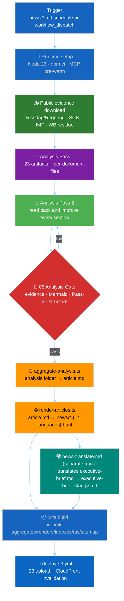
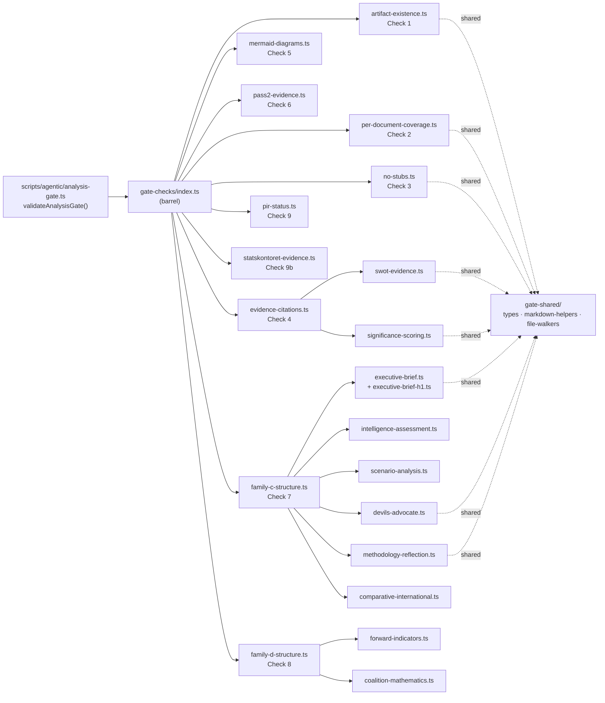
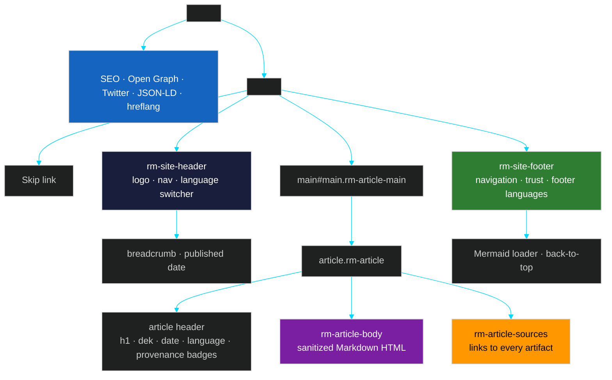
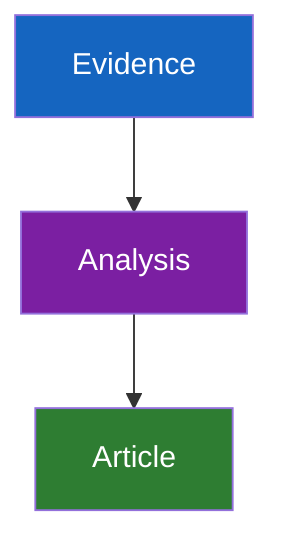
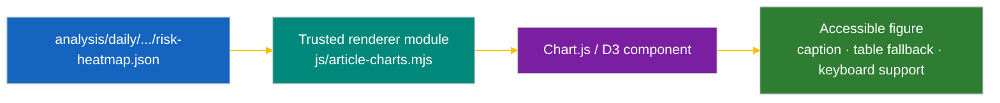
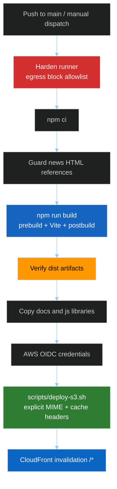
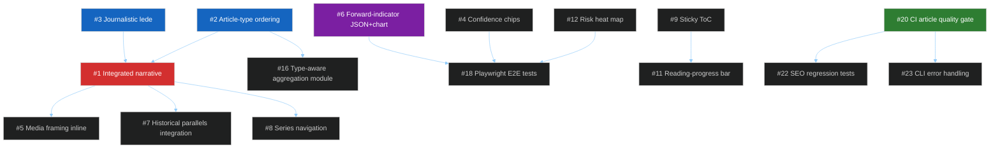

<!-- SPDX-FileCopyrightText: 2026 Hack23 AB -->
<!-- SPDX-License-Identifier: Apache-2.0 -->

<p align="center">
  
</p>

<h1 align="center">📰 Riksdagsmonitor Article Generation</h1>

<p align="center">
  <strong>From public Swedish parliamentary evidence to auditable, multilingual political-intelligence articles</strong><br>
  <em>Agentic workflows · 23-artifact analysis contract · deterministic Markdown aggregation · sanitized HTML rendering · S3/CloudFront deployment</em>
</p>

<p align="center">
  
  
  
  
</p>

**📋 Document Owner:** CEO | **📅 Last Updated:** 2026-05-05 (UTC)  
**🏢 Owner:** Hack23 AB (Org.nr 559534-7807) | **🏷️ Classification:** Public
**Primary example:** [`analysis/daily/2026-05-05/interpellations/article.md`](analysis/daily/2026-05-05/interpellations/article.md) → [`news/2026-05-05-interpellations-en.html`](news/2026-05-05-interpellations-en.html) / [`news/2026-05-05-interpellations-sv.html`](news/2026-05-05-interpellations-sv.html) / all 14 language siblings

---

## 📚 Table of Contents

- [🎯 Executive Summary](#-executive-summary)
- [💼 Purpose, Function, Business Value and Political-Analysis Object](#-purpose-function-business-value-and-political-analysis-object)
- [🧭 End-to-End Generation Map](#-end-to-end-generation-map)
- [🤖 Agentic Workflow Architecture](#-agentic-workflow-architecture)
- [📥 Data Collection and Evidence Foundation](#-data-collection-and-evidence-foundation)
- [🧠 Analysis Methodologies and Templates](#-analysis-methodologies-and-templates)
- [🚦 Analysis Gate](#-analysis-gate)
- [📝 How `article.md` Is Generated](#-how-articlemd-is-generated)
- [🌐 How `article.md` Becomes HTML](#-how-articlemd-becomes-html)
- [🎨 UI/UX, Mermaid, D3 and Chart.js Support](#-uiux-mermaid-d3-and-chartjs-support)
- [🌍 Language Switchers and Translation Model](#-language-switchers-and-translation-model)
- [🚀 Build and S3 Deployment](#-build-and-s3-deployment)
- [🛡️ Security, Privacy and ISMS Controls](#-security-privacy-and-isms-controls)
- [✅ Operational Checklist](#-operational-checklist)
- [🚀 Future Improvements Roadmap](#-future-improvements-roadmap)
- [🔗 Source File Index](#-source-file-index)

---

## 🎯 Executive Summary

Riksdagsmonitor articles are **not hand-written HTML pages**. They are deterministic projections of a deeper political-intelligence product:

1. **Agentic workflows** in [`.github/workflows/news-*.md`](.github/workflows/) run on schedules or manual dispatch.
2. The workflow imports bounded prompt modules from [`.github/prompts/`](.github/prompts/README.md).
3. The AI agent collects public Riksdag/Regering data through the `riksdag-regering` MCP server, Swedish statistics through SCB, agency-capacity and public-management evidence from Statskontoret, supplementary governance/environment/social/education indicators through World Bank, and economic context through the repository IMF TypeScript client.
4. The agent produces a **stable set of 23 core analysis artifacts** plus per-document files under `analysis/daily/$ARTICLE_DATE/$SUBFOLDER/`.
5. The **single blocking gate** in [`.github/prompts/05-analysis-gate.md`](.github/prompts/05-analysis-gate.md) must pass before any article is generated.
6. [`scripts/aggregate-analysis.ts`](scripts/aggregate-analysis.ts) turns the analysis folder into one canonical `article.md`.
7. [`scripts/render-articles.ts`](scripts/render-articles.ts) sanitizes Markdown and wraps it in shared article chrome to create `news/$DATE-$SUBFOLDER-$LANG.html`.
8. Vite builds the static site and [`.github/workflows/deploy-s3.yml`](.github/workflows/deploy-s3.yml) publishes `dist/` to S3 + CloudFront.

The result is a transparent political-intelligence article where every claim remains traceable to source artifacts, every source artifact remains traceable to public evidence, and the HTML page carries machine-readable provenance through JSON-LD `NewsArticle.isBasedOn`.

**Current publication principle:** the AI writes analysis artifacts, not final HTML. Scripts own aggregation, sanitization, chrome, SEO, language alternates, source footers and deployment behavior. This separation is what makes the system auditable.

---

## 💼 Purpose, Function, Business Value and Political-Analysis Object

### Purpose

The article-generation pipeline exists to **turn Swedish public parliamentary events into rigorous, auditable, citizen-facing intelligence**. It supports the Riksdagsmonitor mission from [README.md](README.md): systematic transparency over Swedish Riksdag activity, coalition dynamics, voting patterns, and public accountability.

### Function

| Layer | Function | Primary files |
|---|---|---|
| **Collection** | Fetch public parliamentary, government, statistical and economic evidence | `.github/prompts/03-data-download.md`, `scripts/download-parliamentary-data.ts`, `scripts/imf-fetch.ts` |
| **Analysis** | Produce structured OSINT/INTOP assessments with evidence, uncertainty and color-coded Mermaid | `analysis/methodologies/`, `analysis/templates/`, `.github/prompts/04-analysis-pipeline.md` |
| **Gate** | Enforce artifact presence, evidence quality, Mermaid coverage and Pass-2 improvement | `.github/prompts/05-analysis-gate.md` |
| **Aggregation** | Convert the folder of analysis artifacts into canonical `article.md` | `scripts/aggregate-analysis.ts`, `scripts/render-lib/aggregator/` (barrel: `index.ts`, orchestrator: `aggregate.ts`) |
| **Rendering** | Sanitize Markdown and build complete article HTML with SEO, language switcher and source footer | `scripts/render-articles.ts`, `scripts/render-lib/markdown.ts`, `article.ts`, `chrome.ts` |
| **Publishing** | Build static assets and deploy with correct MIME types, cache headers and CloudFront invalidation | `package.json`, `vite.config.js`, `.github/workflows/deploy-s3.yml`, `scripts/deploy-s3.sh` |

### Business Value

| Value area | How article generation contributes |
|---|---|
| **Trust enhancement** | Every article is backed by visible source files and primary-source links. |
| **Competitive advantage** | Riksdagsmonitor combines official Swedish political data with structured intelligence techniques (DIW, ACH, SWOT, risk, threat, stakeholder, scenario and forward-indicator analysis). |
| **Operational excellence** | Deterministic scripts (`aggregate-analysis.ts`, `render-articles.ts`) make publication repeatable, testable and auditable. |
| **Reputational protection** | AI-generated political text is gated by evidence standards, source diversity, neutral language and human-reviewable PRs. |
| **Democratic accountability** | Citizens can inspect the same source artifacts used to produce the public article. |

### Political-analysis object

An article is the **dissemination layer** of an analysis object. The primary analytical object is the folder:

```text
analysis/daily/$ARTICLE_DATE/$SUBFOLDER/
```

For the example run:

```text
analysis/daily/2026-04-24/interpellations/
```

This folder contains the full political-intelligence object:

- 23 mandatory core artifacts.
- Per-document analysis files under `documents/`.
- Optional supplementary files.
- The generated canonical `article.md`.
- Supporting JSON chart/economic/provenance files when applicable.

The article is therefore a **rendered view of the intelligence object**, not the source of record.

---

## 🧭 End-to-End Generation Map



---

## 🤖 Agentic Workflow Architecture

### Workflow sources

The news workflows are Markdown-based GitHub Agentic Workflows. The interpellation example is:

- [`.github/workflows/news-interpellations.md`](.github/workflows/news-interpellations.md)

It declares:

| Concern | Current configuration |
|---|---|
| **Name** | `News: Interpellation Debates` |
| **Schedule** | Daily around 07:00 on weekdays |
| **Manual inputs** | `article_date`, `force_generation`, `analysis_depth` (no `languages` input — every run renders all 14). All `workflow_dispatch` inputs are validated and exported to `$GITHUB_ENV` by the [`./.github/actions/news-resolve-inputs`](.github/actions/news-resolve-inputs/action.yml) composite (runs right after `news-prewarm`) so the agent's bash sandbox sees the canonical `ARTICLE_DATE` / `SUBFOLDER` / `ANALYSIS_DEPTH` / `FORCE_GENERATION` variables verbatim via `awf --env-all`. See [`.github/prompts/00-base-contract.md §Runtime input contract`](.github/prompts/00-base-contract.md) for the per-workflow extra-input table (`CYCLE_ANCHOR`, `COVERAGE_DEPTH`, `LOOKBACK_HOURS`, `ARTICLE_TYPES`, `FOCUS`, `LANGUAGES_RESOLVED`, `MAX_BRIEFS_RESOLVED`, `FORCE_RETRANSLATE`, `TRANSLATE_SUBFOLDER`). |
| **Runtime** | Node.js `26` |
| **Engine** | Copilot with `claude-sonnet-4.6` |
| **Permissions** | Read-only content/issues/PR/actions/discussions/security-events for AI job |
| **MCP gateway** | Enabled |
| **Safe outputs** | One PR max, labels `agentic-news`, `analysis-data` (no translation dispatch — all 14 languages rendered in-run) |
| **Core output** | `analysis/daily/$ARTICLE_DATE/interpellations/article.md` + `article.<lang>.md` × 13 + `news/$ARTICLE_DATE-interpellations-{en,sv,da,no,fi,de,fr,es,nl,ar,he,ja,ko,zh}.html` (always all 14 languages) |

### Registered article types

Riksdagsmonitor produces articles across three families — **single-type** (daily coverage), **tier-c-aggregation** (multi-source synthesis), and **long-horizon-forecast** (forward-looking analysis at increasing time-windows). The single source of truth for all registered types is [`analysis/article-types.json`](analysis/article-types.json), with the corresponding schema defined in [`schemas/article-types.schema.json`](schemas/article-types.schema.json). CI parity is enforced by [`tests/article-types.test.ts`](tests/article-types.test.ts) and the `check:docs` script; full Ajv-based JSON Schema validation is planned follow-up.

<!-- ARTICLE-TYPES:BEGIN -->
<!-- ⚠️ AUTO-GENERATED from analysis/article-types.json — do NOT edit manually -->

| id | family | horizonDays | tierCMultiplier | articleWordFloor | electionCycleAnchor | cronExpression |
|---|---|---|---|---|---|---|
| propositions | single-type | 0 | 1 | 1000 | current | `0 5 * * 1-5` |
| motions | single-type | 0 | 1 | 1000 | current | `0 6 * * 1-5` |
| committee-reports | single-type | 0 | 1 | 1000 | current | `0 4 * * 1-5` |
| interpellations | single-type | 0 | 1 | 1000 | current | `0 7 * * 1-5` |
| realtime-monitor | tier-c-aggregation | 0 | 0.8 | 1500 | current | `0 10,14 * * 1-5` |
| evening-analysis | tier-c-aggregation | 0 | 1 | 1500 | current | `0 18 * * 1-5` |
| week-ahead | long-horizon-forecast | 7 | 1.2 | 1500 | current | `0 7 * * 5` |
| month-ahead | long-horizon-forecast | 30 | 1.5 | 1500 | current | `0 8 1 * *` |
| quarter-ahead | long-horizon-forecast | 90 | 1.7 | 2000 | current | `0 9 1,15 * *` |
| year-ahead | long-horizon-forecast | 365 | 2 | 2500 | current | `0 9 5 1,7 *` |
| election-cycle | long-horizon-forecast | 1460 | 2.5 | 3500 | both | _dispatch-only_ |
| weekly-review | tier-c-aggregation | 0 | 1.2 | 1500 | current | `0 9 * * 6` |
| monthly-review | tier-c-aggregation | 0 | 1.5 | 1500 | current | `0 10 28 * *` |

<!-- ARTICLE-TYPES:END -->

Long-horizon workflows additionally import [`ext/long-horizon-forecasting.md`](.github/prompts/ext/long-horizon-forecasting.md) (horizon stratification, scenario-tree depth, counterfactual mandate, IMF projection-year stamps, PESTLE blocking thresholds, cross-horizon citation). The election-cycle workflow further imports [`ext/cycle-rollover.md`](.github/prompts/ext/cycle-rollover.md), which is active only within ± 30 days of a Swedish election anchor (the next being 2026-09-13).

### Imported prompt modules

Every content workflow imports the bounded-context prompt library:

| Import | Responsibility |
|---|---|
| [`00-base-contract.md`](.github/prompts/00-base-contract.md) | Role, ethics, GDPR/ISMS, AI-FIRST, session and PR boundaries |
| [`01-bash-and-shell-safety.md`](.github/prompts/01-bash-and-shell-safety.md) | Safe shell patterns and command discipline |
| [`02-mcp-access.md`](.github/prompts/02-mcp-access.md) | MCP inventory and health gates |
| [`03-data-download.md`](.github/prompts/03-data-download.md) | Data download and manifest rules |
| [`04-analysis-pipeline.md`](.github/prompts/04-analysis-pipeline.md) | 23-artifact production and Pass 1/Pass 2 methodology |
| [`05-analysis-gate.md`](.github/prompts/05-analysis-gate.md) | Single blocking gate before article generation |
| [`06-article-generation.md`](.github/prompts/06-article-generation.md) | Aggregate + render contract |
| [`07-commit-and-pr.md`](.github/prompts/07-commit-and-pr.md) | Stage, commit and exactly one PR |

### Workflow time budget

The interpellation workflow documents a compressed single-run budget:

| Window | Phase |
|---:|---|
| 0–2 min | MCP pre-warm and network diagnostics |
| 2–5 min | Download data and catalogue source documents |
| 5–15 min | Analysis Pass 1, all 23 artifacts plus per-document files |
| 15–21 min | Analysis Pass 2, read back and improve |
| 21–22 min | Analysis gate |
| 22–24 min | Aggregate `article.md` and render EN/SV HTML |
| 24–28 min | Stage, commit and create exactly one PR |

This budget reserves job-level headroom inside the 60-minute workflow ceiling and safe-output PR handoff. The workflow explicitly prefers **scope compression over skipping Pass 2**.

### Agentic security model

```mermaid
%%{init: {"theme":"dark","themeVariables":{"primaryColor":"#0A66C2","primaryTextColor":"#ffffff","primaryBorderColor":"#003B73","lineColor":"#00D9FF","secondaryColor":"#1A1E3D","tertiaryColor":"#FFBE0B","tertiaryTextColor":"#000000","errorBkgColor":"#D32F2F","fontFamily":"Inter, Helvetica, Arial, sans-serif"}}}%%
flowchart LR
    I["Untrusted public inputs<br/>Riksdag docs · speeches · webpages"] --> S["System prompt + modules<br/>ethical and evidence rules"]
    S --> R["Read-only AI job<br/>limited GitHub permissions"]
    R --> T["Allowed tools<br/>MCP · bash · GitHub read"]
    T --> O["Structured outputs<br/>analysis artifacts + safe PR request"]
    O --> V["Gate + review surface<br/>analysis gate · PR diff · CI"]
    V --> P["Published static site<br/>S3/CloudFront · GitHub Pages DR"]

    style I fill:#D32F2F,color:#ffffff
    style S fill:#1565C0,color:#ffffff
    style R fill:#2E7D32,color:#ffffff
    style T fill:#7B1FA2,color:#ffffff
    style O fill:#FF9800,color:#000000
    style V fill:#FFC107,color:#000000
    style P fill:#0A66C2,color:#ffffff
```



---

## 📥 Data Collection and Evidence Foundation

### Data providers

| Provider | Use in article generation | Interface |
|---|---|---|
| **Riksdag/Regering MCP** | MPs, documents, speeches, votes, interpellations, propositions, motions, committee reports, government documents | `.github/copilot-mcp.json` + workflow `mcp-servers` |
| **SCB** | Swedish-specific statistics and demographic context | `@jarib/pxweb-mcp@2.0.0` |
| **IMF** | Primary economic/fiscal/monetary/external-sector/trade context, with WEO/FM projection vintage discipline and `economic-data.json` provenance | `tsx scripts/imf-fetch.ts` + `scripts/imf-client.ts` |
| **Statskontoret** | Swedish agency governance, administrative capacity, implementation feasibility, regulatory burden and public-sector efficiency evidence | Public web pages / reports (`www.statskontoret.se`) |
| **World Bank** | Non-economic residue only: governance, environment, social/education, defence historicals, crime | `worldbank-mcp@1.0.1` |
| **GitHub** | PR creation and repository metadata | GitHub MCP / safe outputs |

The authoritative IMF-first / World-Bank-residue split is defined in [`.github/aw/ECONOMIC_DATA_CONTRACT.md`](.github/aw/ECONOMIC_DATA_CONTRACT.md). In short: macroeconomic, fiscal, monetary, external-sector and trade claims are IMF-first; World Bank is reserved for governance, environment and other non-economic residue that IMF does not publish.

Statskontoret is not an MCP server. It is a public-source enrichment layer for agency capacity and implementation feasibility. Workflow allowlists include `www.statskontoret.se` / `statskontoret.se`; source use is recorded in `data-download-manifest.md` and cited in the affected analysis artifacts.

### Evidence standard

Every analytical claim must tie to at least one of:

- A real `dok_id` such as `HD10447`.
- A named MP, minister, party, committee or actor.
- Vote counts or voting records.
- A primary-source URL from `riksdagen.se`, `regeringen.se`, `scb.se`, `statskontoret.se`, IMF or World Bank non-economic endpoints.

The sample interpellation article demonstrates this standard:

| Claim type | Example in `2026-04-24/interpellations/article.md` |
|---|---|
| `dok_id` | `HD10447` links to `https://data.riksdagen.se/dokument/HD10447.html` |
| Named actors | Patrik Lundqvist (S), Ebba Busch (KD), Elisabeth Svantesson (M) |
| Count | `12 of 16` interpellations in the HD10428–HD10447 window were S-filed |
| Forward trigger | Ministerial answer window `2026-05-07` |
| Confidence | MEDIUM / HIGH / LOW-MEDIUM labels and Admiralty `A2` markers |

---

## 🧠 Analysis Methodologies and Templates

### Canonical methodology set

Article generation is governed by:

- [`analysis/methodologies/artifact-catalog.md`](analysis/methodologies/artifact-catalog.md)
- [`analysis/methodologies/per-artifact-methodologies.md`](analysis/methodologies/per-artifact-methodologies.md)
- [`analysis/methodologies/ai-driven-analysis-guide.md`](analysis/methodologies/ai-driven-analysis-guide.md)
- [`analysis/methodologies/political-style-guide.md`](analysis/methodologies/political-style-guide.md)
- [`analysis/methodologies/osint-tradecraft-standards.md`](analysis/methodologies/osint-tradecraft-standards.md)
- Supporting methods for classification, SWOT, risk, threat, synthesis, structural metadata, strategic extensions, electoral/domain analysis and per-document analysis.

### AI-FIRST two-pass rule

The pipeline requires at least two complete iterations:

| Pass | Required work | Quality effect |
|---|---|---|
| **Pass 1 — Create** | Produce all 23 core artifacts and all per-document files. | Establishes coverage and first analytical structure. |
| **Snapshot** | Save Pass-1 drafts under `pass1/` for gate evidence. | Provides proof that Pass 2 changed the analysis. |
| **Pass 2 — Improve** | Read every Pass-1 file back completely and strengthen evidence, diagrams, uncertainty, stakeholders and forward indicators. | Converts shallow first drafts into publication-quality intelligence. |

The aggregator deliberately strips trailing `Pass 2` process sections from public articles, so Pass-2 improvements must be integrated into the actual analytical sections.

### Always-produced core artifacts

Every content workflow produces the same 23 artifacts under `analysis/daily/$ARTICLE_DATE/$SUBFOLDER/`.

```mermaid
%%{init: {"theme":"dark","themeVariables":{"primaryColor":"#7B1FA2","primaryTextColor":"#ffffff","primaryBorderColor":"#4A148C","lineColor":"#FFBE0B","secondaryColor":"#1565C0","secondaryTextColor":"#ffffff","tertiaryColor":"#2E7D32","tertiaryTextColor":"#ffffff","fontFamily":"Inter, Helvetica, Arial, sans-serif"}}}%%
flowchart TB
    subgraph A["📘 Family A — Core Synthesis (9)"]
        A1[README.md]
        A2[executive-brief.md]
        A3[synthesis-summary.md]
        A4[significance-scoring.md]
        A5[classification-results.md]
        A6[swot-analysis.md]
        A7[risk-assessment.md]
        A8[threat-analysis.md]
        A9[stakeholder-perspectives.md]
    end
    subgraph B["📗 Family B — Structural Metadata (2)"]
        B1[data-download-manifest.md]
        B2[cross-reference-map.md]
    end
    subgraph C["📙 Family C — Strategic Extensions (5)"]
        C1[scenario-analysis.md]
        C2[comparative-international.md]
        C3[devils-advocate.md]
        C4[intelligence-assessment.md]
        C5[methodology-reflection.md]
    end
    subgraph D["📕 Family D — Electoral & Domain Lenses (7)"]
        D1[election-2026-analysis.md]
        D2[voter-segmentation.md]
        D3[coalition-mathematics.md]
        D4[historical-parallels.md]
        D5[media-framing-analysis.md]
        D6[implementation-feasibility.md]
        D7[forward-indicators.md]
    end
    subgraph E["📒 Family E — Per document"]
        E1[documents/{dok_id}-analysis.md]
    end
    A --> G["🚦 Analysis Gate"]
    B --> G
    C --> G
    D --> G
    E --> G

    style A fill:#7B1FA2,color:#ffffff
    style B fill:#1565C0,color:#ffffff
    style C fill:#FF9800,color:#000000
    style D fill:#2E7D32,color:#ffffff
    style E fill:#00897B,color:#ffffff
    style G fill:#D32F2F,color:#ffffff
```

### Template-to-artifact mapping

The mapping below is exhaustive and ordered to match `scripts/render-lib/aggregator/order.ts:AGGREGATION_ORDER` so the table reads top-to-bottom in the same sequence the aggregator splices the artifacts into `article.md`. The order follows a journalist-optimal narrative arc — Phase A (lead/BLUF) → Phase B (per-document evidence injected after `significance-scoring.md`) → Phase C (actors & political arithmetic) → Phase D (forward trajectory) → Phase E (risk & threat) → Phase F (context & narrative environment, with media framing late) → Phase G (devil's-advocate critique) → Phase H (audit appendix). Every production template under [`analysis/templates/`](analysis/templates/) appears in the table; supplementary / operational templates (analysis-index, session-baseline, cross-run-diff, cross-session-intelligence, mcp-reliability-audit, reference-analysis-quality, workflow-audit) are listed at the end because they support the analysis run rather than the article body.

| # | Aggregator slot | Template / artifact | Role in eventual article |
|:-:|---|---|---|
| 1 | Lead | [`executive-brief.md`](analysis/templates/executive-brief.md) | Supplies article title, meta description, BLUF, supported decisions, top forward trigger, lead visual; first BLUF paragraph becomes the `<meta description>`. |
| 2 | Synthesis | [`synthesis-summary.md`](analysis/templates/synthesis-summary.md) | Sets lead story, DIW ranking, narrative frame and article metadata suggestions; carries ≥ 1 colour-coded Mermaid diagram. |
| 3 | Key Judgments | [`intelligence-assessment.md`](analysis/templates/intelligence-assessment.md) | Provides ≥ 3 Key Judgments + PIRs + confidence labels (ICD 203). |
| 4 | Ranking | [`significance-scoring.md`](analysis/templates/significance-scoring.md) | DIW scoring + sensitivity analysis with evidence-tagged rows and ranked Mermaid bar chart. |
| — | Per-document | [`per-file-political-intelligence.md`](analysis/templates/per-file-political-intelligence.md) → `documents/{dok_id}-analysis.md` | Phase B primary-source evidence: one subsection per primary-source document, injected immediately after `significance-scoring.md` so readers meet the actual motions / propositions / committee reports BEFORE any interpretive lens. Required to cite the `dok_id`. |
| 5 | Stakeholders | [`stakeholder-impact.md`](analysis/templates/stakeholder-impact.md) → `stakeholder-perspectives.md` | Power × interest × position lens, named actors and influence network. **Note:** the template instructs saving as `stakeholder-impact.md` but the aggregator + gate require the canonical output filename `stakeholder-perspectives.md`. |
| 6 | Coalitions | [`coalition-mathematics.md`](analysis/templates/coalition-mathematics.md) | Sainte-Laguë seat table + coalition graphs. Phase C — who can pass it. |
| 7 | Voters | [`voter-segmentation.md`](analysis/templates/voter-segmentation.md) | SCB segment cuts + segment Mermaid map. Phase C — whose interests are at stake. |
| 8 | Forward look | [`forward-indicators.md`](analysis/templates/forward-indicators.md) | ≥ 10 dated watch items across 4 horizons (Mermaid Gantt). |
| 9 | Futures | [`scenario-analysis.md`](analysis/templates/scenario-analysis.md) | ≥ 3 scenarios with priors, posteriors, indicators and falsifiers. |
| 10 | Election | [`election-2026-analysis.md`](analysis/templates/election-2026-analysis.md) / [`election-cycle-analysis.md`](analysis/templates/election-cycle-analysis.md) / `election-2026-implications.md` | Seat deltas, campaign implications; alias-deduplicated by `FILENAME_ALIASES` (all three map to the same aggregator slot). |
| 11 | Cycle | [`cycle-trajectory.md`](analysis/templates/cycle-trajectory.md) | 24th artifact for `news-election-cycle` only — multi-year trajectory bands T+1y → T+5y with colour-coded Mermaid. |
| 12 | Calendar | [`parliamentary-season.md`](analysis/templates/parliamentary-season.md) | Riksmöte phase ribbon, committee schedule, Lagrådet referrals, watchlist heat-map (long-horizon workflows). |
| 13 | Risk | [`risk-assessment.md`](analysis/templates/risk-assessment.md) | Top 5 risks with L × I + cascading + Mermaid heat-map. |
| 14 | Strategic | [`swot-analysis.md`](analysis/templates/swot-analysis.md) | Evidence-bound SWOT quadrant + TOWS moves (Mermaid quadrantChart). |
| 15 | Quant SWOT | [`quantitative-swot.md`](analysis/templates/quantitative-swot.md) | Scored SWOT ranking with composite Mermaid bar (year-ahead + cycle blocking). |
| 16 | Threat | [`threat-analysis.md`](analysis/templates/threat-analysis.md) | Political Threat Taxonomy + attack-tree Mermaid diagrams. |
| 17 | STRIDE | [`political-stride-assessment.md`](analysis/templates/political-stride-assessment.md) | STRIDE + MITRE ATT&CK mapping (cycle blocking). |
| 18 | Black swans | [`wildcards-blackswans.md`](analysis/templates/wildcards-blackswans.md) | Wildcards + 3-order cascades (year-ahead + cycle blocking). |
| 19 | PESTLE | [`pestle-analysis.md`](analysis/templates/pestle-analysis.md) | 6-dimension scan (year-ahead + cycle blocking, supplementary elsewhere). |
| 20 | History | [`historical-parallels.md`](analysis/templates/historical-parallels.md) | ≥ 2 historical episodes with confidence and divergence. |
| 21 | Comparative | [`comparative-international.md`](analysis/templates/comparative-international.md) | ≥ 2 peer-country rows via WB / IMF / SCB. |
| 22 | Feasibility | [`implementation-feasibility.md`](analysis/templates/implementation-feasibility.md) | Actor-capacity + Statskontoret evidence + timeline. |
| 23 | Narrative contestation | [`media-framing-analysis.md`](analysis/templates/media-framing-analysis.md) | DISARM TTPs · CIB ABCDE · narrative-laundering chain · Outlet Bias Audit · L1–L5 counter-resilience ladder. **Phase F — placed late so readers form their own view of substance before being shown how the story is being framed.** |
| 24 | Devil's Advocate | [`devils-advocate.md`](analysis/templates/devils-advocate.md) | ≥ 3 ACH hypotheses, KAC, Red Team. |
| 25 | Classification | [`political-classification.md`](analysis/templates/political-classification.md) → `classification-results.md` | Priority tiers, retention, 7-dimension classification. |
| 26 | Cross-refs | [`cross-reference-map.md`](analysis/templates/cross-reference-map.md) | Continuity contracts + sibling folders. |
| 27 | PIR roll-forward | [`horizon-pir-rollforward.md`](analysis/templates/horizon-pir-rollforward.md) | PIR genealogy graph for long-horizon runs (supplementary). |
| 28 | Methodology | [`methodology-reflection.md`](analysis/templates/methodology-reflection.md) | ICD 203 audit, ≥ 10 SATs, DIW reconciliation, PIR retirement log, Pass-2 audit log. |
| 29 | Manifest | [`data-download-manifest.md`](analysis/templates/data-download-manifest.md) | Collection transparency / source inventory (appendix). |
| op | Run navigator | [`analysis-index.md`](analysis/templates/analysis-index.md) | Read-me-first run index (aggregated alphabetically after core slots). |
| op | Same-type baseline | [`session-baseline.md`](analysis/templates/session-baseline.md) | 30-day baseline for pattern recognition (aggregated alphabetically after core slots). |
| op | Day-over-day | [`cross-run-diff.md`](analysis/templates/cross-run-diff.md) | Same-type delta; gate-required when `ANALYSIS_RUN_COUNT ≥ 2` (aggregated alphabetically after core slots). |
| op | Cross-session | [`cross-session-intelligence.md`](analysis/templates/cross-session-intelligence.md) | Week / month / quarter aggregation across Riksdag sessions (aggregated alphabetically after core slots). |
| op | MCP health | [`mcp-reliability-audit.md`](analysis/templates/mcp-reliability-audit.md) | MCP tool reliability snapshot (aggregated alphabetically after core slots). |
| op | Threshold audit | [`reference-analysis-quality.md`](analysis/templates/reference-analysis-quality.md) | Threshold audit against `reference-quality-thresholds.json` (aggregated alphabetically after core slots). |
| op | Workflow audit | [`workflow-audit.md`](analysis/templates/workflow-audit.md) | End-to-end run audit: timing, cost, gate outcomes (aggregated alphabetically after core slots). |

> **Aggregation behavior for "op" templates:** The aggregator (step 4 in `aggregate.ts`) appends *any* remaining `*.md` file — excluding `README.md` and `article*.md` — in alphabetical order after the `AGGREGATION_ORDER` pass (31 entries including alias variants that collapse to 29 logical sections). This means operational templates listed above **will appear** in the rendered article if they exist in the analysis folder. They sit after the core narrative but before the Sources appendix. `analysis/templates/README.md` is the templates-directory index and is excluded by the `README.md` filter; `election-cycle-analysis.md` is a filename alias of `election-2026-analysis.md` (de-duplicated at render time by `FILENAME_ALIASES`).

---

## 🚦 Analysis Gate

The single article-generation gate is [`.github/prompts/05-analysis-gate.md`](.github/prompts/05-analysis-gate.md). If the gate fails, the analysis must be fixed before aggregation. The TypeScript twin lives in [`scripts/agentic/analysis-gate.ts`](scripts/agentic/analysis-gate.ts), which is a thin orchestrator over the per-check modules in [`scripts/agentic/gate-checks/`](scripts/agentic/gate-checks/) — one rule per file, sharing helpers from [`scripts/agentic/gate-shared/`](scripts/agentic/gate-shared/).

### Module map (TypeScript gate)



### Gate checks

| Check | Module | What it protects |
|---|---|---|
| 1 — Artifact existence | [`artifact-existence.ts`](scripts/agentic/gate-checks/artifact-existence.ts) | Prevents partial articles from incomplete analysis folders. |
| 2 — Per-document coverage | [`per-document-coverage.ts`](scripts/agentic/gate-checks/per-document-coverage.ts) | Ensures every `dok_id` in the manifest has a corresponding document analysis. |
| 3 — No stubs | [`no-stubs.ts`](scripts/agentic/gate-checks/no-stubs.ts) | Blocks `AI_MUST_REPLACE`, `[REQUIRED]`, `TODO:` and placeholder text. |
| 4 — Evidence citations | [`evidence-citations.ts`](scripts/agentic/gate-checks/evidence-citations.ts) | Blocks generic SWOT/ranking claims without `dok_id` or primary URL evidence. |
| 5 — Mermaid diagrams | [`mermaid-diagrams.ts`](scripts/agentic/gate-checks/mermaid-diagrams.ts) | Requires color-coded diagrams in core synthesis and key lens files. |
| 6 — Pass-2 evidence | [`pass2-evidence.ts`](scripts/agentic/gate-checks/pass2-evidence.ts) | Requires proof that the AI read and improved the first pass. |
| 7 — Family C structure | [`family-c-structure.ts`](scripts/agentic/gate-checks/family-c-structure.ts) | Requires BLUF, decisions, Key Judgments, PIRs, scenarios, ACH hypotheses and ICD 203 audit. |
| 8 — Family D structure | [`family-d-structure.ts`](scripts/agentic/gate-checks/family-d-structure.ts) | Requires dated forward indicators and coalition/seat-count material. |
| 9 — PIR status | [`pir-status.ts`](scripts/agentic/gate-checks/pir-status.ts) | Validates the `pir-status.json` sidecar schema and per-entry rules. |
| 9b — Statskontoret evidence | [`statskontoret-evidence.ts`](scripts/agentic/gate-checks/statskontoret-evidence.ts) | When recognised agencies are named, requires a Statskontoret URL or `none found`. |

Each module owns exactly one gate rule with its own regex constants and helpers, mirroring the bash gate steps one-to-one. The orchestrator file stays at ~125 lines so reviewers can audit the aggregation logic without touching individual rules.

### Test module map

Test coverage mirrors the production layout one-to-one: every gate-check module has a dedicated test file under [`tests/agentic/gate-checks/`](tests/agentic/gate-checks/), and the shared helpers are tested independently under [`tests/agentic/gate-shared/`](tests/agentic/gate-shared/). The end-to-end `validateAnalysisGate()` scenarios and the `artifact-inventory` invariants live in [`tests/agentic/analysis-gate-integration.test.ts`](tests/agentic/analysis-gate-integration.test.ts). The shared `createMinimalValidAnalysis()` seed in [`tests/agentic/gate-shared/fixtures.ts`](tests/agentic/gate-shared/fixtures.ts) keeps a story-oriented H1 (memory invariant: not bare *Executive Brief*, *REPLACE THIS H1*, *Executive Brief Template*, *AI_MUST_REPLACE*, or *AI-generated political intelligence*).


### Why the gate is before article generation

The HTML article is a pure projection. If the analysis is weak, the article will be weak. The gate therefore enforces quality at the source of truth: the analysis artifacts.

---

## 📝 How `article.md` Is Generated

### Responsible code

| File | Responsibility |
|---|---|
| [`scripts/aggregate-analysis.ts`](scripts/aggregate-analysis.ts) | CLI wrapper for aggregating one folder or all folders. |
| [`scripts/render-lib/aggregator/aggregate.ts`](scripts/render-lib/aggregator/aggregate.ts) | Slim orchestrator: reads artifacts, delegates to leaf modules, returns `AggregationResult`. |
| [`scripts/render-lib/aggregator/interfaces.ts`](scripts/render-lib/aggregator/interfaces.ts) | Shared pipeline interfaces (`PipelineResult`, `ReadStageInput`, `WriteStageOutput`, etc.). |
| [`scripts/render-lib/aggregator/pipeline.ts`](scripts/render-lib/aggregator/pipeline.ts) | Composable pipeline orchestrator (`runArticlePipeline`). |
| [`scripts/render-lib/aggregator/cleaning/`](scripts/render-lib/aggregator/cleaning/) | Body cleaning: admin-bylines, pass-two, process-meta, structural, heading-demotion, link-rewriting, deduplication. |
| [`scripts/render-lib/aggregator/seo/`](scripts/render-lib/aggregator/seo/) | Title and description extraction for SEO metadata. |
| [`scripts/render-lib/aggregator/order.ts`](scripts/render-lib/aggregator/order.ts) | Canonical narrative order (`AGGREGATION_ORDER`). |
| [`scripts/render-lib/aggregator/frontmatter.ts`](scripts/render-lib/aggregator/frontmatter.ts) | YAML front-matter assembly and escape helpers. |
| [`scripts/render-lib/aggregator/reader-guide.ts`](scripts/render-lib/aggregator/reader-guide.ts) | Reader Intelligence Guide table generation. |
| [`scripts/render-lib/aggregator/per-document.ts`](scripts/render-lib/aggregator/per-document.ts) | Per-document `documents/` expansion. |
| [`scripts/render-lib/aggregator/sources-appendix.ts`](scripts/render-lib/aggregator/sources-appendix.ts) | Article Sources appendix generation. |
| [`scripts/render-lib/url-helpers.ts`](scripts/render-lib/url-helpers.ts) | GitHub blob/tree URL construction. |
| [`scripts/render-lib/constants.ts`](scripts/render-lib/constants.ts) | Shared paths, base URLs and language constants. |

### Pipeline architecture (bounded contexts)

```
scripts/render-lib/aggregator/
├── interfaces.ts            # Shared pipeline types (PipelineResult, ReadStageInput, etc.)
├── pipeline.ts              # Composable pipeline orchestrator (runArticlePipeline)
├── aggregate.ts             # Core orchestrator (aggregateAnalysis)
├── order.ts                 # Canonical narrative order
├── frontmatter.ts           # YAML front-matter + escape helpers
├── reader-guide.ts          # Reader Intelligence Guide
├── reader-guide-i18n.ts     # 14-language i18n for Reader Guide
├── per-document.ts          # documents/ expansion
├── sources-appendix.ts      # Article Sources appendix
├── cleaning/
│   ├── structural.ts        # cleanArtifactBody orchestrator
│   ├── admin-bylines.ts     # Admin-byline paragraph stripping
│   ├── pass-two.ts          # AI self-audit section stripping
│   ├── process-meta.ts      # Process-metadata line stripping
│   ├── heading-demotion.ts  # Heading level demotion (## → ###)
│   ├── link-rewriting.ts    # Relative → GitHub blob URL rewriting
│   └── deduplication.ts     # Adjacent-line and footer-block dedup
└── seo/
    ├── title.ts             # Article title extraction + cleaning
    └── description.ts       # BLUF / first-paragraph description
```

### Aggregation command

```bash
npx tsx scripts/aggregate-analysis.ts \
  --date 2026-04-24 \
  --subfolder interpellations
```

For all existing analysis folders, including nested folders such as `election-cycle/current` and `election-cycle/next`:

```bash
npx tsx scripts/aggregate-analysis.ts --all
```

### Aggregator input and output

| Input | Output |
|---|---|
| Canonical analysis `.md` files in `analysis/daily/$ARTICLE_DATE/$SUBFOLDER/` excluding `README.md`, `article.md`, and `article.<lang>.md` | `analysis/daily/$ARTICLE_DATE/$SUBFOLDER/article.md` |
| `analysis/daily/$ARTICLE_DATE/$SUBFOLDER/documents/*.md` | Included under `## Per-document intelligence` |
| Supplementary `.md` files in the subfolder excluding `README.md`, `article.md`, and `article.<lang>.md` | Appended after the canonical sequence |
| Supporting `.json` files such as `pir-status.json`, `economic-data.json`, and `documents/*.json` | Linked in `## Article Sources` and counted in `## Analysis Artifact Coverage Report`; not expanded inline so the public narrative remains readable |

> **Note:** `README.md` is required for the 23-artifact analysis gate and repository readability, but it is intentionally not aggregated into the published `article.md`. Existing `article.md` and `article.<lang>.md` files are also excluded from aggregation.

### Canonical political-intelligence order

`AGGREGATION_ORDER` in [`scripts/render-lib/aggregator/order.ts`](scripts/render-lib/aggregator/order.ts) (consumed by [`scripts/render-lib/aggregator/aggregate.ts`](scripts/render-lib/aggregator/aggregate.ts) via the [`scripts/render-lib/aggregator/`](scripts/render-lib/aggregator/) barrel) publishes sections in this order:

0. Generated `Reader Intelligence Guide` — a deterministic navigation layer that surfaces BLUF, Key Judgments, significance, actors, forward indicators, scenarios, risks, context, critique and dok_id-level evidence before the technical appendix. Its audit row targets the strongest audit section actually present (`classification-results.md`, `political-classification.md`, `cross-reference-map.md`, `methodology-reflection.md`, or `data-download-manifest.md`) so no guide link points at a missing heading.
1. `executive-brief.md`
2. `synthesis-summary.md`
3. `intelligence-assessment.md`
4. `significance-scoring.md`
5. `documents/*-analysis.md` as `## Per-document intelligence` (injected immediately after significance scoring)
6. `stakeholder-perspectives.md` / `stakeholder-impact.md` (alias-deduplicated)
7. `coalition-mathematics.md`
8. `voter-segmentation.md`
9. `forward-indicators.md`
10. `scenario-analysis.md`
11. `election-2026-analysis.md` / `election-cycle-analysis.md` / `election-2026-implications.md` (alias-deduplicated)
12. `cycle-trajectory.md`
13. `parliamentary-season.md`
14. `risk-assessment.md`
15. `swot-analysis.md`
16. `quantitative-swot.md`
17. `threat-analysis.md`
18. `political-stride-assessment.md`
19. `wildcards-blackswans.md`
20. `pestle-analysis.md`
21. `historical-parallels.md`
22. `comparative-international.md`
23. `implementation-feasibility.md`
24. `media-framing-analysis.md`
25. `devils-advocate.md`
26. `classification-results.md` / `political-classification.md` (alias-deduplicated)
27. `cross-reference-map.md`
28. `horizon-pir-rollforward.md`
29. `methodology-reflection.md`
30. `data-download-manifest.md`
31. Remaining supplementary `.md` files, alphabetically.
32. Generated `Analysis Artifact Coverage Report` — reconciliation of included markdown sections, per-document expansions, supporting JSON links and absent canonical ordered artifacts.
33. Generated `Article Sources` — GitHub links for every expanded markdown artifact plus supporting JSON data artifacts.

#### Render-time reading order (Session 1)

The aggregated markdown places the `## Reader Intelligence Guide` ahead of `## Executive Brief` so audit tooling sees the navigation layer first. At HTML render time, however, the renderer rearranges the body so a public reader meets the editorial lead before the navigation projection:

> **Header → Executive Brief → Reader Intelligence Guide → rest of analysis → Article Sources**

This is implemented by [`splitBodyAtSecondH2()` in `scripts/render-lib/article.ts`](scripts/render-lib/article.ts) — a pure helper that splits the rendered body at the second `<h2>` element. The first slice (everything up to but not including the second H2) is the executive brief; the rest is appended after the chrome-rendered `<section class="rm-reader-guide">` block. Tested by `tests/render-lib-architecture.test.ts > splitBodyAtSecondH2`.

#### Article-type eyebrow localisation (Session 4)

Every article header carries an article-type "eyebrow" label (e.g. *Propositions*, *Committee Reports*, *Week Ahead*) inside `<p class="rm-article-eyebrow">`. The label originates from `analysis/article-types.json`, which only stores a single English `label` field per type. To keep the eyebrow in the reader's language across the full 14-language matrix, [`scripts/render-lib/article-type-i18n.ts`](scripts/render-lib/article-type-i18n.ts) provides a per-language label map for the 15 registry types + 5 legacy fallback IDs + a generic `political-intelligence` fallback (= 294 strings). The renderer calls `articleTypeLabel(typeId, lang, fallback)`, which falls back to the registry's English `label` field when no translation is registered, so newly added types never render an empty eyebrow. Tested by `tests/article-type-i18n.test.ts`.

### Cleaning and transformation rules

The aggregator (see [`scripts/render-lib/aggregator.ts`](scripts/render-lib/aggregator.ts) `cleanArtifactBody`):

- Requires `executive-brief.md`.
- Inserts a `Reader Intelligence Guide` before artifact sections so public readers can find high-value analysis such as media framing and forward indicators without scanning every audit artifact.
- Strips YAML front matter from each artifact.
- Removes the first H1 from each artifact and injects its own consistent `## Section Title` heading.
- **Demotes every internal heading by one level** (`##` → `###`, `###` → `####`, …, capped at H6) before concatenation. Without this, every artifact's own H2s become siblings of the wrapper-injected `## Section Title` and the rendered article ends up with ~170 H2s and a flat outline that violates WCAG 2.4.6 ("Headings and Labels"). Headings inside fenced code blocks are not affected. **Tested by** [`tests/render-lib.test.ts > demoteHeadings`](tests/render-lib.test.ts).
- **Strips legacy `_Source: file.md_` italic preamble lines** that some artifact templates author at the top of their body. Source attribution now lives in the auto-generated [Reader Intelligence Guide](#-reader-intelligence-guide-deterministic-navigation-layer) and the [`## Article Sources` appendix](#-article-sources-appendix-canonical-source-list) — repeating it under every heading reads like a folder listing, not journalism. Inline prose mentions like *"primary source: data.riksdagen.se/…"* are preserved.
- **Normalises heading slugs** to drop leading hyphens emitted by `github-slugger` when a heading starts with a stripped character (e.g. emoji like `🎯` in `## 🎯 BLUF` slug to `-bluf` and would otherwise become `id="rm--bluf"` once the `rm-` prefix is applied). Both [`markdown.ts#rehypeSlugWithPrefix`](scripts/render-lib/markdown.ts) and [`aggregator.ts#anchorForTitle`](scripts/render-lib/aggregator.ts) collapse leading/trailing hyphens to keep heading IDs and Reader Intelligence Guide anchors in lock-step.
- Removes leading admin bylines such as `Author`, `Run ID`, `Classification`, `Confidence`, `Prepared by`, `Methodology` and similar metadata fields.
- Removes trailing `Document control`, `Audit trail`, `Generated by`, template footer and `Pass 2` self-audit sections.
- Rewrites relative Markdown links to absolute GitHub blob URLs.
- Keeps Mermaid fences untouched so the renderer can preserve them.
- Annotates each section heading with an HTML comment of shape `<!-- source: <file> :: <github-blob-url> -->` for offline auditors. The comment is dropped by `rehype-sanitize` so it never reaches rendered HTML.
- Builds front matter with `title`, `description`, `date`, `subfolder`, `slug`, `source_folder`, `generated_at`, `language` and `layout`.

### 📚 Article Sources appendix (canonical source list)

After every artifact section the aggregator emits a single `## Article Sources` H2 at the very end of the article. Each entry is a markdown list link to the artifact on GitHub:

```markdown
## Article Sources

Each section above projects one analysis artifact. The full audited markdown is available on GitHub:

- [`executive-brief.md`](https://github.com/Hack23/riksdagsmonitor/blob/main/analysis/daily/.../executive-brief.md)
- [`synthesis-summary.md`](https://github.com/.../synthesis-summary.md)
- …
```

This replaces the legacy per-section `_Source: file.md_` italics. Auditors get one canonical list; readers see clean prose; SEO crawlers see one trustworthy `<ul>` of primary-source links instead of 25+ duplicated italics.

### Title and description extraction — the 14-language source-of-truth

> **Single source of truth for SEO surfaces.** Every published `news/$DATE-$SUB-$LANG.html` page derives its `<title>` and `<meta name="description">` — and the eight downstream SEO surfaces that mirror them (see §"SEO and provenance" below) — from **one place only: the executive brief**. There is no path by which an article ships a title or description that did not originate in `executive-brief.md` (English) or `executive-brief_<lang>.md` (one of the 13 non-English localized siblings). All other HTML content — dek, lede, provenance badges, in-body lede sentences — must likewise be highlights of the executive brief; the aggregator emits `executive-brief.md` as section #1 precisely so the brief's BLUF and Decisions ride at the top of `article.md` (and therefore the rendered HTML) verbatim.

The improved executive-brief tradecraft that enforces this lives in:

- [`analysis/methodologies/per-artifact-methodologies.md § executive-brief`](analysis/methodologies/per-artifact-methodologies.md#executive-brief) — the Decision-Grade BLUF rubric (6 axes), the Headline-Candidates worksheet, the 14-language seeds row contract, and the Pass-2 closure rule that produces the publishable H1 + BLUF the SEO pipeline consumes.
- [`.github/prompts/seo-metadata-contract.md`](.github/prompts/seo-metadata-contract.md) — the per-language charset budgets (§4), the banned-phrase list (§2.2 / §3.1), and the generator-side enforcement table (§5).
- [`.github/prompts/05-analysis-gate.md`](.github/prompts/05-analysis-gate.md) — the H1 gate that blocks bare-boilerplate (`# Executive Brief`), template placeholders (`REPLACE THIS H1`, `Executive Brief Template`, `AI_MUST_REPLACE`), and the banned filler phrase `AI-generated political intelligence` before any article generation can begin.

#### Per-language precedence chain (English source + 13 localized siblings)

For each of the 14 supported languages, the renderer resolves the `<title>` and `<meta description>` through the following ordered cascade — the first hit wins, and the next-fallback is documented so a temporarily missing translation still produces a valid (English-content under non-English `<html lang>`) page:

| # | Language path | Source of `<title>` | Source of `<meta description>` |
|:-:|---|---|---|
| 1 | English (`en`) | First H1 in `analysis/daily/$DATE/$SUB/executive-brief.md`, cleaned by `cleanArticleTitle()` of boilerplate (`Executive Brief —`, trailing ` — YYYY-MM-DD`); fallback to a BLUF-synthesised title via `titleFromBluf()`; final fallback to `${prettifyFallbackTitle($SUBFOLDER)} — $DATE`. | First paragraph after `## BLUF` (case-insensitive, emoji-tolerant) via `readBlufParagraph()`; fallback to first prose paragraph via `readFirstParagraph()`; final fallback to a deterministic `Evidence-based political intelligence analysis for $SUBFOLDER on $DATE.` string. Sentence-aware truncation to 140–200 chars by `truncateToSentenceBoundary()`. |
| 2 | Non-English, **fully localized** (`sv`, `da`, `no/nb`, `fi`, `de`, `fr`, `es`, `nl`, `ar`, `he`, `ja`, `ko`, `zh`) | First H1 of the localized executive-brief markdown `analysis/daily/$DATE/$SUB/executive-brief_<lang>.md` (produced by the `news-translate` workflow, 3 daily runs) — the localized H1 is the publishable per-language title that satisfies the per-language charset budget in `seo-metadata-contract.md` §4. | First paragraph after `## BLUF` in `executive-brief_<lang>.md`, sentence-truncated to the per-language description budget (Latin/Cyrillic 140–200 chars; Arabic / Hebrew 120–170 chars; CJK 70–120 visual-width chars). |
| 3 | Non-English, **temporarily missing** localized brief | Fall back to the localized title written by the per-type agent into `article.<lang>.md` front-matter (`title:`/`description:`), which the per-type workflow translates inline at article-generation time. The `article-merge.ts` layer carries this over `LOCALIZED_FIRST_FRONT_MATTER_KEYS = { title, description, language }` so the page still ships with localized SEO metadata even when the executive-brief markdown translation has not yet caught up. | Same as title — sourced from `article.<lang>.md` front-matter `description:` via `article-merge.ts`. |
| 4 | Non-English, **both missing** | Fall back to the English `executive-brief.md` content (canonical `article.md`); the page renders with English title / description under a non-English `<html lang>`. This is an explicitly **temporary** state — the next scheduled per-type run regenerates `article.<lang>.md`, and the next `news-translate` run produces `executive-brief_<lang>.md`. Hreflang and language switcher remain intact across all 14 languages regardless of which fallback layer is active. |

Authoritative editorial rule: **localized title and description are highlights of the localized executive brief**. The runtime enforcement of this rule lives in [`scripts/render-lib/aggregator/seo/localized-brief.ts`](scripts/render-lib/aggregator/seo/localized-brief.ts) — a pure-function bounded context whose `extractLocalizedBriefSeo({ briefMarkdown, subfolder })` returns `{ title, description }` candidates derived from `executive-brief_<lang>.md` H1 + BLUF. Banned-phrase H1s (`REPLACE THIS H1`, `Executive Brief Template`, `AI_MUST_REPLACE`, `AI-generated political intelligence`) and bare boilerplate `Executive Brief` are rejected in lock-step with `scripts/agentic/analysis-gate.ts § checkExecutiveBrief`, so a translator stub cannot leak into the SERP `<title>` via the localized cascade. The merger in [`scripts/render-lib/article-merge.ts`](scripts/render-lib/article-merge.ts) overlays the brief-derived fields on top of the per-type agent's `article.<lang>.md` front-matter; each field is independent, so a clean BLUF localizes the description even when the brief H1 is rejected. This is enforced by `scripts/validate-executive-brief-translations.ts` for the brief itself and by `tests/localized-brief-seo.test.ts` + `tests/article-merge.test.ts` for the rendered HTML.

#### `article.md` front-matter (canonical English source)

`scripts/render-lib/aggregator/aggregate.ts` writes the front-matter that the renderer subsequently consumes:

| Metadata field | Source logic |
|---|---|
| `title` | First H1 in `executive-brief.md`, cleaned of boilerplate/date by `cleanArticleTitle()`; fallback to `titleFromBluf()`; final fallback to `$SUBFOLDER — $DATE`. |
| `description` | First paragraph after a `BLUF` heading (`readBlufParagraph()`); fallback to first prose paragraph (`readFirstParagraph()`); sentence-aware truncation by `truncateToSentenceBoundary()`. |
| `keywords` | `buildArticleKeywords()` — derived from the cleaned title + description + article-type label so all 14 language pages share the same keyword set. |
| `language` | `en` for `article.md`; `<lang>` for `article.<lang>.md` siblings. |
| `slug` | `$ARTICLE_DATE-$SUBFOLDER`. |
| `source_folder` | `analysis/daily/$ARTICLE_DATE/$SUBFOLDER`. |
| `date`, `subfolder`, `layout`, `generated_at` | Set by the aggregator; treated as `ENGLISH_ONLY_FRONT_MATTER_KEYS` by `article-merge.ts` — never overridden by a localized sibling. |

### Example output: `2026-04-24/interpellations/article.md`

The sample file begins with:

```yaml
---
title: "Interpellation Debates"
description: "A single new interpellation (HD10447, S) was announced today, forcing Energy- och näringsminister Ebba Busch (KD) to defend the 2024 abolition of the high-sick-pay-cost reimbursement by 2026-05-07."
date: 2026-04-24
subfolder: interpellations
slug: 2026-04-24-interpellations
source_folder: analysis/daily/2026-04-24/interpellations
generated_at: 2026-04-24T18:27:52.276Z
language: en
layout: article
---
```

It then emits deterministic sections such as `## Executive Brief`, `## Synthesis Summary`, `## Intelligence Assessment — Key Judgments`, `## Significance Scoring`, and so on. Source attribution is provided by the auto-generated `## Reader Intelligence Guide` (top of article) and `## Article Sources` appendix (bottom of article); the per-section heading carries an HTML comment for offline auditors:

```markdown
## Executive Brief
<!-- source: executive-brief.md :: https://github.com/Hack23/riksdagsmonitor/blob/main/analysis/daily/2026-04-24/interpellations/executive-brief.md -->

### 🎯 BLUF

…artifact body content, with all internal headings demoted by one level so the outline stays semantically nested…
```

The generated first body section is `## Reader Intelligence Guide`, which is intentionally not sourced to a single artifact because it is a deterministic navigation projection of the artifact set.

### ✅ Article minimum-content validator (`scripts/validate-article.ts`)

Every aggregated `analysis/daily/$DATE/$SUBFOLDER/article.md` is checked by [`scripts/validate-article.ts`](scripts/validate-article.ts) — a hard, scripted CI gate that fails the build on any of the following violations:

| Rule code | What it blocks | Why it matters |
|---|---|---|
| `unresolved-placeholder` | `[REQUIRED:…]`, `AI_MUST_REPLACE`, `<insert …>`, `TBD:`, `FILL IN` strings surviving Pass-2 | Templates carry these markers on disk; if they reach `article.md` the AI agent skipped a substitution. Article is not publishable. |
| `missing-reader-guide` | Article missing `## Reader Intelligence Guide` | Aggregator-generated; if missing, the aggregator broke. |
| `missing-executive-brief` | Article missing `## Executive Brief` H2 | Required artifact malformed. |
| `missing-bluf` | No `BLUF` heading anywhere | Editorial product cannot ship without a Bottom-Line-Up-Front. |
| `missing-sources-appendix` | Article missing `## Article Sources` | Aggregator-generated; if missing, re-aggregate. |
| `bluf-too-short` | BLUF prose < 80 chars | Stub BLUFs (e.g. `TODO`, `pending`) escape Pass-2. A publishable BLUF needs actor + active verb + object + when + so-what. |
| `bluf-too-long` | BLUF prose > 1200 chars | Runaway dumps belong in Synthesis Summary or Intelligence Assessment, not the 60-second read. |
| `empty-heading-slug` | Any heading whose permissive slug is empty (e.g. emoji-only) | Empty `#anchor` would break the Reader Intelligence Guide and SERP deep-links. |
| `per-doc-missing-dok_id` | Any `### HD…`/`### FiU…` per-document subsection lacking at least one dok_id-style code in its body | Every per-document subsection must trace to a primary-source identifier; orphan sections are blocked. |

**Run locally:**

```bash
# Validate every aggregated article in the repo:
npm run validate-article

# Validate a single article:
npx tsx scripts/validate-article.ts analysis/daily/2026-04-24/interpellations/article.md
```

The validator is wired into `npm run validate-all` and runs as a hard CI gate after aggregation. It is **content-only** — structural projections (heading demotion, source-preamble stripping, slug normalisation) are unit-tested in [`tests/render-lib.test.ts`](tests/render-lib.test.ts); this script guards the AI-authored contribution: the artifact contents that the aggregator concatenates.

---

## 🌐 How `article.md` Becomes HTML

### Responsible code

| File | Responsibility |
|---|---|
| [`scripts/render-articles.ts`](scripts/render-articles.ts) | CLI wrapper that locates `article.md`, auto-aggregates if needed, and renders target languages. |
| [`scripts/render-lib/markdown.ts`](scripts/render-lib/markdown.ts) | Markdown → sanitized HTML pipeline. |
| [`scripts/render-lib/article.ts`](scripts/render-lib/article.ts) | Parses front matter, renders body, builds JSON-LD and source footer. |
| [`scripts/render-lib/chrome.ts`](scripts/render-lib/chrome.ts) | Shared HTML head/header/footer, language switcher, SEO and compliance links. |

### Render command

```bash
npx tsx scripts/render-articles.ts \
  --date 2026-04-24 \
  --subfolder interpellations \
  --lang all
```

For all existing articles:

```bash
npx tsx scripts/render-articles.ts --all --lang all
```

`--lang all` is the canonical mode: every per-type agentic run, the prebuild step, and any local rebuild always render the full 14-language set. Older `--lang en,sv` and `--lang core` modes still work for ad-hoc local debugging, but no automated path uses them any more.

### Markdown pipeline

[`scripts/render-lib/markdown.ts`](scripts/render-lib/markdown.ts) processes article Markdown through:

1. `remark-parse`
2. `remark-gfm`
3. `remark-rehype` with controlled raw HTML handling
4. `rehype-raw`
5. `rehype-slug`
6. `rehype-autolink-headings`
7. `rehype-sanitize`
8. `rehype-stringify`

The sanitizer deliberately allows only the extra attributes needed for Mermaid blocks and heading anchors. It does **not** allow inline `<script>`, `javascript:` URLs, `<iframe>` or arbitrary `<style>` tags.

### HTML output

For the example article, the renderer writes one complete HTML file per supported language — **always all 14**:

```text
news/2026-04-24-interpellations-en.html
news/2026-04-24-interpellations-sv.html
news/2026-04-24-interpellations-da.html
news/2026-04-24-interpellations-no.html
news/2026-04-24-interpellations-fi.html
news/2026-04-24-interpellations-de.html
news/2026-04-24-interpellations-fr.html
news/2026-04-24-interpellations-es.html
news/2026-04-24-interpellations-nl.html
news/2026-04-24-interpellations-ar.html
news/2026-04-24-interpellations-he.html
news/2026-04-24-interpellations-ja.html
news/2026-04-24-interpellations-ko.html
news/2026-04-24-interpellations-zh.html
```

When the agent could not produce `article.<lang>.md` for a given language under the time budget, the renderer transparently falls back to the English source — the file is still emitted so the language switcher and hreflang surface remain consistent. The `news-translate` workflow does **not** repair `article.<lang>.md`; its mission is the executive-brief markdown pipeline (`executive-brief.md` → `executive-brief_<lang>.md` × 13 languages). If `article.<lang>.md` is missing, the next scheduled per-type run regenerates the article (including translations) from fresh analysis.

#### Localized + English merge (avoids truncated non-EN HTML)

Per-type runs only have minutes per language to author `article.<lang>.md`, so the resulting file is typically a short hand-curated executive summary (≈50 lines) — *not* a full translation of the canonical `article.md` (often >2 000 lines aggregated from 23 artifacts). To guarantee that **every published HTML page is complete** — i.e. carries every analysis section a reader would see in English (Coalition Mathematics, Risk Assessment, SWOT, Threat Analysis, Sources, …) — `scripts/render-articles.ts` no longer swaps the English source for the small localized file. Instead, when a non-English `article.<lang>.md` exists, [`scripts/render-lib/article-merge.ts`](scripts/render-lib/article-merge.ts) merges the two into a single Markdown document:

1. **Localized front matter** — title, description and `language: <lang>` come from the localized file (canonical-identity fields like `date`, `slug`, `subfolder`, `source_folder` always come from the English source).
2. **Localized executive summary first** — the localized body opens the article so the reader's first-page experience is in their own language.
3. **Localized boundary** — a `## ⟨translated "Detailed analysis (in English)"⟩` H2 + an aside note explaining the fallback (translated for all 14 languages via `articleEnglishCoverageHeading` / `articleEnglishCoverageNote` in `scripts/sitemap-html/i18n.ts`).
4. **Full English body** — every English section is appended verbatim so no analytical depth is lost.

The `news-translate` workflow can later replace the entire localized body with a full per-section translation; until then the boundary block disappears organically as the localized file grows. Tests: [`tests/article-merge.test.ts`](tests/article-merge.test.ts).

### HTML page structure



### SEO and provenance

The renderer embeds the following SEO surfaces, **all of which inherit from the two strings resolved in §"Title and description extraction" above** (`<title>` and `<meta description>`). Get those two right at the executive-brief layer and the eight downstream surfaces follow for free — there is no second translation hop, no separate Open Graph / Twitter / JSON-LD copy desk:

| SEO/provenance element | Current implementation | Source field |
|---|---|---|
| `<title>` | Article title plus `— Riksdagsmonitor` unless already branded. | `article.md` / `article.<lang>.md` front-matter `title:` (resolved per the 4-step cascade above). |
| `<meta name="description">` | One complete sentence, 140–200 chars (LTR) / 120–170 chars (RTL) / 70–120 visual-width chars (CJK). | `article.md` / `article.<lang>.md` front-matter `description:`. |
| `<meta name="keywords">` | Title + description-derived keyword set, identical across all 14 language pages of the same article. | `article.md` front-matter `keywords:`. |
| `<link rel="canonical">` | `https://riksdagsmonitor.com/news/$DATE-$SUB-$LANG.html`. | Computed from `slug:` + `language:`. |
| `<link rel="alternate" hreflang="…">` | All 14 supported language alternates plus `x-default`. Norwegian uses BCP-47 `hreflang="nb"` while the file suffix remains legacy `no` for backwards-compatible URLs. The 14-alternate block is emitted even when some siblings are still in English-fallback mode, so search engines always see the full language matrix. | Same `slug:` for every language. |
| `og:title` / `og:description` | Mirror `<title>` / `<meta description>`; chrome avoids the double-`— Riksdagsmonitor` brand suffix on `og:title`. | Same two front-matter fields. |
| `twitter:title` / `twitter:description` | Mirror `<title>` / `<meta description>`. | Same two front-matter fields. |
| JSON-LD `NewsArticle.headline` / `alternativeHeadline` / `description` | Mirror `<title>` (headline + alternativeHeadline) and `<meta description>`. | Same two front-matter fields. |
| JSON-LD `NewsArticle.inLanguage` | Per-page language code (`en`, `sv`, `nb` for Norwegian, …). | `article.<lang>.md` front-matter `language:`. |
| JSON-LD `NewsArticle.isBasedOn` | Lists every source `.md` / `.json` artifact under `analysis/daily/$DATE/$SUB/`, excluding generated `article.md`, translated `article.<lang>.md` and temporary `pass1/` snapshots. | Filesystem scan at render time. |
| Open Graph extras | `og:type=article`, `og:url`, `og:locale`, `og:image`, `article:published_time`, `article:modified_time`. | Computed from front-matter. |
| Twitter card extras | `twitter:card=summary_large_image`. | Static. |
| Article dek and provenance badges | Header-level summary string under the H1, plus visible public-source / AI-FIRST / traceability badges. The dek is the same string as `<meta description>` so reader-facing copy never diverges from the SERP snippet. | Front-matter `description:`. |
| Source footer | Visible `Analysis sources` section linking every source artifact to GitHub. | Filesystem scan. |
| Sitemap and `news/index*.html` cards | Card title + card subtitle. | `parseArticleMetadata()` / `extractArticleMeta()` prefer `og:description` over `<meta description>` when the former is longer (sitemap-side enforcement of the 140–200 char floor). |

#### Why the cascade matters in practice

- **Quality at source.** The aggregator strips boilerplate prefixes (`Executive Brief — `, trailing ` — YYYY-MM-DD`) and admin bylines (`Brief ID:`, `Classification:`, `Prepared by:`, `Analyst:`, `60-second read:`, `Admiralty baseline:`, `Distribution:`, `Methodology:`) before the description ever lands in `<meta description>`. The cleanup is one-way: if the executive brief is high quality, the eight SEO surfaces are high quality; if the brief is weak, no downstream rewrite can rescue them — the only fix is to improve the brief, then re-aggregate. That is why the AI-FIRST two-pass rule (`00-base-contract.md` §5) is enforced at the analysis-gate layer, not at HTML emission time.
- **Localization is markdown-first.** The localized `executive-brief_<lang>.md` produced by `news-translate` is the canonical localized SEO source. The per-type workflow's `article.<lang>.md` front-matter exists as a temporary bridge so a freshly-generated article in a previously-untranslated language still ships with localized SEO (chain #3 above), but the long-term editorial discipline is to source localized title + description from `executive-brief_<lang>.md`.
- **Schema.org consistency.** Because `headline`, `alternativeHeadline`, `description`, `og:title`, `og:description`, `twitter:title`, `twitter:description` and the sitemap card all derive from the same two strings, there is no possible drift between SERP, Twitter card, OG share preview and on-site newsroom card. The single editorial decision — write a publishable H1 and BLUF in the executive brief — propagates eight times automatically.

---

## 🎨 UI/UX, Mermaid, D3 and Chart.js Support

### Shared article chrome

Generated article pages use a dedicated `rm-*` CSS namespace to avoid collisions with legacy page components. The main styling is in [`styles.css`](styles.css) under `Article Pipeline — chrome produced by scripts/render-lib/buildChrome`.

| UI element | CSS / HTML support |
|---|---|
| Sticky header | `.rm-site-header`, `.rm-site-header-inner` |
| Brand and tagline | `.rm-logo`, `.rm-logo-text`, `.rm-logo-brand`, `.rm-logo-tagline` |
| Primary navigation | `.rm-site-nav` |
| Header language switcher | `<details class="rm-lang-switcher">` + `.rm-lang-switcher-dropdown` |
| Decorative hero banner | `.hero-banner`, `.hero-banner-bg`; callers can override the image with `heroBannerImage` |
| Breadcrumb | `.rm-breadcrumb` inside `.rm-site-subnav` |
| Article container | `.rm-article-main`, `.rm-article`, `.rm-article-header`, `.rm-article-body` |
| Source provenance footer | `.rm-article-sources`, `.rm-article-sources-list` |
| Site footer | `.rm-site-footer`, `.rm-site-footer-inner`, `.rm-footer-*` |
| Footer language row | `.rm-footer-langs`, `.rm-lang-code` |

**Cross-family chrome harmonisation.** A dedicated CSS-only block at the end of [`styles.css`](styles.css) (search for `── Cross-family chrome harmonisation`, currently around lines 16536–16755) unifies the static `.site-header` / `.site-footer` family with the generated-article `.rm-site-header` / `.rm-site-footer` family without touching any HTML markup. It uses `:where()` / `:is()` selectors to target both class families with controlled specificity (no `!important`) and covers: sticky-header positioning, glass background + cyan border-bottom, 36×36 theme-toggle parity, pill language switcher, footer trust-badge layout, footer language pills, dark/light theme polish, ≥44×44 mobile touch targets, `:focus-visible` rings and a `prefers-reduced-motion: no-preference` guard for hover transitions. The block is regression-guarded by [`tests/chrome-harmonisation.test.js`](tests/chrome-harmonisation.test.js).

### Generated news-index UI contract

The multilingual news landing pages (`news/index*.html`) are generated by [`scripts/generate-news-indexes/index.ts`](scripts/generate-news-indexes/index.ts) and styled in [`styles.css`](styles.css) under `News Index Visual Upgrade — generated news/index*.html`.

| News-index area | Contract |
|---|---|
| Section banner | Uses the shared chrome hero slot with the news-specific decorative asset `images/riksdagsmonitornews-banner.webp`; the CSS scales it as a full-width editorial banner while preserving `alt=""`, `aria-hidden="true"` and fixed dimensions for CLS control. |
| Newsroom heading | Renders a semantic `<header class="news-page-heading">` with one page `<h1>`, localized subtitle and a `<dl class="news-hero-metrics">` summary for indexed articles, language coverage and latest article date. |
| Filters | Uses a sticky/collapsible `<details class="filter-bar-wrapper">` with 44px+ touch targets, URL-synchronized filter state, and a clear-filters affordance only when filters are active. |
| Article cards | Client-side hydration renders `<article class="article-card">` cards with wrapped metadata, localized type labels, recency badges, topic/type color accents, safe relative links and filtered tag pills. |
| Topic and tag fallback | `parseArticleMetadata` infers topics/tags from article metadata, filename and article content so topic filters remain useful even when older article HTML lacks `article:tag` metadata. |
| Responsive behavior | Mobile defaults to one column with collapsible filters; tablet uses two columns; large screens can expand to a wider four-column editorial grid. RTL pages mirror topic stripes and keep language badges readable with `dir="ltr"`. |

### Light and dark mode

The repository uses CSS custom properties for light and dark color palettes:

- `:root` defines the default light-mode accessible palette.
- `@media (prefers-color-scheme: dark)` defines dark-mode tokens.
- `html[data-theme="light"]` overrides generated article chrome to keep article pages readable in explicit light mode.
- `html[data-theme="dark"]` is supported by the site-wide theme bootstrap and dashboard pages.

**Theme toggle button (every static landing page and chromed article page)** — rendered with two glyphs (☀️ and 🌙) so the button shows *what theme will activate on the next press* rather than *what theme is currently active*. CSS hides the inactive glyph based on `html[data-theme]`:

```css
html[data-theme="light"] .theme-toggle-btn .theme-icon-sun,
html[data-theme="dark"]  .theme-toggle-btn .theme-icon-moon {
  display: none;
}
```

The icon transition respects `prefers-reduced-motion`. Aria-label, title, and `data-label-{dark,light}` are localized through `chromeStrings(lang)` (`themeAria`, `themeToLight`, `themeToDark`, `themeLabel`).

### Static-page hero block contract (14-language landing pages)

The 14 `index_*.html` landing pages share a single hero block whose content is regenerated on every prebuild by [`scripts/normalize-static-html-chrome.ts`](scripts/normalize-static-html-chrome.ts). The script's `replaceHero()` step rewrites:

| Hero element | Source of truth | Notes |
|---|---|---|
| Theme toggle button | `chromeStrings(lang)` keys `themeAria`, `themeLabel`, `themeToLight`, `themeToDark` | Dual-icon morphing button (`.theme-icon-sun` + `.theme-icon-moon`) |
| `<span class="h1-subtitle">` | `chromeStrings(lang).heroSubtitle` | Renders under `<h1>Riksdagsmonitor` |
| `<p class="tagline">` | `chromeStrings(lang).heroTagline` | Editorial summary line |
| `.election-countdown` block | `chromeStrings(lang)` keys `electionCountdownLabel`, `electionDateLong` | `id="countdown"` preserved for runtime JS |
| `.hero-stats .label` (5 stats) | `chromeStrings(lang)` keys `heroStatPoliticians`, `heroStatBallots`, `heroStatDocuments`, `heroStatBills`, `heroStatDecisions` | Matched by `data-stat-id`; numbers stay sourced from CIA stats |

Editing any hero copy means editing `scripts/render-lib/chrome-i18n.ts` once (per language), not 14 HTML files. The next build (or `npx tsx scripts/normalize-static-html-chrome.ts`) propagates the change to every variant.

### Chrome i18n source of truth

[`scripts/render-lib/chrome-i18n.ts`](scripts/render-lib/chrome-i18n.ts) exports `CHROME_I18N: Record<Language, ChromeStrings>` and `chromeStrings(lang)`. Every chrome string used by [`scripts/render-lib/chrome.ts`](scripts/render-lib/chrome.ts) and [`scripts/normalize-static-html-chrome.ts`](scripts/normalize-static-html-chrome.ts) flows through this table — including the header tagline (`headerTagline`), hero copy (`heroSubtitle`, `heroTagline`, `electionCountdownLabel`, `electionDateLong`, `heroStat*`), theme toggle labels (`themeAria`, `themeToLight`, `themeToDark`, `themeLabel`), navigation aria-labels (`mainNav`, `breadcrumb`, `switchLanguage`, `thisPageInOtherLanguages`), CTA copy (`transparency*`, `sponsor*`), and footer headings.

The contract is enforced by [`tests/chrome-i18n-hero.test.ts`](tests/chrome-i18n-hero.test.ts) and [`tests/render-lib.test.ts`](tests/render-lib.test.ts):

- **Completeness**: every language defines every key with a non-empty value.
- **Translation discipline**: non-English values must differ from English (no copy-paste leaks).
- **Render parity**: `buildChrome({ lang: 'sv' })` emits the Swedish tagline and never the English one.

Article chrome uses cyberpunk tokens such as:

| Token | Typical purpose |
|---|---|
| `--primary-cyan` / fallback `#00d9ff` | Article headings, links and borders. |
| `--primary-magenta` / fallback `#ff006e` | Hover state and emphasis. |
| `--primary-yellow` / fallback `#ffbe0b` | Section headings and source blocks. |
| `--dark-bg` / fallback `#0a0e27` | Article page background. |
| `--mid-bg` / fallback `#1a1e3d` | Cards, headers and footer. |
| `--light-text` / fallback `#e0e0e0` | Body text in dark mode. |

### Mermaid support

Mermaid diagrams are authored directly inside analysis artifacts:

````markdown

````

The rendering path is:

1. Markdown contains ```` ```mermaid ```` fences.
2. [`scripts/render-lib/markdown.ts`](scripts/render-lib/markdown.ts) rewrites them to `<pre class="mermaid">` before Markdown parsing.
3. `rehype-sanitize` allows the `pre.mermaid` class.
4. [`scripts/render-lib/chrome.ts`](scripts/render-lib/chrome.ts) emits an inline imperative bootstrap script that injects a `<script type="module" src="/js/lib/mermaid-init.mjs">` into `<head>` at runtime. The DOM-injection pattern is intentional: it bypasses Vite's HTML/script-tag transformer so the loader and the vendored mermaid runtime are **not** bundled, hashed and re-emitted under `/assets/`. (The previous static `<script type="module" src="…mermaid-init.mjs">` pattern caused production 404s like `/assets/mermaid.esm.min-XXXX.mjs` whenever the pinned `mermaid` devDependency was upgraded between deploys, because Vite would emit a chunk hash that didn't match the file actually deployed to S3.)
5. [`js/lib/mermaid-init.mjs`](js/lib/mermaid-init.mjs) dynamically imports Mermaid from the **same-origin vendored copy under `js/lib/mermaid/`** (resolved against its own `import.meta.url`), initializes a dark theme and renders all Mermaid blocks after page load.

The same inline bootstrap also injects [`/js/back-to-top.js`](js/back-to-top.js) (module) and [`/js/theme-toggle.js`](js/theme-toggle.js) (classic, deferred) so the dark/light theme button in the rm-site-header stays functional without going through Vite's bundler. The matching anti-flash bootstrap (`html[data-theme]` set before first paint) is emitted as an inline `<script>` in `<head>` by [`renderChromeHead`](scripts/render-lib/chrome.ts).

> **Single source of truth for runtime JS.** The chrome bootstrap injects scripts dynamically from `/js/*.js`. Per the HTML spec, dynamically-created `<script>` tags ignore the `defer` attribute, so the runtime modules **must self-bootstrap** without relying on `DOMContentLoaded`. Both [`js/theme-toggle.js`](js/theme-toggle.js) and [`js/back-to-top.js`](js/back-to-top.js) are written to that contract. The repo-canonical `js/` tree is therefore deployed verbatim by the [Copy JS libraries](.github/workflows/deploy-s3.yml) step (`cp -r js/* dist/js/` — force-overwrite, so `js/` wins over any stale duplicate that Vite may have copied from `public/js/`). **Never** commit a `public/js/<filename>.js` whose content diverges from `js/<filename>.js`; if you must keep the file under `public/` for Vite's auto-copy to dev (`vite preview`), keep it byte-identical with `js/`.

> **Hero banner.** Every chromed page (article, news index, political-intelligence) inherits the banner slot from [`scripts/render-lib/chrome.ts`](scripts/render-lib/chrome.ts) — a `<div class="hero-banner">` block emitted right after `<header class="rm-site-header">` with a decorative image (depth-aware `prefix`, `alt=""`, `aria-hidden="true"`, `width=1536` / `height=1024` for CLS). The default image is `images/riksdagsmonitor-banner.webp`; section renderers can pass `heroBannerImage` for a more specific brand asset (the news index uses `images/riksdagsmonitornews-banner.webp`). Set `heroBanner: false` on `BuildChromeOpts` for chrome variants where a full-bleed banner conflicts with the page's own hero (e.g. dashboards).


The Mermaid distribution is vendored at build time:

| Step | Location | What it does |
|---|---|---|
| **Pin** | [`package.json`](package.json) `devDependencies` | `mermaid` is pinned (currently `11.15.0`) — supply-chain audited like every other dependency, in the npm SBOM. |
| **Copy** | [`scripts/copy-vendor-mermaid.ts`](scripts/copy-vendor-mermaid.ts) | Run as the first step of `prebuild` (and `predev`). Copies `node_modules/mermaid/dist/mermaid.esm.min.mjs` and its required `chunks/mermaid.esm.min/*.mjs` into `js/lib/mermaid/` (≈2.6 MB, 64 files). Sourcemaps, type declarations, mocks and other ESM variants are excluded. |
| **Gitignore** | [`.gitignore`](.gitignore) | `js/lib/mermaid/` is intentionally ignored — the directory is reproducible from the pinned dependency, so we don't commit duplicates of `node_modules` content. |
| **Bundle** | [`.github/workflows/deploy-s3.yml`](.github/workflows/deploy-s3.yml) | The "Copy JS libraries to build output" step merges the full `js/` tree (including `js/lib/mermaid/`) into `dist/js/` after the Vite build, alongside `chart.umd.4.4.1.js`, `d3.7.9.0.min.js`, etc. |
| **Deploy** | [`scripts/deploy-s3.sh`](scripts/deploy-s3.sh) | `*.mjs` files are uploaded with `Content-Type: application/javascript` and `Cache-Control: public, max-age=31536000, immutable` — same long-cache treatment as every other vendored asset. |
| **Guard** | [`tests/no-external-cdn.test.ts`](tests/no-external-cdn.test.ts) | Vitest test that fails CI if any runtime file under `js/` or any rendered article under `news/` references `cdn.jsdelivr.net`, `cdnjs.cloudflare.com`, `unpkg.com`, `esm.sh`, `cdn.skypack.dev`, or `ajax.googleapis.com`. Riksdagsmonitor serves all JavaScript from its own S3/CloudFront origin — no external CDN allowed. |

CSP impact: scripts can be allowed with `script-src 'self'` only — no third-party host needs to be added to the policy. SRI hashes for every Mermaid `.mjs` chunk are produced by `vite-plugin-sri-gen` because the files now live under the build output.

The analysis gate requires color-coded Mermaid through `style` directives or Mermaid `themeVariables` / `%%{init}` blocks.

#### Fence integrity & coverage (script-enforced)

Two `validate-article` rules guard the diagram-rendering chain end-to-end:

| Rule code | Failure mode caught | Implementation |
|---|---|---|
| `unclosed-mermaid-fence` | AI agent emitted a ````` ```mermaid ````` opening without a matching closing ````` ``` `````. The renderer's `preprocessMermaidFences` recovers gracefully (treats the next opening fence as an implicit close so each diagram still becomes its own `<pre class="mermaid">`), but the source artifact would still mis-render in IDE preview and confuse downstream audits. | [`scripts/validate-article.ts` → `findUnclosedMermaidFences`](scripts/validate-article.ts) |
| `mermaid-coverage-regression` | The aggregated `article.md` contains fewer ````` ```mermaid ````` opening fences than the sum of all source artifacts (including `documents/*.md`) under the same `analysis/daily/$DATE/$SUBFOLDER/` folder — i.e. the aggregator regressed and dropped a diagram. | [`scripts/validate-article.ts` → `countSourceArtifactMermaidOpenings`](scripts/validate-article.ts) |
| `mermaid-coverage-check-failed` | The coverage cross-check itself could not be executed (filesystem error other than the folder being absent). Emitted so the validator never silently skips the regression guard. | [`scripts/validate-article.ts`](scripts/validate-article.ts) check 11 |

The renderer-side defence (`preprocessMermaidFences` walks line-by-line and treats the next opening fence or end-of-input as the implicit close) ensures the rendered HTML never silently loses diagrams even when a regression slips past CI. The two validators above ensure every regression is caught and fixed at the source so the analysis-gate Check 5, IDE preview and `gh aw mcp inspect` audits all stay consistent.

### D3 and Chart.js support

Current article Markdown rendering is intentionally static and sanitized. D3 and Chart.js are supported by the broader site and dashboards, not by arbitrary inline article scripts.

| Capability | Current support |
|---|---|
| **Chart.js package** | Listed in `package.json` and optimized in `vite.config.js`. |
| **D3 package** | Listed in `package.json` and split into a Vite `d3` manual chunk. |
| **Dashboard modules** | `scripts/coalition-dashboard/*`, `scripts/committees-dashboard/*` and shared chart utilities support interactive dashboards. |
| **Article chart data** | `04-analysis-pipeline.md` permits JSON files such as `vote-distribution.json`, `risk-heatmap.json`, `coalition-math.json`, `forward-indicators.json`, and economic chart data. |
| **Article HTML safety** | Sanitizer blocks inline scripts. Any future article-level Chart.js/D3 visualization should be implemented as trusted site code that reads artifact JSON, not AI-authored inline JS. |

**Important limitation:** generated news articles today automatically render Mermaid diagrams and static Markdown tables. They do not automatically instantiate arbitrary D3/Chart.js widgets from Markdown because that would require trusting AI-authored script markup. The supported secure pattern is artifact JSON + trusted site module + accessible fallback.

Recommended future pattern for article-level interactive charts:



This preserves CSP and sanitizer discipline while enabling richer visualizations.

---

## 🌍 Language Switchers and Translation Model

### Supported languages

The rendered article chrome supports 14 language alternates:

| Code in URLs | Hreflang | Language |
|---|---|---|
| `en` | `en` | English |
| `sv` | `sv` | Swedish |
| `da` | `da` | Danish |
| `no` | `nb` | Norwegian Bokmål — URLs currently use legacy `no`; hreflang already uses BCP-47 `nb`. |
| `fi` | `fi` | Finnish |
| `de` | `de` | German |
| `fr` | `fr` | French |
| `es` | `es` | Spanish |
| `nl` | `nl` | Dutch |
| `ar` | `ar` | Arabic, RTL |
| `he` | `he` | Hebrew, RTL |
| `ja` | `ja` | Japanese |
| `ko` | `ko` | Korean |
| `zh` | `zh` | Chinese |

Norwegian is in a compatibility migration state, not a permanent language-code design decision: generated HTML uses the BCP-47 `nb` hreflang for Norwegian Bokmål, while existing filenames and URL siblings still use the legacy `_no` / `-no.html` pattern for backwards-compatible site output. New code should keep both surfaces in sync until the wider URL migration is completed.

### Translation workflow

Per-type content workflows now render **all 14 languages** themselves: every per-type agentic run produces `article.<lang>.md` for the 13 non-English languages, then invokes `scripts/render-articles.ts --lang all` to emit one HTML file per language in the same PR.

The dedicated translation workflow is:

- [`.github/workflows/news-translate.md`](.github/workflows/news-translate.md)

It is now a **quality / catch-up workflow**, not the primary translation path. It re-validates upstream-produced translations, refines them where `scripts/validate-news-translations.ts` flags drift, refreshes stale `dateModified`, and back-fills any language that an upstream run could not finish under its 60-minute budget (in which case the renderer fell back to English content under a non-English `<html lang>`). It never generates original analysis.

#### Localized executive-brief = localized SEO source of truth

`news-translate` produces one canonical artifact for each of the 13 non-English target languages:

```
analysis/daily/$DATE/$SUB/executive-brief_<lang>.md
```

The H1 and BLUF of `executive-brief_<lang>.md` are the **canonical localized SEO source** for that language — they ride into `<title>`, `<meta description>` and the eight downstream SEO surfaces per the cascade in §"Title and description extraction → Per-language precedence chain". The cascade is enforced at HTML-render time by [`scripts/render-lib/aggregator/seo/localized-brief.ts`](scripts/render-lib/aggregator/seo/localized-brief.ts), which is called from [`scripts/render-lib/article-merge.ts`](scripts/render-lib/article-merge.ts) by [`scripts/render-articles.ts`](scripts/render-articles.ts) whenever it finds `executive-brief_<lang>.md` next to the canonical `article.md`. Editorial discipline for both `news-translate` and the per-type workflows:

1. When a per-type workflow translates the English article into `article.<lang>.md`, it should pull the localized `title:` and `description:` front-matter values from `executive-brief_<lang>.md` whenever that file already exists in the same analysis folder. Translating the English BLUF inline is a fallback — and at HTML-render time the merger will *also* read `executive-brief_<lang>.md` directly and overlay its H1 + BLUF on top of the per-type agent's front-matter (independent fields), so editorial discipline and runtime defence-in-depth converge on the same outcome.
2. When `news-translate` itself runs (3 times daily at 09 / 14 / 19 UTC) it produces `executive-brief_<lang>.md` for every untranslated English brief — closing the gap that keeps a non-English article on chain-#3 (article-front-matter) instead of chain-#2 (localized brief) SEO sourcing.
3. The localized brief stays **inside the analysis folder**, never under `news/`. Ownership is enforced by `scripts/validate-file-ownership.ts` — per-type workflows must not stage `executive-brief_<lang>.md`, and `news-translate` must not stage `news/*.html`.

#### Why this matters editorially

Every single visible string in a localized `news/$DATE-$SUB-<lang>.html` page — the SERP title, the snippet, the OG share card, the Twitter summary, the JSON-LD headline, the on-site card, the article H1, the dek and the in-body lede — is a highlight of the **same** executive brief artifact, in the same language. No second translation desk, no parallel copywriter, no AI rewrite at HTML emission time. This is what makes the 14-language SEO surface auditable: any anomaly traces back to exactly one Markdown file under `analysis/daily/`, owned by exactly one upstream workflow.

### Language UI

The article chrome emits two switchers:

1. **Header dropdown** — `<details class="rm-lang-switcher">` with `role="menuitem"` links.
2. **Footer language row** — `.rm-footer-langs`, always visible for discoverability.

The renderer populates hreflang alternates for all languages even when the sibling translated pages are not yet generated. The URLs remain stable and predictable for the translation workflow.

---

## 🚀 Build and S3 Deployment

### Canonical S3 deployment workflow

The canonical repository file is [`.github/workflows/deploy-s3.yml`](.github/workflows/deploy-s3.yml). This is the S3 deployment workflow covered here.

### Build chain

[`package.json`](package.json) defines the build pipeline:

```json
"prebuild": "npx tsx scripts/aggregate-analysis.ts --all --quiet && npx tsx scripts/render-articles.ts --all --lang all --quiet && npx tsx scripts/generate-news-indexes/index.ts && npx tsx scripts/extract-news-metadata.ts && npx tsx scripts/generate-sitemap-html.ts && npx tsx scripts/generate-political-intelligence.ts && npx tsx scripts/generate-rss.ts && npx tsx scripts/generate-sitemap.ts",
"build": "vite build",
"postbuild": "cp rss.xml dist/rss.xml && cp sitemap.xml dist/sitemap.xml && cp -r cia-data dist/cia-data"
```

This means `npm run build` regenerates all aggregate/render/index/metadata outputs before Vite compiles the site.

### Vite article discovery

[`vite.config.js`](vite.config.js) auto-discovers article HTML files under `news/`:

- It scans `news/` recursively.
- It registers every non-index `.html` article as a Rollup input.
- It ensures new articles are included in `dist/news/` and deployed to S3.
- It splits Chart.js, D3 and PapaParse into manual chunks for dashboard optimization.
- It uses `vite-plugin-sri-gen` to generate Subresource Integrity hashes.

### `deploy-s3.yml` jobs

| Job | Trigger | Purpose |
|---|---|---|
| `deploy` | Push to `main` or manual dispatch with `fix_mimetypes=false` | Build and publish the site. |
| `fix-mimetypes` | Manual dispatch with `fix_mimetypes=true` | Repair MIME metadata on existing S3 objects without a full build/deploy. |

### Deployment workflow steps

The `deploy` job performs:

1. `step-security/harden-runner` with egress policy `block` and explicit allowed endpoints.
2. Full checkout with `fetch-depth: 0`.
3. Node.js 26 setup with npm cache.
4. `npm ci`.
5. Guard against broken news article references:
   - No `back-to-top.ts` references in generated article HTML.
   - No `news-article.js` references.
   - No absolute `/js/lib/` script paths in news pages.
6. `npm run build`.
7. Build artifact verification:
   - `dist/`
   - `dist/index.html`
   - `dist/rss.xml`
   - `dist/sitemap.xml`
   - `dist/sitemap.html`
   - representative localized sitemaps (`sitemap_sv.html`, `sitemap_ar.html`)
   - political-intelligence pages in EN/SV/AR representative set
   - `dist/news/`
8. Copy `docs/` to `dist/docs/` if present.
9. Merge `js/` into `dist/js/` so article dependencies such as Mermaid init and back-to-top are present.
10. Configure AWS credentials through OIDC (`aws-actions/configure-aws-credentials`).
11. Run [`scripts/deploy-s3.sh`](scripts/deploy-s3.sh) against `dist` and the S3 bucket.
12. Invalidate CloudFront with `/*`.

### Files generated or used during build/deploy

| File or directory | Generated by | Deployed? | Notes |
|---|---|---:|---|
| `analysis/daily/*/*/article.md` | `scripts/aggregate-analysis.ts` | No, unless copied separately; source remains in repo | Canonical Markdown article source. |
| `news/$DATE-$SUB-$LANG.html` | `scripts/render-articles.ts` and `news-translate.md` | ✅ | User-facing articles. |
| `news/index*.html` | `scripts/generate-news-indexes/index.ts` | ✅ | News listing pages. |
| `political-intelligence*.html` | `scripts/generate-political-intelligence.ts` | ✅ | Political intelligence landing pages. |
| `rss*.xml` | `scripts/generate-rss.ts` | ✅ | Copied to `dist/` in `postbuild`. |
| `sitemap.xml` | `scripts/generate-sitemap.ts` | ✅ | Copied to `dist/` in `postbuild`. |
| `sitemap*.html` | `scripts/generate-sitemap-html.ts` | ✅ | Vite inputs. |
| `dist/` | `vite build` | ✅ | Primary deployment directory. |
| `dist/js/` | Vite + deploy workflow merge from `js/` | ✅ | Includes `js/lib/mermaid-init.mjs`. |
| `dist/docs/` | deploy workflow copy from `docs/` | ✅ | Documentation output when present. |
| `dist/cia-data/` | `postbuild` | ✅ | CIA data copied into build output. |

The rendered HTML source footer and JSON-LD `isBasedOn` block enumerate source `.md` and `.json` files found in the analysis folder. Generated `article.md`, translated `article.<lang>.md`, and temporary `pass1/` snapshots are excluded so the provenance list stays reader-relevant.

### S3 upload and cache strategy

[`scripts/deploy-s3.sh`](scripts/deploy-s3.sh) uploads by extension with explicit MIME types and cache headers. It uses `aws s3 cp --recursive` for type-specific passes so metadata is corrected even if content is unchanged, then runs a final `sync --delete --size-only` to remove orphaned objects.

| Extension/type | Content-Type | Cache-Control |
|---|---|---|
| `.html` | `text/html; charset=utf-8` | `public, max-age=3600, must-revalidate` |
| `.css` | `text/css` | `public, max-age=31536000, immutable` |
| `.js`, `.mjs` | `application/javascript` | `public, max-age=31536000, immutable` |
| Images (`.webp`, `.png`, `.jpg`, `.gif`, `.svg`, `.ico`) | Explicit image MIME | `public, max-age=31536000, immutable` |
| Fonts | Explicit font MIME | `public, max-age=31536000, immutable` |
| `.xml`, `.json`, `.txt`, `.csv`, `.webmanifest`, `.md` | Explicit metadata/data MIME | Usually `public, max-age=86400` |
| `.map`, `.wasm` | `application/json`, `application/wasm` | Long immutable for maps/wasm |
| `docs/` | Explicit per-extension MIME | Mostly `public, max-age=86400` |

### Deployment flow



---

## 🛡️ Security, Privacy and ISMS Controls

### Classification and privacy

Per [README.md](README.md), [SECURITY_ARCHITECTURE.md](SECURITY_ARCHITECTURE.md) and [THREAT_MODEL.md](THREAT_MODEL.md):

| Dimension | Classification |
|---|---|
| Confidentiality | Public |
| Integrity | High |
| Availability | High |
| Privacy | Public-official personal data only, processed for transparency and democratic accountability |

Political opinions are sensitive under GDPR Article 9, but this platform uses public political data about public officials in their official capacity, with public-interest and legitimate-interest grounds. Article generation must remain neutral, proportionate and evidence-based.

### Trust boundaries

| Boundary | Control |
|---|---|
| Public political data → AI context | Prompt hardening, source-integrity rules, evidence standard, no non-public/leaked data. |
| AI analysis → article | Analysis gate, no stubs, Mermaid/evidence/Pass-2 checks, deterministic aggregation. |
| Markdown → HTML | `rehype-sanitize`, no AI-written HTML scripts, controlled Mermaid handling. |
| Workflow → repository write | Safe outputs and one PR max; AI job has read-only permissions. |
| Build runner → internet | `step-security/harden-runner` egress allowlist in deploy workflow. |
| GitHub → AWS | OIDC federation, no long-lived AWS keys. |
| S3 → users | CloudFront, TLS, cache headers, invalidation, S3 metadata controls. |

### Threat-model alignment

The article pipeline specifically mitigates threats called out in [THREAT_MODEL.md](THREAT_MODEL.md):

| Threat | Mitigation in article generation |
|---|---|
| Prompt injection from source content | Prompt modules, no direct tool write, gate before publication. |
| LLM hallucination | Every claim must cite primary evidence; `methodology-reflection.md` audits evidence sufficiency and ICD 203. |
| Model-generated misinformation | AI-FIRST Pass 2, source diversity, confidence labels and PR review. |
| Data poisoning | Manifest, source URLs, Git-tracked diffs and source footer provenance. |
| XSS / HTML injection | Sanitized Markdown pipeline and no inline AI-authored scripts. |
| Supply-chain risk | Pinned GitHub Actions, npm SBOM, Dependabot, CodeQL, SRI generation. |

---

## ✅ Operational Checklist

### For a normal article-generation run

- [ ] Confirm the workflow (`news-*.md`) imports all required prompt modules.
- [ ] Confirm MCP pre-warm and external endpoint diagnostics completed.
- [ ] Confirm public data was downloaded and manifest written.
- [ ] Confirm all 23 core artifacts exist.
- [ ] Confirm every manifest `dok_id` has a `documents/{dok_id}-analysis.md` file or documented cluster handling.
- [ ] Confirm Pass 2 happened and `methodology-reflection.md` records audit findings.
- [ ] Run or verify the `05-analysis-gate.md` inline checks.
- [ ] Run `aggregate-analysis.ts` for the date/subfolder.
- [ ] Inspect `article.md` for title, BLUF, source links and section order.
- [ ] Confirm `article.<lang>.md` exists for every non-English language (sv,da,no,fi,de,fr,es,nl,ar,he,ja,ko,zh) — anything missing will silently fall back to English in the rendered HTML.
- [ ] Run `render-articles.ts --lang all`.
- [ ] Confirm `news/$DATE-$SUB-{en,sv,da,no,fi,de,fr,es,nl,ar,he,ja,ko,zh}.html` (all 14 files) exist and contain `<article class="rm-article">` and `rm-article-sources`.
- [ ] Let `news-translate.md` upgrade any English-fallback files to real translations on its next scheduled run.
- [ ] Let CI run `validate-news`, HTMLHint, build and deployment checks.

### For local reproduction of the example

```bash
ARTICLE_DATE=2026-04-24
SUBFOLDER=interpellations

npx tsx scripts/aggregate-analysis.ts \
  --date "$ARTICLE_DATE" \
  --subfolder "$SUBFOLDER"

npx tsx scripts/render-articles.ts \
  --date "$ARTICLE_DATE" \
  --subfolder "$SUBFOLDER" \
  --lang all
```

Expected outputs (always all 14 languages):

```text
analysis/daily/2026-04-24/interpellations/article.md
analysis/daily/2026-04-24/interpellations/article.sv.md       # plus 12 more article.<lang>.md siblings
news/2026-04-24-interpellations-en.html
news/2026-04-24-interpellations-sv.html
news/2026-04-24-interpellations-da.html
news/2026-04-24-interpellations-no.html
news/2026-04-24-interpellations-fi.html
news/2026-04-24-interpellations-de.html
news/2026-04-24-interpellations-fr.html
news/2026-04-24-interpellations-es.html
news/2026-04-24-interpellations-nl.html
news/2026-04-24-interpellations-ar.html
news/2026-04-24-interpellations-he.html
news/2026-04-24-interpellations-ja.html
news/2026-04-24-interpellations-ko.html
news/2026-04-24-interpellations-zh.html
```

---

## 🚀 Future Improvements Roadmap

This section documents the highest-leverage improvements identified for producing publication-quality political-intelligence articles from the analysis artifact pipeline. Items are organized into three domains: political-intelligence quality, UI/UX of the rendered product, and code quality/architecture.

---

### 🧠 Political Intelligence Quality

The current system produces a correct, auditable article. The following improvements would raise its political-intelligence value significantly.

#### 1. Integrated narrative articles (not artifact collages)

**Problem:** Generated articles currently expose artifact structure directly to the reader: `## Executive Brief`, `## Synthesis Summary`, `## Intelligence Assessment — Key Judgments`, and so on. Each section is the content of a corresponding source file, pasted in sequence. The reader experiences the article as an annotated folder listing, not a coherent intelligence narrative.

**Improvement:** Introduce a narrative synthesis step between aggregation and rendering. A trusted synthesis pass should produce a **unified article body** structured as:

- **Lead** (lede): one or two punchy sentences naming the most democratically significant finding (DIW-ranked), the principal actor, and the forward trigger.
- **Context block**: 2–3 sentences of baseline context (coalition status, committee history, relevant legislation).
- **Main development**: the story, drawing on Key Judgments and per-document analysis.
- **Stakes and alternatives**: scenario probabilities, SWOT, coalition math, risk scores — woven into the narrative.
- **Forward view**: dated watch items from `forward-indicators.md` and scenarios.
- **Technical appendix** (optional reader-expand): the full artifact stack for researchers.

This would require the aggregator to emit a clean `article-narrative.md` (authored in this later synthesis step) that renders in place of the current artifact collage, with the artifact stack demoted to a collapsible appendix.

#### 2. Article-type-specific ordering

**Problem:** `AGGREGATION_ORDER` is a single static list applied identically to all article types: interpellations, propositions, committee reports, evening analyses, motions, weekly reviews, monthly reviews and forecasting runs.

**Improvement:** Define a map from article type to a specialized order:

| Article type | Priority lenses |
|---|---|
| `interpellations` | `executive-brief` → `intelligence-assessment` → `forward-indicators` (ministerial deadline) → `stakeholder-perspectives` → … |
| `propositions` | `executive-brief` → `synthesis-summary` → `implementation-feasibility` → `coalition-mathematics` → `scenario-analysis` → … |
| `committee-reports` | `executive-brief` → `synthesis-summary` → `significance-scoring` → `stakeholder-perspectives` → `swot-analysis` → … |
| `evening-analysis` | `executive-brief` → `intelligence-assessment` → `media-framing-analysis` → `forward-indicators` → … |
| `motions` | `executive-brief` → `coalition-mathematics` → `voter-segmentation` → `scenario-analysis` → … |
| `forecasting` | `executive-brief` → `scenario-analysis` → `coalition-mathematics` → `election-2026-analysis` → `forward-indicators` → … |

The `aggregateAnalysis` function should accept an optional `articleType` parameter and select the appropriate order from a type map.

#### 3. Proper journalistic lede extraction

**Problem:** The article `description` and article header dek are extracted from the first prose paragraph of `executive-brief.md` (after stripping admin bylines). This is often a summary sentence, not a proper lede.

**Improvement:** Introduce a dedicated `lede` field contract for `executive-brief.md`: the file should contain a `## 🎯 BLUF` section whose first sentence is a single tight lede in the form **"Who did what to whom, and by when?"** The aggregator should prefer this sentence for description and dek, and the analysis gate should enforce that it is present, names at least one real actor with their title, and includes one dok_id or date trigger.

#### 4. Confidence and Admiralty code visualization

**Problem:** Confidence labels (`HIGH`, `MEDIUM`, `LOW`) and Admiralty source codes (`A2`, `B3`, etc.) appear as plain inline text throughout the articles. Readers must know what these mean.

**Improvement:**

- Render `CONFIDENCE: HIGH/MEDIUM/LOW` spans as styled `<mark class="confidence-high|medium|low">` chips via a post-processing pass in `markdown.ts`.
- Render Admiralty codes `A1`–`F6` as `<abbr title="Source reliability A — Completely reliable; Information credibility 1 — Confirmed by other sources">A1</abbr>`.
- Add a once-per-page methodology note in the article footer explaining the confidence and Admiralty schema.
- The styled chips should work in both light and dark mode.

#### 5. Media framing as inline callouts

**Problem:** `media-framing-analysis.md` is currently appended as section 5. Its value is highest when readers encounter framing alerts near the finding they apply to, not as a separate section they may never reach.

**Improvement:** Allow `media-framing-analysis.md` to emit a `## 🔎 Framing Alerts` subsection per key story that can be referenced inline. The aggregator could inject "framing callout" anchors into the main narrative at matching dok_id boundaries. This is a step toward the integrated narrative article model above.

#### 6. Forward-indicator timelines

**Problem:** `forward-indicators.md` is a Markdown table. Tables work, but for a time-ordered set of dated watch items, a visual timeline communicates urgency more effectively.

**Improvement:** The analysis agent should emit a `forward-indicators.json` alongside `forward-indicators.md` with structured events (`{"date": "2026-05-07", "title": "...", "type": "deadline|vote|publication", "probability": 0.75, "dok_id": "HD10447"}`). A trusted site module (`js/article-forward-indicators.mjs`) would render this as a responsive horizontal timeline using the existing Chart.js build chunk. The Markdown table remains as the accessible fallback.

#### 7. Historical parallels integration

**Problem:** `historical-parallels.md` appears late (position 17) in the current order and tends to be read by researchers only, despite containing high-value context for general readers.

**Improvement:** The synthesis narrative (improvement #1) should weave the single most relevant historical parallel into the context block of the article lead. The full `historical-parallels.md` section would remain in the technical appendix.

#### 8. Cross-article series navigation

**Problem:** There is no editorial continuity between articles on the same topic. An interpellation today has no link to the committee hearing next week or the vote result the month after.

**Improvement:** Introduce a `related_articles` field in `article.md` front matter listing prior/subsequent articles in the same legislative sequence. The article chrome renderer should emit a `<nav class="rm-article-series">` block. Population could initially be manual or auto-populated by a script that scans `analysis/daily/` for shared dok_ids.

---

### 🎨 UI/UX of the Rendered HTML Product

#### 9. Progressive disclosure for long-form articles

**Problem:** Long-form articles (committee reports, monthly reviews) may produce 8,000–15,000-word HTML pages. Readers on mobile cannot quickly reach the section they need.

**Improvement:** Generate a sticky in-article table of contents from the aggregated H2/H3 heading structure. This should be:

- Implemented as a `<nav class="rm-article-toc" aria-label="Article sections">` block injected by `article.ts` before the article body.
- Collapsed on mobile (max-width 768px) with an accessible expand toggle.
- Sticky on desktop, highlighting the current section via `IntersectionObserver` in a trusted site script.

#### 10. Article type badges and visual identity

**Problem:** All article types (`interpellations`, `propositions`, `evening-analysis`, `weekly-review`, etc.) render identically. A reader cannot distinguish a fast realtime monitor from a deep monthly review at a glance.

**Improvement:**

- Add an `article_type` field to `article.md` front matter.
- Render a prominent `<span class="rm-article-type-badge rm-badge--${type}">` in the article header.
- Define per-type accent colors in `styles/themes/article-types.css`: e.g. cyan for interpellations, yellow for committee reports, magenta for evening-analysis.
- Add a matching type-icon via the existing cyberpunk design token set.

#### 11. Sticky article header with reading progress

**Problem:** The article site header (logo, nav) takes up vertical space when scrolled. There is no reading-progress indicator.

**Improvement:**

- Add a `position: sticky; top: 0` article header band that collapses to show only the article title and type badge after scrolling past the full header.
- Add a thin reading-progress bar (`<div class="rm-reading-progress">`) at the very top of the viewport, driven by a minimal trusted `js/reading-progress.mjs`.

#### 12. Accessible confidence and risk heat map panels

**Problem:** `risk-assessment.md` and `significance-scoring.md` produce Markdown tables. For high-dimensional data (risk score × risk type × party), a heat-map panel communicates at a glance.

**Improvement:** The analysis pipeline should emit `risk-heatmap.json` alongside `risk-assessment.md`. A trusted `js/article-risk-heatmap.mjs` renders a CSS-grid-based heat map with keyboard navigation and WCAG 2.1 AA contrast. The Markdown table remains as the accessible fallback.

#### 13. Citation copy helper

**Problem:** Political science researchers and journalists need to cite specific claims from Riksdagsmonitor articles.

**Improvement:** Add a copy-citation button (`<button class="rm-cite-btn" aria-label="Copy citation">`) to each article section heading. On click, it copies a formatted citation to the clipboard:

```
Riksdagsmonitor. (2026-04-24). Interpellation Debates: HD10447 – Sjuklönekostnad.
https://riksdagsmonitor.com/news/2026-04-24-interpellations-en.html#intelligence-assessment-key-judgments
Retrieved: 2026-04-25.
```

This should be implemented as a minimal trusted site script, not inline AI-authored JS.

#### 14. Full light-mode article polish

**Problem:** Light mode for article pages applies `html[data-theme="light"]` overrides but the default `:root` palette and the cyberpunk token fallbacks are tuned for dark backgrounds. Key elements (article header gradient, source footer) remain dark in light mode.

**Improvement:** Audit every `rm-*` CSS rule for contrast and background in light mode. Introduce a fully specified light-mode palette in the `:root` block so light-mode article pages are as polished as dark ones. Target 4.5:1 contrast ratio for all text throughout.

#### 15. Share and annotation support

**Problem:** No built-in mechanism for sharing a specific finding or annotating a specific paragraph.

**Improvement:**
- Add per-heading deep-link buttons already surfaced by `rehype-autolink-headings`; make them visible on hover.
- Add a minimal share API call (`navigator.share`) with clipboard fallback for mobile.
- Integrate with a future annotation layer (out of scope for current sprint, but reserve the `rm-annotation-*` CSS namespace).

---

### 🏗️ Code Quality, Architecture and Test Coverage

#### 16. Article-type-aware aggregation module

**Problem:** `aggregateAnalysis()` accepts only `date` and `subfolder`. The article type (interpellations, propositions, etc.) is inferred from the subfolder name informally.

**Improvement:**

- Introduce an `ArticleType` enum in `render-lib/constants.ts`.
- Add an `articleType` parameter to `aggregateAnalysis()` (optional, defaults to heuristic inference from subfolder name).
- Add a `AGGREGATION_ORDER_BY_TYPE: Record<ArticleType, readonly string[]>` map.
- Test coverage: one test per article type verifying that the correct order is applied and that `media-framing-analysis.md` and `forward-indicators.md` precede `swot-analysis.md` in all types.

#### 17. Stale JSDoc module comment in `aggregator.ts`

**Status: Fixed in 2026-04-25 commit.** The `@module` JSDoc now correctly documents the reader-intelligence-first narrative order with all five rounds.

#### 18. E2E Playwright tests for rendered article HTML

**Problem:** Current render-lib tests are unit and integration tests. There are no visual regression or accessibility tests for the full rendered article page.

**Improvement:** Add Playwright test specs covering:

- Article page loads without JS console errors.
- `<article class="rm-article">` is present and has accessible heading structure (`h1` > `h2` > `h3`).
- Language switcher dropdown opens and lists correct language codes.
- Mermaid blocks receive the `mermaid` class and are non-empty.
- `rm-article-sources` section exists and at least one GitHub link is present.
- WCAG 2.1 AA axe-core scan passes (no critical violations).
- Light mode and dark mode color contrast requirements (via `@axe-core/playwright`).

#### 19. Render pipeline multi-language test coverage

**Problem:** `tests/render-lib.test.ts` primarily tests EN articles. There is no direct test for RTL article rendering (Arabic `ar`, Hebrew `he`).

**Improvement:** Add test cases verifying:

- `dir="rtl"` is set on `<html>` for Arabic and Hebrew.
- RTL articles have `<link rel="alternate" hreflang="ar">` and `<link rel="alternate" hreflang="he">`.
- The language switcher dropdown does not contain `ar`/`he` when the current language is AR/HE.

#### 20. Article quality metrics CI gate

**Problem:** The analysis gate (`05-analysis-gate.md`) is enforced by the AI agent at runtime. There is no static CI gate that checks rendered article quality after `npm run build`.

**Improvement:** Add a `validate-articles` npm script and corresponding GitHub Actions job that checks every file in `news/`:

```bash
# Minimum article quality checks
for f in news/*.html; do
  grep -q '<meta name="description"' "$f" || echo "FAIL: no description in $f"
  grep -q '"NewsArticle"' "$f"         || echo "FAIL: no JSON-LD in $f"
  grep -q 'rm-article-sources'  "$f"  || echo "FAIL: no sources section in $f"
  grep -q 'hreflang="x-default"' "$f" || echo "FAIL: no x-default hreflang in $f"
done
```

This should be a failing CI gate, not just a warning.

#### 21. Render-lib barrel architecture enforcement

**Problem:** `tests/render-lib-architecture.test.ts` verifies that every exported symbol in each leaf module is re-exported from the barrel. But if a developer adds a new leaf module without adding it to the barrel, the test does not catch the omission.

**Improvement:** Add a test that scans `scripts/render-lib/*.ts` for all public `export` symbols and asserts that `scripts/render-lib/index.ts` re-exports every file in the directory (except `index.ts` itself).

#### 22. SEO contract regression tests for description length

**Problem:** `truncateToSentenceBoundary` is tested, but there is no test asserting that the actual generated `article.md` descriptions for every analysis subfolder fall within the 140–200 character window.

**Improvement:** Add a test that runs `aggregateAnalysis` on every folder under `analysis/daily/` and asserts that the resulting `description` in front matter is between 50 and 200 characters and contains no raw Markdown syntax (`[`, `*`, `` ` ``).

#### 23. Aggregate-analysis CLI error handling

**Problem:** `scripts/aggregate-analysis.ts --all` silently skips subfolders that are missing `executive-brief.md`. This means a run can complete with exit code 0 while some analysis subfolders produced no article.

**Improvement:** The `--all` flag should:
- Print a summary of successful and failed subfolders.
- Exit non-zero if any subfolder fails.
- Accept a `--strict` flag that makes even missing-optional-artifact subfolders fail.

---

### 📋 Improvement Priority Matrix

| # | Improvement | Intelligence value | User-facing impact | Effort | Priority |
|---|---|:---:|:---:|:---:|:---:|
| 1 | Integrated narrative article | ⭐⭐⭐⭐⭐ | ⭐⭐⭐⭐⭐ | High | P1 |
| 6 | Forward-indicator timelines (JSON+chart) | ⭐⭐⭐⭐ | ⭐⭐⭐⭐ | Medium | P1 |
| 4 | Confidence/Admiralty code chips | ⭐⭐⭐⭐ | ⭐⭐⭐⭐ | Low | P1 |
| 9 | Sticky in-article ToC | ⭐⭐ | ⭐⭐⭐⭐⭐ | Low | P1 |
| 3 | Proper journalistic lede extraction | ⭐⭐⭐⭐⭐ | ⭐⭐⭐ | Medium | P2 |
| 2 | Article-type-specific ordering | ⭐⭐⭐⭐ | ⭐⭐⭐ | Medium | P2 |
| 10 | Article type badges | ⭐⭐ | ⭐⭐⭐⭐ | Low | P2 |
| 14 | Full light-mode polish | ⭐⭐ | ⭐⭐⭐⭐ | Medium | P2 |
| 20 | Article quality CI gate | ⭐⭐⭐ | ⭐ | Low | P2 |
| 18 | Playwright E2E accessibility tests | ⭐⭐ | ⭐⭐ | Medium | P2 |
| 5 | Media framing inline callouts | ⭐⭐⭐⭐ | ⭐⭐⭐ | High | P3 |
| 8 | Cross-article series navigation | ⭐⭐⭐ | ⭐⭐⭐ | Medium | P3 |
| 12 | Risk heat map panels | ⭐⭐⭐ | ⭐⭐⭐ | Medium | P3 |
| 7 | Historical parallels integration | ⭐⭐⭐ | ⭐⭐ | Medium | P3 |
| 11 | Reading-progress bar | ⭐ | ⭐⭐⭐ | Low | P3 |
| 13 | Citation copy helper | ⭐⭐ | ⭐⭐⭐ | Low | P3 |
| 16 | Article-type-aware aggregation module | ⭐⭐⭐ | ⭐ | Medium | P3 |
| 22 | SEO contract regression tests | ⭐⭐ | ⭐ | Low | P3 |
| 23 | Aggregate-analysis CLI error handling | ⭐⭐ | ⭐ | Low | P3 |
| 15 | Share and annotation | ⭐ | ⭐⭐ | Medium | P4 |
| 19 | RTL render test coverage | ⭐⭐ | ⭐ | Low | P4 |
| 21 | Barrel architecture enforcement | ⭐ | ⭐ | Low | P4 |

---

### 🔗 Improvement Dependencies



---


### Agentic workflow contract

- [`.github/workflows/news-interpellations.md`](.github/workflows/news-interpellations.md)
- [`.github/workflows/news-translate.md`](.github/workflows/news-translate.md)
- [`.github/prompts/README.md`](.github/prompts/README.md)
- [`.github/prompts/04-analysis-pipeline.md`](.github/prompts/04-analysis-pipeline.md)
- [`.github/prompts/05-analysis-gate.md`](.github/prompts/05-analysis-gate.md)
- [`.github/prompts/06-article-generation.md`](.github/prompts/06-article-generation.md)

### Analysis methodology and templates

- [`analysis/methodologies/artifact-catalog.md`](analysis/methodologies/artifact-catalog.md)
- [`analysis/methodologies/ai-driven-analysis-guide.md`](analysis/methodologies/ai-driven-analysis-guide.md)
- [`analysis/templates/README.md`](analysis/templates/README.md)
- [`analysis/templates/`](analysis/templates/)

### Aggregation and rendering code

- [`scripts/aggregate-analysis.ts`](scripts/aggregate-analysis.ts)
- [`scripts/render-articles.ts`](scripts/render-articles.ts)
- [`scripts/render-lib/aggregator.ts`](scripts/render-lib/aggregator.ts)
- [`scripts/render-lib/markdown.ts`](scripts/render-lib/markdown.ts)
- [`scripts/render-lib/article.ts`](scripts/render-lib/article.ts)
- [`scripts/render-lib/chrome.ts`](scripts/render-lib/chrome.ts)
- [`scripts/render-lib/constants.ts`](scripts/render-lib/constants.ts)
- [`scripts/render-lib/url-helpers.ts`](scripts/render-lib/url-helpers.ts)

### UI, visualisation and build/deploy

- [`styles.css`](styles.css)
- [`styles/themes/article-types.css`](styles/themes/article-types.css)
- [`js/lib/mermaid-init.mjs`](js/lib/mermaid-init.mjs)
- [`vite.config.js`](vite.config.js)
- [`package.json`](package.json)
- [`.github/workflows/deploy-s3.yml`](.github/workflows/deploy-s3.yml)
- [`scripts/deploy-s3.sh`](scripts/deploy-s3.sh)
- [`scripts/fix-s3-mimetypes.sh`](scripts/fix-s3-mimetypes.sh)

### Worked example

- [`analysis/daily/2026-04-24/interpellations/`](analysis/daily/2026-04-24/interpellations/)
- [`analysis/daily/2026-04-24/interpellations/article.md`](analysis/daily/2026-04-24/interpellations/article.md)
- [`news/2026-04-24-interpellations-en.html`](news/2026-04-24-interpellations-en.html)
- [`news/2026-04-24-interpellations-sv.html`](news/2026-04-24-interpellations-sv.html)

---

## 📝 Key Takeaways

1. **Analysis is the product; article HTML is the projection.**
2. **No article is generated before the 23-artifact analysis gate passes.**
3. **`article.md` is deterministic and auditable.** It is built from source artifacts, not free-written by the AI.
4. **HTML is sanitized and chrome-wrapped.** The renderer owns SEO, provenance, header, footer, language switchers and Mermaid loading.
5. **Interactive visualization belongs in trusted site code.** Mermaid is safely supported now; Chart.js and D3 are available through dashboard modules and future trusted article modules that consume JSON artifacts.
6. **Deployment preserves integrity.** Vite discovers news articles, SRI is generated, S3 objects get explicit MIME/cache metadata, and CloudFront is invalidated after deploy.
7. **Political intelligence remains ethical and neutral.** Evidence, uncertainty, source diversity, GDPR/ISMS alignment and AI-FIRST Pass 2 are non-negotiable.

---

## 🔗 Hack23 Ecosystem

<table>
<tr>
  <th width="33%">🌐 Platforms</th>
  <th width="33%">📦 Open-Source Projects</th>
  <th width="33%">🛡️ Governance &amp; Standards</th>
</tr>
<tr>
<td valign="top">
🗳️ <a href="https://riksdagsmonitor.com">Riksdagsmonitor</a> — Swedish Parliament intelligence<br>
🇪🇺 <a href="https://www.euparliamentmonitor.com">EU Parliament Monitor</a> — European coverage<br>
🕵️ <a href="https://www.hack23.com/cia">Citizen Intelligence Agency</a> — political-data engine<br>
🌐 <a href="https://www.hack23.com">Hack23 AB</a> — corporate site<br>
📰 <a href="https://hack23.com/blog.html">Hack23 Blog</a> — engineering &amp; policy<br>
💼 <a href="https://www.linkedin.com/company/hack23/">Hack23 on LinkedIn</a>
</td>
<td valign="top">
🗳️ <a href="https://github.com/Hack23/riksdagsmonitor">Hack23/riksdagsmonitor</a><br>
🕵️ <a href="https://github.com/Hack23/cia">Hack23/cia</a><br>
🇪🇺 <a href="https://github.com/Hack23/euparliamentmonitor">Hack23/euparliamentmonitor</a><br>
🔌 <a href="https://github.com/Hack23/european-parliament-mcp">Hack23/european-parliament-mcp</a><br>
✅ <a href="https://github.com/Hack23/cia-compliance-manager">Hack23/cia-compliance-manager</a><br>
🥋 <a href="https://github.com/Hack23/black-trigram">Hack23/black-trigram</a><br>
🏠 <a href="https://github.com/Hack23/homepage">Hack23/homepage</a>
</td>
<td valign="top">
🛡️ <a href="https://github.com/Hack23/ISMS-PUBLIC">Hack23 ISMS-PUBLIC</a> — public ISMS<br>
🔒 <a href="https://github.com/Hack23/ISMS-PUBLIC/blob/main/Information_Security_Policy.md">Information Security Policy</a><br>
🤖 <a href="https://github.com/Hack23/ISMS-PUBLIC/blob/main/AI_Policy.md">AI Policy</a><br>
🧪 <a href="https://github.com/Hack23/ISMS-PUBLIC/blob/main/Secure_Development_Policy.md">Secure Development Policy</a><br>
🎯 <a href="https://github.com/Hack23/ISMS-PUBLIC/blob/main/Threat_Modeling.md">Threat Modeling Policy</a><br>
⚠️ <a href="https://github.com/Hack23/ISMS-PUBLIC/blob/main/Vulnerability_Management.md">Vulnerability Management</a><br>
🏷️ <a href="https://github.com/Hack23/ISMS-PUBLIC/blob/main/CLASSIFICATION.md">Classification Framework</a>
</td>
</tr>
</table>

<p align="center">
<a href="https://www.bestpractices.dev/projects/12069"></a>
<a href="https://scorecard.dev/viewer/?uri=github.com/Hack23/riksdagsmonitor"></a>
<a href="https://github.com/Hack23/ISMS-PUBLIC"></a>
<a href="https://github.com/Hack23/ISMS-PUBLIC"></a>
<a href="https://github.com/Hack23/ISMS-PUBLIC"></a>
<a href="https://www.apache.org/licenses/LICENSE-2.0"></a>
</p>

<p align="center"><em>🗳️ Empower citizens · 🔍 Strengthen democratic accountability · 🕵️ Illuminate the political process</em></p>

<p align="center"><sub>© 2008–2026 <a href="https://www.hack23.com">Hack23 AB</a> (Org.nr 559534-7807) · Maintainer: <a href="https://www.linkedin.com/in/jamessorling/">James Pether Sörling, CISSP CISM</a></sub></p>
