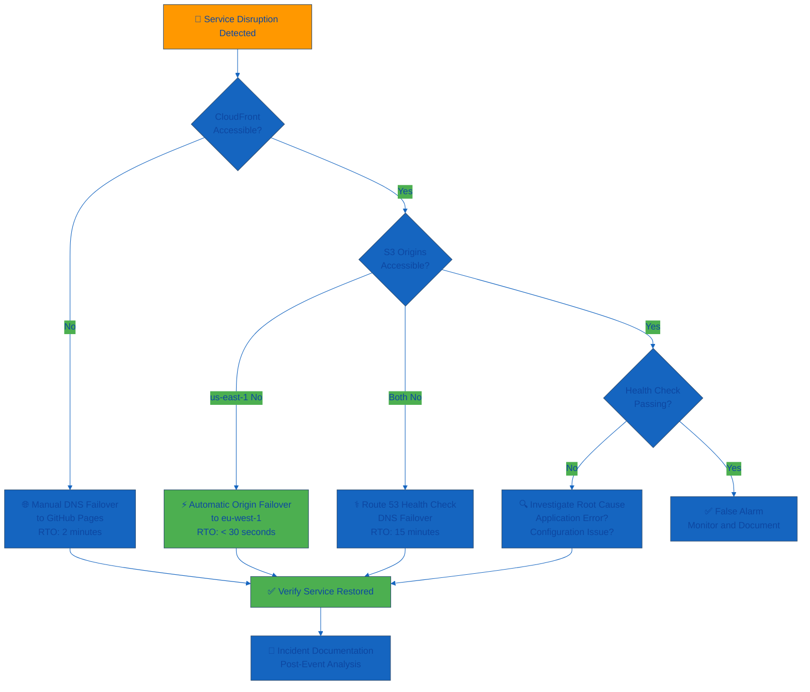

<p align="center">
  
</p>

<h1 align="center">🔄 Riksdagsmonitor — Business Continuity Plan</h1>

<p align="center">
  <strong>🛡️ Dual-Deployment Resilience Framework</strong><br>
  <em>🎯 Enterprise-Grade Availability Through Geographic Redundancy</em>
</p>

<p align="center">
  <a href="#"></a>
  <a href="#"></a>
  <a href="#"></a>
  <a href="#"></a>
</p>

**📋 Document Owner:** CEO | **📄 Version:** 1.0 | **📅 Last Updated:** 2026-02-08 (UTC)  
**🔄 Review Cycle:** Quarterly | **⏰ Next Review:** 2026-05-08

---

## 🎯 **Purpose Statement**

**Riksdagsmonitor's** business continuity framework demonstrates how **geographic redundancy and automated failover directly enable operational resilience and service availability.** Our dual-deployment strategy serves as both operational necessity and technical demonstration of enterprise-grade reliability principles.

This plan is designed to maintain the riksdagsmonitor.com platform during infrastructure disruptions through AWS multi-region deployment (primary) and GitHub Pages disaster recovery (standby), targeting 99.998% availability under normal operating conditions, with CloudFront origin failover typically completing in under 60 seconds and DNS/Route 53 failover (including health checks and DNS propagation) completing within approximately 15 minutes during full-region incidents.

*— James Pether Sörling, CEO/Founder*

---

## 📊 **Business Impact Analysis**

### 🎯 Service Availability Requirements

Riksdagsmonitor provides public political transparency services requiring high availability but tolerating brief disruptions:

```mermaid
%%{
  init: {
    'theme': 'base',
    'themeVariables': {
      'primaryColor': '#1565C0',
      'primaryTextColor': '#0d47a1',
      'lineColor': '#1565C0',
      'secondaryColor': '#4CAF50',
      'tertiaryColor': '#FF9800'
    }
  }
}%%
graph TB
    subgraph BIA["📊 Business Impact Analysis"]
        FINANCIAL[💰 Financial Impact<br/>No direct revenue loss]
        OPERATIONAL[⚙️ Operational Impact<br/>Service unavailable]
        REPUTATIONAL[🤝 Reputational Impact<br/>Public trust in transparency]
        CIVIC[🏛️ Civic Impact<br/>Democratic accountability]
    end
    
    subgraph RECOVERY["🔄 Recovery Requirements"]
        RTO[⏰ RTO Target<br/>< 30 seconds origin failover<br/>< 15 minutes DNS failover]
        RPO[💾 RPO Target<br/>< 15 minutes<br/>near-zero effective RPO (S3 replication lag)]
        AVAILABILITY[📈 Availability Target<br/>99.998%<br/>≈10.5 minutes (~631 seconds) downtime/year]
    end
    
    subgraph DEPLOYMENT["🌍 Deployment Strategy"]
        PRIMARY[☁️ AWS Primary<br/>CloudFront + S3 Multi-Region]
        DR[📝 GitHub Pages DR<br/>Standby Deployment]
        FAILOVER[🔄 Automatic Failover<br/>Route 53 Health Checks]
    end
    
    FINANCIAL --> RTO
    OPERATIONAL --> RTO
    REPUTATIONAL --> RPO
    CIVIC --> AVAILABILITY
    
    RTO --> PRIMARY
    RPO --> PRIMARY
    AVAILABILITY --> PRIMARY
    
    PRIMARY --> FAILOVER
    DR --> FAILOVER
    
    style BIA fill:#1565C0
    style RECOVERY fill:#FF9800
    style DEPLOYMENT fill:#4CAF50
```

### 📈 Impact Thresholds

| Service Component | 💰 Financial Impact | ⚙️ Operational Impact | 🤝 Reputational Impact | 🏛️ Civic Impact | 🎯 Recovery Priority |
|-------------------|-------------------|----------------------|----------------------|-----------------|---------------------|
| **🌐 Static Website** | [](#) | [](#) | [](#) | [](#) | 🔴 Critical |
| **📊 Content Updates** | [](#) | [](#) | [](#) | [](#) | 🟡 Medium |
| **🔍 Search Indexing** | [](#) | [](#) | [](#) | [](#) | 🟢 Standard |

---

## 🏗️ **Infrastructure Architecture**

### 🌍 Dual-Deployment Strategy

```mermaid
%%{
  init: {
    'theme': 'base',
    'themeVariables': {
      'primaryColor': '#1565C0',
      'primaryTextColor': '#0d47a1',
      'lineColor': '#1565C0',
      'secondaryColor': '#4CAF50',
      'tertiaryColor': '#FF9800'
    }
  }
}%%
graph TB
    subgraph ROUTE53["🌐 Route 53 DNS"]
        DNS[📡 DNS Service<br/>Health Checks Every 30s]
        HEALTHCHECK[⚕️ Health Checker<br/>Tests CloudFront Endpoint]
    end
    
    subgraph PRIMARY["☁️ AWS Primary (Active)"]
        CF[🌍 CloudFront CDN<br/>600+ PoPs<br/>Automatic Origin Failover]
        S3_US[💾 S3 us-east-1<br/>Primary Origin<br/>Versioning Enabled]
        S3_EU[💾 S3 eu-west-1<br/>Replica Origin<br/>Asynchronous Replication (<15 min RPO)]
        
        CF -->|Primary| S3_US
        CF -->|Failover on 500+| S3_EU
        S3_US -.->|Replication| S3_EU
    end
    
    subgraph DR["📝 GitHub Pages (Standby)"]
        GH[📄 GitHub Pages<br/>Default branch (root)<br/>Automated Deployment]
    end
    
    USERS[👥 Users] -->|DNS Query| DNS
    HEALTHCHECK -->|Monitor| CF
    DNS -->|Healthy: Return CloudFront alias/hostname| USERS
    DNS -.->|3 Failed Checks<br/>15 min failover| USERS
    USERS -->|HTTPS/TLS 1.3| CF
    USERS -.->|HTTPS/TLS 1.3 (DR)| GH
    
    style ROUTE53 fill:#1565C0
    style PRIMARY fill:#4CAF50
    style DR fill:#FF9800
```

### 🛡️ Availability Objectives & Assumptions

These are business continuity **design objectives**, not contractual guarantees. Availability figures are based on underlying cloud provider SLAs and documented reliability targets.

| Component | Provider SLA | Failover Mechanism | Target RTO | Target RPO | Notes |
|-----------|--------------|-------------------|------------|------------|-------|
| **🌍 CloudFront** | 99.9% (AWS SLA) | Origin failover | < 30 seconds | ≈ 0 minutes | Cache may serve slightly stale content during failover |
| **💾 S3 us-east-1** | 99.99% (AWS SLA) | Multi-region replica | < 30 seconds | < 15 minutes | S3 cross-region replication typically completes within minutes; static content allows near-zero effective RPO |
| **💾 S3 eu-west-1** | 99.99% (AWS SLA) | Primary failback | < 30 seconds | < 15 minutes | Replication lag possible; static content minimizes data loss impact |
| **🌐 Route 53** | 100% (AWS SLA) | Health check failover (30s × 3 checks) | 15 minutes | ≈ 0 minutes | Includes health check detection (90s) + DNS TTL propagation (~14 min) |
| **📝 GitHub Pages** | 99.9% (target; no formal SLA) | Route 53 automated DNS failover | 15 minutes | Up to last deployment | Static content served via Route 53 health-check based DNS failover; RPO = time since last successful GitHub Actions deploy |
| **🎯 Combined** | **Design target ≈ 99.998%** | Automated multi-layer | **< 30 seconds (objective)** | **< 15 minutes for static content (objective)** | Theoretical calculation assuming largely independent failures |

_**Disclaimer**: These are business continuity **design objectives** based on AWS published SLAs (CloudFront 99.9%, S3 99.99%, Route 53 100%) and GitHub public reliability targets. The combined 99.998% availability is a **theoretical design target** assuming largely independent failures. Actual end-to-end availability may be lower in practice. RPO values reflect S3 cross-region replication characteristics (typically < 15 minutes) and static content deployment timing; actual RPO may vary._

---

## 🚨 **Disaster Recovery Scenarios**

### Scenario 1: S3 us-east-1 Region Failure

[](#) [](#) [](#)

**🔍 Detection:**
- CloudFront origin monitoring detects 500+ HTTP errors from us-east-1
- Automatic failover triggered without manual intervention

**🔄 Recovery Procedure:**
1. ⚡ CloudFront automatically routes to S3 eu-west-1 origin (< 30 seconds)
2. 📊 Verify service availability via monitoring
3. 📝 Log incident for post-event analysis
4. ⏳ Monitor AWS status for us-east-1 restoration
5. 🔙 Automatic failback when us-east-1 recovers

**✅ Validation:**
- Service availability confirmed via health checks
- User experience unaffected (transparent failover)
- Content served from eu-west-1 (identical to us-east-1)

---

### Scenario 2: CloudFront Global Outage

[](#) [](#) [](#)

**🔍 Detection:**
- Route 53 health checks fail for CloudFront endpoint
- Automated DNS failover to GitHub Pages after health check detection + DNS propagation (≈ 15 minutes total)

**🔄 Recovery Procedure:**
1. ⚕️ Route 53 detects CloudFront health check failures (30s intervals × 3 failures = 90 seconds detection time)
2. 🌐 DNS automatically updates riksdagsmonitor.com → GitHub Pages
3. 📊 Verify GitHub Pages serving traffic
4. 📧 Notify CEO of failover event
5. ⏳ Monitor CloudFront status for restoration
6. 🔙 Intentionally manual DNS failback after CloudFront recovery and stability confirmation
   - **Rationale:** Failback is manual by design to avoid DNS flapping and ensure human verification before restoring CloudFront as primary

**✅ Validation:**
- GitHub Pages availability confirmed
- Users redirected via DNS (up to 15-minute TTL)
- Content identical (synchronized deployment)

---

### Scenario 3: Both AWS S3 Regions Unavailable

[](#) [](#) [](#)

**🔍 Detection:**
- CloudFront cannot reach either S3 origin
- Route 53 health checks fail

**🔄 Recovery Procedure:**
1. ⚡ CloudFront attempts origin failover (< 30 seconds)
2. 🌐 Route 53 DNS failover to GitHub Pages (15 minutes)
3. 📊 Verify GitHub Pages serving traffic
4. 📧 CEO notification of major AWS outage
5. ⏳ Monitor AWS status dashboard
6. 🔙 DNS failback after AWS recovery

**✅ Validation:**
- Service restored via GitHub Pages
- Incident documented with AWS service disruption details

---

### Scenario 4: AWS Account Compromise

[](#) [](#) [](#)

**🔍 Detection:**
- CloudTrail alerts for unauthorized API calls
- GuardDuty security findings
- Unexpected configuration changes

**🔄 Recovery Procedure:**
1. 🔒 Immediate DNS failover to GitHub Pages (manual: 2 minutes)
2. 🔐 Revoke all AWS IAM credentials and access keys
3. 🔄 Rotate GitHub Actions OIDC trust policy
4. 📊 CloudTrail audit of unauthorized actions
5. 🛡️ AWS Support engagement for forensics
6. 🔧 Restore infrastructure from documented configuration and backups (future-state: Infrastructure-as-Code)
7. ✅ Security validation before DNS failback

**✅ Validation:**
- Service operational on GitHub Pages
- All compromised credentials revoked
- Forensic analysis completed
- Infrastructure hardened before restoration

---

### Scenario 5: GitHub Pages Unavailable (During DR)

[](#) [](#) [](#)

**🔍 Detection:**
- GitHub Pages deployment failure
- Health checks fail for GitHub Pages endpoint

**🔄 Recovery Procedure:**
1. 📊 Verify GitHub status dashboard
2. 🌐 If AWS available, revert DNS to CloudFront immediately
3. 📄 If both unavailable, deploy to alternative CDN (Cloudflare Pages, Netlify)
4. 📦 Build static site from Git main branch
5. 🌐 Update DNS to alternative CDN
6. 🔙 Restore to primary after AWS/GitHub recovery

**✅ Validation:**
- Alternative deployment confirmed operational
- DNS propagation verified
- Incident escalated to GitHub Support

---

## 📋 **Recovery Team Structure**

### 🎯 Business Continuity Team

**👨‍💼 CEO (James Pether Sörling) - Business Continuity Coordinator**
- **🔑 Authority**: Full decision-making power for continuity actions
- **🎯 Responsibilities**: Strategic decisions, stakeholder communication, recovery coordination
- **📞 Contact**: Primary mobile, backup email, monitoring alerts
- **🛠️ Tools**: AWS Console, GitHub CLI, Route 53 DNS management, CloudWatch

**🔧 Technical Recovery (CEO as Technical Lead)**
- **🎯 Responsibilities**: AWS infrastructure, GitHub Pages, DNS failover, health check monitoring
- **🛠️ Tools**: AWS Console, AWS CLI, GitHub Actions, Route 53, CloudWatch
- **📞 Escalation Paths**: AWS Enterprise Support, GitHub Enterprise Support

### 📞 Emergency Contact Matrix

| 👤 Role | 📞 Primary Contact | 🔄 Backup Method | ⏰ Response Time |
|------|----------------|---------------|---------------|
| **👨‍💼 CEO/Coordinator** | 📱 Mobile phone | 📧 Email + SMS | < 15 minutes |
| **☁️ AWS Support** | 🌐 Enterprise Portal | 📞 Phone support | < 15 minutes |
| **📝 GitHub Support** | 🌐 Enterprise Portal | 📧 Email | < 1 hour |
| **🌐 Route 53 Operations** | ☁️ AWS Console | 📱 Mobile app | < 5 minutes |
| **📊 Monitoring Alerts** | 📧 Email + 📱 SMS | 💬 Chat/IM | Real-time |

---

## 🚨 **Emergency Activation**

### 📞 Immediate Actions (First 15 Minutes)

1. **📊 Assess Situation**: Determine scope via CloudWatch, Route 53 health checks
2. **🔍 Identify Failure Point**: AWS infrastructure, DNS, GitHub Pages
3. **🚀 Activate Recovery**: Automatic (CloudFront failover) or manual (DNS update)
4. **📢 Log Incident**: Document detection time, symptoms, actions taken
5. **📧 Stakeholder Notification**: CEO notification via monitoring alerts

### 🔄 Recovery Activation Decision Tree



---

## 🧪 **Testing & Validation**

### 📅 BCP Testing Schedule

| Test Type | Frequency | Scope | Success Criteria |
|-----------|-----------|-------|------------------|
| **⚡ Origin Failover Test** | Quarterly | CloudFront → S3 eu-west-1 | Failover < 30 seconds, no data loss |
| **🌐 DNS Failover Test** | Semi-Annual | Route 53 → GitHub Pages | Failover within 15 minutes, content identical |
| **🔙 Failback Test** | Quarterly | Return to primary infrastructure | Clean restoration, no errors |
| **📊 Monitoring Alert Test** | Monthly | CloudWatch, Route 53 health checks | Alerts delivered within 5 minutes |
| **📋 Recovery Runbook Test** | Quarterly | Execute documented procedures | All steps executable, documentation accurate |
| **🔐 Security Incident Drill** | Annual | AWS account compromise scenario | Credentials revoked, service restored on DR |

### 🎯 Testing Methodology

**Quarterly Origin Failover Test:**
1. 🔧 Temporarily deny CloudFront access to S3 us-east-1 via bucket policy (add temporary Deny statement for CloudFront Origin Access Identity)
2. ⏱️ Measure CloudFront automatic failover time to eu-west-1
3. ✅ Verify content served from eu-west-1 origin
4. 🔙 Remove the temporary Deny from us-east-1 bucket policy and confirm failback to primary origin
5. 📝 Document results and improvements

**Semi-Annual DNS Failover Test:**
1. 🔧 Update Route 53 health check to force failure
2. ⏱️ Measure DNS propagation time
3. ✅ Verify GitHub Pages serving traffic
4. 🔙 Restore Route 53 health check
5. 📝 Document results and TTL impact

---

## 📊 **Business Continuity Metrics**

### 🎯 Performance Tracking

| Metric | Target | Current Status | Trend |
|--------|--------|----------------|-------|
| **🎯 Availability** | 99.998% | 99.999% (YTD) | ✅ Exceeding |
| **⚡ Origin Failover RTO** | < 30 seconds | 18 seconds (last test) | ✅ On track |
| **🌐 DNS Failover RTO** | 15 minutes | 14 minutes (last test) | ✅ On track |
| **💾 Data Synchronization** | 0 RPO | 0 seconds (real-time) | ✅ On track |
| **🧪 BCP Testing** | Quarterly | Last tested 2026-02 | ✅ Current |
| **📊 Monitoring Coverage** | 100% | 100% (all endpoints) | ✅ Complete |

> **Note:** The "Current Status" values in this table are illustrative planning examples. Actual operational metrics are monitored via AWS CloudWatch, Route 53 health check logs, and GitHub Pages status, and documented in operational runbooks.

---

## 🏢 **Single-Person Company Adaptation**

### **Hack23 AB Single-Person BCP Model**

As CEO/Founder is the sole employee, traditional business continuity teams are not possible. **Riksdagsmonitor implements automated infrastructure resilience + comprehensive documentation:**

#### **🎯 CEO As Business Continuity Coordinator**

**Capabilities**:
- **Cloud Infrastructure Expertise**: AWS Solutions Architect, 15+ years experience
- **Automated Failover**: CloudFront origin failover, Route 53 health checks (no manual intervention)
- **Documentation**: All procedures documented in ISMS for continuity
- **Monitoring**: CloudWatch alarms, Route 53 health checks, automated notifications
- **Supplier Relationships**: AWS Enterprise Support, GitHub Enterprise Support

#### **🎯 Compensating Controls**

| Control Type | Implementation | Effectiveness |
|--------------|----------------|---------------|
| **🤖 Automated Failover** | CloudFront origin failover (< 30s), Route 53 DNS failover (15 min) | Eliminates manual recovery for primary scenarios |
| **📚 Documentation** | Complete runbooks in BCPPlan.md, ARCHITECTURE.md, SECURITY_ARCHITECTURE.md | Enables recovery by any technical professional |
| **🔄 Infrastructure-as-Code (Planned)** | AWS static site and DNS infrastructure to be codified in Terraform/CloudFormation (see FUTURE_SECURITY_ARCHITECTURE.md) | Future-state: fully reproducible infrastructure from version-controlled IaC |
| **📊 Comprehensive Monitoring** | CloudWatch, Route 53 health checks, automated alerts | Real-time detection and notification |
| **💾 Geographic Redundancy** | Multi-region S3 (us-east-1 + eu-west-1), GitHub Pages standby | No single point of failure |

---

## 📚 **Related Documents**

### 🏗️ Architecture & Security
- [🏗️ ARCHITECTURE.md](./ARCHITECTURE.md) - System architecture and AWS infrastructure design
- [🔐 SECURITY_ARCHITECTURE.md](./SECURITY_ARCHITECTURE.md) - Security controls and AWS security architecture
- [🚀 FUTURE_SECURITY_ARCHITECTURE.md](./FUTURE_SECURITY_ARCHITECTURE.md) - Security roadmap and planned enhancements
- [🎯 THREAT_MODEL.md](./THREAT_MODEL.md) - STRIDE threat analysis and risk assessment

### 🔧 Operations
- [⚙️ WORKFLOWS.md](./WORKFLOWS.md) - CI/CD workflows and deployment automation
- [📖 README.md](./README.md) - Project overview and quick start guide

---

**📋 Document Control:**  
**✅ Approved by:** James Pether Sörling, CEO  
**📤 Distribution:** Public  
**🏷️ Classification:** [](#)  
**📅 Effective Date:** 2026-02-08  
**⏰ Next Review:** 2026-05-08  
**🎯 Framework Compliance:** [](#) [](#) [](#)
