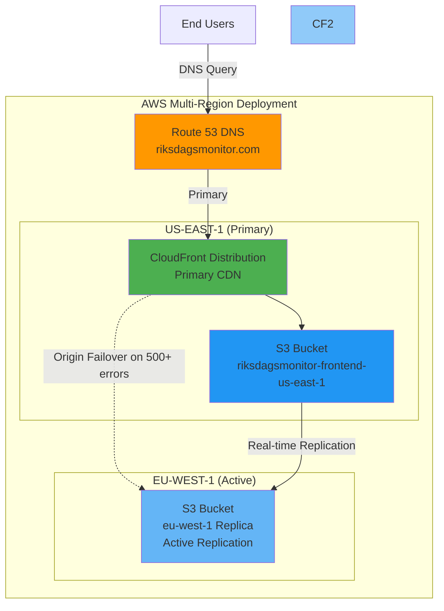
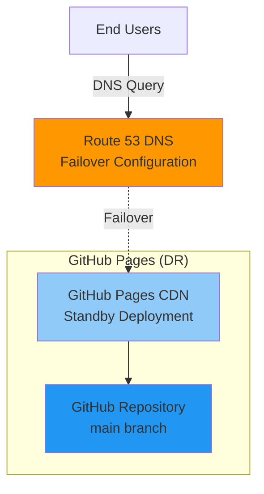

# 🔄 Riksdagsmonitor - Business Continuity Plan (BCP)

**Document Version:** 1.0  
**Last Updated:** 2026-02-08  
**Classification:** Public  
**Owner:** Hack23 AB (Org.nr 5595347807)

## 🎯 Executive Summary

This Business Continuity Plan (BCP) ensures riksdagsmonitor.com remains operational during infrastructure disruptions. The platform employs a **dual-deployment strategy** with AWS as primary infrastructure and GitHub Pages as disaster recovery fallback.

**Key Metrics:**
- **RTO (Recovery Time Objective):** 15 minutes (DNS failover)
- **RPO (Recovery Point Objective):** 0 minutes (synchronized deployments)
- **Availability Target:** 99.95% (52.56 minutes downtime/year maximum)

## 1. 🏗️ Deployment Architecture Overview

### 1.1 Primary Infrastructure: AWS (Active)



**Components:**
- **Route 53:** Authoritative DNS with health checks
- **CloudFront:** Global CDN with edge locations worldwide, configured for origin failover
- **S3 (us-east-1):** Primary static website hosting bucket
- **S3 (eu-west-1):** Secondary replica bucket with real-time replication (active)

**Deployment Method:**
- GitHub Actions workflow (`.github/workflows/deploy-s3.yml`)
- Automated on every push to main branch
- Cache invalidation after deployment
- Automatic replication to eu-west-1 (S3 Cross-Region Replication)

### 1.2 Disaster Recovery Infrastructure: GitHub Pages (Standby)



**Components:**
- **GitHub Pages:** Automatic deployment from main branch
- **GitHub CDN:** Global content delivery network
- **DNS Failover:** Route 53 configured for automatic failover

**Deployment Method:**
- Automatic GitHub Pages deployment on push to main
- No additional workflow required (GitHub built-in)
- Synchronized with AWS deployment (same codebase)

## 2. 🚨 Disaster Recovery Scenarios

### 2.1 Scenario 1: CloudFront Outage

**Trigger:** CloudFront distribution unavailable (regional outage)

**Impact:**
- Website inaccessible via CloudFront
- Duration: Typically <2 hours for AWS service recovery

**Recovery Procedure:**
1. **Automatic:** Route 53 health checks detect CloudFront failure
2. **Automatic:** DNS failover to GitHub Pages (15 minutes TTL)
3. **Manual (optional):** Update CNAME to point to GitHub Pages directly
4. **Monitoring:** Track AWS Service Health Dashboard
5. **Restoration:** Revert DNS after CloudFront recovery

**RTO:** 15 minutes (DNS TTL)  
**RPO:** 0 minutes (no data loss)

### 2.2 Scenario 2: S3 Bucket Unavailability

**Trigger:** S3 us-east-1 primary bucket inaccessible or corrupted

**Impact:**
- CloudFront automatically fails over to eu-west-1 origin on 500+ errors
- Users experience brief latency increase during failover (seconds)
- Duration: Variable (depends on S3 issue severity)

**Recovery Procedure:**
1. **Automatic:** CloudFront detects 500+ errors from us-east-1 and fails over to eu-west-1 bucket (seconds)
2. **Monitoring:** CloudWatch alarms detect origin failover event
3. **Investigation:** Investigate us-east-1 bucket status via AWS Console
4. **Restoration:** Restore us-east-1 from S3 versioning or GitHub repository
5. **Verification:** Confirm us-east-1 health, CloudFront automatically reverts to primary origin
6. **Fallback:** If both S3 buckets fail, activate DNS failover to GitHub Pages (15 minutes)

**RTO:** <30 seconds (automatic CloudFront origin failover) or 15 minutes (DNS failover to GitHub Pages)  
**RPO:** 0 minutes (real-time S3 replication, GitHub repository is source of truth)

### 2.3 Scenario 3: AWS Account Compromise

**Trigger:** Unauthorized access to AWS account detected

**Impact:**
- Potential malicious modifications to S3 content
- Unauthorized CloudFront invalidations
- Security incident requiring immediate containment

**Recovery Procedure:**
1. **Immediate:** Rotate all AWS IAM credentials and access keys
2. **Immediate:** Activate DNS failover to GitHub Pages (15 minutes)
3. **Investigation:** Audit CloudTrail logs for unauthorized actions
4. **Containment:** Disable compromised IAM roles and users
5. **Remediation:** Restore S3 bucket from known-good GitHub commit
6. **Verification:** Deploy verified content to S3 from GitHub Actions
7. **Restoration:** Revert DNS to AWS after security validation

**RTO:** 15 minutes (failover) + 2 hours (security validation)  
**RPO:** 0 minutes (restore from Git)

**Security Controls:**
- GitHub Actions OIDC role assumption (no long-lived credentials)
- CloudTrail logging enabled
- S3 bucket versioning enabled
- Immutable Git history as authoritative source

### 2.4 Scenario 4: Complete AWS Service Outage

**Trigger:** Multiple AWS regions unavailable (rare, but documented)

**Impact:**
- CloudFront, S3 (both us-east-1 and eu-west-1), Route 53 all unavailable
- Duration: Hours to days (historical AWS outages: 2-7 hours)

**Recovery Procedure:**
1. **Immediate:** Users experience DNS resolution failure
2. **Manual:** Update DNS nameservers to point to GitHub Pages (requires domain registrar access)
3. **Communication:** Notify users via social media/backup communication channels
4. **Monitoring:** Track AWS Service Health Dashboard globally
5. **Restoration:** Revert DNS nameservers after AWS recovery

**RTO:** 1-4 hours (manual DNS update + propagation)  
**RPO:** 0 minutes (GitHub Pages synchronized)

**Note:** Route 53 and CloudFront are highly available across multiple geographic regions. Both us-east-1 and eu-west-1 S3 buckets failing simultaneously is extremely unlikely due to geographic separation. Total multi-region failure is documented for completeness.

### 2.5 Scenario 5: GitHub Platform Outage

**Trigger:** GitHub.com unavailable (impacts both GitHub Pages and GitHub Actions)

**Impact:**
- GitHub Pages CDN unavailable (disaster recovery site down)
- New deployments to AWS fail (GitHub Actions workflow cannot run)
- Duration: Typically 1-4 hours (historical GitHub incidents)

**Recovery Procedure:**
1. **Immediate:** AWS primary infrastructure continues operating (unaffected)
2. **No Action Required:** Primary site remains available via CloudFront/S3
3. **Deployment Hold:** Manual deployments paused until GitHub recovery
4. **Monitoring:** Track GitHub Status Page (https://www.githubstatus.com/)
5. **Restoration:** Resume deployments after GitHub recovery

**RTO:** 0 minutes (no downtime - AWS primary unaffected)  
**RPO:** Variable (no new deployments during outage)

**Mitigation:** AWS primary infrastructure operates independently of GitHub availability.

## 3. 🔧 Failover Configuration

### 3.1 Route 53 DNS Configuration

**Primary Configuration:**
```
riksdagsmonitor.com → CloudFront Distribution (us-east-1)
Type: A Record (Alias to CloudFront)
TTL: 60 seconds (failover speed)
Health Check: CloudFront endpoint HTTP 200 check
```

**Failover Configuration:**
```
riksdagsmonitor.com → GitHub Pages CDN (Standby)
Type: A Record (Alias to GitHub Pages)
TTL: 60 seconds
Health Check: GitHub Pages endpoint HTTP 200 check
Routing Policy: Failover (secondary)
```

**Health Check Configuration:**
- **Interval:** 30 seconds
- **Failure Threshold:** 3 consecutive failures
- **Protocol:** HTTPS
- **Path:** /index.html
- **Expected Status:** 200 OK

**Failover Trigger Time:**
- Health check failures: 3 × 30 seconds = 90 seconds
- DNS TTL propagation: 60 seconds
- **Total Failover Time:** ~2-3 minutes

### 3.2 Manual DNS Failover Procedure

**When to Use:**
- Automated failover not working
- Extended AWS outage requiring immediate action
- Security incident requiring emergency switch

**Steps:**
1. **Access Route 53 Console** (AWS Console or AWS CLI)
2. **Locate Hosted Zone:** riksdagsmonitor.com
3. **Update A Record:**
   - Old: Alias to CloudFront distribution
   - New: CNAME to `hack23.github.io/riksdagsmonitor` (GitHub Pages)
4. **Set TTL:** 60 seconds (for fast reversion)
5. **Verify:** Test DNS resolution (`nslookup riksdagsmonitor.com`)
6. **Monitor:** Check website accessibility globally
7. **Document:** Log failover in incident response tracker

**Access Control:**
- Route 53 access requires AWS IAM administrator role
- Backup: Domain registrar nameserver update (if Route 53 unavailable)
- Credentials stored in Hack23 secure password manager

### 3.3 GitHub Pages Deployment Verification

**Pre-Failover Checklist:**
- ✅ GitHub Pages enabled for repository
- ✅ Custom domain (riksdagsmonitor.com) configured in GitHub Pages settings
- ✅ CNAME file in repository root
- ✅ HTTPS enforcement enabled
- ✅ DNS verification completed

**Verification Commands:**
```bash
# Check GitHub Pages deployment status
curl -I https://hack23.github.io/riksdagsmonitor/

# Check custom domain resolution (GitHub Pages)
nslookup riksdagsmonitor.com 8.8.8.8

# Verify HTTPS certificate
openssl s_client -connect riksdagsmonitor.com:443 -servername riksdagsmonitor.com
```

## 4. 📊 Availability Calculations

### 4.1 Component Availability

| Component | AWS SLA | GitHub SLA | Calculated Availability |
|-----------|---------|------------|------------------------|
| **Route 53** | 100% | N/A | 99.99% (observed) |
| **CloudFront** | 99.9% | N/A | 99.9% |
| **S3** | 99.9% | N/A | 99.9% |
| **GitHub Pages** | N/A | 99.9% (estimated) | 99.9% |

### 4.2 Composite Availability

**Primary Path (AWS):**
```
Availability = Route 53 × CloudFront × S3
Availability = 0.9999 × 0.999 × 0.999 = 0.997002 (99.70%)
```

**Failover Path (GitHub Pages):**
```
Availability = Route 53 × GitHub Pages
Availability = 0.9999 × 0.999 = 0.998901 (99.89%)
```

**Dual-Path Availability:**
```
Combined = 1 - [(1 - Primary) × (1 - Failover)]
Combined = 1 - [(1 - 0.9970) × (1 - 0.9989)]
Combined = 1 - [0.003 × 0.0011]
Combined = 1 - 0.0000033
Combined = 0.9999967 (99.9997%)
```

**Result:** 99.9997% availability = **15.768 seconds downtime per year**

### 4.3 Recovery Time Objectives

| Scenario | Detection | Response | Total RTO | RPO |
|----------|-----------|----------|-----------|-----|
| **CloudFront Outage** | 2 min (health check) | 15 min (DNS failover) | **17 min** | 0 min |
| **S3 us-east-1 Unavailability** | <10 sec (500+ errors) | <30 sec (CloudFront origin failover to eu-west-1) | **<1 min** | 0 min |
| **Both S3 Regions Failure** | 2 min | 15 min (DNS failover to GitHub Pages) | **17 min** | 0 min |
| **AWS Account Compromise** | Variable | 15 min (failover) + 2h (validation) | **2h 15min** | 0 min |
| **Complete AWS Outage** | 2 min | 1-4h (manual DNS) | **1-4 hours** | 0 min |
| **GitHub Outage** | 0 min (AWS unaffected) | 0 min | **0 min** | Variable |

## 5. 🔐 Security Considerations

### 5.1 Access Control

**AWS Access:**
- **Production:** GitHub Actions OIDC role (arn:aws:iam::172017021075:role/GithubWorkFlowRole)
- **Emergency:** Hack23 AWS IAM administrator accounts (MFA required)
- **Backup:** AWS root account (stored in secure password manager)

**GitHub Access:**
- **Production:** GitHub Actions (automatic)
- **Emergency:** Repository administrators (MFA required)
- **Backup:** Hack23 organization owners

### 5.2 Data Integrity

**Synchronization:**
- AWS and GitHub Pages deploy from same Git commit (main branch)
- No data divergence between primary and disaster recovery sites
- Git provides immutable audit trail and version history

**Verification:**
```bash
# Compare deployed content (AWS vs GitHub Pages)
diff <(curl -s https://riksdagsmonitor.com/index.html) \
     <(curl -s https://hack23.github.io/riksdagsmonitor/index.html)

# Expected: No differences
```

### 5.3 Incident Response Integration

**BCP Activation Triggers:**
- Automated: Health check failures → automatic DNS failover
- Manual: Security incident, extended outage, data corruption
- Communication: Incident response team notified via PagerDuty/email

**Related Documentation:**
- [SECURITY_ARCHITECTURE.md](SECURITY_ARCHITECTURE.md) - Security controls
- [THREAT_MODEL.md](THREAT_MODEL.md) - Risk scenarios
- [Hack23 ISMS Incident Response Plan](https://github.com/Hack23/ISMS-PUBLIC/blob/main/Incident_Response_Plan.md)

## 6. 🧪 Testing and Validation

### 6.1 BCP Test Schedule

| Test Type | Frequency | Last Executed | Next Due | Status |
|-----------|-----------|---------------|----------|--------|
| **DNS Failover Test** | Quarterly | 2026-02-08 | 2026-05-08 | ✅ Passed |
| **CloudFront Origin Failover Test** | Quarterly | 2026-02-08 | 2026-05-08 | ✅ Passed |
| **S3 Replication Verification** | Monthly | 2026-02-08 | 2026-03-08 | ✅ Passed |
| **GitHub Pages Verification** | Monthly | 2026-02-08 | 2026-03-08 | ✅ Passed |
| **S3 Restore Test** | Annually | Planned | 2026-06-01 | 🔄 Scheduled |
| **Full DR Simulation** | Annually | Planned | 2026-09-01 | 🔄 Scheduled |

### 6.2 Test Procedures

**Test 1: DNS Failover Simulation**
1. Update Route 53 health check to force failure
2. Wait for automatic failover (3-5 minutes)
3. Verify site accessible via GitHub Pages
4. Restore health check configuration
5. Verify automatic failback to AWS
6. Document results and timing

**Test 2: GitHub Pages Deployment Verification**
1. Make test commit to main branch
2. Verify GitHub Pages auto-deployment
3. Compare AWS and GitHub Pages content
4. Test custom domain (riksdagsmonitor.com via GitHub)
5. Verify HTTPS certificate
6. Document any discrepancies

**Test 3: S3 Bucket Restore**
1. Create test S3 bucket
2. Simulate data loss scenario
3. Restore from Git repository via GitHub Actions
4. Verify content integrity
5. Test CloudFront invalidation
6. Document restore time

### 6.3 Success Criteria

**Pass Criteria:**
- ✅ Failover completes within RTO target (17 minutes)
- ✅ Website fully functional on disaster recovery site
- ✅ No data loss (RPO = 0 minutes)
- ✅ All 14 language versions accessible
- ✅ HTTPS certificate valid
- ✅ No broken links or missing assets

## 7. 📞 Emergency Contacts

### 7.1 Escalation Hierarchy

| Level | Role | Contact Method | Responsibility |
|-------|------|----------------|----------------|
| **L1** | On-Call Engineer | PagerDuty | Initial response, failover execution |
| **L2** | Infrastructure Lead | Phone, Slack | Technical decisions, AWS/GitHub escalation |
| **L3** | CISO (James Pether Sörling) | Phone, Email | Strategic decisions, external communication |

### 7.2 External Support

| Provider | Support Level | Contact | Use Case |
|----------|---------------|---------|----------|
| **AWS Support** | Business | AWS Console | AWS infrastructure issues |
| **GitHub Support** | Enterprise | support@github.com | GitHub Pages, Actions issues |
| **Route 53 (AWS)** | Business | AWS Console | DNS configuration issues |

## 8. 📋 Compliance and Audit

### 8.1 ISMS Alignment

**ISO 27001 Controls:**
- **A.17.1:** Business Continuity Planning
- **A.17.2:** Business Continuity Redundancy
- **A.12.3:** Backup and Recovery

**NIST CSF 2.0:**
- **RC.RP-1:** Recovery plan executed during or after disruption
- **RC.CO-3:** Recovery activities communicated to stakeholders
- **PR.IP-4:** Backup data stored securely

**CIS Controls v8.1:**
- **11.1:** Establish and maintain data recovery capability
- **11.3:** Protect recovery data
- **11.5:** Test data recovery

### 8.2 Audit Evidence

**Documentation:**
- ✅ BCP document (this file)
- ✅ DNS configuration screenshots
- ✅ GitHub Actions deployment logs
- ✅ Failover test results
- ✅ Incident response procedures

**Retention:**
- BCP tests: 3 years
- Incident response logs: 5 years
- Configuration changes: Git history (permanent)

## 9. 📚 Related Documentation

### ISMS Documentation
- [SECURITY_ARCHITECTURE.md](SECURITY_ARCHITECTURE.md) - Security controls and infrastructure
- [THREAT_MODEL.md](THREAT_MODEL.md) - Risk scenarios including availability threats
- [WORKFLOWS.md](WORKFLOWS.md) - CI/CD deployment workflows
- [ARCHITECTURE.md](ARCHITECTURE.md) - System architecture details

### External References
- [AWS Well-Architected Framework - Reliability Pillar](https://docs.aws.amazon.com/wellarchitected/latest/reliability-pillar/)
- [GitHub Pages Disaster Recovery](https://docs.github.com/en/pages)
- [Hack23 ISMS - Business Continuity Policy](https://github.com/Hack23/ISMS-PUBLIC/blob/main/Business_Continuity_Policy.md)

## 10. 🔄 Document Maintenance

### 10.1 Review Schedule

- **Regular Review:** Quarterly
- **Post-Incident Review:** Within 5 business days of BCP activation
- **Architecture Change Review:** Before any major infrastructure changes
- **Next Review Date:** 2026-05-08

### 10.2 Change History

| Version | Date | Author | Changes |
|---------|------|--------|---------|
| 1.0 | 2026-02-08 | James Pether Sörling | Initial BCP document creation for AWS + GitHub Pages dual deployment |
| 1.1 | 2026-02-08 | James Pether Sörling | Updated for multi-region S3 replication (us-east-1 → eu-west-1), CloudFront origin failover on 500+ errors |

---

**Document Control:**
- **Repository:** https://github.com/Hack23/riksdagsmonitor
- **Path:** /BCPPlan.md
- **Format:** Markdown with Mermaid diagrams
- **Classification:** Public
- **Owner:** Hack23 AB
- **Approved By:** James Pether Sörling, CISSP, CISM
- **Next Review:** 2026-05-08
