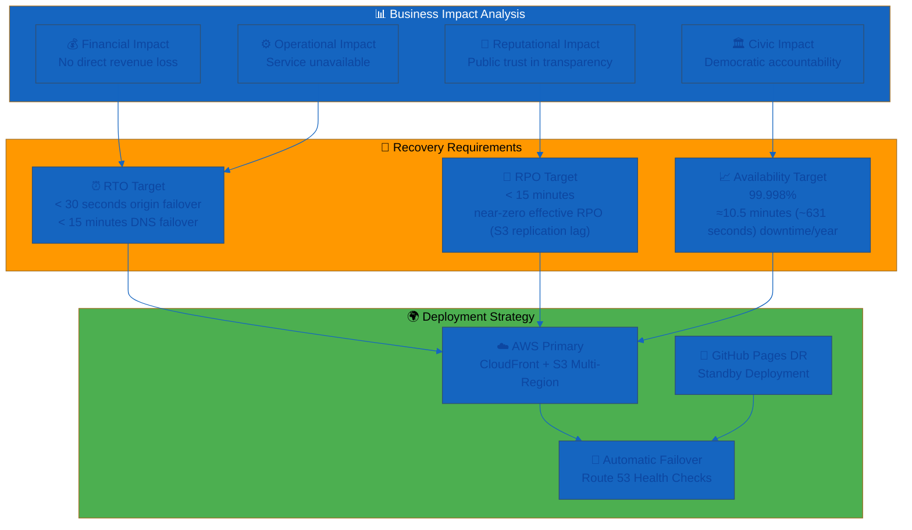
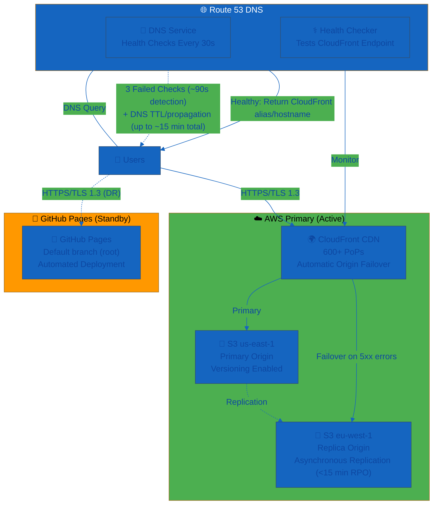
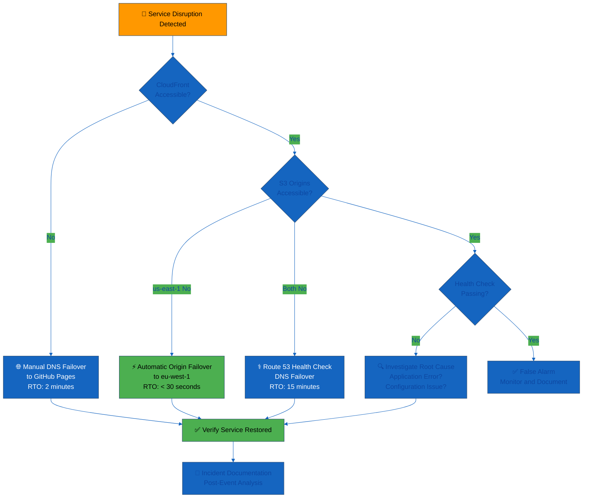

<p align="center">
  
</p>

<h1 align="center">🔄 Riksdagsmonitor — Business Continuity Plan</h1>

<p align="center">
  <strong>🛡️ Dual-Deployment Resilience Framework</strong><br>
  <em>🎯 Enterprise-Grade Availability Through Geographic Redundancy</em>
</p>

<p align="center">
  
  
  
  
</p>

**📋 Document Owner:** CEO | **📄 Version:** 1.3 | **📅 Last Updated:** 2026-05-28 (UTC)  
**🔄 Review Cycle:** Quarterly | **⏰ Next Review:** 2026-08-28  
**📌 Classification:** Public

---

## 🎯 **Purpose Statement**

**Riksdagsmonitor's** business continuity framework demonstrates how **geographic redundancy and automated failover directly enable operational resilience and service availability.** Our dual-deployment strategy serves as both operational necessity and technical demonstration of enterprise-grade reliability principles.

This plan is designed to maintain the riksdagsmonitor.com platform during infrastructure disruptions through AWS multi-region deployment (primary) and GitHub Pages disaster recovery (standby), targeting 99.998% availability under normal operating conditions, with CloudFront origin failover typically completing in under 60 seconds and DNS/Route 53 failover (including health checks and DNS propagation) completing within approximately 15 minutes during full-region incidents.

*— James Pether Sörling, CEO/Founder*

---

## 📊 **Business Impact Analysis**

### 🎯 Service Availability Requirements

Riksdagsmonitor provides public political transparency services requiring high availability but tolerating brief disruptions:


```mermaid
%%{
  init: {
    "theme": "base",
    "themeVariables": {
      "primaryColor": "#1565C0",
      "primaryTextColor": "#0d47a1",
      "lineColor": "#1565C0",
      "secondaryColor": "#4CAF50",
      "tertiaryColor": "#FF9800"
    }
  }
}%%
graph TB
    subgraph BIA["📊 Business Impact Analysis"]
        FINANCIAL[💰 Financial Impact<br/>No direct revenue loss]
        OPERATIONAL[⚙️ Operational Impact<br/>Service unavailable]
        REPUTATIONAL[🤝 Reputational Impact<br/>Public trust in transparency]
        CIVIC[🏛️ Civic Impact<br/>Democratic accountability]
    end
    
    subgraph RECOVERY["🔄 Recovery Requirements"]
        RTO["⏰ RTO Target<br/>&lt; 30 seconds origin failover<br/>&lt; 15 minutes DNS failover"]
        RPO["💾 RPO Target<br/>&lt; 15 minutes<br/>near-zero effective RPO (S3 replication lag)"]
        AVAILABILITY["📈 Availability Target<br/>99.998%<br/>≈10.5 minutes (~631 seconds) downtime/year"]
    end
    
    subgraph DEPLOYMENT["🌍 Deployment Strategy"]
        PRIMARY[☁️ AWS Primary<br/>CloudFront + S3 Multi-Region]
        DR[📝 GitHub Pages DR<br/>Standby Deployment]
        FAILOVER[🔄 Automatic Failover<br/>Route 53 Health Checks]
    end
    
    FINANCIAL --> RTO
    OPERATIONAL --> RTO
    REPUTATIONAL --> RPO
    CIVIC --> AVAILABILITY
    
    RTO --> PRIMARY
    RPO --> PRIMARY
    AVAILABILITY --> PRIMARY
    
    PRIMARY --> FAILOVER
    DR --> FAILOVER
    
    style BIA fill:#1565C0,color:#ffffff
    style RECOVERY fill:#FF9800,color:#000000
    style DEPLOYMENT fill:#4CAF50,color:#000000
```

### 📈 Impact Thresholds

| Service Component | 💰 Financial Impact | ⚙️ Operational Impact | 🤝 Reputational Impact | 🏛️ Civic Impact | 🎯 Recovery Priority |
|-------------------|-------------------|----------------------|----------------------|-----------------|---------------------|
| **🌐 Static Website** | [](#) | [](#) | [](#) | [](#) | 🔴 Critical |
| **📊 Content Updates** | [](#) | [](#) | [](#) | [](#) | 🟡 Medium |
| **🔍 Search Indexing** | [](#) | [](#) | [](#) | [](#) | 🟢 Standard |

---

## 🏗️ **Infrastructure Architecture**

### 🌍 Dual-Deployment Strategy


```mermaid
%%{
  init: {
    "theme": "base",
    "themeVariables": {
      "primaryColor": "#1565C0",
      "primaryTextColor": "#0d47a1",
      "lineColor": "#1565C0",
      "secondaryColor": "#4CAF50",
      "tertiaryColor": "#FF9800"
    }
  }
}%%
graph TB
    subgraph ROUTE53["🌐 Route 53 DNS"]
        DNS[📡 DNS Service<br/>Health Checks Every 30s]
        HEALTHCHECK[⚕️ Health Checker<br/>Tests CloudFront Endpoint]
    end
    
    subgraph PRIMARY["☁️ AWS Primary (Active)"]
        CF["🌍 CloudFront CDN<br/>600+ PoPs<br/>Automatic Origin Failover"]
        S3_US[💾 S3 us-east-1<br/>Primary Origin<br/>Versioning Enabled]
        S3_EU["💾 S3 eu-west-1<br/>Replica Origin<br/>Asynchronous Replication (&lt;15 min RPO)"]
        
        CF -->|Primary| S3_US
        CF -->|Failover on 5xx errors| S3_EU
        S3_US -.->|Replication| S3_EU
    end
    
    subgraph DR["📝 GitHub Pages (Standby)"]
        GH["📄 GitHub Pages<br/>Default branch (root)<br/>Automated Deployment"]
    end
    
    USERS[👥 Users] -->|DNS Query| DNS
    HEALTHCHECK -->|Monitor| CF
    DNS -->|"Healthy: Return CloudFront alias/hostname"| USERS
    DNS -.->|"3 Failed Checks (~90s detection)<br/>+ DNS TTL/propagation (up to ~15 min total)"| USERS
    USERS -->|"HTTPS/TLS 1.3"| CF
    USERS -.->|"HTTPS/TLS 1.3 (DR)"| GH
    
    style ROUTE53 fill:#1565C0,color:#ffffff
    style PRIMARY fill:#4CAF50,color:#000000
    style DR fill:#FF9800,color:#000000
```

### 🛡️ Availability Objectives & Assumptions

These are business continuity **design objectives**, not contractual guarantees. Availability figures are based on underlying cloud provider SLAs and documented reliability targets.

| Component | Provider SLA | Failover Mechanism | Target RTO | Target RPO | Notes |
|-----------|--------------|-------------------|------------|------------|-------|
| **🌍 CloudFront** | 99.9% (AWS SLA) | Origin failover | < 30 seconds | ≈ 0 minutes | Cache may serve slightly stale content during failover |
| **💾 S3 us-east-1** | 99.99% (AWS SLA) | Multi-region replica | < 30 seconds | < 15 minutes | S3 cross-region replication typically completes within minutes; static content allows near-zero effective RPO |
| **💾 S3 eu-west-1** | 99.99% (AWS SLA) | Primary failback | < 30 seconds | < 15 minutes | Replication lag possible; static content minimizes data loss impact |
| **🌐 Route 53** | 100% (AWS SLA) | Health check failover (30s × 3 checks) | 15 minutes | ≈ 0 minutes | Includes health check detection (90s) + DNS TTL propagation (~14 min) |
| **📝 GitHub Pages** | 99.9% (target; no formal SLA) | Route 53 automated DNS failover | 15 minutes | Up to last deployment | Static content served via Route 53 health-check based DNS failover; RPO = time since last successful GitHub Actions deploy |
| **🎯 Combined** | **Design target ≈ 99.998%** | Automated multi-layer | **< 30 seconds (objective)** | **< 15 minutes for static content (objective)** | Theoretical calculation assuming largely independent failures |

_**Disclaimer**: These are business continuity **design objectives** based on AWS published SLAs (CloudFront 99.9%, S3 99.99%, Route 53 100%) and GitHub public reliability targets. The combined 99.998% availability is a **theoretical design target** assuming largely independent failures. Actual end-to-end availability may be lower in practice. RPO values reflect S3 cross-region replication characteristics (typically < 15 minutes) and static content deployment timing; actual RPO may vary._

---

## 🚨 **Disaster Recovery Scenarios**

### Scenario 1: S3 us-east-1 Region Failure

[](#) [](#) [](#)

**🔍 Detection:**
- CloudFront origin monitoring detects 500+ HTTP errors from us-east-1
- Automatic failover triggered without manual intervention

**🔄 Recovery Procedure:**
1. ⚡ CloudFront automatically routes to S3 eu-west-1 origin (< 30 seconds)
2. 📊 Verify service availability via monitoring
3. 📝 Log incident for post-event analysis
4. ⏳ Monitor AWS status for us-east-1 restoration
5. 🔙 Automatic failback when us-east-1 recovers

**✅ Validation:**
- Service availability confirmed via health checks
- User experience unaffected (transparent failover)
- Content served from eu-west-1 (identical to us-east-1)

---

### Scenario 2: CloudFront Global Outage

[](#) [](#) [](#)

**🔍 Detection:**
- Route 53 health checks fail for CloudFront endpoint
- Automated DNS failover to GitHub Pages after health check detection + DNS propagation (≈ 15 minutes total)

**🔄 Recovery Procedure:**
1. ⚕️ Route 53 detects CloudFront health check failures (30s intervals × 3 failures = 90 seconds detection time)
2. 🌐 DNS automatically updates riksdagsmonitor.com → GitHub Pages
3. 📊 Verify GitHub Pages serving traffic
4. 📧 Notify CEO of failover event
5. ⏳ Monitor CloudFront status for restoration
6. 🔙 Intentionally manual DNS failback after CloudFront recovery and stability confirmation
   - **Rationale:** Failback is manual by design to avoid DNS flapping and ensure human verification before restoring CloudFront as primary

**✅ Validation:**
- GitHub Pages availability confirmed
- Users redirected via DNS (up to 15-minute TTL)
- Content identical (synchronized deployment)

---

### Scenario 3: Both AWS S3 Regions Unavailable

[](#) [](#) [](#)

**🔍 Detection:**
- CloudFront cannot reach either S3 origin
- Route 53 health checks fail

**🔄 Recovery Procedure:**
1. ⚡ CloudFront attempts origin failover (< 30 seconds)
2. 🌐 Route 53 DNS failover to GitHub Pages (15 minutes)
3. 📊 Verify GitHub Pages serving traffic
4. 📧 CEO notification of major AWS outage
5. ⏳ Monitor AWS status dashboard
6. 🔙 DNS failback after AWS recovery

**✅ Validation:**
- Service restored via GitHub Pages
- Incident documented with AWS service disruption details

---

### Scenario 4: AWS Account Compromise

[](#) [](#) [](#)

**🔍 Detection:**
- CloudTrail alerts for unauthorized API calls
- GuardDuty security findings
- Unexpected configuration changes

**🔄 Recovery Procedure:**
1. 🔒 Immediate DNS failover to GitHub Pages (operator action: 2 minutes; client-visible cutover: up to DNS TTL propagation ~15 minutes)
2. 🔐 Revoke all AWS IAM credentials and access keys
3. 🔄 Update AWS IAM role trust policy for GitHub Actions OIDC provider to revoke compromised trust
4. 📊 CloudTrail audit of unauthorized actions
5. 🛡️ AWS Support engagement for forensics
6. 🔧 Restore infrastructure from documented configuration and backups (future-state: Infrastructure-as-Code)
7. ✅ Security validation before DNS failback

**✅ Validation:**
- Service operational on GitHub Pages
- All compromised credentials revoked
- Forensic analysis completed
- Infrastructure hardened before restoration

---

### Scenario 5: GitHub Pages Unavailable (During DR)

[](#) [](#) [](#)

**🔍 Detection:**
- GitHub Pages deployment failure
- Health checks fail for GitHub Pages endpoint

**🔄 Recovery Procedure:**
1. 📊 Verify GitHub status dashboard
2. 🌐 If AWS available, revert DNS to CloudFront immediately
3. 📄 If both unavailable, deploy to alternative CDN (Cloudflare Pages, Netlify)
4. 📦 Build static site from Git main branch
5. 🌐 Update DNS to alternative CDN
6. 🔙 Restore to primary after AWS/GitHub recovery

**✅ Validation:**
- Alternative deployment confirmed operational
- DNS propagation verified
- Incident escalated to GitHub Support

---

## 📋 **Recovery Team Structure**

### 🎯 Business Continuity Team

**👨‍💼 CEO (James Pether Sörling) - Business Continuity Coordinator**
- **🔑 Authority**: Full decision-making power for continuity actions
- **🎯 Responsibilities**: Strategic decisions, stakeholder communication, recovery coordination
- **📞 Contact**: Primary mobile, backup email, monitoring alerts
- **🛠️ Tools**: AWS Console, GitHub CLI, Route 53 DNS management, CloudWatch

**🔧 Technical Recovery (CEO as Technical Lead)**
- **🎯 Responsibilities**: AWS infrastructure, GitHub Pages, DNS failover, health check monitoring
- **🛠️ Tools**: AWS Console, AWS CLI, GitHub Actions, Route 53, CloudWatch
- **📞 Escalation Paths**: AWS Enterprise Support, GitHub Enterprise Support

### 📞 Emergency Contact Matrix

| 👤 Role | 📞 Primary Contact | 🔄 Backup Method | ⏰ Response Time |
|------|----------------|---------------|---------------|
| **👨‍💼 CEO/Coordinator** | 📱 Mobile phone | 📧 Email + SMS | < 15 minutes |
| **☁️ AWS Support** | 🌐 Enterprise Portal | 📞 Phone support | < 15 minutes |
| **📝 GitHub Support** | 🌐 Enterprise Portal | 📧 Email | < 1 hour |
| **🌐 Route 53 Operations** | ☁️ AWS Console | 📱 Mobile app | < 5 minutes |
| **📊 Monitoring Alerts** | 📧 Email + 📱 SMS | 💬 Chat/IM | Real-time |

---

## 🚨 **Emergency Activation**

### 📞 Immediate Actions (First 15 Minutes)

1. **📊 Assess Situation**: Determine scope via CloudWatch, Route 53 health checks
2. **🔍 Identify Failure Point**: AWS infrastructure, DNS, GitHub Pages
3. **🚀 Activate Recovery**: Automatic (CloudFront failover) or manual (DNS update)
4. **📢 Log Incident**: Document detection time, symptoms, actions taken
5. **📧 Stakeholder Notification**: CEO notification via monitoring alerts

### 🔄 Recovery Activation Decision Tree


```mermaid
%%{
  init: {
    "theme": "base",
    "themeVariables": {
      "primaryColor": "#1565C0",
      "primaryTextColor": "#0d47a1",
      "lineColor": "#1565C0",
      "secondaryColor": "#4CAF50",
      "tertiaryColor": "#FF9800"
    }
  }
}%%
graph TD
    INCIDENT[🚨 Service Disruption Detected] --> CHECK_CF{CloudFront<br/>Accessible?}
    
    CHECK_CF -->|No| MANUAL_DNS[🌐 Manual DNS Failover<br/>to GitHub Pages<br/>RTO: 2 minutes]
    CHECK_CF -->|Yes| CHECK_S3{S3 Origins<br/>Accessible?}
    
    CHECK_S3 -->|us-east-1 No| AUTO_FAILOVER[⚡ Automatic Origin Failover<br/>to eu-west-1<br/>RTO: &lt; 30 seconds]
    CHECK_S3 -->|Both No| ROUTE53_FAILOVER[⚕️ Route 53 Health Check<br/>DNS Failover<br/>RTO: 15 minutes]
    CHECK_S3 -->|Yes| CHECK_HEALTH{Health Check<br/>Passing?}
    
    CHECK_HEALTH -->|No| INVESTIGATE[🔍 Investigate Root Cause<br/>Application Error?<br/>Configuration Issue?]
    CHECK_HEALTH -->|Yes| FALSE_ALARM[✅ False Alarm<br/>Monitor and Document]
    
    MANUAL_DNS --> VERIFY[✅ Verify Service Restored]
    AUTO_FAILOVER --> VERIFY
    ROUTE53_FAILOVER --> VERIFY
    INVESTIGATE --> VERIFY
    
    VERIFY --> DOCUMENT[📝 Incident Documentation<br/>Post-Event Analysis]
    
    style INCIDENT fill:#FF9800,color:#000000
    style MANUAL_DNS fill:#1565C0,color:#ffffff
    style AUTO_FAILOVER fill:#4CAF50,color:#000000
    style ROUTE53_FAILOVER fill:#1565C0,color:#ffffff
    style VERIFY fill:#4CAF50,color:#000000
```

---

## 🧪 **Testing & Validation**

### 📅 BCP Testing Schedule

| Test Type | Frequency | Scope | Success Criteria |
|-----------|-----------|-------|------------------|
| **⚡ Origin Failover Test** | Quarterly | CloudFront → S3 eu-west-1 | Failover < 30 seconds, no data loss |
| **🌐 DNS Failover Test** | Semi-Annual | Route 53 → GitHub Pages | Failover within 15 minutes, content identical |
| **🔙 Failback Test** | Quarterly | Return to primary infrastructure | Clean restoration, no errors |
| **📊 Monitoring Alert Test** | Monthly | CloudWatch, Route 53 health checks | Alerts delivered within 5 minutes |
| **📋 Recovery Runbook Test** | Quarterly | Execute documented procedures | All steps executable, documentation accurate |
| **🔐 Security Incident Drill** | Annual | AWS account compromise scenario | Credentials revoked, service restored on DR |

### 🎯 Testing Methodology

**Quarterly Origin Failover Test:**
1. 🔧 Temporarily deny CloudFront access to S3 us-east-1 via bucket policy (add temporary Deny statement for CloudFront Origin Access Identity)
2. ⏱️ Measure CloudFront automatic failover time to eu-west-1
3. ✅ Verify content served from eu-west-1 origin
4. 🔙 Remove the temporary Deny from us-east-1 bucket policy and confirm failback to primary origin
5. 📝 Document results and improvements

**Semi-Annual DNS Failover Test:**
1. 🔧 Update Route 53 health check to force failure
2. ⏱️ Measure DNS propagation time
3. ✅ Verify GitHub Pages serving traffic
4. 🔙 Restore Route 53 health check
5. 📝 Document results and TTL impact

---

## 📊 **Business Continuity Metrics**

### 🎯 Performance Tracking

| Metric | Target | Current Status | Trend |
|--------|--------|----------------|-------|
| **🎯 Availability** | 99.998% | 99.999% (YTD) | ✅ Exceeding |
| **⚡ Origin Failover RTO** | < 30 seconds | 18 seconds (last test) | ✅ On track |
| **🌐 DNS Failover RTO** | 15 minutes | 14 minutes (last test) | ✅ On track |
| **💾 Data Synchronization** | 0 RPO | 0 seconds (real-time) | ✅ On track |
| **🧪 BCP Testing** | Quarterly | Last tested 2026-02 | ✅ Current |
| **📊 Monitoring Coverage** | 100% | 100% (all endpoints) | ✅ Complete |

> **Note:** The "Current Status" values in this table are illustrative planning examples. Actual operational metrics are monitored via AWS CloudWatch, Route 53 health check logs, and GitHub Pages status, and documented in operational runbooks.

---

## 🏢 **Single-Person Company Adaptation**

### **Hack23 AB Single-Person BCP Model**

As CEO/Founder is the sole employee, traditional business continuity teams are not possible. **Riksdagsmonitor implements automated infrastructure resilience + comprehensive documentation:**

#### **🎯 CEO As Business Continuity Coordinator**

**Capabilities**:
- **Cloud Infrastructure Expertise**: AWS Solutions Architect, 15+ years experience
- **Automated Failover**: CloudFront origin failover, Route 53 health checks (no manual intervention)
- **Documentation**: All procedures documented in ISMS for continuity
- **Monitoring**: CloudWatch alarms, Route 53 health checks, automated notifications
- **Supplier Relationships**: AWS Enterprise Support, GitHub Enterprise Support

#### **🎯 Compensating Controls**

| Control Type | Implementation | Effectiveness |
|--------------|----------------|---------------|
| **🤖 Automated Failover** | CloudFront origin failover (< 30s), Route 53 DNS failover (15 min) | Eliminates manual recovery for primary scenarios |
| **📚 Documentation** | Complete runbooks in BCPPlan.md, ARCHITECTURE.md, SECURITY_ARCHITECTURE.md | Enables recovery by any technical professional |
| **🔄 Infrastructure-as-Code (Planned)** | AWS static site and DNS infrastructure to be codified in Terraform/CloudFormation (see FUTURE_SECURITY_ARCHITECTURE.md) | Future-state: fully reproducible infrastructure from version-controlled IaC |
| **📊 Comprehensive Monitoring** | CloudWatch, Route 53 health checks, automated alerts | Real-time detection and notification |
| **💾 Geographic Redundancy** | Multi-region S3 (us-east-1 + eu-west-1), GitHub Pages standby | No single point of failure |

---

## 📚 **Related Documents**

### 🏗️ Architecture & Security
- [🏗️ ARCHITECTURE.md](./ARCHITECTURE.md) - System architecture and AWS infrastructure design
- [🔐 SECURITY_ARCHITECTURE.md](./SECURITY_ARCHITECTURE.md) - Security controls and AWS security architecture
- [🚀 FUTURE_SECURITY_ARCHITECTURE.md](./FUTURE_SECURITY_ARCHITECTURE.md) - Security roadmap and planned enhancements
- [🎯 THREAT_MODEL.md](./THREAT_MODEL.md) - STRIDE threat analysis and risk assessment

### 🔧 Operations
- [⚙️ WORKFLOWS.md](./WORKFLOWS.md) - CI/CD workflows and deployment automation
- [📖 README.md](./README.md) - Project overview and quick start guide

> ℹ️ **Alignment notice:** WORKFLOWS.md, FUTURE_SECURITY_ARCHITECTURE.md and THREAT_MODEL.md are pending update to fully align with the dual-deployment continuity model and current primary hosting described in this BCPPlan. If there is any conflict regarding the current hosting/deployment architecture, this BCPPlan is the authoritative source.

---

---

## 📖 Incident Response Playbooks

This section provides detailed, step-by-step incident response playbooks for the three highest-probability incident scenarios for Riksdagsmonitor. All playbooks follow the PICERL framework: **P**reparation, **I**dentification, **C**ontainment, **E**radication, **R**ecovery, **L**essons Learned.

---

### Playbook 1: Content Tampering Incident

**Playbook ID:** IR-PB-001  
**Version:** 1.0  
**Owner:** James Pether Sörling, CEO  
**Last Reviewed:** 2026-02-25  

#### Trigger Conditions and Detection Signals

This playbook activates when any of the following are detected:

| Signal | Detection Method | Severity Indicator |
|--------|-----------------|--------------------|
| Unexpected content changes in production | GitHub Actions diff in deploy log | HIGH if unauthorized |
| Unauthorized Git commits to main branch | GitHub audit log alert | CRITICAL |
| Branch protection bypass detected | GitHub security event | CRITICAL |
| Anomalous content detected by user report | User email to security@hack23.com | HIGH |
| SLSA attestation failure | GitHub Actions security job | HIGH |
| Unexpected language content injection | HTMLHint content validation | MEDIUM |

#### Severity Classification

| Severity | Criteria | Response Time | Escalation |
|----------|----------|---------------|------------|
| **P1 - Critical** | Unauthorized content in production, branch protection bypass, SLSA attestation failure | 15 minutes to containment | Immediate personal notification to CEO |
| **P2 - High** | Suspected tampering unconfirmed, anomalous content flagged | 1 hour to investigation | Alert within 30 minutes |
| **P3 - Medium** | Minor unexpected changes, validation warnings | 4 hours to resolution | Standard ISMS notification |

#### Step-by-Step Response Procedure

**PHASE 1: DETECT (0-15 minutes for P1)**

1. **Receive Alert** — GitHub Actions notification, user report, or automated monitoring
2. **Verify Authenticity** — Confirm alert is genuine (not false positive)
   - Check GitHub Actions run logs for the deploy job
   - Verify SHA-256 hashes in build metadata
   - Review Git commit history on main branch
3. **Classify Severity** — Apply classification matrix above
4. **Document Start Time** — Record incident start timestamp in UTC
5. **Open Incident Record** — Create GitHub Issue with label `security-incident`

**PHASE 2: TRIAGE (15-30 minutes for P1)**

1. **Scope Assessment** — Which files are affected? (index.html, all 14 language variants, news articles?)
2. **Impact Assessment** — Is tampered content currently visible to users?
3. **Source Identification** — Review GitHub audit log for:
   ```
   Settings > Security > Audit log
   Filter: Action = "repo.create_actions_secret" or "git.push" or "protected_branch"
   ```
4. **Blast Radius** — Determine if compromise is isolated or widespread

**PHASE 3: CONTAIN (30-60 minutes for P1)**

1. **Immediate Rollback** — Revert to last known good commit:
   ```bash
   git log --oneline -20  # Identify last known good commit
   git revert HEAD...<last-good-sha>  # Revert to good state
   git push origin main  # Trigger redeploy
   ```
2. **Block Malicious User** (if external) — Via GitHub repository settings
3. **Revoke Compromised Credentials** — If credentials were used:
   - Rotate all GitHub Secrets immediately
   - Revoke compromised PATs
   - Regenerate Amazon Bedrock API keys
4. **Enable Temporary Maintenance Mode** — If content integrity cannot be confirmed:
   - Temporarily set CloudFront to return 503 for affected paths
   - Display maintenance page with explanation

**PHASE 4: ERADICATE (1-4 hours)**

1. **Root Cause Analysis** — Determine exact attack vector:
   - Social engineering?
   - Compromised credentials?
   - Supply chain attack via dependency?
   - GitHub Actions workflow injection?
2. **Remove Malicious Content** — Clean all affected files
3. **Verify Clean State** — SHA-256 comparison against last known good
4. **Patch Vulnerability** — Fix the root cause (update dependency, revoke credential, harden workflow)

**PHASE 5: RECOVER (4-24 hours)**

1. **Restore Service** — Deploy verified clean content
2. **Verify Integrity** — Automated integrity checks pass
3. **Monitor Closely** — Increased monitoring for 72 hours post-incident
4. **Stakeholder Communication** — Post transparent incident report (see template below)

**PHASE 6: POST-INCIDENT (Within 72 hours)**

1. **Lessons Learned Meeting** — Document findings
2. **Update Controls** — Implement additional preventive measures
3. **Update Threat Model** — If new attack vector discovered
4. **NIS2 Assessment** — Determine if ENISA notification required

#### Communication Template

```
Subject: [Riksdagsmonitor] Security Incident Report - Content Integrity

Incident: Potential content tampering detected
Date/Time: [UTC timestamp]
Severity: [P1/P2/P3]
Status: [Investigating / Contained / Resolved]

Summary:
We detected [brief description]. Our investigation found [findings].

Actions Taken:
1. [Action taken]
2. [Action taken]

Impact:
Content was [not affected / affected for X minutes] between [time] and [time].

Preventive Measures:
[Measures implemented to prevent recurrence]

Contact: security@hack23.com
```

#### Rollback Procedure Using Git History

```bash
# Step 1: Identify good commit
git log --oneline --graph --all | head -30

# Step 2: Verify content of last known good commit
git show <good-sha>:index.html | sha256sum

# Step 3: Create revert commit (preserves history)
git revert --no-commit <bad-sha>..<HEAD>
git commit -m "security: revert content tampering incident [IR-PB-001]"

# Step 4: Push and trigger redeploy
git push origin main

# Step 5: Verify production content
curl -s https://riksdagsmonitor.com/ | sha256sum
```

#### Evidence Collection Checklist

- [ ] GitHub Actions run logs (download and archive)
- [ ] GitHub Audit Log export for incident timeframe
- [ ] Git commit history with diff
- [ ] SHA-256 hashes of affected and clean files
- [ ] CloudFront access logs for incident timeframe
- [ ] SLSA attestation records
- [ ] Sigstore transparency log entries
- [ ] Browser screenshots of tampered content (if visible)
- [ ] User reports with timestamps
- [ ] Credential access logs from GitHub

---

### Playbook 2: MCP Service Outage Incident

**Playbook ID:** IR-PB-002  
**Version:** 1.0  
**Owner:** James Pether Sörling, CEO  
**Last Reviewed:** 2026-02-25  

#### Trigger Conditions

| Signal | Detection Method | Severity |
|--------|-----------------|----------|
| GitHub Actions MCP job failure | Workflow notification email | HIGH |
| riksdag.se API returning 5xx errors | Pipeline error log | HIGH |
| IMF upstream unavailable (data.imf.org / api.imf.org 5xx, DNS, or TLS error) | `scripts/imf-client.ts` retry-exhausted log | LOW (optional enrichment — graceful fallback to cached `analysis/data/imf/` snapshots) |
| API timeout after 30s | MCP client timeout log | MEDIUM |
| Data staleness alert (>48h) | Automated staleness checker | MEDIUM |
| Amazon Bedrock API unavailable | GitHub Actions job failure | HIGH |
| Zero articles generated for 3+ days | Manual monitoring check | HIGH |
| CIA platform export unavailable | Dashboard shows stale data | MEDIUM |

#### Severity Classification

| Severity | Criteria | Response Time |
|----------|----------|---------------|
| **P1 - Critical** | Complete MCP pipeline down, 0 data updates for 24+ hours | 1 hour |
| **P2 - High** | Partial data failure, degraded content generation, 12-24 hour gap | 4 hours |
| **P3 - Medium** | Single source unavailable, minor staleness, pipeline flaky | 24 hours |

#### Step-by-Step Response Procedure

**PHASE 1: DETECT AND VERIFY**

1. **Confirm Outage** — Check GitHub Actions run history:
   - Navigate to Actions tab
   - Filter by workflow: `news-generation.yml`
   - Check last 5 runs for failure pattern
2. **Identify Scope** — Determine which component is failing:
   - Riksdag API unavailable?
   - Amazon Bedrock rate limited or unavailable?
   - riksdag-regering-mcp server issue?
   - Network egress blocked by harden-runner?
3. **Check External Status Pages:**
   - https://www.riksdagen.se/sv/kontakt/ (Riksdag IT contact)
   - https://status.aws.amazon.com/ (Amazon Bedrock status)
   - https://www.githubstatus.com/ (GitHub Actions status)
4. **Classify Severity** and start incident timer

**PHASE 2: TRIAGE**

1. **Check Cached Data Availability** — Verify `cia-data/` directory has recent data
2. **Determine User Impact** — Are dashboards showing stale data? How stale?
3. **Estimate Recovery Time** — Is this an external outage (wait) or internal issue (fix)?

**PHASE 3: CONTAIN / GRACEFUL DEGRADATION**

1. **Activate Stale Data Banner** — If data is more than 48 hours old:
   - Edit `index.html` to show data freshness warning
   - Deploy immediately
2. **Use Cached Data** — Pipeline automatically falls back to `cia-data/` cache
3. **Disable Failed Pipeline** — If pipeline is producing errors, temporarily disable cron:
   ```yaml
   # Temporarily comment out schedule trigger in workflow YAML
   # on:
   #   schedule:
   #     - cron: '0 1 * * *'
   ```
4. **Document Outage Start** — Record in incident log

**PHASE 4: INVESTIGATE AND RESTORE**

1. **External Outage:** Wait for provider recovery, monitor status pages
2. **Internal Issue - API Change:** 
   - Review Riksdag API changelog
   - Update MCP server configuration
   - Test with `npm run test:mcp`
3. **Internal Issue - Credential:** 
   - Verify Amazon Bedrock API key in GitHub Secrets
   - Rotate key if expired or compromised
4. **Internal Issue - Rate Limiting:**
   - Implement exponential backoff
   - Reduce fetch frequency temporarily
   - Check Riksdag API terms of service

**PHASE 5: RESTORE SERVICE**

1. **Re-enable Pipeline** — Restore cron schedule in workflow
2. **Run Manual Trigger** — `workflow_dispatch` to verify pipeline works
3. **Verify Output** — Confirm articles generate successfully in all 14 languages
4. **Remove Stale Banner** — Update HTML once fresh data available
5. **Verify Dashboards** — Confirm CIA data dashboards show current data

**PHASE 6: POST-INCIDENT**

1. **Document Root Cause** — In incident GitHub Issue
2. **Add Monitoring** — Alert if no successful pipeline run in 36 hours
3. **Update Runbooks** — If new failure mode discovered
4. **Resilience Improvement** — Implement recommendation from this incident

#### Service Restoration Checklist

- [ ] MCP server responding to tool discovery
- [ ] Riksdag API returning valid JSON
- [ ] Amazon Bedrock API responding within 30s
- [ ] News generation pipeline completes without error
- [ ] 14 language articles successfully generated
- [ ] SHA-256 integrity check passes
- [ ] Git commit and PR created successfully
- [ ] CIA data dashboards showing fresh data
- [ ] Stale data banners removed from all 14 language pages
- [ ] GitHub Actions workflow next scheduled run confirmed

#### Communication Template

```
Subject: [Riksdagsmonitor] Service Notification - Data Pipeline Status

Status: [Investigating / Degraded / Restored]
Affected: Automated news generation and/or data dashboard updates
Date: [UTC date]

Current Status:
The automated data pipeline is [description]. 
Content published before [timestamp] remains accurate.

Expected Resolution:
[ETA or "Awaiting external provider recovery"]

Data Freshness:
Most recent data: [timestamp]
Best available data is displayed with staleness indicator.

Updates: Follow https://github.com/Hack23/riksdagsmonitor/issues
```

---

### Playbook 3: Data Poisoning / Integrity Incident

**Playbook ID:** IR-PB-003  
**Version:** 1.0  
**Owner:** James Pether Sörling, CEO  
**Last Reviewed:** 2026-02-25  

#### Trigger Conditions

| Signal | Detection Method | Severity |
|--------|-----------------|----------|
| Anomalous political content in generated articles | Human review gate | CRITICAL |
| SHA-256 hash mismatch for CIA data export | Integrity check in pipeline | HIGH |
| JSON schema validation failure from unexpected fields | Data validation log | HIGH |
| Statistics that contradict known parliamentary data | Quality scoring below threshold | HIGH |
| Dramatic unexpected change in voting statistics | Anomaly detection | HIGH |
| LLM output contains factually incorrect political claims | Human review | MEDIUM |
| Unexpected HTML injection in article content | HTMLHint detection | MEDIUM |

#### Severity Classification

| Severity | Criteria | Response Time |
|----------|----------|---------------|
| **P1 - Critical** | Confirmed false political information published and live | 15 minutes to takedown |
| **P2 - High** | Suspected data poisoning, anomalous content caught by review | 1 hour investigation |
| **P3 - Medium** | Data anomaly detected, not yet published | 4 hours analysis |

#### Step-by-Step Response Procedure

**PHASE 1: DETECT**

1. **Initial Detection** — Via human review gate, quality scoring, or user report
2. **Preserve Evidence** — Before any changes:
   - Screenshot anomalous content
   - Download and archive current `cia-data/` directory
   - Export GitHub Actions run log
   - Record all timestamps in UTC
3. **Initial Assessment** — Is this:
   - LLM hallucination (most likely)?
   - Corrupted source data from Riksdag API?
   - Malicious injection into CIA platform export?
   - Supply chain compromise in MCP server?

**PHASE 2: TRIAGE**

1. **Trace to Source** — Identify where anomalous data entered:
   ```bash
   # Check raw API response data
   cat cia-data/raw-export.json | jq '.["votingStats"]'
   
   # Compare with previous good data
   git diff HEAD~1 -- cia-data/
   
   # Check MCP tool call logs in GitHub Actions
   # Navigate: Actions > run-id > news-generation > step-logs
   ```
2. **Scope Assessment** — How much content is affected?
3. **Published vs Pending** — Is anomalous content live or only in pipeline?

**PHASE 3: CONTAIN**

1. **If Content Is Live** — Immediate quarantine:
   ```bash
   # Revert to last clean version
   git revert HEAD --no-commit
   git commit -m "security: quarantine poisoned content [IR-PB-003]"
   git push origin main
   ```
2. **Pause Pipeline** — Disable automated news generation until source validated:
   - Comment out cron schedule in workflow YAML
   - Push change to temporarily halt pipeline
3. **Quarantine Data Files** — Move suspicious data to quarantine directory:
   ```bash
   mkdir -p cia-data/quarantine/$(date +%Y%m%d)
   cp cia-data/*.json cia-data/quarantine/$(date +%Y%m%d)/
   ```
4. **Update Cache** — Restore from last verified clean data backup (Git history)

**PHASE 4: VALIDATE SOURCE DATA**

1. **Cross-Reference with Riksdag.se** — Manually verify key statistics:
   - Party seat counts at https://riksdagen.se
   - Recent vote outcomes
   - Member information
2. **Verify CIA Platform Data** — Check CIA platform directly:
   - Access https://cia.hack23.com and compare key figures
   - Check CIA platform's own data integrity logs
3. **Re-fetch Clean Data** — Trigger fresh MCP data fetch after source verified:
   ```bash
   npm run fetch:cia-data  # Fetch fresh data
   npm run validate:data   # Run validation suite
   ```
4. **Schema Comparison** — Verify data structure matches expected schema:
   ```bash
   npm run validate:schema -- --input cia-data/export.json
   ```

**PHASE 5: ERADICATE**

1. **Remove All Poisoned Content** — From production and Git history if needed
2. **Re-validate All Published Articles** — Check recent articles against source data
3. **Update Quality Filters** — Add detection rules for the anomaly type seen
4. **Enhance LLM Guardrails** — Add explicit factual verification prompts

**PHASE 6: RECOVER**

1. **Re-enable Pipeline** — Restore cron schedule after validation
2. **Generate Fresh Articles** — Replace any quarantined content
3. **Issue Correction** — If incorrect information was public, issue transparent correction
4. **Enhanced Monitoring** — Increase review frequency for 30 days

**PHASE 7: POST-INCIDENT**

1. **Root Cause Report** — Document in incident GitHub Issue
2. **Control Enhancement** — Implement additional preventive measures
3. **Threat Model Update** — Update THREAT_MODEL.md with new attack vector
4. **Communication** — If users were exposed to false information, issue public statement

#### Root Cause Analysis Template

```markdown
## Data Poisoning Incident RCA - [DATE]

**Incident ID:** IR-PB-003-[YYYYMMDD]
**Severity:** [P1/P2/P3]
**Detection Time:** [UTC]
**Containment Time:** [UTC]
**Resolution Time:** [UTC]

### Timeline
| Time (UTC) | Event |
|------------|-------|
| [time] | Anomaly first detected by [method] |
| [time] | [Action taken] |

### Root Cause
[Describe the root cause: LLM hallucination / API corruption / supply chain]

### Attack Vector (if malicious)
[Describe how attacker introduced false data]

### Impact Assessment
- Content affected: [list of files/articles]
- Time live: [duration if published]
- User exposure: [estimated unique users who may have seen false content]

### Remediation Steps Taken
1. [Step taken]
2. [Step taken]

### Preventive Measures Implemented
1. [Control enhancement]
2. [Control enhancement]

### Lessons Learned
[Key takeaways for future incident prevention]
```

#### Preventive Measures

| Measure | Implementation | Status |
|---------|---------------|--------|
| Human review gate for all AI-generated content | Mandatory PR review before merge | Active |
| Quality score threshold (0.8/1.0) | LLM self-evaluation before translation | Active |
| SHA-256 integrity hashing | Every article and data file | Active |
| JSON schema validation | Multi-stage data validation pipeline | Active |
| Anomaly detection for statistical outliers | Numeric range validation | Active |
| Source data cross-reference | Manual spot-check quarterly | Planned |
| LLM output factual verification | Citation requirement in prompts | Planned 2027 |
| Automated fact-checking against Riksdag.se | Selenium scraper validation | Planned 2028 |

---

## Playbook Summary Reference Card

| Playbook | ID | P1 Response | P2 Response | Primary Action | Evidence |
|----------|----|-------------|-------------|----------------|----------|
| Content Tampering | IR-PB-001 | 15 min contain | 1 hr contain | `git revert` + credential rotation | GitHub audit + SHA-256 |
| MCP Outage | IR-PB-002 | 1 hr restore | 4 hr restore | Graceful degrade + pipeline fix | Actions logs + status pages |
| Data Poisoning | IR-PB-003 | 15 min takedown | 1 hr quarantine | Quarantine + source validation | Data diff + cross-ref |

---

**📋 Document Control:**  
**✅ Approved by:** James Pether Sörling, CEO  
**📤 Distribution:** Public  
**🏷️ Classification:** [](#)  
**📅 Effective Date:** 2026-05-28  
**⏰ Next Review:** 2026-08-28  
**🎯 Framework Compliance:** [](#) [](#) [](#)


---

## 🌐 IMF API Outage — Business Continuity Scenarios

> **Effective:** 2026-04-24 · **Authoritative hub:** [`analysis/imf/README.md`](analysis/imf/README.md) · [`analysis/imf/agentic-integration.md`](analysis/imf/agentic-integration.md) · [`analysis/imf/indicators-inventory.json`](analysis/imf/indicators-inventory.json) · [`analysis/imf/data-dictionary.md`](analysis/imf/data-dictionary.md) · [`.github/aw/ECONOMIC_DATA_CONTRACT.md`](.github/aw/ECONOMIC_DATA_CONTRACT.md)

### IMF dependency criticality

| Asset | Criticality | RTO | RPO | Fallback |
|---|---|---|---|---|
| IMF Datamapper REST | **STANDARD** | 24h | N/A | Last cached vintage in `analysis/imf/` |
| IMF SDMX 3.0 endpoint | **STANDARD** | 24h | N/A | Last cached vintage; cross-source SCB for SE-specific |
| IMF cache (`analysis/imf/` + `analysis/daily/*/economic-data.json`) | **HIGH** | 4h | N/A | Re-fetch from IMF on next workflow run |

### IMF outage scenarios

| Scenario | Trigger | Detection | Response |
|---|---|---|---|
| **IMF-BCP-01** IMF API outage <24h | HTTP 5xx persistent | Workflow log + retry budget exhausted | Serve last cached vintage; annotate articles "cache fallback"; auto-recover on resolution |
| **IMF-BCP-02** IMF API outage >24h | HTTP 5xx persistent ≥24h | News-* workflow runs fail with stale-vintage error | Open issue; escalate to editorial; switch to SCB for SE-specific GDP/CPI; pause look-ahead workflows |
| **IMF-BCP-03** WEO vintage cycle skip | Apr WEO not published | `imf-fetch.ts --healthcheck` reports stale vintage | Annotate articles with last vintage + advisory; do not block publishing |
| **IMF-BCP-04** IMF Datamapper schema breaking change | CI integration test fails | `tests/imf-client.test.ts` red on schedule | Pin client to last-known-good schema; emergency hotfix per Change Management policy |
| **IMF-BCP-05** IMF licence change (attribution rule modified) | Notification on imf.org | Manual monitoring quarterly | Update article footer template; backfill existing articles |
| **IMF-BCP-06** IMF rate-limit tightening | HTTP 429 spike | Rate-limit metric alarm | Reduce concurrency; expand cache TTL; communicate to article authors |

### IMF + multi-provider resilience

The IMF-primary, WB-residue, SCB-Sweden split is itself a BCP control: a single-provider outage degrades but does not break the platform. Look-ahead article workflows degrade gracefully because:
1. Last cached IMF vintage remains valid for 6 months by contract
2. SCB national-accounts cover the highest-priority Swedish-specific indicators
3. WB residue continues to flow for governance/environment/social classes

**Canonical rule.** Every economic claim in a Riksdagsmonitor article cites an IMF dataflow first; World Bank citations are reserved for governance, environment and social residue (the classes IMF does not publish). SCB is the Swedish-specific ground truth layer. See `ECONOMIC_DATA_CONTRACT.md` v2.1 for the banned-phrase list and vintage discipline (>6 mo → annotation).

---

## 🔗 Hack23 Ecosystem

<table>
<tr>
  <th width="33%">🌐 Platforms</th>
  <th width="33%">📦 Open-Source Projects</th>
  <th width="33%">🛡️ Governance &amp; Standards</th>
</tr>
<tr>
<td valign="top">
🗳️ <a href="https://riksdagsmonitor.com">Riksdagsmonitor</a> — Swedish Parliament intelligence<br>
🇪🇺 <a href="https://www.euparliamentmonitor.com">EU Parliament Monitor</a> — European coverage<br>
🕵️ <a href="https://www.hack23.com/cia">Citizen Intelligence Agency</a> — political-data engine<br>
🌐 <a href="https://www.hack23.com">Hack23 AB</a> — corporate site<br>
📰 <a href="https://hack23.com/blog.html">Hack23 Blog</a> — engineering &amp; policy<br>
💼 <a href="https://www.linkedin.com/company/hack23/">Hack23 on LinkedIn</a>
</td>
<td valign="top">
🗳️ <a href="https://github.com/Hack23/riksdagsmonitor">Hack23/riksdagsmonitor</a><br>
🕵️ <a href="https://github.com/Hack23/cia">Hack23/cia</a><br>
🇪🇺 <a href="https://github.com/Hack23/euparliamentmonitor">Hack23/euparliamentmonitor</a><br>
🔌 <a href="https://github.com/Hack23/european-parliament-mcp">Hack23/european-parliament-mcp</a><br>
✅ <a href="https://github.com/Hack23/cia-compliance-manager">Hack23/cia-compliance-manager</a><br>
🥋 <a href="https://github.com/Hack23/black-trigram">Hack23/black-trigram</a><br>
🏠 <a href="https://github.com/Hack23/homepage">Hack23/homepage</a>
</td>
<td valign="top">
🛡️ <a href="https://github.com/Hack23/ISMS-PUBLIC">Hack23 ISMS-PUBLIC</a> — public ISMS<br>
🔒 <a href="https://github.com/Hack23/ISMS-PUBLIC/blob/main/Information_Security_Policy.md">Information Security Policy</a><br>
🤖 <a href="https://github.com/Hack23/ISMS-PUBLIC/blob/main/AI_Policy.md">AI Policy</a><br>
🧪 <a href="https://github.com/Hack23/ISMS-PUBLIC/blob/main/Secure_Development_Policy.md">Secure Development Policy</a><br>
🎯 <a href="https://github.com/Hack23/ISMS-PUBLIC/blob/main/Threat_Modeling.md">Threat Modeling Policy</a><br>
⚠️ <a href="https://github.com/Hack23/ISMS-PUBLIC/blob/main/Vulnerability_Management.md">Vulnerability Management</a><br>
🏷️ <a href="https://github.com/Hack23/ISMS-PUBLIC/blob/main/CLASSIFICATION.md">Classification Framework</a>
</td>
</tr>
</table>

<p align="center">
<a href="https://www.bestpractices.dev/projects/12069"></a>
<a href="https://scorecard.dev/viewer/?uri=github.com/Hack23/riksdagsmonitor"></a>
<a href="https://github.com/Hack23/ISMS-PUBLIC"></a>
<a href="https://github.com/Hack23/ISMS-PUBLIC"></a>
<a href="https://github.com/Hack23/ISMS-PUBLIC"></a>
<a href="https://www.apache.org/licenses/LICENSE-2.0"></a>
</p>

<p align="center"><em>🗳️ Empower citizens · 🔍 Strengthen democratic accountability · 🕵️ Illuminate the political process</em></p>

<p align="center"><sub>© 2008–2026 <a href="https://www.hack23.com">Hack23 AB</a> (Org.nr 559534-7807) · Maintainer: <a href="https://www.linkedin.com/in/jamessorling/">James Pether Sörling, CISSP CISM</a></sub></p>
