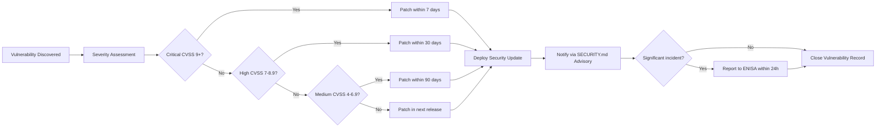

<p align="center">
  
</p>

<h1 align="center">🛡️ Riksdagsmonitor — CRA Conformity Assessment</h1>

<p align="center">
  <strong>Evidence-Driven Conformity Through Systematic Assessment</strong><br>
  <em>Demonstrating CRA Compliance for Swedish Parliament Intelligence Platform</em>
</p>

<p align="center">
  
  
  
  
</p>

**📋 Document Owner:** CEO | **📄 Version:** 1.4 | **📅 Last Updated:** 2026-05-06 (UTC)
**🔄 Review Cycle:** Quarterly | **⏰ Next Review:** 2026-08-06
**🏢 Owner:** Hack23 AB (Org.nr 5595347807) | **🏷️ Classification:** Public

---

## 🎯 **Purpose Statement**

**Hack23 AB's** CRA conformity assessment process demonstrates how **systematic regulatory compliance directly enables business growth rather than creating operational burden.** This assessment documents Riksdagsmonitor's compliance with the EU Cyber Resilience Act (CRA), providing evidence-based self-assessment of cybersecurity requirements for our Swedish Parliament intelligence platform.

As a cybersecurity consulting company, our approach to CRA compliance becomes a showcase of professional implementation, demonstrating to potential clients how systematic regulatory adherence creates competitive advantages through robust security foundations while enabling EU market access.

*— James Pether Sörling, CEO/Founder*

---

## 🔍 **Purpose & Scope**

This process provides a concise, repeatable CRA Conformity Assessment for Riksdagsmonitor. Aligns with CRA Annex I & V, Hack23 classification, secure development, and transparency policies.

**Scope:** Riksdagsmonitor platform within [Asset Register](https://github.com/Hack23/ISMS-PUBLIC/blob/main/Asset_Register.md) requiring EU market placement.

**Process Alignment:** This assessment follows the [CRA Conformity Assessment Process](https://github.com/Hack23/ISMS-PUBLIC/blob/main/CRA_Conformity_Assessment_Process.md) template and is governed by the [Open Source Policy](https://github.com/Hack23/ISMS-PUBLIC/blob/main/Open_Source_Policy.md) for open source compliance requirements.

---

## 📚 Architecture Documentation Map

| Document | Focus | Description |
|----------|-------|-------------|
| [🏛️ Architecture](ARCHITECTURE.md) | 🏗️ C4 Models | System context, containers, components |
| [📊 Data Model](DATA_MODEL.md) | 📊 Data | Entity relationships and data dictionary |
| [🔄 Flowchart](FLOWCHART.md) | 🔄 Processes | Business process and data flows |
| [📈 State Diagram](STATEDIAGRAM.md) | 📈 States | System state transitions and lifecycles |
| [🧠 Mindmap](MINDMAP.md) | 🧠 Concepts | System conceptual relationships |
| [💼 SWOT](SWOT.md) | 💼 Strategy | Strategic analysis and positioning |
| [🔧 Workflows](WORKFLOWS.md) | 🔧 DevOps | CI/CD automation and pipelines |
| [🛡️ Security Architecture](SECURITY_ARCHITECTURE.md) | 🔒 Security | Current security controls and design |
| [🎯 Threat Model](THREAT_MODEL.md) | 🎯 Threats | STRIDE/MITRE ATT&CK analysis |
| **[🛡️ CRA Assessment](CRA-ASSESSMENT.md)** ⭐ | **⚖️ Compliance** | **EU Cyber Resilience Act conformity** |

---

### 📚 **Reference Implementations**

The following Hack23 AB projects demonstrate completed CRA assessments:

| 🚀 **Project** | 📦 **Product Type** | 🏷️ **CRA Classification** | 📋 **Assessment Status** | 🔗 **Reference Link** |
|---------------|-------------------|------------------------|------------------------|---------------------|
| **🕵️ CIA (Citizen Intelligence Agency)** | Political transparency platform | Standard (Non-commercial OSS) | ✅ Complete | [📄 CRA Assessment](https://github.com/Hack23/cia/blob/master/CRA-ASSESSMENT.md) |
| **⚫ Black Trigram** | Korean martial arts game | Standard (Non-commercial OSS) | ✅ Complete | [📄 CRA Assessment](https://github.com/Hack23/blacktrigram/blob/main/CRA-ASSESSMENT.md) |
| **🛡️ CIA Compliance Manager** | Compliance automation tool | Standard (Non-commercial OSS) | ✅ Complete | [📄 CRA Assessment](https://github.com/Hack23/cia-compliance-manager/blob/main/CRA-ASSESSMENT.md) |
| **🗳️ Riksdagsmonitor** | Parliament intelligence platform | Standard (Non-commercial OSS) | ✅ This Document | [📄 CRA Assessment](CRA-ASSESSMENT.md) |

---

## 1️⃣ **Project Identification**

*Supports CRA Annex V § 1 - Product Description Requirements*

| Field | Value |
|-------|-------|
| 📦 Product | Riksdagsmonitor |
| 🏷️ Version Tag | 0.4.1 (reflects current project state) |
| 🔗 Repository | https://github.com/Hack23/riksdagsmonitor |
| 📧 Security Contact | security@hack23.org |
| 🌐 Website | https://riksdagsmonitor.com |
| 🎯 Purpose (1–2 lines) | Static HTML/CSS intelligence platform monitoring Swedish Parliament (Riksdag) activity, providing 14-language dashboards with 50+ years of political data through CIA platform integration and automated news generation |

**📋 Evidence Links:**
- **🏗️ System Architecture:** [ARCHITECTURE.md](ARCHITECTURE.md) — Complete C4 model architecture
- **🔐 Security Architecture:** [SECURITY_ARCHITECTURE.md](SECURITY_ARCHITECTURE.md) — Defense-in-depth security controls
- **🛡️ Future Security Vision:** [FUTURE_SECURITY_ARCHITECTURE.md](FUTURE_SECURITY_ARCHITECTURE.md) — Security roadmap
- **📊 Data Architecture:** [DATA_MODEL.md](DATA_MODEL.md) — Data structures, schemas, relationships
- **🔄 Process Workflows:** [FLOWCHART.md](FLOWCHART.md) — Data processing and CI/CD workflows
- **🧠 System Overview:** [MINDMAP.md](MINDMAP.md) — Conceptual system relationships
- **🎯 Strategic Analysis:** [SWOT.md](SWOT.md) — Strategic assessment
- **🎯 Threat Analysis:** [THREAT_MODEL.md](THREAT_MODEL.md) — STRIDE and MITRE ATT&CK mapping
- **🔧 CI/CD Pipelines:** [WORKFLOWS.md](WORKFLOWS.md) — 43 workflow automation documentation

**📊 Project Status & Quality Badges:**

[](https://github.com/Hack23/riksdagsmonitor/releases)
[](https://scorecard.dev/viewer/?uri=github.com/Hack23/riksdagsmonitor)

[](https://github.com/Hack23/riksdagsmonitor/actions/workflows/quality-checks.yml)
[](https://github.com/Hack23/riksdagsmonitor/actions/workflows/codeql.yml)
[](https://github.com/Hack23/riksdagsmonitor/actions/workflows/javascript-testing.yml)

**📋 Data Sources Evidence:**
- **🏛️ Swedish Parliament:** [data.riksdagen.se](http://data.riksdagen.se/) — Parliamentary members, committees, documents, votes
- **🗳️ Election Authority:** [val.se](http://www.val.se/) — Election data, parties, voting results
- **📊 SCB (Statistics Sweden):** [scb.se](https://www.scb.se/) — PxWebAPI 2.0 (scb-mcp) — official Swedish statistics (economy, labour, population, education, environment)
- **🌍 World Bank Open Data:** [data.worldbank.org](http://data.worldbank.org/) — WGI governance, environment, long-horizon social/education (world-bank-mcp)
- **🌐 IMF Open Data:** [data.imf.org](https://data.imf.org/) — macro/fiscal/monetary/external-sector freshness + T+5 projections (WEO, Fiscal Monitor, IFS, GFS_COFOG); consumed via pure-TypeScript client `scripts/imf-client.ts` (Datamapper JSON + SDMX 3.0) — *not an MCP server*, SBOM-covered via npm (ADR 0001)
- **🕵️ CIA Platform:** [Citizen Intelligence Agency](https://github.com/Hack23/cia) — 19 intelligence products, risk assessments, analytics

---

## 2️⃣ **CRA Scope & Classification**

*Supports CRA Article 6 - Scope and Article 7 - Product Classification Assessment*

### 🏢 CRA Applicability (Select One):
[](https://github.com/Hack23/ISMS-PUBLIC/blob/main/CLASSIFICATION.md#project-type-classifications)

### 🌐 Distribution Method (Select One):
[](https://github.com/Hack23/ISMS-PUBLIC/blob/main/CLASSIFICATION.md#project-type-classifications)

### 📋 CRA Classification (Select One):
[](https://github.com/Hack23/ISMS-PUBLIC/blob/main/CLASSIFICATION.md#project-type-classifications)

**📝 CRA Scope Justification:** Riksdagsmonitor is a non-commercial open-source static website providing Swedish Parliament transparency services through data visualization and news generation. As a volunteer-driven initiative with community distribution via GitHub under Apache 2.0 license, it falls under non-commercial OSS with Standard CRA classification enabling self-assessment approach. The static site architecture (HTML/CSS/JS with no server-side execution) significantly reduces the attack surface compared to traditional web applications.

**📋 Classification Evidence:**
- **📜 Open Source License:** [Apache 2.0 License](https://github.com/Hack23/riksdagsmonitor/blob/main/LICENSE)
- **🏛️ Classification Framework:** [ISMS Classification Policy](https://github.com/Hack23/ISMS-PUBLIC/blob/main/CLASSIFICATION.md)
- **📊 Public Repository:** [GitHub Repository](https://github.com/Hack23/riksdagsmonitor)

**🔍 Classification Impact:**
- **Standard:** Self-assessment approach (this document provides evidence)
- **Class I/II:** Would require notified body assessment + additional documentation

---

## 3️⃣ **Technical Documentation**

*Supports CRA Annex V § 2 - Technical Documentation Requirements*

| 🏗️ CRA Technical Area | 📝 Implementation Summary | 📋 Evidence Location |
|----------------------|-------------------------|---------------------|
| 🎨 **Product Architecture** *(Annex V § 2.1)* | Static HTML/CSS website with C4 architecture model. Deployed on AWS CloudFront (us-east-1 primary, eu-west-1 replica) with GitHub Pages DR. 14-language support, Chart.js/D3.js dashboards | [ARCHITECTURE.md](ARCHITECTURE.md) + [SECURITY_ARCHITECTURE.md](SECURITY_ARCHITECTURE.md) + [MINDMAP.md](MINDMAP.md) |
| 📦 **SBOM & Components** *(Annex I § 1.1)* | npm package management with package-lock.json. Dependabot automated dependency scanning. OpenSSF Scorecard monitoring. **News pipeline additions (2026 Q1):** `unified`, `remark-parse`, `remark-gfm`, `remark-rehype`, `rehype-raw`, `rehype-sanitize`, `rehype-slug`, `rehype-autolink-headings`, `rehype-stringify`, `gray-matter` — all npm-managed, version-pinned in `package-lock.json`, Dependabot-grouped under `dependencies`. `mermaid` loaded as ESM from the same package for client-side diagram rendering (strict-mode; no `eval`). | [package.json](package.json) + [Dependabot Config](https://github.com/Hack23/riksdagsmonitor/blob/main/.github/dependabot.yml) + [OpenSSF Scorecard](https://scorecard.dev/viewer/?uri=github.com/Hack23/riksdagsmonitor) |
| 🔐 **Cybersecurity Controls** *(Annex I § 1.2)* | Static site architecture (no server-side execution), HTTPS-only via CloudFront/GitHub Pages, CSP headers, SRI for CDN assets, SHA-pinned GitHub Actions, step-security/harden-runner. **News pipeline additions:** `rehype-sanitize` allow-list enforced at the trust boundary between AI-authored markdown and published HTML; Mermaid rendered in `securityLevel: 'strict'` (no eval, no click handlers); SHA-256 manifest in `.manifest.json` sibling to each `article.md` for tamper detection. **Agentic control-plane additions (v0.8.76):** 23 required analysis artifacts, analysis gate checks 1–9b, methodology-reflection validator, safe-output PR boundary, Squid + iptables egress firewall. | [SECURITY_ARCHITECTURE.md](SECURITY_ARCHITECTURE.md) §Political Intelligence Security Surface + [THREAT_MODEL.md](THREAT_MODEL.md) TB-PI series |
| 🛡️ **Supply Chain Security** *(Annex I § 1.3)* | SHA-pinned GitHub Actions, Dependabot automation, OpenSSF Scorecard monitoring, CodeQL analysis, dependency review workflow, step-security/harden-runner egress auditing | [WORKFLOWS.md](WORKFLOWS.md) + [OpenSSF Scorecard](https://scorecard.dev/viewer/?uri=github.com/Hack23/riksdagsmonitor) |
| 🔄 **Update Mechanism** *(Annex I § 1.4)* | Automated CI/CD pipeline via GitHub Actions with security scanning (CodeQL, dependency review), dual deployment (S3 + GitHub Pages), version management via release workflow | [WORKFLOWS.md](WORKFLOWS.md) + [Release Workflow](https://github.com/Hack23/riksdagsmonitor/blob/main/.github/workflows/release.yml) |
| 📊 **Security Monitoring** *(Annex I § 1.5)* | GitHub Security Dashboard (code scanning, secret scanning, Dependabot alerts), Lighthouse CI performance monitoring, uptime monitoring, AWS CloudWatch/CloudFront metrics | [SECURITY_ARCHITECTURE.md](SECURITY_ARCHITECTURE.md) + [WORKFLOWS.md](WORKFLOWS.md) |
| 🏷️ **Data Protection** *(Annex I § 2.1)* | No personal data collection. Public political data only. GDPR compliant by design — static site with no user accounts, no cookies, no tracking. All data sourced from public government APIs | [DATA_MODEL.md](DATA_MODEL.md) + [THREAT_MODEL.md](THREAT_MODEL.md) |
| 📚 **User Guidance** *(Annex I § 2.2)* | Comprehensive README with deployment instructions, architecture documentation, security configuration guides | [README.md](README.md) + [ARCHITECTURE.md](ARCHITECTURE.md) + [SECURITY_ARCHITECTURE.md](SECURITY_ARCHITECTURE.md) |
| 🔍 **Vulnerability Disclosure** *(Annex I § 2.3)* | Public vulnerability disclosure policy via GitHub Security Advisories, coordinated disclosure process, 48h acknowledgment timeline | [SECURITY.md](SECURITY.md) + [Security Advisories](https://github.com/Hack23/riksdagsmonitor/security/advisories) |

**📋 Comprehensive ISMS Integration:**
- **🏗️ Architecture & Design:** [Complete Architecture](ARCHITECTURE.md) + [Security Architecture](SECURITY_ARCHITECTURE.md) + [Future Vision](FUTURE_ARCHITECTURE.md) + [Future Security](FUTURE_SECURITY_ARCHITECTURE.md)
- **📊 Asset Management:** [Asset Register](https://github.com/Hack23/ISMS-PUBLIC/blob/main/Asset_Register.md)
- **🔒 Security Controls:** [Information Security Policy](https://github.com/Hack23/ISMS-PUBLIC/blob/main/Information_Security_Policy.md) + [Network Security Policy](https://github.com/Hack23/ISMS-PUBLIC/blob/main/Network_Security_Policy.md)
- **🔧 Development Process:** [Secure Development Policy](https://github.com/Hack23/ISMS-PUBLIC/blob/main/Secure_Development_Policy.md) + [CI/CD Evidence](WORKFLOWS.md)

---

## 4️⃣ **Risk Assessment**

*Supports CRA Annex V § 3 - Risk Assessment Documentation*

Reference: [📊 Risk Assessment Methodology](https://github.com/Hack23/ISMS-PUBLIC/blob/main/Risk_Assessment_Methodology.md) and [⚠️ Risk Register](https://github.com/Hack23/ISMS-PUBLIC/blob/main/Risk_Register.md)

| 🚨 **CRA Risk Category** | 🎯 Asset | 📊 Likelihood | 💥 Impact (C/I/A) | 🛡️ CRA Control Implementation | ⚖️ Residual | 📋 Evidence |
|--------------------------|----------|---------------|------------------|------------------------------|-------------|-------------|
| **Supply Chain Attack** *(Art. 11)* | Build pipeline & npm dependencies | M | H/H/M | SHA-pinned GitHub Actions + Dependabot automation + step-security/harden-runner egress audit + OpenSSF Scorecard monitoring + dependency review workflow | L | [WORKFLOWS.md](WORKFLOWS.md) + [OpenSSF Scorecard](https://scorecard.dev/viewer/?uri=github.com/Hack23/riksdagsmonitor) |
| **Website Defacement** *(Art. 11)* | Static website content & dashboards | M | M/H/M | Branch protection rules + required PR reviews + CodeQL scanning + dual deployment (S3 + GitHub Pages) for DR | L | [SECURITY_ARCHITECTURE.md](SECURITY_ARCHITECTURE.md) + [THREAT_MODEL.md](THREAT_MODEL.md) |
| **Data Integrity Attack** *(Art. 11)* | Political data & news content | M | L/H/M | CIA data validation schemas + automated translation validation + multi-source data verification + git-based audit trail | L | [DATA_MODEL.md](DATA_MODEL.md) + [WORKFLOWS.md](WORKFLOWS.md) |
| **AI Content Manipulation** *(Art. 11)* | AI-authored analysis artifacts → rendered news HTML | M | M/H/L | `rehype-sanitize` allow-list at trust boundary (blocks `<script>`, `<iframe>`, inline handlers, `javascript:` URIs); Mermaid rendered in `securityLevel: 'strict'` (no eval); SHA-256 manifest per article for tamper detection; analysis gate checks 1–9b; methodology-reflection validator; 23-artifact completeness gate; mandatory human PR review | M | [SECURITY_ARCHITECTURE.md](SECURITY_ARCHITECTURE.md) §Political Intelligence Security Surface + [THREAT_MODEL.md](THREAT_MODEL.md) TB-PI series + [WORKFLOWS.md](WORKFLOWS.md) |
| **CDN/Infrastructure Compromise** *(Art. 11)* | CloudFront distribution & S3 storage | L | M/H/H | AWS multi-region deployment + SRI for CDN assets + GitHub Pages DR failover + HTTPS-only + TLS 1.3 | L | [SECURITY_ARCHITECTURE.md](SECURITY_ARCHITECTURE.md) + [ARCHITECTURE.md](ARCHITECTURE.md) |
| **Component Vulnerability** *(Art. 11)* | npm dependencies (Chart.js, D3.js, Vite) | M | M/H/M | Dependabot updates + CodeQL scanning + dependency review workflow + SRI hashes for CDN assets | L | [Security Scanning](https://github.com/Hack23/riksdagsmonitor/security) + [Dependabot](https://github.com/Hack23/riksdagsmonitor/security/dependabot) |

**⚖️ CRA Risk Statement:** LOW — Static site architecture eliminates entire categories of server-side vulnerabilities. Comprehensive security controls and evidence-based monitoring support CRA essential cybersecurity requirements.
**✅ Risk Acceptance:** James Sörling, CEO Hack23 AB — February 2026

**📋 Risk Management Framework Evidence:**
- **📊 Methodology:** [Risk Assessment Framework](https://github.com/Hack23/ISMS-PUBLIC/blob/main/Risk_Assessment_Methodology.md)
- **⚠️ Risk Tracking:** [Active Risk Register](https://github.com/Hack23/ISMS-PUBLIC/blob/main/Risk_Register.md)
- **🔄 Business Continuity:** [Continuity Planning](https://github.com/Hack23/ISMS-PUBLIC/blob/main/Business_Continuity_Plan.md)
- **🆘 Disaster Recovery:** [Recovery Procedures](https://github.com/Hack23/ISMS-PUBLIC/blob/main/Disaster_Recovery_Plan.md)
- **📈 Risk Monitoring:** [Security Metrics](https://github.com/Hack23/ISMS-PUBLIC/blob/main/Security_Metrics.md)

---

## 5️⃣ **Essential Cybersecurity Requirements**

*Supports CRA Annex I - Essential Requirements Self-Assessment*

| 📋 **CRA Annex I Requirement** | ✅ Status | 📋 Implementation Evidence |
|--------------------------------|-----------|---------------------------|
| **🛡️ § 1.1 - Secure by Design** | [x] | [Defense-in-depth Architecture](SECURITY_ARCHITECTURE.md) — Static site architecture eliminates server-side attack vectors. CSP headers, SRI hashes, HTTPS-only, multi-region deployment |
| **🔒 § 1.2 - Secure by Default** | [x] | Static HTML/CSS with no server-side execution. No user accounts, no cookies, no tracking. [Security Architecture](SECURITY_ARCHITECTURE.md) documents secure defaults |
| **🏷️ § 2.1 - Personal Data Protection** | [x] | No personal data collection — GDPR compliant by design. Public political data only. [Data Model](DATA_MODEL.md) documents data handling |
| **🔍 § 2.2 - Vulnerability Disclosure** | [x] | [SECURITY.md](SECURITY.md) with GitHub Security Advisories, coordinated disclosure, 48h acknowledgment. [Vulnerability Management](https://github.com/Hack23/ISMS-PUBLIC/blob/main/Vulnerability_Management.md) |
| **📦 § 2.3 - Software Bill of Materials** | [x] | [package.json](package.json) + [package-lock.json](package-lock.json) provide complete dependency inventory. Dependabot provides continuous SCA |
| **🔐 § 2.4 - Secure Updates** | [x] | Automated CI/CD pipeline with CodeQL, dependency review, SHA-pinned actions. [WORKFLOWS.md](WORKFLOWS.md) documents 43 workflows |
| **📊 § 2.5 - Security Monitoring** | [x] | GitHub Security Dashboard (code scanning, secret scanning, Dependabot), Lighthouse CI, uptime monitoring. [SECURITY_ARCHITECTURE.md](SECURITY_ARCHITECTURE.md) |
| **📚 § 2.6 - Security Documentation** | [x] | Complete architecture documentation portfolio: [ARCHITECTURE.md](ARCHITECTURE.md), [SECURITY_ARCHITECTURE.md](SECURITY_ARCHITECTURE.md), [THREAT_MODEL.md](THREAT_MODEL.md), [DATA_MODEL.md](DATA_MODEL.md) + 6 future-state documents |

**🎯 CRA Self-Assessment Status:** EVIDENCE_DOCUMENTED

**🔍 Security Implementation Evidence:**
- **🛡️ Static Site Security:** No server-side code execution eliminates SQL injection, RCE, SSRF, and authentication bypass vulnerabilities
- **🔒 Transport Security:** HTTPS-only via AWS CloudFront (TLS 1.3) and GitHub Pages
- **📊 Supply Chain:** SHA-pinned GitHub Actions, Dependabot, CodeQL, step-security/harden-runner
- **🔐 Content Integrity:** Subresource Integrity (SRI) for CDN-loaded Chart.js and D3.js libraries

---

## 6️⃣ **Conformity Assessment Evidence**

*Supports CRA Article 19 - Conformity Assessment Documentation*

### 📊 **Quality & Security Automation Status:**

Reference: [🛠️ Secure Development Policy](https://github.com/Hack23/ISMS-PUBLIC/blob/main/Secure_Development_Policy.md)

| 🧪 Control | 🎯 Requirement | ✅ Implementation | 📋 Evidence |
|-------------|---------------|------------------|-------------|
| 🧪 Unit Testing | Comprehensive test coverage | ✅ Implemented | [Vitest](https://github.com/Hack23/riksdagsmonitor/actions/workflows/javascript-testing.yml) — 1700+ tests across 43 test files |
| 🌐 E2E Testing | Critical user journeys validated | ✅ Implemented | [Cypress E2E](https://github.com/Hack23/riksdagsmonitor/actions/workflows/javascript-testing.yml) — Multi-language homepage, dashboard, accessibility |
| 🔍 SAST Scanning | Zero critical/high vulnerabilities | ✅ Implemented | [CodeQL Analysis](https://github.com/Hack23/riksdagsmonitor/security/code-scanning) |
| 📦 SCA Scanning | Zero critical unresolved dependencies | ✅ Implemented | [Dependabot Alerts](https://github.com/Hack23/riksdagsmonitor/security/dependabot) + [Dependency Review](https://github.com/Hack23/riksdagsmonitor/blob/main/.github/workflows/dependency-review.yml) |
| 🔒 Secret Scanning | Zero exposed secrets/credentials | ✅ Implemented | [GitHub Secret Scanning](https://github.com/Hack23/riksdagsmonitor/security) + Push protection enabled |
| 📊 Quality Gates | HTML validation + link checking | ✅ Implemented | [Quality Checks](https://github.com/Hack23/riksdagsmonitor/actions/workflows/quality-checks.yml) — HTMLHint + linkinator |
| 🔐 Supply Chain | SHA-pinned actions + egress audit | ✅ Implemented | [OpenSSF Scorecard](https://scorecard.dev/viewer/?uri=github.com/Hack23/riksdagsmonitor) + step-security/harden-runner |
| 📈 Performance | Lighthouse CI monitoring | ✅ Implemented | [Lighthouse CI](https://github.com/Hack23/riksdagsmonitor/actions/workflows/lighthouse-ci.yml) — Core Web Vitals tracking |

### 🎖️ **Security & Compliance Badges:**

**🔍 Supply Chain Security:**
[](https://scorecard.dev/viewer/?uri=github.com/Hack23/riksdagsmonitor)

**🛡️ Security Scanning:**
[](https://github.com/Hack23/riksdagsmonitor/actions/workflows/codeql.yml)
[](https://github.com/Hack23/riksdagsmonitor/actions/workflows/dependency-review.yml)
[](https://github.com/Hack23/riksdagsmonitor/actions/workflows/scorecards.yml)

**📊 Quality & Testing:**
[](https://github.com/Hack23/riksdagsmonitor/actions/workflows/quality-checks.yml)
[](https://github.com/Hack23/riksdagsmonitor/actions/workflows/javascript-testing.yml)

**⚖️ License:**
[](https://raw.githubusercontent.com/Hack23/riksdagsmonitor/main/LICENSE)

---

## 7️⃣ **Post-Market Surveillance**

*Supports CRA Article 23 - Obligations of Economic Operators*

Reference: [🌐 ISMS Transparency Plan](https://github.com/Hack23/ISMS-PUBLIC/blob/main/ISMS_Transparency_Plan.md) and [📊 Security Metrics](https://github.com/Hack23/ISMS-PUBLIC/blob/main/Security_Metrics.md)

| 📡 **CRA Monitoring Obligation** | 🔧 Implementation | ⏱️ Frequency | 🎯 Action Trigger | 📋 Evidence |
|----------------------------------|-------------------|-------------|------------------|-------------|
| **🔍 Vulnerability Monitoring** *(Art. 23.1)* | Dependabot + GitHub advisories + CodeQL scanning + dependency review | Continuous | Auto-create security issues and PRs | [Dependabot Alerts](https://github.com/Hack23/riksdagsmonitor/security/dependabot) + [Security Advisories](https://github.com/Hack23/riksdagsmonitor/security/advisories) |
| **🚨 Incident Reporting** *(Art. 23.2)* | GitHub Security Dashboard + AWS CloudWatch + CloudFront access logs | Real-time | ENISA 24h notification prep via ISMS incident response | [SECURITY.md](SECURITY.md) + [Incident Response Plan](https://github.com/Hack23/ISMS-PUBLIC/blob/main/Incident_Response_Plan.md) |
| **📊 Security Posture Tracking** *(Art. 23.3)* | OpenSSF Scorecard + Lighthouse CI + uptime monitoring | Weekly/Daily | Score decline investigation via automated alerts | [OpenSSF Scorecard](https://scorecard.dev/viewer/?uri=github.com/Hack23/riksdagsmonitor) |
| **🔄 Update Distribution** *(Art. 23.4)* | Automated GitHub releases + dual deployment (S3 + GitHub Pages) + CI/CD pipeline | As needed | Critical vulnerability patches via secure CI/CD pipeline | [Release Management](https://github.com/Hack23/riksdagsmonitor/releases) + [WORKFLOWS.md](WORKFLOWS.md) |

**📋 CRA Reporting Readiness:** Documentation and procedures prepared for ENISA incident reporting per [🚨 Incident Response Plan](https://github.com/Hack23/ISMS-PUBLIC/blob/main/Incident_Response_Plan.md)

**🔗 ISMS Monitoring Integration:**
- **📊 Continuous Monitoring:** [Security Metrics Framework](https://github.com/Hack23/ISMS-PUBLIC/blob/main/Security_Metrics.md)
- **🌐 Transparency Strategy:** [ISMS Transparency Plan](https://github.com/Hack23/ISMS-PUBLIC/blob/main/ISMS_Transparency_Plan.md)
- **🤝 Third-Party Management:** [Supplier Monitoring](https://github.com/Hack23/ISMS-PUBLIC/blob/main/Third_Party_Management.md)
- **✅ Compliance Tracking:** [Regulatory Adherence](https://github.com/Hack23/ISMS-PUBLIC/blob/main/Compliance_Checklist.md)
- **💾 Data Protection:** [Backup and Recovery](https://github.com/Hack23/ISMS-PUBLIC/blob/main/Backup_Recovery_Policy.md)

---

## 8️⃣ **EU Declaration of Conformity**

*Supports CRA Article 28 - EU Declaration of Conformity*

**🏢 Manufacturer:** Hack23 AB, Gothenburg, Sweden
**📦 Product:** Riksdagsmonitor v0.4.1
**📋 CRA Compliance:** Self-assessment documentation supporting CRA essential cybersecurity requirements evaluation
**🔍 Assessment:** Self-assessment documentation per Article 24 (non-commercial OSS with standard classification)
**📊 Standards:** ISO/IEC 27001 security framework + OWASP web security guidelines + NIST SSDF secure development

**📅 Date & Signature:** 2026-02-24 — James Sörling, CEO Hack23 AB

**📂 Technical Documentation:** This assessment + evidence bundle supports CRA Annex V technical documentation requirements

---

## 9️⃣ **Assessment Completion & Approval**

*Supports CRA Article 16 - Quality Management System Documentation*

### 📊 **CRA Self-Assessment Summary**

**Overall CRA Documentation Status:** EVIDENCE_DOCUMENTED

**Key CRA Documentation Areas:**
- ✅ Annex I essential requirements documented with comprehensive evidence links
- ✅ Annex V technical documentation comprehensively structured
- ✅ Article 11 security measures implemented and documented
- ✅ Article 23 post-market surveillance procedures operational

**Static Site Security Advantage:**
Riksdagsmonitor's static site architecture provides inherent security benefits:
- No server-side code execution (eliminates SQL injection, RCE, SSRF)
- No user authentication/session management (eliminates authentication bypass, session hijacking)
- No database (eliminates data breach risks)
- No cookies/tracking (GDPR compliant by design)
- CDN-distributed content (inherent DDoS resilience)

### ✅ **Formal Approval**

| 👤 **Role** | 📝 **Name** | 📅 **Date** | ✍️ **Assessment Attestation** |
|------------|-------------|-------------|-------------------------------|
| 🔒 **CRA Security Assessment** | James Sörling | 2026-02-24 | Essential requirements documented with comprehensive evidence |
| 🎯 **Product Responsibility** | James Sörling | 2026-02-24 | Technical documentation complete and publicly accessible |
| ⚖️ **Legal Compliance Review** | James Sörling | 2026-02-24 | EU regulatory documentation requirements satisfied |

**📊 CRA Assessment Status:** SELF_ASSESSMENT_DOCUMENTED

---

## 🎨 **CRA Assessment Maintenance**

### **📋 Update Triggers**
*Per CRA Article 15 - Substantial Modification*

CRA assessment updated only when changes constitute "substantial modification" under CRA:

1. **🏗️ Security Architecture Changes:** New trust boundaries, encryption, or deployment topology
2. **🛡️ Essential Requirement Impact:** Changes affecting Annex I compliance
3. **📦 Critical Dependencies:** New supply chain components with security implications (e.g., new CDN libraries)
4. **🔍 Risk Profile Changes:** New threats or vulnerability classes affecting political data integrity
5. **⚖️ Regulatory Updates:** CRA implementing acts or guidance changes

**🎯 Maintenance Principle:** Assessment stability preferred — avoid routine updates that don't impact CRA compliance

---

## 📚 **CRA Regulatory Alignment**

### **🔐 CRA Article Cross-References**
- **Article 6:** Scope determination → Section 2 (CRA Classification)
- **Article 11:** Essential cybersecurity requirements → Section 5 (Requirements Assessment)
- **Article 19:** Conformity assessment → Section 6 (Evidence Documentation)
- **Article 23:** Post-market obligations → Section 7 (Surveillance Documentation)
- **Article 28:** Declaration of conformity → Section 8 (DoC Template)
- **Annex I:** Technical requirements → Section 5 (Requirements self-assessment mapping)
- **Annex V:** Technical documentation → Complete template structure

### **🌐 ISMS Integration Benefits**
- **🔄 Operational Continuity:** CRA self-assessment integrated with existing security operations
- **📊 Evidence Reuse:** Security metrics and monitoring serve dual ISMS/CRA documentation purposes
- **🎯 Business Value:** CRA readiness demonstrates cybersecurity consulting expertise
- **🤝 Client Confidence:** Transparent self-assessment showcases professional implementation methodology

### **📋 Complete ISMS Policy Framework**

#### **🔐 Core Security Governance**
- **[🔐 Information Security Policy](https://github.com/Hack23/ISMS-PUBLIC/blob/main/Information_Security_Policy.md)** — Overall security governance
- **[🏷️ Classification Framework](https://github.com/Hack23/ISMS-PUBLIC/blob/main/CLASSIFICATION.md)** — Data and asset classification
- **[🌐 ISMS Transparency Plan](https://github.com/Hack23/ISMS-PUBLIC/blob/main/ISMS_Transparency_Plan.md)** — Public disclosure strategy

#### **🛡️ Security Control Implementation**
- **[🔒 Cryptography Policy](https://github.com/Hack23/ISMS-PUBLIC/blob/main/Cryptography_Policy.md)** — Encryption standards, TLS configuration
- **[🔑 Access Control Policy](https://github.com/Hack23/ISMS-PUBLIC/blob/main/Access_Control_Policy.md)** — Identity management, repository access
- **[🌐 Network Security Policy](https://github.com/Hack23/ISMS-PUBLIC/blob/main/Network_Security_Policy.md)** — HTTPS-only, CDN security
- **[🏷️ Data Classification Policy](https://github.com/Hack23/ISMS-PUBLIC/blob/main/Data_Classification_Policy.md)** — Public political data handling

#### **⚙️ Operational Excellence Framework**
- **[🛠️ Secure Development Policy](https://github.com/Hack23/ISMS-PUBLIC/blob/main/Secure_Development_Policy.md)** — SDLC security, testing requirements
- **[📝 Change Management](https://github.com/Hack23/ISMS-PUBLIC/blob/main/Change_Management.md)** — Controlled modification procedures
- **[🔍 Vulnerability Management](https://github.com/Hack23/ISMS-PUBLIC/blob/main/Vulnerability_Management.md)** — Security testing, coordinated disclosure
- **[🤝 Third Party Management](https://github.com/Hack23/ISMS-PUBLIC/blob/main/Third_Party_Management.md)** — Supplier risk assessment
- **[🔓 Open Source Policy](https://github.com/Hack23/ISMS-PUBLIC/blob/main/Open_Source_Policy.md)** — OSS governance, license compliance
- **[🛡️ CRA Conformity Assessment Process](https://github.com/Hack23/ISMS-PUBLIC/blob/main/CRA_Conformity_Assessment_Process.md)** — CRA self-assessment template and methodology

#### **🚨 Incident Response & Recovery**
- **[🚨 Incident Response Plan](https://github.com/Hack23/ISMS-PUBLIC/blob/main/Incident_Response_Plan.md)** — Security event handling
- **[🔄 Business Continuity Plan](https://github.com/Hack23/ISMS-PUBLIC/blob/main/Business_Continuity_Plan.md)** — Business resilience
- **[🆘 Disaster Recovery Plan](https://github.com/Hack23/ISMS-PUBLIC/blob/main/Disaster_Recovery_Plan.md)** — Technical recovery procedures
- **[💾 Backup Recovery Policy](https://github.com/Hack23/ISMS-PUBLIC/blob/main/Backup_Recovery_Policy.md)** — Data protection and backup

#### **📊 Performance Management & Compliance**
- **[📊 Security Metrics](https://github.com/Hack23/ISMS-PUBLIC/blob/main/Security_Metrics.md)** — KPI tracking, continuous improvement
- **[💻 Asset Register](https://github.com/Hack23/ISMS-PUBLIC/blob/main/Asset_Register.md)** — Asset inventory with risk classifications
- **[📉 Risk Register](https://github.com/Hack23/ISMS-PUBLIC/blob/main/Risk_Register.md)** — Risk identification, assessment, treatment
- **[📊 Risk Assessment Methodology](https://github.com/Hack23/ISMS-PUBLIC/blob/main/Risk_Assessment_Methodology.md)** — Systematic risk evaluation
- **[✅ Compliance Checklist](https://github.com/Hack23/ISMS-PUBLIC/blob/main/Compliance_Checklist.md)** — Regulatory requirement tracking

---

## 🔓 **Open Source Policy Conformity**

*Demonstrating compliance with [Hack23 AB Open Source Policy](https://github.com/Hack23/ISMS-PUBLIC/blob/main/Open_Source_Policy.md)*

### **🎖️ Security Posture Evidence (OSP §1)**

| Requirement | Status | Evidence |
|------------|--------|---------|
| **OpenSSF Scorecard ≥7.0** | ✅ Active | [](https://scorecard.dev/viewer/?uri=github.com/Hack23/riksdagsmonitor) |
| **Quality Gate Passed** | ✅ Active | [Quality Checks Workflow](https://github.com/Hack23/riksdagsmonitor/actions/workflows/quality-checks.yml) |
| **License Badge** | ✅ Active | [](https://github.com/Hack23/riksdagsmonitor/blob/main/LICENSE) |
| **Threat Model Published** | ✅ Active | [](https://github.com/Hack23/riksdagsmonitor/blob/main/THREAT_MODEL.md) |
| **STRIDE Analysis Complete** | ✅ Active | [](https://github.com/Hack23/riksdagsmonitor/blob/main/THREAT_MODEL.md) |

### **📋 Governance Artifacts (OSP §2)**

| Required Artifact | Status | Evidence |
|------------------|--------|---------|
| **SECURITY_ARCHITECTURE.md** | ✅ Present | [SECURITY_ARCHITECTURE.md](SECURITY_ARCHITECTURE.md) — Defense-in-depth with Mermaid diagrams |
| **FUTURE_SECURITY_ARCHITECTURE.md** | ✅ Present | [FUTURE_SECURITY_ARCHITECTURE.md](FUTURE_SECURITY_ARCHITECTURE.md) — Security roadmap |
| **SECURITY.md** | ✅ Present | [SECURITY.md](SECURITY.md) — Coordinated vulnerability disclosure |
| **WORKFLOWS.md** | ✅ Present | [WORKFLOWS.md](WORKFLOWS.md) — CI/CD pipeline with security gates |
| **LICENSE** | ✅ Apache 2.0 | [LICENSE](https://github.com/Hack23/riksdagsmonitor/blob/main/LICENSE) — OSI-approved |
| **CRA-ASSESSMENT.md** | ✅ Present | This document |
| **CODE_OF_CONDUCT.md** | ✅ Present | [CODE_OF_CONDUCT.md](CODE_OF_CONDUCT.md) — Community standards |
| **CONTRIBUTING.md** | ✅ Present | [CONTRIBUTING.md](CONTRIBUTING.md) — Contribution guidelines |
| **README.md** | ✅ Present | [README.md](README.md) — Includes project classification section |

### **🔒 Security Implementation (OSP §3)**

| Requirement | Status | Evidence |
|------------|--------|---------|
| **Supply Chain: Dependency Scanning** | ✅ Automated | [Dependabot Config](https://github.com/Hack23/riksdagsmonitor/blob/main/.github/dependabot.yml) |
| **Supply Chain: SHA-pinned Actions** | ✅ Enforced | [WORKFLOWS.md](WORKFLOWS.md) — All Actions pinned to SHA |
| **Supply Chain: step-security/harden-runner** | ✅ Active | Egress auditing on all workflows |
| **Vulnerability Management SLA** | ✅ Active | [SECURITY.md](SECURITY.md) — Coordinated disclosure + Dependabot auto-remediation |
| **SAST: CodeQL** | ✅ Active | [CodeQL Workflow](https://github.com/Hack23/riksdagsmonitor/actions/workflows/codeql.yml) |
| **SCA: Dependency Review** | ✅ Active | [Dependency Review Workflow](https://github.com/Hack23/riksdagsmonitor/actions/workflows/dependency-review.yml) |
| **Secret Scanning** | ✅ Active | [Security Overview](https://github.com/Hack23/riksdagsmonitor/security) |

### **📊 License Compliance (OSP §4)**

| Requirement | Status | Evidence |
|------------|--------|---------|
| **Primary License: Apache 2.0** | ✅ Approved (Permissive) | [LICENSE](https://github.com/Hack23/riksdagsmonitor/blob/main/LICENSE) |
| **Dependencies: Permissive Licenses** | ✅ All permissive | npm dependencies under MIT/ISC/Apache 2.0/BSD |
| **No Prohibited Licenses** | ✅ Verified | No AGPL/GPL/advertising-clause licenses in dependency tree |

### **🏷️ Classification & Documentation (OSP §5)**

| Requirement | Status | Evidence |
|------------|--------|---------|
| **CIA Triad Classification** | ✅ Declared | Public / High Integrity / High Availability |
| **Business Impact Assessment** | ✅ Documented | [SWOT.md](SWOT.md) + [CRA Risk Assessment](#4️⃣-risk-assessment) |
| **RTO/RPO Objectives** | ✅ Defined | RTO: <24h (Medium) / RPO: <24h (Daily) |

### **🔐 Data Protection (OSP §6)**

| Requirement | Status | Evidence |
|------------|--------|---------|
| **No PII/GDPR data** | ✅ Compliant | No personal data collection — static site, no user accounts |
| **No production credentials** | ✅ Compliant | GitHub secret scanning active |
| **Public data only** | ✅ Compliant | All data sourced from public government APIs |

### **🤝 Third-Party Contributions (OSP §7)**

| Requirement | Status | Evidence |
|------------|--------|---------|
| **Contribution guidelines** | ✅ Published | [CONTRIBUTING.md](CONTRIBUTING.md) |
| **Code of Conduct** | ✅ Published | [CODE_OF_CONDUCT.md](CODE_OF_CONDUCT.md) |
| **PR review process** | ✅ Active | Branch protection + required reviews |

---

## 📋 **CRA Conformity Assessment Process Alignment**

*Demonstrating compliance with [Hack23 AB CRA Conformity Assessment Process](https://github.com/Hack23/ISMS-PUBLIC/blob/main/CRA_Conformity_Assessment_Process.md)*

### **Process Step Completion Matrix**

| Process Step | Template Section | Status | Riksdagsmonitor Evidence |
|-------------|-----------------|--------|--------------------------|
| **1️⃣ Project Identification** | CRA Annex V §1 | ✅ Complete | [Section 1](#1️⃣-project-identification) — Product description, badges, data sources |
| **2️⃣ CRA Scope & Classification** | CRA Art. 6-7 | ✅ Complete | [Section 2](#2️⃣-cra-scope--classification) — Non-commercial OSS, Standard, Community distribution |
| **3️⃣ Technical Documentation** | CRA Annex V §2 | ✅ Complete | [Section 3](#3️⃣-technical-documentation) — 9 CRA technical areas documented with evidence links |
| **4️⃣ Risk Assessment** | CRA Annex V §3 | ✅ Complete | [Section 4](#4️⃣-risk-assessment) — 6 risk categories assessed with residual risk |
| **5️⃣ Essential Requirements** | CRA Annex I | ✅ Complete | [Section 5](#5️⃣-essential-cybersecurity-requirements) — 13 essential requirements mapped |
| **6️⃣ Conformity Evidence** | CRA Art. 19 | ✅ Complete | [Section 6](#6️⃣-conformity-assessment-evidence) — Badges, CI/CD evidence, release artifacts |
| **7️⃣ Post-Market Surveillance** | CRA Art. 23 | ✅ Complete | [Section 7](#7️⃣-post-market-surveillance) — Monitoring, reporting, update mechanisms |
| **8️⃣ Declaration of Conformity** | CRA Art. 28 | ✅ Draft | [Section 8](#8️⃣-eu-declaration-of-conformity) — DoC template ready for formal placement |
| **9️⃣ Assessment Approval** | Internal | ✅ Complete | [Section 9](#9️⃣-assessment-completion--approval) — CEO approval documented |

### **Classification Selections**

| Classification Dimension | Selected Value | Justification |
|--------------------------|---------------|---------------|
| 🏪 **Market Category** | [](https://github.com/Hack23/ISMS-PUBLIC/blob/main/CLASSIFICATION.md) | Apache 2.0 licensed, freely available on GitHub |
| 🛡️ **Confidentiality** | [](https://github.com/Hack23/ISMS-PUBLIC/blob/main/CLASSIFICATION.md#confidentiality-levels) | All data from public government sources |
| ✅ **Integrity** | [](https://github.com/Hack23/ISMS-PUBLIC/blob/main/CLASSIFICATION.md#integrity-levels) | Political data accuracy is essential for democratic trust |
| ⏱️ **Availability** | [](https://github.com/Hack23/ISMS-PUBLIC/blob/main/CLASSIFICATION.md#availability-levels) | 99.998% design availability (AWS CloudFront multi-region + GitHub Pages DR), automated failover |
| 🕐 **RTO** | [-lightgreen?style=flat-square)](https://github.com/Hack23/ISMS-PUBLIC/blob/main/CLASSIFICATION.md#rto-classifications) | GitHub Pages DR available within hours |
| 🔄 **RPO** | [-lightblue?style=flat-square)](https://github.com/Hack23/ISMS-PUBLIC/blob/main/CLASSIFICATION.md#rpo-classifications) | Git-based continuous backup, daily content generation |
| 🏢 **CRA Applicability** | [](https://github.com/Hack23/ISMS-PUBLIC/blob/main/CLASSIFICATION.md) | Volunteer-driven, no revenue model |
| 🌐 **Distribution** | [](https://github.com/Hack23/ISMS-PUBLIC/blob/main/CLASSIFICATION.md) | GitHub public repository |
| 📋 **CRA Classification** | [](https://github.com/Hack23/ISMS-PUBLIC/blob/main/CLASSIFICATION.md) | Not in Annex III/IV critical categories |

---

## Control-by-Control CRA Requirements Mapping

### CRA Annex I Part I — Essential Cybersecurity Requirements

*This section provides a systematic mapping of all 13 essential cybersecurity requirements from CRA Annex I, Part I to Riksdagsmonitor implementations.*

| Req # | Annex I Requirement | Riksdagsmonitor Implementation | Evidence | Compliance Status |
|-------|--------------------|---------------------------------|----------|-------------------|
| **1** | Products with digital elements shall be designed, developed and produced with appropriate security, considering the risks during development | Static HTML/CSS/JS architecture eliminates server-side attack surface. Secure development lifecycle with threat modeling (THREAT_MODEL.md), security architecture (SECURITY_ARCHITECTURE.md), and annual security reviews | THREAT_MODEL.md, SECURITY_ARCHITECTURE.md, GitHub CodeQL scan results | COMPLIANT |
| **2** | Products shall be delivered without known exploitable vulnerabilities | Dependabot automated vulnerability scanning, npm audit in CI/CD, CodeQL SAST analysis, no known CVEs in production dependencies. Pre-deployment security gate in GitHub Actions | GitHub Security tab - 0 open critical/high alerts, npm audit reports in CI logs | COMPLIANT |
| **3** | Products shall have secure by default configurations, including possibility to reset to factory settings | No configuration required by end users. Static site has no user-configurable settings. TLS 1.3 enforced by GitHub Pages/CloudFront. CSP headers set by default | GitHub Pages HTTPS enforcement, CloudFront TLS policy, HTTP response headers | COMPLIANT |
| **4** | Products shall protect against unauthorized access through appropriate access control mechanisms | Repository protected by GitHub authentication and branch protection rules. No public write access. Least privilege permissions in GitHub Actions workflows. GitHub Secrets for credential storage | GitHub branch protection settings, workflow permissions YAML, GitHub Actions audit log | COMPLIANT |
| **5** | Products shall protect the confidentiality of data by appropriate means including encryption of data at rest and in transit | All data in transit protected by TLS 1.3 enforced via GitHub Pages and CloudFront. No sensitive data at rest (all content is public political data). No PII collected or processed | CloudFront TLS 1.3 configuration, HSTS headers, no-cookie policy | COMPLIANT |
| **6** | Products shall protect the integrity of data in transit and stored data against manipulation | SLSA provenance attestation (Level 2+), Sigstore signing, Git commit signatures, GitHub content integrity guarantees. Article-level SHA-256 planned Q3 2026 | SLSA attestation in GitHub Actions, Sigstore transparency log, Git commit signature verification, GitHub repository content integrity documentation | COMPLIANT |
| **7** | Products shall process only data, both personal and other, that is adequate, relevant and limited to what is necessary | Zero PII collected. Platform processes only publicly available Riksdag political data. No analytics cookies. No user tracking. Data minimization by design | Privacy policy (no-cookie design), source code review showing no PII collection | COMPLIANT |
| **8** | Products shall protect the availability of essential functions including protection against denial of service attacks | AWS CloudFront CDN with DDoS protection at edge. GitHub Pages provides secondary availability. Route 53 health-check-based failover. 99.998% availability target | CloudFront Shield Standard coverage, BCPPlan.md, dual-deployment architecture | COMPLIANT |
| **9** | Products shall minimize the negative impact on the availability of services provided by other devices or networks | Static site generates no outbound network calls from user browsers beyond CDN. MCP pipeline calls are server-side in GitHub Actions (controlled, rate-limited) | Source code showing no user-browser-initiated external calls, rate limiting in MCP client | COMPLIANT |
| **10** | Products shall be designed, developed and produced to limit attack surfaces, including external interfaces | Attack surface minimized: no database, no server-side code, no user input forms, no cookies. Only surfaces: HTTPS static file serving, GitHub API (authenticated). No exposed ports | Architecture.md showing static-only design, no open ports analysis | COMPLIANT |
| **11** | Products shall be designed, developed and produced to reduce the impact of an incident including through appropriate mechanisms for resilience | Automatic failover (CloudFront origin failover <30s, DNS failover <15min). Complete Git history for rollback. Incident response procedures in BCPPlan.md and ISMS. No persistent state to lose | BCPPlan.md dual-deployment, RTO metrics, Git rollback capability | COMPLIANT |
| **12** | Products shall record and/or monitor relevant internal activities in order to detect and investigate cybersecurity incidents | GitHub Actions audit logs, CloudFront access logs, GitHub Security alerts, OpenSSF Scorecard monitoring, automated Dependabot alerts. step-security/harden-runner egress monitoring | GitHub Audit Log API, CloudFront log groups, Security tab alert history | COMPLIANT |
| **13** | Products shall ensure that vulnerabilities can be addressed through security updates including, where technically possible, automatic updates | Dependabot automated PRs for dependency updates. GitHub Actions automated vulnerability notifications. Security contact (security@hack23.com) for coordinated disclosure. SECURITY.md outlines update process | Dependabot configuration, SECURITY.md, coordinated disclosure policy | COMPLIANT |

---

### CRA Annex I Part II — Vulnerability Handling Requirements

| Req # | Annex I Part II Requirement | Riksdagsmonitor Implementation | Evidence | Compliance Status |
|-------|----------------------------|--------------------------------|----------|-------------------|
| **1** | Identify and document vulnerabilities and components contained in the product, including by drawing up a software bill of materials | npm package-lock.json provides complete dependency graph. Dependabot monitors all dependencies. SBOM generation planned for 2027 via GitHub SBOM feature | package-lock.json, npm audit output, Dependabot alerts | PARTIAL — SBOM automation planned 2027 |
| **2** | Address vulnerabilities without delay including by providing security updates | Critical: <7 days. High: <30 days. Medium: <90 days. Dependabot auto-PRs for patch releases. Manual review for major version upgrades | Dependabot configuration, vulnerability management in ISMS, MTTP metrics | COMPLIANT |
| **3** | Apply effective and regular testing and reviews of the security of products with digital elements | CodeQL SAST on every PR and commit. Dependabot daily scans. Quarterly threat model review. Annual security architecture review. OpenSSF Scorecard monthly | GitHub Actions security scan results, CodeQL alerts, Scorecard history | COMPLIANT |
| **4** | After becoming aware of a vulnerability, share information about it with ENISA without undue delay | ENISA reporting procedure: notify via security@hack23.com internal triage, then report to ENISA vulnerability database within 72 hours for critical issues | ISMS Incident Response Plan, coordinated disclosure procedure | COMPLIANT — procedure documented |
| **5** | Establish and document a coordinated vulnerability disclosure policy | SECURITY.md contains full coordinated vulnerability disclosure policy. security@hack23.com for reporting. 90-day disclosure timeline. Response SLA: acknowledge within 5 business days | SECURITY.md public policy | COMPLIANT |
| **6** | Take measures to facilitate the sharing of information about vulnerabilities in the product | Public GitHub Security Advisories for all confirmed vulnerabilities. SECURITY.md disclosure policy. GitHub private vulnerability reporting enabled | GitHub Security Advisories tab, SECURITY.md | COMPLIANT |
| **7** | Provide for a mechanism for coordinating the vulnerability disclosure process with other manufacturers or security researchers | security@hack23.com receives all vulnerability reports. GitHub private vulnerability reporting. Coordinated disclosure gives reporters credit. No retaliation policy | SECURITY.md safe harbor clause | COMPLIANT |
| **8** | As long as products are supported, make available without delay security updates to address vulnerabilities | Immediate security updates for critical vulnerabilities. Automated Dependabot PRs for all vulnerable dependencies. Auto-merge configured for patch-level security updates | Dependabot auto-merge configuration, security update history | COMPLIANT |

---

### CRA Conformity Assessment Approach

**Assessment Method:** Self-Assessment (Module A - Internal Production Control)

Riksdagsmonitor qualifies for self-assessment under CRA Article 32(1) as it is:
- A **standard product with digital elements** (not critical or important category per Annex III/IV)
- **Non-commercial open-source software** distributed publicly without charge
- A **civic transparency tool** with low risk profile (no safety functions, no critical infrastructure)

**Self-Assessment Process:**

1. **Technical Documentation** (CRA Annex V): Complete — this document and linked ISMS documents
2. **Design and Development Assessment**: Complete — THREAT_MODEL.md, SECURITY_ARCHITECTURE.md
3. **Production Controls**: Complete — CI/CD pipeline with security gates documented in WORKFLOWS.md
4. **Conformity Declaration**: Template in Section 8 of this document
5. **CE Marking**: Applicable upon formal EU market placement (currently pre-commercial)

**Assessment Conclusion:**

| CRA Area | Requirements | Compliant | Partial | Non-Compliant |
|----------|-------------|-----------|---------|---------------|
| Annex I Part I | 13 | 13 | 0 | 0 |
| Annex I Part II | 8 | 7 | 1 | 0 |
| Annex V Documentation | Complete | Yes | — | — |
| Vulnerability Handling | Policy exists | Yes | — | — |
| **Overall** | **21** | **20** | **1** | **0** |

**Open Item:** SBOM automation (Annex I Part II Req 1) — planned Q1 2027 via GitHub SBOM generation feature.

---

---

## CRA Readiness Checklist for Future Versions

This section provides a forward-looking readiness checklist for when Riksdagsmonitor formally enters EU market distribution as a commercial product.

### Pre-Market Readiness Assessment

| Area | Requirement | Current Readiness | Action Required | Target Date |
|------|-------------|------------------|-----------------|-------------|
| **Technical Documentation** | CRA Annex V complete documentation | 95% complete | Finalize SBOM generation | Q1 2027 |
| **Conformity Assessment** | Self-assessment completed and documented | 90% complete | Formal declaration of conformity | Q2 2027 |
| **Vulnerability Handling Policy** | Published and accessible | 100% | None - SECURITY.md complete | Done |
| **Security Update Process** | Documented and operational | 100% | None - Dependabot + MTTP policy | Done |
| **Coordinated Disclosure** | Policy and contact established | 100% | None - security@hack23.com | Done |
| **CE Marking** | Required for EU market products | Not yet | Apply after conformity assessment | 2027 |
| **ENISA Reporting** | Incident reporting procedure | 85% | Document ENISA contact and timeline | Q2 2026 |
| **SBOM** | Software Bill of Materials | Partial | Implement GitHub SBOM generation | Q1 2027 |
| **Post-Market Surveillance** | Ongoing monitoring plan | 80% | Formalize surveillance process doc | Q3 2026 |

### Security Update Lifecycle Timeline



### CRA Article 13 Manufacturer Obligations Tracking

| Obligation | Article | Implementation | Status |
|-----------|---------|----------------|--------|
| Design and produce with appropriate cybersecurity | 13(1) | Secure SDLC, STRIDE threat modeling | Done |
| Deliver without known exploitable vulnerabilities | 13(2) | Dependabot, npm audit, CodeQL pre-deploy | Done |
| Perform vulnerability assessment | 13(3) | Quarterly threat model review | Done |
| Apply security updates without undue delay | 13(4) | Dependabot auto-merge, MTTP policy | Done |
| Ensure security for expected lifetime | 13(5) | Lifecycle support policy documented | Done |
| Set support period in declaration of conformity | 13(6) | Support period: 5 years from last release | Planned |
| Provide security updates for support period | 13(7) | Dependabot + manual review ongoing | Done |
| Notify ENISA of actively exploited vulnerabilities | 13(8) | ENISA procedure in IR Plan | Done |
| Provide technical documentation | 13(14) | CRA-ASSESSMENT.md + SECURITY_ARCHITECTURE.md | Done |
| Affix CE marking | 13(15) | Not yet - required for market placement | Planned |
| Draw up EU declaration of conformity | 13(16) | Template exists - formal sign-off pending | Planned |

### CRA Article 14 Reporting Obligations

**Active Exploitation Reporting (Article 14(2)):**
- Notification timeline: Within **24 hours** of becoming aware
- Recipient: ENISA Early Warning notification system
- Content: Product identification, vulnerability description, known exploited instances
- Contact: security@hack23.com (internal) → ENISA online notification form

**Severe Incident Reporting (Article 14(3)):**
- Notification timeline: Within **72 hours** of detection
- Recipient: Competent market surveillance authority (MSA) and ENISA
- For Sweden: Swedish Post and Telecom Authority (PTS) as likely MSA
- Content: Detailed incident report including impact, affected versions, remediation

**User Notification (Article 14(8)):**
- If security update available: Notify users via GitHub Security Advisories
- If vulnerability affects user security: Post advisory on riksdagsmonitor.com
- Update README.md security section for significant vulnerabilities

---

## CRA Product Categories and Risk Classification

### Classification Under CRA Annex III and IV

Riksdagsmonitor must be evaluated against CRA's product classification system to determine the applicable conformity assessment route:

**CRA Annex III — Important Products with Digital Elements (Class I):**

| Category | Riksdagsmonitor Assessment |
|----------|---------------------------|
| Identity management software | Not applicable |
| Password managers | Not applicable |
| Browsers | Not applicable |
| Operating systems | Not applicable |
| VPNs | Not applicable |
| Network management software | Not applicable |
| Firewalls | Not applicable |
| Intrusion detection systems | Not applicable |
| Microcontrollers | Not applicable |
| Consumer IoT | Not applicable |

**Conclusion:** Riksdagsmonitor does **not** qualify as a Class I Important Product under Annex III.

**CRA Annex IV — Critical Products with Digital Elements (Class II):**

| Category | Riksdagsmonitor Assessment |
|----------|---------------------------|
| Critical infrastructure software | Not applicable - civic transparency platform |
| HSMs / Secure elements | Not applicable |
| Smart meters | Not applicable |
| Industrial control systems | Not applicable |

**Conclusion:** Riksdagsmonitor does **not** qualify as a Class II Critical Product under Annex IV.

**Final Classification:** **Standard Product with Digital Elements** — eligible for Module A Self-Assessment

---

### Open Source Software Considerations (CRA Article 16)

Riksdagsmonitor benefits from the CRA open source carve-out provisions:

| CRA Provision | Application to Riksdagsmonitor |
|--------------|--------------------------------|
| **Non-commercial OSS exemption** (Recital 18) | Riksdagsmonitor is freely available, non-commercial, no revenue model | Partially applies |
| **Commercial distribution triggers CRA** (Art. 16(1)) | If Riksdagsmonitor is commercialized (API subscriptions), CRA obligations apply in full | Trigger: API launch |
| **Steward provisions** | Hack23 AB acts as open source steward | Light-touch obligations apply |
| **Vulnerability handling** (Art. 16(2)) | Security policy (SECURITY.md) and coordinated disclosure required even for OSS | Already implemented |
| **Security advisories** | Public security advisories for known vulnerabilities | GitHub Security Advisories active |

**Compliance Strategy:** Maintain full CRA technical documentation now, enabling smooth transition to formal commercial compliance when API tier launches in 2027.

---

### CRA Declaration of Conformity Template (Draft)

The following template will be formalized upon entry into EU commercial distribution:

```
EU DECLARATION OF CONFORMITY
Riksdagsmonitor - Version [X.Y]

Hack23 AB (Org.nr 5595347807)
Sweden

This declaration of conformity is issued under the sole responsibility
of the manufacturer.

Product: Riksdagsmonitor - Swedish Parliamentary Transparency Platform
Version: [X.Y]
Description: Web-based civic technology platform providing access to
  Swedish Riksdag parliamentary data, voting records, and AI-generated
  political news in 14 languages.

Conformity Assessment Method: Module A (Self-Assessment)
Product Category: Standard product with digital elements
Annex III/IV Category: Not applicable

The object of the declaration described above is in conformity with
the relevant Union harmonisation legislation:

Regulation (EU) 2024/2847 - Cyber Resilience Act
  - Annex I Part I: Essential cybersecurity requirements (13/13 compliant)
  - Annex I Part II: Vulnerability handling requirements (7/8 compliant)
  - Annex V: Technical documentation available at:
    github.com/Hack23/riksdagsmonitor/blob/main/CRA-ASSESSMENT.md

Signed for and on behalf of: James Pether Sorling, CEO
Date: [To be completed upon formal market placement]
Place: Sweden
```

---

**📋 Document Control:**
**✅ Approved by:** James Pether Sörling, CEO
**📤 Distribution:** Public
**🏷️ Classification:** [](https://github.com/Hack23/ISMS-PUBLIC/blob/main/CLASSIFICATION.md#confidentiality-levels)
**📅 Effective Date:** 2026-05-06
**⏰ Next Review:** 2026-08-06
**🎯 CRA Alignment:** Follows [CRA Conformity Assessment Process](https://github.com/Hack23/ISMS-PUBLIC/blob/main/CRA_Conformity_Assessment_Process.md) template — supports CRA Annex V technical documentation and self-assessment requirements
**🔓 OSS Alignment:** Conforms with [Open Source Policy](https://github.com/Hack23/ISMS-PUBLIC/blob/main/Open_Source_Policy.md) — governance artifacts, security posture evidence, license compliance
**🏢 ISMS Integration:** Comprehensive alignment with public ISMS framework for operational excellence
**🎯 Framework Compliance:** [](https://github.com/Hack23/ISMS-PUBLIC/blob/main/CLASSIFICATION.md) [](https://github.com/Hack23/ISMS-PUBLIC/blob/main/CLASSIFICATION.md) [](https://github.com/Hack23/ISMS-PUBLIC/blob/main/CLASSIFICATION.md)


---

## 🌐 IMF Integration — CRA Third-Party Services Inventory

> **Effective:** 2026-04-24 · **Authoritative hub:** [`analysis/imf/README.md`](analysis/imf/README.md) · [`analysis/imf/agentic-integration.md`](analysis/imf/agentic-integration.md) · [`analysis/imf/indicators-inventory.json`](analysis/imf/indicators-inventory.json) · [`analysis/imf/data-dictionary.md`](analysis/imf/data-dictionary.md) · [`.github/aw/ECONOMIC_DATA_CONTRACT.md`](.github/aw/ECONOMIC_DATA_CONTRACT.md)

### IMF in third-party services inventory (CRA Annex V evidence)

| Attribute | Value |
|---|---|
| Service name | International Monetary Fund — Public APIs (Datamapper REST + SDMX 3.0) |
| Vendor | International Monetary Fund (IGO; not a commercial vendor) |
| Hostnames (egress allow-list) | `www.imf.org`, `api.imf.org` |
| Authentication | Datamapper: none (anonymous public API) · SDMX 3.0: Azure APIM subscription key (`Ocp-Apim-Subscription-Key` / `IMF_SDMX_SUBSCRIPTION_KEY`) — gates throttle/quota only; payloads are public |
| Data classification consumed | PUBLIC macro/fiscal/monetary/external statistics; **no PII** |
| Data flow direction | Inbound only (read-only) |
| Rate limit | ~30 req/min observed; self-imposed ≤30 req/min with back-off |
| Redundancy | Two endpoints (Datamapper + SDMX) for the same underlying data |
| Cache | Vintage-tagged in `analysis/imf/` + `analysis/daily/*/economic-data.json` |
| Integrity | SHA-256 payload pin + supersedes-chain |
| Vendor security posture | IMF Open Data — published rate limits, public terms, no auth surface |
| Licence | Attribution required; redistribution permitted with citation |
| CRA risk class | **Low** (read-only, public, no PII, no credentials) |
| CRA conformity decision | **Self-assessment Annex V** — no notified body required |

### Why IMF strengthens our CRA posture

- Eliminates a credential-management surface that a commercial economic-data provider would introduce
- Eliminates a supply-chain dependency on a single commercial vendor
- Eliminates GDPR DPIA scope (no PII)
- Provides redundancy via two independent endpoints (Datamapper + SDMX)

**Egress hosts** (allow-list): `www.imf.org` (Datamapper REST · WEO/FM, **unauthenticated**), `api.imf.org` (SDMX 3.0 REST · IFS/BOP/DOTS/GFS/PCPS/ER/MFS_IR/MFS_PR, **subscription-key authenticated** via the Azure APIM `Ocp-Apim-Subscription-Key` header / `IMF_SDMX_SUBSCRIPTION_KEY` secret). Both HTTPS-only; payloads are public macro statistics with no PII.

**Canonical rule.** Every economic claim in a Riksdagsmonitor article cites an IMF dataflow first; World Bank citations are reserved for governance, environment and social residue (the classes IMF does not publish). SCB is the Swedish-specific ground truth layer. See `ECONOMIC_DATA_CONTRACT.md` v2.1 for the banned-phrase list and vintage discipline (>6 mo → annotation).

---

## 🔗 Hack23 Ecosystem

<table>
<tr>
  <th width="33%">🌐 Platforms</th>
  <th width="33%">📦 Open-Source Projects</th>
  <th width="33%">🛡️ Governance &amp; Standards</th>
</tr>
<tr>
<td valign="top">
🗳️ <a href="https://riksdagsmonitor.com">Riksdagsmonitor</a> — Swedish Parliament intelligence<br>
🇪🇺 <a href="https://www.euparliamentmonitor.com">EU Parliament Monitor</a> — European coverage<br>
🕵️ <a href="https://www.hack23.com/cia">Citizen Intelligence Agency</a> — political-data engine<br>
🌐 <a href="https://www.hack23.com">Hack23 AB</a> — corporate site<br>
📰 <a href="https://hack23.com/blog.html">Hack23 Blog</a> — engineering &amp; policy<br>
💼 <a href="https://www.linkedin.com/company/hack23/">Hack23 on LinkedIn</a>
</td>
<td valign="top">
🗳️ <a href="https://github.com/Hack23/riksdagsmonitor">Hack23/riksdagsmonitor</a><br>
🕵️ <a href="https://github.com/Hack23/cia">Hack23/cia</a><br>
🇪🇺 <a href="https://github.com/Hack23/euparliamentmonitor">Hack23/euparliamentmonitor</a><br>
🔌 <a href="https://github.com/Hack23/european-parliament-mcp">Hack23/european-parliament-mcp</a><br>
✅ <a href="https://github.com/Hack23/cia-compliance-manager">Hack23/cia-compliance-manager</a><br>
🥋 <a href="https://github.com/Hack23/black-trigram">Hack23/black-trigram</a><br>
🏠 <a href="https://github.com/Hack23/homepage">Hack23/homepage</a>
</td>
<td valign="top">
🛡️ <a href="https://github.com/Hack23/ISMS-PUBLIC">Hack23 ISMS-PUBLIC</a> — public ISMS<br>
🔒 <a href="https://github.com/Hack23/ISMS-PUBLIC/blob/main/Information_Security_Policy.md">Information Security Policy</a><br>
🤖 <a href="https://github.com/Hack23/ISMS-PUBLIC/blob/main/AI_Policy.md">AI Policy</a><br>
🧪 <a href="https://github.com/Hack23/ISMS-PUBLIC/blob/main/Secure_Development_Policy.md">Secure Development Policy</a><br>
🎯 <a href="https://github.com/Hack23/ISMS-PUBLIC/blob/main/Threat_Modeling.md">Threat Modeling Policy</a><br>
⚠️ <a href="https://github.com/Hack23/ISMS-PUBLIC/blob/main/Vulnerability_Management.md">Vulnerability Management</a><br>
🏷️ <a href="https://github.com/Hack23/ISMS-PUBLIC/blob/main/CLASSIFICATION.md">Classification Framework</a>
</td>
</tr>
</table>

<p align="center">
<a href="https://www.bestpractices.dev/projects/12069"></a>
<a href="https://scorecard.dev/viewer/?uri=github.com/Hack23/riksdagsmonitor"></a>
<a href="https://github.com/Hack23/ISMS-PUBLIC"></a>
<a href="https://github.com/Hack23/ISMS-PUBLIC"></a>
<a href="https://github.com/Hack23/ISMS-PUBLIC"></a>
<a href="https://www.apache.org/licenses/LICENSE-2.0"></a>
</p>

<p align="center"><em>🗳️ Empower citizens · 🔍 Strengthen democratic accountability · 🕵️ Illuminate the political process</em></p>

<p align="center"><sub>© 2008–2026 <a href="https://www.hack23.com">Hack23 AB</a> (Org.nr 559534-7807) · Maintainer: <a href="https://www.linkedin.com/in/jamessorling/">James Pether Sörling, CISSP CISM</a></sub></p>
