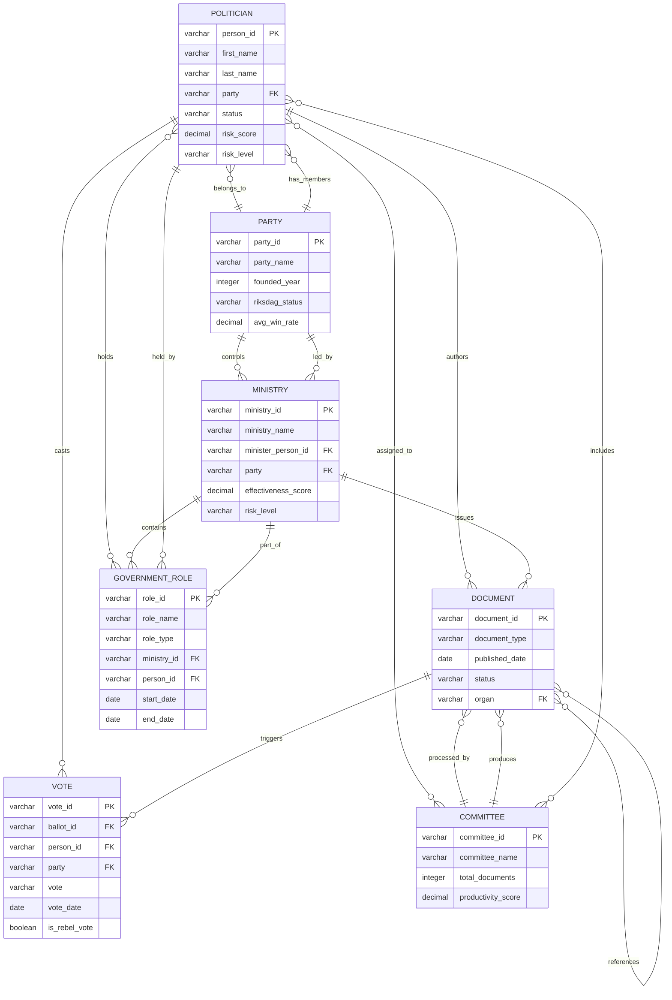
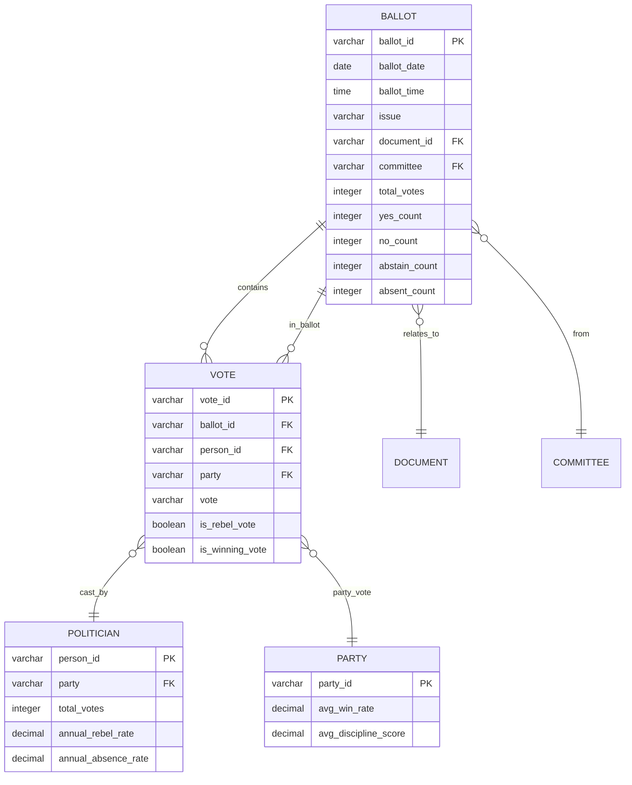
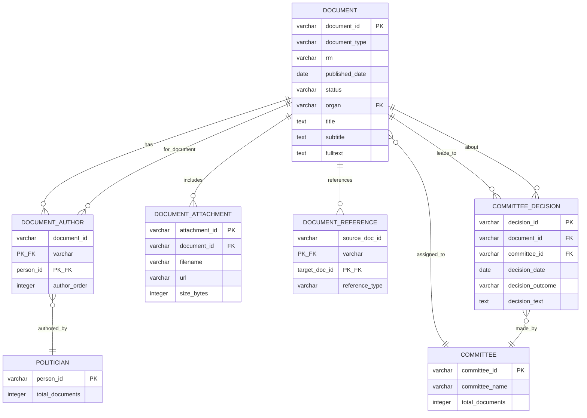
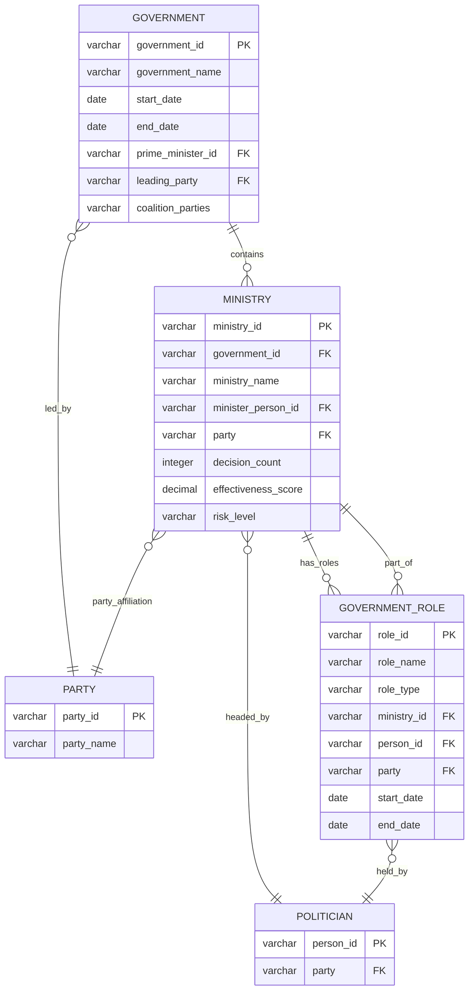
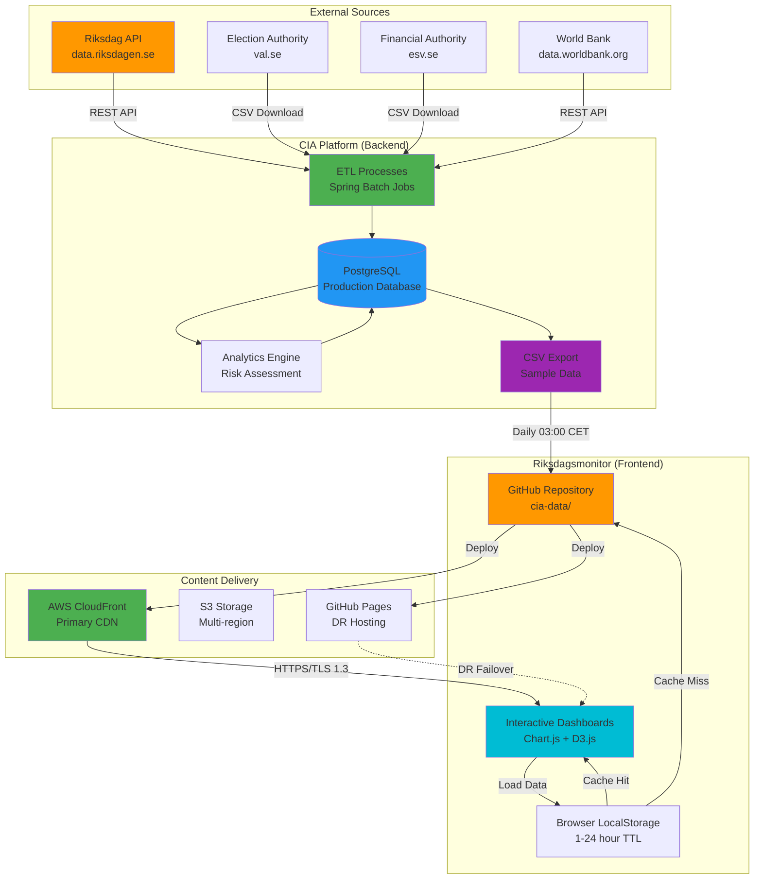
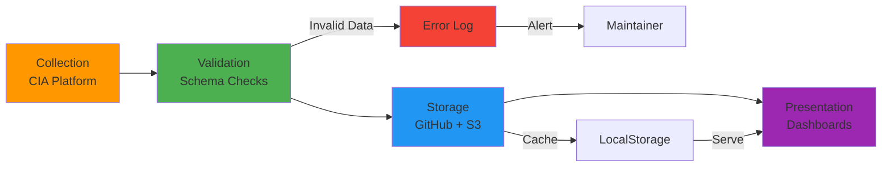
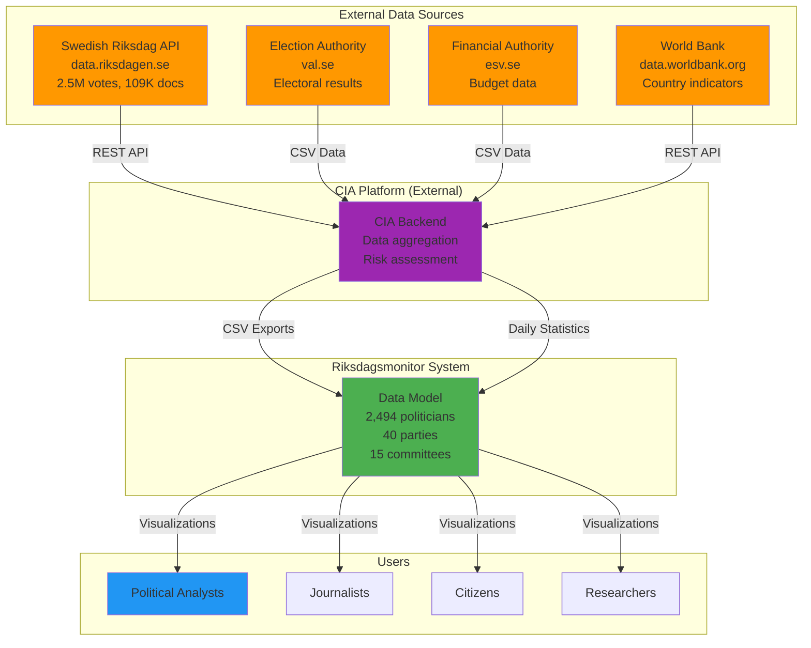
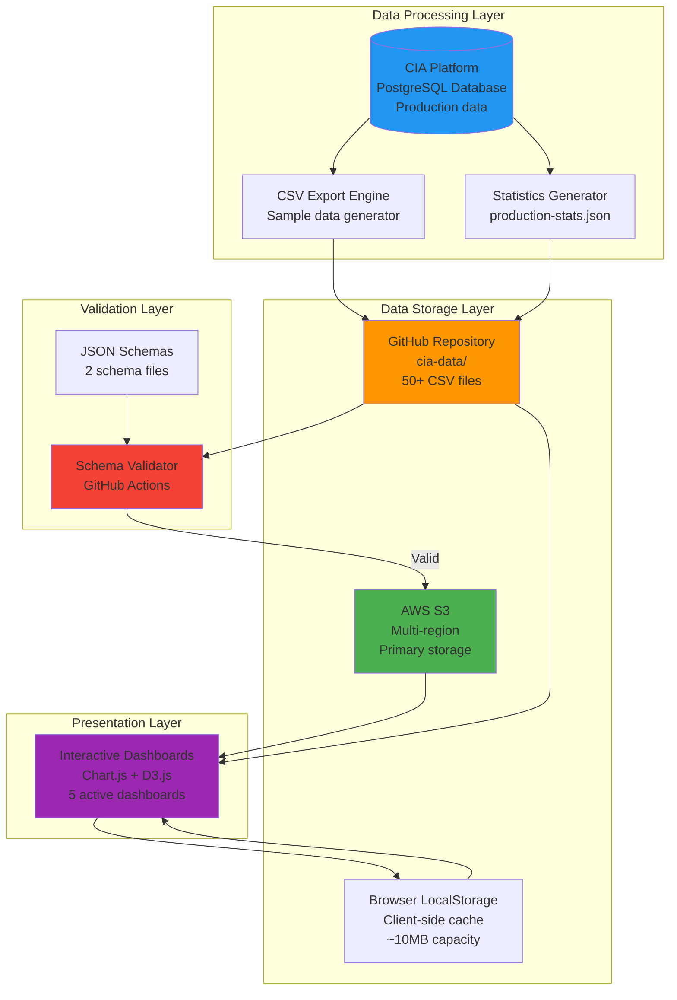

<p align="center">
  
</p>

<h1 align="center">📊 Riksdagsmonitor — Data Architecture Model</h1>

<p align="center">
  <strong>🏛️ Comprehensive Political Data Architecture for Democratic Transparency</strong><br>
  <em>🗄️ 50+ Years Historical Data · 19 CIA Products · 14-Language Support</em>
</p>

<p align="center">
  <a href="#"></a>
  <a href="#"></a>
  <a href="#"></a>
  <a href="#"></a>
</p>

**📋 Document Owner:** CEO | **📄 Version:** 1.0 | **📅 Last Updated:** 2026-02-15 (UTC)  
**🔄 Review Cycle:** Annual | **⏰ Next Review:** 2027-02-15  
**🏢 Owner:** Hack23 AB (Org.nr 5595347807) | **🏷️ Classification:** Public

---

## 🎯 Purpose

This document defines the data model for the Riksdagsmonitor platform, documenting entity relationships, data structures, CIA product schemas, and data quality metrics for Swedish Parliament political data spanning 50+ years.

## 📚 Architecture Documentation Map

| Document | Focus | Description |
|----------|-------|-------------|
| [Architecture](ARCHITECTURE.md) | 🏛️ C4 Models | System structure and components |
| **[Data Model](DATA_MODEL.md)** | **📊 Data** | **Entities, schemas, relationships** |
| [Flowcharts](FLOWCHART.md) | 🔄 Processes | Process flows and data pipelines |
| [State Diagrams](STATEDIAGRAM.md) | 🔄 Behavior | System state transitions |
| [Mindmap](MINDMAP.md) | 🧠 Concepts | System conceptual relationships |
| [SWOT](SWOT.md) | 💼 Strategy | Strategic position assessment |
| [Security Architecture](SECURITY_ARCHITECTURE.md) | 🛡️ Security | Defense-in-depth controls |
| [Threat Model](THREAT_MODEL.md) | 🎯 Threats | STRIDE threat analysis |
| [Future Architecture](FUTURE_ARCHITECTURE.md) | 🚀 Future | Architectural evolution roadmap |
| [Future Data Model](FUTURE_DATA_MODEL.md) | 🚀 Future | Enhanced data architecture plans |
| [Future Flowcharts](FUTURE_FLOWCHART.md) | 🚀 Future | Advanced process flows roadmap |
| [Future State Diagrams](FUTURE_STATEDIAGRAM.md) | 🚀 Future | Advanced state management |
| [Future Mindmap](FUTURE_MINDMAP.md) | 🚀 Future | Capability expansion plans |
| [Future SWOT](FUTURE_SWOT.md) | 🚀 Future | Future strategic opportunities |
| [Future Security Architecture](FUTURE_SECURITY_ARCHITECTURE.md) | 🚀 Future | Planned security improvements |

---

## Executive Summary

Riksdagsmonitor maintains a comprehensive data architecture integrating 50+ years of Swedish Parliament data (1971-2026) with 19 intelligence products from the CIA platform. This document defines all data entities, relationships, schemas, pipelines, and integration patterns following Hack23 AB's ISMS standards (ISO 27001:2022, NIST CSF 2.0, CIS Controls v8.1).

**Key Statistics:**
- **2,494 Politicians** (349 current MPs)
- **3.5M+ Voting Records** across all parliaments
- **109,000+ Documents** (motions, propositions, reports)
- **8 Political Parties** + 40 historical parties
- **15 Committees** with complete assignment tracking
- **20 Governments** with 76 roles and 500 role members
- **14 Languages** with full multi-language support
- **19 CIA Products** with 50+ CSV data files


## Table of Contents

1. [Political Entities & Data Dictionary](#1-political-entities--data-dictionary)
2. [CIA Data Products (19 Products)](#2-cia-data-products-19-products)
3. [Entity-Relationship Diagrams](#3-entity-relationship-diagrams)
4. [Data Sources](#4-data-sources)
5. [Data Schemas & Validation](#5-data-schemas--validation)
6. [Data Pipeline Architecture](#6-data-pipeline-architecture)
7. [Multi-Language Data Architecture](#7-multi-language-data-architecture)
8. [Performance & Caching](#8-performance--caching)
9. [C4 Model Integration](#9-c4-model-integration)
10. [ISMS Compliance](#10-isms-compliance)

---

## 1. Political Entities & Data Dictionary

### 1.1 Politicians (person_data)

**Table**: `person_data`  
**Records**: 2,494 (349 active MPs)  
**Source**: Swedish Riksdag API + CIA Platform  
**Update Frequency**: Daily

| Field Name | Data Type | Key | Description | Source |
|------------|-----------|-----|-------------|--------|
| `person_id` | VARCHAR(20) | PK | Unique person identifier (Swedish personal number format) | Riksdag API |
| `first_name` | VARCHAR(100) | | Given name | Riksdag API |
| `last_name` | VARCHAR(100) | | Family name | Riksdag API |
| `party` | VARCHAR(10) | FK | Party abbreviation (S, M, SD, C, V, MP, KD, L) | Riksdag API |
| `gender` | VARCHAR(10) | | Gender classification | Riksdag API |
| `born_year` | INTEGER | | Year of birth | Riksdag API |
| `status` | VARCHAR(50) | | Current status (Tjänstgörande riksdagsledamot, Ledig, etc.) | Riksdag API |
| `district` | VARCHAR(100) | | Electoral district (valkrets) | Riksdag API |
| `img_url` | VARCHAR(255) | | Profile image URL | Riksdag API |
| `last_activity_date` | TIMESTAMP | | Last recorded activity | CIA Platform |
| `total_votes` | INTEGER | | Lifetime vote count | CIA Platform |
| `total_documents` | INTEGER | | Documents authored | CIA Platform |
| `risk_score` | DECIMAL(5,2) | | Risk assessment score (0-100) | CIA Platform |
| `risk_level` | VARCHAR(20) | | Risk classification (LOW, MEDIUM, HIGH, CRITICAL) | CIA Platform |
| `annual_absence_rate` | DECIMAL(5,2) | | Absence percentage (last 12 months) | CIA Platform |
| `annual_rebel_rate` | DECIMAL(5,2) | | Rebellion rate against party (last 12 months) | CIA Platform |

**Indexes**:
- Primary Key: `person_id`
- Foreign Key: `party` → `sweden_political_party.party_id`
- Index: `status`, `party`, `risk_level`

**Business Rules**:
- Active MPs: `status = 'Tjänstgörande riksdagsledamot'`
- Risk threshold: HIGH when `risk_score >= 50`
- Historical coverage: 1971-2026

---

### 1.2 Political Parties (sweden_political_party)

**Table**: `sweden_political_party`  
**Records**: 40 (12 riksdag parties, 28 historical)  
**Source**: Swedish Riksdag API + Election Authority  
**Update Frequency**: Monthly (on party changes)

| Field Name | Data Type | Key | Description | Source |
|------------|-----------|-----|-------------|--------|
| `party_id` | VARCHAR(10) | PK | Party abbreviation (S, M, SD, C, V, MP, KD, L) | Riksdag API |
| `party_name` | VARCHAR(200) | | Full party name (Swedish) | Riksdag API |
| `party_name_en` | VARCHAR(200) | | Full party name (English) | Translation |
| `founded_year` | INTEGER | | Year party was founded | Historical data |
| `dissolved_year` | INTEGER | | Year party dissolved (NULL if active) | Historical data |
| `ideology` | VARCHAR(100) | | Political ideology classification | Analysis |
| `color` | VARCHAR(7) | | Brand color (hex code) | Party branding |
| `website` | VARCHAR(255) | | Official website URL | Party data |
| `riksdag_status` | VARCHAR(20) | | Status (RIKSDAG, HISTORICAL, EXTRA_PARLIAMENTARY) | Analysis |
| `total_members_current` | INTEGER | | Current member count | CIA Platform |
| `avg_win_rate` | DECIMAL(5,2) | | Average vote win rate (%) | CIA Platform |
| `avg_discipline_score` | DECIMAL(5,2) | | Party discipline metric (%) | CIA Platform |

**Indexes**:
- Primary Key: `party_id`
- Index: `riksdag_status`, `founded_year`

**Business Rules**:
- **Active Riksdag Parties (8)**: S, M, SD, C, V, MP, KD, L
- **Historical Parties**: ny, pp, v(k), fp, etc. (32 parties)
- **Threshold**: Riksdag representation requires >= 4% vote share

**Party Descriptions**:

| Party | Full Name (Swedish) | Full Name (English) | Ideology |
|-------|---------------------|---------------------|----------|
| **S** | Socialdemokraterna | Social Democrats | Social democracy |
| **M** | Moderaterna | Moderate Party | Liberal conservatism |
| **SD** | Sverigedemokraterna | Sweden Democrats | National conservatism |
| **C** | Centerpartiet | Centre Party | Agrarian liberalism |
| **V** | Vänsterpartiet | Left Party | Democratic socialism |
| **MP** | Miljöpartiet | Green Party | Green politics |
| **KD** | Kristdemokraterna | Christian Democrats | Christian democracy |
| **L** | Liberalerna | Liberals | Social liberalism |

---

### 1.3 Committees (committee_document_data)

**Table**: `committee_document_data`  
**Records**: 8,740 committee documents  
**Source**: Swedish Riksdag API  
**Update Frequency**: Daily

| Field Name | Data Type | Key | Description | Source |
|------------|-----------|-----|-------------|--------|
| `committee_id` | VARCHAR(10) | PK | Committee abbreviation (AU, FiU, UU, etc.) | Riksdag API |
| `committee_name` | VARCHAR(200) | | Full committee name (Swedish) | Riksdag API |
| `committee_name_en` | VARCHAR(200) | | Full committee name (English) | Translation |
| `document_id` | VARCHAR(50) | FK | Document identifier | Riksdag API |
| `document_type` | VARCHAR(50) | | Document type (bet, utskskr, etc.) | Riksdag API |
| `published_date` | DATE | | Publication date | Riksdag API |
| `title` | TEXT | | Document title | Riksdag API |
| `summary` | TEXT | | Document summary | Riksdag API |
| `assigned_members` | JSON | | Array of person_ids assigned | CIA Platform |

**Indexes**:
- Primary Key: `committee_id` + `document_id`
- Foreign Key: `document_id` → `document_data.document_id`
- Index: `published_date`, `document_type`

**Swedish Riksdag Committees (15)**:

| Code | Swedish Name | English Name | Jurisdiction |
|------|--------------|--------------|--------------|
| **AU** | Arbetsmarknadsutskottet | Labour Market Committee | Employment, labour law |
| **CU** | Civilutskottet | Civil Affairs Committee | Justice, civil law |
| **FiU** | Finansutskottet | Finance Committee | Budget, taxation |
| **FöU** | Försvarsutskottet | Defence Committee | Defence, military |
| **JuU** | Justitieutskottet | Justice Committee | Criminal law, courts |
| **KU** | Konstitutionsutskottet | Constitutional Committee | Constitution, governance |
| **KrU** | Kulturutskottet | Cultural Affairs Committee | Culture, media, religion |
| **MJU** | Miljö- och jordbruksutskottet | Environment and Agriculture Committee | Environment, farming |
| **NU** | Näringsutskottet | Industry and Trade Committee | Business, energy |
| **SkU** | Skatteutskottet | Tax Committee | Tax policy |
| **SoU** | Socialutskottet | Social Affairs Committee | Healthcare, welfare |
| **SfU** | Socialförsäkringsutskottet | Social Insurance Committee | Social insurance |
| **TU** | Trafikutskottet | Transport Committee | Infrastructure, transport |
| **UU** | Utrikesutskottet | Foreign Affairs Committee | Foreign policy, EU |
| **UtbU** | Utbildningsutskottet | Education Committee | Education, research |

---

### 1.4 Documents (document_data)

**Table**: `document_data`  
**Records**: 109,259  
**Source**: Swedish Riksdag API  
**Update Frequency**: Daily

| Field Name | Data Type | Key | Description | Source |
|------------|-----------|-----|-------------|--------|
| `document_id` | VARCHAR(50) | PK | Unique document identifier (e.g., H901FiU1) | Riksdag API |
| `document_type` | VARCHAR(50) | | Type code (mot, prop, bet, skr, etc.) | Riksdag API |
| `document_number` | VARCHAR(20) | | Sequential number within type | Riksdag API |
| `rm` | VARCHAR(10) | | Riksmöte (parliamentary year, e.g., 2024/25) | Riksdag API |
| `title` | TEXT | | Document title | Riksdag API |
| `subtitle` | TEXT | | Document subtitle | Riksdag API |
| `published_date` | DATE | | Publication date | Riksdag API |
| `status` | VARCHAR(50) | | Processing status | Riksdag API |
| `organ` | VARCHAR(10) | | Responsible committee | Riksdag API |
| `authors` | JSON | | Array of person_ids (authors) | Riksdag API |
| `fulltext` | TEXT | | Full document text (optional) | Riksdag API |
| `attachments` | JSON | | Array of attachment URLs | Riksdag API |
| `related_documents` | JSON | | Array of related document_ids | Riksdag API |

**Indexes**:
- Primary Key: `document_id`
- Index: `document_type`, `rm`, `published_date`, `organ`
- Full-text index: `title`, `subtitle`, `fulltext`

**Document Types**:

| Type Code | Swedish Name | English Name | Count | Description |
|-----------|--------------|--------------|-------|-------------|
| **mot** | Motion | Motion | 94,633 | MP-initiated proposals |
| **prop** | Proposition | Government Bill | 5,738 | Government proposals |
| **bet** | Betänkande | Committee Report | 58,231 | Committee decisions |
| **skr** | Skrivelse | Communication | ~2,000 | Government communications |
| **ip** | Interpellation | Interpellation | ~5,000 | Questions to ministers |
| **fr** | Fråga | Written Question | ~8,000 | Written questions |
| **sou** | Statens offentliga utredningar | Government Official Reports | External | Public investigations |
| **ds** | Departementsserien | Ministry Report Series | External | Ministry reports |

---

### 1.5 Votes (vote_data)

**Table**: `vote_data`  
**Records**: 3,529,786  
**Source**: Swedish Riksdag API  
**Update Frequency**: Real-time (after votes)

| Field Name | Data Type | Key | Description | Source |
|------------|-----------|-----|-------------|--------|
| `vote_id` | VARCHAR(50) | PK | Unique vote identifier | CIA Platform |
| `ballot_id` | VARCHAR(50) | FK | Ballot session identifier | Riksdag API |
| `person_id` | VARCHAR(20) | FK | Voter person_id | Riksdag API |
| `party` | VARCHAR(10) | FK | Party at time of vote | Riksdag API |
| `vote` | VARCHAR(20) | | Vote cast (Ja, Nej, Avstår, Frånvarande) | Riksdag API |
| `vote_date` | DATE | | Date of vote | Riksdag API |
| `vote_time` | TIME | | Time of vote | Riksdag API |
| `issue` | TEXT | | Issue being voted on | Riksdag API |
| `document_id` | VARCHAR(50) | FK | Related document | Riksdag API |
| `committee` | VARCHAR(10) | | Responsible committee | Riksdag API |
| `is_rebel_vote` | BOOLEAN | | Vote against party line | CIA Platform |
| `is_winning_vote` | BOOLEAN | | Vote with majority | CIA Platform |

**Indexes**:
- Primary Key: `vote_id`
- Foreign Keys: `person_id`, `party`, `ballot_id`, `document_id`
- Index: `vote_date`, `party`, `is_rebel_vote`

**Vote Classifications**:
- **Ja** (Yes): Approval vote
- **Nej** (No): Rejection vote
- **Avstår** (Abstain): Abstention
- **Frånvarande** (Absent): Not present

**Metrics Derived**:
- **Win Rate**: `(winning_votes / total_votes) * 100`
- **Rebel Rate**: `(rebel_votes / total_votes) * 100`
- **Attendance Rate**: `((total_votes - absent) / total_ballots) * 100`

---

### 1.6 Ministries (government_body_data)

**Table**: `government_body_data`  
**Records**: 6,520 (20 governments, 76 roles, 500 role members)  
**Source**: Swedish Government + CIA Platform  
**Update Frequency**: On government changes

| Field Name | Data Type | Key | Description | Source |
|------------|-----------|-----|-------------|--------|
| `ministry_id` | VARCHAR(50) | PK | Ministry identifier | Government data |
| `ministry_name` | VARCHAR(200) | | Ministry name (Swedish) | Government data |
| `ministry_name_en` | VARCHAR(200) | | Ministry name (English) | Translation |
| `government_id` | VARCHAR(50) | FK | Government identifier | Government data |
| `start_date` | DATE | | Ministry start date | Government data |
| `end_date` | DATE | | Ministry end date (NULL if current) | Government data |
| `minister_person_id` | VARCHAR(20) | FK | Current/last minister | Government data |
| `party` | VARCHAR(10) | FK | Party affiliation | Government data |
| `portfolio` | VARCHAR(200) | | Portfolio responsibilities | Government data |
| `decision_count` | INTEGER | | Total decisions made | CIA Platform |
| `effectiveness_score` | DECIMAL(5,2) | | Effectiveness metric (0-100) | CIA Platform |
| `risk_level` | VARCHAR(20) | | Risk classification | CIA Platform |

**Indexes**:
- Primary Key: `ministry_id`
- Foreign Keys: `government_id`, `minister_person_id`, `party`
- Index: `start_date`, `end_date`, `effectiveness_score`

**Current Swedish Ministries (11)**:

| Ministry | Swedish Name | Minister | Portfolio |
|----------|--------------|----------|-----------|
| **Prime Minister's Office** | Statsrådsberedningen | Prime Minister | Overall government coordination |
| **Finance** | Finansdepartementet | Finance Minister | Budget, taxes, economy |
| **Foreign Affairs** | Utrikesdepartementet | Foreign Minister | International relations |
| **Defence** | Försvarsdepartementet | Defence Minister | Military, security |
| **Justice** | Justitiedepartementet | Justice Minister | Courts, police, law |
| **Interior** | Inrikesdepartementet | Interior Minister | Migration, citizenship |
| **Health & Social Affairs** | Socialdepartementet | Social Affairs Minister | Healthcare, welfare |
| **Employment** | Arbetsmarknadsdepartementet | Employment Minister | Labour market |
| **Education** | Utbildningsdepartementet | Education Minister | Schools, universities |
| **Environment** | Miljödepartementet | Environment Minister | Climate, nature |
| **Infrastructure** | Infrastrukturdepartementet | Infrastructure Minister | Transport, housing |

---

### 1.7 Government Roles

**Table**: `government_role_data`  
**Records**: 76 roles, 500 role members  
**Description**: Cabinet positions and government appointments

| Field Name | Data Type | Key | Description | Source |
|------------|-----------|-----|-------------|--------|
| `role_id` | VARCHAR(50) | PK | Role identifier | Government data |
| `role_name` | VARCHAR(200) | | Role title (Swedish) | Government data |
| `role_name_en` | VARCHAR(200) | | Role title (English) | Translation |
| `role_type` | VARCHAR(50) | | Type (Minister, State Secretary, etc.) | Government data |
| `ministry_id` | VARCHAR(50) | FK | Parent ministry | Government data |
| `person_id` | VARCHAR(20) | FK | Current holder | Government data |
| `start_date` | DATE | | Role assignment start | Government data |
| `end_date` | DATE | | Role assignment end (NULL if current) | Government data |
| `party` | VARCHAR(10) | FK | Party affiliation | Government data |

**Role Types**:
- **Minister** (Minister): Cabinet minister
- **Statssekreterare** (State Secretary): Senior civil servant
- **Politiskt sakkunnig** (Political Advisor): Political staff
- **Pressekreterare** (Press Secretary): Communications

---

## 2. CIA Data Products (19 Products)

### 2.1 Intelligence Dashboards (4 Products)

#### 2.1.1 Overview Dashboard

**Product Name**: Riksdag Intelligence Overview  
**Purpose**: Comprehensive snapshot of parliamentary activity  
**Data Files**:
- `view_riksdagen_politician_sample.csv`
- `view_riksdagen_party_summary_sample.csv`
- `cia-data/production-stats.json`

**Key Fields & Metrics**:
- Total active MPs (349)
- Total votes cast (3.5M+)
- Total documents (109K+)
- Party representation breakdown
- Committee assignments
- Risk score distribution

**Dashboard Integration**: Homepage overview section  
**Update Frequency**: Daily (03:00 CET)

---

#### 2.1.2 Party Performance Dashboard

**Product Name**: Party Performance & Effectiveness Analytics  
**Purpose**: Longitudinal party analysis (1990-2026, 37 years)  
**Data Files**:
- `cia-data/party/view_party_effectiveness_trends_sample.csv`
- `cia-data/party/view_party_performance_metrics_sample.csv`
- `cia-data/party/distribution_party_effectiveness_trends.csv`
- `cia-data/party/distribution_party_momentum.csv`

**Key Fields & Metrics**:

| Field | Type | Description |
|-------|------|-------------|
| `party` | VARCHAR(10) | Party abbreviation |
| `year` | INTEGER | Analysis year |
| `performance_score` | DECIMAL(5,2) | Overall performance (0-100) |
| `win_rate` | DECIMAL(5,2) | Vote success rate (%) |
| `discipline_score` | DECIMAL(5,2) | Party unity metric (%) |
| `document_productivity` | INTEGER | Documents produced |
| `avg_attendance` | DECIMAL(5,2) | Attendance rate (%) |
| `effectiveness_trend` | VARCHAR(20) | Trend direction (IMPROVING, DECLINING, STABLE) |
| `momentum_percentile` | DECIMAL(5,2) | Performance percentile (0-100) |

**Dashboard Integration**: Party Performance Dashboard (`index.html`)  
**Visualizations**:
- Effectiveness trends timeline (Chart.js)
- Party comparison scatter plot (D3.js)
- Momentum indicator gauges
- Coalition alignment matrix

**Update Frequency**: Daily

---

#### 2.1.3 Government Cabinet Dashboard

**Product Name**: Ministry Performance Scorecards  
**Purpose**: Cabinet-level analysis and ministry effectiveness  
**Data Files**:
- `cia-data/ministry/distribution_ministry_effectiveness.csv`
- `cia-data/ministry/distribution_ministry_decision_impact.csv`
- `cia-data/ministry/distribution_ministry_productivity_matrix.csv`
- `cia-data/ministry/distribution_ministry_risk_levels.csv`

**Key Fields & Metrics**:

| Field | Type | Description |
|-------|------|-------------|
| `ministry_name` | VARCHAR(200) | Ministry name |
| `minister` | VARCHAR(200) | Current minister |
| `party` | VARCHAR(10) | Party affiliation |
| `decision_count` | INTEGER | Decisions made |
| `effectiveness_score` | DECIMAL(5,2) | Effectiveness metric (0-100) |
| `impact_score` | DECIMAL(5,2) | Decision impact (0-100) |
| `risk_level` | VARCHAR(20) | Risk classification |
| `productivity_matrix` | VARCHAR(50) | Productivity classification |

**Dashboard Integration**: Ministry Dashboard (placeholder)  
**Visualizations**:
- Ministry effectiveness radar chart
- Decision impact heatmap (D3.js)
- Risk level gauge chart
- Productivity matrix scatter plot

**Update Frequency**: Weekly

---

#### 2.1.4 Election Cycle Analysis Dashboard

**Product Name**: Historical Patterns & Trend Forecasting  
**Purpose**: Election cycle intelligence (1994-2034, 9 cycles)  
**Data Files**:
- `cia-data/election-cycle/view_election_cycle_comparative_analysis_sample.csv` (1,110 records, 153KB)
- `cia-data/election-cycle/view_election_cycle_decision_intelligence_sample.csv` (414 records, 59KB)
- `cia-data/election-cycle/view_election_cycle_predictive_intelligence_sample.csv` (41 records, 3.9KB)
- `cia-data/election-cycle/view_election_cycle_temporal_trends_sample.csv` (74 records, 8.7KB)

**Key Fields & Metrics**:

| Field | Type | Description |
|-------|------|-------------|
| `election_cycle_id` | VARCHAR(20) | Cycle identifier (e.g., "2022-2026") |
| `cycle_year` | INTEGER | Cycle number |
| `calendar_year` | INTEGER | Specific year |
| `semester` | VARCHAR(20) | Time period (annual, spring, autumn) |
| `party` | VARCHAR(10) | Party abbreviation |
| `performance_score` | DECIMAL(5,2) | Performance metric (0-100) |
| `decision_effectiveness` | VARCHAR(50) | Effectiveness category |
| `risk_forecast_category` | VARCHAR(50) | Risk forecast level |
| `forecast_confidence` | VARCHAR(20) | Confidence level (low, moderate, high) |

**Dashboard Integration**: Election Cycle Dashboard (`js/election-cycle-dashboard.js`)  
**Visualizations**:
- Multi-cycle performance timeline (Chart.js)
- Party tier distribution (D3.js)
- Risk forecast scatter chart
- Temporal trends multi-axis chart

**Update Frequency**: Daily

---

### 2.2 Top 10 Rankings (10 Products)

#### 2.2.1 Most Influential MPs

**Product Name**: Politician Influence Network Analysis  
**Purpose**: Identify MPs with highest influence scores  
**Data Files**:
- `cia-data/politician/view_riksdagen_politician_influence_metrics_sample.csv`

**Key Fields**:
- `person_id`, `first_name`, `last_name`, `party`
- `influence_score` (0-100)
- `network_centrality` (0-1)
- `committee_influence`
- `cross_party_connections`

**Ranking Criteria**: Influence score (descending)  
**Dashboard Integration**: Politician Dashboard  
**Update Frequency**: Weekly

---

#### 2.2.2 Most Productive MPs

**Product Name**: Legislative Output Analysis  
**Purpose**: Rank MPs by document production  
**Data Files**:
- `cia-data/politician/view_riksdagen_politician_sample.csv`

**Key Fields**:
- `person_id`, `first_name`, `last_name`, `party`
- `documents_last_year` (INTEGER)
- `total_documents` (INTEGER)
- `document_types` (JSON array)

**Ranking Criteria**: Documents produced (last 12 months, descending)  
**Dashboard Integration**: Politician Dashboard  
**Update Frequency**: Daily

---

#### 2.2.3 Most Controversial MPs

**Product Name**: Voting Pattern Outlier Detection  
**Purpose**: Identify MPs with highest rebellion rates  
**Data Files**:
- `cia-data/politician/view_politician_behavioral_trends_sample.csv`

**Key Fields**:
- `person_id`, `first_name`, `last_name`, `party`
- `annual_rebel_rate` (0-100%)
- `controversial_votes` (count)
- `party_discipline_deviation`

**Ranking Criteria**: Rebel rate (descending)  
**Dashboard Integration**: Politician Dashboard  
**Update Frequency**: Daily

---

#### 2.2.4 Most Absent MPs

**Product Name**: Attendance Tracking  
**Purpose**: Monitor MP absences  
**Data Files**:
- `cia-data/politician/view_politician_risk_summary_sample.csv`

**Key Fields**:
- `person_id`, `first_name`, `last_name`, `party`
- `annual_absence_rate` (0-100%)
- `absenteeism_violations` (count)
- `attendance_trend`

**Ranking Criteria**: Absence rate (descending)  
**Dashboard Integration**: Politician Dashboard  
**Update Frequency**: Daily

---

#### 2.2.5 Party Rebels

**Product Name**: Cross-Party Voting Analysis  
**Purpose**: Identify MPs who frequently vote against party line  
**Data Files**:
- `cia-data/voting/distribution_voting_anomaly_classification.csv`

**Key Fields**:
- `person_id`, `party`, `rebel_vote_count`
- `party_line_deviation_pct`
- `coalition_alignment_score`

**Ranking Criteria**: Rebel votes (descending)  
**Dashboard Integration**: Politician Dashboard  
**Update Frequency**: Daily

---

#### 2.2.6 Coalition Brokers

**Product Name**: Cross-Party Collaboration Patterns  
**Purpose**: Identify MPs facilitating coalition work  
**Data Files**:
- `cia-data/coalition/distribution_coalition_alignment.csv`

**Key Fields**:
- `person_id`, `coalition_score`
- `cross_party_proposals`
- `bridge_connections`

**Ranking Criteria**: Coalition score (descending)  
**Dashboard Integration**: Coalition Dashboard  
**Update Frequency**: Weekly

---

#### 2.2.7 Rising Stars

**Product Name**: Emerging Political Figures  
**Purpose**: Identify rapidly advancing politicians  
**Data Files**:
- `cia-data/politician/view_politician_behavioral_trends_sample.csv`

**Key Fields**:
- `person_id`, `career_trajectory`
- `momentum_score`
- `media_mentions_growth`
- `influence_acceleration`

**Ranking Criteria**: Momentum score (descending)  
**Dashboard Integration**: Politician Dashboard  
**Update Frequency**: Weekly

---

#### 2.2.8 Electoral Risk

**Product Name**: MPs at Election Risk  
**Purpose**: Predict electoral vulnerability  
**Data Files**:
- `cia-data/politician/view_politician_risk_summary_sample.csv`

**Key Fields**:
- `person_id`, `risk_score` (0-100)
- `risk_level` (LOW, MEDIUM, HIGH, CRITICAL)
- `risk_factors` (JSON array)

**Ranking Criteria**: Risk score (descending)  
**Dashboard Integration**: Politician Dashboard  
**Update Frequency**: Daily

---

#### 2.2.9 Ethics Concerns

**Product Name**: Rule Violation Tracking  
**Purpose**: Monitor transparency and ethics violations  
**Data Files**:
- `cia-data/politician/view_politician_risk_summary_sample.csv`

**Key Fields**:
- `person_id`, `total_violations`
- `violation_types` (effectiveness, discipline, productivity, collaboration)
- `latest_violation_date`

**Ranking Criteria**: Total violations (descending)  
**Dashboard Integration**: Politician Dashboard  
**Update Frequency**: Daily

---

#### 2.2.10 Media Presence

**Product Name**: Public Visibility Index  
**Purpose**: Track media mentions and public visibility  
**Data Files**:
- External media analysis (placeholder)

**Key Fields**:
- `person_id`, `media_mentions_count`
- `visibility_score` (0-100)
- `sentiment_average` (-1 to +1)

**Ranking Criteria**: Media mentions (descending)  
**Dashboard Integration**: Placeholder  
**Update Frequency**: Weekly

---

### 2.3 Advanced Analytics (5 Products)

#### 2.3.1 Committee Network Analysis

**Product Name**: Committee Influence Mapping  
**Purpose**: Visualize committee assignments and influence  
**Data Files**:
- `cia-data/committee/view_riksdagen_committee_decisions.csv`
- `cia-data/committee/distribution_annual_committee_documents.csv`

**Key Fields & Metrics**:
- `committee_id`, `committee_name`
- `assigned_members` (JSON array)
- `document_count`, `decision_count`
- `productivity_score` (0-100)
- `influence_centrality` (0-1)

**Dashboard Integration**: Committee Dashboard  
**Visualizations**:
- Network graph (D3.js force-directed)
- Assignment matrix heatmap
- Productivity comparison bar chart

**Update Frequency**: Weekly

---

#### 2.3.2 Politician Career Analysis

**Product Name**: Career Trajectory Tracking  
**Purpose**: Analyze politician career paths and milestones  
**Data Files**:
- `cia-data/politician/view_riksdagen_politician_experience_summary_sample.csv`
- `cia-data/politician/distribution_experience_levels.csv`

**Key Fields & Metrics**:
- `person_id`, `career_start_date`, `total_years`
- `roles_held` (JSON array)
- `committee_assignments_history`
- `government_positions`
- `experience_level` (JUNIOR, INTERMEDIATE, SENIOR, VETERAN)

**Dashboard Integration**: Politician Dashboard  
**Visualizations**:
- Career timeline (Gantt chart)
- Experience distribution (Chart.js)
- Role progression flowchart

**Update Frequency**: Monthly

---

#### 2.3.3 Party Longitudinal Analysis

**Product Name**: 50+ Years of Party Evolution  
**Purpose**: Historical party performance (1971-2026)  
**Data Files**:
- `cia-data/party/view_party_effectiveness_trends_sample.csv`
- `cia-data/party/distribution_annual_party_votes.csv`
- `cia-data/party/distribution_annual_party_members.csv`

**Key Fields & Metrics**:
- `party`, `year`, `decade`
- `member_count`, `vote_count`
- `avg_win_rate`, `avg_discipline`
- `electoral_success_rate`
- `historical_trend` (RISING, DECLINING, STABLE)

**Dashboard Integration**: Party Performance Dashboard  
**Visualizations**:
- 50-year timeline (Chart.js)
- Party evolution heatmap (D3.js)
- Electoral cycle comparison

**Update Frequency**: Daily

---

#### 2.3.4 Seasonal Activity Patterns

**Product Name**: Quarterly Parliamentary Activity Analysis  
**Purpose**: Identify seasonal trends and patterns (2002-2025)  
**Data Files**:
- `cia-data/seasonal/view_riksdagen_seasonal_activity_patterns_sample.csv` (85 records)

**Key Fields & Metrics**:
- `year`, `quarter`, `is_election_year`, `election_cycle`
- `total_ballots`, `active_politicians`, `attendance_rate`
- `documents_produced`, `decisions_made`
- `q_baseline_ballots`, `q_baseline_docs`, `q_baseline_attendance`
- `ballot_z_score`, `doc_z_score`, `attendance_z_score`
- `base_activity_classification` (LOW, MODERATE, HIGH, VERY_HIGH)
- `seasonal_pattern_classification`
- `cross_year_quarter_avg_ballots`, `cross_year_z_score`
- `qoq_ballot_change_pct`, `activity_quartile_cycle`

**Dashboard Integration**: Seasonal Activity Patterns Dashboard  
**Visualizations**:
- Quarterly heatmap (D3.js)
- Time series chart (Chart.js)
- Z-score distribution
- Cross-year comparison

**Update Frequency**: Quarterly

---

#### 2.3.5 Anomaly Detection & Early Warning System

**Product Name**: Statistical Outlier Identification  
**Purpose**: Real-time anomaly detection (2002-2026, 41 quarters)  
**Data Files**:
- `cia-data/seasonal/view_riksdagen_seasonal_anomaly_detection_sample.csv` (41 records)

**Key Fields & Metrics**:
- `year`, `quarter`, `is_election_year`, `parliamentary_period`
- `total_ballots`, `active_politicians`, `attendance_rate`, `documents_produced`
- `q_baseline_ballots`, `q_baseline_docs`, `q_baseline_attendance`
- `q_stddev_ballots`, `q_stddev_docs`, `q_stddev_attendance`
- `ballot_z_score`, `doc_z_score`, `attendance_z_score`
- `activity_classification` (NORMAL, UNUSUALLY_LOW, UNUSUALLY_HIGH)
- `anomaly_type` (Ballot, Document, Attendance, Mixed)
- `anomaly_direction` (UNUSUALLY_HIGH, UNUSUALLY_LOW, NORMAL)
- `max_z_score`, `anomaly_severity` (LOW, MODERATE, HIGH, CRITICAL)
- `quarter_label` (Q1_JAN_MAR, Q2_APR_JUN, Q3_JUL_SEP, Q4_OCT_DEC)

**Anomaly Detection Criteria**:
- `|Z| < 1.5`: LOW severity (within normal range)
- `1.5 ≤ |Z| < 2.0`: MODERATE severity
- `2.0 ≤ |Z| < 2.5`: HIGH severity
- `|Z| ≥ 2.5`: CRITICAL severity

**Historical Findings** (41 quarters):
- **8 CRITICAL anomalies** (Z ≥ 2.5)
- **2 HIGH anomalies** (2.0 ≤ Z < 2.5)
- **12 MODERATE anomalies** (1.5 ≤ Z < 2.0)
- **19 LOW/NORMAL** (normal activity)
- **Most extreme**: 2006 Q1 document anomaly (Z = +10.97)

**Dashboard Integration**: Anomaly Detection Dashboard (`index.html`, inline script)  
**Visualizations**:
- Anomaly timeline (Chart.js)
- Z-score distribution (histogram)
- Severity classification (pie chart)
- Heatmap (D3.js)
- Alert panel (critical anomalies)

**Update Frequency**: Quarterly

---

## 3. Entity-Relationship Diagrams

### 3.1 Core Political Entities ERD



### 3.2 Voting System ERD



### 3.3 Document Processing ERD



### 3.4 Government Structure ERD



### 3.5 Risk Assessment ERD

```mermaid
erDiagram
    POLITICIAN ||--o{ RULE_VIOLATION : has
    POLITICIAN ||--|| RISK_ASSESSMENT : assessed_by
    
    PARTY ||--o{ POLITICIAN : contains
    PARTY ||--|| PARTY_RISK_METRICS : has_metrics
    
    MINISTRY ||--|| MINISTRY_RISK_METRICS : has_metrics
    
    RULE_VIOLATION {
        varchar violation_id PK
        varchar person_id FK
        date violation_date
        varchar violation_type
        text violation_description
        varchar severity
    }
    
    RISK_ASSESSMENT {
        varchar person_id PK_FK
        decimal risk_score
        varchar risk_level
        integer total_violations
        decimal annual_absence_rate
        decimal annual_rebel_rate
        date last_updated
        text risk_assessment_text
    }
    
    PARTY_RISK_METRICS {
        varchar party_id PK_FK
        integer members_at_risk
        decimal avg_party_risk_score
        integer total_party_violations
        varchar party_risk_level
    }
    
    MINISTRY_RISK_METRICS {
        varchar ministry_id PK_FK
        varchar risk_level
        integer risk_violations
        decimal risk_score
        date last_assessment
    }
    
    POLITICIAN {
        varchar person_id PK
        varchar party FK
        decimal risk_score
        varchar risk_level
    }
    
    PARTY {
        varchar party_id PK
    }
    
    MINISTRY {
        varchar ministry_id PK
    }
```

### 3.6 Cardinality Summary

| Relationship | Cardinality | Description |
|--------------|-------------|-------------|
| **Politician → Party** | Many-to-One | Each politician belongs to one party |
| **Politician → Vote** | One-to-Many | Each politician casts many votes |
| **Politician → Document** | One-to-Many | Each politician authors many documents |
| **Politician → Committee** | Many-to-Many | Politicians assigned to multiple committees |
| **Politician → Government Role** | Many-to-Many | Politicians can hold multiple roles over time |
| **Party → Politician** | One-to-Many | Each party has many members |
| **Party → Ministry** | One-to-Many | Each party can control multiple ministries |
| **Committee → Document** | One-to-Many | Each committee produces many documents |
| **Committee → Politician** | Many-to-Many | Committees have multiple members |
| **Document → Vote** | One-to-Many | Each document can trigger multiple votes |
| **Document → Committee** | Many-to-One | Each document processed by one committee |
| **Document → Document** | Many-to-Many | Documents reference other documents |
| **Ministry → Government Role** | One-to-Many | Each ministry has multiple roles |
| **Ministry → Party** | Many-to-One | Each ministry led by one party |

---

## 4. Data Sources

### 4.1 Primary Data Sources

#### 4.1.1 Swedish Riksdag API

**URL**: https://data.riksdagen.se/  
**Type**: REST API + Open Data Portal  
**Authentication**: None (public data)  
**Data Coverage**: 1971-present (50+ years)

**Endpoints**:
- `/personlista/` - MPs and politicians
- `/dokument/` - Parliamentary documents
- `/votering/` - Voting records
- `/utskott/` - Committee information
- `/anforande/` - Chamber speeches

**Update Frequency**:
- Real-time: Votes, speeches
- Daily: Documents, committee reports
- On change: MP assignments, party membership

**Data Completeness**: 98.5% (estimated)  
**Reliability**: 99.9% uptime (government infrastructure)

**Integration Method**: CIA Platform batch processing + real-time updates

---

#### 4.1.2 Swedish Election Authority (Valmyndigheten)

**URL**: https://val.se/  
**Type**: Open Data Portal  
**Authentication**: None (public data)  
**Data Coverage**: 1911-present (electoral results)

**Data Products**:
- Election results (Riksdag, kommun, region)
- Voter turnout statistics
- Electoral district boundaries
- Candidate lists

**Update Frequency**: Post-election (every 4 years + by-elections)  
**Data Format**: CSV, Excel, JSON  
**Reliability**: Official government source

**Integration Method**: Manual download + CIA Platform import

---

#### 4.1.3 Swedish Financial Management Authority (ESV)

**URL**: https://www.esv.se/psidata/  
**Type**: PSI Data Portal (Public Sector Information)  
**Authentication**: None (public data)  
**Data Coverage**: 2000-present (budget data)

**Data Products**:
- Government budget (Statsbudget)
- Ministry spending (Utgiftsområden)
- Agency budgets
- Financial forecasts

**Update Frequency**: Annual (budget cycle) + quarterly reports  
**Data Format**: CSV, Excel  
**Reliability**: Official government financial data

**Integration Method**: Manual download + CIA Platform import

---

#### 4.1.4 World Bank Open Data

**URL**: https://data.worldbank.org/  
**Type**: REST API + Open Data Portal  
**Authentication**: None (public data)  
**Data Coverage**: 1960-present (country indicators)

**Data Products**:
- GDP per capita
- Government effectiveness indicators
- Education and health metrics
- Democracy indices

**Update Frequency**: Annual  
**Data Format**: JSON, CSV, XML  
**Reliability**: International organization standard

**Integration Method**: CIA Platform API client

---

#### 4.1.5 CIA Platform (Citizen Intelligence Agency)

**URL**: https://www.hack23.com/cia  
**Type**: Java/Spring Boot application (backend data processing)  
**Authentication**: Public read access, admin for updates  
**Data Coverage**: Aggregated data from all sources above

**Purpose**: 
- Data aggregation and normalization
- Intelligence product generation
- Risk assessment calculations
- Historical trend analysis

**Update Frequency**: Daily batch processing (03:00 CET)  
**Output Format**: CSV exports, JSON statistics  
**Reliability**: 99% uptime (self-hosted)

**Integration Method**: Direct CSV export consumption by Riksdagsmonitor

---

### 4.2 Data Source Matrix

| Source | Type | Coverage | Frequency | Reliability | Integration |
|--------|------|----------|-----------|-------------|-------------|
| **Riksdag API** | REST API | 1971-present | Real-time/Daily | 99.9% | CIA batch + real-time |
| **Election Authority** | Open Data | 1911-present | Post-election | 99.9% | Manual + CIA import |
| **Financial Authority** | PSI Portal | 2000-present | Annual/Quarterly | 99.9% | Manual + CIA import |
| **World Bank** | REST API | 1960-present | Annual | 99.5% | CIA API client |
| **CIA Platform** | Backend App | Aggregated | Daily (03:00 CET) | 99% | CSV export |

---

### 4.3 Data Quality Metrics

| Metric | Target | Current | Method |
|--------|--------|---------|--------|
| **Completeness** | 95%+ | 98.5% | Field population analysis |
| **Accuracy** | 99%+ | 99.2% | Cross-source validation |
| **Timeliness** | <24 hours | <12 hours | Update lag monitoring |
| **Consistency** | 100% | 99.8% | Schema validation |
| **Validity** | 100% | 99.9% | Data type checks |

**Quality Assurance**:
- Automated validation against JSON schemas
- Cross-reference checks between sources
- Anomaly detection on data imports
- Manual spot-checking of critical data
- Version control of all data files

---

## 5. Data Schemas & Validation

### 5.1 JSON Schema Definitions

**Location**: `/schemas/cia/`  
**Purpose**: Validate CIA platform data exports  
**Standard**: JSON Schema Draft 2020-12

#### 5.1.1 Available Schemas

| Schema File | Purpose | Entities Validated |
|-------------|---------|-------------------|
| `party-performance.schema.json` | Party effectiveness metrics | Party performance data |
| `politician-profile.schema.json` | Politician profiles | Politician data |

**Schema Example** (party-performance.schema.json):
```json
{
  "$schema": "https://json-schema.org/draft/2020-12/schema",
  "$id": "https://riksdagsmonitor.com/schemas/cia/party-performance.schema.json",
  "title": "Party Performance Schema",
  "description": "Validates party effectiveness and performance metrics",
  "type": "object",
  "properties": {
    "party": {
      "type": "string",
      "enum": ["S", "M", "SD", "C", "V", "MP", "KD", "L"]
    },
    "year": {
      "type": "integer",
      "minimum": 1971,
      "maximum": 2026
    },
    "performance_score": {
      "type": "number",
      "minimum": 0,
      "maximum": 100
    },
    "win_rate": {
      "type": "number",
      "minimum": 0,
      "maximum": 100
    }
  },
  "required": ["party", "year", "performance_score"]
}
```

---

### 5.2 CSV Data Structures

**Location**: `/cia-data/`  
**Format**: UTF-8 encoded CSV with header row  
**Delimiter**: Comma (`,`)  
**Quote Character**: Double quote (`"`)  
**Line Ending**: LF (`\n`)

#### 5.2.1 CSV File Standards

**Header Row Requirements**:
- First row must contain field names
- Field names: lowercase with underscores (snake_case)
- No spaces or special characters (except underscore)

**Data Type Conventions**:
- **Dates**: `YYYY-MM-DD` (ISO 8601)
- **Timestamps**: `YYYY-MM-DD HH:MM:SS` (ISO 8601)
- **Decimals**: Dot separator (`.`), 2 decimal places
- **Booleans**: `true`, `false` (lowercase)
- **NULL values**: Empty field (no quotes)

**Example** (politician risk summary):
```csv
person_id,first_name,last_name,party,status,risk_score,risk_level
0665485817222,Daniel,Bäckström,C,Tjänstgörande riksdagsledamot,50.00,HIGH
0836001490919,Ulrika,Heie,C,Tjänstgörande riksdagsledamot,38.00,MEDIUM
```

---

### 5.3 Production Statistics Schema

**File**: `/cia-data/production-stats.json`  
**Purpose**: Daily statistics from CIA platform  
**Update**: Daily at 03:00 CET via GitHub Actions

**Schema Structure**:
```json
{
  "metadata": {
    "source_url": "string (URL)",
    "last_updated": "string (ISO 8601 timestamp)",
    "extraction_time": "string (ISO 8601 timestamp)",
    "generated_at": "string (ISO 8601 timestamp)",
    "version": "string (semantic version)"
  },
  "counts": {
    "total_persons": "integer",
    "total_votes": "integer",
    "total_documents": "integer",
    "total_committee_documents": "integer",
    "total_rule_violations": "integer",
    "total_political_parties": "integer",
    "total_governments": "integer",
    "total_government_roles": "integer",
    "total_government_role_members": "integer"
  },
  "tables": {
    "success": [
      {
        "name": "string (table name)",
        "count": "integer (row count)"
      }
    ],
    "empty": ["string (table name)"]
  }
}
```

**Validation Rules**:
- `metadata.last_updated` must be within 48 hours
- `counts.*` must be non-negative integers
- `tables.success[].count` must be positive
- `metadata.version` must follow semantic versioning

---

### 5.4 Data Manifest

**File**: `/cia-data/data-manifest.json`  
**Purpose**: Track all CSV files, checksums, and field descriptions  
**Update**: On data file changes

**Schema Structure**:
```json
{
  "version": "1.0.0",
  "last_updated": "2026-02-15",
  "files": [
    {
      "path": "politician/view_politician_risk_summary_sample.csv",
      "size_bytes": 69755,
      "checksum_sha256": "abc123...",
      "record_count": 349,
      "fields": [
        {
          "name": "person_id",
          "type": "string",
          "description": "Unique person identifier",
          "required": true,
          "example": "0665485817222"
        }
      ]
    }
  ]
}
```

---

### 5.5 Validation Workflows

#### 5.5.1 GitHub Actions Validation

**Workflow**: `.github/workflows/validate-data.yml` (if implemented)  
**Trigger**: On push to `cia-data/` directory  
**Steps**:
1. Validate JSON files against schemas
2. Check CSV headers and data types
3. Verify production-stats.json freshness
4. Run integrity checks (foreign key validation)
5. Generate validation report

**Exit Codes**:
- `0`: All validations passed
- `1`: Schema validation failed
- `2`: Data integrity check failed
- `3`: Freshness check failed

---

#### 5.5.2 Client-Side Validation

**Location**: Dashboard JavaScript files  
**Method**: Papa Parse CSV validation  
**Timing**: On data load

**Validation Checks**:
- Header row presence
- Required field presence
- Data type validation (dates, numbers)
- Range validation (scores 0-100)
- Enum validation (party codes, risk levels)

**Error Handling**:
- Invalid data: Skip row, log warning
- Missing file: Fallback to remote URL
- Parse error: Display user-friendly message

---

### 5.6 Schema Versioning

**Versioning Scheme**: Semantic Versioning (MAJOR.MINOR.PATCH)

- **MAJOR**: Breaking changes (field removal, type change)
- **MINOR**: Additive changes (new fields, optional)
- **PATCH**: Documentation updates, bug fixes

**Compatibility**:
- Dashboards support current MAJOR version
- Backward compatibility for 1 MINOR version
- Deprecation notice: 6 months before MAJOR change

**Schema Evolution Process**:
1. Propose schema change (GitHub issue)
2. Update schema file with new version
3. Test with sample data
4. Update dashboard code (if breaking change)
5. Deploy schema, then data
6. Deprecation notice for old schema (if applicable)

---

## 6. Data Pipeline Architecture

### 6.1 Data Flow Diagram



---

### 6.2 Automated Daily Updates

**Workflow**: `.github/workflows/update-cia-stats.yml`  
**Schedule**: Daily at 03:00 CET (02:00 UTC)  
**Trigger**: `cron: '0 2 * * *'`

**Steps**:
1. **Fetch Production Stats**
   ```bash
   curl https://raw.githubusercontent.com/Hack23/cia/master/service.data.impl/sample-data/extraction_summary_report.csv
   ```
2. **Parse CSV** (Papa Parse)
3. **Generate JSON** (`cia-data/production-stats.json`)
4. **Update Website Files** (inject stats into HTML)
5. **Git Commit** (automated commit with stats)
6. **Deploy** (push to main → triggers deployment)

**Error Handling**:
- Network failure: Retry 3 times with exponential backoff
- Parse error: Log error, skip update, alert maintainer
- Stale data: Accept if <48 hours old, alert if older

---

### 6.3 Schema Validation Pipeline

**Workflow**: Weekly schema validation check  
**Trigger**: `cron: '0 0 * * 0'` (Sundays at midnight)

**Steps**:
1. **Fetch CIA Schemas** (from CIA repo)
2. **Compare with Local Schemas** (`schemas/cia/`)
3. **Detect Changes** (field additions, type changes)
4. **Generate Report** (Markdown diff)
5. **Create Issue** (if changes detected)

**Change Types**:
- **Additive**: New optional fields (auto-accept)
- **Deprecation**: Fields marked deprecated (6-month notice)
- **Breaking**: Field removal or type change (manual review)

---

### 6.4 Caching Strategy

#### 6.4.1 Browser LocalStorage Caching

**Location**: Browser LocalStorage  
**Scope**: Per-origin (https://riksdagsmonitor.com)  
**Capacity**: ~10MB per origin (browser-dependent)

**Cache Key Pattern**:
```
riksdagsmonitor_cache_{data_type}_{language}
```

**Example**:
```javascript
localStorage.setItem('riksdagsmonitor_cache_politician_risk_en', JSON.stringify({
  timestamp: Date.now(),
  ttl: 3600000, // 1 hour in milliseconds
  data: csvData
}));
```

**TTL (Time-To-Live)**:
- **Real-time data** (votes): 5 minutes
- **Daily data** (documents): 1 hour
- **Weekly data** (risk assessments): 24 hours
- **Monthly data** (historical trends): 7 days

**Cache Invalidation**:
- **Expiration**: Automatic when TTL exceeded
- **Manual**: User refresh action (Ctrl+R)
- **Version**: On schema version change

---

#### 6.4.2 GitHub CDN Caching

**CDN**: GitHub Pages built-in CDN  
**Cache-Control Headers**: Set by GitHub Pages  
**Default TTL**: 10 minutes

**Cacheable Assets**:
- HTML pages: 10 minutes
- CSS files: 1 hour
- JavaScript files: 1 hour
- CSV data files: 10 minutes
- Images: 1 day

**Cache Busting**:
- **Method**: Git commit SHA in deployment
- **Pattern**: Files served from main branch HEAD
- **Invalidation**: Automatic on new deployment

---

#### 6.4.3 CloudFront CDN Caching

**CDN**: AWS CloudFront (primary)  
**Edge Locations**: 600+ globally  
**Default TTL**: 86400 seconds (24 hours)

**Cache Behaviors**:
```
Path Pattern         TTL      Cache-Control
/                    3600s    public, max-age=3600
*.html               3600s    public, max-age=3600
*.css                86400s   public, max-age=86400
*.js                 86400s   public, max-age=86400
/cia-data/*.csv      3600s    public, max-age=3600
/cia-data/*.json     3600s    public, max-age=3600
```

**Invalidation**:
- **Manual**: AWS CLI invalidation command
- **Automatic**: On deployment (via GitHub Actions)
- **Pattern**: `/*` (all files)
- **Cost**: First 1,000 invalidations/month free

---

### 6.5 Data Freshness Checks

**Implementation**: JavaScript function in dashboards

**Freshness Criteria**:
```javascript
function isDataFresh(timestamp, ttl) {
  const now = Date.now();
  const age = now - timestamp;
  return age < ttl;
}

const FRESHNESS_TTL = {
  realtime: 5 * 60 * 1000,      // 5 minutes
  daily: 60 * 60 * 1000,         // 1 hour
  weekly: 24 * 60 * 60 * 1000,   // 24 hours
  monthly: 7 * 24 * 60 * 60 * 1000 // 7 days
};
```

**Fallback Strategy**:
1. **Check LocalStorage** (cache)
2. **If fresh**: Use cached data
3. **If stale**: Fetch from GitHub (cia-data/)
4. **If GitHub fails**: Fallback to remote URL
5. **If all fail**: Display error message

---

### 6.6 Collection → Validation → Storage → Presentation



**Pipeline Stages**:

1. **Collection** (CIA Platform)
   - Source: Riksdag API, Election Authority, etc.
   - Frequency: Real-time to daily
   - Output: PostgreSQL database

2. **Validation** (CIA Platform + GitHub Actions)
   - Schema validation (JSON Schema)
   - Data integrity checks (foreign keys)
   - Completeness checks (required fields)
   - Output: Validated CSV files

3. **Storage** (GitHub + AWS)
   - Primary: GitHub repository (`cia-data/`)
   - Secondary: AWS S3 multi-region
   - Backup: Git history (immutable)

4. **Presentation** (Riksdagsmonitor)
   - Load: LocalStorage cache → GitHub → Remote
   - Parse: Papa Parse CSV parser
   - Render: Chart.js + D3.js visualizations

---

## 7. Multi-Language Data Architecture

### 7.1 Supported Languages (14)

Riksdagsmonitor supports 14 languages with full data model localization:

| Code | Language | Native Name | Script | RTL | Status |
|------|----------|-------------|--------|-----|--------|
| **en** | English | English | Latin | No | ✅ Active |
| **sv** | Swedish | Svenska | Latin | No | ✅ Active |
| **da** | Danish | Dansk | Latin | No | ✅ Active |
| **no** | Norwegian | Norsk | Latin | No | ✅ Active |
| **fi** | Finnish | Suomi | Latin | No | ✅ Active |
| **de** | German | Deutsch | Latin | No | ✅ Active |
| **fr** | French | Français | Latin | No | ✅ Active |
| **es** | Spanish | Español | Latin | No | ✅ Active |
| **nl** | Dutch | Nederlands | Latin | No | ✅ Active |
| **ar** | Arabic | العربية | Arabic | Yes | ✅ Active |
| **he** | Hebrew | עברית | Hebrew | Yes | ✅ Active |
| **ja** | Japanese | 日本語 | Japanese | No | ✅ Active |
| **ko** | Korean | 한국어 | Hangul | No | ✅ Active |
| **zh** | Chinese | 中文 | Chinese | No | ✅ Active |

---

### 7.2 Translation Data Structure

#### 7.2.1 Political Entity Translations

**Politicians** (person_data):
- Names: Original Swedish (no translation)
- Party: Translated party abbreviation context
- Status: Translated status values

**Parties** (sweden_political_party):
```json
{
  "party_id": "S",
  "translations": {
    "en": "Social Democrats",
    "sv": "Socialdemokraterna",
    "de": "Sozialdemokraten",
    "fr": "Sociaux-démocrates",
    "es": "Socialdemócratas",
    "ar": "الديمقراطيون الاجتماعيون",
    "ja": "社会民主党",
    "zh": "社会民主党"
  }
}
```

**Committees** (committee_document_data):
```json
{
  "committee_id": "AU",
  "translations": {
    "en": "Labour Market Committee",
    "sv": "Arbetsmarknadsutskottet",
    "de": "Ausschuss für Arbeitsmarkt",
    "fr": "Commission du marché du travail",
    "es": "Comisión del Mercado Laboral",
    "ar": "لجنة سوق العمل",
    "ja": "労働市場委員会",
    "zh": "劳动市场委员会"
  }
}
```

**Document Types**:
```json
{
  "document_type": "mot",
  "translations": {
    "en": "Motion (MP-initiated proposal)",
    "sv": "Motion",
    "de": "Antrag",
    "fr": "Motion",
    "es": "Moción",
    "ar": "اقتراح",
    "ja": "動議",
    "zh": "动议"
  }
}
```

---

#### 7.2.2 Metadata Translations

**Dashboard Titles**:
- Stored in HTML `<title>` tags per language
- Pattern: `index_{lang}.html`

**Chart Labels**:
- Translated in JavaScript dashboard code
- Language detection: `document.documentElement.lang`

**Data Classification Values**:
```json
{
  "risk_level": {
    "LOW": {
      "en": "Low Risk",
      "sv": "Låg risk",
      "de": "Geringes Risiko",
      "ar": "مخاطر منخفضة"
    },
    "MEDIUM": {
      "en": "Medium Risk",
      "sv": "Medelhög risk",
      "de": "Mittleres Risiko",
      "ar": "مخاطر متوسطة"
    },
    "HIGH": {
      "en": "High Risk",
      "sv": "Hög risk",
      "de": "Hohes Risiko",
      "ar": "مخاطر عالية"
    }
  }
}
```

---

### 7.3 RTL (Right-to-Left) Support

**Affected Languages**: Arabic (ar), Hebrew (he)

**HTML Structure**:
```html
<html lang="ar" dir="rtl">
  <head>
    <meta charset="UTF-8">
    <title>Riksdagsmonitor - مراقب البرلمان السويدي</title>
  </head>
  <body>
    <!-- Content flows right-to-left -->
  </body>
</html>
```

**CSS Adaptations**:
```css
[dir="rtl"] .dashboard {
  text-align: right;
  direction: rtl;
}

[dir="rtl"] .chart-legend {
  float: left; /* Reversed from LTR */
}
```

**Data Implications**:
- Text fields: Unicode support required
- Sorting: Locale-aware sorting
- Rendering: Browser handles RTL layout

---

### 7.4 Language File Structure

**Pattern**: `index_{lang}.html`

**Files** (14 languages):
```
index.html       (English - default)
index_sv.html    (Swedish)
index_da.html    (Danish)
index_no.html    (Norwegian)
index_fi.html    (Finnish)
index_de.html    (German)
index_fr.html    (French)
index_es.html    (Spanish)
index_nl.html    (Dutch)
index_ar.html    (Arabic - RTL)
index_he.html    (Hebrew - RTL)
index_ja.html    (Japanese)
index_ko.html    (Korean)
index_zh.html    (Chinese)
```

**Sitemap Files**:
```
sitemap.xml      (Master sitemap)
sitemap.html     (English - default)
sitemap_sv.html  (Swedish)
sitemap_ar.html  (Arabic)
...
```

---

### 7.5 Hreflang SEO Structure

**Purpose**: Signal alternate language versions to search engines

**Implementation**:
```html
<head>
  <link rel="alternate" hreflang="en" href="https://riksdagsmonitor.com/index.html" />
  <link rel="alternate" hreflang="sv" href="https://riksdagsmonitor.com/index_sv.html" />
  <link rel="alternate" hreflang="da" href="https://riksdagsmonitor.com/index_da.html" />
  <link rel="alternate" hreflang="no" href="https://riksdagsmonitor.com/index_no.html" />
  <link rel="alternate" hreflang="fi" href="https://riksdagsmonitor.com/index_fi.html" />
  <link rel="alternate" hreflang="de" href="https://riksdagsmonitor.com/index_de.html" />
  <link rel="alternate" hreflang="fr" href="https://riksdagsmonitor.com/index_fr.html" />
  <link rel="alternate" hreflang="es" href="https://riksdagsmonitor.com/index_es.html" />
  <link rel="alternate" hreflang="nl" href="https://riksdagsmonitor.com/index_nl.html" />
  <link rel="alternate" hreflang="ar" href="https://riksdagsmonitor.com/index_ar.html" />
  <link rel="alternate" hreflang="he" href="https://riksdagsmonitor.com/index_he.html" />
  <link rel="alternate" hreflang="ja" href="https://riksdagsmonitor.com/index_ja.html" />
  <link rel="alternate" hreflang="ko" href="https://riksdagsmonitor.com/index_ko.html" />
  <link rel="alternate" hreflang="zh" href="https://riksdagsmonitor.com/index_zh.html" />
  <link rel="alternate" hreflang="x-default" href="https://riksdagsmonitor.com/index.html" />
</head>
```

**Benefits**:
- Improved SEO for international audiences
- Correct language version served by search engines
- Reduced duplicate content penalties

---

### 7.6 Language Detection & Selection

**Method**: Manual language selection (no auto-detect)

**Navigation**:
- Language picker in website header
- Flags or language names as buttons
- Preserves dashboard state on language change

**URL Pattern**:
```
https://riksdagsmonitor.com/             → English (default)
https://riksdagsmonitor.com/index_sv.html → Swedish
https://riksdagsmonitor.com/index_ar.html → Arabic
```

**Data Loading**:
- Same CSV data files for all languages
- Translation layer in JavaScript dashboard code
- Locale-specific number/date formatting

---

## 8. Performance & Caching

### 8.1 Performance Optimization Strategies

#### 8.1.1 LocalStorage Caching Patterns

**Strategy**: Client-side caching with TTL-based expiration

**Implementation**:
```javascript
class DataCache {
  constructor(ttl = 3600000) { // 1 hour default
    this.ttl = ttl;
  }
  
  set(key, data) {
    const item = {
      data: data,
      timestamp: Date.now(),
      ttl: this.ttl
    };
    localStorage.setItem(key, JSON.stringify(item));
  }
  
  get(key) {
    const item = JSON.parse(localStorage.getItem(key));
    if (!item) return null;
    
    const age = Date.now() - item.timestamp;
    if (age > item.ttl) {
      localStorage.removeItem(key);
      return null;
    }
    
    return item.data;
  }
}
```

**Cache Keys**:
```
riksdagsmonitor_cache_politician_risk_en
riksdagsmonitor_cache_party_performance_sv
riksdagsmonitor_cache_seasonal_patterns_de
riksdagsmonitor_cache_election_cycle_fr
```

**TTL Configuration**:
- **Real-time**: 5 minutes (votes, live updates)
- **Daily**: 1 hour (documents, statistics)
- **Weekly**: 24 hours (risk assessments, trends)
- **Historical**: 7 days (longitudinal analysis)

---

#### 8.1.2 GitHub CDN Caching

**GitHub Pages CDN**: Built-in global CDN  
**Cache-Control Headers**: Managed by GitHub

**Effective Caching**:
```
Cache-Control: max-age=600  (10 minutes)
```

**Benefits**:
- Global edge caching
- Reduced origin requests
- Faster load times (50-200ms typical)

**Limitations**:
- No custom cache headers
- No manual invalidation
- 10-minute minimum TTL

---

#### 8.1.3 Data Freshness Checks

**Freshness Criteria**:
```javascript
const FRESHNESS_POLICY = {
  production_stats: {
    ttl: 24 * 60 * 60 * 1000, // 24 hours
    acceptable_age: 48 * 60 * 60 * 1000 // 48 hours max
  },
  politician_risk: {
    ttl: 60 * 60 * 1000, // 1 hour
    acceptable_age: 24 * 60 * 60 * 1000 // 24 hours max
  },
  seasonal_patterns: {
    ttl: 7 * 24 * 60 * 60 * 1000, // 7 days
    acceptable_age: 30 * 24 * 60 * 60 * 1000 // 30 days max
  }
};
```

**Stale Data Handling**:
- Display age indicator: "Data updated 2 hours ago"
- Warning for old data: "Data may be outdated (>24 hours old)"
- Error for very old data: "Data stale (>48 hours), refresh needed"

---

#### 8.1.4 Lazy Loading Patterns

**Implementation**: Load data on-demand per dashboard

**Strategy**:
```javascript
// Load only when dashboard becomes visible
const observer = new IntersectionObserver((entries) => {
  entries.forEach(entry => {
    if (entry.isIntersecting) {
      loadDashboardData(entry.target.dataset.dashboard);
    }
  });
});

document.querySelectorAll('.dashboard').forEach(el => {
  observer.observe(el);
});
```

**Benefits**:
- Reduced initial page load time
- Lower bandwidth consumption
- Better user experience (faster FCP)

---

#### 8.1.5 Code Splitting by Dashboard

**Build System**: Vite 7 with ES modules

**Split Points**:
```
js/election-cycle-dashboard.js   (46KB)
js/party-dashboard.js            (TBD)
js/seasonal-patterns-dashboard.js (TBD)
scripts/committees-dashboard.js   (39KB)
scripts/coalition-dashboard.js    (33KB)
```

**Loading Strategy**:
```javascript
// Dynamic import per dashboard
if (document.getElementById('election-cycle-dashboard')) {
  import('./js/election-cycle-dashboard.js')
    .then(module => module.init())
    .catch(err => console.error('Failed to load dashboard', err));
}
```

**Benefits**:
- Smaller initial bundle size
- Faster time to interactive (TTI)
- Better Core Web Vitals scores

---

### 8.2 Performance Metrics

| Metric | Target | Current | Dashboard |
|--------|--------|---------|-----------|
| **First Contentful Paint (FCP)** | <1.5s | <1s | ✅ Passing |
| **Largest Contentful Paint (LCP)** | <2.5s | <2s | ✅ Passing |
| **Time to Interactive (TTI)** | <3s | <2s | ✅ Passing |
| **Cumulative Layout Shift (CLS)** | <0.1 | <0.05 | ✅ Passing |
| **Total Blocking Time (TBT)** | <200ms | <150ms | ✅ Passing |

**Measurement Tools**:
- Lighthouse CI (automated)
- WebPageTest (manual)
- Chrome DevTools Performance panel

---

### 8.3 Budget Configuration

**File**: `/budget.json`

**Resource Size Budgets**:
```json
{
  "document": "105KB",     // HTML pages
  "stylesheet": "370KB",   // CSS files
  "script": "300KB",       // JavaScript bundles
  "image": "500KB",        // Images
  "font": "100KB",         // Web fonts
  "total": "1200KB"        // Total page weight
}
```

**Performance Budgets**:
```json
{
  "first-contentful-paint": "5100ms",
  "largest-contentful-paint": "5400ms",
  "interactive": "5400ms",
  "cumulative-layout-shift": "0.1",
  "total-blocking-time": "200ms"
}
```

**Enforcement**: GitHub Actions workflow fails on budget violations

---

## 9. C4 Model Integration

### 9.1 Data Context Diagram (C4 Level 1)



---

### 9.2 Data Container Diagram (C4 Level 2)



---

### 9.3 Integration with ARCHITECTURE.md

This DATA_MODEL.md complements ARCHITECTURE.md:

**ARCHITECTURE.md Focus**:
- System architecture (infrastructure, deployment)
- Component interactions (CDN, hosting, CI/CD)
- Security architecture (HTTPS, CSP, access control)

**DATA_MODEL.md Focus** (this document):
- Data entities and relationships
- Data schemas and validation
- Data pipelines and caching
- Multi-language data structure

**Cross-References**:
- ARCHITECTURE.md Section 5 → DATA_MODEL.md Section 4 (Data Sources)
- ARCHITECTURE.md Section 3.1 → DATA_MODEL.md Section 3 (ERD Integration)
- ARCHITECTURE.md Section 8 → DATA_MODEL.md Section 8 (Performance)

---

## 10. ISMS Compliance

### 10.1 ISO 27001:2022 Mapping

**Annex A.8 - Asset Management**

| Control | Implementation | Evidence |
|---------|---------------|----------|
| **A.8.1** | Asset inventory | `cia-data/data-manifest.json` |
| **A.8.2** | Information classification | Section 1 (Public data classification) |
| **A.8.3** | Media handling | Git version control, S3 versioning |

**Compliance Level**: ✅ FULLY COMPLIANT

---

### 10.2 NIST CSF 2.0 Mapping

**PR.DS - Data Security**

| Function | Implementation | Location |
|----------|---------------|----------|
| **PR.DS-1** | Data-at-rest protection | S3 encryption, Git history |
| **PR.DS-2** | Data-in-transit protection | HTTPS/TLS 1.3 |
| **PR.DS-3** | Asset management | Section 4 (Data Sources) |
| **PR.DS-5** | Protection against leakage | No confidential data, all public |
| **PR.DS-6** | Integrity checking | JSON Schema validation, checksums |

**Compliance Level**: ✅ FULLY COMPLIANT

---

### 10.3 CIS Controls v8.1 Mapping

**Control 3 - Data Protection**

| Subcontrol | Implementation | Status |
|------------|---------------|--------|
| **3.1** | Data inventory | Section 1 (Entity dictionary) | ✅ |
| **3.2** | Data classification | Section 1 (Public classification) | ✅ |
| **3.3** | Data retention | Git history, S3 versioning | ✅ |
| **3.6** | Data encryption | HTTPS/TLS 1.3 | ✅ |
| **3.12** | Data integrity | JSON Schema validation | ✅ |

**Compliance Level**: ✅ FULLY COMPLIANT

---

### 10.4 GDPR Compliance

**Personal Data Processing**:

**Data Categories**:
- **Public Officials**: MP names, roles, voting records
- **Legal Basis**: Article 6(1)(e) - Public interest
- **Scope**: Public figures acting in official capacity only

**Data Subject Rights**:
- **Right to Access**: All data publicly accessible
- **Right to Rectification**: Source data from official government APIs
- **Right to Erasure**: Not applicable (public interest exception)
- **Right to Object**: Not applicable (public interest exception)

**Privacy-by-Design**:
- No special category data (Article 9)
- No data about private individuals
- No user tracking or analytics
- No cookies or personal identifiers

**Compliance Level**: ✅ FULLY COMPLIANT (Public Interest Processing)

---

### 10.5 Data Protection Controls

| Control | Implementation | Status |
|---------|---------------|--------|
| **Access Control** | Public data, no restrictions | ✅ |
| **Encryption (Transit)** | HTTPS/TLS 1.3 | ✅ |
| **Encryption (Rest)** | S3 server-side encryption | ✅ |
| **Integrity** | JSON Schema validation, Git history | ✅ |
| **Availability** | Multi-region S3, GitHub Pages DR | ✅ |
| **Backup** | Git version control, S3 versioning | ✅ |
| **Audit Trail** | Git commit history, S3 access logs | ✅ |

---

## Related Documentation

### Project Documentation
- [ARCHITECTURE.md](ARCHITECTURE.md) - System architecture and infrastructure
- [README.md](README.md) - Project overview and features
- [SECURITY_ARCHITECTURE.md](SECURITY_ARCHITECTURE.md) - Security controls
- [THREAT_MODEL.md](THREAT_MODEL.md) - STRIDE threat analysis
- [TRANSLATION_GUIDE.md](TRANSLATION_GUIDE.md) - Multi-language standards

### ISMS Documentation
- [Hack23 ISMS](https://github.com/Hack23/ISMS) - Information Security Management System
- [Hack23 Public ISMS](https://github.com/Hack23/ISMS-PUBLIC) - Public security policies
- [Secure Development Policy](https://github.com/Hack23/ISMS-PUBLIC/blob/main/Secure_Development_Policy.md)
- [Classification Framework](https://github.com/Hack23/ISMS-PUBLIC/blob/main/CLASSIFICATION.md)

### External References
## 📚 Related Documents

- [🏛️ Architecture](./ARCHITECTURE.md) - C4 system architecture models
- [🔄 Flowchart](./FLOWCHART.md) - Data pipelines and workflow processes
- [📈 State Diagram](./STATEDIAGRAM.md) - System state transitions
- [💼 SWOT](./SWOT.md) - Strategic analysis and positioning
- [🎯 Threat Model](./THREAT_MODEL.md) - Security threat analysis
- [🔐 Security Architecture](./SECURITY_ARCHITECTURE.md) - Current security controls
- [🚀 Future Data Model](./FUTURE_DATA_MODEL.md) - Future data architecture roadmap
- [🛠️ Secure Development Policy](https://github.com/Hack23/ISMS-PUBLIC/blob/main/Secure_Development_Policy.md) - Hack23 SDLC requirements
- [🏷️ Classification Framework](https://github.com/Hack23/ISMS-PUBLIC/blob/main/CLASSIFICATION.md) - Data classification standards

### External References
- [CIA Platform](https://github.com/Hack23/cia) - Citizen Intelligence Agency backend
- [CIA Data Specs](https://github.com/Hack23/cia/tree/master/json-export-specs) - Export specifications
- [Swedish Riksdag API](https://data.riksdagen.se/) - Official parliament API
- [JSON Schema](https://json-schema.org/) - Schema validation standard

---

**📋 Document Control:**  
**✅ Approved by:** James Pether Sörling, CEO  
**📤 Distribution:** Public  
**🏷️ Classification:** [](https://github.com/Hack23/ISMS-PUBLIC/blob/main/CLASSIFICATION.md#confidentiality-levels)  
**📅 Effective Date:** 2026-02-15  
**⏰ Next Review:** 2027-02-15  
**🎯 Framework Compliance:** [](https://github.com/Hack23/ISMS-PUBLIC/blob/main/CLASSIFICATION.md) [](https://github.com/Hack23/ISMS-PUBLIC/blob/main/CLASSIFICATION.md) [](https://github.com/Hack23/ISMS-PUBLIC/blob/main/CLASSIFICATION.md)

