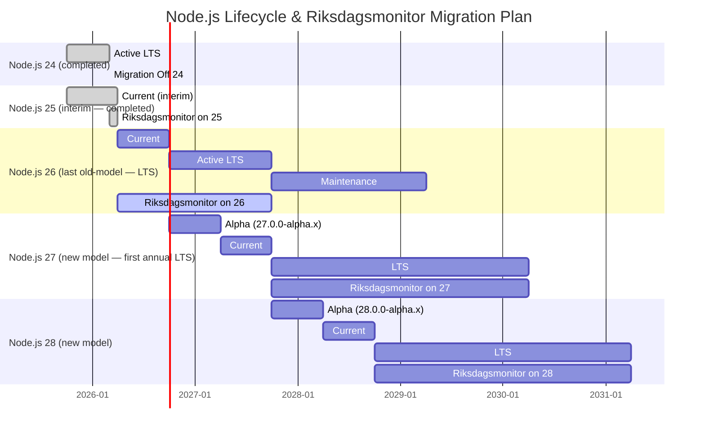

  

<h1 align="center">📅 End-of-Life Strategy — Riksdagsmonitor</h1>

  <strong>🔄 Technology Lifecycle Management for Static Intelligence Platform</strong> 
  <em>📦 Node.js 26 Active • ⏭️ Node.js 26 LTS Promotion October 2026 • ⚡ Future-Ready Architecture</em>

  
  
  
  

**📋 Document Owner:** CEO | **📄 Version:** 1.5 | **📅 Last Updated:** 2026-05-28 (UTC)  
**🔄 Review Cycle:** Annual | **⏰ Next Review:** 2027-05-28  
**🏢 Owner:** Hack23 AB (Org.nr 5595347807) | **🏷️ Classification:** Public

---

## Overview

**Riksdagsmonitor** is a static HTML5/CSS3 website deployed to AWS CloudFront + S3 (primary) and GitHub Pages (disaster recovery), built with **Vite**, tested with **Vitest** and **Cypress**, and powered by **Node.js 26**. The platform provides Swedish Parliament transparency through interactive **Chart.js** and **D3.js** visualisations across **14 languages**.

> **⚡ Upgrade Note (May 2026):** Riksdagsmonitor has been upgraded to Node.js 26 (Current → LTS in October 2026). Node.js 26 will be promoted to LTS in October 2026 — no additional migration step needed. A Node.js 27 nightly compatibility CI job (`continue-on-error: true`) tracks the next-generation release. See the [Node.js Migration Roadmap](#️-nodejs-migration-roadmap) for the full plan.

This document defines the technology lifecycle management strategy — covering the current stack, Node.js release schedule evolution, dependency EOL timelines, and migration plans — to ensure stability, compatibility, and security throughout the project's operational life.

This strategy should be read alongside the [Business Continuity Plan](BCPPlan.md), [Financial Security Plan](FinancialSecurityPlan.md), and [Architecture Documentation](ARCHITECTURE.md) for full technical and business context.

---

## EOL Objective

**Primary Goal**: Maintain Riksdagsmonitor on a supported, secure technology stack by proactively tracking dependency lifecycles and planning migrations before components reach end-of-life.

**Key Principles**:
- Upgrade to new Node.js Current versions promptly; LTS promotion happens in-place (no second migration needed)
- Keep build tooling (Vite, Vitest, TypeScript) on latest stable versions
- Maintain zero known critical/high vulnerabilities via automated scanning
- Plan major migrations **12 months** before dependency EOL dates
- Ensure the static output (HTML/CSS/JS) remains browser-compatible for **5+ years**

---

## 🔄 Node.js Release Schedule Evolution

### Why the Schedule Is Changing

The [current Node.js release schedule](https://nodejs.org/en/blog/announcements/evolving-the-nodejs-release-schedule) is 10 years old, created during the io.js merger. A decade of usage data now shows:

- **Odd-numbered releases see minimal adoption** — most users wait for Long-Term Support
- **The odd/even distinction confuses newcomers** and many organisations skip odd releases entirely
- **Volunteer sustainability** — Node.js is maintained primarily by volunteers; managing security releases across four or five active release lines has become difficult to sustain, as each additional line increases backporting complexity

By reducing concurrent release lines, the project can focus on better supporting the releases people actually use while making the schedule more predictable for enterprises.

### New Node.js Release Model (Effective October 2026)

Starting with **Node.js 27.x**, the Node.js project is [moving from two major releases per year to one](https://nodejs.org/en/blog/announcements/evolving-the-nodejs-release-schedule) (see [nodejs/Release#1113](https://github.com/nodejs/Release/issues/1113) for full background). Key changes:

| Aspect | Old Model (≤26.x) | New Model (≥27.x) |
|--------|-------------------|-------------------|
| **Major releases** | 2 per year (April + October) | **1 per year (April)** |
| **LTS promotion** | Even-numbered only (October) | **Every release becomes LTS (October)** |
| **Odd/even distinction** | Odd = Current-only, Even = LTS | **No distinction — all releases get LTS** |
| **Version numbering** | Sequential | **Aligned to calendar year** (27 in 2027, 28 in 2028) |
| **Alpha channel** | N/A | **6-month alpha phase** (Oct–Mar) with semver-major changes |
| **Alpha versioning** | N/A | **Semver prerelease format** (e.g., `27.0.0-alpha.1`) |
| **Total support window** | ~36 months (LTS only) | **36 months** from first Current release to EOL |

### New Release Lifecycle Phases

| Phase | Duration | Description |
|-------|----------|-------------|
| **Alpha** | 6 months (Oct → Mar) | Early testing, semver-major changes allowed. Versioning: `X.0.0-alpha.N` |
| **Current** | 6 months (Apr → Oct) | Stabilisation, bug fixes |
| **LTS** | 30 months (Oct → Apr+30mo) | Long-term support with security fixes |
| **EOL** | — | No further support |

> **For users who already only upgrade to LTS versions**, little changes beyond version numbering. LTS support windows remain similar, and now every release becomes LTS.

### Impact on Riksdagsmonitor

- **Simplified upgrade planning**: Every Node.js release becomes LTS, eliminating the need to skip odd-numbered versions
- **Annual upgrade cadence**: Plan one major Node.js upgrade per year (April release, adopt after October LTS promotion)
- **Alpha testing in CI**: Integrate Node.js alpha releases into the CI matrix to catch compatibility issues early — this is critical since alpha is the only window to report bugs before they affect LTS users
- **Reduced concurrent support lines**: Fewer active Node.js versions means clearer migration targets and less upgrade pressure
- **Library author responsibility**: As a consumer of npm packages, we benefit when library authors test against alpha versions; we should also test our own build tooling compatibility early

### CI Alpha Testing Strategy

To proactively catch Node.js compatibility issues, Riksdagsmonitor will adopt the following alpha testing approach:

| CI Matrix | Trigger | Failure Policy |
|-----------|---------|----------------|
| **Node.js LTS (current)** | Every push, PR | ❌ Blocking — must pass |
| **Node.js Current** | Every push, PR | ❌ Blocking — must pass |
| **Node.js Alpha (next)** | Weekly scheduled | ⚠️ Non-blocking — issues logged, not gating |

This allows early detection of breaking changes in Node.js alpha while keeping production deployments stable on LTS.

---

## 📦 Current Technology Stack & EOL Timeline

### Runtime & Build Environment

| Category | Technology | Current Version | EOL Date | Replacement Path |
|----------|-----------|----------------|----------|-----------------|
| **Runtime** | [Node.js 26](https://nodejs.org/) | 26.x | **April 2029** (Maintenance end) | Node.js 27 LTS (2027) |
| **Package Manager** | [npm](https://www.npmjs.com/) | Bundled with Node.js | Follows Node.js | Follows Node.js upgrades |
| **Language** | [TypeScript](https://www.typescriptlang.org/) | 6.0.3 | Active (quarterly releases) | Track latest stable |
| **Build Tool** | [Vite](https://vite.dev/) | 8.0.14 | Active | Track latest major |
| **Transpiler** | [tsx](https://tsx.is/) | 4.22.3 | Active | Track latest stable |

### Testing Framework

| Category | Technology | Current Version | EOL Date | Replacement Path |
|----------|-----------|----------------|----------|-----------------|
| **Unit Testing** | [Vitest](https://vitest.dev/) | 4.1.7 | Active (follows Vite) | Track with Vite major versions |
| **E2E Testing** | [Cypress](https://www.cypress.io/) | 15.16.0 | Active | Track latest stable |
| **Coverage** | [@vitest/coverage-v8](https://vitest.dev/) | 4.1.7 | Active | Track with Vitest |
| **DOM Simulation** | [happy-dom](https://github.com/nicedayfor/happy-dom) | 20.9.0 | Active | Track latest stable |

### Runtime Dependencies (Browser)

| Category | Technology | Current Version | EOL Date | Replacement Path |
|----------|-----------|----------------|----------|-----------------|
| **Charting** | [Chart.js](https://www.chartjs.org/) | 4.5.1 | Active | Track latest stable |
| **Chart Annotations** | [chartjs-plugin-annotation](https://www.chartjs.org/chartjs-plugin-annotation/) | 3.1.0 | Active | Follows Chart.js |
| **Data Visualisation** | [D3.js](https://d3js.org/) | 7.9.0 | Active | Track latest major |
| **CSV Parsing** | [PapaParse](https://www.papaparse.com/) | 5.5.3 | Active | Track latest stable |
| **JSON Validation** | [Ajv](https://ajv.js.org/) | 8.20.0 | Active | Track latest stable |
| **JSON Formats** | [ajv-formats](https://ajv.js.org/) | 3.0.1 | Active | Follows Ajv |

### Development & Quality Tools

| Category | Technology | Current Version | EOL Date | Replacement Path |
|----------|-----------|----------------|----------|-----------------|
| **Linting** | [ESLint](https://eslint.org/) | 10.4.1 | Active | Track latest major |
| **HTML Linting** | [HTMLHint](https://htmlhint.com/) | 1.9.2 | Active | Track latest stable |
| **Dead Code** | [knip](https://knip.dev/) | 6.14.2 | Active | Track latest stable |
| **API Docs** | [TypeDoc](https://typedoc.org/) | 0.28.19 | Active | Track latest stable |

---

### TypeScript Lifecycle

| TypeScript | Release Date | Status | Support Until |
|-----------|-------------|--------|---------------|
| **6.0.3** | Mar 2026 | ✅ **Active — in use** | Until 7.0 release (~12 months) |
| 5.9.x | Feb 2026 | Previous stable | Limited — security patches only |
| 5.8.x | Dec 2025 | End of life | ❌ No support |

> **Note:** TypeScript 6.0 is a major release with breaking changes including deprecated `baseUrl` option (still functional, silenced via `ignoreDeprecations: "6.0"`), stricter module resolution in bundler mode, and removal of implicit `global` namespace. The project uses `@typescript-eslint 8.60.0` which supports `typescript >=4.8.4 <6.1.0`.

### TypeScript Upgrade Policy

1. **Upgrade to new patch versions immediately** — bug fixes only, no breaking changes.
2. **Upgrade to new minor versions within 2 weeks** — validate `tsc --noEmit`, ESLint, and all tests pass.
3. **Upgrade to new major versions within 1 month** — major versions may require code changes and `@typescript-eslint` compatibility updates.
4. **Never use TypeScript versions unsupported by `@typescript-eslint`** — this would disable type-aware linting.

### TypeScript Upgrade Triggers

| Trigger | Action | Timeline |
|---------|--------|----------|
| New patch release (e.g., 6.0.3) | Update `package.json`, run full CI | Within 1 week |
| New minor release (e.g., 6.1.0) | Verify `@typescript-eslint` compatibility first | Within 2 weeks |
| New major release (e.g., 7.0.0) | Full compatibility assessment, dedicated PR | Within 1 month |
| `@typescript-eslint` drops support | Upgrade `@typescript-eslint` or pin TypeScript | Within 24 hours |

---

## 🗓️ Node.js Migration Roadmap

### ✅ Completed: Node.js 24 LTS

| Milestone | Date | Status |
|-----------|------|--------|
| Node.js 24 Current Release | April 2025 | ✅ Adopted |
| Node.js 24 LTS Promotion | October 2025 | ✅ Production deployment |
| Node.js 24 → 25 Migration | March 2026 | ✅ **Completed** |
| Node.js 25 → 26 Migration | May 2026 | ✅ **Completed** (this release) |

### ✅ Current: Node.js 26 (Last Old-Model Release — LTS)

Node.js 26 is the **last release under the old two-per-year schedule**. It releases as "Current" in April 2026 and will be promoted to **LTS in October 2026** — no additional migration will be needed at that point, as the project will already be on Node.js 26.

> **Strategy**: Stay on Node.js 26 from Current through LTS in-place — no additional upgrade step required at October 2026 LTS promotion.

| Milestone | Date | Status |
|-----------|------|--------|
| Node.js 26 Current Release | **April 2026** | ✅ **Available** |
| Riksdagsmonitor upgrade to 26 | **May 2026** | ✅ **Completed** (this release) |
| Node.js 26 LTS Promotion | October 2026 | ⏳ No migration needed — will transition in-place |
| Node.js 26 Active LTS End | **October 2027** | Begin evaluating Node.js 27 |
| Node.js 26 Maintenance End | **April 2029** | Must be off Node.js 26 |

**Completed upgrade checklist (for Node.js 26):**
- [x] Validate TypeScript native type-stripping (`process.features.typescript === "strip"`) still works
- [x] Confirm all 43+ workflows pass on Node.js 26 (blocking CI jobs)
- [x] Verify GitHub Actions `ubuntu-26.04` runners include Node.js 26
- [x] Update all `node-version: '25'` → `'26'` across all workflow YAML and markdown files
- [x] Update `package.json` `engines.node` from `>=25` to `>=26`
- [x] Update `.nvmrc` from `25` to `26`
- [x] Update skills documentation (`./github/skills/**SKILL.md`) code examples
- [x] Update documentation (End-of-Life-Strategy.md, WORKFLOWS.md, FUTURE_WORKFLOWS.md, README.md, TESTING.md)
- [x] Add Node.js 27 nightly CI compatibility job (`continue-on-error: true`)

### Future: Node.js 27 LTS (New Schedule)

Node.js 27 is the **first release under the new one-per-year schedule** where every release becomes LTS.

| Milestone | Date | Action |
|-----------|------|--------|
| Node.js 27 Alpha Phase | October 2026 – March 2027 | **Add alpha to CI matrix** |
| Node.js 27 Current Release | April 2027 | Evaluate compatibility |
| Node.js 27 LTS Promotion | October 2027 | Plan migration from Node.js 26 |
| Migration Window | Oct 2027 – Mar 2028 | Upgrade riksdagsmonitor to Node.js 27 |
| Node.js 27 EOL | ~April 2030 | Plan next migration |

### Future: Node.js 28 LTS (New Schedule)

| Milestone | Date | Action |
|-----------|------|--------|
| Node.js 28 Alpha Phase | October 2027 – March 2028 | Add alpha to CI matrix |
| Node.js 28 Current Release | April 2028 | Evaluate compatibility |
| Node.js 28 LTS Promotion | October 2028 | Plan migration from Node.js 27 |
| Migration Window | Oct 2028 – Mar 2029 | Upgrade riksdagsmonitor to Node.js 28 |
| Node.js 28 EOL | ~April 2031 | Plan next migration |

### Long-Term Node.js Upgrade Calendar

---

## 🔧 Ongoing Maintenance Strategy

### Dependency Update Policy

| Priority | Category | Cadence | Automation |
|----------|----------|---------|------------|
| 🔴 **Critical** | Security patches (CVE) | Within 48 hours | Dependabot auto-merge |
| 🟡 **High** | Major framework updates (Vite, Vitest) | Within 2 weeks | Dependabot PR + manual review |
| 🟢 **Medium** | Minor/patch dependency updates | Weekly | Dependabot grouped PRs |
| ⚪ **Low** | Dev-only tooling updates | Monthly | Dependabot grouped PRs |

### Automated Security Monitoring

- **[Dependabot](https://docs.github.com/en/code-security/dependabot)**: Automated dependency vulnerability alerts and PRs
- **[CodeQL](https://codeql.github.com/)**: Static analysis for JavaScript/TypeScript security issues
- **[GitHub Secret Scanning](https://docs.github.com/en/code-security/secret-scanning)**: Prevent credential leaks
- **[npm audit](https://docs.npmjs.com/cli/audit)**: Integrated into CI pipeline
- **[knip](https://knip.dev/)**: Dead code and unused dependency detection

### Browser Compatibility Strategy

Riksdagsmonitor outputs **static HTML5, CSS3, and ES2020+ JavaScript**. Browser support targets:

| Browser | Minimum Version | EOL Consideration |
|---------|----------------|-------------------|
| Chrome | 90+ | Evergreen (auto-updates) |
| Firefox | 90+ | Evergreen (auto-updates) |
| Safari | 15+ | Tied to macOS/iOS versions |
| Edge | 90+ | Chromium-based, evergreen |

**Vite Build Target**: The Vite build configuration ensures output is compatible with modern browsers. The static output continues to function independently of the Node.js build tooling version.

### CI/CD Pipeline Maintenance

| Component | Current | Maintenance Strategy |
|-----------|---------|---------------------|
| GitHub Actions runners | `ubuntu-26.04` | Pinned; update when next LTS image releases |
| Action versions | SHA-pinned | Update via Dependabot |
| step-security/harden-runner | SHA-pinned | Update via Dependabot |
| Node.js in CI | `node-version: '26'` | Update with each Node.js migration |

---

## 📊 Risk Assessment

### Technology Risk Matrix

| Risk | Likelihood | Impact | Mitigation |
|------|-----------|--------|------------|
| Node.js 26 reaches EOL before Node.js 27 upgrade | **Very Low** | Medium | Node.js 27 upgrade planned when it reaches Current (Oct 2027); automated process ready |
| Node.js 26 breaking changes | Low | Medium | Test on Node.js 26 RC in CI matrix before it releases |
| Vite major breaking changes | Medium | Medium | Pin to major version, test upgrades in branch |
| Chart.js/D3.js API deprecation | Low | Medium | Abstraction layer isolates visualisation logic |
| Cypress major breaking changes | Medium | Low | E2E tests are supplementary; can temporarily skip |
| npm ecosystem supply chain attack | Low | High | SHA-pinned actions, SRI hashes, Dependabot alerts |
| Browser API deprecation affecting static output | Very Low | Low | ES2020+ features are stable and widely supported |
| TypeScript major upgrade breaks build | Low | Medium | Test with `tsc --noEmit`, lint, and full test suite before merging |
| @typescript-eslint drops TypeScript version support | Medium | High | Monitor peer dependency ranges; pin TypeScript if needed |

### Migration Complexity Assessment

| Migration | Complexity | Estimated Effort | Risk Level |
|-----------|-----------|-----------------|------------|
| Node.js 24 → 25 | Very Low | < 1 day | 🟢 Very Low |
| Node.js 25 → 26 (✅ completed) | Very Low | < 1 day | 🟢 Very Low |
| Node.js 26 → 27 (new schedule) | Low | 1–2 days | 🟢 Low |
| Vite 8 → next major | Medium | 2–5 days | 🟡 Medium |
| TypeScript 5 → 6 | Low | < 1 day | 🟢 Very Low (completed) |
| TypeScript 6 → 7 | Low–Medium | 1–3 days | 🟢 Low |
| Chart.js 4 → 5 | Medium | 3–5 days | 🟡 Medium |
| D3.js 7 → 8 | Medium | 3–7 days | 🟡 Medium |

---

## 🏁 Final EOL Condition

Riksdagsmonitor is a **continuously maintained** platform with no planned end-of-life. However, the project would enter EOL status if:

1. **All maintainers cease activity** and no successors are appointed
2. **Core dependencies** (Node.js, Vite, Chart.js, D3.js) all simultaneously reach EOL with no migration path
3. **Browser standards** fundamentally change, making the static HTML/CSS/JS output non-functional
4. **The Riksdag (Swedish Parliament)** ceases to exist or provide public data

In any EOL scenario:
- The static website will remain accessible on GitHub Pages indefinitely (read-only)
- All source code will remain available under Apache 2.0 license
- Data archives will be preserved in the repository
- A final release will be tagged with EOL notice

---

## 🔐 ISMS Policy Governance

The ongoing maintenance strategy aligns with Hack23 AB's [ISMS-PUBLIC framework](https://github.com/Hack23/ISMS-PUBLIC) to ensure systematic security management throughout the platform lifecycle.

### Maintenance Activities by ISMS Policy

| 🛡️ ISMS Policy | 🔧 Maintenance Activity | 📋 Implementation |
|---------------|------------------------|------------------|
| [**Change Management**](https://github.com/Hack23/ISMS-PUBLIC/blob/main/Change_Management.md) | Node.js LTS migration planning Major dependency upgrades | Risk-assessed transition with testing Documented migration path via PRs |
| [**Vulnerability Management**](https://github.com/Hack23/ISMS-PUBLIC/blob/main/Vulnerability_Management.md) | Automated security patching Dependency updates via Dependabot | Weekly vulnerability scans 48-hour patch SLA for critical issues |
| [**Asset Register**](https://github.com/Hack23/ISMS-PUBLIC/blob/main/Asset_Register.md) | EOL tracking for dependencies Technology stack monitoring | Documented component lifecycle (this document) Replacement planning for EOL tech |
| [**Business Continuity Plan**](https://github.com/Hack23/ISMS-PUBLIC/blob/main/Business_Continuity_Plan.md) | Platform availability during transitions Rollback procedures | Dual deployment (AWS + GitHub Pages) Tested recovery procedures |
| [**Secure Development Policy**](https://github.com/Hack23/ISMS-PUBLIC/blob/main/Secure_Development_Policy.md) | Security testing during upgrades Supply chain verification | CodeQL, npm audit, SLSA attestation SHA-pinned GitHub Actions |

**Security Assurance:**
- ✅ All dependency updates security-vetted through [WORKFLOWS.md](WORKFLOWS.md) automated scanning
- ✅ Version compatibility tested before production deployment
- ✅ Security patches prioritised per [Vulnerability Management policy](https://github.com/Hack23/ISMS-PUBLIC/blob/main/Vulnerability_Management.md)
- ✅ EOL components tracked in [Asset Register](https://github.com/Hack23/ISMS-PUBLIC/blob/main/Asset_Register.md)

---

## 📚 Related Documents

### 🏗️ Architecture & Planning
- [🏛️ Architecture](./ARCHITECTURE.md) — Current system architecture (C4 models)
- [🚀 Future Architecture](./FUTURE_ARCHITECTURE.md) — Long-term architectural vision
- [🧠 Mindmap](./MINDMAP.md) — System conceptual relationships
- [📋 README](./README.md) — Project overview and quick links

### 🛡️ Security & Compliance
- [🛡️ Security Architecture](./SECURITY_ARCHITECTURE.md) — Current security implementation
- [🎯 Threat Model](./THREAT_MODEL.md) — STRIDE risk analysis
- [💰 Financial Security Plan](./FinancialSecurityPlan.md) — Cost analysis and security investment
- [📋 CRA Assessment](./CRA-ASSESSMENT.md) — EU Cyber Resilience Act compliance
- [🔒 Security Policy](./SECURITY.md) — Vulnerability disclosure and management

### 🔄 Operations & Lifecycle
- [📋 BCP Plan](./BCPPlan.md) — Business continuity and disaster recovery
- [🚀 Release Process](./RELEASE_PROCESS.md) — Release procedures with attestations
- [🔄 CI/CD Workflows](./WORKFLOWS.md) — Security-hardened CI/CD pipelines
- [🔮 Future Workflows](./FUTURE_WORKFLOWS.md) — Enhanced CI/CD roadmap

### 🔐 ISMS Policies
- [🔐 Information Security Policy](https://github.com/Hack23/ISMS-PUBLIC/blob/main/Information_Security_Policy.md) — Overall security governance
- [🔍 Vulnerability Management](https://github.com/Hack23/ISMS-PUBLIC/blob/main/Vulnerability_Management.md) — Security testing and remediation
- [📝 Change Management](https://github.com/Hack23/ISMS-PUBLIC/blob/main/Change_Management.md) — Risk-controlled change processes
- [🏷️ Classification Framework](https://github.com/Hack23/ISMS-PUBLIC/blob/main/CLASSIFICATION.md) — Business impact and risk assessment
- [🛡️ Secure Development Policy](https://github.com/Hack23/ISMS-PUBLIC/blob/main/Secure_Development_Policy.md) — DevSecOps requirements

---

**📋 Document Control:**  
**✅ Approved by:** James Pether Sörling, CEO  
**📤 Distribution:** Public  
**🏷️ Classification:**     
**📅 Effective Date:** 2026-05-28  
**⏰ Next Review:** 2027-05-28  
**🎯 Framework Compliance:**   

---

## 🌐 IMF Cached Datasets — End-of-Life Preservation

> **Effective:** 2026-04-24 · **Authoritative hub:** [`analysis/imf/README.md`](analysis/imf/README.md) · [`analysis/imf/agentic-integration.md`](analysis/imf/agentic-integration.md) · [`analysis/imf/indicators-inventory.json`](analysis/imf/indicators-inventory.json) · [`analysis/imf/data-dictionary.md`](analysis/imf/data-dictionary.md) · [`.github/aw/ECONOMIC_DATA_CONTRACT.md`](.github/aw/ECONOMIC_DATA_CONTRACT.md)

### IMF data preservation at platform sunset

| Asset | Preservation strategy | Rationale |
|---|---|---|
| `analysis/imf/indicators-inventory.json` | Archived in final `analysis/` snapshot; mirrored to Internet Archive | Schema documents what we cached |
| `analysis/imf/data-dictionary.md` | Archived; mirrored | Reproducibility of vintage interpretation |
| `analysis/imf/agentic-integration.md` | Archived; mirrored | Reproducibility of integration pattern |
| Vintage-tagged IMF cache (`analysis/daily/*/economic-data.json`) | **Preserved in full** in archival snapshot | Provenance integrity — never delete |
| `economicProvenance` blocks in articles | Preserved (immutable) | Article-level audit trail |
| SHA-256 cache pin index | Preserved | Integrity verification post-sunset |

### IMF licence at end-of-life

The IMF data licence (attribution required, redistribution permitted) survives platform sunset. Archived IMF-cached data may be redistributed by successor projects provided the IMF attribution remains intact.

### Successor-project handoff

Future maintainers inheriting Riksdagsmonitor receive:
1. The vintage-tagged IMF cache (full historical depth at sunset moment)
2. The `scripts/imf-*.ts` runtime (reusable in any TypeScript context)
3. The IMF integration playbook (`agentic-integration.md`)
4. The IMF threat model (`THREAT_MODEL.md` §IMF + `FUTURE_THREAT_MODEL.md` §IMF)

This enables a successor to either continue IMF integration immediately or migrate to a different economic-data provider (with full provenance for the data they inherit).

**Canonical rule.** Every economic claim in a Riksdagsmonitor article cites an IMF dataflow first; World Bank citations are reserved for governance, environment and social residue (the classes IMF does not publish). SCB is the Swedish-specific ground truth layer. See `ECONOMIC_DATA_CONTRACT.md` v2.1 for the banned-phrase list and vintage discipline (>6 mo → annotation).

---

## 🔗 Hack23 Ecosystem

<table>
<tr>
  <th width="33%">🌐 Platforms</th>
  <th width="33%">📦 Open-Source Projects</th>
  <th width="33%">🛡️ Governance &amp; Standards</th>
</tr>
<tr>
<td valign="top">
🗳️ <a href="https://riksdagsmonitor.com">Riksdagsmonitor</a> — Swedish Parliament intelligence 
🇪🇺 <a href="https://www.euparliamentmonitor.com">EU Parliament Monitor</a> — European coverage 
🕵️ <a href="https://www.hack23.com/cia">Citizen Intelligence Agency</a> — political-data engine 
🌐 <a href="https://www.hack23.com">Hack23 AB</a> — corporate site 
📰 <a href="https://hack23.com/blog.html">Hack23 Blog</a> — engineering &amp; policy 
💼 <a href="https://www.linkedin.com/company/hack23/">Hack23 on LinkedIn</a>
</td>
<td valign="top">
🗳️ <a href="https://github.com/Hack23/riksdagsmonitor">Hack23/riksdagsmonitor</a> 
🕵️ <a href="https://github.com/Hack23/cia">Hack23/cia</a> 
🇪🇺 <a href="https://github.com/Hack23/euparliamentmonitor">Hack23/euparliamentmonitor</a> 
🔌 <a href="https://github.com/Hack23/european-parliament-mcp">Hack23/european-parliament-mcp</a> 
✅ <a href="https://github.com/Hack23/cia-compliance-manager">Hack23/cia-compliance-manager</a> 
🥋 <a href="https://github.com/Hack23/black-trigram">Hack23/black-trigram</a> 
🏠 <a href="https://github.com/Hack23/homepage">Hack23/homepage</a>
</td>
<td valign="top">
🛡️ <a href="https://github.com/Hack23/ISMS-PUBLIC">Hack23 ISMS-PUBLIC</a> — public ISMS 
🔒 <a href="https://github.com/Hack23/ISMS-PUBLIC/blob/main/Information_Security_Policy.md">Information Security Policy</a> 
🤖 <a href="https://github.com/Hack23/ISMS-PUBLIC/blob/main/AI_Policy.md">AI Policy</a> 
🧪 <a href="https://github.com/Hack23/ISMS-PUBLIC/blob/main/Secure_Development_Policy.md">Secure Development Policy</a> 
🎯 <a href="https://github.com/Hack23/ISMS-PUBLIC/blob/main/Threat_Modeling.md">Threat Modeling Policy</a> 
⚠️ <a href="https://github.com/Hack23/ISMS-PUBLIC/blob/main/Vulnerability_Management.md">Vulnerability Management</a> 
🏷️ <a href="https://github.com/Hack23/ISMS-PUBLIC/blob/main/CLASSIFICATION.md">Classification Framework</a>
</td>
</tr>
</table>

<em>🗳️ Empower citizens · 🔍 Strengthen democratic accountability · 🕵️ Illuminate the political process</em>

© 2008–2026 <a href="https://www.hack23.com">Hack23 AB</a> (Org.nr 559534-7807) · Maintainer: <a href="https://www.linkedin.com/in/jamessorling/">James Pether Sörling, CISSP CISM</a>

