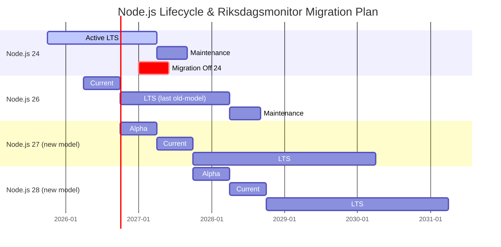

  

<h1 align="center">📅 End-of-Life Strategy — Riksdagsmonitor</h1>

  <strong>🔄 Technology Lifecycle Management for Static Intelligence Platform</strong> 
  <em>📦 Node.js 24 LTS Maintenance • 🔄 Vite/Vitest Ecosystem • ⚡ Future-Ready Architecture</em>

  
  
  
  

**📋 Document Owner:** CEO | **📄 Version:** 1.0 | **📅 Last Updated:** 2026-03-12 (UTC)  
**🔄 Review Cycle:** Annual | **⏰ Next Review:** 2027-03-12

---

## Overview

**Riksdagsmonitor** is a static HTML5/CSS3 website deployed to AWS CloudFront + S3 (primary) and GitHub Pages (disaster recovery), built with **Vite**, tested with **Vitest** and **Cypress**, and powered by **Node.js 24 LTS**. The platform provides Swedish Parliament transparency through interactive **Chart.js** and **D3.js** visualisations across **14 languages**.

This document defines the technology lifecycle management strategy — covering the current stack, Node.js release schedule evolution, dependency EOL timelines, and migration plans — to ensure stability, compatibility, and security throughout the project's operational life.

This strategy should be read alongside the [Business Continuity Plan](BCPPlan.md), [Financial Security Plan](FinancialSecurityPlan.md), and [Architecture Documentation](ARCHITECTURE.md) for full technical and business context.

---

## EOL Objective

**Primary Goal**: Maintain Riksdagsmonitor on a supported, secure technology stack by proactively tracking dependency lifecycles and planning migrations before components reach end-of-life.

**Key Principles**:
- Upgrade to new Node.js LTS versions within **6 months** of release
- Keep build tooling (Vite, Vitest, TypeScript) on latest stable versions
- Maintain zero known critical/high vulnerabilities via automated scanning
- Plan major migrations **12 months** before dependency EOL dates
- Ensure the static output (HTML/CSS/JS) remains browser-compatible for **5+ years**

---

## 🔄 Node.js Release Schedule Evolution

### New Node.js Release Model (Effective October 2026)

Starting with **Node.js 27.x**, the Node.js project is [moving from two major releases per year to one](https://nodejs.org/en/blog/announcements/evolving-the-nodejs-release-schedule). Key changes:

| Aspect | Old Model (≤26.x) | New Model (≥27.x) |
|--------|-------------------|-------------------|
| **Major releases** | 2 per year (April + October) | **1 per year (April)** |
| **LTS promotion** | Even-numbered only (October) | **Every release becomes LTS (October)** |
| **Odd/even distinction** | Odd = Current-only, Even = LTS | **No distinction — all releases get LTS** |
| **Version numbering** | Sequential | **Aligned to calendar year** (27 in 2027, 28 in 2028) |
| **Alpha channel** | N/A | **6-month alpha phase** (Oct–Mar) with semver-major changes |
| **Total support window** | ~36 months (LTS only) | **36 months** from Current release to EOL |

### New Release Lifecycle Phases

| Phase | Duration | Description |
|-------|----------|-------------|
| **Alpha** | 6 months (Oct → Mar) | Early testing, semver-major changes allowed |
| **Current** | 6 months (Apr → Oct) | Stabilisation, bug fixes |
| **LTS** | 30 months (Oct → Apr+30mo) | Long-term support with security fixes |
| **EOL** | — | No further support |

### Impact on Riksdagsmonitor

- **Simplified upgrade planning**: Every Node.js release becomes LTS, eliminating the need to skip odd-numbered versions
- **Annual upgrade cadence**: Plan one major Node.js upgrade per year (April release, adopt after October LTS promotion)
- **Alpha testing**: Integrate Node.js alpha releases into CI to catch compatibility issues early
- **Library author responsibility**: Test against alpha versions to report bugs before LTS promotion

---

## 📦 Current Technology Stack & EOL Timeline

### Runtime & Build Environment

| Category | Technology | Current Version | EOL Date | Replacement Path |
|----------|-----------|----------------|----------|-----------------|
| **Runtime** | [Node.js 24 LTS](https://nodejs.org/) | 24.14.0 | **April 2027** (end of Active LTS) / **Sep 2027** (Maintenance EOL) | Node.js 26 LTS → Node.js 27 LTS |
| **Package Manager** | [npm](https://www.npmjs.com/) | Bundled with Node.js | Follows Node.js | Follows Node.js upgrades |
| **Language** | [TypeScript](https://www.typescriptlang.org/) | 5.9.3 | Active (monthly releases) | Track latest stable |
| **Build Tool** | [Vite](https://vite.dev/) | 7.3.1 | Active | Track latest major |
| **Transpiler** | [tsx](https://tsx.is/) | 4.21.0 | Active | Track latest stable |

### Testing Framework

| Category | Technology | Current Version | EOL Date | Replacement Path |
|----------|-----------|----------------|----------|-----------------|
| **Unit Testing** | [Vitest](https://vitest.dev/) | 4.0.18 | Active (follows Vite) | Track with Vite major versions |
| **E2E Testing** | [Cypress](https://www.cypress.io/) | 15.11.0 | Active | Track latest stable |
| **Coverage** | [@vitest/coverage-v8](https://vitest.dev/) | 4.0.18 | Active | Track with Vitest |
| **DOM Simulation** | [happy-dom](https://github.com/nicedayfor/happy-dom) | 20.8.3 | Active | Track latest stable |

### Runtime Dependencies (Browser)

| Category | Technology | Current Version | EOL Date | Replacement Path |
|----------|-----------|----------------|----------|-----------------|
| **Charting** | [Chart.js](https://www.chartjs.org/) | 4.5.1 | Active | Track latest stable |
| **Chart Annotations** | [chartjs-plugin-annotation](https://www.chartjs.org/chartjs-plugin-annotation/) | 3.1.0 | Active | Follows Chart.js |
| **Data Visualisation** | [D3.js](https://d3js.org/) | 7.9.0 | Active | Track latest major |
| **CSV Parsing** | [PapaParse](https://www.papaparse.com/) | 5.5.3 | Active | Track latest stable |
| **JSON Validation** | [Ajv](https://ajv.js.org/) | 8.18.0 | Active | Track latest stable |
| **JSON Formats** | [ajv-formats](https://ajv.js.org/) | 3.0.1 | Active | Follows Ajv |

### Development & Quality Tools

| Category | Technology | Current Version | EOL Date | Replacement Path |
|----------|-----------|----------------|----------|-----------------|
| **Linting** | [ESLint](https://eslint.org/) | 10.0.3 | Active | Track latest major |
| **HTML Linting** | [HTMLHint](https://htmlhint.com/) | 1.9.2 | Active | Track latest stable |
| **Dead Code** | [knip](https://knip.dev/) | 5.86.0 | Active | Track latest stable |
| **API Docs** | [TypeDoc](https://typedoc.org/) | 0.28.17 | Active | Track latest stable |
| **SRI Generation** | [vite-plugin-sri-gen](https://www.npmjs.com/package/vite-plugin-sri-gen) | 1.3.2 | Active | Track latest stable |

---

## 🗓️ Node.js Migration Roadmap

### Current: Node.js 24 LTS (Active)

| Milestone | Date | Action |
|-----------|------|--------|
| Node.js 24 Current Release | April 2025 | ✅ Adopted |
| Node.js 24 LTS Promotion | October 2025 | ✅ Production deployment |
| Node.js 24 Active LTS End | **April 2027** | Begin migration to next LTS |
| Node.js 24 Maintenance End | **September 2027** | Must be off Node.js 24 |

### Next: Node.js 26 LTS (Old Schedule)

Node.js 26 is the **last release under the old two-per-year schedule**.

| Milestone | Date | Action |
|-----------|------|--------|
| Node.js 26 Current Release | April 2026 | Evaluate in CI |
| Node.js 26 LTS Promotion | October 2026 | Plan migration |
| Migration Window | Oct 2026 – Mar 2027 | Upgrade riksdagsmonitor to Node.js 26 |
| Node.js 26 Maintenance End | ~September 2028 | Plan next migration |

### Future: Node.js 27 LTS (New Schedule)

Node.js 27 is the **first release under the new one-per-year schedule** where every release becomes LTS.

| Milestone | Date | Action |
|-----------|------|--------|
| Node.js 27 Alpha Phase | October 2026 – March 2027 | **Add alpha to CI matrix** |
| Node.js 27 Current Release | April 2027 | Evaluate compatibility |
| Node.js 27 LTS Promotion | October 2027 | Plan migration from Node.js 26 |
| Migration Window | Oct 2027 – Mar 2028 | Upgrade riksdagsmonitor to Node.js 27 |
| Node.js 27 EOL | ~April 2030 | Plan next migration |

### Long-Term Node.js Upgrade Calendar

---

## 🔧 Ongoing Maintenance Strategy

### Dependency Update Policy

| Priority | Category | Cadence | Automation |
|----------|----------|---------|------------|
| 🔴 **Critical** | Security patches (CVE) | Within 48 hours | Dependabot auto-merge |
| 🟡 **High** | Major framework updates (Vite, Vitest) | Within 2 weeks | Dependabot PR + manual review |
| 🟢 **Medium** | Minor/patch dependency updates | Weekly | Dependabot grouped PRs |
| ⚪ **Low** | Dev-only tooling updates | Monthly | Dependabot grouped PRs |

### Automated Security Monitoring

- **[Dependabot](https://docs.github.com/en/code-security/dependabot)**: Automated dependency vulnerability alerts and PRs
- **[CodeQL](https://codeql.github.com/)**: Static analysis for JavaScript/TypeScript security issues
- **[GitHub Secret Scanning](https://docs.github.com/en/code-security/secret-scanning)**: Prevent credential leaks
- **[npm audit](https://docs.npmjs.com/cli/audit)**: Integrated into CI pipeline
- **[knip](https://knip.dev/)**: Dead code and unused dependency detection

### Browser Compatibility Strategy

Riksdagsmonitor outputs **static HTML5, CSS3, and ES2020+ JavaScript**. Browser support targets:

| Browser | Minimum Version | EOL Consideration |
|---------|----------------|-------------------|
| Chrome | 90+ | Evergreen (auto-updates) |
| Firefox | 90+ | Evergreen (auto-updates) |
| Safari | 15+ | Tied to macOS/iOS versions |
| Edge | 90+ | Chromium-based, evergreen |

**Vite Build Target**: The Vite build configuration ensures output is compatible with modern browsers. The static output continues to function independently of the Node.js build tooling version.

### CI/CD Pipeline Maintenance

| Component | Current | Maintenance Strategy |
|-----------|---------|---------------------|
| GitHub Actions runners | `ubuntu-latest` | Auto-updated by GitHub |
| Action versions | SHA-pinned | Update via Dependabot |
| step-security/harden-runner | SHA-pinned | Update via Dependabot |
| Node.js in CI | `node-version: '24'` | Update with LTS migrations |

---

## 📊 Risk Assessment

### Technology Risk Matrix

| Risk | Likelihood | Impact | Mitigation |
|------|-----------|--------|------------|
| Node.js 24 reaches EOL before migration | Low | High | Migration planned 6 months before Maintenance EOL |
| Vite major breaking changes | Medium | Medium | Pin to major version, test upgrades in branch |
| Chart.js/D3.js API deprecation | Low | Medium | Abstraction layer isolates visualisation logic |
| Cypress major breaking changes | Medium | Low | E2E tests are supplementary; can temporarily skip |
| npm ecosystem supply chain attack | Low | High | SHA-pinned actions, SRI hashes, Dependabot alerts |
| Browser API deprecation affecting static output | Very Low | Low | ES2020+ features are stable and widely supported |

### Migration Complexity Assessment

| Migration | Complexity | Estimated Effort | Risk Level |
|-----------|-----------|-----------------|------------|
| Node.js 24 → 26 | Low | 1–2 days | 🟢 Low |
| Node.js 26 → 27 (new schedule) | Low | 1–2 days | 🟢 Low |
| Vite 7 → next major | Medium | 2–5 days | 🟡 Medium |
| TypeScript 5 → 6 | Low–Medium | 1–3 days | 🟢 Low |
| Chart.js 4 → 5 | Medium | 3–5 days | 🟡 Medium |
| D3.js 7 → 8 | Medium | 3–7 days | 🟡 Medium |

---

## 🏁 Final EOL Condition

Riksdagsmonitor is a **continuously maintained** platform with no planned end-of-life. However, the project would enter EOL status if:

1. **All maintainers cease activity** and no successors are appointed
2. **Core dependencies** (Node.js, Vite, Chart.js, D3.js) all simultaneously reach EOL with no migration path
3. **Browser standards** fundamentally change, making the static HTML/CSS/JS output non-functional
4. **The Riksdag (Swedish Parliament)** ceases to exist or provide public data

In any EOL scenario:
- The static website will remain accessible on GitHub Pages indefinitely (read-only)
- All source code will remain available under Apache 2.0 license
- Data archives will be preserved in the repository
- A final release will be tagged with EOL notice

---

## 🔐 ISMS Policy Governance

The ongoing maintenance strategy aligns with Hack23 AB's [ISMS-PUBLIC framework](https://github.com/Hack23/ISMS-PUBLIC) to ensure systematic security management throughout the platform lifecycle.

### Maintenance Activities by ISMS Policy

| 🛡️ ISMS Policy | 🔧 Maintenance Activity | 📋 Implementation |
|---------------|------------------------|------------------|
| [**Change Management**](https://github.com/Hack23/ISMS-PUBLIC/blob/main/Change_Management.md) | Node.js LTS migration planning Major dependency upgrades | Risk-assessed transition with testing Documented migration path via PRs |
| [**Vulnerability Management**](https://github.com/Hack23/ISMS-PUBLIC/blob/main/Vulnerability_Management.md) | Automated security patching Dependency updates via Dependabot | Weekly vulnerability scans 48-hour patch SLA for critical issues |
| [**Asset Register**](https://github.com/Hack23/ISMS-PUBLIC/blob/main/Asset_Register.md) | EOL tracking for dependencies Technology stack monitoring | Documented component lifecycle (this document) Replacement planning for EOL tech |
| [**Business Continuity Plan**](https://github.com/Hack23/ISMS-PUBLIC/blob/main/Business_Continuity_Plan.md) | Platform availability during transitions Rollback procedures | Dual deployment (AWS + GitHub Pages) Tested recovery procedures |
| [**Secure Development Policy**](https://github.com/Hack23/ISMS-PUBLIC/blob/main/Secure_Development_Policy.md) | Security testing during upgrades Supply chain verification | CodeQL, npm audit, SLSA attestation SHA-pinned GitHub Actions |

**Security Assurance:**
- ✅ All dependency updates security-vetted through [WORKFLOWS.md](WORKFLOWS.md) automated scanning
- ✅ Version compatibility tested before production deployment
- ✅ Security patches prioritised per [Vulnerability Management policy](https://github.com/Hack23/ISMS-PUBLIC/blob/main/Vulnerability_Management.md)
- ✅ EOL components tracked in [Asset Register](https://github.com/Hack23/ISMS-PUBLIC/blob/main/Asset_Register.md)

---

## 📚 Related Documents

### 🏗️ Architecture & Planning
- [🏛️ Architecture](./ARCHITECTURE.md) — Current system architecture (C4 models)
- [🚀 Future Architecture](./FUTURE_ARCHITECTURE.md) — Long-term architectural vision
- [🧠 Mindmap](./MINDMAP.md) — System conceptual relationships
- [📋 README](./README.md) — Project overview and quick links

### 🛡️ Security & Compliance
- [🛡️ Security Architecture](./SECURITY_ARCHITECTURE.md) — Current security implementation
- [🎯 Threat Model](./THREAT_MODEL.md) — STRIDE risk analysis
- [💰 Financial Security Plan](./FinancialSecurityPlan.md) — Cost analysis and security investment
- [📋 CRA Assessment](./CRA-ASSESSMENT.md) — EU Cyber Resilience Act compliance
- [🔒 Security Policy](./SECURITY.md) — Vulnerability disclosure and management

### 🔄 Operations & Lifecycle
- [📋 BCP Plan](./BCPPlan.md) — Business continuity and disaster recovery
- [🚀 Release Process](./RELEASE_PROCESS.md) — Release procedures with attestations
- [🔄 CI/CD Workflows](./WORKFLOWS.md) — Security-hardened CI/CD pipelines
- [🔮 Future Workflows](./FUTURE_WORKFLOWS.md) — Enhanced CI/CD roadmap

### 🔐 ISMS Policies
- [🔐 Information Security Policy](https://github.com/Hack23/ISMS-PUBLIC/blob/main/Information_Security_Policy.md) — Overall security governance
- [🔍 Vulnerability Management](https://github.com/Hack23/ISMS-PUBLIC/blob/main/Vulnerability_Management.md) — Security testing and remediation
- [📝 Change Management](https://github.com/Hack23/ISMS-PUBLIC/blob/main/Change_Management.md) — Risk-controlled change processes
- [🏷️ Classification Framework](https://github.com/Hack23/ISMS-PUBLIC/blob/main/CLASSIFICATION.md) — Business impact and risk assessment
- [🛡️ Secure Development Policy](https://github.com/Hack23/ISMS-PUBLIC/blob/main/Secure_Development_Policy.md) — DevSecOps requirements

---

**📋 Document Control:**  
**✅ Approved by:** James Pether Sörling, CEO  
**📤 Distribution:** Public  
**🏷️ Classification:**     
**📅 Effective Date:** 2026-03-12  
**⏰ Next Review:** 2027-03-12  
**🎯 Framework Compliance:**   
