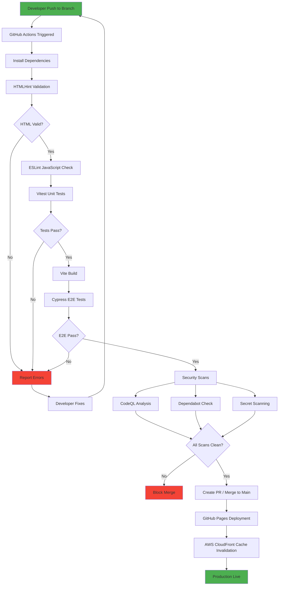
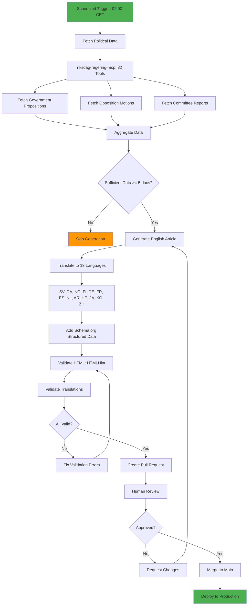
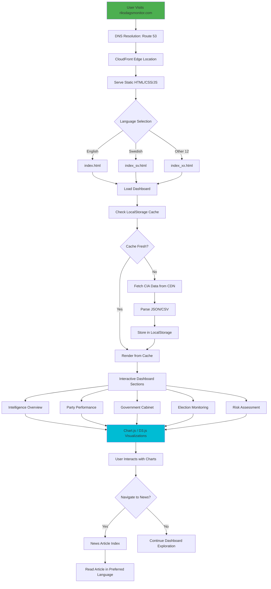
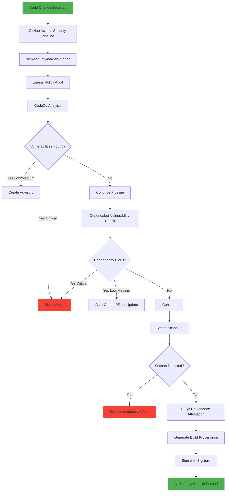
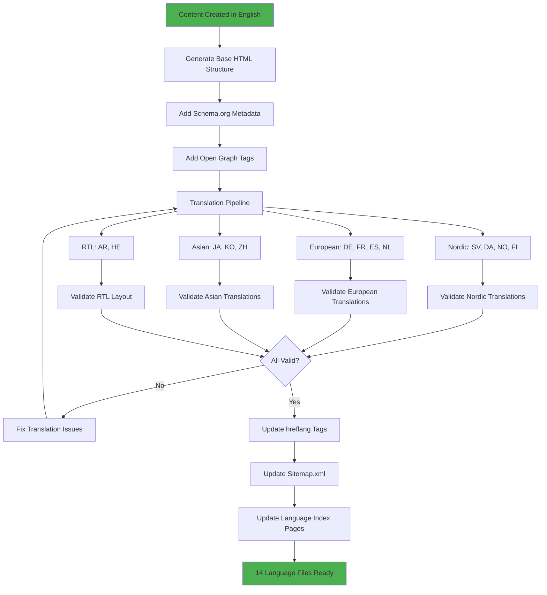

  

<h1 align="center">🔄 Riksdagsmonitor — Flowcharts</h1>

  <strong>📊 Process Flows and Data Pipelines for Democratic Transparency</strong> 
  <em>🎯 CI/CD Workflows · Data Pipelines · Content Generation · User Journeys</em>

  
  
  
  

**📋 Document Owner:** CEO | **📄 Version:** 1.0 | **📅 Last Updated:** 2026-02-20 (UTC)  
**🔄 Review Cycle:** Quarterly | **⏰ Next Review:** 2026-05-20  
**🏢 Owner:** Hack23 AB (Org.nr 5595347807) | **🏷️ Classification:** Public

---

## 🎯 Purpose

This document provides comprehensive flowcharts for all major processes in the Riksdagsmonitor platform. These visual process flows complement the [Architecture](ARCHITECTURE.md) (system structure), [State Diagrams](STATEDIAGRAM.md) (state transitions), and [Workflows](WORKFLOWS.md) (CI/CD automation) documentation.

## 📚 Related Architecture Documentation

| Document | Focus | Description |
|----------|-------|-------------|
| **[Architecture](ARCHITECTURE.md)** | 🏛️ C4 Models | System structure and components |
| **[Data Model](DATA_MODEL.md)** | 📊 Data | Entities, schemas, relationships |
| **[State Diagrams](STATEDIAGRAM.md)** | 🔄 Behavior | System state transitions |
| **[Workflows](WORKFLOWS.md)** | 🔧 DevOps | CI/CD pipeline documentation |
| **[Security Architecture](SECURITY_ARCHITECTURE.md)** | 🛡️ Security | Defense-in-depth controls |
| **[Threat Model](THREAT_MODEL.md)** | 🎯 Threats | STRIDE analysis |
| **[Future Flowcharts](FUTURE_FLOWCHART.md)** | 🚀 Future | Advanced process flows roadmap |

---

## 1. 🏗️ Build and Deployment Flow

---

## 2. 📰 News Article Generation Flow

---

## 3. 📊 CIA Data Pipeline Flow

---

## 4. 👤 User Journey Flow

---

## 5. 🔒 Security Scanning Flow

---

## 6. 🌐 Multi-Language Content Flow

---

## 📋 Process Inventory

| # | Process | Trigger | Duration | Frequency |
|---|---------|---------|----------|-----------|
| 1 | Build & Deploy | Git push | 5-8 min | Per commit |
| 2 | News Generation | Cron 02:00 CET | 10-15 min | Daily |
| 3 | CIA Data Pipeline | Cron 03:00 CET | 3-5 min | Daily |
| 4 | User Journey | Page visit | < 3s | On demand |
| 5 | Security Scanning | Code change | 5-10 min | Per commit |
| 6 | Multi-Language | Content creation | 15-30 min | Per article |

---

## 📚 Related Documents

### 🏗️ Architecture Documentation
- [🏗️ Architecture](ARCHITECTURE.md) — C4 models and system structure
- [📊 Data Model](DATA_MODEL.md) — Data entities and relationships
- [🔄 State Diagrams](STATEDIAGRAM.md) — System state transitions
- [🔧 Workflows](WORKFLOWS.md) — CI/CD pipeline documentation
- [🛡️ Security Architecture](SECURITY_ARCHITECTURE.md) — Defense-in-depth controls
- [🎯 Threat Model](THREAT_MODEL.md) — STRIDE threat analysis

### 🚀 Future Architecture
- [🚀 Future Flowcharts](FUTURE_FLOWCHART.md) — Advanced process flows roadmap
- [🏗️ Future Architecture](FUTURE_ARCHITECTURE.md) — System evolution plan
- [📊 Future Data Model](FUTURE_DATA_MODEL.md) — Enhanced data architecture

### 🛡️ ISMS Policies
- [🛠️ Secure Development Policy](https://github.com/Hack23/ISMS-PUBLIC/blob/main/Secure_Development_Policy.md)
- [📝 Change Management](https://github.com/Hack23/ISMS-PUBLIC/blob/main/Change_Management.md)

---

**📋 Document Control:**  
**✅ Approved by:** James Pether Sörling, CEO  
**📤 Distribution:** Public  
**🏷️ Classification:**   
**📅 Effective Date:** 2026-02-20  
**⏰ Next Review:** 2026-05-20  
**🎯 Framework Compliance:**   
