

  

<h1 align="center">🔄 Riksdagsmonitor — Flowcharts</h1>

  <strong>📊 Process Flows and Data Pipelines for Democratic Transparency</strong> 
  <em>🎯 CI/CD Workflows · Data Pipelines · Content Generation · User Journeys</em>

  
  
  
  

**📋 Document Owner:** CEO | **📄 Version:** 1.3 | **📅 Last Updated:** 2026-05-06 (UTC)  
**🔄 Review Cycle:** Quarterly | **⏰ Next Review:** 2026-08-06  
**🏢 Owner:** Hack23 AB (Org.nr 5595347807) | **🏷️ Classification:** Public

---

## 🎯 Purpose

This document provides comprehensive flowcharts for all major processes in the Riksdagsmonitor platform. These visual process flows complement the [Architecture](ARCHITECTURE.md) (system structure), [State Diagrams](STATEDIAGRAM.md) (state transitions), and [Workflows](WORKFLOWS.md) (CI/CD automation) documentation.

## 📚 Architecture Documentation Map

| Document | Focus | Description |
|----------|-------|-------------|
| [🏛️ Architecture](ARCHITECTURE.md) | 🏗️ C4 Models | System context, containers, components |
| [📊 Data Model](DATA_MODEL.md) | 📊 Data | Entity relationships and data dictionary |
| **[🔄 Flowchart](FLOWCHART.md)** | **🔄 Processes** | **Business and data flow diagrams** |
| [📈 State Diagram](STATEDIAGRAM.md) | 📈 States | System state transitions and lifecycles |
| [🧠 Mindmap](MINDMAP.md) | 🧠 Concepts | System conceptual relationships |
| [💼 SWOT](SWOT.md) | 💼 Strategy | Strategic analysis and positioning |
| [🛡️ Security Architecture](SECURITY_ARCHITECTURE.md) | 🔒 Security | Current security controls and design |
| [🚀 Future Security](FUTURE_SECURITY_ARCHITECTURE.md) | 🔮 Security | Planned security improvements |
| [🎯 Threat Model](THREAT_MODEL.md) | 🎯 Threats | STRIDE/MITRE ATT&CK analysis |
| [🔧 Workflows](WORKFLOWS.md) | 🔧 DevOps | CI/CD automation and pipelines |
| [🛡️ CRA Assessment](CRA-ASSESSMENT.md) | ⚖️ Compliance | EU Cyber Resilience Act conformity |
| [🚀 Future Architecture](FUTURE_ARCHITECTURE.md) | 🔮 Evolution | Architectural evolution roadmap |
| [📊 Future Data Model](FUTURE_DATA_MODEL.md) | 🔮 Data | Enhanced data architecture plans |
| [🔄 Future Flowchart](FUTURE_FLOWCHART.md) | 🔮 Processes | Improved process workflows |
| [📈 Future State Diagram](FUTURE_STATEDIAGRAM.md) | 🔮 States | Advanced state management |
| [🧠 Future Mindmap](FUTURE_MINDMAP.md) | 🔮 Concepts | Capability expansion plans |
| [💼 Future SWOT](FUTURE_SWOT.md) | 🔮 Strategy | Future strategic opportunities |

---

## 1. 🏗️ Build and Deployment Flow

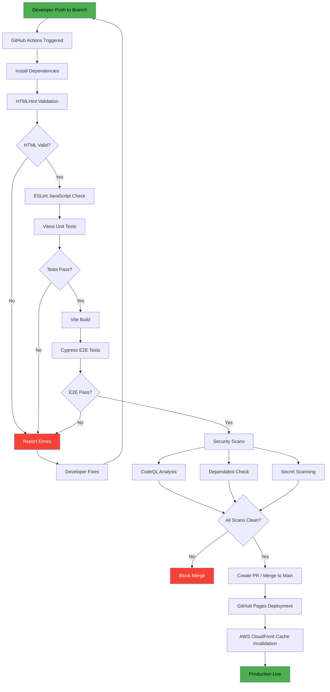

---

## 2. 📰 News Article Generation Flow

---

## 3. 📊 CIA Data Pipeline Flow

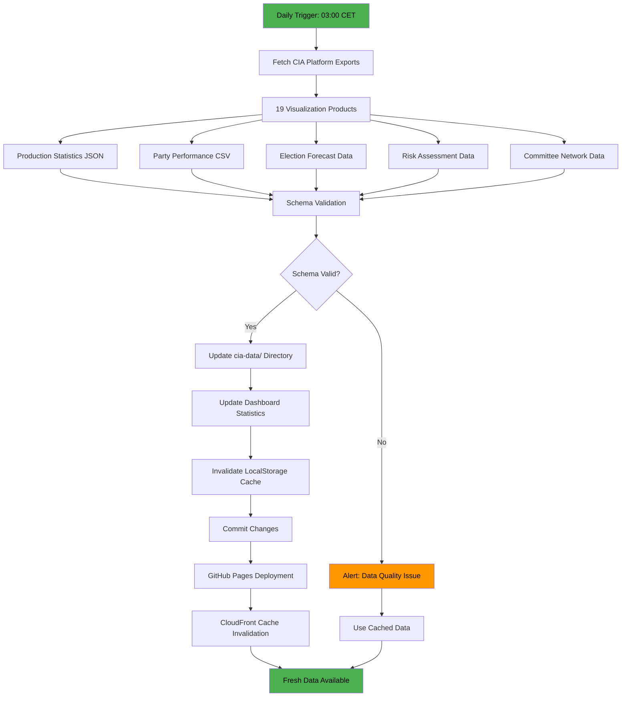

---

## 4. 👤 User Journey Flow

---

## 5. 🔒 Security Scanning Flow

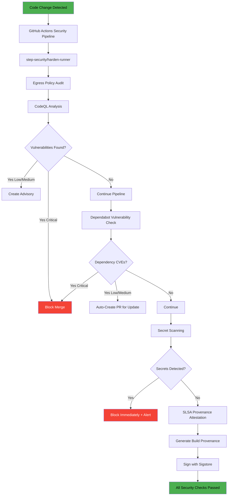

---

## 6. 🌐 Multi-Language Content Flow

---

## 📋 Process Inventory

| # | Process | Trigger | Duration | Frequency |
|---|---------|---------|----------|-----------|
| 1 | Build & Deploy | Git push | 5-8 min | Per commit |
| 2 | News Generation | Cron 02:00 CET | 10-15 min | Daily |
| 3 | CIA Data Pipeline | Cron 03:00 CET | 3-5 min | Daily |
| 4 | User Journey | Page visit | < 3s | On demand |
| 5 | Security Scanning | Code change | 5-10 min | Per commit |
| 6 | Multi-Language | Content creation | 15-30 min | Per article |
| 7 | Political Intelligence | Prebuild chain | 2-4 min | Per build |
| 8 | Analysis Gate | Pre-article | 1-2 min | Per article |
| 9 | Parliamentary Data | Cron daily | 5-10 min | Daily |

---

## 📚 Architecture Documentation Map

| Document | Focus | Description |
|----------|-------|-------------|
| [🏛️ Architecture](ARCHITECTURE.md) | 🏗️ C4 Models | System context, containers, components |
| [📊 Data Model](DATA_MODEL.md) | 📊 Data | Entity relationships and data dictionary |
| **[🔄 Flowchart](FLOWCHART.md)** | **🔄 Processes** | **Business and data flow diagrams** |
| [📈 State Diagram](STATEDIAGRAM.md) | 📈 States | System state transitions and lifecycles |
| [🧠 Mindmap](MINDMAP.md) | 🧠 Concepts | System conceptual relationships |
| [💼 SWOT](SWOT.md) | 💼 Strategy | Strategic analysis and positioning |
| [🛡️ Security Architecture](SECURITY_ARCHITECTURE.md) | 🔒 Security | Current security controls and design |
| [🚀 Future Security](FUTURE_SECURITY_ARCHITECTURE.md) | 🔮 Security | Planned security improvements |
| [🎯 Threat Model](THREAT_MODEL.md) | 🎯 Threats | STRIDE/MITRE ATT&CK analysis |
| [🔧 Workflows](WORKFLOWS.md) | 🔧 DevOps | CI/CD automation and pipelines |
| [🛡️ CRA Assessment](CRA-ASSESSMENT.md) | ⚖️ Compliance | EU Cyber Resilience Act conformity |
| [🚀 Future Architecture](FUTURE_ARCHITECTURE.md) | 🔮 Evolution | Architectural evolution roadmap |
| [📊 Future Data Model](FUTURE_DATA_MODEL.md) | 🔮 Data | Enhanced data architecture plans |
| [🔄 Future Flowchart](FUTURE_FLOWCHART.md) | 🔮 Processes | Improved process workflows |
| [📈 Future State Diagram](FUTURE_STATEDIAGRAM.md) | 🔮 States | Advanced state management |
| [🧠 Future Mindmap](FUTURE_MINDMAP.md) | 🔮 Concepts | Capability expansion plans |
| [💼 Future SWOT](FUTURE_SWOT.md) | 🔮 Strategy | Future strategic opportunities |

---

---

## 7. 🏗️ Complete CI/CD Pipeline Data Flow

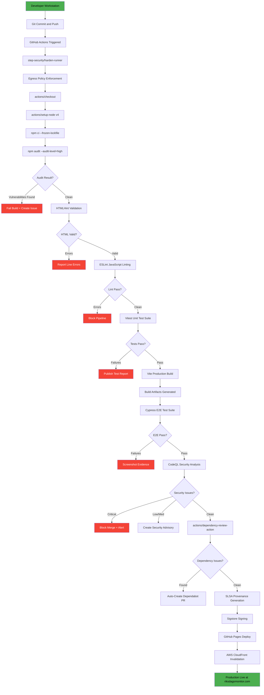

---

## 8. 📰 News Generation Pipeline Data Flow

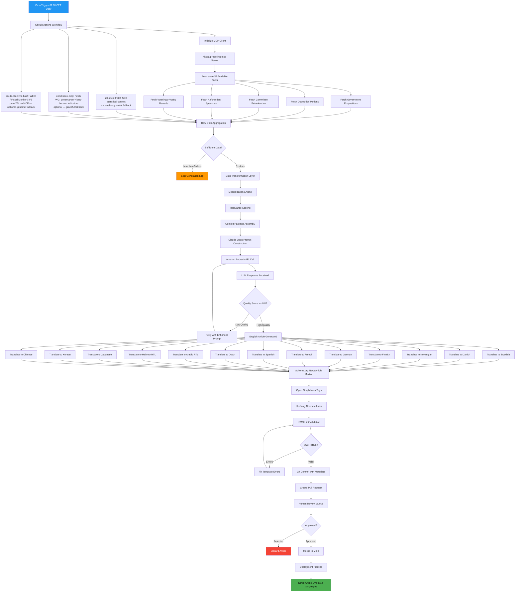

---

## 9. 📊 CIA Data Integration Data Flow

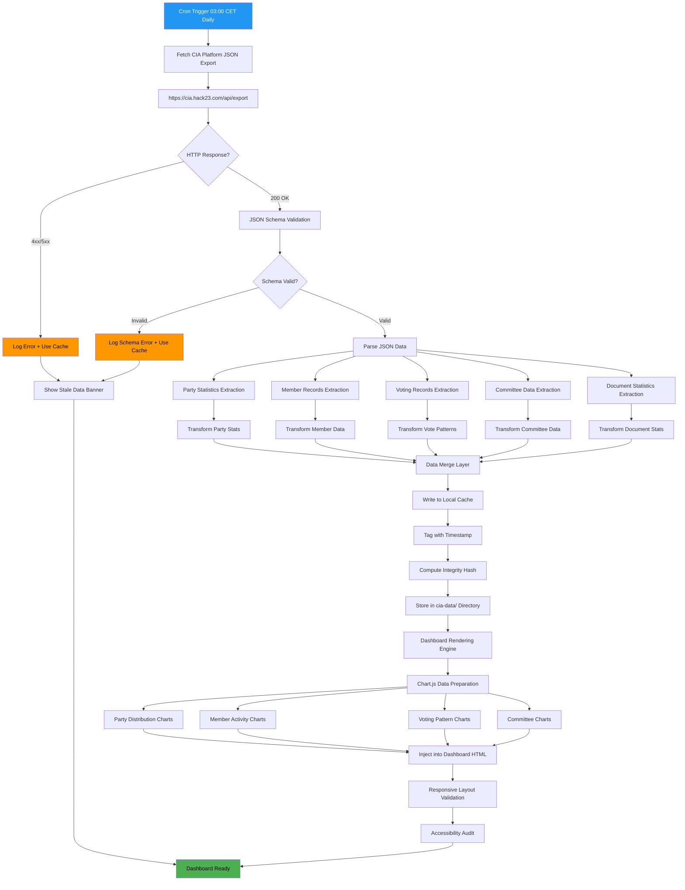

---

## 10. 🌐 User Request Data Flow

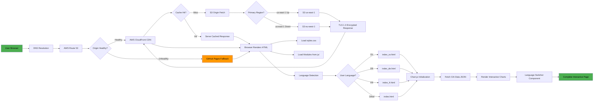

---

## 11. 🔒 Security Scanning Data Flow

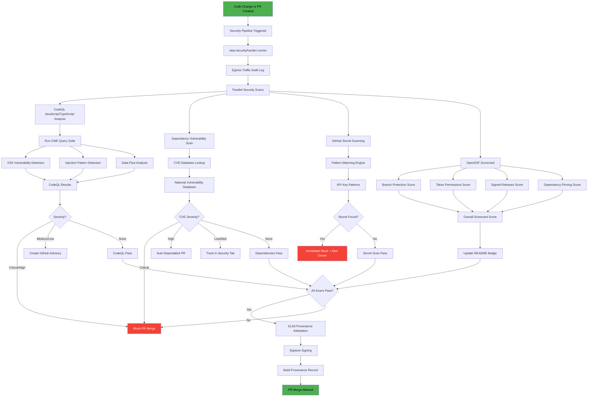

---

## 12. 🌐 Multi-Language Content Pipeline

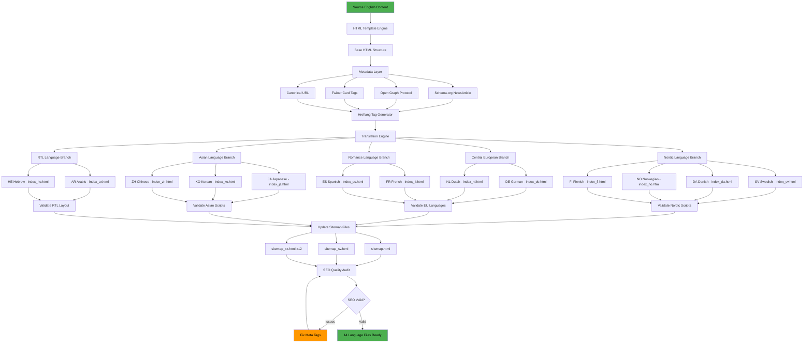

---

## 13. ✅ Data Validation and Quality Check Flow

```mermaid
flowchart TD
    DATA_INGEST[Data Ingestion from Riksdag API] --> SCHEMA_VAL[JSON Schema Validation]
    SCHEMA_VAL --> SCHEMA_OK{Schema Valid?}
    SCHEMA_OK -->|Invalid| SCHEMA_ERR[Log Schema Violation]
    SCHEMA_ERR --> FALLBACK_CACHE[Load from Cache]
    SCHEMA_OK -->|Valid| TYPE_CHECK[Type Coercion Check]
    TYPE_CHECK --> NULL_CHECK[Null Value Inspection]
    NULL_CHECK --> REQUIRED_CHECK[Required Fields Check]
    REQUIRED_CHECK --> REQUIRED_OK{All Required Fields Present?}
    REQUIRED_OK -->|Missing| FILL_DEFAULTS[Apply Default Values]
    FILL_DEFAULTS --> RANGE_CHECK
    REQUIRED_OK -->|Present| RANGE_CHECK[Numeric Range Validation]
    RANGE_CHECK --> RANGE_OK{Values in Range?}
    RANGE_OK -->|Out of Range| CLAMP[Clamp to Valid Range + Flag]
    CLAMP --> DATE_CHECK
    RANGE_OK -->|In Range| DATE_CHECK[Date Format Validation]
    DATE_CHECK --> DATE_OK{Dates Valid?}
    DATE_OK -->|Invalid| DATE_FIX[Normalize Date Formats]
    DATE_FIX --> ENCODING_CHECK
    DATE_OK -->|Valid| ENCODING_CHECK[Character Encoding Check UTF-8]
    ENCODING_CHECK --> ENCODE_OK{UTF-8 Valid?}
    ENCODE_OK -->|Invalid| ENCODE_FIX[Re-encode to UTF-8]
    ENCODE_FIX --> DEDUP_CHECK
    ENCODE_OK -->|Valid| DEDUP_CHECK[Duplicate Detection]
    DEDUP_CHECK --> DUP_FOUND{Duplicates?}
    DUP_FOUND -->|Yes| DEDUP_REMOVE[Remove Duplicates]
    DEDUP_REMOVE --> SEMANTIC_CHECK
    DUP_FOUND -->|No| SEMANTIC_CHECK[Semantic Consistency Check]
    SEMANTIC_CHECK --> CROSS_REF[Cross-Reference Validation]
    CROSS_REF --> XREF_OK{Cross-References Valid?}
    XREF_OK -->|Broken| XREF_FIX[Flag Broken References]
    XREF_FIX --> QUALITY_SCORE
    XREF_OK -->|Valid| QUALITY_SCORE[Compute Quality Score 0-100]
    QUALITY_SCORE --> SCORE_THRESHOLD{Score >= 75?}
    SCORE_THRESHOLD -->|Below Threshold| QUARANTINE[Quarantine for Review]
    SCORE_THRESHOLD -->|Above Threshold| APPROVED_DATA[Data Approved for Use]
    APPROVED_DATA --> HASH_SIGN[Compute SHA-256 Hash]
    HASH_SIGN --> STORE_VALIDATED[Store Validated Data]
    FALLBACK_CACHE --> STALE_FLAG[Mark Data as Stale]

    style DATA_INGEST fill:#2196f3,color:#ffffff
    style APPROVED_DATA fill:#4caf50,color:#000000
    style SCHEMA_ERR fill:#f44336,color:#ffffff
    style QUARANTINE fill:#ff9800,color:#000000
    style STALE_FLAG fill:#ff9800,color:#000000
```

---

## 14. 🔏 Content Integrity and Audit Trail Flow

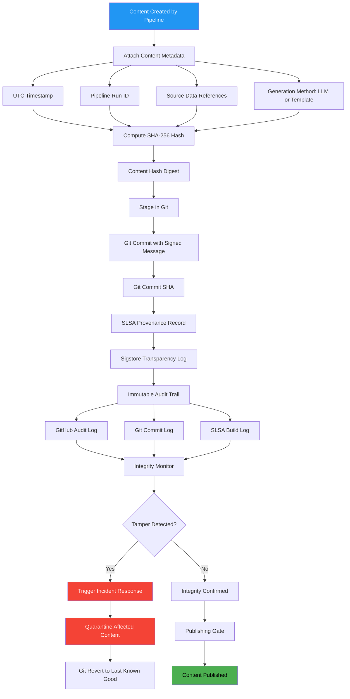

---

## 15. 🏗️ GitHub Actions Runner Hardening Flow

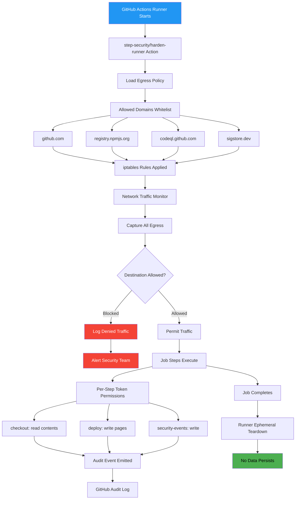

---

## 16. 🧠 Political Intelligence Generation Flow

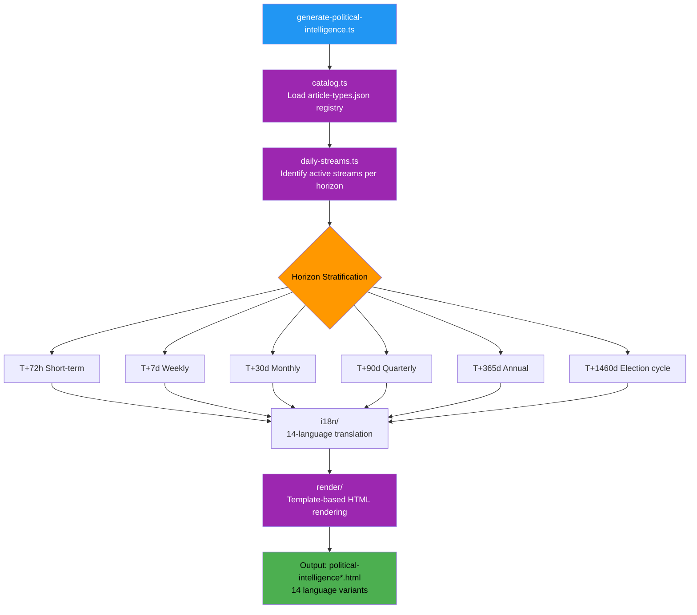

---

## 17. ✅ Analysis Gate Validation Flow

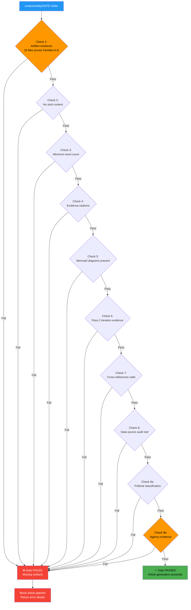

---

## 18. 📥 Parliamentary Data Download Flow

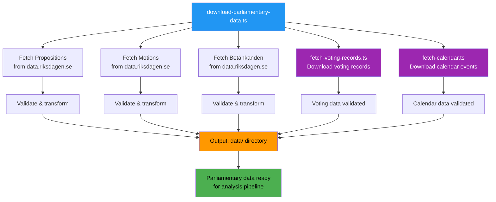

---

## Updated Process Inventory

| # | Process | Trigger | Duration | Frequency | Security Controls |
|---|---------|---------|----------|-----------|-------------------|
| 1 | Build and Deploy | Git push | 5-8 min | Per commit | SLSA, CodeQL, harden-runner |
| 2 | News Generation | Cron 02:00 CET | 10-15 min | Daily | Data validation, HTMLHint |
| 3 | CIA Data Pipeline | Cron 03:00 CET | 3-5 min | Daily | Schema validation, integrity hash |
| 4 | User Journey | Page visit | < 3s | On demand | TLS 1.3, CSP headers, HSTS |
| 5 | Security Scanning | Code change | 5-10 min | Per commit | CodeQL, Dependabot, secret scan |
| 6 | Multi-Language | Content creation | 15-30 min | Per article | HTMLHint, schema validation |
| 7 | CI/CD Full Pipeline | Git push | 8-12 min | Per commit | Full security gate suite |
| 8 | MCP News Pipeline | Cron daily | 10-15 min | Daily | LLM quality check |
| 9 | CIA Data Integration | Cron daily | 3-5 min | Daily | Schema validate, integrity hash |
| 10 | Data Validation | Per data fetch | 1-2 min | Per fetch | 9-stage validation pipeline |
| 11 | Content Integrity | Per content | < 1 min | Per article | Git signatures, Sigstore (build artifacts) |
| 12 | Runner Hardening | Per job | Continuous | Per job | iptables, egress audit |
| 13 | Political Intelligence | Prebuild chain | 2-4 min | Per build | HTMLHint, schema validation |
| 14 | Analysis Gate | Pre-article | 1-2 min | Per article | 9-check validation (23 artifacts) |
| 15 | Parliamentary Data | Cron daily | 5-10 min | Daily | Data validation, freshness check |

---

## 📚 Related Documents

### Riksdagsmonitor Architecture Portfolio

| Document | Focus | Description |
|----------|-------|-------------|
| [🏛️ Architecture](ARCHITECTURE.md) | 🏗️ C4 Models | System context, containers, components |
| [📊 Data Model](DATA_MODEL.md) | 📊 Data | Entity relationships and data dictionary |
| **[🔄 Flowchart](FLOWCHART.md)** | **🔄 Processes** | **Business and data flow diagrams (this document)** |
| [📈 State Diagram](STATEDIAGRAM.md) | 📈 States | System state transitions and lifecycles |
| [🧠 Mindmap](MINDMAP.md) | 🧠 Concepts | System conceptual relationships |
| [💼 SWOT](SWOT.md) | 💼 Strategy | Strategic analysis and positioning |
| [🛡️ Security Architecture](SECURITY_ARCHITECTURE.md) | 🔒 Security | Current security controls and design |
| [🎯 Threat Model](THREAT_MODEL.md) | 🎯 Threats | STRIDE/MITRE ATT&CK analysis |
| [🚀 Future Architecture](FUTURE_ARCHITECTURE.md) | 🔮 Evolution | Architectural evolution roadmap |
| [🔄 Future Flowchart](FUTURE_FLOWCHART.md) | 🔮 Processes | Improved process workflows |

### Hack23 ISMS Policies

- [🛡️ Secure Development Policy](https://github.com/Hack23/ISMS-PUBLIC/blob/main/Secure_Development_Policy.md) — Architecture documentation requirements
- [🏷️ Classification Framework](https://github.com/Hack23/ISMS-PUBLIC/blob/main/CLASSIFICATION.md) — CIA triad classification

---

**📋 Document Control:**  
**✅ Approved by:** James Pether Sörling, CEO  
**📤 Distribution:** Public  
**🏷️ Classification:**   
**📅 Effective Date:** 2026-02-25  
**⏰ Next Review:** 2026-05-25  
**🎯 Framework Compliance:**   

---

## 🌐 IMF Economic-Data Pipeline (Current State)

> **Status:** ✅ Implemented and in production. IMF is the **primary economic-data source** today, accessed via the pure-TypeScript client `scripts/imf-client.ts` (no MCP server). World Bank handles governance / environment / social residue only; SCB provides Swedish-specific ground truth. Authority: [`.github/aw/ECONOMIC_DATA_CONTRACT.md`](.github/aw/ECONOMIC_DATA_CONTRACT.md) v2.1 · hub: [`analysis/imf/`](analysis/imf/).

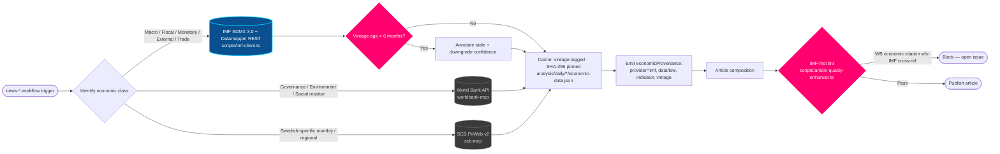

**Current production state (2026-04-24):**
- `scripts/imf-client.ts`, `scripts/imf-context.ts`, `scripts/imf-fetch.ts`, `scripts/imf-codes.ts` — implemented, tested, and called by every news-* workflow
- 24 indicators across 10 IMF dataflows (WEO / FM / IFS / BOP / DOTS / GFS_COFOG / PCPS / ER / MFS_IR / MFS_PR) catalogued in [`analysis/imf/indicators-inventory.json`](analysis/imf/indicators-inventory.json)
- Vintage discipline (>6 mo → annotation) enforced by `tests/imf-inventory.test.ts` (13 assertions) and `tests/economic-context-multi-provider.test.ts` (asserts IMF queried before WB)
- Egress allow-list: `www.imf.org`, `api.imf.org` pinned in every workflow `network:` block

---

## 🏛️ Statskontoret Data Flow (Current State)

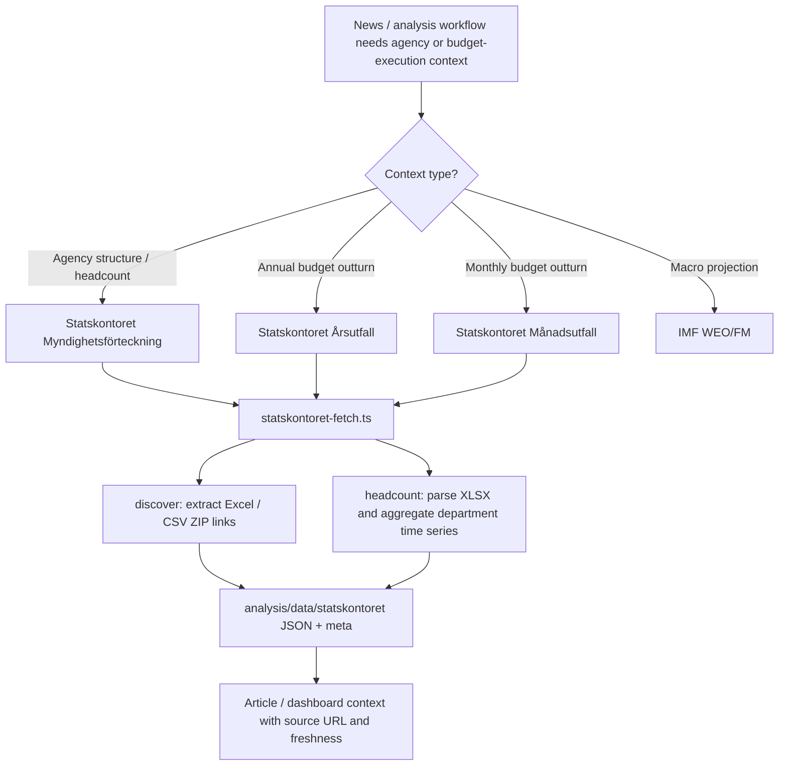

Key gates: HTTPS-only source, source catalogue validation, parser tests, provenance sidecars, and optional-enrichment fallback.

---

## 🔗 Hack23 Ecosystem

<table>
<tr>
  <th width="33%">🌐 Platforms</th>
  <th width="33%">📦 Open-Source Projects</th>
  <th width="33%">🛡️ Governance &amp; Standards</th>
</tr>
<tr>
<td valign="top">
🗳️ <a href="https://riksdagsmonitor.com">Riksdagsmonitor</a> — Swedish Parliament intelligence 
🇪🇺 <a href="https://www.euparliamentmonitor.com">EU Parliament Monitor</a> — European coverage 
🕵️ <a href="https://www.hack23.com/cia">Citizen Intelligence Agency</a> — political-data engine 
🌐 <a href="https://www.hack23.com">Hack23 AB</a> — corporate site 
📰 <a href="https://hack23.com/blog.html">Hack23 Blog</a> — engineering &amp; policy 
💼 <a href="https://www.linkedin.com/company/hack23/">Hack23 on LinkedIn</a>
</td>
<td valign="top">
🗳️ <a href="https://github.com/Hack23/riksdagsmonitor">Hack23/riksdagsmonitor</a> 
🕵️ <a href="https://github.com/Hack23/cia">Hack23/cia</a> 
🇪🇺 <a href="https://github.com/Hack23/euparliamentmonitor">Hack23/euparliamentmonitor</a> 
🔌 <a href="https://github.com/Hack23/european-parliament-mcp">Hack23/european-parliament-mcp</a> 
✅ <a href="https://github.com/Hack23/cia-compliance-manager">Hack23/cia-compliance-manager</a> 
🥋 <a href="https://github.com/Hack23/black-trigram">Hack23/black-trigram</a> 
🏠 <a href="https://github.com/Hack23/homepage">Hack23/homepage</a>
</td>
<td valign="top">
🛡️ <a href="https://github.com/Hack23/ISMS-PUBLIC">Hack23 ISMS-PUBLIC</a> — public ISMS 
🔒 <a href="https://github.com/Hack23/ISMS-PUBLIC/blob/main/Information_Security_Policy.md">Information Security Policy</a> 
🤖 <a href="https://github.com/Hack23/ISMS-PUBLIC/blob/main/AI_Policy.md">AI Policy</a> 
🧪 <a href="https://github.com/Hack23/ISMS-PUBLIC/blob/main/Secure_Development_Policy.md">Secure Development Policy</a> 
🎯 <a href="https://github.com/Hack23/ISMS-PUBLIC/blob/main/Threat_Modeling.md">Threat Modeling Policy</a> 
⚠️ <a href="https://github.com/Hack23/ISMS-PUBLIC/blob/main/Vulnerability_Management.md">Vulnerability Management</a> 
🏷️ <a href="https://github.com/Hack23/ISMS-PUBLIC/blob/main/CLASSIFICATION.md">Classification Framework</a>
</td>
</tr>
</table>

<em>🗳️ Empower citizens · 🔍 Strengthen democratic accountability · 🕵️ Illuminate the political process</em>

© 2008–2026 <a href="https://www.hack23.com">Hack23 AB</a> (Org.nr 559534-7807) · Maintainer: <a href="https://www.linkedin.com/in/jamessorling/">James Pether Sörling, CISSP CISM</a>

