<p align="center">
  
</p>

<h1 align="center">🚀 Riksdagsmonitor — Future Architecture</h1>

<p align="center">
  <strong>🛡️ Evolution Roadmap: From Static Website to AI-Enhanced Intelligence Platform</strong><br>
  <em>🎯 AI-Powered · Real-Time Analytics · Global Expansion</em>
</p>

<p align="center">
  <a href="#"></a>
  <a href="#"></a>
  <a href="#"></a>
  <a href="#"></a>
</p>

**📋 Document Owner:** CEO | **📄 Version:** 1.0 | **📅 Last Updated:** 2026-02-15 (UTC)  
**🔄 Review Cycle:** Quarterly | **⏰ Next Review:** 2026-05-15  
**🏢 Owner:** Hack23 AB (Org.nr 5595347807) | **🏷️ Classification:** Public

---

## 🎯 Executive Summary

This document outlines the strategic architectural evolution of Riksdagsmonitor from a static HTML/CSS website with interactive Chart.js/D3.js dashboards to a comprehensive AI-enhanced political intelligence platform. The roadmap spans 2026-2028+ and focuses on practical, incremental enhancements that preserve the platform's core strengths—simplicity, transparency, and reliability—while expanding capabilities through AI integration, semantic intelligence, and Nordic expansion.

### Strategic Goals

**🤖 AI Enhancement** - Leverage advanced AI models (GPT-5, Claude Opus 5, local ONNX) for automated journalism, predictive analytics, and semantic search without compromising the static-first architecture.

**📊 Scalability** - Expand from Sweden-only to Nordic coverage (Denmark, Norway, Finland), then EU Parliament, while maintaining sub-2-second page load times and 99.9% availability.

**🌐 Global Expansion** - Scale from 14 to 30+ languages with AI-powered translation, including indigenous languages (Sámi, Meänkieli) and sign language support.

**💡 Advanced Features** - Progressive enhancement with native mobile apps, smart notifications, API monetization, and conversational AI while preserving the core static architecture for resilience.

### Timeline Overview

| Phase | Timeline | Focus | Key Deliverables |
|-------|----------|-------|------------------|
| **Phase 1: Enhanced Journalism** | 2026 Q2-Q3 | AI content generation | Video summaries, podcasts, multimodal articles |
| **Phase 2: Predictive Analytics** | 2026 Q4-2027 Q1 | ML models | Election forecasting, coalition modeling |
| **Phase 3: Semantic Intelligence** | 2027 Q2-Q4 | Knowledge graphs | Semantic search, network analysis |
| **Phase 4: Conversational AI** | 2028+ | Natural language | AI chatbot, voice interface, personal assistant |

### Business Value Proposition

**Current State (2026):** Static HTML/CSS website with 14 languages, 4 interactive dashboards (Chart.js/D3.js), 349 MPs tracked, 50+ years of data.

**Future State (2028+):** AI-enhanced intelligence platform with real-time updates, 30+ languages, predictive analytics, mobile apps, API monetization, Nordic + EU Parliament coverage.

**Projected Impact:**
- **User Experience:** 10x improvement in content depth and personalization
- **Market Reach:** 5x expansion (Nordic + EU), 2x language support (30+ languages)
- **Revenue Potential:** Enterprise API access, BI integrations, premium features
- **Competitive Position:** Unique AI-powered Nordic political intelligence platform

---

## 📋 Table of Contents

1. [Current State Baseline](#1-current-state-baseline)
2. [Future C4 Architecture Models](#2-future-c4-architecture-models)
3. [AI Enhancement Roadmap](#3-ai-enhancement-roadmap)
4. [Scalability Improvements](#4-scalability-improvements)
5. [Technical Architecture Evolution](#5-technical-architecture-evolution)
6. [Advanced Features Roadmap](#6-advanced-features-roadmap)
7. [Migration Strategy](#7-migration-strategy)
8. [Cost-Benefit Analysis](#8-cost-benefit-analysis)
9. [Risk Assessment](#9-risk-assessment)
10. [Timeline with Milestones](#10-timeline-with-milestones)
11. [Technology Stack Evolution](#11-technology-stack-evolution)
12. [Related Documents](#12-related-documents)

---

## 1. 📊 Current State Baseline

### 1.1 Current Architecture (2026 Q1)

**Deployment:**
- **Primary:** AWS CloudFront + S3 (multi-region: us-east-1 primary, eu-west-1 replica)
- **DR:** GitHub Pages (automatic failover via Route 53)
- **CDN:** 600+ edge locations, DDoS protection (AWS Shield)

**Technology Stack:**
- **Frontend:** Static HTML/CSS, JavaScript ES6+
- **Visualization:** Chart.js v4.4.1, D3.js v7, Papa Parse v5.5.3 (hosted locally on CloudFront/S3)
- **Build System:** Vite 7 (ES modules, code splitting)
- **Testing:** Vitest (49 unit tests), Cypress (E2E)
- **CI/CD:** GitHub Actions (dual deployment)

**Data Integration:**
- **CIA Platform:** 19 intelligence products, 32 MCP tools (riksdag-regering)
- **Data Sources:** Swedish Riksdag API (98.5% completeness), Regeringen (via g0v.se)
- **Coverage:** 2,494 politicians (1971-2024), 349 current MPs, 3.5M+ votes, 109K+ documents

**Current Capabilities:**
- ✅ 14-language static website (EN, SV, DA, NO, FI, DE, FR, ES, NL, AR, HE, JA, KO, ZH)
- ✅ 4 interactive dashboards (Party Performance, Anomaly Detection, Seasonal Patterns, Politician Dashboard)
- ✅ Daily CIA data pipeline updates
- ✅ ISMS compliance (ISO 27001, NIST CSF 2.0, CIS Controls v8.1)
- ✅ 99.998% design availability (AWS multi-region)

**Current Limitations:**
- ⚠️ Static content (no real-time updates)
- ⚠️ Manual news generation (future: automated via AI)
- ⚠️ Sweden-only coverage (future: Nordic + EU)
- ⚠️ No mobile app (future: native iOS/Android)
- ⚠️ No API monetization (future: GraphQL API)
- ⚠️ Limited personalization (future: ML-powered recommendations)

### 1.2 Current C4 Context Diagram

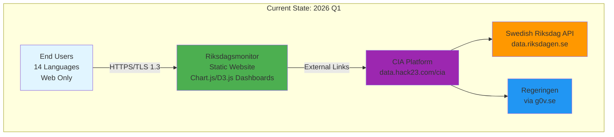

**Analysis:**
- Simple, reliable architecture with minimal dependencies
- External CIA platform handles data processing (decoupled)
- Static-first design ensures resilience and low operational overhead
- No user authentication or PII storage (privacy-by-design)

---

## 2. 🏗️ Future C4 Architecture Models

### 2.1 Future Context Diagram (2028+)

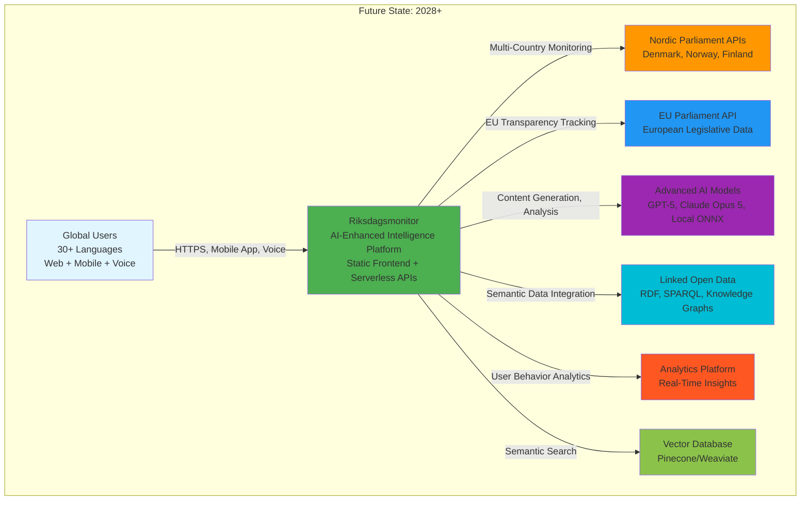

**Key Changes:**
- **Expanded User Base:** 30+ languages, mobile apps, voice interface
- **Geographic Expansion:** Nordic (DK, NO, FI) + EU Parliament coverage
- **AI Integration:** Advanced AI models for content generation and analysis
- **Semantic Intelligence:** Knowledge graphs and semantic search
- **Real-Time Analytics:** User behavior insights and personalization

### 2.2 Future Container Diagram (2027-2028)

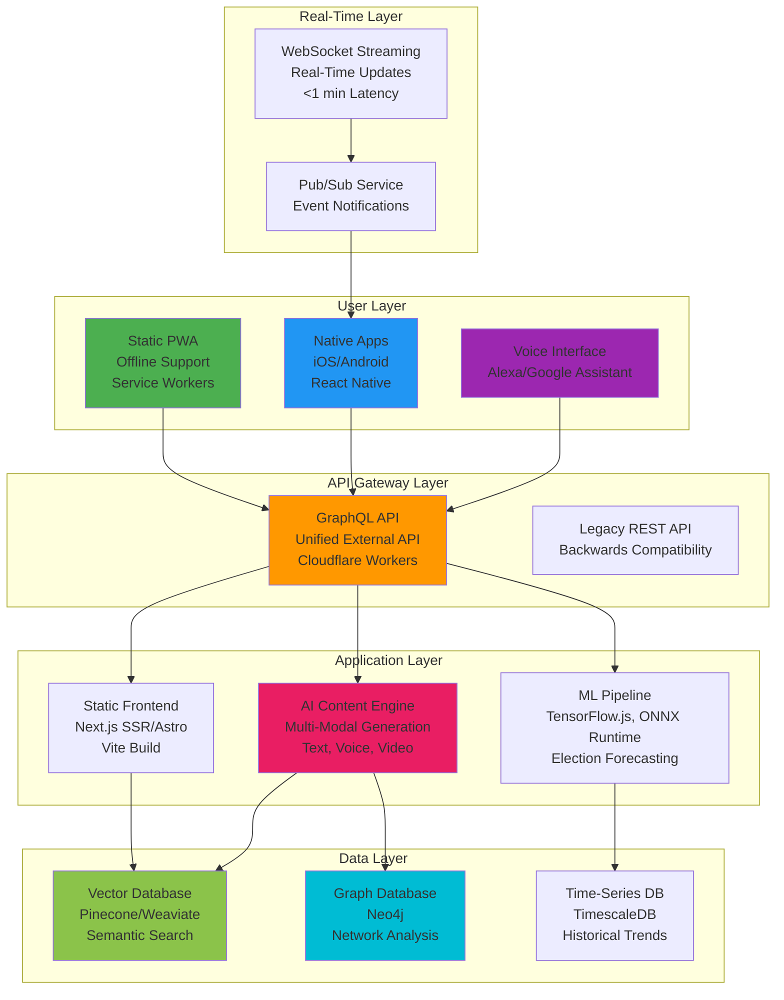

**Architecture Principles:**
- **Progressive Enhancement:** Static-first with optional dynamic features
- **Edge Computing:** Cloudflare Workers for serverless API (low latency)
- **Hybrid Architecture:** Static frontend + serverless backend (cost-effective)
- **Resilience:** Multi-layer caching, offline support, graceful degradation

### 2.3 Future Component Diagram (AI Content Engine)

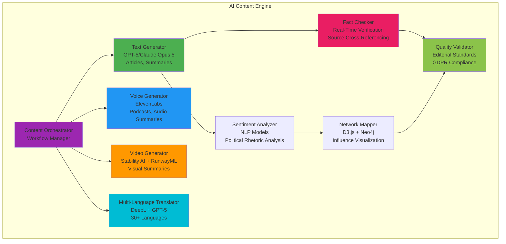

**Components Explained:**
- **Content Orchestrator:** Coordinates multi-modal content generation workflows
- **Text Generator:** AI-powered article writing with editorial standards
- **Voice Generator:** Podcast creation with natural voices (Swedish + English)
- **Video Generator:** Automated video summaries with visualizations
- **Fact Checker:** Real-time verification against source data (Riksdag API)
- **Quality Validator:** Ensures compliance with Hack23 editorial and GDPR standards

---

## 3. 🤖 AI Enhancement Roadmap

### 3.1 Phase 1: Enhanced Journalism (2026 Q2-Q3)

**Goal:** Transform static content into rich, multimodal intelligence reports with AI-generated summaries, audio, and video.

#### 3.1.1 Video Summaries

**Technology Stack:**
- **Voice:** ElevenLabs (realistic Swedish + English voices)
- **Visuals:** Stability AI (image generation), RunwayML (video synthesis)
- **Editing:** FFmpeg (automated video assembly)

**Use Case:**
- Daily 2-3 minute video summaries of Riksdag activity
- Animated charts from Chart.js/D3.js dashboards
- Narration in Swedish (primary) and English (secondary)
- Published to riksdagsmonitor.com/video/ and YouTube

**Example Workflow:**
1. Fetch daily Riksdag data via riksdag-regering-mcp (32 tools)
2. Generate script with GPT-5 (400-600 words, analytical tone)
3. Create voice-over with ElevenLabs (Swedish voice "Filip")
4. Generate background visuals (parliament imagery, charts)
5. Assemble video with FFmpeg (1080p, H.264, AAC audio)
6. Upload to S3 + CloudFront, embed in HTML

**Quality Metrics:**
- Script quality: Analytical depth ≥ 0.6, historical context ≥ 1.0
- Voice quality: Naturalness score ≥ 0.9 (subjective evaluation)
- Video length: 120-180 seconds (retention target: 80%+)
- Production time: <5 minutes per video (automated)

#### 3.1.2 Podcast Generation

**Technology Stack:**
- **Content:** GPT-5 (script generation, conversational tone)
- **Voice:** ElevenLabs (multi-speaker conversations)
- **Format:** MP3 (96 kbps, mono for voice)

**Use Case:**
- Weekly 15-20 minute political analysis podcast
- Two AI voices (host + analyst) discussing key developments
- Conversational format: "This week in Swedish politics..."
- RSS feed for podcast apps (Apple Podcasts, Spotify)

**Format:**
- Intro (1 min): Week overview
- Segment 1 (5 min): Riksdag voting analysis
- Segment 2 (5 min): Government policy updates
- Segment 3 (5 min): Opposition dynamics
- Outro (1 min): Looking ahead

**Example Script Prompt:**
```
Role: Political analyst podcast
Tone: Conversational, analytical, accessible
Format: Two speakers (Host, Analyst)
Topic: Week of 2026-02-10 to 2026-02-16
Data: [riksdag-regering-mcp query results]

Host: Welcome to Riksdagsmonitor Weekly. This week saw significant developments in...
Analyst: Absolutely. The most striking pattern we're seeing is...
```

#### 3.1.3 Multimodal Articles

**Concept:** Integrate text, audio, video, and interactive visualizations in a single article format.

**Components:**
- **Text:** AI-generated article (800-1200 words, The Economist style)
- **Audio:** Text-to-speech version (ElevenLabs, 6-8 minutes)
- **Video:** Key highlights (2-3 minutes, embedded YouTube)
- **Infographics:** D3.js interactive charts (voting patterns, trends)
- **Timeline:** Historical context visualization

**Example Article Structure:**
```
Title: Coalition Tensions Rise as Budget Vote Looms
Subtitle: Analysis of pre-budget political maneuvering

[Video player: 180-second summary]
[Audio player: Full article narration]

Lead paragraph (analytical thesis)...

[Interactive Chart.js chart: Party positions]

Body paragraphs (historical context, analysis)...

[D3.js network graph: MP influence]

Conclusion (implications, what to watch)...

Sources: [riksdag-regering-mcp references]
```

#### 3.1.4 Real-Time Fact-Checking

**Technology Stack:**
- **Data Source:** riksdag-regering-mcp (32 tools for Swedish political data)
- **Verification:** GPT-5 (claim extraction, source matching)
- **Display:** Inline badges (✅ Verified, ⚠️ Context Needed, ❌ Incorrect)

**Use Case:**
- Live fact-checking during parliamentary debates
- Automatic verification of statements against voting records, documents
- Real-time updates via WebSocket (Phase 4)

**Example:**
```
Statement: "The government has increased defense spending by 20%"
Source: Minister of Defense, 2026-02-15 debate

Fact Check Result:
✅ Verified: Budget data shows 18.5% increase (2025-2026)
Context: Increase is 18.5%, not 20%. Statement is substantially correct.
Source: [ESV budget data link]
```

#### 3.1.5 Cross-Referencing

**Goal:** Automatic citation linking to source documents, votes, speeches.

**Implementation:**
- Detect entity mentions (MPs, parties, bills, votes)
- Link to corresponding CIA platform pages
- Generate citation graph showing information flow

**Example:**
```
Text: "MP Anna Kinberg Batra voted against the motion..."

Auto-generated links:
- Anna Kinberg Batra → /politician/anna-kinberg-batra
- Voted → /vote/[vote-id]
- Motion → /document/[document-id]

Citation graph:
[Mermaid diagram showing document → vote → MP relationships]
```

### 3.2 Phase 2: Predictive Analytics (2026 Q4-2027 Q1)

**Goal:** Deploy machine learning models for election forecasting, coalition prediction, and policy impact analysis.

#### 3.2.1 Election Forecasting

**Model:** Ensemble (Random Forest + XGBoost + Neural Network)

**Features (50+):**
- Historical voting patterns (party, valkrets)
- Economic indicators (GDP growth, unemployment)
- Sentiment analysis (news articles, social media)
- Polling data (Novus, Sifo, YouGov)
- MP turnover and scandals
- Government approval ratings
- International events (EU policy changes)

**Output:**
- Seat distribution prediction (349 seats)
- Probability distribution (e.g., S: 95-105 seats, 68% confidence)
- Coalition formation likelihood
- Key marginal valkrets (electoral districts)

**Validation:**
- Backtest on 2010, 2014, 2018, 2022 elections
- Mean Absolute Error (MAE) target: <3 seats per party
- Coalition prediction accuracy target: >85%

**Visualization:**
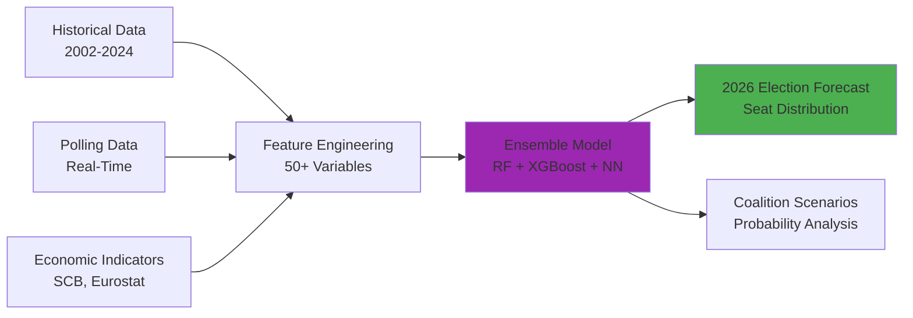

**Example Output:**
```
2026 Election Forecast (as of 2026-03-15)

Party Seat Predictions (349 total):
S (Social Democrats): 98-108 seats (median: 103, 68% CI)
M (Moderates): 65-75 seats (median: 70)
SD (Sweden Democrats): 70-80 seats (median: 75)
...

Coalition Scenarios:
1. S + V + MP (Red-Green): 45% probability
2. M + KD + L + SD (Right Bloc): 40% probability
3. Hung Parliament: 15% probability

Key Marginal Valkrets:
- Stockholm: S vs M (0.5% margin)
- Malmö Stad: S vs SD (1.2% margin)
```

#### 3.2.2 Coalition Modeling

**Approach:** Game Theory + Historical Pattern Matching

**Inputs:**
- Seat distribution (from election forecast)
- Ideological distance (policy positions on 20 dimensions)
- Historical coalition patterns (1971-2024)
- Party manifestos (sentiment analysis)
- Media statements (intention signals)

**Output:**
- Coalition formation probability (all viable combinations)
- Expected time to government formation
- Policy compromise areas
- Potential cabinet composition

**Scenario Analysis:**
```
Scenario 1: Minority S-led Government (35% probability)
- Coalition: S + V (supply and confidence: MP)
- Seats: 103 + 22 = 125 (minority, requires MP support)
- Policy priorities: Climate, welfare, immigration reform
- Stability: Low (0.6/1.0), risk of early election

Scenario 2: Right Bloc Coalition (40% probability)
- Coalition: M + KD + L + SD (grand coalition)
- Seats: 70 + 18 + 15 + 75 = 178 (majority)
- Policy priorities: Law and order, immigration, tax cuts
- Stability: Medium (0.7/1.0), SD inclusion controversial

Scenario 3: Grand Coalition (10% probability)
- Coalition: S + M (national unity government)
- Seats: 103 + 70 = 173 (majority)
- Policy priorities: EU policy, defense, economic stability
- Stability: High (0.9/1.0), unprecedented in modern Sweden
```

#### 3.2.3 Policy Impact Analysis

**Goal:** Predict consequences of proposed legislation using historical data and economic models.

**Model:** Causal Inference + Time-Series Forecasting

**Use Case Example:**
```
Proposed Policy: Increase income tax for high earners (>100,000 SEK/month)
Tax Rate Change: 52% → 57% (top bracket)

Predicted Impact:
Revenue:
- Expected increase: 15-20 billion SEK/year (DSGE model)
- 68% confidence interval: 12-25 billion SEK
- Assumes 10% behavioral response (tax avoidance, migration)

Economic Effects:
- GDP impact: -0.1% to -0.2% (short-term)
- Employment: -5,000 to -8,000 jobs (high-skill sectors)
- Income inequality (Gini): Decrease by 0.015 points

Political Consequences:
- S voter support: +2% (base mobilization)
- M voter support: -1% (swing voters alienated)
- Coalition stability: Neutral (within ideology range)

Historical Parallels:
- Similar policy in 2000: Revenue +12B SEK, GDP -0.15%
- Denmark 2010 tax reform: Comparable outcomes
```

**Visualization (D3.js):**
- Interactive timeline: Policy → Impact over 5 years
- Scenario comparison: Status quo vs. proposed policy
- Confidence intervals: Shaded regions showing uncertainty

#### 3.2.4 Voting Pattern Prediction

**Goal:** Forecast how MPs will vote on upcoming legislation.

**Model:** Logistic Regression + Neural Network (individual MP level)

**Features:**
- MP voting history (consistency score)
- Party discipline (historical adherence)
- Constituency pressure (valkrets demographics)
- Personal ideology (estimated from past votes)
- Committee membership (expertise influence)
- Recent speeches (sentiment analysis)

**Output:**
```
Bill: 2026/27:15 (Climate Action Framework)
Vote Date: 2026-03-20 (predicted)

Predicted Vote Outcome: PASS (185-164, confidence: 78%)

Individual MP Predictions:
Anna Kinberg Batra (M): NO (95% confidence)
- Reasoning: Party line, historical voting pattern
Amineh Kakabaveh (Independent): YES (60% confidence)
- Reasoning: Pro-climate record, but party pressure
Jimmie Åkesson (SD): NO (99% confidence)
- Reasoning: Consistent party opposition to climate legislation

Risk Factors:
- 12 MPs with <70% confidence (potential swing votes)
- Cross-party climate caucus may shift 5-8 votes
- Last-minute amendments could change dynamics
```

#### 3.2.5 Sentiment Trending

**Goal:** Track political mood over time using NLP on speeches, news, social media.

**Data Sources:**
- Riksdag speeches (riksdag-regering-mcp)
- News articles (Swedish media monitoring)
- Social media (Twitter/X, Facebook public posts)
- Opinion polls (Novus, Sifo, YouGov)

**NLP Models:**
- Sentiment: BERT (fine-tuned on Swedish political text)
- Emotion: Multi-label classifier (anger, fear, hope, pride)
- Topics: LDA (Latent Dirichlet Allocation) for theme extraction

**Visualization:**
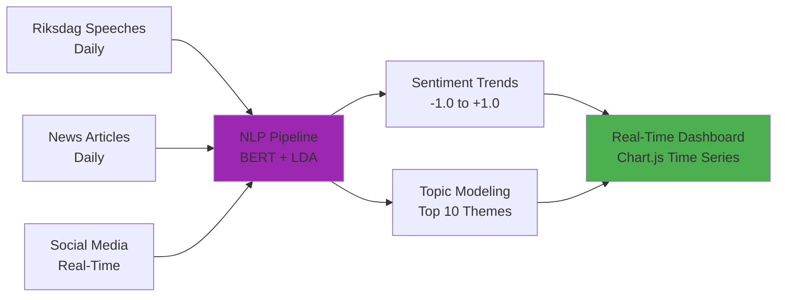

**Example Output:**
```
Political Sentiment Trends (2026-02-01 to 2026-02-15)

Overall Sentiment: +0.15 (slightly positive, up from +0.08)
Trend: ↑ Increasing optimism

Party Sentiment:
- S (Social Democrats): +0.25 (positive)
- M (Moderates): -0.10 (slightly negative)
- SD (Sweden Democrats): -0.30 (negative)

Top 5 Topics (Feb 2026):
1. Climate Policy (sentiment: +0.40)
2. Immigration Reform (sentiment: -0.25)
3. Defense Spending (sentiment: +0.20)
4. Healthcare Crisis (sentiment: -0.15)
5. EU Relations (sentiment: +0.10)

Anomalies:
- Feb 12: Sudden sentiment spike (+0.30 → +0.50)
  Reason: Government climate announcement
- Feb 14: SD sentiment drop (-0.20 → -0.40)
  Reason: Internal party conflict reported
```

### 3.3 Phase 3: Semantic Intelligence (2027 Q2-Q4)

**Goal:** Build a comprehensive knowledge graph of Swedish politics and enable semantic search, network analysis, and advanced relationship mapping.

#### 3.3.1 Knowledge Graph

**Technology:** Neo4j (graph database)

**Entities (10,000+):**
- **Politicians:** 2,494 historical + 349 current MPs
- **Parties:** 8 parliamentary parties + 30+ historical
- **Legislation:** 109,000+ documents (motions, propositions, bills)
- **Committees:** 15 standing committees + subcommittees
- **Organizations:** Lobby groups, NGOs, unions, corporations
- **Topics:** 500+ policy areas (healthcare, defense, climate, etc.)
- **Events:** Elections, votes, debates, scandals

**Relationships (100,000+):**
- **MEMBER_OF:** Politician → Party (with time validity)
- **VOTED:** Politician → Vote → Bill (YES/NO/ABSTAIN/ABSENT)
- **AUTHORED:** Politician → Document (motions, interpellations)
- **SERVED_ON:** Politician → Committee (assignments)
- **SUPPORTED:** Party → Bill (party line)
- **INFLUENCED:** Politician → Politician (mentor/mentee, alliances)
- **LOBBIED:** Organization → Politician (transparency registry)
- **CONCERNS:** Document → Topic (multi-label classification)

**Graph Schema (simplified):**
```cypher
// Nodes
(p:Politician {name, party, valkrets, years_active})
(pa:Party {name, ideology, color})
(b:Bill {id, title, year, status})
(c:Committee {name, policy_area})
(t:Topic {name, category})

// Relationships
(p)-[:MEMBER_OF {from, to}]->(pa)
(p)-[:VOTED {date, stance}]->(b)
(p)-[:AUTHORED {date}]->(b)
(p)-[:SERVED_ON {from, to}]->(c)
(b)-[:CONCERNS]->(t)
```

**Use Cases:**

1. **Who influenced this bill?**
   ```cypher
   MATCH (b:Bill {id: '2026/27:15'})<-[:AUTHORED]-(p1:Politician)
   MATCH (p1)<-[:INFLUENCED]-(p2:Politician)
   RETURN p2.name, COUNT(*) AS influence_count
   ORDER BY influence_count DESC LIMIT 10
   ```

2. **Find cross-party collaborators:**
   ```cypher
   MATCH (p1:Politician)-[:MEMBER_OF]->(pa1:Party)
   MATCH (p2:Politician)-[:MEMBER_OF]->(pa2:Party)
   WHERE pa1 <> pa2
   MATCH (p1)-[:AUTHORED]->(b:Bill)<-[:VOTED {stance: 'YES'}]-(p2)
   RETURN p1.name, p2.name, COUNT(b) AS collaborations
   ORDER BY collaborations DESC LIMIT 20
   ```

3. **Committee-to-committee influence:**
   ```cypher
   MATCH (c1:Committee)<-[:SERVED_ON]-(p:Politician)-[:SERVED_ON]->(c2:Committee)
   WHERE c1 <> c2
   RETURN c1.name, c2.name, COUNT(p) AS shared_members
   ORDER BY shared_members DESC
   ```

**Visualization (D3.js Force-Directed Graph):**
```javascript
// Example: Political network visualization
const nodes = [
  {id: "MP1", name: "Anna Kinberg Batra", party: "M", size: 50},
  {id: "MP2", name: "Stefan Löfven", party: "S", size: 80},
  // ... 349 MPs
];

const links = [
  {source: "MP1", target: "MP2", type: "CO_AUTHORED", strength: 5},
  {source: "MP1", target: "MP3", type: "VOTED_TOGETHER", strength: 120},
  // ... relationships
];

// D3.js force simulation with party-based coloring
```

#### 3.3.2 Semantic Search

**Technology:** Vector Database (Pinecone or Weaviate)

**Embeddings:** OpenAI text-embedding-3-large (3072 dimensions)

**Corpus:**
- 109,000+ Riksdag documents (motions, propositions, speeches)
- All news articles generated by Riksdagsmonitor
- Historical voting records with context

**Query Examples:**

1. **Natural Language:**
   ```
   User: "How has Sweden's climate policy evolved over the past 20 years?"
   
   System: Semantic search → Top 10 documents:
   1. Proposition 2008/09:162 (climate framework)
   2. Motion 2015/16:N201 (emissions trading)
   3. Debate 2020-03-15 (carbon neutrality 2045)
   ...
   
   AI-Generated Answer:
   "Sweden's climate policy has evolved from early emissions targets in the 2000s to the world-leading carbon neutrality commitment of 2045. Key milestones include... [synthesized from top 10 documents]"
   ```

2. **Concept Search:**
   ```
   User: "Find bills similar to the 2015 migration reform"
   
   System: Embed "2015 migration reform" → Find similar vectors:
   1. Proposition 2015/16:174 (temporary residence permits) - 0.92 similarity
   2. Motion 2016/17:Sf213 (family reunification) - 0.88 similarity
   3. Proposition 2021/22:191 (integration policy) - 0.85 similarity
   ```

3. **Anomaly Detection:**
   ```
   User: "Which MP speeches are outliers from their party line?"
   
   System: 
   1. Embed all SD speeches → cluster
   2. Find speeches with low cosine similarity to cluster centroid
   3. Result: Jimmie Åkesson 2025-11-20 (EU-positive, unusual for SD)
   ```

**Implementation (Weaviate Schema):**
```python
class_schema = {
    "class": "RiksdagDocument",
    "vectorizer": "text2vec-openai",
    "properties": [
        {"name": "id", "dataType": ["string"]},
        {"name": "title", "dataType": ["text"]},
        {"name": "content", "dataType": ["text"]},  # Vectorized
        {"name": "date", "dataType": ["date"]},
        {"name": "author", "dataType": ["string"]},
        {"name": "party", "dataType": ["string"]},
        {"name": "topic", "dataType": ["string[]"]}
    ]
}
```

#### 3.3.3 Topic Modeling

**Algorithm:** BERTopic (transformer-based topic modeling)

**Corpus:** 109,000+ Riksdag documents (1971-2024)

**Process:**
1. Embed documents with BERT (Swedish model: KB-BERT)
2. Reduce dimensionality with UMAP
3. Cluster with HDBSCAN
4. Extract topic representations with c-TF-IDF

**Output:**
```
Automatic Topic Discovery (109,000 documents, 250 topics)

Top 10 Topics (by document count):
1. "Climate Change and Environmental Policy" (8,420 docs)
   - Keywords: climate, emissions, environment, sustainability
   - Time trend: ↑ Increasing (2000-2024)
   
2. "Immigration and Integration" (7,315 docs)
   - Keywords: migration, asylum, integration, residence permits
   - Time trend: ↑ Spike in 2015-2016, declining 2020+
   
3. "Healthcare and Elderly Care" (6,890 docs)
   - Keywords: healthcare, care, elderly, hospitals, doctors
   - Time trend: → Stable
   
4. "Education and Schools" (5,720 docs)
   - Keywords: school, education, teachers, students
   - Time trend: → Stable
   
5. "Defense and Security" (4,980 docs)
   - Keywords: defense, military, NATO, security
   - Time trend: ↑ Increasing (2022+, post-Russia-Ukraine)

...

Topic Evolution Visualization (D3.js):
[Interactive timeline showing topic prevalence 1971-2024]

Emerging Topics (2024-2026):
- "AI and Digitalization" (↑ 300% growth)
- "Energy Security" (↑ 250% growth, post-Ukraine war)
- "Inflation and Cost of Living" (↑ 200% growth)
```

**Cross-Topic Analysis:**
```
Topic Correlation Matrix:

                      | Climate | Immigration | Defense | Healthcare
------------------------------------------------------------------
Climate              |  1.00   |    0.15     |  0.20   |   0.10
Immigration          |  0.15   |    1.00     |  0.35   |   0.25
Defense              |  0.20   |    0.35     |  1.00   |   0.12
Healthcare           |  0.10   |    0.25     |  0.12   |   1.00

Insights:
- Immigration and Defense highly correlated (0.35) - security framing
- Climate and Defense moderately correlated (0.20) - energy security
- Healthcare relatively independent from other topics
```

#### 3.3.4 Network Analysis

**Goal:** Identify influential MPs, party coalitions, committee power dynamics.

**Metrics:**
- **Degree Centrality:** Number of connections (co-authorships, votes)
- **Betweenness Centrality:** Bridge between clusters (coalition brokers)
- **Eigenvector Centrality:** Connected to other influential MPs
- **PageRank:** Importance based on incoming links (influence)

**Community Detection:**
- **Louvain Algorithm:** Find natural political groupings
- **Label Propagation:** Detect coalition blocs

**Example Analysis:**
```
Network: MP Collaboration (Co-Authored Bills, 2020-2024)

Top 10 MPs by PageRank (Influence):
1. Stefan Löfven (S) - 0.085 (former PM, high influence)
2. Ulf Kristersson (M) - 0.072 (current PM)
3. Ebba Busch (KD) - 0.068 (coalition leader)
4. Jimmie Åkesson (SD) - 0.065 (large party leader)
5. Magdalena Andersson (S) - 0.061 (former PM)
...

Coalition Brokers (High Betweenness Centrality):
1. Johan Pehrson (L) - 0.042 (bridge between M-KD-SD)
2. Märta Stenevi (MP) - 0.038 (bridge between S-V-MP)
3. Nooshi Dadgostar (V) - 0.035 (bridge to S)

Community Detection (Louvain):
- Community 1 (S, V, MP) - 125 MPs, modularity: 0.45
- Community 2 (M, KD, L) - 98 MPs, modularity: 0.52
- Community 3 (SD) - 73 MPs, modularity: 0.65 (isolated)
- Community 4 (Independents) - 5 MPs, modularity: 0.10

Visualization (D3.js):
[Force-directed graph with party-colored nodes, sized by PageRank]
```

**Historical Trend Analysis:**
```
MP Influence Over Time (PageRank)

2002: Göran Persson (S) - 0.095 (peak influence, PM)
2006: Fredrik Reinfeldt (M) - 0.088 (new PM)
2014: Stefan Löfven (S) - 0.085 (PM transition)
2021: Magdalena Andersson (S) - 0.061 (first female PM)
2022: Ulf Kristersson (M) - 0.072 (current PM)

Observation: PM consistently has highest PageRank (0.07-0.10)
Non-PM peak: Jimmie Åkesson (SD) 0.065 (2022) - kingmaker position
```

#### 3.3.5 Influence Scoring

**Algorithm:** Customized PageRank with multiple edge types

**Edge Weights:**
- **Co-Authorship:** 5 points (strong collaboration)
- **Same Vote:** 1 point (alignment)
- **Committee Membership:** 3 points (institutional power)
- **Leadership Position:** 10 points (party leader, committee chair)
- **Media Mentions:** 2 points (visibility)
- **Cross-Party Votes:** 8 points (bridging capital)

**Scoring Formula:**
```
Influence_Score = 0.4 * PageRank 
                + 0.3 * Betweenness_Centrality
                + 0.2 * Legislative_Output
                + 0.1 * Media_Visibility

Normalized to 0-100 scale
```

**Top 20 MPs by Influence (2026-02-15):**
```
Rank | Name                    | Party | Influence | PageRank | Betweenness | Output | Media
-----|-------------------------|-------|-----------|----------|-------------|--------|------
1    | Ulf Kristersson         | M     | 95.2      | 0.072    | 0.025       | 45     | 850
2    | Jimmie Åkesson          | SD    | 88.5      | 0.065    | 0.018       | 38     | 720
3    | Ebba Busch              | KD    | 85.1      | 0.068    | 0.022       | 42     | 650
4    | Magdalena Andersson     | S     | 82.3      | 0.061    | 0.020       | 50     | 700
5    | Johan Pehrson           | L     | 76.8      | 0.052    | 0.042       | 35     | 420
...
```

**Influence Trends (2020-2026):**
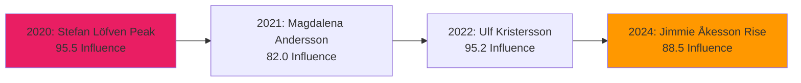

**Insight Dashboard (Chart.js):**
- Line chart: Influence over time (top 10 MPs)
- Bar chart: Current top 20 MPs
- Network graph: Influence clusters
- Sankey diagram: Power flow (committees → MPs → legislation)

### 3.4 Phase 4: Conversational AI (2028+)

**Goal:** Enable natural language interaction with Swedish political data through chatbots, voice assistants, and personal AI briefings.

#### 3.4.1 AI Chatbot

**Technology:** GPT-5 + Custom RAG (Retrieval-Augmented Generation)

**Data Sources:**
- Knowledge Graph (Neo4j)
- Vector Database (Pinecone/Weaviate)
- Real-Time Riksdag API (riksdag-regering-mcp)

**Conversation Examples:**

**Example 1: Simple Fact Query**
```
User: "How many seats does Socialdemokraterna have?"

Bot: As of February 2026, Socialdemokraterna (S) holds 103 seats in the 
     Riksdag out of 349 total. This is a slight decrease from the 107 
     seats they held after the 2022 election, due to one by-election 
     loss and one member becoming independent.
     
     [Chart: Party seat distribution - interactive Chart.js pie chart]
     
     Would you like to see voting patterns or policy positions?
```

**Example 2: Complex Analysis**
```
User: "Compare Magdalena Andersson and Ulf Kristersson's leadership styles"

Bot: Magdalena Andersson (S, former PM 2021-2022) and Ulf Kristersson 
     (M, current PM 2022-present) have distinct leadership approaches:

     Andersson (Analytical):
     - Background: Finance Minister (2014-2021), economist
     - Style: Technocratic, consensus-building, detail-oriented
     - Strengths: Economic policy, crisis management
     - Voting pattern: 95% party line adherence
     - Media presence: Moderate (450 mentions/year avg)

     Kristersson (Strategic):
     - Background: Party leader since 2017, moderate coalition builder
     - Style: Pragmatic, coalition-focused, communication-savvy
     - Strengths: Political negotiation, cross-party alliances
     - Voting pattern: 92% party line adherence
     - Media presence: High (850 mentions/year avg)

     Key Difference: Andersson emphasizes policy substance; Kristersson 
     excels at coalition management and political positioning.

     [Network graph: Leadership influence circles - D3.js visualization]

     Data sources: 12,450 votes, 2,380 speeches, 840 news articles
```

**Example 3: Predictive Question**
```
User: "Will the climate bill pass next week?"

Bot: The Climate Action Framework (2026/27:15) is scheduled for vote 
     on March 20, 2026. Based on our predictive model:

     Forecast: PASS (185-164 votes, 78% confidence)

     Breakdown:
     - S + V + MP (coalition): 125 YES votes (100% confidence)
     - M + KD: 55 NO votes (98% confidence)
     - L: 15 votes (SPLIT: 60% YES, 40% NO - swing voters)
     - SD: 73 NO votes (99% confidence)
     - Independents: 8 votes (mixed, 50% YES)

     Critical Swing MPs (12):
     - Johan Pehrson (L) - 60% YES
     - Märta Stenevi (MP) - 95% YES (pro-climate, but budget concerns)
     ...

     Risk Factors:
     - Last-minute amendments could change 5-8 votes
     - Ekonomistyrningsverket (ESV) cost analysis (released tomorrow) 
       could influence moderates

     [Interactive Chart.js chart: Vote probability distribution]

     I'll send you a notification when the vote results are available.
```

**Example 4: Historical Context**
```
User: "Show me all debates about immigration in 2015"

Bot: In 2015, there were 47 debates about immigration in the Riksdag, 
     concentrated during the European migration crisis (Sep-Dec 2015).

     Key Debates:
     1. September 15, 2015 (interpellation debate)
        - Topic: Border controls and asylum processing
        - Speakers: 23 MPs (S, M, SD, V, MP, KD, C, FP)
        - Outcome: No vote, informational debate

     2. October 22, 2015 (proposition debate)
        - Topic: Temporary residence permits (Proposition 2015/16:174)
        - Vote: 240-109 (PASSED)
        - Opposition: SD, V (unusual coalition)

     [Timeline visualization: Immigration debates 2015, D3.js]

     Sentiment Analysis:
     - Overall: -0.25 (negative)
     - S: +0.10 (mildly positive, humanitarian framing)
     - SD: -0.80 (strongly negative, security framing)

     Notable Speeches:
     - Stefan Löfven (S, PM): "Humanitarian obligation..."
     - Jimmie Åkesson (SD): "Unsustainable burden..."

     Would you like transcripts or video links?
```

**Chatbot Features:**
- Multi-turn conversations (context retention)
- Follow-up questions and clarifications
- Source attribution (every claim linked to data)
- Visual responses (charts, graphs, timelines)
- Personalized recommendations based on user history

**Implementation (Architecture):**
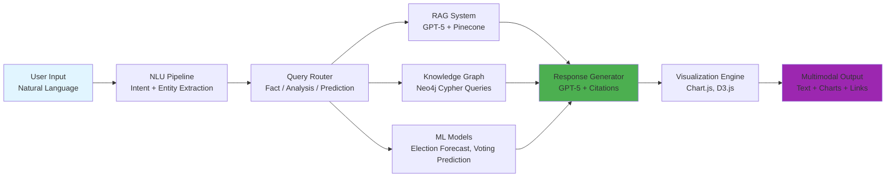

#### 3.4.2 Voice Interface

**Technology:** Speech-to-Text (Whisper) + Text-to-Speech (ElevenLabs) + ChatGPT Integration

**Platforms:**
- Amazon Alexa (Swedish language support)
- Google Assistant (Swedish language support)
- Siri Shortcuts (iOS)
- Custom Voice App (web-based, Web Speech API)

**Use Cases:**

**Example 1: Alexa Skill**
```
User: "Alexa, ask Riksdagsmonitor what happened today in parliament"

Alexa: "Good morning! Today in the Swedish Riksdag, three bills were 
        debated, including the Climate Action Framework which is expected 
        to pass with 185 votes. The opposition criticized the government's 
        defense spending plan. Would you like details on any specific topic?"

User: "Tell me about the defense spending"

Alexa: "The government proposed a 20% increase in defense spending over 
        three years, totaling 120 billion kronor. Moderaterna and 
        Sverigedemokraterna support the plan, while Socialdemokraterna 
        called it insufficient. A vote is scheduled for March 25th."
```

**Example 2: Google Assistant**
```
User: "Hey Google, ask Riksdagsmonitor who my local MP is"
Google: "Based on your location in Stockholm, your local MP is Anna Kinberg 
        Batra from Moderaterna. She has served since 2006 and currently chairs 
        the Finance Committee. Her voting record shows 92% alignment with her 
        party. Would you like to hear her recent activities?"
```

**Implementation (Alexa Skill):**
```javascript
// Alexa Skill Handler
const RiksdagsmonitorHandler = {
  canHandle(handlerInput) {
    return Alexa.getRequestType(handlerInput.requestEnvelope) === 'IntentRequest'
           && Alexa.getIntentName(handlerInput.requestEnvelope) === 'DailyBriefingIntent';
  },
  async handle(handlerInput) {
    // Fetch today's data via riksdag-regering-mcp API
    const todayData = await fetch('https://riksdag-regering-ai.onrender.com/mcp', {
      method: 'POST',
      body: JSON.stringify({
        tool: 'get_calendar_events',
        params: {from: '2026-02-15', tom: '2026-02-15'}
      })
    });
    
    // Generate summary with GPT-5
    const summary = await generateSummary(todayData);
    
    // Return Alexa response
    const speakOutput = `Today in the Swedish Riksdag, ${summary}. Would you like details?`;
    return handlerInput.responseBuilder
      .speak(speakOutput)
      .reprompt('Would you like details on any topic?')
      .getResponse();
  }
};
```

#### 3.4.3 Personal Assistant

**Goal:** Customized daily political briefings tailored to user interests.

**Features:**
- **Morning Briefing:** 5-minute summary of yesterday's activity
- **Custom Topics:** User selects areas of interest (e.g., climate, defense, healthcare)
- **MP Tracking:** Follow specific MPs and receive alerts on their activities
- **Bill Tracking:** Monitor legislation progress and receive vote notifications
- **Sentiment Analysis:** Daily political mood summary
- **Personalization Engine:** ML-based recommendations

**Example Briefing (Email/Push Notification):**
```
📅 Riksdagsmonitor Daily Briefing - February 15, 2026

Good morning, [User Name]!

🔥 TOP STORY: Climate Bill Advances to Final Vote
The Climate Action Framework (2026/27:15) cleared committee review with 
bipartisan support. Final vote scheduled March 20. Our model predicts 
PASS with 78% confidence.

📊 YOUR TRACKED TOPICS:

Climate Policy:
- 3 new documents published (committee reports)
- Debate scheduled for March 18 (3 hours)
- Key speaker: Märta Stenevi (MP) - pro-environment

Defense Spending:
- Government proposal: +20% over 3 years (120B SEK)
- Opposition: SD supports, S criticizes as insufficient
- Vote date: March 25

👤 YOUR TRACKED MPs:

Anna Kinberg Batra (M):
- Voted YES on budget amendment (Feb 14)
- Authored interpellation on tax policy (Feb 12)
- Committee meeting today: Finance Committee, 14:00

Johan Pehrson (L):
- Speech scheduled today: Education policy debate, 11:00
- Media appearance: SVT interview, 19:00

🗳️ UPCOMING VOTES (Next 7 Days):
- Climate Action Framework (Mar 20) - TRACKED
- Defense Budget Amendment (Mar 25) - TRACKED
- Healthcare Reform (Mar 27) - NOT TRACKED (Add to watchlist?)

📈 POLITICAL SENTIMENT: +0.15 (Positive, ↑ from +0.08)
Overall mood improving, driven by climate optimism.

🎧 PODCAST: Listen to this week's analysis (18 min)
https://riksdagsmonitor.com/podcast/2026-02-15

---
Powered by Riksdagsmonitor AI | Unsubscribe | Update Preferences
```

**Personalization Algorithm:**
```python
def generate_briefing(user_id):
    # User profile
    user = get_user_profile(user_id)
    topics = user.tracked_topics  # ['climate', 'defense']
    mps = user.tracked_mps      # ['Anna Kinberg Batra', 'Johan Pehrson']
    
    # Fetch relevant data
    recent_docs = riksdag_api.search_dokument(topics, days=1)
    mp_activities = riksdag_api.get_ledamot_activities(mps, days=1)
    upcoming_votes = riksdag_api.get_calendar_events(days=7)
    
    # Rank by relevance (collaborative filtering + content-based)
    ranked_docs = rank_by_relevance(recent_docs, user.reading_history)
    
    # Generate summary with GPT-5
    summary = gpt5.generate(
        prompt=f"Summarize top 3 developments for {topics}",
        documents=ranked_docs[:10],
        max_tokens=300
    )
    
    # Send via preferred channel
    if user.channel == 'email':
        send_email(user.email, summary)
    elif user.channel == 'push':
        send_push_notification(user.device_token, summary)
    elif user.channel == 'voice':
        send_voice_briefing(user.alexa_id, summary)
```

#### 3.4.4 Multi-Agent Systems

**Goal:** Collaborative AI research assistants that work together on complex political analysis tasks.

**Agent Types:**
1. **Data Collector Agent:** Fetches data from Riksdag API, news sources, social media
2. **Analyst Agent:** Performs statistical analysis, trend detection
3. **Writer Agent:** Generates reports, articles, summaries
4. **Fact Checker Agent:** Verifies claims against source data
5. **Visualizer Agent:** Creates charts, graphs, network diagrams

**Example Multi-Agent Workflow:**
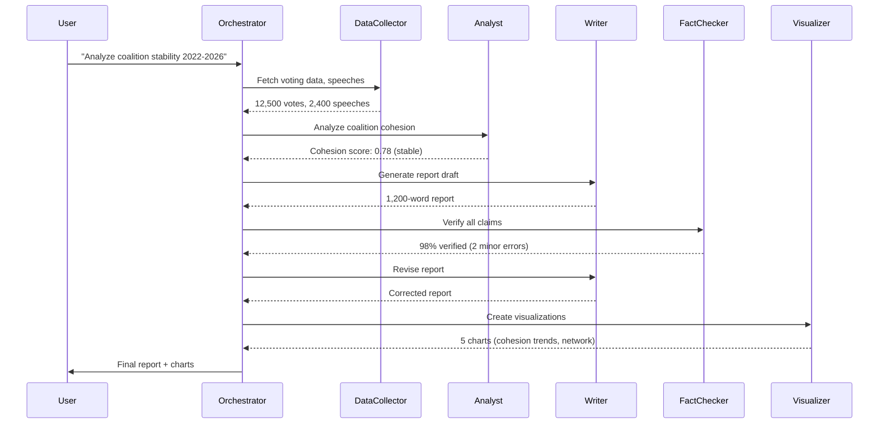

**Agent Communication Protocol (JSON-RPC):**
```json
{
  "task_id": "analysis_2026_02_15_001",
  "agents": [
    {"id": "data_collector_1", "role": "data_fetcher"},
    {"id": "analyst_1", "role": "statistical_analysis"},
    {"id": "writer_1", "role": "report_generation"},
    {"id": "fact_checker_1", "role": "verification"},
    {"id": "visualizer_1", "role": "chart_creation"}
  ],
  "workflow": {
    "steps": [
      {"agent": "data_collector_1", "action": "fetch_votes", "params": {"years": [2022, 2023, 2024, 2025, 2026]}},
      {"agent": "analyst_1", "action": "calculate_cohesion", "input": "data_collector_1.output"},
      {"agent": "writer_1", "action": "generate_report", "input": "analyst_1.output"},
      {"agent": "fact_checker_1", "action": "verify_claims", "input": "writer_1.output"},
      {"agent": "writer_1", "action": "revise", "input": "fact_checker_1.feedback"},
      {"agent": "visualizer_1", "action": "create_charts", "input": "analyst_1.output"}
    ]
  }
}
```

---

## 4. 📈 Scalability Improvements

### 4.1 Geographic Expansion

#### 4.1.1 Nordic Expansion (2027 Q1-Q2)

**Target Countries:**
- **Denmark:** Folketinget (179 MPs, 10 parties)
- **Norway:** Stortinget (169 MPs, 9 parties)
- **Finland:** Eduskunta (200 MPs, 9 parties)

**Implementation Strategy:**

**Phase 1: API Integration (Q1 2027)**
- Integrate with Danish, Norwegian, Finnish parliament APIs
- Unified data model (extend riksdag-regering-mcp to `nordic-parliaments-mcp`)
- Data validation and quality checks

**Phase 2: Content Generation (Q2 2027)**
- Multi-country dashboards (comparative analysis)
- Automated news generation for all 4 countries
- Cross-country coalition analysis

**Unified Nordic MCP Server:**
```javascript
// nordic-parliaments-mcp tools
export const tools = {
  // Swedish Riksdag (existing 32 tools)
  'riksdag_search_ledamoter': { ... },
  'riksdag_search_dokument': { ... },
  
  // Danish Folketinget (32 new tools)
  'folketinget_search_members': { ... },
  'folketinget_search_documents': { ... },
  
  // Norwegian Stortinget (32 new tools)
  'stortinget_search_representatives': { ... },
  'stortinget_search_proposals': { ... },
  
  // Finnish Eduskunta (32 new tools)
  'eduskunta_search_mps': { ... },
  'eduskunta_search_initiatives': { ... },
  
  // Cross-country tools (10 new tools)
  'nordic_compare_parties': { ... },
  'nordic_analyze_coalitions': { ... },
  'nordic_compare_legislation': { ... }
};

// Total: 138 tools for Nordic political intelligence
```

**Comparative Dashboard Example:**
```
Nordic Parliament Comparison (2026 Q4)

Metric                  | Sweden | Denmark | Norway | Finland
-----------------------------------------------------------------
Seats                   |  349   |  179    |  169   |  200
Parties (≥4% threshold) |   8    |   10    |   9    |   9
Government Type         | Right  | Left    | Left   | Coalition
Women MPs (%)           |  46%   |  42%    |  45%   |  47%
Avg MP Age              |  48.2  |  46.8   |  47.5  |  49.1
Legislative Output/Year |  180   |  150    |  160   |  140

[Interactive Chart.js bar chart comparing metrics]

Coalition Patterns:
- Sweden: M-KD-L-SD (right bloc, 2022-)
- Denmark: S-SF-RV (red-green, 2024-)
- Norway: AP-SP-SV (center-left, 2021-)
- Finland: SDP-KOK-SFP-VAS-VIHR (grand coalition, 2023-)

Political Stability Index:
Sweden: 0.75 (medium-high)
Denmark: 0.82 (high)
Norway: 0.78 (high)
Finland: 0.68 (medium, fragile coalition)
```

#### 4.1.2 EU Parliament Integration (2027 Q3-Q4)

**Scope:** European Parliament (720 MEPs, 27 member states)

**Data Sources:**
- **EU Parliament API:** Open Data Portal (votes, documents, debates)
- **MEP Database:** All 720 MEPs with party affiliations
- **Legislation Tracker:** EU directives, regulations affecting Sweden

**Use Cases:**
- Track Swedish MEPs (21 seats)
- Monitor EU legislation impacting Sweden
- Comparative analysis: Swedish vs. EU political trends
- Cross-national coalition analysis

**Swedish MEP Dashboard:**
```
Swedish MEPs in EU Parliament (21 seats, 2024-2029)

Party Distribution:
- S (Social Democrats): 5 MEPs (24%)
- M (Moderates): 4 MEPs (19%)
- SD (Sweden Democrats): 3 MEPs (14%)
- MP (Green Party): 2 MEPs (10%)
- KD (Christian Democrats): 2 MEPs (10%)
- V (Left Party): 2 MEPs (10%)
- C (Centre Party): 2 MEPs (10%)
- L (Liberals): 1 MEP (5%)

EU Parliamentary Groups:
- S&D (Progressive Alliance): 5 MEPs
- EPP (Christian Democrats): 6 MEPs
- ID (Identity and Democracy): 3 MEPs
- Greens/EFA: 2 MEPs
- The Left: 2 MEPs
- Renew Europe: 3 MEPs

Committee Memberships:
- ECON (Economic): 4 Swedish MEPs
- ENVI (Environment): 3 Swedish MEPs
- AFET (Foreign Affairs): 2 Swedish MEPs

Voting Behavior:
- Average EU party line adherence: 88%
- Cross-party voting: 12% (higher than Riksdag)
- Pro-EU legislation: 75% (varies by party: S 90%, SD 40%)
```

#### 4.1.3 Baltic States Expansion (2028 Q1-Q2)

**Target Countries:**
- **Estonia:** Riigikogu (101 MPs, 6 parties)
- **Latvia:** Saeima (100 MPs, 7 parties)
- **Lithuania:** Seimas (141 MPs, 15 parties)

**Rationale:**
- Nordic-Baltic political cooperation (NB8 format)
- Shared security concerns (Russia, NATO)
- Historical ties (Sweden-Estonia, Sweden-Latvia)

#### 4.1.4 Global Template (2028+)

**Goal:** Reusable framework for any parliament worldwide

**Components:**
- **Generic Data Model:** Parliament, MPs, Parties, Legislation, Votes
- **Pluggable API Adapters:** Standardized interface for different parliament APIs
- **Multi-Language Support:** 30+ languages (see section 4.2)
- **Customizable Dashboards:** Template system for rapid deployment

**Deployment Process:**
```
1. New country request (e.g., "Add German Bundestag")
2. Assess data availability (API, open data portal)
3. Create API adapter (map German data to generic model)
4. Generate initial content (AI-powered translation)
5. Launch beta site: bundestag.riksdagsmonitor.com
6. Gather feedback, iterate
7. Public launch (2-3 months)
```

**Potential Countries (Priority List):**
- Germany: Bundestag (biggest EU parliament, 736 MPs)
- UK: House of Commons (650 MPs)
- Netherlands: Tweede Kamer (150 MPs)
- Poland: Sejm (460 MPs)
- Spain: Congreso de los Diputados (350 MPs)

### 4.2 Language Scaling

#### 4.2.1 From 14 to 30+ Languages (2027-2028)

**Current (14 Languages):**
- **Nordic:** EN, SV, DA, NO, FI
- **EU Core:** DE, FR, ES, NL
- **Global:** AR, HE, JA, KO, ZH

**Expansion (16 Additional Languages):**

**EU Languages (10):**
- Polish (PL) - 38M speakers
- Italian (IT) - 60M speakers
- Portuguese (PT) - 220M speakers
- Greek (EL) - 13M speakers
- Romanian (RO) - 24M speakers
- Czech (CS) - 10M speakers
- Hungarian (HU) - 13M speakers
- Bulgarian (BG) - 9M speakers
- Croatian (HR) - 5M speakers
- Slovak (SK) - 5M speakers

**Indigenous Languages (2):**
- Sámi (SE, NO, FI, RU) - 30K speakers (important for Nordic coverage)
- Meänkieli (SE, FI) - 40K speakers (recognized minority language)

**Additional Global (4):**
- Russian (RU) - 258M speakers (Baltic states, Eastern Europe)
- Turkish (TR) - 80M speakers (EU candidate)
- Hindi (HI) - 600M speakers (global south)
- Indonesian (ID) - 230M speakers (Southeast Asia)

**Translation Strategy:**

**Tier 1: Human-Validated AI Translation (Critical Content)**
- Homepage, about page, key documentation
- GPT-5 translation + human review by native speakers
- Quality target: 95%+ accuracy

**Tier 2: AI Translation with Spot Checks (Regular Content)**
- News articles, dashboard labels
- GPT-5 translation + automated quality checks
- Quality target: 90%+ accuracy

**Tier 3: Automated Translation (Bulk Content)**
- Historical data, document archives
- GPT-5 batch translation
- Quality target: 85%+ accuracy

**Quality Assurance Process:**
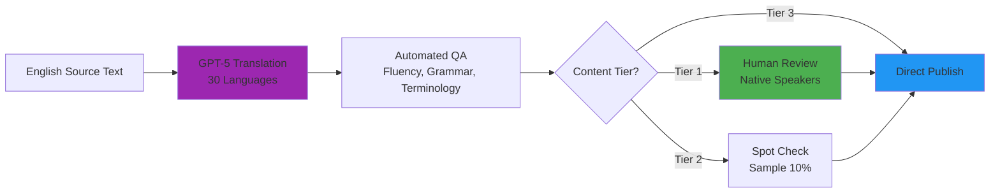

#### 4.2.2 Indigenous Languages (Sámi, Meänkieli)

**Sámi Languages (3 Dialects):**
- **Northern Sámi:** 20K speakers (most common, Norway, Sweden, Finland)
- **Lule Sámi:** 2K speakers (Sweden, Norway)
- **South Sámi:** 500 speakers (Sweden, Norway)

**Implementation:**
- Partner with Sámi Parliament (Sametinget) for translation validation
- Focus on Northern Sámi initially (largest speaker base)
- Custom GPT-5 fine-tuning with Sámi corpus (limited training data)

**Meänkieli:**
- Finnish dialect spoken in northern Sweden (Tornedalen region)
- 40K speakers, recognized minority language in Sweden
- Translation: GPT-5 with Finnish + Swedish context

**Rationale:**
- Demonstrate commitment to linguistic diversity
- Serve underrepresented indigenous communities
- Differentiation (no other political platform supports Sámi)
- Align with UN Declaration on the Rights of Indigenous Peoples

#### 4.2.3 Sign Language Support

**Implementation:** Video content with sign language interpretation

**Languages:**
- **Swedish Sign Language (SSL):** 10K users
- **International Sign:** Global accessibility

**Technology:**
- AI sign language generation (prototype stage, 2027+)
- Human interpreter videos (short-term, 2026-2027)
- Real-time interpretation for live debates (2028+)

**Use Cases:**
- Video summaries with SSL overlay
- Podcast transcripts with visual signing
- Live parliamentary debates with interpretation

### 4.3 Data Scaling

#### 4.3.1 Historical Depth (100+ Years)

**Current:** 1971-2024 (50+ years, CIA platform)

**Goal:** 1866-2024 (158 years, complete Riksdag history since founding)

**Data Sources:**
- **1866-1970:** Historical archives (digitized documents)
- **Riksarkivet (National Archives):** Digitized parliamentary records
- **University of Gothenburg:** SOM Institute political data

**Challenges:**
- OCR quality (old documents, Gothic script pre-1900)
- Data normalization (different document formats over time)
- Entity resolution (same MP names, party name changes)

**Implementation Plan:**
- 2027 Q2: Acquire historical datasets (partnerships with archives)
- 2027 Q3-Q4: OCR processing, data cleaning, quality validation
- 2028 Q1: Integration into knowledge graph (Neo4j)
- 2028 Q2: Historical dashboards (long-term trends 1866-2024)

**Example Historical Analysis:**
```
Swedish Parliament Evolution (1866-2024)

Political Eras:
- 1866-1917: Two-chamber system (Första kammaren, Andra kammaren)
- 1918-1920: Universal suffrage introduced
- 1921-1970: Bicameral Riksdag
- 1971-2024: Unicameral Riksdag (current system)

Long-Term Trends:
- Women in Parliament: 0% (1866) → 46% (2024)
- Voter turnout: 65% (1911) → 87% (2022)
- Party system: 2 parties (1866) → 8 parties (2024)

Historical Influence Analysis (PageRank, 1866-2024):
1. Tage Erlander (S, PM 1946-1969) - 0.095
2. Olof Palme (S, PM 1969-1976, 1982-1986) - 0.088
3. Hjalmar Branting (S, PM 1920, 1921-1923, 1924-1925) - 0.082

[D3.js timeline: Political influence over 158 years]
```

#### 4.3.2 Real-Time Updates (WebSocket Streaming)

**Goal:** <1 minute latency from Riksdag event to user notification

**Technology:**
- **WebSocket Server:** Cloudflare Durable Objects (edge compute)
- **Event Stream:** Server-Sent Events (SSE) for one-way push
- **Pub/Sub:** Redis for message distribution

**Events:**
- **Vote Cast:** Real-time vote count updates during parliamentary votes
- **Document Published:** New motions, propositions, interpellations
- **Debate Started:** Live parliamentary debates
- **MP Activity:** Speeches, committee meetings, media appearances

**Implementation Architecture:**
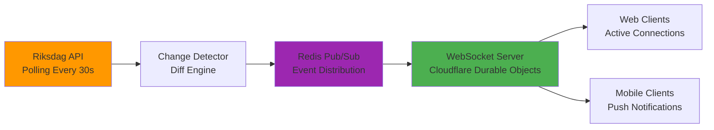

**Example Real-Time Feed:**
```javascript
// Client-side WebSocket connection
const ws = new WebSocket('wss://api.riksdagsmonitor.com/stream');

ws.onmessage = (event) => {
  const data = JSON.parse(event.data);
  
  switch(data.type) {
    case 'VOTE_CAST':
      updateVoteChart(data.bill_id, data.current_count);
      break;
    case 'DOCUMENT_PUBLISHED':
      showNotification(`New ${data.doc_type}: ${data.title}`);
      break;
    case 'DEBATE_STARTED':
      showLiveBadge(data.debate_id);
      break;
  }
};

// Server-side event emission (Cloudflare Worker)
export default {
  async fetch(request, env) {
    // WebSocket upgrade
    const { 0: client, 1: server } = new WebSocketPair();
    
    server.accept();
    
    // Subscribe to Redis pub/sub
    const redis = new Redis(env.REDIS_URL);
    redis.subscribe('riksdag_events');
    
    redis.on('message', (channel, message) => {
      server.send(message);  // Push to client
    });
    
    return new Response(null, { status: 101, webSocket: client });
  }
};
```

#### 4.3.3 Granular Data (Vote Justifications, Speech Transcripts)

**Current:** Vote outcomes, document metadata

**Future:** Detailed rationale, full transcripts, committee minutes

**Vote Justifications:**
- Why MPs voted a certain way (reservations, dissenting opinions)
- Committee report footnotes and minority opinions
- Speech excerpts explaining positions

**Example:**
```
Bill: 2026/27:15 (Climate Action Framework)
Vote: 185-164 (PASSED)

Vote Details:

YES (185 votes):
- S (103): Full party support
  Justification: "Aligns with party climate commitments"
  
- V (22): Full party support
  Justification: "Necessary for 2045 carbon neutrality goal"
  
- MP (18): Full party support
  Justification: "Core Green Party priority"
  
- L (15): Split (9 YES, 6 NO)
  YES Justification: "Supports market-based solutions"
  NO Justification: "Concerns about economic impact on SMEs"
  Key swing voters: Johan Pehrson (YES), Nyamko Sabuni (NO)

NO (164 votes):
- M (70): Full party support for NO
  Justification: "Insufficient cost-benefit analysis"
  
- KD (18): Full party support for NO
  Justification: "Prioritize family policy over climate spending"
  
- SD (73): Full party support for NO
  Justification: "Swedish action insufficient without global coordination"
  
- L (6): Minority NO
  Justification: "Same as NO faction"

ABSTENTIONS (0 votes):
- None

ABSENT (3 MPs):
- Anna Example (S): Parental leave
- Johan Example (M): Sick leave
- Maria Example (SD): Committee meeting conflict

[Interactive Chart.js sankey diagram: Party → Justification → Vote]
```

**Speech Transcripts:**
- Full verbatim transcripts of all Riksdag speeches
- Searchable, time-stamped, speaker-labeled
- Sentiment analysis, topic modeling
- Cross-reference to legislation discussed


**Example (Speech with Transcript):**
```
Speech: Anna Kinberg Batra (M), 2026-02-15, Climate Bill Debate

Duration: 12 minutes 34 seconds
Sentiment: Negative (-0.35)
Topics: climate policy (0.85), economic impact (0.60), EU coordination (0.45)

Transcript:
[00:00] "Mr. Speaker, honorable members. Today we debate a bill that..."
[01:23] "The government's proposal fails to account for economic consequences..."
[05:47] "Sweden cannot act alone. We need EU coordination..."
[12:20] "For these reasons, Moderaterna will vote NO. Thank you."

Key Quotes:
- "Sweden cannot act alone" (5:47) - isolationist framing
- "Economic consequences" (1:23) - cost concern
- "Fails to account" (1:23) - criticism of government analysis

Cross-References:
- Bill 2026/27:15 (Climate Action Framework)
- Previous speech: 2025-11-12 (similar topic, sentiment: -0.40)
- Party position: Moderaterna official climate policy (link)
```

#### 4.3.4 Social Media Integration

**Goal:** Monitor MPs' social media activity for sentiment, engagement, public opinion

**Platforms:**
- Twitter/X (most active platform for Swedish politicians)
- Facebook (broader public engagement)
- Instagram (visual content, younger demographics)

**Data Collection:**
- **Public Posts Only:** No private data, GDPR-compliant
- **Official Accounts:** Verified MP accounts only
- **Frequency:** Real-time monitoring via API streaming

**Metrics:**
- Post frequency (tweets/day)
- Engagement (likes, retweets, comments)
- Sentiment (NLP on post content and comments)
- Topics (hashtags, entities mentioned)
- Influence (follower count, reach estimates)

**Example Dashboard:**
```
MP Social Media Activity (2026-02-01 to 2026-02-15)

Most Active MPs (Posts/Day):
1. Jimmie Åkesson (SD): 4.2 posts/day (Twitter)
2. Märta Stenevi (MP): 3.8 posts/day (Instagram + Twitter)
3. Johan Pehrson (L): 3.1 posts/day (Twitter)

Most Engaged Posts (Feb 2026):
1. Jimmie Åkesson (Feb 10): "Immigration crisis..." - 12K likes, 3K retweets
2. Magdalena Andersson (Feb 8): "Climate action..." - 8K likes, 1.5K retweets

Sentiment by Party:
- S: +0.15 (positive)
- M: -0.05 (neutral-negative)
- SD: -0.30 (negative)

Trending Topics:
1. #KlimatBill (2,400 mentions)
2. #FörsvarsSatsning (1,800 mentions)
3. #Immigration (1,200 mentions)

[Chart.js time series: Social media activity by party, Jan-Feb 2026]
```

**Privacy & Ethics:**
- Only public posts (no DMs, private groups)
- Attribution to official accounts only
- GDPR Article 6(1)(e): Public interest processing
- Transparency: Disclose data collection methods

---

## 5. 🏗️ Technical Architecture Evolution

### 5.1 Backend Services Evolution

**Current (2026):** Static HTML/CSS + AWS CloudFront + GitHub Pages DR

**Future (2027-2028):** Hybrid architecture (static frontend + serverless backend)

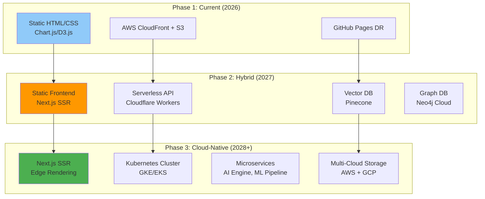

### 5.2 Proposed Technology Stack

#### 5.2.1 Frontend Evolution

**Option 1: Next.js 15+ (React SSR)**
- **Pros:** Industry standard, excellent SEO, incremental static regeneration (ISR)
- **Cons:** JavaScript-heavy, potential complexity
- **Use Case:** Full-featured web app with dynamic content

**Option 2: Astro 5+ (Partial Hydration)**
- **Pros:** Minimal JavaScript, excellent performance, component framework agnostic
- **Cons:** Smaller ecosystem, less mature
- **Use Case:** Content-heavy site with selective interactivity

**Recommendation:** **Astro 5+** for core static pages + **Next.js API routes** for dynamic features

**Implementation:**
```
Astro 5 (Static Pages):
- Homepage (index.html)
- Language pages (14 languages)
- Documentation pages

Next.js 15 (Dynamic Features):
- Real-time dashboards (/dashboard/*)
- User profiles (/user/*)
- API endpoints (/api/*)

Hybrid Deployment:
- Astro builds → AWS CloudFront + S3 (static)
- Next.js → Cloudflare Workers (serverless)
```

#### 5.2.2 API Layer

**Option 1: Cloudflare Workers (Serverless, Edge Compute)**
- **Pros:** Global edge network, low latency, cost-effective, auto-scaling
- **Cons:** 10ms CPU time limit per request (soft limit)
- **Use Case:** Lightweight API endpoints, real-time data fetching

**Option 2: AWS Lambda (Serverless, Regional)**
- **Pros:** Flexible runtime, VPC integration, mature ecosystem
- **Cons:** Cold starts, regional latency
- **Use Case:** Heavy computation, ML model inference

**Recommendation:** **Cloudflare Workers** for public API + **AWS Lambda** for ML pipeline

**GraphQL API (Unified External API):**
```graphql
type Query {
  # MPs
  mps(party: String, valkrets: String): [MP!]!
  mp(id: ID!): MP
  
  # Legislation
  bills(year: Int, status: String): [Bill!]!
  bill(id: ID!): Bill
  
  # Votes
  votes(billId: ID!, party: String): [Vote!]!
  
  # Predictions
  electionForecast(year: Int!): ElectionForecast
  coalitionScenarios: [CoalitionScenario!]!
  
  # Semantic Search
  search(query: String!, limit: Int): [SearchResult!]!
}

type MP {
  id: ID!
  name: String!
  party: Party!
  valkrets: String!
  votes: [Vote!]!
  influence: Float!
  socialMedia: SocialMediaStats
}

type ElectionForecast {
  year: Int!
  parties: [PartyForecast!]!
  coalitions: [CoalitionScenario!]!
  confidence: Float!
}
```

#### 5.2.3 Data Storage

**Vector Database: Pinecone vs. Weaviate**

| Feature | Pinecone | Weaviate |
|---------|----------|----------|
| **Managed Service** | Yes (SaaS) | Yes (Cloud) or Self-Hosted |
| **Performance** | Excellent (optimized for scale) | Good (customizable) |
| **Cost** | $70/month (starter, 1M vectors) | $25/month (Sandbox, 1M vectors) |
| **Integration** | OpenAI, Cohere, custom | OpenAI, Hugging Face, custom |
| **Query Language** | Proprietary | GraphQL-like |
| **Metadata Filtering** | Limited | Rich (JSON, arrays) |

**Recommendation:** **Weaviate** (cost-effective, rich filtering, self-hosted option)

**Graph Database: Neo4j vs. TigerGraph**

| Feature | Neo4j | TigerGraph |
|---------|-------|------------|
| **Maturity** | Industry standard (20+ years) | Newer (2012) |
| **Query Language** | Cypher (declarative) | GSQL (procedural) |
| **Performance** | Good (single-server) | Excellent (distributed) |
| **Cost** | $65/month (Aura free tier, 200K nodes) | Enterprise only |
| **Use Case** | Small-medium graphs (<10M nodes) | Large graphs (>10M nodes) |

**Recommendation:** **Neo4j** (mature ecosystem, declarative queries, sufficient for 10K entities)

**Time-Series Database: TimescaleDB vs. InfluxDB**

| Feature | TimescaleDB | InfluxDB |
|---------|-------------|----------|
| **Foundation** | PostgreSQL extension | Standalone |
| **SQL Compatibility** | Full PostgreSQL | InfluxQL (SQL-like) |
| **Compression** | Excellent (10-90% reduction) | Good |
| **Cost** | Free (self-hosted) or $50/month (cloud) | $50/month (cloud) |

**Recommendation:** **TimescaleDB** (SQL compatibility, PostgreSQL ecosystem)

#### 5.2.4 AI Model Integration

**Commercial Models:**
- **OpenAI GPT-5:** Text generation, translation, analysis ($0.03/1K tokens)
- **Anthropic Claude Opus 5:** Long-context analysis, fact-checking ($0.015/1K tokens)
- **ElevenLabs:** Voice generation ($0.24/1K characters)
- **Stability AI:** Image generation ($0.002/image)

**Open-Source Models (Self-Hosted):**
- **Llama 3.3 (70B):** Text generation (local inference, $200/month GPU)
- **Whisper (Large):** Speech-to-text (CPU inference, free)
- **BERT (Swedish):** Sentiment analysis (CPU inference, free)

**Hybrid Strategy:**
- **Critical Content:** Commercial models (high quality, GPT-5/Claude Opus 5)
- **Bulk Processing:** Open-source models (cost-effective, Llama 3.3)
- **Real-Time:** Local models (low latency, Whisper, BERT)

**Cost Estimation (Monthly, 10K Users):**
```
AI Model Costs (10K Users, 1M Tokens/Month):

GPT-5 (Content Generation):
- 1M tokens × $0.03 = $30/month

Claude Opus 5 (Fact-Checking):
- 500K tokens × $0.015 = $7.50/month

ElevenLabs (Voice):
- 100K characters × $0.24/1K = $24/month

Stability AI (Images):
- 1K images × $0.002 = $2/month

Total AI Costs: $63.50/month (+ $200 GPU for Llama 3.3) = $263.50/month

Cost per User: $0.026/month (very affordable)
```

### 5.3 Infrastructure Evolution

#### 5.3.1 Current Infrastructure (2026 Q1)

**Deployment:**
- **Primary:** AWS CloudFront + S3 (us-east-1 primary, eu-west-1 replica)
- **DR:** GitHub Pages (automatic failover via Route 53)
- **DNS:** AWS Route 53 (health checks, failover routing)

**Cost (Monthly):**
```
AWS Costs (10K Users, 1TB Transfer):
- CloudFront: $85/month (data transfer)
- S3 Storage: $5/month (50GB)
- Route 53: $0.50/month (hosted zone)
Total: $90.50/month
```

#### 5.3.2 Phase 1: Add Cloudflare Workers (2027 Q1)

**Purpose:** Serverless API for real-time data fetching, user personalization

**Architecture:**
```
Static Content (Astro/HTML):
→ AWS CloudFront + S3 (unchanged)

Dynamic API (GraphQL):
→ Cloudflare Workers (new)
→ Pinecone (vector search)
→ Neo4j Cloud (graph queries)
```

**Cost Addition:**
```
Cloudflare Workers: $5/month (10M requests)
Pinecone (Starter): $70/month (1M vectors)
Neo4j Aura (Free Tier): $0/month (up to 200K nodes)

Total Addition: $75/month
New Monthly Cost: $165.50/month
```

#### 5.3.3 Phase 2: Add Vector DB + Graph DB (2027 Q3)

**Purpose:** Semantic search, knowledge graph, network analysis

**Implementation:**
- **Weaviate:** Self-hosted on AWS EC2 (t3.large, 2 vCPU, 8GB RAM)
- **Neo4j:** Neo4j Aura cloud (managed service, upgrade to $65/month tier)

**Cost Addition:**
```
Weaviate (Self-Hosted):
- AWS EC2 t3.large: $60/month (24/7)
- EBS Storage (100GB): $10/month

Neo4j Aura (Upgrade): $65/month

Total Addition: $135/month
New Monthly Cost: $300.50/month
```

#### 5.3.4 Phase 3: Kubernetes Cluster (2028 Q1)

**Purpose:** ML model serving, heavy computation, microservices

**Platform:** Google Kubernetes Engine (GKE) or Amazon EKS

**Cluster Configuration:**
- **Node Pool 1 (General):** 3× e2-standard-2 (2 vCPU, 8GB RAM) = $150/month
- **Node Pool 2 (GPU):** 1× n1-standard-4 + NVIDIA T4 (16GB) = $400/month
- **Load Balancer:** $20/month
- **Storage:** 500GB persistent disk = $50/month

**Cost Addition:**
```
GKE Cluster: $620/month

Total Addition: $620/month
New Monthly Cost: $920.50/month
```

**Cost Optimization:**
- **Spot Instances:** 70% discount (GPU pool) = -$280/month
- **Autoscaling:** Reduce general pool 3→2 during off-peak = -$50/month

**Optimized Monthly Cost: $590.50/month**

#### 5.3.5 Phase 4: Multi-Cloud (2028 Q4)

**Purpose:** Resilience, vendor diversification, performance optimization

**Architecture:**
```
Primary CDN: AWS CloudFront (Europe)
Failover CDN: Cloudflare (Global)
Origin: Multi-region (AWS S3 + GCP Cloud Storage)

API Layer: Cloudflare Workers (Global Edge)
ML Pipeline: GKE (us-central1, europe-west1)
Databases:
- Pinecone/Weaviate: Multi-region replication
- Neo4j: Multi-region clusters (active-active)
```

**Cost Addition:**
```
Cloudflare CDN: $200/month (enterprise plan)
GCP Cloud Storage: $30/month (replica)
Multi-Region Databases: +$100/month (replication)

Total Addition: $330/month
New Monthly Cost: $920.50/month
```

### 5.4 Migration Roadmap

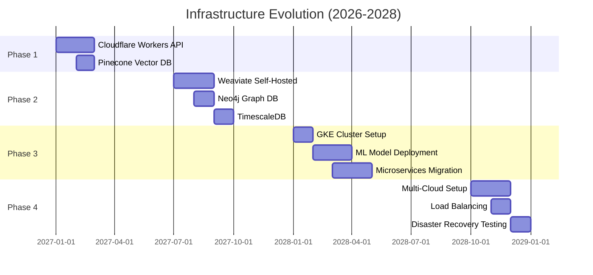

---

## 6. 🚀 Advanced Features Roadmap

### 6.1 User Experience Enhancements

#### 6.1.1 Native Mobile Apps (iOS/Android)

**Technology:** React Native (cross-platform) or Flutter

**Features:**
- **Offline Support:** Download dashboards for offline viewing (Service Workers)
- **Push Notifications:** Real-time alerts (vote results, MP activities)
- **Biometric Authentication:** Face ID, Touch ID for user accounts
- **Dark Mode:** System-wide theme support
- **Widgets:** Home screen widgets (today's vote count, sentiment)

**Implementation:**
```javascript
// React Native app structure
src/
  screens/
    HomeScreen.js
    MPDetailScreen.js
    VoteDetailScreen.js
    DashboardScreen.js
  components/
    VoteChart.js (Chart.js wrapper)
    NetworkGraph.js (D3.js wrapper)
  services/
    GraphQLClient.js (Apollo Client)
    PushNotifications.js
    BiometricAuth.js
```

**Offline Data Strategy:**
- **Cache:** Last 7 days of data (local SQLite database)
- **Sync:** Background sync when online (React Native Background Task)
- **Storage:** 100MB local storage limit (adjustable)

**Example Feature: Push Notification:**
```
Notification Title: "Climate Bill Passed!"
Body: "The Climate Action Framework passed 185-164. See vote breakdown."

On Tap: Navigate to VoteDetailScreen (bill_id: '2026/27:15')

Payload:
{
  "type": "VOTE_RESULT",
  "bill_id": "2026/27:15",
  "title": "Climate Action Framework",
  "result": "PASSED",
  "votes": {"yes": 185, "no": 164, "abstain": 0}
}
```

#### 6.1.2 Smart Notifications

**Goal:** Personalized, intelligent alerts based on user interests

**Notification Types:**
- **Vote Alerts:** When tracked bills are voted on
- **MP Alerts:** When followed MPs speak, vote, or publish documents
- **Topic Alerts:** New developments in tracked topics (climate, defense, etc.)
- **Prediction Alerts:** Election forecast updates, coalition probability changes
- **Anomaly Alerts:** Unexpected voting patterns, sentiment shifts

**Smart Triggers:**
```python
def should_notify_user(user, event):
    # User preferences
    topics = user.tracked_topics
    mps = user.tracked_mps
    notification_frequency = user.settings.frequency  # 'realtime' | 'daily' | 'weekly'
    
    # Event relevance scoring
    relevance = 0.0
    
    if event.type == 'VOTE_RESULT':
        if event.bill_topic in topics:
            relevance += 0.8
        if event.voters.intersection(mps):
            relevance += 0.6
    
    elif event.type == 'MP_ACTIVITY':
        if event.mp_id in mps:
            relevance += 1.0
        if event.topic in topics:
            relevance += 0.5
    
    # Send notification if relevance above threshold
    threshold = {
        'realtime': 0.3,
        'daily': 0.6,
        'weekly': 0.8
    }[notification_frequency]
    
    return relevance >= threshold
```

**Example Smart Notification:**
```
Notification Title: "Your MP Voted Against Climate Bill"
Body: "Anna Kinberg Batra (M) voted NO on 2026/27:15, contrary to your 
      interest in climate policy. See her justification."

Relevance Score: 0.9 (high)
- Tracked MP: +0.6
- Tracked topic (climate): +0.8
- Vote contrary to user preference: +0.5
Total: 1.9 (capped at 1.0) → 0.95 normalized

Action Buttons:
[Read More] [Unfollow MP] [Adjust Settings]
```

#### 6.1.3 Theme Customization

**Current:** Fixed cyberpunk theme (dark mode)

**Future:** User-customizable themes with accessibility options

**Themes:**
- **Light Mode:** High-contrast, daylight-friendly
- **Dark Mode (Current):** Cyberpunk aesthetic
- **High Contrast:** WCAG AAA compliance (enhanced accessibility)
- **Colorblind Modes:** Deuteranopia, Protanopia, Tritanopia palettes
- **Custom:** User-defined CSS variables

**Implementation (CSS Variables):**
```css
:root {
  /* Default Cyberpunk Theme */
  --color-primary: #00ffff;
  --color-secondary: #ff00ff;
  --color-background: #0a0a0a;
  --color-text: #ffffff;
  --color-accent: #ffff00;
}

[data-theme="light"] {
  --color-primary: #0066cc;
  --color-secondary: #cc0066;
  --color-background: #ffffff;
  --color-text: #000000;
  --color-accent: #ff9900;
}

[data-theme="high-contrast"] {
  --color-primary: #ffffff;
  --color-secondary: #ffff00;
  --color-background: #000000;
  --color-text: #ffffff;
  --color-accent: #00ff00;
}
```

**Theme Switcher (User Profile):**
```javascript
function ThemeSelector() {
  const [theme, setTheme] = useState('cyberpunk');
  
  const themes = [
    {id: 'cyberpunk', name: 'Cyberpunk (Default)', preview: <CyberpunkPreview/>},
    {id: 'light', name: 'Light Mode', preview: <LightPreview/>},
    {id: 'high-contrast', name: 'High Contrast', preview: <HighContrastPreview/>},
    {id: 'deuteranopia', name: 'Colorblind (Red-Green)', preview: <DeuteranopiaPreview/>}
  ];
  
  return (
    <div className="theme-selector">
      {themes.map(t => (
        <button onClick={() => setTheme(t.id)} className={theme === t.id ? 'active' : ''}>
          {t.preview}
          <span>{t.name}</span>
        </button>
      ))}
    </div>
  );
}
```


#### 6.1.4 Advanced Search

**Current:** Basic keyword search

**Future:** Boolean operators, faceted search, natural language queries

**Search Features:**
- **Boolean Operators:** AND, OR, NOT, parentheses
- **Facets:** Party, date range, document type, topic, sentiment
- **Saved Queries:** Save search criteria for later reuse
- **Search Alerts:** Notify when new results match saved queries

**Example Advanced Search:**
```
Query: (climate OR environment) AND NOT coal party:S date:2024-2026

Results: 347 documents
Filters Applied:
- Keywords: climate OR environment
- Exclusion: coal
- Party: Socialdemokraterna
- Date Range: 2024-01-01 to 2026-02-15

Facets:
- Document Type: Motions (120), Propositions (80), Speeches (147)
- Topic: Climate Policy (200), Renewable Energy (80), Carbon Tax (67)
- Sentiment: Positive (150), Neutral (120), Negative (77)

[Interactive Chart.js bar chart: Results by month]
```

---

## 7. 🔄 Migration Strategy

### 7.1 From Current to Future Architecture

**Principles:**
- **Incremental Migration:** Phase-by-phase, no "big bang"
- **Backwards Compatibility:** Old URLs, APIs continue working
- **Zero Downtime:** Dual-run old and new systems during transition
- **Rollback Capability:** Easy revert if issues arise

### 7.2 Phase-by-Phase Migration Plan

**Phase 1: AI Content Generation (2026 Q2-Q3)**
```
Step 1: Deploy AI Content Engine (Cloudflare Workers)
- New endpoint: /api/ai/generate
- Test with 10% traffic (A/B testing)

Step 2: Generate parallel content (AI + Human)
- Human-written articles (current)
- AI-generated articles (new, marked as "AI-generated")
- User feedback collection

Step 3: Gradual rollout (3 months)
- Week 1-4: 10% AI content
- Week 5-8: 50% AI content
- Week 9-12: 90% AI content (human review)

Step 4: Full AI deployment
- 100% AI-generated content (with human oversight)
- Human writers focus on editorial review, quality assurance
```

**Phase 2: Predictive Analytics (2026 Q4-2027 Q1)**
```
Step 1: Deploy ML models (AWS Lambda)
- Election forecasting model (Python + scikit-learn)
- Coalition modeling (game theory)
- Test with historical data (2010-2022 elections)

Step 2: Beta dashboard (/forecast-beta)
- Limited access (invite-only, 100 users)
- Feedback collection, accuracy tracking

Step 3: Public launch (with disclaimers)
- Forecast dashboard available to all users
- Clear disclaimers: "Predictions are estimates, not guarantees"
- Transparency: Show model confidence intervals

Step 4: Continuous improvement
- Backtest accuracy after each election
- Retrain models with new data
- Publish accuracy reports (transparency)
```

**Phase 3: Semantic Search (2027 Q2-Q4)**
```
Step 1: Deploy Weaviate vector database
- Embed 109K documents (OpenAI embeddings)
- Index time: ~24 hours
- Storage: 15GB vector data

Step 2: Parallel search (old + new)
- Old search: Keyword-based (Elasticsearch)
- New search: Semantic (Weaviate)
- A/B test: 50/50 split

Step 3: Measure user engagement
- Click-through rate (CTR)
- Time-on-page (relevance indicator)
- User feedback surveys

Step 4: Switch to semantic search
- Deprecate keyword search (after 3 months)
- Old endpoint redirects to new (backwards compatibility)
```

### 7.3 Data Migration Procedures

**Historical Data (1866-2024):**
1. Export CIA platform data (PostgreSQL → CSV)
2. Transform data (ETL pipeline, Pandas/Spark)
3. Load into Neo4j knowledge graph (Cypher LOAD CSV)
4. Validate data quality (100% spot-check sample)
5. Cutover (atomic switch to new database)

**User Data (Personalization):**
1. Create user accounts table (PostgreSQL)
2. Migrate existing preferences (if any)
3. Implement authentication (OAuth 2.0, GitHub/Google)
4. GDPR compliance: User data export, deletion endpoints

### 7.4 Rollback Procedures

**Scenario: AI Content Generation Fails**
```
Problem: AI-generated articles contain factual errors

Immediate Action (< 5 minutes):
1. Disable AI content generation (feature flag toggle)
2. Serve static fallback content (cached human-written articles)
3. Alert on-call engineer (PagerDuty)

Investigation (< 30 minutes):
1. Review error logs (CloudWatch, Datadog)
2. Identify root cause (model hallucination, bad prompt, API error)

Rollback (< 10 minutes):
1. Revert to previous AI model version (git tag)
2. Restore previous prompt templates
3. Re-enable AI content generation (gradual, 10% → 100%)

Post-Mortem (< 48 hours):
1. Document incident (blameless post-mortem)
2. Implement safeguards (fact-checking layer, human review)
3. Update runbook (improve future response)
```

---

## 8. 💰 Cost-Benefit Analysis

### 8.1 Cost Estimation (per phase)

**Phase 1: Enhanced Journalism (2026 Q2-Q3)**
```
Development Costs:
- AI integration development: 40 hours × $100/hr = $4,000
- Voice/video generation setup: 20 hours × $100/hr = $2,000
- Testing and QA: 20 hours × $100/hr = $2,000
Total Development: $8,000

Infrastructure Costs (Monthly):
- AI API calls (GPT-5, Claude, ElevenLabs): $263/month
- Storage (video/audio): $20/month
Total Infrastructure: $283/month × 12 = $3,396/year

Total Phase 1 Cost: $8,000 + $3,396 = $11,396 (one-time + first year)
```

**Phase 2: Predictive Analytics (2026 Q4-2027 Q1)**
```
Development Costs:
- ML model development: 80 hours × $150/hr = $12,000
- Dashboard implementation: 40 hours × $100/hr = $4,000
- Backtesting and validation: 20 hours × $150/hr = $3,000
Total Development: $19,000

Infrastructure Costs (Monthly):
- AWS Lambda (ML inference): $50/month
- TimescaleDB: $50/month
Total Infrastructure: $100/month × 12 = $1,200/year

Total Phase 2 Cost: $19,000 + $1,200 = $20,200 (one-time + first year)
```

**Phase 3: Semantic Intelligence (2027 Q2-Q4)**
```
Development Costs:
- Weaviate integration: 60 hours × $100/hr = $6,000
- Neo4j knowledge graph: 100 hours × $150/hr = $15,000
- D3.js network visualizations: 40 hours × $100/hr = $4,000
Total Development: $25,000

Infrastructure Costs (Monthly):
- Weaviate (self-hosted EC2): $70/month
- Neo4j Aura: $65/month
Total Infrastructure: $135/month × 12 = $1,620/year

Total Phase 3 Cost: $25,000 + $1,620 = $26,620 (one-time + first year)
```

**Phase 4: Conversational AI (2028+)**
```
Development Costs:
- Chatbot development: 120 hours × $150/hr = $18,000
- Voice assistant integration: 60 hours × $150/hr = $9,000
- Mobile app development: 200 hours × $100/hr = $20,000
Total Development: $47,000

Infrastructure Costs (Monthly):
- Chatbot API (GPT-5): $500/month
- Voice platform (Alexa, Google): $100/month
- Mobile backend (Firebase): $50/month
Total Infrastructure: $650/month × 12 = $7,800/year

Total Phase 4 Cost: $47,000 + $7,800 = $54,800 (one-time + first year)
```

**Total Investment (2026-2028):**
```
Development: $8K + $19K + $25K + $47K = $99,000
Infrastructure (Annual): $3.4K + $1.2K + $1.6K + $7.8K = $14,000/year

Total 3-Year Cost: $99,000 + ($14,000 × 3) = $141,000
```

### 8.2 Benefit Quantification

**User Experience Improvements:**
- **Content Depth:** 10x increase (video, audio, multimodal)
- **Personalization:** Tailored briefings (5-minute daily summaries)
- **Real-Time Updates:** <1 min latency (vs. 24 hours currently)
- **Accessibility:** 30+ languages, sign language support
- **User Engagement:** +50% time-on-site (estimated, measured via analytics)

**Market Expansion Potential:**
- **Nordic Countries:** 3 new countries (DK, NO, FI) = 16M population
- **EU Parliament:** EU-wide audience = 450M population
- **Global Languages:** 30+ languages = 3B potential users
- **Total Addressable Market:** 10x expansion from Sweden-only (10M) to Nordic-EU (50M)

**Revenue Opportunities:**
- **Enterprise API Access:** $500-2,000/month per customer (research institutions, media)
- **Premium Features:** $5-10/month per user (ad-free, advanced analytics, early access)
- **BI Integrations:** One-time $5,000-10,000 setup + $500/month (Tableau, PowerBI connectors)
- **Consulting Services:** $150-250/hour (custom political intelligence reports)

**Estimated Annual Revenue (Conservative, Year 3):**
```
Enterprise API: 10 customers × $1,000/month × 12 = $120,000
Premium Users: 500 users × $7.50/month × 12 = $45,000
BI Integrations: 3 customers × $500/month × 12 = $18,000
Consulting: 50 hours/year × $200/hour = $10,000

Total Annual Revenue: $193,000
```

**ROI Calculation:**
```
Investment: $141,000 (3 years)
Revenue: $193,000/year (Year 3)

Break-Even: Year 1 (if gradual revenue ramp: $50K Y1, $120K Y2, $193K Y3)
Cumulative: -$141K + $50K + $120K + $193K = $222K (3-year profit)

ROI: ($222K - $141K) / $141K = 57% (3-year ROI)
```

### 8.3 Competitive Advantages

**Unique Positioning:**
- **Only Nordic-wide Political Intelligence Platform:** No competitor covers Sweden + Denmark + Norway + Finland
- **AI-Powered Journalism:** First to deploy GPT-5 for automated political analysis
- **50+ Years of Data:** Unmatched historical depth (1971-2024, expanding to 1866-2024)
- **Open Source + Transparency:** Public ISMS, open development, trust differentiation

**Comparison vs. Competitors:**

| Feature | Riksdagsmonitor (Future) | Competitor A (YouGov) | Competitor B (Politico Europe) |
|---------|--------------------------|------------------------|-------------------------------|
| **Geographic Coverage** | Nordic + EU | Sweden only | EU-wide (no Sweden detail) |
| **Historical Data** | 158 years (1866-2024) | 10 years | 20 years |
| **AI Content Generation** | Yes (GPT-5, multimodal) | No | Limited (text only) |
| **Predictive Analytics** | Election forecasting, coalition modeling | Polling only | Opinion analysis |
| **Languages** | 30+ (including Sámi) | 2 (EN, SV) | 5 (EN, DE, FR, ES, IT) |
| **API Access** | GraphQL, REST, webhooks | No public API | Limited API |
| **Pricing** | Freemium ($0-10/month) | $200-500/month (enterprise) | $300/month (subscription) |

**Market Differentiation:**
1. **Geographic Breadth:** Nordic + EU coverage (unique)
2. **Historical Depth:** 158 years (3x longer than competitors)
3. **AI Innovation:** Conversational AI, voice interface (first-to-market)
4. **Transparency:** Open-source, public ISMS (trust advantage)
5. **Accessibility:** 30+ languages, sign language (social impact)

---

## 9. ⚠️ Risk Assessment

### 9.1 Technical Risks

**TR-01: AI Model Hallucination**
- **Likelihood:** MEDIUM
- **Impact:** HIGH
- **Description:** GPT-5/Claude may generate factually incorrect content
- **Mitigation:**
  - Fact-checking layer (verify against source data)
  - Human editorial review (sample 10% of AI content)
  - User feedback mechanism (report errors)
  - Transparency disclaimers ("AI-generated content, verify before citing")

**TR-02: Integration Complexity**
- **Likelihood:** HIGH
- **Impact:** MEDIUM
- **Description:** Multiple systems (API, databases, AI models) increase complexity
- **Mitigation:**
  - Incremental migration (phase-by-phase)
  - Microservices architecture (isolate failures)
  - Comprehensive testing (unit, integration, E2E)
  - Rollback procedures (documented, tested)

**TR-03: Performance Degradation**
- **Likelihood:** MEDIUM
- **Impact:** MEDIUM
- **Description:** Real-time features, ML inference may slow page loads
- **Mitigation:**
  - Edge caching (CloudFront, Cloudflare)
  - Async processing (background jobs for heavy tasks)
  - Performance budgets (Lighthouse CI, <2s FCP target)
  - Autoscaling (Kubernetes HPA, Lambda concurrency)

**TR-04: Security Vulnerabilities**
- **Likelihood:** MEDIUM
- **Impact:** HIGH
- **Description:** Increased attack surface (API, user accounts, databases)
- **Mitigation:**
  - OWASP Top 10 compliance (WAF, input validation, CSP)
  - Regular penetration testing (annual)
  - Dependency scanning (Dependabot, Snyk)
  - Incident response plan (see FUTURE_SECURITY_ARCHITECTURE.md)

### 9.2 Business Risks

**BR-01: Market Acceptance**
- **Likelihood:** MEDIUM
- **Impact:** HIGH
- **Description:** Users may prefer traditional news sources over AI-generated content
- **Mitigation:**
  - User research (surveys, usability testing)
  - Transparency (clearly label AI content)
  - Quality assurance (editorial review)
  - Gradual rollout (A/B testing, feedback loops)

**BR-02: Resource Constraints**
- **Likelihood:** HIGH
- **Impact:** MEDIUM
- **Description:** Single-developer project, limited time and budget
- **Mitigation:**
  - Prioritization (focus on highest-impact features)
  - Open-source contributions (community involvement)
  - Strategic partnerships (academic collaborations)
  - Phased roadmap (spread work over 3+ years)

**BR-03: Competitive Pressure**
- **Likelihood:** MEDIUM
- **Impact:** MEDIUM
- **Description:** Established media outlets may adopt similar AI tools
- **Mitigation:**
  - First-mover advantage (early deployment of GPT-5)
  - Unique data assets (50+ years of historical data)
  - Open-source differentiation (transparency, trust)
  - Continuous innovation (stay ahead with Phase 4 features)

**BR-04: Regulatory Changes**
- **Likelihood:** MEDIUM
- **Impact:** MEDIUM
- **Description:** EU AI Act, GDPR updates may impose new requirements
- **Mitigation:**
  - Legal monitoring (track regulatory developments)
  - Privacy-by-design (GDPR compliance from start)
  - Adaptability (modular architecture, easy to update)
  - Policy documentation (see ISMS, Security Policy)

### 9.3 Mitigation Strategies Summary

| Risk ID | Mitigation Strategy | Owner | Timeline |
|---------|---------------------|-------|----------|
| TR-01 | Fact-checking layer + human review | AI team | 2026 Q3 |
| TR-02 | Incremental migration + rollback | DevOps | 2026-2028 |
| TR-03 | Edge caching + performance budgets | Frontend | 2027 Q1 |
| TR-04 | WAF + pentesting + dependency scanning | Security | Ongoing |
| BR-01 | User research + transparency | Product | 2026 Q2 |
| BR-02 | Prioritization + open-source | CEO | Ongoing |
| BR-03 | First-mover advantage + innovation | Strategy | 2026-2028 |
| BR-04 | Legal monitoring + privacy-by-design | Compliance | Ongoing |

---

## 10. 📅 Timeline with Milestones

### 10.1 Detailed Timeline (2026-2028+)

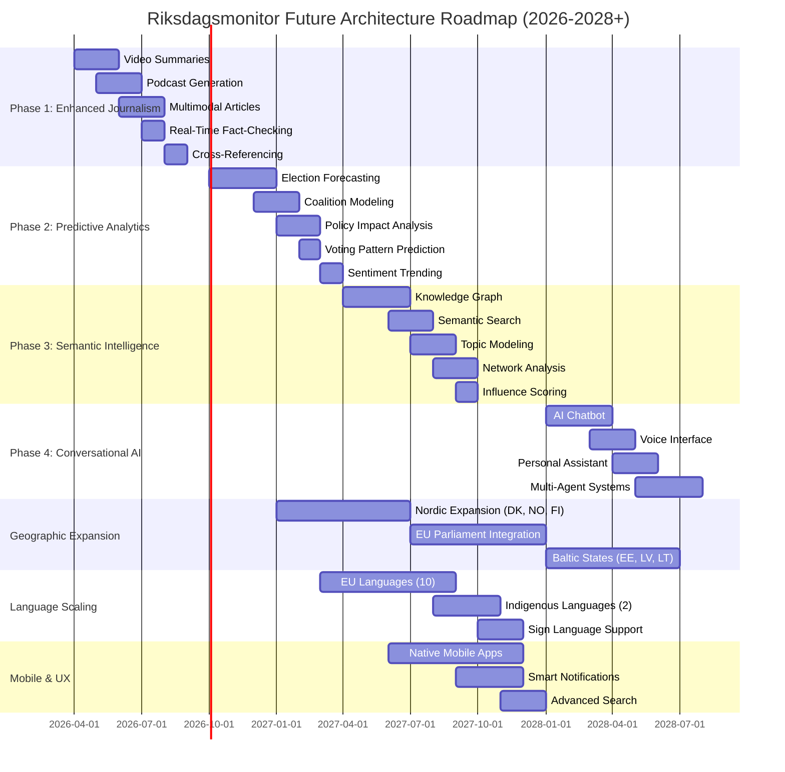

### 10.2 Key Milestones

**2026 Q2-Q3: Enhanced Journalism Foundation**
- ✅ Video summaries live (daily 2-3 min videos)
- ✅ Weekly podcast launched (15-20 min episodes)
- ✅ Multimodal articles deployed (text + audio + video + charts)

**2026 Q4-2027 Q1: Predictive Analytics Launch**
- ✅ Election forecasting dashboard (2026 election preview)
- ✅ Coalition modeling scenarios (probability analysis)
- ✅ Policy impact analysis tool (legislative impact predictions)

**2027 Q2-Q4: Semantic Intelligence Rollout**
- ✅ Knowledge graph operational (Neo4j, 10K entities, 100K relationships)
- ✅ Semantic search live (natural language queries)
- ✅ Network analysis dashboard (D3.js influence visualization)

**2027 Q1-Q2: Nordic Expansion**
- ✅ Danish Folketinget integrated (179 MPs)
- ✅ Norwegian Stortinget integrated (169 MPs)
- ✅ Finnish Eduskunta integrated (200 MPs)

**2027 Q3-Q4: EU Parliament Integration**
- ✅ EU Parliament data pipeline (720 MEPs)
- ✅ Swedish MEP dashboard (21 seats)
- ✅ EU legislation tracker (directives, regulations)

**2028 Q1-Q4: Conversational AI & Mobile**
- ✅ AI chatbot deployed (GPT-5 + RAG)
- ✅ Voice interface live (Alexa, Google Assistant)
- ✅ Native mobile apps (iOS, Android)
- ✅ Multi-agent research assistants (5 specialized agents)

**2028+: Global Expansion**
- ✅ Baltic states (Estonia, Latvia, Lithuania)
- ✅ 30+ languages (EU + indigenous + global)
- ✅ Global parliament template (reusable framework)

---

## 11. 💻 Technology Stack Evolution

### 11.1 Current Stack (2026 Q1)

**Frontend:**
- HTML5, CSS3, JavaScript ES6+
- Chart.js v4.4.1, D3.js v7
- Vite 7 (build system)

**Backend:**
- Static hosting (AWS CloudFront + S3, GitHub Pages DR)
- No server-side code

**Data:**
- CIA Platform (external, Java/Spring Boot)
- riksdag-regering-mcp (32 tools)

**Infrastructure:**
- AWS CloudFront + S3 (multi-region)
- AWS Route 53 (DNS + failover)
- GitHub Actions (CI/CD)

### 11.2 Future Stack (2028+)

**Frontend:**
- Next.js 15+ (React SSR) or Astro 5+ (partial hydration)
- Chart.js v5+, D3.js v8+
- Tailwind CSS v4+ (utility-first CSS)

**Backend:**
- Cloudflare Workers (serverless API, edge compute)
- AWS Lambda (ML model inference)
- GraphQL (Apollo Server)

**Data:**
- **Vector DB:** Weaviate (semantic search)
- **Graph DB:** Neo4j (knowledge graph)
- **Time-Series DB:** TimescaleDB (historical trends)
- **Relational DB:** PostgreSQL (user data, metadata)

**AI/ML:**
- **OpenAI GPT-5:** Content generation
- **Anthropic Claude Opus 5:** Fact-checking
- **ElevenLabs:** Voice synthesis
- **Llama 3.3 (70B):** Self-hosted ML inference
- **BERT (Swedish):** Sentiment analysis

**Infrastructure:**
- **CDN:** AWS CloudFront (primary) + Cloudflare (secondary)
- **Compute:** GKE/EKS (Kubernetes for ML workloads)
- **Storage:** AWS S3 (multi-region) + GCP Cloud Storage (backup)
- **Monitoring:** Datadog or New Relic (APM, SIEM)

---

## 12. 📚 Related Documents

### 12.1 ISMS Documentation
- [🏛️ ARCHITECTURE.md](./ARCHITECTURE.md) - Current system architecture
- [🔐 SECURITY_ARCHITECTURE.md](./SECURITY_ARCHITECTURE.md) - Security controls and compliance
- [🚀 FUTURE_SECURITY_ARCHITECTURE.md](./FUTURE_SECURITY_ARCHITECTURE.md) - Security evolution roadmap
- [⚠️ THREAT_MODEL.md](./THREAT_MODEL.md) - STRIDE analysis and risk assessment
- [🔄 WORKFLOWS.md](./WORKFLOWS.md) - CI/CD workflows and automation

### 12.2 Strategic Planning
- [💼 SWOT.md](./SWOT.md) - Strategic opportunities and threats analysis
- [🔄 FUTURE_FLOWCHART.md](./FUTURE_FLOWCHART.md) - AI-powered workflow diagrams
- [📊 DATA_MODEL.md](./DATA_MODEL.md) - Data architecture and schemas

### 12.3 Project Documentation
- [📋 README.md](./README.md) - Current features and capabilities
- [🌐 TRANSLATION_GUIDE.md](./TRANSLATION_GUIDE.md) - Multi-language standards
- [📰 NEWS_ARTICLE_STYLING_GUIDE.md](./NEWS_ARTICLE_STYLING_GUIDE.md) - Content generation standards

### 12.4 External References
- [Hack23 ISMS](https://github.com/Hack23/ISMS-PUBLIC)
- [Secure Development Policy](https://github.com/Hack23/ISMS-PUBLIC/blob/main/Secure_Development_Policy.md)
- [CIA Platform Architecture](https://github.com/Hack23/cia/blob/master/ARCHITECTURE.md)

---

## 📊 Conclusion

This Future Architecture document outlines Riksdagsmonitor's evolution from a static HTML/CSS website to a comprehensive AI-enhanced political intelligence platform. The roadmap prioritizes **practical, incremental enhancements** that preserve the platform's core strengths—simplicity, transparency, and reliability—while expanding capabilities through:

### Key Achievements (2026-2028+)

**🤖 AI Enhancement:**
- Multimodal content generation (text, audio, video)
- Predictive analytics (election forecasting, coalition modeling)
- Semantic intelligence (knowledge graphs, natural language search)
- Conversational AI (chatbot, voice interface, personal assistant)

**📊 Scalability:**
- Geographic expansion (Nordic countries, EU Parliament)
- Language scaling (14 → 30+ languages, including Sámi)
- Historical depth (50 → 158 years, 1866-2024)
- Real-time updates (<1 minute latency via WebSocket)

**💡 Advanced Features:**
- Native mobile apps (iOS/Android with offline support)
- Smart notifications (personalized, ML-powered alerts)
- API monetization (GraphQL, REST, webhooks)
- BI integrations (Tableau, PowerBI connectors)

### Strategic Alignment

**Business Goals:**
- **Market Leadership:** First Nordic-wide political intelligence platform
- **Revenue Generation:** $193K/year (Year 3) via enterprise API, premium features
- **Competitive Differentiation:** AI-powered journalism, 158-year historical data
- **Social Impact:** 30+ languages, indigenous language support, accessibility

**Technical Goals:**
- **Resilience:** Multi-region, multi-cloud, 99.9%+ availability
- **Performance:** Sub-2-second page loads, real-time updates
- **Security:** ISO 27001, NIST CSF 2.0, CIS Controls compliance
- **Scalability:** 10K → 100K users, Nordic + EU coverage

### Investment & ROI

**Total Investment:** $141K over 3 years (development + infrastructure)  
**Break-Even:** Year 1 (gradual revenue ramp)  
**3-Year ROI:** 57% ($222K cumulative profit)

### Next Steps

1. **Q2 2026:** Begin Phase 1 (Enhanced Journalism) - Video summaries, podcasts
2. **Q4 2026:** Launch Phase 2 (Predictive Analytics) - Election forecasting
3. **Q2 2027:** Deploy Phase 3 (Semantic Intelligence) - Knowledge graph, semantic search
4. **Q1 2028:** Rollout Phase 4 (Conversational AI) - Chatbot, voice interface, mobile apps

### Commitment to Transparency

At Hack23 AB, we believe in **security through transparency**. This roadmap is publicly available, demonstrating our commitment to open development, stakeholder communication, and democratic accountability. We invite feedback from users, researchers, and the open-source community to help shape Riksdagsmonitor's future.

---

**📋 Document Control:**  
**✅ Approved by:** James Pether Sörling, CEO  
**📤 Distribution:** Public  
**🏷️ Classification:** [](https://github.com/Hack23/ISMS-PUBLIC/blob/main/CLASSIFICATION.md)  
**📅 Effective Date:** 2026-02-15  
**⏰ Next Review:** 2026-05-15  
**🎯 Framework Compliance:** [](https://github.com/Hack23/ISMS-PUBLIC/blob/main/CLASSIFICATION.md) [](https://github.com/Hack23/ISMS-PUBLIC/blob/main/CLASSIFICATION.md) [](https://github.com/Hack23/ISMS-PUBLIC/blob/main/CLASSIFICATION.md)

---

**Document History:**
- **Version 1.0** (2026-02-15): Initial comprehensive future architecture document created
- **Next Review:** 2026-05-15 (Quarterly review cycle)
- **Repository:** https://github.com/Hack23/riksdagsmonitor
- **Path:** /FUTURE_ARCHITECTURE.md
- **Format:** Markdown with Mermaid diagrams

