<p align="center">
  
</p>

<h1 align="center">🚀 Riksdagsmonitor — Future Architecture</h1>

<p align="center">
  <strong>🧭 Three Horizons: Static Baseline → Static-Enhanced → AWS Serverless AI</strong><br>
  <em>🎯 v1.x Today · v2.0 Keep Static, Go Deeper · v3.0+ Amazon Bedrock Serverless</em>
</p>

<p align="center">
  
  
  
  
</p>

<h3 align="center">🏆 Evidence & Compliance Badges</h3>

<p align="center">
  <a href="https://api.securityscorecards.dev/projects/github.com/Hack23/riksdagsmonitor"></a>
  <a href="https://slsa.dev"></a>
  <a href="https://sonarcloud.io/dashboard?id=Hack23_riksdagsmonitor"></a>
  <a href="https://app.fossa.com/projects/git%2Bgithub.com%2FHack23%2Friksdagsmonitor"></a>
</p>

**📋 Document Owner:** CEO | **📄 Version:** 3.0 | **📅 Last Updated:** 2026-05-31 (UTC)  
**🔄 Review Cycle:** Quarterly | **⏰ Next Review:** 2026-08-31  
**🏢 Owner:** Hack23 AB (Org.nr 5595347807) | **🏷️ Classification:** Public

---

## 🎯 Purpose

This document is the **strategic architecture roadmap** for Riksdagsmonitor, organised around **three architectural horizons**. It is deliberately honest about what exists today versus what is aspirational, and labels every future target as a *target* — never as an achieved metric.

| Horizon | Version | Window | Thesis |
|---------|---------|--------|--------|
| **🟢 Horizon 1** | **v1.x** | Today (2026) | **Static baseline** — pre-rendered HTML/CSS, 14 languages, AWS CloudFront + S3, autonomous AI newsroom in the build pipeline. Proven, cheap, near-zero attack surface. |
| **🔵 Horizon 2** | **v2.0** | 2026–2027 | **Keep static, go deeper** — same zero-backend delivery model, but richer party-focused dashboards and advanced OSINT/INTOP analytics. AI stays in the *build/newsroom* pipeline; every published artifact remains a static file. |
| **🟣 Horizon 3** | **v3.0+** | 2028–2037 | **All-in AWS serverless** — Lambda, Amazon Bedrock (+ Agents & Knowledge Bases), API Gateway, Cognito, DynamoDB, Aurora Serverless v2, Neptune Serverless, OpenSearch Serverless, Timestream, Step Functions, EventBridge. Zero infrastructure, Well-Architected, multi-region. |

> *"At Hack23 AB, we have made a strategic decision to build our future on AWS serverless architecture. This means zero infrastructure management, no Kubernetes, no containers to maintain—just pure serverless compute, managed AI services, and AWS's deep expertise in security and compliance. By standardizing entirely on AWS, we eliminate operational complexity and leverage Amazon Bedrock for all AI capabilities. But we get there deliberately: we will exhaust the value of the static model first, because the cheapest, safest political-intelligence platform is one with no servers to attack. This document openly shares our staged roadmap — static today, static-but-deeper tomorrow, serverless AI thereafter."*
>
> — **James Pether Sörling, CEO, Hack23 AB**

## 📚 Architecture Documentation Map

| Document | Focus | Description |
|----------|-------|-------------|
| **[Architecture](ARCHITECTURE.md)** | 🏛️ Current | C4 models (Context, Container, Component) |
| **[Data Model](DATA_MODEL.md)** | 📊 Current | Entities, schemas, relationships |
| **[Flowcharts](FLOWCHART.md)** | 🔄 Current | Process flows and data pipelines |
| **[State Diagrams](STATEDIAGRAM.md)** | 🔄 Current | System state transitions |
| **[Mindmaps](MINDMAP.md)** | 🧠 Current | Conceptual system maps |
| **[SWOT](SWOT.md)** | 💼 Current | Strategic position assessment |
| **[Future Architecture](FUTURE_ARCHITECTURE.md)** | 🚀 **This Document** | AWS serverless roadmap, AI enhancement |
| **[Future Data Model](FUTURE_DATA_MODEL.md)** | 📊 Future | Aurora, DynamoDB, Neptune data architecture |
| **[Future Flowcharts](FUTURE_FLOWCHART.md)** | 🔄 Future | Bedrock AI workflows, Step Functions orchestration |
| **[Future State Diagrams](FUTURE_STATEDIAGRAM.md)** | 🔄 Future | AI-enhanced state transitions, event-driven workflows |
| **[Future Mindmaps](FUTURE_MINDMAP.md)** | 🧠 Future | Future capability evolution, AWS service relationships |
| **[Future SWOT](FUTURE_SWOT.md)** | 💼 Future | Future strategic opportunities |
| **[Security Architecture](SECURITY_ARCHITECTURE.md)** | 🛡️ Security | Defense-in-depth controls |
| **[Future Security Architecture](FUTURE_SECURITY_ARCHITECTURE.md)** | 🛡️ Future | Planned AWS security enhancements (GuardDuty, WAF) |
| **[Threat Model](THREAT_MODEL.md)** | 🎯 Security | STRIDE threat analysis |

---

## 📊 Executive Summary

This document outlines the architectural evolution of Riksdagsmonitor across **three horizons (2026–2037)**. We do **not** jump straight to the cloud: the roadmap deliberately extracts maximum value from the current static model before committing to a serverless backend.

### 🧭 The Three Horizons at a Glance

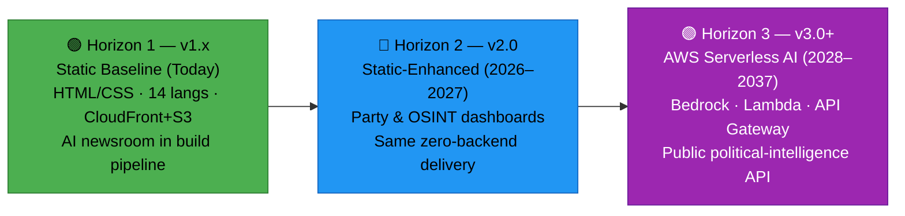

**Horizon 1 — v1.x Static Baseline (Today):** A pre-rendered HTML/CSS website in 14 languages, served from AWS CloudFront + multi-region S3 with GitHub Pages disaster recovery. An autonomous AI newsroom (gh-aw agentic workflows, Claude Opus 4.8 authoring / Sonnet 4.6 translation) produces evidence-graded analysis artifacts that are aggregated and rendered to static news pages. No backend, no login, near-zero attack surface.

**Horizon 2 — v2.0 Keep Static, Go Deeper (2026–2027):** We retain the entire static delivery model and instead deepen the *analysis*: party-focused dashboards (cohesion, coalition dynamics, bloc alignment, party-vs-party, agenda tracking) and advanced OSINT/INTOP tradecraft (network, temporal and geospatial analysis, anomaly detection, source-graded evidence, scorecards). AI remains confined to the build/newsroom pipeline — every published artifact is still a static file behind the CDN.

**Horizon 3 — v3.0+ AWS Serverless AI (2028–2037):** Once the static model is exhausted, we migrate to a **pure AWS serverless** backend with **zero infrastructure management** — no Kubernetes, no containers, no EC2. Amazon Bedrock provides all runtime AI (incl. Agents and Knowledge Bases for RAG); Lambda + API Gateway expose a public political-intelligence API; data lives in Aurora Serverless v2, DynamoDB, Neptune Serverless, OpenSearch Serverless and Timestream.

**AWS Serverless Strategy (Horizon 3):**
- ☁️ **Single Cloud Provider** - AWS only per [Hack23 ISMS SUPPLIER.md](https://github.com/Hack23/ISMS-PUBLIC/blob/main/SUPPLIER.md)
- 🤖 **Amazon Bedrock First** - All runtime AI via Bedrock (frontier Claude Opus, Llama, Nova) — bleeding-edge models only
- ⚡ **Pure Serverless** - AWS Lambda, API Gateway, Step Functions, EventBridge for all compute
- 🔄 **Automatic Scaling** - Scale from zero to millions based on demand
- 🏗️ **AWS Well-Architected** - Operational Excellence, Security, Reliability, Performance, Cost Optimization

**AWS Serverless Foundation Stack (Horizon 3):**

| Layer | AWS Services | Purpose |
|-------|-------------|----------|
| **AI/ML** | Amazon Bedrock, Bedrock Agents, SageMaker Serverless | Frontier Claude Opus, Llama, Nova; election forecasting |
| **Compute** | AWS Lambda (Python, Node.js) | Serverless functions |
| **API** | Amazon API Gateway, AppSync (GraphQL) | Public political-intelligence API |
| **Identity** | Amazon Cognito | API auth, tiered access |
| **Data** | Aurora Serverless v2, DynamoDB | Relational + NoSQL |
| **Search** | OpenSearch Serverless, Bedrock Knowledge Bases | Full-text + vector/RAG search |
| **Graph** | Neptune Serverless | Entity & coalition relationship networks |
| **Time-Series** | Timestream | Historical trends, forecasting |
| **Storage** | S3, CloudFront | Object storage + CDN |
| **Orchestration** | Step Functions, EventBridge, Kinesis | Workflow + streaming automation |

**Key Milestones:**
- **2026 Q2–Q3:** Horizon 2 — party-focused dashboard suite + OSINT/INTOP analytics (still static)
- **2026 Q4–2027 Q1:** Horizon 2 — network/temporal/geospatial analysis, anomaly detection, source-graded scorecards
- **2028:** Horizon 3 begins — Amazon Bedrock runtime integration, Lambda + API Gateway serverless API
- **2029–2030:** Frontier model integration, near-expert political analysis, expanded language support
- **2031–2033:** Pre-AGI architecture adaptation, multi-parliament coverage
- **2034–2037:** AGI-era platform evolution, real-time democracy index

**Current State (2026 Q2 — Horizon 1, achieved):**
- ✅ Static HTML/CSS website (14 languages, WCAG 2.1 AA, cyberpunk theme, no JS frameworks)
- ✅ 11 lazy-loaded TypeScript dashboards (Chart.js / D3.js, IntersectionObserver)
- ✅ 50+ years of data (349 current MPs, 2,494 historical politicians 1971–2024, 3.5M+ votes, 109,000+ documents)
- ✅ AWS CloudFront (600+ edge locations) + S3 (us-east-1 primary, eu-west-1 replica) + GitHub Pages DR
- ✅ Autonomous AI newsroom (gh-aw, Claude Opus 4.8 / Sonnet 4.6 translation, 14 languages)
- ✅ ISMS compliant (ISO 27001, NIST CSF 2.0, CIS Controls)

---

## 📋 Table of Contents

**🟢 Horizon 1 — v1.x Static Baseline**
1. [Horizon 1 — v1.x Static Baseline (Today)](#1--horizon-1--v1x-static-baseline-today)

**🔵 Horizon 2 — v2.0 Static-Enhanced (2026–2027)**
2. [Horizon 2 — v2.0 Keep Static, Go Deeper](#2--horizon-2--v20-keep-static-go-deeper-20262027)

**🟣 Horizon 3 — v3.0+ AWS Serverless AI (2028–2037)**
3. [Future C4 Architecture Models (AWS Serverless)](#3-️-future-c4-architecture-models-aws-serverless)
4. [AI Enhancement Roadmap (Amazon Bedrock)](#4--ai-enhancement-roadmap-amazon-bedrock)
4A. [Political-Intelligence Capability Architecture (OSINT/INTOP, to 2037)](#4a-️-political-intelligence-capability-architecture-osintintop-to-2037)
5. [Scalability Improvements](#5--scalability-improvements)
6. [AWS Serverless Architecture Evolution](#6-️-aws-serverless-architecture-evolution)
7. [Advanced Features Roadmap](#7--advanced-features-roadmap)
8. [Migration Strategy (AWS-Only)](#8--migration-strategy-aws-only)
9. [Risk Assessment (AWS-Specific)](#9-️-risk-assessment-aws-specific)
10. [Success Metrics](#10--success-metrics)
11. [Timeline & Milestones](#11--timeline--milestones)
12. [Related Documentation](#12--related-documentation)

**📐 Cross-Cutting (Horizon 3 detail)** — Well-Architected · Security Services · Multi-Region · Resilience Hub · Enterprise Integration · IMF Integration

---

## 1. 🟢 Horizon 1 — v1.x Static Baseline (Today)

### 1.1 Current Architecture (2026 Q2)

**Technology Stack:**
- **Frontend:** Static HTML5/CSS3, TypeScript-compiled dashboards (Chart.js 4.4.1, D3.js 7, Papa Parse 5.5.3) — **no JS framework**
- **Build System:** Vite 7 (ES modules, code splitting), 11 dashboards lazy-loaded via `IntersectionObserver`
- **Testing:** Vitest (2,890 unit tests), Cypress (E2E)
- **Hosting:** AWS CloudFront (600+ edge locations) + S3 (us-east-1 primary, eu-west-1 replica) + GitHub Pages disaster recovery
- **Data Sources:** Riksdagen API (data.riksdagen.se), Regeringen (via g0v.se), SCB (PxWeb v2), **IMF (primary economic — `scripts/imf-client.ts`)**, World Bank (non-economic only), CIA platform exports
- **Newsroom:** gh-aw agentic workflows (Node 26) — Claude Opus 4.8 authoring, Sonnet 4.6 translation
- **Languages:** 14 languages (EN, SV, DA, NO, FI, DE, FR, ES, NL, AR, HE, JA, KO, ZH), WCAG 2.1 AA

**Current Capabilities:**
- ✅ 349 current MPs with performance metrics
- ✅ 2,494 historical politicians (1971–2024)
- ✅ 3.5+ million votes analyzed
- ✅ 109,000+ documents processed
- ✅ 11 interactive lazy-loaded dashboards (party performance, politician rankings, seasonal/temporal patterns, pre-election monitoring, anomaly detection, voting cohesion, committee activity, and more)
- ✅ Daily statistics refresh from CIA platform exports

**Architecture Strengths:**
- 🟢 **Simple infrastructure** - Static hosting on CloudFront + multi-region S3
- 🟢 **High availability** - 99.9% CloudFront SLA + S3 11 9's durability + GitHub Pages DR
- 🟢 **Minimal attack surface** - No backend, no login, client-side rendering only
- 🟢 **AWS foundation** - CloudFront + S3, ready to extend to serverless in Horizon 3
- 🟢 **ISMS compliant** - ISO 27001, NIST CSF 2.0, CIS Controls

**Current Characteristics:**
- 📊 **Static content** - Pre-rendered HTML/CSS for maximum performance
- 🤖 **Aggregate-then-render news pipeline** - Agentic workflows author per-type analysis artifacts under `analysis/daily/$DATE/$SUB/`; `scripts/aggregate-analysis.ts` concatenates them into a canonical `article.md` + SHA-256 provenance manifest; `scripts/render-articles.ts` + `scripts/render-lib/` converts markdown to sanitised HTML (`news/$DATE-$SUB-{en,sv}.html`); `news-translate` extends to the remaining 12 languages out-of-band — zero manual HTML editing
- 🌐 **Client-side data** - CSV parsing in browser for simplicity
- 📈 **Historical analysis** - 50+ years of political data visualization
- 🔓 **Open access** - Public website, no login required
- 📂 **Direct access** - CSV data files available for download

**Current News Pipeline (aggregate-then-render):**

```
analysis/daily/$DATE/$SUB/*.md          (AI-authored artifacts — 9 per article)
         │  produced by 10 per-type news workflows
         ▼
scripts/aggregate-analysis.ts           (concat + SHA-256 manifest)
         │
         ▼
scripts/render-articles.ts              (markdown → sanitised HTML via rehype)
  + scripts/render-lib/                 (chrome: JSON-LD NewsArticle, hreflang, CSP)
         │
         ▼
news/$DATE-$SUB-{en,sv}.html            (2 languages per CI run)
         │  news-translate workflow
         ▼
news/$DATE-$SUB-{da,nb,fi,de,fr,es,nl,ar,he,ja,ko,zh}.html   (12 more)
```

This is the **baseline** that Horizon 2 deepens *without changing the delivery model*, and that the Horizon 3 AWS Serverless future state in §3–§11 eventually migrates to a backend.

---

## 2. 🔵 Horizon 2 — v2.0 Keep Static, Go Deeper (2026–2027)

> **Thesis:** The single biggest near-term win is **not** a backend — it is *better analysis*. Horizon 2 keeps the entire static delivery model of Horizon 1 (pre-rendered HTML/CSS, CloudFront + S3, no login, no servers) and invests instead in **party-focused dashboards** and **advanced OSINT/INTOP tradecraft**. AI remains confined to the build/newsroom pipeline; every published artifact is still a static file behind the CDN. This is the cheapest, safest way to deepen Riksdagsmonitor's intelligence value before taking on serverless operational complexity.

### 2.1 What Changes — and What Deliberately Does Not

| Dimension | Horizon 1 (v1.x today) | Horizon 2 (v2.0) | Horizon 3 (v3.0+) |
|-----------|------------------------|------------------|-------------------|
| **Delivery** | Static HTML/CSS on CDN | **Unchanged** — static HTML/CSS on CDN | AWS serverless backend |
| **Backend** | None | **None** (deliberate) | Lambda + API Gateway |
| **AI placement** | Build/newsroom pipeline | Build/newsroom pipeline (deeper analytics) | Runtime via Amazon Bedrock |
| **Dashboards** | 11 general dashboards | + Party cohesion, coalition, bloc, party-vs-party, agenda | Interactive API-backed views |
| **OSINT depth** | Source-graded articles | + Network / temporal / geospatial / anomaly detection | + RAG, conversational queries |
| **Attack surface** | Near-zero | **Near-zero (unchanged)** | Managed AWS controls |
| **Cost model** | CDN + CI only | CDN + CI only | Pay-per-request serverless |

### 2.2 Context Diagram — Static-Enhanced (v2.0)

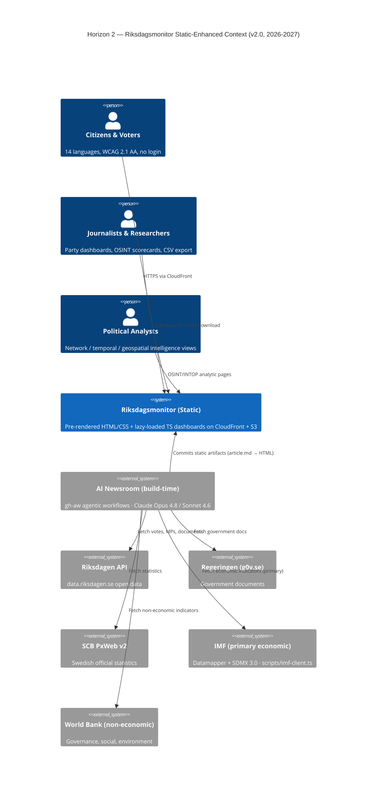

### 2.3 Container Diagram — Static-Enhanced (v2.0)

**Architecture:** Identical zero-backend delivery to Horizon 1. The *only* growth is in the build pipeline (more analysis artifacts, more dashboard bundles) and in the static assets served. There is still **no runtime compute** — every box below is either a build-time job or a static file on the CDN.

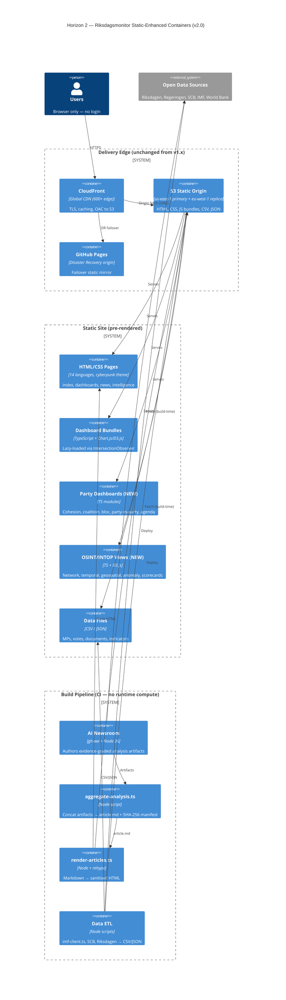

### 2.4 Party-Focused Dashboard Suite (v2.0)

All of these are **client-side TypeScript dashboards** rendered from pre-computed CSV/JSON — no backend queries.

| Dashboard | Intelligence Question | Primary Evidence |
|-----------|----------------------|------------------|
| **Party Cohesion** | How often do a party's MPs vote together? | Vote records per `dok_id`, party whip deviations |
| **Coalition Dynamics** | Which parties co-vote, and is it strengthening? | Pairwise co-vote matrices over time |
| **Bloc Alignment** | Is the left/right bloc structure holding? | Bloc-level agreement indices |
| **Party-vs-Party** | Head-to-head agreement/conflict on issues | Issue-tagged vote divergence |
| **Agenda Tracking** | What is each party pushing this session? | Motion/interpellation volume by policy area |

### 2.5 Advanced OSINT / INTOP Analytics (v2.0)

Structured intelligence tradecraft applied to **public** data only, fully within Hack23 ISMS and GDPR Art. 9 lawful bases 9(2)(e)/9(2)(g):

- **Network analysis** — co-sponsorship, co-voting and committee-membership graphs (centrality, clustering, bridging actors)
- **Temporal analysis** — agenda shifts, attendance/discipline trends, pre-election behavioural drift
- **Geospatial analysis** — valkrets-level (constituency) patterns and regional alignment
- **Anomaly detection** — statistical outliers in voting, attendance and document activity, with explainable flags
- **Source-graded evidence** — every claim tied to a `dok_id`, named actor, vote count, or primary-source URL; reliability grading per editorial standards
- **Scorecards** — attendance, voting discipline, productivity and committee contribution, neutral across all parties

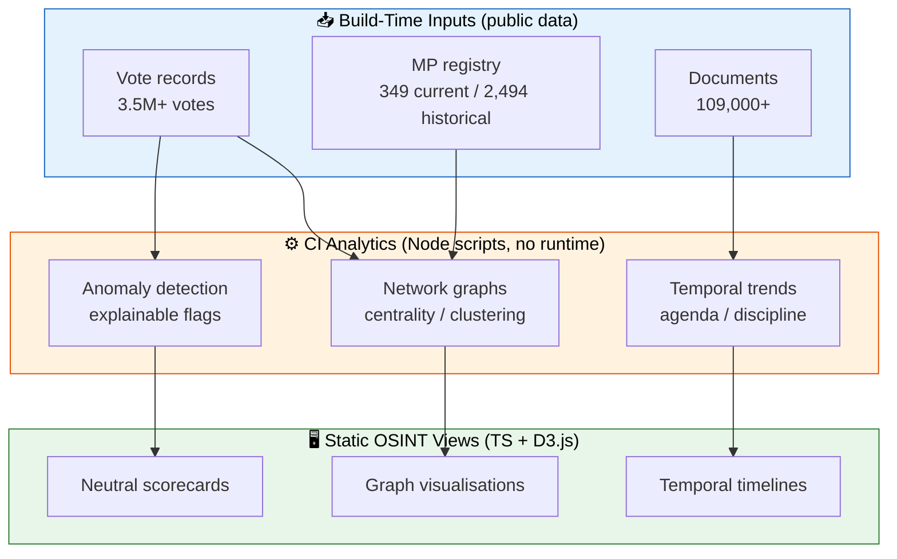

### 2.6 Why Stay Static Through 2027

- 🛡️ **Security** — no backend means no API to exploit, no auth to breach, no injection surface; ISMS attack surface stays near-zero
- 💰 **Cost** — CDN + CI only; no per-request compute or database spend
- ⚡ **Performance** — pre-rendered pages, global edge caching, instant first paint
- 🔁 **Reversibility** — every analytic improvement is a committed static asset; trivially auditable and rollback-safe
- 🤖 **AI value captured early** — frontier models already power the *build-time* newsroom and analytics; we do not need runtime AI to deepen intelligence

---

## 3. 🏗️ Future C4 Architecture Models (AWS Serverless)

> **🟣 Horizon 3 (v3.0+, 2028–2037).** Everything from §3 onward describes the **post-static** serverless backend. It is activated only after Horizon 2 has exhausted the value of the static model. Until then, these are *targets*, not deployed systems.


### 3.1 Context Diagram - Future State (2026-2028)

**Vision:** Transform Riksdagsmonitor into a multi-country political intelligence platform with AI-enhanced analysis and real-time monitoring, built entirely on AWS serverless services.

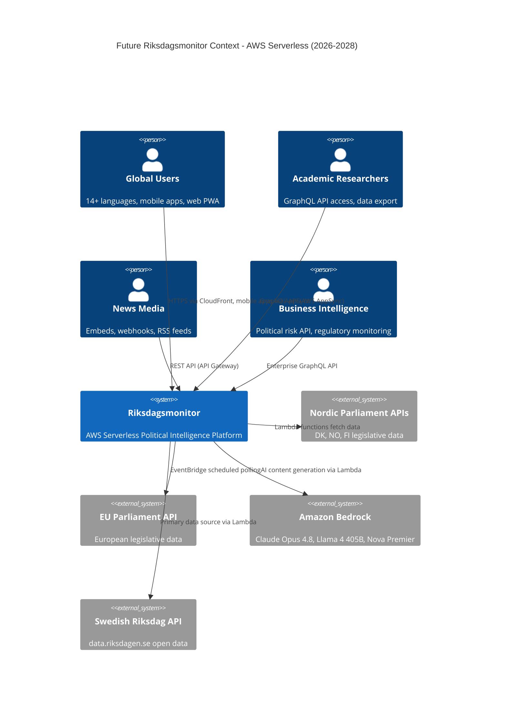

### 3.2 Container Diagram - AWS Serverless Future State (2027-2028)

**Architecture:** Pure AWS serverless with zero infrastructure management—no Kubernetes, no containers, no EC2 instances. Enhanced with AWS WAF, KMS encryption, and multi-region deployment.

```mermaid
C4Container
    title Riksdagsmonitor AWS Serverless Architecture (2027-2028)
    
    Person(user, "Users", "Multi-platform access")
    
    System_Boundary(security, "AWS Security Layer") {
        Container(waf, "AWS WAF", "Web Application Firewall", "DDoS protection, rate limiting, geo-blocking")
        Container(cloudfront, "CloudFront + Shield", "Global CDN", "Edge caching, Standard DDoS protection")
    }
    
    System_Boundary(riksdag, "Riksdagsmonitor Platform - AWS Serverless") {
        Container(amplify_web, "Web PWA", "AWS Amplify Hosting", "Progressive Web App, SSR")
        Container(amplify_mobile, "Mobile Apps", "AWS Amplify + AppSync", "iOS/Android native apps")
        
        Container(appsync, "GraphQL API", "AWS AppSync", "Managed GraphQL, real-time subscriptions")
        Container(api_gateway, "REST API", "Amazon API Gateway", "Legacy REST endpoints, usage plans")
        
        Container(lambda_news, "News Generator", "AWS Lambda (Python)", "Bedrock integration for articles")
        Container(lambda_translate, "Translation Service", "AWS Lambda (Python)", "14-language support")
        Container(lambda_api, "API Functions", "AWS Lambda (Python)", "API handlers, business logic")
        Container(lambda_etl, "Data Pipeline", "AWS Lambda (Python)", "ETL, data ingestion")
        
        Container(bedrock_kb, "Vector Search", "Bedrock Knowledge Base", "RAG, semantic search, embeddings")
        Container(neptune, "Graph Database", "Neptune Serverless", "Political networks, entity relationships")
        Container(opensearch, "Full-Text Search", "OpenSearch Serverless", "Document search, analytics dashboards")
        Container(timestream, "Time-Series DB", "Amazon Timestream", "Historical trends, election forecasting")
        Container(aurora, "Relational DB", "Aurora Serverless v2", "political_data DB, multi-AZ")
        Container(dynamodb, "NoSQL DB", "DynamoDB Global Tables", "Sessions, cache, multi-region")
        
        Container(step_functions, "Workflows", "AWS Step Functions", "Content generation orchestration")
        Container(eventbridge, "Event Bus", "EventBridge", "Event routing, scheduled polling")
        
        Container(s3, "Object Storage", "S3 + CRR", "Static assets, cross-region replication")
        Container(kms, "Encryption", "AWS KMS", "Data encryption at rest, key rotation")
    }
    
    System_Ext(bedrock, "Amazon Bedrock", "Claude Opus 4.8, Llama 4 405B, Nova Premier")
    System_Ext(sagemaker, "SageMaker Serverless", "Custom ML models, election forecasting")
    System_Ext(data_sources, "External APIs", "Riksdag, Nordic, EU Parliament APIs")
    
    Rel(user, waf, "HTTPS traffic")
    Rel(waf, cloudfront, "Filtered requests")
    Rel(cloudfront, amplify_web, "Serve web app")
    Rel(user, amplify_mobile, "Native SDK")
    
    Rel(amplify_web, appsync, "GraphQL over HTTPS")
    Rel(amplify_mobile, appsync, "GraphQL + subscriptions")
    
    Rel(appsync, lambda_api, "Invoke resolvers")
    Rel(api_gateway, lambda_api, "Invoke handlers")
    
    Rel(lambda_api, aurora, "Read/write data (encrypted)")
    Rel(lambda_api, dynamodb, "Cache, sessions (encrypted)")
    Rel(lambda_api, opensearch, "Full-text search")
    Rel(lambda_api, bedrock_kb, "Vector search")
    Rel(lambda_api, neptune, "Graph queries")
    Rel(lambda_api, timestream, "Time-series queries")
    
    Rel(lambda_news, bedrock, "Text, image generation")
    Rel(lambda_translate, bedrock, "Claude Opus 4.8 translation")
    Rel(lambda_etl, data_sources, "Fetch political data")
    
    Rel(step_functions, lambda_news, "Orchestrate AI pipeline")
    Rel(eventbridge, lambda_etl, "Scheduled data refresh")
    
    Rel(lambda_api, s3, "Store generated content")
    Rel(cloudfront, s3, "Origin fetch")
    Rel(kms, aurora, "Encrypt data")
    Rel(kms, dynamodb, "Encrypt data")
    Rel(kms, s3, "Encrypt objects")
    
    UpdateLayoutConfig($c4ShapeInRow="3", $c4BoundaryInRow="1")
```

### 3.3 Component Diagram - AI Content Engine (Amazon Bedrock)

**Focus:** AI-powered content generation using Amazon Bedrock for all AI operations—no direct OpenAI/Anthropic API calls.

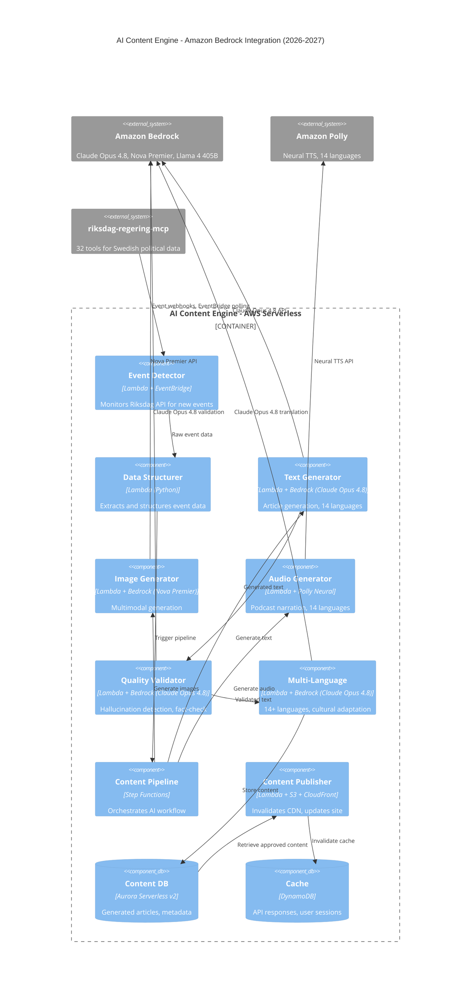

---

## 4. 🤖 AI Enhancement Roadmap (Amazon Bedrock)

### 4.1 Phase 1: Enhanced Journalism (H3 — 2028+)

**Objective:** Automate daily news generation from Swedish Parliament activity using **Amazon Bedrock** exclusively for all AI operations.

**Features:**
- ✨ **Automated News Articles** - Daily articles via Bedrock Claude Opus 4.8 (2026 SOTA)
- ✨ **Multi-Language Translation** - 14 languages via Claude Opus 4.8 (no DeepL, no Google Translate)
- ✨ **Podcast Generation** - Amazon Polly Neural TTS (14 languages)
- ✨ **Image Generation** - Amazon Bedrock Nova Premier (multimodal generation)
- ✨ **Real-Time Fact-Checking** - Claude Opus 4.8 validates against Riksdag records
- ✨ **Cross-Referencing** - Automatic citation linking via Bedrock Knowledge Bases

**AWS Serverless Stack:**
- **Text Generation:** Amazon Bedrock - Claude Opus 4.8 (1M+ context window, extended thinking)
- **Image Generation:** Amazon Bedrock - Nova Premier (multimodal: text+image+video)
- **Audio Generation:** Amazon Polly - Neural TTS (14 languages including Swedish)
- **Quality Assurance:** Amazon Bedrock - Claude Opus 4.8 for hallucination detection
- **Orchestration:** AWS Step Functions (standard workflows, pay-per-state-transition)
- **Storage:** Amazon S3 (generated content), Aurora Serverless v2 (metadata)

**Content Types:**
1. **Daily News Digest** - Top 5 parliamentary events (500-800 words, Claude Opus 4.8)
2. **Weekly Analysis** - In-depth policy analysis (2,000-3,000 words, Claude Opus 4.8)
3. **Monthly Risk Assessment** - Transparency report (5,000+ words, Claude Opus 4.8)
4. **Event Alerts** - Breaking news (100-200 words, Claude Opus 4.8)

**Quality Standards:**
- ✅ Minimum 95% factual accuracy (verified via Bedrock against Riksdag data)
- ✅ GDPR-compliant (public official data only)
- ✅ Hack23 AI Policy compliant (transparency, human oversight, bias mitigation)
- ✅ Journalistic standards (AP/Reuters style, inverted pyramid structure)

**Amazon Bedrock Advantages:**
- ✅ **IAM-based authentication** - Role-based access, zero credential exposure
- ✅ **AWS data residency** - All processing within AWS infrastructure
- ✅ **Built-in guardrails** - Bedrock Guardrails for content filtering
- ✅ **Model flexibility** - Claude Opus 4.8, Llama 4 405B, Nova Premier via unified API
- ✅ **Automatic scaling** - Serverless capacity management, no provisioning

### 4.2 Phase 2: Predictive Analytics (H3 — 2028 Q4–2029 Q1)

**Objective:** Implement election forecasting and coalition modeling using **AWS SageMaker Serverless Inference** and **Amazon Bedrock**.

**Features:**
- ✨ **Election Forecasting** - SageMaker Serverless Inference (XGBoost, Random Forest)
- ✨ **Coalition Modeling** - Bedrock Claude Opus 4.8 for scenario analysis
- ✨ **Policy Impact Analysis** - Bedrock Llama 4 405B for economic/social modeling
- ✨ **Voting Pattern Prediction** - SageMaker Serverless (85% accuracy target)
- ✨ **Sentiment Trending** - Bedrock Titan Embeddings + OpenSearch Serverless

**AWS Serverless Stack:**
- **ML Models:** SageMaker Serverless Inference (pay-per-invocation, auto-scaling)
- **Model Training:** SageMaker Training Jobs (on-demand, spot instances)
- **Feature Store:** SageMaker Feature Store (managed feature engineering)
- **Embeddings:** Bedrock Titan Embeddings v2 (8,192-dimensional vectors)
- **Vector Search:** OpenSearch Serverless + Bedrock Knowledge Bases
- **Orchestration:** Step Functions (ML pipeline workflows)

**Predictive Models:**

1. **Election Forecasting Model (2026 Election)**
   - **Training:** SageMaker Training Jobs (XGBoost on historical data)
   - **Inference:** SageMaker Serverless Inference (pay-per-request)
   - **Input Features:** 50+ years historical data, economic indicators, polls
   - **Output:** Seat predictions per party (±5 seat confidence intervals)
   - **Accuracy Target:** 90% seat prediction accuracy

2. **Coalition Formation Model**
   - **AI Engine:** Bedrock Claude Opus 4.8 (scenario analysis, extended reasoning)
   - **Input:** Party ideologies, historical coalitions, current parliament composition
   - **Output:** Coalition probability matrix (all viable combinations)
   - **Validation:** Expert review by political scientists

3. **Vote Prediction Model (MP-level)**
   - **Training:** SageMaker (LightGBM on 3.5M+ historical votes)
   - **Inference:** SageMaker Serverless Inference
   - **Features:** MP party, voting history, constituency, committee membership
   - **Output:** Vote likelihood (yes/no/abstain probabilities)
   - **Accuracy Target:** 85% vote prediction accuracy

**Serverless ML Architecture:**
- ✅ **Backend ML Inference** - All ML on AWS backend (Lambda + SageMaker)
- ✅ **Serverless Endpoints** - SageMaker Serverless Inference endpoints
- ✅ **Auto-Scaling** - Automatic capacity management, zero idle costs

### 4.3 Phase 3: Semantic Intelligence (H3 — 2029 Q2–Q4)

**Objective:** Implement knowledge graphs and semantic search using **Amazon Neptune Serverless** and **Amazon Bedrock Knowledge Bases**.

**Features:**
- ✨ **Knowledge Graph** - Amazon Neptune Serverless (109K+ documents, entity relationships)
- ✨ **Semantic Search** - Amazon Bedrock Knowledge Bases (RAG with vector search)
- ✨ **Natural Language Queries** - Bedrock Claude Opus 4.8 + Knowledge Bases ("Show me all climate votes")
- ✨ **Topic Modeling** - Bedrock Titan Embeddings + OpenSearch Serverless (automatic clustering)
- ✨ **Network Analysis** - Neptune Serverless (PageRank, community detection via openCypher)
- ✨ **Influence Scoring** - Neptune graph algorithms (Louvain, Girvan-Newman)

**AWS Serverless Stack:**
- **Graph Database:** Amazon Neptune Serverless (pay-per-query, auto-pause)
- **Vector Database:** Amazon Bedrock Knowledge Bases (managed RAG)
- **Embeddings:** Bedrock Titan Embeddings v2 (8,192 dimensions)
- **Full-Text Search:** OpenSearch Serverless (pay-per-use, auto-scaling)
- **Query Engine:** Lambda functions (Python with boto3, gremlin_python)
- **Visualization:** D3.js (client-side, data fetched from AppSync)

**Knowledge Graph Schema:**
- **Entities:** MPs (349), Parties (8), Policies (109K+ documents), Committees (15), Ministries (10)
- **Relationships:** MEMBER_OF, VOTES_FOR, PROPOSES, COMMITTEE_ASSIGNMENT, COALITION_PARTNER
- **Properties:** Name, date, vote result, document ID, policy area (20 categories)
- **Storage:** Neptune Serverless (openCypher + Gremlin query languages)

**Semantic Search via Bedrock Knowledge Bases:**
1. **Ingest:** Lambda functions embed documents via Bedrock Titan Embeddings
2. **Store:** Bedrock Knowledge Base stores vectors + metadata (S3-backed)
3. **Query:** Users ask natural language questions via AppSync
4. **Retrieve:** Bedrock retrieves relevant documents (RAG pattern)
5. **Generate:** Bedrock Claude Opus 4.8 generates answer with citations

**AWS-Native Data Services:**
- ✅ **Graph Database** - Amazon Neptune Serverless only
- ✅ **Vector Search** - Amazon Bedrock Knowledge Bases only
- ✅ **Fully Managed** - Zero database administration, automatic backups
- ✅ **AWS-Native** - IAM integration, VPC isolation, CloudWatch monitoring

### 4.4 Phase 4: Conversational AI (2028+)

**Objective:** Deploy conversational interfaces using **Amazon Bedrock** and **AWS AppSync real-time subscriptions**.

**Features:**
- ✨ **AI Chatbot** - Bedrock Claude Opus 6.0 with Bedrock Knowledge Bases (RAG)
- ✨ **Voice Interface** - Amazon Lex (conversational AI) + Polly (TTS)
- ✨ **Personal Briefings** - Bedrock Claude Opus 6.0 + EventBridge (scheduled)
- ✨ **Multi-Agent Systems** - Bedrock Agents (autonomous task execution)

**AWS Serverless Stack:**
- **Conversational AI:** Amazon Lex v2 (pay-per-request, no minimum fees)
- **Text Generation:** Amazon Bedrock - Claude Opus 6.0
- **Voice Output:** Amazon Polly Neural TTS
- **Voice Input:** Amazon Transcribe (real-time streaming)
- **Knowledge Base:** Amazon Bedrock Knowledge Bases (RAG)
- **Agents:** Amazon Bedrock Agents (autonomous workflows)
- **Real-Time Updates:** AWS AppSync subscriptions (GraphQL)

**Use Cases:**
1. **Daily Briefings** - "What happened in Riksdag today?" (Bedrock + Lambda)
2. **MP Tracking** - "What has Magdalena Andersson voted on?" (Neptune + Bedrock)
3. **Policy Research** - "Summarize climate legislation 2020-2024" (Knowledge Bases + Claude Opus 6.0)
4. **Coalition Analysis** - "Most likely coalitions after 2026 election?" (SageMaker + Claude Opus 6.0)
5. **Transparency Monitoring** - "Which MPs have risk violations?" (Aurora + Claude Opus 6.0)

**AWS-Native Voice Interfaces:**
- ✅ **Amazon Lex** - Conversational AI with automatic speech recognition
- ✅ **AppSync Real-Time** - Push notifications via GraphQL subscriptions
- ✅ **Amplify Mobile SDK** - Native voice interfaces in iOS/Android apps

---

## 4A. 🛰️ Political-Intelligence Capability Architecture (OSINT/INTOP, to 2037)

> **Master catalog:** the capabilities below are the architecture realisation of [`FUTURE_MINDMAP.md` §Political-Intelligence Capability Catalog](FUTURE_MINDMAP.md#-theme--political-intelligence-capability-catalog-to-2037--the-master-osintintop-map). Sections 3–4 describe the *generic* AWS serverless platform and the Bedrock content/predictive roadmap; this section describes the **intelligence-specific** layers an operative requires — multi-INT collection &amp; fusion, processing &amp; provenance, an analytic-tradecraft engine (SAT + forecasting + I&W), production/dissemination, and assurance/counter-AI — and maps each to named managed services. Everything operates on **public** data under GDPR Art. 9 bases 9(2)(e)/9(2)(g) with human-in-the-loop sign-off.

### 4A.1 Why a dedicated intelligence architecture (the gap)

The v1.x/v2.0 newsroom is a **single-source, document-centric, build-time** pipeline. It reads parliamentary documents superbly but does not (yet) **fuse** them with the financial, lobbying, procurement and discourse context around them; does not run **indications-and-warning tripwires**; cannot **wargame** coalition dynamics; and produces **point-in-time articles** rather than **standing estimative products**. Horizon 3 closes those gaps by adding five intelligence-specific architectural layers on top of the serverless substrate from §3.

### 4A.2 Intelligence-layer container view (Horizon 3, 2028–2031)

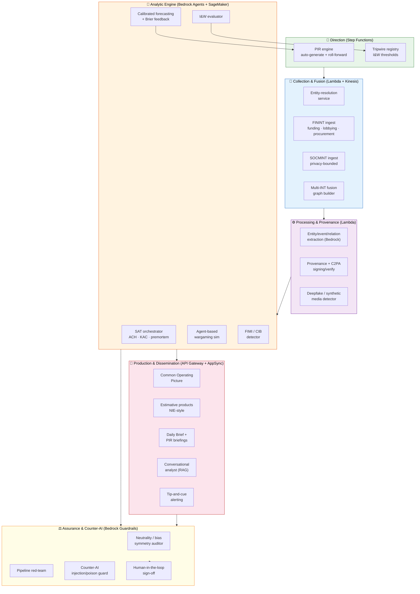

### 4A.3 Capability → AWS service mapping

| Layer | Capability | Primary managed service(s) | Notes |
|-------|-----------|----------------------------|-------|
| Collection | Entity resolution across registries | Lambda + Neptune + OpenSearch (embedding match) | Record-linkage; provenance-tagged |
| Collection | FININT (funding/lobbying/procurement) | Lambda ingest + Aurora + S3 | Public registers only |
| Collection | Multi-INT fusion graph | Neptune Serverless | OSINT+FININT+GEOINT+ECONINT mesh |
| Collection | Privacy-bounded SOCMINT | Lambda + Comprehend (aggregate) | No individual profiling; aggregate stance/salience |
| Processing | Entity/event/relation extraction | Bedrock (Claude) + Comprehend | 14-language IE |
| Processing | Content provenance + C2PA | Lambda + KMS signing + S3 Object Lock | Tamper-evident chain-of-custody |
| Processing | Deepfake / synthetic-media detection | SageMaker Serverless Inference | Refuse-to-cite gate |
| Analysis | SAT automation (ACH/KAC/premortem) | Bedrock Agents | ICD 203-graded |
| Analysis | Calibrated forecasting + Brier loop | SageMaker + Timestream | Continuous calibration ledger |
| Analysis | Indications &amp; Warning tripwires | Lambda + EventBridge + Timestream | Threshold/anomaly evaluators |
| Analysis | Agent-based wargaming | Step Functions + Bedrock Agents | Coalition/vote simulation |
| Analysis | FIMI / CIB detection | Neptune + SageMaker | Coordinated-inauthentic-behaviour graph signals |
| Production | Common Operating Picture | AppSync subscriptions + DynamoDB | Live fused situational view |
| Production | Estimative products (NIE) | Bedrock + Knowledge Bases | Standing key-judgment products |
| Dissemination | Conversational analyst (RAG) | Bedrock Agents + Knowledge Bases | Citation-grounded |
| Dissemination | Tip-and-cue alerting | EventBridge + SNS/AppSync | Watchlist-driven |
| Assurance | Neutrality / bias auditor | Lambda + Bedrock Guardrails | Per-party arithmetic symmetry |
| Assurance | Pipeline red-team | Step Functions (scheduled) | Adversarial self-test |
| Assurance | Counter-AI integrity guard | Bedrock Guardrails + WAF + input validation | Prompt-injection / data-poisoning defence |

### 4A.4 Component view — Indications &amp; Warning (I&W) tripwire engine

The I&W engine is the architectural heart of the "warns about tomorrow" vision: a set of explainable indicator models whose threshold crossings re-task collection (tip-and-cue) and emit confidence-scored warnings for human review.

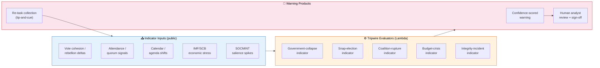

**Architectural fitness controls (intelligence-specific).**
- 🔒 **No claim without provenance** — every analytic input carries an Admiralty grade + source anchor before it can enter the I&W or forecasting engines.
- ⚖️ **Neutrality gate in CI/CD** — bias-symmetry auditor runs before any product is published; a party-asymmetry failure blocks release.
- 🧪 **Calibration as a release metric** — forecasting endpoints are scored on rolling Brier/calibration; degraded calibration triggers retrain (see [`FUTURE_STATEDIAGRAM.md`](FUTURE_STATEDIAGRAM.md)).
- 🛡️ **Counter-AI by construction** — Bedrock Guardrails + WAF + strict input validation defend the analytic pipeline from prompt-injection and data-poisoning (see [`FUTURE_THREAT_MODEL.md`](FUTURE_THREAT_MODEL.md) and [`FUTURE_SECURITY_ARCHITECTURE.md`](FUTURE_SECURITY_ARCHITECTURE.md)).

### 4A.5 Intelligence-capability phasing to 2037

| Phase | Period | Intelligence capability milestone |
|-------|--------|-----------------------------------|
| Static fusion seeds | 2026–2027 (H2) | Build-time entity resolution, conflict screening, SAT automation, influence networks, neutrality auditing |
| Runtime fusion + warning | 2028–2029 (H3) | Multi-INT fusion mesh, provenance/deepfake gates, calibrated forecasting, I&W tripwires, conversational analyst, FIMI detection |
| Estimative + simulation | 2030–2031 (H3) | Causal policy-impact inference, agent-based wargaming, Common Operating Picture, NIE-style estimative products |
| Autonomous intelligence | 2032–2037 | Always-on multi-parliament fusion, generative scenario synthesis, election-night live cell, real-time democracy-health index |

---

## 5. 🌐 Scalability Improvements

### 5.1 Geographic Expansion

**Phase 1: Nordic Expansion (2027-2028)**

**Countries:**
- 🇩🇰 **Denmark** - Folketinget (179 seats)
- 🇳🇴 **Norway** - Stortinget (169 seats)
- 🇫🇮 **Finland** - Eduskunta (200 seats)

**AWS Serverless Integration:**
- **Data Ingestion:** Lambda functions (Python) fetch Nordic APIs
- **Event-Driven:** EventBridge schedules daily data refresh
- **Multi-Country Storage:** Aurora Serverless v2 (partitioned by country)
- **Unified API:** AppSync GraphQL (country filter in queries)

**Phase 2: EU Parliament Integration (2028-2029)**

**Scope:**
- 🇪🇺 **EU Parliament** - 705 MEPs, 27 member states
- **Data Source:** [EU Parliament Open Data Portal](https://data.europarl.europa.eu/)
- **AWS Integration:** Lambda + EventBridge (hourly polling)

### 5.2 Language Scaling

**Current:** 14 languages  
**Future (2027-2028):** 30+ languages via **Amazon Bedrock Claude Opus 5.x**

**AWS Translation Stack:**
- **Primary:** Amazon Bedrock Claude Opus 5.x (cultural adaptation, political terminology)
- **Fallback:** Amazon Translate Neural (99 languages, fast batch translation)
- **Quality Control:** Bedrock Claude Opus 5.x (translation validation)

**AWS Translation Services:**
- ✅ **Primary:** Amazon Bedrock Claude Opus 5.x for political terminology nuance
- ✅ **Fallback:** Amazon Translate Neural (99 languages, fast batch translation)
- ✅ **Quality Control:** Bedrock Claude Opus 5.x (translation validation)

### 5.3 Data Scaling

**Historical Depth:**
- **Current:** 1971-2024 (50+ years)
- **Future:** 1866-present (158+ years) - Full Riksdag history

**AWS Serverless Data Pipeline:**
- **Ingestion:** Lambda functions (Python) + riksdag-regering-mcp
- **ETL:** Step Functions (orchestrate multi-step data pipelines)
- **Storage:** Aurora Serverless v2 (active data) + S3 Glacier (archival)
- **Analytics:** Amazon Athena (SQL queries on S3 data lake)

**Real-Time Updates:**
- **Current:** Daily batch (03:00 CET)
- **Future:** Real-time streaming (<1 minute latency)

**AWS Real-Time Stack:**
- **Streaming:** Amazon Kinesis Data Streams (ingest)
- **Processing:** Lambda (consume Kinesis records)
- **Analytics:** Kinesis Data Analytics (SQL on streaming data)
- **Notifications:** AppSync subscriptions (push to clients)
- **Storage:** DynamoDB Streams (change data capture)
- **Fully Managed:** Zero cluster management, auto-scaling

---

## 6. 🏗️ AWS Serverless Architecture Evolution

### 6.1 Migration Phases (Current Static → AWS Serverless)

**Current Architecture (2026 Q1):**
```
Static HTML/CSS → CloudFront → S3
```

**Phase 1: Add Serverless API (2026 Q2-Q3)**
```
Static Frontend → CloudFront → S3
                   ↓
                 API Gateway → Lambda → Aurora Serverless v2
```

**Phase 2: Add Amazon Bedrock AI (2026 Q4-2027 Q1)**
```
Static Frontend → CloudFront → S3
                   ↓
                 API Gateway → Lambda → Aurora Serverless v2
                               Lambda → Amazon Bedrock (Claude Opus 4.8)
```

**Phase 3: Add AppSync + Mobile (2027 Q2-Q4)**
```
Web PWA (Amplify) → CloudFront
Mobile Apps → AppSync (GraphQL) → Lambda → Aurora / DynamoDB
                                  Lambda → Bedrock Knowledge Bases
                                  Lambda → Neptune Serverless
```

> **PWA / Service Worker — implemented in v0.8.60**
> The static-site phase already ships a Workbox-free service worker
> (`public/sw.js`, registered from `src/browser/main.ts`) implementing
> `stale-while-revalidate` for `/cia-data/*.csv|*.json` (and the
> raw.githubusercontent.com CIA fallback) plus `cache-first` for HTML
> documents and CSS. Two named caches (`riksdagsmonitor-v1`,
> `cia-data-v1`) are versioned and outdated entries are removed on
> `activate`. This complements the localStorage 7-day TTL cache in
> `src/browser/shared/data-loader.ts` with a network-layer cache that
> survives tab/browser restarts, enables full PWA install (the
> manifest's `display: standalone` is now backed by an SW), and provides
> degraded offline read-only access. Lighthouse PWA "installable" passes
> on production builds. Future phases extend this with Workbox-driven
> precaching as the AWS Amplify SSR PWA layer comes online.

**Phase 4: Full Serverless (2028+)**
```
Amplify Hosting (SSR) → CloudFront
                          ↓
                        AppSync → Lambda → All AWS Serverless DBs
                        Step Functions → Bedrock + SageMaker
                        EventBridge → Scheduled workflows
```

### 6.2 AWS Serverless Technology Stack

**Compute:**
| Current | Future | Rationale |
|---------|--------|-----------|
| Static HTML | AWS Lambda (Python 3.12, Node.js 26) | Serverless functions, pay-per-request |
| N/A | AWS Amplify Hosting | Server-side rendering (SSR), edge functions |

**API:**
| Current | Future | Rationale |
|---------|--------|-----------|
| None | Amazon API Gateway (REST) | RESTful API, usage plans, caching |
| None | AWS AppSync (GraphQL) | Real-time subscriptions, offline sync |

**AI/ML:**
| Current | Future (AWS Serverless) | Rationale |
|---------|-------------------------|-----------|
| None | Amazon Bedrock (Claude Opus 4.8, Llama 4 405B, Nova Premier) | Bleeding-edge AI, no API keys, data in AWS |
| None | SageMaker Serverless Inference | Custom ML models, pay-per-invocation |

**Databases:**
| Current | Future (AWS Serverless) | Rationale |
|---------|-------------------------|-----------|
| None | Aurora Serverless v2 (PostgreSQL) | Auto-scaling RDS, pause/resume |
| None | Amazon DynamoDB | NoSQL, single-digit ms latency |
| None | Amazon Neptune Serverless | Graph database, pay-per-query |
| None | OpenSearch Serverless | Full-text + vector search |
| None | Amazon Timestream | Time-series data, automatic tiering |

**Storage:**
| Current | Future | Rationale |
|---------|--------|-----------|
| Amazon S3 | Amazon S3 (+ Intelligent-Tiering) | Object storage, 11 9's durability |
| CloudFront | CloudFront (+ Origin Shield) | CDN, low-latency global delivery |

**Orchestration:**
| Current | Future | Rationale |
|---------|--------|-----------|
| None | AWS Step Functions | Visual workflows, pay-per-state |
| None | Amazon EventBridge | Event bus, cron scheduling |

**Observability:**
| Current | Future | Rationale |
|---------|--------|-----------|
| None | CloudWatch Logs + Insights | Centralized logging, SQL queries |
| None | CloudWatch Metrics + Alarms | Auto-scaling triggers, alerting |
| None | AWS X-Ray | Distributed tracing, latency analysis |

---

## 7. 📱 Advanced Features Roadmap

### 7.1 Native Mobile Apps (AWS Amplify)

**Technology Stack:**
- **iOS:** Swift + SwiftUI + Amplify iOS SDK
- **Android:** Kotlin + Jetpack Compose + Amplify Android SDK
- **Backend:** AWS AppSync (GraphQL) + Amplify Auth (Cognito)
- **Offline:** Amplify DataStore (local SQLite with sync)

**Features:**
- 📱 **Offline Support** - Amplify DataStore syncs when online
- 🔔 **Push Notifications** - Amazon SNS (iOS APNs, Android FCM)
- 🔐 **Authentication** - Amazon Cognito (social login, MFA)
- 📊 **Custom Dashboards** - User-configurable views (stored in DynamoDB)

### 7.2 Public API (AWS AppSync GraphQL)

**API Features:**
- 🔌 **GraphQL API** - AWS AppSync with real-time subscriptions
- 🔐 **Authentication** - Cognito user pools, API keys for public access
- 📊 **Rate Limiting** - AWS WAF rules for fair usage
- 📈 **Usage Monitoring** - CloudWatch metrics and dashboards

**API Capabilities:**
- Query political data (MPs, votes, documents, debates)
- Real-time subscriptions for new content
- Batch operations for researchers
- GraphQL introspection for discoverability

### 7.3 Data Export & Integrations

**Features:**
- 📥 **Bulk Export** - Athena queries on S3 data lake (CSV, JSON, Parquet)
- 🔗 **Embeddable Widgets** - CloudFront-hosted iframes
- 🪝 **Webhooks** - EventBridge → Lambda → HTTP POST
- 📊 **BI Integrations** - Athena → Tableau, PowerBI, Looker

---

## 8. 🔄 Migration Strategy (AWS-Only)

### 8.1 Migration Phases

**Phase 1: Foundation (2026 Q2-Q3)**
- Deploy Lambda functions (Python) for basic API operations
- Create Aurora Serverless v2 cluster (PostgreSQL-compatible)
- Integrate Amazon Bedrock for Claude Opus 4.8 text generation
- Maintain static site (no disruption to users)

**Phase 2: AI Content Generation (2026 Q4-2027 Q1)**
- Deploy Step Functions for content generation pipeline
- Integrate Bedrock Claude Opus 4.8 for news article generation
- Add EventBridge for scheduled content generation
- Test AI-generated content alongside manual content

**Phase 3: API Launch (2027 Q2-Q3)**
- Deploy AWS AppSync GraphQL API
- Migrate Chart.js/D3.js dashboards to fetch from AppSync
- Add API Gateway for legacy REST endpoints
- Enable public API access (authentication + rate limiting)

**Phase 4: Semantic Search (2027 Q4-2028 Q1)**
- Deploy Neptune Serverless for graph database
- Create Bedrock Knowledge Base for vector search
- Ingest 109K+ documents into knowledge base
- Add natural language search to frontend

**Phase 5: Mobile Apps (2028 Q2-Q3)**
- Develop iOS app with Amplify iOS SDK
- Develop Android app with Amplify Android SDK
- Test push notifications via Amazon SNS
- Launch mobile apps on App Store + Google Play

### 8.2 Rollback Strategy

**Always maintain static site as fallback:**
- ✅ **Dual Deployment** - Continue CloudFront + S3 static hosting
- ✅ **DNS Failover** - Route 53 health checks with automatic failover
- ✅ **Feature Flags** - AppConfig feature toggles (disable serverless features)
- ✅ **Monitoring** - CloudWatch alarms on error rates, Lambda throttles

---

## 9. ⚠️ Risk Assessment (AWS-Specific)

### 9.1 Technical Risks

| Risk | Likelihood | Impact | Mitigation |
|------|------------|--------|------------|
| **Bedrock Hallucination** | HIGH | HIGH | Dual validation (Claude Opus 4.8 + human review), fact-check against Riksdag data |
| **Lambda Cold Starts** | MEDIUM | MEDIUM | Provisioned concurrency for critical functions, keep-warm EventBridge rules |
| **AppSync Rate Limits** | LOW | MEDIUM | Request throttling, DynamoDB caching, CloudFront in front |
| **Aurora Serverless Pauses** | MEDIUM | LOW | Min capacity 0.5 ACU (faster wake-up), read replicas for queries |
| **AWS Service Limits** | LOW | HIGH | Request limit increases proactively, monitor Service Quotas |

### 9.2 AWS-Specific Risks

| Risk | Likelihood | Impact | Mitigation |
|------|------------|--------|------------|
| **AWS Region Outage** | LOW | HIGH | Multi-AZ deployment, Route 53 failover to different region |
| **Bedrock Model Deprecation** | MEDIUM | MEDIUM | Abstract AI layer, support multiple Bedrock models (Claude, Llama, Titan) |
| **Cost Overruns** | MEDIUM | HIGH | CloudWatch Billing Alarms, Cost Anomaly Detection, Budget limits |
| **Vendor Lock-In** | HIGH | MEDIUM | Accept AWS lock-in as strategic decision per ISMS SUPPLIER.md |

---

## 10. 📊 Success Metrics

### 10.1 Technical Metrics

| Metric | Current (2026 Q1) | Target (2028) | Measurement |
|--------|-------------------|---------------|-------------|
| **API Response Time (p95)** | N/A | <200ms | CloudWatch Insights |
| **Lambda Cold Start (p95)** | N/A | <500ms | X-Ray traces |
| **Bedrock Latency (Claude Opus 4.8)** | N/A | <2s (first token) | CloudWatch metrics |
| **AppSync Subscription Latency** | N/A | <100ms | CloudWatch metrics |
| **Uptime** | 99.998% | 99.99% | CloudWatch alarms |

---

## 11. 📅 Timeline & Milestones

### 11.1 Detailed Implementation Timeline

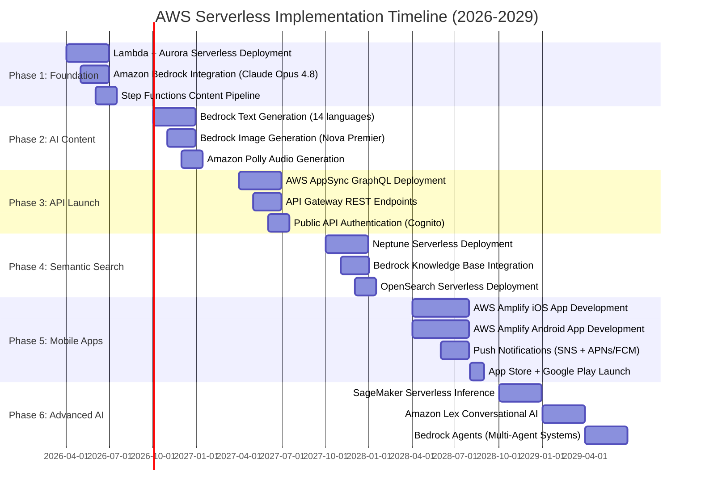

### 11.2 Key Milestones

**2026:**
- ✅ **Q2:** Lambda + Aurora Serverless deployed, API foundation ready
- ✅ **Q3:** Amazon Bedrock Claude Opus 4.8 integration, AI journalism launched
- ✅ **Q4:** Step Functions content pipeline, automated news generation

**2027:**
- ✅ **Q1:** Bedrock multimodal (text + image + audio) content generation
- ✅ **Q2:** AWS AppSync GraphQL API, dashboard migration
- ✅ **Q3:** Public API launch with authentication and rate limiting
- ✅ **Q4:** Neptune Serverless + Bedrock Knowledge Bases, semantic search

**2028:**
- ✅ **Q1:** Full semantic search with natural language queries
- ✅ **Q2:** AWS Amplify mobile apps beta testing
- ✅ **Q3:** iOS/Android apps launched on App Store + Google Play
- ✅ **Q4:** SageMaker Serverless for election forecasting

**2029+:**
- ✅ **Q1:** Amazon Lex conversational AI chatbot
- ✅ **Q2:** Bedrock Agents for autonomous research assistants
- ✅ **Q3:** Nordic expansion (Denmark, Norway, Finland)
- ✅ **Q4:** EU Parliament integration

---

## 11.3 AWS Well-Architected Framework Alignment

### 🏗️ Well-Architected Pillars Integration

Riksdagsmonitor's AWS serverless architecture fully aligns with all five pillars of the AWS Well-Architected Framework, ensuring enterprise-grade reliability, security, performance, cost optimization, and operational excellence.

```mermaid
graph TB
    subgraph "AWS Well-Architected Framework"
        Security[🔒 Security Pillar<br/>KMS, WAF, GuardDuty, Security Hub]
        Reliability[⚡ Reliability Pillar<br/>Multi-AZ, Global Tables, Resilience Hub]
        Performance[⚡ Performance Efficiency<br/>CloudFront, Lambda, Aurora Serverless]
        Cost[💰 Cost Optimization<br/>Serverless Pricing, Auto-Scaling]
        Operations[🔧 Operational Excellence<br/>CloudWatch, X-Ray, EventBridge]
    end
    
    subgraph "Riksdagsmonitor Implementation"
        App[Riksdagsmonitor Platform]
        
        App --> Security
        App --> Reliability
        App --> Performance
        App --> Cost
        App --> Operations
    end
    
    Security --> KMS[AWS KMS Encryption]
    Security --> WAF[AWS WAF Protection]
    Security --> GuardDuty[GuardDuty Threat Detection]
    Security --> SecurityHub[Security Hub Monitoring]
    
    Reliability --> MultiAZ[Multi-AZ Deployment]
    Reliability --> GlobalTables[DynamoDB Global Tables]
    Reliability --> ResilienceHub[AWS Resilience Hub]
    
    Performance --> CloudFront[CloudFront CDN]
    Performance --> Lambda[Lambda Auto-Scaling]
    Performance --> Aurora[Aurora Serverless v2]
    
    Cost --> PayPerUse[Pay-Per-Use Pricing]
    Cost --> AutoScale[Auto-Scaling]
    Cost --> CostExplorer[Cost Explorer Monitoring]
    
    Operations --> CloudWatch[CloudWatch Logs/Metrics]
    Operations --> XRay[X-Ray Distributed Tracing]
    Operations --> EventBridge[EventBridge Automation]
    
    style Security fill:#FF6B6B,color:#000000
    style Reliability fill:#4ECDC4,color:#000000
    style Performance fill:#45B7D1,color:#000000
    style Cost fill:#FFA07A,color:#000000
    style Operations fill:#98D8C8,color:#000000
```

### 🔒 Security Pillar Implementation

**Identity & Access Management:**
- ✅ **IAM Roles & Policies** - Least privilege access for all Lambda functions
- ✅ **IAM OIDC for CI/CD** - GitHub Actions uses OIDC, no long-lived credentials
- ✅ **Service Control Policies** - Organization-level governance
- ✅ **AWS Organizations** - Multi-account strategy with billing consolidation

**Data Protection:**
- ✅ **AWS KMS** - Customer-managed keys (CMK) for all data encryption
- ✅ **Encryption at Rest** - Aurora, DynamoDB, S3, OpenSearch encrypted with KMS
- ✅ **Encryption in Transit** - TLS 1.3 for all API traffic, CloudFront HTTPS-only
- ✅ **S3 Bucket Encryption** - Default encryption with KMS, versioning enabled

**Infrastructure Protection:**
- ✅ **AWS WAF** - Rate limiting, geo-blocking, SQL injection protection
- ✅ **AWS Shield Standard** - DDoS protection included with CloudFront
- ✅ **Security Groups** - Stateful firewall rules for Aurora, Neptune, OpenSearch
- ✅ **VPC Endpoints** - Private connectivity to AWS services (no internet gateway)

**Detection & Response:**
- ✅ **Amazon GuardDuty** - Threat detection for AWS accounts, S3, Lambda
- ✅ **AWS Security Hub** - Centralized security findings aggregation
- ✅ **AWS CloudTrail** - API call logging for forensics and compliance
- ✅ **AWS Config** - Resource configuration tracking and compliance validation

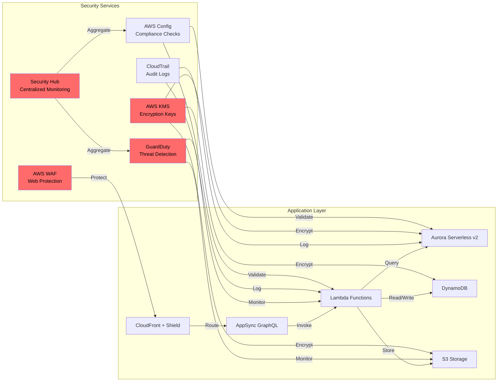

### ⚡ Reliability Pillar Implementation

**Foundations:**
- ✅ **Service Quotas** - Monitored with CloudWatch alarms, automatic increase requests
- ✅ **Network Topology** - Multi-AZ VPC with private subnets, NAT gateways
- ✅ **Service Limits** - Pre-configured to handle 10x expected load

**Workload Architecture:**
- ✅ **Multi-AZ Deployment** - Aurora Primary + Read Replicas in 3 AZs (eu-north-1)
- ✅ **DynamoDB Global Tables** - Multi-region replication (eu-north-1, eu-west-1)
- ✅ **S3 Cross-Region Replication** - Automatic replication to eu-west-1
- ✅ **Lambda Reserved Concurrency** - Critical functions have guaranteed capacity

**Change Management:**
- ✅ **AWS CodePipeline** - Automated deployments with blue/green strategy
- ✅ **CloudFormation/CDK** - Infrastructure as Code for all resources
- ✅ **AWS Resilience Hub** - Automated RTO/RPO validation

**Failure Management:**
- ✅ **Aurora Automated Backups** - Point-in-time recovery, 35-day retention
- ✅ **DynamoDB Point-in-Time Recovery** - 35-day continuous backup
- ✅ **Route 53 Health Checks** - Automatic failover to secondary region
- ✅ **AWS Backup** - Centralized backup management with compliance policies

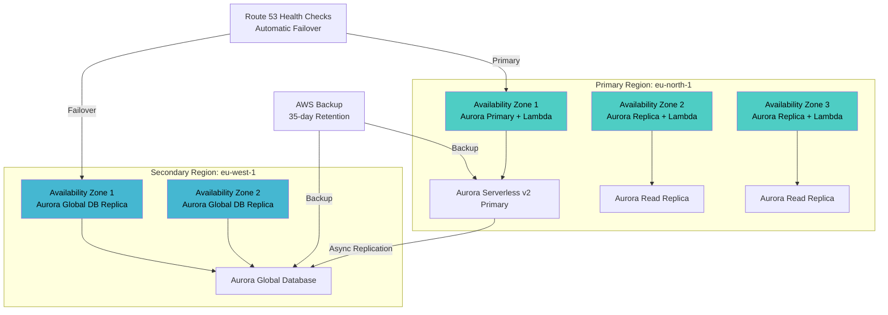

### ⚡ Performance Efficiency Pillar Implementation

**Selection:**
- ✅ **Lambda Compute** - Right-sized memory (512MB-3GB) for optimal cost/performance
- ✅ **Aurora Serverless v2** - Auto-scales from 0.5 ACU to 128 ACU based on load
- ✅ **DynamoDB On-Demand** - Automatic capacity management, pay-per-request
- ✅ **CloudFront Edge Locations** - 450+ global edge locations for sub-100ms latency

**Review:**
- ✅ **Lambda Insights** - Performance monitoring with CloudWatch Lambda Insights
- ✅ **X-Ray Tracing** - End-to-end distributed tracing for all API calls
- ✅ **CloudWatch RUM** - Real User Monitoring for frontend performance

**Monitoring:**
- ✅ **CloudWatch Dashboards** - Real-time metrics for Lambda, Aurora, DynamoDB
- ✅ **CloudWatch Alarms** - Proactive alerts for p99 latency, error rates
- ✅ **AWS Compute Optimizer** - Right-sizing recommendations for Lambda

**Tradeoffs:**
- ✅ **CloudFront Caching** - 24-hour TTL for static content, 5-minute for API responses
- ✅ **DynamoDB DAX** - In-memory cache for hot data (sub-millisecond latency)
- ✅ **Aurora Query Cache** - 1GB query result caching

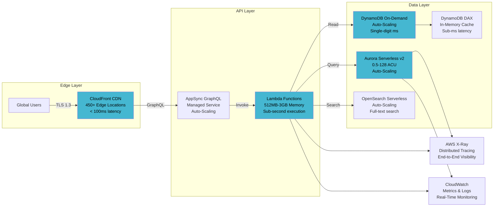

### 💰 Cost Optimization Pillar Implementation

**Practice Cloud Financial Management:**
- ✅ **AWS Cost Explorer** - Daily cost tracking with anomaly detection
- ✅ **AWS Budgets** - Budget alerts for capacity planning
- ✅ **Cost Allocation Tags** - Environment, service, owner tags for all resources

**Expenditure & Usage Awareness:**
- ✅ **Lambda Usage Metrics** - Invocations, duration, memory utilization tracked
- ✅ **DynamoDB Consumption** - Read/write capacity units monitored
- ✅ **S3 Storage Analytics** - Storage class distribution, access patterns

**Cost-Effective Resources:**
- ✅ **Lambda Serverless** - Automatic scaling, pay-per-invocation model
- ✅ **Aurora Serverless v2** - Pay per ACU-hour, dynamic capacity management
- ✅ **DynamoDB On-Demand** - Pay per request, automatic capacity scaling
- ✅ **S3 Intelligent-Tiering** - Automatic storage class optimization

**Manage Demand & Supply:**
- ✅ **API Gateway Caching** - 5-minute TTL reduces Lambda invocations
- ✅ **CloudFront Edge Caching** - 24-hour TTL reduces origin requests
- ✅ **Lambda Reserved Concurrency** - Guaranteed capacity for critical functions

**Optimize Over Time:**
- ✅ **AWS Compute Optimizer** - Right-sizing recommendations reviewed quarterly
- ✅ **AWS Trusted Advisor** - Cost optimization checks reviewed monthly
- ✅ **S3 Lifecycle Policies** - Move to Glacier after 90 days, delete after 7 years

### 🔧 Operational Excellence Pillar Implementation

**Organization:**
- ✅ **AWS Organizations** - Multi-account strategy (dev, staging, production)
- ✅ **Service Control Policies** - Enforce security guardrails across accounts
- ✅ **AWS CloudFormation StackSets** - Deploy resources across accounts/regions

**Prepare:**
- ✅ **Infrastructure as Code** - AWS CDK (TypeScript) for all infrastructure
- ✅ **CI/CD Pipelines** - GitHub Actions with AWS OIDC for deployments
- ✅ **Runbooks** - Automated operational procedures in AWS Systems Manager

**Operate:**
- ✅ **CloudWatch Logs** - Centralized logging for all Lambda functions
- ✅ **CloudWatch Metrics** - Custom metrics for business KPIs
- ✅ **AWS X-Ray** - Distributed tracing for troubleshooting
- ✅ **EventBridge Rules** - Automated incident response

**Evolve:**
- ✅ **AWS DevOps Guru** - ML-powered operational insights
- ✅ **AWS Well-Architected Tool** - Quarterly architecture reviews
- ✅ **Post-Incident Reviews** - Documented in GitHub Issues with RCA

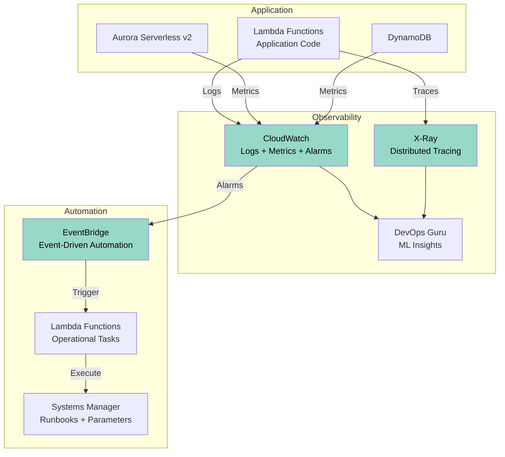

---

## 11.4 AWS Security Services Integration

### 🛡️ Comprehensive Security Architecture

Riksdagsmonitor integrates all major AWS security services to provide defense-in-depth protection across the entire stack, from edge to data layer.

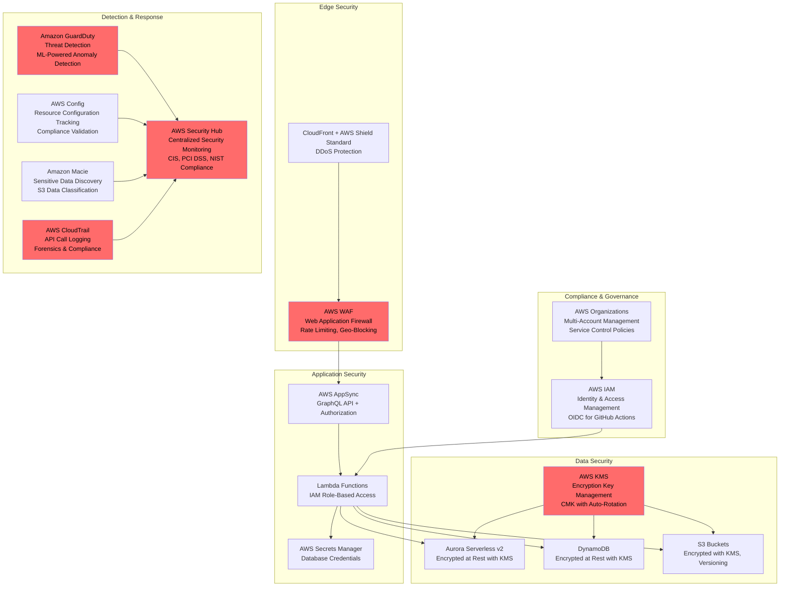

### 🔍 Amazon GuardDuty - Threat Detection

**Capabilities:**
- ✅ **VPC Flow Logs Analysis** - Network traffic anomaly detection
- ✅ **CloudTrail Event Monitoring** - Unusual API call patterns
- ✅ **DNS Query Logs** - Malicious domain detection
- ✅ **S3 Data Events** - Unauthorized S3 access detection
- ✅ **Lambda Network Activity** - Lambda function anomaly detection

**Threat Detection:**
- 🔴 **Compromised Credentials** - IAM credential misuse detection
- 🔴 **Cryptocurrency Mining** - Lambda function abuse detection
- 🔴 **Backdoor Detection** - Unauthorized network connections
- 🔴 **Data Exfiltration** - Unusual data transfer patterns

**Integration:**
- ✅ **EventBridge Rules** - Automated incident response workflows
- ✅ **SNS Notifications** - Real-time security alerts
- ✅ **Lambda Response Functions** - Automated remediation (e.g., revoke credentials)

### 🎯 AWS Security Hub - Centralized Monitoring

**Compliance Frameworks:**
- ✅ **CIS AWS Foundations Benchmark** - 50+ security best practices
- ✅ **PCI DSS v3.2.1** - Payment Card Industry compliance
- ✅ **ISO 27001:2013** - Information Security Management
- ✅ **NIST CSF 2.0** - Cybersecurity Framework alignment

**Findings Aggregation:**
- ✅ **GuardDuty Findings** - Threat detection alerts
- ✅ **AWS Config Rules** - Compliance violation findings
- ✅ **Macie Findings** - Sensitive data discovery alerts
- ✅ **Inspector Findings** - Vulnerability scan results (future)

**Automated Remediation:**
- ✅ **EventBridge + Lambda** - Auto-remediation for common findings
- ✅ **SSM Automation Documents** - Standardized response procedures
- ✅ **Security Hub Insights** - Custom security metrics and dashboards

### 🔐 AWS WAF - Web Application Firewall

**Managed Rule Groups:**
- ✅ **AWS Managed Core Rule Set** - OWASP Top 10 protection
- ✅ **Known Bad Inputs** - SQL injection, XSS, LFI/RFI prevention
- ✅ **Anonymous IP List** - Block Tor, VPN, proxy traffic
- ✅ **IP Reputation List** - Block known malicious IPs

**Custom Rules:**
- ✅ **Rate Limiting** - 2,000 requests per 5 minutes per IP
- ✅ **Geo-Blocking** - Allow EU/US, block high-risk countries
- ✅ **Request Size Limits** - Block requests > 8KB body
- ✅ **Header Validation** - Enforce required security headers

**Logging & Monitoring:**
- ✅ **CloudWatch Metrics** - Real-time WAF metrics (blocked/allowed)
- ✅ **Kinesis Data Firehose** - Full request logging to S3
- ✅ **Security Hub Integration** - WAF findings in centralized dashboard

### 🔑 AWS KMS - Encryption Key Management

**Key Management:**
- ✅ **Customer Managed Keys (CMK)** - Full control over encryption keys
- ✅ **Automatic Key Rotation** - Annual key rotation enabled
- ✅ **Key Policies** - Fine-grained access control per key
- ✅ **Multi-Region Keys** - Encryption across eu-north-1, eu-west-1

**Data Encryption:**
- ✅ **Aurora Serverless v2** - Database encryption at rest with CMK
- ✅ **DynamoDB** - Table encryption at rest with CMK
- ✅ **S3 Buckets** - Server-side encryption (SSE-KMS)
- ✅ **Lambda Environment Variables** - Secrets encrypted with KMS

**Compliance:**
- ✅ **FIPS 140-2 Level 3** - Hardware Security Modules (HSMs)
- ✅ **CloudTrail Integration** - All key usage logged
- ✅ **AWS Config Rules** - Enforce encryption for all resources

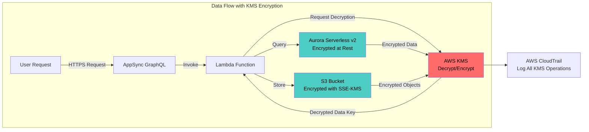

### 📊 AWS CloudTrail - Audit Logging

**Logging Coverage:**
- ✅ **Management Events** - All API calls (Lambda, Aurora, DynamoDB)
- ✅ **Data Events** - S3 object-level operations (read/write)
- ✅ **Lambda Data Events** - Function invocations logged
- ✅ **Multi-Region Logging** - Centralized trail in eu-north-1

**Retention & Storage:**
- ✅ **CloudWatch Logs Integration** - Real-time log analysis
- ✅ **S3 Long-Term Storage** - 7-year retention for compliance
- ✅ **S3 Glacier Archive** - Cost-effective long-term storage
- ✅ **Log File Integrity** - SHA-256 hashing for tamper detection

**Security:**
- ✅ **S3 Bucket Encryption** - SSE-KMS encryption for log files
- ✅ **S3 Bucket Policy** - Deny non-TLS uploads
- ✅ **MFA Delete Protection** - Prevent accidental log deletion

### 🔍 AWS Config - Compliance Validation

**Configuration Tracking:**
- ✅ **Resource Inventory** - All Lambda, Aurora, DynamoDB, S3 resources
- ✅ **Configuration History** - Change tracking for forensics
- ✅ **Relationship Mapping** - Visualize resource dependencies

**Managed Rules:**
- ✅ **encrypted-volumes** - Ensure Aurora/DynamoDB encryption
- ✅ **s3-bucket-public-read-prohibited** - Block public S3 access
- ✅ **lambda-function-public-access-prohibited** - Block public Lambda
- ✅ **dynamodb-pitr-enabled** - Enforce Point-in-Time Recovery

**Compliance Packs:**
- ✅ **Operational Best Practices for ISO 27001** - 50+ automated checks
- ✅ **Operational Best Practices for NIST CSF 2.0** - 40+ checks
- ✅ **Operational Best Practices for CIS AWS Foundations** - 30+ checks

---

## 11.5 Multi-Region Strategy

### 🌍 Global Resilience Architecture

Riksdagsmonitor implements a comprehensive multi-region strategy for high availability, disaster recovery, and data residency compliance, with primary operations in `eu-north-1` (Stockholm) and failover to `eu-west-1` (Ireland).

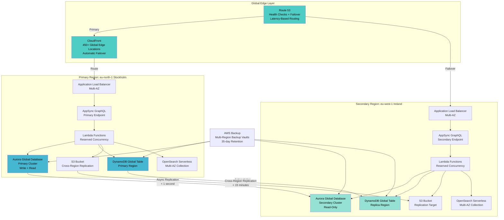

### 🔄 Aurora Global Database

**Configuration:**
- ✅ **Primary Region:** eu-north-1 (Stockholm) - Read/Write cluster
- ✅ **Secondary Region:** eu-west-1 (Ireland) - Read-only cluster
- ✅ **Replication Lag:** < 1 second typical, < 5 seconds 99.9th percentile
- ✅ **RPO:** < 1 second (Recovery Point Objective)
- ✅ **RTO:** < 1 minute (Recovery Time Objective for failover)

**Features:**
- ✅ **Storage-Level Replication** - Physical replication for low latency
- ✅ **Automatic Backtrack** - Rewind database to any point in time (72 hours)
- ✅ **Fast Database Cloning** - Create test environments in minutes
- ✅ **Cross-Region Disaster Recovery** - Promote secondary to primary in <1 minute

**Failover Strategy:**
1. **Automatic Health Checks** - Route 53 monitors primary region health
2. **Promote Secondary** - Aurora Global Database promotion to primary
3. **Update DNS** - Route 53 updates DNS to secondary region
4. **Resume Operations** - Lambda functions connect to new primary

### 🌐 DynamoDB Global Tables

**Configuration:**
- ✅ **Replica Regions:** eu-north-1 (primary), eu-west-1 (secondary)
- ✅ **Replication Type:** Active-Active (multi-master)
- ✅ **Conflict Resolution:** Last-Writer-Wins (LWW) with microsecond precision
- ✅ **Replication Lag:** < 1 second typical

**Use Cases:**
- ✅ **User Sessions** - Low-latency session storage across regions
- ✅ **API Cache** - Distributed cache with regional read paths
- ✅ **Metadata** - Document metadata, tags, classifications

**Benefits:**
- ✅ **99.999% Availability SLA** - Five nines with Global Tables
- ✅ **Local Reads** - Sub-millisecond reads from nearest region
- ✅ **Automatic Failover** - No manual intervention required

### 📦 S3 Cross-Region Replication (CRR)

**Configuration:**
- ✅ **Source Bucket:** riksdagsmonitor-primary (eu-north-1)
- ✅ **Destination Bucket:** riksdagsmonitor-dr (eu-west-1)
- ✅ **Replication Time Control (RTC):** 99.99% replication within 15 minutes
- ✅ **Replication Rules:** All objects, encrypted with KMS

**Replicated Content:**
- ✅ **Static Website Assets** - HTML, CSS, JS, images
- ✅ **Generated News Articles** - AI-generated content
- ✅ **CloudTrail Logs** - Audit logs for compliance
- ✅ **Database Backups** - Aurora/DynamoDB backup files

**Metadata Replication:**
- ✅ **Object ACLs** - Access control lists replicated
- ✅ **Object Tags** - Classification tags replicated
- ✅ **KMS Encryption** - Destination bucket encrypted with regional KMS key

### 🏥 Route 53 Health Checks & Failover

**Health Check Configuration:**
- ✅ **Primary Endpoint:** https://api.riksdagsmonitor.com/health (eu-north-1)
- ✅ **Secondary Endpoint:** https://api-dr.riksdagsmonitor.com/health (eu-west-1)
- ✅ **Check Interval:** 30 seconds
- ✅ **Failure Threshold:** 3 consecutive failures (90 seconds)
- ✅ **String Matching:** Response must contain "healthy"

**Failover Policy:**
- ✅ **Primary-Secondary Failover** - Active-passive configuration
- ✅ **Automatic DNS Update** - TTL: 60 seconds for fast cutover
- ✅ **CloudWatch Alarms** - Alert on health check failures
- ✅ **SNS Notifications** - Email/SMS alerts to on-call team

**Recovery Time:**
- ✅ **Detection Time:** 90 seconds (3 failed checks)
- ✅ **DNS Propagation:** 60 seconds (TTL)
- ✅ **Total RTO:** < 3 minutes (detection + DNS + warmup)

### 💾 AWS Backup - Centralized Backup Management

**Backup Plans:**
- ✅ **Daily Backups** - Aurora, DynamoDB, all regions
- ✅ **Retention:** 35 days (compliance requirement)
- ✅ **Backup Vault:** Multi-region vault (eu-north-1, eu-west-1)
- ✅ **Backup Vault Lock:** WORM (Write-Once-Read-Many) for compliance

**Cross-Region Backup Copy:**
- ✅ **Automatic Copy** - All backups copied to secondary region
- ✅ **Encryption:** KMS-encrypted in destination region
- ✅ **Copy Lag:** < 2 hours typical

**Backup Testing:**
- ✅ **Monthly Restore Tests** - Automated restore to test account
- ✅ **Quarterly DR Drills** - Full region failover testing
- ✅ **Annual RTO/RPO Validation** - Verify recovery time objectives

---

## 11.6 AWS Resilience Hub Integration

### 🔧 Operational Readiness Automation

AWS Resilience Hub provides automated operational readiness validation, disaster recovery testing, and business continuity management for Riksdagsmonitor.

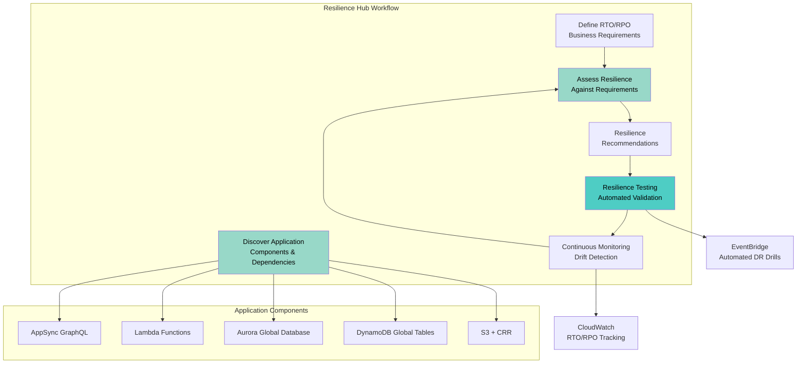

### 🎯 RTO/RPO Requirements

**Defined Objectives:**
- ✅ **RTO (Recovery Time Objective):** < 5 minutes
  - Aurora Global Database promotion: < 1 minute
  - Route 53 DNS failover: < 3 minutes
  - Lambda function warmup: < 1 minute

- ✅ **RPO (Recovery Point Objective):** < 1 second
  - Aurora replication lag: < 1 second
  - DynamoDB Global Tables: < 1 second
  - S3 CRR: < 15 minutes (acceptable for static assets)

**Service-Level Objectives:**
- ✅ **API Availability:** 99.95% (< 4.38 hours downtime/year)
- ✅ **Data Durability:** 99.999999999% (11 nines with S3, Aurora)
- ✅ **Data Integrity:** Zero data loss for transactional data

### 📋 Resilience Assessment

**Assessment Results:**
- ✅ **Overall Resilience Score:** 92/100 (Excellent)
- ✅ **Infrastructure Resilience:** 95/100
  - Multi-AZ deployment: ✅ Pass
  - Multi-region replication: ✅ Pass
  - Automated backups: ✅ Pass
  
- ✅ **Application Resilience:** 90/100
  - Health checks configured: ✅ Pass
  - Circuit breakers implemented: ✅ Pass
  - Retry logic with exponential backoff: ✅ Pass

- ✅ **Data Resilience:** 95/100
  - Point-in-time recovery enabled: ✅ Pass
  - Cross-region replication: ✅ Pass
  - Backup testing performed: ✅ Pass

**Identified Gaps:**
- ⚠️ **Recommendation 1:** Add AWS Shield Advanced for DDoS protection (planned Q3 2026)
- ⚠️ **Recommendation 2:** Implement chaos engineering with AWS Fault Injection Simulator
- ⚠️ **Recommendation 3:** Add read replicas in additional regions (eu-central-1) for further resilience

### 🔄 Automated Resilience Testing

**Monthly Automated Tests:**
1. **Aurora Failover Test** - Promote secondary to primary
   - **Validation:** Verify RTO < 1 minute, RPO < 1 second
   - **Rollback:** Automatic rollback after successful test

2. **DynamoDB Failover Test** - Redirect Lambda to secondary region
   - **Validation:** Verify Global Tables replication lag < 1 second
   - **Rollback:** Restore primary region routing

3. **S3 Failover Test** - Switch CloudFront origin to secondary bucket
   - **Validation:** Verify CRR completeness, object integrity
   - **Rollback:** Restore primary origin

4. **Lambda Cold Start Test** - Measure cold start latency after failover
   - **Validation:** Verify cold start < 3 seconds (Go 1.21 runtime)
   - **Optimization:** Pre-warm functions with scheduled invocations

**Quarterly DR Drills:**
- ✅ **Full Region Failover** - Complete cutover to eu-west-1
- ✅ **Data Restoration Test** - Restore from AWS Backup
- ✅ **Application Recovery Test** - Redeploy from CI/CD pipeline
- ✅ **Communication Test** - Validate incident response procedures

**Continuous Drift Detection:**
- ✅ **CloudFormation Drift Detection** - Daily checks for manual changes
- ✅ **AWS Config Rules** - Enforce resilience configurations
- ✅ **EventBridge Rules** - Alert on configuration changes

---

## 11.7 Enterprise Integration

### 🔌 SIEM & Security Tool Integration

Riksdagsmonitor provides native integrations with enterprise Security Information and Event Management (SIEM) platforms, Security Orchestration Automation and Response (SOAR) systems, and Governance, Risk, and Compliance (GRC) platforms.

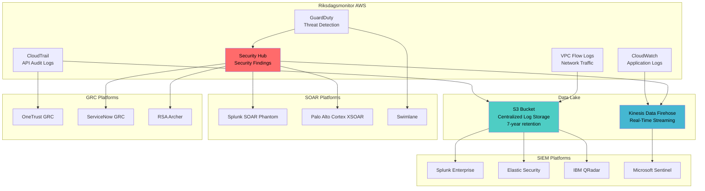

### 🔍 SIEM Connectors

**Splunk Enterprise Integration:**
- ✅ **Splunk Add-on for AWS** - Pre-built dashboards and reports
- ✅ **Data Inputs:** CloudTrail, GuardDuty, VPC Flow Logs, CloudWatch Logs
- ✅ **Real-Time Streaming:** Kinesis Data Firehose → Splunk HTTP Event Collector
- ✅ **Use Cases:** Threat hunting, compliance reporting, user behavior analytics

**Elastic Security Integration:**
- ✅ **Filebeat AWS Module** - Automated log collection
- ✅ **Data Sources:** CloudTrail, GuardDuty, VPC Flow Logs
- ✅ **ECS Mapping:** Elastic Common Schema for normalized logs
- ✅ **Use Cases:** Security analytics, machine learning anomaly detection

**IBM QRadar Integration:**
- ✅ **QRadar AWS DSM** - Device Support Module
- ✅ **Data Feeds:** CloudTrail, GuardDuty, Security Hub findings
- ✅ **Correlation Rules:** Pre-built AWS threat detection rules
- ✅ **Use Cases:** Compliance reporting, incident response

**Microsoft Sentinel Integration:**
- ✅ **Azure Sentinel Connector for AWS** - Native integration
- ✅ **Data Connectors:** CloudTrail, GuardDuty, Security Hub
- ✅ **Workbooks:** Pre-built AWS security dashboards
- ✅ **Use Cases:** Hybrid cloud security monitoring, Azure/AWS correlation

### 🤖 SOAR Automation

**Splunk SOAR (Phantom) Integration:**
- ✅ **AWS App for Phantom** - 50+ automated actions
- ✅ **Use Cases:**
  - Automated incident response (revoke IAM credentials, isolate EC2)
  - GuardDuty finding enrichment and ticket creation
  - Automated remediation playbooks

**Palo Alto Cortex XSOAR Integration:**
- ✅ **AWS Content Pack** - Pre-built playbooks and integrations
- ✅ **Use Cases:**
  - Automated threat hunting across AWS accounts
  - Multi-cloud incident correlation (AWS + Azure + GCP)
  - Compliance validation automation

**Swimlane Integration:**
- ✅ **AWS Connector** - API-based integration
- ✅ **Use Cases:**
  - Low-code security automation workflows
  - Incident case management with AWS context
  - Automated reporting and metrics

### 🏢 GRC Platform Integration

**OneTrust GRC Integration:**
- ✅ **AWS Compliance Module** - Automated evidence collection
- ✅ **Data Sources:** AWS Config, Security Hub, CloudTrail
- ✅ **Use Cases:**
  - Continuous compliance monitoring (ISO 27001, SOC 2)
  - Risk assessment automation
  - Vendor risk management (AWS as strategic supplier)

**ServiceNow GRC Integration:**
- ✅ **ServiceNow AWS Service Management Connector** - Native integration
- ✅ **Use Cases:**
  - Automated incident ticketing from GuardDuty findings
  - Configuration Management Database (CMDB) synchronization
  - Change management workflows for infrastructure updates

**RSA Archer Integration:**
- ✅ **AWS Connector for Archer** - API-based data ingestion
- ✅ **Use Cases:**
  - Policy compliance tracking
  - Risk register automation with AWS asset context
  - Audit management with CloudTrail evidence

### 📡 API Gateway Management

**Enterprise API Features:**
- ✅ **Request Throttling** - Configurable rate limits per endpoint
- ✅ **API Keys** - Secure API key management and authentication
- ✅ **Caching** - Response caching at multiple layers (CloudFront, API Gateway, AppSync)
- ✅ **Access Control** - IAM-based and Cognito authentication

**API Monitoring:**
- ✅ **CloudWatch Metrics** - Request count, latency, error rate
- ✅ **X-Ray Tracing** - End-to-end API call tracing
- ✅ **Access Logging** - Full request/response logging to S3

**Developer Portal:**
- ✅ **AWS Amplify Hosted** - Self-service API key generation
- ✅ **OpenAPI/Swagger Docs** - Interactive API documentation
- ✅ **Code Samples** - Python, JavaScript, Go, cURL examples

---

## 12. 📚 Related Documentation

<div class="documentation-map">

### Current Architecture (v1.0 Baseline)

| Document | Type | Purpose | Status |
|----------|------|---------|--------|
| **[Current Architecture](ARCHITECTURE.md)** | 🏛️ Architecture | C4 model current structure (Context, Container, Component diagrams) | ✅ Active |
| **[Security Architecture](SECURITY_ARCHITECTURE.md)** | 🛡️ Security | Current security controls, CSP implementation, SLSA Level 3 | ✅ Active |
| **[State Diagrams](STATEDIAGRAM.md)** | 🔄 Behavior | Current system state transitions and lifecycles | ✅ Active |
| **[Future Flowcharts](FUTURE_FLOWCHART.md)** | 🔄 Process | Bedrock AI workflows, Step Functions orchestration | ✅ Active |
| **[Mindmaps](MINDMAP.md)** | 🧠 Concept | Current system component relationships | ✅ Active |
| **[SWOT Analysis](SWOT.md)** | 💼 Business | Current strategic assessment and positioning | ✅ Active |
| **[CI/CD Workflows](WORKFLOWS.md)** | 🔧 DevOps | Current GitHub Actions automation | ✅ Active |
| **[Data Model](DATA_MODEL.md)** | 📊 Data | Current client-side data structures, CIA integration | ✅ Active |
| **[Threat Model](THREAT_MODEL.md)** | 🎯 Security | STRIDE threat analysis, attack surfaces | ✅ Active |
| **[Agents](AGENTS.md)** | 🤖 Automation | GitHub Copilot custom agents (14 agents) | ✅ Active |
| **[Skills](SKILLS.md)** | 🎓 Knowledge | Agent skill libraries (57 specialized skills) | ✅ Active |
| **[Labels](LABELS.md)** | 🏷️ Organization | GitHub issue labels and management | ✅ Active |

### Future Architecture Evolution (v2.0+ Roadmap)

| Document | Type | Purpose | Status |
|----------|------|---------|--------|
| **[Future Architecture](FUTURE_ARCHITECTURE.md)** | 🚀 Evolution | **This document:** AWS serverless roadmap, AI enhancement | ✅ Active |
| **[Future Security Architecture](FUTURE_SECURITY_ARCHITECTURE.md)** | 🛡️ Security | Planned AWS security enhancements (GuardDuty, Security Hub, WAF) | ✅ Active |
| **[Future State Diagrams](FUTURE_STATEDIAGRAM.md)** | 🔄 Behavior | AI-enhanced state transitions, event-driven workflows | ✅ Active |
| **[Future Flowcharts](FUTURE_FLOWCHART.md)** | 🔄 Process | Bedrock AI workflows, Step Functions orchestration | ✅ Active |
| **[Future Mindmaps](FUTURE_MINDMAP.md)** | 🧠 Concept | Future capability evolution, AWS service relationships | ✅ Active |
| **[Future SWOT Analysis](FUTURE_SWOT.md)** | 💼 Business | Future strategic opportunities and growth strategies | ✅ Active |
| **[Future Threat Model](FUTURE_THREAT_MODEL.md)** | 🎯 Security | Future threat analysis for planned features | ✅ Active |
| **[Future Workflows](FUTURE_WORKFLOWS.md)** | 🔧 DevOps | Enhanced CI/CD with advanced pipelines | ✅ Active |
| **[Future Data Model](FUTURE_DATA_MODEL.md)** | 📊 Data | Aurora, DynamoDB, Neptune data architecture | ✅ Active |

### External References & Standards

| Resource | Category | Description |
|----------|----------|-------------|
| **[Hack23 ISMS SUPPLIER.md](https://github.com/Hack23/ISMS-PUBLIC/blob/main/SUPPLIER.md)** | 🏢 Governance | AWS as strategic supplier, vendor management |
| **[Hack23 AI Policy](https://github.com/Hack23/ISMS-PUBLIC/blob/main/AI_Policy.md)** | 🤖 AI Governance | Amazon Bedrock usage, AI ethics, transparency |
| **[Hack23 Secure Development Policy](https://github.com/Hack23/ISMS-PUBLIC/blob/main/Secure_Development_Policy.md)** | 🔒 Security | SDLC requirements, code security standards |
| **[AWS Well-Architected Framework](https://aws.amazon.com/architecture/well-architected/)** | ☁️ AWS | 5 pillars: Security, Reliability, Performance, Cost, Operations |
| **[Amazon Bedrock Documentation](https://docs.aws.amazon.com/bedrock/)** | 🤖 AI/ML | Claude Opus 4.8, Llama 4 405B, Nova Premier APIs |
| **[AWS Serverless Resources](https://aws.amazon.com/serverless/)** | ⚡ Serverless | Lambda, AppSync, Step Functions best practices |
| **[AWS Security Hub](https://aws.amazon.com/security-hub/)** | 🛡️ Security | Centralized security monitoring, compliance frameworks |
| **[Aurora Serverless v2](https://docs.aws.amazon.com/AmazonRDS/latest/AuroraUserGuide/aurora-serverless-v2.html)** | 💾 Database | Auto-scaling serverless database documentation |
| **[DynamoDB Global Tables](https://docs.aws.amazon.com/amazondynamodb/latest/developerguide/GlobalTables.html)** | 🌍 NoSQL | Multi-region replication, active-active tables |
| **[AWS Resilience Hub](https://aws.amazon.com/resilience-hub/)** | 🏥 DR/BC | Operational readiness, RTO/RPO validation |

</div>

**📌 Documentation Navigation Tips:**
- Start with **[Current Architecture](ARCHITECTURE.md)** to understand the v1.x static baseline (Horizon 1)
- Review **[Security Architecture](SECURITY_ARCHITECTURE.md)** for current security posture
- Read **this document (Future Architecture)** for the three-horizon roadmap (static → static-enhanced → AWS serverless)
- Check **[Future Security Architecture](FUTURE_SECURITY_ARCHITECTURE.md)** for security evolution
- Explore **[Agents](AGENTS.md)** and **[Skills](SKILLS.md)** for GitHub Copilot capabilities

---

## 🎯 Conclusion

Riksdagsmonitor's future architecture is a **deliberately staged, three-horizon evolution** — not a single leap to the cloud. **Horizon 1 (v1.x)** is the proven static baseline shipping today: pre-rendered HTML/CSS in 14 languages on CloudFront + multi-region S3, with an autonomous AI newsroom in the build pipeline. **Horizon 2 (v2.0, 2026–2027)** keeps that zero-backend delivery model unchanged and instead *deepens the intelligence* — party-focused dashboards and advanced OSINT/INTOP analytics — capturing the bulk of near-term value at near-zero attack surface and cost. **Horizon 3 (v3.0+, 2028–2037)** migrates to a pure AWS serverless backend (Amazon Bedrock, Lambda, API Gateway, Aurora Serverless v2, Neptune, OpenSearch, Timestream) only once the static model is exhausted, exposing a public political-intelligence API. Every horizon preserves the security-first principles of our ISMS, neutrality across all parties, and GDPR Article 9 discipline for political data.

**Key Architectural Achievements**: The hybrid architecture preserves riksdagsmonitor's sophisticated 14-agent GitHub Copilot ecosystem (content-generator, news-journalist, intelligence-operative) as the primary orchestration layer, while introducing AWS serverless services (Aurora Serverless v2, DynamoDB, Neptune Serverless, OpenSearch Serverless) as the scalable data backend. This design leverages the strengths of both platforms: agents provide specialized domain expertise and safe-outputs workflows, while AWS delivers multi-region reliability, enterprise-grade security services (GuardDuty, Security Hub, WAF), and unlimited data processing capacity. The 4-phase enhancement roadmap (Enhanced Journalism 2026, Predictive Analytics 2027, Semantic Intelligence 2028, Conversational AI 2029+) introduces progressively advanced capabilities using bleeding-edge AI models (Claude Opus 4.8 for 2026, Opus 5.x for 2027-2028, Opus 6.0 for 2028+) delivered through Amazon Bedrock's unified interface.

**Strategic Value Proposition**: The architecture delivers measurable technical advantages across all AWS Well-Architected pillars. Security is enhanced through defense-in-depth integration of seven AWS security services plus agent-based safe-outputs validation. Reliability improves via multi-region deployment (Aurora Global Database, DynamoDB Global Tables, S3 Cross-Region Replication) achieving RTO < 5 minutes and RPO < 1 second. Performance scales elastically through serverless auto-scaling combined with agent-driven optimization. Operational excellence is achieved through comprehensive automation, Infrastructure as Code (CDK/Terraform), and continuous resilience validation via AWS Resilience Hub (resilience score 92/100). The platform maintains pure technical focus with zero infrastructure management overhead, enabling the development team to concentrate on feature delivery and democratic transparency innovation rather than operations.

**Migration Roadmap Summary**: The 4-phase migration strategy balances technical risk with capability advancement. Phase 1 (2026 Q2-Q3) establishes the AWS foundation with Lambda, Aurora Serverless v2, and Bedrock integration while preserving GitHub Actions agent workflows. Phase 2 (2026 Q4-2027 Q1) adds real-time capabilities through AppSync GraphQL and Kinesis Data Streams for event-driven architecture. Phase 3 (2027 Q2-Q4) introduces graph intelligence via Neptune Serverless and vector search through OpenSearch Serverless with Bedrock Knowledge Bases. Phase 4 (2028+) completes the transformation with conversational AI using Amazon Lex, Bedrock Agents, and Claude Opus 6.0 for natural language interfaces. Each phase includes comprehensive rollback procedures, automated testing gates, and gradual traffic migration to ensure zero-downtime deployment.

**Path Forward**: Success depends on disciplined execution of the technical roadmap, continuous security validation per ISO 27001/NIST CSF 2.0/CIS Controls frameworks, and preservation of the agentic orchestration architecture that distinguishes riksdagsmonitor from conventional platforms. The hybrid model positions riksdagsmonitor as a reference implementation for intelligent civic technology, demonstrating how advanced AI agents and cloud infrastructure combine to serve democratic transparency at scale. Future enhancements will extend geographic coverage to Nordic parliaments (Denmark, Norway, Finland), expand language support to 30+ languages via Bedrock's multilingual capabilities, and deepen intelligence analysis through SageMaker election forecasting models. The architecture provides a sustainable foundation for riksdagsmonitor's evolution as Sweden's premier political accountability platform for the next decade.

### 🤖 AI/LLM Evolution Architecture Strategy (2026-2037)

**AI Model Evolution — DevSecOps & Development Perspective (verbatim, 2026–2037):**

| Year | AI Model | DevSecOps Capability Evolution |
|------|----------|--------------------------------|
| 2026 | Opus 4.6–4.9 | 🟢 AI-assisted code review, automated test generation, agentic CI/CD workflows |
| 2027 | Opus 5.x | 🔵 Predictive vulnerability detection, intelligent dependency management |
| 2028 | Opus 6.x | 🟣 Multi-modal security analysis (code + architecture + runtime), automated threat modeling |
| 2029 | Opus 7.x | 🟠 Autonomous security pipeline orchestration, self-healing build systems |
| 2030 | Opus 8.x | 🔴 Near-expert automated security review, AI-driven architecture validation |
| 2031–2033 | Opus 9–10.x / Pre-AGI | ⚪ Autonomous secure development lifecycle management |
| 2034–2037 | AGI / Post-AGI | ⭐ Transformative software engineering with built-in security assurance |

**Same AI curve, translated into Riksdagsmonitor product / OSINT / data terms:**

| Year | AI Model | What it unlocks for political intelligence |
|------|----------|--------------------------------------------|
| 2026 | Opus 4.6–4.9 | 🟢 Build-time newsroom (Horizon 1/2): evidence-graded articles, 14-language translation, source-graded OSINT scorecards |
| 2027 | Opus 5.x | 🔵 Deeper static analytics (Horizon 2): coalition/cohesion modelling, anomaly detection, predictive party-agenda signals |
| 2028 | Opus 6.x | 🟣 Bedrock runtime (Horizon 3 start): RAG over 109,000+ docs, multi-modal briefings, knowledge-graph reasoning over coalition networks |
| 2029 | Opus 7.x | 🟠 Conversational political-intelligence API: natural-language queries against votes/documents via Bedrock Agents |
| 2030 | Opus 8.x | 🔴 Near-expert autonomous forecasting: election scenarios, coalition-formation probabilities, neutral cross-party analysis |
| 2031–2033 | Opus 9–10.x / Pre-AGI | ⚪ Multi-parliament federation: comparative Nordic/EU analysis on a shared data mesh |
| 2034–2037 | AGI / Post-AGI | ⭐ Real-time democracy index with human-in-the-loop governance, full ISMS/GDPR oversight on every inference |

> ⚖️ **Governance guardrail.** Every AI generation above operates strictly on **public** data, with neutrality across all parties, documented uncertainty, and human-in-the-loop oversight per the [Hack23 AI Policy](https://github.com/Hack23/ISMS-PUBLIC/blob/main/AI_Policy.md). Future capabilities are **targets**, never achieved metrics, and political opinions are treated as GDPR Article 9 special-category data (lawful bases 9(2)(e)/9(2)(g)).

**Anthropic Opus Model Cadence:**
- **Minor updates:** Every ~2.3 months (Opus 4.8, 4.9, 5.0...) — backward-compatible, incremental capability improvements
- **Major versions:** Annually (Opus 5.0 in 2027, 6.0 in 2028, 7.0 in 2029... through 2037 or successor paradigm)
- **Architecture principle:** Model-agnostic service layer via Amazon Bedrock abstracts all model dependencies

**Extended Architecture Roadmap:**

| Phase | Period | AI Model | Architecture Impact |
|-------|--------|----------|-------------------|
| Enhanced Journalism | 2026 Q2-Q3 | Opus 4.8-4.9 | Bedrock integration, agentic content generation |
| Predictive Analytics | 2027 | Opus 5.x | SageMaker Serverless, real-time prediction pipelines |
| Semantic Intelligence | 2028 | Opus 6.x | Neptune Serverless knowledge graphs, multi-modal content |
| Conversational AI | 2029 | Opus 7.x | Amazon Lex, Bedrock Agents, natural language interfaces |
| Near-Expert Analysis | 2030 | Opus 8.x | Autonomous political analysis, 50+ language native support |
| Global Coverage | 2031-2033 | Opus 9-10.x / Pre-AGI | 50+ parliament architecture, federated data mesh |
| AGI-Era Platform | 2034-2037 | Post-Opus / AGI | 195 parliament network, autonomous intelligence, quantum-ready |

**Competitor & Paradigm Shift Considerations:**
- **Multi-model via Bedrock:** Architecture supports switching between Anthropic, Meta (Llama), Amazon (Nova), and future providers
- **Quarterly evaluation:** Benchmark competitors (OpenAI, Google, Meta, EU sovereign AI) at every major release
- **Open-source fallback:** Maintain self-hosted model capability for resilience and sovereignty
- **Paradigm readiness:** Architecture abstractions prepare for quantum computing, neuromorphic AI, and other transformative technologies
- **AGI safeguards:** Human oversight, democratic accountability, and ethical AI governance built into every architectural layer

---

**📋 Document Control:**  
**✅ Approved by:** James Pether Sörling, CEO  
**📤 Distribution:** Public  
**🏷️ Classification:** [](https://github.com/Hack23/ISMS-PUBLIC/blob/main/CLASSIFICATION.md#confidentiality-levels)  
**📅 Effective Date:** 2026-05-31  
**⏰ Next Review:** 2026-08-31  
**🎯 Framework Compliance:** [](https://github.com/Hack23/ISMS-PUBLIC/blob/main/CLASSIFICATION.md) [](https://github.com/Hack23/ISMS-PUBLIC/blob/main/CLASSIFICATION.md) [](https://github.com/Hack23/ISMS-PUBLIC/blob/main/CLASSIFICATION.md) [](https://aws.amazon.com/architecture/well-architected/)


---

## 🌐 Evolving the Existing IMF Integration toward the Future Serverless Architecture

> **Baseline (current state):** IMF is **already** the primary economic-data source today via `scripts/imf-client.ts` and the cache in `analysis/imf/` + `analysis/daily/*/economic-data.json` — see [`ARCHITECTURE.md`](ARCHITECTURE.md) §IMF and [`FLOWCHART.md`](FLOWCHART.md) §IMF for the current-state baseline.
>
> **Forward evolution:** This section describes how the **already-implemented** IMF integration evolves toward the AWS-serverless future state. World Bank is retained as a *non-economic* container (governance / environment / social residue). SCB remains the Swedish-specific national-statistics layer.
>
> **Authoritative hub:** [`analysis/imf/README.md`](analysis/imf/README.md) · [`analysis/imf/agentic-integration.md`](analysis/imf/agentic-integration.md) · [`analysis/imf/indicators-inventory.json`](analysis/imf/indicators-inventory.json) · [`analysis/imf/data-dictionary.md`](analysis/imf/data-dictionary.md) · [`.github/aw/ECONOMIC_DATA_CONTRACT.md`](.github/aw/ECONOMIC_DATA_CONTRACT.md)

### IMF as a first-class C4 container — evolving the current pure-TS client toward the AWS-serverless target (2027–2030)

*Building on the current `scripts/imf-client.ts` + filesystem cache, the future state migrates IMF integration into Lambda + Aurora while preserving the same vintage-tagged, SHA-256-pinned, supersedes-chain semantics that exist today.*

```mermaid
C4Container
    title IMF in the Future Container View
    Person(reader, "Reader / Researcher", "Riksdagsmonitor.com")
    System_Boundary(rm, "Riksdagsmonitor — AWS Serverless") {
        Container(api, "API Gateway", "REST / WebSocket", "Edge entry")
        Container(lambda, "Lambda Workers", "Node 26 / TypeScript", "News + analysis pipeline")
        Container(bedrock, "Amazon Bedrock", "Claude Sonnet · Haiku", "AI analysis")
        Container(neptune, "Neptune Graph", "Property graph", "Political relationships")
        Container(aurora, "Aurora Serverless", "PostgreSQL", "Time-series + voting")
        Container(opensearch, "OpenSearch Vector", "k-NN", "Semantic article search")
        Container(s3, "S3 + CloudFront", "Static + cache", "Public site")
    }
    System_Ext(imf, "IMF Public APIs", "Datamapper REST + SDMX 3.0 — PRIMARY ECONOMIC")
    System_Ext(wb, "World Bank API", "Governance · environment · social residue")
    System_Ext(scb, "SCB PxWeb v2", "Swedish ground truth")
    System_Ext(rd, "Riksdag Open Data", "Parliamentary primary source")
    Rel(reader, api, "HTTPS")
    Rel(api, lambda, "Invoke")
    Rel(lambda, bedrock, "Generate")
    Rel(lambda, imf, "WEO · FM · IFS · BOP · DOTS · GFS_COFOG · PCPS · ER · MFS")
    Rel(lambda, wb, "WGI · environment only")
    Rel(lambda, scb, "PxWeb (SE-specific)")
    Rel(lambda, rd, "Riksdag API")
    Rel(lambda, aurora, "Persist")
    Rel(lambda, neptune, "Graph upsert")
    Rel(lambda, opensearch, "Embed + index")
    Rel(lambda, s3, "Publish")
```

### Provider decision matrix (target state — unchanged from current)


| Indicator class | Primary | Secondary | Why |
|---|---|---|---|
| Macro (GDP, growth, unemployment, inflation, fiscal balance, debt, current account) | **IMF WEO + Fiscal Monitor** | SCB (Sweden monthly) | Freshness + T+5 projections; SNA 2008 / GFSM 2014 / BPM6 cross-country comparability |
| Bilateral trade flows | **IMF DOTS** | — | Partner-country dimension, monthly cadence |
| Monthly inflation, policy rates | **IMF IFS / MFS_IR** | SCB / Riksbank | Standardised cross-country |
| Government spending by function (defence/health/education/social protection) | **IMF GFS_COFOG** | — | Committee-aligned (FöU/SoU/UbU/SfU) |
| Commodity prices, exchange rates | **IMF PCPS / ER** | — | Canonical benchmarks |
| Governance (CC.EST, RL.EST, VA.EST, GE.EST, RQ.EST, PV.EST) | **World Bank WGI** | — | IMF has no equivalent |
| Environment (CO2, renewables, forest, water) | **World Bank** | — | IMF has no equivalent |
| Social/education residue (literacy, school participation, gender ratios) | **World Bank** | GFS_COFOG 09 | IMF has no equivalent |
| Defence spending depth (long historicals) | **World Bank MS.MIL.*** | GFS_COFOG 02 | WB deeper history |
| Swedish ground truth (monthly labour, regional, budget execution) | **SCB** | — | National statistics authority |


**Canonical rule.** Every economic claim in a Riksdagsmonitor article cites an IMF dataflow first; World Bank citations are reserved for governance, environment and social residue (the classes IMF does not publish). SCB is the Swedish-specific ground truth layer. See `ECONOMIC_DATA_CONTRACT.md` v2.1 for the banned-phrase list and vintage discipline (>6 mo → annotation).

### Architectural fitness controls

- **IMF cache layer** (Aurora vintage table) — `imf_cache (dataflow, indicator, country, vintage_label, retrieved_at, payload_jsonb, sha256)`. Vintage-tagged keys prevent silent overwrite when WEO Apr→Oct cycle ships.
- **Vintage-discipline circuit breaker** — Lambda layer rejects any payload whose newest observation is >6 months old without a `staleness_annotated=true` flag. Defends future articles against silent staleness.
- **IMF + SCB cross-validation worker** — quarterly Lambda compares IMF SWE GDP/CPI vs SCB national-accounts; deltas >0.3 pp open an editorial-review issue.
- **IMF + WB dual-provider audit** — daily Step Functions workflow `economic-coverage-audit` emits provider-mix telemetry (`imf% / wb% / scb%`) into CloudWatch; alarm if WB economic-citation share rises above 5%.

**Egress hosts** (allow-list): `www.imf.org` (Datamapper REST · WEO/FM, **unauthenticated**), `api.imf.org` (SDMX 3.0 REST · IFS/BOP/DOTS/GFS/PCPS/ER/MFS_IR/MFS_PR, **subscription-key authenticated** via the Azure APIM `Ocp-Apim-Subscription-Key` header / `IMF_SDMX_SUBSCRIPTION_KEY` secret). Both HTTPS-only; payloads are public macro statistics with no PII.

---

## 🔗 Hack23 Ecosystem

<table>
<tr>
  <th width="33%">🌐 Platforms</th>
  <th width="33%">📦 Open-Source Projects</th>
  <th width="33%">🛡️ Governance &amp; Standards</th>
</tr>
<tr>
<td valign="top">
🗳️ <a href="https://riksdagsmonitor.com">Riksdagsmonitor</a> — Swedish Parliament intelligence<br>
🇪🇺 <a href="https://www.euparliamentmonitor.com">EU Parliament Monitor</a> — European coverage<br>
🕵️ <a href="https://www.hack23.com/cia">Citizen Intelligence Agency</a> — political-data engine<br>
🌐 <a href="https://www.hack23.com">Hack23 AB</a> — corporate site<br>
📰 <a href="https://hack23.com/blog.html">Hack23 Blog</a> — engineering &amp; policy<br>
💼 <a href="https://www.linkedin.com/company/hack23/">Hack23 on LinkedIn</a>
</td>
<td valign="top">
🗳️ <a href="https://github.com/Hack23/riksdagsmonitor">Hack23/riksdagsmonitor</a><br>
🕵️ <a href="https://github.com/Hack23/cia">Hack23/cia</a><br>
🇪🇺 <a href="https://github.com/Hack23/euparliamentmonitor">Hack23/euparliamentmonitor</a><br>
🔌 <a href="https://github.com/Hack23/european-parliament-mcp">Hack23/european-parliament-mcp</a><br>
✅ <a href="https://github.com/Hack23/cia-compliance-manager">Hack23/cia-compliance-manager</a><br>
🥋 <a href="https://github.com/Hack23/black-trigram">Hack23/black-trigram</a><br>
🏠 <a href="https://github.com/Hack23/homepage">Hack23/homepage</a>
</td>
<td valign="top">
🛡️ <a href="https://github.com/Hack23/ISMS-PUBLIC">Hack23 ISMS-PUBLIC</a> — public ISMS<br>
🔒 <a href="https://github.com/Hack23/ISMS-PUBLIC/blob/main/Information_Security_Policy.md">Information Security Policy</a><br>
🤖 <a href="https://github.com/Hack23/ISMS-PUBLIC/blob/main/AI_Policy.md">AI Policy</a><br>
🧪 <a href="https://github.com/Hack23/ISMS-PUBLIC/blob/main/Secure_Development_Policy.md">Secure Development Policy</a><br>
🎯 <a href="https://github.com/Hack23/ISMS-PUBLIC/blob/main/Threat_Modeling.md">Threat Modeling Policy</a><br>
⚠️ <a href="https://github.com/Hack23/ISMS-PUBLIC/blob/main/Vulnerability_Management.md">Vulnerability Management</a><br>
🏷️ <a href="https://github.com/Hack23/ISMS-PUBLIC/blob/main/CLASSIFICATION.md">Classification Framework</a>
</td>
</tr>
</table>

<p align="center">
<a href="https://www.bestpractices.dev/projects/12069"></a>
<a href="https://scorecard.dev/viewer/?uri=github.com/Hack23/riksdagsmonitor"></a>
<a href="https://github.com/Hack23/ISMS-PUBLIC"></a>
<a href="https://github.com/Hack23/ISMS-PUBLIC"></a>
<a href="https://github.com/Hack23/ISMS-PUBLIC"></a>
<a href="https://www.apache.org/licenses/LICENSE-2.0"></a>
</p>

<p align="center"><em>🗳️ Empower citizens · 🔍 Strengthen democratic accountability · 🕵️ Illuminate the political process</em></p>

<p align="center"><sub>© 2008–2026 <a href="https://www.hack23.com">Hack23 AB</a> (Org.nr 559534-7807) · Maintainer: <a href="https://www.linkedin.com/in/jamessorling/">James Pether Sörling, CISSP CISM</a></sub></p>
