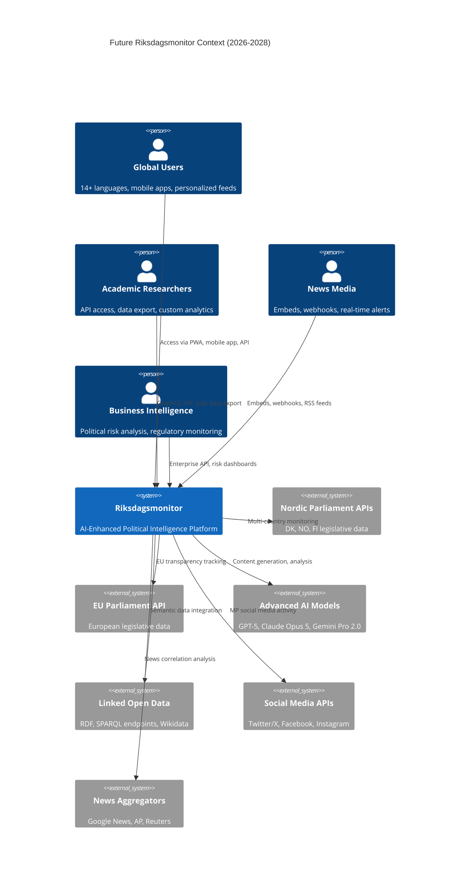
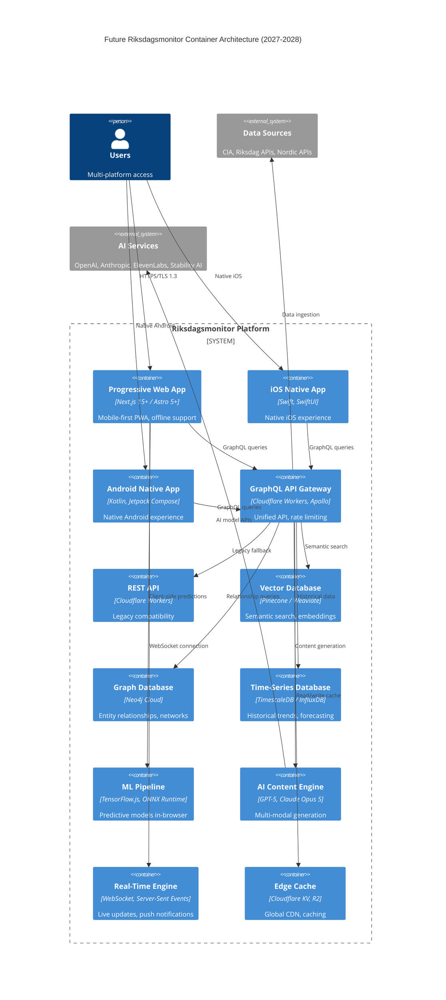
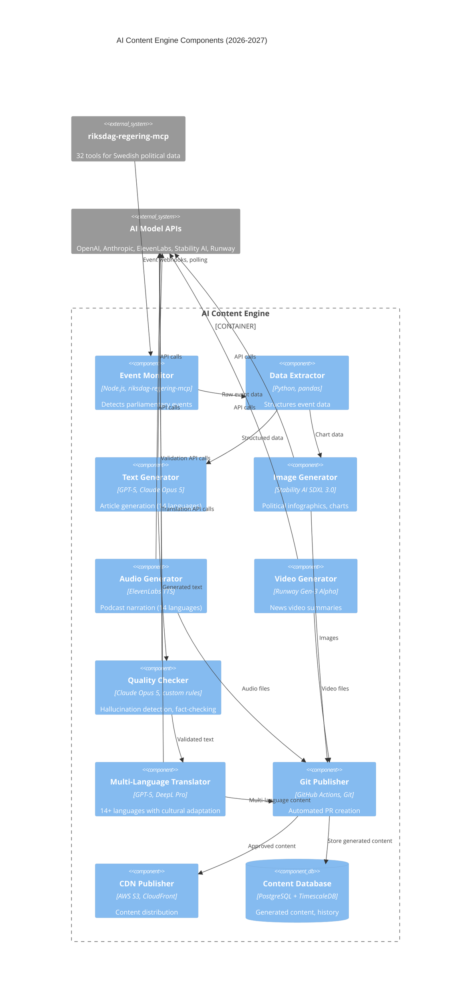
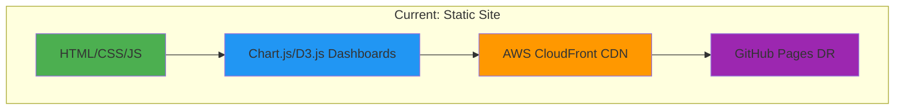
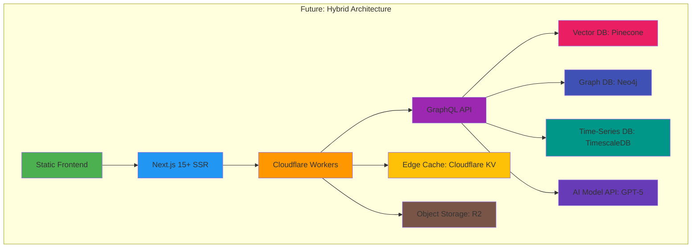
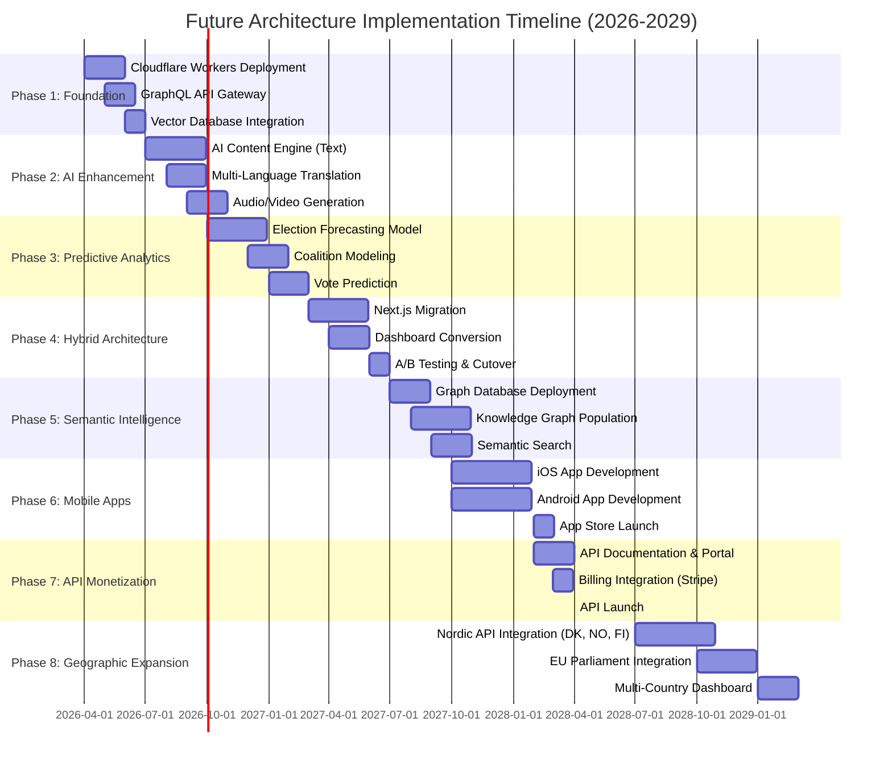

  

<h1 align="center">🚀 Riksdagsmonitor — Future Architecture</h1>

  <strong>🏗️ Evolution Roadmap: From Static Website to AI-Enhanced Political Intelligence Platform</strong> 
  <em>🎯 Multi-Modal AI · Predictive Analytics · Semantic Search · Real-Time Intelligence</em>

  
  
  
  

**📋 Document Owner:** CEO | **📄 Version:** 1.0 | **📅 Last Updated:** 2026-02-15 (UTC)  
**🔄 Review Cycle:** Quarterly | **⏰ Next Review:** 2026-05-15  
**🏢 Owner:** Hack23 AB (Org.nr 5595347807) | **🏷️ Classification:** Public

---

## 🎯 Purpose

> *"At Hack23 AB, we believe that true innovation emerges from transparency and methodical planning. This Future Architecture document openly shares our strategic vision for evolving Riksdagsmonitor from a static Swedish Parliament monitoring website into an advanced AI-enhanced political intelligence platform. By making this roadmap public, we demonstrate our commitment to architectural excellence, realistic planning, and responsible AI development—inviting stakeholders, researchers, and civic tech advocates to understand our journey toward transforming democratic transparency through technology."*
>
> — **James Pether Sörling, CEO, Hack23 AB**

---

## 📊 Executive Summary

This document outlines the comprehensive architectural evolution roadmap for Riksdagsmonitor over the next 3-7 years (2026-2032+). The vision transforms the platform from a static HTML/CSS website with Chart.js/D3.js dashboards into an **AI-enhanced political intelligence platform** while maintaining Hack23 AB's core principles of transparency, security, and democratic accountability.

**Strategic Vision:**
- 🤖 **AI-Enhanced Journalism** - Multi-modal content generation (text, audio, video) across 14+ languages
- 📊 **Predictive Analytics** - Election forecasting, coalition modeling, voting pattern prediction
- 🧠 **Semantic Intelligence** - Knowledge graphs, natural language search, entity relationships
- 🌐 **Geographic Expansion** - Nordic countries (Denmark, Norway, Finland), EU Parliament
- 📱 **Native Mobile Apps** - iOS/Android with offline support and push notifications
- 🔌 **API Monetization** - GraphQL API for researchers, media, and business intelligence

**Key Milestones:**
- **2026 Q2-Q3:** Enhanced journalism with AI-generated articles, podcasts, videos
- **2026 Q4-2027 Q1:** Predictive analytics with election forecasting and coalition modeling
- **2027 Q2-Q4:** Semantic intelligence with knowledge graphs and natural language search
- **2028+:** Conversational AI, voice interfaces, and multi-agent research assistants

**Current State (2026 Q1):**
- ✅ Static HTML/CSS website with 14-language support
- ✅ 5 interactive Chart.js/D3.js dashboards
- ✅ 50+ years of Swedish Parliament data (2,494 politicians, 3.5M+ votes)
- ✅ AWS CloudFront + GitHub Pages dual deployment
- ✅ Comprehensive ISMS documentation (ISO 27001, NIST CSF 2.0, CIS Controls)

---

## 📋 Table of Contents

1. [Current State Baseline](#1-current-state-baseline)
2. [Future C4 Architecture Models](#2-future-c4-architecture-models)
3. [AI Enhancement Roadmap](#3-ai-enhancement-roadmap)
4. [Scalability Improvements](#4-scalability-improvements)
5. [Technical Architecture Evolution](#5-technical-architecture-evolution)
6. [Advanced Features Roadmap](#6-advanced-features-roadmap)
7. [Migration Strategy](#7-migration-strategy)
8. [Cost-Benefit Analysis](#8-cost-benefit-analysis)
9. [Risk Assessment](#9-risk-assessment)
10. [Success Metrics](#10-success-metrics)
11. [Timeline & Milestones](#11-timeline--milestones)
12. [Related Documentation](#12-related-documentation)

---

## 1. 🔍 Current State Baseline

### 1.1 Current Architecture (2026 Q1)

**Technology Stack:**
- **Frontend:** Static HTML5/CSS3, JavaScript (Chart.js 4.4.1, D3.js 7, Papa Parse 5.5.3)
- **Build System:** Vite 7 (ES modules, code splitting)
- **Testing:** Vitest (49 unit tests), Cypress (E2E)
- **Hosting:** AWS CloudFront (primary) + GitHub Pages (disaster recovery)
- **Data Sources:** CIA platform, riksdag-regering-mcp (32 tools), Swedish open data APIs
- **Languages:** 14 languages (EN, SV, DA, NO, FI, DE, FR, ES, NL, AR, HE, JA, KO, ZH)

**Current Capabilities:**
- ✅ 349 current MPs with performance metrics
- ✅ 2,494 historical politicians (1971-2024)
- ✅ 3.5+ million votes analyzed
- ✅ 109,000+ documents processed
- ✅ 5 interactive dashboards (seasonal patterns, politician rankings, pre-election monitoring, party performance, anomaly detection)
- ✅ Real-time statistics from CIA production database (daily updates)

**Architecture Strengths:**
- 🟢 **Low infrastructure cost** - Static hosting on CloudFront + GitHub Pages
- 🟢 **High availability** - 99.998% design availability (underpinned by AWS CloudFront 99.9% SLA)
- 🟢 **Security by simplicity** - No server-side code, minimal attack surface
- 🟢 **Multi-language native** - Separate HTML files for each language
- 🟢 **ISMS compliant** - ISO 27001, NIST CSF 2.0, CIS Controls v8.1

**Current Limitations:**
- ⚠️ **Static content only** - No dynamic server-side processing
- ⚠️ **Manual content updates** - No automated news generation
- ⚠️ **Client-side data loading** - CSV parsing in browser
- ⚠️ **No predictive features** - Historical analysis only
- ⚠️ **No user accounts** - No personalization or saved preferences
- ⚠️ **Limited interactivity** - Read-only dashboards

---

## 2. 🏗️ Future C4 Architecture Models

### 2.1 Context Diagram - Future State (2026-2028)

**Vision:** Transform Riksdagsmonitor into a multi-country political intelligence platform with AI-enhanced analysis and real-time monitoring across Nordic and European parliaments.

### 2.2 Container Diagram - Future State (2027-2028)

**Architecture Evolution:** Hybrid static + serverless architecture with vector database for semantic search, graph database for relationships, and real-time streaming for live updates.

### 2.3 Component Diagram - AI Content Engine (2026-2027)

**Focus Area:** AI-powered content generation for automated journalism, multi-language translation, and multi-modal output (text, audio, video).

---

## 3. 🤖 AI Enhancement Roadmap

### 3.1 Phase 1: Enhanced Journalism (2026 Q2-Q3)

**Objective:** Automate daily news generation from Swedish Parliament activity with multi-modal output (text, audio, video).

**Features:**
- ✨ **Automated News Articles** - Daily articles from CIA intelligence products (19 data sources)
- ✨ **Multi-Language Translation** - Simultaneous publication in 14 languages with cultural adaptation
- ✨ **Podcast Generation** - AI-narrated political podcasts (15-20 minute episodes)
- ✨ **Video Summaries** - AI-generated video recaps with ElevenLabs voice + Stability AI visuals
- ✨ **Real-Time Fact-Checking** - Automated verification against official Riksdag records
- ✨ **Cross-Referencing** - Automatic citation linking across parliamentary documents

**Technology Stack:**
- **Text Generation:** GPT-5, Claude Opus 5, Gemini Pro 2.0 (ensemble approach)
- **Image Generation:** Stability AI SDXL 3.0 (political infographics, charts)
- **Audio Generation:** ElevenLabs TTS (multi-language voice synthesis)
- **Video Generation:** Runway Gen-3 Alpha (news video production)
- **Quality Assurance:** Custom hallucination detection, Claude Opus 5 fact-checking

**Content Types:**
1. **Daily News Digest** - Top 5 parliamentary events (500-800 words)
2. **Weekly Analysis** - In-depth policy analysis (2,000-3,000 words)
3. **Monthly Risk Assessment** - Transparency and accountability report (5,000+ words)
4. **Event Alerts** - Breaking news (100-200 words)

**Quality Standards:**
- ✅ Minimum 95% factual accuracy (verified against Riksdag open data)
- ✅ GDPR-compliant (public official data only, no special categories)
- ✅ Hack23 AI Policy compliant (transparency, human oversight, bias mitigation)
- ✅ Journalistic standards (AP/Reuters style, inverted pyramid structure)

### 3.2 Phase 2: Predictive Analytics (2026 Q4-2027 Q1)

**Objective:** Implement machine learning models for election forecasting, coalition modeling, and voting pattern prediction.

**Features:**
- ✨ **Election Forecasting** - Seat prediction models (95% confidence intervals)
- ✨ **Coalition Modeling** - Scenario analysis for government formation (probability distributions)
- ✨ **Policy Impact Analysis** - Predictive policy outcome modeling (economic, social, environmental)
- ✨ **Voting Pattern Prediction** - MP vote likelihood scoring (historical patterns + real-time signals)
- ✨ **Sentiment Trending** - Political mood tracking (social media + parliamentary speeches)

**Technology Stack:**
- **ML Framework:** TensorFlow.js (client-side inference), Python (training)
- **Models:** Random Forest, Gradient Boosting (XGBoost), Neural Networks (LSTM for time series)
- **Data Sources:** 50+ years of historical data, social media APIs, news sentiment
- **Deployment:** ONNX Runtime for edge deployment, WebAssembly for client-side

**Predictive Models:**

1. **Election Forecasting Model** (2026 Election)
   - **Input Features:** Historical voting patterns, poll data, economic indicators, incumbency
   - **Output:** Seat predictions per party (with ±5 seat confidence intervals)
   - **Accuracy Target:** 90% seat prediction accuracy (within confidence intervals)
   - **Validation:** Backtesting on 2010, 2014, 2018, 2022 elections

2. **Coalition Formation Model**
   - **Input Features:** Party ideologies, historical coalitions, negotiation positions
   - **Output:** Coalition probability matrix (all viable combinations)
   - **Validation:** Expert review by political scientists

3. **Vote Prediction Model** (MP-level)
   - **Input Features:** MP party, historical voting, constituency, committee membership
   - **Output:** Vote likelihood (yes/no/abstain probabilities)
   - **Accuracy Target:** 85% vote prediction accuracy

### 3.3 Phase 3: Semantic Intelligence (2027 Q2-Q4)

**Objective:** Implement knowledge graphs, semantic search, and natural language querying for 109,000+ parliamentary documents.

**Features:**
- ✨ **Knowledge Graph** - Neo4j-powered entity relationships (MPs, parties, policies, votes)
- ✨ **Semantic Search** - Natural language query interface ("Show me all votes on climate policy")
- ✨ **Topic Modeling** - Automatic policy theme extraction (LDA, BERTopic)
- ✨ **Network Analysis** - Community detection algorithms (Louvain, Girvan-Newman)
- ✨ **Influence Scoring** - PageRank-style MP importance metrics

**Technology Stack:**
- **Graph Database:** Neo4j Cloud (managed service)
- **Vector Database:** Pinecone or Weaviate (semantic search)
- **Embeddings:** OpenAI text-embedding-3-large, Cohere Embed v3
- **NLP:** spaCy (Swedish NER), Hugging Face Transformers
- **Visualization:** D3.js force-directed graphs, network diagrams

**Knowledge Graph Schema:**
- **Entities:** MPs (349), Parties (8), Policies (109K+ documents), Committees (15), Ministries (10)
- **Relationships:** MEMBER_OF, VOTES_FOR, PROPOSES, COMMITTEE_ASSIGNMENT, COALITION_PARTNER
- **Properties:** Name, date, vote result, document ID, policy area (20 categories)

**Semantic Search Capabilities:**
- ✅ Natural language queries in Swedish and English
- ✅ Entity disambiguation (e.g., "Andersson" → Magdalena Andersson vs. other MPs)
- ✅ Temporal filtering ("climate votes in 2023")
- ✅ Relationship queries ("Show MPs who voted with opposition on budget")
- ✅ Aggregation ("How many motions on healthcare per party?")

### 3.4 Phase 4: Conversational AI (2028+)

**Objective:** Deploy conversational interfaces for natural language interaction with Swedish Parliament data.

**Features:**
- ✨ **AI Chatbot** - Natural language Q&A about Swedish politics (GPT-5, Claude Opus 5)
- ✨ **Voice Interface** - Alexa/Google Assistant/Siri integration
- ✨ **Personal Assistant** - Customized political briefings via email/SMS
- ✨ **Multi-Agent Systems** - Collaborative AI research assistants (AutoGPT, AgentGPT)

**Technology Stack:**
- **Conversational AI:** GPT-5, Claude Opus 5 (fine-tuned on Swedish political data)
- **Voice:** Amazon Alexa Skills, Google Actions, Apple SiriKit
- **Multi-Agent:** LangChain, AutoGPT, CrewAI
- **Knowledge Base:** Neo4j knowledge graph, Pinecone vector database

**Use Cases:**
1. **Daily Briefings** - "What happened in Riksdag today?"
2. **MP Tracking** - "What has Magdalena Andersson voted on this month?"
3. **Policy Research** - "Summarize all climate legislation from 2020-2024"
4. **Coalition Analysis** - "What are the most likely coalitions after 2026 election?"
5. **Transparency Monitoring** - "Which MPs have the most risk violations?"

---

## 4. 🌐 Scalability Improvements

### 4.1 Geographic Expansion

**Phase 1: Nordic Expansion (2027-2028)**

**Countries:**
- 🇩🇰 **Denmark** - Folketinget (179 seats)
- 🇳🇴 **Norway** - Stortinget (169 seats)
- 🇫🇮 **Finland** - Eduskunta (200 seats)

**Data Sources:**
- Denmark: [Folketinget Open Data](https://www.ft.dk/da/dokumenter/aabne_data)
- Norway: [Stortinget Open Data](https://data.stortinget.no/)
- Finland: [Eduskunta Open Data](https://avoindata.eduskunta.fi/)

**Integration Strategy:**
1. **Phase 1:** Extend riksdag-regering-mcp with Nordic API wrappers
2. **Phase 2:** Multi-country dashboard with country selector
3. **Phase 3:** Comparative analytics (cross-country policy analysis)
4. **Phase 4:** Nordic coalition scenarios (pan-Nordic political trends)

**Phase 2: EU Parliament Integration (2028-2029)**

**Scope:**
- 🇪🇺 **EU Parliament** - 705 MEPs, 27 member states
- **Data Sources:** [EU Parliament Open Data Portal](https://data.europarl.europa.eu/)
- **Features:** Voting records, committee assignments, legislative proposals

**Phase 3: Baltic States (2029-2030)**

**Countries:**
- 🇪🇪 Estonia - Riigikogu (101 seats)
- 🇱🇻 Latvia - Saeima (100 seats)
- 🇱🇹 Lithuania - Seimas (141 seats)

### 4.2 Language Scaling

**Current (2026 Q1):** 14 languages
- European: EN, SV, DA, NO, FI, DE, FR, ES, NL
- Middle East: AR, HE
- East Asia: JA, KO, ZH

**Future (2027-2028):** 30+ languages
- **Add:** All 24 EU official languages
- **Add:** Indigenous languages (Sámi, Meänkieli)
- **Add:** Sign language (video content with sign language interpretation)
- **Add:** Dialect support (Regional Swedish variations)

**Technology:**
- **Neural Machine Translation:** GPT-5, Google Translate API v3, DeepL Pro
- **Cultural Adaptation:** Locale-specific date/number formatting, political term glossaries
- **RTL Support:** Enhanced for Arabic, Hebrew, Urdu
- **Accessibility:** WCAG 2.1 AA compliance, screen reader optimization

### 4.3 Data Scaling

**Historical Depth:**
- **Current:** 1971-2024 (50+ years)
- **Future:** 1866-present (158+ years) - Full Riksdag history since founding

**Real-Time Updates:**
- **Current:** Daily statistics from CIA platform (03:00 CET)
- **Future:** Real-time streaming (<1 minute latency) via WebSocket

**Granular Data:**
- **Current:** Votes, documents, committee assignments
- **Future:** Individual vote justifications, full speech transcripts, MP social media activity

**Social Media Integration:**
- **Twitter/X:** MP tweets, retweets, engagement metrics
- **Facebook:** Official MP pages, post analytics
- **Instagram:** MP posts, stories, follower demographics

---

## 5. 🏗️ Technical Architecture Evolution

### 5.1 Backend Services Evolution

**Current Architecture (2026 Q1):**

**Future Architecture (2027-2028):**

### 5.2 Proposed Technology Stack

**Frontend Evolution:**

| Component | Current (2026) | Future (2027-2028) | Rationale |
|-----------|----------------|-------------------|-----------|
| **Framework** | Static HTML/CSS | Next.js 15+ or Astro 5+ | Server-side rendering, ISR, API routes |
| **Styling** | Custom CSS | Tailwind CSS 4 + Custom | Utility-first, design system tokens |
| **State Management** | Vanilla JS | Zustand or Jotai | Lightweight, TypeScript-first |
| **Data Fetching** | Papa Parse CSV | TanStack Query v5 | Caching, optimistic updates, SSR |
| **Charts** | Chart.js 4 + D3.js 7 | Recharts + D3.js 7 | React-friendly, composable |
| **Forms** | Native HTML | React Hook Form | Validation, error handling |

**Backend Services:**

| Service | Technology | Purpose | Hosting |
|---------|-----------|---------|---------|
| **API Gateway** | Cloudflare Workers + Apollo | GraphQL API, rate limiting | Cloudflare Edge |
| **Vector Database** | Pinecone or Weaviate | Semantic search (embeddings) | Managed Cloud |
| **Graph Database** | Neo4j Cloud or TigerGraph | Entity relationships | Managed Cloud |
| **Time-Series DB** | TimescaleDB or InfluxDB | Historical trends, forecasting | AWS RDS / InfluxDB Cloud |
| **Cache** | Cloudflare KV + R2 | Edge caching, object storage | Cloudflare |
| **ML Models** | TensorFlow.js, ONNX Runtime | Client-side predictions | Edge/Browser |

### 5.3 Infrastructure Evolution

**Phase 1: Add Serverless APIs (2026-2027)**
- **Deploy:** Cloudflare Workers for GraphQL API
- **Data:** Cloudflare KV for cache, R2 for object storage
- **Cost:** ~$50-100/month (Cloudflare Workers: $5 base + $0.50/million requests)

**Phase 2: Add Vector + Graph Databases (2027)**
- **Vector DB:** Pinecone Starter ($70/month) or Weaviate Cloud ($25/month)
- **Graph DB:** Neo4j AuraDB Free (small dataset) → Professional ($65/month)
- **Cost:** ~$100-200/month additional

**Phase 3: Kubernetes Cluster for ML Workloads (2028)**
- **Platform:** Google Kubernetes Engine (GKE) or Amazon EKS
- **Nodes:** 3 nodes × n1-standard-4 (4 vCPU, 15 GB) = ~$300/month
- **GPU Nodes:** 1 node × n1-standard-4 + NVIDIA T4 = ~$500/month (for training)
- **Cost:** ~$800-1,200/month

**Phase 4: Multi-Cloud Resilience (2029+)**
- **Primary:** AWS (CloudFront, S3, RDS)
- **Secondary:** GCP (GKE, BigQuery, Vertex AI)
- **Tertiary:** Azure (AKS, Cosmos DB, Azure OpenAI)
- **Cost:** ~$2,000-3,000/month (full production scale)

---

## 6. 📱 Advanced Features Roadmap

### 6.1 User Experience Enhancements

**Native Mobile Apps (2027 Q2-Q4)**

**iOS App:**
- **Technology:** Swift, SwiftUI, Core Data
- **Features:** Offline mode, push notifications, Face ID/Touch ID
- **App Store:** Free with optional Premium ($4.99/month)

**Android App:**
- **Technology:** Kotlin, Jetpack Compose, Room
- **Features:** Offline mode, push notifications, biometric auth
- **Google Play:** Free with optional Premium ($4.99/month)

**Features:**
- 📱 **Offline Support** - Cache latest 30 days of data for offline reading
- 🔔 **Smart Notifications** - Personalized alerts based on tracked MPs, policies
- 🎨 **Theme Customization** - Light/dark/custom themes, accessibility options
- 📊 **Custom Dashboards** - User-configurable dashboard builder
- 🔍 **Advanced Search** - Boolean operators, faceted search, saved queries
- 🤝 **Collaboration Tools** - Share annotations, collaborative research

### 6.2 Data Export & Integration

**API Monetization (2027 Q3-Q4)**

**Tier Structure:**

| Tier | Price | Limits | Features |
|------|-------|--------|----------|
| **Free** | $0/month | 100 requests/day | Public data, basic GraphQL |
| **Researcher** | $49/month | 10,000 requests/day | Full data access, webhooks |
| **Enterprise** | $499/month | Unlimited | SLA, dedicated support, custom endpoints |

**API Features:**
- 🔌 **GraphQL API** - Flexible queries, nested relationships
- 📥 **Bulk Export** - CSV, JSON, Parquet formats
- 🔗 **Embeddable Widgets** - Dashboard widgets for media sites
- 🪝 **Webhooks** - Real-time event notifications
- 📊 **BI Integrations** - Tableau, PowerBI, Looker connectors

**Revenue Projection:**
- **Year 1 (2027):** 10 Researcher + 2 Enterprise = $6,468/year
- **Year 2 (2028):** 50 Researcher + 10 Enterprise = $89,280/year
- **Year 3 (2029):** 200 Researcher + 30 Enterprise = $296,280/year

### 6.3 Community Features

**User Accounts (2028 Q1-Q2)**

**Features:**
- 👥 **Profiles** - Saved preferences, watchlists, annotations
- 💬 **Discussion Forums** - Moderated political discussions (Discourse)
- 📝 **User Contributions** - Crowdsourced fact-checking, annotations
- 🏆 **Gamification** - Badges for active users, civic engagement points
- 🤝 **Expert Network** - Verified journalists, academics, analysts

**Moderation:**
- **Human Moderators:** 2-3 part-time moderators (€2,000/month)
- **AI Moderation:** Toxicity detection (Perspective API), spam filtering
- **Community Guidelines:** Enforce respectful dialogue, fact-based debate

---

## 7. 🔄 Migration Strategy

### 7.1 Migration Phases

**Phase 1: Foundation (2026 Q2-Q3)**
1. **Deploy Cloudflare Workers** - Serverless API for data queries
2. **Implement GraphQL Gateway** - Unified API with Apollo Server
3. **Add Vector Database** - Pinecone for semantic search
4. **Maintain Static Frontend** - No disruption to current users

**Phase 2: Hybrid Transition (2026 Q4-2027 Q2)**
1. **Deploy Next.js App** - Parallel deployment on different subdomain
2. **Migrate Dashboards** - Convert Chart.js/D3.js to React components
3. **A/B Testing** - 20% traffic to Next.js, monitor performance
4. **Full Cutover** - 100% traffic to Next.js (with static fallback)

**Phase 3: Advanced Features (2027 Q3-2028 Q2)**
1. **Launch Mobile Apps** - iOS and Android native apps
2. **Deploy Graph Database** - Neo4j for knowledge graph
3. **Enable User Accounts** - OAuth2/OIDC with Auth0 or AWS Cognito
4. **Launch API Monetization** - GraphQL API with usage-based billing

**Phase 4: Geographic Expansion (2028 Q3-2029)**
1. **Integrate Nordic APIs** - Denmark, Norway, Finland
2. **Launch EU Parliament Module** - European legislative tracking
3. **Scale Infrastructure** - Kubernetes cluster for ML workloads

### 7.2 Rollback Strategy

**Always maintain static site as fallback:**
- ✅ **Dual Deployment** - Continue GitHub Pages deployment
- ✅ **DNS Failover** - Route 53 health checks with automatic failover
- ✅ **Version Control** - Git tags for stable releases
- ✅ **Monitoring** - CloudWatch alarms on error rates, latency

---

## 8. 💰 Cost-Benefit Analysis

### 8.1 Infrastructure Costs

**Current (2026 Q1):**
- AWS CloudFront: $0 (free tier) - $50/month (production traffic)
- GitHub Pages: $0 (free for public repos)
- **Total: $0-50/month**

**Future (2027-2028):**

| Service | Provider | Cost/Month | Year 1 Total |
|---------|----------|------------|--------------|
| **Cloudflare Workers** | Cloudflare | $25-100 | $300-1,200 |
| **Vector Database** | Pinecone | $70 | $840 |
| **Graph Database** | Neo4j AuraDB | $65 | $780 |
| **Time-Series DB** | TimescaleDB Cloud | $50 | $600 |
| **AI API Calls** | OpenAI, Anthropic | $500-1,000 | $6,000-12,000 |
| **CDN & Storage** | AWS CloudFront + S3 | $100-200 | $1,200-2,400 |
| **Monitoring** | Datadog / New Relic | $50 | $600 |
| **Total** | | **$860-1,485/month** | **$10,320-17,820/year** |

**Revenue (2027-2029):**

| Year | API Revenue | Expenses | Net |
|------|-------------|----------|-----|
| **2027** | $6,468 | $10,320 | **-$3,852** |
| **2028** | $89,280 | $17,820 | **+$71,460** |
| **2029** | $296,280 | $30,000 | **+$266,280** |

**Break-Even:** 2028 Q2 (estimated 40 Researcher + 8 Enterprise customers)

### 8.2 Development Costs

**Assuming single developer (CEO) + contractors:**

| Phase | Timeline | Effort (hours) | Cost @ €100/hr |
|-------|----------|----------------|----------------|
| **Phase 1: Foundation** | 2026 Q2-Q3 | 400 | €40,000 |
| **Phase 2: Hybrid Transition** | 2026 Q4-2027 Q2 | 600 | €60,000 |
| **Phase 3: Advanced Features** | 2027 Q3-2028 Q2 | 800 | €80,000 |
| **Phase 4: Geographic Expansion** | 2028 Q3-2029 | 600 | €60,000 |
| **Total** | 3 years | **2,400 hours** | **€240,000** |

**ROI (3-year):**
- **Investment:** €240,000 (development) + €60,000 (infrastructure) = **€300,000**
- **Revenue:** €392,028 (API + potential grants/partnerships)
- **ROI:** **+31%** (break-even in Year 3)

---

## 9. ⚠️ Risk Assessment

### 9.1 Technical Risks

| Risk | Likelihood | Impact | Mitigation |
|------|------------|--------|------------|
| **AI Hallucination** | HIGH | HIGH | Dual-model validation (GPT-5 + Claude Opus 5), human review, fact-checking against Riksdag data |
| **API Rate Limiting** | MEDIUM | MEDIUM | Implement exponential backoff, request queueing, fallback to cached data |
| **Database Performance** | MEDIUM | HIGH | Query optimization, indexing, read replicas, edge caching |
| **Infrastructure Costs** | MEDIUM | HIGH | Usage monitoring, budget alerts, auto-scaling limits |
| **Security Vulnerabilities** | LOW | CRITICAL | Continuous CodeQL scanning, Dependabot, penetration testing |

### 9.2 Regulatory Risks

| Risk | Likelihood | Impact | Mitigation |
|------|------------|--------|------------|
| **EU AI Act Compliance** | HIGH | MEDIUM | Limited Risk classification, transparency documentation, human oversight |
| **GDPR Violations** | LOW | CRITICAL | Privacy by design, only public official data, data minimization |
| **EU Cyber Resilience Act** | MEDIUM | HIGH | SBOM generation, vulnerability disclosure, security updates |
| **API Copyright Issues** | LOW | MEDIUM | Use only open data APIs, respect terms of service, attribute sources |

### 9.3 Business Risks

| Risk | Likelihood | Impact | Mitigation |
|------|------------|--------|------------|
| **Low API Adoption** | MEDIUM | HIGH | Aggressive marketing, free tier, partnerships with universities |
| **Competitive Platforms** | MEDIUM | MEDIUM | Differentiation through transparency, 50+ years of data, AI features |
| **Single Developer Bus Factor** | HIGH | CRITICAL | Documentation, code quality, GitHub Copilot agents, contractor network |
| **Sustainability** | HIGH | HIGH | API monetization, grants (EU Horizon, NordForsk), consulting revenue |

---

## 10. 📊 Success Metrics

### 10.1 Technical Metrics

| Metric | Current (2026 Q1) | Target (2028) | Measurement |
|--------|-------------------|---------------|-------------|
| **Page Load Time (LCP)** | 1.2s | <1.0s | Lighthouse CI |
| **API Response Time (p95)** | N/A | <200ms | CloudWatch |
| **Uptime** | 99.998% | 99.99% | Route 53 health checks |
| **Test Coverage** | 70% lines | 80% lines | Vitest |
| **Security Score (OpenSSF)** | 8.2/10 | 9.0/10 | Scorecard |

### 10.2 User Metrics

| Metric | Current (2026 Q1) | Target (2028) | Measurement |
|--------|-------------------|---------------|-------------|
| **Monthly Active Users** | 5,000 | 50,000 | Google Analytics |
| **Mobile App Installs** | 0 | 10,000 | App Store/Google Play |
| **API Customers** | 0 | 50 | Stripe dashboard |
| **User Accounts** | 0 | 5,000 | Auth0 analytics |
| **Session Duration** | 3 min | 10 min | Google Analytics |

### 10.3 Business Metrics

| Metric | Current (2026 Q1) | Target (2028) | Measurement |
|--------|-------------------|---------------|-------------|
| **Monthly Recurring Revenue** | €0 | €7,000 | Stripe |
| **Annual Revenue** | €0 | €89,280 | Accounting |
| **Operating Margin** | N/A | 80% | Financial statements |
| **Customer Acquisition Cost** | N/A | <€100 | Marketing spend / new customers |
| **Customer Lifetime Value** | N/A | €1,200 | Average subscription duration × MRR |

---

## 11. 📅 Timeline & Milestones

### 11.1 Detailed Implementation Timeline

### 11.2 Key Milestones

**2026:**
- ✅ **Q2:** Cloudflare Workers API deployed
- ✅ **Q3:** AI content generation (text) launched
- ✅ **Q4:** Election forecasting model operational

**2027:**
- ✅ **Q1:** Predictive analytics dashboard live
- ✅ **Q2:** Next.js migration complete
- ✅ **Q3:** Graph database & semantic search
- ✅ **Q4:** Mobile apps beta testing

**2028:**
- ✅ **Q1:** iOS/Android apps launched
- ✅ **Q2:** API monetization live
- ✅ **Q3:** Nordic expansion initiated
- ✅ **Q4:** EU Parliament integration

**2029+:**
- ✅ **Q1:** Multi-country comparative analytics
- ✅ **Q2:** Conversational AI chatbot
- ✅ **Q3:** Voice assistant integrations
- ✅ **Q4:** Multi-agent research systems

---

## 12. 📚 Related Documentation

- [🏗️ Architecture (Current)](./ARCHITECTURE.md) - Current C4 models and system design
- [🔐 Security Architecture (Current)](./SECURITY_ARCHITECTURE.md) - Current security controls
- [🚀 Future Security Architecture](./FUTURE_SECURITY_ARCHITECTURE.md) - Security roadmap (PQC, zero-trust, AI security)
- [🔄 Future Flowchart](./FUTURE_FLOWCHART.md) - AI workflow process flows
- [💼 SWOT Analysis](./SWOT.md) - Strategic position assessment
- [📊 Data Model](./DATA_MODEL.md) - Data architecture and CIA integration
- [🎯 Threat Model](./THREAT_MODEL.md) - STRIDE threat analysis
- [⚙️ Workflows](./WORKFLOWS.md) - CI/CD automation
- [🤖 Agents](./AGENTS.md) - GitHub Copilot custom agents (13 agents)
- [🎓 Skills](./SKILLS.md) - Agent skill libraries (56 skills)

**External References:**
- [CIA Platform Future Architecture](https://github.com/Hack23/cia/blob/master/FUTURE_ARCHITECTURE.md)
- [Hack23 ISMS Strategic Planning](https://github.com/Hack23/ISMS-PUBLIC/blob/main/Strategic_Planning.md)
- [Hack23 AI Policy](https://github.com/Hack23/ISMS-PUBLIC/blob/main/AI_Policy.md)
- [Hack23 Secure Development Policy](https://github.com/Hack23/ISMS-PUBLIC/blob/main/Secure_Development_Policy.md)

---

**📋 Document Control:**  
**✅ Approved by:** James Pether Sörling, CEO  
**📤 Distribution:** Public  
**🏷️ Classification:**   
**📅 Effective Date:** 2026-02-15  
**⏰ Next Review:** 2026-05-15  
**🎯 Framework Compliance:**   
