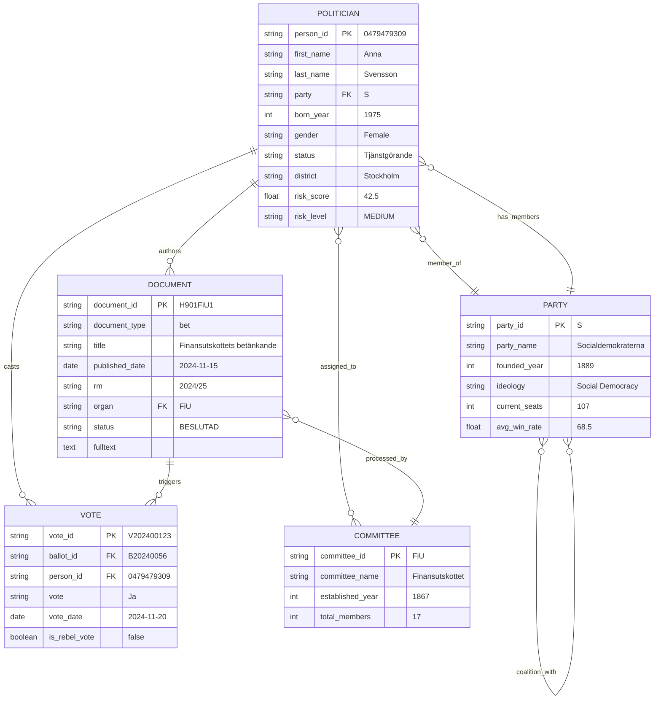
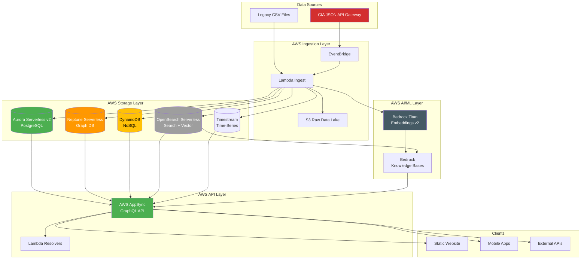
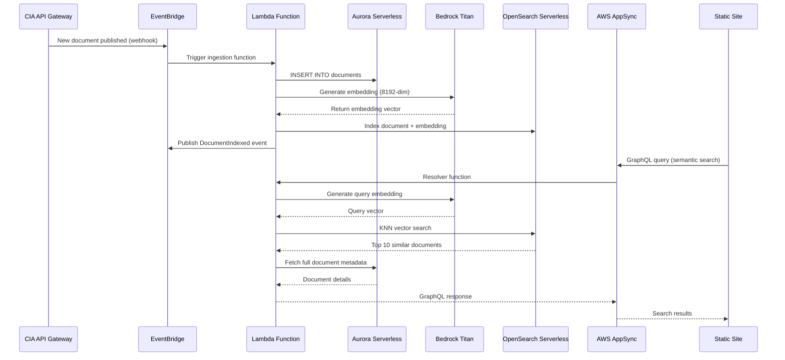
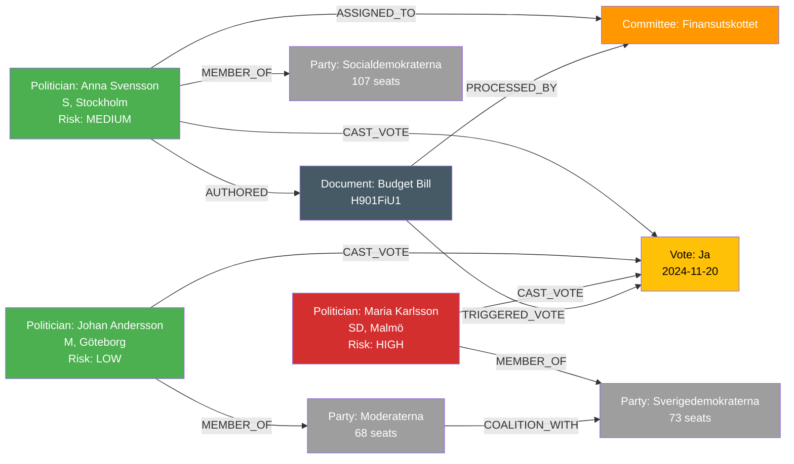
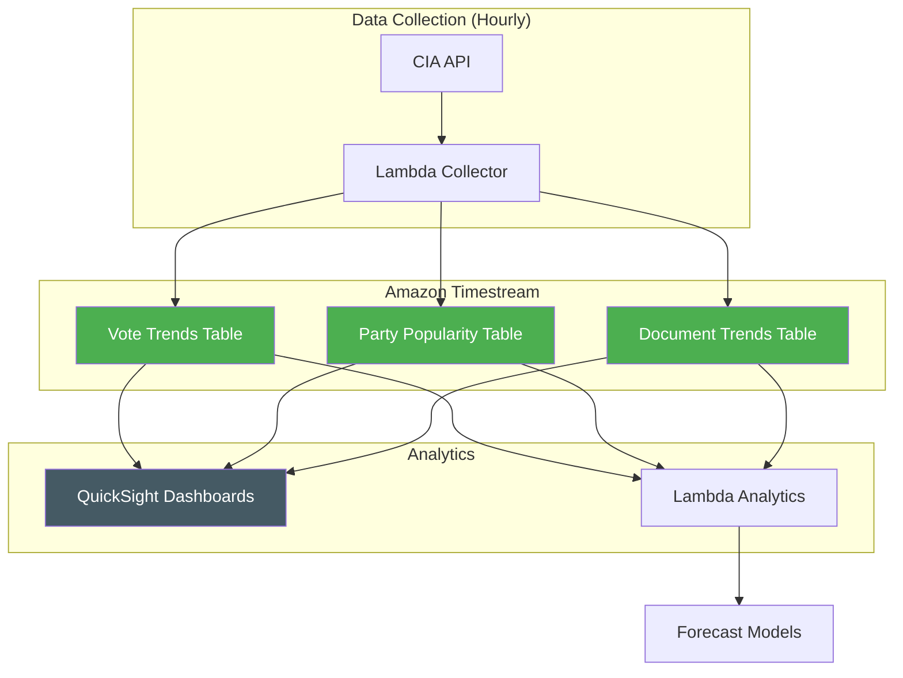
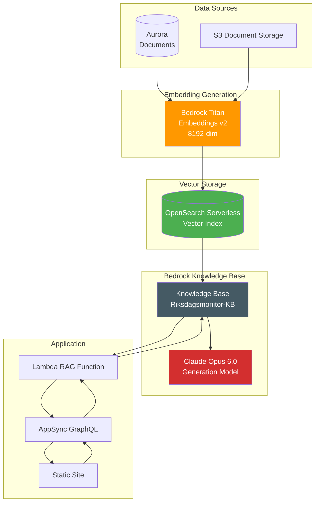
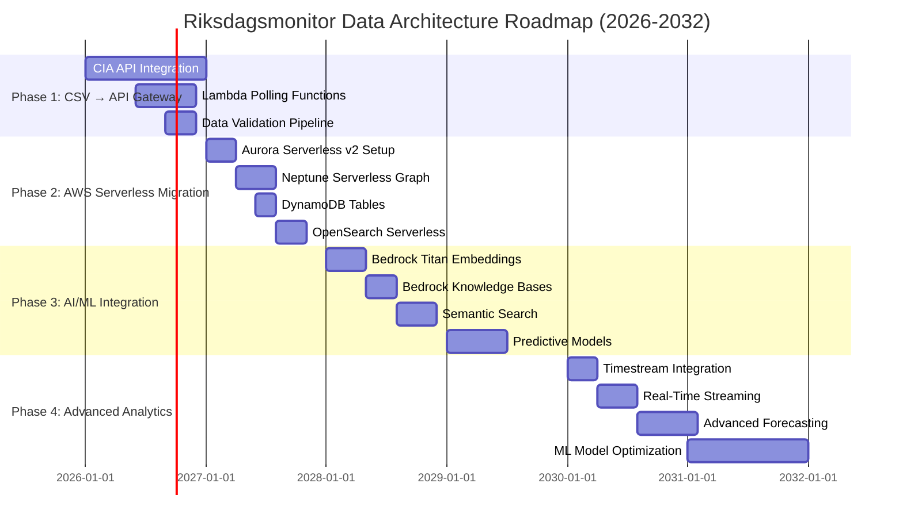
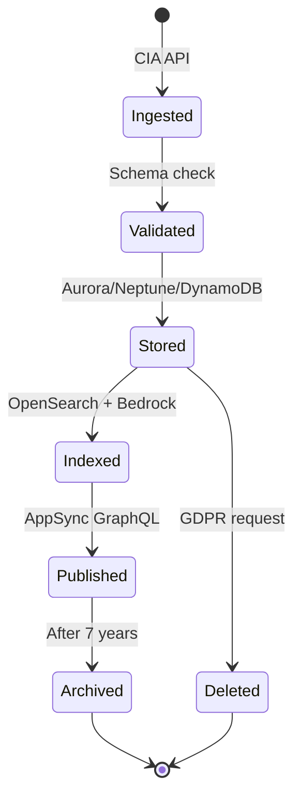

<p align="center">
  
</p>

<h1 align="center">📊 Riksdagsmonitor — Future Data Architecture Model</h1>

<p align="center">
  <strong>🚀 Evolution: CSV → API Gateway → AWS Serverless Intelligence</strong><br>
  <em>🎯 Neptune Graph · Aurora Relational · OpenSearch Vector · Bedrock AI</em>
</p>

<p align="center">
  
  
  
  
</p>

**📋 Document Owner:** CEO | **📄 Version:** 2.0 | **📅 Last Updated:** 2026-02-24 (UTC)  
**🔄 Review Cycle:** Annual | **⏰ Next Review:** 2027-02-24  
**🏢 Owner:** Hack23 AB (Org.nr 5595347807) | **🏷️ Classification:** Public

---

## 📚 Architecture Documentation Map

| Document | Type | Description |
|----------|------|-------------|
| [Architecture](ARCHITECTURE.md) | 🏛️ Current | C4 model showing system structure |
| [Data Model](DATA_MODEL.md) | 📊 Current | Data entities and relationships |
| [Flowcharts](FLOWCHART.md) | 🔄 Current | Process flows and pipelines |
| [State Diagrams](STATEDIAGRAM.md) | 🔄 Current | System state transitions |
| [Mindmap](MINDMAP.md) | 🗺️ Current | System conceptual map |
| [SWOT](SWOT.md) | 💼 Current | Strategic analysis |
| [Future Architecture](FUTURE_ARCHITECTURE.md) | 🏗️ Future | System evolution roadmap |
| **[Future Data Model](FUTURE_DATA_MODEL.md)** | 📊 **Future** | **Enhanced data architecture (this doc)** |
| [Future Flowcharts](FUTURE_FLOWCHART.md) | 🔄 Future | Advanced process flows |
| [Future State Diagrams](FUTURE_STATEDIAGRAM.md) | 🔄 Future | Advanced state management |
| [Future Mindmap](FUTURE_MINDMAP.md) | 🗺️ Future | Future capability map |
| [Future SWOT](FUTURE_SWOT.md) | 💼 Future | Strategic outlook |
| [Security Architecture](SECURITY_ARCHITECTURE.md) | 🛡️ Security | Defense-in-depth controls |
| [Future Security Architecture](FUTURE_SECURITY_ARCHITECTURE.md) | 🛡️ Future | Security roadmap |
| [Threat Model](THREAT_MODEL.md) | 🎯 Security | STRIDE analysis |

---

## 📊 Executive Summary

Riksdagsmonitor's data architecture evolves over 2026-2037 from static CSV files to a **fully-managed AWS Serverless intelligence platform**. This transformation enables real-time political analytics, AI-powered insights, and scalable processing of Swedish parliamentary data.

**Strategic Vision (2026-2037):**
- 🔄 **Phase 1 (2026-2027):** CSV → CIA JSON API Gateway integration
- ☁️ **Phase 2 (2027-2028):** AWS Serverless migration (Neptune, Aurora, DynamoDB, OpenSearch)
- 🤖 **Phase 3 (2028-2030):** AI/ML with Amazon Bedrock (embeddings, RAG, forecasting)
- 📊 **Phase 4 (2030-2032):** Advanced analytics with Timestream and real-time streaming
- 🧠 **Phase 5 (2033-2035):** Pre-AGI data architecture with autonomous schema evolution
- 🌐 **Phase 6 (2036-2037):** AGI-era data platform supporting 195 global parliaments

**Key Transformations:**

| Aspect | Current (2026) | Future (2037) |
|--------|----------------|---------------|
| **Data Source** | CIA CSV exports (static) | CIA JSON API Gateway (real-time) |
| **Database** | GitHub repository files | Neptune Graph + Aurora Serverless v2 |
| **Search** | Text matching | OpenSearch Serverless + semantic vectors |
| **Query** | JavaScript filters | AWS AppSync GraphQL API |
| **Analytics** | Static aggregations | Timestream time-series + Lambda analytics |
| **AI/ML** | None | Bedrock Titan Embeddings (8192-dim) + RAG |
| **Scale** | 109K documents | 100M+ documents with global parliament coverage |
| **Compute** | Static site | AWS Lambda serverless functions |
| **Orchestration** | GitHub Actions | AWS Step Functions |

**Current Baseline:**
- **2,494 Politicians** → Future: Complete career graphs in Neptune
- **3.5M+ Voting Records** → Future: Real-time vote prediction models
- **109K Documents** → Future: Semantic search with Bedrock embeddings
- **19 CIA Products** → Future: 100+ intelligence products via API Gateway

---

## 📚 Table of Contents

1. [Current State vs Future State](#1-current-state-vs-future-state)
2. [AWS Serverless Data Architecture](#2-aws-serverless-data-architecture)
   - 2.1 [Amazon Neptune Serverless (Graph Database)](#21-amazon-neptune-serverless-graph-database)
   - 2.2 [Amazon Aurora Serverless v2 (Relational)](#22-amazon-aurora-serverless-v2-relational)
   - 2.3 [Amazon DynamoDB (NoSQL)](#23-amazon-dynamodb-nosql)
   - 2.4 [Amazon OpenSearch Serverless (Search/Vector)](#24-amazon-opensearch-serverless-searchvector)
   - 2.5 [Amazon Timestream (Time-Series)](#25-amazon-timestream-time-series)
   - 2.6 [Amazon Bedrock (AI/ML)](#26-amazon-bedrock-aiml)
3. [CIA JSON API Gateway Integration](#3-cia-json-api-gateway-integration)
4. [GraphQL API Schema](#4-graphql-api-schema)
5. [Data Model Diagrams](#5-data-model-diagrams)
6. [Implementation Roadmap](#6-implementation-roadmap)
7. [Technology Stack Evolution](#7-technology-stack-evolution)
8. [ISMS Compliance & Data Governance](#8-isms-compliance--data-governance)
9. [Related Documentation](#9-related-documentation)

---

## 🔄 1. Current State vs Future State

### 1.1 Architecture Comparison

| Component | Current (2026) | Phase 2 (2028) | Phase 4 (2032) |
|-----------|----------------|----------------|----------------|
| **Data Ingestion** | Manual CSV downloads | CIA API Gateway polling | Real-time event streaming |
| **Storage Layer** | GitHub repo (< 1GB) | Aurora 100GB + Neptune 500GB | Aurora 500GB + Neptune 5TB |
| **Graph Database** | None | Neptune Serverless (Gremlin) | Neptune Analytics + ML |
| **Relational DB** | None | Aurora Serverless v2 (PostgreSQL) | Aurora Global Database |
| **Vector Search** | None | OpenSearch Serverless | OpenSearch + Bedrock KB |
| **Time-Series** | None | Timestream (historical trends) | Timestream (forecasting) |
| **API Layer** | Static JSON files | AppSync GraphQL | AppSync + Lambda resolvers |
| **AI/ML** | None | Bedrock Titan Embeddings | Bedrock + SageMaker |
| **Compute** | Static site | Lambda functions | Lambda + Step Functions |
| **Monitoring** | None | CloudWatch Logs | CloudWatch + X-Ray tracing |

### 1.2 Data Volume Projections

| Metric | 2026 | 2028 | 2032 |
|--------|------|------|------|
| **Politicians** | 2,494 | 10,000 | 50,000 |
| **Voting Records** | 3.5M | 10M | 100M |
| **Documents** | 109K | 500K | 10M |
| **Graph Relationships** | 0 | 5M | 100M |
| **Vector Embeddings** | 0 | 500K | 10M |
| **API Requests/Day** | 0 | 10K | 1M |

---

## ☁️ 2. AWS Serverless Data Architecture

### 2.1 Amazon Neptune Serverless (Graph Database)

**Purpose:** Store political relationships, influence networks, coalition patterns.

#### 2.1.1 Core Node Types

```gremlin
// Politician Vertex
g.addV('Politician').
  property('person_id', '0479479309').
  property('first_name', 'Anna').
  property('last_name', 'Svensson').
  property('party', 'S').
  property('born_year', 1975).
  property('district', 'Stockholm').
  property('risk_score', 42.5).
  property('risk_level', 'MEDIUM')

// Party Vertex
g.addV('Party').
  property('party_id', 'S').
  property('party_name', 'Socialdemokraterna').
  property('founded_year', 1889).
  property('current_seats', 107)

// Document Vertex
g.addV('Document').
  property('document_id', 'H901FiU1').
  property('document_type', 'bet').
  property('title', 'Finansutskottets betänkande').
  property('published_date', '2024-11-15').
  property('status', 'BESLUTAD')

// Vote Vertex
g.addV('Vote').
  property('vote_id', 'V202400123').
  property('ballot_id', 'B20240056').
  property('vote', 'Ja').
  property('vote_date', '2024-11-20').
  property('is_rebel_vote', false)

// Committee Vertex
g.addV('Committee').
  property('committee_id', 'FiU').
  property('committee_name', 'Finansutskottet').
  property('established_year', 1867).
  property('total_members', 17)
```

#### 2.1.2 Relationship Edges

```gremlin
// Political relationships
g.V().has('Politician','person_id','0479479309').
  addE('MEMBER_OF').property('since', '2018-01-01').
  to(g.V().has('Party','party_id','S'))

g.V().has('Politician','person_id','0479479309').
  addE('CAST_VOTE').property('vote', 'Ja').
  to(g.V().has('Vote','vote_id','V202400123'))

g.V().has('Politician','person_id','0479479309').
  addE('AUTHORED').property('author_order', 1).
  to(g.V().has('Document','document_id','H901FiU1'))

// Coalition edges
g.V().has('Party','party_id','M').
  addE('COALITION_WITH').property('government_id', 'GOV_2022').
  to(g.V().has('Party','party_id','SD'))

// Influence network
g.V().has('Politician','person_id','P1').
  addE('INFLUENCES').property('strength', 0.75).
  to(g.V().has('Politician','person_id','P2'))
```

#### 2.1.3 Gremlin Query Examples

**Example 1: Find MPs with highest rebellion rate**
```gremlin
g.V().hasLabel('Politician').
  project('name','party','rebel_count').
    by(values('first_name','last_name').fold()).
    by(values('party')).
    by(outE('CAST_VOTE').has('is_rebel', true).count()).
  order().by('rebel_count', desc).
  limit(10)
```

**Example 2: Coalition formation patterns**
```gremlin
g.V().hasLabel('Party').as('party1').
  outE('COALITION_WITH').as('coalition').
  inV().as('party2').
  group().
    by(select('party1').values('party_name')).
    by(select('party2').values('party_name').fold()).
  unfold()
```

**Example 3: Document influence cascades**
```gremlin
g.V().has('Document','document_type','prop').
  repeat(out('REFERENCES')).
  times(3).
  path().
  by('title').
  limit(20)
```

### 2.2 Amazon Aurora Serverless v2 (Relational)

**Purpose:** Core structured data with ACID guarantees (politicians, parties, documents, votes).

#### 2.2.1 Critical Tables Schema

**Politicians Table**
```sql
CREATE TABLE politicians (
    person_id VARCHAR(20) PRIMARY KEY,
    first_name VARCHAR(100) NOT NULL,
    last_name VARCHAR(100) NOT NULL,
    party VARCHAR(10) REFERENCES parties(party_id),
    born_year INTEGER,
    gender VARCHAR(20),
    status VARCHAR(100),
    district VARCHAR(100),
    risk_score DECIMAL(5,2),
    risk_level VARCHAR(20),
    created_at TIMESTAMP DEFAULT CURRENT_TIMESTAMP,
    updated_at TIMESTAMP DEFAULT CURRENT_TIMESTAMP
);

CREATE INDEX idx_politicians_party ON politicians(party);
CREATE INDEX idx_politicians_risk ON politicians(risk_level, risk_score);
```

**Parties Table**
```sql
CREATE TABLE parties (
    party_id VARCHAR(10) PRIMARY KEY,
    party_name VARCHAR(200) NOT NULL,
    party_name_en VARCHAR(200),
    founded_year INTEGER,
    ideology VARCHAR(200),
    riksdag_status VARCHAR(50),
    avg_win_rate DECIMAL(5,2),
    current_seats INTEGER,
    created_at TIMESTAMP DEFAULT CURRENT_TIMESTAMP
);
```

**Documents Table**
```sql
CREATE TABLE documents (
    document_id VARCHAR(50) PRIMARY KEY,
    document_type VARCHAR(20) NOT NULL,
    title TEXT NOT NULL,
    subtitle TEXT,
    summary TEXT,
    published_date DATE,
    rm VARCHAR(20),
    organ VARCHAR(20),
    status VARCHAR(50),
    fulltext TEXT,
    embedding_id VARCHAR(100),
    created_at TIMESTAMP DEFAULT CURRENT_TIMESTAMP
);

CREATE INDEX idx_documents_type ON documents(document_type);
CREATE INDEX idx_documents_date ON documents(published_date DESC);
CREATE INDEX idx_documents_organ ON documents(organ);
CREATE INDEX idx_documents_fulltext ON documents USING GIN (
    to_tsvector('simple', 
        coalesce(title, '') || ' ' || 
        coalesce(summary, '') || ' ' || 
        coalesce(fulltext, '')
    )
);
```

**Votes Table**
```sql
CREATE TABLE votes (
    vote_id VARCHAR(50) PRIMARY KEY,
    ballot_id VARCHAR(50) NOT NULL,
    person_id VARCHAR(20) REFERENCES politicians(person_id),
    party VARCHAR(10) REFERENCES parties(party_id),
    vote VARCHAR(20) NOT NULL,
    vote_date DATE NOT NULL,
    vote_time TIME,
    is_rebel_vote BOOLEAN DEFAULT FALSE,
    is_winning_vote BOOLEAN,
    created_at TIMESTAMP DEFAULT CURRENT_TIMESTAMP
);

CREATE INDEX idx_votes_person ON votes(person_id);
CREATE INDEX idx_votes_ballot ON votes(ballot_id);
CREATE INDEX idx_votes_date ON votes(vote_date DESC);
CREATE INDEX idx_votes_rebel ON votes(is_rebel_vote) WHERE is_rebel_vote = TRUE;
```

**Committees Table**
```sql
CREATE TABLE committees (
    committee_id VARCHAR(20) PRIMARY KEY,
    committee_name VARCHAR(200) NOT NULL,
    committee_name_en VARCHAR(200),
    established_year INTEGER,
    total_members INTEGER,
    productivity_score DECIMAL(5,2),
    created_at TIMESTAMP DEFAULT CURRENT_TIMESTAMP
);
```

#### 2.2.2 Key Performance Queries

**Most Active Politicians**
```sql
SELECT 
    p.person_id,
    p.first_name,
    p.last_name,
    p.party,
    COUNT(DISTINCT v.vote_id) as vote_count,
    COUNT(DISTINCT CASE WHEN v.is_rebel_vote THEN v.vote_id END) as rebel_count
FROM politicians p
LEFT JOIN votes v ON v.person_id = p.person_id
WHERE p.status = 'Tjänstgörande riksdagsledamot'
GROUP BY p.person_id, p.first_name, p.last_name, p.party
ORDER BY vote_count DESC
LIMIT 20;
```

**Party Voting Discipline**
```sql
SELECT 
    p.party,
    pa.party_name,
    COUNT(v.vote_id) as total_votes,
    COUNT(CASE WHEN v.is_rebel_vote THEN 1 END) as rebel_votes,
    ROUND(COUNT(CASE WHEN v.is_rebel_vote THEN 1 END) * 100.0 / COUNT(v.vote_id), 2) as rebel_rate
FROM votes v
JOIN politicians p ON p.person_id = v.person_id
JOIN parties pa ON pa.party_id = p.party
WHERE v.vote_date >= CURRENT_DATE - INTERVAL '1 year'
GROUP BY p.party, pa.party_name
ORDER BY rebel_rate DESC;
```

### 2.3 Amazon DynamoDB (NoSQL)

**Purpose:** Low-latency real-time data access, session storage, API caching.

#### 2.3.1 Table Designs

**Politician Profiles (Fast Lookup)**
```json
{
  "TableName": "PoliticianProfiles",
  "KeySchema": [
    {"AttributeName": "person_id", "KeyType": "HASH"}
  ],
  "AttributeDefinitions": [
    {"AttributeName": "person_id", "AttributeType": "S"},
    {"AttributeName": "party", "AttributeType": "S"},
    {"AttributeName": "risk_level", "AttributeType": "S"}
  ],
  "GlobalSecondaryIndexes": [
    {
      "IndexName": "PartyIndex",
      "KeySchema": [
        {"AttributeName": "party", "KeyType": "HASH"}
      ]
    },
    {
      "IndexName": "RiskIndex",
      "KeySchema": [
        {"AttributeName": "risk_level", "KeyType": "HASH"}
      ]
    }
  ]
}
```

**Recent Votes (Time-Ordered)**
```json
{
  "TableName": "RecentVotes",
  "KeySchema": [
    {"AttributeName": "ballot_id", "KeyType": "HASH"},
    {"AttributeName": "person_id", "KeyType": "RANGE"}
  ],
  "AttributeDefinitions": [
    {"AttributeName": "ballot_id", "AttributeType": "S"},
    {"AttributeName": "person_id", "AttributeType": "S"},
    {"AttributeName": "vote_date", "AttributeType": "S"}
  ],
  "GlobalSecondaryIndexes": [
    {
      "IndexName": "DateIndex",
      "KeySchema": [
        {"AttributeName": "vote_date", "KeyType": "HASH"}
      ]
    }
  ],
  "TimeToLiveSpecification": {
    "Enabled": true,
    "AttributeName": "expiration_time"
  }
}
```

**API Response Cache**
```json
{
  "TableName": "APICache",
  "KeySchema": [
    {"AttributeName": "cache_key", "KeyType": "HASH"}
  ],
  "AttributeDefinitions": [
    {"AttributeName": "cache_key", "AttributeType": "S"}
  ],
  "TimeToLiveSpecification": {
    "Enabled": true,
    "AttributeName": "ttl"
  }
}
```

#### 2.3.2 Access Patterns

**Get Politician Profile**
```javascript
const params = {
  TableName: 'PoliticianProfiles',
  Key: { person_id: '0479479309' }
};
const result = await dynamodb.get(params).promise();
```

**Query Party Members**
```javascript
const params = {
  TableName: 'PoliticianProfiles',
  IndexName: 'PartyIndex',
  KeyConditionExpression: 'party = :party',
  ExpressionAttributeValues: { ':party': 'S' }
};
const result = await dynamodb.query(params).promise();
```

### 2.4 Amazon OpenSearch Serverless (Search/Vector)

**Purpose:** Full-text search, semantic search with vector embeddings, aggregations.

#### 2.4.1 Index Mappings

**Documents Index**
```json
{
  "mappings": {
    "properties": {
      "document_id": {"type": "keyword"},
      "document_type": {"type": "keyword"},
      "title": {
        "type": "text",
        "fields": {
          "keyword": {"type": "keyword"}
        },
        "analyzer": "swedish"
      },
      "summary": {"type": "text", "analyzer": "swedish"},
      "fulltext": {"type": "text", "analyzer": "swedish"},
      "published_date": {"type": "date"},
      "rm": {"type": "keyword"},
      "organ": {"type": "keyword"},
      "status": {"type": "keyword"},
      "authors": {"type": "keyword"},
      "party": {"type": "keyword"},
      "embedding_vector": {
        "type": "knn_vector",
        "dimension": 8192,
        "method": {
          "name": "hnsw",
          "space_type": "cosinesimilarity",
          "engine": "nmslib"
        }
      }
    }
  }
}
```

**Politicians Index**
```json
{
  "mappings": {
    "properties": {
      "person_id": {"type": "keyword"},
      "full_name": {"type": "text", "analyzer": "swedish"},
      "party": {"type": "keyword"},
      "district": {"type": "keyword"},
      "risk_level": {"type": "keyword"},
      "risk_score": {"type": "float"}
    }
  }
}
```

#### 2.4.2 Query Examples

**Full-Text Search**
```json
{
  "query": {
    "multi_match": {
      "query": "budget finanspolitik",
      "fields": ["title^3", "summary^2", "fulltext"],
      "type": "best_fields",
      "operator": "and"
    }
  },
  "highlight": {
    "fields": {
      "title": {},
      "summary": {}
    }
  }
}
```

**Semantic Vector Search with Bedrock Embeddings**
```json
{
  "query": {
    "knn": {
      "embedding_vector": {
        "vector": [/* 8192-dim vector from Bedrock */],
        "k": 10
      }
    }
  },
  "filter": {
    "bool": {
      "must": [
        {"term": {"document_type": "prop"}},
        {"range": {"published_date": {"gte": "2024-01-01"}}}
      ]
    }
  }
}
```

**Aggregations (Party Distribution)**
```json
{
  "query": {"match_all": {}},
  "aggs": {
    "by_party": {
      "terms": {"field": "party", "size": 10},
      "aggs": {
        "avg_risk": {"avg": {"field": "risk_score"}}
      }
    }
  }
}
```

### 2.5 Amazon Timestream (Time-Series)

**Purpose:** Historical trends, vote patterns over time, forecasting data.

#### 2.5.1 Table Schema

**Vote Trends Table**
```sql
CREATE TABLE VoteTrends (
    ballot_id VARCHAR,
    vote_date TIMESTAMP,
    party VARCHAR,
    vote_type VARCHAR,  -- Ja, Nej, Avstår
    vote_count BIGINT,
    rebel_count BIGINT,
    PRIMARY KEY (ballot_id, vote_date)
);
```

**Party Popularity Trends**
```sql
CREATE TABLE PartyPopularityTrends (
    party VARCHAR,
    measurement_date TIMESTAMP,
    polling_percentage DOUBLE,
    riksdag_seats INTEGER,
    approval_rating DOUBLE,
    PRIMARY KEY (party, measurement_date)
);
```

#### 2.5.2 Query Examples

**Party Voting Patterns (Last 90 Days)**
```sql
SELECT 
    party,
    BIN(vote_date, 7d) as week,
    SUM(vote_count) as total_votes,
    SUM(rebel_count) as total_rebels,
    SUM(rebel_count) * 100.0 / SUM(vote_count) as rebel_rate
FROM VoteTrends
WHERE vote_date > ago(90d)
GROUP BY party, BIN(vote_date, 7d)
ORDER BY party, week DESC;
```

**Trending Topics**
```sql
SELECT 
    topic,
    COUNT(*) as mention_count,
    BIN(published_date, 1d) as day
FROM DocumentTopics
WHERE published_date > ago(30d)
GROUP BY topic, BIN(published_date, 1d)
ORDER BY mention_count DESC
LIMIT 10;
```

### 2.6 Amazon Bedrock (AI/ML)

**Purpose:** Text embeddings, semantic search, RAG (Retrieval Augmented Generation), content generation.

#### 2.6.1 Titan Embeddings v2

**Generate 8192-Dimensional Embeddings**
```javascript
import { BedrockRuntimeClient, InvokeModelCommand } from "@aws-sdk/client-bedrock-runtime";

const client = new BedrockRuntimeClient({ region: "us-east-1" });

async function generateEmbedding(text) {
  const command = new InvokeModelCommand({
    modelId: "amazon.titan-embed-text-v2:0",
    contentType: "application/json",
    accept: "application/json",
    body: JSON.stringify({
      inputText: text,
      dimensions: 8192,
      normalize: true
    })
  });
  
  const response = await client.send(command);
  const responseBody = JSON.parse(new TextDecoder().decode(response.body));
  return responseBody.embedding; // 8192-dimensional vector
}
```

**Embed Document for Semantic Search**
```javascript
// Initialize OpenSearch Serverless client
const { Client } = require('@opensearch-project/opensearch');
const { defaultProvider } = require('@aws-sdk/credential-provider-node');
const aws4 = require('aws4');

const opensearch = new Client({
  node: process.env.OPENSEARCH_ENDPOINT,
  ...aws4.sign({ 
    service: 'aoss',
    region: 'us-east-1'
  }, defaultProvider())
});

async function embedDocument(document) {
  const fullText = [
    document.title,
    document.subtitle,
    document.summary,
    document.fulltext.slice(0, 10000)
  ].filter(Boolean).join("\n\n");
  
  const embedding = await generateEmbedding(fullText);
  
  // Store in OpenSearch
  await opensearch.index({
    index: 'documents',
    id: document.document_id,
    body: {
      ...document,
      embedding_vector: embedding
    }
  });
}
```

#### 2.6.2 Bedrock Knowledge Bases (RAG)

**Create Knowledge Base**
```javascript
const kbConfig = {
  name: "Riksdagsmonitor-KB",
  description: "Swedish parliamentary documents and intelligence",
  roleArn: "arn:aws:iam::ACCOUNT:role/BedrockKBRole",
  storageConfiguration: {
    type: "OPENSEARCH_SERVERLESS",
    opensearchServerlessConfiguration: {
      collectionArn: "arn:aws:aoss:us-east-1:ACCOUNT:collection/riksdag-docs",
      vectorIndexName: "documents",
      fieldMapping: {
        vectorField: "embedding_vector",
        textField: "fulltext",
        metadataField: "metadata"
      }
    }
  },
  embeddingModelArn: "arn:aws:bedrock:us-east-1::foundation-model/amazon.titan-embed-text-v2:0"
};
```

**Query Knowledge Base**
```javascript
// Required imports
import { 
  BedrockAgentRuntimeClient, 
  RetrieveAndGenerateCommand 
} from "@aws-sdk/client-bedrock-agent-runtime";

// Initialize Bedrock Agent Runtime client
const bedrockAgent = new BedrockAgentRuntimeClient({ 
  region: "us-east-1" 
});

async function queryKnowledgeBase(question) {
  const command = new RetrieveAndGenerateCommand({
    input: {
      text: question
    },
    retrieveAndGenerateConfiguration: {
      type: "KNOWLEDGE_BASE",
      knowledgeBaseConfiguration: {
        knowledgeBaseId: "KB12345",
        modelArn: "arn:aws:bedrock:us-east-1::foundation-model/anthropic.claude-opus-6-v1:0",
        retrievalConfiguration: {
          vectorSearchConfiguration: {
            numberOfResults: 5
          }
        }
      }
    }
  });
  
  const response = await bedrockAgent.send(command);
  return {
    answer: response.output.text,
    citations: response.citations,
    retrievedReferences: response.retrievedReferences
  };
}
```

---

## 🔗 3. CIA JSON API Gateway Integration

### 3.1 Current State: CSV Exports (Temporary)

**Current Data Flow:**
```
CIA Platform → CSV Exports → GitHub Repo → Static Site → End Users
```

**Limitations:**
- Manual updates required
- No real-time data
- Limited to 19 intelligence products
- No query capabilities
- No authentication/authorization

### 3.2 Phase 1: CIA JSON API Gateway (2026-2027)

**CIA Platform Roadmap:**
- REST API endpoints for all 19 intelligence products
- GraphQL API for complex queries
- OAuth 2.0 authentication
- Rate limiting and quotas
- Real-time webhooks for updates

**Expected API Structure:**
```
GET /api/v1/politicians
GET /api/v1/politicians/{person_id}
GET /api/v1/documents?type={type}&rm={rm}
GET /api/v1/votes?ballot_id={ballot_id}
GET /api/v1/parties
GET /api/v1/committees

GraphQL Endpoint: POST /graphql
Webhook Subscriptions: POST /webhooks/subscribe
```

**Authentication:**
```javascript
const response = await fetch('https://api.cia-platform.se/v1/politicians', {
  headers: {
    'Authorization': `Bearer ${ACCESS_TOKEN}`,
    'X-API-Key': API_KEY
  }
});
```

### 3.3 Phase 2: Native AWS Integration (2027-2028)

**AWS Lambda Consumers:**
```
CIA API Gateway → EventBridge → Lambda → Aurora/Neptune/DynamoDB/OpenSearch
```

**Lambda Function Example:**
```javascript
exports.handler = async (event) => {
  // EventBridge event from CIA API webhook (payload in `detail`)
  const ciaData = event.detail;
  
  // Store in Aurora
  await aurora.query('INSERT INTO politicians VALUES (...)');
  
  // Update Neptune graph
  await neptune.executeGremlin('g.addV("Politician")...');
  
  // Generate Bedrock embedding
  const embedding = await generateEmbedding(ciaData.summary);
  
  // Index in OpenSearch
  await opensearch.index({
    index: 'documents',
    body: { ...ciaData, embedding_vector: embedding }
  });
  
  return { statusCode: 200 };
};
```

### 3.4 Phase 3: Real-Time Streaming (2028-2030)

**EventBridge + Kinesis Data Streams:**
```
CIA Platform → Kinesis Stream → Lambda/Firehose → S3/Aurora/OpenSearch
```

**Real-Time Processing Pipeline:**
- New document published → Immediate indexing in OpenSearch
- New vote cast → Real-time update in Timestream
- Risk score change → SNS notification to subscribers

### 3.5 Data Migration Strategy

| Phase | Source | Target | Method | Timeline |
|-------|--------|--------|--------|----------|
| **Phase 1** | CSV files | Aurora Serverless v2 | Lambda batch import | Q1 2027 |
| **Phase 2** | CSV files | Neptune Serverless | Bulk Loader API | Q2 2027 |
| **Phase 3** | Aurora | OpenSearch Serverless | Lambda + Bedrock embeddings | Q3 2027 |
| **Phase 4** | CIA API | Real-time Lambda consumers | EventBridge integration | Q1 2028 |

---

## 🔌 4. GraphQL API Schema

### 4.1 Core Types

```graphql
type Politician {
  person_id: ID!
  first_name: String!
  last_name: String!
  party: Party!
  born_year: Int
  gender: String
  status: String!
  district: String
  risk_score: Float
  risk_level: RiskLevel!
  votes: [Vote!]!
  documents: [Document!]!
  committees: [Committee!]!
}

type Party {
  party_id: ID!
  party_name: String!
  party_name_en: String
  founded_year: Int
  ideology: String
  current_seats: Int
  avg_win_rate: Float
  members: [Politician!]!
  coalitions: [Party!]!
}

type Document {
  document_id: ID!
  document_type: String!
  title: String!
  subtitle: String
  summary: String
  published_date: String!
  rm: String
  organ: Committee
  status: String!
  authors: [Politician!]!
  votes: [Vote!]!
  similar_documents: [Document!]!
}

type Vote {
  vote_id: ID!
  ballot_id: String!
  person: Politician!
  party: Party!
  vote: VoteType!
  vote_date: String!
  is_rebel_vote: Boolean!
  is_winning_vote: Boolean
}

type Committee {
  committee_id: ID!
  committee_name: String!
  committee_name_en: String
  established_year: Int
  total_members: Int
  members: [Politician!]!
  documents: [Document!]!
}

enum RiskLevel {
  LOW
  MEDIUM
  HIGH
  CRITICAL
}

enum VoteType {
  Ja
  Nej
  Avstår
  Frånvarande
}
```

### 4.2 Queries

```graphql
type Query {
  politician(person_id: ID!): Politician
  politicians(party: String, district: String, risk_level: RiskLevel): [Politician!]!
  
  party(party_id: ID!): Party
  parties(riksdag_status: String): [Party!]!
  
  document(document_id: ID!): Document
  documents(type: String, rm: String, organ: String, limit: Int): [Document!]!
  searchDocuments(query: String!, limit: Int): [Document!]!
  semanticSearchDocuments(query: String!, limit: Int): [Document!]!
  
  vote(vote_id: ID!): Vote
  votes(ballot_id: String, person_id: ID): [Vote!]!
  
  committee(committee_id: ID!): Committee
  committees: [Committee!]!
  
  # Advanced queries
  highRiskPoliticians(threshold: Float): [Politician!]!
  rebelVoters(party: String, limit: Int): [Politician!]!
  coalitionProbabilities: [CoalitionPrediction!]!
}

type CoalitionPrediction {
  parties: [String!]!
  probability: Float!
  projected_seats: Int!
}
```

### 4.3 Mutations

```graphql
type Mutation {
  # Admin operations
  updatePoliticianRiskScore(person_id: ID!, risk_score: Float!): Politician
  
  # AI operations
  generateDocumentSummary(document_id: ID!): String!
  predictVote(person_id: ID!, ballot_id: String!): VotePrediction!
  
  # Subscription management
  subscribeToUpdates(entity_type: String!, entity_id: ID!): Subscription!
}

type VotePrediction {
  predicted_vote: VoteType!
  confidence: Float!
  probabilities: VoteProbabilities!
}

type VoteProbabilities {
  Ja: Float!
  Nej: Float!
  Avstår: Float!
  Frånvarande: Float!
}
```

### 4.4 Subscriptions

```graphql
type Subscription {
  newDocument(organ: String): Document!
  newVote(ballot_id: String): Vote!
  riskScoreChange(person_id: ID): Politician!
  coalitionUpdate: CoalitionPrediction!
}
```

---

## 📐 5. Data Model Diagrams

### 5.1 Political Entities ERD



### 5.2 AWS Service Integration



### 5.3 Data Flow Sequence



### 5.4 Neptune Graph Visualization



### 5.5 Time-Series Data Flow



### 5.6 Bedrock Knowledge Base RAG Pipeline



---

## 🗓️ 6. Implementation Roadmap

### 6.1 Four-Phase Evolution (2026-2032)



### 6.2 Phase Details

#### Phase 1: CSV → API Gateway (2026-2027)

| Quarter | Milestone | Deliverables |
|---------|-----------|--------------|
| **Q1 2026** | CIA API Integration Planning | API specification, authentication setup |
| **Q2 2026** | Lambda Polling Functions | Automated data ingestion from CIA API |
| **Q3 2026** | Data Validation Pipeline | Schema validation, error handling |
| **Q4 2026** | Hybrid System | CSV + API Gateway dual sources |

**Key Metrics:**
- API uptime: 99.9%
- Data freshness: < 1 hour
- Error rate: < 0.1%

#### Phase 2: AWS Serverless Migration (2027-2028)

| Quarter | Milestone | Deliverables |
|---------|-----------|--------------|
| **Q1 2027** | Aurora Setup | Relational database with 2,494 politicians |
| **Q2 2027** | Neptune Graph | Graph database with 5M relationships |
| **Q3 2027** | DynamoDB + AppSync | NoSQL + GraphQL API layer |
| **Q4 2027** | OpenSearch Indexing | Full-text search across 109K documents |

**Key Metrics:**
- Aurora ACU: 0.5-2 (auto-scaling)
- Neptune NCU: 2.5 (serverless)
- DynamoDB RCU/WCU: On-demand
- OpenSearch OCU: 2 (compute + indexing)

#### Phase 3: AI/ML Integration (2028-2030)

| Quarter | Milestone | Deliverables |
|---------|-----------|--------------|
| **Q1 2028** | Bedrock Titan Embeddings | 8192-dim vectors for all documents |
| **Q2 2028** | Bedrock Knowledge Bases | RAG pipeline with Claude Opus 6.0 |
| **Q3 2028** | Semantic Search | Vector similarity search |
| **Q1 2029** | Predictive Models | Vote prediction, election forecasting |

**Key Metrics:**
- Embedding generation: 1000 docs/hour
- Semantic search latency: < 500ms
- RAG response time: < 3s
- Model accuracy: > 85%

#### Phase 4: Advanced Analytics (2030-2032)

| Quarter | Milestone | Deliverables |
|---------|-----------|--------------|
| **Q1 2030** | Timestream Integration | Historical trends, time-series analytics |
| **Q2 2030** | Real-Time Streaming | EventBridge + Kinesis pipelines |
| **Q3 2030** | Advanced Forecasting | Coalition prediction, risk assessment |
| **2031-2032** | Optimization | ML model tuning, cost optimization |

**Key Metrics:**
- Time-series queries: < 1s
- Real-time latency: < 100ms
- Forecast accuracy: > 90%
- Total AWS cost: < $5000/month

---

## 🔧 7. Technology Stack Evolution

### 7.1 Current vs Future Stack

| Component | Current (2026) | Phase 2 (2028) | Phase 4 (2032) |
|-----------|----------------|----------------|----------------|
| **Frontend** | Static HTML/CSS/JS | Static HTML/CSS/JS | Static HTML/CSS/JS |
| **Hosting** | GitHub Pages | GitHub Pages | GitHub Pages |
| **API Layer** | None | AWS AppSync GraphQL | AppSync + Lambda |
| **Database** | GitHub files | Aurora Serverless v2 | Aurora Global DB |
| **Graph DB** | None | Neptune Serverless | Neptune Analytics |
| **NoSQL** | None | DynamoDB | DynamoDB Global Tables |
| **Search** | None | OpenSearch Serverless | OpenSearch + Bedrock KB |
| **Time-Series** | None | None | Timestream |
| **Embeddings** | None | Bedrock Titan v2 (8192-dim) | Bedrock Titan v3 |
| **AI/ML** | None | Bedrock Knowledge Bases | Bedrock + SageMaker |
| **Compute** | None | AWS Lambda | Lambda + Step Functions |
| **Orchestration** | GitHub Actions | EventBridge | EventBridge + SQS |
| **Monitoring** | None | CloudWatch | CloudWatch + X-Ray |
| **Security** | GitHub ISMS | AWS IAM + Secrets Manager | IAM + GuardDuty + Macie |

### 7.2 Cost Projections

| Service | 2026 | 2028 | 2032 |
|---------|------|------|------|
| **Aurora Serverless v2** | $0 | $50/month | $200/month |
| **Neptune Serverless** | $0 | $100/month | $500/month |
| **DynamoDB** | $0 | $20/month | $100/month |
| **OpenSearch Serverless** | $0 | $150/month | $500/month |
| **Timestream** | $0 | $0 | $100/month |
| **Bedrock (embeddings)** | $0 | $200/month | $1000/month |
| **Lambda** | $0 | $50/month | $200/month |
| **AppSync** | $0 | $30/month | $100/month |
| **EventBridge** | $0 | $10/month | $50/month |
| **S3 + Data Transfer** | $0 | $20/month | $100/month |
| **CloudWatch** | $0 | $20/month | $50/month |
| **Total Monthly Cost** | **$0** | **$650/month** | **$2900/month** |

### 7.3 Scalability Targets

| Metric | 2026 | 2028 | 2032 |
|--------|------|------|------|
| **Documents** | 109K | 500K | 10M |
| **Politicians** | 2,494 | 10K | 50K |
| **Votes** | 3.5M | 10M | 100M |
| **Graph Relationships** | 0 | 5M | 100M |
| **Vector Embeddings** | 0 | 500K | 10M |
| **API Requests/Day** | 0 | 10K | 1M |
| **Data Storage** | 1GB | 100GB | 5TB |
| **Concurrent Users** | 100 | 1K | 10K |

---

## 🔐 8. ISMS Compliance & Data Governance

### 8.1 ISO 27001:2022 Controls

**A.8 Asset Management:**
- Aurora/Neptune/DynamoDB data classification (Public/Internal)
- Automated asset inventory via AWS Config
- Data retention policies (7 years for political data)

**A.18 Compliance:**
- GDPR Article 17 (Right to erasure) via Lambda deletion functions
- GDPR Article 20 (Data portability) via AppSync export queries
- Swedish Archive Act compliance for parliamentary records

### 8.2 NIST CSF 2.0 Mapping

**ID.AM (Asset Management):**
- AWS Systems Manager inventory
- Automated tagging strategy

**PR.DS (Data Security):**
- Aurora/Neptune encryption at rest (AWS KMS)
- TLS 1.3 for data in transit
- Bedrock model access controls

**DE.CM (Continuous Monitoring):**
- CloudWatch anomaly detection
- GuardDuty threat detection
- VPC Flow Logs analysis

### 8.3 CIS Controls v8.1

**Control 1 (Inventory):**
- AWS Config tracking all resources
- Quarterly audit reports

**Control 3 (Data Protection):**
- S3 bucket versioning + lifecycle policies
- Aurora automated backups (35 days retention)
- Neptune backups (daily snapshots)

**Control 11 (Data Recovery):**
- Multi-region Aurora Global Database
- Neptune cross-region replication
- DynamoDB point-in-time recovery (PITR)

### 8.4 Data Governance

**Data Classification:**
| Data Type | Classification | Retention | Encryption |
|-----------|---------------|-----------|------------|
| Politician personal data | **Public** | Permanent | KMS (at rest) |
| Voting records | **Public** | 7 years | KMS (at rest) |
| Documents | **Public** | Permanent | KMS (at rest) |
| Risk scores | **Internal** | 2 years | KMS (at rest + in transit) |
| API access logs | **Internal** | 1 year | KMS (at rest) |
| Bedrock model inputs/outputs | **Internal** | 30 days | KMS (ephemeral) |

**Data Lifecycle:**


**Privacy by Design:**
- No PII beyond public records
- Anonymized analytics data
- GDPR-compliant deletion via Lambda functions
- Bedrock model data retention: 30 days max (AWS configuration)

---

## 📚 9. Related Documentation

### 9.1 Architecture Documentation
- **[ARCHITECTURE.md](ARCHITECTURE.md)** - Current static site architecture
- **[DATA_MODEL.md](DATA_MODEL.md)** - Current data model (CSV-based)
- **[FUTURE_FLOWCHART.md](FUTURE_FLOWCHART.md)** - Current data flow diagrams

### 9.2 Security Documentation
- **[SECURITY_ARCHITECTURE.md](SECURITY_ARCHITECTURE.md)** - Current security controls
- **[FUTURE_SECURITY_ARCHITECTURE.md](FUTURE_SECURITY_ARCHITECTURE.md)** - Future AWS security architecture
- **[THREAT_MODEL.md](THREAT_MODEL.md)** - STRIDE threat analysis
- **[Hack23 ISMS](https://github.com/Hack23/ISMS-PUBLIC)** - Organization-wide ISMS policies

### 9.3 Technical Documentation
- **[TRANSLATION_GUIDE.md](TRANSLATION_GUIDE.md)** - Multi-language support (14 languages)
- **[WORKFLOWS.md](WORKFLOWS.md)** - GitHub Actions CI/CD pipelines
- **[LABELS.md](LABELS.md)** - Issue management taxonomy

### 9.4 External References
- **[AWS Neptune Serverless](https://docs.aws.amazon.com/neptune/latest/userguide/neptune-serverless.html)** - Graph database documentation
- **[AWS Aurora Serverless v2](https://docs.aws.amazon.com/AmazonRDS/latest/AuroraUserGuide/aurora-serverless-v2.html)** - Relational database
- **[Amazon OpenSearch Serverless](https://docs.aws.amazon.com/opensearch-service/latest/developerguide/serverless.html)** - Search and vector store
- **[Amazon Bedrock](https://docs.aws.amazon.com/bedrock/)** - AI/ML services (Titan, Knowledge Bases)
- **[Amazon Timestream](https://docs.aws.amazon.com/timestream/)** - Time-series database
- **[AWS AppSync](https://docs.aws.amazon.com/appsync/)** - GraphQL API service

---

## 🤖 AI/LLM Data Architecture Evolution (2026-2037)

### Data Model Impact of AI Evolution

**AI Model Update Cadence:** Anthropic Opus minor updates every ~2.3 months, major versions annually

| Period | AI Model | Data Architecture Impact | New Data Entities |
|--------|----------|------------------------|-------------------|
| 2026-2027 | Opus 4.8-5.x | Enhanced embeddings, improved entity extraction | AI audit logs, model version tracking |
| 2028-2029 | Opus 6.x-7.x | Multi-modal data storage, video/audio political content | Media assets, content provenance records |
| 2030-2032 | Opus 8.x-10.x | Near-expert analysis data, global parliament schemas | Cross-parliament entities, policy impact models |
| 2033-2035 | Pre-AGI systems | Autonomous schema evolution, self-organizing knowledge graphs | Emergent relationship types, dynamic taxonomies |
| 2036-2037 | AGI / Post-AGI | Universal political data ontology, real-time global coverage | 195 parliament datasets, global democracy metrics |

### AI-Driven Data Capabilities

**Continuous Model Integration (Every ~2.3 Months):**
- Embedding dimension upgrades (768 → 1024 → 2048 → 8192+) tracked in vector DB metadata
- Schema versioning aligned with AI model capabilities
- Backward-compatible data migration for each model update
- Automated data quality assessment using latest model capabilities

**Competitor Model Data Considerations:**
- Multi-model embedding storage (separate vector spaces per model family)
- Model-agnostic entity extraction pipeline
- Cross-model consistency validation for political entity resolution
- Data portability across AI providers via standardized schemas

### Extended Data Scale Projections

| Metric | 2026 | 2028 | 2030 | 2033 | 2037 |
|--------|------|------|------|------|------|
| **Politicians tracked** | 2,494 | 5,000+ | 15,000+ | 50,000+ | 500,000+ |
| **Documents indexed** | 109K | 500K | 2M+ | 10M+ | 100M+ |
| **Voting records** | 3.5M | 10M+ | 25M+ | 100M+ | 1B+ |
| **Languages** | 14 | 30+ | 50+ | 100+ | All UN |
| **Parliaments** | 1 | 4 | 10+ | 50+ | 195 |
| **AI model versions** | 1 | 5+ | 10+ | 20+ | 30+ |
| **Data refresh** | Daily | Hourly | Real-time | Sub-second | Predictive |

---

## 📋 Document Control

**Document Information:**
- **Repository:** [github.com/Hack23/riksdagsmonitor](https://github.com/Hack23/riksdagsmonitor)
- **Path:** `/FUTURE_DATA_MODEL.md`
- **Format:** Markdown with Mermaid diagrams
- **Classification:** Public
- **Language:** English (technical documentation)

**Version History:**
| Version | Date | Author | Changes |
|---------|------|--------|---------|
| 1.0 | 2026-02-15 | CEO | Initial version - AWS Serverless architecture |
| 2.0 | 2026-02-24 | CEO | Extended to 2037 vision, AI/LLM data architecture, global scale projections |

**Approval:**
- **Document Owner:** CEO, Hack23 AB
- **Approved Date:** 2026-02-15
- **Next Review:** 2027-02-24 (Annual)

**Distribution:**
- Public repository: [github.com/Hack23/riksdagsmonitor](https://github.com/Hack23/riksdagsmonitor)
- Documentation site: [riksdagsmonitor.se/docs](https://riksdagsmonitor.se/docs)

---

**🏢 Hack23 AB (Org.nr 5595347807)**  
**📍 Stockholm, Sweden**  
**🌐 [hack23.com](https://hack23.com) | [riksdagsmonitor.se](https://riksdagsmonitor.se)**  
**📧 Contact: [GitHub Issues](https://github.com/Hack23/riksdagsmonitor/issues)**

---

*This document is part of Riksdagsmonitor's comprehensive documentation portfolio, demonstrating commitment to transparency, security, and technical excellence in Swedish political intelligence.*

---

## 📚 Related Documents

### Riksdagsmonitor Architecture Portfolio

| Document | Focus | Description |
|----------|-------|-------------|
| [🏛️ Architecture](ARCHITECTURE.md) | 🏗️ C4 Models | System context, containers, components |
| [📊 Data Model](DATA_MODEL.md) | 📊 Data | Current entity relationships and data dictionary |
| **[📊 Future Data Model](FUTURE_DATA_MODEL.md)** | **🔮 Data** | **Enhanced data architecture plans (this document)** |
| [🔄 Flowchart](FLOWCHART.md) | 🔄 Processes | Business and data flow diagrams |
| [📈 State Diagram](STATEDIAGRAM.md) | 📈 States | System state transitions and lifecycles |
| [🧠 Mindmap](MINDMAP.md) | 🧠 Concepts | System conceptual relationships |
| [💼 SWOT](SWOT.md) | 💼 Strategy | Strategic analysis and positioning |
| [🛡️ Security Architecture](SECURITY_ARCHITECTURE.md) | 🔒 Security | Current security controls and design |
| [🎯 Threat Model](THREAT_MODEL.md) | 🎯 Threats | STRIDE/MITRE ATT&CK analysis |
| [🚀 Future Architecture](FUTURE_ARCHITECTURE.md) | 🔮 Evolution | Architectural evolution roadmap |

### Hack23 ISMS Policies

- [🛡️ Secure Development Policy](https://github.com/Hack23/ISMS-PUBLIC/blob/main/Secure_Development_Policy.md) — Architecture documentation requirements
- [🏷️ Classification Framework](https://github.com/Hack23/ISMS-PUBLIC/blob/main/CLASSIFICATION.md) — CIA triad classification
- [📉 Risk Register](https://github.com/Hack23/ISMS-PUBLIC/blob/main/Risk_Register.md) — Enterprise risk management

---

**📋 Document Control:**  
**✅ Approved by:** James Pether Sörling, CEO  
**📤 Distribution:** Public  
**🏷️ Classification:** [](https://github.com/Hack23/ISMS-PUBLIC/blob/main/CLASSIFICATION.md#confidentiality-levels)  
**📅 Effective Date:** 2026-02-24  
**⏰ Next Review:** 2027-02-24  
**🎯 Framework Compliance:** [](https://github.com/Hack23/ISMS-PUBLIC/blob/main/CLASSIFICATION.md) [](https://github.com/Hack23/ISMS-PUBLIC/blob/main/CLASSIFICATION.md) [](https://github.com/Hack23/ISMS-PUBLIC/blob/main/CLASSIFICATION.md)


---

## 🌐 IMF Data Domain — Evolving from the Current Filesystem Cache to the Future Aurora Schema

> **Baseline (current state):** IMF is **already** the primary economic-data domain — the current implementation persists vintage-tagged, SHA-256-pinned rows in `analysis/imf/indicators-inventory.json` and `analysis/daily/*/economic-data.json`. See [`DATA_MODEL.md`](DATA_MODEL.md) §IMF for the current-state schema.
>
> **Forward evolution:** This section describes how that filesystem cache migrates into Aurora Serverless in the AWS target state, preserving the existing vintage-discipline and supersedes-chain semantics.
> **Authoritative hub:** [`analysis/imf/README.md`](analysis/imf/README.md) · [`analysis/imf/agentic-integration.md`](analysis/imf/agentic-integration.md) · [`analysis/imf/indicators-inventory.json`](analysis/imf/indicators-inventory.json) · [`analysis/imf/data-dictionary.md`](analysis/imf/data-dictionary.md) · [`.github/aw/ECONOMIC_DATA_CONTRACT.md`](.github/aw/ECONOMIC_DATA_CONTRACT.md)

### Aurora schema (target state)

```sql
-- Vintage-stamped IMF cache
CREATE TABLE imf_cache (
    dataflow         TEXT NOT NULL,        -- 'WEO' | 'FM' | 'IFS' | 'BOP' | 'DOTS' | 'GFS_COFOG' | 'PCPS' | 'ER' | 'MFS_IR' | 'MFS_PR'
    indicator        TEXT NOT NULL,        -- 'NGDP_RPCH' | 'PCPIPCH' | 'GGXWDG_NGDP' | ...
    country          TEXT NOT NULL,        -- ISO-3 (SWE / NOR / DNK / FIN / USA / DEU / ...)
    vintage_label    TEXT NOT NULL,        -- '2026-04' (Apr WEO) | '2026-10' (Oct WEO) | '2026-Q1' (FM)
    period_start     DATE NOT NULL,
    period_end       DATE NOT NULL,
    value            DOUBLE PRECISION,
    is_projection    BOOLEAN NOT NULL,
    methodology      TEXT,                 -- 'SNA 2008' | 'GFSM 2014' | 'BPM6'
    sha256_payload   CHAR(64) NOT NULL,    -- integrity pin
    retrieved_at     TIMESTAMPTZ NOT NULL,
    supersedes       UUID REFERENCES imf_cache(id),
    PRIMARY KEY (dataflow, indicator, country, vintage_label, period_start)
);
CREATE INDEX imf_cache_country_period ON imf_cache(country, period_start);
CREATE INDEX imf_cache_vintage_freshness ON imf_cache(vintage_label, retrieved_at);

-- Article-claim provenance: every economic claim links back to IMF row
CREATE TABLE article_economic_provenance (
    article_id       UUID NOT NULL,
    claim_id         UUID NOT NULL,
    provider         TEXT NOT NULL CHECK (provider IN ('imf','worldBank','scb')),
    dataflow         TEXT,
    indicator        TEXT,
    vintage_label    TEXT,
    cite_text        TEXT NOT NULL,
    PRIMARY KEY (article_id, claim_id)
);
```

### `EconomicDataSource` discriminated union (TypeScript / Aurora target)

```ts
export type EconomicDataSource =
  | { provider: "imf"; dataflow: ImfDataflow; indicator: string; vintage: string; isProjection: boolean }
  | { provider: "scb"; tableId: string; period: string }
  | { provider: "worldBank"; indicatorCode: string; year: number /* non-economic only */ };

export type ImfDataflow =
  | "WEO" | "FM" | "IFS" | "BOP" | "DOTS"
  | "GFS_COFOG" | "PCPS" | "ER" | "MFS_IR" | "MFS_PR";
```

### Provider decision matrix (data-domain view)


| Indicator class | Primary | Secondary | Why |
|---|---|---|---|
| Macro (GDP, growth, unemployment, inflation, fiscal balance, debt, current account) | **IMF WEO + Fiscal Monitor** | SCB (Sweden monthly) | Freshness + T+5 projections; SNA 2008 / GFSM 2014 / BPM6 cross-country comparability |
| Bilateral trade flows | **IMF DOTS** | — | Partner-country dimension, monthly cadence |
| Monthly inflation, policy rates | **IMF IFS / MFS_IR** | SCB / Riksbank | Standardised cross-country |
| Government spending by function (defence/health/education/social protection) | **IMF GFS_COFOG** | — | Committee-aligned (FöU/SoU/UbU/SfU) |
| Commodity prices, exchange rates | **IMF PCPS / ER** | — | Canonical benchmarks |
| Governance (CC.EST, RL.EST, VA.EST, GE.EST, RQ.EST, PV.EST) | **World Bank WGI** | — | IMF has no equivalent |
| Environment (CO2, renewables, forest, water) | **World Bank** | — | IMF has no equivalent |
| Social/education residue (literacy, school participation, gender ratios) | **World Bank** | GFS_COFOG 09 | IMF has no equivalent |
| Defence spending depth (long historicals) | **World Bank MS.MIL.*** | GFS_COFOG 02 | WB deeper history |
| Swedish ground truth (monthly labour, regional, budget execution) | **SCB** | — | National statistics authority |


### IMF data classification (Aurora row-level)

| Attribute | Value |
|---|---|
| Confidentiality | **PUBLIC** (no PII; no licence restriction beyond attribution) |
| Integrity target | **HIGH** (SHA-256 payload pin + vintage-label key + supersedes pointer) |
| Availability target | **STANDARD** (≥99.5% — degrades to last cached vintage) |
| RTO | 24 h (BCPPlan §IMF) |
| RPO | N/A — read-only public data |
| Retention | 5 years rolling cache; permanent vintage-label preservation for audit trail |

**Canonical rule.** Every economic claim in a Riksdagsmonitor article cites an IMF dataflow first; World Bank citations are reserved for governance, environment and social residue (the classes IMF does not publish). SCB is the Swedish-specific ground truth layer. See `ECONOMIC_DATA_CONTRACT.md` v2.1 for the banned-phrase list and vintage discipline (>6 mo → annotation).

---

## 🔗 Hack23 Ecosystem

<table>
<tr>
  <th width="33%">🌐 Platforms</th>
  <th width="33%">📦 Open-Source Projects</th>
  <th width="33%">🛡️ Governance &amp; Standards</th>
</tr>
<tr>
<td valign="top">
🗳️ <a href="https://riksdagsmonitor.com">Riksdagsmonitor</a> — Swedish Parliament intelligence<br>
🇪🇺 <a href="https://www.euparliamentmonitor.com">EU Parliament Monitor</a> — European coverage<br>
🕵️ <a href="https://www.hack23.com/cia">Citizen Intelligence Agency</a> — political-data engine<br>
🌐 <a href="https://www.hack23.com">Hack23 AB</a> — corporate site<br>
📰 <a href="https://hack23.com/blog.html">Hack23 Blog</a> — engineering &amp; policy<br>
💼 <a href="https://www.linkedin.com/company/hack23/">Hack23 on LinkedIn</a>
</td>
<td valign="top">
🗳️ <a href="https://github.com/Hack23/riksdagsmonitor">Hack23/riksdagsmonitor</a><br>
🕵️ <a href="https://github.com/Hack23/cia">Hack23/cia</a><br>
🇪🇺 <a href="https://github.com/Hack23/euparliamentmonitor">Hack23/euparliamentmonitor</a><br>
🔌 <a href="https://github.com/Hack23/european-parliament-mcp">Hack23/european-parliament-mcp</a><br>
✅ <a href="https://github.com/Hack23/cia-compliance-manager">Hack23/cia-compliance-manager</a><br>
🥋 <a href="https://github.com/Hack23/black-trigram">Hack23/black-trigram</a><br>
🏠 <a href="https://github.com/Hack23/homepage">Hack23/homepage</a>
</td>
<td valign="top">
🛡️ <a href="https://github.com/Hack23/ISMS-PUBLIC">Hack23 ISMS-PUBLIC</a> — public ISMS<br>
🔒 <a href="https://github.com/Hack23/ISMS-PUBLIC/blob/main/Information_Security_Policy.md">Information Security Policy</a><br>
🤖 <a href="https://github.com/Hack23/ISMS-PUBLIC/blob/main/AI_Policy.md">AI Policy</a><br>
🧪 <a href="https://github.com/Hack23/ISMS-PUBLIC/blob/main/Secure_Development_Policy.md">Secure Development Policy</a><br>
🎯 <a href="https://github.com/Hack23/ISMS-PUBLIC/blob/main/Threat_Modeling.md">Threat Modeling Policy</a><br>
⚠️ <a href="https://github.com/Hack23/ISMS-PUBLIC/blob/main/Vulnerability_Management.md">Vulnerability Management</a><br>
🏷️ <a href="https://github.com/Hack23/ISMS-PUBLIC/blob/main/CLASSIFICATION.md">Classification Framework</a>
</td>
</tr>
</table>

<p align="center">
<a href="https://www.bestpractices.dev/projects/12069"></a>
<a href="https://scorecard.dev/viewer/?uri=github.com/Hack23/riksdagsmonitor"></a>
<a href="https://github.com/Hack23/ISMS-PUBLIC"></a>
<a href="https://github.com/Hack23/ISMS-PUBLIC"></a>
<a href="https://github.com/Hack23/ISMS-PUBLIC"></a>
<a href="https://www.apache.org/licenses/LICENSE-2.0"></a>
</p>

<p align="center"><em>🗳️ Empower citizens · 🔍 Strengthen democratic accountability · 🕵️ Illuminate the political process</em></p>

<p align="center"><sub>© 2008–2026 <a href="https://www.hack23.com">Hack23 AB</a> (Org.nr 559534-7807) · Maintainer: <a href="https://www.linkedin.com/in/jamessorling/">James Pether Sörling, CISSP CISM</a></sub></p>
