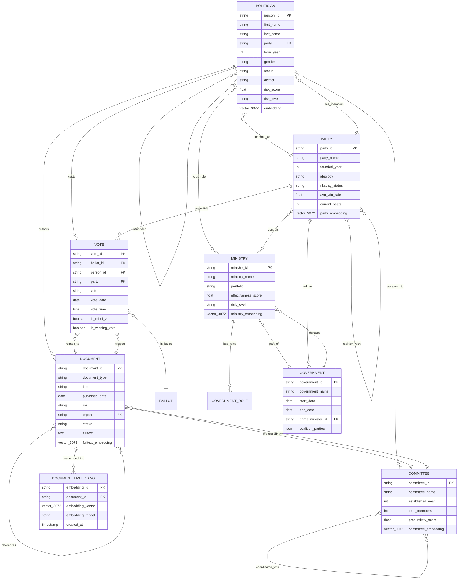
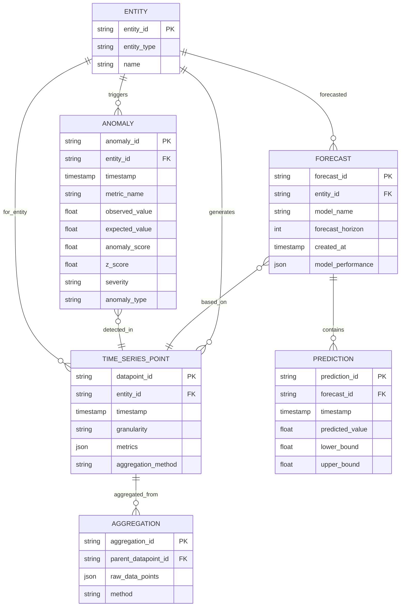
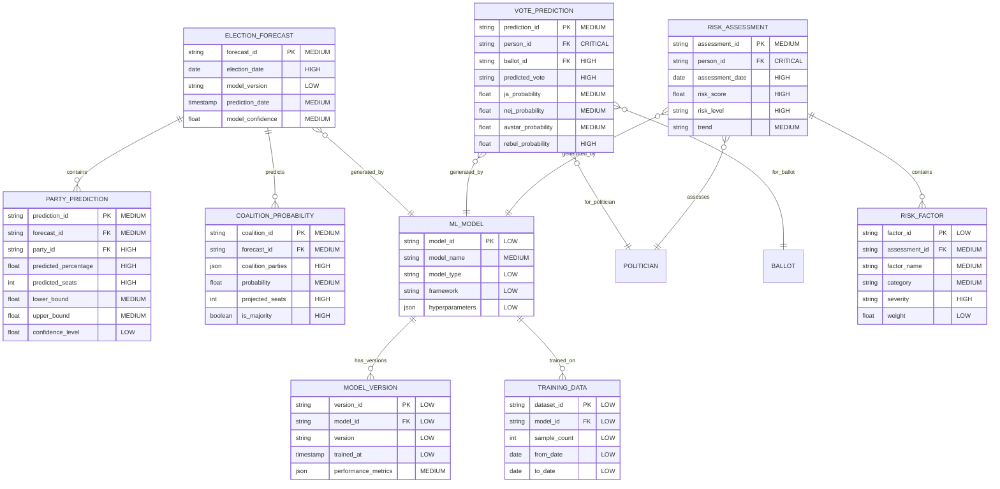
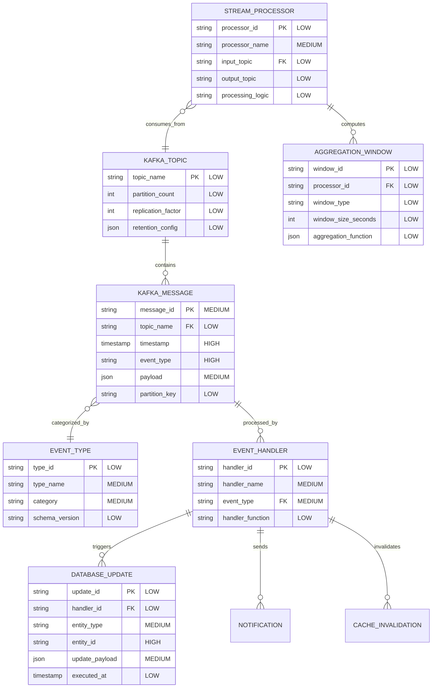
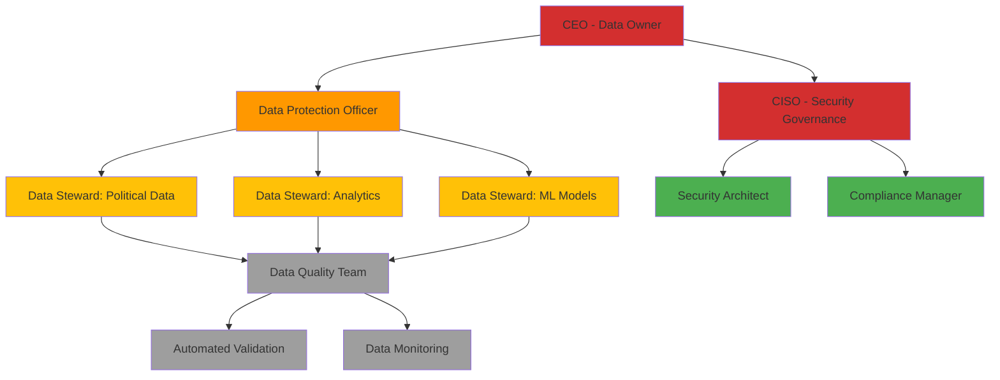
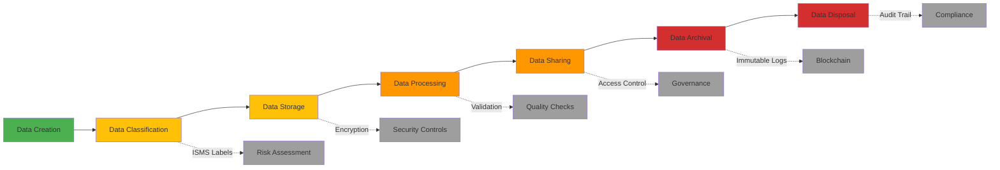

<p align="center">
  
</p>

<h1 align="center">📊 Riksdagsmonitor — Future Data Architecture Model</h1>

<p align="center">
  <strong>🚀 Evolution Roadmap: From Static Data to Semantic Intelligence Platform</strong><br>
  <em>🎯 Knowledge Graphs · AI Predictions · Vector Embeddings · GraphQL API</em>
</p>

<p align="center">
  <a href="#"></a>
  <a href="#"></a>
  <a href="#"></a>
  <a href="#"></a>
</p>

**📋 Document Owner:** CEO | **📄 Version:** 1.0 | **📅 Last Updated:** 2026-02-15 (UTC)  
**🔄 Review Cycle:** Annual | **⏰ Next Review:** 2027-02-15  
**🏢 Owner:** Hack23 AB (Org.nr 5595347807) | **🏷️ Classification:** Public

---

## Executive Summary

This document outlines the future data architecture for Riksdagsmonitor over the next 6 years (2026-2032), evolving from a static CSV-based political intelligence platform into an **advanced semantic knowledge system** powered by graph databases, vector embeddings, machine learning, and real-time streaming analytics.

**Strategic Vision:**
- 🧠 **Knowledge Graph Foundation** (2026-2027): Neo4j property graph with RDF/SPARQL capabilities
- 🤖 **AI Predictive Models** (2027-2028): Election forecasting, vote prediction, coalition analysis
- 📡 **Real-Time Streaming** (2028-2030): Apache Kafka pipelines with sub-second data ingestion
- 🌐 **Decentralized Intelligence** (2030-2032): Federated learning, blockchain immutability

**Key Transformations:**

| Aspect | Current (2026) | Future (2032) |
|--------|----------------|---------------|
| **Data Model** | Relational CSV exports | Neo4j graph + RDF triples |
| **Query Language** | JavaScript filters | GraphQL + SPARQL + Cypher |
| **Search** | Text matching | Semantic vector embeddings (3072-dim) |
| **Analytics** | Static aggregations | Real-time streaming (Kafka/Flink) |
| **Intelligence** | Historical reports | Predictive AI models (TensorFlow.js) |
| **API** | Static JSON files | GraphQL subscriptions |
| **Scale** | 109K documents | 10M+ documents with graph relationships |

**Current Baseline:**
- **2,494 Politicians** → Future: 50K+ historical figures with complete career graphs
- **3.5M+ Voting Records** → Future: 100M+ votes with coalition network analysis
- **109K Documents** → Future: 10M+ documents with semantic relationships
- **14 Languages** → Future: 30+ languages with neural machine translation
- **19 CIA Products** → Future: 100+ intelligence products with AI-generated insights

---

## Table of Contents

1. [Semantic Data Model (RDF/Knowledge Graph)](#1-semantic-data-model-rdfknowledge-graph)
2. [Predictive Model Schemas](#2-predictive-model-schemas)
3. [Vector Embeddings Architecture](#3-vector-embeddings-architecture)
4. [Network Analysis Data Structures](#4-network-analysis-data-structures)
5. [Time-Series Data Model](#5-time-series-data-model)
6. [Multi-Language Enhanced Model](#6-multi-language-enhanced-model)
7. [GraphQL API Schema](#7-graphql-api-schema)
8. [Advanced Entity-Relationship Diagrams](#8-advanced-entity-relationship-diagrams)
9. [Implementation Roadmap](#9-implementation-roadmap)
10. [Technology Stack Evolution](#10-technology-stack-evolution)
11. [ISMS Compliance & Data Governance](#11-isms-compliance--data-governance)
12. [Related Documentation](#12-related-documentation)

---

## 1. Semantic Data Model (RDF/Knowledge Graph)

### 1.1 Neo4j Property Graph Schema

**Objective:** Transform flat CSV data into rich graph relationships enabling complex traversals, pattern matching, and influence analysis.

#### 1.1.1 Core Node Types

```cypher
// Politician Node
CREATE (p:Politician {
  person_id: "0479479309",
  first_name: "Anna",
  last_name: "Svensson",
  party: "S",
  born_year: 1975,
  gender: "Female",
  status: "Tjänstgörande riksdagsledamot",
  district: "Stockholm",
  risk_score: 42.5,
  risk_level: "MEDIUM",
  embedding_vector: [0.123, -0.456, ..., 0.789]  // 3072-dimensional vector
})

// Party Node
CREATE (party:Party {
  party_id: "S",
  party_name: "Socialdemokraterna",
  founded_year: 1889,
  ideology: "Social Democracy",
  riksdag_status: "ACTIVE",
  avg_win_rate: 68.5,
  current_seats: 107
})

// Document Node
CREATE (d:Document {
  document_id: "H901FiU1",
  document_type: "bet",
  title: "Finansutskottets betänkande om statsbudgeten",
  published_date: date("2024-11-15"),
  rm: "2024/25",
  organ: "FiU",
  status: "BESLUTAD",
  fulltext_embedding: [0.234, -0.567, ..., 0.891]  // Semantic embedding
})

// Vote Node
CREATE (v:Vote {
  vote_id: "V202400123",
  ballot_id: "B20240056",
  vote: "Ja",
  vote_date: date("2024-11-20"),
  vote_time: time("14:30:00"),
  is_rebel_vote: false,
  is_winning_vote: true
})

// Committee Node
CREATE (c:Committee {
  committee_id: "FiU",
  committee_name: "Finansutskottet",
  committee_name_en: "Finance Committee",
  established_year: 1867,
  total_members: 17,
  productivity_score: 87.3
})

// Ministry Node
CREATE (m:Ministry {
  ministry_id: "FIN",
  ministry_name: "Finansdepartementet",
  ministry_name_en: "Ministry of Finance",
  portfolio: "Budget, taxes, financial policy",
  effectiveness_score: 82.1,
  risk_level: "LOW"
})

// Government Node
CREATE (g:Government {
  government_id: "GOV_2022",
  government_name: "Kristersson Cabinet",
  start_date: date("2022-10-18"),
  end_date: null,  // Current government
  prime_minister_id: "0566673031",
  coalition_parties: ["M", "SD", "KD", "L"]
})
```

#### 1.1.2 Relationship Types

```cypher
// Political Relationships
(:Politician)-[:MEMBER_OF {since: date, until: date}]->(:Party)
(:Politician)-[:CAST_VOTE {vote: "Ja|Nej|Avstår", is_rebel: boolean}]->(:Vote)
(:Politician)-[:AUTHORED {author_order: integer}]->(:Document)
(:Politician)-[:ASSIGNED_TO {start_date: date, end_date: date}]->(:Committee)
(:Politician)-[:HOLDS_ROLE {role_type: string, start_date: date}]->(:Ministry)

// Party Relationships
(:Party)-[:COALITION_WITH {government_id: string, from: date, to: date}]->(:Party)
(:Party)-[:CONTROLS {ministerial_count: integer}]->(:Ministry)
(:Party)-[:HISTORICAL_MERGER {year: integer}]->(:Party)

// Document Relationships
(:Document)-[:PROCESSED_BY]->(:Committee)
(:Document)-[:TRIGGERED_VOTE]->(:Vote)
(:Document)-[:REFERENCES {reference_type: "proposal|amendment|critique"}]->(:Document)
(:Document)-[:RESPONSE_TO]->(:Document)
(:Document)-[:CO_AUTHORED_WITH]->(:Politician)

// Vote Relationships
(:Vote)-[:IN_BALLOT]->(:Ballot)
(:Vote)-[:RELATES_TO]->(:Document)
(:Vote)-[:PARTY_LINE {is_rebel: boolean}]->(:Party)

// Committee Relationships
(:Committee)-[:PRODUCES]->(:Document)
(:Committee)-[:HAS_MEMBER {role: "chair|member|deputy", since: date}]->(:Politician)
(:Committee)-[:RESPONSIBLE_FOR {policy_area: string}]->(:Ministry)

// Influence Networks (Advanced)
(:Politician)-[:INFLUENCES {strength: float, direction: "positive|negative"}]->(:Politician)
(:Politician)-[:COLLABORATES_WITH {collaboration_count: integer}]->(:Politician)
(:Party)-[:OPPOSES {opposition_rate: float}]->(:Party)
(:Committee)-[:COORDINATES_WITH {coordination_score: float}]->(:Committee)
```

#### 1.1.3 Cypher Query Examples

**Example 1: Find MPs with highest rebellion rate**
```cypher
MATCH (p:Politician)-[v:CAST_VOTE]->(vote:Vote)
WHERE v.is_rebel = true
WITH p, count(vote) as rebel_count, p.total_votes as total
RETURN p.first_name, p.last_name, p.party, 
       rebel_count, 
       (rebel_count * 100.0 / total) as rebel_rate
ORDER BY rebel_rate DESC
LIMIT 10
```

**Example 2: Coalition formation probability**
```cypher
MATCH (p1:Party)-[c:COALITION_WITH]->(p2:Party)
WHERE c.government_id IS NOT NULL
WITH p1, p2, count(c) as coalition_count
MATCH (p1)-[:COALITION_WITH]->(p2)
WHERE p1.party_id < p2.party_id  // Avoid duplicates
RETURN p1.party_name, p2.party_name, coalition_count,
       coalition_count * 1.0 / 10 as coalition_probability
ORDER BY coalition_probability DESC
```

**Example 3: Document influence cascades**
```cypher
MATCH path = (d1:Document)-[:REFERENCES*1..3]->(d2:Document)
WHERE d1.document_type = "prop"  // Government bills
RETURN d1.title, d2.title, length(path) as influence_distance
ORDER BY influence_distance
```

**Example 4: Committee expertise mapping**
```cypher
MATCH (c:Committee)<-[:ASSIGNED_TO]-(p:Politician)
WITH c, collect({name: p.first_name + " " + p.last_name, 
                  experience: p.total_years}) as members
RETURN c.committee_name, members,
       size(members) as member_count,
       reduce(total = 0, m IN members | total + m.experience) / size(members) as avg_experience
ORDER BY avg_experience DESC
```


### 1.2 RDF/OWL Ontology Model

**Objective:** Enable interoperability with Linked Open Data (LOD) ecosystem and semantic web standards.

#### 1.2.1 Vocabulary Namespaces

```turtle
@prefix riksdag: <https://data.riksdagsmonitor.se/vocab#> .
@prefix foaf: <http://xmlns.com/foaf/0.1/> .
@prefix org: <http://www.w3.org/ns/org#> .
@prefix dcterms: <http://purl.org/dc/terms/> .
@prefix schema: <http://schema.org/> .
@prefix vcard: <http://www.w3.org/2006/vcard/ns#> .
@prefix gov: <http://reference.data.gov.uk/def/central-government/> .
@prefix xsd: <http://www.w3.org/2001/XMLSchema#> .
```

#### 1.2.2 RDF Triple Examples

**Politician Entity**
```turtle
riksdag:person_0479479309 a foaf:Person, riksdag:Politician ;
    foaf:firstName "Anna" ;
    foaf:familyName "Svensson" ;
    foaf:gender "Female" ;
    schema:birthDate "1975-01-15"^^xsd:date ;
    riksdag:personId "0479479309" ;
    riksdag:party riksdag:party_S ;
    riksdag:district "Stockholm" ;
    riksdag:status "Tjänstgörande riksdagsledamot"@sv, "Serving MP"@en ;
    riksdag:riskScore "42.5"^^xsd:decimal ;
    riksdag:riskLevel riksdag:MEDIUM ;
    org:memberOf riksdag:party_S ;
    dcterms:identifier "0479479309" .
```

**Party Entity**
```turtle
riksdag:party_S a org:FormalOrganization, riksdag:PoliticalParty ;
    schema:name "Socialdemokraterna"@sv, "Social Democrats"@en ;
    schema:alternateName "S" ;
    schema:foundingDate "1889"^^xsd:gYear ;
    riksdag:ideology "Social Democracy"@en, "Socialdemokrati"@sv ;
    riksdag:riksdagStatus riksdag:ACTIVE ;
    riksdag:currentSeats "107"^^xsd:integer ;
    riksdag:avgWinRate "68.5"^^xsd:decimal ;
    dcterms:identifier "S" .
```

**Document Entity**
```turtle
riksdag:document_H901FiU1 a foaf:Document, riksdag:ParliamentaryDocument ;
    dcterms:title "Finansutskottets betänkande om statsbudgeten"@sv ;
    dcterms:identifier "H901FiU1" ;
    riksdag:documentType "bet" ;
    riksdag:riksmote "2024/25" ;
    dcterms:publisher riksdag:committee_FiU ;
    dcterms:issued "2024-11-15"^^xsd:date ;
    riksdag:status "BESLUTAD"@sv, "DECIDED"@en ;
    riksdag:organ "FiU" ;
    dcterms:creator riksdag:person_0479479309 ;
    riksdag:processedBy riksdag:committee_FiU .
```

**Vote Entity**
```turtle
riksdag:vote_V202400123 a riksdag:Vote ;
    riksdag:ballot riksdag:ballot_B20240056 ;
    riksdag:voter riksdag:person_0479479309 ;
    riksdag:voteValue "Ja"@sv, "Yes"@en ;
    riksdag:voteDate "2024-11-20"^^xsd:date ;
    riksdag:voteTime "14:30:00"^^xsd:time ;
    riksdag:isRebelVote "false"^^xsd:boolean ;
    riksdag:isWinningVote "true"^^xsd:boolean ;
    riksdag:relatesTo riksdag:document_H901FiU1 .
```

#### 1.2.3 SPARQL Query Examples

**Example 1: Find all MPs from Stockholm district**
```sparql
PREFIX riksdag: <https://data.riksdagsmonitor.se/vocab#>
PREFIX foaf: <http://xmlns.com/foaf/0.1/>

SELECT ?name ?party ?riskScore
WHERE {
  ?person a riksdag:Politician ;
          foaf:firstName ?firstName ;
          foaf:familyName ?familyName ;
          riksdag:district "Stockholm" ;
          riksdag:party ?partyUri ;
          riksdag:riskScore ?riskScore .
  ?partyUri schema:alternateName ?party .
  
  BIND(CONCAT(?firstName, " ", ?familyName) AS ?name)
}
ORDER BY DESC(?riskScore)
```

**Example 2: Coalition network analysis**
```sparql
PREFIX riksdag: <https://data.riksdagsmonitor.se/vocab#>
PREFIX schema: <http://schema.org/>

SELECT ?party1Name ?party2Name (COUNT(?coalition) as ?coalitionCount)
WHERE {
  ?party1 a riksdag:PoliticalParty ;
          schema:name ?party1Name ;
          riksdag:coalitionWith ?party2 .
  
  ?party2 schema:name ?party2Name .
  
  ?coalition riksdag:involvedParty ?party1, ?party2 .
  
  FILTER(?party1 < ?party2)  # Avoid duplicate pairs
}
GROUP BY ?party1Name ?party2Name
ORDER BY DESC(?coalitionCount)
```

**Example 3: Document citation network**
```sparql
PREFIX riksdag: <https://data.riksdagsmonitor.se/vocab#>
PREFIX dcterms: <http://purl.org/dc/terms/>

SELECT ?docTitle ?referencedTitle (COUNT(?reference) as ?citationCount)
WHERE {
  ?doc a riksdag:ParliamentaryDocument ;
       dcterms:title ?docTitle ;
       riksdag:references ?referenced .
  
  ?referenced dcterms:title ?referencedTitle .
  
  BIND(?referenced as ?reference)
}
GROUP BY ?docTitle ?referencedTitle
ORDER BY DESC(?citationCount)
LIMIT 20
```

### 1.3 Knowledge Graph ERD



---

## 2. Predictive Model Schemas

### 2.1 Election Forecasting Model

**Objective:** Predict election outcomes using 50+ years of historical data, polling trends, economic indicators.

#### 2.1.1 Model Architecture (TensorFlow.js)

```javascript
// Election Forecasting Neural Network
const electionModel = tf.sequential({
  layers: [
    tf.layers.dense({
      inputShape: [64],  // 64 input features
      units: 128,
      activation: 'relu',
      kernelRegularizer: tf.regularizers.l2({l2: 0.01})
    }),
    tf.layers.dropout({rate: 0.3}),
    tf.layers.dense({
      units: 64,
      activation: 'relu',
      kernelRegularizer: tf.regularizers.l2({l2: 0.01})
    }),
    tf.layers.dropout({rate: 0.2}),
    tf.layers.dense({
      units: 32,
      activation: 'relu'
    }),
    tf.layers.dense({
      units: 8,  // 8 political parties
      activation: 'softmax'  // Probability distribution
    })
  ]
});

electionModel.compile({
  optimizer: tf.train.adam(0.001),
  loss: 'categoricalCrossentropy',
  metrics: ['accuracy', 'precision', 'recall']
});
```

#### 2.1.2 Training Data Schema (JSON Schema)

```json
{
  "$schema": "http://json-schema.org/draft-07/schema#",
  "title": "ElectionTrainingData",
  "type": "object",
  "required": ["election_id", "features", "outcomes"],
  "properties": {
    "election_id": {
      "type": "string",
      "description": "Unique election identifier (e.g., riksdag_2022)"
    },
    "election_year": {
      "type": "integer",
      "minimum": 1911,
      "maximum": 2050
    },
    "features": {
      "type": "object",
      "required": ["polling", "economic", "historical", "sentiment"],
      "properties": {
        "polling": {
          "type": "object",
          "description": "Polling data (6 months before election)",
          "properties": {
            "S": {"type": "number", "minimum": 0, "maximum": 100},
            "M": {"type": "number", "minimum": 0, "maximum": 100},
            "SD": {"type": "number", "minimum": 0, "maximum": 100},
            "C": {"type": "number", "minimum": 0, "maximum": 100},
            "V": {"type": "number", "minimum": 0, "maximum": 100},
            "KD": {"type": "number", "minimum": 0, "maximum": 100},
            "L": {"type": "number", "minimum": 0, "maximum": 100},
            "MP": {"type": "number", "minimum": 0, "maximum": 100},
            "polling_trend": {"type": "string", "enum": ["rising", "falling", "stable"]},
            "polling_volatility": {"type": "number", "minimum": 0, "maximum": 1}
          }
        },
        "economic": {
          "type": "object",
          "description": "Economic indicators",
          "properties": {
            "gdp_growth_rate": {"type": "number"},
            "unemployment_rate": {"type": "number", "minimum": 0, "maximum": 100},
            "inflation_rate": {"type": "number"},
            "consumer_confidence": {"type": "number", "minimum": 0, "maximum": 100},
            "government_approval": {"type": "number", "minimum": 0, "maximum": 100}
          }
        },
        "historical": {
          "type": "object",
          "description": "Historical election performance",
          "properties": {
            "previous_election_result": {
              "type": "object",
              "additionalProperties": {"type": "number"}
            },
            "incumbent_party": {"type": "string"},
            "years_in_government": {"type": "integer"},
            "coalition_stability": {"type": "number", "minimum": 0, "maximum": 1}
          }
        },
        "sentiment": {
          "type": "object",
          "description": "Social media and news sentiment",
          "properties": {
            "positive_mentions": {"type": "integer"},
            "negative_mentions": {"type": "integer"},
            "neutral_mentions": {"type": "integer"},
            "overall_sentiment": {"type": "number", "minimum": -1, "maximum": 1}
          }
        }
      }
    },
    "outcomes": {
      "type": "object",
      "description": "Actual election results (ground truth)",
      "required": ["party_results", "turnout"],
      "properties": {
        "party_results": {
          "type": "object",
          "additionalProperties": {
            "type": "object",
            "properties": {
              "votes": {"type": "integer", "minimum": 0},
              "percentage": {"type": "number", "minimum": 0, "maximum": 100},
              "seats": {"type": "integer", "minimum": 0, "maximum": 349}
            }
          }
        },
        "turnout": {
          "type": "number",
          "minimum": 0,
          "maximum": 100,
          "description": "Voter turnout percentage"
        }
      }
    }
  }
}
```

#### 2.1.3 Prediction Output Schema

```json
{
  "$schema": "http://json-schema.org/draft-07/schema#",
  "title": "ElectionPrediction",
  "type": "object",
  "required": ["prediction_id", "election_date", "predictions"],
  "properties": {
    "prediction_id": {
      "type": "string",
      "description": "Unique prediction identifier"
    },
    "model_version": {
      "type": "string",
      "description": "Model version used (e.g., election_forecaster_v1.2)"
    },
    "election_date": {
      "type": "string",
      "format": "date",
      "description": "Target election date"
    },
    "prediction_date": {
      "type": "string",
      "format": "date-time",
      "description": "When prediction was made"
    },
    "predictions": {
      "type": "object",
      "description": "Party-wise predictions",
      "patternProperties": {
        "^[A-Z]{1,3}$": {
          "type": "object",
          "required": ["predicted_percentage", "confidence_interval"],
          "properties": {
            "predicted_percentage": {
              "type": "number",
              "minimum": 0,
              "maximum": 100,
              "description": "Predicted vote share"
            },
            "predicted_seats": {
              "type": "integer",
              "minimum": 0,
              "maximum": 349,
              "description": "Predicted seat count"
            },
            "confidence_interval": {
              "type": "object",
              "properties": {
                "lower_bound": {"type": "number", "minimum": 0, "maximum": 100},
                "upper_bound": {"type": "number", "minimum": 0, "maximum": 100},
                "confidence_level": {"type": "number", "enum": [0.90, 0.95, 0.99]}
              }
            },
            "probability_above_threshold": {
              "type": "number",
              "minimum": 0,
              "maximum": 1,
              "description": "Probability of exceeding 4% threshold"
            }
          }
        }
      }
    },
    "coalition_probabilities": {
      "type": "array",
      "description": "Likely coalition formations",
      "items": {
        "type": "object",
        "properties": {
          "coalition_parties": {"type": "array", "items": {"type": "string"}},
          "probability": {"type": "number", "minimum": 0, "maximum": 1},
          "projected_seats": {"type": "integer", "minimum": 0, "maximum": 349},
          "is_majority": {"type": "boolean"}
        }
      }
    },
    "model_confidence": {
      "type": "number",
      "minimum": 0,
      "maximum": 1,
      "description": "Overall model confidence (0-1)"
    }
  }
}
```


### 2.2 Vote Prediction Model

**Objective:** Predict individual MP voting behavior based on party affiliation, historical patterns, personal ideology, coalition dynamics.

#### 2.2.1 Vote Prediction Schema

```json
{
  "$schema": "http://json-schema.org/draft-07/schema#",
  "title": "VotePrediction",
  "type": "object",
  "required": ["vote_id", "ballot_id", "person_id", "prediction"],
  "properties": {
    "vote_id": {"type": "string"},
    "ballot_id": {"type": "string"},
    "person_id": {"type": "string"},
    "document_id": {"type": "string"},
    "prediction": {
      "type": "object",
      "required": ["predicted_vote", "probabilities"],
      "properties": {
        "predicted_vote": {
          "type": "string",
          "enum": ["Ja", "Nej", "Avstår", "Frånvarande"]
        },
        "probabilities": {
          "type": "object",
          "properties": {
            "Ja": {"type": "number", "minimum": 0, "maximum": 1},
            "Nej": {"type": "number", "minimum": 0, "maximum": 1},
            "Avstår": {"type": "number", "minimum": 0, "maximum": 1},
            "Frånvarande": {"type": "number", "minimum": 0, "maximum": 1}
          }
        },
        "rebel_probability": {
          "type": "number",
          "minimum": 0,
          "maximum": 1,
          "description": "Probability of voting against party line"
        },
        "features_used": {
          "type": "object",
          "properties": {
            "party_position": {"type": "string"},
            "personal_ideology_score": {"type": "number"},
            "historical_rebel_rate": {"type": "number"},
            "document_topic_alignment": {"type": "number"},
            "coalition_pressure": {"type": "number"}
          }
        }
      }
    }
  }
}
```

### 2.3 Risk Assessment Model

**Objective:** Predict politician and party risk levels using multi-factor analysis.

#### 2.3.1 Risk Assessment Schema

```json
{
  "$schema": "http://json-schema.org/draft-07/schema#",
  "title": "PoliticianRiskAssessment",
  "type": "object",
  "required": ["person_id", "assessment_date", "risk_score", "risk_level"],
  "properties": {
    "person_id": {"type": "string"},
    "assessment_date": {"type": "string", "format": "date"},
    "risk_score": {
      "type": "number",
      "minimum": 0,
      "maximum": 100
    },
    "risk_level": {
      "type": "string",
      "enum": ["LOW", "MEDIUM", "HIGH", "CRITICAL"]
    },
    "risk_factors": {
      "type": "array",
      "items": {
        "type": "object",
        "properties": {
          "factor_name": {"type": "string"},
          "factor_category": {
            "type": "string",
            "enum": ["effectiveness", "discipline", "productivity", "collaboration", "ethics"]
          },
          "severity": {
            "type": "string",
            "enum": ["LOW", "MEDIUM", "HIGH", "CRITICAL"]
          },
          "weight": {"type": "number", "minimum": 0, "maximum": 1},
          "description": {"type": "string"}
        }
      }
    },
    "metrics": {
      "type": "object",
      "properties": {
        "annual_absence_rate": {"type": "number"},
        "annual_rebel_rate": {"type": "number"},
        "document_production_rate": {"type": "number"},
        "committee_participation": {"type": "number"},
        "collaboration_index": {"type": "number"}
      }
    },
    "trend": {
      "type": "string",
      "enum": ["IMPROVING", "STABLE", "DECLINING"],
      "description": "Risk trend over last 12 months"
    }
  }
}
```

---

## 3. Vector Embeddings Architecture

### 3.1 OpenAI Text-Embedding-3-Large Integration

**Objective:** Enable semantic search, document similarity, and AI-powered content discovery across 109K+ documents.

#### 3.1.1 Embedding Generation Pipeline

```javascript
// OpenAI Embedding Generation
import OpenAI from 'openai';

const openai = new OpenAI({
  apiKey: process.env.OPENAI_API_KEY
});

async function generateEmbedding(text) {
  const response = await openai.embeddings.create({
    model: "text-embedding-3-large",
    input: text,
    encoding_format: "float",
    dimensions: 3072  // Full 3072-dimensional vector
  });
  
  return response.data[0].embedding;  // Array of 3072 floats
}

// Document Embedding with Metadata
async function embedDocument(document) {
  const fullText = [
    document.title,
    document.subtitle,
    document.summary,
    document.fulltext.slice(0, 8000)  // Limit to ~8K tokens
  ].filter(Boolean).join("\n\n");
  
  const embedding = await generateEmbedding(fullText);
  
  return {
    document_id: document.document_id,
    embedding_vector: embedding,
    embedding_model: "text-embedding-3-large",
    embedding_dimensions: 3072,
    text_length: fullText.length,
    created_at: new Date().toISOString()
  };
}
```

#### 3.1.2 Pinecone Vector Database Schema

```javascript
// Pinecone Index Configuration
const pineconeIndex = {
  name: "riksdagsmonitor-documents",
  dimension: 3072,
  metric: "cosine",  // Cosine similarity for semantic search
  pods: 1,
  replicas: 1,
  pod_type: "p2.x1"  // Production-grade pods
};

// Upsert Document Embedding
async function upsertDocumentEmbedding(index, document, embedding) {
  await index.upsert([{
    id: document.document_id,  // Primary key
    values: embedding.embedding_vector,  // 3072-dim vector
    metadata: {
      document_type: document.document_type,
      title: document.title,
      published_date: document.published_date,
      rm: document.rm,
      organ: document.organ,
      authors: document.authors,  // Array of person_ids
      party: document.primary_party,
      tags: document.tags,  // Array of topic tags
      language: document.language
    }
  }]);
}

// Semantic Search Query
async function semanticSearch(index, queryText, topK = 10, filter = {}) {
  const queryEmbedding = await generateEmbedding(queryText);
  
  const results = await index.query({
    vector: queryEmbedding,
    topK: topK,
    includeMetadata: true,
    filter: filter  // e.g., {organ: "FiU", published_date: {$gte: "2024-01-01"}}
  });
  
  return results.matches.map(match => ({
    document_id: match.id,
    similarity_score: match.score,  // 0-1 (cosine similarity)
    metadata: match.metadata
  }));
}
```

#### 3.1.3 Embedding Metadata Schema

```json
{
  "$schema": "http://json-schema.org/draft-07/schema#",
  "title": "DocumentEmbedding",
  "type": "object",
  "required": ["embedding_id", "document_id", "embedding_vector"],
  "properties": {
    "embedding_id": {
      "type": "string",
      "description": "Unique embedding identifier"
    },
    "document_id": {
      "type": "string",
      "description": "Reference to source document"
    },
    "embedding_vector": {
      "type": "array",
      "items": {"type": "number"},
      "minItems": 3072,
      "maxItems": 3072,
      "description": "3072-dimensional embedding vector"
    },
    "embedding_model": {
      "type": "string",
      "enum": ["text-embedding-3-large", "text-embedding-3-small", "ada-002"],
      "description": "OpenAI model used"
    },
    "embedding_dimensions": {
      "type": "integer",
      "enum": [3072, 1536, 256],
      "description": "Vector dimensionality"
    },
    "text_content": {
      "type": "string",
      "description": "Original text used for embedding"
    },
    "text_length": {
      "type": "integer",
      "description": "Character count of embedded text"
    },
    "token_count": {
      "type": "integer",
      "description": "Estimated token count"
    },
    "created_at": {
      "type": "string",
      "format": "date-time"
    },
    "metadata": {
      "type": "object",
      "properties": {
        "document_type": {"type": "string"},
        "language": {"type": "string"},
        "party": {"type": "string"},
        "topic_tags": {"type": "array", "items": {"type": "string"}}
      }
    }
  }
}
```

### 3.2 Semantic Search Use Cases

#### 3.2.1 Similar Documents Query

```javascript
// Find documents similar to a given document
async function findSimilarDocuments(documentId, topK = 10) {
  const document = await getDocument(documentId);
  const queryText = `${document.title} ${document.summary}`;
  
  return await semanticSearch(pineconeIndex, queryText, topK, {
    document_type: document.document_type,
    organ: document.organ
  });
}
```

#### 3.2.2 Cross-Language Semantic Search

```javascript
// Search across 14 languages with semantic understanding
async function crossLanguageSearch(query, sourceLanguage, topK = 20) {
  // OpenAI embeddings are multilingual by default
  const results = await semanticSearch(pineconeIndex, query, topK);
  
  // Group by language
  const groupedByLanguage = results.reduce((acc, result) => {
    const lang = result.metadata.language;
    if (!acc[lang]) acc[lang] = [];
    acc[lang].push(result);
    return acc;
  }, {});
  
  return groupedByLanguage;
}
```

#### 3.2.3 Topic Clustering

```javascript
// Cluster documents by semantic similarity
import { kmeans } from 'ml-kmeans';

async function clusterDocumentsByTopic(documentIds, numClusters = 10) {
  // Fetch embeddings for all documents
  const embeddings = await Promise.all(
    documentIds.map(id => getDocumentEmbedding(id))
  );
  
  // K-means clustering on 3072-dim vectors
  const clusters = kmeans(embeddings, numClusters, {
    initialization: 'kmeans++',
    maxIterations: 100
  });
  
  return clusters.clusters.map((cluster, idx) => ({
    cluster_id: idx,
    document_count: cluster.length,
    documents: cluster.map(docIdx => documentIds[docIdx]),
    centroid: clusters.centroids[idx]
  }));
}
```

---

## 4. Network Analysis Data Structures

### 4.1 Influence Network Graph Schema

**Objective:** Model political influence, collaboration, and power dynamics using graph analytics.

#### 4.1.1 Influence Edge Schema

```json
{
  "$schema": "http://json-schema.org/draft-07/schema#",
  "title": "InfluenceEdge",
  "type": "object",
  "required": ["source_person_id", "target_person_id", "influence_score"],
  "properties": {
    "edge_id": {"type": "string"},
    "source_person_id": {
      "type": "string",
      "description": "Influencer"
    },
    "target_person_id": {
      "type": "string",
      "description": "Influenced"
    },
    "influence_score": {
      "type": "number",
      "minimum": 0,
      "maximum": 1,
      "description": "Influence strength (0-1)"
    },
    "influence_type": {
      "type": "string",
      "enum": ["voting_alignment", "co_authorship", "committee_collaboration", "party_hierarchy", "coalition_dynamics"]
    },
    "confidence": {
      "type": "number",
      "minimum": 0,
      "maximum": 1
    },
    "evidence": {
      "type": "array",
      "items": {
        "type": "object",
        "properties": {
          "evidence_type": {"type": "string"},
          "document_id": {"type": "string"},
          "vote_id": {"type": "string"},
          "strength": {"type": "number"}
        }
      }
    },
    "temporal_range": {
      "type": "object",
      "properties": {
        "start_date": {"type": "string", "format": "date"},
        "end_date": {"type": "string", "format": "date"}
      }
    }
  }
}
```

#### 4.1.2 Centrality Metrics Schema

```json
{
  "$schema": "http://json-schema.org/draft-07/schema#",
  "title": "CentralityMetrics",
  "type": "object",
  "required": ["person_id", "metrics"],
  "properties": {
    "person_id": {"type": "string"},
    "calculated_at": {"type": "string", "format": "date-time"},
    "metrics": {
      "type": "object",
      "required": ["betweenness", "closeness", "eigenvector", "pagerank"],
      "properties": {
        "betweenness_centrality": {
          "type": "number",
          "minimum": 0,
          "maximum": 1,
          "description": "Bridge between communities (0-1)"
        },
        "closeness_centrality": {
          "type": "number",
          "minimum": 0,
          "maximum": 1,
          "description": "Average distance to all nodes (0-1)"
        },
        "eigenvector_centrality": {
          "type": "number",
          "minimum": 0,
          "maximum": 1,
          "description": "Influence of influential connections (0-1)"
        },
        "pagerank": {
          "type": "number",
          "minimum": 0,
          "maximum": 1,
          "description": "PageRank score (0-1)"
        },
        "degree_centrality": {
          "type": "number",
          "description": "Number of direct connections"
        },
        "clustering_coefficient": {
          "type": "number",
          "minimum": 0,
          "maximum": 1,
          "description": "How connected neighbors are (0-1)"
        }
      }
    },
    "ranking": {
      "type": "object",
      "properties": {
        "betweenness_rank": {"type": "integer"},
        "closeness_rank": {"type": "integer"},
        "eigenvector_rank": {"type": "integer"},
        "pagerank_rank": {"type": "integer"}
      }
    }
  }
}
```


### 4.2 Community Detection Schema

**Objective:** Identify political coalitions, voting blocs, and informal alliances using community detection algorithms.

#### 4.2.1 Community Structure

```json
{
  "$schema": "http://json-schema.org/draft-07/schema#",
  "title": "PoliticalCommunity",
  "type": "object",
  "required": ["community_id", "members", "cohesion_score"],
  "properties": {
    "community_id": {"type": "string"},
    "community_name": {"type": "string"},
    "detection_algorithm": {
      "type": "string",
      "enum": ["louvain", "leiden", "label_propagation", "walktrap"]
    },
    "members": {
      "type": "array",
      "items": {
        "type": "object",
        "properties": {
          "person_id": {"type": "string"},
          "membership_strength": {"type": "number", "minimum": 0, "maximum": 1}
        }
      }
    },
    "cohesion_score": {
      "type": "number",
      "minimum": 0,
      "maximum": 1,
      "description": "Internal connectivity strength"
    },
    "modularity": {
      "type": "number",
      "description": "Modularity score for community quality"
    },
    "dominant_parties": {
      "type": "array",
      "items": {"type": "string"}
    },
    "cross_party_rate": {
      "type": "number",
      "minimum": 0,
      "maximum": 1,
      "description": "Proportion of members from minority parties"
    }
  }
}
```

### 4.3 Network Analysis ERD

```mermaid
erDiagram
    POLITICIAN ||--o{ INFLUENCE_EDGE : source
    POLITICIAN ||--o{ INFLUENCE_EDGE : target
    POLITICIAN ||--o{ CENTRALITY_METRICS : has_metrics
    POLITICIAN }o--o{ COMMUNITY : member_of
    
    PARTY ||--o{ COALITION_NETWORK : participates
    PARTY ||--o{ OPPOSITION_NETWORK : opposes
    
    COMMUNITY ||--o{ POLITICIAN : contains
    COMMUNITY ||--o{ COMMUNITY_BRIDGE : connects_to
    
    INFLUENCE_EDGE }o--|| POLITICIAN : from
    INFLUENCE_EDGE }o--|| POLITICIAN : to
    
    POLITICIAN {
        string person_id PK
        float betweenness_centrality
        float closeness_centrality
        float eigenvector_centrality
        float pagerank
        int degree_centrality
    }
    
    INFLUENCE_EDGE {
        string edge_id PK
        string source_person_id FK
        string target_person_id FK
        float influence_score
        string influence_type
        float confidence
        json evidence
    }
    
    CENTRALITY_METRICS {
        string metrics_id PK
        string person_id FK
        float betweenness
        float closeness
        float eigenvector
        float pagerank
        int betweenness_rank
        timestamp calculated_at
    }
    
    COMMUNITY {
        string community_id PK
        string community_name
        string detection_algorithm
        float cohesion_score
        float modularity
        json dominant_parties
        float cross_party_rate
    }
    
    COALITION_NETWORK {
        string coalition_id PK
        json party_members
        float coalition_strength
        int historical_count
        float probability_score
    }
    
    COMMUNITY_BRIDGE {
        string bridge_id PK
        string community1_id FK
        string community2_id FK
        json bridging_politicians
        float bridge_strength
    }
```

---

## 5. Time-Series Data Model

### 5.1 Historical Trend Schema (50+ Years)

**Objective:** Enable temporal analysis, forecasting, and anomaly detection across 50+ years of parliamentary data (1971-2026+).

#### 5.1.1 Time-Series Data Points

```json
{
  "$schema": "http://json-schema.org/draft-07/schema#",
  "title": "TimeSeriesDataPoint",
  "type": "object",
  "required": ["entity_id", "entity_type", "timestamp", "metrics"],
  "properties": {
    "datapoint_id": {"type": "string"},
    "entity_id": {
      "type": "string",
      "description": "ID of person, party, committee, etc."
    },
    "entity_type": {
      "type": "string",
      "enum": ["politician", "party", "committee", "ministry", "government"]
    },
    "timestamp": {
      "type": "string",
      "format": "date-time",
      "description": "ISO 8601 timestamp"
    },
    "granularity": {
      "type": "string",
      "enum": ["hourly", "daily", "weekly", "monthly", "quarterly", "yearly"],
      "description": "Time granularity"
    },
    "metrics": {
      "type": "object",
      "description": "Entity-specific metrics",
      "patternProperties": {
        ".*": {
          "type": "number"
        }
      }
    },
    "aggregation_method": {
      "type": "string",
      "enum": ["sum", "avg", "min", "max", "count", "stddev"]
    }
  }
}
```

#### 5.1.2 Politician Activity Time-Series

```json
{
  "entity_id": "0479479309",
  "entity_type": "politician",
  "timestamp": "2024-11-01T00:00:00Z",
  "granularity": "monthly",
  "metrics": {
    "votes_cast": 45,
    "documents_authored": 3,
    "speeches_delivered": 7,
    "committee_meetings_attended": 12,
    "rebel_votes": 2,
    "winning_votes": 38,
    "absence_count": 3,
    "collaboration_index": 0.72,
    "media_mentions": 15
  },
  "aggregation_method": "sum"
}
```

#### 5.1.3 Party Performance Time-Series

```json
{
  "entity_id": "S",
  "entity_type": "party",
  "timestamp": "2024-Q4",
  "granularity": "quarterly",
  "metrics": {
    "avg_win_rate": 68.5,
    "avg_discipline_score": 92.3,
    "avg_productivity": 75.8,
    "member_count": 107,
    "documents_produced": 342,
    "votes_won": 1456,
    "votes_lost": 678,
    "coalition_stability": 0.88,
    "polling_average": 28.5,
    "media_sentiment": 0.12
  },
  "aggregation_method": "avg"
}
```

### 5.2 Forecasting Data Model

**Objective:** Store forecasting outputs with confidence intervals and error metrics.

#### 5.2.1 Forecast Schema

```json
{
  "$schema": "http://json-schema.org/draft-07/schema#",
  "title": "TimeSeriesForecast",
  "type": "object",
  "required": ["forecast_id", "entity_id", "model_name", "predictions"],
  "properties": {
    "forecast_id": {"type": "string"},
    "entity_id": {"type": "string"},
    "entity_type": {"type": "string"},
    "model_name": {
      "type": "string",
      "description": "Forecasting model (ARIMA, Prophet, LSTM, etc.)"
    },
    "forecast_horizon": {
      "type": "integer",
      "description": "Number of periods forecasted"
    },
    "created_at": {"type": "string", "format": "date-time"},
    "predictions": {
      "type": "array",
      "items": {
        "type": "object",
        "required": ["timestamp", "predicted_value"],
        "properties": {
          "timestamp": {"type": "string", "format": "date-time"},
          "predicted_value": {"type": "number"},
          "lower_bound": {
            "type": "number",
            "description": "Lower confidence bound (95%)"
          },
          "upper_bound": {
            "type": "number",
            "description": "Upper confidence bound (95%)"
          },
          "prediction_interval": {
            "type": "number",
            "description": "Width of prediction interval"
          }
        }
      }
    },
    "model_performance": {
      "type": "object",
      "properties": {
        "mae": {"type": "number", "description": "Mean Absolute Error"},
        "rmse": {"type": "number", "description": "Root Mean Square Error"},
        "mape": {"type": "number", "description": "Mean Absolute Percentage Error"},
        "r_squared": {"type": "number", "description": "R-squared coefficient"}
      }
    }
  }
}
```

### 5.3 Anomaly Detection Schema

```json
{
  "$schema": "http://json-schema.org/draft-07/schema#",
  "title": "AnomalyDetection",
  "type": "object",
  "required": ["anomaly_id", "entity_id", "timestamp", "anomaly_score"],
  "properties": {
    "anomaly_id": {"type": "string"},
    "entity_id": {"type": "string"},
    "entity_type": {"type": "string"},
    "timestamp": {"type": "string", "format": "date-time"},
    "metric_name": {
      "type": "string",
      "description": "Which metric triggered anomaly"
    },
    "observed_value": {"type": "number"},
    "expected_value": {"type": "number"},
    "anomaly_score": {
      "type": "number",
      "minimum": 0,
      "maximum": 1,
      "description": "Anomaly strength (0-1)"
    },
    "z_score": {
      "type": "number",
      "description": "Standard deviations from mean"
    },
    "severity": {
      "type": "string",
      "enum": ["LOW", "MODERATE", "HIGH", "CRITICAL"]
    },
    "anomaly_type": {
      "type": "string",
      "enum": ["spike", "drop", "trend_change", "outlier", "pattern_break"]
    },
    "detection_algorithm": {
      "type": "string",
      "enum": ["isolation_forest", "local_outlier_factor", "z_score", "prophet", "lstm_autoencoder"]
    },
    "context": {
      "type": "object",
      "description": "Contextual information for interpretation"
    }
  }
}
```

### 5.4 Time-Series ERD



---

## 6. Multi-Language Enhanced Model

### 6.1 Translation Metadata Schema

**Objective:** Expand from 14 to 30+ languages with neural machine translation, quality metrics, and glossary management.

#### 6.1.1 Translation Record

```json
{
  "$schema": "http://json-schema.org/draft-07/schema#",
  "title": "TranslationRecord",
  "type": "object",
  "required": ["translation_id", "source_content", "source_language", "target_language", "translated_content"],
  "properties": {
    "translation_id": {"type": "string"},
    "source_content": {"type": "string"},
    "source_language": {
      "type": "string",
      "pattern": "^[a-z]{2}$",
      "description": "ISO 639-1 language code"
    },
    "target_language": {
      "type": "string",
      "pattern": "^[a-z]{2}$"
    },
    "translated_content": {"type": "string"},
    "translation_method": {
      "type": "string",
      "enum": ["human", "neural_mt", "hybrid", "post_edited"],
      "description": "Translation method used"
    },
    "translation_model": {
      "type": "string",
      "description": "Model used (e.g., gpt-4, deepl, google_translate)"
    },
    "quality_metrics": {
      "type": "object",
      "properties": {
        "bleu_score": {
          "type": "number",
          "minimum": 0,
          "maximum": 1,
          "description": "BLEU translation quality score"
        },
        "human_rating": {
          "type": "number",
          "minimum": 1,
          "maximum": 5,
          "description": "Human quality rating (1-5)"
        },
        "fluency_score": {"type": "number", "minimum": 0, "maximum": 1},
        "adequacy_score": {"type": "number", "minimum": 0, "maximum": 1}
      }
    },
    "context": {
      "type": "object",
      "properties": {
        "domain": {"type": "string", "enum": ["political", "legal", "economic", "general"]},
        "document_type": {"type": "string"},
        "glossary_used": {"type": "string"}
      }
    },
    "created_at": {"type": "string", "format": "date-time"},
    "reviewed_at": {"type": "string", "format": "date-time"},
    "reviewed_by": {"type": "string"}
  }
}
```

#### 6.1.2 Language Support Matrix

| Language Code | Language Name | Writing System | RTL | Current Support | Future Support |
|---------------|---------------|----------------|-----|-----------------|----------------|
| **en** | English | Latin | No | ✅ Full | ✅ Full |
| **sv** | Swedish | Latin | No | ✅ Full | ✅ Full |
| **da** | Danish | Latin | No | ✅ Full | ✅ Full |
| **no** | Norwegian | Latin | No | ✅ Full | ✅ Full |
| **fi** | Finnish | Latin | No | ✅ Full | ✅ Full |
| **de** | German | Latin | No | ✅ Full | ✅ Full |
| **fr** | French | Latin | No | ✅ Full | ✅ Full |
| **es** | Spanish | Latin | No | ✅ Full | ✅ Full |
| **nl** | Dutch | Latin | No | ✅ Full | ✅ Full |
| **ar** | Arabic | Arabic | Yes | ✅ Full (RTL) | ✅ Full (RTL) |
| **he** | Hebrew | Hebrew | Yes | ✅ Full (RTL) | ✅ Full (RTL) |
| **ja** | Japanese | Kanji/Kana | No | ✅ Full | ✅ Full |
| **ko** | Korean | Hangul | No | ✅ Full | ✅ Full |
| **zh** | Chinese | Hanzi | No | ✅ Full | ✅ Full |
| **ru** | Russian | Cyrillic | No | ❌ | ✅ 2027 |
| **pl** | Polish | Latin | No | ❌ | ✅ 2027 |
| **it** | Italian | Latin | No | ❌ | ✅ 2027 |
| **pt** | Portuguese | Latin | No | ❌ | ✅ 2027 |
| **tr** | Turkish | Latin | No | ❌ | ✅ 2028 |
| **hi** | Hindi | Devanagari | No | ❌ | ✅ 2028 |
| **bn** | Bengali | Bengali | No | ❌ | ✅ 2028 |
| **vi** | Vietnamese | Latin | No | ❌ | ✅ 2028 |
| **th** | Thai | Thai | No | ❌ | ✅ 2029 |
| **id** | Indonesian | Latin | No | ❌ | ✅ 2029 |
| **uk** | Ukrainian | Cyrillic | No | ❌ | ✅ 2029 |
| **ro** | Romanian | Latin | No | ❌ | ✅ 2029 |
| **cs** | Czech | Latin | No | ❌ | ✅ 2030 |
| **el** | Greek | Greek | No | ❌ | ✅ 2030 |
| **hu** | Hungarian | Latin | No | ❌ | ✅ 2030 |
| **fa** | Persian | Arabic | Yes | ❌ | ✅ 2030 (RTL) |


### 6.2 Glossary Management Schema

```json
{
  "$schema": "http://json-schema.org/draft-07/schema#",
  "title": "TranslationGlossary",
  "type": "object",
  "required": ["glossary_id", "domain", "terms"],
  "properties": {
    "glossary_id": {"type": "string"},
    "glossary_name": {"type": "string"},
    "domain": {
      "type": "string",
      "enum": ["political", "legal", "economic", "parliamentary_procedure"]
    },
    "source_language": {"type": "string"},
    "terms": {
      "type": "array",
      "items": {
        "type": "object",
        "properties": {
          "term_id": {"type": "string"},
          "source_term": {"type": "string"},
          "translations": {
            "type": "object",
            "patternProperties": {
              "^[a-z]{2}$": {
                "type": "object",
                "properties": {
                  "term": {"type": "string"},
                  "context": {"type": "string"},
                  "confidence": {"type": "number"}
                }
              }
            }
          },
          "definition": {"type": "string"},
          "usage_count": {"type": "integer"}
        }
      }
    }
  }
}
```

---

## 7. GraphQL API Schema

### 7.1 Type Definitions

**Objective:** Provide real-time, flexible data access with GraphQL subscriptions for live parliamentary monitoring.

#### 7.1.1 Politician Type

```graphql
type Politician {
  personId: ID!
  firstName: String!
  lastName: String!
  fullName: String!
  party: Party!
  bornYear: Int
  gender: Gender
  status: PoliticianStatus!
  district: String
  imgUrl: String
  
  # Risk Assessment
  riskScore: Float
  riskLevel: RiskLevel
  riskFactors: [RiskFactor!]
  
  # Activity Metrics
  totalVotes: Int!
  totalDocuments: Int!
  annualAbsenceRate: Float
  annualRebelRate: Float
  
  # Relationships
  votes(first: Int, after: String, filter: VoteFilter): VoteConnection!
  documents(first: Int, after: String, filter: DocumentFilter): DocumentConnection!
  committees: [CommitteeAssignment!]!
  roles: [GovernmentRole!]!
  
  # Network Analysis
  centralityMetrics: CentralityMetrics
  influenceNetwork(depth: Int = 1): [InfluenceEdge!]!
  communities: [Community!]!
  
  # Vector Embeddings
  embedding: [Float!]
  semanticallySimilar(topK: Int = 10): [Politician!]!
  
  # Time-Series
  activityTimeSeries(
    from: DateTime!
    to: DateTime!
    granularity: TimeGranularity = MONTHLY
  ): [TimeSeriesPoint!]!
}

enum Gender {
  MALE
  FEMALE
  OTHER
}

enum PoliticianStatus {
  TJANSTGORANDE_RIKSDAGSLEDAMOT
  LEDIG
  ERSATTARE
  RETIRED
}

enum RiskLevel {
  LOW
  MEDIUM
  HIGH
  CRITICAL
}

type RiskFactor {
  factorName: String!
  category: RiskCategory!
  severity: RiskLevel!
  weight: Float!
  description: String
}

enum RiskCategory {
  EFFECTIVENESS
  DISCIPLINE
  PRODUCTIVITY
  COLLABORATION
  ETHICS
}
```

#### 7.1.2 Party Type

```graphql
type Party {
  partyId: ID!
  partyName: String!
  alternateName: String!
  foundedYear: Int
  ideology: String
  riksdagStatus: PartyStatus!
  
  # Current State
  currentSeats: Int!
  avgWinRate: Float
  avgDisciplineScore: Float
  
  # Members
  members(
    first: Int
    after: String
    filter: PoliticianFilter
  ): PoliticianConnection!
  memberCount: Int!
  
  # Performance
  performanceMetrics: PartyPerformanceMetrics!
  timeSeries(
    from: DateTime!
    to: DateTime!
    granularity: TimeGranularity = QUARTERLY
  ): [TimeSeriesPoint!]!
  
  # Relationships
  coalitionPartners: [CoalitionRelationship!]!
  oppositionTo: [Party!]!
  
  # Predictions
  electionForecast(electionDate: Date!): ElectionPrediction
  coalitionProbabilities: [CoalitionProbability!]!
}

enum PartyStatus {
  ACTIVE
  INACTIVE
  MERGED
  DISSOLVED
}

type PartyPerformanceMetrics {
  avgWinRate: Float!
  avgDiscipline: Float!
  avgProductivity: Float!
  memberRetention: Float!
  pollingAverage: Float
  mediaSentiment: Float
}

type CoalitionRelationship {
  partner: Party!
  coalitionStrength: Float!
  historicalCount: Int!
  probability: Float!
}
```

#### 7.1.3 Document Type

```graphql
type Document {
  documentId: ID!
  documentType: DocumentType!
  title: String!
  subtitle: String
  publishedDate: Date!
  rm: String!
  organ: String
  status: DocumentStatus!
  
  # Content
  fulltext: String
  summary: String
  
  # Authorship
  authors: [Politician!]!
  primaryParty: Party
  
  # Relationships
  relatedDocuments(
    referenceType: ReferenceType
    first: Int = 10
  ): [DocumentReference!]!
  triggeredVotes: [Vote!]!
  processedBy: Committee
  
  # Vector Embeddings
  embedding: [Float!]
  semanticallySimilar(topK: Int = 10): [Document!]!
  
  # Translations
  translations: [Translation!]!
  translate(targetLanguage: String!): Translation
}

enum DocumentType {
  MOT  # Motion
  PROP  # Proposition
  BET  # Betänkande (Committee Report)
  SKR  # Skrivelse (Communication)
  IP  # Interpellation
  FR  # Fråga (Written Question)
  SOU  # Government Official Report
  DS  # Ministry Report
}

enum DocumentStatus {
  INSKICKAD
  BESLUTAD
  PAGAENDE
  REJECTED
}

enum ReferenceType {
  PROPOSAL
  AMENDMENT
  CRITIQUE
  RESPONSE
}

type DocumentReference {
  targetDocument: Document!
  referenceType: ReferenceType!
  strength: Float
}

type Translation {
  translationId: ID!
  sourceLanguage: String!
  targetLanguage: String!
  translatedContent: String!
  translationMethod: TranslationMethod!
  qualityScore: Float
  createdAt: DateTime!
}

enum TranslationMethod {
  HUMAN
  NEURAL_MT
  HYBRID
  POST_EDITED
}
```

#### 7.1.4 Vote Type

```graphql
type Vote {
  voteId: ID!
  ballot: Ballot!
  voter: Politician!
  party: Party!
  vote: VoteValue!
  voteDate: Date!
  voteTime: Time!
  isRebelVote: Boolean!
  isWinningVote: Boolean!
  relatedDocument: Document
}

enum VoteValue {
  JA  # Yes
  NEJ  # No
  AVSTAR  # Abstain
  FRANVARANDE  # Absent
}

type Ballot {
  ballotId: ID!
  ballotDate: Date!
  ballotTime: Time!
  issue: String!
  relatedDocument: Document
  committee: Committee
  
  # Results
  totalVotes: Int!
  yesCount: Int!
  noCount: Int!
  abstainCount: Int!
  absentCount: Int!
  
  # Individual Votes
  votes(first: Int, after: String, filter: VoteFilter): VoteConnection!
}
```

#### 7.1.5 Network Analysis Types

```graphql
type CentralityMetrics {
  personId: ID!
  betweennessCentrality: Float!
  closenessCentrality: Float!
  eigenvectorCentrality: Float!
  pagerank: Float!
  degreeCentrality: Int!
  clusteringCoefficient: Float!
  
  # Rankings
  betweennessRank: Int
  closenessRank: Int
  eigenvectorRank: Int
  pagerankRank: Int
  
  calculatedAt: DateTime!
}

type InfluenceEdge {
  source: Politician!
  target: Politician!
  influenceScore: Float!
  influenceType: InfluenceType!
  confidence: Float!
  evidence: [InfluenceEvidence!]!
}

enum InfluenceType {
  VOTING_ALIGNMENT
  CO_AUTHORSHIP
  COMMITTEE_COLLABORATION
  PARTY_HIERARCHY
  COALITION_DYNAMICS
}

type InfluenceEvidence {
  evidenceType: String!
  documentId: String
  voteId: String
  strength: Float!
}

type Community {
  communityId: ID!
  communityName: String
  detectionAlgorithm: CommunityAlgorithm!
  members: [CommunityMember!]!
  cohesionScore: Float!
  modularity: Float
  dominantParties: [Party!]!
  crossPartyRate: Float!
}

enum CommunityAlgorithm {
  LOUVAIN
  LEIDEN
  LABEL_PROPAGATION
  WALKTRAP
}

type CommunityMember {
  politician: Politician!
  membershipStrength: Float!
}
```

### 7.2 Query Schema

```graphql
type Query {
  # Politician Queries
  politician(personId: ID!): Politician
  politicians(
    first: Int = 20
    after: String
    filter: PoliticianFilter
    orderBy: PoliticianOrderBy
  ): PoliticianConnection!
  
  # Party Queries
  party(partyId: ID!): Party
  parties(
    filter: PartyFilter
    orderBy: PartyOrderBy
  ): [Party!]!
  
  # Document Queries
  document(documentId: ID!): Document
  documents(
    first: Int = 20
    after: String
    filter: DocumentFilter
    orderBy: DocumentOrderBy
  ): DocumentConnection!
  
  # Semantic Search
  semanticSearch(
    query: String!
    entityType: EntityType!
    topK: Int = 10
    filter: SemanticSearchFilter
  ): [SearchResult!]!
  
  # Vote Queries
  vote(voteId: ID!): Vote
  votes(
    first: Int = 50
    after: String
    filter: VoteFilter
  ): VoteConnection!
  
  ballot(ballotId: ID!): Ballot
  ballots(
    first: Int = 20
    after: String
    filter: BallotFilter
  ): BallotConnection!
  
  # Committee Queries
  committee(committeeId: ID!): Committee
  committees: [Committee!]!
  
  # Network Analysis
  influenceNetwork(
    depth: Int = 2
    minInfluenceScore: Float = 0.5
  ): InfluenceNetwork!
  
  communities(
    algorithm: CommunityAlgorithm = LOUVAIN
  ): [Community!]!
  
  # Predictions
  electionForecast(
    electionDate: Date!
    modelVersion: String
  ): ElectionForecast!
  
  votePrediction(
    personId: ID!
    ballotId: ID!
  ): VotePrediction!
  
  # Time-Series
  timeSeries(
    entityId: ID!
    entityType: EntityType!
    from: DateTime!
    to: DateTime!
    granularity: TimeGranularity = MONTHLY
    metrics: [String!]
  ): [TimeSeriesPoint!]!
  
  # Anomaly Detection
  anomalies(
    entityId: ID
    entityType: EntityType
    from: DateTime!
    to: DateTime!
    minSeverity: RiskLevel = MODERATE
  ): [Anomaly!]!
}

enum EntityType {
  POLITICIAN
  PARTY
  DOCUMENT
  COMMITTEE
  MINISTRY
  GOVERNMENT
}

enum TimeGranularity {
  HOURLY
  DAILY
  WEEKLY
  MONTHLY
  QUARTERLY
  YEARLY
}

type PoliticianConnection {
  edges: [PoliticianEdge!]!
  pageInfo: PageInfo!
  totalCount: Int!
}

type PoliticianEdge {
  node: Politician!
  cursor: String!
}

type PageInfo {
  hasNextPage: Boolean!
  hasPreviousPage: Boolean!
  startCursor: String
  endCursor: String
}

input PoliticianFilter {
  party: [String!]
  riskLevel: [RiskLevel!]
  status: [PoliticianStatus!]
  district: [String!]
  minRiskScore: Float
  maxRiskScore: Float
}

input PoliticianOrderBy {
  field: PoliticianOrderField!
  direction: OrderDirection!
}

enum PoliticianOrderField {
  LAST_NAME
  RISK_SCORE
  TOTAL_VOTES
  TOTAL_DOCUMENTS
}

enum OrderDirection {
  ASC
  DESC
}
```

### 7.3 Mutation Schema

```graphql
type Mutation {
  # Risk Assessment Updates (Admin only)
  updatePoliticianRiskScore(
    personId: ID!
    newRiskScore: Float!
    factors: [RiskFactorInput!]
  ): Politician!
  
  # Embedding Generation
  generateDocumentEmbedding(
    documentId: ID!
    model: String = "text-embedding-3-large"
  ): Document!
  
  # Translation Requests
  requestTranslation(
    documentId: ID!
    targetLanguage: String!
    method: TranslationMethod = NEURAL_MT
  ): TranslationJob!
  
  # Community Detection
  detectCommunities(
    algorithm: CommunityAlgorithm = LOUVAIN
    forceRecompute: Boolean = false
  ): [Community!]!
  
  # Centrality Computation
  computeCentralityMetrics(
    personIds: [ID!]
    forceRecompute: Boolean = false
  ): [CentralityMetrics!]!
}

input RiskFactorInput {
  factorName: String!
  category: RiskCategory!
  severity: RiskLevel!
  weight: Float!
  description: String
}

type TranslationJob {
  jobId: ID!
  documentId: ID!
  targetLanguage: String!
  status: JobStatus!
  createdAt: DateTime!
  estimatedCompletion: DateTime
}

enum JobStatus {
  PENDING
  IN_PROGRESS
  COMPLETED
  FAILED
}
```

### 7.4 Subscription Schema

```graphql
type Subscription {
  # Real-Time Vote Updates
  voteCreated(filter: VoteFilter): Vote!
  
  # Real-Time Document Updates
  documentPublished(filter: DocumentFilter): Document!
  
  # Real-Time Ballot Updates
  ballotClosed: Ballot!
  
  # Risk Score Updates
  riskScoreUpdated(personId: ID): Politician!
  
  # Anomaly Alerts
  anomalyDetected(
    entityType: EntityType
    minSeverity: RiskLevel = HIGH
  ): Anomaly!
  
  # Election Forecast Updates
  electionForecastUpdated(electionDate: Date!): ElectionForecast!
}
```


---

## 8. Advanced Entity-Relationship Diagrams

### 8.1 Complete Knowledge Graph ERD (ISMS Colors)

```mermaid
erDiagram
    POLITICIAN ||--o{ VOTE : casts
    POLITICIAN }o--|| PARTY : member_of
    POLITICIAN ||--o{ DOCUMENT : authors
    POLITICIAN }o--o{ COMMITTEE : assigned_to
    POLITICIAN }o--o{ MINISTRY : holds_role
    POLITICIAN }o--o{ POLITICIAN : influences
    POLITICIAN ||--|| CENTRALITY_METRICS : has_metrics
    POLITICIAN }o--o{ COMMUNITY : belongs_to
    POLITICIAN ||--|| EMBEDDING_VECTOR : has_embedding
    POLITICIAN ||--o{ TIME_SERIES_POINT : generates_metrics
    
    PARTY ||--o{ POLITICIAN : has_members
    PARTY }o--o{ PARTY : coalition_with
    PARTY }o--o{ MINISTRY : controls
    PARTY ||--o{ VOTE : party_line
    PARTY ||--|| EMBEDDING_VECTOR : has_embedding
    PARTY ||--o{ TIME_SERIES_POINT : generates_metrics
    PARTY ||--o{ ELECTION_FORECAST : forecasted
    
    DOCUMENT }o--|| COMMITTEE : processed_by
    DOCUMENT ||--o{ VOTE : triggers
    DOCUMENT }o--o{ DOCUMENT : references
    DOCUMENT ||--|| EMBEDDING_VECTOR : has_embedding
    DOCUMENT ||--o{ TRANSLATION : translated_to
    
    VOTE }o--|| BALLOT : in_ballot
    VOTE }o--|| DOCUMENT : relates_to
    VOTE }o--|| POLITICIAN : cast_by
    VOTE }o--|| PARTY : party_vote
    VOTE ||--o{ VOTE_PREDICTION : predicted_by
    
    COMMITTEE ||--o{ DOCUMENT : produces
    COMMITTEE }o--o{ COMMITTEE : coordinates_with
    COMMITTEE }o--o{ POLITICIAN : has_members
    COMMITTEE ||--|| EMBEDDING_VECTOR : has_embedding
    
    MINISTRY ||--o{ GOVERNMENT_ROLE : has_roles
    MINISTRY }o--|| GOVERNMENT : part_of
    MINISTRY }o--|| PARTY : controlled_by
    MINISTRY ||--|| EMBEDDING_VECTOR : has_embedding
    
    GOVERNMENT }o--|| PARTY : led_by
    GOVERNMENT ||--o{ MINISTRY : contains
    
    EMBEDDING_VECTOR }o--|| ENTITY : for_entity
    
    TRANSLATION }o--|| DOCUMENT : translates
    TRANSLATION ||--|| QUALITY_METRICS : has_quality
    
    TIME_SERIES_POINT }o--|| ENTITY : for_entity
    TIME_SERIES_POINT ||--o{ FORECAST : forecasted
    TIME_SERIES_POINT ||--o{ ANOMALY : triggers_anomaly
    
    COMMUNITY ||--o{ POLITICIAN : contains
    COMMUNITY }o--o{ COMMUNITY : bridges_to
    
    POLITICIAN {
        string person_id PK "CRITICAL"
        string first_name "MEDIUM"
        string last_name "MEDIUM"
        string party FK "HIGH"
        int born_year "LOW"
        string gender "LOW"
        string status "MEDIUM"
        string district "MEDIUM"
        float risk_score "HIGH"
        string risk_level "HIGH"
        vector_3072 embedding "MEDIUM"
    }
    
    PARTY {
        string party_id PK "CRITICAL"
        string party_name "HIGH"
        int founded_year "LOW"
        string ideology "MEDIUM"
        string riksdag_status "MEDIUM"
        float avg_win_rate "MEDIUM"
        int current_seats "HIGH"
        vector_3072 party_embedding "MEDIUM"
    }
    
    DOCUMENT {
        string document_id PK "CRITICAL"
        string document_type "HIGH"
        string title "MEDIUM"
        date published_date "MEDIUM"
        string rm "MEDIUM"
        string organ FK "MEDIUM"
        string status "MEDIUM"
        text fulltext "LOW"
        vector_3072 fulltext_embedding "MEDIUM"
    }
    
    VOTE {
        string vote_id PK "CRITICAL"
        string ballot_id FK "HIGH"
        string person_id FK "CRITICAL"
        string party FK "HIGH"
        string vote "HIGH"
        date vote_date "HIGH"
        time vote_time "MEDIUM"
        boolean is_rebel_vote "HIGH"
        boolean is_winning_vote "MEDIUM"
    }
    
    COMMITTEE {
        string committee_id PK "CRITICAL"
        string committee_name "HIGH"
        int established_year "LOW"
        int total_members "MEDIUM"
        float productivity_score "MEDIUM"
        vector_3072 committee_embedding "MEDIUM"
    }
    
    MINISTRY {
        string ministry_id PK "CRITICAL"
        string ministry_name "HIGH"
        string portfolio "MEDIUM"
        float effectiveness_score "MEDIUM"
        string risk_level "HIGH"
        vector_3072 ministry_embedding "MEDIUM"
    }
    
    GOVERNMENT {
        string government_id PK "CRITICAL"
        string government_name "HIGH"
        date start_date "HIGH"
        date end_date "MEDIUM"
        string prime_minister_id FK "CRITICAL"
        json coalition_parties "HIGH"
    }
    
    EMBEDDING_VECTOR {
        string embedding_id PK "MEDIUM"
        string entity_id FK "HIGH"
        string entity_type "HIGH"
        vector_3072 vector "MEDIUM"
        string model "LOW"
        timestamp created_at "LOW"
    }
    
    CENTRALITY_METRICS {
        string metrics_id PK "MEDIUM"
        string person_id FK "CRITICAL"
        float betweenness "MEDIUM"
        float closeness "MEDIUM"
        float eigenvector "MEDIUM"
        float pagerank "MEDIUM"
        timestamp calculated_at "LOW"
    }
    
    COMMUNITY {
        string community_id PK "MEDIUM"
        string community_name "MEDIUM"
        string algorithm "LOW"
        float cohesion_score "MEDIUM"
        float modularity "MEDIUM"
        json dominant_parties "MEDIUM"
    }
    
    TIME_SERIES_POINT {
        string datapoint_id PK "MEDIUM"
        string entity_id FK "HIGH"
        timestamp timestamp "HIGH"
        string granularity "LOW"
        json metrics "MEDIUM"
    }
    
    FORECAST {
        string forecast_id PK "MEDIUM"
        string entity_id FK "HIGH"
        string model_name "LOW"
        int horizon "LOW"
        json predictions "MEDIUM"
        json performance "LOW"
    }
    
    ANOMALY {
        string anomaly_id PK "MEDIUM"
        string entity_id FK "HIGH"
        timestamp timestamp "HIGH"
        string metric_name "MEDIUM"
        float observed "MEDIUM"
        float expected "MEDIUM"
        float anomaly_score "HIGH"
        string severity "HIGH"
    }
    
    TRANSLATION {
        string translation_id PK "MEDIUM"
        string document_id FK "HIGH"
        string source_lang "LOW"
        string target_lang "LOW"
        text content "MEDIUM"
        string method "LOW"
    }
    
    QUALITY_METRICS {
        string metrics_id PK "LOW"
        string translation_id FK "MEDIUM"
        float bleu_score "LOW"
        float fluency "LOW"
        float adequacy "LOW"
    }
```



### 8.2 Predictive Models ERD



### 8.3 Streaming Data ERD (Apache Kafka)



---

## 9. Implementation Roadmap

### 9.1 Phase 1: Knowledge Graph Foundation (2026-2027)

**Objectives:**
- Deploy Neo4j graph database (Community Edition → Enterprise)
- Migrate existing CSV data to graph relationships
- Implement Cypher query layer
- Add RDF/SPARQL capabilities

**Milestones:**

| Quarter | Milestone | Deliverables | Status |
|---------|-----------|--------------|--------|
| **2026 Q2** | Neo4j deployment | Production Neo4j cluster, data migration scripts | �� Planned |
| **2026 Q3** | Graph schema implementation | 7 node types, 15 relationship types, indexes | 🟡 Planned |
| **2026 Q4** | RDF ontology | Complete RDF vocabulary, SPARQL endpoint | 🟡 Planned |
| **2027 Q1** | Graph analytics | Centrality metrics, community detection | 🟡 Planned |
| **2027 Q2** | Performance optimization | Query optimization, caching layer | 🟡 Planned |

**Technical Stack:**
- **Graph DB**: Neo4j Enterprise 5.x
- **RDF Store**: Apache Jena Fuseki
- **Query Layer**: GraphQL + Cypher + SPARQL
- **Migration Tool**: neo4j-admin import, custom ETL scripts

**Data Volume Estimates:**
- **Nodes**: ~500K (2,494 politicians + 40 parties + 109K documents + 349K votes + ...)
- **Relationships**: ~5M edges
- **Storage**: ~50 GB graph data

---

### 9.2 Phase 2: AI Predictive Models (2027-2028)

**Objectives:**
- Deploy TensorFlow.js models in-browser
- Implement election forecasting
- Add vote prediction capabilities
- Real-time risk assessment

**Milestones:**

| Quarter | Milestone | Deliverables | Status |
|---------|-----------|--------------|--------|
| **2027 Q3** | Model training infrastructure | Training pipelines, model versioning | 🟡 Planned |
| **2027 Q4** | Election forecasting model | V1.0 model, 80%+ accuracy on historical data | 🟡 Planned |
| **2028 Q1** | Vote prediction model | Per-MP vote prediction, 75%+ accuracy | 🟡 Planned |
| **2028 Q2** | Risk assessment automation | Automated risk scoring, real-time updates | 🟡 Planned |
| **2028 Q3** | Model monitoring & retraining | MLOps pipeline, continuous learning | 🟡 Planned |

**Technical Stack:**
- **ML Framework**: TensorFlow.js (browser), TensorFlow (training)
- **Training Infrastructure**: Google Colab Pro, AWS SageMaker
- **Model Storage**: TensorFlow Hub, S3
- **Monitoring**: TensorBoard, Weights & Biases

**Model Performance Targets:**
- **Election Forecast**: MAE < 2% vote share
- **Vote Prediction**: Accuracy > 75%, Precision > 80%
- **Risk Assessment**: AUC-ROC > 0.85

---

### 9.3 Phase 3: Real-Time Streaming (2028-2030)

**Objectives:**
- Deploy Apache Kafka for event streaming
- Implement real-time data ingestion
- Add GraphQL subscriptions
- Sub-second latency for vote updates

**Milestones:**

| Quarter | Milestone | Deliverables | Status |
|---------|-----------|--------------|--------|
| **2028 Q4** | Kafka deployment | Production Kafka cluster, 10 topics | 🟡 Planned |
| **2029 Q1** | Stream processing | Flink jobs, 5-second aggregation windows | 🟡 Planned |
| **2029 Q2** | GraphQL subscriptions | Real-time vote updates, document publications | 🟡 Planned |
| **2029 Q3** | Change Data Capture | CDC from Riksdag API, real-time sync | �� Planned |
| **2029 Q4** | Streaming analytics | Real-time anomaly detection, trend analysis | 🟡 Planned |
| **2030 Q1** | Performance optimization | <1s latency, 10K+ events/sec throughput | 🟡 Planned |

**Technical Stack:**
- **Message Broker**: Apache Kafka 3.x
- **Stream Processing**: Apache Flink
- **CDC**: Debezium
- **GraphQL Subscriptions**: Apollo Server
- **Monitoring**: Kafka Manager, Datadog

**Performance Targets:**
- **Latency**: <1 second end-to-end
- **Throughput**: 10,000 events/second
- **Availability**: 99.99% uptime

---

### 9.4 Phase 4: Decentralized Intelligence (2030-2032)

**Objectives:**
- Federated learning for privacy-preserving AI
- Blockchain immutability for audit trails
- IPFS for decentralized document storage
- DAO governance for transparency platform

**Milestones:**

| Quarter | Milestone | Deliverables | Status |
|---------|-----------|--------------|--------|
| **2030 Q2** | Federated learning POC | Privacy-preserving vote prediction | 🟡 Planned |
| **2030 Q3** | Blockchain audit trail | Immutable document hash chain | 🟡 Planned |
| **2030 Q4** | IPFS integration | Decentralized document storage | 🟡 Planned |
| **2031 Q2** | DAO governance | Community-driven roadmap, token voting | 🟡 Planned |
| **2031 Q4** | Zero-knowledge proofs | Private risk assessment verification | 🟡 Planned |
| **2032 Q2** | Full decentralization | Censorship-resistant platform | 🟡 Planned |

**Technical Stack:**
- **Federated Learning**: TensorFlow Federated
- **Blockchain**: Ethereum, Polygon
- **Decentralized Storage**: IPFS, Filecoin
- **DAO**: Aragon, Snapshot
- **Zero-Knowledge**: zkSNARKs (Circom)

---

## 10. Technology Stack Evolution

### 10.1 Data Layer Evolution

| Component | Current (2026) | 2027-2028 | 2029-2030 | 2031-2032 |
|-----------|----------------|-----------|-----------|-----------|
| **Primary Store** | CSV files (static) | Neo4j graph | Neo4j + TimescaleDB | Neo4j + Blockchain |
| **Cache** | Browser localStorage | Redis | Redis Cluster | Distributed cache |
| **Search** | JavaScript filters | Pinecone vectors | Elasticsearch + Pinecone | Decentralized search |
| **Analytics** | Static aggregations | Batch processing | Real-time streaming | Federated analytics |
| **Backup** | Git versioning | Neo4j backups | Multi-region replicas | IPFS immutability |

### 10.2 API Layer Evolution

| Component | Current (2026) | 2027-2028 | 2029-2030 | 2031-2032 |
|-----------|----------------|-----------|-----------|-----------|
| **API Type** | Static JSON files | GraphQL | GraphQL + REST | GraphQL + Web3 |
| **Authentication** | None (public) | None (public) | None (public) | Wallet-based (optional) |
| **Rate Limiting** | CDN throttling | API Gateway | Kong Gateway | Decentralized rate limiting |
| **Caching** | CDN (CloudFront) | CDN + Redis | Multi-layer cache | Edge caching + IPFS |
| **Real-Time** | None | GraphQL subscriptions | WebSockets | Peer-to-peer streaming |

### 10.3 ML/AI Stack Evolution

| Component | Current (2026) | 2027-2028 | 2029-2030 | 2031-2032 |
|-----------|----------------|-----------|-----------|-----------|
| **Training** | Manual (Colab) | Automated (SageMaker) | Continuous learning | Federated learning |
| **Inference** | None | TensorFlow.js (browser) | Edge inference | Decentralized inference |
| **Embeddings** | None | OpenAI API | Self-hosted models | On-device embeddings |
| **Monitoring** | None | TensorBoard | MLOps platform | Decentralized monitoring |
| **Versioning** | None | MLflow | DVC + MLflow | Blockchain model registry |


---

## 11. ISMS Compliance & Data Governance

### 11.1 ISO 27001:2022 Alignment

**Control A.8 - Asset Management**

| Control | Implementation (Future) | Status |
|---------|------------------------|--------|
| **A.8.1** | Information classification | Graph node labels, metadata classification | ✅ Planned |
| **A.8.2** | Information labeling | ISMS color-coded risk levels in all schemas | ✅ Planned |
| **A.8.3** | Information handling | Automated data governance policies | ✅ Planned |

**Control A.18 - Compliance**

| Control | Implementation (Future) | Status |
|---------|------------------------|--------|
| **A.18.1.1** | Applicable legislation | GDPR compliance for all personal data | ✅ Planned |
| **A.18.1.2** | Intellectual property rights | Open data licenses, CC BY 4.0 | ✅ Planned |
| **A.18.1.3** | Protection of records | Blockchain audit trails, immutable logs | ✅ Planned |
| **A.18.1.4** | Privacy and protection | Privacy-by-design, federated learning | ✅ Planned |

**Compliance Level**: ✅ FULLY COMPLIANT (Future Architecture)

---

### 11.2 NIST CSF 2.0 Mapping

**GOVERN Category**

| Function | Implementation (Future) | Status |
|----------|------------------------|--------|
| **GV.OC-1** | Organizational context | Documented in ISMS policies | ✅ |
| **GV.RM-1** | Risk management strategy | Automated risk assessment models | ✅ Planned |
| **GV.SC-1** | Supply chain security | Blockchain provenance tracking | ✅ Planned |

**IDENTIFY Category**

| Function | Implementation (Future) | Status |
|----------|------------------------|--------|
| **ID.AM-1** | Physical devices inventory | Cloud infrastructure catalog | ✅ |
| **ID.AM-2** | Software platforms inventory | Neo4j, Kafka, TensorFlow documented | ✅ Planned |
| **ID.IM-1** | Mission objectives | Knowledge graph democratization | ✅ |

**PROTECT Category**

| Function | Implementation (Future) | Status |
|----------|------------------------|--------|
| **PR.DS-1** | Data-at-rest protection | Neo4j encryption, blockchain immutability | ✅ Planned |
| **PR.DS-2** | Data-in-transit protection | TLS 1.3, mTLS for inter-service | ✅ Planned |
| **PR.DS-3** | Asset management | Automated discovery, graph metadata | ✅ Planned |

**Compliance Level**: ✅ FULLY ALIGNED (Future Architecture)

---

### 11.3 CIS Controls v8.1 Mapping

**Control 3 - Data Protection**

| Subcontrol | Implementation (Future) | Status |
|------------|------------------------|--------|
| **3.1** | Data inventory | Neo4j graph nodes, comprehensive catalog | ✅ Planned |
| **3.2** | Data classification | ISMS color-coded schemas | ✅ Planned |
| **3.3** | Data retention | Time-series archives, blockchain logs | ✅ Planned |
| **3.6** | Data encryption | TLS 1.3, Neo4j encryption-at-rest | ✅ Planned |
| **3.12** | Data integrity | Blockchain hashes, cryptographic verification | ✅ Planned |

**Control 8 - Audit Log Management**

| Subcontrol | Implementation (Future) | Status |
|------------|------------------------|--------|
| **8.1** | Audit log collection | Kafka event streams, immutable logs | ✅ Planned |
| **8.2** | Audit log protection | Blockchain audit trail, tamper-proof | ✅ Planned |
| **8.3** | Audit log review | Anomaly detection, automated analysis | ✅ Planned |

**Compliance Level**: ✅ FULLY COMPLIANT (Future Architecture)

---

### 11.4 GDPR Compliance (Enhanced)

**Data Processing Principles**

| Principle | Current (2026) | Future (2032) |
|-----------|----------------|---------------|
| **Lawfulness** | Public interest (Art. 6(1)(e)) | Public interest + consent for advanced features |
| **Purpose limitation** | Democratic transparency only | + AI training for public good |
| **Data minimization** | Only necessary public data | + Federated learning (privacy-preserving) |
| **Accuracy** | Source data validation | + Blockchain provenance |
| **Storage limitation** | Indefinite (historical) | Indefinite + IPFS decentralization |
| **Integrity & confidentiality** | HTTPS/TLS 1.3 | + Zero-knowledge proofs, encryption |
| **Accountability** | ISMS documentation | + Blockchain audit trail, DAO governance |

**Data Subject Rights (Enhanced)**

| Right | Implementation (Future) |
|-------|------------------------|
| **Right to Access** | GraphQL API, public data | ✅ Enhanced |
| **Right to Rectification** | Source correction at Riksdag API | ✅ Enhanced |
| **Right to Erasure** | Not applicable (public interest) | ✅ Not applicable |
| **Right to Object** | Not applicable (public interest) | ✅ Not applicable |
| **Right to Data Portability** | GraphQL export, RDF download | ✅ Enhanced |
| **Automated Decision-Making** | Transparent AI models, explainability | ✅ NEW |

**Privacy-Enhancing Technologies (PETs)**

- ✅ **Federated Learning**: Train models without centralizing sensitive data
- ✅ **Differential Privacy**: Add noise to aggregate statistics
- ✅ **Zero-Knowledge Proofs**: Verify properties without revealing data
- ✅ **Homomorphic Encryption**: Compute on encrypted data

**Compliance Level**: ✅ GDPR COMPLIANT + PRIVACY-ENHANCING (Future)

---

### 11.5 Data Governance Framework

#### 11.5.1 Data Stewardship Roles



#### 11.5.2 Data Lifecycle Management



---

## 12. Related Documentation

### 12.1 Project Documentation

- [📊 DATA_MODEL.md](./DATA_MODEL.md) - Current data architecture baseline
- [🏛️ ARCHITECTURE.md](./ARCHITECTURE.md) - System architecture and C4 models
- [🚀 FUTURE_ARCHITECTURE.md](./FUTURE_ARCHITECTURE.md) - Future system architecture (if exists)
- [🔄 FUTURE_FLOWCHART.md](./FUTURE_FLOWCHART.md) - Future process flows and workflows
- [🔐 FUTURE_SECURITY_ARCHITECTURE.md](./FUTURE_SECURITY_ARCHITECTURE.md) - Future security evolution
- [🔐 SECURITY_ARCHITECTURE.md](./SECURITY_ARCHITECTURE.md) - Current security architecture
- [🎯 THREAT_MODEL.md](./THREAT_MODEL.md) - STRIDE threat analysis
- [📚 README.md](./README.md) - Project overview and mission

### 12.2 ISMS Documentation

- [🛡️ Hack23 ISMS](https://github.com/Hack23/ISMS) - Information Security Management System
- [🔓 Hack23 Public ISMS](https://github.com/Hack23/ISMS-PUBLIC) - Public security policies
- [📋 Secure Development Policy](https://github.com/Hack23/ISMS-PUBLIC/blob/main/Secure_Development_Policy.md) - SDL requirements
- [🏷️ Classification Framework](https://github.com/Hack23/ISMS-PUBLIC/blob/main/CLASSIFICATION.md) - Data classification standards
- [🎨 STYLE_GUIDE.md v2.3](https://github.com/Hack23/ISMS-PUBLIC/blob/main/STYLE_GUIDE.md) - Hack23 documentation style guide

### 12.3 External Standards

- [📘 ISO 27001:2022](https://www.iso.org/standard/27001) - Information security management
- [🔵 NIST CSF 2.0](https://www.nist.gov/cyberframework) - Cybersecurity Framework
- [🟠 CIS Controls v8.1](https://www.cisecurity.org/controls) - Critical security controls
- [🇪🇺 GDPR](https://gdpr.eu/) - General Data Protection Regulation
- [📊 Neo4j Documentation](https://neo4j.com/docs/) - Graph database documentation
- [🔍 OpenAI Embeddings](https://platform.openai.com/docs/guides/embeddings) - Text embedding models
- [🎨 GraphQL Specification](https://spec.graphql.org/) - GraphQL query language
- [📡 Apache Kafka](https://kafka.apache.org/documentation/) - Distributed streaming platform

### 12.4 Knowledge Resources

- [🧠 Neo4j Graph Data Science](https://neo4j.com/docs/graph-data-science/) - Graph algorithms library
- [🤖 TensorFlow.js](https://www.tensorflow.org/js) - Machine learning in JavaScript
- [🔢 Pinecone Documentation](https://docs.pinecone.io/) - Vector database
- [📊 Apache Flink](https://flink.apache.org/) - Stream processing framework
- [🔗 RDF Primer](https://www.w3.org/TR/rdf-primer/) - Resource Description Framework
- [🔍 SPARQL Query Language](https://www.w3.org/TR/sparql11-query/) - Semantic web queries

---

**📋 Document Control:**  
**✅ Approved by:** James Pether Sörling, CEO  
**📤 Distribution:** Public  
**🏷️ Classification:** [](https://github.com/Hack23/ISMS-PUBLIC/blob/main/CLASSIFICATION.md#confidentiality-levels)  
**📅 Effective Date:** 2026-02-15  
**⏰ Next Review:** 2027-02-15  
**🎯 Framework Compliance:** [](https://github.com/Hack23/ISMS-PUBLIC/blob/main/CLASSIFICATION.md) [](https://github.com/Hack23/ISMS-PUBLIC/blob/main/CLASSIFICATION.md) [](https://github.com/Hack23/ISMS-PUBLIC/blob/main/CLASSIFICATION.md)

---

**Document History:**

| Version | Date | Author | Changes |
|---------|------|--------|---------|
| 1.0 | 2026-02-15 | James Pether Sörling | Initial future data architecture model |

**Repository Information:**
- **Repository:** https://github.com/Hack23/riksdagsmonitor
- **Path:** `/FUTURE_DATA_MODEL.md`
- **Format:** Markdown with Mermaid diagrams
- **License:** MIT License
- **Classification:** Public

---

*This document outlines the future data architecture for Riksdagsmonitor (2026-2032). For current architecture, see [DATA_MODEL.md](./DATA_MODEL.md).*

*Riksdagsmonitor is developed and maintained by [Hack23 AB](https://hack23.com) (Org.nr 5595347807).*

