<p align="center">
  
</p>

<h1 align="center">🔮 Riksdagsmonitor — Future Data Model</h1>

<p align="center"><em>Three-horizon data architecture for transparent, evidence-based Swedish political intelligence.</em></p>

<p align="center">
  
  
  
  
  
</p>

---

## 📑 Architecture Documentation Map

| Document | Scope | Horizon |
|----------|-------|---------|
| [ARCHITECTURE.md](ARCHITECTURE.md) | Current system architecture | v1.x (now) |
| [DATA_MODEL.md](DATA_MODEL.md) | Current data model & entities | v1.x (now) |
| [FUTURE_ARCHITECTURE.md](FUTURE_ARCHITECTURE.md) | Target system architecture | v2.0 → v3.0+ |
| **FUTURE_DATA_MODEL.md** *(this doc)* | **Target data architecture across three horizons** | **v1.x → v2.0 → v3.0+** |
| [FUTURE_SECURITY_ARCHITECTURE.md](FUTURE_SECURITY_ARCHITECTURE.md) | Target security controls | v2.0 → v3.0+ |
| [FUTURE_THREAT_MODEL.md](FUTURE_THREAT_MODEL.md) | Target threat model | v2.0 → v3.0+ |
| [FUTURE_DATA_MODEL.md](FUTURE_DATA_MODEL.md) ↔ [DATA_MODEL.md](DATA_MODEL.md) | Forward/back alignment | continuity |

---

## 🎯 Executive Summary

Riksdagsmonitor today is a **static, evidence-first political intelligence platform**: pre-computed JSON/CSV products derived from Swedish parliamentary open data, served as static HTML/CSS in **14 languages** with no client-side framework. The current data model ([DATA_MODEL.md](DATA_MODEL.md) v1.3) already encodes **2,494 politicians** (349 active MPs), **3,529,786 voting records**, **109,259 documents**, **8 active parties** (+ 32 historical = 40 total), **15 committees**, **20 governments**, and **15 CIA analytical subsystems** that compile into **19 user-facing intelligence products**.

This Future Data Model defines **three explicit horizons** that preserve the platform's static-first, public-data-only, neutral mission while progressively deepening analytical richness:

| Horizon | Window | Data Architecture | Mission Continuity |
|---------|--------|-------------------|--------------------|
| **Horizon 1 — Baseline** | v1.x (now) | Static pre-computed JSON/CSV; CIA subsystems; npm typed surface; IMF/SCB/World Bank caches | Evidence-first, neutral, public-source-only |
| **Horizon 2 — Richer Static** | v2.0 (2026–2027) | **Still 100% static**: build-time party-cohesion matrices, coalition/bloc graphs, party-vs-party datasets, OSINT structures (network edges, temporal series, anomaly scores, source-graded INTOP metadata) | Same hosting, deeper pre-computation |
| **Horizon 3 — Serverless** | v3.0+ (2028–2037) | AWS serverless data tier (Neptune Serverless, Aurora Serverless v2, DynamoDB, OpenSearch Serverless, Timestream, Bedrock Knowledge Bases) exposed via **API Gateway (GraphQL/REST) + Amazon Cognito** | Interactive queries layered atop the same primary-source ground truth |

> **All future metrics in this document are TARGETS, not achieved measurements.** Horizons 2 and 3 are forward-looking design intent. The platform processes **only public data**, treats political opinions as **GDPR Article 9 special-category data** (lawful bases 9(2)(e) manifestly made public; 9(2)(g) substantial public interest), maintains **strict party neutrality**, and contains **no surveillance capability** of private individuals.

```mermaid
graph LR
    subgraph H1["Horizon 1 — v1.x Baseline (now)"]
        A1["Static JSON/CSV<br/>CIA subsystems"]
        A2["npm typed surface<br/>riksdagsmonitor"]
        A3["IMF / SCB / World Bank caches"]
    end
    subgraph H2["Horizon 2 — v2.0 Richer Static (2026-2027)"]
        B1["Party cohesion matrices<br/>Coalition / bloc graphs"]
        B2["OSINT structures<br/>edges · series · anomaly · INTOP"]
    end
    subgraph H3["Horizon 3 — v3.0+ Serverless (2028-2037)"]
        C1["Neptune · Aurora v2 · DynamoDB"]
        C2["OpenSearch · Timestream · Bedrock KB"]
        C3["API Gateway + Cognito"]
    end
    H1 --> H2 --> H3
    style A1 fill:#bbdefb,stroke:#1565c0,color:#000000
    style A2 fill:#bbdefb,stroke:#1565c0,color:#000000
    style A3 fill:#bbdefb,stroke:#1565c0,color:#000000
    style B1 fill:#c8e6c9,stroke:#2e7d32,color:#000000
    style B2 fill:#c8e6c9,stroke:#2e7d32,color:#000000
    style C1 fill:#e1bee7,stroke:#6a1b9a,color:#000000
    style C2 fill:#e1bee7,stroke:#6a1b9a,color:#000000
    style C3 fill:#e1bee7,stroke:#6a1b9a,color:#000000
```

---

## 📋 Table of Contents

1. [Three-Horizon Data Evolution Overview](#1-three-horizon-data-evolution-overview)
2. [Horizon 1 — v1.x Baseline Data Model](#2-horizon-1--v1x-baseline-data-model)
3. [Horizon 2 — v2.0 Static Intelligence Data Models (2026–2027)](#3-horizon-2--v20-static-intelligence-data-models-20262027)
4. [Horizon 3 — v3.0+ AWS Serverless Data Tier (2028–2037)](#4-horizon-3--v30-aws-serverless-data-tier-20282037)
5. [Source Ingestion & Integration](#5-source-ingestion--integration)
6. [GraphQL API Schema](#6-graphql-api-schema)
7. [Data Model Diagrams](#7-data-model-diagrams)
8. [Implementation Roadmap](#8-implementation-roadmap)
9. [Technology Stack Evolution & Cost Projections](#9-technology-stack-evolution--cost-projections)
10. [ISMS Compliance & Data Governance](#10-isms-compliance--data-governance)
11. [IMF Data Domain — Filesystem Cache → Aurora Schema](#11-imf-data-domain--filesystem-cache--aurora-schema)
12. [AI/LLM Data Architecture Evolution (2026–2037)](#12-aillm-data-architecture-evolution-20262037)
13. [Related Documentation](#13-related-documentation)

---

## 1. Three-Horizon Data Evolution Overview

The platform evolves along **three horizons** without ever abandoning its static-first, evidence-first foundation. Each horizon is additive: the serverless tier (Horizon 3) is layered *on top of* — never *instead of* — the static pre-computed ground truth that Horizons 1 and 2 establish.

### 1.1 Horizon Comparison

| Dimension | H1 — Baseline (v1.x) | H2 — Richer Static (v2.0, 2026–2027) | H3 — Serverless (v3.0+, 2028–2037) |
|-----------|----------------------|--------------------------------------|------------------------------------|
| **Data form** | Pre-computed JSON/CSV | Pre-computed JSON (party matrices, graphs, OSINT) | Live queryable stores + static fallback |
| **Compute** | GitHub Actions build-time | GitHub Actions build-time (heavier) | AWS Lambda + Step Functions on demand |
| **Storage** | S3 + CloudFront, GitHub Pages DR | Same | Neptune, Aurora v2, DynamoDB, OpenSearch, Timestream |
| **Access** | Static HTTP fetch | Static HTTP fetch | **API Gateway (GraphQL/REST) + Cognito** |
| **Query model** | File-addressed | File-addressed | Graph traversal, SQL, vector, time-series |
| **AI** | Newsroom (Opus 4.x) authoring | + RAG-ready embeddings (build-time) | Bedrock Knowledge Bases RAG |
| **Cost** | ~CDN + Actions minutes | Marginally higher build cost | Pay-per-use serverless (target $X/mo) |
| **Neutrality / GDPR** | Art. 9 public-data only | Same | Same, with Cognito audit trail |

### 1.2 Data Volume Projections (Targets)

| Metric | H1 (now) | H2 target (2027) | H3 target (2030) |
|--------|----------|------------------|------------------|
| Politicians (all-time) | 2,494 | 2,494+ | 3,000+ |
| Active MPs tracked | 349 | 349 | 349 |
| Voting records | 3,529,786 | ~3.7M | ~4.5M |
| Documents indexed | 109,259 | ~130,000 | ~200,000 |
| Chamber speeches (anföranden) | indexed | + entity-linked | + vector-embedded |
| Pre-computed party datasets | CIA subsystems | + cohesion/coalition/bloc | served via API |
| News corpus (HTML) | ~3,953 | ~6,000 | ~10,000 |
| Languages | 14 | 14 | 14 |

> Projections are planning targets to size infrastructure, **not commitments or forecasts of political outcomes**.

---

## 2. Horizon 1 — v1.x Baseline Data Model

Horizon 1 is the **live, shipping** data model defined authoritatively in [DATA_MODEL.md](DATA_MODEL.md) v1.3 (2026-05-06). This section summarizes it as the anchor that Horizons 2 and 3 extend.

### 2.1 Core Entities

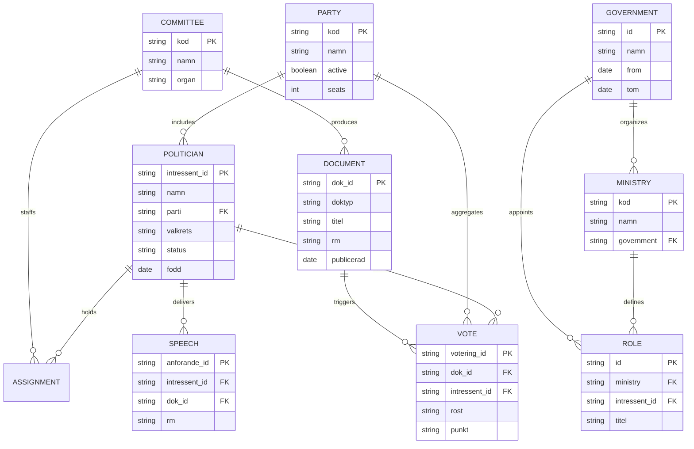

**Baseline counts** (from DATA_MODEL.md): 2,494 politicians; 349 active MPs; 8 active parties (S, M, SD, C, V, MP, KD, L) + 32 historical = 40 total; 15 committees; 109,259 documents; 3,529,786 voting records; 20 governments (76 roles, 500 role members); chamber speeches (anföranden) indexed at `/anforande/`. Historical coverage: 1971–2026.

### 2.2 CIA Subsystems → User-Facing Products

The **15 CIA data subsystems** (anomaly, coalition, committee, distribution, election, election-cycle, ministry, parties, party, percentile, politician, pre-election, risk, seasonal, voting) compile into **19 user-facing intelligence products**: 4 dashboards + 10 Top-10 rankings + 5 advanced analytics.

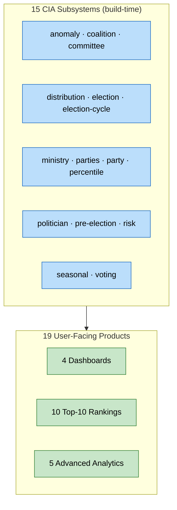

### 2.3 npm Typed Surface

Package `riksdagsmonitor` v0.9.40 (`"type":"module"`, SLSA provenance attested) exposes typed subpaths generated by `scripts/generate-types-from-cia-schemas.ts`:

| Subpath | Contents |
|---------|----------|
| `./` | Root types |
| `./shared`, `./shared/*` | Shared domain types |
| `./cia/*` | CIA subsystem types |
| `./dashboards/*` | Dashboard data shapes |
| `./ui/*` | UI component data contracts |

### 2.4 Economic & Statistical Caches

| Source | Role | Cache location |
|--------|------|----------------|
| **IMF** (primary economic) | WEO/FM/IFS/BOP/DOTS/GFS_COFOG/PCPS/ER/MFS_IR/MFS_PR; T+5 projections | `analysis/data/imf/{indicator}/{country}.json` + `.meta.json` |
| **SCB** (Swedish ground truth) | PxWeb v2 national statistics | build-time fetch |
| **World Bank** (non-economic only) | Governance (WGI), environment, social residue | build-time fetch |

> Per ADR 0001, the IMF client is a **pure-TypeScript client** (`scripts/imf-client.ts`), **not** an MCP server. Economic World Bank codes are deprecated in favour of IMF.

### 2.5 Analysis Artifacts & News Corpus

- **Analysis artifact families**: Family A core synthesis = 9 artifacts; Family B (2), Family C (5), Family D (7), Family E (per-document). Gate: `scripts/agentic/analysis-gate.ts`.
- **Newsroom**: 14 gh-aw agentic workflows, Claude Opus 4.8 (Sonnet 4.6 for translation), 14 languages, zero human editors. News corpus ~3,953 HTML files under `news/`.
- **Political-intelligence catalog**: pre-computed cross-entity intelligence products surfaced in `political-intelligence.html` (+ 13 localized variants).

---

## 3. Horizon 2 — v2.0 Static Intelligence Data Models (2026–2027)

**Horizon 2 remains 100% static.** No servers, no databases, no auth tier. It deepens *pre-computation*: the GitHub Actions build emits richer party-focused and OSINT-structured JSON datasets that static HTML pages consume directly. This horizon proves analytical value **before** any serverless investment.

### 3.1 Design Principles

1. **Static-first invariant** — every H2 dataset is a build-time artifact addressable by URL; no runtime compute.
2. **Party-centric depth** — cohesion, coalition, and bloc analytics become first-class pre-computed products.
3. **OSINT rigor** — network/temporal/anomaly structures carry **source-grading and INTOP metadata** so every edge and score is traceable to a primary source.
4. **Forward-compatible shapes** — H2 JSON schemas are designed to map cleanly onto H3 graph/SQL/vector stores.

### 3.2 Party Cohesion Matrices

A pre-computed matrix scoring intra-party voting discipline per voting period, per committee, and per policy domain.

```json
{
  "schema": "party-cohesion-matrix@2.0",
  "generated_at": "2027-01-15T00:00:00Z",
  "rm": "2026/27",
  "source_grading": { "system": "Admiralty", "reliability": "A", "credibility": "1" },
  "parties": ["S", "M", "SD", "C", "V", "MP", "KD", "L"],
  "matrix": [
    {
      "party": "S",
      "cohesion_index": 0.97,
      "rebel_votes": 14,
      "total_votes": 5120,
      "by_committee": { "FiU": 0.99, "SoU": 0.95, "UU": 0.98 },
      "evidence_dok_ids": ["H801FiU1", "H801SoU12"]
    }
  ]
}
```

- `cohesion_index` ∈ [0,1] = share of party MPs voting with the party majority.
- Every party row carries `evidence_dok_ids` so the static page can deep-link to primary documents.
- `source_grading` applies the Admiralty/NATO reliability–credibility scale at dataset level.

### 3.3 Coalition & Bloc Graphs

A pre-computed graph of inter-party alignment derived from co-voting frequency, expressed as nodes (parties) and weighted edges (alignment strength).

```json
{
  "schema": "coalition-bloc-graph@2.0",
  "rm": "2026/27",
  "nodes": [
    { "id": "S", "bloc": "left", "seats": 107 },
    { "id": "M", "bloc": "right", "seats": 68 }
  ],
  "edges": [
    {
      "source": "S",
      "target": "V",
      "alignment": 0.88,
      "shared_yes_votes": 4210,
      "divergent_votes": 560,
      "intop_class": "OPEN-SOURCE",
      "evidence_dok_ids": ["H801AU3"]
    }
  ]
}
```

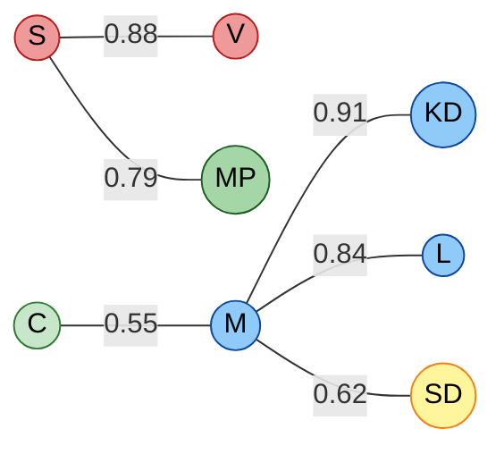

> Bloc labels reflect **published, self-declared** parliamentary alignments and co-voting evidence — never editorial judgement. Edge weights are reproducible from the public voting record.

### 3.4 Party-vs-Party Comparison Datasets

Symmetric pairwise comparison datasets enabling static comparison pages (e.g., "S vs M on welfare").

```json
{
  "schema": "party-vs-party@2.0",
  "pair": ["S", "M"],
  "domains": {
    "welfare": { "agreement": 0.41, "votes": 612, "evidence_dok_ids": ["H801SoU5"] },
    "defence": { "agreement": 0.83, "votes": 188, "evidence_dok_ids": ["H801FoU2"] },
    "economy": { "agreement": 0.37, "votes": 540, "evidence_dok_ids": ["H801FiU1"] }
  }
}
```

### 3.5 OSINT Data Structures

Horizon 2 formalizes four OSINT structure families as build-time JSON, each carrying provenance metadata so the static UI can show *how we know*.

#### 3.5.1 Network Edges

```json
{
  "schema": "osint-network-edges@2.0",
  "edge_type": "co-sponsorship",
  "edges": [
    {
      "from": "intressent_0123",
      "to": "intressent_0456",
      "weight": 23,
      "rm": "2026/27",
      "evidence_dok_ids": ["H802Mot123"],
      "source_grading": { "reliability": "A", "credibility": "1" }
    }
  ]
}
```

#### 3.5.2 Temporal Series

```json
{
  "schema": "osint-temporal-series@2.0",
  "metric": "speech_activity",
  "entity": "intressent_0123",
  "interval": "monthly",
  "points": [
    { "t": "2026-09", "v": 12 },
    { "t": "2026-10", "v": 19 }
  ]
}
```

#### 3.5.3 Anomaly Scores

```json
{
  "schema": "osint-anomaly-scores@2.0",
  "method": "seasonal-decomposition + z-score",
  "scores": [
    {
      "entity": "intressent_0123",
      "metric": "vote_attendance",
      "z": -3.1,
      "flag": "low-attendance-outlier",
      "evidence_dok_ids": ["H802Vot44"],
      "explanation": "Attendance 3.1σ below seasonal baseline; documented leave of absence."
    }
  ]
}
```

> Anomaly flags are **descriptive statistical signals on public records**, always paired with a neutral, evidence-linked explanation. They are never accusatory and never applied to private individuals.

#### 3.5.4 Source-Grading & INTOP Metadata

Every H2 dataset embeds a `source_grading` block (Admiralty reliability A–F × credibility 1–6) and an `intop_class` field (e.g., `OPEN-SOURCE`, `OFFICIAL-PUBLIC`) so downstream consumers — and H3's RAG pipeline — inherit provenance.

### 3.5.5 Evidence & Provenance Invariant

Every Horizon 2 dataset is rejected by `scripts/agentic/analysis-gate.ts` unless it satisfies the **evidence-first invariant**:

| Requirement | Enforcement |
|-------------|-------------|
| `evidence_dok_ids` non-empty on every scored row/edge | Gate hard-fail |
| `source_grading` (Admiralty A–F × 1–6) present at dataset level | Gate hard-fail |
| `intop_class` present on every relational edge | Gate hard-fail |
| Reproducible from public voting/document record | CI re-computation diff |
| Neutral, non-accusatory language on anomaly explanations | Editorial lint |

This guarantees that the H3 RAG pipeline (§4.7) *inherits* provenance: an embedding can always be traced back to a `dok_id`.

### 3.6 Government & Minister Scorecard Datasets

Horizon 2 adds pre-computed accountability datasets covering the executive branch — the 20 governments (76 roles, 500 role members) in the baseline — without any editorial scoring of "good" or "bad". Metrics are purely descriptive counts on the public record.

```json
{
  "schema": "minister-scorecard@2.0",
  "rm": "2026/27",
  "ministry": "Finansdepartementet",
  "role_holder": "intressent_0789",
  "interpellations_received": 41,
  "written_questions_answered": 118,
  "propositions_introduced": 9,
  "evidence_dok_ids": ["H801FiU1", "H801Prop44"],
  "source_grading": { "reliability": "A", "credibility": "1" }
}
```

### 3.7 Rebellion & Defection Timelines

A temporal OSINT dataset tracking individual MPs who voted against their party majority, with neutral context and primary-source links.

```json
{
  "schema": "rebellion-timeline@2.0",
  "entity": "intressent_0123",
  "party": "S",
  "events": [
    {
      "t": "2026-11-18",
      "votering_id": "H801Vot88",
      "party_majority": "Ja",
      "individual_vote": "Nej",
      "dok_id": "H801SoU12",
      "context": "Voted against party line on welfare amendment; public record only."
    }
  ]
}
```

### 3.8 Build-Time Generation Pipeline

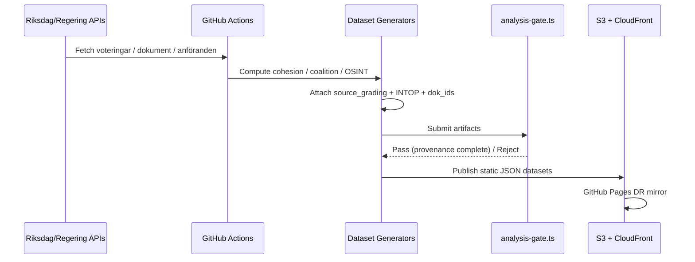

### 3.9 Horizon 2 ERD

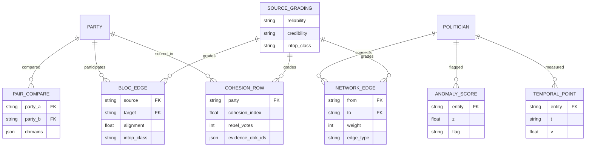

---

## 4. Horizon 3 — v3.0+ AWS Serverless Data Tier (2028–2037)

Horizon 3 layers an **interactive, queryable serverless tier** atop the static ground truth. The static H1/H2 artifacts remain the **system of record and disaster-recovery fallback**; the serverless stores are *derived, query-optimized projections* hydrated from those artifacts. Access is mediated by **Amazon API Gateway (GraphQL & REST) with Amazon Cognito** for authentication and rate-limiting.

### 4.1 Serverless Store Selection

| Store | Purpose | Data shape |
|-------|---------|------------|
| **Amazon Neptune Serverless** | Political relationship graph (co-voting, co-sponsorship, coalition) | Property graph (Gremlin) |
| **Amazon Aurora Serverless v2 (PostgreSQL)** | Relational facts (politicians, parties, documents, votes, committees, IMF cache) | SQL tables |
| **Amazon DynamoDB** | High-velocity key lookups (dashboard state, rankings, session) | Key-value / document |
| **Amazon OpenSearch Serverless** | Full-text + **vector** search over documents & speeches | Inverted index + k-NN vectors |
| **Amazon Timestream** | Time-series metrics (attendance, activity, anomaly z-scores) | Time-series |
| **Amazon Bedrock Knowledge Bases** | RAG over corpus for the newsroom & citizen Q&A | Managed vector KB |

### 4.2 Neptune Graph (Gremlin)

```groovy
// Vertices
g.addV('politician').property('intressent_id','intressent_0123')
                    .property('namn','Example MP')
                    .property('parti','S')
                    .property('valkrets','Stockholm')

g.addV('party').property('kod','S').property('namn','Socialdemokraterna')

// Edges (derived from public voting record)
g.V().has('politician','intressent_id','intressent_0123').as('a')
 .V().has('politician','intressent_id','intressent_0456').as('b')
 .addE('co_voted').from('a').to('b')
   .property('weight',4210)
   .property('rm','2026/27')
   .property('evidence_dok_id','H801AU3')
```

### 4.3 Aurora Serverless v2 (PostgreSQL) Schema

```sql
CREATE TABLE politicians (
    intressent_id   TEXT PRIMARY KEY,
    namn            TEXT NOT NULL,
    parti           TEXT REFERENCES parties(kod),
    valkrets        TEXT,
    status          TEXT,
    fodd            DATE
);

CREATE TABLE parties (
    kod     TEXT PRIMARY KEY,
    namn    TEXT NOT NULL,
    active  BOOLEAN NOT NULL DEFAULT TRUE,
    seats   INTEGER
);

CREATE TABLE documents (
    dok_id      TEXT PRIMARY KEY,
    doktyp      TEXT,
    titel       TEXT,
    rm          TEXT,
    publicerad  DATE
);

CREATE TABLE votes (
    votering_id     TEXT PRIMARY KEY,
    dok_id          TEXT REFERENCES documents(dok_id),
    intressent_id   TEXT REFERENCES politicians(intressent_id),
    rost            TEXT CHECK (rost IN ('Ja','Nej','Avstår','Frånvarande')),
    punkt           TEXT
);

CREATE TABLE committees (
    kod     TEXT PRIMARY KEY,
    namn    TEXT NOT NULL,
    organ   TEXT
);

CREATE INDEX idx_votes_intressent ON votes(intressent_id);
CREATE INDEX idx_votes_dok ON votes(dok_id);
CREATE INDEX idx_docs_rm ON documents(rm);
```

### 4.4 DynamoDB Tables

```json
{
  "TableName": "rm_dashboard_state",
  "KeySchema": [
    { "AttributeName": "pk", "KeyType": "HASH" },
    { "AttributeName": "sk", "KeyType": "RANGE" }
  ],
  "AttributeDefinitions": [
    { "AttributeName": "pk", "AttributeType": "S" },
    { "AttributeName": "sk", "AttributeType": "S" }
  ],
  "BillingMode": "PAY_PER_REQUEST"
}
```

Access patterns: `pk=RANKING#top10-attendance`, `sk=RM#2026/27`; `pk=PARTY#S`, `sk=COHESION#2026/27`.

### 4.5 OpenSearch Serverless Index

```json
{
  "mappings": {
    "properties": {
      "dok_id": { "type": "keyword" },
      "titel": { "type": "text" },
      "body": { "type": "text" },
      "rm": { "type": "keyword" },
      "doktyp": { "type": "keyword" },
      "embedding": { "type": "knn_vector", "dimension": 1024 },
      "source_grading": { "type": "object" }
    }
  }
}
```

### 4.6 Timestream Schema

| Dimension | Measure | Example |
|-----------|---------|---------|
| `intressent_id`, `metric` | `value` (double) | attendance per session |
| `party`, `metric` | `value` (double) | cohesion index over time |
| `entity`, `metric` | `z_score` (double) | anomaly signal over time |

### 4.7 Bedrock Knowledge Bases RAG

```javascript
// Build-time: embed corpus → Bedrock KB; runtime: retrieve + ground
import { BedrockAgentRuntimeClient, RetrieveAndGenerateCommand }
  from "@aws-sdk/client-bedrock-agent-runtime";

const client = new BedrockAgentRuntimeClient({ region: "eu-west-1" });

const response = await client.send(new RetrieveAndGenerateCommand({
  input: { text: "How did party S vote on the 2027 defence bill?" },
  retrieveAndGenerateConfiguration: {
    type: "KNOWLEDGE_BASE",
    knowledgeBaseConfiguration: {
      knowledgeBaseId: "rm-corpus-kb",
      modelArn: "arn:aws:bedrock:eu-west-1::foundation-model/anthropic.claude-opus",
      retrievalConfiguration: {
        vectorSearchConfiguration: { numberOfResults: 8 }
      }
    }
  }
}));
// Every generated answer MUST cite retrieved dok_ids — no ungrounded claims.
```

> The RAG pipeline is **retrieval-grounded only**: generated answers must cite retrieved `dok_id` evidence. This enforces the evidence-first invariant at the AI layer and prevents hallucinated political claims.

### 4.8 Access Tier — API Gateway + Cognito

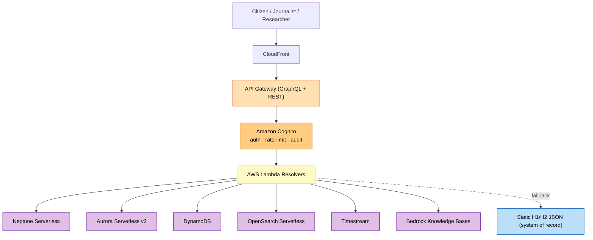

> API Gateway + Cognito provide **authentication, throttling, and an audit trail** — supporting GDPR accountability — while the public read corpus stays open. AppSync may serve as a managed-GraphQL resolver option behind API Gateway, but API Gateway + Lambda is the headline contract.

### 4.9 Store Sizing & Access Patterns (Targets)

| Store | Target volume (2030) | Primary access pattern | Why this store |
|-------|----------------------|------------------------|----------------|
| Neptune Serverless | ~2.5M edges (co-voting, co-sponsorship) | Multi-hop traversal ("who co-votes with whom") | Graph queries are O(edges) not O(joins) |
| Aurora Serverless v2 | ~200K docs, ~4.5M votes | Relational filters, aggregates | ACID facts, SQL analysts |
| DynamoDB | ~19 product partitions × RM | Single-digit-ms key lookup | Dashboard/ranking hot path |
| OpenSearch Serverless | ~200K docs + speeches | Text + k-NN vector | Semantic + keyword search |
| Timestream | ~10M points | Range scans, anomaly windows | Native time-series rollups |
| Bedrock KB | corpus embeddings | RAG retrieve-and-generate | Managed grounding |

> Each store is **derived** from the static system-of-record; loss of any serverless store degrades gracefully to static H1/H2 JSON, never to data loss.

### 4.10 Multi-Source Consistency Model

The serverless tier is **eventually consistent** with the static SoR. The hydration contract (§5) guarantees: (a) the static artifact version is stamped on every hydrated record; (b) API responses expose `as_of` vintage; (c) parity diffs run continuously in CI. No write path exists that bypasses the static SoR — the database cannot drift from the public record.

---

## 5. Source Ingestion & Integration

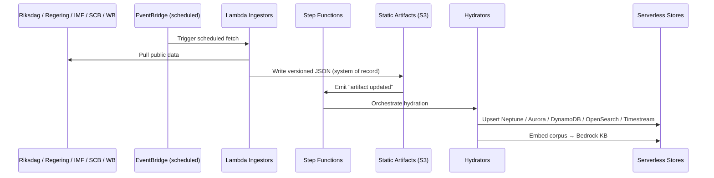

### 5.1 Migration Strategy

1. **Dual-write era** — static artifacts remain canonical; serverless stores are hydrated copies. UI can fall back to static at any time.
2. **Read-shadow** — API Gateway serves reads from serverless while continuously diffed against static for parity.
3. **Promote** — once parity is proven, interactive features (graph traversal, vector search) are exposed; static remains DR.

### 5.2 Integration Components

| Component | Role |
|-----------|------|
| **EventBridge** | Scheduled ingestion triggers (replaces some cron in GitHub Actions) |
| **Step Functions** | Orchestrates multi-store hydration with retries |
| **Kinesis** (optional) | Streaming ingestion for high-frequency updates |
| **Lambda** | Stateless ingestors, hydrators, GraphQL resolvers |

### 5.3 Data Quality & Cross-Source Reconciliation

Economic context blends three providers with a strict precedence rule (IMF primary, SCB ground truth, World Bank non-economic residue). Reconciliation guards against silent divergence:

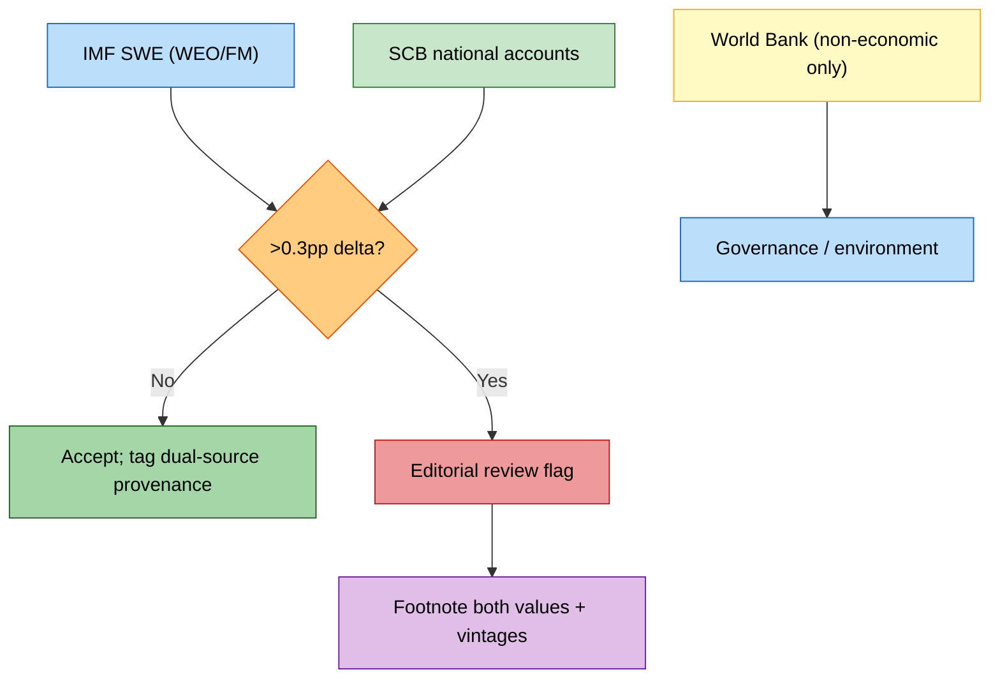

| Check | Rule | Action on failure |
|-------|------|-------------------|
| IMF ↔ SCB GDP/inflation delta | > 0.3pp triggers review | Footnote both values + vintages |
| Voting record completeness | every `votering_id` resolves to a `dok_id` | Reject artifact |
| Party roster integrity | active parties ∈ {S,M,SD,C,V,MP,KD,L} | Flag schema drift |
| Vintage freshness | IMF `vintage` within one WEO cycle | Re-fetch |

---

## 6. GraphQL API Schema

```graphql
type Politician {
  intressentId: ID!
  namn: String!
  parti: Party!
  valkrets: String
  status: String
  votes(rm: String): [Vote!]!
  speeches(rm: String): [Speech!]!
  anomalyScores: [AnomalyScore!]!
}

type Party {
  kod: ID!
  namn: String!
  active: Boolean!
  seats: Int
  cohesion(rm: String!): CohesionRow!
  alignments(rm: String!): [BlocEdge!]!
}

type Vote {
  voteringId: ID!
  document: Document!
  politician: Politician!
  rost: String!
  punkt: String
}

type Document {
  dokId: ID!
  doktyp: String
  titel: String
  rm: String
  publicerad: String
}

type Speech {
  anforandeId: ID!
  politician: Politician!
  document: Document
  rm: String
}

type CohesionRow {
  party: String!
  cohesionIndex: Float!
  rebelVotes: Int!
  evidenceDokIds: [String!]!
}

type BlocEdge {
  source: String!
  target: String!
  alignment: Float!
  intopClass: String!
  evidenceDokIds: [String!]!
}

type AnomalyScore {
  entity: String!
  metric: String!
  z: Float!
  flag: String!
  explanation: String!
}

type Query {
  politician(intressentId: ID!): Politician
  party(kod: ID!): Party
  searchDocuments(query: String!, rm: String): [Document!]!
  ragAnswer(question: String!): GroundedAnswer!
}

type GroundedAnswer {
  answer: String!
  citations: [String!]!   # dok_ids — never empty
}

type Mutation {
  refreshHydration(source: String!): HydrationResult!
}

type HydrationResult {
  source: String!
  updatedAt: String!
  recordsUpserted: Int!
}

type Subscription {
  newAnomaly(party: String): AnomalyScore!
  voteAdded(rm: String!): Vote!
}
```

> `GroundedAnswer.citations` is non-nullable and must be non-empty — the schema *itself* enforces evidence-first AI output.

---

## 7. Data Model Diagrams

### 7.1 Cross-Horizon ERD

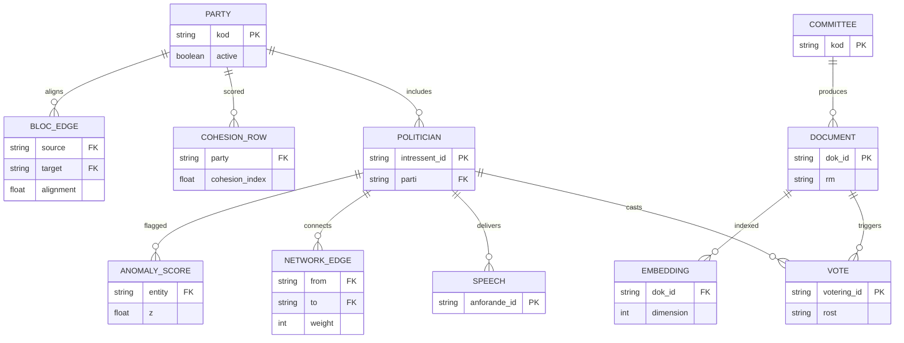

### 7.2 AWS Service Integration

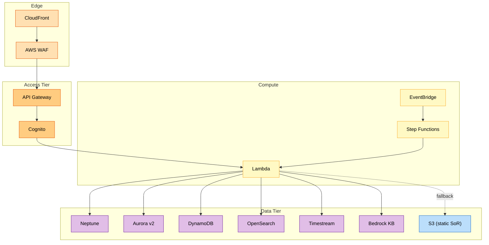

### 7.3 Query Data-Flow Sequence

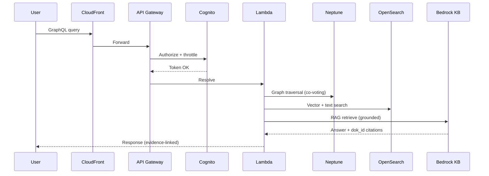

### 7.4 Neptune Graph Visualization

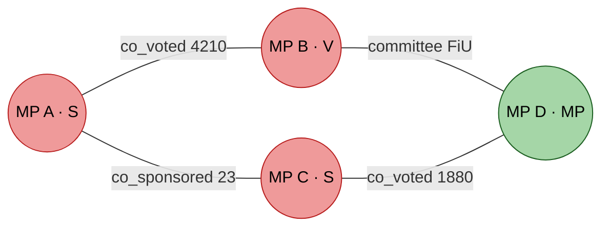

### 7.5 Time-Series Flow

```mermaid
graph LR
    SRC["Vote / speech events"] --> ING["Lambda ingestor"]
    ING --> TS["Timestream"]
    TS --> AGG["Scheduled aggregation"]
    AGG --> ANOM["Anomaly z-scores"]
    ANOM --> API["API Gateway"]
    style SRC fill:#bbdefb,stroke:#1565c0,color:#000000
    style ING fill:#fff9c4,stroke:#f9a825,color:#000000
    style TS fill:#e1bee7,stroke:#6a1b9a,color:#000000
    style AGG fill:#fff9c4,stroke:#f9a825,color:#000000
    style ANOM fill:#c8e6c9,stroke:#2e7d32,color:#000000
    style API fill:#ffcc80,stroke:#e65100,color:#000000
```

### 7.6 Bedrock KB RAG Pipeline

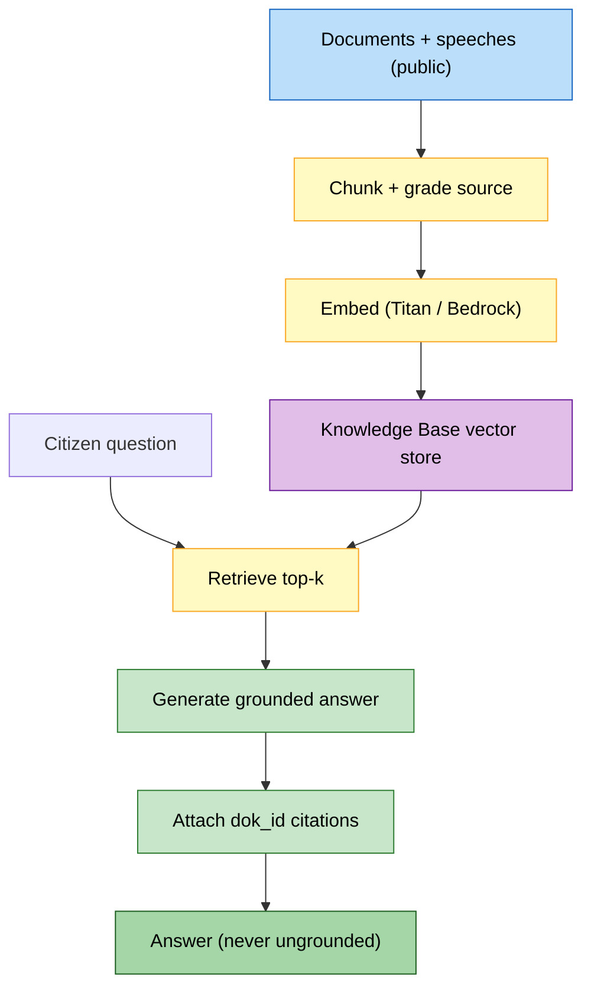

---

## 8. Implementation Roadmap

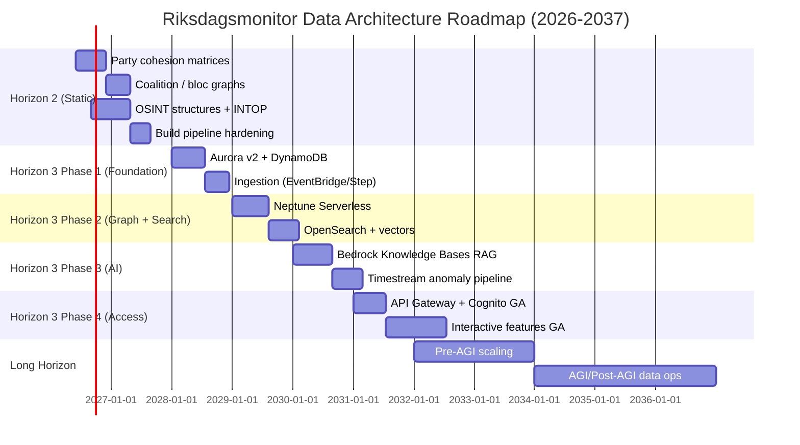

| Phase | Window | Outcome |
|-------|--------|---------|
| **H2 Static** | 2026–2027 | Richer pre-computed party + OSINT datasets, no servers |
| **H3 Phase 1** | 2028 | Relational + KV foundation, hydration from static SoR |
| **H3 Phase 2** | 2029 | Graph traversal + vector search |
| **H3 Phase 3** | 2030 | RAG + anomaly time-series |
| **H3 Phase 4** | 2031+ | API Gateway + Cognito GA, interactive UX |
| **Long Horizon** | 2032–2037 | Pre-AGI → AGI data operations |

---

## 9. Technology Stack Evolution & Cost Projections

### 9.1 Stack by Horizon

| Layer | H1 | H2 | H3 |
|-------|----|----|----|
| Hosting | S3 + CloudFront, GH Pages DR | Same | + serverless tier |
| Compute | GitHub Actions | GitHub Actions (heavier) | Lambda + Step Functions |
| Storage | JSON/CSV files | + party/OSINT JSON | Neptune/Aurora/DynamoDB/OpenSearch/Timestream |
| AI | Newsroom Opus 4.x | + build-time embeddings | Bedrock KB RAG |
| Access | Static fetch | Static fetch | API Gateway + Cognito |

### 9.2 Cost Posture (Targets)

| Horizon | Cost model | Notes |
|---------|-----------|-------|
| H1 | Near-zero marginal (CDN + Actions) | Static economics |
| H2 | Slightly higher Actions minutes | No new runtime cost |
| H3 | Pay-per-use serverless | Scales to zero; static fallback caps risk |

> All serverless stores chosen for **scale-to-zero / on-demand billing** to preserve the platform's low-cost, sustainable, open-source posture.

---

## 10. ISMS Compliance & Data Governance

### 10.1 Framework Mapping

| Control area | ISO 27001:2022 | NIST CSF 2.0 | CIS Controls v8.1 |
|--------------|----------------|--------------|-------------------|
| Access control (Cognito) | A.5.15, A.5.18 | PR.AA | CIS 6 |
| Data classification | A.5.12 | ID.AM | CIS 3 |
| Logging & audit (API GW) | A.8.15 | DE.CM | CIS 8 |
| Cryptography (in transit/at rest) | A.8.24 | PR.DS | CIS 3 |
| Supply chain (SLSA, npm) | A.5.19–A.5.21 | ID.SC | CIS 16 |
| Secure development | A.8.25–A.8.28 | PR.PS | CIS 16 |

### 10.2 GDPR Article 9 Posture

- Political opinions = **special-category data**; lawful bases **9(2)(e)** (manifestly made public) and **9(2)(g)** (substantial public interest).
- **Public data only** — exclusively official primary sources; no private individuals, no leaked/hacked data.
- Data minimisation, purpose limitation, storage limitation, integrity & confidentiality applied across all horizons.
- **DPIA** required before activating any H3 interactive feature processing personal data at new scale.

### 10.3 Data Classification

| Class | Examples | Handling |
|-------|----------|----------|
| **Public** | Votes, documents, speeches, party metadata | Open read; integrity-protected |
| **Derived-Public** | Cohesion/coalition/OSINT datasets | Provenance-tagged; reproducible |
| **Operational** | Hydration state, audit logs | Cognito-gated; retention-limited |

### 10.4 Data Lifecycle

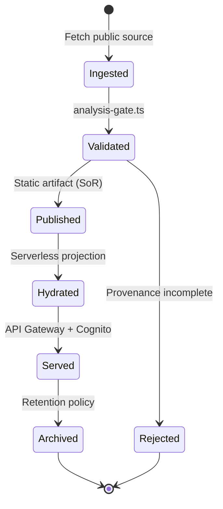

### 10.5 Stakeholder & Risk Analysis

**Stakeholders** (power × interest, neutral framing):

| Stakeholder | Interest | Data-tier implication |
|-------------|----------|-----------------------|
| Citizens | Accessible, neutral accountability | Static-first, 14 languages, WCAG 2.1 AA |
| Journalists / researchers | Queryable evidence with citations | H3 GraphQL + grounded RAG |
| Parliamentary parties (all 8) | Fair, equal, reproducible treatment | Symmetric datasets; no editorial scoring |
| Hack23 maintainers | Sustainable, low-cost ops | Scale-to-zero serverless; static DR |
| Regulators (GDPR/NIS2) | Lawful, auditable processing | Cognito audit trail; DPIA gate |

**Top data-architecture risks** (target mitigations):

| Risk | Likelihood | Impact | Mitigation |
|------|-----------|--------|------------|
| Serverless drift from public record | Low | High | Static SoR canonical; continuous parity diff |
| Source API change (Riksdag/IMF/SCB) | Medium | Medium | Versioned ingestors; vintage stamping; allowlisted hosts |
| AI ungrounded/biased output | Medium | High | Non-empty `dok_id` citations enforced by schema; neutrality lint; human-in-loop |
| Cost overrun (H3) | Low | Medium | Pay-per-use; static fallback caps blast radius |
| Provenance loss | Low | High | `source_grading` + INTOP mandatory at gate |
| Perceived partisanship | Low | High | Symmetric party datasets; published methodology; reproducibility |

> The single most important control is the **static system-of-record**: because every serverless and AI output is derived from immutable, citation-tagged public artifacts, the platform cannot silently fabricate or skew the political record.

---

## 11. IMF Data Domain — Filesystem Cache → Aurora Schema

IMF is the **primary economic data domain** (ADR 0001). Today it is a filesystem cache; in Horizon 3 it is projected into Aurora while the cache remains the system of record.

### 11.1 Current Cache (H1/H2)

- Client: `scripts/imf-client.ts` (pure TypeScript, **not** an MCP server).
- Cache: `analysis/data/imf/{indicator}/{country}.json` + `.meta.json` sidecar.
- Vintage labels: e.g. `WEO-2026-04`.
- Dataflows: WEO, FM, IFS, BOP, DOTS, GFS_COFOG, PCPS, ER, MFS_IR, MFS_PR; T+5 projections.
- Allowlisted hosts: `data.imf.org`, `api.imf.org`, `www.imf.org`.

### 11.2 Aurora Projection (H3)

```sql
CREATE TABLE imf_cache (
    indicator      TEXT NOT NULL,
    country        TEXT NOT NULL,
    period         TEXT NOT NULL,
    value          DOUBLE PRECISION,
    is_projection  BOOLEAN NOT NULL DEFAULT FALSE,
    vintage        TEXT NOT NULL,         -- e.g. 'WEO-2026-04'
    dataflow       TEXT NOT NULL,         -- WEO/FM/IFS/...
    fetched_at     TIMESTAMPTZ NOT NULL,
    PRIMARY KEY (indicator, country, period, vintage)
);

CREATE TABLE article_economic_provenance (
    article_id     TEXT NOT NULL,
    indicator      TEXT NOT NULL,
    country        TEXT NOT NULL,
    period         TEXT NOT NULL,
    vintage        TEXT NOT NULL,
    used_at        TIMESTAMPTZ NOT NULL,
    PRIMARY KEY (article_id, indicator, country, period, vintage)
);

CREATE INDEX idx_imf_dataflow ON imf_cache(dataflow);
CREATE INDEX idx_imf_country ON imf_cache(country);
```

### 11.3 EconomicDataSource Discriminated Union

```typescript
type EconomicDataSource =
  | { provider: "IMF"; dataflow: "WEO" | "FM" | "IFS" | "BOP" | "DOTS"
      | "GFS_COFOG" | "PCPS" | "ER" | "MFS_IR" | "MFS_PR"; vintage: string }
  | { provider: "SCB"; table: string }                 // Swedish ground truth
  | { provider: "WorldBank"; series: string; economic: false }; // non-economic only
```

### 11.4 Provider Decision Matrix

| Need | Provider | Rationale |
|------|----------|-----------|
| GDP, inflation, fiscal, BoP | **IMF** | Primary economic; T+5 projections |
| Swedish national statistics | **SCB** | Authoritative ground truth |
| Governance / environment / social | **World Bank** | Non-economic residue only |
| Economic series | ❌ World Bank | **Deprecated** — use IMF |

### 11.5 IMF Data Classification

IMF cache entries are **Derived-Public**: openly published source values, provenance-tagged with `vintage` + `dataflow`, fully reproducible, and linked to articles via `article_economic_provenance` for editorial accountability.

---

## 12. AI/LLM Data Architecture Evolution (2026–2037)

The newsroom and analytical layer evolve with frontier-model capability. The table below translates the AI model roadmap into **data-architecture implications** — what each capability tier demands from the data tier.

| Year | Model Tier | Status | Data-Architecture Implication |
|------|-----------|--------|-------------------------------|
| 2026 | Opus 4.6–4.9 | 🟢 Current | Static build-time authoring; corpus as files; RAG-ready embeddings begin |
| 2027 | Opus 5.x | 🔵 Near | Richer H2 OSINT datasets feed model context; embeddings standardized |
| 2028 | Opus 6.x | 🟣 Planned | H3 Phase 1: relational + KV stores hydrate model retrieval |
| 2029 | Opus 7.x | 🟠 Projected | Graph + vector retrieval (Neptune + OpenSearch) for grounded synthesis |
| 2030 | Opus 8.x | 🔴 Horizon | Bedrock KB RAG GA; anomaly time-series inform model prompts |
| 2031–2033 | Opus 9–10.x / Pre-AGI | ⚪ Speculative | Real-time grounded Q&A via API Gateway; strict citation enforcement |
| 2034–2037 | AGI / Post-AGI | ⭐ Visionary | Autonomous evidence-bound analysis; human-in-the-loop governance retained |

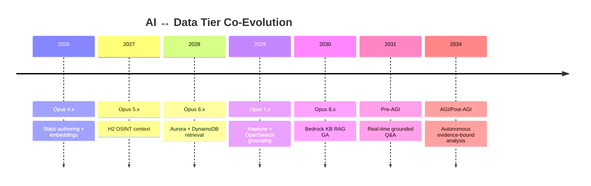

> **Governance invariant across all tiers:** every AI-generated claim is **retrieval-grounded and dok_id-cited**, neutrality is enforced, and a **human-in-the-loop** governance gate is retained even at AGI tiers. Capability never overrides the evidence-first and neutrality principles.

### 12.1 RAG Data Contract

| Field | Requirement |
|-------|-------------|
| `answer` | Generated text |
| `citations` | **Non-empty** array of `dok_id` |
| `source_grading` | Admiralty reliability/credibility per retrieved chunk |
| `neutrality_check` | Passed before publication |

---

## 13. Related Documentation

| Document | Relationship |
|----------|--------------|
| [DATA_MODEL.md](DATA_MODEL.md) | Current-state baseline (Horizon 1) this doc extends |
| [FUTURE_ARCHITECTURE.md](FUTURE_ARCHITECTURE.md) | Target system architecture |
| [FUTURE_SECURITY_ARCHITECTURE.md](FUTURE_SECURITY_ARCHITECTURE.md) | Target security controls |
| [FUTURE_THREAT_MODEL.md](FUTURE_THREAT_MODEL.md) | Target threat model |
| [ARCHITECTURE.md](ARCHITECTURE.md) | Current architecture |
| [analysis/imf/README.md](analysis/imf/README.md) | IMF data domain reference |

---

## 📄 Document Control

| Field | Value |
|-------|-------|
| **Document Owner** | CEO |
| **Version** | 3.0 |
| **Last Updated** | 2026-05-31 (UTC) |
| **Review Cycle** | Annual |
| **Next Review** | 2027-05-31 |
| **Classification** | Public |
| **Data Posture** | Public sources only; GDPR Art. 9 (9(2)(e), 9(2)(g)); strict neutrality |

---

## 🔗 Hack23 Ecosystem

Riksdagsmonitor is part of the **Hack23** open-source transparency ecosystem, operated under the [Hack23 ISMS-PUBLIC](https://github.com/Hack23/ISMS-PUBLIC) governance framework (ISO 27001:2022, NIST CSF 2.0, CIS Controls v8.1, GDPR, NIS2).

> **Mission:** empower citizens, strengthen democratic accountability, and illuminate the political process with rigorous, neutral, evidence-based intelligence drawn exclusively from public sources.

<p align="center"><em>© Hack23 · Public · Evidence-first · Neutral · Privacy-respecting</em></p>
