<p align="center">
  
</p>

<h1 align="center">🚀 Riksdagsmonitor — Future Flowchart Architecture</h1>

<p align="center">
  <strong>🔄 Advanced Process Flows: From Static Website to AI-Powered Intelligence Platform</strong><br>
  <em>🎯 Multi-Modal AI · Real-Time Analytics · Predictive Democracy · Knowledge Graphs</em>
</p>

<p align="center">
  
  
  
  
</p>

**📋 Document Owner:** CEO | **📄 Version:** 2.0 | **📅 Last Updated:** 2026-02-24 (UTC)  
**🔄 Review Cycle:** Quarterly | **⏰ Next Review:** 2026-05-24  
**🏢 Owner:** Hack23 AB (Org.nr 5595347807) | **🏷️ Classification:** Public

---

## 📚 Architecture Documentation Map

| Document | Type | Description |
|----------|------|-------------|
| [Architecture](ARCHITECTURE.md) | 🏛️ Current | C4 model showing system structure |
| [Data Model](DATA_MODEL.md) | 📊 Current | Data entities and relationships |
| [Flowcharts](FLOWCHART.md) | 🔄 Current | Process flows and pipelines |
| [State Diagrams](STATEDIAGRAM.md) | 🔄 Current | System state transitions |
| [Mindmap](MINDMAP.md) | 🗺️ Current | System conceptual map |
| [SWOT](SWOT.md) | 💼 Current | Strategic analysis |
| [Future Architecture](FUTURE_ARCHITECTURE.md) | 🏗️ Future | System evolution roadmap |
| [Future Data Model](FUTURE_DATA_MODEL.md) | 📊 Future | Enhanced data architecture |
| **[Future Flowcharts](FUTURE_FLOWCHART.md)** | 🔄 **Future** | **Advanced process flows (this doc)** |
| [Future State Diagrams](FUTURE_STATEDIAGRAM.md) | 🔄 Future | Advanced state management |
| [Future Mindmap](FUTURE_MINDMAP.md) | 🗺️ Future | Future capability map |
| [Future SWOT](FUTURE_SWOT.md) | 💼 Future | Strategic outlook |
| [Security Architecture](SECURITY_ARCHITECTURE.md) | 🛡️ Security | Defense-in-depth controls |
| [Future Security Architecture](FUTURE_SECURITY_ARCHITECTURE.md) | 🛡️ Future | Security roadmap |
| [Threat Model](THREAT_MODEL.md) | 🎯 Security | STRIDE analysis |

---

## 🎯 Executive Summary

This document outlines the future process flows and workflows for Riksdagsmonitor over the next 3-11 years (2026-2037). The roadmap focuses on **AI-enhanced content generation**, **predictive analytics**, **semantic search**, and **real-time intelligence** capabilities that transform the platform from a static Swedish Parliament monitoring website into an advanced democratic intelligence system.

**Strategic Vision:**
- 🤖 **AI-Enhanced News Generation** - Multi-modal content with GPT-5, Stability AI, ElevenLabs (2026+)
- 📊 **Predictive Analytics** - Election forecasting, vote prediction with TensorFlow.js (2026-2028)
- 🧠 **Semantic Search & Knowledge Graphs** - Neo4j-powered relationships across 109K+ documents (2027+)
- 🎤 **Voice & Personalization** - Voice assistants, personalized feeds, recommendation engines (2027-2028)
- 🌊 **Real-Time Streaming** - Kafka/Flink pipelines for live parliamentary monitoring (2028+)
- 🔒 **Privacy-Preserving AI** - Federated learning, differential privacy (2028+)

---

## 📋 Table of Contents

1. [AI-Enhanced News Generation Flows](#1-ai-enhanced-news-generation-flows)
2. [Predictive Analytics Workflows](#2-predictive-analytics-workflows)
3. [Semantic Search & Knowledge Graph Flows](#3-semantic-search--knowledge-graph-flows)
4. [Advanced User Journeys](#4-advanced-user-journeys)
5. [Advanced Data Pipeline Flows](#5-advanced-data-pipeline-flows)
6. [AI Model Training & Deployment Flows](#6-ai-model-training--deployment-flows)
7. [Community Collaboration Flows](#7-community-collaboration-flows)
8. [ISMS Compliance & Security Flows](#8-isms-compliance--security-flows)
9. [Performance & Scalability Considerations](#9-performance--scalability-considerations)
10. [Related Documentation](#10-related-documentation)

---

## 1. 🤖 AI-Enhanced News Generation Flows

### 1.1 Multi-Modal Content Generation (2026+)

**Objective:** Generate comprehensive news articles in 14 languages (expanding to 30+) using AI, with text, images, audio, and video content from Swedish Parliament data.

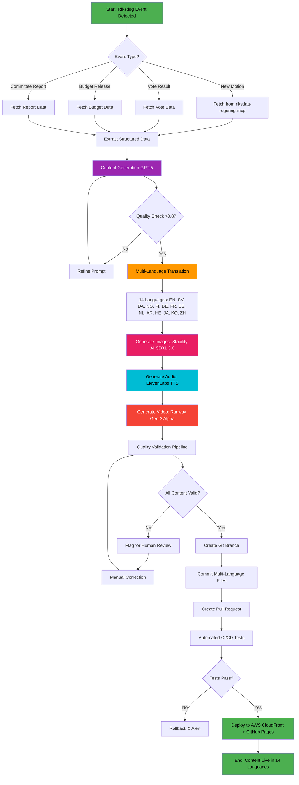

**Key Technologies:**
- **GPT-5** (OpenAI) - Advanced language model for Swedish political context
- **Stability AI SDXL 3.0** - High-quality image generation (charts, infographics, portraits)
- **ElevenLabs TTS** - Multi-language audio narration with Swedish voice models
- **Runway Gen-3 Alpha** - Video generation for complex political visualizations
- **riksdag-regering-mcp** - MCP server with 32 specialized tools for data fetching

**Quality Thresholds:**
- GPT-5 confidence: >0.8 for factual accuracy
- Image quality: Human review for political portraits (bias mitigation)
- Audio naturalness: MOS (Mean Opinion Score) >4.0/5.0
- Video coherence: Manual approval for first 100 videos, then automated

**Error Handling:**
- Retry with refined prompts (max 3 attempts)
- Fallback to human-written templates
- Quality alerts to content team via GitHub Issues

---

### 1.2 Real-Time Fact-Checking Flow (2027+)

**Objective:** Provide real-time fact-checking during parliamentary debates with AI-powered verification against historical data and trusted sources.

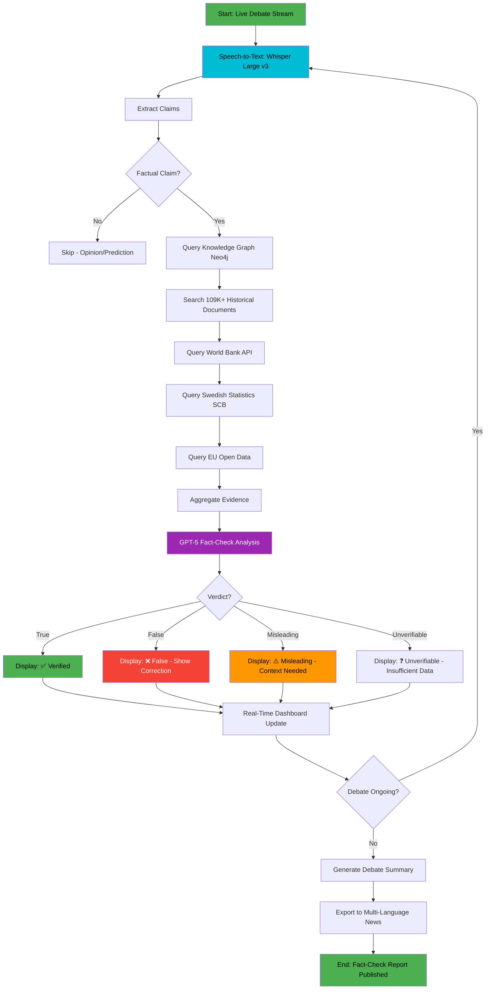

**Key Technologies:**
- **Whisper Large v3** - OpenAI's speech recognition (Swedish language model)
- **Neo4j Knowledge Graph** - 109K+ documents indexed with relationships
- **GPT-5** - Claim extraction and verification reasoning
- **World Bank API** - Economic data validation
- **Swedish Statistics (SCB)** - Official government statistics

**Performance Requirements:**
- Latency: <10 seconds from claim to verdict
- Accuracy: >90% precision (manual validation against fact-checkers)
- Coverage: 80% of factual claims identified (recall)

**Privacy & Ethics:**
- No tracking of individual viewers
- Transparent methodology page
- Human oversight for controversial claims
- Appeals process for disputed verdicts

---

## 2. 📊 Predictive Analytics Workflows

### 2.1 Election Forecasting Pipeline (2026-2028)

**Objective:** Predict Swedish election outcomes using historical data, polling, economic indicators, and machine learning models.

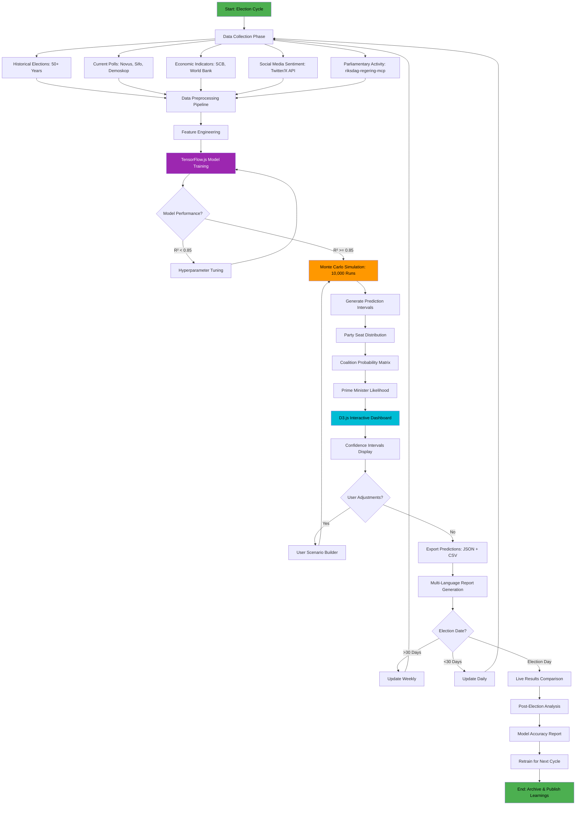

**Key Technologies:**
- **TensorFlow.js** - Client-side ML for interactive predictions
- **Monte Carlo Simulation** - 10,000 runs for uncertainty quantification
- **D3.js** - Interactive visualization of seat distributions
- **Python (scikit-learn)** - Backend model training with XGBoost/Random Forest
- **riksdag-regering-mcp** - Historical voting data (1971-present)

**Model Features (50+ Variables):**
- Historical election results (seats, votes, turnout)
- Polling averages (last 90 days, weighted by recency)
- Economic indicators (GDP growth, unemployment, inflation)
- Government approval ratings
- Parliamentary activity (motions, votes, committee work)
- Social media sentiment scores
- Demographic shifts (age, urban/rural, immigration)

**Confidence Intervals:**
- 90% confidence: ±10 seats for major parties
- 95% confidence: ±15 seats for major parties
- Coalition probabilities: >0.8 threshold for "likely"

**Ethical Considerations:**
- Transparent methodology (open-source models)
- Clear uncertainty communication (avoid false precision)
- No prediction on election day (avoid voter influence)
- Post-election accuracy reporting

---

### 2.2 Vote Prediction Workflow (2027+)

**Objective:** Predict how individual MPs will vote on upcoming bills based on historical voting patterns, party discipline, and ideological positioning.

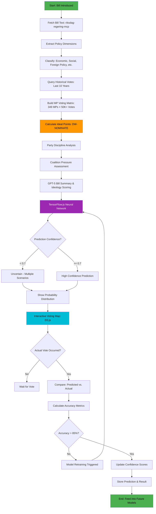

**Key Technologies:**
- **DW-NOMINATE** - Ideal point estimation (political science standard)
- **TensorFlow.js** - Neural network for vote prediction
- **GPT-5** - Bill text analysis and ideology scoring
- **D3.js** - Interactive vote visualization
- **riksdag-regering-mcp** - Historical voting data (50K+ votes)

**Model Inputs:**
- Historical voting record (349 MPs × 50K+ votes)
- Party affiliation and leadership positions
- Committee memberships
- Bill policy dimensions (economic left-right, social, foreign policy)
- Coalition status (government vs. opposition)
- Constituency characteristics (urban/rural, demographics)
- Social media positions (if publicly stated)

**Accuracy Targets:**
- Overall accuracy: >85% for individual votes
- Government party votes: >90% (high party discipline)
- Opposition votes: >80% (more variation)
- Abstentions: >70% (harder to predict)

**Ethical Considerations:**
- Predictions published after vote (no pressure on MPs)
- Transparency about uncertainty
- No personalized targeting of MPs
- Respect for democratic process

---

## 3. 🧠 Semantic Search & Knowledge Graph Flows

### 3.1 Semantic Search Pipeline (2027+)

**Objective:** Enable natural language queries across 109K+ documents with GPT-5-powered understanding and vector embeddings.

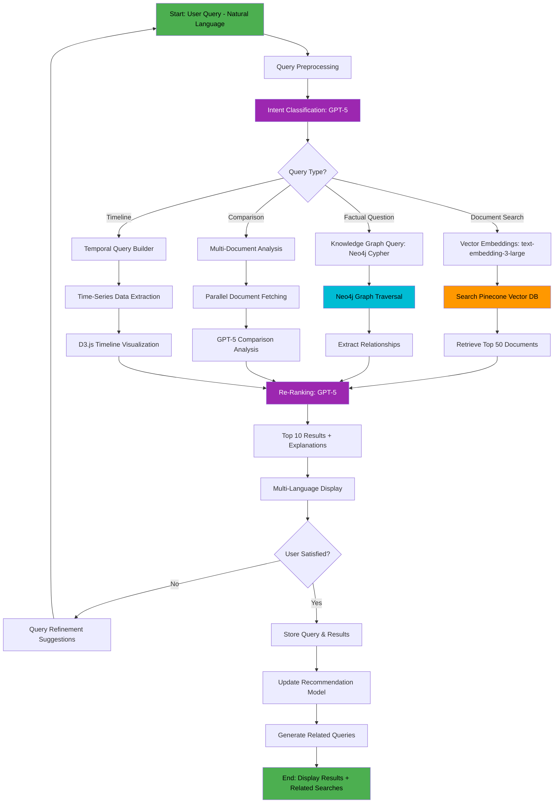

**Key Technologies:**
- **GPT-5** - Intent classification, re-ranking, explanations
- **text-embedding-3-large** - OpenAI's 3072-dimensional embeddings
- **Pinecone** - Vector database for semantic search (109K+ documents)
- **Neo4j** - Knowledge graph for relationship queries
- **D3.js** - Timeline and relationship visualizations

**Search Capabilities:**
- **Semantic Search**: "What are the government's plans for climate change?" (not keyword matching)
- **Factual Questions**: "How many times has MP X voted against their party?"
- **Comparisons**: "Compare budget proposals from 2023 vs. 2024"
- **Timelines**: "Show all votes on immigration policy in the last 5 years"
- **Relationships**: "Which MPs co-sponsor motions with MP X?"

**Performance Requirements:**
- Query latency: <2 seconds (p95)
- Relevance: >80% of users satisfied (user feedback)
- Multi-language: Same query in 14 languages returns same results

**Privacy:**
- No user query logging (ephemeral search)
- Differential privacy for aggregated analytics
- GDPR-compliant (no personal data)

---

### 3.2 Knowledge Graph Construction (2027-2028)

**Objective:** Build a comprehensive knowledge graph of Swedish parliamentary data with automated relationship extraction.

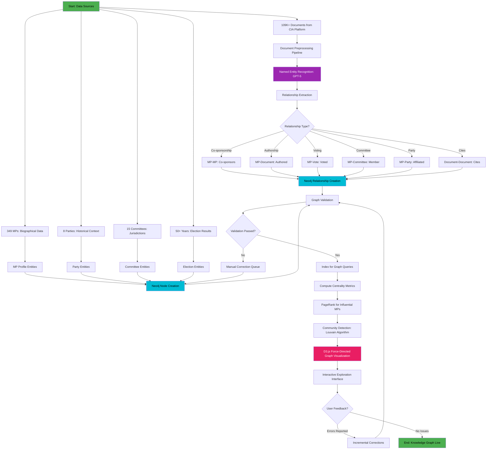

**Key Technologies:**
- **Neo4j** - Graph database (349 MPs, 109K+ documents, 1M+ relationships)
- **GPT-5** - Named entity recognition and relationship extraction
- **Louvain Algorithm** - Community detection (political factions)
- **PageRank** - Influential MP identification
- **D3.js** - Force-directed graph visualization

**Graph Schema:**
- **Nodes**: MPs (349), Parties (8), Committees (15), Documents (109K+), Votes (50K+)
- **Relationships**: Co-sponsors, Authored, Voted, Member, Affiliated, Cites, Amends

**Use Cases:**
- "Who are the most influential MPs in climate policy?" (PageRank + topic filtering)
- "Show me all MPs who co-sponsor with MP X" (1-hop graph traversal)
- "Which documents cite this budget proposal?" (reverse citation search)
- "Detect political factions beyond party lines" (community detection)

**Data Quality:**
- Manual validation: First 1,000 relationships (95% accuracy target)
- Automated validation: Consistency checks (e.g., MP can't vote before election)
- User feedback: Report errors via GitHub Issues

---

## 4. 🎤 Advanced User Journeys

### 4.1 Personalized News Feed (2027+)

**Objective:** Provide personalized political news based on user interests, reading history, and explicit preferences without invasive tracking.

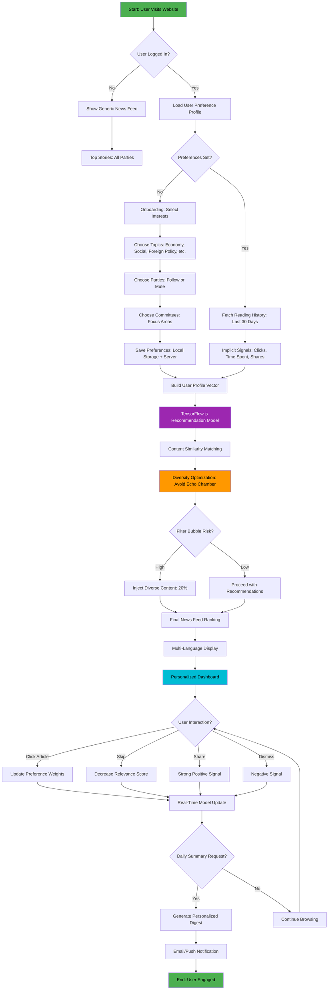

**Key Technologies:**
- **TensorFlow.js** - Recommendation engine (client-side for privacy)
- **Local Storage** - User preferences stored client-side (no server tracking)
- **Diversity Optimization** - Avoid echo chambers (20% diverse content injection)
- **A/B Testing** - Compare personalized vs. generic feeds (engagement metrics)

**Privacy-First Design:**
- **No User Tracking**: Preferences stored locally (browser local storage + encrypted server backup)
- **Opt-In**: Personalization disabled by default, explicit consent required
- **Transparency**: "Why this article?" explanations for each recommendation
- **Data Portability**: Export/import preferences (JSON format)
- **Deletion**: One-click preference reset

**Recommendation Model:**
- Content-based filtering (article topics, parties, MPs)
- Collaborative filtering (users with similar interests)
- Diversity penalty (Maximal Marginal Relevance algorithm)
- Recency boost (recent articles prioritized)

**Metrics:**
- User engagement: >30% increase in time on site
- Diversity: >20% of feed contains non-preferred topics
- Satisfaction: >4.0/5.0 user rating

---

### 4.2 Voice Assistant Interaction (2027-2028)

**Objective:** Enable hands-free interaction with Riksdagsmonitor using voice commands and natural language understanding.

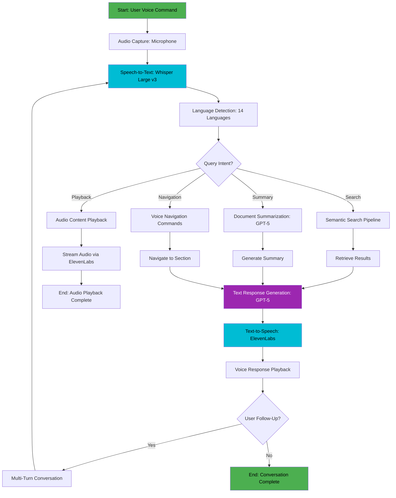

**Key Technologies:**
- **Whisper Large v3** - OpenAI's speech recognition (Swedish, English, 12 others)
- **ElevenLabs TTS** - High-quality voice synthesis (Swedish voices)
- **GPT-5** - Natural language understanding and response generation
- **Web Speech API** - Browser-based audio capture

**Voice Commands:**
- "What are the latest news from Riksdagen?" → Search + TTS response
- "Summarize motion 2024:1234" → Document summary + audio playback
- "How did my MP vote on climate policy?" → Vote lookup + TTS response
- "Navigate to budget dashboard" → Voice navigation
- "Play the news about healthcare" → Audio content streaming

**Accessibility Benefits:**
- Visually impaired users (screen reader alternative)
- Hands-free operation (multitasking)
- Learning disabilities (audio-first experience)
- Language learners (pronunciation practice)

**Privacy:**
- Audio processing client-side (no server upload)
- Voice data never stored (ephemeral)
- Opt-in feature (explicit consent)

---

## 5. 🌊 Advanced Data Pipeline Flows

### 5.1 Real-Time Streaming Pipeline (2028+)

**Objective:** Process live parliamentary events with sub-second latency using streaming architecture.

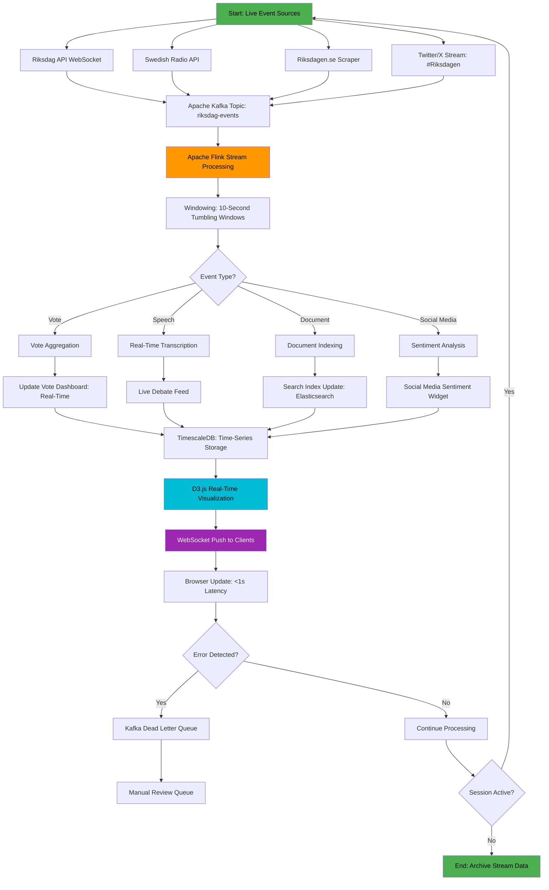

**Key Technologies:**
- **Apache Kafka** - Distributed event streaming (1M+ messages/day)
- **Apache Flink** - Stream processing with exactly-once semantics
- **TimescaleDB** - Time-series database for historical analytics
- **WebSocket** - Real-time browser updates (<1s latency)
- **Elasticsearch** - Real-time search index updates

**Performance Requirements:**
- **Latency**: <1 second from event to browser display
- **Throughput**: 10K events/second during peak (parliamentary sessions)
- **Durability**: 99.999% message delivery (exactly-once semantics)
- **Retention**: 7 days in Kafka, 10 years in TimescaleDB

**Use Cases:**
- Live vote results as they happen
- Real-time debate transcription
- Social media sentiment during sessions
- Breaking news alerts

**Scalability:**
- Kafka partitions: 10 (scale to 100 as needed)
- Flink parallelism: 8 task managers (auto-scaling)
- TimescaleDB sharding: By date (monthly chunks)

---

### 5.2 Multi-Source Data Fusion (2028+)

**Objective:** Integrate data from multiple Nordic parliaments (Sweden, Denmark, Norway, Finland) for comparative analysis.

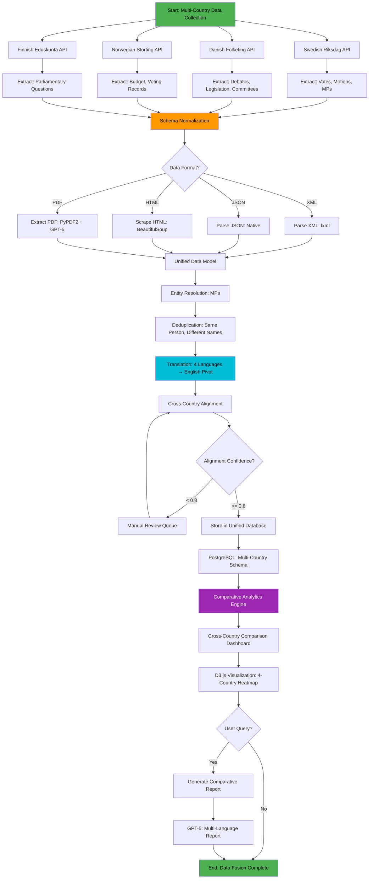

**Key Technologies:**
- **Multi-API Integration**: 4 Nordic parliaments (different API standards)
- **Schema Normalization**: Unified data model for cross-country comparison
- **Entity Resolution**: GPT-5 for matching MPs/parties across countries
- **Translation**: Multi-language support (Swedish, Danish, Norwegian, Finnish, English)
- **PostgreSQL**: Unified database with country-specific schemas

**Comparative Metrics:**
- Voting patterns: Agreement/disagreement across countries
- Legislative productivity: Bills passed per session
- Committee effectiveness: Time to decision
- Gender/age diversity: Comparative demographics
- Budget priorities: Spending allocations by category

**Challenges:**
- API rate limits (respectful scraping)
- Data format inconsistencies (XML vs. JSON vs. HTML)
- Language variations (Danish/Norwegian/Swedish similarities, Finnish distinct)
- Missing data handling (not all countries publish same data)

---

## 6. 🤖 AI Model Training & Deployment Flows

### 6.1 Continuous Model Improvement (2027+)

**Objective:** Implement continuous learning for AI models with A/B testing, monitoring, and gradual rollout.

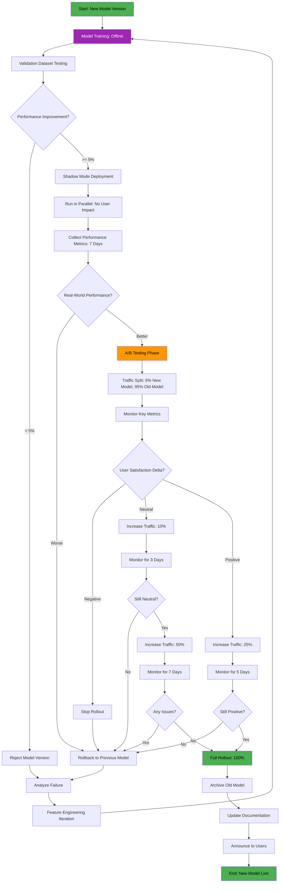

**Key Technologies:**
- **Feature Flags**: LaunchDarkly or custom implementation for gradual rollout
- **A/B Testing**: Statistical significance testing (p-value < 0.05)
- **Monitoring**: Prometheus + Grafana for real-time metrics
- **Rollback**: Automated rollback triggers on performance degradation

**Key Metrics:**
- Accuracy: Prediction correctness
- Latency: Response time (p95, p99)
- User Satisfaction: Explicit feedback (thumbs up/down)
- Engagement: Click-through rate, time on page

**Rollout Stages:**
1. **Shadow Mode** (0% user traffic): 7 days validation
2. **Canary** (5% traffic): 3 days monitoring
3. **Gradual Rollout** (10%, 25%, 50%): Progressive increases
4. **Full Rollout** (100%): After all stages pass

**Automated Rollback Triggers:**
- Error rate increase >10%
- Latency increase >50% (p95)
- User satisfaction drop >5%
- Manual override (emergency)

---

### 6.2 Federated Learning for Privacy (2028+)

**Objective:** Train AI models on decentralized user data without centralizing sensitive information, using differential privacy.

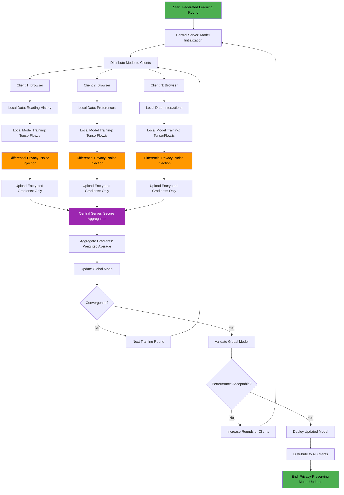

**Key Technologies:**
- **Federated Learning**: Google's Federated Learning framework
- **Differential Privacy**: ε-differential privacy (ε = 1.0 for strong privacy)
- **Secure Aggregation**: Encrypted gradient uploads (no raw data)
- **TensorFlow.js**: Client-side model training (in-browser)

**Privacy Guarantees:**
- **No Raw Data Upload**: Only model updates (gradients) sent to server
- **Differential Privacy**: Noise injection (ε = 1.0) prevents individual inference
- **Secure Aggregation**: Encrypted gradients aggregated without decryption
- **K-Anonymity**: Minimum 100 clients per round (k = 100)

**Use Cases:**
- Personalized recommendations without centralized user data
- User behavior modeling (reading patterns, preferences)
- Content quality feedback (implicit signals)

**Performance Trade-offs:**
- Training time: 10x slower than centralized learning
- Model accuracy: -5% vs. centralized (acceptable for privacy gain)
- Communication overhead: 100MB per round per client (WiFi recommended)

**Ethical Considerations:**
- Transparent privacy policy (explain federated learning)
- Opt-in only (explicit consent required)
- Data minimization (only necessary gradients)
- Auditable (privacy audits by third parties)

---

## 7. 🤝 Community Collaboration Flows

### 7.1 Crowdsourced Fact-Checking (2027+)

**Objective:** Enable community-driven fact-checking with consensus voting, expert review, and gamification.

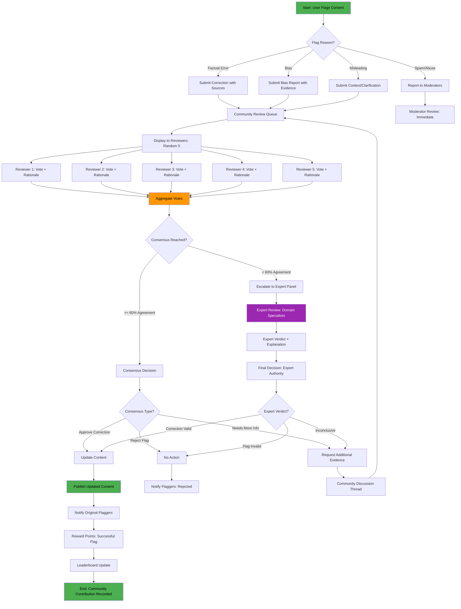

**Key Technologies:**
- **Blockchain (Optional)**: Immutable audit trail for fact-check decisions
- **Reputation System**: Stack Overflow-style points and badges
- **Expert Panel**: Domain specialists (political scientists, journalists, data analysts)
- **Consensus Algorithm**: Weighted voting (reputation-based)

**Review Process:**
- **Community Review**: 5 random reviewers (reputation >100 points)
- **Consensus Threshold**: 60% agreement (3 out of 5 votes)
- **Expert Escalation**: Controversial cases (< 60% consensus)
- **Final Authority**: Expert panel for complex disputes

**Gamification:**
- **Points**: +10 for successful flag, +5 for helpful review, -5 for rejected flag
- **Badges**: Fact-Checker (10 successful flags), Expert Reviewer (100 reviews), Top Contributor (1,000 points)
- **Leaderboard**: Monthly rankings with recognition

**Quality Controls:**
- **Reviewer Selection**: Random sampling to prevent gaming
- **Reputation Weighting**: Higher reputation = higher vote weight
- **Expert Oversight**: Spot-checks on 10% of community decisions
- **Appeals Process**: Users can appeal rejected flags

**Ethical Considerations:**
- **Transparency**: All decisions publicly visible with rationale
- **No Censorship**: Focus on corrections, not removals
- **Diversity**: Ensure reviewer diversity (political balance)
- **No Harassment**: Anti-brigading measures

---

## 8. 🛡️ ISMS Compliance & Security Flows

### 8.1 AI Policy Compliance Workflow (2026+)

**Objective:** Ensure all AI systems comply with Hack23 AB's AI Policy and Secure Development Policy.

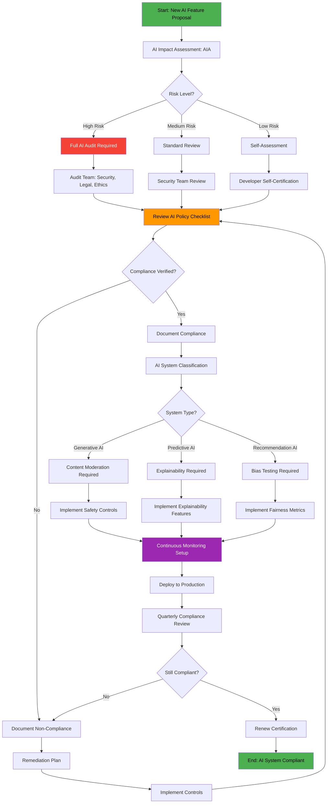

**Key Policies:**
- **Hack23 AI Policy**: [ISMS-PUBLIC/AI_Policy.md](https://github.com/Hack23/ISMS-PUBLIC/blob/main/AI_Policy.md)
- **Secure Development Policy**: [ISMS-PUBLIC/Secure_Development_Policy.md](https://github.com/Hack23/ISMS-PUBLIC/blob/main/Secure_Development_Policy.md)
- **AI Risk Classification**: High, Medium, Low (based on EU AI Act)

**Compliance Checklist:**
- ✅ Transparency: Users informed about AI usage
- ✅ Explainability: AI decisions can be explained
- ✅ Bias Testing: Fairness metrics monitored
- ✅ Data Privacy: GDPR-compliant, differential privacy
- ✅ Human Oversight: Human-in-the-loop for high-risk decisions
- ✅ Security: AI models protected from adversarial attacks
- ✅ Documentation: AI system documentation maintained

**Risk Levels:**
- **High Risk**: Election prediction, vote prediction (impacts democracy)
- **Medium Risk**: News generation, fact-checking (content moderation)
- **Low Risk**: Semantic search, personalization (minimal impact)

---

## 9. ⚡ Performance & Scalability Considerations

### 9.1 Performance Benchmarks

**Client-Side Performance:**
- Time to Interactive (TTI): <3 seconds (p95)
- First Contentful Paint (FCP): <1.5 seconds (p95)
- Largest Contentful Paint (LCP): <2.5 seconds (p95)
- Cumulative Layout Shift (CLS): <0.1
- TensorFlow.js inference: <100ms (p95)

**Server-Side Performance:**
- API response time: <200ms (p95)
- Database query time: <50ms (p95)
- Kafka throughput: 10K messages/second
- Flink processing latency: <1 second
- GPT-5 API latency: <2 seconds (p95)

**Scalability Targets:**
- Concurrent users: 100K (peak load)
- Requests per second: 10K (CDN-accelerated)
- Database size: 1TB (PostgreSQL + TimescaleDB)
- Knowledge graph: 10M nodes, 100M relationships (Neo4j)
- Vector database: 1M documents (Pinecone)

### 9.2 Cost Optimization

**Cloud Costs (Monthly Estimates):**
- AWS CloudFront: $500 (600+ edge locations)
- AWS S3: $100 (multi-region storage)
- GPT-5 API: $2,000 (100K requests/day)
- Pinecone: $500 (1M vectors)
- Neo4j Aura: $300 (10M nodes)
- Kafka/Flink: $1,000 (managed service)
- **Total**: ~$5,000/month (2027 estimate)

**Optimization Strategies:**
- CDN caching (99% hit rate target)
- Client-side AI (TensorFlow.js reduces server costs)
- Batch processing (off-peak GPT-5 usage)
- Data compression (gzip, Brotli)
- Query optimization (database indexes, caching)

---

## 10. 📚 Related Documentation

### Current State Documentation
- **[ARCHITECTURE.md](ARCHITECTURE.md)** - Current system architecture (C4 model)
- **[SECURITY_ARCHITECTURE.md](SECURITY_ARCHITECTURE.md)** - Current security controls
- **[DATA_MODEL.md](DATA_MODEL.md)** - Current data structures (if exists)

### Future Vision Documentation
- **[FUTURE_SECURITY_ARCHITECTURE.md](FUTURE_SECURITY_ARCHITECTURE.md)** - Security evolution roadmap
- **[FUTURE_ARCHITECTURE.md](FUTURE_ARCHITECTURE.md)** - Architectural vision (if exists)
- **[FUTURE_DATA_MODEL.md](FUTURE_DATA_MODEL.md)** - Data model evolution (if exists)

### ISMS & Compliance
- **[Hack23 ISMS-PUBLIC](https://github.com/Hack23/ISMS-PUBLIC/)** - Information Security Management System
- **[AI Policy](https://github.com/Hack23/ISMS-PUBLIC/blob/main/AI_Policy.md)** - AI governance and ethics
- **[Secure Development Policy](https://github.com/Hack23/ISMS-PUBLIC/blob/main/Secure_Development_Policy.md)** - SDLC security
- **[Classification Framework](https://github.com/Hack23/ISMS-PUBLIC/blob/main/CLASSIFICATION.md)** - Data and system classification

### CIA Platform Reference
- **[CIA FUTURE_FLOWCHART.md](https://github.com/Hack23/cia/blob/master/FUTURE_FLOWCHART.md)** - Parent platform flowcharts
- **[CIA Platform](https://www.hack23.com/cia)** - Citizen Intelligence Agency (data source)

### External Standards
- **[EU AI Act](https://digital-strategy.ec.europa.eu/en/policies/regulatory-framework-ai)** - European AI regulation
- **[GDPR](https://gdpr.eu/)** - General Data Protection Regulation
- **[ISO 27001](https://www.iso.org/isoiec-27001-information-security.html)** - Information security standard
- **[NIST AI RMF](https://www.nist.gov/itl/ai-risk-management-framework)** - AI risk management framework

---

## 11. 🤖 AI/LLM Evolution Flow (2026-2037)

### AI Model Lifecycle Management

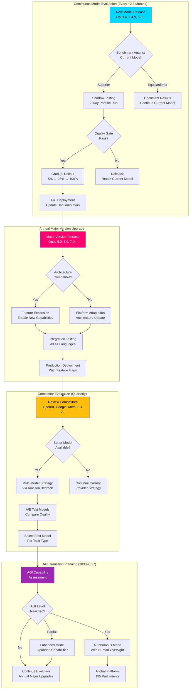

### AI Model Evolution Timeline

| Year | Model Version | Update Cadence | Key Workflow Changes |
|------|--------------|----------------|---------------------|
| 2026 | Opus 4.8-4.9 | Minor ~2.3mo, Major annual | News generation v2, 14 languages |
| 2027 | Opus 5.x | Minor ~2.3mo, Major annual | Predictive analytics, semantic search |
| 2028 | Opus 6.x | Minor ~2.3mo, Major annual | Multi-modal generation, real-time streams |
| 2029 | Opus 7.x | Minor ~2.3mo, Major annual | Autonomous pipeline, mobile app |
| 2030 | Opus 8.x | Minor ~2.3mo, Major annual | Near-expert analysis, 50+ languages |
| 2031-2033 | Opus 9-10.x | Accelerating cadence | Pre-AGI capabilities, global coverage |
| 2034-2037 | Post-Opus / AGI | Continuous evolution | Transformative platform, 195 parliaments |

---

## 📝 Document Control

**Version History:**

| Version | Date | Changes | Author |
|---------|------|---------|--------|
| 1.0 | 2026-02-15 | Initial creation with 10+ comprehensive flowcharts | Hack23 Documentation Team |
| 2.0 | 2026-02-24 | Extended to 2037 vision, AI/LLM evolution flow, AGI planning | Hack23 Documentation Team |

**Review Schedule:**
- Quarterly review (Q2, Q4 annually)
- Updated as new features reach implementation milestones
- Aligned with FUTURE_SECURITY_ARCHITECTURE.md updates

**Classification:** Public  
**Distribution:** Unrestricted  
**Repository:** https://github.com/Hack23/riksdagsmonitor  
**Path:** /FUTURE_FLOWCHART.md  
**Format:** Markdown with Mermaid diagrams  
**Next Review:** 2026-05-24

---

<p align="center">
  <strong>🌐 Riksdagsmonitor — Building the Future of Democratic Transparency</strong><br>
  <em>Powered by AI, Grounded in Privacy, Committed to Democracy</em>
</p>

<p align="center">
  <a href="https://www.riksdagsmonitor.se">Website</a> ·
  <a href="https://github.com/Hack23/riksdagsmonitor">GitHub</a> ·
  <a href="https://www.hack23.com/cia">CIA Platform</a> ·
  <a href="https://github.com/Hack23/ISMS-PUBLIC">ISMS</a>
</p>

---

**📋 Document Control:**  
**✅ Approved by:** James Pether Sörling, CEO  
**📤 Distribution:** Public  
**🏷️ Classification:** [](https://github.com/Hack23/ISMS-PUBLIC/blob/main/CLASSIFICATION.md#confidentiality-levels)  
**📅 Effective Date:** 2026-02-24  
**⏰ Next Review:** 2026-05-24  
**🎯 Framework Compliance:** [](https://github.com/Hack23/ISMS-PUBLIC/blob/main/CLASSIFICATION.md) [](https://github.com/Hack23/ISMS-PUBLIC/blob/main/CLASSIFICATION.md) [](https://github.com/Hack23/ISMS-PUBLIC/blob/main/CLASSIFICATION.md)


---

## 🌐 Evolving the Current IMF Dataflow toward the Future Pipeline

*Baseline: the **already-implemented** IMF dataflow is documented in [`FLOWCHART.md`](FLOWCHART.md) §IMF. The diagram below shows how that baseline evolves with additional gates (vintage age UI badge, provider-mix telemetry) layered on top of today's client.*

> **Authoritative hub:** [`analysis/imf/README.md`](analysis/imf/README.md) · [`analysis/imf/agentic-integration.md`](analysis/imf/agentic-integration.md) · [`analysis/imf/indicators-inventory.json`](analysis/imf/indicators-inventory.json) · [`analysis/imf/data-dictionary.md`](analysis/imf/data-dictionary.md) · [`.github/aw/ECONOMIC_DATA_CONTRACT.md`](.github/aw/ECONOMIC_DATA_CONTRACT.md)

```mermaid
flowchart LR
    classDef primary fill:#0a4f8f,color:#fff,stroke:#00d9ff,stroke-width:2px
    classDef secondary fill:#3a3a3a,color:#ddd,stroke:#888
    classDef gate fill:#ff006e,color:#fff,stroke:#fff

    Start([news-* workflow trigger]) --> Domain{Identify economic class}
    Domain -->|Macro · Fiscal · Monetary · External · Trade| IMF[(IMF SDMX 3.0 + Datamapper REST)]:::primary
    Domain -->|Governance / Environment / Social residue| WB[(World Bank API)]:::secondary
    Domain -->|Swedish-specific monthly / regional| SCB[(SCB PxWeb v2)]:::secondary

    IMF --> Vintage{Vintage > 6 months?}:::gate
    Vintage -->|Yes| Annotate[Annotate as stale + downgrade confidence]
    Vintage -->|No| Cache[Cache: vintage-tagged · SHA-256 pinned]
    Annotate --> Cache
    Cache --> Provenance[Emit economicProvenance: {provider:imf, dataflow, indicator, vintage}]
    WB --> Cache
    SCB --> Cache

    Provenance --> Compose[Article composition]
    Compose --> Lint{IMF-first lint}:::gate
    Lint -->|WB economic citation w/o IMF cross-ref| Reject([Block — open issue])
    Lint -->|Pass| Publish([Publish article])
```

### Provider decision matrix


| Indicator class | Primary | Secondary | Why |
|---|---|---|---|
| Macro (GDP, growth, unemployment, inflation, fiscal balance, debt, current account) | **IMF WEO + Fiscal Monitor** | SCB (Sweden monthly) | Freshness + T+5 projections; SNA 2008 / GFSM 2014 / BPM6 cross-country comparability |
| Bilateral trade flows | **IMF DOTS** | — | Partner-country dimension, monthly cadence |
| Monthly inflation, policy rates | **IMF IFS / MFS_IR** | SCB / Riksbank | Standardised cross-country |
| Government spending by function (defence/health/education/social protection) | **IMF GFS_COFOG** | — | Committee-aligned (FöU/SoU/UbU/SfU) |
| Commodity prices, exchange rates | **IMF PCPS / ER** | — | Canonical benchmarks |
| Governance (CC.EST, RL.EST, VA.EST, GE.EST, RQ.EST, PV.EST) | **World Bank WGI** | — | IMF has no equivalent |
| Environment (CO2, renewables, forest, water) | **World Bank** | — | IMF has no equivalent |
| Social/education residue (literacy, school participation, gender ratios) | **World Bank** | GFS_COFOG 09 | IMF has no equivalent |
| Defence spending depth (long historicals) | **World Bank MS.MIL.*** | GFS_COFOG 02 | WB deeper history |
| Swedish ground truth (monthly labour, regional, budget execution) | **SCB** | — | National statistics authority |


**Canonical rule.** Every economic claim in a Riksdagsmonitor article cites an IMF dataflow first; World Bank citations are reserved for governance, environment and social residue (the classes IMF does not publish). SCB is the Swedish-specific ground truth layer. See `ECONOMIC_DATA_CONTRACT.md` v2.1 for the banned-phrase list and vintage discipline (>6 mo → annotation).

---

## 🔗 Hack23 Ecosystem

<table>
<tr>
  <th width="33%">🌐 Platforms</th>
  <th width="33%">📦 Open-Source Projects</th>
  <th width="33%">🛡️ Governance &amp; Standards</th>
</tr>
<tr>
<td valign="top">
🗳️ <a href="https://riksdagsmonitor.com">Riksdagsmonitor</a> — Swedish Parliament intelligence<br>
🇪🇺 <a href="https://www.euparliamentmonitor.com">EU Parliament Monitor</a> — European coverage<br>
🕵️ <a href="https://www.hack23.com/cia">Citizen Intelligence Agency</a> — political-data engine<br>
🌐 <a href="https://www.hack23.com">Hack23 AB</a> — corporate site<br>
📰 <a href="https://hack23.com/blog.html">Hack23 Blog</a> — engineering &amp; policy<br>
💼 <a href="https://www.linkedin.com/company/hack23/">Hack23 on LinkedIn</a>
</td>
<td valign="top">
🗳️ <a href="https://github.com/Hack23/riksdagsmonitor">Hack23/riksdagsmonitor</a><br>
🕵️ <a href="https://github.com/Hack23/cia">Hack23/cia</a><br>
🇪🇺 <a href="https://github.com/Hack23/euparliamentmonitor">Hack23/euparliamentmonitor</a><br>
🔌 <a href="https://github.com/Hack23/european-parliament-mcp">Hack23/european-parliament-mcp</a><br>
✅ <a href="https://github.com/Hack23/cia-compliance-manager">Hack23/cia-compliance-manager</a><br>
🥋 <a href="https://github.com/Hack23/black-trigram">Hack23/black-trigram</a><br>
🏠 <a href="https://github.com/Hack23/homepage">Hack23/homepage</a>
</td>
<td valign="top">
🛡️ <a href="https://github.com/Hack23/ISMS-PUBLIC">Hack23 ISMS-PUBLIC</a> — public ISMS<br>
🔒 <a href="https://github.com/Hack23/ISMS-PUBLIC/blob/main/Information_Security_Policy.md">Information Security Policy</a><br>
🤖 <a href="https://github.com/Hack23/ISMS-PUBLIC/blob/main/AI_Policy.md">AI Policy</a><br>
🧪 <a href="https://github.com/Hack23/ISMS-PUBLIC/blob/main/Secure_Development_Policy.md">Secure Development Policy</a><br>
🎯 <a href="https://github.com/Hack23/ISMS-PUBLIC/blob/main/Threat_Modeling.md">Threat Modeling Policy</a><br>
⚠️ <a href="https://github.com/Hack23/ISMS-PUBLIC/blob/main/Vulnerability_Management.md">Vulnerability Management</a><br>
🏷️ <a href="https://github.com/Hack23/ISMS-PUBLIC/blob/main/CLASSIFICATION.md">Classification Framework</a>
</td>
</tr>
</table>

<p align="center">
<a href="https://www.bestpractices.dev/projects/12069"></a>
<a href="https://scorecard.dev/viewer/?uri=github.com/Hack23/riksdagsmonitor"></a>
<a href="https://github.com/Hack23/ISMS-PUBLIC"></a>
<a href="https://github.com/Hack23/ISMS-PUBLIC"></a>
<a href="https://github.com/Hack23/ISMS-PUBLIC"></a>
<a href="https://www.apache.org/licenses/LICENSE-2.0"></a>
</p>

<p align="center"><em>🗳️ Empower citizens · 🔍 Strengthen democratic accountability · 🕵️ Illuminate the political process</em></p>

<p align="center"><sub>© 2008–2026 <a href="https://www.hack23.com">Hack23 AB</a> (Org.nr 559534-7807) · Maintainer: <a href="https://www.linkedin.com/in/jamessorling/">James Pether Sörling, CISSP CISM</a></sub></p>
