<p align="center">
  
</p>

<h1 align="center">🚀 Riksdagsmonitor — Future Flowchart Architecture</h1>

<p align="center">
  <strong>🔄 Process & Data-Flow Evolution: From Agentic Static Newsroom to AWS-Serverless Intelligence Platform</strong><br>
  <em>🎯 Build-Time OSINT · Party Landscape Analytics · Bedrock RAG · Predictive Democracy · Real-Time Fusion</em>
</p>

<p align="center">
  
  
  
  
</p>

<p align="center">
  
  
  
  
  
  
</p>

**📋 Document Owner:** CEO | **📄 Version:** 3.0 | **📅 Last Updated:** 2026-05-31 (UTC)  
**🔄 Review Cycle:** Quarterly | **⏰ Next Review:** 2026-08-31  
**🏢 Owner:** Hack23 AB (Org.nr 559534-7807) | **🏷️ Classification:** Public

---

## 📚 Architecture Documentation Map

| Document | Type | Description |
|----------|------|-------------|
| [Architecture](ARCHITECTURE.md) | 🏛️ Current | C4 model showing system structure |
| [Data Model](DATA_MODEL.md) | 📊 Current | Data entities and relationships |
| [Flowcharts](FLOWCHART.md) | 🔄 Current | Process flows and pipelines (this doc's baseline) |
| [State Diagrams](STATEDIAGRAM.md) | 🔄 Current | System state transitions |
| [Mindmap](MINDMAP.md) | 🗺️ Current | System conceptual map |
| [SWOT](SWOT.md) | 💼 Current | Strategic analysis |
| [Workflows](WORKFLOWS.md) | 🔧 Current | CI/CD automation and pipelines |
| [Future Architecture](FUTURE_ARCHITECTURE.md) | 🏗️ Future | System evolution roadmap |
| [Future Data Model](FUTURE_DATA_MODEL.md) | 📊 Future | Enhanced data architecture |
| **[Future Flowcharts](FUTURE_FLOWCHART.md)** | 🔄 **Future** | **Advanced process & data flows (this doc)** |
| [Future State Diagrams](FUTURE_STATEDIAGRAM.md) | 🔄 Future | Advanced state management |
| [Future Mindmap](FUTURE_MINDMAP.md) | 🗺️ Future | Future capability map |
| [Future SWOT](FUTURE_SWOT.md) | 💼 Future | Strategic outlook |
| [Security Architecture](SECURITY_ARCHITECTURE.md) | 🛡️ Security | Defense-in-depth controls |
| [Future Security Architecture](FUTURE_SECURITY_ARCHITECTURE.md) | 🛡️ Future | Security roadmap |
| [Threat Model](THREAT_MODEL.md) | 🎯 Security | STRIDE analysis |

---

## 🎯 Executive Summary

This document maps the **process and data-flow evolution** of Riksdagsmonitor across three horizons (2026–2037). It is the forward-looking sibling of [`FLOWCHART.md`](FLOWCHART.md): every future flow is built **on top of the production v1.x baseline** documented there — the autonomous agentic newsroom, the multi-provider data fetch/persist layer, the analysis-gate quality wall, and the multi-region static deploy.

The roadmap deliberately **separates the static-deepening near term from the serverless long term**, so investment stays grounded:

| Horizon | Window | Architecture | Process centre of gravity |
|---------|--------|--------------|---------------------------|
| 🟢 **v1.x baseline** | shipped (2026) | Static HTML/CSS · 14 agentic workflows · CloudFront + multi-region S3 + GitHub Pages DR | Build-time: gh-aw → analysis artifacts → gate → render → translate → deploy |
| 🔵 **v2.0** | 2026–2027 | **Still static** — deeper precompute | Build-time **party-landscape dashboards** + **OSINT products** (network / temporal / anomaly / source-grading / INTOP) baked into static HTML |
| 🟠 **v3.0+** | 2028–2037 | **AWS serverless** (Lambda · Step Functions · EventBridge · Kinesis · Bedrock · API Gateway · Cognito) | Runtime: conversational intelligence, RAG semantic search, predictive forecasting, real-time fusion, personalization, public API |

**Strategic process vision:**
- 🟢 **Agentic newsroom hardening** — keep zero-human-editor pipeline; tighten the analysis gate and provenance (2026)
- 🔵 **Static OSINT precompute** — move network/temporal/anomaly analytics to *build time*; render party-focused landscape dashboards & INTOP scorecards as static artifacts (2026–2027)
- 🟠 **Bedrock runtime flows** — multi-modal generation, real-time fact-checking and Knowledge-Bases RAG over the 109K+ document corpus (2028+)
- 🟠 **Predictive pipelines** — Step-Functions election & vote forecasting with calibrated uncertainty (2028+)
- 🟠 **Streaming fusion** — Kinesis + EventBridge real-time parliamentary monitoring and multi-source data fusion (2029+)
- 🟠 **API economy & personalization** — API Gateway public political-intelligence API + Cognito personalized feeds (2029+)
- 🛡️ **Guardrails throughout** — public data only, GDPR Art. 9(2)(e)/(g), party neutrality, no surveillance/psyops, human-on-the-loop governance per [AI Policy](https://github.com/Hack23/ISMS-PUBLIC/blob/main/AI_Policy.md)

> ⚠️ **Targets, not achievements.** All metrics below the v1.x baseline are **roadmap targets**, explicitly labelled, never presented as already delivered.

---

## 📋 Table of Contents

1. [Three-Horizon Process Evolution](#1--three-horizon-process-evolution)
2. [v1.x Baseline Flows (Build the Future On This)](#2--v1x-baseline-flows-build-the-future-on-this)
3. [v2.0 Static-Deepening Flows (2026–2027)](#3--v20-static-deepening-flows-20262027)
4. [v3.0+ AWS-Serverless Runtime Flows (2028–2037)](#4--v30-aws-serverless-runtime-flows-20282037)
5. [ISMS & AI-Policy Compliance Flows](#5-️-isms--ai-policy-compliance-flows)
6. [AI Model Lifecycle & Evolution Flows](#6--ai-model-lifecycle--evolution-flows)
7. [Performance & Cost-Optimization Flows](#7--performance--cost-optimization-flows)
8. [IMF Economic-Dataflow Evolution](#8--imf-economic-dataflow-evolution)
9. [Document Control](#-document-control)
10. [Related Documentation](#-related-documentation)

---

## 1. 🧭 Three-Horizon Process Evolution

The platform's process architecture migrates along one axis — **where computation happens** — while the democratic-ethics guardrails stay constant. v1.x and v2.0 compute everything at **build time** and ship immutable static artifacts; v3.0+ moves compute to **managed serverless runtime** without ever introducing a server to patch.

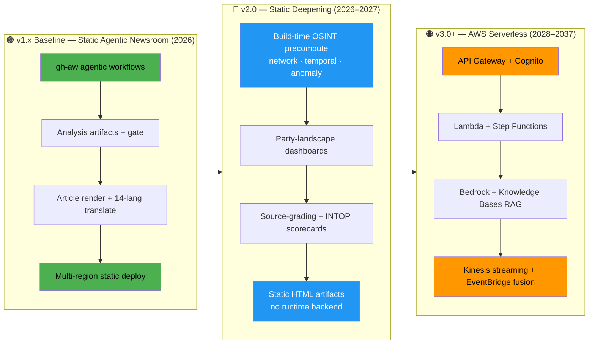

**Horizon decision gates** — promotion to the next horizon is conditional, not calendar-driven:

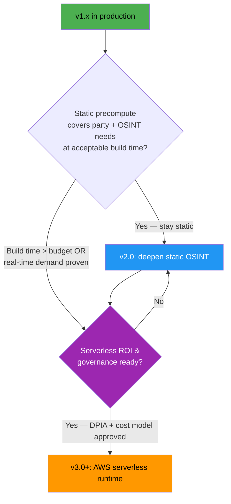

---

## 2. 🟢 v1.x Baseline Flows (Build the Future On This)

These flows are **in production today** and refreshed to match [`FLOWCHART.md`](FLOWCHART.md). Every later horizon extends — never replaces — them.

### 2.1 Agentic Newsroom Pipeline (gh-aw → artifacts → article → deploy)

**Objective:** zero-human-editor publication of intelligence articles in 14 languages, gated by the [`analysis gate`](FLOWCHART.md#17--analysis-gate-validation-flow).

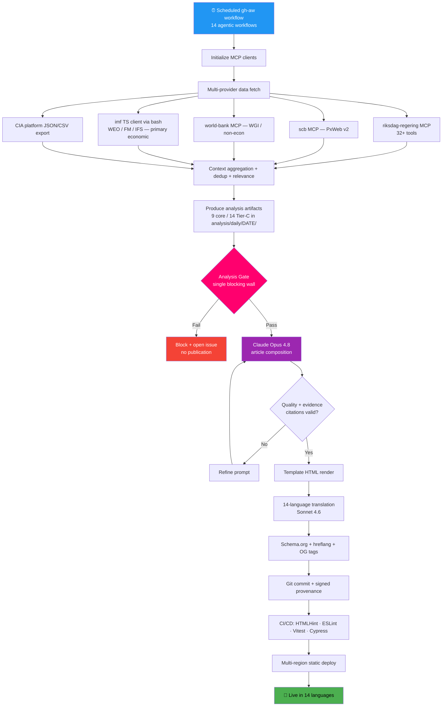

### 2.2 Build-Time Political-Intelligence & Analysis-Gate Flow

**Objective:** horizon-stratified intelligence products precompiled before each static build.

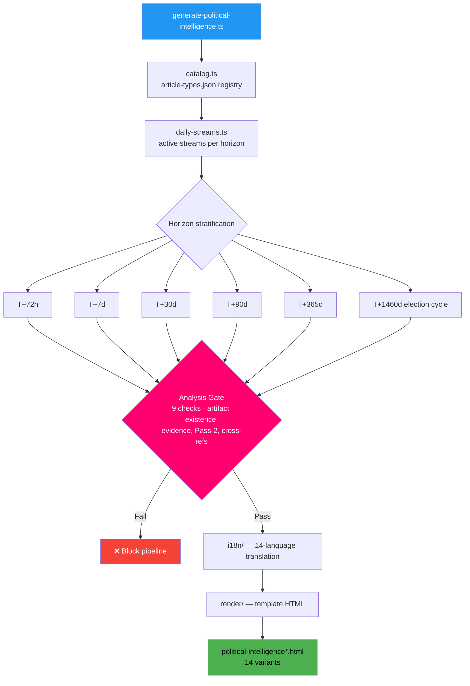

### 2.3 Data Fetch & Persist Flow (multi-provider, provenance-tagged)

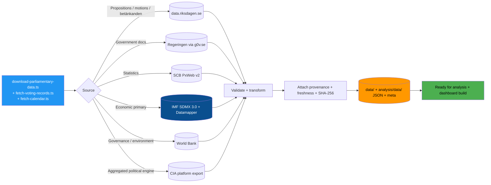

### 2.4 Dashboard Build Flow (lazy-loaded TypeScript modules)

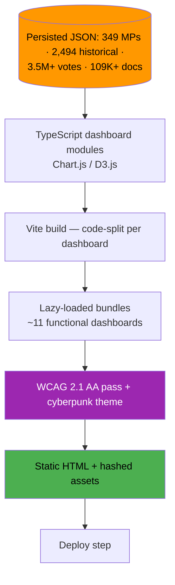

### 2.5 Multi-Region Static Deploy & Disaster-Recovery Flow

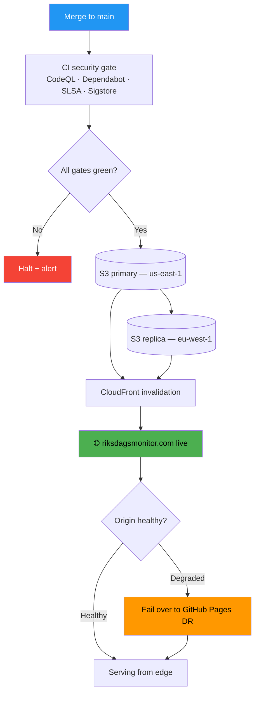

---

## 3. 🔵 v2.0 Static-Deepening Flows (2026–2027)

> **Strategic choice: stay static.** v2.0 introduces **no runtime backend**. Every new capability is **precomputed at build time** and rendered into immutable HTML/CSS. The wins are deeper party analytics and higher-grade OSINT, not new infrastructure. AI generations of this window (Opus 4.6–4.9 → 5.x) primarily sharpen the *agentic build pipeline*.

### 3.1 Party-Focused Political-Landscape Dashboard Build

**Objective:** turn the persisted corpus into party-centric landscape dashboards — cohesion, coalition dynamics, bloc alignment, party-vs-party comparison, agenda tracking — all computed offline.

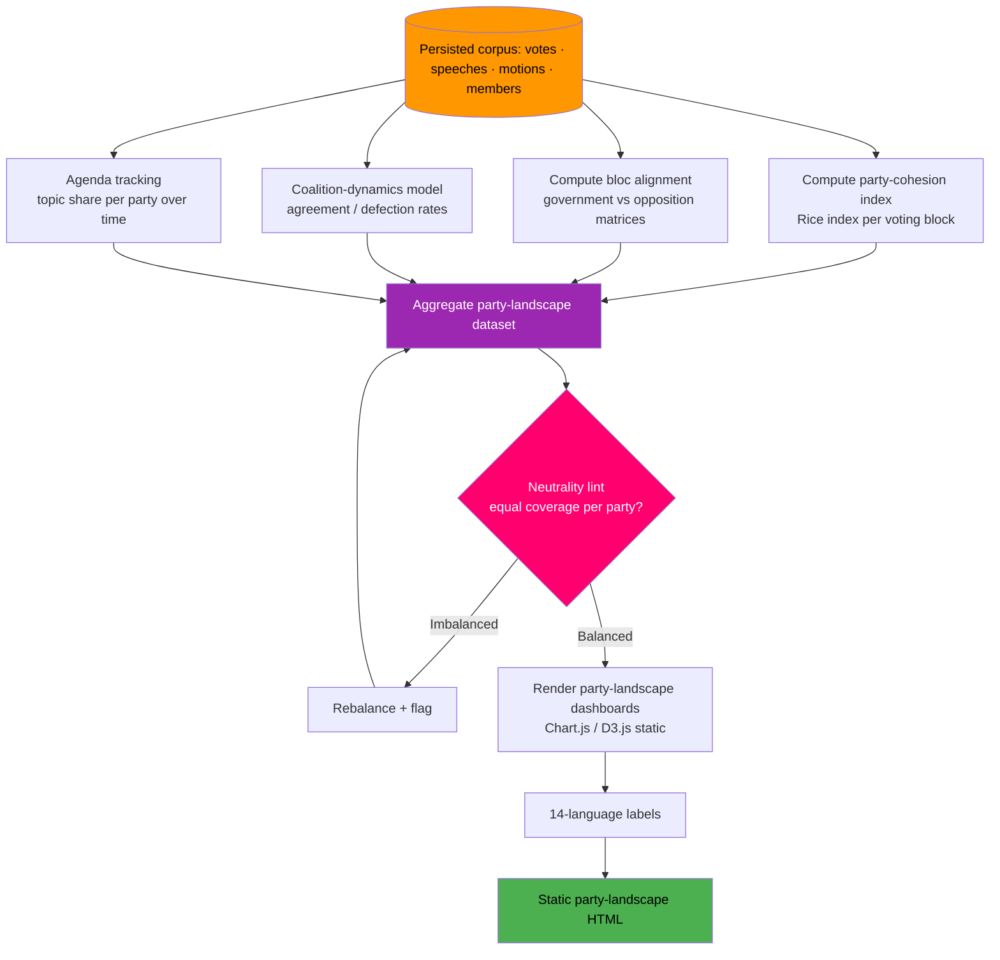

### 3.2 Build-Time OSINT Computation Pipeline (network · temporal · anomaly)

**Objective:** move structured tradecraft (network analysis, temporal/seasonal patterns, anomaly detection) from ad-hoc analysis into a **repeatable build-time pipeline** whose outputs are graded and rendered statically.

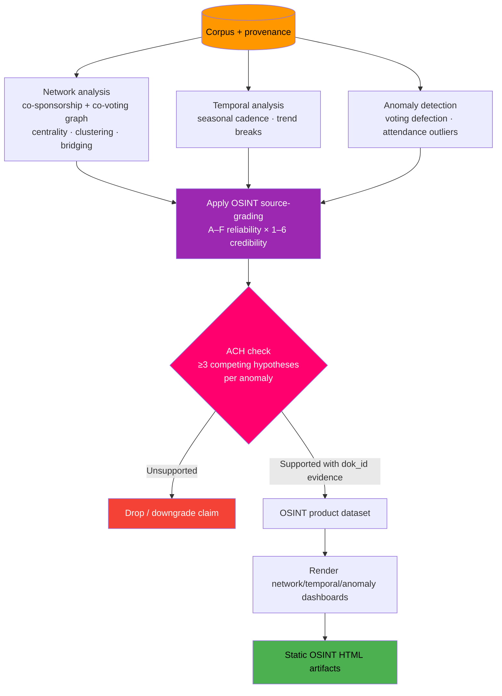

### 3.3 Source-Grading & INTOP Scorecard Flow

**Objective:** produce evidence-graded INTOP (intelligence-operations) scorecards where every metric ties to a `dok_id`, vote count, or named actor.

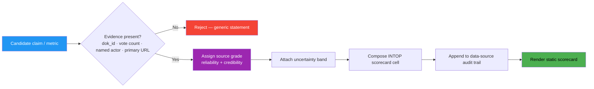

### 3.4 v2.0 Build Sequence (end-to-end, still no runtime backend)

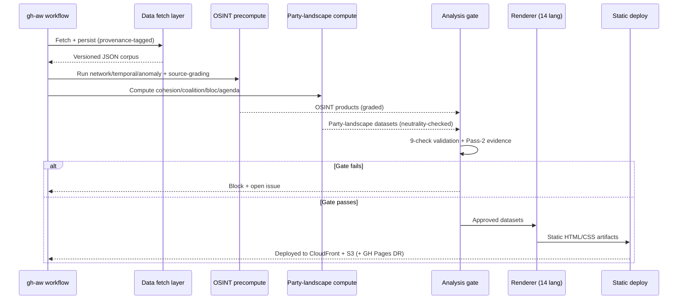

**v2.0 outcome:** richer intelligence, **identical hosting model**. Build time grows; attack surface does not. When build time exceeds budget *or* real-time demand is proven, the horizon-gate (§1) authorizes the v3.0 serverless move.

---

## 4. 🟠 v3.0+ AWS-Serverless Runtime Flows (2028–2037)

> **Strategic choice: all-in managed serverless.** No Kubernetes, no containers, no servers to patch — only Lambda, Step Functions, EventBridge, Kinesis, Bedrock, API Gateway, Cognito, DynamoDB, Aurora Serverless v2, Neptune Serverless, OpenSearch Serverless, and Timestream. AWS Well-Architected aligned, multi-region resilient. AI generations Opus 6.x→AGI unlock conversational, predictive, and self-improving runtime flows.

### 4.1 Public Political-Intelligence API Request Flow (API Gateway · Lambda · Cognito)

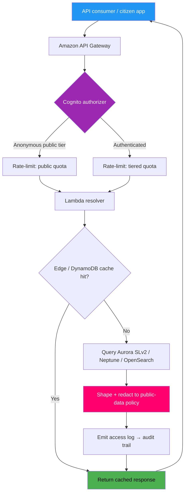

### 4.2 Bedrock Multi-Modal Generation + Real-Time Fact-Checking

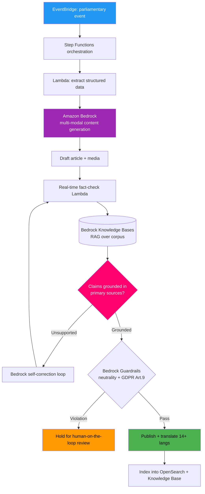

### 4.3 Bedrock Knowledge-Bases RAG Semantic-Search Flow

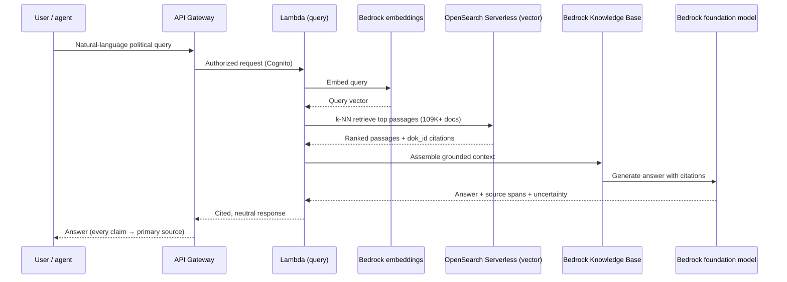

### 4.4 Predictive Election & Vote-Forecasting Pipeline (Step Functions)

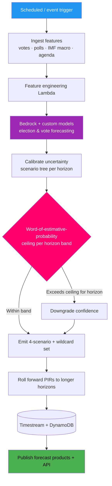

### 4.5 Real-Time Streaming & Multi-Source Data Fusion

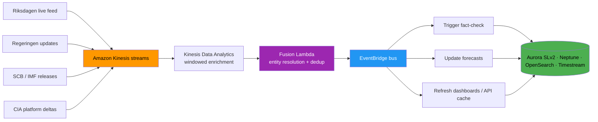

### 4.6 Personalized Feed Flow (Cognito identity, privacy-preserving)

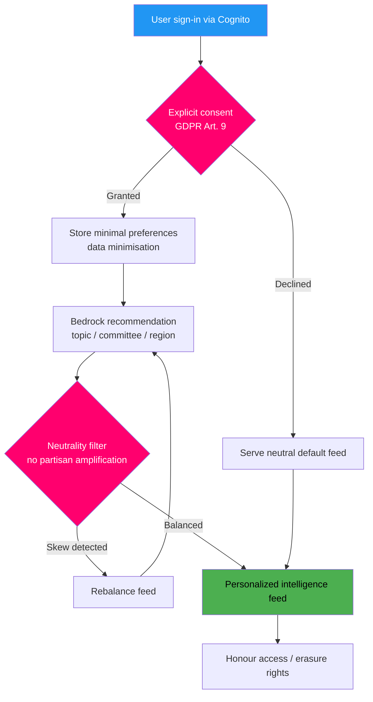

### 4.7 Continuous Model Improvement + Federated Learning

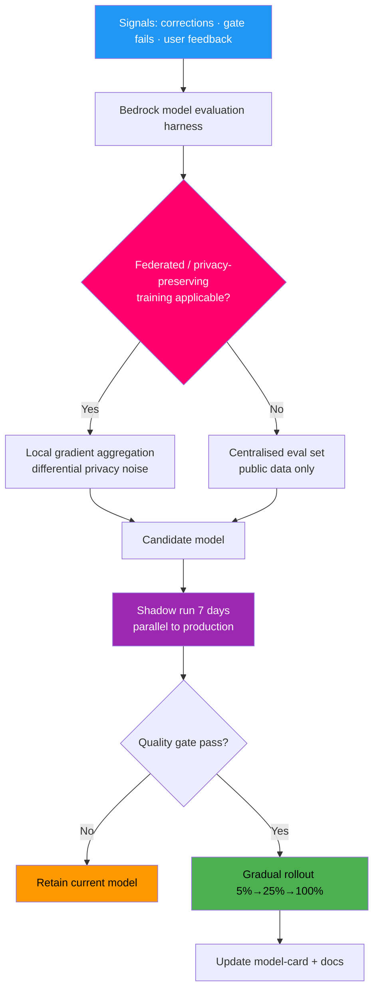

### 4.8 Crowdsourced Fact-Checking Flow (human-in-the-loop)

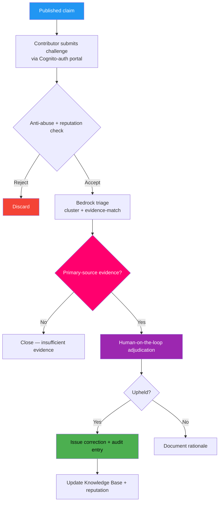

---

## 5. 🛡️ ISMS & AI-Policy Compliance Flows

Compliance is a **gate in every horizon**, mapped to ISO 27001:2022, NIST CSF 2.0 and CIS Controls v8.1, under [Hack23 ISMS-PUBLIC](https://github.com/Hack23/ISMS-PUBLIC).

### 5.1 AI-Policy Compliance Workflow (all horizons)

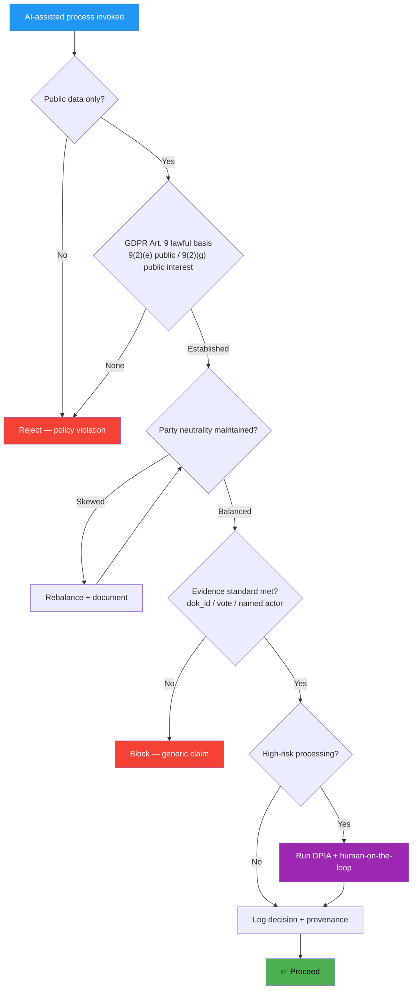

### 5.2 Control Mapping (process → framework)

| Future process flow | ISO 27001:2022 | NIST CSF 2.0 | CIS v8.1 |
|---------------------|----------------|--------------|----------|
| Agentic newsroom + analysis gate | A.8.25 secure SDLC, A.8.28 secure coding | PR.PS, DE.CM | 16 App Security |
| Multi-provider data fetch + provenance | A.5.34 privacy, A.8.12 data leakage | ID.AM, PR.DS | 3 Data Protection |
| Bedrock generation + Guardrails | A.5.23 cloud services | GV.SC, PR.AA | 4 Secure Config |
| API Gateway + Cognito | A.8.3 access, A.8.5 auth | PR.AA, PR.AC | 6 Access Control |
| Streaming fusion + audit trail | A.8.15 logging, A.8.16 monitoring | DE.CM, RS.AN | 8 Audit Log Mgmt |
| Federated learning + DP | A.5.34 privacy, A.8.11 data masking | PR.DS, GV.RM | 3 Data Protection |
| Model lifecycle + rollback | A.8.32 change mgmt | ID.IM, PR.PS | 4 Secure Config |

---

## 6. 🤖 AI Model Lifecycle & Evolution Flows

### 6.1 AI Model Lifecycle Management (continuous evaluation → rollout)

```mermaid
graph TD
    subgraph EVAL["Continuous Model Evaluation (~quarterly cadence)"]
        A[New model release<br/>Opus 4.8 → 5.x → 6.x …] --> B{Benchmark vs current}
        B -->|Superior| C[Shadow test — 7-day parallel run]
        B -->|Equal/Inferior| D[Document + keep current]
        C --> E{Quality gate pass?}
        E -->|Yes| F[Gradual rollout 5%→25%→100%]
        E -->|No| G[Rollback + retain current]
        F --> H[Full deploy + update model-card]
    end

    subgraph MAJOR["Annual Major Upgrade"]
        I[Major version<br/>Opus 5.0 / 6.0 / 7.0 …] --> J{Architecture compatible?}
        J -->|Yes| K[Enable new capabilities]
        J -->|No| L[Adapt platform + re-test]
        K --> M[Integration test — 14+ languages]
        L --> M
        M --> N[Deploy behind feature flags]
    end

    subgraph COMP["Competitor Evaluation (quarterly)"]
        O[Review OpenAI · Google · Meta · EU sovereign AI] --> P{Better per-task model?}
        P -->|Yes| Q[Multi-model via Amazon Bedrock]
        P -->|No| R[Keep provider strategy]
        Q --> S[A/B test per task type]
    end

    subgraph PARA["Paradigm-Shift Watch (2031–2037)"]
        U[Quantum / neuromorphic / AGI signal] --> V{Paradigm shift viable?}
        V -->|Yes| W[Autonomous mode + human oversight]
        V -->|Partial| X[Enhanced mode]
        V -->|No| Y[Continue annual upgrades]
    end

    H --> I
    N --> O
    S --> U

    style A fill:#00d9ff,color:#000000
    style I fill:#ff006e,color:#ffffff
    style O fill:#ffbe0b,color:#000000
    style U fill:#9c27b0,color:#ffffff
```

### 6.2 AI Model Evolution Timeline — DevSecOps Capability (verbatim)

> **Assumptions:** major AI-model upgrades land roughly annually; competitors (OpenAI, Google, Meta, EU sovereign AI) are re-evaluated at each release; the architecture is built to absorb paradigm shifts (quantum AI, neuromorphic computing); all transitions are governed by the [Hack23 AI Policy](https://github.com/Hack23/ISMS-PUBLIC/blob/main/AI_Policy.md).

| Year | AI Model | DevSecOps Capability Evolution |
|------|----------|--------------------------------|
| 2026 | Opus 4.6–4.9 | 🟢 AI-assisted code review, automated test generation, agentic CI/CD workflows |
| 2027 | Opus 5.x | 🔵 Predictive vulnerability detection, intelligent dependency management |
| 2028 | Opus 6.x | 🟣 Multi-modal security analysis (code + architecture + runtime), automated threat modeling |
| 2029 | Opus 7.x | 🟠 Autonomous security pipeline orchestration, self-healing build systems |
| 2030 | Opus 8.x | 🔴 Near-expert automated security review, AI-driven architecture validation |
| 2031–2033 | Opus 9–10.x / Pre-AGI | ⚪ Autonomous secure development lifecycle management |
| 2034–2037 | AGI / Post-AGI | ⭐ Transformative software engineering with built-in security assurance |

### 6.3 The Same AI Curve, Translated into Process Terms

Each model generation unlocks a concrete change in **where and how the platform processes political intelligence**:

| Year | AI Model | Process / Data-Flow Unlock (OSINT · party analytics · forecasting) |
|------|----------|--------------------------------------------------------------------|
| 2026 | Opus 4.6–4.9 | 🟢 v1.x agentic newsroom hardened; analysis-gate Pass-2 automation; 14-language translation throughput |
| 2027 | Opus 5.x | 🔵 v2.0 build-time OSINT precompute (network/temporal/anomaly) becomes reliable; party-landscape datasets auto-graded |
| 2028 | Opus 6.x | 🟣 v3.0 Bedrock multi-modal generation + real-time fact-check loop; RAG over 109K+ docs goes live |
| 2029 | Opus 7.x | 🟠 Autonomous streaming-fusion orchestration; self-correcting forecast pipelines; personalized feeds |
| 2030 | Opus 8.x | 🔴 Near-expert election/vote forecasting with calibrated uncertainty; conversational intelligence assistant |
| 2031–2033 | Opus 9–10.x / Pre-AGI | ⚪ Federated/Nordic & EU-parliament expansion; cross-jurisdiction data fusion at scale |
| 2034–2037 | AGI / Post-AGI | ⭐ Transformative democratic-intelligence flows with built-in neutrality & privacy assurance |

```mermaid
flowchart LR
    Y26[2026 Opus 4.x<br/>🟢 Static agentic newsroom] --> Y27[2027 Opus 5.x<br/>🔵 Static OSINT precompute]
    Y27 --> Y28[2028 Opus 6.x<br/>🟣 Bedrock RAG + fact-check]
    Y28 --> Y29[2029 Opus 7.x<br/>🟠 Streaming fusion]
    Y29 --> Y30[2030 Opus 8.x<br/>🔴 Calibrated forecasting]
    Y30 --> Y33[2031–33 Pre-AGI<br/>⚪ Nordic/EU federation]
    Y33 --> Y37[2034–37 AGI<br/>⭐ Transformative flows]

    style Y26 fill:#4caf50,color:#000000
    style Y27 fill:#2196f3,color:#ffffff
    style Y28 fill:#9c27b0,color:#ffffff
    style Y29 fill:#ff9800,color:#000000
    style Y30 fill:#f44336,color:#ffffff
    style Y33 fill:#eceff1,color:#000000
    style Y37 fill:#ffd700,color:#000000
```

---

## 7. ⚡ Performance & Cost-Optimization Flows

> All numbers are **roadmap targets**, not achieved metrics.

### 7.1 Performance Targets by Horizon

| Metric | v1.x (today) | v2.0 target | v3.0+ target |
|--------|--------------|-------------|--------------|
| LCP (p95) | < 2.5 s | < 2.0 s | < 1.8 s (edge) |
| Build time (full) | minutes | minutes (heavier precompute) | n/a (runtime) |
| API response (p95) | n/a (static) | n/a (static) | < 200 ms |
| RAG semantic query (p95) | n/a | n/a | < 800 ms |
| Streaming fusion latency | n/a | n/a | < 2 s end-to-end |
| Forecast refresh | daily build | daily build | event-driven (minutes) |

### 7.2 Cost-Optimization Decision Flow

```mermaid
flowchart TD
    REQ[New capability requested] --> STATIC{Can it be precomputed<br/>at build time?}
    STATIC -->|Yes| BUILD[Render static — near-zero runtime cost]
    STATIC -->|No| RUNTIME{Real-time demand proven?}
    RUNTIME -->|No| DEFER[Defer — keep static]
    RUNTIME -->|Yes| SERVERLESS[Serverless — pay-per-use Lambda]
    SERVERLESS --> CACHE[Cache aggressively<br/>edge + DynamoDB TTL]
    CACHE --> BATCH[Batch Bedrock calls off-peak]
    BATCH --> BUDGET{Within cost budget?}
    BUDGET -->|No| TUNE[Tune model tier / quotas] --> BUDGET
    BUDGET -->|Yes| SHIP[Ship + monitor cost telemetry]

    style REQ fill:#2196f3,color:#ffffff
    style BUILD fill:#4caf50,color:#000000
    style DEFER fill:#ff9800,color:#000000
    style SHIP fill:#4caf50,color:#000000
```

**Optimization levers:** static-first default · CloudFront cache (99% hit-rate target) · Bedrock model-tier selection per task · off-peak batch generation · Brotli/gzip compression · serverless scale-to-zero · vintage-aware data caching (avoid redundant IMF/SCB fetches).

---

## 8. 🌐 IMF Economic-Dataflow Evolution

*Baseline: the **already-implemented** IMF pipeline is documented in [`FLOWCHART.md`](FLOWCHART.md#-imf-economic-data-pipeline-current-state). The diagram below layers future gates (vintage-age UI badge, provider-mix telemetry, RAG-indexed economic provenance) onto today's pure-TypeScript client without changing the canonical IMF-first rule.*

> **Authoritative hub:** [`analysis/imf/README.md`](analysis/imf/README.md) · [`analysis/imf/agentic-integration.md`](analysis/imf/agentic-integration.md) · [`analysis/imf/indicators-inventory.json`](analysis/imf/indicators-inventory.json) · [`analysis/imf/data-dictionary.md`](analysis/imf/data-dictionary.md) · [`.github/aw/ECONOMIC_DATA_CONTRACT.md`](.github/aw/ECONOMIC_DATA_CONTRACT.md) v2.1

```mermaid
flowchart LR
    classDef primary fill:#0a4f8f,color:#fff,stroke:#00d9ff,stroke-width:2px
    classDef secondary fill:#3a3a3a,color:#ddd,stroke:#888
    classDef gate fill:#ff006e,color:#fff,stroke:#fff
    classDef future fill:#9c27b0,color:#fff,stroke:#fff

    Start([news-* / forecast workflow]) --> Domain{Identify economic class}
    Domain -->|Macro · Fiscal · Monetary · External · Trade| IMF[(IMF SDMX 3.0 + Datamapper<br/>scripts/imf-client.ts)]:::primary
    Domain -->|Governance / Environment / Social residue| WB[(World Bank)]:::secondary
    Domain -->|Swedish monthly / regional| SCB[(SCB PxWeb v2)]:::secondary

    IMF --> Vintage{Vintage > 6 months?}:::gate
    Vintage -->|Yes| Annotate[Annotate stale + downgrade confidence]
    Vintage -->|No| Cache[Cache: vintage-tagged · SHA-256 pinned]
    Annotate --> Cache
    Cache --> Provenance[Emit economicProvenance<br/>provider · dataflow · indicator · vintage]
    WB --> Cache
    SCB --> Cache

    Provenance --> Compose[Article / forecast composition]
    Compose --> Lint{IMF-first lint}:::gate
    Lint -->|WB economic citation w/o IMF cross-ref| Reject([Block — open issue])
    Lint -->|Pass| Publish([Publish])

    Publish --> FutBadge[v2.0: vintage-age UI badge<br/>+ provider-mix telemetry]:::future
    Publish --> FutRAG[v3.0+: index economicProvenance<br/>into Bedrock Knowledge Base]:::future

    style Start fill:#2196f3,color:#ffffff
    style Publish fill:#4caf50,color:#000000
```

### Provider decision matrix

| Indicator class | Primary | Secondary | Why |
|---|---|---|---|
| Macro (GDP, growth, unemployment, inflation, fiscal balance, debt, current account) | **IMF WEO + Fiscal Monitor** | SCB (Sweden monthly) | Freshness + T+5 projections; SNA 2008 / GFSM 2014 / BPM6 comparability |
| Bilateral trade flows | **IMF DOTS** | — | Partner-country dimension, monthly cadence |
| Monthly inflation, policy rates | **IMF IFS / MFS_IR** | SCB / Riksbank | Standardised cross-country |
| Government spending by function (defence/health/education/social protection) | **IMF GFS_COFOG** | — | Committee-aligned (FöU/SoU/UbU/SfU) |
| Commodity prices, exchange rates | **IMF PCPS / ER** | — | Canonical benchmarks |
| Governance (CC.EST, RL.EST, VA.EST, GE.EST, RQ.EST, PV.EST) | **World Bank WGI** | — | IMF has no equivalent |
| Environment (CO2, renewables, forest, water) | **World Bank** | — | IMF has no equivalent |
| Social/education residue (literacy, school participation, gender ratios) | **World Bank** | GFS_COFOG 09 | IMF has no equivalent |
| Defence spending depth (long historicals) | **World Bank MS.MIL.*** | GFS_COFOG 02 | WB deeper history |
| Swedish ground truth (monthly labour, regional, budget execution) | **SCB** | — | National statistics authority |

**Canonical rule (unchanged across horizons).** Every economic claim cites an IMF dataflow first; World Bank citations are reserved for governance, environment and social residue; SCB is the Swedish-specific ground-truth layer. In v3.0+, this same provenance is **indexed into the Bedrock Knowledge Base** so RAG answers inherit the IMF-first discipline. See `ECONOMIC_DATA_CONTRACT.md` v2.1 for the banned-phrase list and vintage discipline (>6 mo → annotation).

---

## 📝 Document Control

**Version History:**

| Version | Date | Changes | Author |
|---------|------|---------|--------|
| 1.0 | 2026-02-15 | Initial creation with 10+ comprehensive future flowcharts | Hack23 Documentation Team |
| 2.0 | 2026-02-24 | Extended to 2037 vision, AI/LLM evolution flow, AGI planning | Hack23 Documentation Team |
| 3.0 | 2026-05-31 | Full refresh & re-alignment to v1.0.x baseline ([FLOWCHART.md](FLOWCHART.md)); restructured into three explicit horizons (v1.x static agentic newsroom → v2.0 static deepening → v3.0+ AWS serverless); added build-time OSINT/party-landscape & INTOP flows; AWS-serverless runtime flows (API Gateway, Lambda, Step Functions, EventBridge, Kinesis, **Bedrock**, **Knowledge Bases RAG**, **Cognito**); AI Model Evolution table verbatim + process translation; refreshed IMF dataflow evolution | Hack23 Intelligence-Operative Agent |

**Review Schedule:**
- Quarterly review aligned with FUTURE_ARCHITECTURE.md and FUTURE_SECURITY_ARCHITECTURE.md
- Updated as capabilities reach implementation milestones and horizon-gates are crossed

**Classification:** Public  
**Distribution:** Unrestricted  
**Repository:** https://github.com/Hack23/riksdagsmonitor  
**Path:** /FUTURE_FLOWCHART.md  
**Format:** Markdown with Mermaid diagrams  
**Next Review:** 2026-08-31

---

## 📚 Related Documentation

### Current State (baseline this doc builds on)
- **[FLOWCHART.md](FLOWCHART.md)** — current process flows & pipelines (direct baseline)
- **[ARCHITECTURE.md](ARCHITECTURE.md)** — current system architecture (C4 model)
- **[DATA_MODEL.md](DATA_MODEL.md)** — current data structures
- **[STATEDIAGRAM.md](STATEDIAGRAM.md)** — current state transitions
- **[WORKFLOWS.md](WORKFLOWS.md)** — CI/CD automation
- **[SECURITY_ARCHITECTURE.md](SECURITY_ARCHITECTURE.md)** — current security controls

### Future Vision (sibling FUTURE_* docs)
- **[FUTURE_ARCHITECTURE.md](FUTURE_ARCHITECTURE.md)** — architectural evolution roadmap
- **[FUTURE_DATA_MODEL.md](FUTURE_DATA_MODEL.md)** — enhanced data architecture
- **[FUTURE_STATEDIAGRAM.md](FUTURE_STATEDIAGRAM.md)** — advanced state management
- **[FUTURE_MINDMAP.md](FUTURE_MINDMAP.md)** — future capability map
- **[FUTURE_SWOT.md](FUTURE_SWOT.md)** — strategic outlook
- **[FUTURE_SECURITY_ARCHITECTURE.md](FUTURE_SECURITY_ARCHITECTURE.md)** — security evolution roadmap

### ISMS & Compliance
- **[Hack23 ISMS-PUBLIC](https://github.com/Hack23/ISMS-PUBLIC/)** — Information Security Management System
- **[AI Policy](https://github.com/Hack23/ISMS-PUBLIC/blob/main/AI_Policy.md)** — AI governance and ethics
- **[Secure Development Policy](https://github.com/Hack23/ISMS-PUBLIC/blob/main/Secure_Development_Policy.md)** — SDLC security
- **[Classification Framework](https://github.com/Hack23/ISMS-PUBLIC/blob/main/CLASSIFICATION.md)** — data and system classification

### CIA Platform & Standards
- **[CIA Platform](https://www.hack23.com/cia)** — Citizen Intelligence Agency (data source)
- **[EU AI Act](https://digital-strategy.ec.europa.eu/en/policies/regulatory-framework-ai)** · **[GDPR](https://gdpr.eu/)** · **[ISO 27001](https://www.iso.org/isoiec-27001-information-security.html)** · **[NIST AI RMF](https://www.nist.gov/itl/ai-risk-management-framework)**

---

<p align="center">
  <strong>🌐 Riksdagsmonitor — Building the Future of Democratic Transparency</strong><br>
  <em>Powered by AI, Grounded in Privacy, Committed to Democracy</em>
</p>

<p align="center">
  <a href="https://www.riksdagsmonitor.se">Website</a> ·
  <a href="https://github.com/Hack23/riksdagsmonitor">GitHub</a> ·
  <a href="https://www.hack23.com/cia">CIA Platform</a> ·
  <a href="https://github.com/Hack23/ISMS-PUBLIC">ISMS</a>
</p>

---

**📋 Document Control:**  
**✅ Approved by:** James Pether Sörling, CEO  
**📤 Distribution:** Public  
**🏷️ Classification:** [](https://github.com/Hack23/ISMS-PUBLIC/blob/main/CLASSIFICATION.md#confidentiality-levels)  
**📅 Effective Date:** 2026-05-31  
**⏰ Next Review:** 2026-08-31  
**🎯 Framework Compliance:** [](https://github.com/Hack23/ISMS-PUBLIC/blob/main/CLASSIFICATION.md) [](https://github.com/Hack23/ISMS-PUBLIC/blob/main/CLASSIFICATION.md) [](https://github.com/Hack23/ISMS-PUBLIC/blob/main/CLASSIFICATION.md)

---

## 🔗 Hack23 Ecosystem

<table>
<tr>
  <th width="33%">🌐 Platforms</th>
  <th width="33%">📦 Open-Source Projects</th>
  <th width="33%">🛡️ Governance &amp; Standards</th>
</tr>
<tr>
<td valign="top">
🗳️ <a href="https://riksdagsmonitor.com">Riksdagsmonitor</a> — Swedish Parliament intelligence<br>
🇪🇺 <a href="https://www.euparliamentmonitor.com">EU Parliament Monitor</a> — European coverage<br>
🕵️ <a href="https://www.hack23.com/cia">Citizen Intelligence Agency</a> — political-data engine<br>
🌐 <a href="https://www.hack23.com">Hack23 AB</a> — corporate site<br>
📰 <a href="https://hack23.com/blog.html">Hack23 Blog</a> — engineering &amp; policy<br>
💼 <a href="https://www.linkedin.com/company/hack23/">Hack23 on LinkedIn</a>
</td>
<td valign="top">
🗳️ <a href="https://github.com/Hack23/riksdagsmonitor">Hack23/riksdagsmonitor</a><br>
🕵️ <a href="https://github.com/Hack23/cia">Hack23/cia</a><br>
🇪🇺 <a href="https://github.com/Hack23/euparliamentmonitor">Hack23/euparliamentmonitor</a><br>
🔌 <a href="https://github.com/Hack23/european-parliament-mcp">Hack23/european-parliament-mcp</a><br>
✅ <a href="https://github.com/Hack23/cia-compliance-manager">Hack23/cia-compliance-manager</a><br>
🥋 <a href="https://github.com/Hack23/black-trigram">Hack23/black-trigram</a><br>
🏠 <a href="https://github.com/Hack23/homepage">Hack23/homepage</a>
</td>
<td valign="top">
🛡️ <a href="https://github.com/Hack23/ISMS-PUBLIC">Hack23 ISMS-PUBLIC</a> — public ISMS<br>
🔒 <a href="https://github.com/Hack23/ISMS-PUBLIC/blob/main/Information_Security_Policy.md">Information Security Policy</a><br>
🤖 <a href="https://github.com/Hack23/ISMS-PUBLIC/blob/main/AI_Policy.md">AI Policy</a><br>
🧪 <a href="https://github.com/Hack23/ISMS-PUBLIC/blob/main/Secure_Development_Policy.md">Secure Development Policy</a><br>
🎯 <a href="https://github.com/Hack23/ISMS-PUBLIC/blob/main/Threat_Modeling.md">Threat Modeling Policy</a><br>
⚠️ <a href="https://github.com/Hack23/ISMS-PUBLIC/blob/main/Vulnerability_Management.md">Vulnerability Management</a><br>
🏷️ <a href="https://github.com/Hack23/ISMS-PUBLIC/blob/main/CLASSIFICATION.md">Classification Framework</a>
</td>
</tr>
</table>

<p align="center">
<a href="https://www.bestpractices.dev/projects/12069"></a>
<a href="https://scorecard.dev/viewer/?uri=github.com/Hack23/riksdagsmonitor"></a>
<a href="https://github.com/Hack23/ISMS-PUBLIC"></a>
<a href="https://github.com/Hack23/ISMS-PUBLIC"></a>
<a href="https://github.com/Hack23/ISMS-PUBLIC"></a>
<a href="https://www.apache.org/licenses/LICENSE-2.0"></a>
</p>

<p align="center"><em>🗳️ Empower citizens · 🔍 Strengthen democratic accountability · 🕵️ Illuminate the political process</em></p>

<p align="center"><sub>© 2008–2026 <a href="https://www.hack23.com">Hack23 AB</a> (Org.nr 559534-7807) · Maintainer: <a href="https://www.linkedin.com/in/jamessorling/">James Pether Sörling, CISSP CISM</a></sub></p>
