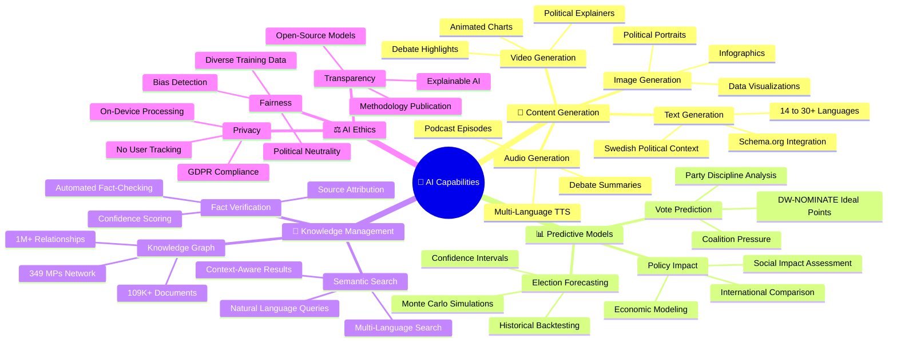
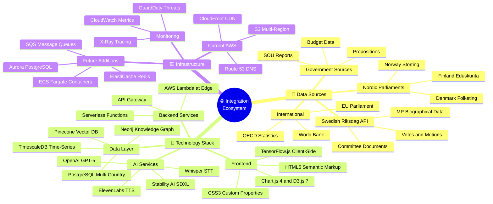
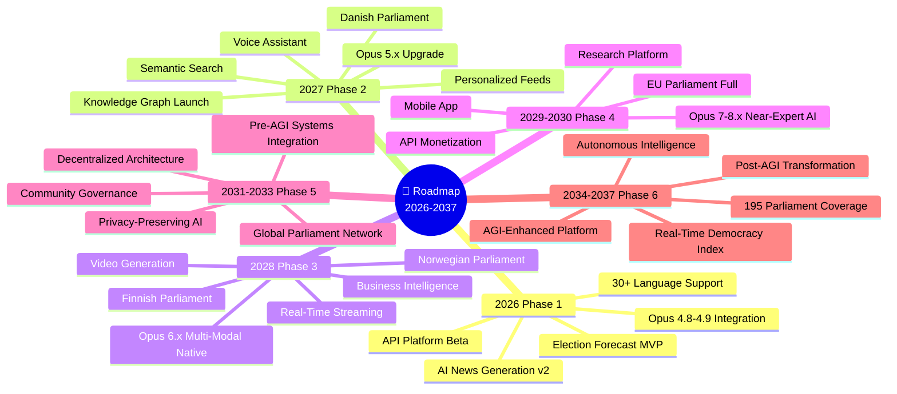
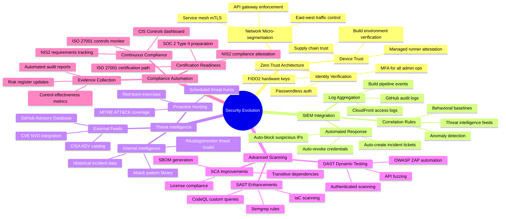
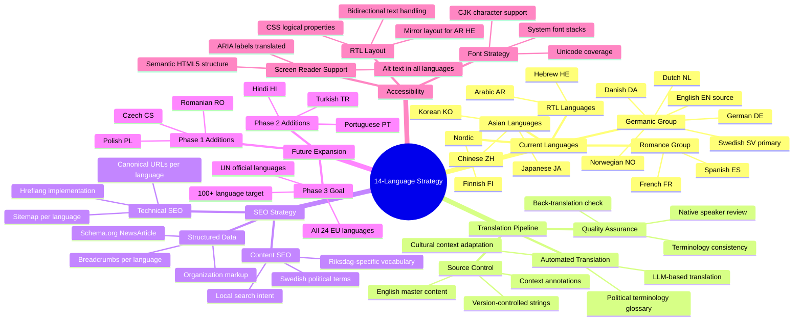
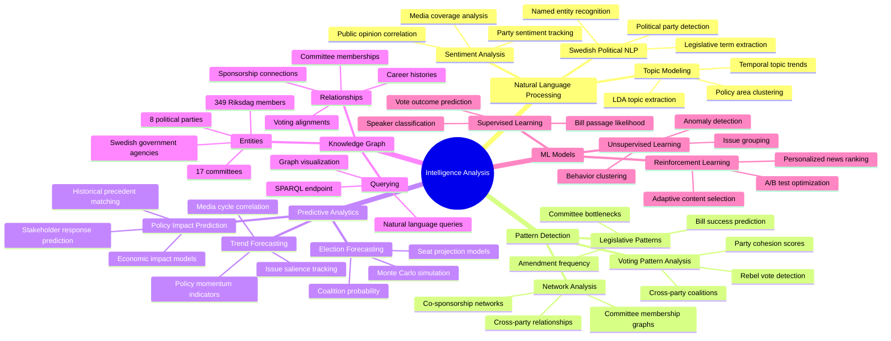
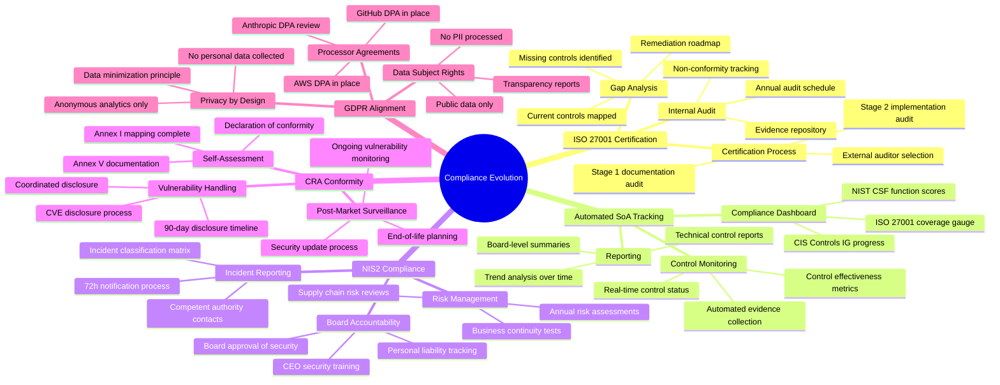
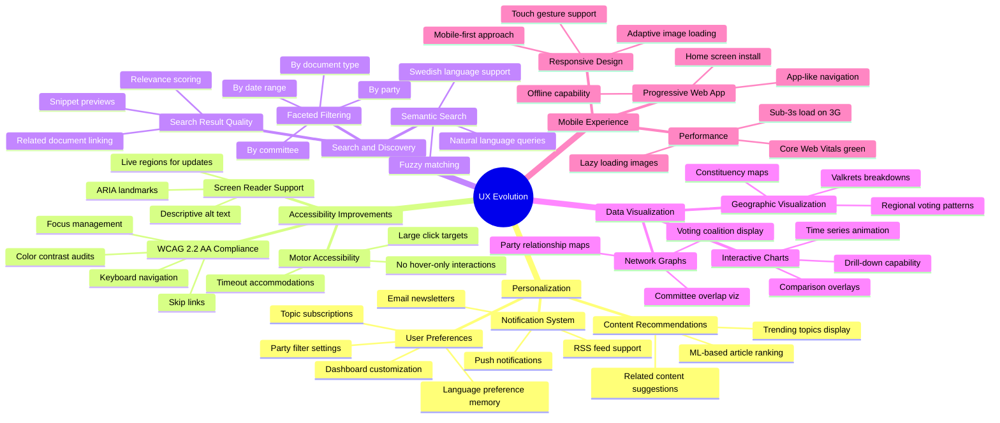
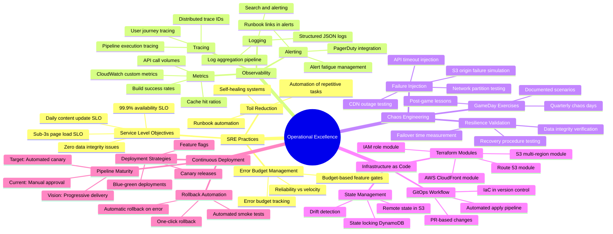
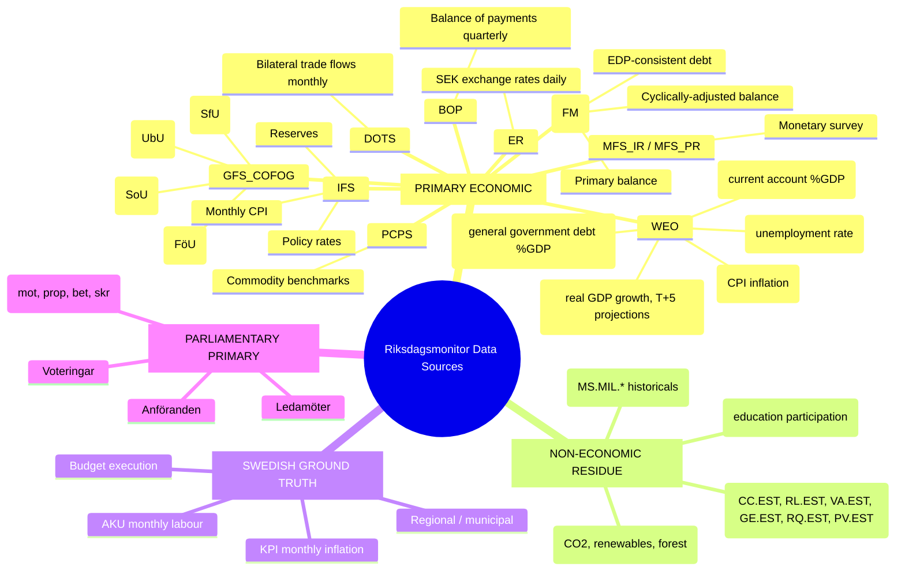

  

<h1 align="center">🚀 Riksdagsmonitor — Future Mindmap</h1>

  <strong>🗺️ Future Capability Map for Democratic Intelligence Evolution</strong> 
  <em>🎯 AI Analytics · Nordic Expansion · Real-Time Intelligence · API Platform</em>

  
  
  
  

**📋 Document Owner:** CEO | **📄 Version:** 2.0 | **📅 Last Updated:** 2026-02-24 (UTC)  
**🔄 Review Cycle:** Quarterly | **⏰ Next Review:** 2026-05-20  
**🏢 Owner:** Hack23 AB (Org.nr 5595347807) | **🏷️ Classification:** Public

---

## 🎯 Purpose

This document provides future-state conceptual mindmaps for Riksdagsmonitor, visualizing the planned evolution from a static Swedish Parliament monitoring website to a comprehensive AI-powered democratic intelligence platform. Building on the current [Mindmap](MINDMAP.md), these diagrams illustrate the 3-11 year roadmap (2026-2037).

## 📚 Architecture Documentation Map

| Document | Focus | Description |
|----------|-------|-------------|
| [🏛️ Architecture](ARCHITECTURE.md) | 🏗️ C4 Models | System context, containers, components |
| [📊 Data Model](DATA_MODEL.md) | 📊 Data | Entity relationships and data dictionary |
| [🔄 Flowchart](FLOWCHART.md) | 🔄 Processes | Business and data flow diagrams |
| [📈 State Diagram](STATEDIAGRAM.md) | 📈 States | System state transitions and lifecycles |
| [🧠 Mindmap](MINDMAP.md) | 🧠 Concepts | System conceptual relationships |
| [💼 SWOT](SWOT.md) | 💼 Strategy | Strategic analysis and positioning |
| [🛡️ Security Architecture](SECURITY_ARCHITECTURE.md) | 🔒 Security | Current security controls and design |
| [🚀 Future Security](FUTURE_SECURITY_ARCHITECTURE.md) | 🔮 Security | Planned security improvements |
| [🎯 Threat Model](THREAT_MODEL.md) | 🎯 Threats | STRIDE/MITRE ATT&CK analysis |
| [🚀 Future Architecture](FUTURE_ARCHITECTURE.md) | 🔮 Evolution | Architectural evolution roadmap |
| [📊 Future Data Model](FUTURE_DATA_MODEL.md) | 🔮 Data | Enhanced data architecture plans |
| [🔄 Future Flowchart](FUTURE_FLOWCHART.md) | 🔮 Processes | Improved process workflows |
| [📈 Future State Diagram](FUTURE_STATEDIAGRAM.md) | 🔮 States | Advanced state management |
| **[🧠 Future Mindmap](FUTURE_MINDMAP.md)** | **🔮 Concepts** | **Capability expansion plans** |
| [💼 Future SWOT](FUTURE_SWOT.md) | 🔮 Strategy | Future strategic opportunities |

---

## 1. 🏗️ Platform Evolution Mindmap (2026-2037)

---

## 2. 🤖 AI Capabilities Mindmap (2026-2028)

---

## 3. 🌐 Integration Ecosystem Mindmap

---

## 4. 📅 Timeline Mindmap

---

## 📋 Capability Matrix

| Capability | Current State | 2027 Target | 2030 Vision | 2034 Target | 2037 Vision |
|------------|--------------|-------------|-------------|-------------|-------------|
| **Languages** | 14 | 30+ | 50+ | 100+ | All UN languages |
| **Parliaments** | 1 (Sweden) | 3 (Nordic) | 10+ (Global) | 50+ | 195 (Global) |
| **AI Models** | Opus 4.8 generation | Opus 5.x predictive | Opus 8.x multi-modal | Pre-AGI systems | AGI-enhanced |
| **Search** | Keyword | Semantic | Knowledge graph | Autonomous discovery | Omniscient index |
| **Data Latency** | Daily batch | Hourly | Real-time | Sub-second | Predictive |
| **Revenue** | None | API beta | Multi-stream | Enterprise platform | Global SaaS |
| **Users** | Organic | 10K+ monthly | 100K+ monthly | 1M+ monthly | 10M+ monthly |
| **AI Updates** | Opus 4.8 | Minor every 2.3mo | Major annually | Continuous evolution | AGI integration |

---

## 📚 Architecture Documentation Map

| Document | Focus | Description |
|----------|-------|-------------|
| [🏛️ Architecture](ARCHITECTURE.md) | 🏗️ C4 Models | System context, containers, components |
| [📊 Data Model](DATA_MODEL.md) | 📊 Data | Entity relationships and data dictionary |
| [🔄 Flowchart](FLOWCHART.md) | 🔄 Processes | Business and data flow diagrams |
| [📈 State Diagram](STATEDIAGRAM.md) | 📈 States | System state transitions and lifecycles |
| [🧠 Mindmap](MINDMAP.md) | 🧠 Concepts | System conceptual relationships |
| [💼 SWOT](SWOT.md) | 💼 Strategy | Strategic analysis and positioning |
| [🛡️ Security Architecture](SECURITY_ARCHITECTURE.md) | 🔒 Security | Current security controls and design |
| [🚀 Future Security](FUTURE_SECURITY_ARCHITECTURE.md) | 🔮 Security | Planned security improvements |
| [🎯 Threat Model](THREAT_MODEL.md) | 🎯 Threats | STRIDE/MITRE ATT&CK analysis |
| [🚀 Future Architecture](FUTURE_ARCHITECTURE.md) | 🔮 Evolution | Architectural evolution roadmap |
| [📊 Future Data Model](FUTURE_DATA_MODEL.md) | 🔮 Data | Enhanced data architecture plans |
| [🔄 Future Flowchart](FUTURE_FLOWCHART.md) | 🔮 Processes | Improved process workflows |
| [📈 Future State Diagram](FUTURE_STATEDIAGRAM.md) | 🔮 States | Advanced state management |
| **[🧠 Future Mindmap](FUTURE_MINDMAP.md)** | **🔮 Concepts** | **Capability expansion plans** |
| [💼 Future SWOT](FUTURE_SWOT.md) | 🔮 Strategy | Future strategic opportunities |

---

---

## 5. 🔒 Future Security Capability Evolution

---

## 6. 🌍 Multi-Language Content Strategy

---

## 7. 🤖 Intelligence Analysis Capabilities

---

## 8. 📊 Future Compliance Capabilities

---

## 9. 🌟 Future User Experience Capabilities

---

## 10. ⚙️ Future Operational Capabilities

---

## Updated Capability Matrix

| Capability | Current State | 2027 Target | 2030 Vision | 2034 Target | 2037 Vision |
|------------|--------------|-------------|-------------|-------------|-------------|
| **Languages** | 14 | 30+ | 50+ | 100+ | All UN languages |
| **Parliaments** | 1 Sweden | 3 Nordic | 10+ Global | 50+ | 195 Global |
| **AI Models** | Opus 4.8 | Opus 5.x | Opus 8.x | Pre-AGI | AGI-enhanced |
| **Search** | Keyword | Semantic | Knowledge graph | Autonomous | Omniscient index |
| **Data Latency** | Daily batch | Hourly | Real-time | Sub-second | Predictive |
| **Revenue** | None | API beta | Multi-stream | Enterprise | Global SaaS |
| **Users** | Organic | 10K+ monthly | 100K+ monthly | 1M+ monthly | 10M+ monthly |
| **Security** | IG1/IG2 | Zero Trust | SIEM | Automated IR | AI-driven |
| **Compliance** | ISO aligned | ISO certified | NIS2 attested | SOC2 Type II | Continuous |
| **UX** | Static HTML | PWA basics | Personalized | Adaptive AI | Immersive |
| **Infra** | GitHub Pages | IaC v1 | Kubernetes | Multi-cloud | Edge compute |
| **Observability** | Basic alerts | SLOs defined | Full trace | AIOps | Predictive |

---

## 📚 Related Documents

### Riksdagsmonitor Architecture Portfolio

| Document | Focus | Description |
|----------|-------|-------------|
| [🏛️ Architecture](ARCHITECTURE.md) | 🏗️ C4 Models | System context, containers, components |
| [📊 Data Model](DATA_MODEL.md) | 📊 Data | Entity relationships and data dictionary |
| [🔄 Flowchart](FLOWCHART.md) | 🔄 Processes | Business and data flow diagrams |
| [📈 State Diagram](STATEDIAGRAM.md) | 📈 States | System state transitions and lifecycles |
| [🧠 Mindmap](MINDMAP.md) | 🧠 Concepts | Current system conceptual relationships |
| **[🧠 Future Mindmap](FUTURE_MINDMAP.md)** | **🔮 Concepts** | **Capability expansion plans (this document)** |
| [💼 SWOT](SWOT.md) | 💼 Strategy | Strategic analysis and positioning |
| [🛡️ Security Architecture](SECURITY_ARCHITECTURE.md) | 🔒 Security | Current security controls and design |
| [🎯 Threat Model](THREAT_MODEL.md) | 🎯 Threats | STRIDE/MITRE ATT&CK analysis |
| [🚀 Future Architecture](FUTURE_ARCHITECTURE.md) | 🔮 Evolution | Architectural evolution roadmap |

### Hack23 ISMS Policies

- [🛡️ Secure Development Policy](https://github.com/Hack23/ISMS-PUBLIC/blob/main/Secure_Development_Policy.md) — Architecture documentation requirements
- [🏷️ Classification Framework](https://github.com/Hack23/ISMS-PUBLIC/blob/main/CLASSIFICATION.md) — CIA triad classification

---

**📋 Document Control:**  
**✅ Approved by:** James Pether Sörling, CEO  
**📤 Distribution:** Public  
**🏷️ Classification:**   
**📅 Effective Date:** 2026-02-25  
**⏰ Next Review:** 2026-05-25  
**🎯 Framework Compliance:**   

---

## 🌐 Evolving the Current IMF Mindmap toward the Future Data-Sources Surface

*Baseline: the **already-implemented** IMF subtree is documented in [`MINDMAP.md`](MINDMAP.md) §IMF. The mindmap below extends that baseline with future capabilities (commercial-provider redundancy, websocket feeds, cross-validation worker) without removing today's pure-TS client foundation.*

> **Authoritative hub:** [`analysis/imf/README.md`](analysis/imf/README.md) · [`analysis/imf/agentic-integration.md`](analysis/imf/agentic-integration.md) · [`analysis/imf/indicators-inventory.json`](analysis/imf/indicators-inventory.json) · [`analysis/imf/data-dictionary.md`](analysis/imf/data-dictionary.md) · [`.github/aw/ECONOMIC_DATA_CONTRACT.md`](.github/aw/ECONOMIC_DATA_CONTRACT.md)

**Canonical rule.** Every economic claim in a Riksdagsmonitor article cites an IMF dataflow first; World Bank citations are reserved for governance, environment and social residue (the classes IMF does not publish). SCB is the Swedish-specific ground truth layer. See `ECONOMIC_DATA_CONTRACT.md` v2.1 for the banned-phrase list and vintage discipline (>6 mo → annotation).

---

## 🔗 Hack23 Ecosystem

<table>
<tr>
  <th width="33%">🌐 Platforms</th>
  <th width="33%">📦 Open-Source Projects</th>
  <th width="33%">🛡️ Governance &amp; Standards</th>
</tr>
<tr>
<td valign="top">
🗳️ <a href="https://riksdagsmonitor.com">Riksdagsmonitor</a> — Swedish Parliament intelligence 
🇪🇺 <a href="https://www.euparliamentmonitor.com">EU Parliament Monitor</a> — European coverage 
🕵️ <a href="https://www.hack23.com/cia">Citizen Intelligence Agency</a> — political-data engine 
🌐 <a href="https://www.hack23.com">Hack23 AB</a> — corporate site 
📰 <a href="https://hack23.com/blog.html">Hack23 Blog</a> — engineering &amp; policy 
💼 <a href="https://www.linkedin.com/company/hack23/">Hack23 on LinkedIn</a>
</td>
<td valign="top">
🗳️ <a href="https://github.com/Hack23/riksdagsmonitor">Hack23/riksdagsmonitor</a> 
🕵️ <a href="https://github.com/Hack23/cia">Hack23/cia</a> 
🇪🇺 <a href="https://github.com/Hack23/euparliamentmonitor">Hack23/euparliamentmonitor</a> 
🔌 <a href="https://github.com/Hack23/european-parliament-mcp">Hack23/european-parliament-mcp</a> 
✅ <a href="https://github.com/Hack23/cia-compliance-manager">Hack23/cia-compliance-manager</a> 
🥋 <a href="https://github.com/Hack23/black-trigram">Hack23/black-trigram</a> 
🏠 <a href="https://github.com/Hack23/homepage">Hack23/homepage</a>
</td>
<td valign="top">
🛡️ <a href="https://github.com/Hack23/ISMS-PUBLIC">Hack23 ISMS-PUBLIC</a> — public ISMS 
🔒 <a href="https://github.com/Hack23/ISMS-PUBLIC/blob/main/Information_Security_Policy.md">Information Security Policy</a> 
🤖 <a href="https://github.com/Hack23/ISMS-PUBLIC/blob/main/AI_Policy.md">AI Policy</a> 
🧪 <a href="https://github.com/Hack23/ISMS-PUBLIC/blob/main/Secure_Development_Policy.md">Secure Development Policy</a> 
🎯 <a href="https://github.com/Hack23/ISMS-PUBLIC/blob/main/Threat_Modeling.md">Threat Modeling Policy</a> 
⚠️ <a href="https://github.com/Hack23/ISMS-PUBLIC/blob/main/Vulnerability_Management.md">Vulnerability Management</a> 
🏷️ <a href="https://github.com/Hack23/ISMS-PUBLIC/blob/main/CLASSIFICATION.md">Classification Framework</a>
</td>
</tr>
</table>

<em>🗳️ Empower citizens · 🔍 Strengthen democratic accountability · 🕵️ Illuminate the political process</em>

© 2008–2026 <a href="https://www.hack23.com">Hack23 AB</a> (Org.nr 559534-7807) · Maintainer: <a href="https://www.linkedin.com/in/jamessorling/">James Pether Sörling, CISSP CISM</a>

