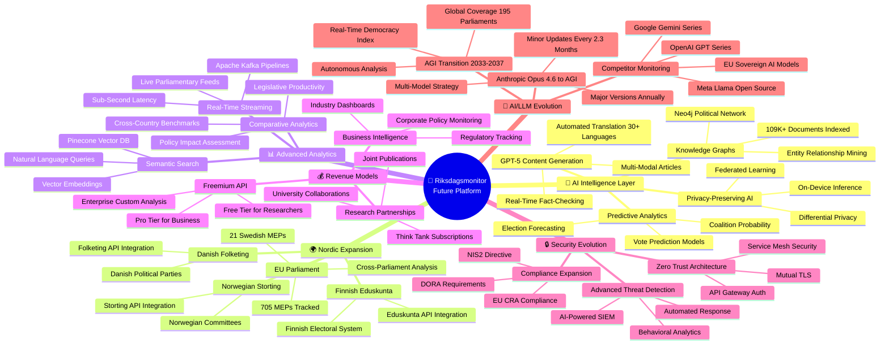
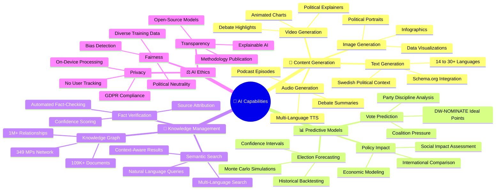
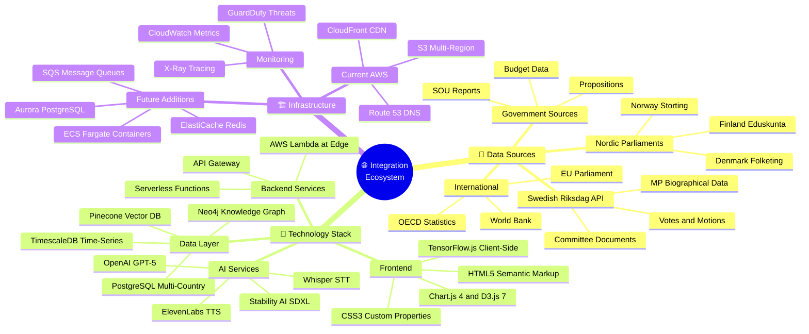

  

<h1 align="center">🚀 Riksdagsmonitor — Future Mindmap</h1>

  <strong>🗺️ Future Capability Map for Democratic Intelligence Evolution</strong> 
  <em>🎯 AI Analytics · Nordic Expansion · Real-Time Intelligence · API Platform</em>

  
  
  
  

**📋 Document Owner:** CEO | **📄 Version:** 2.0 | **📅 Last Updated:** 2026-02-24 (UTC)  
**🔄 Review Cycle:** Quarterly | **⏰ Next Review:** 2026-05-20  
**🏢 Owner:** Hack23 AB (Org.nr 5595347807) | **🏷️ Classification:** Public

---

## 🎯 Purpose

This document provides future-state conceptual mindmaps for Riksdagsmonitor, visualizing the planned evolution from a static Swedish Parliament monitoring website to a comprehensive AI-powered democratic intelligence platform. Building on the current [Mindmap](MINDMAP.md), these diagrams illustrate the 3-11 year roadmap (2026-2037).

## 📚 Architecture Documentation Map

| Document | Focus | Description |
|----------|-------|-------------|
| [🏛️ Architecture](ARCHITECTURE.md) | 🏗️ C4 Models | System context, containers, components |
| [📊 Data Model](DATA_MODEL.md) | 📊 Data | Entity relationships and data dictionary |
| [🔄 Flowchart](FLOWCHART.md) | 🔄 Processes | Business and data flow diagrams |
| [📈 State Diagram](STATEDIAGRAM.md) | 📈 States | System state transitions and lifecycles |
| [🧠 Mindmap](MINDMAP.md) | 🧠 Concepts | System conceptual relationships |
| [💼 SWOT](SWOT.md) | 💼 Strategy | Strategic analysis and positioning |
| [🛡️ Security Architecture](SECURITY_ARCHITECTURE.md) | 🔒 Security | Current security controls and design |
| [🚀 Future Security](FUTURE_SECURITY_ARCHITECTURE.md) | 🔮 Security | Planned security improvements |
| [🎯 Threat Model](THREAT_MODEL.md) | 🎯 Threats | STRIDE/MITRE ATT&CK analysis |
| [🚀 Future Architecture](FUTURE_ARCHITECTURE.md) | 🔮 Evolution | Architectural evolution roadmap |
| [📊 Future Data Model](FUTURE_DATA_MODEL.md) | 🔮 Data | Enhanced data architecture plans |
| [🔄 Future Flowchart](FUTURE_FLOWCHART.md) | 🔮 Processes | Improved process workflows |
| [📈 Future State Diagram](FUTURE_STATEDIAGRAM.md) | 🔮 States | Advanced state management |
| **[🧠 Future Mindmap](FUTURE_MINDMAP.md)** | **🔮 Concepts** | **Capability expansion plans** |
| [💼 Future SWOT](FUTURE_SWOT.md) | 🔮 Strategy | Future strategic opportunities |

---

## 1. 🏗️ Platform Evolution Mindmap (2026-2037)

---

## 2. 🤖 AI Capabilities Mindmap (2026-2028)

---

## 3. 🌐 Integration Ecosystem Mindmap

---

## 4. 📅 Timeline Mindmap

---

## 📋 Capability Matrix

| Capability | Current State | 2027 Target | 2030 Vision | 2034 Target | 2037 Vision |
|------------|--------------|-------------|-------------|-------------|-------------|
| **Languages** | 14 | 30+ | 50+ | 100+ | All UN languages |
| **Parliaments** | 1 (Sweden) | 3 (Nordic) | 10+ (Global) | 50+ | 195 (Global) |
| **AI Models** | Opus 4.6 generation | Opus 5.x predictive | Opus 8.x multi-modal | Pre-AGI systems | AGI-enhanced |
| **Search** | Keyword | Semantic | Knowledge graph | Autonomous discovery | Omniscient index |
| **Data Latency** | Daily batch | Hourly | Real-time | Sub-second | Predictive |
| **Revenue** | None | API beta | Multi-stream | Enterprise platform | Global SaaS |
| **Users** | Organic | 10K+ monthly | 100K+ monthly | 1M+ monthly | 10M+ monthly |
| **AI Updates** | Opus 4.6 | Minor every 2.3mo | Major annually | Continuous evolution | AGI integration |

---

## 📚 Architecture Documentation Map

| Document | Focus | Description |
|----------|-------|-------------|
| [🏛️ Architecture](ARCHITECTURE.md) | 🏗️ C4 Models | System context, containers, components |
| [📊 Data Model](DATA_MODEL.md) | 📊 Data | Entity relationships and data dictionary |
| [🔄 Flowchart](FLOWCHART.md) | 🔄 Processes | Business and data flow diagrams |
| [📈 State Diagram](STATEDIAGRAM.md) | 📈 States | System state transitions and lifecycles |
| [🧠 Mindmap](MINDMAP.md) | 🧠 Concepts | System conceptual relationships |
| [💼 SWOT](SWOT.md) | 💼 Strategy | Strategic analysis and positioning |
| [🛡️ Security Architecture](SECURITY_ARCHITECTURE.md) | 🔒 Security | Current security controls and design |
| [🚀 Future Security](FUTURE_SECURITY_ARCHITECTURE.md) | 🔮 Security | Planned security improvements |
| [🎯 Threat Model](THREAT_MODEL.md) | 🎯 Threats | STRIDE/MITRE ATT&CK analysis |
| [🚀 Future Architecture](FUTURE_ARCHITECTURE.md) | 🔮 Evolution | Architectural evolution roadmap |
| [📊 Future Data Model](FUTURE_DATA_MODEL.md) | 🔮 Data | Enhanced data architecture plans |
| [🔄 Future Flowchart](FUTURE_FLOWCHART.md) | 🔮 Processes | Improved process workflows |
| [📈 Future State Diagram](FUTURE_STATEDIAGRAM.md) | 🔮 States | Advanced state management |
| **[🧠 Future Mindmap](FUTURE_MINDMAP.md)** | **🔮 Concepts** | **Capability expansion plans** |
| [💼 Future SWOT](FUTURE_SWOT.md) | 🔮 Strategy | Future strategic opportunities |

---

**📋 Document Control:**  
**✅ Approved by:** James Pether Sörling, CEO  
**📤 Distribution:** Public  
**🏷️ Classification:**   
**📅 Effective Date:** 2026-02-24  
**⏰ Next Review:** 2026-05-20  
**🎯 Framework Compliance:**   
