

  

<h1 align="center">🚀 Riksdagsmonitor — Future Mindmap</h1>

  <strong>🗺️ Capability-Expansion Conceptual Map for Democratic Intelligence Evolution</strong> 
  <em>🎯 Static v1.x · Party-Focused v2.0 · AWS-Serverless &amp; Bedrock v3.0+ · Nordic &amp; EU Expansion</em>

  
  
  
  

  
  
  
  

**📋 Document Owner:** CEO | **📄 Version:** 3.1 | **📅 Last Updated:** 2026-05-31 (UTC)  
**🔄 Review Cycle:** Quarterly | **⏰ Next Review:** 2026-08-31  
**🏢 Owner:** Hack23 AB (Org.nr 559534-7807) | **🏷️ Classification:** Public

---

## 🎯 Purpose

This document provides **future-state capability-expansion mindmaps** for Riksdagsmonitor, visualizing how the platform's conceptual surface grows from a static Swedish-Parliament intelligence website into a serverless, AI-native democratic-intelligence platform. It builds directly on the freshly-refreshed current-state [Mindmap](MINDMAP.md) and structures conceptual growth across **three horizons** spanning the 10-year look-ahead **2026–2037**:

1. **v1.x baseline** — the *accurate current state* we build upon: 14-language static HTML/CSS, autonomous AI newsroom, CIA-platform + open-data integration, structured tradecraft (ACH, SWOT, PESTLE, STRIDE).
2. **v2.0 (2026–2027) static** — *go deeper without migrating*: party-focused political-landscape dashboards, advanced OSINT/INTOP quality, richer multilingual intelligence products, accessibility and performance — all on the **retained static architecture**.
3. **v3.0+ (2028–2037) AWS serverless** — *the strategic platform leap*: Amazon Bedrock conversational intelligence, Bedrock Knowledge Bases / RAG, API Gateway public API economy, Cognito personalization, predictive analytics, semantic search & knowledge graph, Nordic + EU parliament expansion, and real-time streaming intelligence.

Every roadmap claim is tied to a concrete capability, a named AWS service, an MCP server, or a dok-level data source. Future targets are labelled **targets**, never claimed as already achieved. All horizons preserve the platform's democratic-ethics, GDPR Article 9, neutrality and public-data-only guardrails.

> 🔭 **Companion forward-looking docs:** [Future Architecture](FUTURE_ARCHITECTURE.md) · [Future Data Model](FUTURE_DATA_MODEL.md) · [Future Flowchart](FUTURE_FLOWCHART.md) · [Future State Diagram](FUTURE_STATEDIAGRAM.md) · [Future SWOT](FUTURE_SWOT.md) · [Future Security Architecture](FUTURE_SECURITY_ARCHITECTURE.md)

## 📋 Executive Summary

Riksdagsmonitor's conceptual surface expands along **three horizons** that separate *analytical depth* from *architectural substrate*:

- **🟢 Horizon 1 (v1.x, shipped)** — a 14-language static HTML/CSS intelligence site with an autonomous AI newsroom (14 gh-aw workflows, Claude Opus 4.8 + Sonnet 4.6), CIA-platform and open-data integration, and structured tradecraft (ACH, SWOT, PESTLE, STRIDE). This is the proven base, not a placeholder.
- **🔵 Horizon 2 (v2.0, 2026–2027) — keep static, go deeper.** The architecture does **not** migrate. Investment concentrates on **party-focused landscape dashboards** (cohesion, coalition dynamics, bloc alignment, party-vs-party), **advanced OSINT/INTOP quality** (network/temporal/geospatial patterns, anomaly detection, source-graded evidence, INTOP scorecards), richer multilingual products, and WCAG 2.2 / performance. AI stays a **build-time author**.
- **🟣 Horizon 3 (v3.0+, 2028–2037) — all-in AWS serverless.** AI becomes a **run-time interlocutor**: Amazon Bedrock conversational intelligence and Agents, Bedrock Knowledge Bases / RAG over the 109k-document corpus, API Gateway public API economy, Cognito personalization, predictive analytics/forecasting, semantic search with a Neptune knowledge graph, Nordic + EU parliament expansion, and Kinesis real-time streaming — with **zero infrastructure to manage**.

Four **invariants** survive every horizon: public-data-only, political neutrality, GDPR Article 9 lawful bases (9(2)(e), 9(2)(g)), and Hack23 ISMS alignment (ISO 27001 / NIST CSF 2.0 / CIS v8.1). The [AI Model Evolution](#13--ai--llm-capability-evolution-20262037) curve (2026–2037) is mapped not only to DevSecOps but to concrete intelligence unlocks at each generation. All future figures are **targets**, never claimed as achieved.

> 🆕 **v3.1 — post-2.0+ closure pass.** This revision was produced as a *final review against [SWOT.md](SWOT.md)* to guarantee every weakness, opportunity and improvement area has an explicit home on the future mindmaps. It adds three sections: an [Agentic AI &amp; Autonomous Multi-Agent Operations](#-theme--agentic-ai--autonomous-multi-agent-operations-what-future-ai-agents-unlock) theme that maps *what future AI agents really make possible* (closing W1/W5 and amplifying O7), a [Sustainability, Growth &amp; Audience Expansion](#-theme--sustainability-growth--audience-expansion) theme (closing W2/W3 and opening O4/O5/O6), and a fully-traceable [SWOT → Future Coverage Crosswalk](#-swot--future-coverage-crosswalk) that confirms **all 27 SWOT items (S1–S10, W1–W5, O1–O7, T1–T5) are addressed** across the three horizons.

## 📚 Architecture Documentation Map

| Document | Focus | Description |
|----------|-------|-------------|
| [🏛️ Architecture](ARCHITECTURE.md) | 🏗️ C4 Models | System context, containers, components |
| [📊 Data Model](DATA_MODEL.md) | 📊 Data | Entity relationships and data dictionary |
| [🔄 Flowchart](FLOWCHART.md) | 🔄 Processes | Business and data flow diagrams |
| [📈 State Diagram](STATEDIAGRAM.md) | 📈 States | System state transitions and lifecycles |
| [🧠 Mindmap](MINDMAP.md) | 🧠 Concepts | System conceptual relationships |
| [💼 SWOT](SWOT.md) | 💼 Strategy | Strategic analysis and positioning |
| [🛡️ Security Architecture](SECURITY_ARCHITECTURE.md) | 🔒 Security | Current security controls and design |
| [🚀 Future Security](FUTURE_SECURITY_ARCHITECTURE.md) | 🔮 Security | Planned security improvements |
| [🎯 Threat Model](THREAT_MODEL.md) | 🎯 Threats | STRIDE/MITRE ATT&CK analysis |
| [🚀 Future Architecture](FUTURE_ARCHITECTURE.md) | 🔮 Evolution | Architectural evolution roadmap |
| [📊 Future Data Model](FUTURE_DATA_MODEL.md) | 🔮 Data | Enhanced data architecture plans |
| [🔄 Future Flowchart](FUTURE_FLOWCHART.md) | 🔮 Processes | Improved process workflows |
| [📈 Future State Diagram](FUTURE_STATEDIAGRAM.md) | 🔮 States | Advanced state management |
| **[🧠 Future Mindmap](FUTURE_MINDMAP.md)** | **🔮 Concepts** | **Capability expansion plans (this doc)** |
| [💼 Future SWOT](FUTURE_SWOT.md) | 🔮 Strategy | Future strategic opportunities |

---

## 📑 Table of Contents

1. [Three-Horizon Capability Evolution (master map)](#1--three-horizon-capability-evolution-master-map)
2. [Horizon 1 — v1.x Baseline Capabilities](#2--horizon-1--v1x-baseline-capabilities)
3. [Horizon 2 — v2.0 Static Deepening (2026–2027)](#3--horizon-2--v20-static-deepening-20262027)
4. [Horizon 3 — v3.0+ AWS Serverless (2028–2037)](#4-️-horizon-3--v30-aws-serverless-20282037)
5. [Theme — Data &amp; Sources](#5--theme--data--sources)
6. [Theme — OSINT / INTOP Tradecraft](#6-️-theme--osint--intop-tradecraft)
7. [Theme — Party &amp; Coalition Analytics](#7-️-theme--party--coalition-analytics)
8. [Theme — AI / Bedrock Capabilities](#8--theme--ai--bedrock-capabilities)
9. [Theme — Platform / AWS Serverless](#9-️-theme--platform--aws-serverless)
10. [Theme — Multilingual &amp; Accessibility](#10--theme--multilingual--accessibility)
11. [Theme — Governance / Ethics / GDPR](#11-️-theme--governance--ethics--gdpr)
12. [Theme — Ecosystem &amp; Expansion](#12--theme--ecosystem--expansion)
13. [AI / LLM Capability-Evolution (2026–2037)](#13--ai--llm-capability-evolution-20262037)
14. [Agentic AI &amp; Autonomous Multi-Agent Operations](#-theme--agentic-ai--autonomous-multi-agent-operations-what-future-ai-agents-unlock)
15. [Sustainability, Growth &amp; Audience Expansion](#-theme--sustainability-growth--audience-expansion)
16. [SWOT → Future Coverage Crosswalk](#-swot--future-coverage-crosswalk)
17. [Capability Matrix (horizon-aligned)](#-capability-matrix-horizon-aligned)
18. [Stakeholder Value &amp; Roadmap Risk](#-stakeholder-value-by-horizon)
19. [IMF Data-Sources Future Surface](#-evolving-the-current-imf-mindmap-toward-the-future-data-sources-surface)

---

## 1. 🗺️ Three-Horizon Capability Evolution (master map)

The master mindmap frames the whole roadmap as three concentric horizons. Horizon 1 is shipped (v1.x); Horizon 2 deepens the **static** platform; Horizon 3 is the **strategic AWS-serverless** leap. Read inner-to-outer as time and capability both expand.

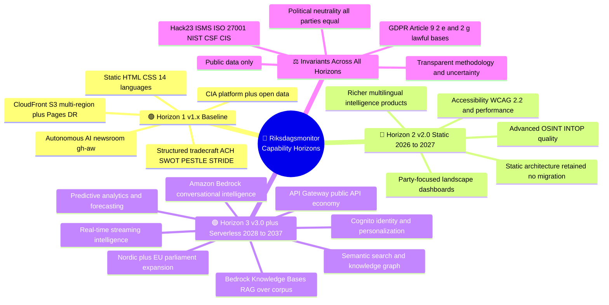

**Reading guide.** Horizon boundaries are capability gates, not hard dates — v2.0 features may ship continuously through 2026–2027 while v3.0 foundations (Bedrock evaluation, Knowledge-Base prototyping) begin in parallel. The four **invariants** are non-negotiable constraints that survive every architectural change.

---

## 2. 🟢 Horizon 1 — v1.x Baseline Capabilities

This is the *accurate current state* the future is built upon. It is intentionally detailed so the deltas in Horizons 2 and 3 are unambiguous. Cross-reference [MINDMAP.md](MINDMAP.md) §1–§5 for the matching current-state surface.

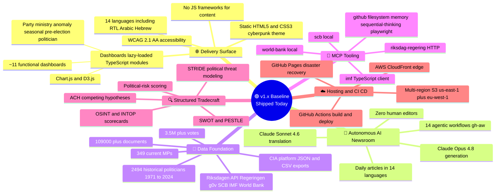

**Baseline takeaway.** v1.x already proves the hard parts: autonomous multilingual generation, public-data discipline, and structured analytic tradecraft. Horizon 2 raises *analytic depth and party focus*; Horizon 3 changes the *delivery substrate* from pre-rendered artifacts to managed serverless + AI services.

---

## 3. 🔵 Horizon 2 — v2.0 Static Deepening (2026–2027)

**Strategic choice: keep the static architecture, go deeper.** No migration in this horizon — every output remains a pre-rendered, CDN-served static artifact. Investment concentrates on party-focused analytics, OSINT/INTOP quality, multilingual richness, accessibility and performance.

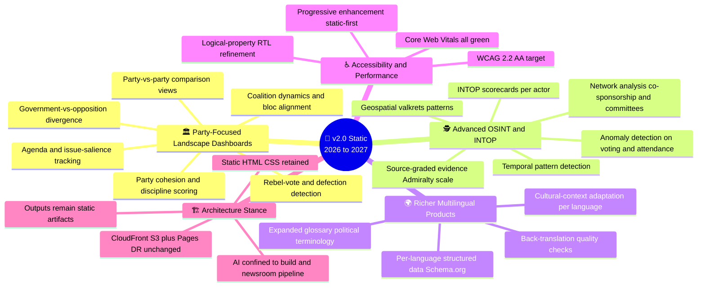

**v2.0 vs v3.0 distinction.** In v2.0 the AI is a *build-time* author — it deepens analysis but the citizen still consumes a static page. In v3.0 the AI becomes a *run-time* interlocutor: citizens query a conversational assistant backed by Bedrock and Knowledge Bases, and developers consume a live API. v2.0 lowers analytical risk and cost while compounding domain depth that v3.0 later exposes interactively.

---

## 4. 🏗️ Horizon 3 — v3.0+ AWS Serverless (2028–2037)

**Strategic choice: all-in AWS serverless.** Full migration to managed compute and managed AI — **no Kubernetes, no containers to operate**. AWS Well-Architected aligned, multi-region resilient. The static corpus becomes a queryable, conversational, programmable intelligence platform.

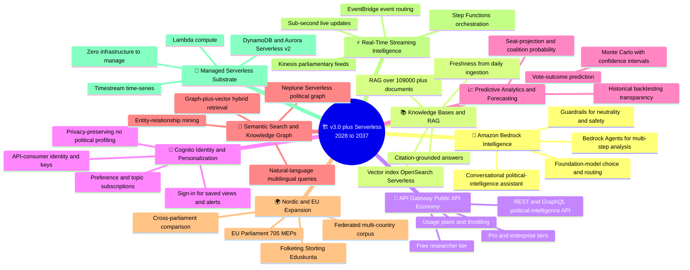

**Horizon-3 grounding.** Each branch names the concrete AWS service that realises it — Bedrock (assistant + agents + guardrails), OpenSearch Serverless (vectors), Neptune Serverless (graph), API Gateway (API economy), Cognito (identity), Kinesis/EventBridge/Step Functions (streaming), DynamoDB/Aurora Serverless v2/Timestream (state). Migration is incremental: read-paths move to serverless behind CloudFront before any write-path, preserving the v1.x DR posture during cutover.

---

## 5. 📡 Theme — Data & Sources

How the data surface widens across horizons: from Swedish open data + CIA exports (v1.x), to richer party-graded evidence (v2.0), to a federated Nordic/EU corpus with streaming ingestion (v3.0).

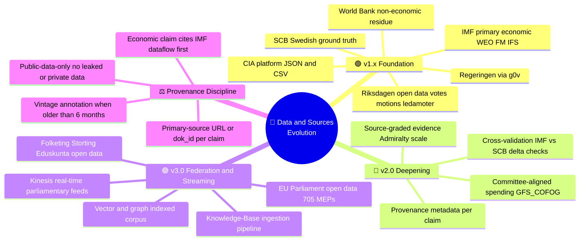

**Source canon.** The economic-data contract (`ECONOMIC_DATA_CONTRACT.md` v2.1) survives every horizon: IMF is primary for economics, World Bank is reserved for governance/environment/social residue, SCB is Swedish ground truth, and Riksdag open data is parliamentary primary. v3.0 adds federated Nordic/EU sources without weakening provenance rules.

---

## 6. 🕵️ Theme — OSINT / INTOP Tradecraft

Tradecraft maturity is the spine of the product. v1.x applies structured techniques in the newsroom; v2.0 productises them into dashboards and scorecards; v3.0 makes them conversational and predictive.

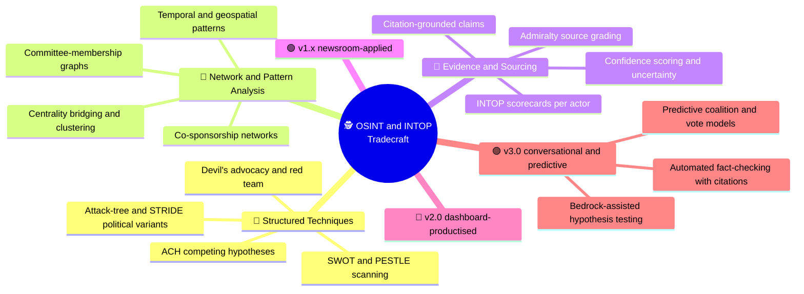

**Ethics rail.** Tradecraft is applied to **public political behaviour only** — votes, speeches, documents, declared affiliations. No surveillance, no private-life profiling, no psyops framing. The platform exposes accountability evidence; it never weaponises it.

---

## 7. 🏛️ Theme — Party & Coalition Analytics

The headline v2.0 investment. Party-focused analytics turn raw votes into landscape understanding: cohesion, bloc alignment, coalition viability and agenda movement.

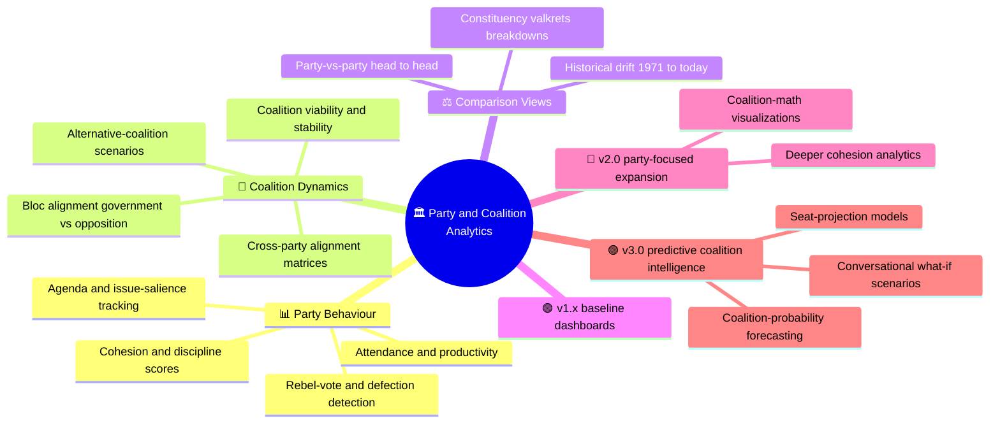

**Neutrality guarantee.** Party analytics treat all eight Riksdag parties identically — same metrics, same methodology, same uncertainty disclosure. Comparison views are symmetric and never editorialise a "winner".

---

## 8. 🤖 Theme — AI / Bedrock Capabilities

AI moves from build-time author (v1.x/v2.0) to run-time intelligence (v3.0). Amazon Bedrock anchors the v3.0 conversational and RAG capabilities.

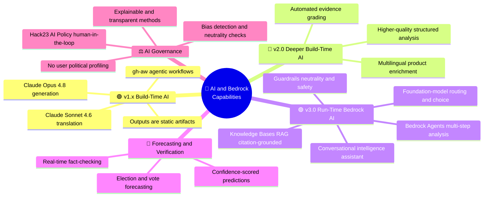

**Bedrock rationale.** Managed foundation models with built-in Guardrails let Riksdagsmonitor add conversational and predictive intelligence without operating model infrastructure — consistent with the zero-infrastructure serverless strategy and the AI Policy's human-in-the-loop and transparency requirements.

---

## 9. 🏗️ Theme — Platform / AWS Serverless

The substrate change defining Horizon 3. Each capability maps to a named, managed AWS service; nothing requires servers, clusters or containers to operate.

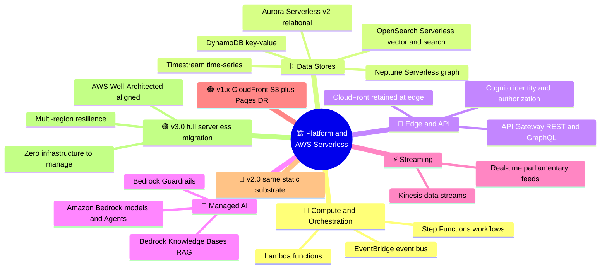

**Migration discipline.** The v1.x static site and GitHub Pages DR remain the resilience floor during cutover. Read paths migrate first behind CloudFront; identity, write paths and streaming follow once Cognito and observability are proven.

---

## 10. 🌍 Theme — Multilingual & Accessibility

A first-class, cross-horizon concern. v1.x ships 14 languages and WCAG 2.1 AA; v2.0 deepens quality and targets WCAG 2.2; v3.0 makes multilingual *interactive* via conversational and semantic search.

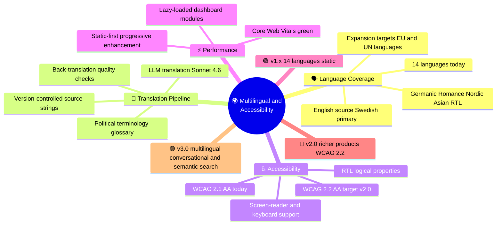

**Accessibility as ethics.** Multilingual + accessible delivery is part of the democratic mission — intelligence that citizens cannot read or perceive does not strengthen accountability. This theme is never deprioritised by the serverless migration.

---

## 11. ⚖️ Theme — Governance / Ethics / GDPR

The guardrail theme. These controls are invariant across all three horizons and gate every new capability.

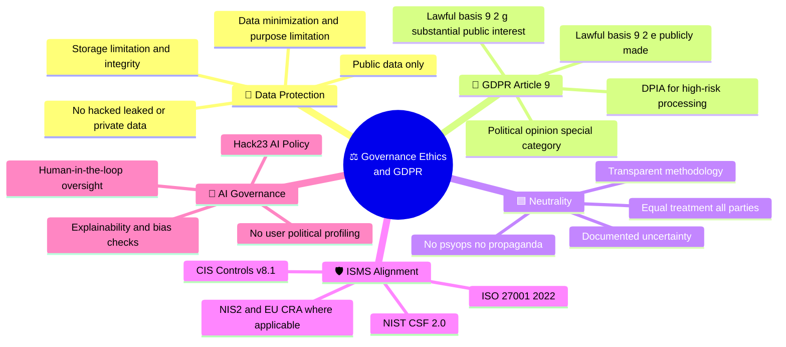

**Cross-link.** This theme operationalises the [Future Security Architecture](FUTURE_SECURITY_ARCHITECTURE.md) and [Threat Model](THREAT_MODEL.md), and inherits the Hack23 ISMS policies linked in the footer. v3.0 personalization (Cognito) is explicitly constrained: identity enables saved views and alerts, never political-profile inference.

---

## 12. 🌐 Theme — Ecosystem & Expansion

How Riksdagsmonitor grows outward — into Nordic and EU parliaments, a public API economy, and the wider Hack23 ecosystem.

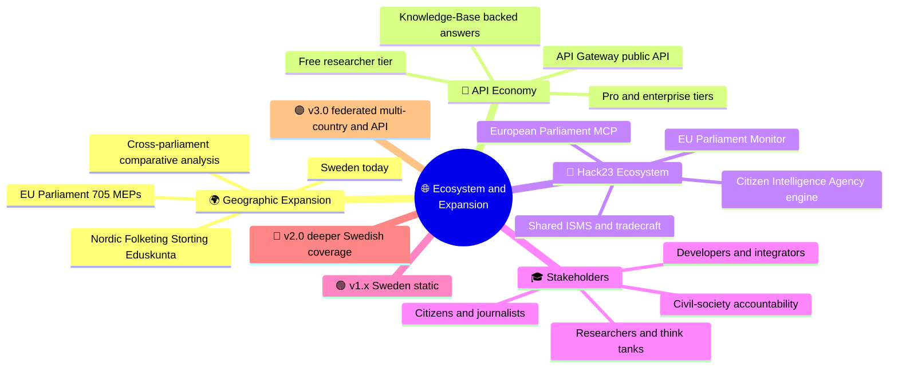

**Expansion principle.** Geographic and API expansion reuse the same tradecraft, neutrality and provenance rules. The European Parliament MCP and EU Parliament Monitor are existing Hack23 assets that de-risk the v3.0 cross-parliament leap.

---

## 13. 🤖 AI / LLM Capability-Evolution (2026–2037)

Major AI model upgrades are assumed **annually**, with competitor releases (OpenAI, Google, Meta, EU sovereign AI) evaluated at each cycle, and the architecture explicitly designed to accommodate paradigm shifts (quantum AI, neuromorphic computing). All adoption is governed by the [Hack23 AI Policy](https://github.com/Hack23/ISMS-PUBLIC/blob/main/AI_Policy.md) with human-in-the-loop oversight.

### 13.1 AI Model Evolution Table (DevSecOps & development perspective)

| Year | AI Model | DevSecOps Capability Evolution |
|------|----------|--------------------------------|
| 2026 | Opus 4.6–4.9 | 🟢 AI-assisted code review, automated test generation, agentic CI/CD workflows |
| 2027 | Opus 5.x | 🔵 Predictive vulnerability detection, intelligent dependency management |
| 2028 | Opus 6.x | 🟣 Multi-modal security analysis (code + architecture + runtime), automated threat modeling |
| 2029 | Opus 7.x | 🟠 Autonomous security pipeline orchestration, self-healing build systems |
| 2030 | Opus 8.x | 🔴 Near-expert automated security review, AI-driven architecture validation |
| 2031–2033 | Opus 9–10.x / Pre-AGI | ⚪ Autonomous secure development lifecycle management |
| 2034–2037 | AGI / Post-AGI | ⭐ Transformative software engineering with built-in security assurance |

### 13.2 Translating the AI Curve into Product & Intelligence Unlocks

The same model generations unlock product, data and tradecraft capability — not only DevSecOps. The mindmap below maps each AI generation to the **intelligence** it enables.

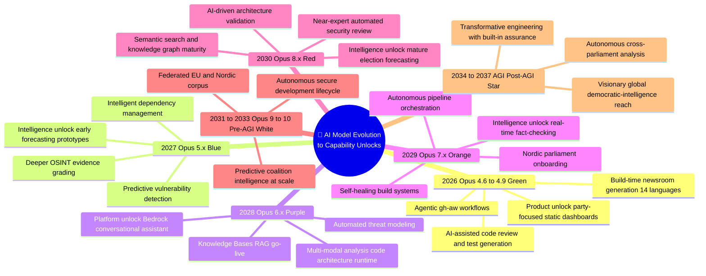

### 13.3 Capability-Unlock Crosswalk

```mermaid
graph LR
    A[2026 Opus 4.6-4.9<br/>Build-time author]:::g --> B[2027 Opus 5.x<br/>Predictive prototypes]:::b
    B --> C[2028 Opus 6.x<br/>Bedrock run-time AI]:::p
    C --> D[2029 Opus 7.x<br/>Autonomous orchestration]:::o
    D --> E[2030 Opus 8.x<br/>Near-expert review]:::r
    E --> F[2031-2033 Pre-AGI<br/>Autonomous SDLC]:::w
    F --> G[2034-2037 AGI<br/>Transformative assurance]:::s
    classDef g fill:#4caf50,stroke:#2e7d32,color:#000000;
    classDef b fill:#42a5f5,stroke:#1565c0,color:#000000;
    classDef p fill:#ab47bc,stroke:#6a1b9a,color:#000000;
    classDef o fill:#ffa726,stroke:#e65100,color:#000000;
    classDef r fill:#ef5350,stroke:#b71c1c,color:#000000;
    classDef w fill:#eceff1,stroke:#546e7a,color:#000000;
    classDef s fill:#ffd54f,stroke:#f57f17,color:#000000;
```

**Governance note.** Each annual model adoption is a [Change Management](https://github.com/Hack23/ISMS-PUBLIC/blob/main/Change_Management.md) event: competitor benchmarking, neutrality/bias evaluation, and human-in-the-loop sign-off precede production use. Paradigm-shift contingencies (quantum/neuromorphic) are tracked as architecture-accommodation requirements, not committed deliverables.

---

## 🦾 Theme — Agentic AI &amp; Autonomous Multi-Agent Operations (what future AI agents unlock)

The single biggest *visionary* lever after v2.0+ is not a bigger model — it is **agency**: many specialised, governed AI agents that plan, use tools (MCP), verify each other, and run the platform under human-in-the-loop oversight rather than under a single person's manual workload. This theme answers the question *"what is really possible with future AI agents?"* and is the direct mitigation for the single-developer bus factor (SWOT **W1**) and manual content load (**W5**), while amplifying AI-enhanced analytics (**O7**). Today's 14 `gh-aw` build-time workflows are the *seed*; the maps below show the autonomous, multi-agent organisation they grow into.

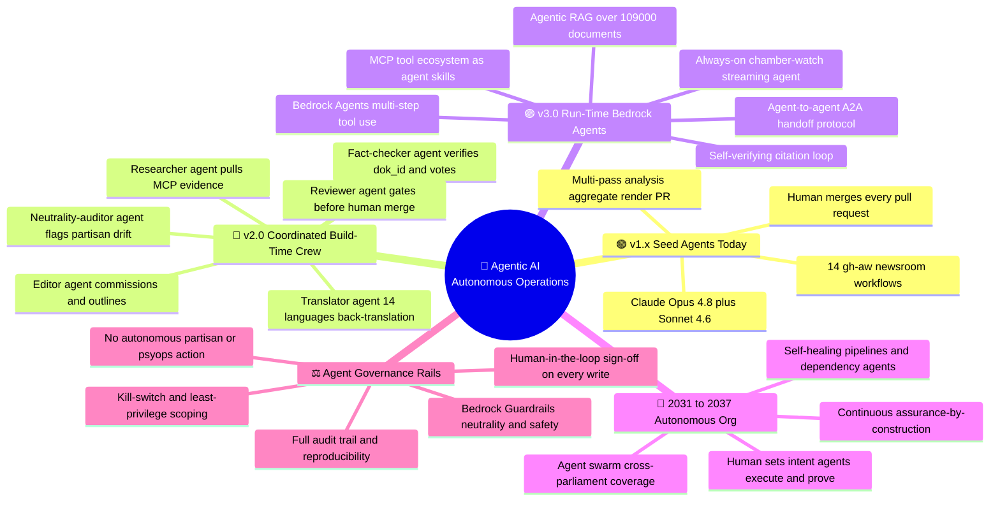

**The multi-agent newsroom (v2.0 → v3.0).** The leap is from *one generalist workflow* to a **division of labour** of cooperating specialist agents, each with a narrow remit and an explicit verification duty toward the others. A *neutrality-auditor* agent and a *fact-checker* agent are first-class members — not afterthoughts — so quality and impartiality are enforced structurally, not by hope.

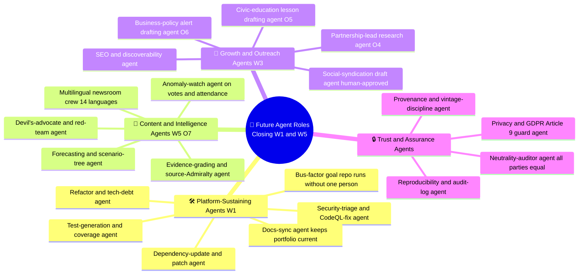

**Why this is realistic, not hype.** Every agent above is a *governed automation of work the project already does by hand* — dependency bumps, translation, evidence grading, SEO, partnership outreach. Future model generations (see [§13](#13--ai--llm-capability-evolution-20262037)) raise reliability and tool-use depth; the [Hack23 AI Policy](https://github.com/Hack23/ISMS-PUBLIC/blob/main/AI_Policy.md) keeps a human accountable for every externally-visible action. Outreach and social agents **draft**; a human **publishes**. No agent ever takes a partisan action, profiles a citizen, or publishes unverified claims — the four invariants bind agents exactly as they bind humans.

---

## 🌱 Theme — Sustainability, Growth &amp; Audience Expansion

A future map that only deepens analytics but ignores *sustainability and reach* leaves SWOT **W2** (no revenue), **W3** (limited marketing), **O4** (research partnerships), **O5** (civic-education market) and **O6** (business intelligence) unaddressed. This theme gives each a concrete home, sequenced low-risk-first: audience and credibility on the static substrate (v2.0), monetisation and segment products on the serverless substrate (v3.0).

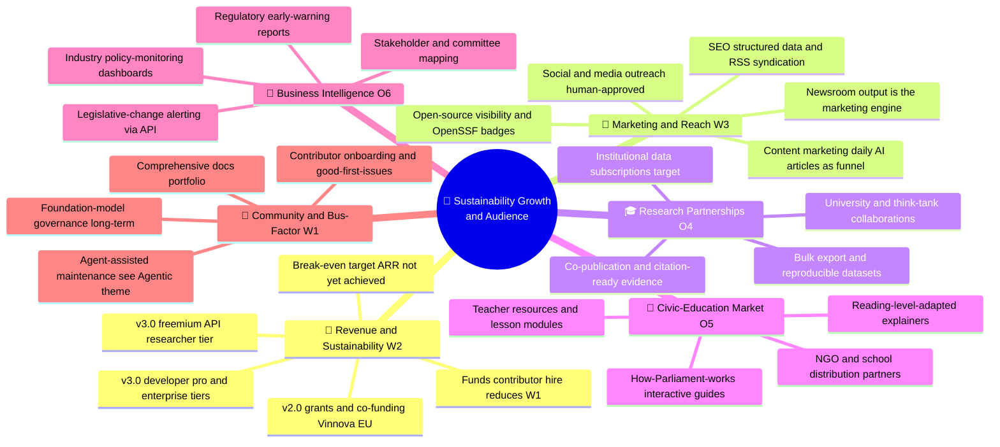

**Sequencing logic.** Audience, credibility and grant funding are built on the **low-cost static** substrate in v2.0 — the autonomous newsroom *is* the marketing flywheel (every cited, neutral, multilingual article is discoverable SEO surface and a reason to cite the platform). Paid segment products (research, civic-education, business-intelligence) land in v3.0 once the [API economy](#12--theme--ecosystem--expansion), Cognito identity and metering exist. Crucially, **monetisation never gates citizen access**: the public static tier and 14-language newsroom stay free forever; paid tiers sell *scale, automation and bespoke segments*, not democratic transparency itself.

**Neutrality &amp; ethics rail.** Growth must not compromise impartiality. Business-intelligence and outreach products use the *same* symmetric, source-cited methodology as the public site; the platform sells *access and tooling*, never favourable framing. No client — commercial, academic or political — can purchase editorial influence, and no audience-growth tactic may rely on partisan targeting.

---

## ✅ SWOT → Future Coverage Crosswalk

> **Final-review traceability.** This table closes the loop on the originating request — *"Is every opportunity, weakness and improvement area in SWOT.md addressed in the future architectures &amp; mindmaps?"* Every one of the 27 [SWOT.md](SWOT.md) items maps to a concrete future home (this mindmap, [FUTURE_SWOT.md](FUTURE_SWOT.md), [FUTURE_ARCHITECTURE.md](FUTURE_ARCHITECTURE.md)) and the horizon that delivers it. All targets remain **targets**, never claimed as achieved.

| SWOT item | Future home (this doc / portfolio) | Horizon |
|-----------|-------------------------------------|---------|
| **S1** 50+ yr data | [§5 Data &amp; Sources](#5--theme--data--sources), [§16 IMF surface](#-evolving-the-current-imf-mindmap-toward-the-future-data-sources-surface) | leveraged all |
| **S2** 14 languages | [§10 Multilingual &amp; Accessibility](#10--theme--multilingual--accessibility) | leveraged all |
| **S3** CIA integration | [§5 Data](#5--theme--data--sources), [§12 Ecosystem](#12--theme--ecosystem--expansion) | leveraged all |
| **S4** Static architecture | [§3 v2.0](#3--horizon-2--v20-static-deepening-20262027), [§9 Platform](#9-️-theme--platform--aws-serverless) | v1.x→v3.0 |
| **S5** Transparent ISMS | [§11 Governance](#11-️-theme--governance--ethics--gdpr) | leveraged all |
| **S6** riksdag-regering-mcp | [§5 Data](#5--theme--data--sources), [§8 AI](#8--theme--ai--bedrock-capabilities) | leveraged all |
| **S7** Agent ecosystem | [§14 Agentic AI](#-theme--agentic-ai--autonomous-multi-agent-operations-what-future-ai-agents-unlock) | v2.0→vision |
| **S8** Visualizations | [§3 v2.0](#3--horizon-2--v20-static-deepening-20262027), [§7 Party Analytics](#7-️-theme--party--coalition-analytics) | v2.0→v3.0 |
| **S9** Tradecraft methodology | [§6 OSINT/INTOP](#6-️-theme--osint--intop-tradecraft) | leveraged all |
| **S10** Economic data fusion | [§5 Data](#5--theme--data--sources), [§16 IMF surface](#-evolving-the-current-imf-mindmap-toward-the-future-data-sources-surface) | leveraged all |
| **W1** Single-developer | [§14 Agentic AI](#-theme--agentic-ai--autonomous-multi-agent-operations-what-future-ai-agents-unlock) (platform-sustaining agents), [§15 community](#-theme--sustainability-growth--audience-expansion) | v2.0→vision |
| **W2** No revenue | [§15 Revenue](#-theme--sustainability-growth--audience-expansion), [§12 API economy](#12--theme--ecosystem--expansion) | v2.0→v3.0 |
| **W3** Limited marketing | [§15 Marketing &amp; Reach](#-theme--sustainability-growth--audience-expansion) | v2.0 |
| **W4** Static limitations | [§4 v3.0 Serverless](#4-️-horizon-3--v30-aws-serverless-20282037), [§9 Platform](#9-️-theme--platform--aws-serverless) | v3.0 |
| **W5** Manual content | [§14 Agentic AI](#-theme--agentic-ai--autonomous-multi-agent-operations-what-future-ai-agents-unlock) (content crew) | v2.0→v3.0 |
| **O1** Nordic expansion | [§12 Ecosystem](#12--theme--ecosystem--expansion), [§4 v3.0](#4-️-horizon-3--v30-aws-serverless-20282037) | v3.0 |
| **O2** EU Parliament | [§12 Ecosystem](#12--theme--ecosystem--expansion), [§4 v3.0](#4-️-horizon-3--v30-aws-serverless-20282037) | v3.0 |
| **O3** API monetization | [§12 API economy](#12--theme--ecosystem--expansion), [§15 Revenue](#-theme--sustainability-growth--audience-expansion) | v3.0 |
| **O4** Research partnerships | [§15 Research Partnerships](#-theme--sustainability-growth--audience-expansion) | v2.0→v3.0 |
| **O5** Civic-education market | [§15 Civic-Education](#-theme--sustainability-growth--audience-expansion) | v2.0→v3.0 |
| **O6** Business intelligence | [§15 Business Intelligence](#-theme--sustainability-growth--audience-expansion) | v3.0 |
| **O7** AI predictive analytics | [§8 AI/Bedrock](#8--theme--ai--bedrock-capabilities), [§14 Agentic AI](#-theme--agentic-ai--autonomous-multi-agent-operations-what-future-ai-agents-unlock) | v3.0→vision |
| **T1** Competing platforms | [§7 Party Analytics](#7-️-theme--party--coalition-analytics), [§15 differentiation](#-theme--sustainability-growth--audience-expansion) | all |
| **T2** EU CRA burden | [§11 Governance](#11-️-theme--governance--ethics--gdpr) (ISMS mapping) | all |
| **T3** Riksdag API changes | [§5 Data](#5--theme--data--sources) (provenance &amp; fallback) | all |
| **T4** Market consolidation | [§15 niche focus](#-theme--sustainability-growth--audience-expansion), [§11 Governance](#11-️-theme--governance--ethics--gdpr) | all |
| **T5** Budget sustainability | [§15 Revenue &amp; community](#-theme--sustainability-growth--audience-expansion), [⚠️ Roadmap Risk](#️-roadmap-risk--uncertainty) | all |

**Coverage verdict.** All 10 strengths are explicitly leveraged, all 5 weaknesses have a named mitigation horizon, all 7 opportunities have a delivery theme, and all 5 threats have a mitigating stance — with the previously-thin items (**W1, W3, O4, O5, O6**) now given first-class mindmap treatment in §14–§15. The deeper strategic numbers (pricing, ARR targets, stakeholder power–interest, competitive landscape) live in [FUTURE_SWOT.md](FUTURE_SWOT.md); the architectural realisation lives in [FUTURE_ARCHITECTURE.md](FUTURE_ARCHITECTURE.md).

---

## 🎯 Stakeholder Value by Horizon

Capability only matters if it reaches stakeholders. This map shows what each audience gains as the platform crosses horizons — keeping the democratic-accountability mission central.

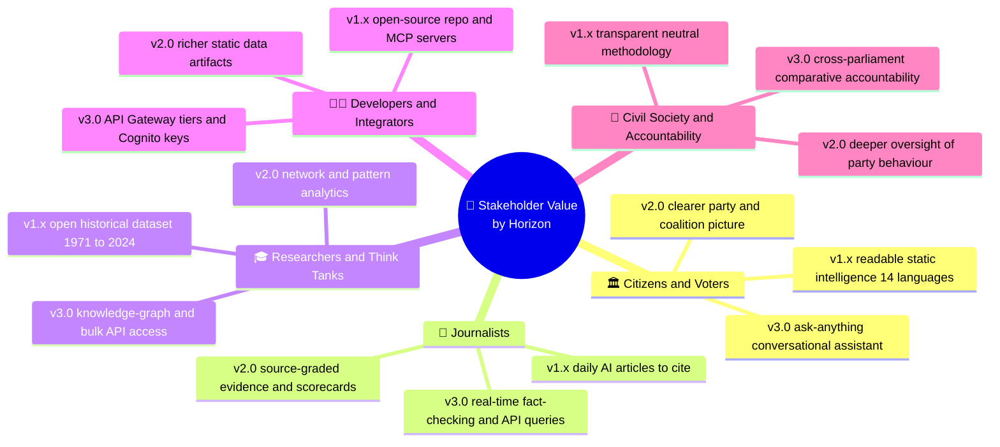

## ⚠️ Roadmap Risk & Uncertainty

A future map must surface its own risks. These are the dominant uncertainties on the path to v3.0, each paired with a mitigating stance already embedded in the roadmap.

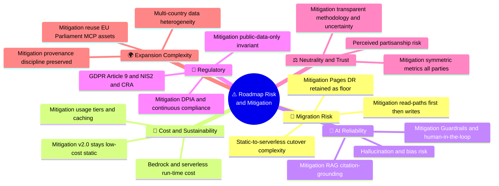

### ISMS Control Mapping (roadmap → controls)

| Roadmap element | ISO 27001:2022 | NIST CSF 2.0 | CIS v8.1 | Guardrail |
|-----------------|----------------|--------------|----------|-----------|
| Serverless migration (v3.0) | A.8.25 Secure development | PR.PS | CIS 16 | Read-path-first cutover, Pages DR floor |
| Bedrock / RAG assistant | A.5.23 Cloud services | GV.SC / ID.RA | CIS 15 | Guardrails + human-in-the-loop (AI Policy) |
| Cognito personalization | A.5.15 Access control | PR.AA | CIS 5, 6 | No political profiling, least privilege |
| API Gateway economy | A.8.26 App security req. | PR.PS / DE.CM | CIS 16 | Usage plans, throttling, key scoping |
| Streaming ingestion | A.8.16 Monitoring | DE.CM / DE.AE | CIS 8 | Provenance + vintage discipline |
| Cross-parliament data | A.5.34 Privacy & PII | GV.OC | CIS 3 | Public-data-only, GDPR Art. 9 bases |

**Risk posture.** The roadmap is deliberately *staged* so analytical value (v2.0) lands on the low-risk static substrate before the higher-risk serverless leap (v3.0). Every new capability inherits the same four invariants, and security/privacy controls are mapped continuously per the [Future Security Architecture](FUTURE_SECURITY_ARCHITECTURE.md) and [Threat Model](THREAT_MODEL.md).

---

## 📋 Capability Matrix (horizon-aligned)

Future values are **targets**, not current achievements. Current-state values mirror [MINDMAP.md](MINDMAP.md) and [ARCHITECTURE.md](ARCHITECTURE.md).

| Capability | 🟢 v1.x Current | 🔵 v2.0 Target 2026–2027 | 🟣 v3.0 Target 2028–2030 | 🌟 2031–2037 Vision |
|------------|-----------------|--------------------------|--------------------------|---------------------|
| **Architecture** | Static HTML/CSS + CDN | Static, deepened | AWS serverless migration | Fully serverless multi-region |
| **Delivery** | Pre-rendered pages | Pre-rendered, richer | Conversational + API + pages | Real-time streaming intelligence |
| **AI Role** | Build-time author | Deeper build-time author | Run-time Bedrock assistant | Autonomous, assurance-built-in |
| **Agent Autonomy** | 14 single-pass workflows | Coordinated build-time crew | Run-time Bedrock multi-agent | Self-healing autonomous org |
| **AI Models** | Opus 4.8 generation | Opus 5.x | Opus 6.x–8.x | Pre-AGI → AGI |
| **Party Analytics** | Baseline dashboards | Party-focused expansion | Predictive coalition models | Cross-parliament predictive |
| **Search** | Keyword/static | Faceted + graded | Semantic + knowledge graph | Conversational omnisearch |
| **Languages** | 14 | 14, richer quality | 14 + EU expansion | EU + UN languages target |
| **Parliaments** | 1 (Sweden) | 1 (deeper) | + Nordic + EU | Federated multi-country |
| **Data Latency** | Daily batch | Daily, validated | Near-real-time | Sub-second streaming |
| **API** | None | None (static) | API Gateway public API | API economy with tiers |
| **Identity** | None | None | Cognito personalization | Identity-aware federation |
| **Revenue** | None (volunteer) | Grants / co-funding | Freemium + tiered API | Sustainable API economy |
| **Audience / Reach** | Organic + newsroom | SEO + partnerships + civic-ed | Segment products (research/BI) | Cross-parliament reach |
| **Compliance** | ISO/NIST/CIS aligned | + WCAG 2.2 target | + NIS2 / CRA attestation | Continuous compliance |
| **Ethics Rails** | Public-data, neutral | Unchanged invariant | Unchanged invariant | Unchanged invariant |

---

## 🌐 Evolving the Current IMF Mindmap toward the Future Data-Sources Surface

*Baseline: the **already-implemented** IMF subtree is documented in [`MINDMAP.md`](MINDMAP.md) §IMF. The mindmap below extends that baseline with future capabilities (commercial-provider redundancy, websocket feeds, cross-validation worker) without removing today's pure-TS client foundation.*

> **Authoritative hub:** [`analysis/imf/README.md`](analysis/imf/README.md) · [`analysis/imf/agentic-integration.md`](analysis/imf/agentic-integration.md) · [`analysis/imf/indicators-inventory.json`](analysis/imf/indicators-inventory.json) · [`analysis/imf/data-dictionary.md`](analysis/imf/data-dictionary.md) · [`.github/aw/ECONOMIC_DATA_CONTRACT.md`](.github/aw/ECONOMIC_DATA_CONTRACT.md)

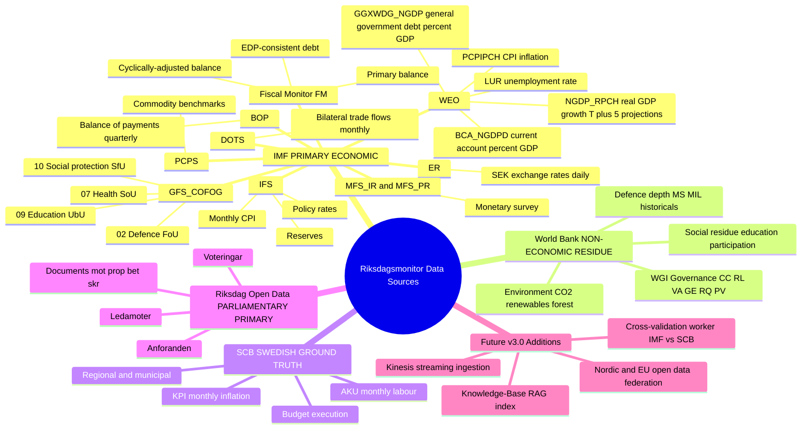

**Canonical rule.** Every economic claim in a Riksdagsmonitor article cites an IMF dataflow first; World Bank citations are reserved for governance, environment and social residue (the classes IMF does not publish). SCB is the Swedish-specific ground truth layer. See `ECONOMIC_DATA_CONTRACT.md` v2.1 for the banned-phrase list and vintage discipline (>6 mo → annotation). v3.0 federation and streaming extend, but never relax, this provenance discipline.

---

## 📚 Related Documents

### Riksdagsmonitor Architecture Portfolio

| Document | Focus | Description |
|----------|-------|-------------|
| [🏛️ Architecture](ARCHITECTURE.md) | 🏗️ C4 Models | System context, containers, components |
| [📊 Data Model](DATA_MODEL.md) | 📊 Data | Entity relationships and data dictionary |
| [🔄 Flowchart](FLOWCHART.md) | 🔄 Processes | Business and data flow diagrams |
| [📈 State Diagram](STATEDIAGRAM.md) | 📈 States | System state transitions and lifecycles |
| [🧠 Mindmap](MINDMAP.md) | 🧠 Concepts | Current system conceptual relationships |
| **[🧠 Future Mindmap](FUTURE_MINDMAP.md)** | **🔮 Concepts** | **Capability expansion plans (this document)** |
| [💼 SWOT](SWOT.md) | 💼 Strategy | Strategic analysis and positioning |
| [💼 Future SWOT](FUTURE_SWOT.md) | 🔮 Strategy | Future strategic opportunities |
| [🛡️ Security Architecture](SECURITY_ARCHITECTURE.md) | 🔒 Security | Current security controls and design |
| [🚀 Future Security](FUTURE_SECURITY_ARCHITECTURE.md) | 🔮 Security | Planned security improvements |
| [🎯 Threat Model](THREAT_MODEL.md) | 🎯 Threats | STRIDE/MITRE ATT&CK analysis |
| [🚀 Future Architecture](FUTURE_ARCHITECTURE.md) | 🔮 Evolution | Architectural evolution roadmap |
| [📊 Future Data Model](FUTURE_DATA_MODEL.md) | 🔮 Data | Enhanced data architecture plans |
| [🔄 Future Flowchart](FUTURE_FLOWCHART.md) | 🔮 Processes | Improved process workflows |
| [📈 Future State Diagram](FUTURE_STATEDIAGRAM.md) | 🔮 States | Advanced state management |

### Hack23 ISMS Policies

- [🛡️ Information Security Policy](https://github.com/Hack23/ISMS-PUBLIC/blob/main/Information_Security_Policy.md) — Top-level governance
- [🧪 Secure Development Policy](https://github.com/Hack23/ISMS-PUBLIC/blob/main/Secure_Development_Policy.md) — Architecture documentation requirements
- [🤖 AI Policy](https://github.com/Hack23/ISMS-PUBLIC/blob/main/AI_Policy.md) — AI usage and human-in-the-loop governance
- [🔄 Change Management](https://github.com/Hack23/ISMS-PUBLIC/blob/main/Change_Management.md) — Model-adoption and migration change control
- [🏷️ Classification Framework](https://github.com/Hack23/ISMS-PUBLIC/blob/main/CLASSIFICATION.md) — CIA triad classification

---

**📋 Document Control:**  
**✅ Approved by:** James Pether Sörling, CEO  
**📤 Distribution:** Public  
**🏷️ Classification:**   
**📅 Effective Date:** 2026-05-31  
**⏰ Next Review:** 2026-08-31  
**🎯 Framework Compliance:**   

---

## 🔗 Hack23 Ecosystem

<table>
<tr>
  <th width="33%">🌐 Platforms</th>
  <th width="33%">📦 Open-Source Projects</th>
  <th width="33%">🛡️ Governance &amp; Standards</th>
</tr>
<tr>
<td valign="top">
🗳️ <a href="https://riksdagsmonitor.com">Riksdagsmonitor</a> — Swedish Parliament intelligence 
🇪🇺 <a href="https://www.euparliamentmonitor.com">EU Parliament Monitor</a> — European coverage 
🕵️ <a href="https://www.hack23.com/cia">Citizen Intelligence Agency</a> — political-data engine 
🌐 <a href="https://www.hack23.com">Hack23 AB</a> — corporate site 
📰 <a href="https://hack23.com/blog.html">Hack23 Blog</a> — engineering &amp; policy 
💼 <a href="https://www.linkedin.com/company/hack23/">Hack23 on LinkedIn</a>
</td>
<td valign="top">
🗳️ <a href="https://github.com/Hack23/riksdagsmonitor">Hack23/riksdagsmonitor</a> 
🕵️ <a href="https://github.com/Hack23/cia">Hack23/cia</a> 
🇪🇺 <a href="https://github.com/Hack23/euparliamentmonitor">Hack23/euparliamentmonitor</a> 
🔌 <a href="https://github.com/Hack23/european-parliament-mcp">Hack23/european-parliament-mcp</a> 
✅ <a href="https://github.com/Hack23/cia-compliance-manager">Hack23/cia-compliance-manager</a> 
🥋 <a href="https://github.com/Hack23/black-trigram">Hack23/black-trigram</a> 
🏠 <a href="https://github.com/Hack23/homepage">Hack23/homepage</a>
</td>
<td valign="top">
🛡️ <a href="https://github.com/Hack23/ISMS-PUBLIC">Hack23 ISMS-PUBLIC</a> — public ISMS 
🔒 <a href="https://github.com/Hack23/ISMS-PUBLIC/blob/main/Information_Security_Policy.md">Information Security Policy</a> 
🤖 <a href="https://github.com/Hack23/ISMS-PUBLIC/blob/main/AI_Policy.md">AI Policy</a> 
🧪 <a href="https://github.com/Hack23/ISMS-PUBLIC/blob/main/Secure_Development_Policy.md">Secure Development Policy</a> 
🎯 <a href="https://github.com/Hack23/ISMS-PUBLIC/blob/main/Threat_Modeling.md">Threat Modeling Policy</a> 
⚠️ <a href="https://github.com/Hack23/ISMS-PUBLIC/blob/main/Vulnerability_Management.md">Vulnerability Management</a> 
🏷️ <a href="https://github.com/Hack23/ISMS-PUBLIC/blob/main/CLASSIFICATION.md">Classification Framework</a>
</td>
</tr>
</table>

<em>🗳️ Empower citizens · 🔍 Strengthen democratic accountability · 🕵️ Illuminate the political process</em>

© 2008–2026 <a href="https://www.hack23.com">Hack23 AB</a> (Org.nr 559534-7807) · Maintainer: <a href="https://www.linkedin.com/in/jamessorling/">James Pether Sörling, CISSP CISM</a>

