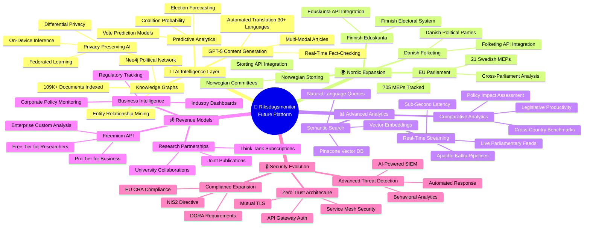
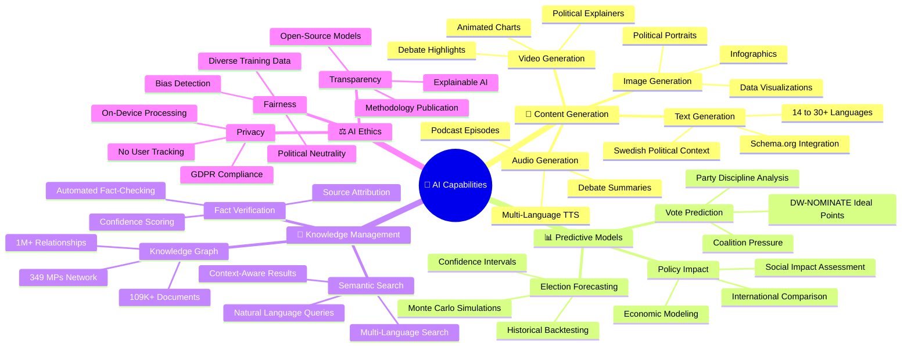
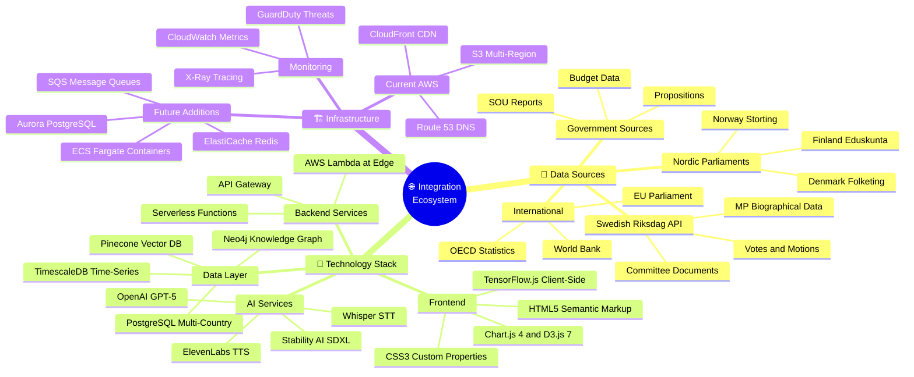
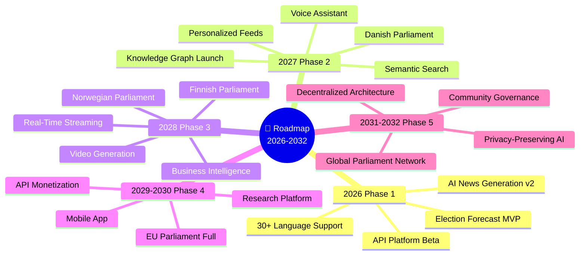

  

<h1 align="center">🚀 Riksdagsmonitor — Future Mindmap</h1>

  <strong>🗺️ Future Capability Map for Democratic Intelligence Evolution</strong> 
  <em>🎯 AI Analytics · Nordic Expansion · Real-Time Intelligence · API Platform</em>

  
  
  
  

**📋 Document Owner:** CEO | **📄 Version:** 1.0 | **📅 Last Updated:** 2026-02-20 (UTC)  
**🔄 Review Cycle:** Quarterly | **⏰ Next Review:** 2026-05-20  
**🏢 Owner:** Hack23 AB (Org.nr 5595347807) | **🏷️ Classification:** Public

---

## 🎯 Purpose

This document provides future-state conceptual mindmaps for Riksdagsmonitor, visualizing the planned evolution from a static Swedish Parliament monitoring website to a comprehensive AI-powered democratic intelligence platform. Building on the current [Mindmap](MINDMAP.md), these diagrams illustrate the 3-7 year roadmap (2026-2032).

## 📚 Related Architecture Documentation

| Document | Focus | Description |
|----------|-------|-------------|
| **[Mindmap](MINDMAP.md)** | 🗺️ Current | Current system conceptual map |
| **[Future Architecture](FUTURE_ARCHITECTURE.md)** | 🏗️ Future | System evolution roadmap |
| **[Future Flowcharts](FUTURE_FLOWCHART.md)** | 🔄 Future | Advanced process flows |
| **[Future SWOT](FUTURE_SWOT.md)** | 💼 Future | Strategic outlook |

---

## 1. 🏗️ Platform Evolution Mindmap (2026-2032)

---

## 2. 🤖 AI Capabilities Mindmap (2026-2028)

---

## 3. 🌐 Integration Ecosystem Mindmap

---

## 4. 📅 Timeline Mindmap

---

## 📋 Capability Matrix

| Capability | Current State | 2027 Target | 2030 Vision |
|------------|--------------|-------------|-------------|
| **Languages** | 14 | 30+ | 50+ |
| **Parliaments** | 1 (Sweden) | 3 (Nordic) | 10+ (Global) |
| **AI Models** | Basic generation | Predictive analytics | Multi-modal AI |
| **Search** | Keyword | Semantic | Knowledge graph |
| **Data Latency** | Daily batch | Hourly | Real-time |
| **Revenue** | None | API beta | Multi-stream |
| **Users** | Organic | 10K+ monthly | 100K+ monthly |

---

## 📚 Related Documents

### 🗺️ Current State
- [🗺️ Mindmap](MINDMAP.md) — Current system conceptual map
- [🏗️ Architecture](ARCHITECTURE.md) — Current C4 models
- [💼 SWOT](SWOT.md) — Current strategic analysis

### 🚀 Future State
- [🏗️ Future Architecture](FUTURE_ARCHITECTURE.md) — System evolution
- [🔄 Future Flowcharts](FUTURE_FLOWCHART.md) — Advanced process flows
- [📊 Future Data Model](FUTURE_DATA_MODEL.md) — Enhanced data architecture
- [🔄 Future State Diagrams](FUTURE_STATEDIAGRAM.md) — Advanced state transitions
- [💼 Future SWOT](FUTURE_SWOT.md) — Strategic outlook
- [🛡️ Future Security](FUTURE_SECURITY_ARCHITECTURE.md) — Security roadmap

### 🛡️ ISMS Policies
- [🛠️ Secure Development Policy](https://github.com/Hack23/ISMS-PUBLIC/blob/main/Secure_Development_Policy.md)
- [🤖 AI Policy](https://github.com/Hack23/ISMS-PUBLIC/blob/main/AI_Policy.md)
- [🔐 Information Security Policy](https://github.com/Hack23/ISMS-PUBLIC/blob/main/Information_Security_Policy.md)

---

**📋 Document Control:**  
**✅ Approved by:** James Pether Sörling, CEO  
**📤 Distribution:** Public  
**🏷️ Classification:**   
**📅 Effective Date:** 2026-02-20  
**⏰ Next Review:** 2026-05-20  
**🎯 Framework Compliance:**   
