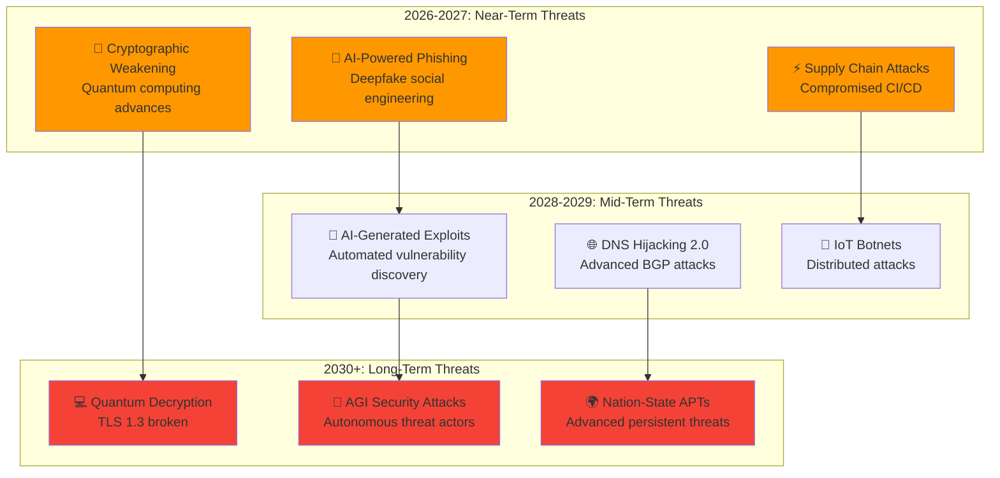
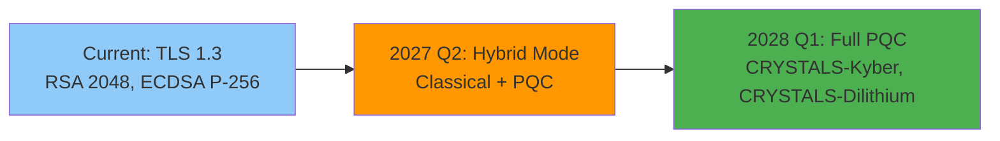
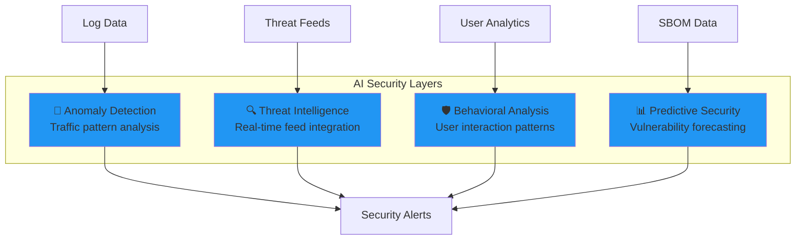
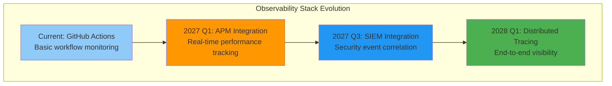
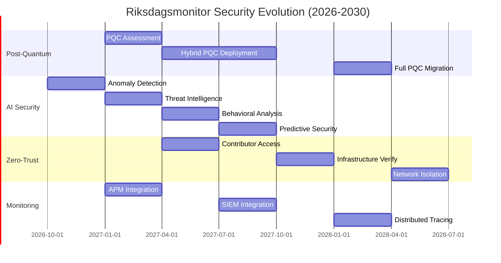

  

<h1 align="center">🚀 Riksdagsmonitor — Future Security Architecture</h1>

  <strong>🛡️ Evolution Roadmap: From Static Website to Advanced Intelligence Platform</strong> 
  <em>🎯 Post-Quantum Ready · AI-Augmented Security · Zero-Trust Architecture</em>

---

**Classification:** Public  
**Owner:** Hack23 AB (Org.nr 5595347807)

---

## 🎯 Executive Summary

This document outlines the future security architecture for Riksdagsmonitor over the next 3-5 years. The roadmap focuses on **proactive security evolution** rather than reactive patches, ensuring the platform remains secure against emerging threats including post-quantum cryptography, AI-powered attacks, and advanced persistent threats.

**Strategic Goals:**
- 🔐 **Post-Quantum Readiness** - Cryptographic agility before quantum computers threaten current algorithms
- 🤖 **AI-Augmented Security** - Machine learning for threat detection and anomaly analysis
- 🛡️ **Zero-Trust Architecture** - Never trust, always verify, assume breach mentality
- 📊 **Privacy-Preserving Analytics** - Intelligence without surveillance
- 🌐 **Multi-Region Resilience** - Distributed architecture for high availability (AWS + GitHub Pages)

---

## 📋 Table of Contents

1. [Current State Baseline](#1-current-state-baseline)
2. [Threat Landscape Evolution](#2-threat-landscape-evolution)
3. [Future Security Domains](#3-future-security-domains)
4. [Implementation Roadmap](#4-implementation-roadmap)
5. [Technology Evolution](#5-technology-evolution)
6. [Compliance Evolution](#6-compliance-evolution)
7. [Risk Management](#7-risk-management)
8. [Success Metrics](#8-success-metrics)

---

## 1. 🔮 Baseline for Future Evolution

> **Note:** For current security architecture, see [SECURITY_ARCHITECTURE.md](SECURITY_ARCHITECTURE.md)

### Security Enhancement Opportunities

**Areas for Future Investment:**
- ⚡ **Post-Quantum Cryptography** - Prepare for quantum computing threats (2027-2028)
- 🤖 **AI-Augmented Security** - Advanced threat detection and anomaly analysis (2026-2027)
- 🛡️ **Web Application Firewall** - Enhanced protection layer (2027)
- 🔐 **Customer-Managed Encryption** - Greater control over encryption keys (2027)
- 📊 **Real-Time Threat Intelligence** - Integration with global threat feeds (2027)
- 🌐 **Third-Region Expansion** - Asia-Pacific coverage (2028)
- 🔬 **Advanced Monitoring** - CloudWatch RUM, Lighthouse CI, behavioral analytics (2026-2027)

## 2. ⚠️ Threat Landscape Evolution

### 2.1 Emerging Threats (2026-2030)

### 2.2 Regulatory Evolution

| Framework | Current (2026) | Future (2028-2030) | Impact on Riksdagsmonitor |
|-----------|----------------|-------------------|---------------------------|
| **NIS2 Directive** | Applicable | Stricter controls | Incident reporting <24h |
| **EU Cyber Resilience Act** | Proposed | Mandatory SBOM | Software supply chain transparency |
| **AI Act** | Draft | Enforced | AI system categorization if ML added |
| **Post-Quantum Cryptography** | NIST standards | Mandatory | Algorithm migration required |
| **GDPR** | Enforced | Enhanced | Privacy by design for any user data |

---

## 3. 🏗️ Future Security Domains

### 3.1 Post-Quantum Cryptography (PQC)

**Timeline:** 2027 Q1 - Q4  
**Priority:** 🔴 HIGH

**Implementation Plan:**

**Phase 1: Assessment (2027 Q1)**
- Inventory all cryptographic dependencies
- AWS CloudFront TLS capabilities assessment (TLS 1.3 support for PQC algorithms)
- Browser compatibility matrix (PQC support across Chrome, Safari, Firefox, Edge)
- Performance impact analysis (PQC handshake overhead, certificate size)
- Cost analysis (AWS CloudFront custom SSL certificate with PQC)

**Phase 2: Hybrid Deployment (2027 Q2-Q3)**
- Configure hybrid TLS on CloudFront (classical + PQC via custom SSL certificate)
- Browser fallback mechanisms (TLS 1.3 classical for older browsers)
- Performance monitoring (CloudWatch metrics for handshake latency)
- User experience validation (Core Web Vitals tracking)
- Cost optimization (minimize custom certificate fees)

**Phase 3: Full PQC Migration (2028 Q1)**
- Deprecate classical-only connections
- Full PQC enforcement
- Certificate management automation
- Documentation updates

**NIST PQC Standards:**
- **Key Encapsulation:** CRYSTALS-Kyber (KEM)
- **Digital Signatures:** CRYSTALS-Dilithium, FALCON
- **Fallback:** Classical algorithms during transition

**Control Mapping:**
- ISO 27001: A.10.1.1 (Cryptographic controls)
- NIST CSF 2.0: PR.DS-2 (Data in transit protected)
- CIS Controls v8.1: 3.10 (Encrypt data in transit)

---

### 3.2 AI-Augmented Security

**Timeline:** 2026 Q3 - 2027 Q4  
**Priority:** 🟡 MEDIUM

**Capabilities:**

**1. Anomaly Detection (2026 Q4)**
- Traffic pattern analysis via CloudFlare WAF (if migrated)
- Baseline establishment for normal behavior
- Real-time alerting on deviations
- Integration with GitHub Actions logs

**2. Threat Intelligence (2027 Q1)**
- Integration with threat intelligence feeds (MISP, OTX, AWS GuardDuty if enabled)
- Automated IOC (Indicator of Compromise) matching against CloudFront logs
- Proactive blocking of known-bad actors via AWS WAF (planned)
- Threat actor profiling and attribution
- Integration with OSINT sources for political targeting intelligence

**3. Behavioral Analysis (2027 Q2)**
- User interaction patterns (if analytics added)
- Bot detection and mitigation
- Session anomaly detection
- Privacy-preserving analytics (differential privacy)

**4. Predictive Security (2027 Q3)**
- Dependency vulnerability forecasting
- Zero-day prediction models
- Attack surface trend analysis
- Risk score predictions

**Privacy Considerations:**
- ✅ No PII collection
- ✅ Anonymized analytics only
- ✅ GDPR-compliant by design
- ✅ User opt-out mechanisms

**Control Mapping:**
- ISO 27001: A.12.6 (Technical vulnerability management)
- NIST CSF 2.0: DE.CM-1 (Network monitored)
- CIS Controls v8.1: 13.1 (Security event alerting)

---

### 3.3 Zero-Trust Architecture

**Timeline:** 2027 Q1 - 2028 Q4  
**Priority:** 🟢 LOW (Static website context)

**Principles:**
1. **Never Trust, Always Verify** - Even GitHub infrastructure
2. **Assume Breach** - Design for compromise scenarios
3. **Least Privilege** - Minimal permissions at all layers
4. **Micro-Segmentation** - Isolate components

**Future Enhancements:**

**Contributor Access (2027 Q2)**
- Time-limited access tokens
- Just-in-time privilege elevation
- Continuous authentication verification
- Behavior-based access policies

**Infrastructure Verification (2027 Q4)**
- GitHub Actions attestations (SLSA Level 3)
- Provenance verification for all artifacts
- Binary authorization for deployments
- Reproducible builds

**Network Isolation (2028 Q2)**
- Content Security Policy Level 3
- Subresource Integrity (SRI) for all external resources
- CORS policy enforcement
- DNS-over-HTTPS (DoH)

**Control Mapping:**
- ISO 27001: A.13.1 (Network security management)
- NIST CSF 2.0: PR.AC-5 (Network integrity protected)
- CIS Controls v8.1: 13.6 (Deploy network-based IDS)

---

### 3.4 Advanced Monitoring & Observability

**Timeline:** 2026 Q4 - 2027 Q4  
**Priority:** 🟡 MEDIUM

**Components:**

**1. Application Performance Monitoring (2027 Q1)**
- Real User Monitoring (RUM)
- Synthetic monitoring from global locations
- Performance regression detection
- Lighthouse CI integration

**Metrics:**
- First Contentful Paint (FCP) < 1s
- Time to Interactive (TTI) < 2s
- Cumulative Layout Shift (CLS) < 0.05
- Core Web Vitals monitoring

**2. Security Information & Event Management (2027 Q3)**
- Centralized log aggregation (GitHub + CDN logs)
- Real-time security event correlation
- Automated incident response workflows
- Compliance reporting automation

**Integration:**
- Elastic Stack (ELK) or Splunk
- GitHub audit log streaming
- CloudFlare WAF logs (if migrated)
- Automated alerting to PagerDuty/Opsgenie

**3. Distributed Tracing (2028 Q1)**
- OpenTelemetry instrumentation
- Request flow visualization
- Latency analysis
- Dependency mapping

**Control Mapping:**
- ISO 27001: A.12.4 (Logging and monitoring)
- NIST CSF 2.0: DE.CM-1 (Network monitored)
- CIS Controls v8.1: 8.2 (Collect audit logs)

---

## 4. 🚀 Implementation Roadmap

### 4.1 Timeline Overview

### 4.2 Phase-by-Phase Breakdown

**2026 Q3-Q4: Foundation**
- ✅ Complete current ISMS documentation
- 🔄 Implement APM monitoring (Lighthouse CI)
- 🔄 Enable GitHub Advanced Security features
- 🔄 AI anomaly detection prototype

**2027 Q1-Q2: Early Adoption**
- 🔐 PQC assessment and hybrid deployment
- 🤖 AI threat intelligence integration
- 🛡️ Zero-trust contributor access model
- 📊 SIEM integration (ELK/Splunk)

**2027 Q3-Q4: Expansion**
- 🔐 Full PQC readiness testing
- 🤖 Behavioral analysis deployment
- 🛡️ Infrastructure attestation (SLSA Level 3)
- 📊 Advanced monitoring dashboards

**2028 Q1-Q2: Maturity**
- 🔐 Full PQC enforcement
- 🤖 Predictive security models
- 🛡️ Network micro-segmentation
- 📊 Distributed tracing

**2028 Q3-Q4: Optimization**
- 🔧 Performance tuning
- 📖 Documentation updates
- 🎯 Compliance validation
- 🏆 Maturity assessment

**2029-2030: Continuous Improvement**
- 🔄 Regular security audits
- 🔄 Emerging threat response
- 🔄 Technology refresh cycles
- 🔄 ISMS updates

---

## 5. 💻 Technology Evolution

## 1. 🔮 Baseline for Future Evolution

> **Note:** For current security architecture, see [SECURITY_ARCHITECTURE.md](SECURITY_ARCHITECTURE.md)

### Security Enhancement Opportunities

**Areas for Future Investment:**
- ⚡ **Post-Quantum Cryptography** - Prepare for quantum computing threats (2027-2028)
- 🤖 **AI-Augmented Security** - Advanced threat detection and anomaly analysis (2026-2027)
- 🛡️ **Web Application Firewall** - Enhanced protection layer (2027)
- 🔐 **Customer-Managed Encryption** - Greater control over encryption keys (2027)
- 📊 **Real-Time Threat Intelligence** - Integration with global threat feeds (2027)
- 🌐 **Third-Region Expansion** - Asia-Pacific coverage (2028)
- 🔬 **Advanced Monitoring** - CloudWatch RUM, Lighthouse CI, behavioral analytics (2026-2027)

