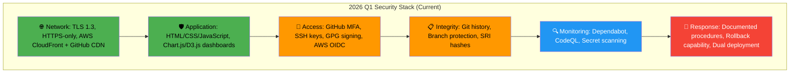
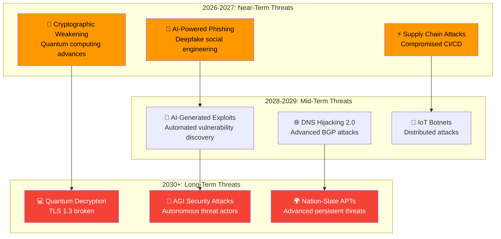
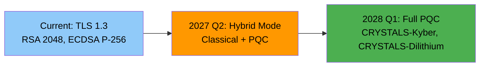
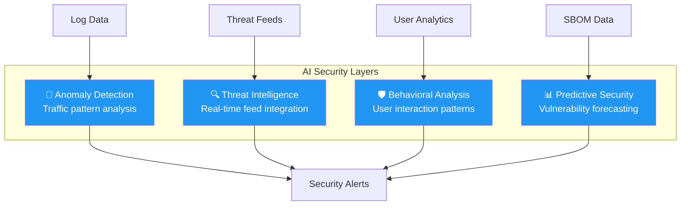
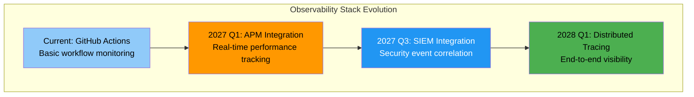
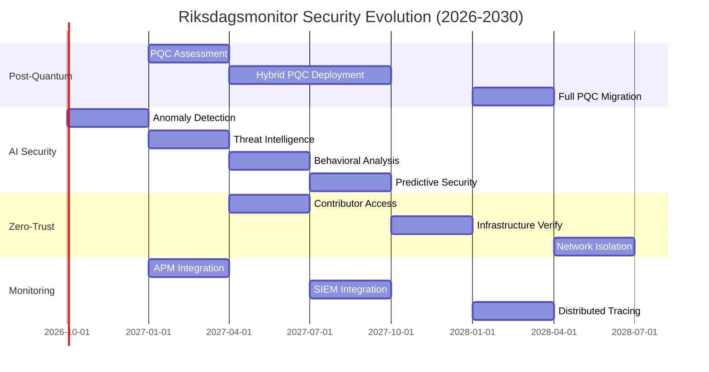
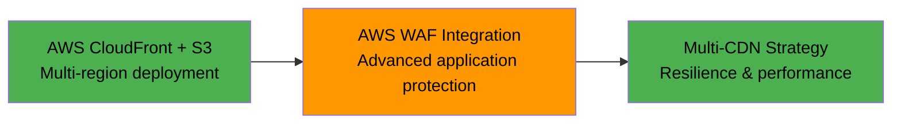
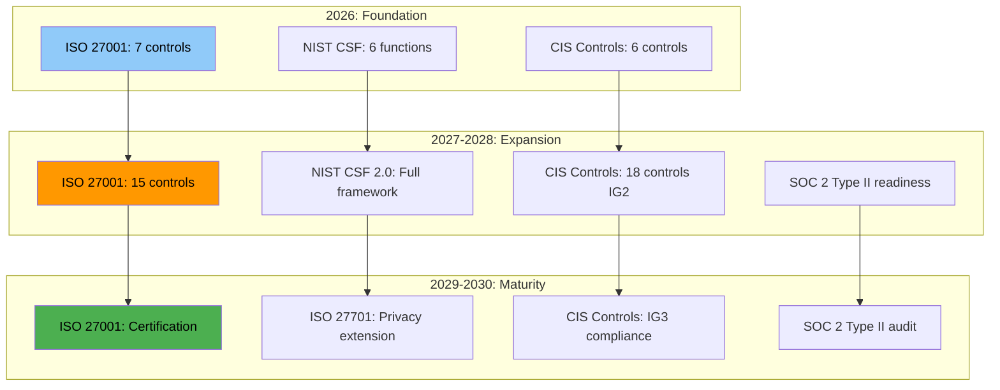
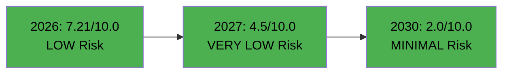
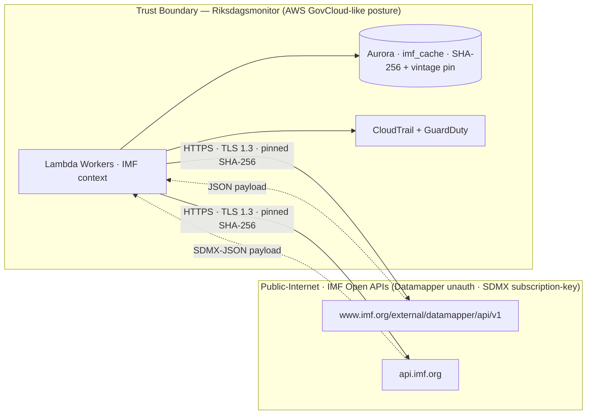

  

<h1 align="center">🚀 Riksdagsmonitor — Future Security Architecture</h1>

  <strong>🛡️ Evolution Roadmap: From Static Website to Advanced Intelligence Platform</strong> 
  <em>🎯 Post-Quantum Ready · AI-Augmented Security · Zero-Trust Architecture</em>

  
  
  
  
  

---

**Document Version:** 2.1  
**Last Updated:** 2026-05-31  
**Classification:** Public  
**Owner:** Hack23 AB (Org.nr 5595347807)  
**Review Cycle:** Quarterly

---

## 🎯 Executive Summary

This document outlines the future security architecture for Riksdagsmonitor over the next 3-11 years (2026-2037). The roadmap focuses on **proactive security evolution** rather than reactive patches, ensuring the web platform with interactive Chart.js/D3.js dashboards remains secure against emerging threats including post-quantum cryptography, AI-powered attacks, and advanced persistent threats.

**Strategic Goals:**
- 🔐 **Post-Quantum Readiness** - Cryptographic agility before quantum computers threaten current algorithms
- 🤖 **AI-Augmented Security** - Machine learning for threat detection and anomaly analysis
- 🛡️ **Zero-Trust Architecture** - Never trust, always verify, assume breach mentality
- 📊 **Privacy-Preserving Analytics** - Intelligence without surveillance
- 🌐 **Decentralized Resilience** - Distributed architecture for high availability

---

## 📋 Table of Contents

- [Architecture Documentation Map](#architecture-documentation-map)
- [ISMS Policy Alignment](#isms-policy-alignment)
1. [Current State Baseline](#1-current-state-baseline)
2. [Threat Landscape Evolution](#2-threat-landscape-evolution)
3. [Future Security Domains](#3-future-security-domains)
4. [Implementation Roadmap](#4-implementation-roadmap)
5. [Technology Evolution](#5-technology-evolution)
6. [Compliance Evolution](#6-compliance-evolution)
7. [Risk Management](#7-risk-management)
8. [Success Metrics](#8-success-metrics)
9. [Security Investment & Budget Planning](#security-investment--budget-planning)
10. [Conclusion](#10-conclusion)
11. [References](#references)

---

## 📚 Architecture Documentation Map

The following table shows all 15 architecture documents maintained for Riksdagsmonitor. This document is highlighted.

| Document | Focus | Description |
|----------|-------|-------------|
| [ARCHITECTURE.md](ARCHITECTURE.md) | Current | C4 system architecture model |
| [DATA_MODEL.md](DATA_MODEL.md) | Current | Data structures and entities |
| [FLOWCHART.md](FLOWCHART.md) | Current | Business process flows |
| [STATEDIAGRAM.md](STATEDIAGRAM.md) | Current | System state transitions |
| [MINDMAP.md](MINDMAP.md) | Current | System conceptual map |
| [SWOT.md](SWOT.md) | Current | Strategic analysis |
| [SECURITY_ARCHITECTURE.md](SECURITY_ARCHITECTURE.md) | Security | Current security controls |
| [THREAT_MODEL.md](THREAT_MODEL.md) | Security | STRIDE threat analysis |
| **[FUTURE_SECURITY_ARCHITECTURE.md](FUTURE_SECURITY_ARCHITECTURE.md)** | **Security** | **Future security roadmap (this document)** |
| [FUTURE_ARCHITECTURE.md](FUTURE_ARCHITECTURE.md) | Future | Architecture evolution roadmap |
| [FUTURE_DATA_MODEL.md](FUTURE_DATA_MODEL.md) | Future | Enhanced data architecture |
| [FUTURE_FLOWCHART.md](FUTURE_FLOWCHART.md) | Future | Improved process workflows |
| [FUTURE_STATEDIAGRAM.md](FUTURE_STATEDIAGRAM.md) | Future | Advanced state management |
| [FUTURE_MINDMAP.md](FUTURE_MINDMAP.md) | Future | Capability expansion map |
| [FUTURE_SWOT.md](FUTURE_SWOT.md) | Future | Future strategic opportunities |

---

## 🔐 ISMS Policy Alignment

### Policy Framework Integration

This document aligns with the following Hack23 ISMS policies from [Hack23/ISMS-PUBLIC](https://github.com/Hack23/ISMS-PUBLIC):

| Policy | Relevance | Key Requirements |
|--------|-----------|------------------|
| [Information Security Policy](https://github.com/Hack23/ISMS-PUBLIC/blob/main/Information_Security_Policy.md) | Primary | Security objectives, management commitment, risk appetite |
| [Secure Development Policy](https://github.com/Hack23/ISMS-PUBLIC/blob/main/Secure_Development_Policy.md) | High | Secure coding standards, SAST/DAST, supply chain security |
| [Access Control Policy](https://github.com/Hack23/ISMS-PUBLIC/blob/main/Access_Control_Policy.md) | High | Least privilege, MFA, zero-trust principles |
| [Risk Management Policy](https://github.com/Hack23/ISMS-PUBLIC/blob/main/Risk_Management_Policy.md) | High | Risk register, treatment plans, residual risk targets |
| [Incident Response Policy](https://github.com/Hack23/ISMS-PUBLIC/blob/main/Incident_Response_Policy.md) | Medium | MTTR targets, escalation procedures, post-incident reviews |
| [Cryptography Policy](https://github.com/Hack23/ISMS-PUBLIC/blob/main/Cryptography_Policy.md) | High | Algorithm standards, key management, PQC migration |
| [Supplier Security Policy](https://github.com/Hack23/ISMS-PUBLIC/blob/main/Supplier_Security_Policy.md) | Medium | Third-party risk (Chart.js, D3.js, GitHub, AWS) |
| [Business Continuity Policy](https://github.com/Hack23/ISMS-PUBLIC/blob/main/Business_Continuity_Policy.md) | Medium | Dual deployment, RTO/RPO targets |

### Security Control Implementation Status

| Control Domain | Current (2026) | Target (2028) | Target (2030) | Framework |
|----------------|----------------|---------------|---------------|-----------|
| Access Control | 🟡 Partial | 🟢 Full | 🟢 Full | ISO 27001 A.9 |
| Cryptography | 🟡 Classical TLS 1.3 | 🟡 Hybrid PQC | 🟢 Full PQC | ISO 27001 A.10 |
| Physical Security | 🟢 GitHub/AWS managed | 🟢 Full | 🟢 Full | ISO 27001 A.11 |
| Operations Security | 🟡 Partial | 🟢 Full | 🟢 Full | ISO 27001 A.12 |
| Network Security | 🟡 TLS/CDN only | 🟡 WAF added | 🟢 Full ZTA | ISO 27001 A.13 |
| Supplier Relations | 🟡 SRI/SBOM | 🟢 Full SBOM | 🟢 Full | ISO 27001 A.15 |
| Incident Management | 🟡 Documented | 🟡 Automated | 🟢 AI-assisted | ISO 27001 A.16 |
| Compliance | 🟡 Managed | 🟡 Certified | 🟢 ISO 27001 Cert | ISO 27001 A.18 |

### Alignment with NIST CSF 2.0 Functions

| Function | Current Maturity | 2028 Target | 2030 Target |
|----------|-----------------|-------------|-------------|
| **GV** — Govern | 🟡 Level 2 | 🟢 Level 3 | 🟢 Level 4 |
| **ID** — Identify | 🟡 Level 2 | 🟢 Level 3 | 🟢 Level 4 |
| **PR** — Protect | 🟡 Level 2 | 🟢 Level 3 | 🟢 Level 4 |
| **DE** — Detect | 🔴 Level 1 | 🟡 Level 2 | 🟢 Level 3 |
| **RS** — Respond | 🟡 Level 2 | 🟢 Level 3 | 🟢 Level 4 |
| **RC** — Recover | 🟡 Level 2 | 🟢 Level 3 | 🟢 Level 4 |

---

## 1. �� Current State Baseline

### 1.1 Current Security Posture (2026 Q1)

```mermaid
graph TB
    subgraph "2026 Q1 Security Stack (Current)"
        L1[🌐 Network: TLS 1.3, HTTPS-only, AWS CloudFront + GitHub CDN]
        L2[🛡️ Application: HTML/CSS/JavaScript, Chart.js/D3.js dashboards]
        L3[🔑 Access: GitHub MFA, SSH keys, GPG signing, AWS OIDC]
        L4[📋 Integrity: Git history, Branch protection, SRI hashes]
        L5[🔍 Monitoring: Dependabot, CodeQL, Secret scanning]
        L6[🚨 Response: Documented procedures, Rollback capability, Dual deployment]
    end
    
    L1 --> L2
    L2 --> L3
    L3 --> L4
    L4 --> L5
    L5 --> L6
    
    style L1 fill:#4caf50,color:#000000
    style L2 fill:#4caf50,color:#000000
    style L3 fill:#ff9800,color:#000000
    style L4 fill:#ff9800,color:#000000
    style L5 fill:#2196f3,color:#ffffff
    style L6 fill:#f44336,color:#ffffff
```

**Strengths:**
- ✅ LOW residual risk (7.21/10.0)
- ✅ Zero high-priority vulnerabilities
- ✅ Dual deployment with automatic failover (AWS + GitHub Pages)
- ✅ Interactive dashboards with SRI hash validation
- ✅ Comprehensive ISMS documentation
- ✅ AWS OIDC authentication (no long-lived credentials)
- ✅ **NEW (2026-02-18): SLSA Level 2+ Build Provenance attestations**
- ✅ **NEW (2026-02-18): SBOM generation in SPDX format**
- ✅ **NEW (2026-02-18): Documentation as code (API, coverage, E2E reports)**

**Limitations:**
- ⚠️ CSP `'unsafe-inline'` required for Chart.js/D3.js (future: nonce-based CSP)
- ⚠️ Client-side JavaScript increases attack surface (XSS risks)
- ⚠️ CDN dependency for Chart.js/D3.js (supply chain risk)
- ⚠️ No real-time threat intelligence integration
- ⚠️ Limited observability (no APM for client-side performance)

---

## 2. ⚠️ Threat Landscape Evolution

### 2.1 Emerging Threats (2026-2030)

```mermaid
graph TB
    subgraph "2026-2027: Near-Term Threats"
        T1[🤖 AI-Powered Phishing<br/>Deepfake social engineering]
        T2[🔐 Cryptographic Weakening<br/>Quantum computing advances]
        T3[⚡ Supply Chain Attacks<br/>Compromised CI/CD]
    end
    
    subgraph "2028-2029: Mid-Term Threats"
        T4[🧠 AI-Generated Exploits<br/>Automated vulnerability discovery]
        T5[🌐 DNS Hijacking 2.0<br/>Advanced BGP attacks]
        T6[📱 IoT Botnets<br/>Distributed attacks]
    end
    
    subgraph "2030+: Long-Term Threats"
        T7[💻 Quantum Decryption<br/>TLS 1.3 broken]
        T8[🤖 AGI Security Attacks<br/>Autonomous threat actors]
        T9[🌍 Nation-State APTs<br/>Advanced persistent threats]
    end
    
    T1 --> T4
    T2 --> T7
    T3 --> T6
    T4 --> T8
    T5 --> T9
    
    style T1 fill:#ff9800,color:#000000
    style T2 fill:#ff9800,color:#000000
    style T3 fill:#ff9800,color:#000000
    style T7 fill:#f44336,color:#ffffff
    style T8 fill:#f44336,color:#ffffff
    style T9 fill:#f44336,color:#ffffff
```

### 2.2 Regulatory Evolution

| Framework | Current (2026) | Future (2028-2030) | Impact on Riksdagsmonitor |
|-----------|----------------|-------------------|---------------------------|
| **NIS2 Directive** | Applicable | Stricter controls | Incident reporting <24h |
| **EU Cyber Resilience Act** | Proposed | Mandatory SBOM | Software supply chain transparency |
| **AI Act** | Draft | Enforced | AI system categorization if ML added |
| **Post-Quantum Cryptography** | NIST standards | Mandatory | Algorithm migration required |
| **GDPR** | Enforced | Enhanced | Privacy by design for any user data |

---

## 3. 🏗️ Future Security Domains

### 3.1 Post-Quantum Cryptography (PQC)

**Timeline:** 2027 Q1 - Q4  
**Priority:** 🔴 HIGH

```mermaid
graph LR
    Current[Current: TLS 1.3<br/>RSA 2048, ECDSA P-256] --> Hybrid[2027 Q2: Hybrid Mode<br/>Classical + PQC]
    Hybrid --> Full[2028 Q1: Full PQC<br/>CRYSTALS-Kyber, CRYSTALS-Dilithium]
    
    style Current fill:#90caf9,color:#000000
    style Hybrid fill:#ff9800,color:#000000
    style Full fill:#4caf50,color:#000000
```

**Implementation Plan:**

**Phase 1: Assessment (2027 Q1)**
- Inventory all cryptographic dependencies
- GitHub Pages TLS capabilities assessment
- Browser compatibility matrix (PQC support)
- Performance impact analysis

**Phase 2: Hybrid Deployment (2027 Q2-Q3)**
- Configure hybrid TLS (classical + PQC)
- Browser fallback mechanisms
- Performance monitoring
- User experience validation

**Phase 3: Full PQC Migration (2028 Q1)**
- Deprecate classical-only connections
- Full PQC enforcement for AWS CloudFront
- Certificate management automation
- Documentation updates

**NIST PQC Standards:**
- **Key Encapsulation:** CRYSTALS-Kyber (KEM)
- **Digital Signatures:** CRYSTALS-Dilithium, FALCON
- **Fallback:** Classical algorithms during transition

**AWS Integration:**
- CloudFront custom SSL certificate with PQC support
- S3 presigned URLs with post-quantum signatures
- Route 53 DNSSEC with PQC algorithms

**Control Mapping:**
- ISO 27001: A.10.1.1 (Cryptographic controls)
- NIST CSF 2.0: PR.DS-2 (Data in transit protected)
- CIS Controls v8.1: 3.10 (Encrypt data in transit)

---

### 3.2 AI-Augmented Security

**Timeline:** 2026 Q3 - 2027 Q4  
**Priority:** 🟡 MEDIUM

```mermaid
graph TB
    subgraph "AI Security Layers"
        A1[🤖 Anomaly Detection<br/>Traffic pattern analysis]
        A2[🔍 Threat Intelligence<br/>Real-time feed integration]
        A3[🛡️ Behavioral Analysis<br/>User interaction patterns]
        A4[📊 Predictive Security<br/>Vulnerability forecasting]
    end
    
    Data[Log Data] --> A1
    External[Threat Feeds] --> A2
    Analytics[User Analytics] --> A3
    SBOM[SBOM Data] --> A4
    
    A1 --> Alerts[Security Alerts]
    A2 --> Alerts
    A3 --> Alerts
    A4 --> Alerts
    
    style A1 fill:#2196f3,color:#ffffff
    style A2 fill:#2196f3,color:#ffffff
    style A3 fill:#2196f3,color:#ffffff
    style A4 fill:#2196f3,color:#ffffff
```

**Capabilities:**

**1. Anomaly Detection (2026 Q4)**
- Traffic pattern analysis via AWS CloudWatch and CloudFront logs
- Baseline establishment for normal behavior
- Real-time alerting on deviations
- Integration with GitHub Actions logs

**2. Threat Intelligence (2027 Q1)**
- Integration with threat intelligence feeds (MISP, OTX)
- Automated IOC matching against CloudFront access logs
- Proactive blocking of known-bad actors via AWS WAF
- Threat actor profiling

**3. Behavioral Analysis (2027 Q2)**
- User interaction patterns (if analytics added)
- Bot detection and mitigation via AWS WAF
- Session anomaly detection
- Privacy-preserving analytics (differential privacy)
- Client-side dashboard performance monitoring

**4. Predictive Security (2027 Q3)**
- Dependency vulnerability forecasting (Chart.js/D3.js)
- Zero-day prediction models
- Attack surface trend analysis (JavaScript attack surface)
- Risk score predictions

**Privacy Considerations:**
- ✅ No PII collection
- ✅ Anonymized analytics only
- ✅ GDPR-compliant by design
- ✅ User opt-out mechanisms

**Control Mapping:**
- ISO 27001: A.12.6 (Technical vulnerability management)
- NIST CSF 2.0: DE.CM-1 (Network monitored)
- CIS Controls v8.1: 13.1 (Security event alerting)

---

### 3.3 Zero-Trust Architecture

**Timeline:** 2027 Q1 - 2028 Q4  
**Priority:** 🟢 LOW (Static website context)

**Principles:**
1. **Never Trust, Always Verify** - Even GitHub infrastructure
2. **Assume Breach** - Design for compromise scenarios
3. **Least Privilege** - Minimal permissions at all layers
4. **Micro-Segmentation** - Isolate components

**Future Enhancements:**

**Contributor Access (2027 Q2)**
- Time-limited access tokens
- Just-in-time privilege elevation
- Continuous authentication verification
- Behavior-based access policies

**Infrastructure Verification (2027 Q4)**
- ✅ **IMPLEMENTED (2026-02-18): GitHub Actions attestations (SLSA Level 2+)**
- ✅ **IMPLEMENTED (2026-02-18): Build Provenance verification**
- **Future Goal:** SLSA Level 3 (hermetic builds, non-falsifiable provenance)
- Binary authorization for deployments
- Reproducible builds

**Network Isolation (2028 Q2)**
- Content Security Policy Level 3 with nonces (remove `'unsafe-inline'`)
- Subresource Integrity (SRI) for all external resources (Chart.js, D3.js)
- CORS policy enforcement
- DNS-over-HTTPS (DoH) via Route 53
- AWS WAF integration with CloudFront

**Control Mapping:**
- ISO 27001: A.13.1 (Network security management)
- NIST CSF 2.0: PR.AC-5 (Network integrity protected)
- CIS Controls v8.1: 13.6 (Deploy network-based IDS)

---

### 3.4 Advanced Monitoring & Observability

**Timeline:** 2026 Q4 - 2027 Q4  
**Priority:** 🟡 MEDIUM

```mermaid
graph TB
    subgraph "Observability Stack Evolution"
        M1[Current: GitHub Actions<br/>Basic workflow monitoring]
        M2[2027 Q1: APM Integration<br/>Real-time performance tracking]
        M3[2027 Q3: SIEM Integration<br/>Security event correlation]
        M4[2028 Q1: Distributed Tracing<br/>End-to-end visibility]
    end
    
    M1 --> M2
    M2 --> M3
    M3 --> M4
    
    style M1 fill:#90caf9,color:#000000
    style M2 fill:#ff9800,color:#000000
    style M3 fill:#2196f3,color:#ffffff
    style M4 fill:#4caf50,color:#000000
```

**Components:**

**1. Application Performance Monitoring (2027 Q1)**
- Real User Monitoring (RUM) for Chart.js/D3.js dashboards
- Synthetic monitoring from global locations
- Performance regression detection
- Lighthouse CI integration
- Client-side error tracking (Sentry or similar)

**Metrics:**
- First Contentful Paint (FCP) < 1s
- Time to Interactive (TTI) < 2s
- Cumulative Layout Shift (CLS) < 0.05
- Chart.js rendering performance < 500ms
- Core Web Vitals monitoring

**2. Security Information & Event Management (2027 Q3)**
- Centralized log aggregation (GitHub + AWS CloudFront + S3 access logs)
- Real-time security event correlation
- Automated incident response workflows
- Compliance reporting automation

**Integration:**
- Elastic Stack (ELK) or Splunk
- GitHub audit log streaming
- AWS CloudTrail and CloudWatch Logs
- CloudFront access logs
- Automated alerting to PagerDuty/Opsgenie

**3. Distributed Tracing (2028 Q1)**
- OpenTelemetry instrumentation
- Request flow visualization
- Latency analysis
- Dependency mapping

**Control Mapping:**
- ISO 27001: A.12.4 (Logging and monitoring)
- NIST CSF 2.0: DE.CM-1 (Network monitored)
- CIS Controls v8.1: 8.2 (Collect audit logs)

---

## 4. 🚀 Implementation Roadmap

### 4.1 Timeline Overview

```mermaid
gantt
    title Riksdagsmonitor Security Evolution (2026-2030)
    dateFormat YYYY-MM
    section Post-Quantum
    PQC Assessment           :2027-01, 3M
    Hybrid PQC Deployment   :2027-04, 6M
    Full PQC Migration      :2028-01, 3M
    section AI Security
    Anomaly Detection       :2026-10, 3M
    Threat Intelligence     :2027-01, 3M
    Behavioral Analysis     :2027-04, 3M
    Predictive Security     :2027-07, 3M
    section Zero-Trust
    Contributor Access      :2027-04, 3M
    Infrastructure Verify   :2027-10, 3M
    Network Isolation       :2028-04, 3M
    section Monitoring
    APM Integration         :2027-01, 3M
    SIEM Integration        :2027-07, 3M
    Distributed Tracing     :2028-01, 3M
```

### 4.2 Phase-by-Phase Breakdown

**2026 Q3-Q4: Foundation**
- ✅ Complete current ISMS documentation (DONE: Feb 2026)
- ✅ AWS CloudFront + S3 deployment (DONE: Feb 2026)
- ✅ Dual deployment with GitHub Pages DR (DONE: Feb 2026)
- 🔄 Implement APM monitoring (Lighthouse CI)
- 🔄 Enable GitHub Advanced Security features
- 🔄 AI anomaly detection prototype
- 🔄 Nonce-based CSP for Chart.js/D3.js (remove `'unsafe-inline'`)

**2027 Q1-Q2: Early Adoption**
- 🔐 PQC assessment and hybrid deployment
- 🤖 AI threat intelligence integration
- 🛡️ Zero-trust contributor access model
- 📊 SIEM integration (ELK/Splunk)

**2027 Q3-Q4: Expansion**
- 🔐 Full PQC readiness testing
- 🤖 Behavioral analysis deployment
- 🛡️ Infrastructure attestation (SLSA Level 3)
- 📊 Advanced monitoring dashboards

**2028 Q1-Q2: Maturity**
- 🔐 Full PQC enforcement
- 🤖 Predictive security models
- 🛡️ Network micro-segmentation
- 📊 Distributed tracing

**2028 Q3-Q4: Optimization**
- 🔧 Performance tuning
- 📖 Documentation updates
- 🎯 Compliance validation
- 🏆 Maturity assessment

**2029-2030: Continuous Improvement**
- 🔄 Regular security audits
- 🔄 Emerging threat response
- 🔄 Technology refresh cycles
- 🔄 ISMS updates

---

## 5. 💻 Technology Evolution

### 5.1 Hosting Platform Migration Considerations

**Current:** AWS CloudFront + S3 (Multi-region, cross-region replication)  
**Future Options:**

| Platform | Pros | Cons | Timeline | Recommendation |
|----------|------|------|----------|----------------|
| **AWS CloudFront + S3** | 99.9% SLA, DDoS protection, multi-region | Cost, complexity | Current | ✅ Stay (already implemented) |
| **GitHub Pages** | Free, integrated, simple | Limited customization, single provider | Current (DR) | ✅ Keep as DR |
| **AWS WAF** | Advanced protection, rate limiting, geo-blocking | Additional cost | 2027 Q2 | 🟡 High priority |
| **Multi-CDN Strategy** | Resilience, performance optimization | Complexity, cost | 2028 Q4 | 🟢 Consider for scale |

**Decision Criteria:**
- Cost-effectiveness for static content
- Security feature set (WAF, DDoS, monitoring)
- ISMS compliance capabilities
- Migration effort vs. benefit

**Recommended Path:**
- 2026-2027: Stay on AWS CloudFront + S3, maximize security features
- 2027 Q2: AWS WAF integration for advanced application-layer protection
- 2028 Q1: Enhanced monitoring and observability (APM, SIEM)
- 2028 Q4: Evaluate multi-CDN strategy if traffic scales significantly

---

### 5.2 Content Delivery Network (CDN) Evolution

```mermaid
graph LR
    Current[AWS CloudFront + S3<br/>Multi-region deployment] --> Enhanced[AWS WAF Integration<br/>Advanced application protection]
    Enhanced --> Premium[Multi-CDN Strategy<br/>Resilience & performance]
    
    style Current fill:#4caf50,color:#000000
    style Enhanced fill:#ff9800,color:#000000
    style Premium fill:#4caf50,color:#000000
```

**Enhancements:**

**AWS WAF Integration (2027 Q2)**
- Advanced Web Application Firewall (WAF) with CloudFront
- Bot protection and rate limiting
- Geo-blocking capabilities
- Custom rule sets for dashboard protection
- XSS and SQL injection prevention (defense-in-depth)

**Multi-CDN Strategy (2028 Q4)**
- Primary: AWS CloudFront
- Failover: Cloudflare or Fastly
- Automatic failover detection via Route 53
- Load balancing across CDNs for optimal performance

---

### 5.3 Security Tooling Roadmap

| Tool Category | Current (2026) | Future (2027-2028) | Purpose |
|---------------|----------------|-------------------|---------|
| **SAST** | CodeQL | + Semgrep, SonarCloud | Enhanced code scanning |
| **SCA** | Dependabot, dependency-review | + npm audit, Snyk, FOSSA | Better dependency insights |
| **DAST** | None | OWASP ZAP, Burp Suite | Dynamic scanning of dashboards |
| **Secret Scanning** | GitHub | + GitGuardian | Advanced secret detection |
| **SBOM** | Manual | CycloneDX, SPDX | Automated generation (Chart.js, D3.js) |
| **Container Scanning** | N/A | N/A | Not applicable (static hosting) |
| **Fuzzing** | None | OSS-Fuzz | Input validation for CIA data |
| **Client-Side Security** | None | JSXray, Retire.js | JavaScript vulnerability detection |

---

## 6. 📋 Compliance Evolution

### 6.1 Framework Maturity Progression

```mermaid
graph TB
    subgraph "2026: Foundation"
        C1[ISO 27001: 7 controls]
        C2[NIST CSF: 6 functions]
        C3[CIS Controls: 6 controls]
    end
    
    subgraph "2027-2028: Expansion"
        C4[ISO 27001: 15 controls]
        C5[NIST CSF 2.0: Full framework]
        C6[CIS Controls: 18 controls IG2]
        C7[SOC 2 Type II readiness]
    end
    
    subgraph "2029-2030: Maturity"
        C8[ISO 27001: Certification]
        C9[ISO 27701: Privacy extension]
        C10[CIS Controls: IG3 compliance]
        C11[SOC 2 Type II audit]
    end
    
    C1 --> C4
    C2 --> C5
    C3 --> C6
    C4 --> C8
    C5 --> C9
    C6 --> C10
    C7 --> C11
    
    style C1 fill:#90caf9,color:#000000
    style C4 fill:#ff9800,color:#000000
    style C8 fill:#4caf50,color:#000000
```

### 6.2 New Compliance Requirements

**NIS2 Directive (2027 Q4)**
- Incident reporting within 24 hours
- Supply chain security requirements
- Board-level security responsibility
- Regular penetration testing

**EU Cyber Resilience Act (2028 Q2)**
- Software Bill of Materials (SBOM)
- Vulnerability disclosure program
- Security updates for product lifetime
- CE marking for digital products

**AI Act (2028-2030)**
- AI system risk categorization
- Documentation requirements for high-risk AI
- Human oversight mechanisms
- Transparency obligations

### 6.3 Per-Control Maturity Progression

| Control | Framework | Current Level | 2027 Target | 2030 Target | Timeline | Milestone |
|---------|-----------|--------------|-------------|-------------|----------|-----------|
| Cryptographic Controls | ISO 27001 A.10.1 | Level 2 (Classical TLS) | Level 3 (Hybrid PQC) | Level 4 (Full PQC) | 2027 Q2 – 2028 Q1 | PQC migration complete |
| Access Control | ISO 27001 A.9.1 | Level 2 (MFA, SSH) | Level 3 (Zero-Trust) | Level 4 (JIT, ABAC) | 2027 Q2 – 2028 Q4 | Zero-trust contributor model |
| Network Security | ISO 27001 A.13.1 | Level 2 (TLS/CDN) | Level 3 (WAF added) | Level 4 (Full ZTA) | 2027 Q2 – 2028 Q4 | AWS WAF + CSP nonces |
| Logging & Monitoring | ISO 27001 A.12.4 | Level 1 (GitHub Actions) | Level 3 (APM+SIEM) | Level 4 (AI-SIEM) | 2027 Q1 – 2028 Q1 | Full SIEM integration |
| Vulnerability Management | ISO 27001 A.12.6 | Level 2 (Dependabot) | Level 3 (DAST added) | Level 4 (Predictive) | 2026 Q4 – 2027 Q3 | DAST integration |
| Incident Management | ISO 27001 A.16.1 | Level 2 (Documented) | Level 3 (Automated) | Level 4 (AI-assisted) | 2027 Q1 – 2028 Q1 | Automated playbooks |
| Supply Chain Security | ISO 27001 A.15.2 | Level 2 (SBOM+SRI) | Level 3 (SLSA L3) | Level 4 (Full provenance) | 2027 Q3 – 2028 Q1 | SLSA Level 3 |
| Identity Management | ISO 27001 A.9.4 | Level 2 (MFA+SSH) | Level 3 (Zero-Trust) | Level 4 (ABAC+JIT) | 2027 Q2 – 2028 Q4 | Just-in-time access |
| Network Monitoring | NIST DE.CM-1 | Level 1 (None) | Level 2 (CloudFront logs) | Level 3 (Behavioral AI) | 2026 Q4 – 2027 Q3 | Behavioral analysis |
| Threat Intelligence | NIST ID.RA-2 | Level 1 (Dependabot) | Level 2 (MISP/OTX feeds) | Level 3 (Predictive) | 2027 Q1 – 2027 Q3 | Threat feed integration |
| Secure Dev Lifecycle | CIS 16 | Level 2 (CodeQL+Dependabot) | Level 3 (+DAST+Fuzz) | Level 4 (Full SDL) | 2026 Q4 – 2027 Q4 | Full SSDLC implemented |
| Data Protection | CIS 3 | Level 2 (SRI+CSP) | Level 3 (nonce-based) | Level 4 (Full isolation) | 2027 Q1 – 2028 Q1 | CSP nonces for Chart.js |

### 6.4 CIS Controls v8.1 Implementation Roadmap

| CIS Control | Description | Current (IG1) | 2027 (IG2) | 2030 (IG3) |
|-------------|-------------|---------------|------------|------------|
| CIS 1 | Inventory & Control of Enterprise Assets | 🟢 Complete | 🟢 Full | 🟢 Full |
| CIS 2 | Inventory & Control of Software Assets | 🟡 Partial (SBOM) | 🟢 Full | 🟢 Full |
| CIS 3 | Data Protection | 🟡 Partial (SRI, CSP) | 🟢 Full (nonces) | 🟢 Full |
| CIS 4 | Secure Config of Enterprise Assets | 🟢 Complete (GitHub/AWS) | 🟢 Full | 🟢 Full |
| CIS 6 | Access Control Management | 🟡 Partial (MFA, SSH) | 🟢 Full (Zero-Trust) | 🟢 Full |
| CIS 7 | Continuous Vulnerability Management | 🟡 Partial (Dependabot) | 🟢 Full (+DAST) | 🟢 Full |
| CIS 8 | Audit Log Management | 🔴 Minimal | 🟡 Partial (APM) | 🟢 Full (SIEM) |
| CIS 12 | Network Infrastructure Management | 🟡 Partial (CDN) | 🟢 Full (WAF) | 🟢 Full |
| CIS 13 | Network Monitoring & Defense | 🔴 Minimal | 🟡 Partial | 🟢 Full (AI) |
| CIS 16 | Application Software Security | 🟡 Partial (SAST) | 🟢 Full (+DAST) | 🟢 Full |
| CIS 17 | Incident Response Management | 🟡 Documented | 🟢 Automated | 🟢 AI-assisted |
| CIS 18 | Penetration Testing | 🔴 None | 🟡 Annual | 🟢 Continuous |

---

## 7. ⚠️ Risk Management

### 7.1 Future Risk Register

| Risk ID | Future Threat | Likelihood (2030) | Impact | Mitigation | Timeline |
|---------|---------------|-------------------|--------|------------|----------|
| FR-01 | Quantum decryption of TLS | HIGH | CRITICAL | PQC migration | 2027-2028 |
| FR-02 | AI-powered supply chain attack (Chart.js/D3.js) | MEDIUM | HIGH | ✅ SLSA Level 2+ (2026), SBOM, SRI | 2027 Q4 (Level 3) |
| FR-03 | AWS infrastructure compromise | LOW | HIGH | Multi-CDN strategy, AWS security best practices | 2028 |
| FR-04 | DNS hijacking via Route 53 | MEDIUM | MEDIUM | DNSSEC, DoH, IAM least privilege | 2027 |
| FR-05 | Deepfake social engineering | MEDIUM | MEDIUM | MFA, training | 2026 |
| FR-06 | IoT botnet DDoS | MEDIUM | LOW | AWS WAF, rate limiting, AWS Shield | 2027 |
| FR-07 | Zero-day in GitHub Actions | LOW | MEDIUM | SHA-pinning, attestations | Ongoing |
| FR-08 | Regulatory non-compliance | MEDIUM | HIGH | ISMS evolution | Ongoing |
| FR-09 | XSS in Chart.js/D3.js dashboards | MEDIUM | MEDIUM | CSP nonces, SRI, regular updates | 2027 |
| FR-10 | Client-side data exfiltration | LOW | MEDIUM | CSP, browser security, monitoring | 2027 |

### 7.2 Residual Risk Evolution

```mermaid
graph LR
    Current[2026: 7.21/10.0<br/>LOW Risk] --> Enhanced[2027: 4.5/10.0<br/>VERY LOW Risk]
    Enhanced --> Optimized[2030: 2.0/10.0<br/>MINIMAL Risk]
    
    style Current fill:#4caf50,color:#000000
    style Enhanced fill:#4caf50,color:#000000
    style Optimized fill:#4caf50,color:#000000
```

**Target Risk Reduction:**
- Current: 99.5% risk reduction (web platform with dashboards)
- 2027: 99.75% risk reduction (PQC + AI security + nonce-based CSP)
- 2030: 99.9% risk reduction (Full zero-trust + AWS WAF)

---

## 8. 📊 Success Metrics

### 8.1 Key Performance Indicators (KPIs)

| Metric | Current (2026) | Target (2027) | Target (2030) |
|--------|----------------|---------------|---------------|
| **Residual Risk Score** | 7.21/10.0 | 4.5/10.0 | 2.0/10.0 |
| **MTTR (Incidents)** | <17 min | <10 min | <5 min |
| **Vulnerability Window** | <7 days | <24 hours | <4 hours |
| **Compliance Score** | 85% | 95% | 99% |
| **Security Automation** | 60% | 80% | 95% |
| **Threat Detection Rate** | N/A | 95% | 99% |
| **False Positive Rate** | N/A | <5% | <2% |
| **Dashboard XSS Protection** | Basic (CSP) | Enhanced (nonce-based) | Advanced (isolation) |

### 8.2 Maturity Assessment

**Current State:** Maturity Level 2 (Managed)
- Documented processes
- Basic automation
- Reactive security posture

**Target 2027:** Maturity Level 3 (Defined)
- Organization-wide standards
- Advanced automation
- Proactive threat hunting

**Target 2030:** Maturity Level 4 (Quantitatively Managed)
- Data-driven decisions
- Predictive security
- Continuous optimization

---

## 9. 💰 Security Investment & Budget Planning

### Per-Phase Investment Estimates

| Phase | Period | Estimated Investment | Key Investments | Priority |
|-------|--------|---------------------|-----------------|----------|
| **Foundation** | 2026 Q3-Q4 | €5,000 – €10,000 | Lighthouse CI, GitHub Advanced Security, SIEM baseline | 🔴 High |
| **Early Adoption** | 2027 Q1-Q2 | €15,000 – €25,000 | AWS WAF, PQC assessment, AI anomaly detection, SIEM | 🔴 High |
| **Expansion** | 2027 Q3-Q4 | €20,000 – €35,000 | Full AI security stack, behavioral analysis, SIEM integration | 🟡 Medium |
| **Maturity** | 2028 Q1-Q2 | €25,000 – €40,000 | Full PQC migration, AWS WAF, distributed tracing | 🟡 Medium |
| **Optimization** | 2028 Q3-Q4 | €10,000 – €20,000 | Audits, compliance validation, ISO 27001 certification | 🟢 Low |
| **Continuous** | 2029-2030 | €10,000 – €15,000/yr | Maintenance, audits, ISMS updates, training | 🟢 Low |

**Total Estimated Investment (2026-2030):** €85,000 – €145,000

### Resource Requirements

| Resource | Current | 2027 | 2028 | 2030 |
|----------|---------|------|------|------|
| Security Architect (FTE equivalent) | 0.2 | 0.4 | 0.6 | 0.5 |
| DevSecOps Engineer (FTE equivalent) | 0.1 | 0.3 | 0.4 | 0.3 |
| External Security Auditor | Annual | Annual | ISO 27001 pre-audit | Certification |
| PQC Specialist (Contractor) | — | Q1 2027 | Q1 2028 | — |
| SIEM Administrator | — | Q3 2027 | Full | Full |

### Return on Investment (ROI)

| Investment | Cost | Risk Reduction Value | ROI Estimate |
|------------|------|---------------------|-------------|
| AWS WAF + Rate Limiting | ~€5,000/yr | Prevents DDoS, reduces XSS exposure | 10x – 20x |
| AI Anomaly Detection | ~€8,000/yr | Early threat detection, reduces MTTR by 70% | 5x – 15x |
| PQC Migration | ~€20,000 one-time | Future-proofs encryption against quantum threats | Long-term strategic |
| SIEM Integration | ~€12,000/yr | Compliance automation, faster incident response | 3x – 8x |
| ISO 27001 Certification | ~€15,000 | Customer trust, regulatory compliance, contracts | 5x – 10x |
| GitHub Advanced Security | ~€3,000/yr | Automated vulnerability detection in CI/CD | 8x – 15x |

### Cost Optimization Strategies

- ✅ **Open-Source First**: Prefer OSS tools (ELK, Semgrep) over commercial solutions
- ✅ **GitHub-Native**: Leverage GitHub Advanced Security features (included in GitHub Enterprise)
- ✅ **AWS Reserved Instances**: Reserved capacity for CloudFront/WAF for cost predictability
- ✅ **Automation**: Reduce manual security effort through GitHub Actions automation
- ✅ **Phased Investment**: Align spending with roadmap milestones to manage cash flow

---

## 10. 🤝 Conclusion

This Future Security Architecture demonstrates Hack23 AB's commitment to **proactive security evolution** rather than reactive patching. By implementing post-quantum cryptography before it's necessary, AI-augmented security before attacks become fully autonomous, and zero-trust principles before breaches occur, Riksdagsmonitor will maintain its security leadership while delivering interactive Chart.js/D3.js dashboards.

**Key Takeaways:**
- 🔐 **Post-Quantum Ready by 2028** - Ahead of predicted quantum threat timeline
- 🤖 **AI-Augmented Security by 2027** - Machine learning for threat detection
- 🛡️ **Zero-Trust Architecture by 2028** - Comprehensive trust verification
- 📊 **99.9% Risk Reduction by 2030** - Industry-leading security posture
- 🏆 **ISO 27001 Certification Track** - Formal compliance validation
- 🎨 **Nonce-Based CSP by 2027** - Eliminate `'unsafe-inline'` for Chart.js/D3.js
- ☁️ **AWS WAF Integration by 2027** - Advanced application-layer protection

**Alignment with Business Goals:**
- 💼 Competitive advantage through security leadership
- 🤝 Customer trust through transparency
- 💰 Cost efficiency through automation
- 🚀 Innovation enablement through secure foundation
- 📋 Compliance posture supporting expansion

---

## 🤖 AI/LLM Security Evolution (2026-2037)

### AI Model Security Trajectory

**Current State (2026):** Anthropic Claude Opus 4.8 via Amazon Bedrock with safe-outputs validation

**Security Implications of AI Evolution:**

| Period | AI Model Level | Security Challenges | Mitigations |
|--------|---------------|-------------------|-------------|
| 2026-2027 | Opus 4.8-5.x (minor updates ~2.3mo) | Prompt injection, model hallucination, bias | Safe-outputs validation, human review, bias testing |
| 2028-2029 | Opus 6.x-7.x (annual major upgrades) | Autonomous agent risks, multi-modal attack vectors | Agent sandboxing, output filtering, behavioral monitoring |
| 2030-2032 | Opus 8.x-10.x / Pre-AGI | AI-powered adversarial attacks, deepfake political content | AI-augmented SIEM, deepfake detection, content provenance |
| 2033-2035 | Near-AGI systems | Autonomous threat actors, AI arms race | Zero-trust AI, formal verification, cryptographic AI attestation |
| 2036-2037 | AGI / Post-AGI era | Superhuman threat actors, unknown attack vectors | Quantum-resistant crypto, AI alignment verification, democratic safeguards |

### AI Security Controls Roadmap

**Phase 1 (2026-2027): Foundation**
- ✅ Amazon Bedrock guardrails and content filtering
- ✅ Safe-outputs validation for all agent actions
- ✅ Model output auditing and logging
- 🔄 Prompt injection detection and prevention
- 🔄 AI model version pinning with rollback capability

**Phase 2 (2028-2030): Advanced Protection**
- 🔴 AI-powered threat detection (behavioral analytics)
- 🔴 Multi-modal content provenance (C2PA standard)
- 🔴 Autonomous agent containment and monitoring
- 🔴 AI model supply chain security (model signing, attestation)

**Phase 3 (2031-2033): Pre-AGI Security**
- 🔴 Formal verification of AI agent behavior
- 🔴 Cryptographic attestation of AI-generated content
- 🔴 AI alignment monitoring and enforcement
- 🔴 Decentralized AI security governance

**Phase 4 (2034-2037): AGI-Era Security**
- 🔴 Post-quantum cryptography fully deployed
- 🔴 AI-to-AI security protocols
- 🔴 Democratic oversight mechanisms for AGI systems
- 🔴 Global threat intelligence federation
- 🔴 Autonomous security response with human override

### LLM Competitor Security Considerations

**Multi-Model Security Strategy:**
- Evaluate security posture of each model provider (Anthropic, OpenAI, Google, Meta) at every major release
- Maintain model-agnostic security controls that work across all providers via Amazon Bedrock
- Monitor for model-specific vulnerabilities disclosed by security researchers
- Continuous benchmarking of AI safety features every ~2.3 months aligned with minor model updates
- Prepare for potential paradigm shifts (quantum AI, neuromorphic computing) requiring new security frameworks

---

## 📖 References

### ISMS Documentation
- [SECURITY_ARCHITECTURE.md](SECURITY_ARCHITECTURE.md) - Current security controls
- [THREAT_MODEL.md](THREAT_MODEL.md) - Current threat analysis
- [WORKFLOWS.md](WORKFLOWS.md) - CI/CD workflows
- [ARCHITECTURE.md](ARCHITECTURE.md) - System architecture
- [Hack23 ISMS](https://github.com/Hack23/ISMS-PUBLIC)
- [Information Security Policy](https://github.com/Hack23/ISMS-PUBLIC/blob/main/Information_Security_Policy.md)
- [Secure Development Policy](https://github.com/Hack23/ISMS-PUBLIC/blob/main/Secure_Development_Policy.md)
- [Access Control Policy](https://github.com/Hack23/ISMS-PUBLIC/blob/main/Access_Control_Policy.md)
- [Risk Management Policy](https://github.com/Hack23/ISMS-PUBLIC/blob/main/Risk_Management_Policy.md)
- [Cryptography Policy](https://github.com/Hack23/ISMS-PUBLIC/blob/main/Cryptography_Policy.md)

### External Standards
- [NIST Post-Quantum Cryptography](https://csrc.nist.gov/projects/post-quantum-cryptography)
- [SLSA Supply Chain Security](https://slsa.dev/)
- [OWASP Application Security](https://owasp.org/)
- [CIS Controls v8.1](https://www.cisecurity.org/controls/v8)
- [NIST CSF 2.0](https://www.nist.gov/cyberframework)
- [ISO 27001:2022](https://www.iso.org/standard/27001)
- [EU Cyber Resilience Act](https://digital-strategy.ec.europa.eu/en/policies/cyber-resilience-act)
- [NIS2 Directive](https://digital-strategy.ec.europa.eu/en/policies/nis2-directive)

### Related Hack23 Repositories
- [Citizen Intelligence Agency](https://github.com/Hack23/cia) - Reference security architecture
- [Black Trigram](https://github.com/Hack23/blacktrigram) - Reference security patterns
- [Hack23 ISMS-PUBLIC](https://github.com/Hack23/ISMS-PUBLIC) - ISMS policies and standards

### Riksdagsmonitor Architecture Portfolio

| Document | Focus |
|----------|-------|
| [🏛️ Architecture](ARCHITECTURE.md) | C4 models |
| [📊 Data Model](DATA_MODEL.md) | Data entities |
| [🔄 Flowchart](FLOWCHART.md) | Process flows |
| [📈 State Diagram](STATEDIAGRAM.md) | State transitions |
| [🧠 Mindmap](MINDMAP.md) | Conceptual relationships |
| [💼 SWOT](SWOT.md) | Strategic analysis |
| [🛡️ Security Architecture](SECURITY_ARCHITECTURE.md) | Current security controls |
| [🎯 Threat Model](THREAT_MODEL.md) | STRIDE/MITRE ATT&CK |
| [🔮 Future Threat Model](FUTURE_THREAT_MODEL.md) | Future threat analysis |
| **[🔮 Future Security Architecture](FUTURE_SECURITY_ARCHITECTURE.md)** | **Planned security (this document)** |

---

  <strong>Document Control</strong> 
  Repository: <a href="https://github.com/Hack23/riksdagsmonitor">https://github.com/Hack23/riksdagsmonitor</a> 
  Path: /FUTURE_SECURITY_ARCHITECTURE.md | Classification: Public | Next Review: 2026-08-31 
  Change Management: Requires Security Architect approval for major revisions

  
  
  
  
  

---

## 🌐 Evolving the Current IMF Security Boundary toward the Future Zero-Trust State

*Baseline: the **already-implemented** IMF trust boundary, egress allow-list, and STRIDE coverage are documented in [`SECURITY_ARCHITECTURE.md`](SECURITY_ARCHITECTURE.md) §IMF and [`THREAT_MODEL.md`](THREAT_MODEL.md) §IMF. The diagram below shows how those existing controls evolve when the runtime moves to AWS Lambda + Aurora.*

> **Authoritative hub:** [`analysis/imf/README.md`](analysis/imf/README.md) · [`analysis/imf/agentic-integration.md`](analysis/imf/agentic-integration.md) · [`analysis/imf/indicators-inventory.json`](analysis/imf/indicators-inventory.json) · [`analysis/imf/data-dictionary.md`](analysis/imf/data-dictionary.md) · [`.github/aw/ECONOMIC_DATA_CONTRACT.md`](.github/aw/ECONOMIC_DATA_CONTRACT.md)

### Trust boundary (target zero-trust state)

```mermaid
flowchart LR
    subgraph Trusted["Trust Boundary — Riksdagsmonitor (AWS GovCloud-like posture)"]
        Lambda[Lambda Workers · IMF context]
        Cache[(Aurora · imf_cache · SHA-256 + vintage pin)]
        Audit[CloudTrail + GuardDuty]
    end
    subgraph Public["Public-Internet · IMF Open APIs (Datamapper unauth · SDMX subscription-key)"]
        Datamapper[www.imf.org/external/datamapper/api/v1]
        SDMX[api.imf.org]
    end
    Lambda -- HTTPS · TLS 1.3 · pinned SHA-256 --> Datamapper
    Lambda -- HTTPS · TLS 1.3 · pinned SHA-256 --> SDMX
    Datamapper -. JSON payload .-> Lambda
    SDMX -. SDMX-JSON payload .-> Lambda
    Lambda --> Cache
    Lambda --> Audit
```

### IMF-specific controls (mapped to target frameworks)

| Control | Implementation | ISO 27001 | NIST CSF 2.0 | CIS v8.1 |
|---|---|---|---|---|
| **Egress allow-list** | Squid + iptables limit egress to `www.imf.org`, `api.imf.org` only | A.13.1 | PR.AC-5 | 13.4 |
| **Payload integrity** | SHA-256 pin per (dataflow, indicator, country, vintage); supersedes-chain | A.8.2 | PR.DS-6 | 3.11 |
| **Vintage discipline** | Reject payload >6 mo old without staleness annotation | A.8.10 | PR.DS-1 | 3.5 |
| **Rate-limit guard** | ≤30 req/min self-imposed; exponential back-off; emits metric | A.13.1 | PR.AC-4 | 4.7 |
| **Provenance audit** | Every article-claim row in `article_economic_provenance` | A.5.28 | DE.AE-3 | 8.2 |
| **No auth, no PII** | IMF data is anonymous public macro statistics; GDPR DPIA short-circuit | A.5.34 | GV.OV | 14.2 |

### Future BIA addition

| Asset | Confidentiality | Integrity | Availability | RTO | RPO |
|---|---|---|---|---|---|
| IMF cache (Aurora) | PUBLIC | HIGH | STANDARD | 24h | N/A |
| IMF API egress path | PUBLIC | HIGH | STANDARD | 24h (fallback to last cached vintage) | N/A |

**Egress hosts** (allow-list): `www.imf.org` (Datamapper REST · WEO/FM, **unauthenticated**), `api.imf.org` (SDMX 3.0 REST · IFS/BOP/DOTS/GFS/PCPS/ER/MFS_IR/MFS_PR, **subscription-key authenticated** via the Azure APIM `Ocp-Apim-Subscription-Key` header / `IMF_SDMX_SUBSCRIPTION_KEY` secret). Both HTTPS-only; payloads are public macro statistics with no PII.

**Canonical rule.** Every economic claim in a Riksdagsmonitor article cites an IMF dataflow first; World Bank citations are reserved for governance, environment and social residue (the classes IMF does not publish). SCB is the Swedish-specific ground truth layer. See `ECONOMIC_DATA_CONTRACT.md` v2.1 for the banned-phrase list and vintage discipline (>6 mo → annotation).

---

## 🔗 Hack23 Ecosystem

<table>
<tr>
  <th width="33%">🌐 Platforms</th>
  <th width="33%">📦 Open-Source Projects</th>
  <th width="33%">🛡️ Governance &amp; Standards</th>
</tr>
<tr>
<td valign="top">
🗳️ <a href="https://riksdagsmonitor.com">Riksdagsmonitor</a> — Swedish Parliament intelligence 
🇪🇺 <a href="https://www.euparliamentmonitor.com">EU Parliament Monitor</a> — European coverage 
🕵️ <a href="https://www.hack23.com/cia">Citizen Intelligence Agency</a> — political-data engine 
🌐 <a href="https://www.hack23.com">Hack23 AB</a> — corporate site 
📰 <a href="https://hack23.com/blog.html">Hack23 Blog</a> — engineering &amp; policy 
💼 <a href="https://www.linkedin.com/company/hack23/">Hack23 on LinkedIn</a>
</td>
<td valign="top">
🗳️ <a href="https://github.com/Hack23/riksdagsmonitor">Hack23/riksdagsmonitor</a> 
🕵️ <a href="https://github.com/Hack23/cia">Hack23/cia</a> 
🇪🇺 <a href="https://github.com/Hack23/euparliamentmonitor">Hack23/euparliamentmonitor</a> 
🔌 <a href="https://github.com/Hack23/european-parliament-mcp">Hack23/european-parliament-mcp</a> 
✅ <a href="https://github.com/Hack23/cia-compliance-manager">Hack23/cia-compliance-manager</a> 
🥋 <a href="https://github.com/Hack23/black-trigram">Hack23/black-trigram</a> 
🏠 <a href="https://github.com/Hack23/homepage">Hack23/homepage</a>
</td>
<td valign="top">
🛡️ <a href="https://github.com/Hack23/ISMS-PUBLIC">Hack23 ISMS-PUBLIC</a> — public ISMS 
🔒 <a href="https://github.com/Hack23/ISMS-PUBLIC/blob/main/Information_Security_Policy.md">Information Security Policy</a> 
🤖 <a href="https://github.com/Hack23/ISMS-PUBLIC/blob/main/AI_Policy.md">AI Policy</a> 
🧪 <a href="https://github.com/Hack23/ISMS-PUBLIC/blob/main/Secure_Development_Policy.md">Secure Development Policy</a> 
🎯 <a href="https://github.com/Hack23/ISMS-PUBLIC/blob/main/Threat_Modeling.md">Threat Modeling Policy</a> 
⚠️ <a href="https://github.com/Hack23/ISMS-PUBLIC/blob/main/Vulnerability_Management.md">Vulnerability Management</a> 
🏷️ <a href="https://github.com/Hack23/ISMS-PUBLIC/blob/main/CLASSIFICATION.md">Classification Framework</a>
</td>
</tr>
</table>

<em>🗳️ Empower citizens · 🔍 Strengthen democratic accountability · 🕵️ Illuminate the political process</em>

© 2008–2026 <a href="https://www.hack23.com">Hack23 AB</a> (Org.nr 559534-7807) · Maintainer: <a href="https://www.linkedin.com/in/jamessorling/">James Pether Sörling, CISSP CISM</a>

