  

<h1 align="center">🚀 Riksdagsmonitor — Future Security Architecture</h1>

  <strong>🛡️ Evolution Roadmap: From Static Website to Advanced Intelligence Platform</strong> 
  <em>🎯 Post-Quantum Ready · AI-Augmented Security · Zero-Trust Architecture</em>

---

**Document Version:** 1.2  
**Last Updated:** 2026-02-08  
**Classification:** Public  
**Owner:** Hack23 AB (Org.nr 5595347807)  
**Review Cycle:** Quarterly

---

## 🎯 Executive Summary

This document outlines the future security architecture for Riksdagsmonitor over the next 3-5 years. The roadmap focuses on **proactive security evolution** rather than reactive patches, ensuring the platform remains secure against emerging threats including post-quantum cryptography, AI-powered attacks, and advanced persistent threats.

**Current State (2026 Q1):** Dual-deployment architecture with AWS CloudFront/S3 (primary) and GitHub Pages (disaster recovery) providing 99.997% availability.

**Strategic Goals:**
- 🔐 **Post-Quantum Readiness** - Cryptographic agility before quantum computers threaten current algorithms
- 🤖 **AI-Augmented Security** - Machine learning for threat detection and anomaly analysis
- 🛡️ **Zero-Trust Architecture** - Never trust, always verify, assume breach mentality
- 📊 **Privacy-Preserving Analytics** - Intelligence without surveillance
- 🌐 **Multi-Region Resilience** - Distributed architecture for high availability (AWS + GitHub Pages)

---

## 📋 Table of Contents

1. [Current State Baseline](#1-current-state-baseline)
2. [Threat Landscape Evolution](#2-threat-landscape-evolution)
3. [Future Security Domains](#3-future-security-domains)
4. [Implementation Roadmap](#4-implementation-roadmap)
5. [Technology Evolution](#5-technology-evolution)
6. [Compliance Evolution](#6-compliance-evolution)
7. [Risk Management](#7-risk-management)
8. [Success Metrics](#8-success-metrics)

---

## 1. �� Current State Baseline

### 1.1 Current Security Posture (2026 Q1)

```mermaid
graph TB
    subgraph "2026 Q1 Security Stack"
        L1[🌐 Network: TLS 1.3, HTTPS-only, AWS CloudFront 600+ PoPs, Route 53 failover]
        L2[🛡️ Application: Static HTML/CSS, No server-side code]
        L3[🔑 Access: GitHub MFA, AWS OIDC, SSH keys, GPG signing, IAM roles]
        L4[📋 Integrity: Git history, S3 versioning, Branch protection, Dual deployment]
        L5[🔍 Monitoring: Dependabot, CodeQL, Secret scanning, CloudTrail, CloudWatch]
        L6[🚨 Response: Documented procedures, Rollback capability, DNS failover, BCPPlan.md]
    end
    
    L1 --> L2
    L2 --> L3
    L3 --> L4
    L4 --> L5
    L5 --> L6
    
    style L1 fill:#4caf50
    style L2 fill:#4caf50
    style L3 fill:#ff9800
    style L4 fill:#ff9800
    style L5 fill:#2196f3
    style L6 fill:#f44336
```

**Strengths:**
- ✅ VERY LOW residual risk (2.8/10.0, down from 3.8 before multi-region)
- ✅ Zero high-priority vulnerabilities
- ✅ Multi-region S3 replication provides 99.998% availability (up from 99.997%)
- ✅ CloudFront origin failover <30 seconds (automatic on 500+ errors)
- ✅ Static architecture eliminates common web vulnerabilities
- ✅ Comprehensive ISMS documentation (BCPPlan, SECURITY_ARCHITECTURE, THREAT_MODEL)
- ✅ AWS Shield Standard DDoS protection
- ✅ Multi-region resilience (us-east-1 → eu-west-1 active replication)

**Limitations:**
- ⚠️ Dual provider dependency (AWS + GitHub, mitigated by independence)
- ⚠️ Limited real-time threat intelligence integration
- ⚠️ No Web Application Firewall (WAF) - static site has minimal attack surface, planned for 2027 Q2
- ⚠️ S3 encryption uses AWS-managed keys (customer-managed keys option available)
- ⚠️ Origin Shield not yet enabled (optional performance optimization)

---

## 2. ⚠️ Threat Landscape Evolution

### 2.1 Emerging Threats (2026-2030)

```mermaid
graph TB
    subgraph "2026-2027: Near-Term Threats"
        T1[🤖 AI-Powered Phishing<br/>Deepfake social engineering]
        T2[🔐 Cryptographic Weakening<br/>Quantum computing advances]
        T3[⚡ Supply Chain Attacks<br/>Compromised CI/CD]
    end
    
    subgraph "2028-2029: Mid-Term Threats"
        T4[🧠 AI-Generated Exploits<br/>Automated vulnerability discovery]
        T5[🌐 DNS Hijacking 2.0<br/>Advanced BGP attacks]
        T6[📱 IoT Botnets<br/>Distributed attacks]
    end
    
    subgraph "2030+: Long-Term Threats"
        T7[💻 Quantum Decryption<br/>TLS 1.3 broken]
        T8[🤖 AGI Security Attacks<br/>Autonomous threat actors]
        T9[🌍 Nation-State APTs<br/>Advanced persistent threats]
    end
    
    T1 --> T4
    T2 --> T7
    T3 --> T6
    T4 --> T8
    T5 --> T9
    
    style T1 fill:#ff9800
    style T2 fill:#ff9800
    style T3 fill:#ff9800
    style T7 fill:#f44336
    style T8 fill:#f44336
    style T9 fill:#f44336
```

### 2.2 Regulatory Evolution

| Framework | Current (2026) | Future (2028-2030) | Impact on Riksdagsmonitor |
|-----------|----------------|-------------------|---------------------------|
| **NIS2 Directive** | Applicable | Stricter controls | Incident reporting <24h |
| **EU Cyber Resilience Act** | Proposed | Mandatory SBOM | Software supply chain transparency |
| **AI Act** | Draft | Enforced | AI system categorization if ML added |
| **Post-Quantum Cryptography** | NIST standards | Mandatory | Algorithm migration required |
| **GDPR** | Enforced | Enhanced | Privacy by design for any user data |

---

## 3. 🏗️ Future Security Domains

### 3.1 Post-Quantum Cryptography (PQC)

**Timeline:** 2027 Q1 - Q4  
**Priority:** 🔴 HIGH

**Implementation Plan:**

**Phase 1: Assessment (2027 Q1)**
- Inventory all cryptographic dependencies
- AWS CloudFront TLS capabilities assessment (TLS 1.3 support for PQC algorithms)
- Browser compatibility matrix (PQC support across Chrome, Safari, Firefox, Edge)
- Performance impact analysis (PQC handshake overhead, certificate size)
- Cost analysis (AWS CloudFront custom SSL certificate with PQC)

**Phase 2: Hybrid Deployment (2027 Q2-Q3)**
- Configure hybrid TLS on CloudFront (classical + PQC via custom SSL certificate)
- Browser fallback mechanisms (TLS 1.3 classical for older browsers)
- Performance monitoring (CloudWatch metrics for handshake latency)
- User experience validation (Core Web Vitals tracking)
- Cost optimization (minimize custom certificate fees)

**Phase 3: Full PQC Migration (2028 Q1)**
- Deprecate classical-only connections
- Full PQC enforcement
- Certificate management automation
- Documentation updates

**NIST PQC Standards:**
- **Key Encapsulation:** CRYSTALS-Kyber (KEM)
- **Digital Signatures:** CRYSTALS-Dilithium, FALCON
- **Fallback:** Classical algorithms during transition

**Control Mapping:**
- ISO 27001: A.10.1.1 (Cryptographic controls)
- NIST CSF 2.0: PR.DS-2 (Data in transit protected)
- CIS Controls v8.1: 3.10 (Encrypt data in transit)

---

### 3.2 AI-Augmented Security

**Timeline:** 2026 Q3 - 2027 Q4  
**Priority:** 🟡 MEDIUM

```mermaid
graph TB
    subgraph "AI Security Layers"
        A1[🤖 Anomaly Detection<br/>Traffic pattern analysis]
        A2[🔍 Threat Intelligence<br/>Real-time feed integration]
        A3[🛡️ Behavioral Analysis<br/>User interaction patterns]
        A4[📊 Predictive Security<br/>Vulnerability forecasting]
    end
    
    Data[Log Data] --> A1
    External[Threat Feeds] --> A2
    Analytics[User Analytics] --> A3
    SBOM[SBOM Data] --> A4
    
    A1 --> Alerts[Security Alerts]
    A2 --> Alerts
    A3 --> Alerts
    A4 --> Alerts
    
    style A1 fill:#2196f3
    style A2 fill:#2196f3
    style A3 fill:#2196f3
    style A4 fill:#2196f3
```

**Capabilities:**

**1. Anomaly Detection (2026 Q4)**
- Traffic pattern analysis via CloudFlare WAF (if migrated)
- Baseline establishment for normal behavior
- Real-time alerting on deviations
- Integration with GitHub Actions logs

**2. Threat Intelligence (2027 Q1)**
- Integration with threat intelligence feeds (MISP, OTX, AWS GuardDuty if enabled)
- Automated IOC (Indicator of Compromise) matching against CloudFront logs
- Proactive blocking of known-bad actors via AWS WAF (planned)
- Threat actor profiling and attribution
- Integration with OSINT sources for political targeting intelligence

**3. Behavioral Analysis (2027 Q2)**
- User interaction patterns (if analytics added)
- Bot detection and mitigation
- Session anomaly detection
- Privacy-preserving analytics (differential privacy)

**4. Predictive Security (2027 Q3)**
- Dependency vulnerability forecasting
- Zero-day prediction models
- Attack surface trend analysis
- Risk score predictions

**Privacy Considerations:**
- ✅ No PII collection
- ✅ Anonymized analytics only
- ✅ GDPR-compliant by design
- ✅ User opt-out mechanisms

**Control Mapping:**
- ISO 27001: A.12.6 (Technical vulnerability management)
- NIST CSF 2.0: DE.CM-1 (Network monitored)
- CIS Controls v8.1: 13.1 (Security event alerting)

---

### 3.3 Zero-Trust Architecture

**Timeline:** 2027 Q1 - 2028 Q4  
**Priority:** 🟢 LOW (Static website context)

**Principles:**
1. **Never Trust, Always Verify** - Even GitHub infrastructure
2. **Assume Breach** - Design for compromise scenarios
3. **Least Privilege** - Minimal permissions at all layers
4. **Micro-Segmentation** - Isolate components

**Future Enhancements:**

**Contributor Access (2027 Q2)**
- Time-limited access tokens
- Just-in-time privilege elevation
- Continuous authentication verification
- Behavior-based access policies

**Infrastructure Verification (2027 Q4)**
- GitHub Actions attestations (SLSA Level 3)
- Provenance verification for all artifacts
- Binary authorization for deployments
- Reproducible builds

**Network Isolation (2028 Q2)**
- Content Security Policy Level 3
- Subresource Integrity (SRI) for all external resources
- CORS policy enforcement
- DNS-over-HTTPS (DoH)

**Control Mapping:**
- ISO 27001: A.13.1 (Network security management)
- NIST CSF 2.0: PR.AC-5 (Network integrity protected)
- CIS Controls v8.1: 13.6 (Deploy network-based IDS)

---

### 3.4 Advanced Monitoring & Observability

**Timeline:** 2026 Q4 - 2027 Q4  
**Priority:** 🟡 MEDIUM

**Components:**

**1. Application Performance Monitoring (2027 Q1)**
- Real User Monitoring (RUM)
- Synthetic monitoring from global locations
- Performance regression detection
- Lighthouse CI integration

**Metrics:**
- First Contentful Paint (FCP) < 1s
- Time to Interactive (TTI) < 2s
- Cumulative Layout Shift (CLS) < 0.05
- Core Web Vitals monitoring

**2. Security Information & Event Management (2027 Q3)**
- Centralized log aggregation (GitHub + CDN logs)
- Real-time security event correlation
- Automated incident response workflows
- Compliance reporting automation

**Integration:**
- Elastic Stack (ELK) or Splunk
- GitHub audit log streaming
- CloudFlare WAF logs (if migrated)
- Automated alerting to PagerDuty/Opsgenie

**3. Distributed Tracing (2028 Q1)**
- OpenTelemetry instrumentation
- Request flow visualization
- Latency analysis
- Dependency mapping

**Control Mapping:**
- ISO 27001: A.12.4 (Logging and monitoring)
- NIST CSF 2.0: DE.CM-1 (Network monitored)
- CIS Controls v8.1: 8.2 (Collect audit logs)

---

## 4. 🚀 Implementation Roadmap

### 4.1 Timeline Overview

### 4.2 Phase-by-Phase Breakdown

**2026 Q3-Q4: Foundation**
- ✅ Complete current ISMS documentation
- 🔄 Implement APM monitoring (Lighthouse CI)
- 🔄 Enable GitHub Advanced Security features
- 🔄 AI anomaly detection prototype

**2027 Q1-Q2: Early Adoption**
- 🔐 PQC assessment and hybrid deployment
- 🤖 AI threat intelligence integration
- 🛡️ Zero-trust contributor access model
- 📊 SIEM integration (ELK/Splunk)

**2027 Q3-Q4: Expansion**
- 🔐 Full PQC readiness testing
- 🤖 Behavioral analysis deployment
- 🛡️ Infrastructure attestation (SLSA Level 3)
- 📊 Advanced monitoring dashboards

**2028 Q1-Q2: Maturity**
- 🔐 Full PQC enforcement
- 🤖 Predictive security models
- 🛡️ Network micro-segmentation
- 📊 Distributed tracing

**2028 Q3-Q4: Optimization**
- 🔧 Performance tuning
- 📖 Documentation updates
- 🎯 Compliance validation
- 🏆 Maturity assessment

**2029-2030: Continuous Improvement**
- 🔄 Regular security audits
- 🔄 Emerging threat response
- 🔄 Technology refresh cycles
- 🔄 ISMS updates

---

## 5. 💻 Technology Evolution

### 1.1 Current State Baseline (2026 Q1)

**Current Hosting:**
- **Primary:** AWS CloudFront (600+ PoPs) + S3 (us-east-1 with real-time replication to eu-west-1)
- **Origin Failover:** CloudFront automatic failover to eu-west-1 on 500+ errors (<30 seconds)
- **Disaster Recovery:** GitHub Pages (standby deployment)
- **DNS:** AWS Route 53 with health checks and automatic failover
- **Availability:** 99.998% (multi-region deployment strategy)

**Future Options:**

| Platform | Current Status | Pros | Cons | Timeline | Recommendation |
|----------|----------------|------|------|----------|----------------|
| **AWS CloudFront + S3** | ✅ Active Primary | Enterprise CDN, 600+ PoPs, DDoS protection, WAF integration, multi-region origins | Cost, complexity | Current | ✅ Continue |
| **GitHub Pages** | ✅ Active DR | Free, integrated, simple, disaster recovery | Limited customization, single provider | Current | ✅ Keep as DR |
| **S3 Multi-Region** | ✅ Active (us-east-1 → eu-west-1) | Regional failover, compliance, data residency, <30s failover | Replication cost, storage duplication | 2026 Q1 | ✅ Implemented |
| **CloudFlare Workers** | 🟡 Evaluate | Edge compute, advanced WAF, global network | Migration complexity, cost at scale | 2027 Q2 | 🟡 Monitor |
| **Vercel** | 🟡 Alternative | Excellent DX, preview deployments, global edge | Cost at scale, vendor lock-in | 2027 Q4 | 🟡 Backup option |

**Decision Criteria:**
- Cost-effectiveness for static content
- Security feature set (WAF, DDoS, monitoring, compliance)
- ISMS compliance capabilities (audit logs, encryption, access controls)
- Migration effort vs. benefit
- Business continuity and disaster recovery

**Recommended Path:**
- **2026 Q1:** ✅ **COMPLETED** - S3 multi-region replication (us-east-1 → eu-west-1, active)
- **2026 Q2:** Enable CloudFront Origin Shield for additional caching layer
- **2027 Q2:** Add AWS WAF to CloudFront for advanced threat protection
- **2027 Q4:** Evaluate CloudFlare Workers for edge compute if dynamic features needed
- **2028 Q1:** Consider third-region replication (ap-southeast-2) for Asia-Pacific coverage
- **2028+:** Maintain multi-region strategy (AWS primary + GitHub Pages DR)

---

### 5.2 Content Delivery Network (CDN) Evolution

**Enhancements:**

**Phase 1: AWS WAF Integration (2027 Q2)**
- Managed rule groups (Core Rule Set, Known Bad Inputs, SQL Injection)
- Rate limiting (per IP, per country)
- Geo-blocking (if needed for compliance)
- Custom rules for application-specific threats
- Real-time metrics in CloudWatch

**Phase 2: CloudFront Optimization (2026 Q2)**
- Origin Shield (additional caching layer before S3, reduces origin requests)
- Lambda@Edge for custom security headers (CSP Level 3)
- Field-level encryption (if handling sensitive data in future)
- Real-time logs to Amazon Kinesis Data Streams

**Phase 3: Multi-CDN Strategy (2028 Q4)**
- Primary: AWS CloudFront (existing)
- Secondary: CloudFlare Workers (edge compute)
- Tertiary: GitHub Pages (disaster recovery)
- DNS-based load balancing via Route 53
- Automatic failover across CDNs

---

### 5.3 Security Tooling Roadmap

| Tool Category | Current (2026) | Future (2027-2028) | Purpose |
|---------------|----------------|-------------------|---------|
| **SAST** | CodeQL | + Semgrep, SonarCloud | Enhanced code scanning |
| **SCA** | Dependabot | + Snyk, FOSSA | Better dependency insights |
| **DAST** | None | OWASP ZAP, AWS Inspector | Dynamic scanning |
| **Secret Scanning** | GitHub + AWS Secrets Manager | + GitGuardian | Advanced secret detection |
| **SBOM** | Manual | CycloneDX, SPDX | Automated generation |
| **Container Scanning** | N/A | Trivy, Grype | If containerized (Lambda@Edge) |
| **Fuzzing** | None | OSS-Fuzz | Input validation |
| **WAF** | None | AWS WAF Managed Rules | Threat protection |
| **DDoS** | AWS Shield Standard | AWS Shield Advanced | Enhanced DDoS protection |

---

## 6. 📋 Compliance Evolution

### 6.1 Framework Maturity Progression

### 6.2 New Compliance Requirements

**NIS2 Directive (2027 Q4)**
- Incident reporting within 24 hours
- Supply chain security requirements
- Board-level security responsibility
- Regular penetration testing

**EU Cyber Resilience Act (2028 Q2)**
- Software Bill of Materials (SBOM)
- Vulnerability disclosure program
- Security updates for product lifetime
- CE marking for digital products

**AI Act (2028-2030)**
- AI system risk categorization
- Documentation requirements for high-risk AI
- Human oversight mechanisms
- Transparency obligations

---

## 7. ⚠️ Risk Management

### 7.1 Future Risk Register

| Risk ID | Future Threat | Likelihood (2030) | Impact | Mitigation | Timeline |
|---------|---------------|-------------------|--------|------------|----------|
| FR-01 | Quantum decryption of TLS | HIGH | CRITICAL | PQC migration | 2027-2028 |
| FR-02 | AI-powered supply chain attack | MEDIUM | HIGH | SLSA Level 3, SBOM | 2027 |
| FR-03 | GitHub platform compromise | LOW | HIGH | Multi-cloud strategy | 2028 |
| FR-04 | DNS hijacking via BGP | MEDIUM | MEDIUM | DNSSEC, DoH | 2027 |
| FR-05 | Deepfake social engineering | MEDIUM | MEDIUM | MFA, training | 2026 |
| FR-06 | IoT botnet DDoS | MEDIUM | LOW | CDN WAF, rate limiting | 2027 |
| FR-07 | Zero-day in GitHub Actions | LOW | MEDIUM | SHA-pinning, attestations | Ongoing |
| FR-08 | Regulatory non-compliance | MEDIUM | HIGH | ISMS evolution | Ongoing |

### 7.2 Residual Risk Evolution

**Target Risk Reduction:**
- Current: 99.7% risk reduction
- 2027: 99.85% risk reduction (PQC + AI security)
- 2030: 99.9% risk reduction (Full zero-trust)

---

## 8. 📊 Success Metrics

### 8.1 Key Performance Indicators (KPIs)

| Metric | Current (2026) | Target (2027) | Target (2030) |
|--------|----------------|---------------|---------------|
| **Residual Risk Score** | 5.52/10.0 | 3.5/10.0 | 2.0/10.0 |
| **MTTR (Incidents)** | <17 min | <10 min | <5 min |
| **Vulnerability Window** | <7 days | <24 hours | <4 hours |
| **Compliance Score** | 85% | 95% | 99% |
| **Security Automation** | 60% | 80% | 95% |
| **Threat Detection Rate** | N/A | 95% | 99% |
| **False Positive Rate** | N/A | <5% | <2% |

### 8.2 Maturity Assessment

**Current State:** Maturity Level 2 (Managed)
- Documented processes
- Basic automation
- Reactive security posture

**Target 2027:** Maturity Level 3 (Defined)
- Organization-wide standards
- Advanced automation
- Proactive threat hunting

**Target 2030:** Maturity Level 4 (Quantitatively Managed)
- Data-driven decisions
- Predictive security
- Continuous optimization

---

## 9. 🤝 Conclusion

This Future Security Architecture demonstrates Hack23 AB's commitment to **proactive security evolution** rather than reactive patching. By implementing post-quantum cryptography before it's necessary, AI-augmented security before attacks become fully autonomous, and zero-trust principles before breaches occur, Riksdagsmonitor will maintain its security leadership.

**Key Takeaways:**
- 🔐 **Post-Quantum Ready by 2028** - Ahead of predicted quantum threat timeline
- 🤖 **AI-Augmented Security by 2027** - Machine learning for threat detection
- 🛡️ **Zero-Trust Architecture by 2028** - Comprehensive trust verification
- 📊 **99.998% Availability Achieved (2026 Q1)** - Multi-region S3 replication (us-east-1 → eu-west-1)
- 🌐 **Multi-Region Resilience Active** - CloudFront origin failover <30 seconds on 500+ errors
- ⚡ **Improved Risk Score: 2.8/10.0** - 74% improvement from multi-region implementation
- 🏆 **ISO 27001 Certification Track** - Formal compliance validation

**Alignment with Business Goals:**
- 💼 Competitive advantage through security leadership
- 🤝 Customer trust through transparency
- 💰 Cost efficiency through automation
- 🚀 Innovation enablement through secure foundation
- 📋 Compliance posture supporting expansion

---

## 📖 References

### ISMS Documentation
- [SECURITY_ARCHITECTURE.md](SECURITY_ARCHITECTURE.md) - Current security controls (AWS + GitHub Pages)
- [THREAT_MODEL.md](THREAT_MODEL.md) - Current threat analysis
- [BCPPlan.md](BCPPlan.md) - Business Continuity Plan with dual-deployment disaster recovery
- [WORKFLOWS.md](WORKFLOWS.md) - CI/CD workflows (AWS S3 + GitHub Pages deployment)
- [ARCHITECTURE.md](ARCHITECTURE.md) - System architecture (dual deployment)
- [Hack23 ISMS](https://github.com/Hack23/ISMS-PUBLIC)
- [Secure Development Policy](https://github.com/Hack23/ISMS-PUBLIC/blob/main/Secure_Development_Policy.md)

### External Standards
- [NIST Post-Quantum Cryptography](https://csrc.nist.gov/projects/post-quantum-cryptography)
- [SLSA Supply Chain Security](https://slsa.dev/)
- [OWASP Application Security](https://owasp.org/)
- [CIS Controls v8.1](https://www.cisecurity.org/controls/v8)
- [AWS Well-Architected Framework](https://aws.amazon.com/architecture/well-architected/)
- [AWS Security Best Practices](https://aws.amazon.com/security/best-practices/)

---

**Document Control:**
- **Repository:** https://github.com/Hack23/riksdagsmonitor
- **Path:** /FUTURE_SECURITY_ARCHITECTURE.md
- **Format:** Markdown with Mermaid diagrams
- **Classification:** Public
- **Next Review:** 2026-05-08 (Quarterly)
- **Change Management:** Requires Security Architect approval for major revisions
- **Change History:** v1.2 (2026-02-08) - Updated for implemented multi-region S3 replication (us-east-1 → eu-west-1), CloudFront origin failover, moved from roadmap to current state
