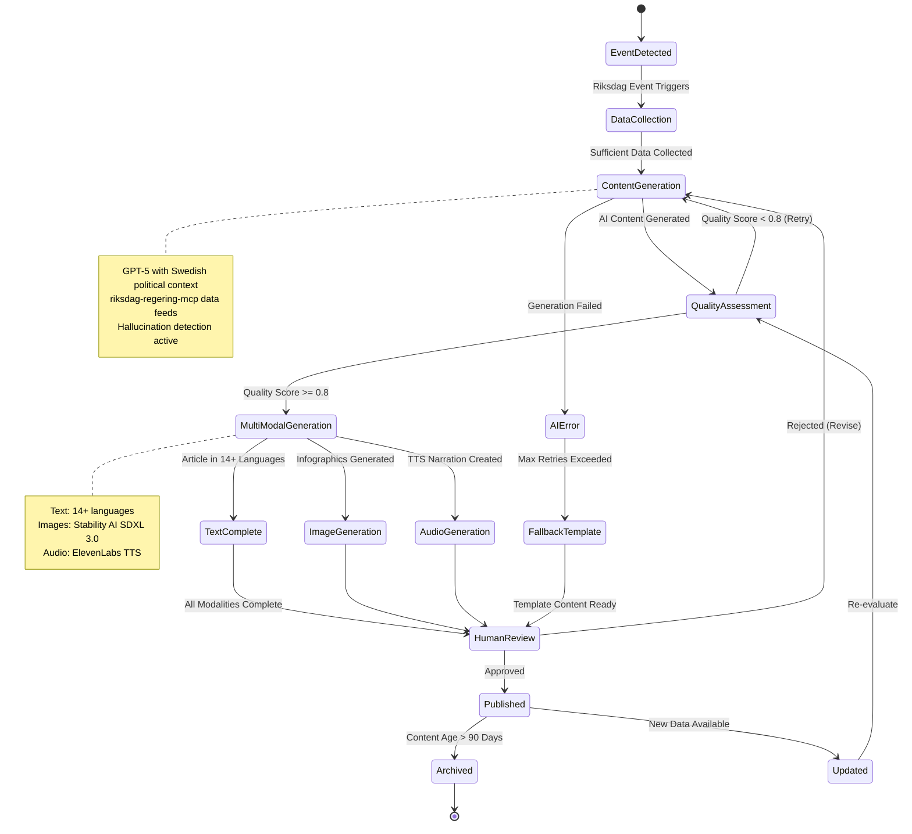
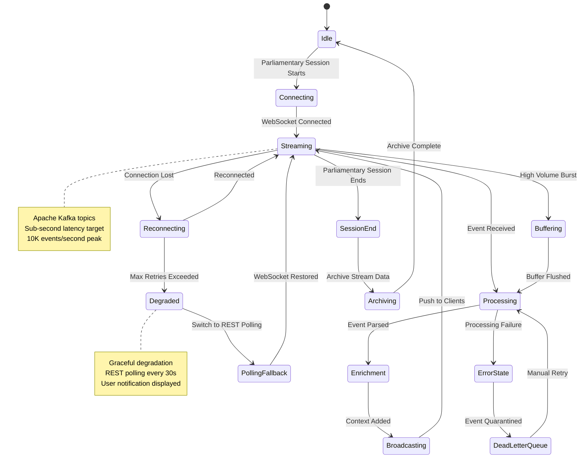
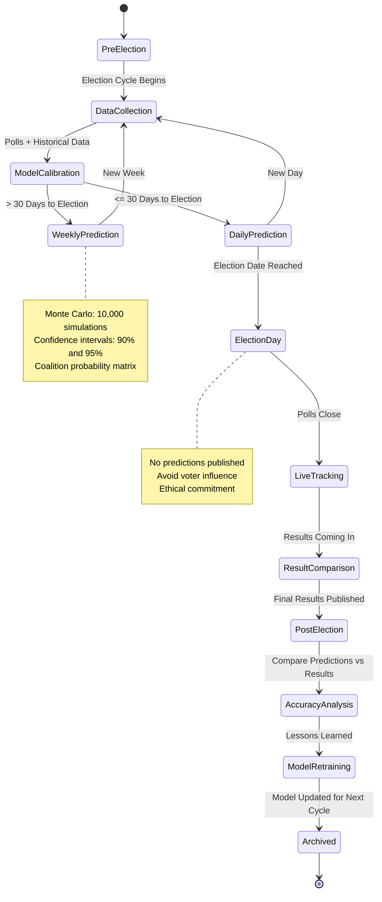
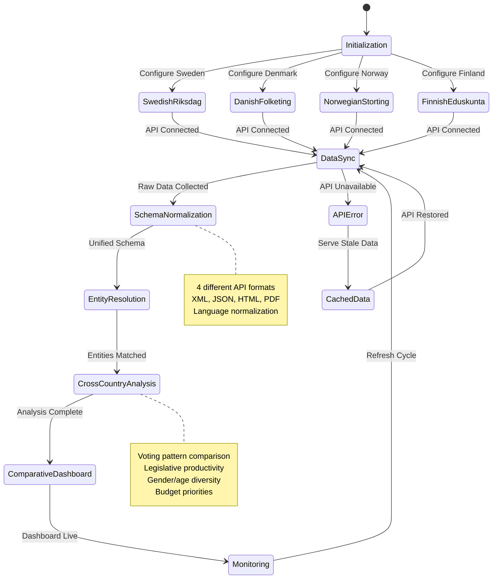

<p align="center">
  
</p>

<h1 align="center">🚀 Riksdagsmonitor — Future State Diagrams</h1>

<p align="center">
  <strong>🔮 Advanced System Behavior and State Transitions</strong><br>
  <em>🎯 AI-Driven Processes · Real-Time Streaming · Predictive Analytics</em>
</p>

<p align="center">
  <a href="#"></a>
  <a href="#"></a>
  <a href="#"></a>
  <a href="#"></a>
</p>

**📋 Document Owner:** CEO | **📄 Version:** 1.0 | **📅 Last Updated:** 2026-02-20 (UTC)  
**🔄 Review Cycle:** Quarterly | **⏰ Next Review:** 2026-05-20  
**🏢 Owner:** Hack23 AB (Org.nr 5595347807) | **🏷️ Classification:** Public

---

## 🎯 Purpose

This document outlines the future state transition models for Riksdagsmonitor over the next 3-7 years (2026-2032). Building on the current [State Diagrams](STATEDIAGRAM.md), this roadmap introduces AI-driven state management, real-time streaming states, predictive analytics lifecycle, and multi-parliament coordination states.

## 📚 Related Architecture Documentation

| Document | Focus | Description |
|----------|-------|-------------|
| **[State Diagrams](STATEDIAGRAM.md)** | 🔄 Current | Current system state transitions |
| **[Future Architecture](FUTURE_ARCHITECTURE.md)** | 🏗️ Future | System evolution roadmap |
| **[Future Flowcharts](FUTURE_FLOWCHART.md)** | 🔄 Future | Advanced process flows |
| **[Future Data Model](FUTURE_DATA_MODEL.md)** | 📊 Future | Enhanced data architecture |
| **[Future Security](FUTURE_SECURITY_ARCHITECTURE.md)** | 🛡️ Future | Security roadmap |

---

## 1. 🤖 AI Content Generation Lifecycle (2026-2028)



---

## 2. 📊 Predictive Model Lifecycle (2027-2028)

```mermaid
stateDiagram-v2
    [*] --> DataIngestion

    DataIngestion --> FeatureEngineering: Raw Data Processed
    FeatureEngineering --> ModelTraining: Features Extracted

    ModelTraining --> Validation: Training Complete
    Validation --> ShadowMode: Validation R-squared >= 0.85
    Validation --> ModelTraining: Performance Below Threshold

    ShadowMode --> ABTesting: 7-Day Shadow Period Complete
    ShadowMode --> Rollback: Shadow Performance Degraded

    ABTesting --> GradualRollout: A/B Results Positive
    ABTesting --> Rollback: A/B Results Negative

    GradualRollout --> state "5% Traffic" as T5
    T5 --> state "25% Traffic" as T25: Metrics Stable
    T25 --> state "50% Traffic" as T50: Metrics Stable
    T50 --> FullDeployment: All Metrics Green

    FullDeployment --> Monitoring: Model Live
    Monitoring --> Retraining: Performance Drift Detected
    Monitoring --> FullDeployment: Performance Stable

    Retraining --> DataIngestion: New Training Cycle

    Rollback --> FullDeployment: Revert to Previous Model

    note right of ModelTraining
        TensorFlow.js for client-side inference
        XGBoost/Random Forest for training
        50+ years historical data
    end note

    note right of ABTesting
        Statistical significance: p < 0.05
        Minimum sample: 1,000 users
        Key metric: prediction accuracy
    end note
```

---

## 3. 🌊 Real-Time Streaming States (2028+)



---

## 4. 🗳️ Election Forecast Model States (2026-2028)



---

## 5. 🌍 Multi-Parliament Coordination (2028+)



---

## 📋 Future State Summary

| # | State Model | Timeline | Key Technology | Status |
|---|-------------|----------|----------------|--------|
| 1 | AI Content Generation | 2026-2028 | GPT-5, Stability AI, ElevenLabs | 🟡 Planned |
| 2 | Predictive Model Lifecycle | 2027-2028 | TensorFlow.js, XGBoost | 🔴 Research |
| 3 | Real-Time Streaming | 2028+ | Kafka, Flink, WebSocket | 🔴 Research |
| 4 | Election Forecast | 2026-2028 | Monte Carlo, Statistical Models | 🟡 Planned |
| 5 | Multi-Parliament | 2028+ | Multi-API Integration | 🔴 Research |

---

## 📚 Related Documents

### 🏗️ Current Architecture
- [🔄 State Diagrams](STATEDIAGRAM.md) — Current state transitions
- [🏗️ Architecture](ARCHITECTURE.md) — Current system structure
- [🔄 Flowcharts](FLOWCHART.md) — Current process flows
- [📊 Data Model](DATA_MODEL.md) — Current data architecture

### 🚀 Future Architecture
- [🏗️ Future Architecture](FUTURE_ARCHITECTURE.md) — System evolution
- [🔄 Future Flowcharts](FUTURE_FLOWCHART.md) — Advanced process flows
- [📊 Future Data Model](FUTURE_DATA_MODEL.md) — Enhanced data architecture
- [🗺️ Future Mindmap](FUTURE_MINDMAP.md) — Future capability map
- [💼 Future SWOT](FUTURE_SWOT.md) — Strategic outlook
- [🛡️ Future Security](FUTURE_SECURITY_ARCHITECTURE.md) — Security roadmap

### 🛡️ ISMS Policies
- [🛠️ Secure Development Policy](https://github.com/Hack23/ISMS-PUBLIC/blob/main/Secure_Development_Policy.md)
- [🤖 AI Policy](https://github.com/Hack23/ISMS-PUBLIC/blob/main/AI_Policy.md)

---

**📋 Document Control:**  
**✅ Approved by:** James Pether Sörling, CEO  
**📤 Distribution:** Public  
**🏷️ Classification:** [](https://github.com/Hack23/ISMS-PUBLIC/blob/main/CLASSIFICATION.md#confidentiality-levels)  
**📅 Effective Date:** 2026-02-20  
**⏰ Next Review:** 2026-05-20  
**🎯 Framework Compliance:** [](https://github.com/Hack23/ISMS-PUBLIC/blob/main/CLASSIFICATION.md) [](https://github.com/Hack23/ISMS-PUBLIC/blob/main/CLASSIFICATION.md) [](https://github.com/Hack23/ISMS-PUBLIC/blob/main/CLASSIFICATION.md)
