

  

<h1 align="center">🚀 Riksdagsmonitor — Future State Diagrams</h1>

  <strong>🔮 Advanced System Behavior, Lifecycles and State Transitions</strong> 
  <em>🎯 Static-First Enrichment → AWS Serverless · AI Content Lifecycles · Predictive & Streaming States</em>

  
  
  
  

  
  
  
  
  

**📋 Document Owner:** CEO | **📄 Version:** 3.0 | **📅 Last Updated:** 2026-05-31 (UTC)  
**🔄 Review Cycle:** Quarterly | **⏰ Next Review:** 2026-08-31  
**🏢 Owner:** Hack23 AB (Org.nr 559534-7807) | **🏷️ Classification:** Public

---

## 🎯 Purpose

This document projects the **state-transition and lifecycle evolution** of Riksdagsmonitor across a ten-year horizon (2026–2037), building directly on the freshly-refreshed current-state models in [`STATEDIAGRAM.md`](STATEDIAGRAM.md). It is organised around **three horizons** so that every future state machine is anchored to a real, shipped baseline rather than speculation:

1. **🟢 v1.x baseline (today, shipped)** — the article lifecycle (analysis-gate → draft → translate → render → publish), data-sync states, and dashboard build states that already run in production on the static AWS CloudFront + multi-region S3 estate.
2. **🔵 v2.0 (2026–2027) — static, but deeper** — enriched build/publish lifecycles for **party-focused dashboards** and **OSINT/INTOP intelligence products**, including **evidence-grading** and **anomaly-detection** states, all still emitted as static artifacts. **No runtime migration.**
3. **🟣 v3.0+ (2028–2037) — AWS serverless** — AI content-generation lifecycles on **Amazon Bedrock**, the **predictive-model lifecycle** (train → validate → deploy → monitor → retrain), **real-time streaming** states (Kinesis), **election-forecast** model states, **multi-parliament coordination**, **Bedrock Knowledge Base** ingestion/refresh states, **Cognito** session/auth states and the public **API request lifecycle**.

A standing **AI/LLM Model Evolution Lifecycle (2026–2037)** state machine translates the Hack23 AI Model Evolution roadmap into state terms and threads it through all three horizons.

> **Lens of this document:** *system state transitions & lifecycles*. For the conceptual map see [`FUTURE_MINDMAP.md`](FUTURE_MINDMAP.md); for processes [`FUTURE_FLOWCHART.md`](FUTURE_FLOWCHART.md); for structure [`FUTURE_ARCHITECTURE.md`](FUTURE_ARCHITECTURE.md); for data [`FUTURE_DATA_MODEL.md`](FUTURE_DATA_MODEL.md); for strategy [`FUTURE_SWOT.md`](FUTURE_SWOT.md).

## 📚 Architecture Documentation Map

| Document | Focus | Description |
|----------|-------|-------------|
| [🏛️ Architecture](ARCHITECTURE.md) | 🏗️ C4 Models | System context, containers, components |
| [📊 Data Model](DATA_MODEL.md) | 📊 Data | Entity relationships and data dictionary |
| [🔄 Flowchart](FLOWCHART.md) | 🔄 Processes | Business and data flow diagrams |
| [📈 State Diagram](STATEDIAGRAM.md) | 📈 States | System state transitions and lifecycles |
| [🧠 Mindmap](MINDMAP.md) | 🧠 Concepts | System conceptual relationships |
| [💼 SWOT](SWOT.md) | 💼 Strategy | Strategic analysis and positioning |
| [🛡️ Security Architecture](SECURITY_ARCHITECTURE.md) | 🔒 Security | Current security controls and design |
| [🚀 Future Security](FUTURE_SECURITY_ARCHITECTURE.md) | 🔮 Security | Planned security improvements |
| [🎯 Threat Model](THREAT_MODEL.md) | 🎯 Threats | STRIDE/MITRE ATT&CK analysis |
| [🚀 Future Architecture](FUTURE_ARCHITECTURE.md) | 🔮 Evolution | Architectural evolution roadmap |
| [📊 Future Data Model](FUTURE_DATA_MODEL.md) | 🔮 Data | Enhanced data architecture plans |
| [🔄 Future Flowchart](FUTURE_FLOWCHART.md) | 🔮 Processes | Improved process workflows |
| **[📈 Future State Diagram](FUTURE_STATEDIAGRAM.md)** | **🔮 States** | **Advanced state management (this document)** |
| [🧠 Future Mindmap](FUTURE_MINDMAP.md) | 🔮 Concepts | Capability expansion plans |
| [💼 Future SWOT](FUTURE_SWOT.md) | 🔮 Strategy | Future strategic opportunities |

---

## 📑 Table of Contents

- [Executive Summary](#-executive-summary)
- **Horizon 1 — v1.x baseline (shipped)**
  - [1. Article Lifecycle (analysis-gate → publish)](#1--horizon-1-article-lifecycle-analysis-gate--publish)
  - [2. Data-Sync Lifecycle](#2--horizon-1-data-sync-lifecycle)
  - [3. Dashboard Build Lifecycle](#3--horizon-1-dashboard-build-lifecycle)
- **Horizon 2 — v2.0 static enrichment (2026–2027)**
  - [4. Party-Dashboard Build & Publish Lifecycle](#4--horizon-2-party-dashboard-build--publish-lifecycle)
  - [5. Evidence-Grading State Machine](#5--horizon-2-evidence-grading-state-machine)
  - [6. Anomaly-Detection State Machine](#6--horizon-2-anomaly-detection-state-machine)
  - [7. OSINT / INTOP Scorecard Lifecycle](#7--horizon-2-osint--intop-scorecard-lifecycle)
- **Horizon 3 — v3.0+ AWS serverless (2028–2037)**
  - [8. Bedrock AI Content-Generation Lifecycle](#8--horizon-3-bedrock-ai-content-generation-lifecycle)
  - [9. Predictive-Model Lifecycle (train → retrain)](#9--horizon-3-predictive-model-lifecycle-train--retrain)
  - [10. Real-Time Streaming States (Kinesis)](#10--horizon-3-real-time-streaming-states-kinesis)
  - [11. Election-Forecast Model States](#11--horizon-3-election-forecast-model-states)
  - [12. Multi-Parliament Coordination States](#12--horizon-3-multi-parliament-coordination-states)
  - [13. Bedrock Knowledge Base Ingestion / Refresh States](#13--horizon-3-bedrock-knowledge-base-ingestion--refresh-states)
  - [14. Cognito Session / Auth States](#14--horizon-3-cognito-session--auth-states)
  - [15. API Request Lifecycle (API Gateway → Lambda)](#15--horizon-3-api-request-lifecycle-api-gateway--lambda)
- **Cross-Horizon**
  - [16. AI/LLM Model Evolution Lifecycle (2026–2037)](#16--aillm-model-evolution-lifecycle-20262037)
  - [17. IMF Cache → Aurora Lifecycle Evolution](#17--imf-cache--aurora-lifecycle-evolution)
- [Future State Summary](#-future-state-summary)
- [ISMS Control Mapping](#-isms-control-mapping)
- [Document Control](#-document-control)
- [Hack23 Ecosystem](#-hack23-ecosystem)

---

## 📋 Executive Summary

Riksdagsmonitor's behavioural future is a **deliberate two-step**: first deepen the *static* platform (v2.0) without changing its operational substrate, then migrate the *runtime* to **AWS serverless** (v3.0+) once the intelligence products justify managed AI and live APIs. This document models that journey purely in **state-machine terms** so engineers, auditors and stakeholders can reason about *what states an entity can occupy, what guards each transition, and what invariants hold at every horizon*.

| Horizon | Window | Substrate | New lifecycle emphasis | Status |
|---------|--------|-----------|------------------------|--------|
| 🟢 **v1.x** | Shipped | Static HTML/CSS · CloudFront + S3 (us-east-1 / eu-west-1) · GitHub Pages DR | Article, data-sync, dashboard build | ✅ Active |
| 🔵 **v2.0** | 2026–2027 | **Same static substrate** | Party dashboards, evidence-grading, anomaly detection, OSINT/INTOP scorecards | 🟡 Planned |
| 🟣 **v3.0+** | 2028–2037 | **AWS serverless** (Lambda · Bedrock · API Gateway · Cognito · Kinesis · DynamoDB · Aurora SvL2 · Neptune · OpenSearch · Timestream · Step Functions) | AI content, predictive models, streaming, forecasts, multi-parliament, KB refresh, auth, API | 🔴 Research → 🟡 Planned |

**Invariants that hold across all horizons:** public-data-only collection; political opinions processed under **GDPR Art. 9(2)(e)** (manifestly made public) and **9(2)(g)** (substantial public interest); strict party neutrality; no surveillance/psyops framing; immutable, audit-preserved provenance; human-in-the-loop governance per the [Hack23 AI Policy](https://github.com/Hack23/ISMS-PUBLIC/blob/main/AI_Policy.md).

---

# 🟢 Horizon 1 — v1.x Baseline States (Shipped)

These machines reflect what runs **today**. They are reproduced here (refreshed, not invented) so each future horizon visibly extends a real baseline. The authoritative current models live in [`STATEDIAGRAM.md`](STATEDIAGRAM.md).

## 1. 📰 Horizon 1: Article Lifecycle (analysis-gate → publish)

The autonomous newsroom (14 gh-aw agentic workflows, Claude Opus 4.8 authoring / Sonnet 4.6 translation, **zero human editors**) drives every article through a blocking **analysis gate** before any prose exists.

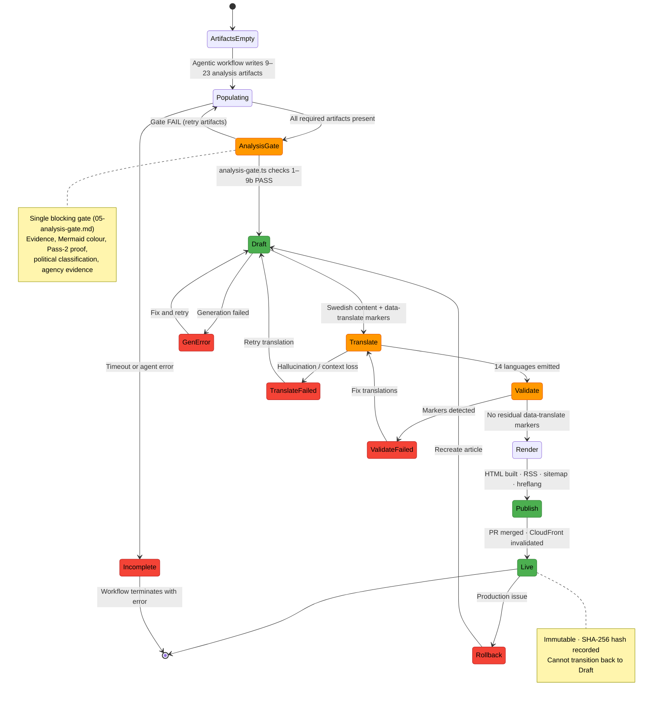
```mermaid
stateDiagram-v2
    [*] --> ArtifactsEmpty

    ArtifactsEmpty --> Populating: Agentic workflow writes 9–23 analysis artifacts
    Populating --> AnalysisGate: All required artifacts present
    Populating --> Incomplete: Timeout or agent error

    AnalysisGate --> Draft: analysis-gate.ts checks 1–9b PASS
    AnalysisGate --> Populating: Gate FAIL (retry artifacts)

    Draft --> Translate: Swedish content + data-translate markers
    Draft --> GenError: Generation failed

    Translate --> Validate: 14 languages emitted
    Translate --> TranslateFailed: Hallucination / context loss

    Validate --> Render: No residual data-translate markers
    Validate --> ValidateFailed: Markers detected

    Render --> Publish: HTML built · RSS · sitemap · hreflang
    Publish --> Live: PR merged · CloudFront invalidated
    Live --> [*]

    Incomplete --> [*]: Workflow terminates with error
    GenError --> Draft: Fix and retry
    TranslateFailed --> Draft: Retry translation
    ValidateFailed --> Translate: Fix translations
    Live --> Rollback: Production issue
    Rollback --> Draft: Recreate article

    note right of AnalysisGate
        Single blocking gate (05-analysis-gate.md)
        Evidence, Mermaid colour, Pass-2 proof,
        political classification, agency evidence
    end note

    note right of Live
        Immutable · SHA-256 hash recorded
        Cannot transition back to Draft
    end note

    classDef ok fill:#4caf50,stroke:#2e7d32,color:#000000
    classDef warn fill:#ff9800,stroke:#e65100,color:#000000
    classDef err fill:#f44336,stroke:#b71c1c,color:#000000
    class Draft,Live,Publish ok
    class AnalysisGate,Validate,Translate warn
    class GenError,TranslateFailed,ValidateFailed,Incomplete,Rollback err
```

## 2. 🔄 Horizon 1: Data-Sync Lifecycle

Open-data ingestion from the Riksdagen API, Regeringen (via g0v.se), SCB, IMF, World Bank and the **CIA platform** (Hack23) JSON/CSV exports — 349 current MPs, 2,494 historical politicians (1971–2024), 3.5M+ votes, 109,000+ documents.

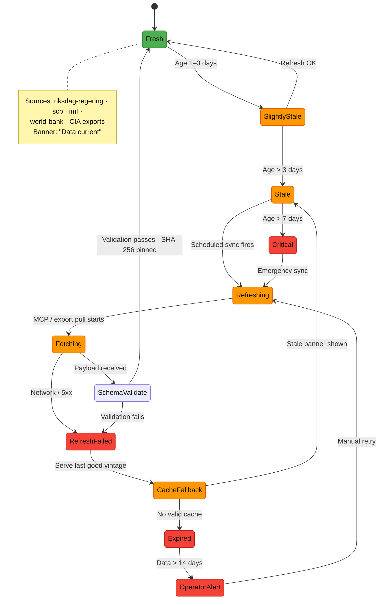
```mermaid
stateDiagram-v2
    [*] --> Fresh

    Fresh --> SlightlyStale: Age 1–3 days
    SlightlyStale --> Fresh: Refresh OK
    SlightlyStale --> Stale: Age > 3 days

    Stale --> Refreshing: Scheduled sync fires
    Stale --> Critical: Age > 7 days
    Critical --> Refreshing: Emergency sync

    Refreshing --> Fetching: MCP / export pull starts
    Fetching --> SchemaValidate: Payload received
    Fetching --> RefreshFailed: Network / 5xx

    SchemaValidate --> Fresh: Validation passes · SHA-256 pinned
    SchemaValidate --> RefreshFailed: Validation fails

    RefreshFailed --> CacheFallback: Serve last good vintage
    CacheFallback --> Stale: Stale banner shown
    CacheFallback --> Expired: No valid cache

    Expired --> OperatorAlert: Data > 14 days
    OperatorAlert --> Refreshing: Manual retry

    note right of Fresh
        Sources: riksdag-regering · scb · imf ·
        world-bank · CIA exports
        Banner: "Data current"
    end note

    classDef ok fill:#4caf50,stroke:#2e7d32,color:#000000
    classDef warn fill:#ff9800,stroke:#e65100,color:#000000
    classDef err fill:#f44336,stroke:#b71c1c,color:#000000
    class Fresh ok
    class SlightlyStale,Stale,Refreshing,Fetching,CacheFallback warn
    class Critical,RefreshFailed,Expired,OperatorAlert err
```

## 3. 📊 Horizon 1: Dashboard Build Lifecycle

~11 functional dashboards (party, ministry, anomaly-detection, seasonal-patterns, pre-election, politician, …) are **lazy-loaded TypeScript modules** (Chart.js / D3.js) compiled by Vite and shipped as static assets — **no JS frameworks for content**.

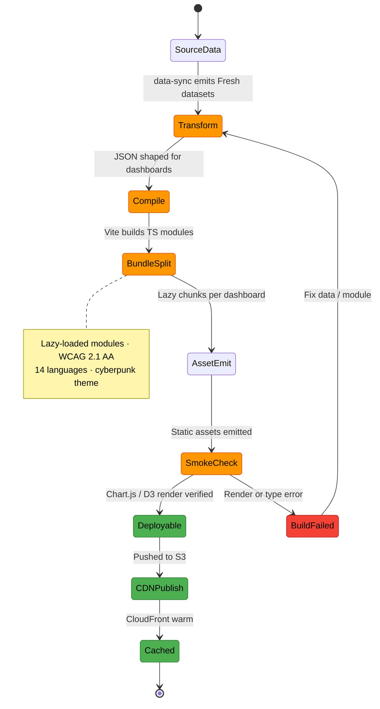
```mermaid
stateDiagram-v2
    [*] --> SourceData

    SourceData --> Transform: data-sync emits Fresh datasets
    Transform --> Compile: JSON shaped for dashboards
    Compile --> BundleSplit: Vite builds TS modules
    BundleSplit --> AssetEmit: Lazy chunks per dashboard

    AssetEmit --> SmokeCheck: Static assets emitted
    SmokeCheck --> Deployable: Chart.js / D3 render verified
    SmokeCheck --> BuildFailed: Render or type error

    Deployable --> CDNPublish: Pushed to S3
    CDNPublish --> Cached: CloudFront warm
    Cached --> [*]

    BuildFailed --> Transform: Fix data / module

    note right of BundleSplit
        Lazy-loaded modules · WCAG 2.1 AA
        14 languages · cyberpunk theme
    end note

    classDef ok fill:#4caf50,stroke:#2e7d32,color:#000000
    classDef warn fill:#ff9800,stroke:#e65100,color:#000000
    classDef err fill:#f44336,stroke:#b71c1c,color:#000000
    class Deployable,Cached,CDNPublish ok
    class Transform,Compile,BundleSplit,SmokeCheck warn
    class BuildFailed err
```

---

# 🔵 Horizon 2 — v2.0 Static Enrichment (2026–2027)

**Strategic guardrail: the substrate does not change.** Every state machine below still terminates in a **static artifact** published to CloudFront + S3. What deepens is the *intelligence quality* of the build pipeline — party analytics, graded evidence and anomaly detection — driven by the agentic newsroom.

## 4. 🏛️ Horizon 2: Party-Dashboard Build & Publish Lifecycle

Better dashboards covering the political landscape **with a focus on parties**: party cohesion, coalition dynamics, bloc alignment, party-vs-party comparison and agenda tracking.

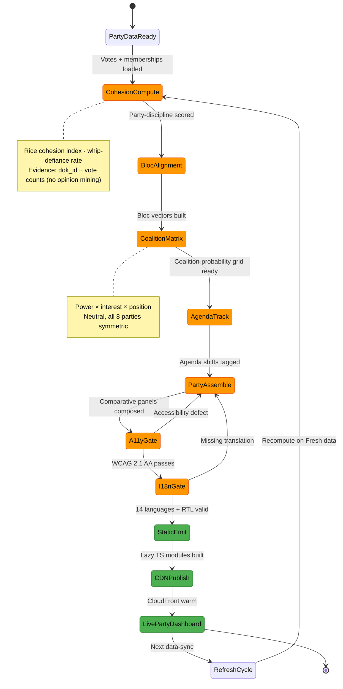
```mermaid
stateDiagram-v2
    [*] --> PartyDataReady

    PartyDataReady --> CohesionCompute: Votes + memberships loaded
    CohesionCompute --> BlocAlignment: Party-discipline scored
    BlocAlignment --> CoalitionMatrix: Bloc vectors built
    CoalitionMatrix --> AgendaTrack: Coalition-probability grid ready

    AgendaTrack --> PartyAssemble: Agenda shifts tagged
    PartyAssemble --> A11yGate: Comparative panels composed

    A11yGate --> I18nGate: WCAG 2.1 AA passes
    A11yGate --> PartyAssemble: Accessibility defect

    I18nGate --> StaticEmit: 14 languages + RTL valid
    I18nGate --> PartyAssemble: Missing translation

    StaticEmit --> CDNPublish: Lazy TS modules built
    CDNPublish --> LivePartyDashboard: CloudFront warm
    LivePartyDashboard --> RefreshCycle: Next data-sync
    RefreshCycle --> CohesionCompute: Recompute on Fresh data
    LivePartyDashboard --> [*]

    note right of CohesionCompute
        Rice cohesion index · whip-defiance rate
        Evidence: dok_id + vote counts (no opinion mining)
    end note

    note right of CoalitionMatrix
        Power × interest × position
        Neutral, all 8 parties symmetric
    end note

    classDef ok fill:#4caf50,stroke:#2e7d32,color:#000000
    classDef warn fill:#ff9800,stroke:#e65100,color:#000000
    classDef err fill:#f44336,stroke:#b71c1c,color:#000000
    class LivePartyDashboard,CDNPublish,StaticEmit ok
    class CohesionCompute,BlocAlignment,CoalitionMatrix,AgendaTrack,PartyAssemble,A11yGate,I18nGate warn
```

## 5. 🏅 Horizon 2: Evidence-Grading State Machine

Every claim emitted by an OSINT product carries a **source grade**. This lifecycle promotes or demotes evidence before it can appear in a published artifact — the state-machine encoding of the [`05-analysis-gate.md`](.github/prompts/05-analysis-gate.md) evidence checks.

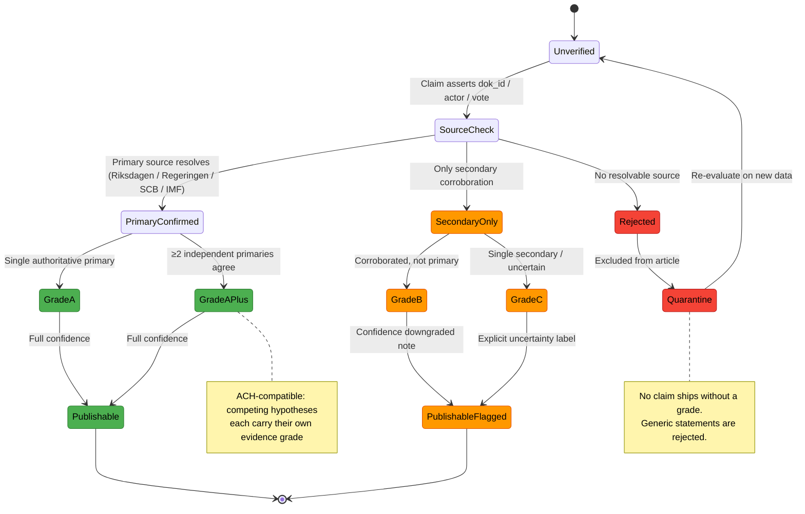
```mermaid
stateDiagram-v2
    [*] --> Unverified

    Unverified --> SourceCheck: Claim asserts dok_id / actor / vote
    SourceCheck --> PrimaryConfirmed: Primary source resolves (Riksdagen / Regeringen / SCB / IMF)
    SourceCheck --> SecondaryOnly: Only secondary corroboration
    SourceCheck --> Rejected: No resolvable source

    PrimaryConfirmed --> GradeA: Single authoritative primary
    PrimaryConfirmed --> GradeAPlus: ≥2 independent primaries agree
    SecondaryOnly --> GradeB: Corroborated, not primary
    SecondaryOnly --> GradeC: Single secondary / uncertain

    GradeAPlus --> Publishable: Full confidence
    GradeA --> Publishable: Full confidence
    GradeB --> PublishableFlagged: Confidence downgraded note
    GradeC --> PublishableFlagged: Explicit uncertainty label
    Rejected --> Quarantine: Excluded from article

    Publishable --> [*]
    PublishableFlagged --> [*]
    Quarantine --> Unverified: Re-evaluate on new data

    note right of GradeAPlus
        ACH-compatible: competing hypotheses
        each carry their own evidence grade
    end note

    note right of Quarantine
        No claim ships without a grade.
        Generic statements are rejected.
    end note

    classDef ok fill:#4caf50,stroke:#2e7d32,color:#000000
    classDef warn fill:#ff9800,stroke:#e65100,color:#000000
    classDef err fill:#f44336,stroke:#b71c1c,color:#000000
    class GradeAPlus,GradeA,Publishable ok
    class SecondaryOnly,GradeB,GradeC,PublishableFlagged warn
    class Rejected,Quarantine err
```

## 6. 🔎 Horizon 2: Anomaly-Detection State Machine

The anomaly-detection dashboard flags statistically unusual voting, attendance or spending patterns — surfaced as **signals**, never accusations, and always traced to public records.

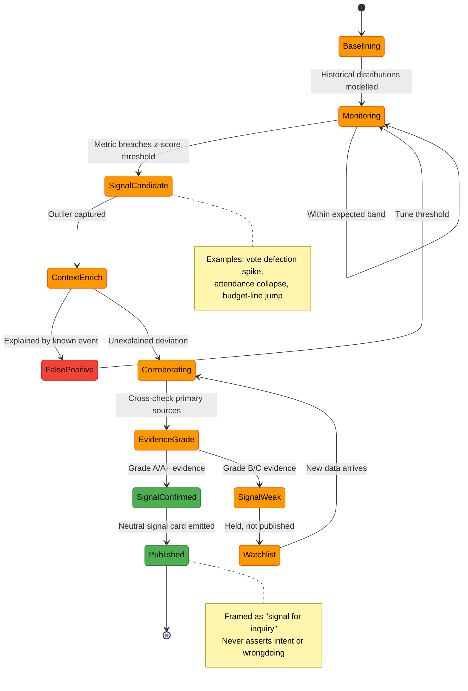
```mermaid
stateDiagram-v2
    [*] --> Baselining

    Baselining --> Monitoring: Historical distributions modelled
    Monitoring --> SignalCandidate: Metric breaches z-score threshold
    Monitoring --> Monitoring: Within expected band

    SignalCandidate --> ContextEnrich: Outlier captured
    ContextEnrich --> FalsePositive: Explained by known event
    ContextEnrich --> Corroborating: Unexplained deviation

    FalsePositive --> Monitoring: Tune threshold

    Corroborating --> EvidenceGrade: Cross-check primary sources
    EvidenceGrade --> SignalConfirmed: Grade A/A+ evidence
    EvidenceGrade --> SignalWeak: Grade B/C evidence

    SignalConfirmed --> Published: Neutral signal card emitted
    SignalWeak --> Watchlist: Held, not published
    Watchlist --> Corroborating: New data arrives

    Published --> [*]

    note right of SignalCandidate
        Examples: vote defection spike,
        attendance collapse, budget-line jump
    end note

    note right of Published
        Framed as "signal for inquiry"
        Never asserts intent or wrongdoing
    end note

    classDef ok fill:#4caf50,stroke:#2e7d32,color:#000000
    classDef warn fill:#ff9800,stroke:#e65100,color:#000000
    classDef err fill:#f44336,stroke:#b71c1c,color:#000000
    class SignalConfirmed,Published ok
    class Baselining,Monitoring,SignalCandidate,ContextEnrich,Corroborating,EvidenceGrade,SignalWeak,Watchlist warn
    class FalsePositive err
```

## 7. 🕵️ Horizon 2: OSINT / INTOP Scorecard Lifecycle

INTOP scorecards (attendance, voting discipline, productivity, committee contribution) and network/temporal/geospatial OSINT products, advancing political-intelligence quality while staying static.

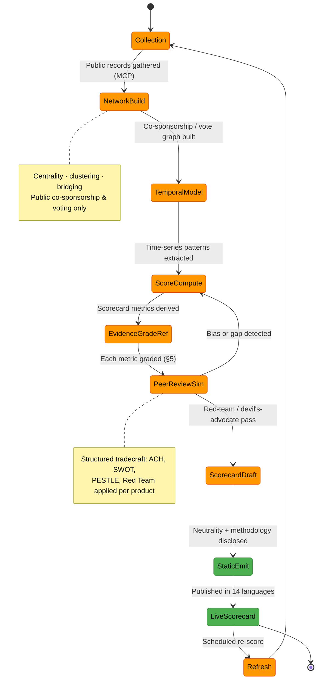
```mermaid
stateDiagram-v2
    [*] --> Collection

    Collection --> NetworkBuild: Public records gathered (MCP)
    NetworkBuild --> TemporalModel: Co-sponsorship / vote graph built
    TemporalModel --> ScoreCompute: Time-series patterns extracted
    ScoreCompute --> EvidenceGradeRef: Scorecard metrics derived

    EvidenceGradeRef --> PeerReviewSim: Each metric graded (§5)
    PeerReviewSim --> ScorecardDraft: Red-team / devil's-advocate pass
    PeerReviewSim --> ScoreCompute: Bias or gap detected

    ScorecardDraft --> StaticEmit: Neutrality + methodology disclosed
    StaticEmit --> LiveScorecard: Published in 14 languages
    LiveScorecard --> Refresh: Scheduled re-score
    Refresh --> Collection
    LiveScorecard --> [*]

    note right of NetworkBuild
        Centrality · clustering · bridging
        Public co-sponsorship & voting only
    end note

    note right of PeerReviewSim
        Structured tradecraft: ACH, SWOT,
        PESTLE, Red Team applied per product
    end note

    classDef ok fill:#4caf50,stroke:#2e7d32,color:#000000
    classDef warn fill:#ff9800,stroke:#e65100,color:#000000
    class LiveScorecard,StaticEmit ok
    class Collection,NetworkBuild,TemporalModel,ScoreCompute,EvidenceGradeRef,PeerReviewSim,ScorecardDraft,Refresh warn
```

---

# 🟣 Horizon 3 — v3.0+ AWS Serverless (2028–2037)

The strategic migration: **all-in AWS serverless**, zero infrastructure to manage — no Kubernetes, no containers — managed AI + serverless only, AWS Well-Architected, multi-region. The state machines below model the *new runtime behaviours* this substrate unlocks.

## 8. 🤖 Horizon 3: Bedrock AI Content-Generation Lifecycle

Article generation moves from build-time gh-aw workflows into **Amazon Bedrock** foundation models and **Bedrock Agents**, orchestrated by **Step Functions** and grounded by **Bedrock Knowledge Bases** (RAG over the political corpus).

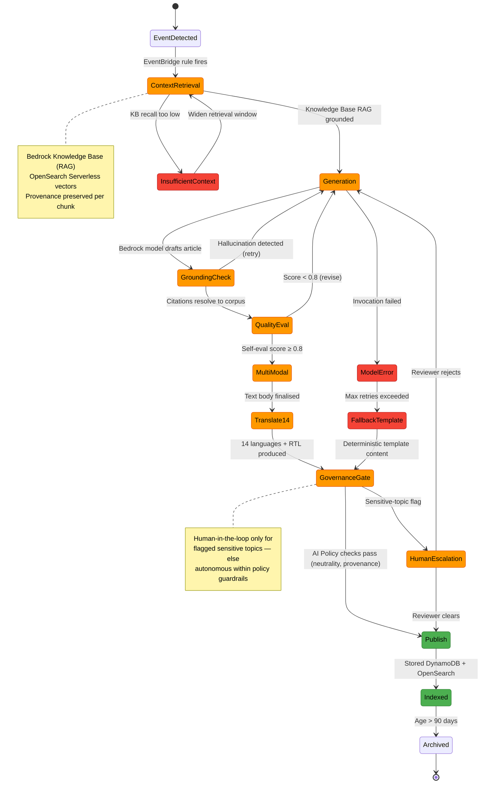
```mermaid
stateDiagram-v2
    [*] --> EventDetected

    EventDetected --> ContextRetrieval: EventBridge rule fires
    ContextRetrieval --> Generation: Knowledge Base RAG grounded
    ContextRetrieval --> InsufficientContext: KB recall too low

    InsufficientContext --> ContextRetrieval: Widen retrieval window

    Generation --> GroundingCheck: Bedrock model drafts article
    Generation --> ModelError: Invocation failed

    GroundingCheck --> QualityEval: Citations resolve to corpus
    GroundingCheck --> Generation: Hallucination detected (retry)

    QualityEval --> MultiModal: Self-eval score ≥ 0.8
    QualityEval --> Generation: Score < 0.8 (revise)

    MultiModal --> Translate14: Text body finalised
    Translate14 --> GovernanceGate: 14 languages + RTL produced

    GovernanceGate --> Publish: AI Policy checks pass (neutrality, provenance)
    GovernanceGate --> HumanEscalation: Sensitive-topic flag

    HumanEscalation --> Publish: Reviewer clears
    HumanEscalation --> Generation: Reviewer rejects

    Publish --> Indexed: Stored DynamoDB + OpenSearch
    Indexed --> Archived: Age > 90 days
    Archived --> [*]

    ModelError --> FallbackTemplate: Max retries exceeded
    FallbackTemplate --> GovernanceGate: Deterministic template content

    note right of ContextRetrieval
        Bedrock Knowledge Base (RAG)
        OpenSearch Serverless vectors
        Provenance preserved per chunk
    end note

    note right of GovernanceGate
        Human-in-the-loop only for
        flagged sensitive topics — else
        autonomous within policy guardrails
    end note

    classDef ok fill:#4caf50,stroke:#2e7d32,color:#000000
    classDef warn fill:#ff9800,stroke:#e65100,color:#000000
    classDef err fill:#f44336,stroke:#b71c1c,color:#000000
    class Publish,Indexed ok
    class ContextRetrieval,Generation,GroundingCheck,QualityEval,MultiModal,Translate14,GovernanceGate,HumanEscalation warn
    class ModelError,InsufficientContext,FallbackTemplate err
```

## 9. 📈 Horizon 3: Predictive-Model Lifecycle (train → retrain)

Forecasting models (vote prediction, coalition probability) run a disciplined MLOps lifecycle on serverless training and **Bedrock**/SageMaker-class inference, with shadow and canary gates before any public exposure.

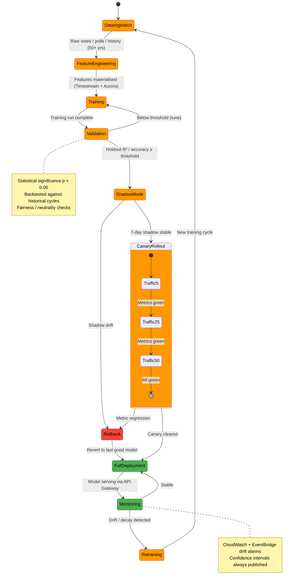
```mermaid
stateDiagram-v2
    [*] --> DataIngestion

    DataIngestion --> FeatureEngineering: Raw votes / polls / history (50+ yrs)
    FeatureEngineering --> Training: Features materialised (Timestream + Aurora)
    Training --> Validation: Training run complete

    Validation --> ShadowMode: Holdout R² / accuracy ≥ threshold
    Validation --> Training: Below threshold (tune)

    ShadowMode --> CanaryRollout: 7-day shadow stable
    ShadowMode --> Rollback: Shadow drift

    state CanaryRollout {
        [*] --> Traffic5
        Traffic5 --> Traffic25: Metrics green
        Traffic25 --> Traffic50: Metrics green
        Traffic50 --> [*]: All green
    }

    CanaryRollout --> FullDeployment: Canary cleared
    CanaryRollout --> Rollback: Metric regression

    FullDeployment --> Monitoring: Model serving via API Gateway
    Monitoring --> Retraining: Drift / decay detected
    Monitoring --> FullDeployment: Stable
    Retraining --> DataIngestion: New training cycle

    Rollback --> FullDeployment: Revert to last good model

    note right of Validation
        Statistical significance p < 0.05
        Backtested against historical cycles
        Fairness / neutrality checks
    end note

    note right of Monitoring
        CloudWatch + EventBridge drift alarms
        Confidence intervals always published
    end note

    classDef ok fill:#4caf50,stroke:#2e7d32,color:#000000
    classDef warn fill:#ff9800,stroke:#e65100,color:#000000
    classDef err fill:#f44336,stroke:#b71c1c,color:#000000
    class FullDeployment,Monitoring ok
    class DataIngestion,FeatureEngineering,Training,Validation,ShadowMode,CanaryRollout,Retraining warn
    class Rollback err
```

## 10. 🌊 Horizon 3: Real-Time Streaming States (Kinesis)

Live parliamentary sessions stream through **Amazon Kinesis Data Streams**, enriched by Lambda and broadcast to API consumers — replacing the build-time batch model with sub-second push.

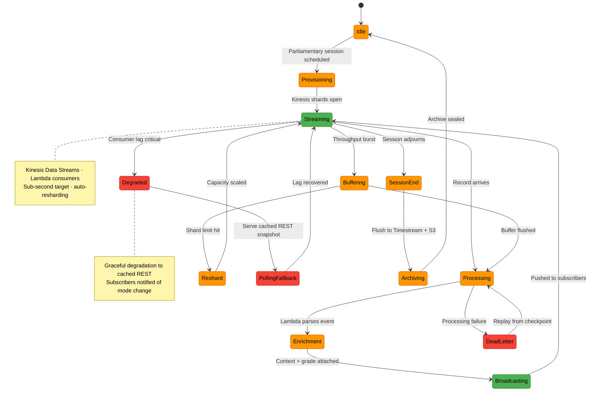
```mermaid
stateDiagram-v2
    [*] --> Idle

    Idle --> Provisioning: Parliamentary session scheduled
    Provisioning --> Streaming: Kinesis shards open

    Streaming --> Processing: Record arrives
    Processing --> Enrichment: Lambda parses event
    Enrichment --> Broadcasting: Context + grade attached
    Broadcasting --> Streaming: Pushed to subscribers

    Streaming --> Buffering: Throughput burst
    Buffering --> Reshard: Shard limit hit
    Reshard --> Streaming: Capacity scaled
    Buffering --> Processing: Buffer flushed

    Processing --> DeadLetter: Processing failure
    DeadLetter --> Processing: Replay from checkpoint

    Streaming --> Degraded: Consumer lag critical
    Degraded --> PollingFallback: Serve cached REST snapshot
    PollingFallback --> Streaming: Lag recovered

    Streaming --> SessionEnd: Session adjourns
    SessionEnd --> Archiving: Flush to Timestream + S3
    Archiving --> Idle: Archive sealed

    note right of Streaming
        Kinesis Data Streams · Lambda consumers
        Sub-second target · auto-resharding
    end note

    note right of Degraded
        Graceful degradation to cached REST
        Subscribers notified of mode change
    end note

    classDef ok fill:#4caf50,stroke:#2e7d32,color:#000000
    classDef warn fill:#ff9800,stroke:#e65100,color:#000000
    classDef err fill:#f44336,stroke:#b71c1c,color:#000000
    class Streaming,Broadcasting ok
    class Idle,Provisioning,Processing,Enrichment,Buffering,Reshard,SessionEnd,Archiving warn
    class DeadLetter,Degraded,PollingFallback err
```

## 11. 🗳️ Horizon 3: Election-Forecast Model States

Election forecasting runs a cycle-aware state machine with an **ethical blackout** on election day — predictions are never published while polls are open.

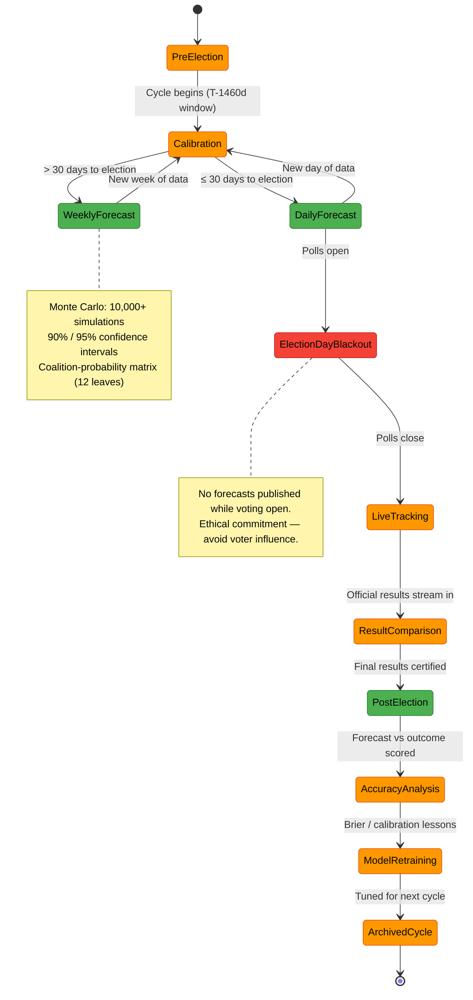
```mermaid
stateDiagram-v2
    [*] --> PreElection

    PreElection --> Calibration: Cycle begins (T-1460d window)
    Calibration --> WeeklyForecast: > 30 days to election
    Calibration --> DailyForecast: ≤ 30 days to election

    WeeklyForecast --> Calibration: New week of data
    DailyForecast --> Calibration: New day of data

    DailyForecast --> ElectionDayBlackout: Polls open
    ElectionDayBlackout --> LiveTracking: Polls close
    LiveTracking --> ResultComparison: Official results stream in
    ResultComparison --> PostElection: Final results certified

    PostElection --> AccuracyAnalysis: Forecast vs outcome scored
    AccuracyAnalysis --> ModelRetraining: Brier / calibration lessons
    ModelRetraining --> ArchivedCycle: Tuned for next cycle
    ArchivedCycle --> [*]

    note right of WeeklyForecast
        Monte Carlo: 10,000+ simulations
        90% / 95% confidence intervals
        Coalition-probability matrix (12 leaves)
    end note

    note right of ElectionDayBlackout
        No forecasts published while voting open.
        Ethical commitment — avoid voter influence.
    end note

    classDef ok fill:#4caf50,stroke:#2e7d32,color:#000000
    classDef warn fill:#ff9800,stroke:#e65100,color:#000000
    classDef err fill:#f44336,stroke:#b71c1c,color:#000000
    class WeeklyForecast,DailyForecast,PostElection ok
    class PreElection,Calibration,LiveTracking,ResultComparison,AccuracyAnalysis,ModelRetraining,ArchivedCycle warn
    class ElectionDayBlackout err
```

## 12. 🌍 Horizon 3: Multi-Parliament Coordination States

Federated expansion to Nordic and EU parliaments (Folketing, Storting, Eduskunta, European Parliament) coordinated via **Step Functions**, reusing the [European Parliament MCP](https://github.com/Hack23/european-parliament-mcp).

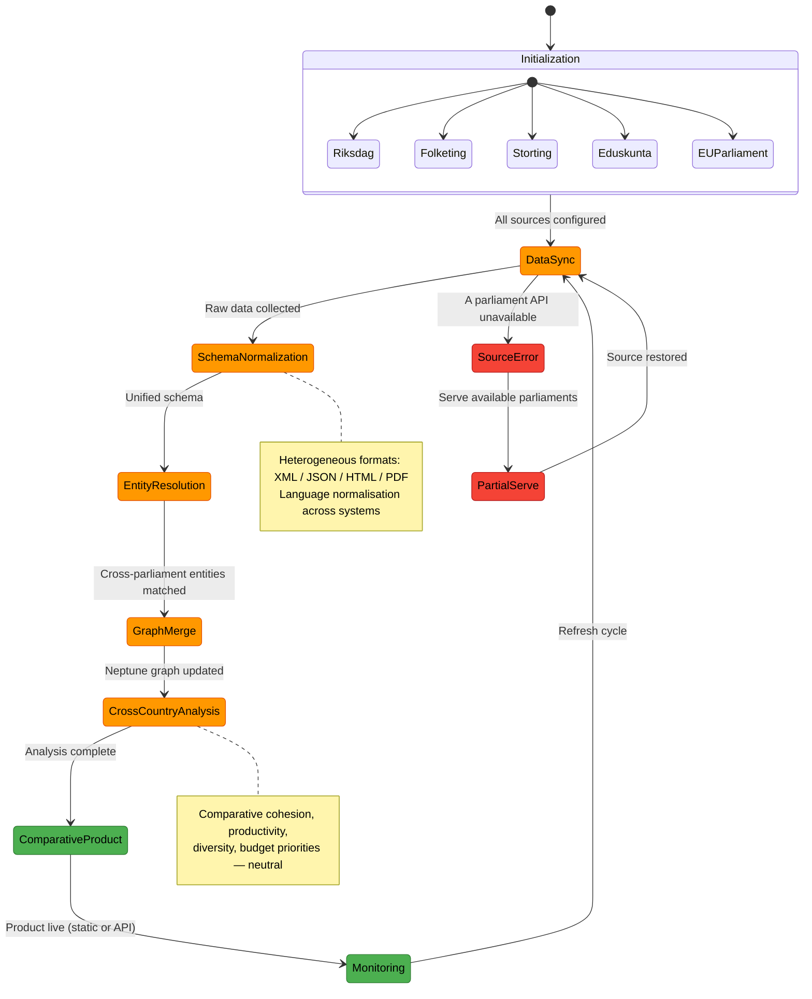
```mermaid
stateDiagram-v2
    [*] --> Initialization

    state Initialization {
        [*] --> Riksdag
        [*] --> Folketing
        [*] --> Storting
        [*] --> Eduskunta
        [*] --> EUParliament
    }

    Initialization --> DataSync: All sources configured
    DataSync --> SchemaNormalization: Raw data collected
    SchemaNormalization --> EntityResolution: Unified schema
    EntityResolution --> GraphMerge: Cross-parliament entities matched
    GraphMerge --> CrossCountryAnalysis: Neptune graph updated

    CrossCountryAnalysis --> ComparativeProduct: Analysis complete
    ComparativeProduct --> Monitoring: Product live (static or API)
    Monitoring --> DataSync: Refresh cycle

    DataSync --> SourceError: A parliament API unavailable
    SourceError --> PartialServe: Serve available parliaments
    PartialServe --> DataSync: Source restored

    note right of SchemaNormalization
        Heterogeneous formats: XML / JSON / HTML / PDF
        Language normalisation across systems
    end note

    note right of CrossCountryAnalysis
        Comparative cohesion, productivity,
        diversity, budget priorities — neutral
    end note

    classDef ok fill:#4caf50,stroke:#2e7d32,color:#000000
    classDef warn fill:#ff9800,stroke:#e65100,color:#000000
    classDef err fill:#f44336,stroke:#b71c1c,color:#000000
    class ComparativeProduct,Monitoring ok
    class DataSync,SchemaNormalization,EntityResolution,GraphMerge,CrossCountryAnalysis warn
    class SourceError,PartialServe err
```

## 13. 📚 Horizon 3: Bedrock Knowledge Base Ingestion / Refresh States

The **Bedrock Knowledge Base** is the RAG memory of the platform. Its corpus (109,000+ documents and growing) must ingest, embed, version and refresh while preserving provenance for every chunk.

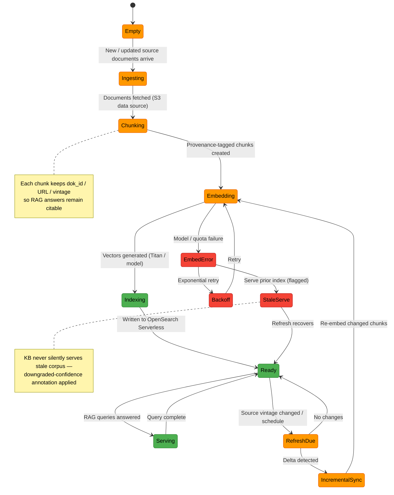
```mermaid
stateDiagram-v2
    [*] --> Empty

    Empty --> Ingesting: New / updated source documents arrive
    Ingesting --> Chunking: Documents fetched (S3 data source)
    Chunking --> Embedding: Provenance-tagged chunks created
    Embedding --> Indexing: Vectors generated (Titan / model)
    Indexing --> Ready: Written to OpenSearch Serverless

    Ready --> Serving: RAG queries answered
    Serving --> Ready: Query complete

    Ready --> RefreshDue: Source vintage changed / schedule
    RefreshDue --> IncrementalSync: Delta detected
    IncrementalSync --> Embedding: Re-embed changed chunks
    RefreshDue --> Ready: No changes

    Embedding --> EmbedError: Model / quota failure
    EmbedError --> Backoff: Exponential retry
    Backoff --> Embedding: Retry
    EmbedError --> StaleServe: Serve prior index (flagged)
    StaleServe --> Ready: Refresh recovers

    note right of Chunking
        Each chunk keeps dok_id / URL / vintage
        so RAG answers remain citable
    end note

    note right of StaleServe
        KB never silently serves stale corpus —
        downgraded-confidence annotation applied
    end note

    classDef ok fill:#4caf50,stroke:#2e7d32,color:#000000
    classDef warn fill:#ff9800,stroke:#e65100,color:#000000
    classDef err fill:#f44336,stroke:#b71c1c,color:#000000
    class Ready,Serving,Indexing ok
    class Empty,Ingesting,Chunking,Embedding,RefreshDue,IncrementalSync warn
    class EmbedError,Backoff,StaleServe err
```

## 14. 🔐 Horizon 3: Cognito Session / Auth States

**Amazon Cognito** provides identity for personalization and API consumers. Auth remains *optional* — the public intelligence corpus stays open; only personalization and rate-tiered API access require a session.

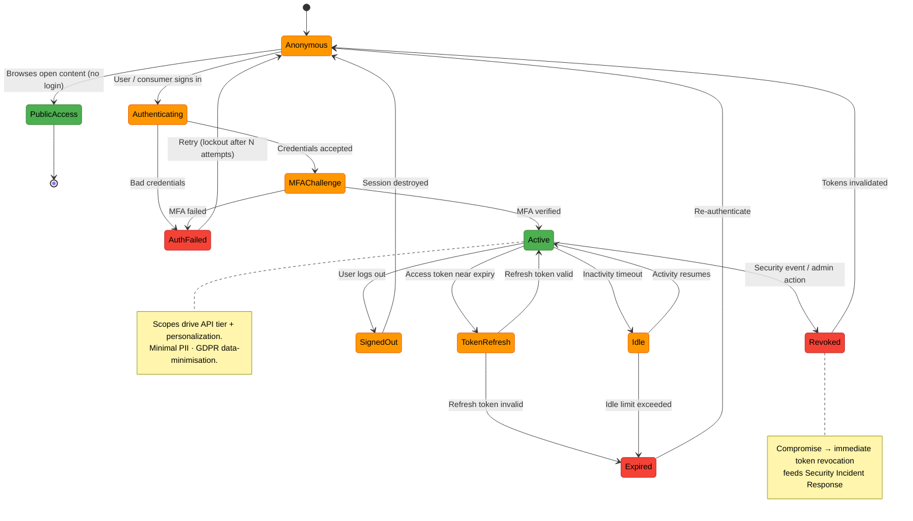
```mermaid
stateDiagram-v2
    [*] --> Anonymous

    Anonymous --> Authenticating: User / consumer signs in
    Anonymous --> PublicAccess: Browses open content (no login)
    PublicAccess --> [*]

    Authenticating --> MFAChallenge: Credentials accepted
    Authenticating --> AuthFailed: Bad credentials
    AuthFailed --> Anonymous: Retry (lockout after N attempts)

    MFAChallenge --> Active: MFA verified
    MFAChallenge --> AuthFailed: MFA failed

    Active --> TokenRefresh: Access token near expiry
    TokenRefresh --> Active: Refresh token valid
    TokenRefresh --> Expired: Refresh token invalid

    Active --> Idle: Inactivity timeout
    Idle --> Active: Activity resumes
    Idle --> Expired: Idle limit exceeded

    Active --> SignedOut: User logs out
    Expired --> Anonymous: Re-authenticate
    SignedOut --> Anonymous: Session destroyed

    Active --> Revoked: Security event / admin action
    Revoked --> Anonymous: Tokens invalidated

    note right of Active
        Scopes drive API tier + personalization.
        Minimal PII · GDPR data-minimisation.
    end note

    note right of Revoked
        Compromise → immediate token revocation
        feeds Security Incident Response
    end note

    classDef ok fill:#4caf50,stroke:#2e7d32,color:#000000
    classDef warn fill:#ff9800,stroke:#e65100,color:#000000
    classDef err fill:#f44336,stroke:#b71c1c,color:#000000
    class Active,PublicAccess ok
    class Anonymous,Authenticating,MFAChallenge,TokenRefresh,Idle,SignedOut warn
    class AuthFailed,Expired,Revoked err
```

## 15. 🔁 Horizon 3: API Request Lifecycle (API Gateway → Lambda)

The public **political-intelligence API** (API Gateway → Lambda → DynamoDB / Aurora / Neptune / OpenSearch) serves both anonymous and Cognito-authenticated consumers with tiered rate limits.

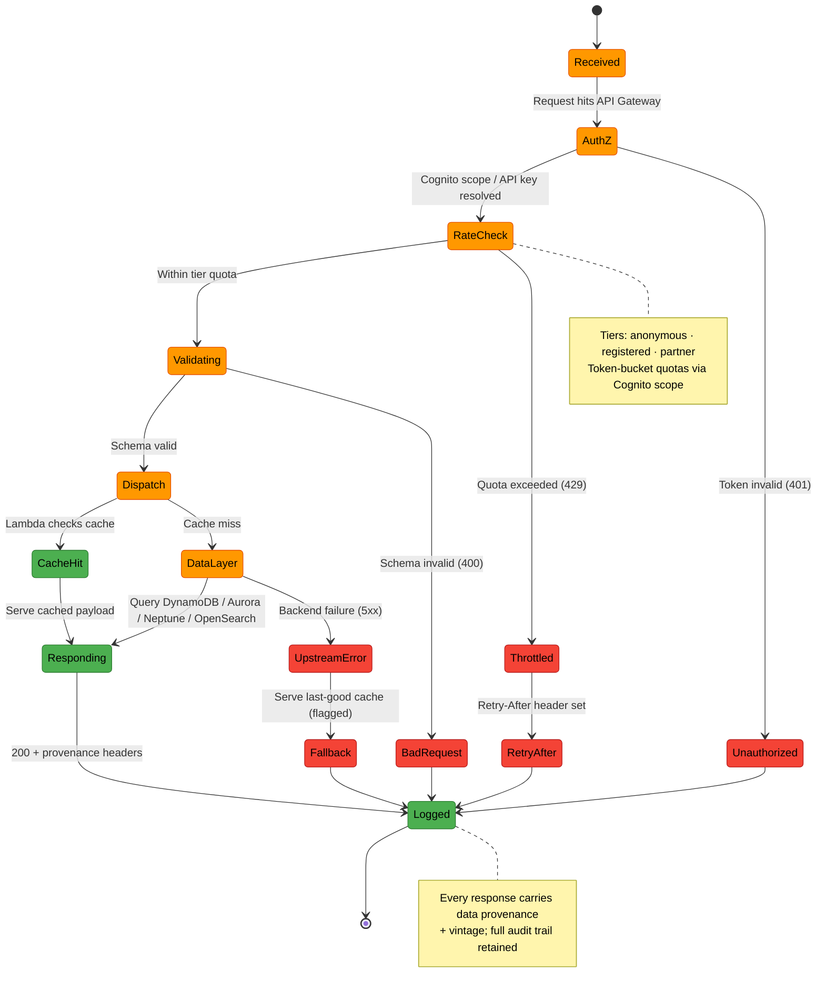
```mermaid
stateDiagram-v2
    [*] --> Received

    Received --> AuthZ: Request hits API Gateway
    AuthZ --> RateCheck: Cognito scope / API key resolved
    AuthZ --> Unauthorized: Token invalid (401)

    RateCheck --> Validating: Within tier quota
    RateCheck --> Throttled: Quota exceeded (429)

    Validating --> Dispatch: Schema valid
    Validating --> BadRequest: Schema invalid (400)

    Dispatch --> CacheHit: Lambda checks cache
    Dispatch --> DataLayer: Cache miss

    CacheHit --> Responding: Serve cached payload
    DataLayer --> Responding: Query DynamoDB / Aurora / Neptune / OpenSearch
    DataLayer --> UpstreamError: Backend failure (5xx)

    Responding --> Logged: 200 + provenance headers
    Logged --> [*]

    Unauthorized --> Logged
    Throttled --> RetryAfter: Retry-After header set
    RetryAfter --> Logged
    BadRequest --> Logged
    UpstreamError --> Fallback: Serve last-good cache (flagged)
    Fallback --> Logged

    note right of RateCheck
        Tiers: anonymous · registered · partner
        Token-bucket quotas via Cognito scope
    end note

    note right of Logged
        Every response carries data provenance
        + vintage; full audit trail retained
    end note

    classDef ok fill:#4caf50,stroke:#2e7d32,color:#000000
    classDef warn fill:#ff9800,stroke:#e65100,color:#000000
    classDef err fill:#f44336,stroke:#b71c1c,color:#000000
    class Responding,CacheHit,Logged ok
    class Received,AuthZ,RateCheck,Validating,Dispatch,DataLayer warn
    class Unauthorized,Throttled,BadRequest,UpstreamError,Fallback,RetryAfter err
```

---

# 🔁 Cross-Horizon Lifecycles

## 16. 🤖 AI/LLM Model Evolution Lifecycle (2026–2037)

**Assumptions (per Hack23 [AI Policy](https://github.com/Hack23/ISMS-PUBLIC/blob/main/AI_Policy.md)):** major AI model upgrades land roughly annually; competitors (OpenAI, Google, Meta, EU sovereign AI) are evaluated at each release; the architecture is designed to absorb paradigm shifts (quantum AI, neuromorphic computing); all model changes pass through shadow → canary → governance gates with human oversight.

The state machine below treats **each model generation as a state the platform occupies**, with minor-update, major-upgrade, competitor-switch and AGI-transition transitions.

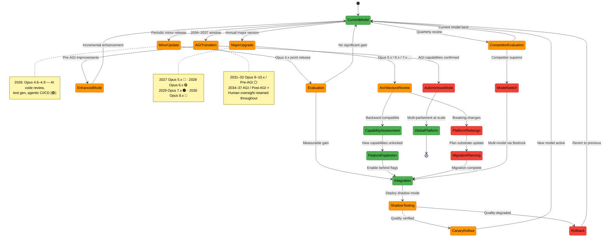
```mermaid
stateDiagram-v2
    [*] --> CurrentModel

    CurrentModel --> MinorUpdate: Periodic minor release
    MinorUpdate --> Evaluation: Opus 4.x point release
    Evaluation --> Integration: Measurable gain
    Evaluation --> CurrentModel: No significant gain

    Integration --> ShadowTesting: Deploy shadow mode
    ShadowTesting --> CanaryRollout: Quality verified
    ShadowTesting --> Rollback: Quality degraded
    CanaryRollout --> CurrentModel: New model active
    Rollback --> CurrentModel: Revert to previous

    CurrentModel --> MajorUpgrade: Annual major version
    MajorUpgrade --> ArchitectureReview: Opus 5.x / 6.x / 7.x …
    ArchitectureReview --> CapabilityAssessment: Backward compatible
    ArchitectureReview --> PlatformRedesign: Breaking changes
    CapabilityAssessment --> FeatureExpansion: New capabilities unlocked
    FeatureExpansion --> Integration: Enable behind flags
    PlatformRedesign --> MigrationPlanning: Plan substrate update
    MigrationPlanning --> Integration: Migration complete

    CurrentModel --> CompetitorEvaluation: Quarterly review
    CompetitorEvaluation --> ModelSwitch: Competitor superior
    CompetitorEvaluation --> CurrentModel: Current model best
    ModelSwitch --> Integration: Multi-model via Bedrock

    CurrentModel --> AGITransition: 2034–2037 window
    AGITransition --> EnhancedMode: Pre-AGI improvements
    AGITransition --> AutonomousMode: AGI capabilities confirmed
    EnhancedMode --> CurrentModel: Incremental enhancement
    AutonomousMode --> GlobalPlatform: Multi-parliament at scale
    GlobalPlatform --> [*]

    note right of MinorUpdate
        2026: Opus 4.6–4.9 — AI code review,
        test gen, agentic CI/CD (🟢)
    end note

    note right of MajorUpgrade
        2027 Opus 5.x 🔵 · 2028 Opus 6.x 🟣
        2029 Opus 7.x 🟠 · 2030 Opus 8.x 🔴
    end note

    note right of AGITransition
        2031–33 Opus 9–10.x / Pre-AGI ⚪
        2034–37 AGI / Post-AGI ⭐
        Human oversight retained throughout
    end note

    classDef ok fill:#4caf50,stroke:#2e7d32,color:#000000
    classDef warn fill:#ff9800,stroke:#e65100,color:#000000
    classDef err fill:#f44336,stroke:#b71c1c,color:#000000
    class CurrentModel,Integration,CapabilityAssessment,FeatureExpansion,GlobalPlatform ok
    class MinorUpdate,Evaluation,ShadowTesting,CanaryRollout,MajorUpgrade,ArchitectureReview,CompetitorEvaluation,AGITransition,EnhancedMode warn
    class Rollback,PlatformRedesign,MigrationPlanning,ModelSwitch,AutonomousMode err
```

### 16.1 AI Generation → Capability-State Translation (DevSecOps + Product/Data/State lens)

The Hack23 AI Model Evolution roadmap, read as the **states each capability domain can reach** as the model curve advances:

| Year | AI Model | DevSecOps capability state | OSINT / party-analytics / forecasting state unlocked |
|------|----------|----------------------------|------------------------------------------------------|
| 2026 | Opus 4.6–4.9 | 🟢 AI-assisted code review, automated test generation, agentic CI/CD workflows | Static evidence-grading & anomaly-detection states reach **Active** (v2.0) |
| 2027 | Opus 5.x | 🔵 Predictive vulnerability detection, intelligent dependency management | Party-cohesion & coalition-matrix lifecycles reach **stable refresh**; first vote-prediction **ShadowMode** |
| 2028 | Opus 6.x | 🟣 Multi-modal security analysis (code + architecture + runtime), automated threat modeling | Bedrock content lifecycle + KB ingestion reach **Ready/Serving**; streaming states enter **Provisioning** |
| 2029 | Opus 7.x | 🟠 Autonomous security pipeline orchestration, self-healing build systems | Predictive-model **FullDeployment**; election-forecast **Calibration** at scale |
| 2030 | Opus 8.x | 🔴 Near-expert automated security review, AI-driven architecture validation | Multi-parliament **CrossCountryAnalysis**; conversational assistant **Active** |
| 2031–2033 | Opus 9–10.x / Pre-AGI | ⚪ Autonomous secure development lifecycle management | Real-time fact-checking & semantic knowledge-graph states **Self-tuning** |
| 2034–2037 | AGI / Post-AGI | ⭐ Transformative software engineering with built-in security assurance | **GlobalPlatform** state — federated parliaments, autonomous-within-policy intelligence |

> Each capability advance is gated by the same **shadow → canary → governance** discipline in §9 and §16; no AI generation auto-promotes to a public state without passing those guards.

## 17. 🌐 IMF Cache → Aurora Lifecycle Evolution

*Baseline: the **already-implemented** IMF cache lifecycle (vintage-tagged, SHA-256 pinned, supersedes-chain) is documented in [`STATEDIAGRAM.md`](STATEDIAGRAM.md) §IMF. The machine below preserves that semantics and adds Aurora Serverless v2 transitions (row-level locks, replica lag) as the runtime migrates in v3.0+.*

> **Authoritative hub:** [`analysis/imf/README.md`](analysis/imf/README.md) · [`analysis/imf/agentic-integration.md`](analysis/imf/agentic-integration.md) · [`analysis/imf/indicators-inventory.json`](analysis/imf/indicators-inventory.json) · [`analysis/imf/data-dictionary.md`](analysis/imf/data-dictionary.md) · [`.github/aw/ECONOMIC_DATA_CONTRACT.md`](.github/aw/ECONOMIC_DATA_CONTRACT.md)

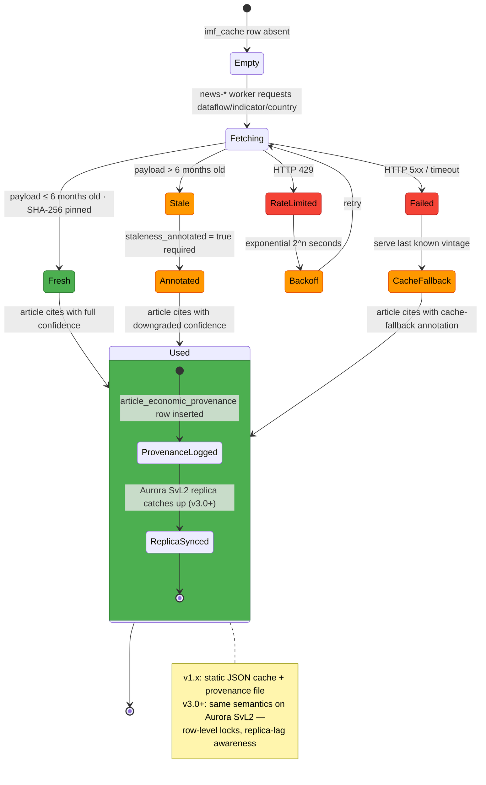
```mermaid
stateDiagram-v2
    [*] --> Empty: imf_cache row absent
    Empty --> Fetching: news-* worker requests dataflow/indicator/country
    Fetching --> Fresh: payload ≤ 6 months old · SHA-256 pinned
    Fetching --> Stale: payload > 6 months old
    Fetching --> RateLimited: HTTP 429
    Fetching --> Failed: HTTP 5xx / timeout
    Fresh --> Used: article cites with full confidence
    Stale --> Annotated: staleness_annotated = true required
    Annotated --> Used: article cites with downgraded confidence
    RateLimited --> Backoff: exponential 2^n seconds
    Backoff --> Fetching: retry
    Failed --> CacheFallback: serve last known vintage
    CacheFallback --> Used: article cites with cache-fallback annotation
    Used --> [*]

    state Used {
        [*] --> ProvenanceLogged: article_economic_provenance row inserted
        ProvenanceLogged --> ReplicaSynced: Aurora SvL2 replica catches up (v3.0+)
        ReplicaSynced --> [*]
    }

    note right of Used
        v1.x: static JSON cache + provenance file
        v3.0+: same semantics on Aurora SvL2 —
        row-level locks, replica-lag awareness
    end note

    classDef ok fill:#4caf50,stroke:#2e7d32,color:#000000
    classDef warn fill:#ff9800,stroke:#e65100,color:#000000
    classDef err fill:#f44336,stroke:#b71c1c,color:#000000
    class Fresh,Used ok
    class Stale,Annotated,Backoff,CacheFallback warn
    class RateLimited,Failed err
```

### 17.1 WEO vintage transition (April → October cycle)

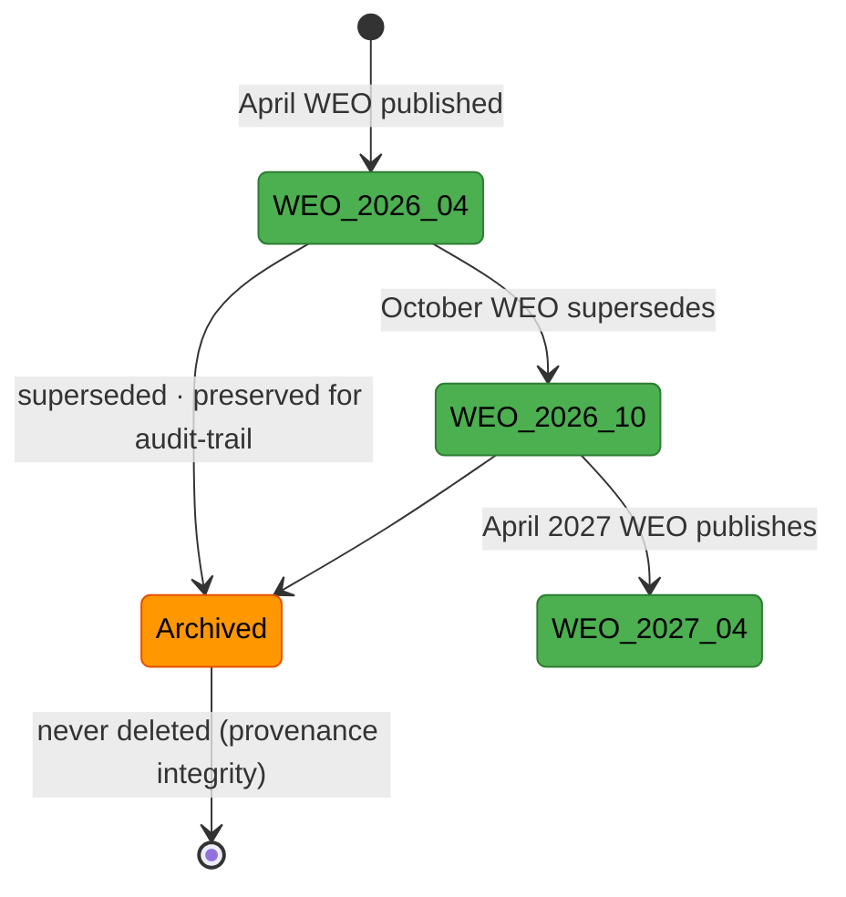
```mermaid
stateDiagram-v2
    [*] --> WEO_2026_04: April WEO published
    WEO_2026_04 --> WEO_2026_10: October WEO supersedes
    WEO_2026_04 --> Archived: superseded · preserved for audit-trail
    WEO_2026_10 --> WEO_2027_04: April 2027 WEO publishes
    WEO_2026_10 --> Archived
    Archived --> [*]: never deleted (provenance integrity)

    classDef ok fill:#4caf50,stroke:#2e7d32,color:#000000
    classDef warn fill:#ff9800,stroke:#e65100,color:#000000
    class WEO_2026_04,WEO_2026_10,WEO_2027_04 ok
    class Archived warn
```

**Canonical rule.** Every economic claim in a Riksdagsmonitor article cites an IMF dataflow first; World Bank citations are reserved for governance, environment and social residue (the classes IMF does not publish). SCB is the Swedish-specific ground-truth layer. See [`ECONOMIC_DATA_CONTRACT.md`](.github/aw/ECONOMIC_DATA_CONTRACT.md) v2.1 for the banned-phrase list and vintage discipline (> 6 mo → annotation).

---

## 📋 Future State Summary

| # | State Machine | Horizon | Window | Key Technology | Status |
|---|---------------|---------|--------|----------------|--------|
| 1 | Article Lifecycle (analysis-gate → publish) | 🟢 v1.x | Shipped | gh-aw · Opus 4.8 / Sonnet 4.6 · analysis-gate.ts | ✅ Active |
| 2 | Data-Sync Lifecycle | 🟢 v1.x | Shipped | MCP (riksdag-regering/scb/imf/world-bank) · CIA exports | ✅ Active |
| 3 | Dashboard Build Lifecycle | 🟢 v1.x | Shipped | Vite · Chart.js / D3.js · lazy TS modules | ✅ Active |
| 4 | Party-Dashboard Build & Publish | 🔵 v2.0 | 2026–2027 | Cohesion index · coalition matrix · static emit | 🟡 Planned |
| 5 | Evidence-Grading | 🔵 v2.0 | 2026–2027 | Source-grade ladder · ACH | 🟡 Planned |
| 6 | Anomaly-Detection | 🔵 v2.0 | 2026–2027 | z-score baselines · neutral signals | 🟡 Planned |
| 7 | OSINT / INTOP Scorecard | 🔵 v2.0 | 2026–2027 | Network/temporal analysis · red-team | 🟡 Planned |
| 8 | Bedrock AI Content Generation | 🟣 v3.0+ | 2028–2030 | Bedrock + Agents · KB RAG · Step Functions | 🔴 Research |
| 9 | Predictive-Model Lifecycle | 🟣 v3.0+ | 2028–2030 | MLOps · shadow/canary · Timestream/Aurora | 🔴 Research |
| 10 | Real-Time Streaming | 🟣 v3.0+ | 2028+ | Kinesis · Lambda · auto-resharding | 🔴 Research |
| 11 | Election-Forecast Model | 🟣 v3.0+ | 2026/2030 cycles | Monte Carlo · ethical blackout | 🟡 Planned |
| 12 | Multi-Parliament Coordination | 🟣 v3.0+ | 2028+ | Step Functions · Neptune · EU Parliament MCP | 🔴 Research |
| 13 | Bedrock Knowledge Base Refresh | 🟣 v3.0+ | 2028+ | Bedrock KB · OpenSearch Serverless | 🔴 Research |
| 14 | Cognito Session / Auth | 🟣 v3.0+ | 2028+ | Amazon Cognito · MFA · token lifecycle | 🔴 Research |
| 15 | API Request Lifecycle | 🟣 v3.0+ | 2028+ | API Gateway · Lambda · tiered quotas | 🔴 Research |
| 16 | AI/LLM Model Evolution | 🔁 Cross | 2026–2037 | Opus 4.x → AGI · multi-model via Bedrock | 🟡 Planned |
| 17 | IMF Cache → Aurora | 🔁 Cross | 2026–2030 | Vintage cache → Aurora SvL2 | 🟢 Active → 🟡 Planned |

---

## 🛡️ ISMS Control Mapping

These future state machines remain governed by the Hack23 ISMS. Key control linkage:

| State machine | ISO 27001:2022 | NIST CSF 2.0 | CIS v8.1 | Notes |
|---------------|----------------|--------------|----------|-------|
| Article Lifecycle / AI Content (§1, §8) | A.5.34, A.8.28 | GV.OC, PR.DS | 16 | AI Policy guardrails; provenance immutable |
| Evidence-Grading / OSINT (§5, §7) | A.5.34, A.8.10 | ID.RA, GV.RM | 3, 14 | GDPR Art. 9(2)(e)/(g); neutrality |
| Predictive / Forecast (§9, §11) | A.8.28, A.5.8 | ID.RA, PR.PS | 16 | Shadow/canary gates; ethical blackout |
| Streaming / API (§10, §15) | A.8.16, A.8.23 | DE.CM, PR.AA | 8, 13 | Rate limiting; audit trail per response |
| Cognito Auth (§14) | A.5.15, A.5.17, A.8.5 | PR.AA | 5, 6 | MFA; least privilege; revocation |
| KB Refresh / IMF Cache (§13, §17) | A.8.10, A.5.33 | PR.DS, ID.AM | 3, 11 | Provenance & vintage integrity |
| Model Evolution (§16) | A.5.34, A.8.30 | GV.SC, ID.IM | 16 | Human oversight; change management |

> Mapped against [Secure Development Policy](https://github.com/Hack23/ISMS-PUBLIC/blob/main/Secure_Development_Policy.md), [AI Policy](https://github.com/Hack23/ISMS-PUBLIC/blob/main/AI_Policy.md), [Threat Modeling](https://github.com/Hack23/ISMS-PUBLIC/blob/main/Threat_Modeling.md) and the [Classification Framework](https://github.com/Hack23/ISMS-PUBLIC/blob/main/CLASSIFICATION.md). See [`FUTURE_SECURITY_ARCHITECTURE.md`](FUTURE_SECURITY_ARCHITECTURE.md) and [`FUTURE_THREAT_MODEL.md`](FUTURE_THREAT_MODEL.md) for control depth.

---

## 📚 Related Documents

| Document | Focus | Description |
|----------|-------|-------------|
| [🏛️ Architecture](ARCHITECTURE.md) | 🏗️ C4 Models | System context, containers, components |
| [📊 Data Model](DATA_MODEL.md) | 📊 Data | Entity relationships and data dictionary |
| [🔄 Flowchart](FLOWCHART.md) | 🔄 Processes | Business and data flow diagrams |
| [📈 State Diagram](STATEDIAGRAM.md) | 📈 States | Current system state transitions |
| **[📈 Future State Diagram](FUTURE_STATEDIAGRAM.md)** | **🔮 States** | **Advanced state management (this document)** |
| [🚀 Future Architecture](FUTURE_ARCHITECTURE.md) | 🔮 Evolution | Architectural evolution roadmap |
| [📊 Future Data Model](FUTURE_DATA_MODEL.md) | 🔮 Data | Enhanced data architecture plans |
| [🔄 Future Flowchart](FUTURE_FLOWCHART.md) | 🔮 Processes | Improved process workflows |
| [🧠 Future Mindmap](FUTURE_MINDMAP.md) | 🔮 Concepts | Capability expansion plans |
| [💼 Future SWOT](FUTURE_SWOT.md) | 🔮 Strategy | Future strategic opportunities |
| [🔮 Future Security](FUTURE_SECURITY_ARCHITECTURE.md) | 🔒 Security | Planned security improvements |

### Hack23 ISMS Policies

- [🛡️ Secure Development Policy](https://github.com/Hack23/ISMS-PUBLIC/blob/main/Secure_Development_Policy.md) — Architecture documentation requirements
- [🤖 AI Policy](https://github.com/Hack23/ISMS-PUBLIC/blob/main/AI_Policy.md) — AI usage & human-in-the-loop governance
- [🎯 Threat Modeling Policy](https://github.com/Hack23/ISMS-PUBLIC/blob/main/Threat_Modeling.md) — STRIDE / MITRE ATT&CK
- [🏷️ Classification Framework](https://github.com/Hack23/ISMS-PUBLIC/blob/main/CLASSIFICATION.md) — CIA triad classification

---

**📋 Document Control:**  
**✅ Approved by:** James Pether Sörling, CEO  
**📤 Distribution:** Public  
**🏷️ Classification:**   
**📄 Version:** 3.0  
**📅 Effective Date:** 2026-05-31  
**⏰ Next Review:** 2026-08-31  
**🎯 Framework Compliance:**   

| Version | Date | Author | Changes |
|---------|------|--------|---------|
| 1.0 | 2025-11 | CEO | Initial future state diagrams |
| 2.0 | 2026-02-24 | CEO | Expanded to 14 state machines |
| **3.0** | **2026-05-31** | **CEO** | **Three-horizon restructure (v1.x baseline / v2.0 static / v3.0+ serverless); aligned to shipped v1.0.1 baseline; Bedrock / KB / Cognito / Kinesis / API lifecycles added; AI Model Evolution translated to state terms; ISMS control mapping; all Mermaid revalidated** |

---

## 🔗 Hack23 Ecosystem

<table>
<tr>
  <th width="33%">🌐 Platforms</th>
  <th width="33%">📦 Open-Source Projects</th>
  <th width="33%">🛡️ Governance &amp; Standards</th>
</tr>
<tr>
<td valign="top">
🗳️ <a href="https://riksdagsmonitor.com">Riksdagsmonitor</a> — Swedish Parliament intelligence 
🇪🇺 <a href="https://www.euparliamentmonitor.com">EU Parliament Monitor</a> — European coverage 
🕵️ <a href="https://www.hack23.com/cia">Citizen Intelligence Agency</a> — political-data engine 
🌐 <a href="https://www.hack23.com">Hack23 AB</a> — corporate site 
📰 <a href="https://hack23.com/blog.html">Hack23 Blog</a> — engineering &amp; policy 
💼 <a href="https://www.linkedin.com/company/hack23/">Hack23 on LinkedIn</a>
</td>
<td valign="top">
🗳️ <a href="https://github.com/Hack23/riksdagsmonitor">Hack23/riksdagsmonitor</a> 
🕵️ <a href="https://github.com/Hack23/cia">Hack23/cia</a> 
🇪🇺 <a href="https://github.com/Hack23/euparliamentmonitor">Hack23/euparliamentmonitor</a> 
🔌 <a href="https://github.com/Hack23/european-parliament-mcp">Hack23/european-parliament-mcp</a> 
✅ <a href="https://github.com/Hack23/cia-compliance-manager">Hack23/cia-compliance-manager</a> 
🥋 <a href="https://github.com/Hack23/black-trigram">Hack23/black-trigram</a> 
🏠 <a href="https://github.com/Hack23/homepage">Hack23/homepage</a>
</td>
<td valign="top">
🛡️ <a href="https://github.com/Hack23/ISMS-PUBLIC">Hack23 ISMS-PUBLIC</a> — public ISMS 
🔒 <a href="https://github.com/Hack23/ISMS-PUBLIC/blob/main/Information_Security_Policy.md">Information Security Policy</a> 
🤖 <a href="https://github.com/Hack23/ISMS-PUBLIC/blob/main/AI_Policy.md">AI Policy</a> 
🧪 <a href="https://github.com/Hack23/ISMS-PUBLIC/blob/main/Secure_Development_Policy.md">Secure Development Policy</a> 
🎯 <a href="https://github.com/Hack23/ISMS-PUBLIC/blob/main/Threat_Modeling.md">Threat Modeling Policy</a> 
⚠️ <a href="https://github.com/Hack23/ISMS-PUBLIC/blob/main/Vulnerability_Management.md">Vulnerability Management</a> 
🏷️ <a href="https://github.com/Hack23/ISMS-PUBLIC/blob/main/CLASSIFICATION.md">Classification Framework</a>
</td>
</tr>
</table>

<em>🗳️ Empower citizens · 🔍 Strengthen democratic accountability · 🕵️ Illuminate the political process</em>

© 2008–2026 <a href="https://www.hack23.com">Hack23 AB</a> (Org.nr 559534-7807) · Maintainer: <a href="https://www.linkedin.com/in/jamessorling/">James Pether Sörling, CISSP CISM</a>

