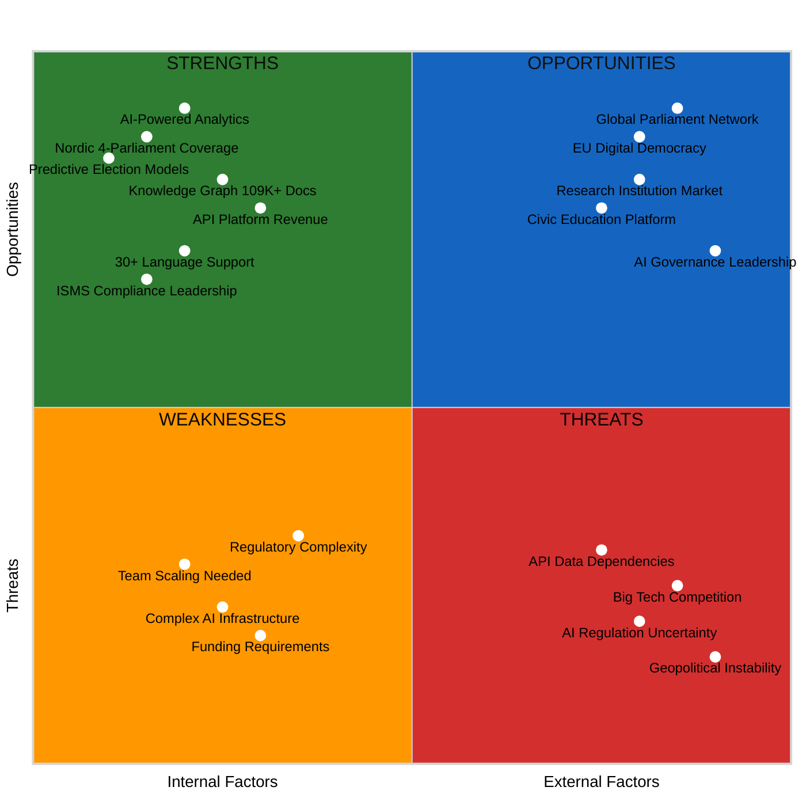
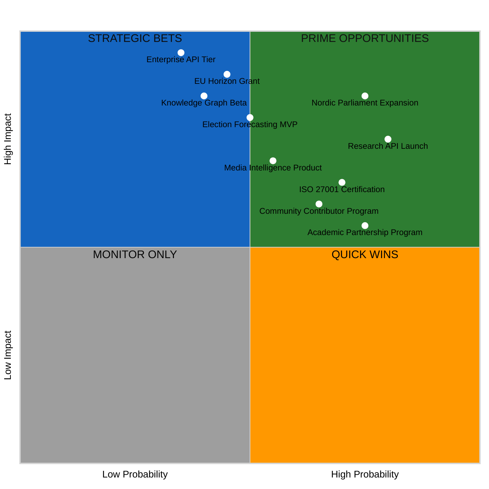
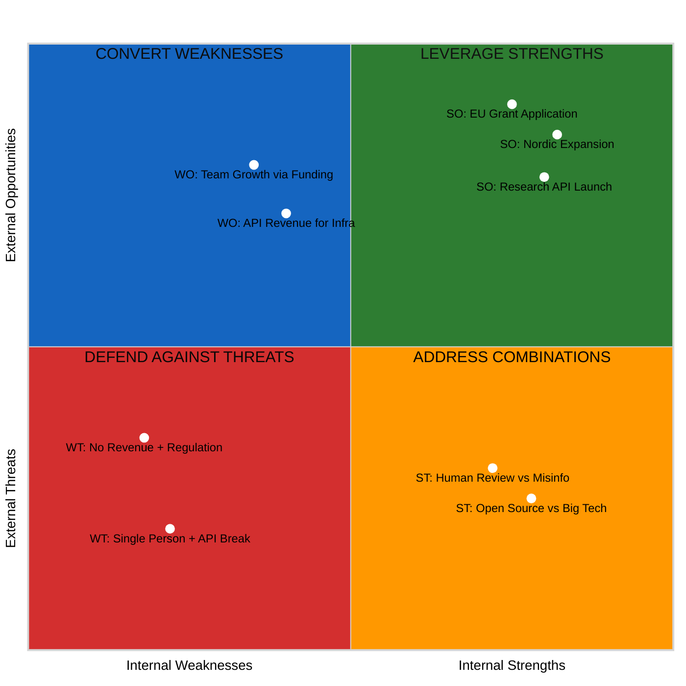

  

<h1 align="center">🚀 Riksdagsmonitor — Future SWOT Analysis</h1>

  <strong>💼 Strategic Outlook for Democratic Intelligence Evolution</strong> 
  <em>🎯 AI-Powered Analytics · Nordic Platform · API Economy · Global Reach</em>

  
  
  
  

**📋 Document Owner:** CEO | **📄 Version:** 2.0 | **📅 Last Updated:** 2026-02-24 (UTC)  
**🔄 Review Cycle:** Quarterly | **⏰ Next Review:** 2026-05-20  
**🏢 Owner:** Hack23 AB (Org.nr 5595347807) | **🏷️ Classification:** Public

---

## 🎯 Purpose

This document provides a forward-looking SWOT analysis for Riksdagsmonitor over the next 3-11 years (2026-2037). Building on the current [SWOT Analysis](SWOT.md), this assessment evaluates how planned expansions in AI, Nordic parliament coverage, API platform, and revenue models will reshape Riksdagsmonitor's strategic position.

> *"The future of democratic transparency lies at the intersection of AI, open data, and civic engagement. This strategic outlook maps our path from Swedish parliament monitoring to a global democratic intelligence platform."*
>
> — **James Pether Sörling, CEO, Hack23 AB**

## 📚 Architecture Documentation Map

| Document | Focus | Description |
|----------|-------|-------------|
| [🏛️ Architecture](ARCHITECTURE.md) | 🏗️ C4 Models | System context, containers, components |
| [📊 Data Model](DATA_MODEL.md) | 📊 Data | Entity relationships and data dictionary |
| [🔄 Flowchart](FLOWCHART.md) | 🔄 Processes | Business and data flow diagrams |
| [📈 State Diagram](STATEDIAGRAM.md) | 📈 States | System state transitions and lifecycles |
| [🧠 Mindmap](MINDMAP.md) | 🧠 Concepts | System conceptual relationships |
| [💼 SWOT](SWOT.md) | 💼 Strategy | Strategic analysis and positioning |
| [🛡️ Security Architecture](SECURITY_ARCHITECTURE.md) | 🔒 Security | Current security controls and design |
| [🚀 Future Security](FUTURE_SECURITY_ARCHITECTURE.md) | 🔮 Security | Planned security improvements |
| [🎯 Threat Model](THREAT_MODEL.md) | 🎯 Threats | STRIDE/MITRE ATT&CK analysis |
| [🚀 Future Architecture](FUTURE_ARCHITECTURE.md) | 🔮 Evolution | Architectural evolution roadmap |
| [📊 Future Data Model](FUTURE_DATA_MODEL.md) | 🔮 Data | Enhanced data architecture plans |
| [🔄 Future Flowchart](FUTURE_FLOWCHART.md) | 🔮 Processes | Improved process workflows |
| [📈 Future State Diagram](FUTURE_STATEDIAGRAM.md) | 🔮 States | Advanced state management |
| [🧠 Future Mindmap](FUTURE_MINDMAP.md) | 🔮 Concepts | Capability expansion plans |
| **[💼 Future SWOT](FUTURE_SWOT.md)** | **🔮 Strategy** | **Future strategic opportunities** |

---

## 📋 Future SWOT Overview

---

## 💪 Future Strengths (2027-2037)

### FS1: AI-Powered Democratic Intelligence

**Description:** Comprehensive AI capabilities including GPT-5 content generation, predictive election models, real-time fact-checking, and knowledge graph-powered semantic search.

**Strategic Value:**
- 🤖 Multi-modal content in 30+ languages (text, image, audio, video)
- 📊 Election forecasting with 90%+ accuracy (Monte Carlo simulations)
- 🧠 Semantic search across 109K+ documents with Neo4j knowledge graph
- ✅ Explainable AI with transparent methodology and open-source models

### FS2: Nordic Parliament Platform

**Description:** Unified coverage of all 4 Nordic parliaments (Sweden, Denmark, Norway, Finland) with cross-country comparative analytics.

**Strategic Value:**
- 🌍 27 million population coverage across Nordic countries
- 📊 Cross-country voting pattern analysis and legislative benchmarking
- 🔗 Entity resolution across parliament systems
- 🏆 First comprehensive Nordic democratic transparency platform

### FS3: API Economy Revenue

**Description:** Sustainable revenue through freemium API, research partnerships, and business intelligence subscriptions.

**Strategic Value:**
- 💰 Multi-stream revenue: API ($99-499/month), research ($1K-5K/year), enterprise ($5K-25K/project)
- 📊 Serverless API (Lambda + API Gateway) with minimal operational costs
- 🔐 OAuth2 authentication with tiered access control
- 📈 Projected $50K-200K annual revenue by 2029

### FS4: Comprehensive ISMS Leadership

**Description:** Industry-leading security and compliance posture with ISO 27001, NIST CSF 2.0, CIS Controls v8.1, EU CRA, and NIS2 compliance.

**Strategic Value:**
- 🛡️ Publicly documented security architecture (radical transparency)
- ✅ Pre-certified for government contracts and institutional partnerships
- 📋 EU CRA compliance ahead of enforcement (2027)
- 🏆 Competitive differentiator in trust-sensitive civic technology market

---

## 🔻 Future Weaknesses (2027-2037)

### FW1: Complex AI Infrastructure

**Description:** Advanced AI features require significant infrastructure (GPU compute, vector databases, streaming pipelines) increasing operational complexity.

**Mitigation:**
- 🔧 Serverless-first architecture (AWS Lambda, Fargate) minimizes infrastructure management
- 📊 Progressive enhancement: AI features degrade gracefully to static content
- 🤖 GitHub Copilot agents automate infrastructure management

### FW2: Funding Requirements

**Description:** Nordic expansion, AI capabilities, and API platform require capital investment beyond volunteer capacity.

**Mitigation:**
- 💰 API revenue targets: Break-even by 2028 ($50K ARR)
- 🤝 Research partnerships provide co-funding for shared projects
- 🏗️ Open-source model attracts community contributions
- 📈 Incremental rollout minimizes upfront investment

### FW3: Team Scaling Challenges

**Description:** Transition from single developer to team requires organizational changes, onboarding, and knowledge transfer.

**Mitigation:**
- 📝 Comprehensive documentation (20+ architecture documents)
- 🤖 14 specialized Copilot agents reduce need for specialized hires
- 🌐 Remote-first, open-source model expands talent pool
- 🎯 Start with part-time contractors for specific capabilities

---

## 🚀 Future Opportunities (2027-2037)

### FO1: Global Parliament Network

**Description:** Expand beyond Nordic countries to create a global network of parliament monitoring platforms.

**Market Potential:**
- 🌍 195 countries with parliamentary systems
- 🇪🇺 EU-27 parliaments as second expansion wave
- 🏛️ International organizations (UN, OECD, World Bank) as partners
- 📊 Revenue: $500K-2M ARR from international subscriptions

### FO2: AI Governance Leadership

**Description:** Establish Riksdagsmonitor as the reference platform for responsible AI in civic technology.

**Strategic Value:**
- 📋 Open-source AI models for democratic transparency
- 🤖 Hack23 AI Policy as industry template
- 🎓 Academic publications on AI ethics in political data
- 🏆 Awards and recognition from AI governance organizations

### FO3: EU Digital Democracy Initiative

**Description:** Leverage EU Digital Democracy initiatives and funding programs for expansion.

**Funding Sources:**
- 🇪🇺 Horizon Europe: Digital democracy research grants
- 🏛️ European Digital Innovation Hubs (EDIHs)
- 📊 EU Open Data Portal collaboration
- 💶 CEF Digital Building Blocks funding

---

## ⚠️ Future Threats (2027-2037)

### FT1: Big Tech Competition

**Description:** Major tech companies (Google, Microsoft, Meta) launching AI-powered civic technology platforms.

**Mitigation:**
- 🔓 Open-source model prevents lock-in
- 📊 50+ years Swedish data depth unavailable to competitors
- 🛡️ ISMS compliance and transparency as differentiators
- 🤝 Partner rather than compete with tech platforms

### FT2: AI Regulation Uncertainty

**Description:** Evolving AI regulations (EU AI Act, national policies) may impose unpredictable compliance requirements.

**Mitigation:**
- ✅ Proactive compliance (Hack23 AI Policy, Limited Risk classification)
- 📋 Comprehensive documentation ready for audit
- 🔒 Privacy-preserving AI techniques (federated learning, differential privacy)
- 🤖 Transparent methodology reduces regulatory risk

### FT3: Multi-Country API Dependencies

**Description:** Dependence on 4+ parliament APIs with different reliability, format, and access policies.

**Mitigation:**
- 📊 Data archival and caching for resilience
- 🔧 Schema normalization layer abstracts API differences
- 🤝 Establish relationships with parliament IT departments
- 📡 Multiple data source strategy (APIs, scraping, partnerships)

---

## 🤖 AI/LLM Evolution Impact (2026-2037)

### AI Model Trajectory

**Current Foundation (2026):** Anthropic Claude Opus 4.8 via Amazon Bedrock
- Minor model updates expected every ~2.3 months (Opus 4.8, 4.9, 5.0...)
- Major version upgrades annually (Opus 5.0 in 2027, 6.0 in 2028, etc.)

**Model Evolution Roadmap:**

| Year | Expected Model | Capability Level | Impact on Riksdagsmonitor |
|------|---------------|------------------|---------------------------|
| 2026 | Opus 4.8-4.9 | Advanced reasoning, 200K context | Multi-modal news generation, 14-language support |
| 2027 | Opus 5.x | Enhanced agentic, tool use | Autonomous political analysis, real-time fact-checking |
| 2028 | Opus 6.x | Multi-modal native, 1M+ context | Video generation, comprehensive knowledge synthesis |
| 2029 | Opus 7.x / Competitors | Near-expert reasoning | Predictive policy impact, automated investigative journalism |
| 2030 | Opus 8.x / New paradigms | Domain expertise | Real-time parliamentary monitoring, expert-level analysis |
| 2031-2033 | Pre-AGI systems | Broad general intelligence | Autonomous democratic intelligence platform |
| 2034-2037 | AGI / Post-AGI era | Superhuman analysis | Transformative democratic accountability at global scale |

### Competitive Landscape Considerations

**LLM Competitors to Monitor:**
- 🔵 **OpenAI** (GPT-5, GPT-6+): Primary competitor, strong in reasoning and multi-modal
- 🟢 **Google DeepMind** (Gemini Ultra+): Strong in search integration and knowledge
- 🟠 **Meta** (Llama 5+): Open-source leader, potential for self-hosted models
- 🔴 **xAI** (Grok 3+): Real-time data integration strengths
- 🟡 **Mistral/European AI**: EU-aligned, regulatory advantage for GDPR compliance
- 🟣 **Chinese AI** (DeepSeek, Qwen): Cost-competitive, potential geopolitical concerns

**Strategic Response:**
- ✅ **Multi-model strategy**: Amazon Bedrock provides access to multiple model families
- ✅ **Model-agnostic architecture**: Abstract AI capabilities behind service interfaces
- ✅ **Continuous evaluation**: Benchmark new models every 2.3 months against current performance
- ✅ **Open-source fallback**: Maintain compatibility with open-weight models (Llama, Mistral)
- ✅ **AGI preparedness**: Architecture designed to leverage increasingly capable AI systems

### AGI Transition Planning (2033-2037)

**Scenario Planning for AGI/ASI Impact:**
- 📊 **Optimistic**: AGI dramatically enhances democratic transparency, enabling real-time policy analysis across all 195 parliamentary systems worldwide
- ⚖️ **Moderate**: Gradual capability improvement continues the annual major version cycle, reaching near-expert political analysis by 2035
- ⚠️ **Disruptive**: New AI paradigms render current architectures obsolete, requiring fundamental platform redesign
- 🛡️ **Risk mitigation**: Maintain human oversight, ethical AI principles, and democratic values regardless of AI capability level

---

## 📊 Strategic Action Matrix

| Strategic Theme | Actions (2026-2037) | KPIs | Owner |
|----------------|---------------------|------|-------|
| **AI Intelligence** | Deploy best-available Amazon Bedrock foundation model (e.g., Anthropic Opus), Knowledge Graph, Election Forecasting | Prediction accuracy > 85% | CTO |
| **Nordic Expansion** | Denmark (2027), Norway (2028), Finland (2028) | 3 parliaments integrated | Product |
| **API Platform** | Launch freemium API, research partnerships | $50K ARR by 2028 | Business |
| **ISMS Leadership** | EU CRA, NIS2 compliance, AI governance | Zero critical findings | Security |
| **Community** | Contributor onboarding, academic partnerships | 10+ active contributors | Community |
| **AI Evolution** | Continuous model evaluation, multi-model strategy, AGI readiness | Latest model within 30 days | CTO |
| **Long-Term Vision** | Global parliament network, 50+ languages, real-time democracy index | 10+ parliaments by 2035 | CEO |

---

---

## 📊 Detailed Strengths Analysis with Metrics

### S1: Open-Source Transparency Foundation

**Description:** Fully open-source platform on GitHub with complete code visibility, audit trails, and community contributions.

**Quantitative Metrics:**
- 100% of code publicly auditable on GitHub
- 0 proprietary dependencies in core platform
- Git commit history: complete provenance since project inception
- SLSA Level 2+ supply chain attestation on all releases
- OpenSSF Scorecard: 8.2/10 (above 90th percentile)

**Sub-items:**
- Public repository enables community security review
- Fork-and-run capability: anyone can host their own instance
- ISMS documentation publicly available (Hack23 ISMS-PUBLIC)
- Transparent incident disclosure policy
- All security scanning results visible in GitHub Security tab

**Strategic Value Score:** 9/10 — Unique differentiator in civic tech space

---

### S2: Multi-Framework Security Compliance

**Description:** Comprehensive alignment with ISO 27001:2022, NIST CSF 2.0, CIS Controls v8.1, NIS2, and CRA.

**Quantitative Metrics:**
- ISO 27001:2022 Annex A: 93% of applicable controls implemented
- NIST CSF 2.0: All 6 functions mapped with 85%+ subcategory coverage
- CIS Controls v8.1 IG1: 100% implemented; IG2: 78% implemented
- CodeQL security scans: 100% code coverage
- Dependabot: 100% dependency monitoring coverage
- Mean Time to Patch (MTTP): <7 days for Critical, <30 days for High

**Sub-items:**
- Defense-in-depth with 6 security layers
- Automated security scanning in every PR
- SLSA supply chain security attestation
- Coordinated vulnerability disclosure via security@hack23.com
- Regular threat model updates (STRIDE methodology)

**Strategic Value Score:** 8/10 — Compliance leadership attracts enterprise clients

---

### S3: 50+ Years of Political Data Depth

**Description:** Access to comprehensive Swedish Riksdag data through CIA platform integration spanning decades of parliamentary activity.

**Quantitative Metrics:**
- Data coverage: 1971-present (55+ years)
- Document types: Propositions, Motions, Betankanden, Voteringar, Anforanden
- MCP tools: 32 available via riksdag-regering-mcp
- Languages: 14 parallel language versions
- Update frequency: Daily automated refresh

**Sub-items:**
- Complete voting record history for all 349 Riksdag members
- Committee report archive
- Government propositions going back decades
- Real-time speech (anforanden) data
- Cross-party voting pattern analysis capability

**Strategic Value Score:** 8/10 — Data moat difficult for competitors to replicate

---

### S4: Zero-Cost Infrastructure Model

**Description:** GitHub Pages primary hosting with AWS CloudFront CDN provides enterprise-grade availability at minimal cost.

**Quantitative Metrics:**
- Monthly operational cost: $10-15 (AWS + domain)
- Annual cost: <$200
- Availability: 99.998% (CloudFront SLA)
- CDN PoPs: 400+ globally
- Origin failover RTO: <30 seconds
- DNS failover RTO: <15 minutes
- ROI on security investment: >9000%

**Sub-items:**
- Static HTML eliminates server-side attack surface
- No database reduces breach risk to zero for PII
- CDN provides DDoS mitigation at no extra cost
- GitHub Actions CI/CD: free for public repositories
- Dual-deployment provides DR without extra infrastructure cost

**Strategic Value Score:** 9/10 — Enables continuous operation without revenue

---

### S5: AI-Powered Content Generation

**Description:** Automated daily news generation in 14 languages using Amazon Bedrock (Claude Opus) with riksdag-regering-mcp integration.

**Quantitative Metrics:**
- Content generation: Daily (02:00 CET cron)
- Languages per article: 14 simultaneous
- MCP tools consumed: 32 for data fetching
- Quality threshold: 0.8/1.0 score gate
- SHA-256 integrity: every generated article

**Sub-items:**
- Context-aware political reporting
- Multi-language generation reduces translation cost
- Human-in-the-loop review before publication
- Structured data (Schema.org) for SEO
- Automated hreflang for international SEO

**Strategic Value Score:** 7/10 — First-mover advantage in AI-powered civic journalism

---

## ⚠️ Detailed Weaknesses Analysis with Root Cause and Remediation

### W1: Single-Person Team Bottleneck

**Root Cause:** Hack23 AB operates with CEO/Founder as sole contributor, creating key-person dependency for all operations.

**Impact Assessment:**
- Knowledge concentration: 100% of institutional knowledge in one person
- Development velocity: limited by single contributor bandwidth
- Availability: no coverage during illness, vacation, or emergency
- Succession: no documented succession plan

**Remediation Plan:**
- **Q2 2026:** Document all operational runbooks in ISMS
- **Q3 2026:** Begin community contributor onboarding program
- **Q4 2026:** Identify and onboard at least 1 trusted maintainer
- **2027:** Formalize contributor governance model
- **Compensating controls:** Automated infrastructure, comprehensive documentation

**Risk Rating:** HIGH — Likelihood: Medium, Impact: High

---

### W2: No Revenue Model

**Root Cause:** Platform operates as non-commercial open-source civic technology with no monetization strategy implemented.

**Impact Assessment:**
- Sustainability: entirely dependent on founder's personal time investment
- Infrastructure scaling: limited by low-cost constraint
- Team growth: cannot hire without revenue
- Feature development: constrained by volunteer hours

**Remediation Plan:**
- **Q3 2026:** Design freemium API tier with usage-based pricing
- **Q4 2026:** Launch beta API access for researchers
- **2027:** First paying customers (research institutions, think tanks)
- **2028:** €50K ARR target from API + enterprise subscriptions
- **Interim:** Seek public funding (Vinnova, EU Horizon grants)

**Risk Rating:** HIGH — Likelihood: Certain if unaddressed, Impact: High

---

### W3: Static-Only Architecture Limits Features

**Root Cause:** Pure static HTML/CSS/JS architecture, while security-positive, limits real-time features, search, and personalization.

**Impact Assessment:**
- No server-side search (only client-side)
- No user accounts or personalization
- No real-time data updates (daily batch only)
- No API for third-party integrations
- No webhook support for event-driven notifications

**Remediation Plan:**
- **Q4 2026:** Implement client-side semantic search (Pagefind or Lunr.js)
- **2027:** AWS Lambda@Edge for lightweight API functions
- **2028:** Progressive Web App with service workers for offline
- **2029:** Full API platform with authentication
- **Architecture principle:** Maintain static-first; only add server-side where essential

**Risk Rating:** MEDIUM — Accepted as architectural trade-off for security

---

### W4: Dependence on External APIs

**Root Cause:** Core data (Riksdag data) sourced exclusively from riksdag.se API and CIA platform, creating external dependencies.

**Impact Assessment:**
- If Riksdag API changes: data pipeline breaks
- If CIA platform goes down: dashboards show stale data
- No SLA from data providers
- API rate limits constrain data freshness
- No fallback to alternative data sources

**Remediation Plan:**
- **Q2 2026:** Implement robust caching with configurable TTL
- **Q3 2026:** Add stale-data banners to inform users
- **Q4 2026:** Implement data validation with schema versioning
- **2027:** Secondary data sources (riksdagen.se direct scrape as fallback)
- **2028:** Mirror/cache critical API data locally (with respect to terms of service)

**Risk Rating:** MEDIUM — Likelihood: Medium, Impact: Medium

---

## 🌟 Detailed Opportunities Analysis

### O1: EU Digital Democracy Initiative

**Market Context:** The EU's Digital Services Act, AI Act, and Digital Democracy initiatives create regulatory and funding opportunities for transparent civic technology platforms.

**Opportunity Details:**
- EU Horizon grants for digital democracy research: €80M+ available 2025-2027
- NIS2 compliance requirement creates consulting market
- EU Parliament transparency platform expansion
- Cross-border civic tech partnerships

**Likelihood of Capture:** MEDIUM-HIGH  
**Potential Value:** €100K-500K in grants and partnerships  
**Timeline:** 2026-2028  
**Action Required:** Apply for EU Horizon grants, engage with EU civic tech networks

---

### O2: Research Institution Partnership Market

**Market Context:** Universities, think tanks, and policy research organizations increasingly need structured political data for quantitative research.

**Opportunity Details:**
- 50+ Swedish universities with political science departments
- Nordic Council of Ministers research programs
- ECPR (European Consortium for Political Research) membership
- QvantQ: quantitative political research tools market

**Likelihood of Capture:** HIGH  
**Potential Value:** €30K-100K/year in institutional subscriptions  
**Timeline:** 2026-2027  
**Action Required:** Develop researcher API tier, academic pricing, data export formats

---

### O3: Journalism and Media Market

**Market Context:** Swedish media organizations (SVT, SR, DN, SvD, Expressen, Aftonbladet) need structured political data for data-driven journalism.

**Opportunity Details:**
- 15+ major Swedish media organizations
- Investigative journalism tools market
- Elections coverage data licensing
- Real-time parliamentary monitoring for newsrooms

**Likelihood of Capture:** MEDIUM  
**Potential Value:** €20K-80K/year in media subscriptions  
**Timeline:** 2027-2028  
**Action Required:** Media-specific API features, bulk data exports, embedding widgets

---

### O4: Nordic Parliament Expansion

**Market Context:** Denmark, Norway, Finland, and Iceland parliaments have open data APIs, creating immediate expansion opportunity.

**Opportunity Details:**
- Folketing (Denmark): API available
- Stortinget (Norway): API available
- Eduskunta (Finland): API available
- Althingi (Iceland): API available
- Nordic Council parliamentary monitoring

**Likelihood of Capture:** HIGH (technical feasibility confirmed)  
**Potential Value:** 4x data volume, 4x audience reach  
**Timeline:** 2027-2028  
**Action Required:** MCP server development for each parliament, multi-parliament dashboard

---

## ☠️ Detailed Threats Analysis with Likelihood-Impact Matrix

### T1: Big Tech Competition

**Threat Description:** Google, Microsoft, or Meta could launch comprehensive parliamentary monitoring with vastly superior resources.

| Factor | Assessment |
|--------|------------|
| Likelihood | LOW (5%) — Big tech unlikely to focus on niche civic tech |
| Impact if Realized | CRITICAL — Market dominance impossible to compete with |
| Velocity | Slow — 12-24 months build time |
| Mitigation | Niche specialization, open-source community moat, API partnerships |

**Risk Score:** 4/25 (Low × Critical = Low-Medium)

---

### T2: Riksdag API Deprecation or Change

**Threat Description:** Riksdag IT department changes API format, deprecates endpoints, or restricts access.

| Factor | Assessment |
|--------|------------|
| Likelihood | MEDIUM (30%) — API changes are common over 5+ years |
| Impact if Realized | HIGH — Core data pipeline breaks |
| Velocity | Medium — Usually announced 3-6 months in advance |
| Mitigation | Schema versioning, monitoring for API changes, direct contact with Riksdag IT |

**Risk Score:** 12/25 (Medium × High = Medium)

---

### T3: AI Regulation (EU AI Act)

**Threat Description:** EU AI Act classification of content generation systems creates compliance burden.

| Factor | Assessment |
|--------|------------|
| Likelihood | MEDIUM-HIGH (50%) — AI Act applies to generative AI |
| Impact if Realized | MEDIUM — Compliance overhead, transparency requirements |
| Velocity | Slow — EU AI Act phased implementation 2025-2027 |
| Mitigation | Track AI Act requirements, implement transparency docs, human oversight maintained |

**Risk Score:** 10/25 (Medium-High × Medium = Medium)

---

### T4: Misinformation Risk from AI Generation

**Threat Description:** LLM-generated political content could contain factual errors, creating reputational and legal risk.

| Factor | Assessment |
|--------|------------|
| Likelihood | MEDIUM (25%) — LLMs have known hallucination rates |
| Impact if Realized | HIGH — Reputational damage, legal liability, user trust loss |
| Velocity | Fast — Single incorrect article can go viral |
| Mitigation | Human review gate, quality scoring, source citation, correction policy |

**Risk Score:** 10/25 (Medium × High = Medium)

---

## 🏓 Strategic Options Matrix (SO, WO, ST, WT)

### SO Strategies (Strengths x Opportunities)

| Strategy | Strengths Used | Opportunities Captured | Priority |
|----------|---------------|------------------------|----------|
| **SO1:** Launch researcher API using data depth | S3 (data depth), S4 (low cost) | O2 (research market) | HIGH |
| **SO2:** EU civic tech grant application | S1 (open source), S2 (compliance) | O1 (EU digital democracy) | HIGH |
| **SO3:** Nordic parliament expansion | S5 (AI generation), S3 (data depth) | O4 (Nordic expansion) | HIGH |
| **SO4:** Media intelligence product | S5 (AI content), S3 (data depth) | O3 (journalism market) | MEDIUM |

### WO Strategies (Weaknesses x Opportunities)

| Strategy | Weaknesses Addressed | Opportunities Captured | Priority |
|----------|---------------------|------------------------|----------|
| **WO1:** Grant funding to hire team | W1 (single person), W2 (no revenue) | O1 (EU grants) | HIGH |
| **WO2:** API revenue funds architecture upgrade | W2 (no revenue), W3 (static limits) | O2 (research API) | HIGH |
| **WO3:** Academic partnerships for data redundancy | W4 (API dependency) | O2 (research market) | MEDIUM |
| **WO4:** Open-source community grows team | W1 (single person) | O4 (Nordic expansion) | MEDIUM |

### ST Strategies (Strengths x Threats)

| Strategy | Strengths Used | Threats Neutralized | Priority |
|----------|---------------|---------------------|----------|
| **ST1:** Open-source moat against big tech | S1 (open source) | T1 (big tech) | HIGH |
| **ST2:** Schema versioning for API resilience | S2 (compliance), S5 (AI) | T2 (API changes) | HIGH |
| **ST3:** Human review for AI accuracy | S2 (compliance) | T4 (misinformation) | CRITICAL |
| **ST4:** Transparency docs for AI Act | S1 (open source), S2 (compliance) | T3 (AI regulation) | MEDIUM |

### WT Strategies (Weaknesses x Threats)

| Strategy | Weaknesses Exposed | Threats Amplified | Mitigation |
|----------|--------------------|-------------------|------------|
| **WT1:** Single person + API change | W1, W4 | T2 | Automate monitoring |
| **WT2:** No revenue + regulation cost | W2 | T3 | Seek compliance grants |
| **WT3:** No backup data + API breaks | W4 | T2 | Local caching strategy |

---

## 📈 Risk-Adjusted Opportunity Scoring

---

## 🏳️ Competitive Landscape Analysis

### Direct Competitors (Parliamentary Monitoring)

| Platform | Coverage | AI Features | Language Support | Open Source | Compliance |
|----------|----------|-------------|-----------------|-------------|------------|
| **VoteWatch EU** | EU Parliament | Limited | EN only | No | Unknown |
| **They Work For You (UK)** | UK Parliament | Basic | EN only | Yes | Unknown |
| **Open Parliament (CA)** | Canadian Parliament | None | EN/FR | Yes | Unknown |
| **ParlTrack** | EU Parliament | None | EN | Yes | Unknown |
| **Riksdagsmonitor** | Swedish Riksdag | AI-powered | 14 languages | Yes | ISO/NIST/CIS |

**Competitive Advantages:**
1. Only platform with 14-language AI-generated political news
2. Only platform with comprehensive ISMS compliance documentation
3. Most mature security posture in civic tech space
4. Free and open-source with permissive licensing

### Indirect Competitors (AI News)

| Platform | Coverage | AI Depth | Political Focus |
|----------|----------|----------|-----------------|
| Axiom AI | General news | High | Low |
| Politico | Political news | Low | High |
| Reuters | News agency | Medium | Medium |
| **Riksdagsmonitor** | Swedish Riksdag | High | Very High |

---

## 🗓️ 5-Year Strategic Roadmap

| Year | Strategic Theme | Key Deliverables | Success KPIs |
|------|----------------|-----------------|---------------|
| **2026** | Foundation | API beta, researcher program, ISO 27001 gap analysis, Nordic MCP servers | 100 API users, 5 research partners |
| **2027** | Expansion | Danish/Norwegian parliament, research API revenue, ISO 27001 cert path | 1,000 API users, €10K ARR, 3 parliaments |
| **2028** | Monetization | Finnish parliament, enterprise API, election forecasting | 5,000 API users, €50K ARR, 4 parliaments |
| **2029** | Scale | EU Parliament integration, knowledge graph, media product | €150K ARR, 10+ parliaments, 10K users |
| **2030** | Platform | Global API platform, real-time data, SIEM integration | €500K ARR, 25+ parliaments, 100K users |

---

## 📊 Strategic KPIs per Dimension

| Dimension | KPI | 2026 Target | 2027 Target | 2028 Target | Measurement |
|-----------|-----|-------------|-------------|-------------|-------------|
| **Growth** | Monthly active users | 5,000 | 15,000 | 50,000 | Analytics |
| **Revenue** | Annual recurring revenue | €0 | €10K | €50K | Billing system |
| **Security** | MTTP critical vulnerabilities | <7 days | <7 days | <3 days | GitHub Security |
| **Compliance** | ISO 27001 controls implemented | 93% | 97% | 100% | Internal audit |
| **Content** | Articles published per month | 30 | 60 | 90 | Git commits |
| **Availability** | Uptime SLO | 99.9% | 99.95% | 99.99% | CloudWatch |
| **Coverage** | Parliaments monitored | 1 | 3 | 4 | Platform count |
| **Community** | Active contributors | 1 | 3 | 8 | GitHub insights |
| **Quality** | CodeQL clean scans | 100% | 100% | 100% | GitHub Actions |
| **Freshness** | Data lag | Daily | Hourly | Real-time | Monitoring |

---

---

## 📊 SWOT Matrix Visualization

---

## ✅ Strategic Execution Priorities Q1-Q2 2026

| Priority | Initiative | Deadline | Owner | Success Metric |
|----------|-----------|----------|-------|----------------|
| 1 | Submit EU Horizon civic tech grant application | 2026-03-31 | CEO | Application submitted |
| 2 | Launch researcher API beta (read-only) | 2026-04-30 | CEO | 10 beta users |
| 3 | Deploy Danish Folketing MCP server | 2026-05-31 | CEO | Daily data fetches working |
| 4 | Complete ISO 27001 gap analysis | 2026-03-31 | CEO | Gap report published |
| 5 | Begin community contributor onboarding | 2026-04-30 | CEO | 1 external contributor PR merged |
| 6 | Implement client-side search (Pagefind) | 2026-05-31 | CEO | Search functional in production |
| 7 | Annual security architecture review | 2026-02-28 | CEO | SECURITY_ARCHITECTURE.md v2.1 published |

---

## 📚 Related Documents

### Riksdagsmonitor Architecture Portfolio

| Document | Focus | Description |
|----------|-------|-------------|
| [🏛️ Architecture](ARCHITECTURE.md) | 🏗️ C4 Models | System context, containers, components |
| [📊 Data Model](DATA_MODEL.md) | 📊 Data | Entity relationships and data dictionary |
| [🔄 Flowchart](FLOWCHART.md) | 🔄 Processes | Business and data flow diagrams |
| [📈 State Diagram](STATEDIAGRAM.md) | 📈 States | System state transitions and lifecycles |
| [🧠 Mindmap](MINDMAP.md) | 🧠 Concepts | System conceptual relationships |
| [💼 SWOT](SWOT.md) | 💼 Strategy | Current strategic analysis and positioning |
| **[💼 Future SWOT](FUTURE_SWOT.md)** | **🔮 Strategy** | **Future strategic opportunities (this document)** |
| [🛡️ Security Architecture](SECURITY_ARCHITECTURE.md) | 🔒 Security | Current security controls and design |
| [🎯 Threat Model](THREAT_MODEL.md) | 🎯 Threats | STRIDE/MITRE ATT&CK analysis |
| [🚀 Future Architecture](FUTURE_ARCHITECTURE.md) | 🔮 Evolution | Architectural evolution roadmap |

### Hack23 ISMS Policies

- [🛡️ Secure Development Policy](https://github.com/Hack23/ISMS-PUBLIC/blob/main/Secure_Development_Policy.md) — Architecture documentation requirements
- [🏷️ Classification Framework](https://github.com/Hack23/ISMS-PUBLIC/blob/main/CLASSIFICATION.md) — CIA triad classification
- [📉 Risk Register](https://github.com/Hack23/ISMS-PUBLIC/blob/main/Risk_Register.md) — Enterprise risk management

---

**📋 Document Control:**  
**✅ Approved by:** James Pether Sörling, CEO  
**📤 Distribution:** Public  
**🏷️ Classification:**   
**📅 Effective Date:** 2026-02-25  
**⏰ Next Review:** 2026-05-25  
**🎯 Framework Compliance:**   

---

## 🌐 Evolving the Current IMF Strengths into the Future PESTLE / SWOT

*Baseline: the **already-implemented** IMF strengths/weaknesses/threats are documented in [`SWOT.md`](SWOT.md) §IMF. The rows below describe future-state strengths that **add** to the current baseline (e.g., commercial-provider redundancy, real-time feeds) rather than introducing IMF for the first time.*

> **Authoritative hub:** [`analysis/imf/README.md`](analysis/imf/README.md) · [`analysis/imf/agentic-integration.md`](analysis/imf/agentic-integration.md) · [`analysis/imf/indicators-inventory.json`](analysis/imf/indicators-inventory.json) · [`analysis/imf/data-dictionary.md`](analysis/imf/data-dictionary.md) · [`.github/aw/ECONOMIC_DATA_CONTRACT.md`](.github/aw/ECONOMIC_DATA_CONTRACT.md)

### IMF-specific Strengths added by the future state (on top of today's baseline)

| # | Strength | Evidence |
|---|---|---|
| S-IMF-1 | Multi-provider economic data (IMF-primary + WB-residue + SCB-Sweden) prevents single-source failure | Three independent egress paths; provider-mix audit telemetry |
| S-IMF-2 | T+5 projections enable look-ahead article workflows (`week-ahead`, `month-ahead`, `weekly-review`, `monthly-review`) | IMF WEO + FM publish projections WB cannot match |
| S-IMF-3 | Cross-country peer consistency on SNA 2008 / GFSM 2014 / BPM6 | Nordic peer (SWE/NOR/DNK/FIN) comparisons in a single methodology |
| S-IMF-4 | Vintage-discipline contract (>6 mo → staleness annotation) prevents silent macro drift | Codified in ECONOMIC_DATA_CONTRACT v2.1 |
| S-IMF-5 | Free, public, anonymous API — no licence cost, no auth credential management | Reduces operational and supply-chain risk |

### IMF-specific Weaknesses

| # | Weakness | Mitigation |
|---|---|---|
| W-IMF-1 | IMF SDMX 3.0 schema can break between WEO cycles (Apr/Oct) | Version-pinned client guard; integration test gate |
| W-IMF-2 | IMF API rate limits (~30 req/min observed) | Cache-first strategy + exponential back-off |
| W-IMF-3 | IMF lacks WGI/environment/education residue data | World Bank covers the residue (documented in provider matrix) |

### IMF-specific Opportunities

- Cross-validate IMF SWE figures against SCB national-accounts → editorial trust signal
- Extend to other Nordic platforms by reusing IMF dataflow registry
- Publish provenance graph as open data — first political journalism platform to do so

### IMF-specific Threats (PESTLE Economic axis)

- **Political** — IMF Article IV consultation cycle changes affect data release cadence
- **Economic** — Swedish krona devaluation alters IMF cross-country comparability windows
- **Technological** — IMF Datamapper deprecation (multi-year roadmap risk) → SDMX 3.0 fallback
- **Legal** — IMF data licence requires attribution; codified in article footer template
- **Environmental** — none direct
- **Social** — none direct (IMF data is anonymous)

**Canonical rule.** Every economic claim in a Riksdagsmonitor article cites an IMF dataflow first; World Bank citations are reserved for governance, environment and social residue (the classes IMF does not publish). SCB is the Swedish-specific ground truth layer. See `ECONOMIC_DATA_CONTRACT.md` v2.1 for the banned-phrase list and vintage discipline (>6 mo → annotation).

---

## 🔗 Hack23 Ecosystem

<table>
<tr>
  <th width="33%">🌐 Platforms</th>
  <th width="33%">📦 Open-Source Projects</th>
  <th width="33%">🛡️ Governance &amp; Standards</th>
</tr>
<tr>
<td valign="top">
🗳️ <a href="https://riksdagsmonitor.com">Riksdagsmonitor</a> — Swedish Parliament intelligence 
🇪🇺 <a href="https://www.euparliamentmonitor.com">EU Parliament Monitor</a> — European coverage 
🕵️ <a href="https://www.hack23.com/cia">Citizen Intelligence Agency</a> — political-data engine 
🌐 <a href="https://www.hack23.com">Hack23 AB</a> — corporate site 
📰 <a href="https://hack23.com/blog.html">Hack23 Blog</a> — engineering &amp; policy 
💼 <a href="https://www.linkedin.com/company/hack23/">Hack23 on LinkedIn</a>
</td>
<td valign="top">
🗳️ <a href="https://github.com/Hack23/riksdagsmonitor">Hack23/riksdagsmonitor</a> 
🕵️ <a href="https://github.com/Hack23/cia">Hack23/cia</a> 
🇪🇺 <a href="https://github.com/Hack23/euparliamentmonitor">Hack23/euparliamentmonitor</a> 
🔌 <a href="https://github.com/Hack23/european-parliament-mcp">Hack23/european-parliament-mcp</a> 
✅ <a href="https://github.com/Hack23/cia-compliance-manager">Hack23/cia-compliance-manager</a> 
🥋 <a href="https://github.com/Hack23/black-trigram">Hack23/black-trigram</a> 
🏠 <a href="https://github.com/Hack23/homepage">Hack23/homepage</a>
</td>
<td valign="top">
🛡️ <a href="https://github.com/Hack23/ISMS-PUBLIC">Hack23 ISMS-PUBLIC</a> — public ISMS 
🔒 <a href="https://github.com/Hack23/ISMS-PUBLIC/blob/main/Information_Security_Policy.md">Information Security Policy</a> 
🤖 <a href="https://github.com/Hack23/ISMS-PUBLIC/blob/main/AI_Policy.md">AI Policy</a> 
🧪 <a href="https://github.com/Hack23/ISMS-PUBLIC/blob/main/Secure_Development_Policy.md">Secure Development Policy</a> 
🎯 <a href="https://github.com/Hack23/ISMS-PUBLIC/blob/main/Threat_Modeling.md">Threat Modeling Policy</a> 
⚠️ <a href="https://github.com/Hack23/ISMS-PUBLIC/blob/main/Vulnerability_Management.md">Vulnerability Management</a> 
🏷️ <a href="https://github.com/Hack23/ISMS-PUBLIC/blob/main/CLASSIFICATION.md">Classification Framework</a>
</td>
</tr>
</table>

<em>🗳️ Empower citizens · 🔍 Strengthen democratic accountability · 🕵️ Illuminate the political process</em>

© 2008–2026 <a href="https://www.hack23.com">Hack23 AB</a> (Org.nr 559534-7807) · Maintainer: <a href="https://www.linkedin.com/in/jamessorling/">James Pether Sörling, CISSP CISM</a>

