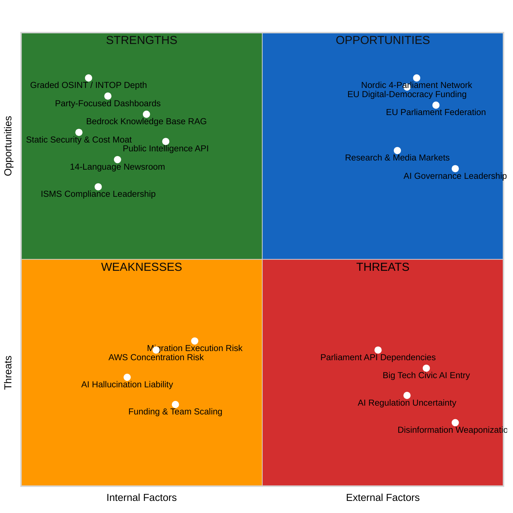
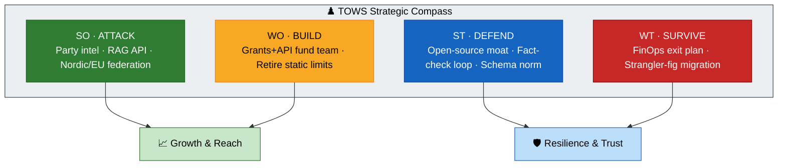
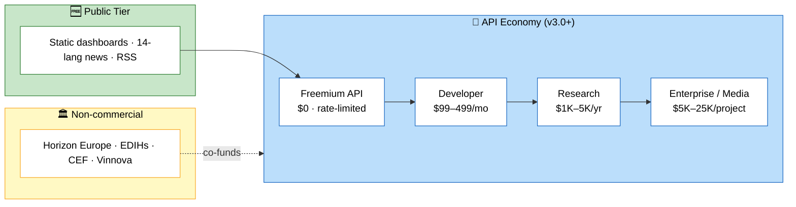
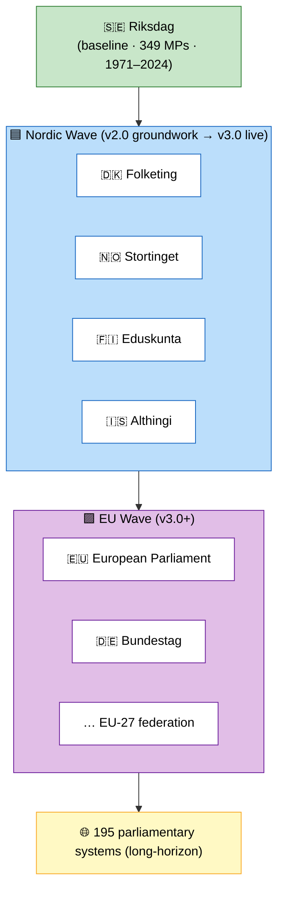
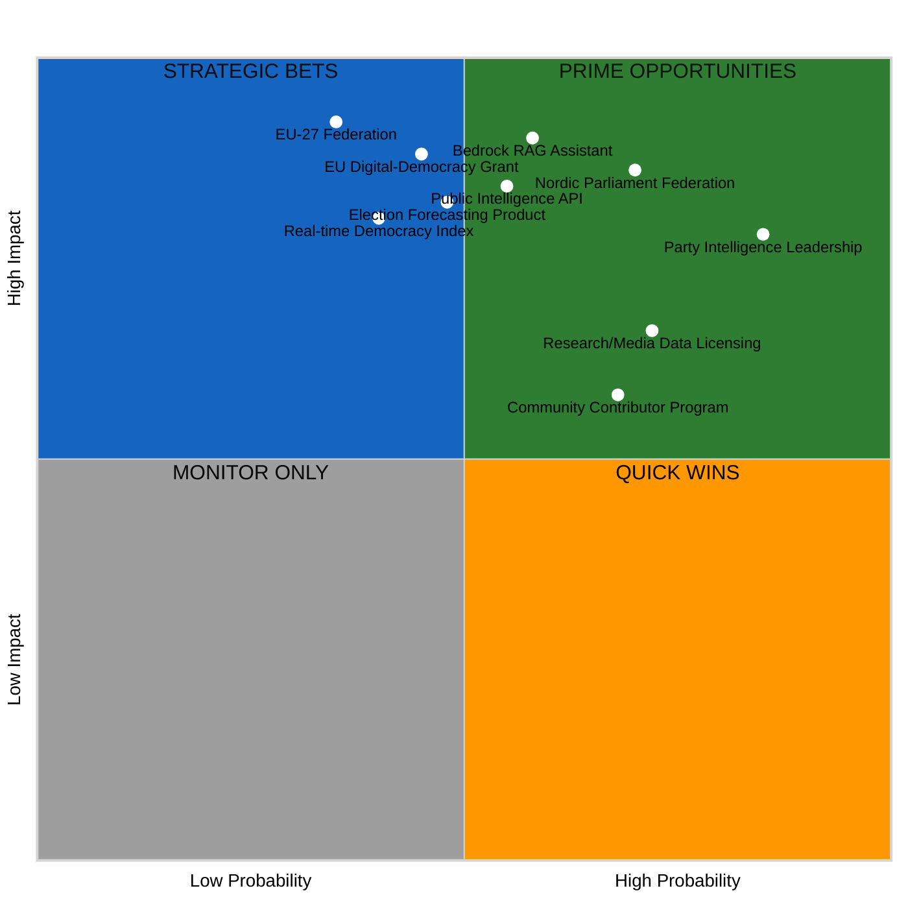
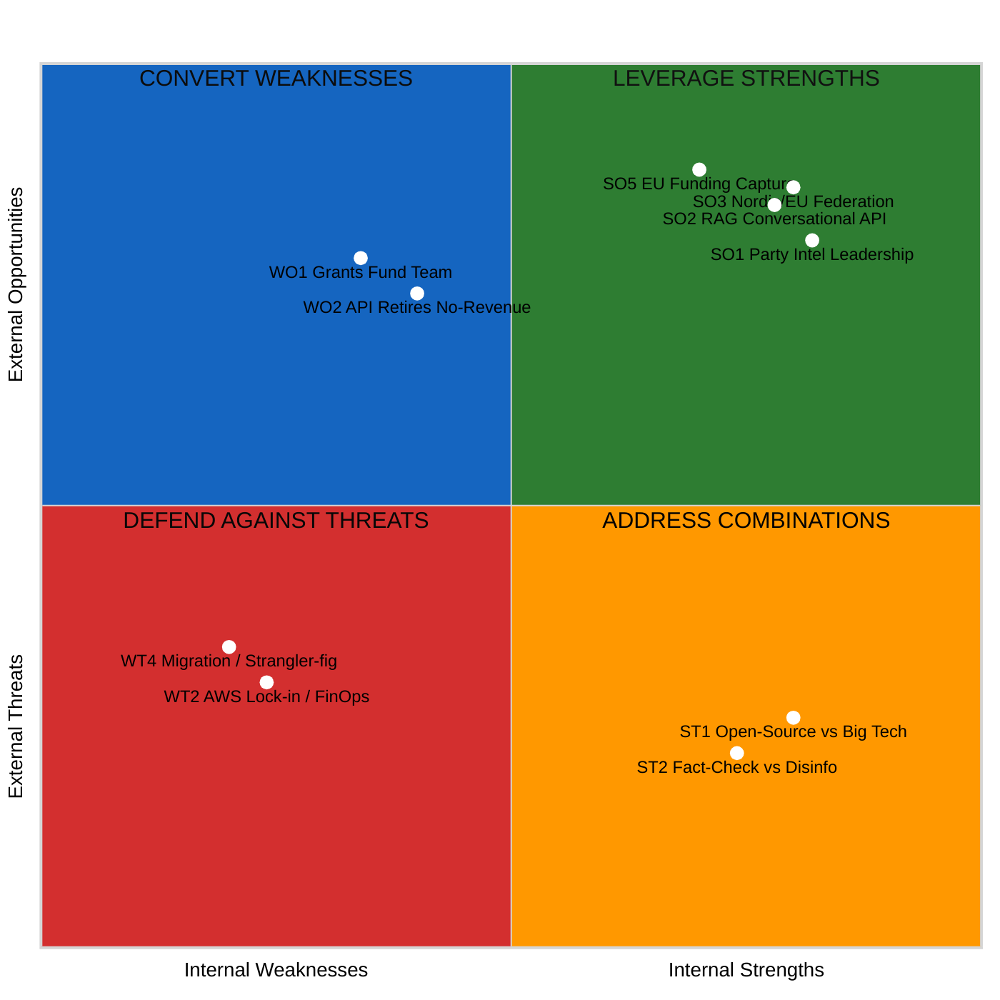
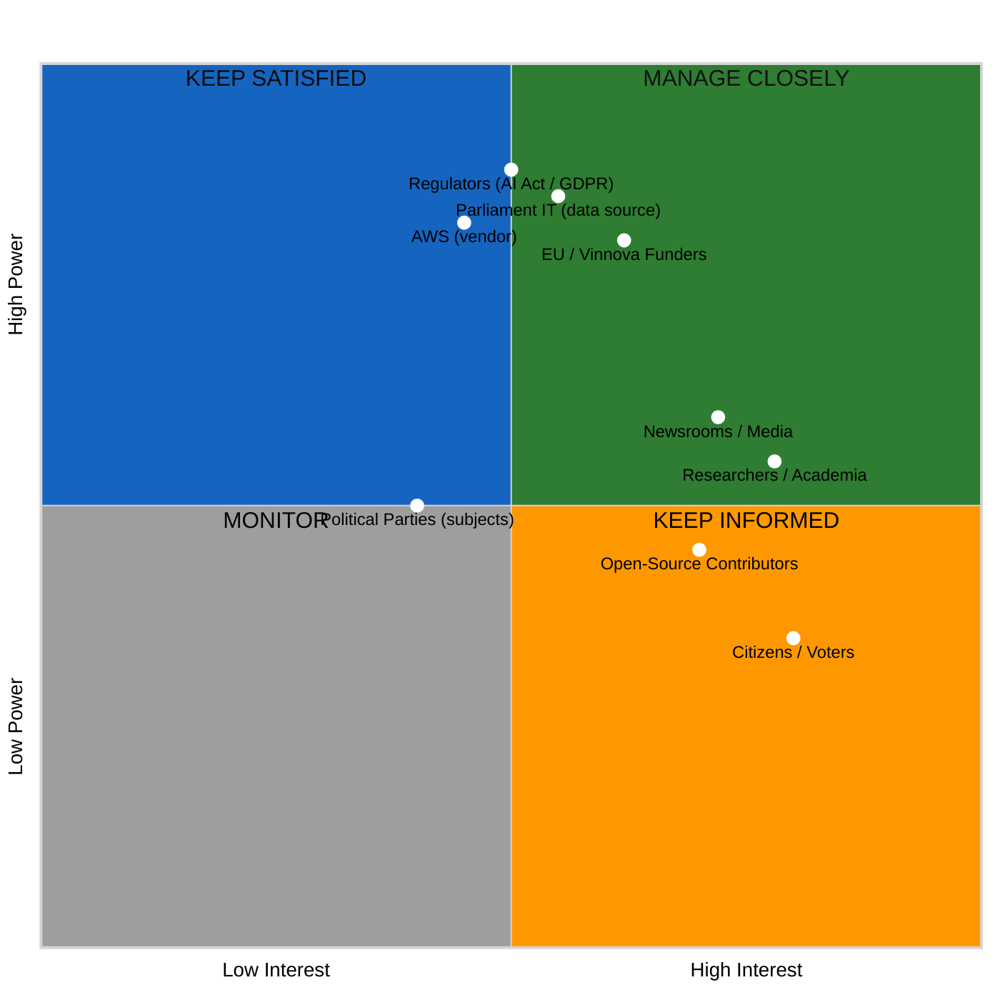

  

<h1 align="center">🚀 Riksdagsmonitor — Future SWOT Analysis</h1>

  <strong>💼 Strategic Outlook for Democratic Intelligence Evolution (2026–2037)</strong> 
  <em>🎯 v2.0 Static-Deep OSINT · v3.0+ AWS Serverless AI · API Economy · Nordic & EU Reach</em>

  
  
  
  

  
  
  
  

**📋 Document Owner:** CEO | **📄 Version:** 3.0 | **📅 Last Updated:** 2026-05-31 (UTC)  
**🔄 Review Cycle:** Quarterly | **⏰ Next Review:** 2026-08-31  
**🏢 Owner:** Hack23 AB (Org.nr 5595347807) | **🏷️ Classification:** Public

---

## 🎯 Purpose

This document provides a forward-looking SWOT analysis for Riksdagsmonitor across three strategic horizons spanning 2026–2037. It builds directly on the freshly-refreshed current-state [SWOT Analysis](SWOT.md) (v1.6) and evaluates how the deliberate two-stage strategy — **v2.0 (stay static, go deeper)** and **v3.0+ (all-in AWS serverless AI)** — reshapes Riksdagsmonitor's competitive position, revenue options, risk profile, and democratic-accountability mission.

> *"The future of democratic transparency lies at the intersection of AI, open data, and civic engagement. Our path runs from a hardened static Swedish-parliament monitor, through deeper party-focused OSINT, toward a serverless, Bedrock-powered Nordic and European democratic-intelligence platform — without ever surrendering neutrality, public-data discipline, or GDPR Article 9 guardrails."*
>
> — **James Pether Sörling, CEO, Hack23 AB**

This analysis is a Hack23 ISMS *Comprehensive Architecture Documentation Portfolio* artifact ([Secure Development Policy](https://github.com/Hack23/ISMS-PUBLIC/blob/main/Secure_Development_Policy.md)). It is paired with the sibling forward-looking documents listed in the [Architecture Documentation Map](#-architecture-documentation-map) and must be read alongside [FUTURE_ARCHITECTURE.md](FUTURE_ARCHITECTURE.md) and [FUTURE_SECURITY_ARCHITECTURE.md](FUTURE_SECURITY_ARCHITECTURE.md).

---

## 📊 Executive Summary

Riksdagsmonitor enters its forward-planning window from a position of unusual strength for a civic-technology project: **349 current MPs, 2,494 historical politicians (1971–2024), 3.5M+ recorded votes, 109,000+ documents**, **14 languages** at WCAG 2.1 AA, an **autonomous 14-workflow AI newsroom** on Claude Opus 4.8 (Sonnet 4.6 for translation), and a near-zero-cost **AWS CloudFront + multi-region S3** static delivery model with **GitHub Pages disaster recovery**. v1.0.x has shipped with **7,560+ tests** and a publicly documented ISMS.

The strategy encoded here is **explicitly two-stage**:

- **🟦 Horizon v2.0 (2026–2027) — Static-Deep.** Keep the static HTML/CSS architecture and its security and cost advantages. Invest the surplus into **party-focused dashboards** (cohesion, coalition dynamics, bloc alignment, party-vs-party comparison, agenda tracking) and **advancing OSINT/INTOP quality** (network analysis, temporal/geospatial patterns, anomaly detection, source-graded evidence, INTOP scorecards). AI remains in the *build/newsroom pipeline*; output stays static, auditable artifacts.
- **🟪 Horizon v3.0+ (2028–2037) — Serverless AI.** Migrate to **all-in AWS serverless** — Lambda, **Amazon Bedrock** (foundation models + Agents), **Bedrock Knowledge Bases** (RAG over the corpus), **API Gateway** (public intelligence API), **Amazon Cognito** (identity for personalization & API consumers), DynamoDB, Aurora Serverless v2, Neptune Serverless (graph), OpenSearch Serverless (vector/search), Timestream (time-series), Step Functions, EventBridge, Kinesis. Zero infrastructure to manage; AWS Well-Architected; multi-region resilience. This unlocks a conversational political-intelligence assistant, predictive election/vote forecasting, real-time fact-checking, a knowledge graph, and Nordic/EU federation behind a monetizable API economy.

**Key strategic findings**

| # | Finding | Horizon |
|---|---------|---------|
| 1 | The static-first moat (zero server attack surface, ~$10–15/mo) is a **deliberate runway**, not a limitation — it funds v2.0 depth without revenue. | v2.0 |
| 2 | Party-centric analytics + graded-OSINT depth is **defensible differentiation** competitors with thin data cannot quickly copy. | v2.0 |
| 3 | The v3.0+ serverless choice trades **operational simplicity (zero-infra)** for **AWS concentration risk** — a managed, documented trade-off, not an accident. | v3.0+ |
| 4 | Bedrock + Knowledge Bases convert 109K+ documents into a **conversational, source-cited RAG product** — the single largest capability leap. | v3.0+ |
| 5 | An **API economy** (freemium → research → enterprise) is the primary sustainability path against the *no-revenue* weakness. | both |
| 6 | The 10-year **AI model curve** (Opus 4.x → AGI/Post-AGI) is both the platform's biggest opportunity and its sharpest disruption/regulatory threat. | both |

**Strategic imperative:** Spend the static runway buying *analytic depth and trust* (v2.0), then convert that trust into a *serverless, API-monetized, multi-parliament intelligence platform* (v3.0+) — while holding neutrality, public-data-only discipline, GDPR Art. 9 lawful bases, and human-accountable AI governance constant across every horizon.

---

## 📚 Architecture Documentation Map

| Document | Focus | Description |
|----------|-------|-------------|
| [🏛️ Architecture](ARCHITECTURE.md) | 🏗️ C4 Models | System context, containers, components |
| [📊 Data Model](DATA_MODEL.md) | 📊 Data | Entity relationships and data dictionary |
| [🔄 Flowchart](FLOWCHART.md) | 🔄 Processes | Business and data flow diagrams |
| [📈 State Diagram](STATEDIAGRAM.md) | 📈 States | System state transitions and lifecycles |
| [🧠 Mindmap](MINDMAP.md) | 🧠 Concepts | System conceptual relationships |
| [💼 SWOT](SWOT.md) | 💼 Strategy | Current strategic analysis and positioning |
| [🛡️ Security Architecture](SECURITY_ARCHITECTURE.md) | 🔒 Security | Current security controls and design |
| [🚀 Future Security](FUTURE_SECURITY_ARCHITECTURE.md) | 🔮 Security | Planned security improvements |
| [🎯 Threat Model](THREAT_MODEL.md) | 🎯 Threats | STRIDE/MITRE ATT&CK analysis |
| [🚀 Future Architecture](FUTURE_ARCHITECTURE.md) | 🔮 Evolution | Architectural evolution roadmap |
| [📊 Future Data Model](FUTURE_DATA_MODEL.md) | 🔮 Data | Enhanced data architecture plans |
| [🔄 Future Flowchart](FUTURE_FLOWCHART.md) | 🔮 Processes | Improved process workflows |
| [📈 Future State Diagram](FUTURE_STATEDIAGRAM.md) | 🔮 States | Advanced state management |
| [🧠 Future Mindmap](FUTURE_MINDMAP.md) | 🔮 Concepts | Capability expansion plans |
| **[💼 Future SWOT](FUTURE_SWOT.md)** | **🔮 Strategy** | **Future strategic opportunities (this document)** |

---

## 📑 Table of Contents

1. [Strategic Horizons Model](#-strategic-horizons-model)
2. [Future SWOT Overview (Quadrant)](#-future-swot-overview)
3. [Horizon v2.0 SWOT Matrix (Static-Deep)](#-horizon-v20-swot-matrix-staticdeep-20262027)
4. [Horizon v3.0+ SWOT Matrix (Serverless AI)](#-horizon-v30-swot-matrix-serverless-ai-20282037)
5. [v2.0 vs v3.0+ Contrast](#-horizon-contrast-v20-vs-v30)
6. [TOWS / Strategic Options Cross-Analysis](#-tows--strategic-options-cross-analysis)
7. [Competitive Landscape](#-competitive-landscape-analysis)
8. [Market, Positioning & Revenue Models (API Economy)](#-market-positioning--revenue-models-api-economy)
9. [Nordic & EU Expansion Strategy](#-nordic--eu-expansion-strategy)
10. [AWS Vendor Lock-in vs Zero-Infra Trade-off](#-aws-vendor-lock-in-vs-zero-infrastructure-trade-off)
11. [Risk Register Tie-ins](#-risk-register-tie-ins)
12. [AI-Disruption: Opportunities & Threats](#-ai-disruption-opportunities--threats)
13. [Political-Intelligence Capability SWOT (OSINT/INTOP)](#️-political-intelligence-capability-swot-osintintop-to-2037)
14. [AI/LLM Strategic-Evolution (2026–2037)](#-aillm-strategic-evolution-20262037)
15. [Risk-Adjusted Opportunity Scoring](#-risk-adjusted-opportunity-scoring)
16. [SWOT Strategic Position Matrix](#-swot-strategic-position-matrix)
17. [Strategic Action Matrix & Roadmap](#-strategic-action-matrix--roadmap)
18. [IMF / Economic-Context Future SWOT](#-evolving-the-current-imf-strengths-into-the-future-pestle--swot)
19. [Related Documents](#-related-documents)
20. [Hack23 Ecosystem](#-hack23-ecosystem)

---

## 🧭 Strategic Horizons Model

```mermaid
graph LR
    subgraph H1["🟢 v1.x Baseline · Today (2026)"]
        A1["Static HTML/CSS · 14 langs · WCAG 2.1 AA"]
        A2["CloudFront + multi-region S3 · GitHub Pages DR"]
        A3["14 gh-aw workflows · Opus 4.8 newsroom"]
        A4["349 MPs · 2,494 historical · 3.5M votes · 109K docs"]
    end
    subgraph H2["🟦 v2.0 Static-Deep (2026–2027)"]
        B1["Party-focused dashboards"]
        B2["Advanced OSINT / INTOP quality"]
        B3["Richer 14-lang intelligence products"]
        B4["Client-side semantic search"]
    end
    subgraph H3["🟪 v3.0+ Serverless AI (2028–2037)"]
        C1["Bedrock + Knowledge Bases (RAG)"]
        C2["API Gateway + Cognito · API economy"]
        C3["Neptune graph · OpenSearch vector"]
        C4["Predictive forecasting · Nordic/EU federation"]
    end
    H1 --> H2 --> H3

    style H1 fill:#c8e6c9,stroke:#2e7d32,color:#000000
    style H2 fill:#bbdefb,stroke:#1565c0,color:#000000
    style H3 fill:#e1bee7,stroke:#6a1b9a,color:#000000
    style A1 fill:#ffffff,stroke:#2e7d32,color:#000000
    style A2 fill:#ffffff,stroke:#2e7d32,color:#000000
    style A3 fill:#ffffff,stroke:#2e7d32,color:#000000
    style A4 fill:#ffffff,stroke:#2e7d32,color:#000000
    style B1 fill:#ffffff,stroke:#1565c0,color:#000000
    style B2 fill:#ffffff,stroke:#1565c0,color:#000000
    style B3 fill:#ffffff,stroke:#1565c0,color:#000000
    style B4 fill:#ffffff,stroke:#1565c0,color:#000000
    style C1 fill:#ffffff,stroke:#6a1b9a,color:#000000
    style C2 fill:#ffffff,stroke:#6a1b9a,color:#000000
    style C3 fill:#ffffff,stroke:#6a1b9a,color:#000000
    style C4 fill:#ffffff,stroke:#6a1b9a,color:#000000
```

**Reading the model:** each horizon *builds on* — never discards — the prior one. v2.0 keeps every v1.x security and cost advantage and adds depth. v3.0+ keeps the v2.0 static delivery as a *progressive-enhancement fallback* (graceful degradation) even as dynamic Bedrock services come online. No horizon abandons the public-data-only, neutral, GDPR Art. 9 posture.

---

## 📋 Future SWOT Overview

The same factors are decomposed by horizon below: the **v2.0 matrix** scores the static-deep stage, and the **v3.0+ matrix** scores the serverless-AI stage. Reading them together exposes which strengths *carry forward*, which weaknesses are *retired by migration*, and which threats *intensify* as the surface area grows.

---

## 🟦 Horizon v2.0 SWOT Matrix (Static-Deep, 2026–2027)

**Premise:** No architecture migration. Retain static HTML/CSS, CloudFront + multi-region S3, GitHub Pages DR, lazy-loaded TypeScript dashboards (Chart.js/D3.js). Invest in *party-focused analytics* and *OSINT/INTOP quality*. AI stays in the build/newsroom pipeline.

### 💪 v2.0 Strengths

| # | Strength | Evidence / Capability |
|---|----------|------------------------|
| 2S1 | **Party-focused dashboard suite** — cohesion, coalition dynamics, bloc alignment, party-vs-party comparison, agenda tracking | Extends the ~11 existing dashboards (party, ministry, anomaly, seasonal, pre-election, politician) with Chart.js/D3.js modules over 3.5M votes |
| 2S2 | **Graded-OSINT / INTOP depth** — network analysis, temporal & geospatial patterns, anomaly detection, source-graded evidence, INTOP scorecards | Structured tradecraft already applied (ACH, SWOT, PESTLE, STRIDE, political-risk scoring) deepened into scored, citable products |
| 2S3 | **Zero-server attack surface + ~$10–15/mo cost** funds depth without revenue | Static delivery; no database PII breach risk; CloudFront DDoS absorption; 99.99%+ availability |
| 2S4 | **14-language autonomous newsroom** with daily cadence | 14 gh-aw workflows · Opus 4.8 (Sonnet 4.6 translation) · SHA-256 article integrity · quality-score gate |
| 2S5 | **Multi-source economic & governance fusion** (IMF · World Bank · SCB · Statskontoret · Riksrevisionen) under a canonical-source contract | `ECONOMIC_DATA_CONTRACT.md` v2.1; every economic claim cites an IMF vintage first |
| 2S6 | **Public ISMS & compliance leadership** as a trust differentiator | ISO 27001:2022, NIST CSF 2.0, CIS v8.1 alignment; OpenSSF Scorecard & Best Practices badges |

### 🔻 v2.0 Weaknesses

| # | Weakness | Mitigation (v2.0) |
|---|----------|-------------------|
| 2W1 | **No server-side search / personalization / API** (static constraint) | Client-side semantic search (Pagefind/Lunr.js); accept trade-off as security-positive until v3.0+ |
| 2W2 | **No revenue model** — sustainability rests on founder time | Pre-build API surface as static JSON exports; pursue EU/Vinnova grants; research data licensing |
| 2W3 | **Single-developer key-person dependency** | 23-agent Copilot ecosystem + 20+ architecture docs as compensating controls; contributor onboarding |
| 2W4 | **Dashboards are lazy-loaded JS** — accessibility/perf risk if unmanaged | WCAG 2.1 AA gate; progressive enhancement; static fallbacks for no-JS clients |
| 2W5 | **Daily batch freshness** (no real-time) | Cache-first with stale-data banners; hourly fetch targets for high-salience periods |

### 🚀 v2.0 Opportunities

| # | Opportunity | Capture Path |
|---|-------------|--------------|
| 2O1 | **Best-in-class Swedish party intelligence** before any competitor | Ship coalition/bloc analytics that no Nordic platform offers |
| 2O2 | **Research & media licensing** of structured party data | Static bulk JSON/CSV exports; academic pricing; embeddable widgets |
| 2O3 | **EU Digital-Democracy grant capture** (Horizon Europe, EDIHs, CEF) | Apply leveraging open-source + ISMS posture |
| 2O4 | **Nordic MCP groundwork** (Folketing, Stortinget, Eduskunta) | Build dataflow adapters now to de-risk v3.0 federation |

### ⚠️ v2.0 Threats

| # | Threat | Mitigation |
|---|--------|------------|
| 2T1 | **Riksdag/Regeringen/SCB API change** breaks pipeline | Schema versioning; monitoring; multi-source redundancy; archival caching |
| 2T2 | **AI-newsroom hallucination** → reputational/legal risk | Quality-score gate, source citation, correction policy, human-accountable governance |
| 2T3 | **Competing Swedish/Nordic trackers** copy surface features | Data depth (1971–2024) + graded OSINT as the moat |
| 2T4 | **Volunteer fatigue / founder burnout** | Automation, documentation, staged grant-funded hiring |

---

## 🟪 Horizon v3.0+ SWOT Matrix (Serverless AI, 2028–2037)

**Premise:** Full migration to **AWS serverless** — no Kubernetes, no containers, managed AI + serverless only, AWS Well-Architected, multi-region. The static site persists as a progressive-enhancement / DR fallback.

### 💪 v3.0+ Strengths

| # | Strength | Named Capability |
|---|----------|------------------|
| 3S1 | **Conversational political-intelligence assistant** over the corpus | **Amazon Bedrock** Agents + **Bedrock Knowledge Bases** (RAG) over 109K+ documents, source-cited |
| 3S2 | **Public political-intelligence API** as a product | **API Gateway** + **Amazon Cognito** (tiered auth) + **Lambda**; usage-metered |
| 3S3 | **Knowledge graph + semantic search** | **Neptune Serverless** (entity/relationship graph) + **OpenSearch Serverless** (vector/search) |
| 3S4 | **Predictive analytics** — election & vote forecasting, real-time fact-checking | **Timestream** time-series + **Kinesis** streaming + **Step Functions** orchestration |
| 3S5 | **Zero-infrastructure operations** — no servers to manage | Lambda, DynamoDB, Aurora Serverless v2, EventBridge; pay-per-use elasticity |
| 3S6 | **Multi-region resilience by default** | AWS Well-Architected; managed failover; carries forward static GitHub Pages DR |
| 3S7 | **Nordic & EU federation** behind one API & knowledge graph | Reuses v2.0 MCP/dataflow adapters; cross-parliament entity resolution |

### 🔻 v3.0+ Weaknesses

| # | Weakness | Mitigation |
|---|----------|------------|
| 3W1 | **AWS concentration / vendor lock-in** | Model-agnostic Bedrock abstraction; open-weight fallback; IaC portability; documented exit cost (see [trade-off](#-aws-vendor-lock-in-vs-zero-infrastructure-trade-off)) |
| 3W2 | **Variable serverless cost** vs the old ~$200/yr static floor | FinOps budgets, per-request caps, Cognito-tiered quotas, cache-first RAG |
| 3W3 | **Larger attack surface** (API, auth, dynamic compute) | Re-introduces server-side risk the static model eliminated; WAF, least-privilege IAM, threat-model refresh |
| 3W4 | **Migration execution risk** from a single team | Strangler-fig incremental migration; static fallback always live; staged cutover |
| 3W5 | **AI-output liability scales with reach** | Explainable methodology, human-accountable governance, EU AI Act transparency posture |

### 🚀 v3.0+ Opportunities

| # | Opportunity | Value |
|---|-------------|-------|
| 3O1 | **API economy** — freemium → research → enterprise tiers | Recurring revenue; addresses the no-revenue weakness |
| 3O2 | **EU-27 parliament federation** | 195 parliamentary systems addressable; EU-27 as second wave |
| 3O3 | **AI governance reference platform** for civic tech | Open methodology + AI Policy as industry template |
| 3O4 | **Conversational civic-education product** | Citizen-facing assistant in 14+ languages |
| 3O5 | **Real-time democracy index & alerting** | Streaming pipeline enables live parliamentary monitoring |

### ⚠️ v3.0+ Threats

| # | Threat | Mitigation |
|---|--------|------------|
| 3T1 | **Big-tech civic-AI entry** (Google/Microsoft/Meta) | Niche depth, open-source moat, ISMS trust, partner-not-compete |
| 3T2 | **AI regulation uncertainty** (EU AI Act phases) | Proactive compliance, transparency docs, human oversight |
| 3T3 | **Multi-parliament API fragility** at federation scale | Schema-normalization layer; archival; IT-department relationships |
| 3T4 | **Disinformation weaponization** of AI outputs | Source-grading, fact-check loop, neutrality guardrails, no-psyops policy |
| 3T5 | **Cloud cost shock / AWS price changes** | FinOps governance; static fallback caps blast radius |

---

## 🔀 Horizon Contrast: v2.0 vs v3.0+

| Dimension | 🟦 v2.0 Static-Deep | 🟪 v3.0+ Serverless AI | Net Strategic Shift |
|-----------|---------------------|------------------------|---------------------|
| **Architecture** | Static HTML/CSS + lazy TS dashboards | Lambda + Bedrock + serverless data stores | From artifacts → live services |
| **AI placement** | Build/newsroom pipeline only | Runtime: Agents, RAG, forecasting | From batch → interactive |
| **Search** | Client-side semantic (Pagefind) | OpenSearch + Neptune semantic graph | From lexical → semantic graph |
| **Data freshness** | Daily batch | Kinesis/EventBridge near-real-time | From daily → streaming |
| **Revenue** | Grants + data licensing | API economy (freemium→enterprise) | From sponsored → self-sustaining |
| **Cost profile** | Fixed ~$200/yr floor | Variable pay-per-use | Lower floor → managed elasticity |
| **Attack surface** | Near-zero (no server) | API/auth/compute (managed) | Higher surface, managed controls |
| **Vendor risk** | Minimal (S3/CloudFront/GH) | AWS-concentrated | Lock-in vs zero-infra trade-off |
| **Reach** | Sweden, deep | Nordic + EU federation | National → regional/European |
| **Resilience** | CloudFront + GH Pages DR | Multi-region serverless + static DR | DR retained and deepened |
| **Constant guardrails** | Public-data-only · neutral · GDPR Art. 9 · human-accountable AI | *Unchanged* | Non-negotiable across horizons |

**Interpretation.** The contrast is intentionally *asymmetric*: v2.0 maximizes **trust and depth at minimal risk**; v3.0+ maximizes **capability and reach at managed risk**. Weakness 2W1 (no API/search/personalization) is *retired* by v3.0+, but at the cost of new weaknesses 3W1–3W3 (lock-in, variable cost, larger surface). The migration is justified only if v2.0 first earns the trust and data depth that make a *paid* API and a *conversational* assistant credible.

---

## ♟️ TOWS / Strategic Options Cross-Analysis

TOWS converts the matrices above into actionable strategies by pairing internal factors with external ones. Strategies are tagged by the horizon that executes them.

### SO — Strengths × Opportunities (attack)

| Strategy | Strengths Used | Opportunities Captured | Horizon | Priority |
|----------|----------------|------------------------|---------|----------|
| **SO1** Ship Swedish party-intelligence leadership | 2S1, 2S2 | 2O1, 2O2 | v2.0 | 🔴 HIGH |
| **SO2** Productize 109K-doc RAG as a conversational API | 3S1, 3S2, 3S3 | 3O1, 3O4 | v3.0+ | 🔴 HIGH |
| **SO3** Federate Nordic then EU parliaments | 3S7, 2S5 | 3O2, 2O4 | v3.0+ | 🔴 HIGH |
| **SO4** Lead AI-governance reference for civic tech | 2S6, 3S5 | 3O3 | both | 🟠 MED |
| **SO5** Capture EU digital-democracy funding | 2S3, 2S6 | 2O3, 3O2 | v2.0 | 🟠 MED |

### ST — Strengths × Threats (defend)

| Strategy | Strengths Used | Threats Neutralized | Horizon | Priority |
|----------|----------------|---------------------|---------|----------|
| **ST1** Open-source + ISMS moat vs big tech | 2S6, 2S3 | 3T1 | both | 🔴 HIGH |
| **ST2** Source-graded fact-check loop vs disinformation | 2S2, 3S4 | 2T2, 3T4 | both | 🟥 CRITICAL |
| **ST3** Schema-normalization vs API fragility | 2S5, 3S3 | 2T1, 3T3 | both | 🔴 HIGH |
| **ST4** Transparency docs vs AI-Act burden | 2S6 | 2T2, 3T2 | both | 🟠 MED |
| **ST5** Static DR fallback caps cloud blast radius | 3S6, 2S3 | 3T5 | v3.0+ | 🟠 MED |

### WO — Weaknesses × Opportunities (build)

| Strategy | Weaknesses Addressed | Opportunities Captured | Horizon | Priority |
|----------|----------------------|------------------------|---------|----------|
| **WO1** Grant + API revenue funds team scaling | 2W2, 2W3 | 2O3, 3O1 | both | 🔴 HIGH |
| **WO2** API economy retires the no-revenue gap | 2W2 | 3O1 | v3.0+ | 🔴 HIGH |
| **WO3** Serverless retires static feature limits | 2W1, 2W5 | 3O4, 3O5 | v3.0+ | 🟠 MED |
| **WO4** Community contributors reduce key-person risk | 2W3 | 2O1, 3O2 | both | 🟠 MED |

### WT — Weaknesses × Threats (mitigate / survive)

| Strategy | Weaknesses Exposed | Threats Amplified | Mitigation | Horizon |
|----------|--------------------|-------------------|------------|---------|
| **WT1** Single dev + API change | 2W3, 2T1 | pipeline break | Automated monitoring + redundancy | v2.0 |
| **WT2** AWS lock-in + cost shock | 3W1, 3W2 | 3T5 | FinOps caps + open-weight/IaC exit plan | v3.0+ |
| **WT3** Larger surface + AI regulation | 3W3, 3W5 | 3T2 | Threat-model refresh + AI-Act transparency | v3.0+ |
| **WT4** Migration risk + big tech | 3W4 | 3T1 | Strangler-fig incremental cutover, static always live | v3.0+ |

---

## 🏳️ Competitive Landscape Analysis

### Direct competitors (parliamentary monitoring)

| Platform | Coverage | AI Features | Languages | Open Source | Compliance | Economic Context |
|----------|----------|-------------|-----------|-------------|------------|------------------|
| **VoteWatch EU** (legacy) | EU Parliament | Limited | EN | No | Unknown | None |
| **TheyWorkForYou** (UK) | UK Parliament | Basic | EN | Yes | Unknown | None |
| **OpenParliament** (CA) | Canada | None | EN/FR | Yes | Unknown | None |
| **ParlTrack** | EU Parliament | None | EN | Yes | Unknown | None |
| **Abgeordnetenwatch** (DE) | Bundestag | Basic | DE | Partial | Unknown | None |
| **🚀 Riksdagsmonitor v2.0** | Swedish Riksdag | Pipeline AI · graded OSINT | **14** | Yes | ISO/NIST/CIS | IMF·WB·SCB fusion |
| **🚀 Riksdagsmonitor v3.0+** | Nordic + EU | Bedrock RAG · forecasting · API | **14+** | Yes | ISO/NIST/CIS/CRA/NIS2 | Multi-provider live |

**Sustained competitive advantages**

1. **Only** platform combining 14-language autonomous newsroom with graded OSINT/INTOP tradecraft.
2. **Only** civic-tech parliamentary monitor with publicly documented, multi-framework ISMS.
3. **Deepest** historical depth (1971–2024) + multi-source economic/governance fusion — a data moat competitors cannot quickly replicate.
4. v3.0+ adds the **only** source-cited conversational RAG assistant + public intelligence API in the Nordic/EU civic space.

### Indirect competitors (AI news & analytics)

| Platform | Political Focus | AI Depth | Source Transparency | Threat Level |
|----------|-----------------|----------|---------------------|--------------|
| General AI news aggregators | Low | High | Low | 🟠 Medium |
| Legacy political media (Politico, DN, SvD) | High | Low | Editorial | 🟡 Low–Med |
| Big-tech civic-AI (hypothetical) | Variable | Very High | Variable | 🔴 High (if entered) |
| **Riksdagsmonitor** | Very High | High → Very High | **Source-graded, public** | — |

**Positioning verdict:** Riksdagsmonitor wins on *trust × depth × transparency*, not on raw model scale. The strategy deliberately avoids competing on compute; it competes on **auditable, neutral, source-cited democratic intelligence**.

---

## 💰 Market, Positioning & Revenue Models (API Economy)

| Revenue Stream | Mechanism (AWS) | Target Segment | Indicative Pricing | Maturity |
|----------------|------------------|----------------|--------------------|----------|
| **Freemium API** | API Gateway + Cognito + Lambda | Civic devs, students | Free, rate-limited | v3.0 launch |
| **Developer API** | Metered usage tiers | Startups, apps | $99–499/mo *(target)* | v3.0 |
| **Research data** | Bulk export + API | Universities, think tanks | $1K–5K/yr *(target)* | v2.0→v3.0 |
| **Enterprise / media** | Dedicated quotas, SLAs | Newsrooms, corporates | $5K–25K/project *(target)* | v3.0+ |
| **Grants / co-funding** | Project-based | EU, Vinnova | €100K–500K *(target)* | v2.0 |

> ⚠️ All figures are **strategic targets**, not achieved revenue. Break-even target: **≥ €50K ARR by 2028** as the primary answer to weakness 2W2 (no revenue). Pricing reflects the API-economy positioning; final tiers will be validated against research/media demand discovered in v2.0.

**Positioning statement:** *"The trusted, neutral, source-cited intelligence layer for Nordic and European parliamentary data — free for citizens, metered for builders, governed by a public ISMS."*

---

## 🌍 Nordic & EU Expansion Strategy

| Wave | Parliaments | Enabler | Horizon | Sibling Asset |
|------|-------------|---------|---------|----------------|
| Baseline | Sweden | riksdag-regering MCP | v1.x | This repo |
| Nordic | Denmark, Norway, Finland, Iceland | MCP/dataflow adapters built in v2.0; Neptune entity resolution in v3.0 | v2.0→v3.0 | SNA 2008 / GFSM 2014 peer consistency |
| EU | European Parliament + EU-27 | API Gateway federation; [European Parliament MCP](https://github.com/Hack23/european-parliament-mcp) | v3.0+ | [EU Parliament Monitor](https://www.euparliamentmonitor.com) |
| Global | 195 systems | Knowledge-graph federation | long-horizon | Hack23 ecosystem |

**De-risking principle:** Nordic MCP/dataflow adapters are built *during v2.0* (opportunity 2O4) so the v3.0 federation is an *integration*, not a *greenfield build*. Cross-country entity resolution reuses the same SNA/GFSM/BPM6 peer methodology already used for IMF Nordic comparisons (SWE/NOR/DNK/FIN).

---

## ⚖️ AWS Vendor Lock-in vs Zero-Infrastructure Trade-off

The v3.0+ choice to go **all-in AWS serverless** is the single most consequential strategic bet in this document. It is made with eyes open.

```mermaid
graph LR
    subgraph BENEFIT["✅ Zero-Infra Benefits"]
        Z1["No Kubernetes / no containers"]
        Z2["Managed AI (Bedrock) + serverless scale-to-zero"]
        Z3["Multi-region resilience by default"]
        Z4["Tiny ops team — fits single-dev reality"]
    end
    subgraph COST["⚠️ Lock-in Costs"]
        L1["AWS-specific Bedrock/Neptune/Timestream APIs"]
        L2["Variable, harder-to-predict billing"]
        L3["Larger managed attack surface"]
        L4["Exit cost if AWS pricing/terms shift"]
    end
    subgraph MITI["🛡️ Mitigations"]
        M1["Model-agnostic Bedrock abstraction + open-weight fallback"]
        M2["FinOps budgets · per-request caps · Cognito quotas"]
        M3["IaC-portable patterns · documented exit runbook"]
        M4["Static site retained as DR / progressive-enhancement fallback"]
    end
    BENEFIT --> DECISION{{"Strategic Decision:<br/>Accept managed lock-in<br/>for capability + ops simplicity"}}
    COST --> DECISION
    DECISION --> MITI

    style BENEFIT fill:#c8e6c9,stroke:#2e7d32,color:#000000
    style COST fill:#ffcdd2,stroke:#c62828,color:#000000
    style MITI fill:#bbdefb,stroke:#1565c0,color:#000000
    style DECISION fill:#fff9c4,stroke:#f9a825,color:#000000
    style Z1 fill:#ffffff,stroke:#2e7d32,color:#000000
    style Z2 fill:#ffffff,stroke:#2e7d32,color:#000000
    style Z3 fill:#ffffff,stroke:#2e7d32,color:#000000
    style Z4 fill:#ffffff,stroke:#2e7d32,color:#000000
    style L1 fill:#ffffff,stroke:#c62828,color:#000000
    style L2 fill:#ffffff,stroke:#c62828,color:#000000
    style L3 fill:#ffffff,stroke:#c62828,color:#000000
    style L4 fill:#ffffff,stroke:#c62828,color:#000000
    style M1 fill:#ffffff,stroke:#1565c0,color:#000000
    style M2 fill:#ffffff,stroke:#1565c0,color:#000000
    style M3 fill:#ffffff,stroke:#1565c0,color:#000000
    style M4 fill:#ffffff,stroke:#1565c0,color:#000000
```

| Question | Position |
|----------|----------|
| Why accept lock-in? | A single-developer/small-team org cannot operate Kubernetes, vector DBs, and streaming pipelines by hand. Managed serverless makes v3.0+ *feasible at all*. |
| What is the exit cost? | Highest for Bedrock Agents/Knowledge Bases and Neptune; lowest for Lambda/DynamoDB/API Gateway (portable patterns). Documented in a future-architecture exit runbook. |
| What caps the downside? | The **static site is never decommissioned** — it remains the DR and no-JS fallback, so an AWS outage or pricing shock degrades to v2.0, not to zero. |
| Is data portable? | Yes — corpus is public open data with provenance sidecars; re-ingestion into another vector store is mechanical, not proprietary. |

**Verdict:** The lock-in is a *deliberate, mitigated, reversible-at-cost* trade chosen for **capability + operational simplicity**, anchored by an always-live static fallback (weakness 3W1 is accepted, not ignored).

---

## 📉 Risk Register Tie-ins

These future strategic risks map to the enterprise [Risk Register](https://github.com/Hack23/ISMS-PUBLIC/blob/main/Risk_Register.md) and the current [THREAT_MODEL.md](THREAT_MODEL.md) (v1.5, per-integration STRIDE).

| Risk ID | Risk | Likelihood | Impact | Horizon | Treatment | SWOT link |
|---------|------|------------|--------|---------|-----------|-----------|
| FR-01 | Migration execution failure | Medium | High | v3.0+ | Strangler-fig, static fallback | 3W4 / WT4 |
| FR-02 | AWS concentration / pricing shock | Medium | Medium-High | v3.0+ | FinOps + exit runbook | 3W1, 3W2 / WT2 |
| FR-03 | AI-output hallucination liability | Medium | High | both | Fact-check loop, human governance | 2T2, 3W5 / ST2 |
| FR-04 | Parliament API fragility at scale | Medium-High | High | both | Schema norm + archival | 2T1, 3T3 / ST3 |
| FR-05 | AI-regulation compliance burden | Medium-High | Medium | both | Proactive AI-Act posture | 3T2 / ST4 |
| FR-06 | Funding / team-scaling shortfall | High (if unaddressed) | High | both | API economy + grants | 2W2, 2W3 / WO1 |
| FR-07 | Big-tech civic-AI entry | Low | Critical | v3.0+ | Niche depth + open-source moat | 3T1 / ST1 |
| FR-08 | Disinformation weaponization | Low-Med | Critical | both | Source-grading, neutrality, no-psyops | 3T4 / ST2 |

**Tie-in principle:** every future SWOT factor is traceable to a treatable risk and a mitigating TOWS strategy — no orphaned threats. New v3.0+ attack surface (API, auth, dynamic compute) requires a **threat-model refresh** before cutover (see [FUTURE_SECURITY_ARCHITECTURE.md](FUTURE_SECURITY_ARCHITECTURE.md)).

---

## 🤖 AI-Disruption: Opportunities & Threats

AI is simultaneously the platform's largest opportunity surface and its sharpest threat vector. The same capability that powers a source-cited RAG assistant can, mis-governed, produce hallucinated or weaponizable political content.

| Axis | 🚀 Opportunity | ⚠️ Threat | Guardrail |
|------|---------------|-----------|-----------|
| **Generation** | Daily 14-lang newsroom; conversational assistant | Hallucination → reputational/legal harm | Quality-score gate, source citation, correction policy |
| **Forecasting** | Election/vote prediction as a paid product | Over-confident or biased forecasts mislead | Explainable models, uncertainty disclosure, neutrality |
| **Search** | Semantic RAG over 109K+ docs | Synthesized answers that drift from sources | Knowledge-Base citations mandatory; no uncited claims |
| **Automation** | Self-healing pipelines, agentic CI/CD | Autonomy outpaces human accountability | Human-accountable governance per Hack23 AI Policy |
| **Disinformation** | Real-time fact-checking as defense | Adversaries weaponize generated content | Public-data-only, no-psyops, source-grading |
| **Regulation** | Compliance leadership as differentiator | Shifting EU AI Act obligations | Proactive transparency, audit-ready docs |

**Governing rule (constant across all horizons):** AI **augments** democratic accountability under human governance; it is **never** used for surveillance, persuasion operations, or partisan advantage. Every economic claim still cites an IMF vintage first; every political claim still ties to `dok_id`, named actor, or vote count. Neutrality and GDPR Art. 9 lawful bases (9(2)(e) publicly made, 9(2)(g) substantial public interest) are non-negotiable.

---

## 🛰️ Political-Intelligence Capability SWOT (OSINT/INTOP, to 2037)

This SWOT scores the strategic position of the platform **as a political-intelligence capability**, against the [Political-Intelligence Capability Catalog](FUTURE_MINDMAP.md#-theme--political-intelligence-capability-catalog-to-2037--the-master-osintintop-map) (C1–C32). The framing question for an intelligence operative is blunt: *with these capabilities fielded, what edge do we hold — and what is the strategic cost of NOT building them?*

### 💪 Strengths (from fielding C1–C32)

| # | Strength | Capability | Why it matters |
|---|----------|-----------|----------------|
| S1 | **Reproducible, evidence-anchored tradecraft** — every judgment traces to a `dok_id` and Admiralty grade | C8, C22 | Defensible against legal challenge and accusations of bias; unique versus opaque commercial analytics |
| S2 | **Multi-INT fusion over a single public ground-truth** | C1, C6 | Connections (vote × funding × lobbying) no single-source competitor can see |
| S3 | **Continuous indications &amp; warning**, not just retrospective reporting | C14 | Shifts product from *history* to *foresight* — the highest-value intelligence good |
| S4 | **Calibrated, scored forecasting** (rolling Brier as a release metric) | C13, C29 | Trust compounds: a publicly-calibrated forecaster is rare and hard to copy |
| S5 | **Structured-analytic-technique automation at scale** (ACH, devil's advocate, ICD-203) | C11, C22 | Institutional-grade rigor at marginal cost; resists single-analyst bias |
| S6 | **Counter-AI &amp; provenance defense built-in** (C2PA, injection screening, neutrality gate) | C26–C32 | Integrity becomes a moat as synthetic media floods the information space |

### 🔻 Weaknesses (capability-program risks)

| # | Weakness | Mitigation |
|---|----------|-----------|
| W1 | Fusion &amp; entity-resolution accuracy bounded by public-record quality and identifier gaps | Confidence-scored links, human-review hold-queue, never publish ambiguous links |
| W2 | Calibration needs **resolved events** to mature — cold-start on rare events (coalition collapse) | Ensemble + scenario LLM priors; widen WEP bands when n is low |
| W3 | FIMI detection risks false positives and ethics exposure | Aggregate-only, no citizen profiling, advisory-not-accusatory, hard ethics gate |
| W4 | Operating the full intelligence cycle continuously raises compute &amp; token cost | Horizon-phased rollout; serverless scale-to-zero; tripwire-gated retasking |

### 🚀 Opportunities

| # | Opportunity | Capability |
|---|-------------|-----------|
| O1 | Become the **reference open political-intelligence capability** for Nordic/EU democracies | C1–C32 |
| O2 | **Estimative products &amp; warning feeds** as a premium, defensible API tier | C14, C22 |
| O3 | **Election &amp; coalition foresight** with published calibration as a category-defining product | C13 |
| O4 | **Counter-FIMI early-warning** positions the platform as democratic-resilience infrastructure | C20 |
| O5 | Cross-parliament fusion (EU/Nordic) creates a comparative-intelligence dataset nobody else holds | C6 |

### ⚠️ Threats (including the cost of NOT building these)

| # | Threat | If we DON'T field the capability |
|---|--------|----------------------------------|
| T1 | Adversarial **FIMI &amp; synthetic media** swamp the public record | Without C8/C9/C20 the platform cites poisoned evidence and loses trust |
| T2 | **Prompt-injection / data-poisoning** of the analytic pipeline | Without C26–C28 an attacker steers published judgments |
| T3 | Competitors ship opaque "AI predictions" first | Without calibrated C13 we cede the foresight market to unaccountable actors |
| T4 | Perceived partisanship destroys credibility | Without the C31 party-symmetry gate one asymmetric output ends institutional trust |
| T5 | Regulatory scrutiny of political-data AI | Without C30 audit-trails and ICD-203 discipline, compliance becomes existential |

**Strategic verdict.** The catalog converts a respected *transparency publisher* into a *political-intelligence capability*. The defining moat is **integrity-by-construction** (evidence, calibration, neutrality, provenance) — the one thing well-funded commercial and adversarial actors find hardest to fake. Not building these is not "staying simple"; it is conceding foresight and information-integrity ground to actors who will not honor the same guardrails.

---

## 🧠 AI/LLM Strategic-Evolution (2026–2037)

**Assumptions.** Major AI model upgrades arrive roughly **annually**, with minor refreshes between. Competitors (OpenAI, Google DeepMind, Meta, xAI, Mistral / EU sovereign AI, Chinese labs) are **evaluated at each release** via Amazon Bedrock's multi-model access. The architecture is designed to **accommodate paradigm shifts** (quantum AI, neuromorphic computing) and AGI/post-AGI transitions. All adoption is governed by the [Hack23 AI Policy](https://github.com/Hack23/ISMS-PUBLIC/blob/main/AI_Policy.md) with human accountability retained at every capability level.

### AI Model Evolution — DevSecOps & development perspective (verbatim)

| Year | AI Model | DevSecOps Capability Evolution |
|------|----------|--------------------------------|
| 2026 | Opus 4.6–4.9 | 🟢 AI-assisted code review, automated test generation, agentic CI/CD workflows |
| 2027 | Opus 5.x | 🔵 Predictive vulnerability detection, intelligent dependency management |
| 2028 | Opus 6.x | 🟣 Multi-modal security analysis (code + architecture + runtime), automated threat modeling |
| 2029 | Opus 7.x | 🟠 Autonomous security pipeline orchestration, self-healing build systems |
| 2030 | Opus 8.x | 🔴 Near-expert automated security review, AI-driven architecture validation |
| 2031–2033 | Opus 9–10.x / Pre-AGI | ⚪ Autonomous secure development lifecycle management |
| 2034–2037 | AGI / Post-AGI | ⭐ Transformative software engineering with built-in security assurance |

### Translating the AI curve into product, data & strategy terms

The same curve unlocks **product and analytic** capability — not only DevSecOps. The table below maps each generation to OSINT, party analytics, forecasting, data architecture, and strategic positioning.

| Year | Model | OSINT / INTOP | Party Analytics & Forecasting | Data / Platform | Strategic Implication |
|------|-------|---------------|-------------------------------|-----------------|------------------------|
| 2026 | Opus 4.6–4.9 | 14-lang newsroom; graded-evidence drafting | Party cohesion & coalition dashboards (v2.0) | Static artifacts + pipeline AI | Win Swedish party-intel leadership |
| 2027 | Opus 5.x | Autonomous network/temporal analysis; richer scorecards | Real-time fact-checking; bloc-alignment trends | Nordic MCP groundwork | De-risk federation; grant capture |
| 2028 | Opus 6.x | Multi-modal evidence synthesis (text+chart+map) | Knowledge-synthesis briefings; first forecasts | **Bedrock + Knowledge Bases (RAG) go live** | v3.0 launch; conversational assistant |
| 2029 | Opus 7.x | Automated investigative threads, source-graded | Predictive policy-impact & vote forecasting | Neptune graph + OpenSearch vector | API economy scales; EU wave begins |
| 2030 | Opus 8.x | Near-expert political analysis | Expert-level election modelling | Streaming (Kinesis/Timestream) real-time | Real-time democracy index product |
| 2031–2033 | Opus 9–10.x / Pre-AGI | Autonomous democratic-intelligence synthesis | Continuous, self-updating forecasts | Self-managing serverless lifecycle | Multi-parliament platform maturity |
| 2034–2037 | AGI / Post-AGI | Transformative, globally-scaled accountability | Superhuman comparative analysis (195 systems) | Paradigm-adaptive architecture | Mission at global scale, ethics-bound |

### Competitive LLM landscape to monitor

| Lab | Models | Strength | Relevance |
|-----|--------|----------|-----------|
| 🟢 Anthropic | Opus 4.x → 9–10.x | Reasoning, agentic, safety | **Primary** (Bedrock) |
| 🔵 OpenAI | GPT-5/6+ | Reasoning, multi-modal | Benchmark rival |
| 🟠 Google DeepMind | Gemini Ultra+ | Search + knowledge | Benchmark rival |
| 🟣 Meta | Llama 5+ | Open-weight leader | **Self-host fallback** |
| 🟡 Mistral / EU sovereign | EU-aligned | GDPR/regulatory fit | EU-data-residency option |
| 🔴 xAI | Grok 3+ | Real-time data | Niche monitor |
| ⚪ Chinese labs | DeepSeek, Qwen | Cost-competitive | Geopolitical caution |

**Multi-model strategy:** Bedrock provides model-family access behind a service abstraction; new models are benchmarked at each release against current performance; open-weight (Llama/Mistral) remains a self-host fallback that also serves as an AWS-lock-in mitigation (3W1). The platform is **AGI-prepared**: increasingly capable models are leveraged, but human-accountable governance, neutrality, and public-data discipline are held constant regardless of capability level.

### AGI transition scenarios (2033–2037)

- 📊 **Optimistic** — AGI enables real-time, source-cited accountability across all 195 parliamentary systems; Riksdagsmonitor is the neutral reference layer.
- ⚖️ **Moderate** — annual capability gains continue; near-expert comparative analysis by ~2035 across Nordic + EU.
- ⚠️ **Disruptive** — new paradigms (quantum/neuromorphic) obsolete current architectures; managed serverless + IaC portability cushions a redesign.
- 🛡️ **Constant** — human oversight, democratic-ethics, GDPR Art. 9, neutrality, and no-psyops apply at *every* capability level.

---

## 📈 Risk-Adjusted Opportunity Scoring

**Quadrant guidance:** *Prime Opportunities* (party intelligence, Nordic federation, research licensing) are executed first because they are both probable and impactful and largely v2.0-deliverable. *Strategic Bets* (Bedrock RAG, API, forecasting, EU-27) are high-impact but require the v3.0+ migration — sequenced after v2.0 earns trust and data depth.

---

## 🎯 SWOT Strategic Position Matrix

---

## 👥 Stakeholder Power–Interest Analysis

Strategic options succeed or fail on stakeholder alignment. The map below positions key stakeholders by their **power** to affect the platform and their **interest** in its trajectory, with the engagement posture each warrants across horizons.

| Stakeholder | Posture | Engagement Strategy | Horizon Sensitivity |
|-------------|---------|---------------------|---------------------|
| **Citizens / voters** | Keep informed | Free public tier, 14-lang accessibility, plain-language intelligence | Constant — mission core |
| **Researchers / academia** | Manage closely | Data licensing, API research tier, reproducible provenance | v2.0 licensing → v3.0 API |
| **Newsrooms / media** | Manage closely | Bulk exports, embeddable widgets, enterprise API | v2.0→v3.0+ |
| **Parliament IT departments** | Keep satisfied | Respectful rate limits, relationship-building, schema-change monitoring | Critical for FR-04 |
| **EU / Vinnova funders** | Keep satisfied | Grant alignment, open-source + ISMS evidence | v2.0 funding window |
| **AWS (vendor)** | Keep satisfied | Well-Architected reviews, FinOps discipline, exit-runbook hedge | v3.0+ (lock-in 3W1) |
| **Regulators (AI Act/GDPR)** | Keep satisfied | Proactive transparency, Art. 9 lawful-basis docs, human accountability | both — non-negotiable |
| **Open-source contributors** | Manage closely | Onboarding, 20+ architecture docs, contributor governance | reduces 2W3 key-person risk |
| **Political parties (subjects)** | Monitor | Strict neutrality, equal treatment, right-of-reply correction policy | constant — neutrality guardrail |

**Neutrality note:** political parties are *subjects of analysis*, never *clients*. The platform owes them accuracy, equal treatment, and a correction channel — never favourable coverage. This is enforced by the no-psyops, public-data-only, source-graded discipline that holds across every horizon.

---

## 🛡️ ISMS / Framework Strategic-Control Mapping

Each future strategic move carries a security-governance obligation. The mapping ties SWOT factors to ISO 27001:2022, NIST CSF 2.0, and CIS Controls v8.1 so that growth never outruns governance.

| Strategic Move | SWOT Link | ISO 27001:2022 | NIST CSF 2.0 | CIS v8.1 | Obligation |
|----------------|-----------|----------------|--------------|----------|------------|
| Public intelligence API + Cognito | 3S2 / 3W3 | A.5.15 Access control; A.8.3 | PR.AA (Identity & Auth) | CIS 6 (Access) | Tiered auth, least-privilege IAM, WAF |
| Bedrock RAG over corpus | 3S1 | A.5.34 Privacy/PII; A.8.28 | GV.OC; PR.DS | CIS 3 (Data) | Source-citation enforcement, no-uncited-claims |
| Serverless migration | 3W4 / WT4 | A.8.25 Secure SDLC; A.8.32 | PR.PS; ID.RA | CIS 16 (App Sec) | Strangler-fig, threat-model refresh pre-cutover |
| AWS concentration | 3W1 / FR-02 | A.5.19–5.22 Supplier mgmt | GV.SC (Supply Chain) | CIS 15 (Service Providers) | Exit runbook, open-weight fallback |
| AI-output governance | 2T2 / 3W5 | A.5.1 Policies; A.8.16 Monitoring | GV.RM; DE.AE | CIS 8 (Audit Logs) | Human accountability, correction SLA |
| Multi-parliament data fusion | 3T3 / FR-04 | A.5.23 Cloud; A.8.14 Redundancy | PR.IR; RC.RP | CIS 11 (Data Recovery) | Schema norm, archival, redundancy |
| Disinformation defense | 3T4 / FR-08 | A.5.7 Threat intel | ID.RA; DE.CM | CIS 13 (Network Monitoring) | Source-grading, fact-check loop |

**Governance principle:** no v3.0+ capability ships without its corresponding control mapped and a threat-model refresh ([FUTURE_SECURITY_ARCHITECTURE.md](FUTURE_SECURITY_ARCHITECTURE.md)). Compliance leadership (2S6) is treated as a *product feature* that opens government and institutional markets, not as overhead.

---

## 🗺️ Strategic Action Matrix & Roadmap

### Strategic action matrix

| Theme | Actions (2026–2037) | KPI / Target | Horizon | Owner |
|-------|---------------------|--------------|---------|-------|
| **Party Intelligence** | Coalition/bloc/agenda dashboards; graded OSINT scorecards | Best-in-class Swedish party suite shipped | v2.0 | Product |
| **Newsroom Quality** | Deepen INTOP grading; fact-check loop | Quality score ≥ 0.8; correction SLA | v2.0 | Editorial |
| **API Economy** | Freemium → research → enterprise tiers | ≥ €50K ARR by 2028 *(target)* | v3.0 | Business |
| **Serverless Migration** | Bedrock, Knowledge Bases, API Gateway, Cognito | Strangler-fig cutover; static fallback live | v3.0+ | CTO |
| **Nordic/EU Expansion** | Folketing, Stortinget, Eduskunta; EU Parliament | 4 Nordic + EU federation | v2.0→v3.0+ | Product |
| **AI Governance** | Multi-model eval; AI-Act transparency | Latest model within 30 days; zero critical findings | both | CTO/Security |
| **ISMS Leadership** | ISO 27001 path; CRA/NIS2 readiness | 100% controls; clean audits | both | Security |
| **Sustainability** | Grants + contributors + API revenue | ≥ 8 contributors; break-even 2028 | both | CEO |

### Multi-year roadmap

| Year | Horizon | Key Deliverables | Success KPIs *(targets)* |
|------|---------|------------------|--------------------------|
| **2026** | v2.0 | Party dashboards, graded OSINT, client-side search, Nordic MCP groundwork, EU grant application | Party suite live; 1 grant submitted; ≥ 1 external contributor |
| **2027** | v2.0→v3.0 | Real-time fact-check, research licensing, Bedrock PoC, ISO 27001 path | First research revenue; RAG PoC validated |
| **2028** | v3.0 | **Bedrock + Knowledge Bases live**, API Gateway + Cognito, Nordic parliaments | API beta; ≥ €50K ARR; 4 Nordic parliaments |
| **2029** | v3.0+ | Neptune graph, OpenSearch vector, forecasting, EU wave | Forecasting product; EU Parliament integrated |
| **2030** | v3.0+ | Streaming real-time, democracy index, media product | Real-time index; ≥ €150K ARR *(target)* |
| **2031–2033** | v3.0+ | Self-managing serverless; multi-parliament maturity | 10+ parliaments; autonomous SDLC |
| **2034–2037** | v3.0+ | AGI-era global accountability, ethics-bound | Global reference layer; neutrality intact |

---

## 🌐 Evolving the Current IMF Strengths into the Future PESTLE / SWOT

*Baseline: the **already-implemented** IMF strengths/weaknesses/threats are documented in [`SWOT.md`](SWOT.md) §S10 (Multi-Source Economic & Governance Data Fusion). The rows below describe future-state strengths that **add** to that baseline (commercial-provider redundancy, real-time feeds, federation reuse) rather than introducing IMF for the first time.*

> **Authoritative hub:** [`analysis/imf/README.md`](analysis/imf/README.md) · [`analysis/imf/agentic-integration.md`](analysis/imf/agentic-integration.md) · [`analysis/imf/indicators-inventory.json`](analysis/imf/indicators-inventory.json) · [`analysis/imf/data-dictionary.md`](analysis/imf/data-dictionary.md) · [`.github/aw/ECONOMIC_DATA_CONTRACT.md`](.github/aw/ECONOMIC_DATA_CONTRACT.md)

### IMF-specific Strengths added by the future state (on top of today's baseline)

| # | Strength | Evidence | Horizon |
|---|----------|----------|---------|
| S-IMF-1 | Multi-provider economic data (IMF-primary + WB-residue + SCB-Sweden) prevents single-source failure | Three independent egress paths; provider-mix audit telemetry | v2.0 |
| S-IMF-2 | T+5 projections enable look-ahead workflows (`week-ahead`, `month-ahead`, `weekly-review`, `monthly-review`) | IMF WEO + FM publish projections WB cannot match | v2.0 |
| S-IMF-3 | Cross-country peer consistency on SNA 2008 / GFSM 2014 / BPM6 powers Nordic federation | SWE/NOR/DNK/FIN single-methodology comparisons reused for v3.0 expansion | v2.0→v3.0 |
| S-IMF-4 | Vintage-discipline contract (>6 mo → staleness annotation) prevents silent macro drift | Codified in `ECONOMIC_DATA_CONTRACT.md` v2.1 | both |
| S-IMF-5 | Free, public, anonymous API — no licence cost, no auth credential management | Reduces operational and supply-chain risk; aligns with public-data-only posture | both |
| S-IMF-6 | Bedrock Knowledge Base can index economic vintages for RAG-grounded macro answers | Future: economic series become conversational, source-cited | v3.0+ |

### IMF-specific Weaknesses

| # | Weakness | Mitigation |
|---|----------|------------|
| W-IMF-1 | IMF SDMX 3.0 schema can break between WEO cycles (Apr/Oct) | Version-pinned client guard; integration test gate |
| W-IMF-2 | IMF API rate limits (~30 req/min observed) | Cache-first strategy + exponential back-off; v3.0 Lambda caching layer |
| W-IMF-3 | IMF lacks WGI / environment / education residue data | World Bank covers the residue (documented in provider matrix) |

### IMF-specific Opportunities

- Cross-validate IMF SWE figures against SCB national-accounts (>0.3pp delta → editorial review) as a published trust signal.
- Extend to other Nordic platforms by reusing the IMF dataflow registry — directly feeds v3.0 federation (S-IMF-3).
- Publish the provenance graph as open data — first political-journalism platform to do so; a v3.0 knowledge-graph differentiator.

### IMF-specific Threats (PESTLE Economic axis)

- **Political** — IMF Article IV consultation cycle changes affect data-release cadence.
- **Economic** — Swedish krona devaluation alters IMF cross-country comparability windows.
- **Technological** — IMF Datamapper deprecation (multi-year roadmap risk) → SDMX 3.0 fallback.
- **Legal** — IMF data licence requires attribution; codified in the article footer template.
- **Environmental** — none direct.
- **Social** — none direct (IMF data is anonymous; no GDPR special-category exposure).

**Canonical rule.** Every economic claim in a Riksdagsmonitor article cites an IMF dataflow first; World Bank citations are reserved for governance, environment and social residue (the classes IMF does not publish). SCB is the Swedish-specific ground-truth layer. See [`ECONOMIC_DATA_CONTRACT.md`](.github/aw/ECONOMIC_DATA_CONTRACT.md) v2.1 for the banned-phrase list and vintage discipline (>6 mo → annotation). This rule is **horizon-invariant** — it holds in static v2.0 and in serverless v3.0+ RAG answers alike.

---

## ✅ Strategic Execution Priorities (Q3–Q4 2026)

| Priority | Initiative | Deadline | Owner | Success Metric |
|----------|-----------|----------|-------|----------------|
| 1 | Ship party-focused dashboard suite (cohesion, coalition, bloc, agenda) | 2026-09-30 | CEO | 4+ party dashboards in production |
| 2 | Deepen graded-OSINT / INTOP scorecards | 2026-10-31 | CEO | Source-graded evidence on all flagship products |
| 3 | Submit EU Horizon / Vinnova civic-tech grant | 2026-09-30 | CEO | Application submitted |
| 4 | Build Nordic MCP/dataflow adapters (Folketing first) | 2026-11-30 | CEO | Daily Danish data fetches working |
| 5 | Bedrock + Knowledge Bases proof-of-concept | 2026-12-31 | CEO | RAG answer with mandatory citations demoed |
| 6 | Client-side semantic search (Pagefind) in production | 2026-09-30 | CEO | Search functional across 14 languages |
| 7 | Threat-model refresh for planned dynamic surface | 2026-12-15 | CEO | FUTURE_SECURITY_ARCHITECTURE.md updated |

---

## 📚 Related Documents

### Riksdagsmonitor Architecture Portfolio

| Document | Focus | Description |
|----------|-------|-------------|
| [🏛️ Architecture](ARCHITECTURE.md) | 🏗️ C4 Models | System context, containers, components |
| [📊 Data Model](DATA_MODEL.md) | 📊 Data | Entity relationships and data dictionary |
| [🔄 Flowchart](FLOWCHART.md) | 🔄 Processes | Business and data flow diagrams |
| [📈 State Diagram](STATEDIAGRAM.md) | 📈 States | System state transitions and lifecycles |
| [🧠 Mindmap](MINDMAP.md) | 🧠 Concepts | System conceptual relationships |
| [💼 SWOT](SWOT.md) | 💼 Strategy | Current strategic analysis and positioning |
| **[💼 Future SWOT](FUTURE_SWOT.md)** | **🔮 Strategy** | **Future strategic opportunities (this document)** |
| [🛡️ Security Architecture](SECURITY_ARCHITECTURE.md) | 🔒 Security | Current security controls and design |
| [🚀 Future Security](FUTURE_SECURITY_ARCHITECTURE.md) | 🔮 Security | Planned security improvements |
| [🎯 Threat Model](THREAT_MODEL.md) | 🎯 Threats | STRIDE/MITRE ATT&CK analysis |
| [🚀 Future Architecture](FUTURE_ARCHITECTURE.md) | 🔮 Evolution | Architectural evolution roadmap |
| [📊 Future Data Model](FUTURE_DATA_MODEL.md) | 🔮 Data | Enhanced data architecture plans |
| [🧠 Future Mindmap](FUTURE_MINDMAP.md) | 🔮 Concepts | Capability expansion plans |

### Hack23 ISMS Policies

- [🛡️ Secure Development Policy](https://github.com/Hack23/ISMS-PUBLIC/blob/main/Secure_Development_Policy.md) — Architecture documentation requirements
- [🤖 AI Policy](https://github.com/Hack23/ISMS-PUBLIC/blob/main/AI_Policy.md) — AI usage, human-in-the-loop, governance
- [🏷️ Classification Framework](https://github.com/Hack23/ISMS-PUBLIC/blob/main/CLASSIFICATION.md) — CIA triad classification
- [📉 Risk Register](https://github.com/Hack23/ISMS-PUBLIC/blob/main/Risk_Register.md) — Enterprise risk management
- [🎯 Threat Modeling Policy](https://github.com/Hack23/ISMS-PUBLIC/blob/main/Threat_Modeling.md) — STRIDE / MITRE ATT&CK

---

**📋 Document Control:**  
**✅ Approved by:** James Pether Sörling, CEO  
**📤 Distribution:** Public  
**🏷️ Classification:**   
**📅 Effective Date:** 2026-05-31  
**⏰ Next Review:** 2026-08-31  
**🎯 Framework Compliance:**   

---

## 🔗 Hack23 Ecosystem

<table>
<tr>
  <th width="33%">🌐 Platforms</th>
  <th width="33%">📦 Open-Source Projects</th>
  <th width="33%">🛡️ Governance &amp; Standards</th>
</tr>
<tr>
<td valign="top">
🗳️ <a href="https://riksdagsmonitor.com">Riksdagsmonitor</a> — Swedish Parliament intelligence 
🇪🇺 <a href="https://www.euparliamentmonitor.com">EU Parliament Monitor</a> — European coverage 
🕵️ <a href="https://www.hack23.com/cia">Citizen Intelligence Agency</a> — political-data engine 
🌐 <a href="https://www.hack23.com">Hack23 AB</a> — corporate site 
📰 <a href="https://hack23.com/blog.html">Hack23 Blog</a> — engineering &amp; policy 
💼 <a href="https://www.linkedin.com/company/hack23/">Hack23 on LinkedIn</a>
</td>
<td valign="top">
🗳️ <a href="https://github.com/Hack23/riksdagsmonitor">Hack23/riksdagsmonitor</a> 
🕵️ <a href="https://github.com/Hack23/cia">Hack23/cia</a> 
🇪🇺 <a href="https://github.com/Hack23/euparliamentmonitor">Hack23/euparliamentmonitor</a> 
🔌 <a href="https://github.com/Hack23/european-parliament-mcp">Hack23/european-parliament-mcp</a> 
✅ <a href="https://github.com/Hack23/cia-compliance-manager">Hack23/cia-compliance-manager</a> 
🥋 <a href="https://github.com/Hack23/black-trigram">Hack23/black-trigram</a> 
🏠 <a href="https://github.com/Hack23/homepage">Hack23/homepage</a>
</td>
<td valign="top">
🛡️ <a href="https://github.com/Hack23/ISMS-PUBLIC">Hack23 ISMS-PUBLIC</a> — public ISMS 
🔒 <a href="https://github.com/Hack23/ISMS-PUBLIC/blob/main/Information_Security_Policy.md">Information Security Policy</a> 
🤖 <a href="https://github.com/Hack23/ISMS-PUBLIC/blob/main/AI_Policy.md">AI Policy</a> 
🧪 <a href="https://github.com/Hack23/ISMS-PUBLIC/blob/main/Secure_Development_Policy.md">Secure Development Policy</a> 
🎯 <a href="https://github.com/Hack23/ISMS-PUBLIC/blob/main/Threat_Modeling.md">Threat Modeling Policy</a> 
⚠️ <a href="https://github.com/Hack23/ISMS-PUBLIC/blob/main/Vulnerability_Management.md">Vulnerability Management</a> 
🏷️ <a href="https://github.com/Hack23/ISMS-PUBLIC/blob/main/CLASSIFICATION.md">Classification Framework</a>
</td>
</tr>
</table>

<em>🗳️ Empower citizens · 🔍 Strengthen democratic accountability · 🕵️ Illuminate the political process</em>

© 2008–2026 <a href="https://www.hack23.com">Hack23 AB</a> (Org.nr 559534-7807) · Maintainer: <a href="https://www.linkedin.com/in/jamessorling/">James Pether Sörling, CISSP CISM</a>

