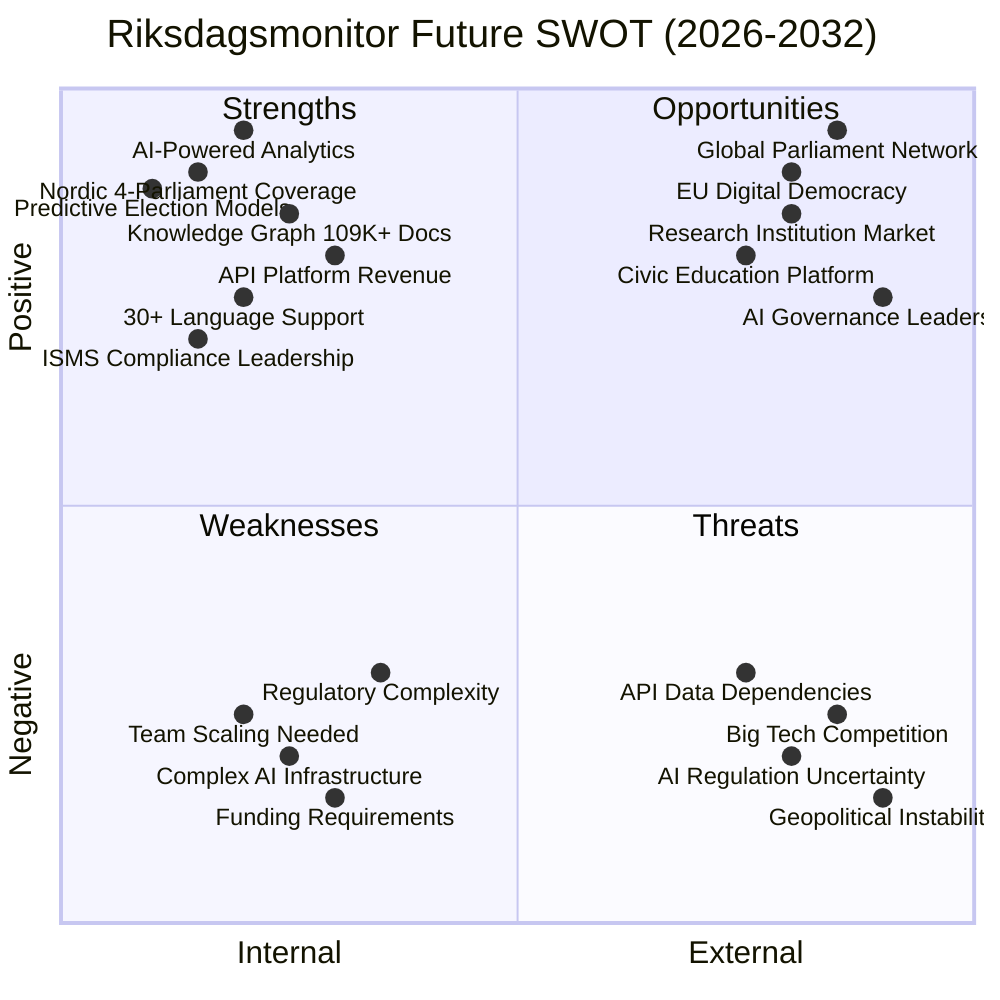

  

<h1 align="center">🚀 Riksdagsmonitor — Future SWOT Analysis</h1>

  <strong>💼 Strategic Outlook for Democratic Intelligence Evolution</strong> 
  <em>🎯 AI-Powered Analytics · Nordic Platform · API Economy · Global Reach</em>

  
  
  
  

**📋 Document Owner:** CEO | **📄 Version:** 1.0 | **📅 Last Updated:** 2026-02-20 (UTC)  
**🔄 Review Cycle:** Quarterly | **⏰ Next Review:** 2026-05-20  
**🏢 Owner:** Hack23 AB (Org.nr 5595347807) | **🏷️ Classification:** Public

---

## 🎯 Purpose

This document provides a forward-looking SWOT analysis for Riksdagsmonitor over the next 3-7 years (2026-2032). Building on the current [SWOT Analysis](SWOT.md), this assessment evaluates how planned expansions in AI, Nordic parliament coverage, API platform, and revenue models will reshape Riksdagsmonitor's strategic position.

> *"The future of democratic transparency lies at the intersection of AI, open data, and civic engagement. This strategic outlook maps our path from Swedish parliament monitoring to a global democratic intelligence platform."*
>
> — **James Pether Sörling, CEO, Hack23 AB**

## 📚 Architecture Documentation Map

| Document | Focus | Description |
|----------|-------|-------------|
| [🏛️ Architecture](ARCHITECTURE.md) | 🏗️ C4 Models | System context, containers, components |
| [📊 Data Model](DATA_MODEL.md) | 📊 Data | Entity relationships and data dictionary |
| [🔄 Flowchart](FLOWCHART.md) | 🔄 Processes | Business and data flow diagrams |
| [📈 State Diagram](STATEDIAGRAM.md) | 📈 States | System state transitions and lifecycles |
| [🧠 Mindmap](MINDMAP.md) | 🧠 Concepts | System conceptual relationships |
| [💼 SWOT](SWOT.md) | 💼 Strategy | Strategic analysis and positioning |
| [🛡️ Security Architecture](SECURITY_ARCHITECTURE.md) | 🔒 Security | Current security controls and design |
| [🚀 Future Security](FUTURE_SECURITY_ARCHITECTURE.md) | 🔮 Security | Planned security improvements |
| [🎯 Threat Model](THREAT_MODEL.md) | 🎯 Threats | STRIDE/MITRE ATT&CK analysis |
| [🚀 Future Architecture](FUTURE_ARCHITECTURE.md) | 🔮 Evolution | Architectural evolution roadmap |
| [📊 Future Data Model](FUTURE_DATA_MODEL.md) | 🔮 Data | Enhanced data architecture plans |
| [🔄 Future Flowchart](FUTURE_FLOWCHART.md) | 🔮 Processes | Improved process workflows |
| [📈 Future State Diagram](FUTURE_STATEDIAGRAM.md) | 🔮 States | Advanced state management |
| [🧠 Future Mindmap](FUTURE_MINDMAP.md) | 🔮 Concepts | Capability expansion plans |
| **[💼 Future SWOT](FUTURE_SWOT.md)** | **🔮 Strategy** | **Future strategic opportunities** |

---

## 📋 Future SWOT Overview

---

## 💪 Future Strengths (2027-2032)

### FS1: AI-Powered Democratic Intelligence

**Description:** Comprehensive AI capabilities including GPT-5 content generation, predictive election models, real-time fact-checking, and knowledge graph-powered semantic search.

**Strategic Value:**
- 🤖 Multi-modal content in 30+ languages (text, image, audio, video)
- 📊 Election forecasting with 90%+ accuracy (Monte Carlo simulations)
- 🧠 Semantic search across 109K+ documents with Neo4j knowledge graph
- ✅ Explainable AI with transparent methodology and open-source models

### FS2: Nordic Parliament Platform

**Description:** Unified coverage of all 4 Nordic parliaments (Sweden, Denmark, Norway, Finland) with cross-country comparative analytics.

**Strategic Value:**
- 🌍 27 million population coverage across Nordic countries
- 📊 Cross-country voting pattern analysis and legislative benchmarking
- 🔗 Entity resolution across parliament systems
- 🏆 First comprehensive Nordic democratic transparency platform

### FS3: API Economy Revenue

**Description:** Sustainable revenue through freemium API, research partnerships, and business intelligence subscriptions.

**Strategic Value:**
- 💰 Multi-stream revenue: API ($99-499/month), research ($1K-5K/year), enterprise ($5K-25K/project)
- 📊 Serverless API (Lambda + API Gateway) with minimal operational costs
- 🔐 OAuth2 authentication with tiered access control
- 📈 Projected $50K-200K annual revenue by 2029

### FS4: Comprehensive ISMS Leadership

**Description:** Industry-leading security and compliance posture with ISO 27001, NIST CSF 2.0, CIS Controls v8.1, EU CRA, and NIS2 compliance.

**Strategic Value:**
- 🛡️ Publicly documented security architecture (radical transparency)
- ✅ Pre-certified for government contracts and institutional partnerships
- 📋 EU CRA compliance ahead of enforcement (2027)
- 🏆 Competitive differentiator in trust-sensitive civic technology market

---

## 🔻 Future Weaknesses (2027-2032)

### FW1: Complex AI Infrastructure

**Description:** Advanced AI features require significant infrastructure (GPU compute, vector databases, streaming pipelines) increasing operational complexity.

**Mitigation:**
- 🔧 Serverless-first architecture (AWS Lambda, Fargate) minimizes infrastructure management
- 📊 Progressive enhancement: AI features degrade gracefully to static content
- 🤖 GitHub Copilot agents automate infrastructure management

### FW2: Funding Requirements

**Description:** Nordic expansion, AI capabilities, and API platform require capital investment beyond volunteer capacity.

**Mitigation:**
- 💰 API revenue targets: Break-even by 2028 ($50K ARR)
- 🤝 Research partnerships provide co-funding for shared projects
- 🏗️ Open-source model attracts community contributions
- 📈 Incremental rollout minimizes upfront investment

### FW3: Team Scaling Challenges

**Description:** Transition from single developer to team requires organizational changes, onboarding, and knowledge transfer.

**Mitigation:**
- 📝 Comprehensive documentation (20+ architecture documents)
- 🤖 14 specialized Copilot agents reduce need for specialized hires
- 🌐 Remote-first, open-source model expands talent pool
- 🎯 Start with part-time contractors for specific capabilities

---

## 🚀 Future Opportunities (2027-2032)

### FO1: Global Parliament Network

**Description:** Expand beyond Nordic countries to create a global network of parliament monitoring platforms.

**Market Potential:**
- 🌍 195 countries with parliamentary systems
- 🇪🇺 EU-27 parliaments as second expansion wave
- 🏛️ International organizations (UN, OECD, World Bank) as partners
- 📊 Revenue: $500K-2M ARR from international subscriptions

### FO2: AI Governance Leadership

**Description:** Establish Riksdagsmonitor as the reference platform for responsible AI in civic technology.

**Strategic Value:**
- 📋 Open-source AI models for democratic transparency
- 🤖 Hack23 AI Policy as industry template
- 🎓 Academic publications on AI ethics in political data
- 🏆 Awards and recognition from AI governance organizations

### FO3: EU Digital Democracy Initiative

**Description:** Leverage EU Digital Democracy initiatives and funding programs for expansion.

**Funding Sources:**
- 🇪🇺 Horizon Europe: Digital democracy research grants
- 🏛️ European Digital Innovation Hubs (EDIHs)
- 📊 EU Open Data Portal collaboration
- 💶 CEF Digital Building Blocks funding

---

## ⚠️ Future Threats (2027-2032)

### FT1: Big Tech Competition

**Description:** Major tech companies (Google, Microsoft, Meta) launching AI-powered civic technology platforms.

**Mitigation:**
- 🔓 Open-source model prevents lock-in
- 📊 50+ years Swedish data depth unavailable to competitors
- 🛡️ ISMS compliance and transparency as differentiators
- 🤝 Partner rather than compete with tech platforms

### FT2: AI Regulation Uncertainty

**Description:** Evolving AI regulations (EU AI Act, national policies) may impose unpredictable compliance requirements.

**Mitigation:**
- ✅ Proactive compliance (Hack23 AI Policy, Limited Risk classification)
- 📋 Comprehensive documentation ready for audit
- 🔒 Privacy-preserving AI techniques (federated learning, differential privacy)
- 🤖 Transparent methodology reduces regulatory risk

### FT3: Multi-Country API Dependencies

**Description:** Dependence on 4+ parliament APIs with different reliability, format, and access policies.

**Mitigation:**
- 📊 Data archival and caching for resilience
- 🔧 Schema normalization layer abstracts API differences
- 🤝 Establish relationships with parliament IT departments
- 📡 Multiple data source strategy (APIs, scraping, partnerships)

---

## 📊 Strategic Action Matrix

| Strategic Theme | Actions (2026-2028) | KPIs | Owner |
|----------------|---------------------|------|-------|
| **AI Intelligence** | Deploy GPT-5, Knowledge Graph, Election Forecasting | Prediction accuracy > 85% | CTO |
| **Nordic Expansion** | Denmark (2027), Norway (2028), Finland (2028) | 3 parliaments integrated | Product |
| **API Platform** | Launch freemium API, research partnerships | $50K ARR by 2028 | Business |
| **ISMS Leadership** | EU CRA, NIS2 compliance, AI governance | Zero critical findings | Security |
| **Community** | Contributor onboarding, academic partnerships | 10+ active contributors | Community |

---

**📋 Document Control:**  
**✅ Approved by:** James Pether Sörling, CEO  
**📤 Distribution:** Public  
**🏷️ Classification:**   
**📅 Effective Date:** 2026-02-20  
**⏰ Next Review:** 2026-05-20  
**🎯 Framework Compliance:**   
