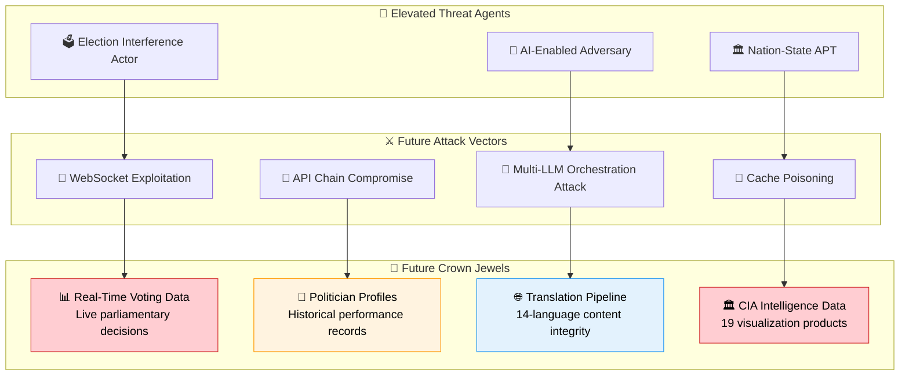
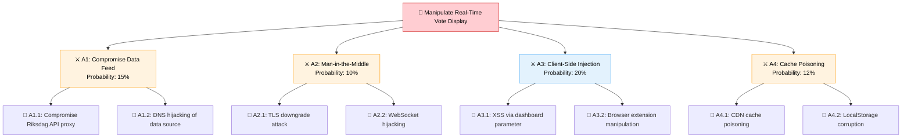
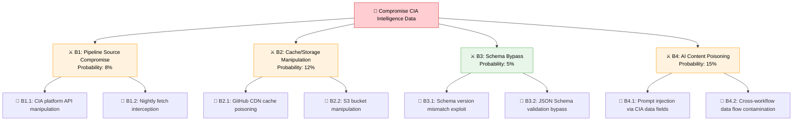
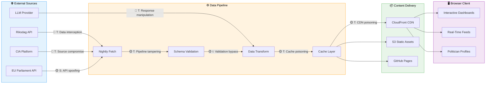

  

<h1 align="center">🔮 Hack23 AB — Riksdagsmonitor Future Threat Model</h1>

  <strong>🛡️ Proactive Security for Planned Architecture Evolution</strong> 
  <em>🔍 STRIDE • MITRE ATT&CK • AI Workflow Expansion • Advanced Dashboards • Real-Time Data</em>

  
  
  
  

**📋 Document Owner:** CEO | **📄 Version:** 1.0 | **📅 Last Updated:** 2026-02-26 (UTC)  
**🔄 Review Cycle:** Quarterly | **⏰ Next Review:** 2026-05-26  
**🏢 Owner:** Hack23 AB (Org.nr 5595347807) | **🏷️ Classification:** Public

---

## 🎯 Purpose & Scope

Establish a forward-looking threat model for **Riksdagsmonitor's planned architecture evolution**, covering new capabilities and expanded attack surfaces anticipated in the 2026-2027 roadmap. This document complements the current [THREAT_MODEL.md](./THREAT_MODEL.md) by analyzing threats specific to planned features that do not yet exist in production.

### **🔗 Policy Alignment**

Aligned with [Hack23 AB Threat Modeling Policy](https://github.com/Hack23/ISMS-PUBLIC/blob/main/Threat_Modeling.md) and [Secure Development Policy](https://github.com/Hack23/ISMS-PUBLIC/blob/main/Secure_Development_Policy.md).

### **🔍 Scope — Planned Architecture Changes**

| Planned Feature | Target Date | Architecture Impact | New Attack Surface |
|----------------|-------------|--------------------|--------------------|
| **CIA Data Pipeline Integration** | Q2 2026 | Automated nightly fetch of 19 CIA visualization products | External API dependency, data validation, cache poisoning |
| **Advanced AI Content Pipelines** | Q2-Q3 2026 | Additional agentic workflows (committee reports, motion analysis, week-ahead) | Expanded prompt injection surface, multi-workflow orchestration risks |
| **Real-Time Voting Dashboard** | Q3 2026 | WebSocket/SSE for live parliamentary voting data | Real-time data manipulation, WebSocket security, connection state attacks |
| **Politician Profile Pages** | Q3 2026 | Per-politician detail pages with historical data | Data accuracy attacks, profile defacement, SEO poisoning |
| **Enhanced Chart.js/D3.js Dashboards** | Q2-Q3 2026 | 5 placeholder dashboards activated (Budget, Voting Patterns, Committee, Regional, Historical) | Dashboard data injection, chart rendering exploits, large dataset DoS |
| **Automated Content Translation** | Q3 2026 | Machine translation pipeline for 14 languages | Translation manipulation, cultural sensitivity attacks, LLM hallucination in non-English |
| **EU Parliament Cross-Reference** | Q4 2026 | Integration with European Parliament MCP Server | Cross-platform data integrity, new external API dependency |

---

## 📊 Future System Classification

### **🏷️ Evolved Security Classification**

| Dimension | Current | Future | Rationale for Change |
|-----------|---------|--------|---------------------|
| **🔐 Confidentiality** | Public | **Public** | No change — remains public platform |
| **🔒 Integrity** | High | **Critical** | Real-time voting data + expanded AI content increases integrity requirements |
| **⚡ Availability** | High | **Critical** | Real-time dashboards require higher availability during parliamentary sessions |

> **Note:** This table describes the **future Riksdagsmonitor system security classification**. The CIA classification badges in the Document Control section represent the **classification of this document itself**, not the future system, and may therefore differ from the future system's target classification.

---

## 🏗️ Future Architecture Threat Analysis

### **🎭 STRIDE per Future Component**

| Future Component | S (Spoofing) | T (Tampering) | R (Repudiation) | I (Info Disclosure) | D (DoS) | E (Elevation) | Risk Level |
|-----------------|-------------|---------------|-----------------|--------------------|---------|--------------|-----------:|
| **CIA Data Pipeline** | Source API spoofing | Cached data poisoning | Pipeline execution denial | Data leakage via cache | Pipeline backlog/timeout | Pipeline credential escalation | **HIGH** |
| **Real-Time Voting Dashboard** | WebSocket connection spoofing | Vote data manipulation in transit | Connection state denial | Vote counting information leak | WebSocket flood/connection exhaustion | Client-side privilege via WebSocket | **CRITICAL** |
| **Politician Profile Pages** | Profile data source spoofing | Historical record tampering | Profile edit denial | Biographical data exposure | Profile page DoS via complex queries | SEO manipulation for profile ranking | **MEDIUM** |
| **Automated Translation Pipeline** | Source language spoofing | Translation output manipulation | Translation attribution denial | Source text leakage | Translation queue exhaustion | LLM model access escalation | **HIGH** |
| **Enhanced Dashboards (5 new)** | Data source spoofing for charts | Chart data injection/manipulation | Dashboard interaction denial | Data aggregation leakage | Large dataset rendering DoS | Dashboard admin escalation | **MEDIUM** |
| **EU Parliament Cross-Reference** | EP MCP Server spoofing | Cross-reference data tampering | Data linkage denial | EU political data leakage | API rate limiting/timeout | Cross-system privilege escalation | **MEDIUM** |

### **🔐 Future Crown Jewel Analysis**

---

## 🎯 Future Priority Threat Scenarios

### **Scenario F1: Real-Time Vote Manipulation During Parliamentary Session**

| Attribute | Detail |
|-----------|--------|
| **Threat Agent** | Nation-state actor, hacktivist |
| **Attack Vector** | WebSocket data injection, man-in-the-middle on data feed |
| **Target** | Real-time voting dashboard during live parliamentary vote |
| **Impact** | Display incorrect vote counts, undermine democratic trust |
| **Likelihood** | Medium (requires intercepting data stream) |
| **Risk Score** | **8.5/10 CRITICAL** |
| **MITRE ATT&CK** | [T1565 Data Manipulation](https://attack.mitre.org/techniques/T1565/), [T1557 MITM](https://attack.mitre.org/techniques/T1557/) |
| **Planned Controls** | TLS 1.3 for WebSocket, server-side data signing, client-side signature verification, comparison with official riksdagen.se data |

### **Scenario F2: CIA Data Pipeline Cache Poisoning**

| Attribute | Detail |
|-----------|--------|
| **Threat Agent** | Sophisticated attacker with CIA platform access knowledge |
| **Attack Vector** | Compromise cached CIA export data between fetch and display |
| **Target** | 19 CIA visualization products cached locally |
| **Impact** | Display manipulated political intelligence data across all dashboards |
| **Likelihood** | Low (requires pipeline or storage compromise) |
| **Risk Score** | **7.2/10 HIGH** |
| **MITRE ATT&CK** | [T1195 Supply Chain Compromise](https://attack.mitre.org/techniques/T1195/), [T1565.001 Stored Data Manipulation](https://attack.mitre.org/techniques/T1565/001/) |
| **Planned Controls** | JSON Schema validation, cryptographic integrity hashing, freshness monitoring (<24h), comparison with source checksums |

### **Scenario F3: Multi-Workflow AI Orchestration Attack**

| Attribute | Detail |
|-----------|--------|
| **Threat Agent** | AI-enabled adversary, insider threat |
| **Attack Vector** | Coordinate prompt injection across multiple AI workflows to create consistent disinformation |
| **Target** | news-article-generator + news-evening-analysis + news-realtime-monitor (3+ workflows) |
| **Impact** | Consistent AI-generated disinformation across all news outputs, bypassing single-workflow detection |
| **Likelihood** | Low (requires deep understanding of multiple workflow prompts) |
| **Risk Score** | **7.8/10 HIGH** |
| **MITRE ATT&CK** | [T1659 Content Injection](https://attack.mitre.org/techniques/T1659/) |
| **Planned Controls** | Cross-workflow consistency validation, independent fact-checking per workflow, rate limiting on AI content volume, mandatory human review for correlated outputs |

### **Scenario F4: Translation Pipeline Integrity Attack**

| Attribute | Detail |
|-----------|--------|
| **Threat Agent** | Nation-state actor targeting specific language communities |
| **Attack Vector** | Manipulate automated translation to inject politically biased content in specific languages |
| **Target** | Arabic, Chinese, or Korean translations (harder for Swedish team to verify) |
| **Impact** | Language-specific disinformation targeting diaspora communities |
| **Likelihood** | Medium (translation verification is resource-intensive) |
| **Risk Score** | **6.8/10 HIGH** |
| **MITRE ATT&CK** | [T1659 Content Injection](https://attack.mitre.org/techniques/T1659/) |
| **Planned Controls** | Back-translation verification, native speaker review network, translation consistency scoring, `data-translate` attribute validation |

---

## 🛡️ Future Security Control Requirements

### **Planned Controls for Future Architecture**

| Control ID | Control Name | Future Component | STRIDE Coverage | Implementation Target | Priority |
|-----------|-------------|-----------------|-----------------|----------------------|----------|
| **FUT-001** | WebSocket TLS + Data Signing | Real-Time Voting Dashboard | T, S | Q3 2026 | 🔴 Critical |
| **FUT-002** | CIA Pipeline JSON Schema Validation | CIA Data Pipeline | T, I | Q2 2026 | 🔴 Critical |
| **FUT-003** | Pipeline Cryptographic Integrity | CIA Data Pipeline | T, R | Q2 2026 | 🔴 Critical |
| **FUT-004** | Cross-Workflow Consistency Checks | AI Content Pipelines | T, I | Q2 2026 | 🔴 Critical |
| **FUT-005** | Back-Translation Verification | Translation Pipeline | T | Q3 2026 | 🟡 High |
| **FUT-006** | Profile Data Source Verification | Politician Profiles | S, T | Q3 2026 | 🟡 High |
| **FUT-007** | Dashboard Data Rate Limiting | Enhanced Dashboards | D | Q2 2026 | 🟡 High |
| **FUT-008** | EU Parliament API Authentication | EU Cross-Reference | S, E | Q4 2026 | 🟡 High |
| **FUT-009** | Real-Time Anomaly Detection | Real-Time Dashboard | T, I | Q3 2026 | 🔴 Critical |
| **FUT-010** | Automated Content Volume Limiting | AI Workflows | D, T | Q2 2026 | 🟡 High |

### **Future STRIDE → Control Mapping**

| STRIDE Category | Future Primary Control | Future Secondary Control | Future Monitoring |
|-----------------|----------------------|--------------------------|-------------------|
| **Spoofing** | WebSocket TLS (FUT-001), API auth (FUT-008) | Data source verification (FUT-006) | Connection authentication logs |
| **Tampering** | JSON Schema validation (FUT-002), data signing (FUT-003) | Cross-workflow checks (FUT-004), back-translation (FUT-005) | Data integrity monitoring |
| **Repudiation** | Cryptographic integrity (FUT-003), pipeline audit logs | Git-based change tracking | Audit trail analysis |
| **Info Disclosure** | Pipeline access controls, dashboard data scoping | Rate limiting (FUT-007), volume limiting (FUT-010) | Data access monitoring |
| **DoS** | Rate limiting (FUT-007), volume limiting (FUT-010) | WebSocket connection limits, cache TTL management | Performance monitoring, anomaly detection (FUT-009) |
| **Elevation** | API authentication (FUT-008), pipeline OIDC scoping | Workflow approval for new pipelines | Privilege usage monitoring |

---

## 🎖️ Attacker-Centric Threat Modeling — Future Attack Vectors

### **👥 Future Threat Agent Classification**

| Threat Agent | Motivation | Capability | Future Target | Risk Trend |
|-------------|-----------|-----------|--------------|-----------|
| **Nation-State APT** | Political influence, intelligence gathering | Very High (zero-day, AI-enhanced) | Real-time voting data, politician profiles | ⬆️ Increasing |
| **AI-Enabled Adversary** | Automated exploitation, disinformation | High (LLM-driven attacks) | Translation pipeline, multi-workflow orchestration | ⬆️ Rapidly increasing |
| **Hacktivist** | Political disruption, ideology | Medium (commodity tools + AI) | Public dashboards, election forecasts | ➡️ Stable |
| **Insider Threat** | Data manipulation, sabotage | High (pipeline access) | CIA data pipeline, content generation | ⬆️ Increasing with more contributors |
| **Competitor** | Market intelligence, replication | Medium (OSINT, scraping) | Dashboard algorithms, analysis methodology | ➡️ Stable |
| **Cybercriminal** | Ransomware, cryptomining | Medium (supply chain focus) | CI/CD pipeline, dependency chain | ⬆️ Increasing |

### **🌳 Future Attack Tree — Real-Time Vote Manipulation**

### **🌳 Future Attack Tree — CIA Pipeline Compromise**

### **🔗 Future Kill Chain Disruption Analysis**

| Kill Chain Phase | Future Attack Capability | Disruption Control | Detection Mechanism |
|-----------------|------------------------|-------------------|---------------------|
| **Reconnaissance** | AI-powered API enumeration of new endpoints | Rate limiting, API key rotation (FUT-008) | API access pattern monitoring |
| **Weaponization** | LLM-crafted prompt injection payloads | Input validation, prompt sanitization (FUT-004) | Prompt content analysis logs |
| **Delivery** | Compromised data in CIA pipeline/WebSocket feeds | TLS 1.3 pinning, source verification (FUT-001, FUT-002) | Network traffic anomaly detection |
| **Exploitation** | Schema bypass, translation model manipulation | JSON Schema strict validation (FUT-002), model input filtering | Validation failure alerts, output consistency checking |
| **Installation** | Persistent cache poisoning, LocalStorage manipulation | Cache TTL enforcement, integrity hashing (FUT-003) | Cache integrity monitoring |
| **C2** | AI-orchestrated multi-workflow coordination | Cross-workflow consistency checks (FUT-004), volume limiting (FUT-010) | Workflow correlation analysis |
| **Actions on Objectives** | Public disinformation via manipulated dashboards/news | Human review gate, source cross-validation, fact-checking | Content integrity alerts, user reporting |

---

## 🏗️ Future Asset Attack Surface Analysis

### **🗺️ New Attack Surface Inventory**

| Future Feature | New Endpoints | Data Sensitivity | External Dependencies | Attack Surface Rating |
|---------------|--------------|-----------------|----------------------|----------------------|
| **Real-Time Voting Dashboard** | WebSocket endpoint, SSE stream | Critical (live democratic data) | Riksdag API, CDN | 🔴 High |
| **CIA Data Pipeline** | Nightly fetch endpoint, cache API | High (19 intelligence products) | CIA Platform API, S3 | 🔴 High |
| **Politician Profile Pages** | Per-MP URL routes (349+ pages) | High (career/voting history) | CIA data, Riksdag API | 🟡 Medium |
| **Automated Translation** | LLM API calls (14 languages) | Medium (content integrity) | LLM Provider API | 🟡 Medium |
| **EU Parliament Cross-Ref** | EP MCP Server API, GraphQL | Medium (EU political data) | EP Open Data API | 🟢 Low |
| **5 New Dashboards** | Chart data endpoints, D3 renders | Medium (aggregated analytics) | CIA data, Chart.js CDN | 🟡 Medium |

### **📊 Future Data Flow Threat Analysis**

---

## 🤖 AI/LLM Future Threat Analysis (OWASP LLM Top 10)

### **Future AI Workflow Expansion Threats**

| OWASP LLM ID | Threat | Future Relevance | Planned Mitigation |
|-------------|--------|-----------------|-------------------|
| **LLM01** | Prompt Injection | 🔴 Critical — More workflows = larger injection surface | Per-workflow input sanitization, prompt boundary enforcement |
| **LLM02** | Insecure Output Handling | 🔴 Critical — Auto-generated content directly published | HTML sanitization, output schema validation, human review gate |
| **LLM03** | Training Data Poisoning | 🟡 Medium — Indirect via MCP data sources | Source integrity verification, data provenance tracking |
| **LLM04** | Model Denial of Service | 🟡 Medium — Multiple concurrent workflow runs | Workflow concurrency limits, timeout enforcement, rate limiting |
| **LLM05** | Supply Chain Vulnerabilities | 🟡 Medium — LLM model updates may introduce regressions | Model version pinning, output regression testing |
| **LLM06** | Sensitive Information Disclosure | 🟢 Low — Public data only, no PII | Data classification enforcement, output filtering |
| **LLM07** | Insecure Plugin Design | 🔴 Critical — MCP server tools are "plugins" | MCP tool allowlisting, capability-based access control |
| **LLM08** | Excessive Agency | 🔴 Critical — Agents can create/edit content + trigger workflows | Write operation approval gates, output volume limits |
| **LLM09** | Overreliance | 🟡 Medium — Over-trusting AI-generated political analysis | Mandatory human editorial review, confidence scoring |
| **LLM10** | Model Theft | 🟢 Low — Using commercial API, not custom model | API key rotation, access logging |

### **Future Multi-Workflow Orchestration Threat Matrix**

| Workflow Combination | Attack Scenario | Impact | Detection Difficulty | Planned Control |
|---------------------|----------------|--------|---------------------|----------------|
| article-generator + evening-analysis | Coordinated disinformation: article + supporting analysis | Critical | Hard — requires cross-workflow correlation | FUT-004: Cross-workflow consistency |
| translate + article-generator | Inject bias in translation of generated content | High | Hard — translation errors look like hallucinations | FUT-005: Back-translation verification |
| realtime-monitor + committee-reports | Time-sensitive misinformation during live events | Critical | Medium — timing anomalies detectable | FUT-009: Real-time anomaly detection |
| propositions + motions + weekly-review | Long-running narrative manipulation across weekly content | High | Very Hard — gradual drift is subtle | Longitudinal content consistency analysis |

---

## 🔄 Continuous Future Threat Assessment

### **Assessment Lifecycle for Future Features**

| Phase | Trigger | Activities | Output |
|-------|---------|-----------|--------|
| **Pre-Implementation** | Feature design finalized | STRIDE analysis, attack tree construction, control design | Feature-specific threat addendum |
| **During Implementation** | Code review, PR merge | Security testing, SAST/DAST scanning, dependency audit | Security test results, remediation items |
| **Post-Deployment** | Feature goes live | Penetration testing, monitoring activation, alert tuning | Deployment security report |
| **Ongoing** | Quarterly review | Threat landscape update, control effectiveness assessment | Updated risk scores, new mitigations |

### **Future Threat Monitoring KPIs**

| KPI | Target | Measurement Method |
|-----|--------|-------------------|
| New feature threat coverage | 100% STRIDE per component | Feature threat model completeness |
| Time to detect data manipulation | < 15 minutes | Integrity check monitoring |
| Cross-workflow anomaly detection rate | > 95% | Consistency check pass rate |
| Translation integrity score | > 98% accuracy | Back-translation verification rate |
| Pipeline data freshness SLA | < 24 hours | Cache timestamp monitoring |
| WebSocket connection security | 100% TLS 1.3 | Connection protocol audit |

---

## ⚖️ Future Risk Assessment

### **Quantitative Risk Matrix — Future Threats**

| Threat | Likelihood (1-5) | Impact (1-5) | Risk Score | Treatment |
|--------|:-----------------:|:------------:|:----------:|-----------|
| Real-time vote data manipulation | 3 | 5 | **15 CRITICAL** | MITIGATE (FUT-001, FUT-009) |
| CIA pipeline cache poisoning | 2 | 4 | **8 HIGH** | MITIGATE (FUT-002, FUT-003) |
| Multi-workflow AI orchestration attack | 2 | 4 | **8 HIGH** | MITIGATE (FUT-004) |
| Translation integrity attack | 3 | 3 | **9 HIGH** | MITIGATE (FUT-005) |
| Dashboard rendering DoS | 3 | 2 | **6 MEDIUM** | MITIGATE (FUT-007) |
| Politician profile defacement | 2 | 3 | **6 MEDIUM** | MITIGATE (FUT-006) |
| EU Parliament API compromise | 1 | 3 | **3 LOW** | ACCEPT + MONITOR (FUT-008) |

---

## 📚 Related Documents

### **Riksdagsmonitor Documentation**

- [🎯 Current Threat Model](./THREAT_MODEL.md) — Active production threat analysis
- [🏛️ Architecture](./ARCHITECTURE.md) — Current C4 architecture models
- [🔮 Future Architecture](./FUTURE_ARCHITECTURE.md) — Planned architecture evolution
- [🔐 Security Architecture](./SECURITY_ARCHITECTURE.md) — Current security controls
- [🔮 Future Security Architecture](./FUTURE_SECURITY_ARCHITECTURE.md) — Planned security enhancements
- [📊 Data Model](./DATA_MODEL.md) — Political data entities and relationships
- [📊 Future Data Model](./FUTURE_DATA_MODEL.md) — Enhanced data architecture plans
- [🔄 Flowchart](./FLOWCHART.md) — Business process and data flows
- [📈 State Diagram](./STATEDIAGRAM.md) — System state transitions
- [🧠 Mindmap](./MINDMAP.md) — System conceptual relationships
- [💼 SWOT](./SWOT.md) — Strategic analysis and positioning
- [🔄 Workflows](./WORKFLOWS.md) — CI/CD security workflows

### **Hack23 ISMS Policies (Public)**

- [🎯 Threat Modeling Policy](https://github.com/Hack23/ISMS-PUBLIC/blob/main/Threat_Modeling.md) — ISMS threat modeling methodology
- [🔐 Secure Development Policy](https://github.com/Hack23/ISMS-PUBLIC/blob/main/Secure_Development_Policy.md) — SDLC security requirements
- [🏷️ Classification Framework](https://github.com/Hack23/ISMS-PUBLIC/blob/main/CLASSIFICATION.md) — CIA triad business impact analysis
- [📉 Risk Register](https://github.com/Hack23/ISMS-PUBLIC/blob/main/Risk_Register.md) — Enterprise risk management
- [🤖 AI Policy](https://github.com/Hack23/ISMS-PUBLIC/blob/main/AI_Policy.md) — LLM application security requirements

### **Reference Implementations**

- [🏛️ CIA Threat Model](https://github.com/Hack23/cia/blob/master/THREAT_MODEL.md) — Full-stack web application threat model
- [🎮 Black Trigram Future Threat Model](https://github.com/Hack23/blacktrigram/blob/main/FUTURE_THREAT_MODEL.md) — AWS serverless future threat analysis

---

## 📋 Document Control

**📋 Document Owner:** James Pether Sörling, CEO & CISO  
**📄 Version:** 1.1  
**📅 Last Updated:** 2026-03-19 (UTC)  
**✅ Approved by:** James Pether Sörling, CEO  
**🔄 Review Cycle:** Quarterly (Feb, May, Aug, Nov)  
**⏰ Next Review:** 2026-05-19  
**🏢 Owner:** Hack23 AB (Org.nr 5595347807)  
**📤 Distribution:** Public  
**🏷️ Classification:**   

### **Framework Compliance**

**🎯 Framework Alignment:**  
    
