

  

<h1 align="center">🔮 Hack23 AB — Riksdagsmonitor Future Threat Model</h1>

  <strong>🛡️ Proactive Security for the Three-Horizon Architecture Evolution (2026–2037)</strong> 
  <em>🔍 STRIDE • MITRE ATT&CK • AI Workflow Expansion • Advanced Dashboards • Real-Time Data • AWS Serverless • Bedrock • Neptune • Aurora • Cognito</em>

  
  
  
  
  
  

  
  
  
  
  
  
  

**📋 Document Owner:** CEO | **📄 Version:** 2.1 | **📅 Last Updated:** 2026-06-02 (UTC)  
**🔄 Review Cycle:** Quarterly | **⏰ Next Review:** 2026-09-02  
**🏢 Owner:** Hack23 AB (Org.nr 5595347807) | **🏷️ Classification:** Public

---

## 🎯 Purpose & Scope

Establish a forward-looking threat model for **Riksdagsmonitor's three-horizon architecture evolution (2026–2037)**, covering new capabilities and expanded attack surfaces across the planned roadmap. This document complements the current [THREAT_MODEL.md](./THREAT_MODEL.md) by analyzing threats specific to planned features that do not yet exist in production, and is the security counterpart to the strategy expressed in [FUTURE_ARCHITECTURE.md](./FUTURE_ARCHITECTURE.md), [FUTURE_DATA_MODEL.md](./FUTURE_DATA_MODEL.md), [FUTURE_FLOWCHART.md](./FUTURE_FLOWCHART.md), [FUTURE_STATEDIAGRAM.md](./FUTURE_STATEDIAGRAM.md), [FUTURE_SWOT.md](./FUTURE_SWOT.md), [FUTURE_MINDMAP.md](./FUTURE_MINDMAP.md), [FUTURE_SECURITY_ARCHITECTURE.md](./FUTURE_SECURITY_ARCHITECTURE.md) and [FUTURE_WORKFLOWS.md](./FUTURE_WORKFLOWS.md).

**📐 Coverage dimensions (v2.1):**

| Category | Scenarios | Controls | Diagrams |
|----------|:---------:|:--------:|:--------:|
| 🔧 **Technical Security** (STRIDE, ATT&CK) | F1–F12 | FUT-001–FUT-022 | 4 mermaid diagrams |
| 🗳️ **Democratic Integrity & Accountability** | F13–F16 | FUT-023–FUT-027 | 2 mermaid diagrams |
| 🔒 **Privacy & GDPR (H3)** | F17–F18 | FUT-028–FUT-029 | 1 mermaid diagram |
| 🔗 **Supply Chain & AI Governance** | F19–F21 | FUT-030–FUT-032 | 1 mermaid diagram |
| 🌍 **Geopolitical & FIMI** | Cross-cutting | Source-grading, FIMI detection | 1 mermaid diagram |
| 🤖 **AI/LLM (OWASP Top 10)** | Cross-cutting | Model-level controls | — |
| 🕵️ **Political-Intelligence Capabilities** | PI-T1–PI-T7 | Integrity-by-construction | — |

### **🧭 The Three Horizons (threat-model framing)**

| Horizon | Versions | Window | Architecture Posture | Dominant Threat Themes |
|---------|----------|--------|----------------------|------------------------|
| **🟢 H1 — Static Baseline** | v1.x | Today | Static HTML/CSS on GitHub Pages, build-time agentic newsroom | Supply-chain & CI/CD compromise, prompt injection, content integrity (covered by [THREAT_MODEL.md](./THREAT_MODEL.md)) |
| **🔵 H2 — Static, Go Deeper** | v2.0 | 2026–2027 | Still static, richer pre-compute, CIA pipeline, party/OSINT analytics, real-time read-only feeds, 14-language translation | Pipeline cache poisoning, multi-workflow AI orchestration, real-time data manipulation, translation integrity |
| **🟠 H3 — AWS Serverless AI** | v3.0+ | 2027–2037 | Amazon Bedrock, Neptune Serverless, Aurora Serverless v2, OpenSearch/Timestream/DynamoDB, AppSync/API Gateway, Cognito, Lambda, Step Functions, SageMaker, multi-region | Cloud IAM & identity attacks, RAG/Knowledge-Base poisoning, graph/relational data exfiltration, agentic excessive agency, model manipulation, multi-region failover abuse |

> Horizon boundaries are **roadmap intent, not commitments** — the platform deliberately stays static through 2027 ([FUTURE_ARCHITECTURE.md §2.6](./FUTURE_ARCHITECTURE.md)). H3 threats are pre-modeled so that controls are designed *before* the first managed service is provisioned.

### **🔗 Policy Alignment**

Aligned with [Hack23 AB Threat Modeling Policy](https://github.com/Hack23/ISMS-PUBLIC/blob/main/Threat_Modeling.md) and [Secure Development Policy](https://github.com/Hack23/ISMS-PUBLIC/blob/main/Secure_Development_Policy.md).

### **🔍 Scope — Planned Architecture Changes**

| Planned Feature | Horizon | Target Date | Architecture Impact | New Attack Surface |
|----------------|---------|-------------|--------------------|--------------------|
| **CIA Data Pipeline Integration** | H2 | Q2 2026 | Automated nightly fetch of 19 CIA visualization products | External API dependency, data validation, cache poisoning |
| **Advanced AI Content Pipelines** | H2 | Q2-Q3 2026 | Additional agentic workflows (committee reports, motion analysis, week-ahead) | Expanded prompt injection surface, multi-workflow orchestration risks |
| **Real-Time Voting Dashboard** | H3 | 2028+ | WebSocket/SSE for live parliamentary voting data (requires Kinesis streaming backend) | Real-time data manipulation, WebSocket security, connection state attacks |
| **Politician Profile Pages** | H2 | Q3 2026 | Per-politician detail pages with historical data | Data accuracy attacks, profile defacement, SEO poisoning |
| **Enhanced Chart.js/D3.js Dashboards** | H2 | Q2-Q3 2026 | 5 placeholder dashboards activated (Budget, Voting Patterns, Committee, Regional, Historical) | Dashboard data injection, chart rendering exploits, large dataset DoS |
| **Automated Content Translation** | H2 | Q3 2026 | Machine translation pipeline for 14 languages | Translation manipulation, cultural sensitivity attacks, LLM hallucination in non-English |
| **EU Parliament Cross-Reference** | H2 | Q4 2026 | Integration with European Parliament MCP Server | Cross-platform data integrity, new external API dependency |
| **Bedrock AI Content Engine** | H3 | 2028–2029 | Step-Functions-orchestrated Lambda + Bedrock (Claude Opus, Nova Premier, Polly) article/image/audio generation | Managed-LLM prompt injection, insecure output handling, excessive agency, model supply chain |
| **SageMaker Predictive Analytics** | H3 | 2028 Q4–2029 Q1 | Election forecasting, coalition & MP-vote models (SageMaker Serverless Inference + Feature Store) | Training-data/feature-store poisoning, forecast manipulation, inference DoS |
| **Neptune Knowledge Graph + Bedrock Knowledge Bases** | H3 | 2029 Q2–Q4 | Semantic intelligence: graph (openCypher/Gremlin) + RAG vector search over 109K+ documents | Graph-query injection, RAG/Knowledge-Base poisoning, embedding inversion, natural-language-query abuse |
| **Aurora Serverless v2 / OpenSearch / Timestream / DynamoDB** | H3 | 2027–2028 | Managed relational, full-text, time-series and NoSQL stores behind Lambda resolvers | SQL/NoSQL injection, broken object-level authorization, data exfiltration, encryption-key misuse |
| **AppSync GraphQL + API Gateway Public API** | H3 | 2027–2028 | Managed GraphQL (real-time subscriptions) + REST usage plans | GraphQL abuse (depth/complexity), broken authZ, subscription hijacking, API-key/usage-plan abuse |
| **Amazon Cognito Identity** | H3 | 2027–2028 | Authenticated user accounts (saved searches, alerts, personalization) — first non-anonymous tier | Account takeover, token theft/replay, IDOR, MFA bypass, GDPR scope creep |
| **AWS Amplify Web PWA + Native Mobile Apps** | H3 | 2028+ | iOS/Android apps + PWA via Amplify, CloudFront + WAF + Shield edge | Mobile API-key abuse, insecure local storage, certificate-pinning bypass, push-notification spoofing |
| **Conversational AI (Bedrock Agents, Lex, Transcribe/Polly)** | H3 | 2028+ | Chatbot, voice interface, personal briefings, multi-agent autonomous tasks | Agentic excessive agency, indirect prompt injection via voice, tool-chaining abuse, hallucinated political guidance |
| **Multi-Region Resilience (Aurora Global, DynamoDB Global, S3 CRR, Route 53)** | H3 | 2028+ | Active-passive multi-region failover, global tables, cross-region replication | Failover/route hijack, replication tampering, split-brain integrity, regional IAM drift |
| **Nordic & EU Federation (DK/NO/FI + EU Parliament)** | H3 | 2027–2030 | Shared data-mesh comparative analysis across parliaments | Cross-jurisdiction data-integrity, source-spoofing, federation trust-boundary attacks |

### **📅 Threat Landscape Evolution Timeline**

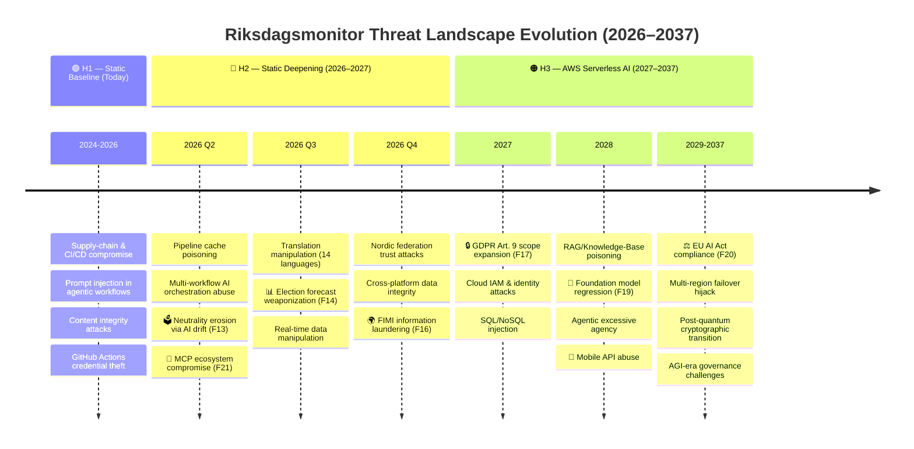

---

## 📊 Future System Classification

### **🏷️ Evolved Security Classification**

| Dimension | Current | Future | Rationale for Change |
|-----------|---------|--------|---------------------|
| **🔐 Confidentiality** | Public | **Public + limited Internal (H3)** | Platform content stays public; H3 Cognito introduces authenticated user accounts whose saved searches/alerts reveal political interest (GDPR Art. 9) and must be protected |
| **🔒 Integrity** | High | **Critical** | Real-time voting data, expanded AI content, and H3 authoritative managed stores (Aurora/Neptune/forecasts) increase integrity requirements |
| **⚡ Availability** | High | **Critical** | Real-time dashboards and H3 public API / multi-region services require higher availability during parliamentary sessions and election windows |

> **Note:** This table describes the **future Riksdagsmonitor system security classification**. The CIA classification badges in the Document Control section represent the **classification of this document itself**, not the future system, and may therefore differ from the future system's target classification. The H3 authenticated tier is the first time the platform processes per-user personal data — a **DPIA is mandatory before Cognito launch** (see F6 and FUT-013/FUT-014).

---

## 🏗️ Future Architecture Threat Analysis

### **🎭 STRIDE per Future Component**

| Future Component | S (Spoofing) | T (Tampering) | R (Repudiation) | I (Info Disclosure) | D (DoS) | E (Elevation) | Risk Level |
|-----------------|-------------|---------------|-----------------|--------------------|---------|--------------|-----------:|
| **CIA Data Pipeline** | Source API spoofing | Cached data poisoning | Pipeline execution denial | Data leakage via cache | Pipeline backlog/timeout | Pipeline credential escalation | **HIGH** |
| **Real-Time Voting Dashboard** | WebSocket connection spoofing | Vote data manipulation in transit | Connection state denial | Vote counting information leak | WebSocket flood/connection exhaustion | Client-side privilege via WebSocket | **CRITICAL** |
| **Politician Profile Pages** | Profile data source spoofing | Historical record tampering | Profile edit denial | Biographical data exposure | Profile page DoS via complex queries | SEO manipulation for profile ranking | **MEDIUM** |
| **Automated Translation Pipeline** | Source language spoofing | Translation output manipulation | Translation attribution denial | Source text leakage | Translation queue exhaustion | LLM model access escalation | **HIGH** |
| **Enhanced Dashboards (5 new)** | Data source spoofing for charts | Chart data injection/manipulation | Dashboard interaction denial | Data aggregation leakage | Large dataset rendering DoS | Dashboard admin escalation | **MEDIUM** |
| **EU Parliament Cross-Reference** | EP MCP Server spoofing | Cross-reference data tampering | Data linkage denial | EU political data leakage | API rate limiting/timeout | Cross-system privilege escalation | **MEDIUM** |
| **IMF Data Integration (TypeScript client — `scripts/imf-client.ts`)** | IMF origin DNS hijack / TLS MITM | IMF JSON response tampering in transit or at rest | Stale / mis-vintaged WEO projections cited as current | Aggregate public-only; negligible | IMF rate-limit (10 req / 5 s) trips workflow | Pure-TS client inside the npm SBOM; no new runtime | **LOW** |
| **🟠 H3 — Bedrock AI Content Engine** (Lambda + Step Functions) | IAM role assumption / model-endpoint spoofing | Indirect prompt injection corrupts generated articles | Generation lineage not attributable to a model/vintage | Prompt/context leakage via model logs | Bedrock throttling / runaway Step-Functions loops | Over-scoped Lambda execution role escalates in account | **HIGH** |
| **🟠 H3 — SageMaker Predictive Models** | Forged feature inputs / endpoint spoofing | Training-data & Feature-Store poisoning skews forecasts | Forecast provenance & training-set hash unrecorded | Model/feature exposure via misconfigured endpoint | Inference-endpoint flooding (pay-per-invoke abuse) | Notebook/training-job role escalation | **HIGH** |
| **🟠 H3 — Neptune Knowledge Graph + Bedrock Knowledge Base** | Source-document spoofing into the graph/KB | Graph-edge tampering; RAG vector poisoning | Ingestion source not traceable | Embedding inversion / sensitive linkage inference | Expensive openCypher/Gremlin or RAG query DoS | Cross-tenant graph/KB access via broken IAM | **HIGH** |
| **🟠 H3 — Aurora Serverless v2 / OpenSearch / Timestream / DynamoDB** | Lambda resolver spoofs DB identity | SQL/NoSQL injection, stored-data tampering | DB audit trail gap (no CloudTrail data events) | Bulk data exfiltration via broken object-level authZ | Query-of-death / connection exhaustion | KMS key misuse decrypts at-rest data | **CRITICAL** |
| **🟠 H3 — AppSync GraphQL + API Gateway Public API** | Resolver/identity spoofing | Mutation tampering, response rewriting | Request attribution gap across resolvers | Over-fetch / introspection data leakage | Deep/complex query & subscription-flood DoS | Authorizer bypass elevates to privileged scope | **HIGH** |
| **🟠 H3 — Amazon Cognito Identity** | Credential stuffing / token replay | Profile & saved-search tampering | Disputed account actions (weak audit) | IDOR exposes another user's saved data | Auth-endpoint flood / token-mint abuse | MFA bypass / privilege escalation to admin pool | **HIGH** |
| **🟠 H3 — Amplify Web PWA + Native Mobile Apps** | Push-notification / deep-link spoofing | Client-side data & cache tampering | Device-side action repudiation | Insecure local storage / key leakage | App-store-targeted client DoS | Cert-pinning bypass → API abuse | **MEDIUM** |
| **🟠 H3 — Conversational AI (Bedrock Agents, Lex, Transcribe/Polly)** | Voice/session spoofing | Indirect prompt injection via voice/KB context | Agent action chain not auditable | Briefing leakage across user sessions | Agent loop / tool-chain resource exhaustion | Excessive agency — agent invokes unintended tools/writes | **CRITICAL** |
| **🟠 H3 — Multi-Region Resilience (Aurora/DynamoDB Global, S3 CRR, Route 53)** | Route 53 / health-check spoofing | Replication-stream tampering, split-brain writes | Cross-region action attribution gap | Replica in weaker-controlled region leaks data | Failover-triggering DoS, replication lag | Regional IAM drift grants stale privileges | **HIGH** |
| **🟠 H3 — Nordic & EU Federation Data Mesh** | Foreign-parliament API spoofing | Cross-jurisdiction record tampering | Federated provenance ambiguity | Comparative-dataset linkage disclosure | Multi-source fetch amplification DoS | Federation trust-boundary privilege crossing | **MEDIUM** |

### **🔐 Future Crown Jewel Analysis**

```mermaid
flowchart TB
    subgraph H2_JEWELS["🔵 H2 Crown Jewels (Static-Deep)"]
        REALTIME["📊 Real-Time Voting Data<br/>Live parliamentary decisions"]
        POLITICIAN["👤 Politician Profiles<br/>Historical performance records"]
        TRANSLATION["🌐 Translation Pipeline<br/>14-language content integrity"]
        CIA_DATA["🏛️ CIA Intelligence Data<br/>19 visualization products"]
    end

    subgraph H3_JEWELS["🟠 H3 Crown Jewels (AWS Serverless)"]
        GRAPH["🕸️ Neptune Knowledge Graph<br/>+ Bedrock KB vectors"]
        FORECAST["🔮 SageMaker Forecast Models<br/>Election & coalition predictions"]
        AURORA["🗄️ Aurora/OpenSearch Stores<br/>Authoritative managed data"]
        IDENTITY["🔑 Cognito Identities<br/>First authenticated user tier"]
        AGENTS_AI["💬 Bedrock Agents<br/>Autonomous conversational AI"]
    end

    subgraph FUTURE_VECTORS["⚔️ Future Attack Vectors"]
        WEBSOCKET["🔌 WebSocket Exploitation"]
        CACHE_POISON["💉 Cache Poisoning"]
        LLM_MULTI["🤖 Multi-LLM Orchestration Attack"]
        API_CHAIN["🔗 API Chain Compromise"]
        RAG_POISON["📚 RAG / KB Poisoning"]
        IAM_ABUSE["🪪 Cloud IAM & Token Abuse"]
        EXCESS_AGENCY["🧠 Agentic Excessive Agency"]
    end

    subgraph FUTURE_AGENTS["👥 Elevated Threat Agents"]
        ELECTION_ACTOR["🗳️ Election Interference Actor"]
        AI_ADVERSARY["🤖 AI-Enabled Adversary"]
        STATE_ACTOR["🏛️ Nation-State APT"]
        CLOUD_ATTACKER["☁️ Cloud-Native Attacker"]
    end

    WEBSOCKET --> REALTIME
    CACHE_POISON --> CIA_DATA
    LLM_MULTI --> TRANSLATION
    API_CHAIN --> POLITICIAN
    RAG_POISON --> GRAPH
    RAG_POISON --> FORECAST
    IAM_ABUSE --> AURORA
    IAM_ABUSE --> IDENTITY
    EXCESS_AGENCY --> AGENTS_AI

    ELECTION_ACTOR --> WEBSOCKET
    AI_ADVERSARY --> LLM_MULTI
    AI_ADVERSARY --> EXCESS_AGENCY
    STATE_ACTOR --> CACHE_POISON
    CLOUD_ATTACKER --> IAM_ABUSE
    CLOUD_ATTACKER --> RAG_POISON

    style REALTIME fill:#ffcdd2,stroke:#d32f2f,color:#000
    style POLITICIAN fill:#fff3e0,stroke:#ff9800,color:#000
    style TRANSLATION fill:#e3f2fd,stroke:#2196f3,color:#000
    style CIA_DATA fill:#ffcdd2,stroke:#d32f2f,color:#000
    style GRAPH fill:#ffcdd2,stroke:#d32f2f,color:#000
    style FORECAST fill:#fff3e0,stroke:#ff9800,color:#000
    style AURORA fill:#ffcdd2,stroke:#d32f2f,color:#000
    style IDENTITY fill:#fff3e0,stroke:#ff9800,color:#000
    style AGENTS_AI fill:#ffcdd2,stroke:#d32f2f,color:#000
```

---

## 🎯 Future Priority Threat Scenarios

### **Scenario F1: Real-Time Vote Manipulation During Parliamentary Session**

| Attribute | Detail |
|-----------|--------|
| **Threat Agent** | Nation-state actor, hacktivist |
| **Attack Vector** | WebSocket data injection, man-in-the-middle on data feed |
| **Target** | Real-time voting dashboard during live parliamentary vote |
| **Impact** | Display incorrect vote counts, undermine democratic trust |
| **Likelihood** | Medium (requires intercepting data stream) |
| **Risk Score** | **8.5/10 CRITICAL** |
| **MITRE ATT&CK** | [T1565 Data Manipulation](https://attack.mitre.org/techniques/T1565/), [T1557 MITM](https://attack.mitre.org/techniques/T1557/) |
| **Planned Controls** | TLS 1.3 for WebSocket, server-side data signing, client-side signature verification, comparison with official riksdagen.se data |

### **Scenario F2: CIA Data Pipeline Cache Poisoning**

| Attribute | Detail |
|-----------|--------|
| **Threat Agent** | Sophisticated attacker with CIA platform access knowledge |
| **Attack Vector** | Compromise cached CIA export data between fetch and display |
| **Target** | 19 CIA visualization products cached locally |
| **Impact** | Display manipulated political intelligence data across all dashboards |
| **Likelihood** | Low (requires pipeline or storage compromise) |
| **Risk Score** | **7.2/10 HIGH** |
| **MITRE ATT&CK** | [T1195 Supply Chain Compromise](https://attack.mitre.org/techniques/T1195/), [T1565.001 Stored Data Manipulation](https://attack.mitre.org/techniques/T1565/001/) |
| **Planned Controls** | JSON Schema validation, cryptographic integrity hashing, freshness monitoring (<24h), comparison with source checksums |

### **Scenario F3: Multi-Workflow AI Orchestration Attack**

| Attribute | Detail |
|-----------|--------|
| **Threat Agent** | AI-enabled adversary, insider threat |
| **Attack Vector** | Coordinate prompt injection across multiple AI workflows to create consistent disinformation |
| **Target** | News pipeline aggregate+render scripts + multiple per-type workflows (news-evening-analysis, news-realtime-monitor, news-propositions, news-motions, news-committee-reports, news-interpellations, news-week-ahead, news-month-ahead, news-weekly-review, news-monthly-review) consuming the same `analysis/daily/$DATE/$SUB/` artifacts |
| **Impact** | Consistent AI-generated disinformation across all news outputs, bypassing single-workflow detection |
| **Likelihood** | Low (requires deep understanding of multiple workflow prompts) |
| **Risk Score** | **7.8/10 HIGH** |
| **MITRE ATT&CK** | [T1659 Content Injection](https://attack.mitre.org/techniques/T1659/) |
| **Planned Controls** | Cross-workflow consistency validation, independent fact-checking per workflow, rate limiting on AI content volume, mandatory human review for correlated outputs |

### **Scenario F4: Translation Pipeline Integrity Attack**

| Attribute | Detail |
|-----------|--------|
| **Threat Agent** | Nation-state actor targeting specific language communities |
| **Attack Vector** | Manipulate automated translation to inject politically biased content in specific languages |
| **Target** | Arabic, Chinese, or Korean translations (harder for Swedish team to verify) |
| **Impact** | Language-specific disinformation targeting diaspora communities |
| **Likelihood** | Medium (translation verification is resource-intensive) |
| **Risk Score** | **6.8/10 HIGH** |
| **MITRE ATT&CK** | [T1659 Content Injection](https://attack.mitre.org/techniques/T1659/) |
| **Planned Controls** | Back-translation verification, native speaker review network, translation consistency scoring, `data-translate` attribute validation |

> The scenarios above (**F1–F4**) are **Horizon 2** threats — they materialise while the platform is still static. The scenarios below (**F5–F12**) are **Horizon 3** threats that only become live once managed AWS services are provisioned; they are pre-modeled so controls ship *with* each service ([FUTURE_ARCHITECTURE.md §3](./FUTURE_ARCHITECTURE.md), [§11.4 AWS Security Services](./FUTURE_ARCHITECTURE.md)).

### **Scenario F5: Bedrock Knowledge-Base / RAG Poisoning (H3)**

| Attribute | Detail |
|-----------|--------|
| **Threat Agent** | Cloud-native attacker, AI-enabled adversary |
| **Attack Vector** | Inject crafted documents into the Bedrock Knowledge Base ingestion path so RAG retrieval surfaces poisoned context to Claude during answer generation |
| **Target** | Bedrock Knowledge Bases (109K+ document vectors) feeding natural-language queries and conversational AI |
| **Impact** | Authoritative-looking but fabricated citations and political analysis served to citizens and journalists |
| **Likelihood** | Medium (ingestion pipeline is the soft target, not the model) |
| **Risk Score** | **8.0/10 HIGH** |
| **MITRE ATT&CK** | [T1565.001 Stored Data Manipulation](https://attack.mitre.org/techniques/T1565/001/), [T1195 Supply Chain Compromise](https://attack.mitre.org/techniques/T1195/) |
| **Planned Controls** | Signed/whitelisted ingestion sources only (Riksdag/Regeringen/SCB/IMF), embedding-time provenance tags, citation-back-to-`dok_id` verification, RAG answer grounding score threshold, human review gate for conversational outputs |

### **Scenario F6: Cognito Account Takeover & IDOR (H3)**

| Attribute | Detail |
|-----------|--------|
| **Threat Agent** | Cybercriminal, hacktivist |
| **Attack Vector** | Credential stuffing, OAuth token theft/replay, or broken object-level authorization on saved-search/alert resources |
| **Target** | Amazon Cognito user pool — the platform's first authenticated tier (saved searches, alerts, personalization) |
| **Impact** | Account takeover, exposure of a citizen's political-interest profile (GDPR Art. 9 special category), defacement of personalized content |
| **Likelihood** | Medium (authenticated tier is a brand-new attack surface for the platform) |
| **Risk Score** | **7.5/10 HIGH** |
| **MITRE ATT&CK** | [T1110 Brute Force](https://attack.mitre.org/techniques/T1110/), [T1539 Steal Web Session Cookie](https://attack.mitre.org/techniques/T1539/) |
| **Planned Controls** | Mandatory MFA, Cognito advanced security (adaptive auth + compromised-credential detection), per-user resource-scoped IAM, short-lived tokens + rotation, DPIA before launch, data minimization (no political opinions persisted server-side beyond saved queries) |

### **Scenario F7: Lambda/IAM Privilege Escalation & Data Exfiltration (H3)**

| Attribute | Detail |
|-----------|--------|
| **Threat Agent** | Nation-state APT, insider threat |
| **Attack Vector** | Over-scoped Lambda execution role or AppSync resolver chained to read Aurora/OpenSearch/DynamoDB beyond its purpose; KMS key misuse to decrypt at rest |
| **Target** | Aurora Serverless v2 `political_data` DB, OpenSearch indices, DynamoDB global tables |
| **Impact** | Bulk exfiltration or silent tampering of authoritative political datasets across regions |
| **Likelihood** | Low (requires account-level foothold) |
| **Risk Score** | **8.5/10 CRITICAL** |
| **MITRE ATT&CK** | [T1078.004 Cloud Accounts](https://attack.mitre.org/techniques/T1078/004/), [T1530 Data from Cloud Storage](https://attack.mitre.org/techniques/T1530/), [T1213 Data from Information Repositories](https://attack.mitre.org/techniques/T1213/) |
| **Planned Controls** | Least-privilege IAM per function (one role per Lambda), VPC isolation + private endpoints, KMS key policies with grant constraints, CloudTrail **data events** on all stores, GuardDuty + Security Hub correlation, IAM Access Analyzer in CI |

### **Scenario F8: Bedrock Agent Excessive Agency (H3)**

| Attribute | Detail |
|-----------|--------|
| **Threat Agent** | AI-enabled adversary |
| **Attack Vector** | Indirect prompt injection (via voice, KB context, or user query) steers a Bedrock Agent to chain tools beyond intent — triggering writes, external calls, or content publication |
| **Target** | Conversational AI multi-agent system (Bedrock Agents, Lex, AppSync subscriptions) |
| **Impact** | Autonomous publication of manipulated content or unauthorized state changes without human review |
| **Likelihood** | Low-Medium (depends on agent tool scope) |
| **Risk Score** | **8.2/10 CRITICAL** |
| **MITRE ATT&CK** | [T1659 Content Injection](https://attack.mitre.org/techniques/T1659/), [T1648 Serverless Execution](https://attack.mitre.org/techniques/T1648/) |
| **Planned Controls** | Read-only default agent tool scope, write-action approval gates (human-in-the-loop per AI_Policy), tool allowlisting, per-session sandboxing, output-volume limits, full agent-action audit trail |

### **Scenario F9: SageMaker Election-Forecast Manipulation (H3)**

| Attribute | Detail |
|-----------|--------|
| **Threat Agent** | Election interference actor, nation-state APT |
| **Attack Vector** | Poison SageMaker Feature Store / training data or forge inference inputs to skew published seat or coalition forecasts ahead of the 2026 (and later) elections |
| **Target** | SageMaker Serverless Inference election/coalition/MP-vote models |
| **Impact** | Biased forecasts erode democratic trust and could nudge voter behaviour — a direct attack on neutrality |
| **Likelihood** | Medium (high-value target during election windows) |
| **Risk Score** | **8.0/10 HIGH** |
| **MITRE ATT&CK** | [T1565 Data Manipulation](https://attack.mitre.org/techniques/T1565/), [T1195.003 Compromise Hardware/Model Supply Chain](https://attack.mitre.org/techniques/T1195/003/) |
| **Planned Controls** | Versioned + hashed training datasets, Feature Store access controls, model-card provenance, published confidence intervals + methodology transparency, cross-validation against SCB/poll aggregates, expert political-scientist review before publication |

### **Scenario F10: AppSync/API Gateway Public-API Abuse (H3)**

| Attribute | Detail |
|-----------|--------|
| **Threat Agent** | Competitor, cybercriminal, hacktivist |
| **Attack Vector** | Deeply nested/complex GraphQL queries, schema introspection over-fetch, subscription floods, or API-key/usage-plan abuse on the public REST API |
| **Target** | AWS AppSync GraphQL API + Amazon API Gateway public REST endpoints |
| **Impact** | Cost-amplification DoS, data scraping at scale, real-time subscription hijacking |
| **Likelihood** | Medium (public API is internet-reachable by design) |
| **Risk Score** | **6.5/10 MEDIUM** |
| **MITRE ATT&CK** | [T1499 Endpoint DoS](https://attack.mitre.org/techniques/T1499/), [T1190 Exploit Public-Facing Application](https://attack.mitre.org/techniques/T1190/) |
| **Planned Controls** | Query depth/complexity limits, disabled production introspection, AWS WAF rate-based + bot-control rules, API Gateway usage plans + key rotation, per-identity throttling, Shield Standard DDoS |

### **Scenario F11: Multi-Region Failover & Replication Tampering (H3)**

| Attribute | Detail |
|-----------|--------|
| **Threat Agent** | Nation-state APT |
| **Attack Vector** | Route 53 / health-check spoofing forces failover to a weaker-controlled region; replication-stream tampering or split-brain writes corrupt Aurora Global / DynamoDB Global tables |
| **Target** | Active-passive multi-region deployment (Aurora Global DB, DynamoDB Global Tables, S3 CRR, Route 53) |
| **Impact** | Integrity divergence between regions, stale or tampered data served during failover |
| **Likelihood** | Low (requires DNS/control-plane compromise) |
| **Risk Score** | **6.0/10 MEDIUM** |
| **MITRE ATT&CK** | [T1565.002 Transmitted Data Manipulation](https://attack.mitre.org/techniques/T1565/002/), [T1583.002 DNS Server](https://attack.mitre.org/techniques/T1583/002/) |
| **Planned Controls** | DNSSEC + Route 53 health-check authentication, consistent cross-region IAM via SCPs, replication integrity checksums, conflict-resolution policy, automated AWS Resilience Hub failover drills, regional config-drift detection (AWS Config) |

### **Scenario F12: Nordic/EU Federation Cross-Jurisdiction Integrity (H3)**

| Attribute | Detail |
|-----------|--------|
| **Threat Agent** | Nation-state actor, competitor |
| **Attack Vector** | Spoof or tamper a foreign-parliament feed (DK/NO/FI or EU Parliament) so comparative cross-country analysis carries manipulated data through a trusted federation boundary |
| **Target** | Shared data-mesh comparative analytics across Nordic & EU parliaments |
| **Impact** | Cross-border disinformation laundered through Riksdagsmonitor's neutrality reputation |
| **Likelihood** | Low-Medium (each new source widens the trust boundary) |
| **Risk Score** | **6.2/10 MEDIUM** |
| **MITRE ATT&CK** | [T1199 Trusted Relationship](https://attack.mitre.org/techniques/T1199/), [T1565.001 Stored Data Manipulation](https://attack.mitre.org/techniques/T1565/001/) |
| **Planned Controls** | Per-source TLS pinning + provenance tagging, source-of-truth precedence rules, cross-source consistency scoring, per-jurisdiction freshness SLAs, explicit federation trust-boundary documentation in [FUTURE_DATA_MODEL.md](./FUTURE_DATA_MODEL.md) |

---

## 🛡️ Future Security Control Requirements

### **Planned Controls for Future Architecture**

| Control ID | Control Name | Future Component | STRIDE Coverage | Implementation Target | Priority |
|-----------|-------------|-----------------|-----------------|----------------------|----------|
| **FUT-001** | WebSocket TLS + Data Signing | Real-Time Voting Dashboard | T, S | Q3 2026 | 🔴 Critical |
| **FUT-002** | CIA Pipeline JSON Schema Validation | CIA Data Pipeline | T, I | Q2 2026 | 🔴 Critical |
| **FUT-003** | Pipeline Cryptographic Integrity | CIA Data Pipeline | T, R | Q2 2026 | 🔴 Critical |
| **FUT-004** | Cross-Workflow Consistency Checks | AI Content Pipelines | T, I | Q2 2026 | 🔴 Critical |
| **FUT-005** | Back-Translation Verification | Translation Pipeline | T | Q3 2026 | 🟡 High |
| **FUT-006** | Profile Data Source Verification | Politician Profiles | S, T | Q3 2026 | 🟡 High |
| **FUT-007** | Dashboard Data Rate Limiting | Enhanced Dashboards | D | Q2 2026 | 🟡 High |
| **FUT-008** | EU Parliament API Authentication | EU Cross-Reference | S, E | Q4 2026 | 🟡 High |
| **FUT-009** | Real-Time Anomaly Detection | Real-Time Dashboard | T, I | Q3 2026 | 🔴 Critical |
| **FUT-010** | Automated Content Volume Limiting | AI Workflows | D, T | Q2 2026 | 🟡 High |
| **FUT-011** | RAG Source Allowlist + Provenance Tagging | Bedrock Knowledge Base | T, I | 2027 Q2 | 🔴 Critical |
| **FUT-012** | RAG Grounding-Score Threshold + Citation Verification | Bedrock KB / Conversational AI | T | 2027 Q2 | 🔴 Critical |
| **FUT-013** | Cognito MFA + Advanced Security (adaptive auth) | Cognito Identity | S, E | 2027 Q4 | 🔴 Critical |
| **FUT-014** | Per-User Resource-Scoped Authorization (anti-IDOR) | Cognito / AppSync / Aurora | I, E | 2027 Q4 | 🔴 Critical |
| **FUT-015** | Least-Privilege IAM per Lambda + Access Analyzer in CI | Lambda / IAM | E | 2027 | 🔴 Critical |
| **FUT-016** | CloudTrail Data Events + GuardDuty/Security Hub Correlation | All managed stores | R, I | 2027 | 🟡 High |
| **FUT-017** | Agent Tool Allowlist + Write-Action Approval Gate | Bedrock Agents | E, T | 2028 | 🔴 Critical |
| **FUT-018** | Versioned/Hashed Training Data + Feature-Store Access Control | SageMaker | T | 2026 Q4 | 🟡 High |
| **FUT-019** | GraphQL Depth/Complexity Limits + WAF Rate Rules | AppSync / API Gateway | D | 2027 | 🟡 High |
| **FUT-020** | KMS Key Policies + Envelope Encryption (at rest) | Aurora / DynamoDB / S3 | I | 2027 | 🔴 Critical |
| **FUT-021** | DNSSEC + Cross-Region SCP/Config-Drift Detection | Multi-Region Resilience | T, E | 2028 | 🟡 High |
| **FUT-022** | Federation Trust-Boundary Provenance + Consistency Scoring | Nordic/EU Data Mesh | S, T | 2027–2030 | 🟡 High |

### **Future STRIDE → Control Mapping**

| STRIDE Category | Future Primary Control | Future Secondary Control | Future Monitoring |
|-----------------|----------------------|--------------------------|-------------------|
| **Spoofing** | WebSocket TLS (FUT-001), API auth (FUT-008), Cognito MFA (FUT-013) | Data source verification (FUT-006), federation provenance (FUT-022) | Connection/auth logs, GuardDuty (FUT-016) |
| **Tampering** | JSON Schema validation (FUT-002), data signing (FUT-003), RAG allowlist (FUT-011) | Cross-workflow checks (FUT-004), training-data hashing (FUT-018) | Data integrity monitoring, CloudTrail data events (FUT-016) |
| **Repudiation** | Cryptographic integrity (FUT-003), CloudTrail data events (FUT-016) | Git-based change tracking, agent-action audit (FUT-017) | Audit trail analysis, Security Hub |
| **Info Disclosure** | Resource-scoped authZ (FUT-014), KMS at rest (FUT-020) | Rate limiting (FUT-007), RAG grounding (FUT-012) | Data access monitoring, Access Analyzer (FUT-015) |
| **DoS** | Rate limiting (FUT-007), GraphQL complexity limits (FUT-019) | WebSocket/connection limits, WAF + Shield | Performance monitoring, anomaly detection (FUT-009) |
| **Elevation** | Least-privilege IAM per Lambda (FUT-015), Cognito MFA (FUT-013) | Agent write-approval gate (FUT-017), cross-region SCP (FUT-021) | Privilege usage monitoring, IAM Access Analyzer |

---

## 🎖️ Attacker-Centric Threat Modeling — Future Attack Vectors

### **👥 Future Threat Agent Classification**

| Threat Agent | Motivation | Capability | Future Target | Risk Trend |
|-------------|-----------|-----------|--------------|-----------|
| **Nation-State APT** | Political influence, intelligence gathering | Very High (zero-day, AI-enhanced) | Real-time voting data, politician profiles | ⬆️ Increasing |
| **AI-Enabled Adversary** | Automated exploitation, disinformation | High (LLM-driven attacks) | Translation pipeline, multi-workflow orchestration | ⬆️ Rapidly increasing |
| **Hacktivist** | Political disruption, ideology | Medium (commodity tools + AI) | Public dashboards, election forecasts | ➡️ Stable |
| **Insider Threat** | Data manipulation, sabotage | High (pipeline access) | CIA data pipeline, content generation | ⬆️ Increasing with more contributors |
| **Competitor** | Market intelligence, replication | Medium (OSINT, scraping) | Dashboard algorithms, analysis methodology | ➡️ Stable |
| **Cybercriminal** | Ransomware, cryptomining | Medium (supply chain focus) | CI/CD pipeline, dependency chain | ⬆️ Increasing |
| **Cloud-Native Attacker** (H3) | Account compromise, data theft, cost-amplification | High (IAM abuse, serverless/RAG exploitation) | Aurora/OpenSearch stores, Cognito identities, Bedrock KB, public AppSync/API Gateway | ⬆️ Emerging with AWS migration |

### **🌳 Future Attack Tree — Real-Time Vote Manipulation**

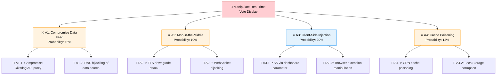

### **🌳 Future Attack Tree — CIA Pipeline Compromise**

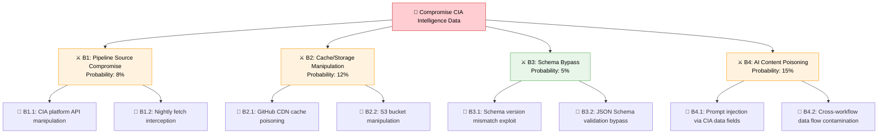

### **🌳 Future Attack Tree — H3 Cloud IAM Compromise & Data Exfiltration**

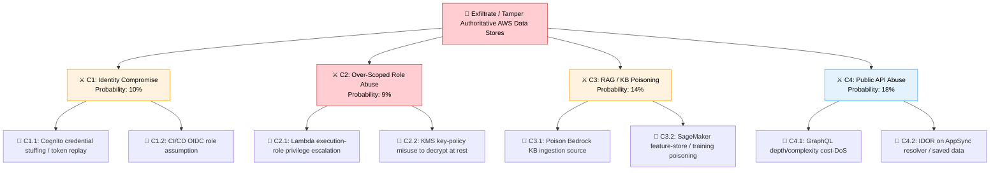

| Kill Chain Phase | Future Attack Capability | Disruption Control | Detection Mechanism |
|-----------------|------------------------|-------------------|---------------------|
| **Reconnaissance** | AI-powered API enumeration of new endpoints | Rate limiting, API key rotation (FUT-008) | API access pattern monitoring |
| **Weaponization** | LLM-crafted prompt injection payloads | Input validation, prompt sanitization (FUT-004) | Prompt content analysis logs |
| **Delivery** | Compromised data in CIA pipeline/WebSocket feeds | TLS 1.3 pinning, source verification (FUT-001, FUT-002) | Network traffic anomaly detection |
| **Exploitation** | Schema bypass, translation model manipulation | JSON Schema strict validation (FUT-002), model input filtering | Validation failure alerts, output consistency checking |
| **Installation** | Persistent cache poisoning, LocalStorage manipulation | Cache TTL enforcement, integrity hashing (FUT-003) | Cache integrity monitoring |
| **C2** | AI-orchestrated multi-workflow coordination | Cross-workflow consistency checks (FUT-004), volume limiting (FUT-010) | Workflow correlation analysis |
| **Actions on Objectives** | Public disinformation via manipulated dashboards/news | Human review gate, source cross-validation, fact-checking | Content integrity alerts, user reporting |

---

## 🏗️ Future Asset Attack Surface Analysis

### **🗺️ New Attack Surface Inventory**

| Future Feature | New Endpoints | Data Sensitivity | External Dependencies | Attack Surface Rating |
|---------------|--------------|-----------------|----------------------|----------------------|
| **Real-Time Voting Dashboard** | WebSocket endpoint, SSE stream | Critical (live democratic data) | Riksdag API, CDN | 🔴 High |
| **CIA Data Pipeline** | Nightly fetch endpoint, cache API | High (19 intelligence products) | CIA Platform API, S3 | 🔴 High |
| **Politician Profile Pages** | Per-MP URL routes (349+ pages) | High (career/voting history) | CIA data, Riksdag API | 🟡 Medium |
| **Automated Translation** | LLM API calls (14 languages) | Medium (content integrity) | LLM Provider API | 🟡 Medium |
| **EU Parliament Cross-Ref** | EP MCP Server API, GraphQL | Medium (EU political data) | EP Open Data API | 🟢 Low |
| **5 New Dashboards** | Chart data endpoints, D3 renders | Medium (aggregated analytics) | CIA data, Chart.js CDN | 🟡 Medium |
| **🟠 H3 — Bedrock AI Content Engine** | Lambda invoke, Bedrock/Polly model endpoints, Step Functions | High (generated public content integrity) | Amazon Bedrock, Polly | 🔴 High |
| **🟠 H3 — Neptune + Bedrock Knowledge Base** | openCypher/Gremlin, RAG retrieve/query | High (semantic intelligence) | Neptune Serverless, Bedrock KB | 🔴 High |
| **🟠 H3 — Aurora/OpenSearch/Timestream/DynamoDB** | Lambda DB resolvers (private) | Critical (authoritative data) | AWS managed data services, KMS | 🔴 High |
| **🟠 H3 — AppSync GraphQL + API Gateway** | Public GraphQL + REST endpoints, subscriptions | High (public API, scraping/DoS target) | AppSync, API Gateway, WAF | 🔴 High |
| **🟠 H3 — Cognito Identity** | Auth/token endpoints, user-pool APIs | High (Art. 9 user profiles) | Amazon Cognito | 🔴 High |
| **🟠 H3 — SageMaker Predictive Models** | Serverless inference endpoints | High (forecast integrity) | SageMaker, Feature Store | 🟡 Medium |
| **🟠 H3 — Amplify Web PWA + Mobile Apps** | App API calls, push, deep links | Medium (client integrity) | Amplify, CloudFront, Shield | 🟡 Medium |
| **🟠 H3 — Conversational AI (Agents/Lex)** | Chat/voice sessions, agent tool calls | Critical (autonomous actions) | Bedrock Agents, Lex, Transcribe | 🔴 High |
| **🟠 H3 — Multi-Region Resilience** | Route 53 failover, cross-region replication | High (integrity across regions) | Aurora/DynamoDB Global, S3 CRR | 🟡 Medium |
| **🟠 H3 — Nordic/EU Federation** | Foreign-parliament + EP API ingestion | Medium (cross-jurisdiction integrity) | DK/NO/FI + EU Parliament APIs | 🟡 Medium |

### **📊 Future Data Flow Threat Analysis**

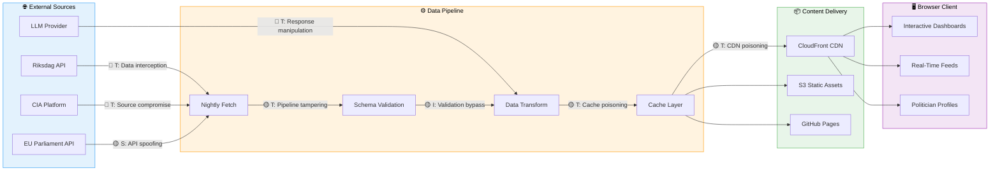

---

## 🤖 AI/LLM Future Threat Analysis (OWASP LLM Top 10)

### **Future AI Workflow Expansion Threats**

| OWASP LLM ID | Threat | Future Relevance | Planned Mitigation |
|-------------|--------|-----------------|-------------------|
| **LLM01** | Prompt Injection | 🔴 Critical — More workflows = larger injection surface | Per-workflow input sanitization, prompt boundary enforcement |
| **LLM02** | Insecure Output Handling | 🔴 Critical — Auto-generated content directly published | HTML sanitization, output schema validation, human review gate |
| **LLM03** | Training Data Poisoning | 🟡 Medium — Indirect via MCP data sources | Source integrity verification, data provenance tracking |
| **LLM04** | Model Denial of Service | 🟡 Medium — Multiple concurrent workflow runs | Workflow concurrency limits, timeout enforcement, rate limiting |
| **LLM05** | Supply Chain Vulnerabilities | 🟡 Medium — LLM model updates may introduce regressions | Model version pinning, output regression testing |
| **LLM06** | Sensitive Information Disclosure | 🟢 Low — Public data only, no PII | Data classification enforcement, output filtering |
| **LLM07** | Insecure Plugin Design | 🔴 Critical — MCP server tools are "plugins" | MCP tool allowlisting, capability-based access control |
| **LLM08** | Excessive Agency | 🔴 Critical — Agents can create/edit content + trigger workflows | Write operation approval gates, output volume limits |
| **LLM09** | Overreliance | 🟡 Medium — Over-trusting AI-generated political analysis | Mandatory human editorial review, confidence scoring |
| **LLM10** | Model Theft | 🟢 Low — Using commercial API, not custom model | API key rotation, access logging |

> **Mapping note:** the table above uses the OWASP LLM Top-10 (2023/2024) IDs already established in this document. For **Horizon 3** the same risks intensify as the platform moves from build-time MCP agents to **managed Bedrock Agents, Knowledge Bases (RAG) and SageMaker models**. The H3-specific intensification is summarised below.

### **🟠 H3 Bedrock / Agentic AI Threat Intensification**

| OWASP LLM Risk | H3 Driver | H3-Specific Mitigation |
|----------------|-----------|------------------------|
| **LLM01 Prompt Injection** | Indirect injection via RAG KB context, voice (Transcribe), and user queries to Bedrock Agents | Source allowlist (FUT-011), grounding-score threshold (FUT-012), per-session sandboxing |
| **LLM02 Insecure Output Handling** | Agents can publish content autonomously to S3/CloudFront | Write-action approval gate (FUT-017), output schema validation, human review gate |
| **LLM03/04 Data Poisoning & RAG Manipulation** | Bedrock KB ingestion + SageMaker Feature Store are poisonable | RAG provenance tagging (FUT-011), versioned/hashed training data (FUT-018) |
| **LLM06 Sensitive Information Disclosure** | Cognito introduces real user profiles (Art. 9) into prompts/briefings | Per-user scoping (FUT-014), data minimization, briefing isolation per session |
| **LLM07 Insecure Plugin Design** | Bedrock Agent "tools" replace MCP tools as the plugin surface | Tool allowlist (FUT-017), capability-scoped IAM (FUT-015) |
| **LLM08 Excessive Agency** | Multi-agent autonomous task execution (Phase 4) | Read-only default scope, write approval gates (FUT-017), agent-action audit (FUT-016) |
| **LLM10 Model Theft** | Custom SageMaker forecasting models now exist | Endpoint authZ, model-artifact encryption (FUT-020), access logging |

### **Future Multi-Workflow Orchestration Threat Matrix**

| Workflow Combination | Attack Scenario | Impact | Detection Difficulty | Planned Control |
|---------------------|----------------|--------|---------------------|----------------|
| article-generator + evening-analysis | Coordinated disinformation: article + supporting analysis | Critical | Hard — requires cross-workflow correlation | FUT-004: Cross-workflow consistency |
| translate + article-generator | Inject bias in translation of generated content | High | Hard — translation errors look like hallucinations | FUT-005: Back-translation verification |
| realtime-monitor + committee-reports | Time-sensitive misinformation during live events | Critical | Medium — timing anomalies detectable | FUT-009: Real-time anomaly detection |
| propositions + motions + weekly-review | Long-running narrative manipulation across weekly content | High | Very Hard — gradual drift is subtle | Longitudinal content consistency analysis |
| **(H3)** Bedrock Agent + Knowledge Base + Step Functions | Poisoned KB context drives an agent to autonomously publish manipulated briefings | Critical | Very Hard — looks like a grounded answer | FUT-011, FUT-012, FUT-017 |
| **(H3)** SageMaker forecast + news-pre-election workflow | Skewed forecast amplified into election-window articles | Critical | Hard — forecast looks statistically plausible | FUT-018 + SCB/poll cross-validation + expert review |

---

## 🛰️ Political-Intelligence Capability Threat Analysis (Counter-AI · FIMI · Analytic Integrity)

Fielding the [Political-Intelligence Capability Catalog](FUTURE_MINDMAP.md#-theme--political-intelligence-capability-catalog-to-2037--the-master-osintintop-map) (C1–C32) creates a **new, high-value attack surface**: an adversary who can corrupt the intelligence pipeline can launder a manipulated judgment through the platform's own credibility. These threats are distinct from generic web threats — they target **analytic integrity**, **calibration**, **neutrality** and **provenance**. The catalog's assurance pillar (C26–C32) exists specifically to counter them.

### **STRIDE per intelligence-capability component**

| Component | Threat (STRIDE) | Scenario | Counter-capability |
|-----------|-----------------|----------|--------------------|
| Multi-INT fusion graph (C6) | **T**ampering | Poisoned edge fabricates a person↔funding link | C8 evidence anchor (no edge without graded `dok_id`); human-review hold |
| Entity resolution (C1) | **S**poofing | Adversary games identifiers to merge/split entities | Deterministic-key + embedding agreement; confidence floor; audit log |
| I&W tripwires (C14) | **D**enial of warning | Flood of decoy signals desensitizes thresholds / hides real event | Adaptive thresholds, anomaly-on-anomaly, human triage gate |
| Forecasting + calibration (C13/C29) | **T**ampering / **R**epudiation | Skewed training data degrades Brier; later denial of bias | Immutable calibration ledger; rolling Brier as release gate; assumption logs |
| FIMI early-warning (C20) | **I**nformation disclosure / abuse | Mission-creep toward citizen profiling; false attribution | Hard ethics gate, aggregate-only, advisory-not-accusatory, no profiling |
| SAT / estimative engine (C11/C22) | **T**ampering | Prompt-injection steers ACH toward a predetermined conclusion | C26 injection screening; devil's-advocate pass; ICD-203 + human sign-off |
| Provenance / C2PA (C8/C9) | **S**poofing | Forged content credential passes synthetic evidence as authentic | KMS-signed manifests; deepfake detector; refuse-to-cite on failure |
| Neutrality gate (C31) | **E**levation / bias injection | Asymmetric output ships, eroding party-neutrality | CI party-symmetry audit; block-on-asymmetry; dual-control override |

### **Priority intelligence-integrity scenarios**

| ID | Scenario | Impact | Detection | Planned control |
|----|----------|--------|-----------|----------------|
| **PI-T1** | **Analytic-pipeline data poisoning** — adversary seeds public-looking sources to bias fusion/forecasting | Critical — manipulated judgments gain platform credibility | Hard — inputs look legitimate | Source-grading floor, provenance, outlier detection on ingest, calibration drift alarms |
| **PI-T2** | **Prompt-injection of the SAT/estimative agent** via crafted document text | Critical — steered "reasoned" conclusion | Hard — looks like grounded analysis | C26 injection screening, Bedrock Guardrails, tool-permission minimization, human sign-off |
| **PI-T3** | **Provenance forgery / deepfake evidence** cited in a briefing | High — false evidence in the record | Medium — manifest + detector checks | C2PA verification, KMS signing, synthetic-media detector, refuse-to-cite |
| **PI-T4** | **Neutrality subversion** — gradual asymmetric framing across products | Critical — destroys institutional trust | Very Hard — gradual drift | C31 party-symmetry CI gate, longitudinal symmetry monitoring, dual review |
| **PI-T5** | **Warning suppression / decoy flooding** of I&W tripwires | High — real coalition/vote event missed | Medium — signal-rate anomalies | Adaptive thresholds, redundancy across indicators, human-on-the-loop |
| **PI-T6** | **Calibration gaming** — manipulate which questions resolve to inflate apparent accuracy | High — misleading trust signal | Hard — statistically subtle | Pre-registered questions, immutable ledger, independent resolution criteria |
| **PI-T7** | **FIMI targeting the platform itself** — adversary narratives crafted to trigger false advisories | High — platform amplifies adversary frame | Hard — designed to look organic | Attribution-confidence floors, ethics gate, human framing, advisory-only output |

### **Mapping to standards**

| Scenario | STRIDE | MITRE ATT&CK / ATLAS | OWASP LLM Top 10 |
|----------|--------|----------------------|------------------|
| PI-T1 poisoning | Tampering | ATLAS: ML Supply-Chain / Data Poisoning | LLM03 Training-Data Poisoning |
| PI-T2 injection | Tampering / EoP | ATLAS: LLM Prompt Injection | LLM01 Prompt Injection |
| PI-T3 provenance forgery | Spoofing | T1565 Data Manipulation | LLM08 Excessive Agency (citation) |
| PI-T4 neutrality | Repudiation / bias | — (governance) | LLM09 Overreliance |
| PI-T5 warning suppression | DoS | T1499 Endpoint DoS (signal) | LLM04 Model DoS |
| PI-T6 calibration gaming | Repudiation | — (integrity) | LLM09 Overreliance |
| PI-T7 FIMI targeting | Information abuse | DISARM TTPs | LLM09 Overreliance |

**Governing principle.** Every intelligence-capability threat is met by an **integrity-by-construction** control, not by trust in the model: evidence anchoring, immutable calibration, provenance signing, neutrality-as-a-CI-gate, and a mandatory human-on-the-loop before any estimative product is published. See [`FUTURE_SECURITY_ARCHITECTURE.md`](FUTURE_SECURITY_ARCHITECTURE.md) for the corresponding controls.

---

## 🗳️ Democratic Integrity & Accountability Threats

> *The platform's mission is democratic transparency — any threat that subverts, distorts, or undermines public accountability is existential regardless of technical sophistication.*

Riksdagsmonitor occupies a unique position: a **neutral, AI-powered democratic-intelligence platform** whose outputs influence citizen understanding of parliamentary proceedings. This creates a category of threats distinct from generic cybersecurity — threats to **democratic processes, institutional trust, and political neutrality** that no standard web-security framework adequately covers.

### **🏛️ Democratic Threat Landscape**

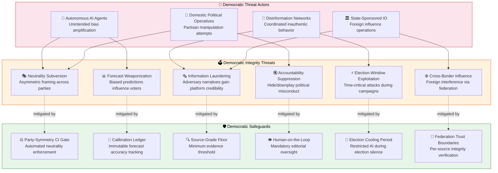

### **Scenario F13: Gradual Neutrality Erosion via AI Drift**

| Attribute | Detail |
|-----------|--------|
| **🎭 Threat Agent** | Autonomous AI drift (unintentional), sophisticated insider, domestic political operative |
| **⚔️ Attack Vector** | Subtle, consistent asymmetry in AI-generated content: tone, coverage depth, or framing favors one bloc over another across hundreds of articles over weeks/months |
| **🎯 Target** | The platform's core neutrality invariant — equal treatment of all 8 Riksdag parties |
| **💥 Impact** | Institutional credibility destroyed; platform becomes a perceived partisan tool; cited in political campaigns as evidence of bias |
| **📊 Likelihood** | Medium-High (LLM training biases are well-documented; drift is natural without active correction) |
| **⚠️ Risk Score** | **9.0/10 CRITICAL** |
| **🗂️ MITRE ATT&CK** | [T1659 Content Injection](https://attack.mitre.org/techniques/T1659/) (adapted: content bias injection) |
| **🛡️ Planned Controls** | FUT-023: Party-symmetry CI gate (automated), FUT-024: longitudinal sentiment-balance monitoring, dual-review for cross-party articles, mandatory bloc-parity metrics in every weekly review |

### **Scenario F14: Election-Period Forecast Manipulation**

| Attribute | Detail |
|-----------|--------|
| **🎭 Threat Agent** | Election interference actor, nation-state information operation |
| **⚔️ Attack Vector** | Timing-aware attack: manipulate SageMaker forecast inputs or translation pipeline during the 30-day pre-election window when media amplification is maximal |
| **🎯 Target** | Published seat/coalition predictions, pre-election news coverage, voter information pages |
| **💥 Impact** | Biased forecasts amplified by media; potential violation of Swedish election silence conventions; voter behavior influence; legal/regulatory consequences |
| **📊 Likelihood** | Medium (high-value target with clear temporal window) |
| **⚠️ Risk Score** | **8.8/10 CRITICAL** |
| **🗂️ MITRE ATT&CK** | [T1565 Data Manipulation](https://attack.mitre.org/techniques/T1565/), [T1583.006 Web Services](https://attack.mitre.org/techniques/T1583/006/) |
| **🛡️ Planned Controls** | FUT-025: Election cooling-period protocol (restricted AI autonomy, mandatory human approval for all election-relevant content), elevated monitoring, cross-validation with SCB/Valmyndigheten, explicit uncertainty disclosure |

### **Scenario F15: Democratic Accountability Suppression**

| Attribute | Detail |
|-----------|--------|
| **🎭 Threat Agent** | Domestic political operative, insider threat, sophisticated lobbyist |
| **⚔️ Attack Vector** | Manipulate content pipeline to suppress, delay, or downplay politically inconvenient information (votes, motions, committee decisions) while amplifying favorable narratives |
| **🎯 Target** | News article generation, politician profile pages, voting record displays |
| **💥 Impact** | Platform becomes complicit in accountability evasion; undermines democratic oversight function; erosion of public trust |
| **📊 Likelihood** | Low-Medium (requires insider access or pipeline compromise) |
| **⚠️ Risk Score** | **7.5/10 HIGH** |
| **🗂️ MITRE ATT&CK** | [T1565.001 Stored Data Manipulation](https://attack.mitre.org/techniques/T1565/001/), [T1070 Indicator Removal](https://attack.mitre.org/techniques/T1070/) |
| **🛡️ Planned Controls** | FUT-026: Completeness audit (automated check that all Riksdag decisions/votes are covered), source-of-record reconciliation with riksdagen.se, time-to-publish SLA monitoring, dual-control on content deletion |

### **Scenario F16: Information Laundering via Platform Credibility**

| Attribute | Detail |
|-----------|--------|
| **🎭 Threat Agent** | Foreign information operation (FIMI), coordinated inauthentic network |
| **⚔️ Attack Vector** | Seed manipulated data into upstream sources (Riksdag API responses, government press releases via g0v.se, foreign parliament feeds) knowing Riksdagsmonitor will automatically ingest, validate, and republish — laundering disinformation through the platform's trusted reputation |
| **🎯 Target** | External data ingestion paths: Riksdag API, Regeringen/g0v.se, SCB, IMF, Nordic/EU parliament feeds |
| **💥 Impact** | Platform amplifies state-sponsored disinformation with the credibility of "independently verified" parliamentary analysis |
| **📊 Likelihood** | Low-Medium (requires compromising or spoofing upstream government sources) |
| **⚠️ Risk Score** | **8.0/10 HIGH** |
| **🗂️ MITRE ATT&CK** | [T1199 Trusted Relationship](https://attack.mitre.org/techniques/T1199/), [T1659 Content Injection](https://attack.mitre.org/techniques/T1659/) |
| **🛡️ Planned Controls** | FUT-027: Multi-source cross-validation (never rely on single source), anomaly detection on ingest deltas, provenance chain verification, source-grading with confidence floors, human escalation for statistically improbable data changes |

---

## 🔒 Privacy, GDPR & Data Protection Threats

> *Horizon 3 introduces the platform's first authenticated user tier — transforming privacy from a non-concern to a critical obligation.*

### **🔐 Privacy Threat Landscape (H3)**

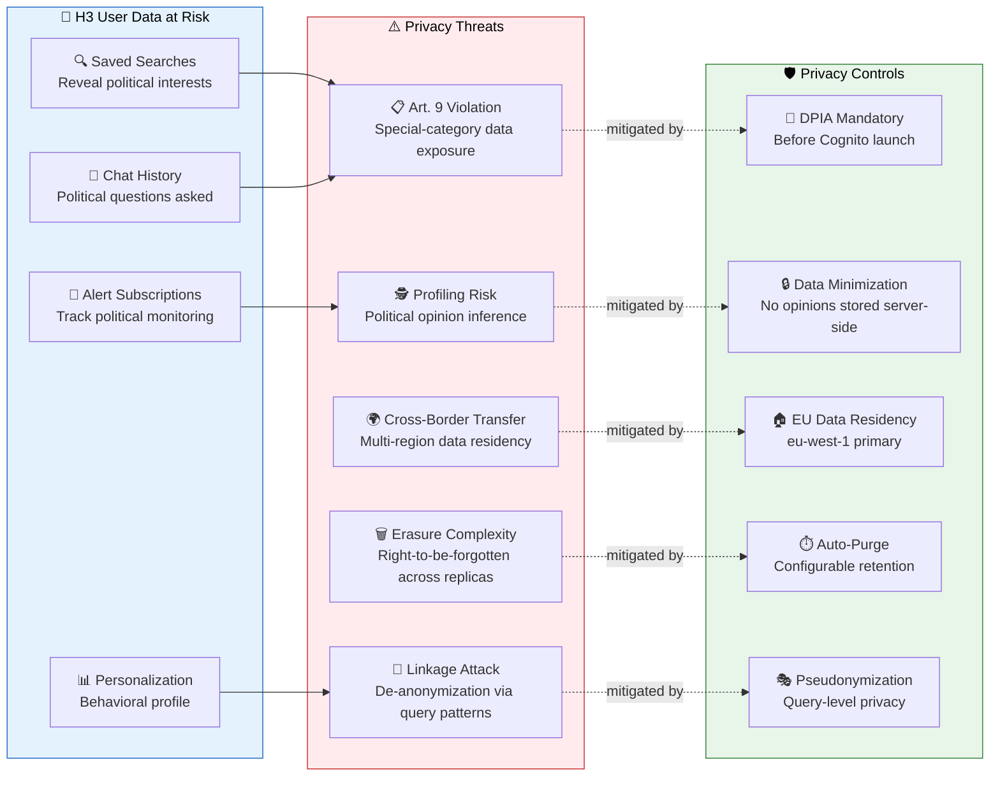

### **Scenario F17: Political-Opinion Inference from Usage Patterns (H3)**

| Attribute | Detail |
|-----------|--------|
| **🎭 Threat Agent** | Data breach attacker, insider, law enforcement overreach |
| **⚔️ Attack Vector** | Aggregate saved searches, alert patterns, and chatbot questions to infer a user's political opinions — GDPR Article 9 special-category data — without explicit consent for that processing purpose |
| **🎯 Target** | Cognito user profiles + associated DynamoDB/Aurora query history |
| **💥 Impact** | Violation of GDPR Art. 9 (processing special-category data without lawful basis); regulatory fines up to 4% annual turnover; chilling effect on civic engagement |
| **📊 Likelihood** | Medium (inference is technically straightforward once data is collected) |
| **⚠️ Risk Score** | **8.5/10 CRITICAL** |
| **🗂️ MITRE ATT&CK** | [T1530 Data from Cloud Storage](https://attack.mitre.org/techniques/T1530/), [T1213 Data from Information Repositories](https://attack.mitre.org/techniques/T1213/) |
| **🛡️ Planned Controls** | FUT-028: Privacy-by-design architecture (no server-side political-opinion storage), client-side encryption for saved queries, aggregate-only analytics, automated data minimization, DPIA gate before any new data collection, privacy-preserving personalization (on-device ML) |

### **Scenario F18: Cross-Region Data Residency Violation (H3)**

| Attribute | Detail |
|-----------|--------|
| **🎭 Threat Agent** | Configuration error, multi-region replication misconfiguration |
| **⚔️ Attack Vector** | DynamoDB Global Tables or Aurora Global replication copies EU citizen data to non-adequate jurisdictions (e.g., us-east-1) without proper safeguards |
| **🎯 Target** | User personal data in DynamoDB/Aurora replicas |
| **💥 Impact** | GDPR Chapter V violation (international transfer without adequacy/safeguards); Schrems II implications |
| **📊 Likelihood** | Low (requires misconfiguration, but multi-region is complex) |
| **⚠️ Risk Score** | **6.5/10 MEDIUM** |
| **🗂️ MITRE ATT&CK** | [T1537 Transfer Data to Cloud Account](https://attack.mitre.org/techniques/T1537/) |
| **🛡️ Planned Controls** | FUT-029: Geo-fenced replication (user PII stays in eu-west-1), AWS Config rules enforcing data residency, SCP preventing PII table replication to non-EU regions, automated compliance drift detection |

---

## 🔗 Supply Chain & AI Model Governance Threats

> *The platform's AI supply chain extends beyond npm packages to foundation models, training data, and MCP tool ecosystems — each a potential vector for subtle, high-impact compromise.*

### **🏭 AI Supply Chain Threat Model**

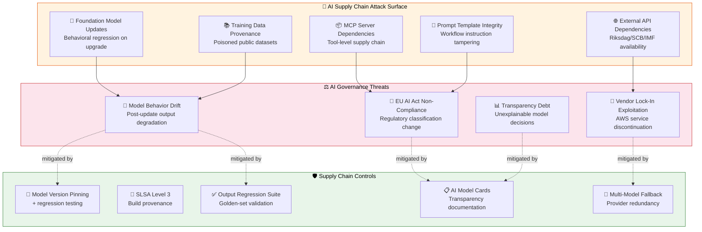

### **Scenario F19: Foundation Model Behavioral Regression**

| Attribute | Detail |
|-----------|--------|
| **🎭 Threat Agent** | Model provider (unintentional), adversary targeting model training |
| **⚔️ Attack Vector** | A Claude or Bedrock model update introduces subtle behavioral changes: different political framing, altered fact-selection preferences, or degraded neutrality in Swedish-language outputs |
| **🎯 Target** | All AI-generated content (14 news workflows, translation, analysis) |
| **💥 Impact** | Gradual quality/neutrality degradation across all outputs; potentially undetected for days if regression is subtle |
| **📊 Likelihood** | Medium (model updates are frequent; political-content testing is specialized) |
| **⚠️ Risk Score** | **7.0/10 HIGH** |
| **🗂️ MITRE ATT&CK** | [T1195.003 Compromise Hardware Supply Chain](https://attack.mitre.org/techniques/T1195/003/) (adapted: model supply chain) |
| **🛡️ Planned Controls** | FUT-030: Model regression test suite (golden-set political content), automated neutrality scoring on model upgrade, staged rollout (canary → full), model version pinning with explicit upgrade gates |

### **Scenario F20: EU AI Act Regulatory Reclassification**

| Attribute | Detail |
|-----------|--------|
| **🎭 Threat Agent** | Regulatory environment change |
| **⚔️ Attack Vector** | EU AI Act enforcement classifies the platform's election forecasting or political analysis as "high-risk AI" (Annex III, Category 8: administration of justice/democratic processes), triggering mandatory conformity assessment, transparency obligations, and human-oversight requirements |
| **🎯 Target** | Platform operational model, AI governance framework, compliance posture |
| **💥 Impact** | Mandatory conformity assessment, potential operational restrictions during compliance period, significant documentation/audit requirements |
| **📊 Likelihood** | Medium (political-analysis AI is an emerging regulatory gray area) |
| **⚠️ Risk Score** | **6.5/10 MEDIUM** |
| **🗂️ MITRE ATT&CK** | N/A (regulatory threat) |
| **🛡️ Planned Controls** | FUT-031: Proactive EU AI Act alignment (maintain documentation as if high-risk), model cards per Bedrock model, human-oversight architecture already designed, transparency reports, regular legal-counsel review of classification guidance |

### **Scenario F21: MCP Tool Ecosystem Compromise**

| Attribute | Detail |
|-----------|--------|
| **🎭 Threat Agent** | Supply-chain attacker, compromised open-source maintainer |
| **⚔️ Attack Vector** | Compromise an MCP server dependency (riksdag-regering, scb, world-bank, or upstream npm packages) to inject malicious tool responses into agentic workflows |
| **🎯 Target** | 14 agentic news workflows consuming MCP tool responses as trusted inputs |
| **💥 Impact** | Poisoned data flows through multiple workflows, generating and publishing manipulated content at scale |
| **📊 Likelihood** | Low-Medium (MCP ecosystem is young, rapidly evolving, less audited than mature npm packages) |
| **⚠️ Risk Score** | **7.5/10 HIGH** |
| **🗂️ MITRE ATT&CK** | [T1195.001 Compromise Software Dependencies and Development Tools](https://attack.mitre.org/techniques/T1195/001/) |
| **🛡️ Planned Controls** | FUT-032: MCP server integrity verification (SHA-pinned versions, SBOM tracking), response schema validation, anomaly detection on MCP responses, sandboxed tool execution, SLSA Level 3 provenance for all build inputs |

---

## 🌍 Geopolitical & Information Environment Threats

> *As Riksdagsmonitor expands to Nordic and EU parliaments, it enters a contested information environment where state-level actors actively seek to undermine democratic institutions.*

### **🗺️ Geopolitical Threat Landscape**

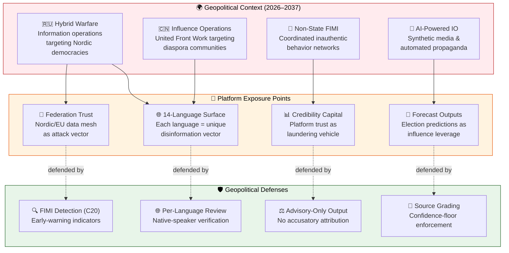

### **Language-Specific Threat Vectors**

The 14-language surface creates **asymmetric verification challenges**: content in languages without native-speaker review capacity (Arabic, Chinese, Japanese, Korean, Hebrew) presents higher manipulation risk.

| Language Tier | Languages | Verification Capacity | Manipulation Risk | Control |
|--------------|-----------|----------------------|-------------------|---------|
| **🟢 Tier 1 — Native Review** | Swedish (sv), English (en) | Full native review | Low | Direct editorial oversight |
| **🟡 Tier 2 — Accessible Review** | Norwegian (no), Danish (da), Finnish (fi), German (de), French (fr), Spanish (es), Dutch (nl) | Accessible via Nordic/EU network | Medium | Back-translation + network review |
| **🔴 Tier 3 — Limited Review** | Arabic (ar), Hebrew (he), Japanese (ja), Korean (ko), Chinese (zh) | Limited native review capacity | High | Enhanced back-translation, automated semantic-similarity scoring, community verification pipeline |

---

## 📊 Consolidated Future Security Control Requirements (Extended)

### **Additional Controls for Democratic & Privacy Threats**

| Control ID | Control Name | Threat Addressed | STRIDE Coverage | Implementation Target | Priority |
|-----------|-------------|-----------------|-----------------|----------------------|----------|
| **FUT-023** | Party-Symmetry CI Gate (automated neutrality audit) | F13: Neutrality Erosion | T, R | Q2 2026 | 🔴 Critical |
| **FUT-024** | Longitudinal Sentiment-Balance Monitoring | F13: Neutrality Erosion | T | Q3 2026 | 🔴 Critical |
| **FUT-025** | Election Cooling-Period Protocol | F14: Election Manipulation | T, D | Q3 2026 | 🔴 Critical |
| **FUT-026** | Completeness Audit (Riksdag decision coverage) | F15: Accountability Suppression | R, I | Q2 2026 | 🟡 High |
| **FUT-027** | Multi-Source Cross-Validation on Ingest | F16: Information Laundering | S, T | Q2 2026 | 🔴 Critical |
| **FUT-028** | Privacy-by-Design Architecture (no opinion storage) | F17: Political-Opinion Inference | I | 2027 Q3 | 🔴 Critical |
| **FUT-029** | Geo-Fenced Replication (EU PII residency) | F18: Data Residency Violation | I | 2027 Q4 | 🟡 High |
| **FUT-030** | Model Regression Test Suite (golden-set) | F19: Model Behavioral Regression | T | Q2 2026 | 🟡 High |
| **FUT-031** | Proactive EU AI Act Alignment | F20: Regulatory Reclassification | — | Q4 2026 | 🟡 High |
| **FUT-032** | MCP Server Integrity Verification (SHA-pinned) | F21: MCP Ecosystem Compromise | S, T | Q2 2026 | 🔴 Critical |

### **Extended STRIDE → Control Mapping (Democratic & Privacy)**

| STRIDE Category | Democratic/Privacy Primary Control | Secondary Control | Monitoring |
|-----------------|-----------------------------------|-------------------|------------|
| **Spoofing** | Multi-source cross-validation (FUT-027) | MCP integrity verification (FUT-032) | Source-grade monitoring, ingest anomaly alerts |
| **Tampering** | Party-symmetry CI gate (FUT-023), model regression suite (FUT-030) | Election cooling protocol (FUT-025) | Longitudinal sentiment monitoring (FUT-024) |
| **Repudiation** | Completeness audit (FUT-026) | Immutable calibration ledger | Decision-coverage gap alerts |
| **Info Disclosure** | Privacy-by-design (FUT-028), geo-fenced replication (FUT-029) | Data minimization, auto-purge | Privacy-impact continuous assessment |
| **DoS** | Election cooling protocol (FUT-025) | Rate limiting, human-escalation gates | Election-window monitoring escalation |
| **Elevation** | EU AI Act alignment (FUT-031) | Neutrality-as-governance | Regulatory landscape scanning |

---

## 📈 Extended Risk Assessment — Democratic & Governance Threats

| Threat | Horizon | Likelihood (1-5) | Impact (1-5) | Risk Score | Treatment |
|--------|:-------:|:-----------------:|:------------:|:----------:|-----------|
| Gradual neutrality erosion via AI drift | H2 | 4 | 5 | **20 CRITICAL** | MITIGATE (FUT-023, FUT-024) |
| Election-period forecast manipulation | H2/H3 | 3 | 5 | **15 CRITICAL** | MITIGATE (FUT-025) |
| Democratic accountability suppression | H2 | 2 | 5 | **10 CRITICAL** | MITIGATE (FUT-026) |
| Information laundering via platform credibility | H2 | 2 | 4 | **8 HIGH** | MITIGATE (FUT-027) |
| Political-opinion inference from usage | H3 | 3 | 4 | **12 HIGH** | MITIGATE (FUT-028) |
| Cross-region data residency violation | H3 | 1 | 4 | **4 MEDIUM** | MITIGATE (FUT-029) |
| Foundation model behavioral regression | H2 | 3 | 3 | **9 HIGH** | MITIGATE (FUT-030) |
| EU AI Act regulatory reclassification | H3 | 3 | 3 | **9 HIGH** | MITIGATE (FUT-031) |
| MCP tool ecosystem compromise | H2 | 2 | 4 | **8 HIGH** | MITIGATE (FUT-032) |

### **🎯 Risk Heat Map — All Future Threats**

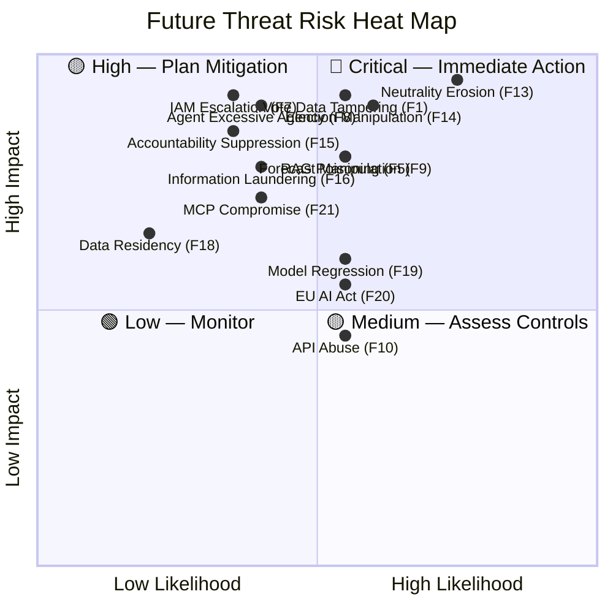

---

## 🔄 Continuous Future Threat Assessment

### **Assessment Lifecycle for Future Features**

| Phase | Trigger | Activities | Output |
|-------|---------|-----------|--------|
| **Pre-Implementation** | Feature design finalized | STRIDE analysis, attack tree construction, control design | Feature-specific threat addendum |
| **During Implementation** | Code review, PR merge | Security testing, SAST/DAST scanning, dependency audit | Security test results, remediation items |
| **Post-Deployment** | Feature goes live | Penetration testing, monitoring activation, alert tuning | Deployment security report |
| **Ongoing** | Quarterly review | Threat landscape update, control effectiveness assessment | Updated risk scores, new mitigations |

### **Future Threat Monitoring KPIs**

| KPI | Target | Measurement Method |
|-----|--------|-------------------|
| New feature threat coverage | 100% STRIDE per component | Feature threat model completeness |
| Time to detect data manipulation | < 15 minutes | Integrity check monitoring |
| Cross-workflow anomaly detection rate | > 95% | Consistency check pass rate |
| Translation integrity score | > 98% accuracy | Back-translation verification rate |
| Pipeline data freshness SLA | < 24 hours | Cache timestamp monitoring |
| WebSocket connection security | 100% TLS 1.3 | Connection protocol audit |
| RAG / Knowledge-Base source provenance (H3) | 100% allow-listed | Bedrock KB ingestion audit |
| Bedrock Agent action-scope conformance (H3) | 100% within least-privilege policy | Agent action-group / guardrail audit |
| Cognito MFA enrolment for authenticated tier (H3) | 100% of accounts | Identity provider compliance report |
| IAM least-privilege drift (H3) | 0 over-privileged roles | IAM Access Analyzer findings |
| Multi-region replication integrity (H3) | 100% checksum match | Cross-region reconciliation audit |

---

## ⚖️ Future Risk Assessment

### **Quantitative Risk Matrix — Future Threats**

Scores split by horizon. **H2** threats can materialise 2026–2027 while the platform is still static; **H3** threats only become live once managed AWS services are provisioned (2027+).

| Threat | Horizon | Likelihood (1-5) | Impact (1-5) | Risk Score | Treatment |
|--------|:-------:|:-----------------:|:------------:|:----------:|-----------|
| Real-time vote data manipulation | H2 | 3 | 5 | **15 CRITICAL** | MITIGATE (FUT-001, FUT-009) |
| CIA pipeline cache poisoning | H2 | 2 | 4 | **8 HIGH** | MITIGATE (FUT-002, FUT-003) |
| Multi-workflow AI orchestration attack | H2 | 2 | 4 | **8 HIGH** | MITIGATE (FUT-004) |
| Translation integrity attack | H2 | 3 | 3 | **9 HIGH** | MITIGATE (FUT-005) |
| Dashboard rendering DoS | H2 | 3 | 2 | **6 MEDIUM** | MITIGATE (FUT-007) |
| Politician profile defacement | H2 | 2 | 3 | **6 MEDIUM** | MITIGATE (FUT-006) |
| EU Parliament API compromise | H2 | 1 | 3 | **3 LOW** | ACCEPT + MONITOR (FUT-008) |
| Lambda/IAM privilege escalation & data exfiltration | H3 | 2 | 5 | **10 CRITICAL** | MITIGATE (FUT-015, FUT-016, FUT-020) |
| Bedrock Agent excessive agency | H3 | 2 | 5 | **10 CRITICAL** | MITIGATE (FUT-017) |
| Bedrock Knowledge-Base / RAG poisoning | H3 | 3 | 4 | **12 HIGH** | MITIGATE (FUT-011, FUT-012) |
| SageMaker election-forecast manipulation | H3 | 3 | 4 | **12 HIGH** | MITIGATE (FUT-018) |
| Cognito account takeover & IDOR | H3 | 3 | 3 | **9 HIGH** | MITIGATE (FUT-013, FUT-014) |
| AppSync/API Gateway public-API abuse | H3 | 3 | 2 | **6 MEDIUM** | MITIGATE (FUT-019) |
| Multi-region failover & replication tampering | H3 | 1 | 4 | **4 MEDIUM** | MITIGATE (FUT-021) |
| Nordic/EU federation cross-jurisdiction integrity | H3 | 2 | 3 | **6 MEDIUM** | MITIGATE (FUT-022) |

---

## 📚 Related Documents

### **Riksdagsmonitor Documentation**

- [🎯 Current Threat Model](./THREAT_MODEL.md) — Active production threat analysis
- [🏛️ Architecture](./ARCHITECTURE.md) — Current C4 architecture models
- [🔮 Future Architecture](./FUTURE_ARCHITECTURE.md) — Planned architecture evolution
- [🔐 Security Architecture](./SECURITY_ARCHITECTURE.md) — Current security controls
- [🔮 Future Security Architecture](./FUTURE_SECURITY_ARCHITECTURE.md) — Planned security enhancements
- [📊 Data Model](./DATA_MODEL.md) — Political data entities and relationships
- [📊 Future Data Model](./FUTURE_DATA_MODEL.md) — Enhanced data architecture plans
- [🔄 Flowchart](./FLOWCHART.md) — Business process and data flows
- [📈 State Diagram](./STATEDIAGRAM.md) — System state transitions
- [🧠 Mindmap](./MINDMAP.md) — System conceptual relationships
- [💼 SWOT](./SWOT.md) — Strategic analysis and positioning
- [🔄 Workflows](./WORKFLOWS.md) — CI/CD security workflows

### **Hack23 ISMS Policies (Public)**

- [🎯 Threat Modeling Policy](https://github.com/Hack23/ISMS-PUBLIC/blob/main/Threat_Modeling.md) — ISMS threat modeling methodology
- [🔐 Secure Development Policy](https://github.com/Hack23/ISMS-PUBLIC/blob/main/Secure_Development_Policy.md) — SDLC security requirements
- [🏷️ Classification Framework](https://github.com/Hack23/ISMS-PUBLIC/blob/main/CLASSIFICATION.md) — CIA triad business impact analysis
- [📉 Risk Register](https://github.com/Hack23/ISMS-PUBLIC/blob/main/Risk_Register.md) — Enterprise risk management
- [🤖 AI Policy](https://github.com/Hack23/ISMS-PUBLIC/blob/main/AI_Policy.md) — LLM application security requirements

### **Reference Implementations**

- [🏛️ CIA Threat Model](https://github.com/Hack23/cia/blob/master/THREAT_MODEL.md) — Full-stack web application threat model
- [🎮 Black Trigram Future Threat Model](https://github.com/Hack23/blacktrigram/blob/main/FUTURE_THREAT_MODEL.md) — AWS serverless future threat analysis

---

## 📋 Document Control

**📋 Document Owner:** James Pether Sörling, CEO & CISO  
**📄 Version:** 2.1  
**📅 Last Updated:** 2026-06-02 (UTC)  
**✅ Approved by:** James Pether Sörling, CEO  
**🔄 Review Cycle:** Quarterly (Feb, May, Aug, Nov)  
**⏰ Next Review:** 2026-09-02  
**🏢 Owner:** Hack23 AB (Org.nr 5595347807)  
**📤 Distribution:** Public  
**🏷️ Classification:**   

### **Revision History**

| Version | Date | Author | Changes |
|---------|------|--------|---------|
| 2.1 | 2026-06-02 | James Pether Sörling | Added Democratic Integrity & Accountability Threats (F13-F16); Privacy/GDPR threats (F17-F18); Supply Chain & AI Governance threats (F19-F21); Geopolitical & FIMI section; extended controls FUT-023–FUT-032; risk heat map; language-specific threat vectors table; 5 new mermaid diagrams |
| 2.0 | 2026-05-31 | James Pether Sörling | Major expansion: Three-Horizon framework, Crown Jewel analysis, Attack Trees, Kill Chain mapping, OWASP LLM Top 10, Political-Intelligence capabilities |
| 1.0 | 2026-04-15 | James Pether Sörling | Initial future threat model with STRIDE and basic scenarios |

### **Framework Compliance**

**🎯 Framework Alignment:**  
    

---

## 🌐 Evolving the Current IMF Threat Model — Future-State STRIDE Expansion

*Baseline: the **already-implemented** IMF STRIDE coverage (T-IMF-01..07) lives in [`THREAT_MODEL.md`](THREAT_MODEL.md) §IMF. The rows below (T-IMF-F-01..08) add future-state threats that emerge when the runtime migrates to Lambda + Aurora — they extend the baseline rather than replace it.*

> **Authoritative hub:** [`analysis/imf/README.md`](analysis/imf/README.md) · [`analysis/imf/agentic-integration.md`](analysis/imf/agentic-integration.md) · [`analysis/imf/indicators-inventory.json`](analysis/imf/indicators-inventory.json) · [`analysis/imf/data-dictionary.md`](analysis/imf/data-dictionary.md) · [`.github/aw/ECONOMIC_DATA_CONTRACT.md`](.github/aw/ECONOMIC_DATA_CONTRACT.md)

### STRIDE rows for IMF integration

| ID | Element | STRIDE | Description | Likelihood | Impact | Mitigation |
|---|---|---|---|---|---|---|
| **T-IMF-F-01** | IMF cache (Aurora) | **T**ampering | Vintage substitution attack — older WEO vintage swapped for newer label | LOW | HIGH | SHA-256 payload pin + immutable supersedes-chain + CloudTrail audit |
| **T-IMF-F-02** | IMF egress path | **D**oS | Workflow exhausts IMF rate limit (~30 req/min) → blocks legitimate articles | MEDIUM | MEDIUM | Cache-first; ≤30 req/min self-imposed; exponential back-off; metric alarm |
| **T-IMF-F-03** | IMF payload | **R**epudiation | Article cites "IMF projects 2.1% growth" without vintage label → unauditable | MEDIUM | MEDIUM | `economicProvenance` row required for every economic claim; `cite_text` mandatory |
| **T-IMF-F-04** | IMF Datamapper schema | **T**ampering | Upstream schema change between WEO Apr/Oct cycles silently corrupts cache | LOW | HIGH | Version-pinned client guard; CI integration test against IMF sandbox |
| **T-IMF-F-05** | IMF data licence | **R**epudiation | Article reuses IMF figure without attribution (licence violation) | LOW | MEDIUM | Article footer template auto-emits IMF citation block; lint enforces |
| **T-IMF-F-06** | IMF cache fallback | **I**nformation disclosure | Stale vintage served to readers as current | LOW | MEDIUM | Vintage-age badge (yellow >3mo, red >6mo); ECONOMIC_DATA_CONTRACT v2.1 banned phrases |
| **T-IMF-F-07** | IMF + SCB cross-validation | **T**ampering | IMF SWE figure diverges >0.3pp from SCB national-accounts (silent error) | LOW | MEDIUM | Quarterly cross-validation worker opens editorial-review issue |
| **T-IMF-F-08** | IMF script supply chain | **E**levation | `tsx scripts/imf-fetch.ts` execution path tampered upstream | LOW | HIGH | Script in-repo; reviewed; no dynamic eval; harden-runner egress audit |

### Mapping to MITRE ATT&CK (data-source threats)

| Tactic | Technique | IMF-specific application |
|---|---|---|
| TA0006 Credential Access | T1552 Unsecured credentials | Datamapper transport is unauthenticated; SDMX 3.0 uses an Azure APIM subscription key (`IMF_SDMX_SUBSCRIPTION_KEY`) stored only as a GitHub Actions secret (never on disk, never logged); rotation playbook in `analysis/imf/agentic-integration.md` |
| TA0007 Discovery | T1083 File and directory discovery | Cache directory permissions (read-only to article workers) |
| TA0009 Collection | T1530 Cloud storage object | Aurora row-level access controls |
| TA0040 Impact | T1485 Data destruction | Supersedes-chain prevents destructive overwrite |

**Egress hosts** (allow-list): `www.imf.org` (Datamapper REST · WEO/FM, **unauthenticated**), `api.imf.org` (SDMX 3.0 REST · IFS/BOP/DOTS/GFS/PCPS/ER/MFS_IR/MFS_PR, **subscription-key authenticated** via the Azure APIM `Ocp-Apim-Subscription-Key` header / `IMF_SDMX_SUBSCRIPTION_KEY` secret). Both HTTPS-only; payloads are public macro statistics with no PII.

**Canonical rule.** Every economic claim in a Riksdagsmonitor article cites an IMF dataflow first; World Bank citations are reserved for governance, environment and social residue (the classes IMF does not publish). SCB is the Swedish-specific ground truth layer. See `ECONOMIC_DATA_CONTRACT.md` v2.1 for the banned-phrase list and vintage discipline (>6 mo → annotation).

---

## 🔗 Hack23 Ecosystem

<table>
<tr>
  <th width="33%">🌐 Platforms</th>
  <th width="33%">📦 Open-Source Projects</th>
  <th width="33%">🛡️ Governance &amp; Standards</th>
</tr>
<tr>
<td valign="top">
🗳️ <a href="https://riksdagsmonitor.com">Riksdagsmonitor</a> — Swedish Parliament intelligence 
🇪🇺 <a href="https://www.euparliamentmonitor.com">EU Parliament Monitor</a> — European coverage 
🕵️ <a href="https://www.hack23.com/cia">Citizen Intelligence Agency</a> — political-data engine 
🌐 <a href="https://www.hack23.com">Hack23 AB</a> — corporate site 
📰 <a href="https://hack23.com/blog.html">Hack23 Blog</a> — engineering &amp; policy 
💼 <a href="https://www.linkedin.com/company/hack23/">Hack23 on LinkedIn</a>
</td>
<td valign="top">
🗳️ <a href="https://github.com/Hack23/riksdagsmonitor">Hack23/riksdagsmonitor</a> 
🕵️ <a href="https://github.com/Hack23/cia">Hack23/cia</a> 
🇪🇺 <a href="https://github.com/Hack23/euparliamentmonitor">Hack23/euparliamentmonitor</a> 
🔌 <a href="https://github.com/Hack23/european-parliament-mcp">Hack23/european-parliament-mcp</a> 
✅ <a href="https://github.com/Hack23/cia-compliance-manager">Hack23/cia-compliance-manager</a> 
🥋 <a href="https://github.com/Hack23/black-trigram">Hack23/black-trigram</a> 
🏠 <a href="https://github.com/Hack23/homepage">Hack23/homepage</a>
</td>
<td valign="top">
🛡️ <a href="https://github.com/Hack23/ISMS-PUBLIC">Hack23 ISMS-PUBLIC</a> — public ISMS 
🔒 <a href="https://github.com/Hack23/ISMS-PUBLIC/blob/main/Information_Security_Policy.md">Information Security Policy</a> 
🤖 <a href="https://github.com/Hack23/ISMS-PUBLIC/blob/main/AI_Policy.md">AI Policy</a> 
🧪 <a href="https://github.com/Hack23/ISMS-PUBLIC/blob/main/Secure_Development_Policy.md">Secure Development Policy</a> 
🎯 <a href="https://github.com/Hack23/ISMS-PUBLIC/blob/main/Threat_Modeling.md">Threat Modeling Policy</a> 
⚠️ <a href="https://github.com/Hack23/ISMS-PUBLIC/blob/main/Vulnerability_Management.md">Vulnerability Management</a> 
🏷️ <a href="https://github.com/Hack23/ISMS-PUBLIC/blob/main/CLASSIFICATION.md">Classification Framework</a>
</td>
</tr>
</table>

<em>🗳️ Empower citizens · 🔍 Strengthen democratic accountability · 🕵️ Illuminate the political process</em>

© 2008–2026 <a href="https://www.hack23.com">Hack23 AB</a> (Org.nr 559534-7807) · Maintainer: <a href="https://www.linkedin.com/in/jamessorling/">James Pether Sörling, CISSP CISM</a>

