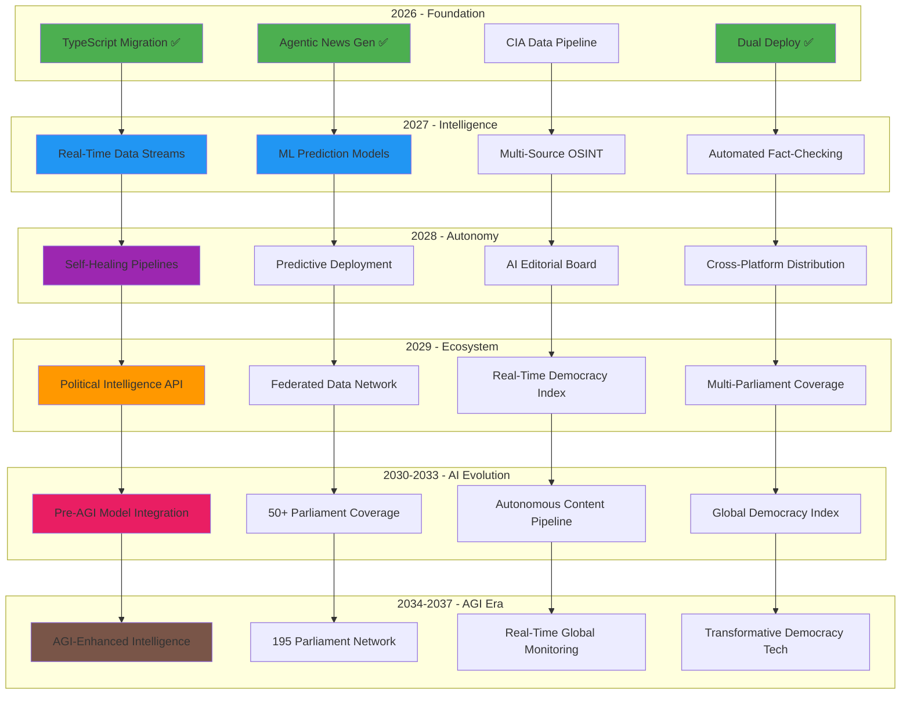

# 🔮 Riksdagsmonitor — Future Workflows Vision

**Document Version:** 2.0
**Last Updated:** 2026-02-24
**Classification:** Public
**Owner:** Hack23 AB (Org.nr 5595347807)
**Horizon:** 2026–2037

## Executive Summary

This document projects the evolution of Riksdagsmonitor's CI/CD and automation workflows over the next eleven years (2026-2037). Building on the current foundation of 44 workflows, the vision encompasses AI-native pipelines, real-time political intelligence, predictive analytics, and fully autonomous content generation — all while maintaining ISO 27001/NIST CSF/CIS Controls compliance.

### Current State (2026 Q1)
- 44 workflows (24 YAML + 10 agentic sources + 10 compiled locks)
- TypeScript migration complete (27 modules)
- 1200 unit tests, dual deployment (S3/CloudFront + GitHub Pages)
- 10 agentic news generation workflows (Claude Opus 4.6)

### Target State (2029-2037)
- 50+ autonomous workflows
- Real-time political intelligence pipeline
- Predictive analytics with ML models
- Multi-platform content distribution
- Self-healing infrastructure
- Zero-touch deployment with canary releases

---

## Vision Architecture



---

## Phase 1: Enhanced Foundation (2026 Q2–Q4)

### 1.1 CIA Data Pipeline Activation

**Priority:** Critical
**Status:** Placeholder implemented, fetch logic pending

```yaml
# Projected: data-pipeline-v2.yml
name: CIA Intelligence Pipeline v2

on:
  schedule:
    - cron: '0 2 * * *'  # Daily 03:00 CET
  workflow_dispatch:
    inputs:
      products:
        description: 'CIA products to fetch (comma-separated or "all")'
        default: 'all'

jobs:
  fetch:
    steps:
      - Fetch 19 CIA visualization products
      - JSON Schema validation
      - Data quality scoring (completeness, freshness, accuracy)
      - Versioned cache with 7-day archive
      - Auto-PR with data diff summary
  
  transform:
    needs: fetch
    steps:
      - Transform CIA JSON → optimized static data
      - Generate summary statistics
      - Update index*.html with fresh metrics
      - Generate data quality report
  
  alert:
    needs: transform
    if: data quality score < threshold
    steps:
      - Create GitHub issue with quality report
      - Notify via webhook
```

### 1.2 Comprehensive E2E Test Suite

**Priority:** High

```yaml
# Projected: e2e-comprehensive.yml
name: Comprehensive E2E Testing

strategy:
  matrix:
    browser: [chromium, firefox, webkit]
    viewport: [mobile, tablet, desktop]
    language: [en, sv, ar, ja]  # Representative sample

jobs:
  visual-regression:
    steps:
      - Playwright visual comparison
      - Percy/Chromatic screenshot diffing
      - Accessibility audit per viewport
      - Performance budget validation
  
  interaction-testing:
    steps:
      - Chart.js/D3.js interaction flows
      - Language switcher navigation
      - Dashboard drill-down paths
      - Keyboard navigation coverage
```

### 1.3 Preview Deployments

**Priority:** Medium

```yaml
# Projected: deploy-preview.yml
name: PR Preview Deployment

on:
  pull_request:
    types: [opened, synchronize]

jobs:
  preview:
    steps:
      - Vite build
      - Deploy to S3 preview bucket (pr-{number}.preview.riksdagsmonitor.com)
      - Lighthouse audit on preview
      - Comment PR with preview URL + performance report
      - Auto-cleanup on PR close
```

### 1.4 Automated Dependency Updates

**Priority:** Medium

```yaml
# Projected: dependency-auto-update.yml
name: Automated Dependency Management

on:
  schedule:
    - cron: '0 4 * * 1'  # Weekly Monday 04:00 UTC

jobs:
  update:
    steps:
      - npm outdated --json
      - Categorize: security (immediate), major (manual), minor/patch (auto)
      - Auto-PR for minor/patch with passing tests
      - Security advisory → immediate PR with high priority label
      - GitHub Action SHA pinning audit → update to latest SHAs
```

---

## Phase 2: Intelligence Layer (2027)

### 2.1 Real-Time Political Data Streams

```yaml
# Vision: realtime-data-stream.yml
name: Real-Time Political Intelligence

on:
  schedule:
    - cron: '*/10 * * * *'  # Every 10 minutes during parliamentary sessions

jobs:
  stream-monitor:
    steps:
      - Poll Riksdag API for new documents, votes, speeches
      - Detect significant events (new motions, votes, committee reports)
      - Classify event significance (routine/notable/breaking)
      - Trigger downstream workflows based on classification
  
  breaking-news:
    needs: stream-monitor
    if: event.significance == 'breaking'
    steps:
      - Generate breaking news article (agentic)
      - Multi-language translation (14 languages)
      - Deploy immediately
      - Push notifications via web push API
```

### 2.2 ML-Powered Prediction Pipeline

```yaml
# Vision: ml-predictions.yml
name: Political Prediction Models

on:
  schedule:
    - cron: '0 6 * * *'  # Daily model refresh

jobs:
  train:
    runs-on: ubuntu-latest-gpu  # GPU runner for ML training
    steps:
      - Fetch historical voting data (50+ years)
      - Train/update models:
        - Voting prediction (party cohesion, rebellion probability)
        - Coalition stability forecast
        - Election seat projections (±5 seats confidence interval)
        - MP career trajectory prediction
      - Model validation (k-fold cross-validation, backtesting)
      - Publish model artifacts
  
  predict:
    needs: train
    steps:
      - Generate daily predictions
      - Update prediction dashboard data
      - Generate confidence intervals
      - Archive predictions for accuracy tracking
  
  accuracy-audit:
    needs: predict
    steps:
      - Compare past predictions vs actual outcomes
      - Generate accuracy scorecard
      - Flag model drift (retrain if accuracy < threshold)
```

### 2.3 Multi-Source OSINT Pipeline

```yaml
# Vision: osint-pipeline.yml
name: Multi-Source OSINT Collection

on:
  schedule:
    - cron: '0 */4 * * *'  # Every 4 hours

sources:
  - riksdag-open-data-api
  - government-press-releases
  - committee-calendar
  - european-parliament-api
  - nordic-council-data
  - public-register-data

jobs:
  collect:
    strategy:
      matrix:
        source: [riksdag, government, eu-parliament, nordic-council]
    steps:
      - Source-specific data fetch
      - Normalize to common schema
      - Deduplication and entity resolution
      - Cross-reference validation
      - Store in versioned data lake

  correlate:
    needs: collect
    steps:
      - Entity linking (MP → party → committee → votes)
      - Network analysis (influence mapping)
      - Temporal correlation (event sequencing)
      - Generate intelligence briefs
```

### 2.4 Automated Fact-Checking

```yaml
# Vision: fact-check.yml
name: Automated Fact-Checking Pipeline

on:
  workflow_call:  # Called by content generation workflows

jobs:
  verify:
    steps:
      - Extract claims from generated content
      - Cross-reference against:
        - Riksdag voting records
        - Government publications
        - Official statistics (SCB)
        - Previous verified reports
      - Assign confidence scores per claim
      - Flag unverifiable claims for human review
      - Generate fact-check report with source citations
```

---

## Phase 3: Autonomous Operations (2028)

### 3.1 Self-Healing Infrastructure

```yaml
# Vision: self-healing.yml
name: Self-Healing Pipeline

on:
  workflow_run:
    workflows: ["*"]
    types: [completed]
    conclusions: [failure]

jobs:
  diagnose:
    steps:
      - Classify failure type:
        - transient (network, rate limit) → auto-retry
        - dependency (npm package) → try alternative version
        - test flake → quarantine and retry
        - build error → bisect recent commits
        - infrastructure → escalate
      - Execute auto-remediation
      - If remediation fails → create detailed issue with diagnostics
  
  repair:
    needs: diagnose
    if: diagnosis.auto-fixable == true
    steps:
      - Apply fix (retry, rollback, dependency update)
      - Re-run failed workflow
      - Verify success
      - Update incident log
  
  learn:
    needs: repair
    steps:
      - Log failure pattern
      - Update failure knowledge base
      - Adjust retry strategies based on historical success rates
      - Generate monthly reliability report
```

### 3.2 Canary Deployments

```yaml
# Vision: canary-deploy.yml
name: Canary Deployment Pipeline

jobs:
  canary:
    steps:
      - Deploy to canary (5% traffic via CloudFront)
      - Monitor for 30 minutes:
        - Error rate (< 0.1%)
        - Performance (LCP < 2.5s)
        - User engagement metrics
      - If healthy → progressive rollout (25% → 50% → 100%)
      - If degraded → automatic rollback + alert
  
  rollback:
    if: canary.health == 'degraded'
    steps:
      - Revert CloudFront to previous version
      - Create incident report
      - Notify team
```

### 3.3 AI Editorial Board

```yaml
# Vision: ai-editorial-board.yml
name: AI Editorial Board Review

on:
  workflow_call:  # Called after content generation

jobs:
  editorial-review:
    strategy:
      matrix:
        perspective: [political-analyst, fact-checker, style-editor, bias-detector]
    steps:
      - Review generated content from assigned perspective
      - Score on: accuracy, balance, style, bias, completeness
      - Generate editorial feedback
  
  consensus:
    needs: editorial-review
    steps:
      - Aggregate scores from all perspectives
      - Apply editorial standards (The Economist style)
      - Auto-approve if consensus score ≥ 85%
      - Route to human editor if score < 85%
      - Generate editorial metrics report
```

### 3.4 Multi-Platform Content Distribution

```yaml
# Vision: content-distribution.yml
name: Multi-Platform Distribution

on:
  workflow_call:  # After editorial approval

jobs:
  distribute:
    strategy:
      matrix:
        platform: [website, rss, newsletter, social-media, api]
    steps:
      - Transform content for platform format:
        - Website: HTML with Schema.org structured data
        - RSS: Atom feed with full content
        - Newsletter: MJML email template
        - Social: Platform-specific excerpts
        - API: JSON endpoint for consumers
      - Publish to platform
      - Track distribution metrics
```

---

## Phase 4: Ecosystem (2029)

### 4.1 Political Intelligence API

```yaml
# Vision: intelligence-api.yml
name: Political Intelligence API Service

description: >
  Public API providing structured political intelligence data
  for researchers, journalists, and civic tech applications.

endpoints:
  /api/v1/mps:              # Current and historical MPs
  /api/v1/votes:             # Voting records with analysis
  /api/v1/predictions:       # ML-powered predictions
  /api/v1/network:           # Influence network graphs
  /api/v1/timeline:          # Political event timeline
  /api/v1/risk-assessment:   # Democratic health metrics

features:
  - Rate limiting (100 req/min free, 1000 req/min API key)
  - GraphQL endpoint for flexible queries
  - WebSocket for real-time updates during sessions
  - OpenAPI 3.1 specification
  - SDK generation (TypeScript, Python, R)
```

### 4.2 Multi-Parliament Coverage

```yaml
# Vision: multi-parliament.yml
name: Multi-Parliament Intelligence Pipeline

parliaments:
  - swedish-riksdag       # Current (349 MPs)
  - european-parliament   # MEPs via EP API
  - nordic-council        # Nordic cooperation
  - finnish-eduskunta     # Comparative Nordic
  - danish-folketing      # Comparative Nordic
  - norwegian-storting    # Comparative Nordic

jobs:
  collect:
    strategy:
      matrix:
        parliament: ${{ parliaments }}
    steps:
      - Fetch data via parliament-specific MCP server
      - Normalize to common political data schema
      - Cross-parliament entity linking
      - Generate comparative analysis
```

### 4.3 Real-Time Democracy Health Index

```yaml
# Vision: democracy-index.yml
name: Democracy Health Index

metrics:
  transparency:
    - Parliamentary debate coverage
    - Government document accessibility
    - FOI response times
  participation:
    - Voter turnout trends
    - Public consultation engagement
    - Petition activity
  accountability:
    - Voting discipline vs. campaign promises
    - Minister question responses
    - Committee oversight effectiveness
  pluralism:
    - Media coverage diversity
    - Opposition effectiveness
    - Cross-party cooperation rate

output:
  - Daily democracy health score (0-100)
  - Trend analysis (improving/declining/stable)
  - International comparison rankings
  - Early warning indicators for democratic backsliding
```

### 4.4 Federated Intelligence Network

```yaml
# Vision: federated-network.yml
name: Federated Political Intelligence Network

description: >
  Peer-to-peer network of parliamentary monitoring platforms
  sharing structured political data while maintaining
  sovereignty and data governance.

architecture:
  - IPFS for decentralized data storage
  - ActivityPub for inter-platform communication
  - Shared ontology for political entities
  - Privacy-preserving analytics (differential privacy)
  - GDPR-compliant cross-border data sharing
```

---

## Technology Evolution Roadmap

### Build & Runtime

| Year | Node.js | TypeScript | Bundler | Test Runner |
|------|---------|------------|---------|-------------|
| 2026 | 24 | 5.9 | Vite 7 | Vitest 4 |
| 2027 | 26 | 6.x | Vite 8 | Vitest 5 |
| 2028 | 28 | 7.x | Vite 9 / Turbopack | Vitest 6 |
| 2029 | 30 | 8.x | Next-gen bundler | Native test runner |

### AI & ML

| Year | Content Gen | ML Runtime | Model |
|------|-------------|------------|-------|
| 2026 | Claude Opus 4.6 | — | Agentic .md workflows |
| 2027 | Claude + fine-tuned models | ONNX.js | Voting prediction |
| 2028 | Multi-model ensemble | WebGPU inference | Real-time analysis |
| 2029 | Self-improving agents | Edge ML | Predictive intelligence |

### Infrastructure

| Year | Deploy | CDN | Monitoring |
|------|--------|-----|------------|
| 2026 | S3/CloudFront + GitHub Pages | CloudFront | Uptime + Lighthouse |
| 2027 | + Preview envs + canary | CloudFront + Cloudflare | + Real user metrics |
| 2028 | Zero-downtime + auto-rollback | Edge compute | + ML anomaly detection |
| 2029 | Global edge deployment | Distributed CDN mesh | Self-healing observability |

---

## Workflow Count Projection

```mermaid
gantt
    title Workflow Growth Projection
    dateFormat YYYY-Q
    axisFormat %Y

    section Security
    Current (5)          :done, 2026-Q1, 2026-Q1
    + Dependency Auto     :2026-Q3, 2026-Q4
    + Supply Chain v2     :2027-Q1, 2027-Q2

    section Testing
    Current (7)          :done, 2026-Q1, 2026-Q1
    + Visual Regression   :2026-Q2, 2026-Q3
    + Cross-Browser Matrix:2026-Q3, 2026-Q4
    + ML Model Validation :2027-Q2, 2027-Q3

    section Data Pipeline
    Current (5)          :done, 2026-Q1, 2026-Q1
    + CIA Pipeline v2     :2026-Q2, 2026-Q3
    + OSINT Pipeline      :2027-Q1, 2027-Q3
    + Prediction Pipeline :2027-Q3, 2028-Q1

    section Agentic
    Current (7)          :done, 2026-Q1, 2026-Q1
    + Fact-Checking       :2027-Q1, 2027-Q2
    + Editorial Board     :2028-Q1, 2028-Q2
    + Multi-Platform      :2028-Q2, 2028-Q3

    section Deploy
    Current (3)          :done, 2026-Q1, 2026-Q1
    + Preview Deploys     :2026-Q2, 2026-Q3
    + Canary Deploys      :2028-Q1, 2028-Q2
    + Self-Healing        :2028-Q2, 2028-Q4
```

| Year | Projected Total | New Capabilities |
|------|----------------|------------------|
| 2026 Q1 | **44** | TypeScript foundation, 10 agentic workflows ✅ |
| 2026 Q4 | **50** | CIA pipeline v2, preview deploys, visual regression |
| 2027 Q4 | **55** | OSINT pipeline, ML predictions, real-time streams |
| 2028 Q4 | **65** | Self-healing, canary deploy, AI editorial board |
| 2029 Q4 | **75+** | Intelligence API, multi-parliament, federation |

---

## ISMS Evolution

### Security Automation Growth

| Capability | 2026 | 2027 | 2028 | 2029 |
|------------|------|------|------|------|
| SHA Pinning | ✅ Manual | ✅ Auto-update | ✅ Auto + verify | ✅ Self-managing |
| SBOM | ✅ Per-release | ✅ Per-commit | ✅ Real-time | ✅ Federated |
| Vulnerability Scan | ✅ CodeQL + Dependabot | + SAST/DAST | + Fuzzing | + AI-assisted |
| Compliance Check | ✅ Manual mapping | Auto-mapping | Continuous | Predictive |
| Incident Response | ✅ Auto-issue | + Auto-diagnose | + Auto-remediate | + Self-healing |
| Threat Model | ✅ STRIDE manual | + Auto-update | + Real-time | + Predictive |

### Projected Compliance

```
2026: ISO 27001:2022 + NIST CSF 2.0 + CIS v8.1 (current)
2027: + SOC 2 Type II automation
2028: + EU AI Act compliance (for ML models)
2029: + NIS2 Directive compliance (critical infrastructure)
```

---

## Phase 5: AI Evolution & Global Scale (2030-2033)

### 5.1 Pre-AGI Model Integration

**Priority:** Strategic
**AI Model Trajectory:** Anthropic Opus 8.x-10.x (minor updates every ~2.3 months, major annually)

**Capabilities:**
- Continuous model evaluation pipeline (automated benchmarking every 2.3 months)
- Multi-model orchestration (Bedrock model switching based on task complexity)
- Near-expert political analysis with domain-specialized fine-tuning
- Autonomous investigative journalism workflows

### 5.2 Global Parliament Coverage

**Target:** 50+ parliaments across Europe, Americas, and Asia-Pacific

**Workflow Additions:**
- Parliament API discovery and integration workflows
- Cross-parliament schema normalization pipelines
- Multi-timezone content scheduling (24/7 global coverage)
- Federated data network synchronization

### 5.3 Autonomous Content Pipeline

**Target:** < 5% human review required for standard articles

**Key Metrics:**
- AI editorial quality score > 95%
- Fact verification accuracy > 99%
- Multi-modal content (text, image, audio, video) in 50+ languages
- Real-time event-driven article generation

---

## Phase 6: AGI Era & Transformative Democracy (2034-2037)

### 6.1 AGI-Enhanced Intelligence

**Scenario:** AGI or near-AGI systems become available through Amazon Bedrock or successor platforms

**Strategic Considerations:**
- 🤖 **Autonomous analysis**: AGI-powered real-time political intelligence across all 195 parliamentary systems
- 🌐 **Universal language support**: Every UN language supported natively
- 📊 **Predictive governance**: Policy impact prediction before legislation is proposed
- ⚖️ **Ethical AI governance**: Human oversight maintained regardless of AI capability level
- 🛡️ **Democratic safeguards**: Platform architecture prevents weaponization or manipulation

### 6.2 AI Model Evolution Strategy

**Assumptions:**
- Anthropic Opus minor updates every ~2.3 months through 2037 (or until successor paradigm)
- Major version upgrades annually (Opus 5.0, 6.0, 7.0... through ~12.0 by 2037)
- Competitors (OpenAI, Google, Meta, EU sovereign AI) evaluated at each major release
- Architecture must accommodate potential paradigm shifts (quantum AI, neuromorphic computing)

**Workflow Count Projection (Extended):**

| Year | Total Workflows | AI Model | Key Capability |
|------|----------------|----------|----------------|
| 2026 | 44-50 | Opus 4.6-4.9 | Agentic news generation |
| 2027 | 50-55 | Opus 5.x | Predictive analytics |
| 2028 | 55-65 | Opus 6.x | Multi-modal content |
| 2029 | 65-75 | Opus 7.x | Autonomous pipeline |
| 2030 | 75-85 | Opus 8.x | Near-expert analysis |
| 2031-2033 | 85-100 | Opus 9-10.x / Pre-AGI | Global coverage |
| 2034-2037 | 100-120+ | AGI / Post-AGI | Transformative platform |

---

## Key Risks & Mitigations

| Risk | Impact | Likelihood | Mitigation |
|------|--------|------------|------------|
| AI model hallucination in news content | High | Medium | Multi-agent fact-checking, human-in-the-loop for breaking news |
| ML prediction model bias | High | Medium | Regular bias audits, diverse training data, transparency reports |
| API rate limiting by data sources | Medium | High | Caching, fallback to cached data, multiple source redundancy |
| GitHub Actions cost scaling | Medium | Medium | Self-hosted runners for heavy workloads, workflow optimization |
| Supply chain attacks on MCP servers | High | Low | Version pinning, SRI checks, egress monitoring |
| GDPR compliance for ML models | High | Medium | Privacy-by-design, differential privacy, data minimization |

---

## Success Metrics

### Short-term (2026)
- [ ] CIA data pipeline fully operational (19 products daily)
- [ ] Preview deployments for all PRs
- [ ] Visual regression testing in CI
- [ ] Automated dependency updates
- [ ] Workflow run time < 3 minutes average

### Medium-term (2027–2028)
- [ ] Real-time political data processing (< 10 minute latency)
- [ ] ML prediction accuracy > 80% for voting outcomes
- [ ] Zero-downtime deployments with automatic rollback
- [ ] Self-healing pipeline success rate > 95%
- [ ] Multi-platform content distribution (5+ channels)

### Long-term (2029-2037)
- [ ] Public political intelligence API serving 1000+ consumers
- [ ] Multi-parliament coverage (5+ Nordic/EU parliaments)
- [ ] Democracy health index with international comparisons
- [ ] Fully autonomous content pipeline (human review < 10% of articles)
- [ ] Federated data network with 10+ partner platforms

### Visionary (2030-2037)
- [ ] Pre-AGI model integration with autonomous evaluation pipeline
- [ ] 50+ parliament coverage with real-time cross-parliament analysis
- [ ] < 5% human review required for standard political articles
- [ ] AI model updates integrated within 30 days of release (minor every ~2.3 months)
- [ ] Global real-time democracy health index covering 195 parliaments
- [ ] AGI-ready architecture with maintained human oversight and democratic safeguards

---

## References

- [WORKFLOWS.md](WORKFLOWS.md) — Current workflow documentation
- [ARCHITECTURE.md](ARCHITECTURE.md) — System architecture
- [FUTURE_ARCHITECTURE.md](FUTURE_ARCHITECTURE.md) — Architecture roadmap
- [FUTURE_SECURITY_ARCHITECTURE.md](FUTURE_SECURITY_ARCHITECTURE.md) — Security evolution
- [AGENTS.md](AGENTS.md) — Custom agent reference (14 agents)
- [SKILLS.md](SKILLS.md) — Skill definitions (87 skills)
- [Hack23 ISMS-PUBLIC](https://github.com/Hack23/ISMS-PUBLIC) — ISMS policies

---

**Document Version:** 2.0
**Last Updated:** 2026-02-24
**Classification:** Public
**Owner:** Hack23 AB
