<p align="center">
  
</p>

<h1 align="center">🔮 Riksdagsmonitor — Future Workflows Vision</h1>

<p align="center">
  <strong>🚀 CI/CD Evolution Roadmap: 2026–2037</strong><br>
  <em>🎯 From AI-Enhanced Automation to Autonomous Political Intelligence</em>
</p>

<p align="center">
  
  
  
  
</p>

**📋 Document Owner:** CEO | **📄 Version:** 6.0 | **📅 Last Updated:** 2026-05-02 (UTC)
**🔄 Review Cycle:** Annual | **⏰ Next Review:** 2027-05-02
**🔮 Horizon:** 2026–2037

---

## 🎯 Purpose & Scope

This document projects the evolution of Riksdagsmonitor's CI/CD and automation workflows over the next eleven years (2026–2037). Building on the current foundation of 50 workflow files / 36 distinct workflows (including 14 agentic news pipelines), the vision encompasses AI-native pipelines, real-time political intelligence, predictive analytics, and fully autonomous content generation — all while maintaining ISO 27001/NIST CSF/CIS Controls compliance.

**Strategic Alignment:**
- **ISO 27001 (A.5.1)**: Information security policy evolution
- **NIST CSF (GV.SP)**: Strategic planning for security capabilities
- **CIS Controls (17.3)**: Automation maturity progression

## 📚 Related Architecture Documentation

<div class="documentation-map">

| Document | Focus | Description | Documentation Link |
| --- | --- | --- | --- |
| **[Architecture](ARCHITECTURE.md)** | 🏛️ Architecture | C4 model showing current system structure | [View Source](https://github.com/Hack23/riksdagsmonitor/blob/main/ARCHITECTURE.md) |
| **[Future Architecture](FUTURE_ARCHITECTURE.md)** | 🏛️ Architecture | Architectural evolution roadmap | [View Source](https://github.com/Hack23/riksdagsmonitor/blob/main/FUTURE_ARCHITECTURE.md) |
| **[CI/CD Workflows](WORKFLOWS.md)** | 🔧 DevOps | Current automation processes | [View Source](https://github.com/Hack23/riksdagsmonitor/blob/main/WORKFLOWS.md) |
| **[Security Architecture](SECURITY_ARCHITECTURE.md)** | 🛡️ Security | Current defense-in-depth controls | [View Source](https://github.com/Hack23/riksdagsmonitor/blob/main/SECURITY_ARCHITECTURE.md) |
| **[Future Security Architecture](FUTURE_SECURITY_ARCHITECTURE.md)** | 🛡️ Security | Security roadmap | [View Source](https://github.com/Hack23/riksdagsmonitor/blob/main/FUTURE_SECURITY_ARCHITECTURE.md) |
| **[Threat Model](THREAT_MODEL.md)** | 🛡️ Security | STRIDE threat analysis | [View Source](https://github.com/Hack23/riksdagsmonitor/blob/main/THREAT_MODEL.md) |
| **[End-of-Life Strategy](End-of-Life-Strategy.md)** | 📅 Lifecycle | Maintenance and EOL planning | [View Source](https://github.com/Hack23/riksdagsmonitor/blob/main/End-of-Life-Strategy.md) |
| **[Secure Development Policy](https://github.com/Hack23/ISMS-PUBLIC/blob/main/Secure_Development_Policy.md)** | 🛠️ ISMS | Development security standards | [View on ISMS-PUBLIC](https://github.com/Hack23/ISMS-PUBLIC/blob/main/Secure_Development_Policy.md) |

</div>

---

## 🤖 AI/LLM Impact on CI/CD Workflows

| Year | AI Capability | CI/CD Impact |
| --- | --- | --- |
| **2026** | Claude Opus 4.8; GitHub Copilot agents; code generation | AI-assisted code review, test generation, documentation; Copilot agent-managed issues and PRs |
| **2027** | Multi-modal LLMs; extended context windows | AI-generated integration tests from requirements; visual regression testing with AI |
| **2028** | Specialized models; reasoning chains | Intelligent test prioritization; AI-driven deployment risk assessment |
| **2029** | Autonomous AI agents | Self-healing CI pipelines; autonomous dependency management |
| **2030–2033** | Proto-AGI capabilities | Autonomous development workflows; AI-managed release planning |
| **2034–2037** | AGI / near-AGI | Self-evolving CI/CD; autonomous software engineering lifecycle |

---

## 📊 Political Intelligence Maturity Model

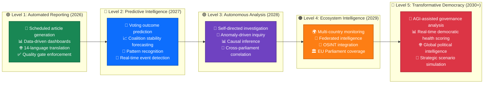

---

## 🏗️ Vision Architecture

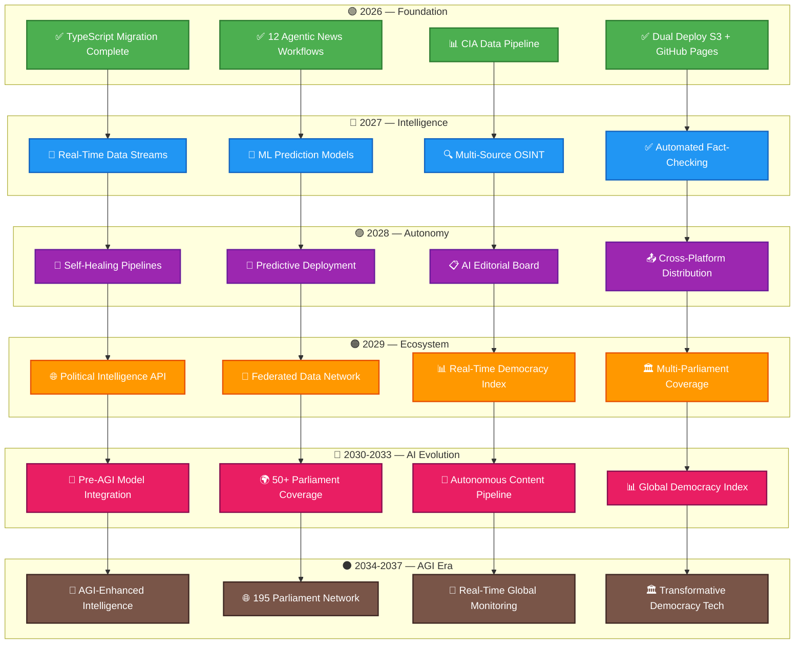

### Current State (2026 Q2)

| Metric | Value |
| --- | --- |
| Total Workflow Files | 50 (22 YAML + 14 agentic `.md` + 14 `.lock.yml`) = **36 distinct workflows** |
| TypeScript Modules | 31 (in `src/browser/`) |
| Unit Tests | 2890 (Vitest) |
| Language Support | 14 languages (incl. RTL) |
| Deployment | Dual: AWS S3/CloudFront + GitHub Pages |
| AI Content | 14 agentic workflows (Claude Opus 4.8) |
| Security Compliance | ISO 27001, NIST CSF 2.0, CIS Controls v8.1 |

---

## ✅ Delivered (2026 Q2): Long-Horizon Forward-Look Pipelines

> **Status:** Delivered via foundation PR + sub-issues [Hack23/riksdagsmonitor#2153](https://github.com/Hack23/riksdagsmonitor/issues/2153)–[#2168](https://github.com/Hack23/riksdagsmonitor/issues/2168).

The long-horizon forward-look system extends the forward-look family (`news-week-ahead`, `news-month-ahead`) with three additional horizons:

| Workflow | Horizon | Depth × | Cron | Status |
|---|---|---|---|---|
| `news-quarter-ahead` | 90 days | × 1.7 | `0 9 1,15 * *` | ✅ Delivered |
| `news-year-ahead` | 365 days | × 2.0 | `0 9 5 1,7 *` | ✅ Delivered |
| `news-election-cycle` | 1 460 days | × 2.5 | dispatch-only (cron declared, disabled) | ✅ Delivered |

**Key design decisions:**
- All three share the Tier-C aggregation contract but with progressively higher depth multipliers
- Additional prompt module: `ext/long-horizon-forecasting.md` (horizon stratification, scenario-tree depth, IMF projection stamps, PESTLE blocking)
- Election-cycle further imports `ext/cycle-rollover.md` (active ±30 days of election anchor)
- Full pipeline diagrams and ISMS mapping documented in [WORKFLOWS.md § Stage 6.2](WORKFLOWS.md#stage-62-long-horizon-forward-look-pipelines-quarter--year--election-cycle)
- Article-type registry metadata: [`analysis/article-types.json`](analysis/article-types.json)
- Editorial parameters: [Article-Generation.md § Forward-Look Horizons](Article-Generation.md)

### 🔮 Aspirational Long-Horizon Extensions (Future — No Script Edits Required)

The registry-driven architecture means the following article types can be added by simply registering them in `analysis/article-types.json` and creating a new workflow `.md` source — no script changes to `aggregate-analysis.ts` or `render-articles.ts`:

| Future Workflow | Horizon | Use Case | Dependency |
|---|---|---|---|
| `news-budget-bill-ahead` | 90–180 days | BP (Budgetproposition) + VP (Vårproposition) deep-dive | Budget committee schedule feed |
| `news-eu-presidency-ahead` | 180 days | Swedish EU Council presidency rotation impact | European Parliament MCP integration |
| `news-defence-pivot-ahead` | 365 days | Defence spending reallocation (NATO 2% target) | IMF GFS_COFOG G02 + FöU committee data |
| `news-climate-policy-ahead` | 365 days | Environmental policy trajectory + EU Green Deal | SCB environment data + EU ETS pricing |

---

## 🔬 Visionary: Per-Workflow Unique Analytics Evolution

The future of Riksdagsmonitor's agentic workflows is **deep specialisation** — each workflow producing analytics that are impossible with any other data source or analysis path.

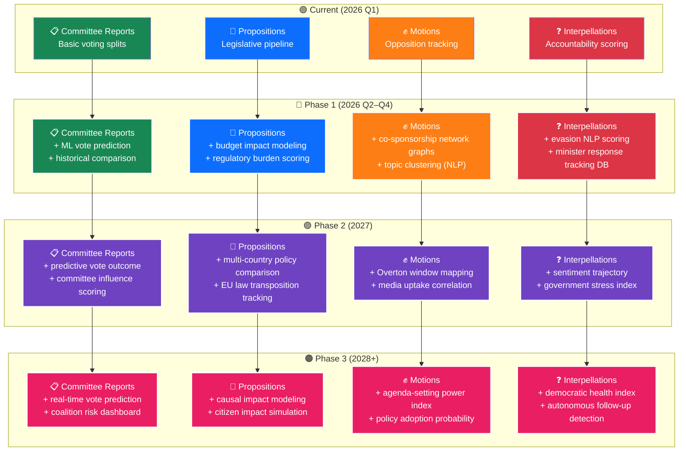

### Future Unique Analytics per Article Type

| Workflow | Current Unique Analytics | Phase 1 Enhancement | Phase 2 Vision | Phase 3 Autonomous |
|----------|------------------------|--------------------|--------------|--------------------|
| **Committee Reports** | Voting splits, reservation analysis | ML vote prediction from committee composition + historical voting patterns | Committee influence scoring: which committees shape policy most effectively? | Real-time vote prediction dashboard during live plenary sessions |
| **Propositions** | Legislative pipeline tracking | Budget impact modeling using SCB economic data + World Bank benchmarks | Multi-country policy comparison (Nordic council + EU) | Causal impact simulation: "if this bill passes, what happens to X?" |
| **Motions** | Opposition strategy analysis | NLP-based topic clustering + co-sponsorship network visualisation | Overton window mapping: how opposition motions shift the political debate | Policy adoption probability: ML model predicting which motions become policy |
| **Interpellations** | Accountability scoring | NLP evasion scoring (did the minister actually answer?) + response tracking DB | Government stress index: aggregated ministerial pressure metric | Autonomous follow-up detection: AI identifies when promised action hasn't occurred |
| **Evening Analysis** | Daily parliamentary pulse | Multi-source synthesis (Riksdag + Regeringen + SCB same-day) | Automated "story of the day" narrative generation | Self-prioritising: AI identifies the most important event and leads with it |
| **Realtime Monitor** | Breaking event detection | Predictive urgency scoring (ML-trained on past breaking events) | Cross-source verification (Riksdag + news wire + social media) | Autonomous alert system with configurable severity thresholds |
| **Weekly Review** | Week-over-week trends | Trend significance testing (is this week different or noise?) | Predictive weekly preview: "next week we expect X because Y" | Self-correcting: compares last week's predictions with actual outcomes |
| **Month Ahead** | Strategic calendar | Calendar risk modeling (which events have historically caused volatility?) | EU legislative calendar integration for Swedish implementation deadlines | Autonomous scenario planning: generates 3 political futures per key event |

---

## 🟢 Phase 1: Enhanced Foundation (2026 Q2–Q4)

### 1.1 🔊 CIA Data Pipeline Activation

**Priority:** Critical
**Status:** Placeholder implemented, fetch logic pending

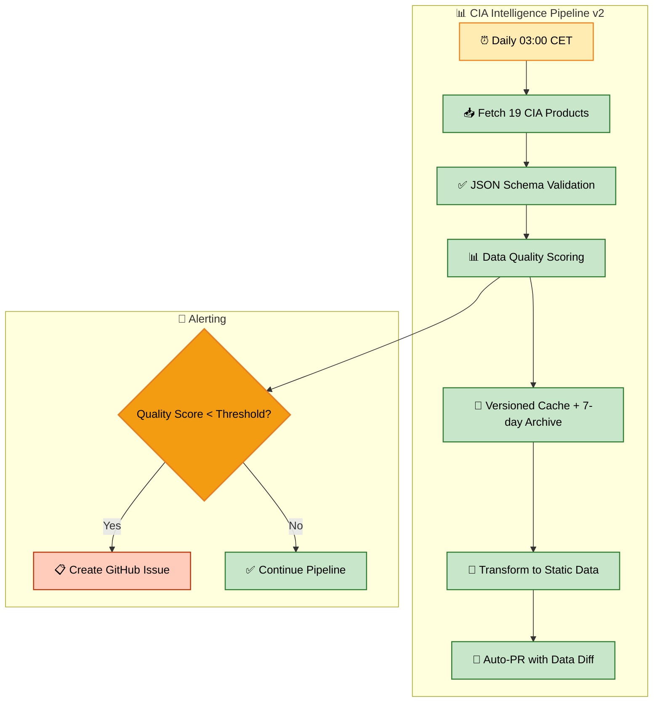

### 1.2 🧪 Comprehensive E2E Test Suite

**Priority:** High

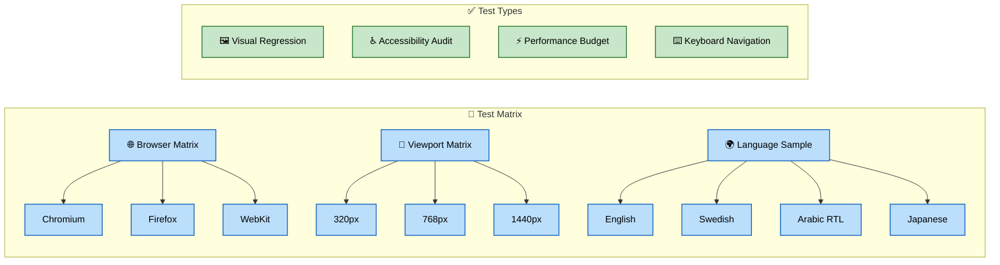

### 1.3 🔄 Preview Deployments

**Priority:** Medium — Deploy PR previews to S3 preview bucket (`pr-{number}.preview.riksdagsmonitor.com`)

### 1.4 📦 Automated Dependency Updates

**Priority:** Medium — Weekly automated dependency management with auto-PR for minor/patch updates

---

## 🔵 Phase 2: Intelligence Layer (2027)

### 2.1 📡 Real-Time Political Data Streams

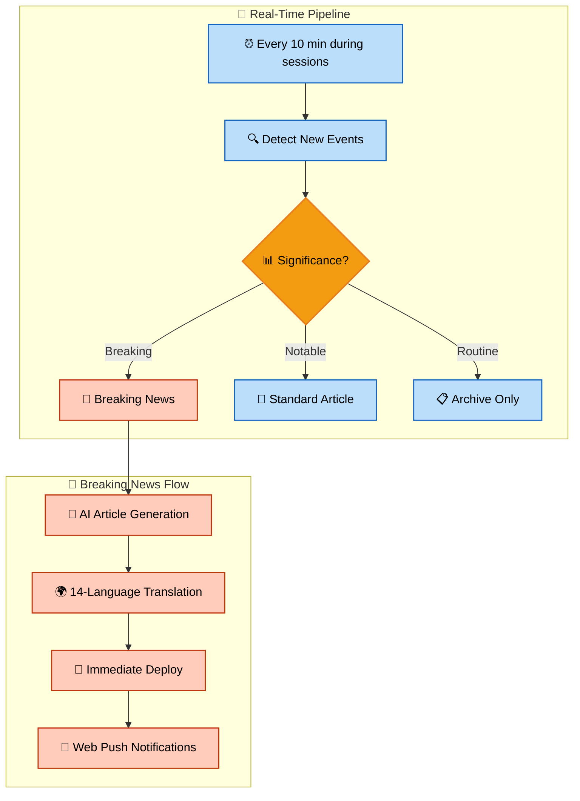

### 2.2 🧠 ML-Powered Prediction Pipeline

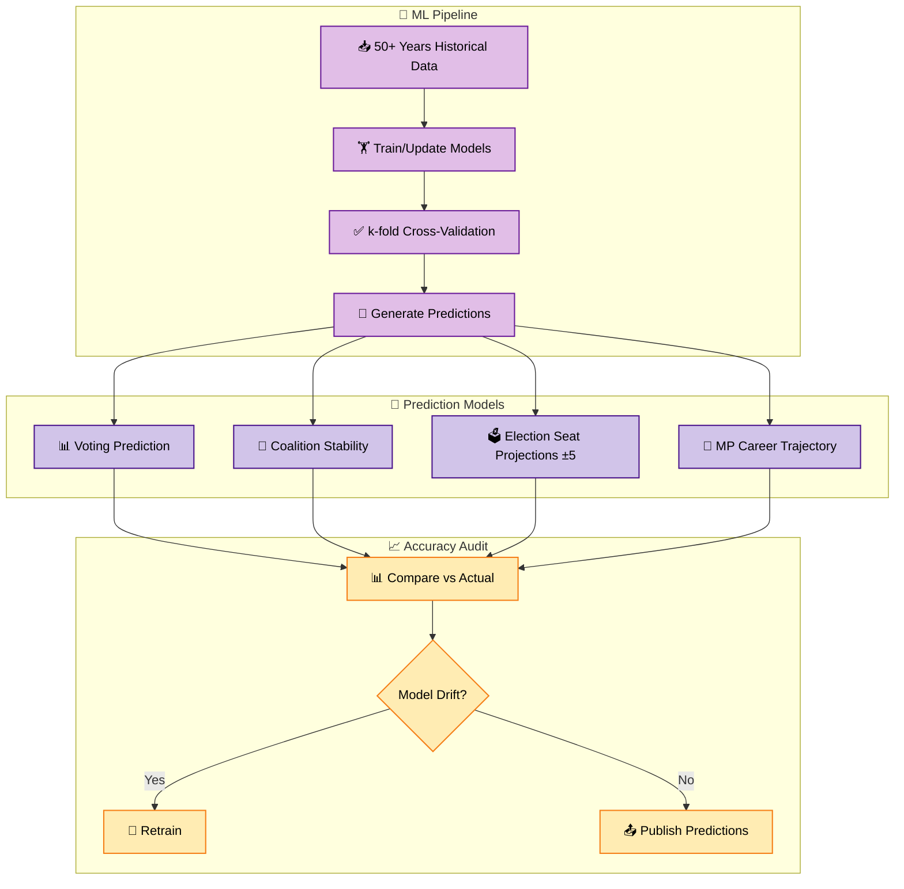

### 2.3 🔍 Multi-Source OSINT Pipeline

**Sources:** riksdag-open-data-api, government-press-releases, committee-calendar, european-parliament-api, nordic-council-data, public-register-data

### 2.4 ✅ Automated Fact-Checking

**Process:** Extract claims → cross-reference against Riksdag voting records, government publications, SCB statistics → assign confidence scores → flag unverifiable claims for human review

---

## 🟣 Phase 3: Autonomous Operations (2028)

### 3.1 🔧 Self-Healing Infrastructure

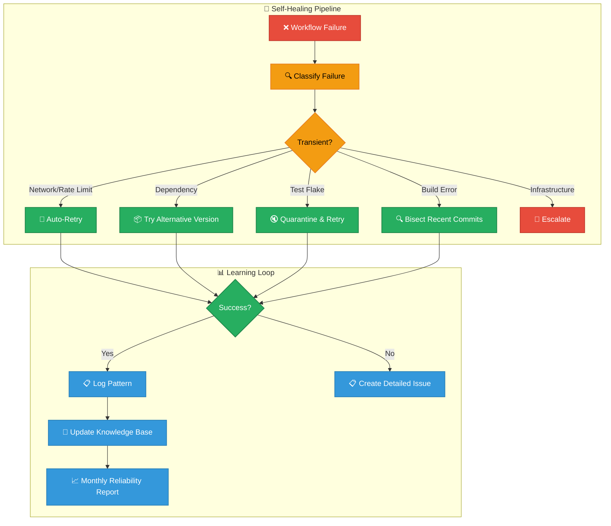

### 3.2 🚀 Canary Deployments

**Process:** Deploy to canary (5% traffic) → Monitor 30 min (error rate < 0.1%, LCP < 2.5s) → Progressive rollout (25% → 50% → 100%) → If degraded: automatic rollback + incident report

### 3.3 📋 AI Editorial Board

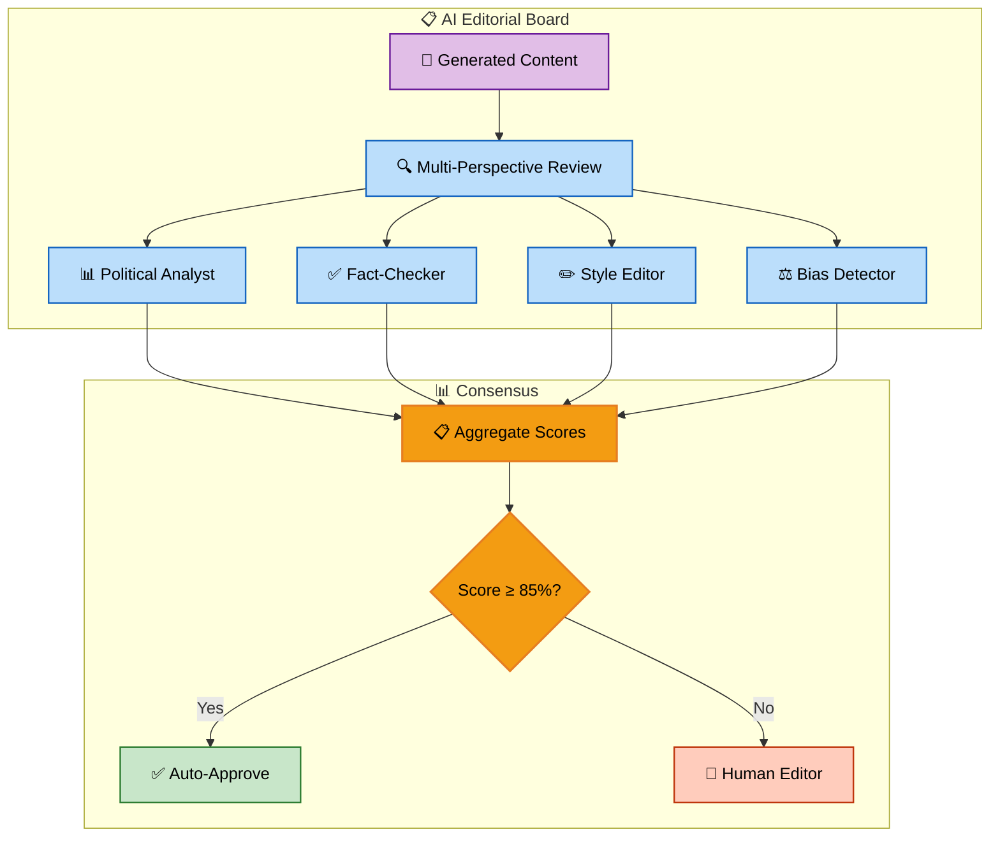

### 3.4 📤 Multi-Platform Content Distribution

**Platforms:** Website (HTML + Schema.org), RSS (Atom feed), Newsletter (MJML email), Social Media (platform-specific excerpts), API (JSON endpoint)

---

## 🟠 Phase 4: Ecosystem (2029)

### 4.1 🌐 Political Intelligence API

```mermaid
flowchart LR
    subgraph "🌐 API Endpoints"
        API[Political Intelligence API v1]
        API --> MPs[/api/v1/mps]
        API --> Votes[/api/v1/votes]
        API --> Predictions[/api/v1/predictions]
        API --> Network[/api/v1/network]
        API --> Timeline[/api/v1/timeline]
        API --> Risk[/api/v1/risk-assessment]
    end

    subgraph "👥 Consumers"
        MPs & Votes & Predictions --> Researchers[🎓 Researchers]
        Network & Timeline --> Journalists[📰 Journalists]
        Risk --> CivicTech[💻 Civic Tech]
    end

    classDef api fill:#3498db,stroke:#2980b9,stroke-width:1.5px,color:white
    classDef endpoint fill:#bbdefb,stroke:#1565c0,stroke-width:1.5px,color:black
    classDef consumer fill:#c8e6c9,stroke:#2e7d32,stroke-width:1.5px,color:black

    class API api
    class MPs,Votes,Predictions,Network,Timeline,Risk endpoint
    class Researchers,Journalists,CivicTech consumer
```

**Features:** Rate limiting (100 req/min free, 1000 req/min API key), GraphQL endpoint, WebSocket for real-time updates, OpenAPI 3.1, SDK generation (TypeScript, Python, R)

### 4.2 🏛️ Multi-Parliament Coverage

**Target Parliaments:** Swedish Riksdag (349 MPs), European Parliament (MEPs), Nordic Council, Finnish Eduskunta, Danish Folketing, Norwegian Storting

### 4.3 📊 Real-Time Democracy Health Index

**Metrics:** Transparency (debate coverage, document accessibility, FOI response times), Participation (voter turnout, public consultation), Accountability (voting discipline, minister responses), Pluralism (media diversity, opposition effectiveness)

### 4.4 🤝 Federated Intelligence Network

**Architecture:** IPFS for decentralized data, ActivityPub for inter-platform communication, shared political ontology, privacy-preserving analytics, GDPR-compliant cross-border data sharing

---

## 🔴 Phase 5: AI Evolution & Global Scale (2030–2033)

### 5.1 🤖 Pre-AGI Model Integration

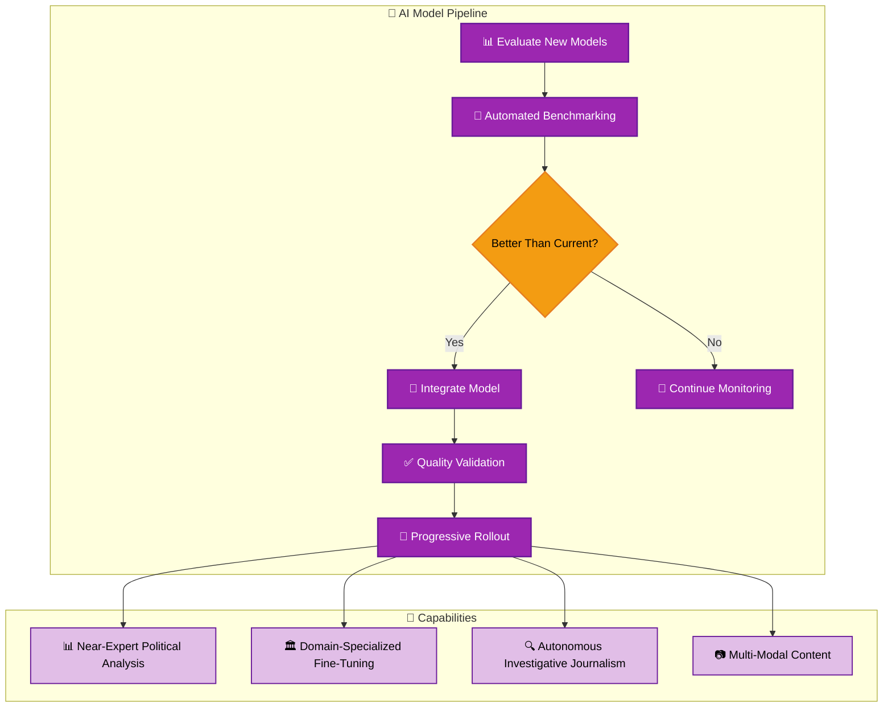

### 5.2 🌍 Global Parliament Coverage

**Target:** 50+ parliaments across Europe, Americas, and Asia-Pacific with cross-parliament schema normalization and multi-timezone content scheduling

### 5.3 📰 Autonomous Content Pipeline

**Target:** < 5% human review required — AI editorial quality score > 95%, fact verification accuracy > 99%, multi-modal content in 50+ languages

---

## ⚫ Phase 6: AGI Era & Transformative Democracy (2034–2037)

### 6.1 🧠 AGI-Enhanced Intelligence

**Strategic Considerations:**
- 🤖 **Autonomous analysis**: AGI-powered real-time political intelligence across all 195 parliamentary systems
- 🌐 **Universal language support**: Every UN language supported natively
- 📊 **Predictive governance**: Policy impact prediction before legislation is proposed
- ⚖️ **Ethical AI governance**: Human oversight maintained regardless of AI capability level
- 🛡️ **Democratic safeguards**: Platform architecture prevents weaponization or manipulation

### 6.2 📈 AI Model Evolution Strategy

| Year | Total Workflows | AI Model | Key Capability |
| --- | --- | --- | --- |
| 2026 | 47–50 | Opus 4.8–4.9 | Agentic news generation |
| 2027 | 50–55 | Opus 5.x | Predictive analytics |
| 2028 | 55–65 | Opus 6.x | Multi-modal content |
| 2029 | 65–75 | Opus 7.x | Autonomous pipeline |
| 2030 | 75–85 | Opus 8.x | Near-expert analysis |
| 2031–2033 | 85–100 | Opus 9–10.x / Pre-AGI | Global coverage |
| 2034–2037 | 100–120+ | AGI / Post-AGI | Transformative platform |

---

## 🛰️ Political-Intelligence Workflow Suite (OSINT/INTOP, to 2037)

> **Master catalog:** these workflows operationalise [`FUTURE_MINDMAP.md` §Political-Intelligence Capability Catalog](FUTURE_MINDMAP.md#-theme--political-intelligence-capability-catalog-to-2037--the-master-osintintop-map) and the architecture in [`FUTURE_ARCHITECTURE.md` §4A](FUTURE_ARCHITECTURE.md#4a-️-political-intelligence-capability-architecture-osintintop-to-2037). The phase roadmap above is platform-centric; this section is **tradecraft-centric** — it names the *new intelligence workflows* an operative needs and the gh-aw / Step-Functions pipelines that deliver them, all on **public data** with human-in-the-loop sign-off.

### The intelligence cycle as a workflow chain

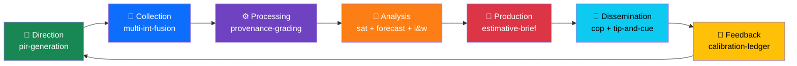

### New intelligence workflows by horizon

| Workflow (proposed) | Capability (catalog ref) | Horizon | Trigger | Output product |
|---------------------|--------------------------|:------:|---------|----------------|
| `intel-entity-resolution` | C1 cross-source entity resolution | 🔵 v2.0 | weekly + on new MP/registry data | resolved-actor graph (static) |
| `intel-conflict-screen` | C3 declared-interest vs vote | 🔵 v2.0 | on votering publish | neutral conflict-screen scorecard |
| `intel-influence-network` | C19 power-broker analytics | 🔵 v2.0 | weekly | influence/brokerage graph |
| `intel-narrative-tracker` | C18 framing lifecycle | 🔵 v2.0 | daily | narrative-evolution timeline |
| `intel-sat-orchestrator` | C12 SAT automation (ACH/KAC/premortem) | 🔵→🟣 | per analysis run | ICD 203-graded SAT bundle |
| `intel-multi-int-fusion` | C6 fusion mesh | 🟣 v3.0 | streaming | fused situational graph |
| `intel-provenance-gate` | C8/C9 provenance + deepfake | 🟣 v3.0 | on every evidence intake | refuse-to-cite gate verdict |
| `intel-forecast-calibrate` | C13/C29 calibrated forecasting | 🟣 v3.0 | nightly + on event | forecast + Brier-scored calibration |
| `intel-warning-tripwire` | C14 I&W tripwires | 🟣 v3.0 | continuous (EventBridge) | confidence-scored warnings |
| `intel-fimi-watch` | C20 FIMI/CIB detection | 🟣 v3.0 | continuous | foreign-interference alert |
| `intel-wargame-sim` | C16 agent-based wargaming | 🟣→🌟 | on coalition/budget event | scenario-tree with probabilities |
| `intel-daily-brief` | C23 autonomous Daily Brief | 🟣 v3.0 | 06:00 daily | PDB-style brief (14 langs) |
| `intel-estimative` | C22 NIE-style key judgments | 🟣 v3.0 | on standing PIR | confidence-scored estimate |
| `intel-cop-stream` | C21 Common Operating Picture | 🟣→🌟 | streaming | live COP dashboard feed |
| `intel-democracy-index` | C27 democracy-health index | 🌟 2032+ | weekly | neutral composite barometer |
| `intel-neutrality-audit` | C30 bias-symmetry auditor | 🔵 (all) | pre-publish gate | party-symmetry pass/fail |
| `intel-redteam` | C31 pipeline red-team | 🟣 v3.0 | scheduled | adversarial findings |
| `intel-counter-ai-guard` | C32 counter-AI integrity | 🟣 v3.0 | per inference | injection/poison verdict |

### Maturity model — intelligence-cycle overlay

The platform maturity levels (above) gain an explicit **intelligence-cycle** reading:

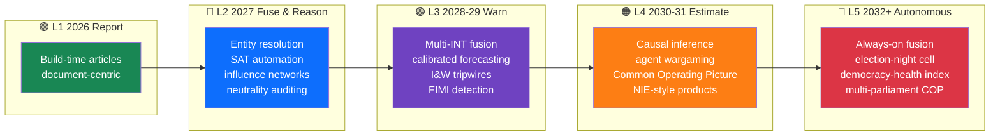

**Governance rails (every intelligence workflow).** Public sources only; provenance + Admiralty grade on intake; ICD 203 analytic-integrity scoring; party-neutrality gate before publish; calibrated, documented uncertainty; counter-AI guard on every inference; and a **human signs every externally visible judgment** per the [Hack23 AI Policy](https://github.com/Hack23/ISMS-PUBLIC/blob/main/AI_Policy.md). No workflow may take a partisan action, profile a citizen, or publish an unverified claim.

---

## 📈 Technology Evolution Roadmap

### Build & Runtime

| Year | Node.js | TypeScript | Bundler | Test Runner |
| --- | --- | --- | --- | --- |
| 2026 Q1 | 25 (Current) | 6.0 | Vite 8 | Vitest 4 |
| 2026 Q2 | **26** (Current, upgraded Apr 2026 ✅; LTS later 2026) | 6.0 | Vite 8 | Vitest 4 |
| 2027 | 27 LTS | 7.x | Vite 8 | Vitest 5 |
| 2028 | 28 LTS | 7.x | Vite 9 / Turbopack | Vitest 6 |
| 2029 | 29 LTS | 8.x | Next-gen bundler | Native test runner |

### Infrastructure

| Year | Deploy | CDN | Monitoring |
| --- | --- | --- | --- |
| 2026 | S3/CloudFront + GitHub Pages | CloudFront | Uptime + Lighthouse |
| 2027 | + Preview envs + canary | CloudFront + Cloudflare | + Real user metrics |
| 2028 | Zero-downtime + auto-rollback | Edge compute | + ML anomaly detection |
| 2029 | Global edge deployment | Distributed CDN mesh | Self-healing observability |

---

## 📊 Workflow Count Projection

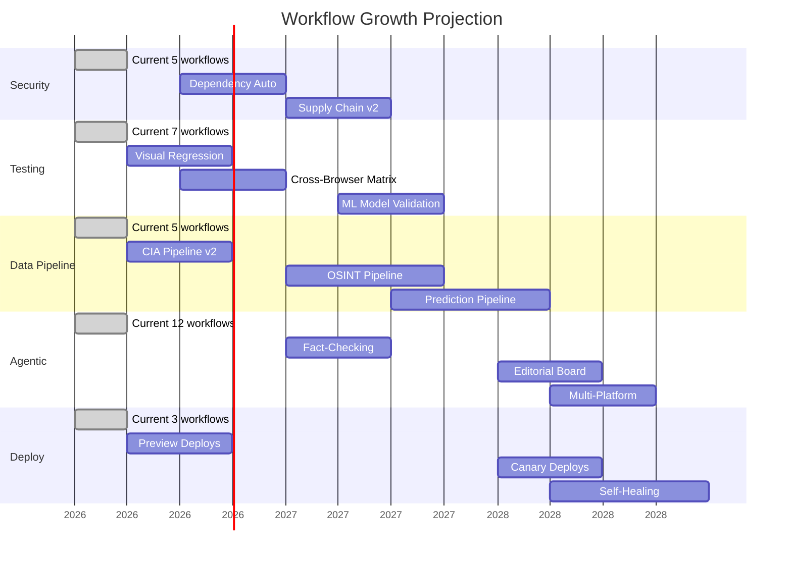

| Year | Projected Distinct Workflows | New Capabilities |
| --- | --- | --- |
| 2026 Q1 | **32** (43 files) | TypeScript foundation, 11 agentic workflows |
| 2026 Q2 | **33** (44 files) | **Node.js 26 Current upgrade** ✅ (Apr 2026); nightly compat check added |
| 2026 Q4 | **39** (50 files) | CIA pipeline v2, preview deploys, visual regression |
| 2027 Q4 | **44** (55 files) | Node.js 27 LTS, OSINT pipeline, ML predictions, real-time streams |
| 2028 Q4 | **54** (65 files) | Node.js 28 LTS, self-healing, canary deploy, AI editorial board |
| 2029 Q4 | **64+** (75+ files) | Node.js 29 LTS, intelligence API, multi-parliament, federation |

---

## 🔒 ISMS Evolution

### Security Automation Growth

| Capability | 2026 | 2027 | 2028 | 2029 |
| --- | --- | --- | --- | --- |
| 📌 SHA Pinning | ✅ Manual | ✅ Auto-update | ✅ Auto + verify | ✅ Self-managing |
| 📄 SBOM | ✅ Per-release | ✅ Per-commit | ✅ Real-time | ✅ Federated |
| 🔍 Vulnerability Scan | ✅ CodeQL + Dependabot | + SAST/DAST | + Fuzzing | + AI-assisted |
| 📋 Compliance Check | ✅ Manual mapping | Auto-mapping | Continuous | Predictive |
| 🚨 Incident Response | ✅ Auto-issue | + Auto-diagnose | + Auto-remediate | + Self-healing |
| 🛡️ Threat Model | ✅ STRIDE manual | + Auto-update | + Real-time | + Predictive |

### Projected Compliance Frameworks

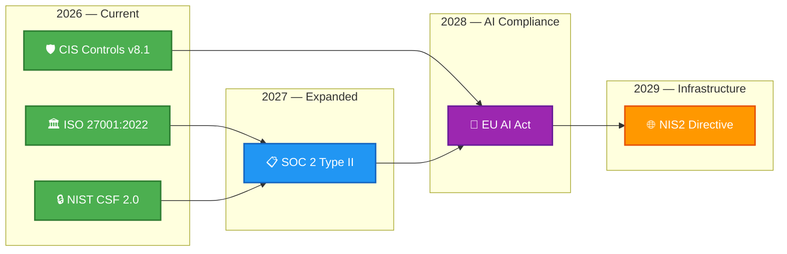

---

## ⚠️ Key Risks & Mitigations

| Risk | Impact | Likelihood | Mitigation |
| --- | --- | --- | --- |
| 🤖 AI model hallucination in news content | High | Medium | Multi-agent fact-checking, human-in-the-loop for breaking news |
| 📊 ML prediction model bias | High | Medium | Regular bias audits, diverse training data, transparency reports |
| 🌐 API rate limiting by data sources | Medium | High | Caching, fallback to cached data, multiple source redundancy |
| 💰 GitHub Actions cost scaling | Medium | Medium | Self-hosted runners for heavy workloads, workflow optimization |
| 🔗 Supply chain attacks on MCP servers | High | Low | Version pinning, SRI checks, egress monitoring |
| 🔒 GDPR compliance for ML models | High | Medium | Privacy-by-design, differential privacy, data minimization |

---

## ✅ Success Metrics

### Short-term (2026)
- [ ] CIA data pipeline fully operational (19 products daily)
- [ ] Preview deployments for all PRs
- [ ] Visual regression testing in CI
- [ ] Automated dependency updates
- [ ] Workflow run time < 3 minutes average

### Medium-term (2027–2028)
- [ ] Real-time political data processing (< 10 minute latency)
- [ ] ML prediction accuracy > 80% for voting outcomes
- [ ] Zero-downtime deployments with automatic rollback
- [ ] Self-healing pipeline success rate > 95%
- [ ] Multi-platform content distribution (5+ channels)

### Long-term (2029–2037)
- [ ] Public political intelligence API serving 1000+ consumers
- [ ] Multi-parliament coverage (5+ Nordic/EU parliaments)
- [ ] Democracy health index with international comparisons
- [ ] Fully autonomous content pipeline (human review < 10% of articles)
- [ ] Federated data network with 10+ partner platforms

### Visionary (2030–2037)
- [ ] Pre-AGI model integration with autonomous evaluation pipeline
- [ ] 50+ parliament coverage with real-time cross-parliament analysis
- [ ] < 5% human review required for standard political articles
- [ ] Global real-time democracy health index covering 195 parliaments
- [ ] AGI-ready architecture with maintained human oversight and democratic safeguards

---

## 🌐 Future Workflow Ecosystem Vision

```mermaid
graph TB
    subgraph "🌍 Data Sources (2027+)"
        RD["🏛️ Riksdag"]
        EU["🇪🇺 EU Parliament"]
        NORDIC["🏔️ Nordic Parliaments"]
        OSINT["📡 Open Source Intel"]
        SOCIAL["📱 Social Media"]
        MEDIA["📺 News Feeds"]
    end

    subgraph "🧠 AI Intelligence Core (2028+)"
        NLP["🔤 Advanced NLP<br/><i>Multi-language understanding</i>"]
        ML["📊 ML Prediction<br/><i>Voting & coalition models</i>"]
        CAUSAL["🔗 Causal Inference<br/><i>Policy impact chains</i>"]
        ANOMALY["🚨 Anomaly Detection<br/><i>Democratic deviation alerts</i>"]
    end

    subgraph "📰 Content Generation (2029+)"
        REALTIME["⚡ Real-Time Articles<br/><i>< 5 min latency</i>"]
        DEEP["🔬 Deep Analysis<br/><i>Multi-parliament</i>"]
        PREDICT["🔮 Predictive Reports<br/><i>Scenario modeling</i>"]
        INDEX["📊 Democracy Index<br/><i>Health scoring</i>"]
    end

    subgraph "🌐 Distribution (2029+)"
        WEB["🌐 Web Platform"]
        API["🔌 Public API"]
        FEED["📡 Data Feeds"]
        PARTNER["🤝 Partner Network"]
    end

    RD & EU & NORDIC & OSINT & SOCIAL & MEDIA --> NLP & ML & CAUSAL & ANOMALY
    NLP & ML & CAUSAL & ANOMALY --> REALTIME & DEEP & PREDICT & INDEX
    REALTIME & DEEP & PREDICT & INDEX --> WEB & API & FEED & PARTNER

    style RD fill:#0d6efd,color:#fff,stroke:#0a58ca,stroke-width:2px
    style EU fill:#0d6efd,color:#fff,stroke:#0a58ca,stroke-width:2px
    style NORDIC fill:#0d6efd,color:#fff,stroke:#0a58ca,stroke-width:2px
    style OSINT fill:#6f42c1,color:#fff,stroke:#59359a,stroke-width:2px
    style SOCIAL fill:#6f42c1,color:#fff,stroke:#59359a,stroke-width:2px
    style MEDIA fill:#6f42c1,color:#fff,stroke:#59359a,stroke-width:2px
    style NLP fill:#198754,color:#fff,stroke:#146c43,stroke-width:2px
    style ML fill:#198754,color:#fff,stroke:#146c43,stroke-width:2px
    style CAUSAL fill:#198754,color:#fff,stroke:#146c43,stroke-width:2px
    style ANOMALY fill:#198754,color:#fff,stroke:#146c43,stroke-width:2px
    style REALTIME fill:#fd7e14,color:#fff,stroke:#ca6510,stroke-width:2px
    style DEEP fill:#fd7e14,color:#fff,stroke:#ca6510,stroke-width:2px
    style PREDICT fill:#fd7e14,color:#fff,stroke:#ca6510,stroke-width:2px
    style INDEX fill:#fd7e14,color:#fff,stroke:#ca6510,stroke-width:2px
    style WEB fill:#dc3545,color:#fff,stroke:#b02a37,stroke-width:2px
    style API fill:#dc3545,color:#fff,stroke:#b02a37,stroke-width:2px
    style FEED fill:#dc3545,color:#fff,stroke:#b02a37,stroke-width:2px
    style PARTNER fill:#dc3545,color:#fff,stroke:#b02a37,stroke-width:2px
```

---

## 📚 References

- [WORKFLOWS.md](WORKFLOWS.md) — Current workflow documentation
- [ARCHITECTURE.md](ARCHITECTURE.md) — System architecture
- [FUTURE_ARCHITECTURE.md](FUTURE_ARCHITECTURE.md) — Architecture roadmap
- [FUTURE_SECURITY_ARCHITECTURE.md](FUTURE_SECURITY_ARCHITECTURE.md) — Security evolution
- [AGENTS.md](AGENTS.md) — Custom agent reference (14 persona agents + 9 workflow-specialist `.agent.md` + `developer.instructions.md` = 24 files)
- [SKILLS.md](SKILLS.md) — Skill definitions (91 skills)
- [Hack23 ISMS-PUBLIC](https://github.com/Hack23/ISMS-PUBLIC) — ISMS policies
- [Secure Development Policy](https://github.com/Hack23/ISMS-PUBLIC/blob/main/Secure_Development_Policy.md) — Development security standards

---

**📋 Document Owner:** CEO | **📄 Version:** 6.0 | **📅 Last Updated:** 2026-05-02 (UTC)
**🔄 Review Cycle:** Annual | **⏰ Next Review:** 2027-05-02
**🏢 Classification:** Public | **🏛️ Owner:** Hack23 AB (Org.nr 5595347807)


---

## 🌐 Evolving the Current IMF Workflow Integration toward Future CI/CD

*Baseline: the **already-implemented** per-workflow IMF dataflow is documented in [`WORKFLOWS.md`](WORKFLOWS.md) §IMF. The table below shows how that current integration evolves with additional CI gates (precedence-contract test, provider-mix telemetry alarm) on top of today's pipeline.*

> **Authoritative hub:** [`analysis/imf/README.md`](analysis/imf/README.md) · [`analysis/imf/agentic-integration.md`](analysis/imf/agentic-integration.md) · [`analysis/imf/indicators-inventory.json`](analysis/imf/indicators-inventory.json) · [`analysis/imf/data-dictionary.md`](analysis/imf/data-dictionary.md) · [`.github/aw/ECONOMIC_DATA_CONTRACT.md`](.github/aw/ECONOMIC_DATA_CONTRACT.md)

### IMF integration evolving from today's pipeline into the 2027–2030 autonomous-agent workflows

| Workflow stage | IMF dataflow | Cadence | Caching strategy |
|---|---|---|---|
| Daily news (`news-*.md`) | WEO + FM + IFS + GFS_COFOG | On-demand per article | Vintage-tagged Aurora cache |
| Week-ahead forecasting | WEO projections + DOTS | Weekly | 7-day rolling cache |
| Month-ahead forecasting | WEO + FM + ER | Monthly | 30-day rolling + supersedes-chain |
| Weekly review | WEO + FM + GFS_COFOG (committee-aligned) | Weekly | Snapshot per Riksdag week |
| Monthly review | All IMF dataflows | Monthly | Full vintage capture |
| Real-time monitor | IFS (monthly CPI), MFS_IR (rates), ER (FX) | Hourly | Short-TTL cache |
| Translation cascade (14 lang) | Inherits article provenance | Per article | No re-fetch (provenance preserved) |

### Future CI gate: IMF-first contract enforcement

```yaml
# .github/workflows/quality-checks.yml (target additions)
- name: IMF-first economic citation lint
  run: tsx scripts/article-quality-enhancer.ts --enforce-imf-first

- name: IMF cache integrity (SHA-256 supersedes-chain)
  run: tsx scripts/imf-fetch.ts --verify-cache

- name: Provider-mix telemetry (alarm if WB economic share > 5%)
  run: tsx scripts/catalog-downloaded-data.ts --provider-mix-report
```

### Provider decision matrix


| Indicator class | Primary | Secondary | Why |
|---|---|---|---|
| Macro (GDP, growth, unemployment, inflation, fiscal balance, debt, current account) | **IMF WEO + Fiscal Monitor** | SCB (Sweden monthly) | Freshness + T+5 projections; SNA 2008 / GFSM 2014 / BPM6 cross-country comparability |
| Bilateral trade flows | **IMF DOTS** | — | Partner-country dimension, monthly cadence |
| Monthly inflation, policy rates | **IMF IFS / MFS_IR** | SCB / Riksbank | Standardised cross-country |
| Government spending by function (defence/health/education/social protection) | **IMF GFS_COFOG** | — | Committee-aligned (FöU/SoU/UbU/SfU) |
| Commodity prices, exchange rates | **IMF PCPS / ER** | — | Canonical benchmarks |
| Governance (CC.EST, RL.EST, VA.EST, GE.EST, RQ.EST, PV.EST) | **World Bank WGI** | — | IMF has no equivalent |
| Environment (CO2, renewables, forest, water) | **World Bank** | — | IMF has no equivalent |
| Social/education residue (literacy, school participation, gender ratios) | **World Bank** | GFS_COFOG 09 | IMF has no equivalent |
| Defence spending depth (long historicals) | **World Bank MS.MIL.*** | GFS_COFOG 02 | WB deeper history |
| Swedish ground truth (monthly labour, regional, budget execution) | **SCB** | — | National statistics authority |


**Canonical rule.** Every economic claim in a Riksdagsmonitor article cites an IMF dataflow first; World Bank citations are reserved for governance, environment and social residue (the classes IMF does not publish). SCB is the Swedish-specific ground truth layer. See `ECONOMIC_DATA_CONTRACT.md` v2.1 for the banned-phrase list and vintage discipline (>6 mo → annotation).

---

## 🔗 Hack23 Ecosystem

<table>
<tr>
  <th width="33%">🌐 Platforms</th>
  <th width="33%">📦 Open-Source Projects</th>
  <th width="33%">🛡️ Governance &amp; Standards</th>
</tr>
<tr>
<td valign="top">
🗳️ <a href="https://riksdagsmonitor.com">Riksdagsmonitor</a> — Swedish Parliament intelligence<br>
🇪🇺 <a href="https://www.euparliamentmonitor.com">EU Parliament Monitor</a> — European coverage<br>
🕵️ <a href="https://www.hack23.com/cia">Citizen Intelligence Agency</a> — political-data engine<br>
🌐 <a href="https://www.hack23.com">Hack23 AB</a> — corporate site<br>
📰 <a href="https://hack23.com/blog.html">Hack23 Blog</a> — engineering &amp; policy<br>
💼 <a href="https://www.linkedin.com/company/hack23/">Hack23 on LinkedIn</a>
</td>
<td valign="top">
🗳️ <a href="https://github.com/Hack23/riksdagsmonitor">Hack23/riksdagsmonitor</a><br>
🕵️ <a href="https://github.com/Hack23/cia">Hack23/cia</a><br>
🇪🇺 <a href="https://github.com/Hack23/euparliamentmonitor">Hack23/euparliamentmonitor</a><br>
🔌 <a href="https://github.com/Hack23/european-parliament-mcp">Hack23/european-parliament-mcp</a><br>
✅ <a href="https://github.com/Hack23/cia-compliance-manager">Hack23/cia-compliance-manager</a><br>
🥋 <a href="https://github.com/Hack23/black-trigram">Hack23/black-trigram</a><br>
🏠 <a href="https://github.com/Hack23/homepage">Hack23/homepage</a>
</td>
<td valign="top">
🛡️ <a href="https://github.com/Hack23/ISMS-PUBLIC">Hack23 ISMS-PUBLIC</a> — public ISMS<br>
🔒 <a href="https://github.com/Hack23/ISMS-PUBLIC/blob/main/Information_Security_Policy.md">Information Security Policy</a><br>
🤖 <a href="https://github.com/Hack23/ISMS-PUBLIC/blob/main/AI_Policy.md">AI Policy</a><br>
🧪 <a href="https://github.com/Hack23/ISMS-PUBLIC/blob/main/Secure_Development_Policy.md">Secure Development Policy</a><br>
🎯 <a href="https://github.com/Hack23/ISMS-PUBLIC/blob/main/Threat_Modeling.md">Threat Modeling Policy</a><br>
⚠️ <a href="https://github.com/Hack23/ISMS-PUBLIC/blob/main/Vulnerability_Management.md">Vulnerability Management</a><br>
🏷️ <a href="https://github.com/Hack23/ISMS-PUBLIC/blob/main/CLASSIFICATION.md">Classification Framework</a>
</td>
</tr>
</table>

<p align="center">
<a href="https://www.bestpractices.dev/projects/12069"></a>
<a href="https://scorecard.dev/viewer/?uri=github.com/Hack23/riksdagsmonitor"></a>
<a href="https://github.com/Hack23/ISMS-PUBLIC"></a>
<a href="https://github.com/Hack23/ISMS-PUBLIC"></a>
<a href="https://github.com/Hack23/ISMS-PUBLIC"></a>
<a href="https://www.apache.org/licenses/LICENSE-2.0"></a>
</p>

<p align="center"><em>🗳️ Empower citizens · 🔍 Strengthen democratic accountability · 🕵️ Illuminate the political process</em></p>

<p align="center"><sub>© 2008–2026 <a href="https://www.hack23.com">Hack23 AB</a> (Org.nr 559534-7807) · Maintainer: <a href="https://www.linkedin.com/in/jamessorling/">James Pether Sörling, CISSP CISM</a></sub></p>
